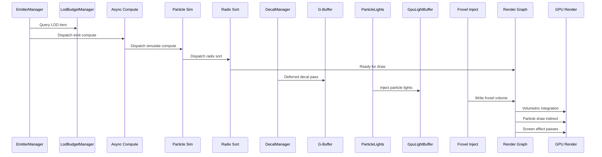

# Rendering ↔ VFX Integration Design

## Systems Involved

| System | Design | Domain |
|--------|--------|--------|
| Rendering | [rendering-core.md](../rendering/rendering-core.md) | GPU pipeline |
| VFX | [effects.md](../vfx/effects.md) | Visual effects |
| Particles | [particles.md](../vfx/particles.md) | GPU particles |

## Integration Requirements

| ID | Requirement | Systems |
|----|-------------|---------|
| IR-3.7.1 | Particle sim dispatches in render graph | VFX, Ren |
| IR-3.7.2 | Particle rendering via indirect draw | VFX, Ren |
| IR-3.7.3 | Froxel volume injection from VFX | VFX, Ren |
| IR-3.7.4 | Decals project onto G-buffer | VFX, Ren |
| IR-3.7.5 | Particle lights inject into light buffer | VFX, Ren |
| IR-3.7.6 | Screen effects as post-process passes | VFX, Ren |
| IR-3.7.7 | VFX LOD uses camera distance | VFX, Ren |

1. **IR-3.7.1** -- GPU particle simulation compute passes (emit, simulate, sub-emit) register in the
   render graph on the async compute queue. The graph compiler inserts barriers between simulation
   writes and rendering reads of particle buffers.
2. **IR-3.7.2** -- `ParticleRenderer` registers sprite, ribbon, and mesh particle passes. GPU radix
   sort orders particles by camera distance for alpha blending. `DrawIndirect` avoids CPU readback.
3. **IR-3.7.3** -- Volumetric fog, weather particles, and dust inject density/scattering into the
   froxel volume used by the clustered lighting system. The VFX compute pass writes to the froxel 3D
   texture before the volumetric integration pass.
4. **IR-3.7.4** -- `DecalManager` renders deferred decals that modify G-buffer albedo, normal, and
   PBR channels. Decals are sorted by priority and projected from depth buffer world positions.
5. **IR-3.7.5** -- `ParticleLightEmitter` injects dynamic point lights from emissive particles into
   `GpuLightBuffer`. Lights are culled and added to the clustered light grid (F-11.1.6).
6. **IR-3.7.6** -- Screen effects (heat haze, shockwave distortion, damage overlay, screen flash)
   register as post-process compute passes in the render graph after the main scene but before
   tonemapping.
7. **IR-3.7.7** -- `EmitterLodComponent` evaluates distance to the active camera. `LodTier`
   transitions (Full, Reduced, Impostor, Culled) scale spawn rate and rendering cost with
   hysteresis.

## Data Contracts

| Type | Defined in | Consumed by | Purpose |
|------|-----------|-------------|---------|
| `GpuParticleBuffer` | VFX | Render graph | Sim buffers |
| `ParticleRenderer` | VFX | Render graph | Draw passes |
| `DecalManager` | VFX | Render graph | G-buf modify |
| `GpuLightBuffer` | Rendering | VFX (lights) | Light inject |
| `ClusterGrid` | Rendering | VFX (lights) | Cluster ref |
| `EffectBudget` | VFX | Rendering | Budget cap |
| `EmitterLodComponent` | VFX | Rendering | LOD tier |
| Froxel 3D texture | Rendering | VFX | Vol fog inject |

```rust
/// Particle render pass registration.
pub struct ParticleRenderPassDesc {
    pub particle_buffer: GpuBufferView,
    pub alive_list: GpuBufferView,
    pub indirect_args: GpuBufferView,
    pub render_mode: RenderMode,
    pub sort_key: SortKey,
    pub blend_mode: BlendMode,
}

/// Froxel injection from VFX volumes.
pub struct FroxelInjection {
    pub density: f32,
    pub scattering: Vec3,
    pub absorption: Vec3,
    pub world_aabb: Aabb,
}
```

## Data Flow



## Timing and Ordering

| System | Phase | Timestep | Order |
|--------|-------|----------|-------|
| EmitterManager | 3-Simulation | Variable | Early |
| LOD evaluation | 3-Simulation | Variable | After camera |
| Budget scaling | 3-Simulation | Variable | After LOD |
| Particle sim | Render (async) | Variable | Compute queue |
| Radix sort | Render (async) | Variable | After sim |
| Decal G-buf pass | Render thread | Variable | After G-buf |
| Froxel injection | Render thread | Variable | Before vol |
| Light injection | Render thread | Variable | Before cluster |
| Particle draw | Render thread | Variable | Transparent |
| Screen effects | Render thread | Variable | Before tonemap |

## Failure Modes

| Failure | Impact | Recovery |
|---------|--------|----------|
| Budget exceeded | Particle pop | Scale spawn rate down |
| Sort buffer OOM | Unsorted alpha | Skip sort, accept error |
| Froxel overflow | Fog clamp | Cap density per voxel |
| Decal atlas full | Missing decals | LRU evict oldest |
| Light inject overflow | Missing lights | Cap at budget max |
| Async compute stall | Frame hitch | Fence timeout fallback |

## Platform Considerations

| Platform | Max particles | Async compute | Froxel |
|----------|-------------|---------------|--------|
| Desktop | 500K | Full overlap | 160x90x64 |
| Console | 200K | Full overlap | 160x90x64 |
| Switch | 50K | Limited | 80x45x32 |
| Mobile | 10K | None (inline) | Disabled |

## Test Plan

See companion [rendering-vfx-test-cases.md](rendering-vfx-test-cases.md).

## Review Feedback

1. [CONFIDENT] The term "async compute queue" (IR-3.7.1) and "Render (async)" in Timing are
   ambiguous given the hard constraint "No async/await in engine runtime." Clarify this refers to
   GPU async compute (a hardware queue), not Rust async/await.

2. [CONFIDENT] Missing `classDiagram` Mermaid diagram. Per `docs/design/CLAUDE.md`, every design
   MUST have a classDiagram covering all types, enums, traits, and relationships.

3. [CONFIDENT] No mention of 2D or 2.5D VFX support. The engine requires first-class 2D/2.5D; the
   design must address how particle rendering, decals, and screen effects operate in orthographic
   and 2.5D projections.

4. [CONFIDENT] No mention of rkyv, zero-copy serialization, or mmap for any data contract types.
   Clarify whether `ParticleRenderPassDesc`, `FroxelInjection`, and the data contract types are
   rkyv-archived or purely transient GPU structs.

5. [CONFIDENT] `FroxelInjection` uses `Vec3` for `scattering` and `absorption`, and `Aabb` for
   `world_aabb`. These types are not defined or sourced. Specify whether they come from a math crate
   or are engine-defined, and ensure they are `#[repr(C)]` for GPU upload compatibility.

6. [CONFIDENT] The VFX graph is specified as "declarative composable effects" but the design never
   references the effect graph, declarative composition, or how render passes are spawned from graph
   evaluation. The integration should show how a VFX graph node triggers render graph pass
   registration.

7. [CONFIDENT] No HashMap/hot-path analysis. Particle light injection (IR-3.7.5) selects the "100
   brightest" from 1000 candidates, and decal sorting by priority (IR-3.7.4) implies a collection
   lookup. Specify the data structures used and confirm no HashMap on hot paths.

8. [CONFIDENT] `GpuBufferView` in `ParticleRenderPassDesc` may wrap a shared reference internally.
   The engine forbids Arc/Rc/Cell/RefCell; confirm this is a generational index or typed handle, not
   a ref-counted wrapper.

9. [CONFIDENT] The Data Contracts table lists `EmitterLodComponent` and `EffectBudget` but neither
   appears in the Rust pseudocode. All data contract types should have struct definitions showing
   their fields.

10. [CONFIDENT] Timing table shows EmitterManager, LOD evaluation, and Budget scaling in Phase
    "3-Simulation" but does not specify which thread owns these. Per the three-thread model, clarify
    whether these run on worker threads or the main thread.

11. [CONFIDENT] Companion test cases have no benchmarks for IR-3.7.6 (screen effects) or IR-3.7.7
    (LOD evaluation). Every IR should have at least one benchmark target.

12. [CONFIDENT] No test cases cover failure modes. The design lists six failure scenarios (budget
    exceeded, sort OOM, froxel overflow, decal atlas full, light overflow, async compute stall) but
    no companion test case exercises any of them.

13. [CONFIDENT] The Froxel 3D texture in the Data Contracts table shows "Defined in: Rendering,
    Consumed by: VFX" but IR-3.7.3 says VFX writes to the froxel texture. The producer/consumer
    direction appears inverted; VFX produces density data and Rendering consumes it.

14. [UNCERTAIN] Platform Considerations lists "Mobile: Async compute = None (inline)" and "Froxel =
    Disabled." If froxels are disabled on mobile, IR-3.7.3 is partially unsatisfied on that
    platform. Document whether fog volumes degrade to a simpler technique or are simply absent.

15. [CONFIDENT] The design references `F-11.1.6` in IR-3.7.5 but does not include a Requirements
    Trace table mapping IRs back to source requirements and features. Add a trace table per the
    design template.

16. [CONFIDENT] Missing sections per `docs/design/CLAUDE.md`: Requirements Trace, Overview,
    Architecture, API Design, and Open Questions. While integration designs use a lighter template,
    the design rules require these sections for every design file.

17. [UNCERTAIN] `SortKey` and `BlendMode` enums are used in `ParticleRenderPassDesc` but never
    defined. Show their variants in the Rust pseudocode or reference the design where they are
    defined.

18. [CONFIDENT] The sequence diagram does not show the RenderFrame snapshot boundary (Phase 7)
    separating simulation-thread data from render-thread data. Per the three-thread model, all data
    crossing from workers to the render thread must be snapshotted; show this handoff explicitly.
