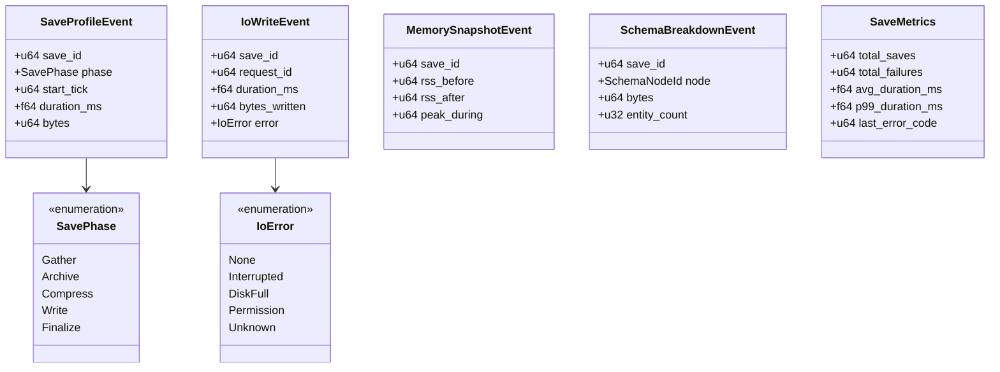
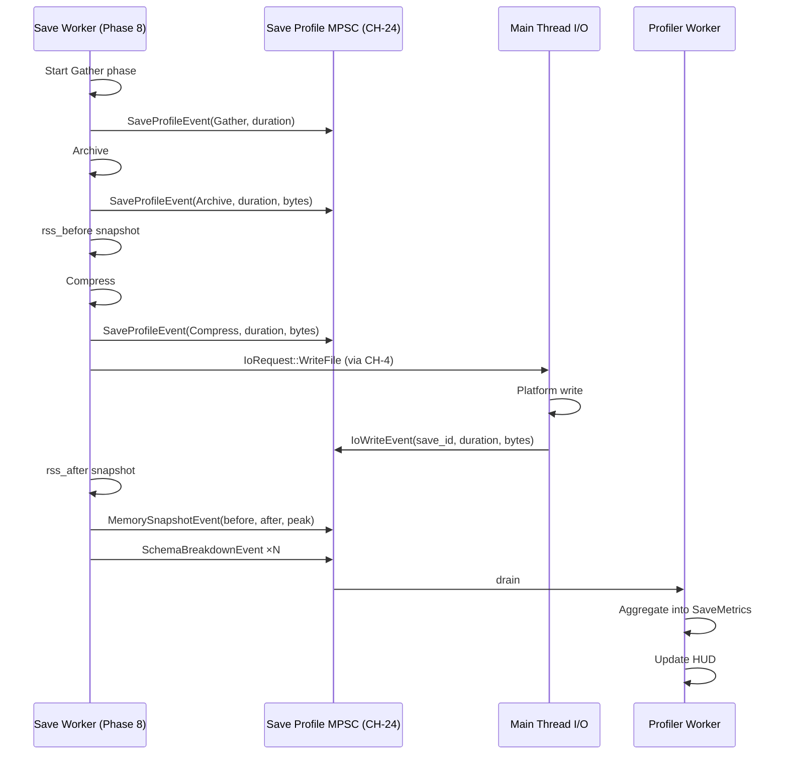

# Save System ↔ Profiler Integration Design

## Systems Involved

| System | Design | Domain |
|--------|--------|--------|
| Save System | [save-system.md](../game-framework/save-system.md) | Game Framework |
| Profiler | [profiler.md](../tools/profiler.md) | Tools |

See [shared-conventions.md](shared-conventions.md) and
[shared-messaging-capacities.md](shared-messaging-capacities.md).

## Integration Requirements

| ID | Requirement | Systems |
|----|-------------|---------|
| IR-8.1.1 | Save serialize cost tracked per phase | Save, Profiler |
| IR-8.1.2 | Write I/O time reported | Save, Profiler |
| IR-8.1.3 | Memory snapshot during save | Save, Profiler |
| IR-8.1.4 | Phase-8 budget accounting for saves | Save, Profiler |
| IR-8.1.5 | Error and warning counters | Save, Profiler |
| IR-8.1.6 | Per-schema size breakdown | Save, Profiler |

1. **IR-8.1.1** -- Each save step (gather, archive, compress, write) emits a `SaveProfileEvent` with
   phase id, duration, and byte count. The profiler aggregates.
2. **IR-8.1.2** -- When the main thread completes the write I/O (platform I/O drain), it emits an
   `IoWriteEvent` that the profiler correlates with the save id by request id.
3. **IR-8.1.3** -- The save system snapshots resident memory (working set) before and after archive
   construction and emits `MemorySnapshotEvent` with both values. Profiler renders in the HUD.
4. **IR-8.1.4** -- Phase 8 total (0.5 ms budget per high-level.md) includes save queue work. The
   profiler sums `SaveProfileEvent.duration` per frame and flags budget breaches.
5. **IR-8.1.5** -- Each save success / failure increments counters in `SaveMetrics`; the profiler
   HUD displays rolling averages and error rates.
6. **IR-8.1.6** -- The archive walk emits `SchemaBreakdownEvent` per top-level subtree (player,
   world, ai,...) with byte count. Profiler shows a sunburst in the HUD.

## Data Contracts

| Type | Defined in | Consumed by | Purpose |
|------|-----------|-------------|---------|
| `SaveProfileEvent` | Save | Profiler | Per-phase timing |
| `SavePhase` | Save | Profiler | Phase id enum |
| `IoWriteEvent` | Core I/O | Profiler | Write duration |
| `MemorySnapshotEvent` | Save | Profiler | RSS snapshot |
| `SchemaBreakdownEvent` | Save | Profiler | Per-subtree bytes |
| `SaveMetrics` | Save | Profiler | Rolling counters |
| `SaveProfileCh` | Save | Workers | MPSC `CH-24` |

## Class Diagram

## Data Flow

## Timing and Ordering

| System | Phase | Timestep | Order |
|--------|-------|----------|-------|
| Save gather | 8 Frame End | Variable | 1st |
| Save archive | 8 Frame End | Variable | 2nd |
| Save compress | 8 Frame End | Variable | 3rd (or fire-and-forget) |
| Save write request | 8 Frame End | Variable | 4th |
| Main I/O drain | Main loop | -- | async wrt frame |
| Profiler aggregation | 8 Frame End | Variable | last |

Save operations are fire-and-forget from the game loop's perspective: the game loop enqueues an
`IoRequest::WriteFile` via `CH-4` and immediately continues. Profiler events correlate via `save_id`
across frame boundaries.

## Thread Ownership

| Data / system | Owning thread | QoS / pin | Handoff |
|---------------|---------------|-----------|---------|
| `SaveMetrics` | Profiler worker | user-initiated | Read by HUD renderer |
| `SaveProfileCh` | Worker -> Worker | user-initiated | `CH-24` cap=32 DropOldest |
| `SaveMetricsRing` | Profiler worker | user-initiated | Fixed-size history ring |
| `SchemaBreakdownCache` | Profiler worker | user-initiated | `SortedVecMap` by node id |

1. **`SaveMetrics` uses `DashMap` only if multiple workers concurrently write**, per SC-13. In
   practice a single profiler worker owns the aggregation.
2. **Per-schema totals use `SortedVecMap<SchemaNodeId, u64>`** (SC-2 compliance).
3. **rkyv is the save format** (SC-5); the profiler never writes save-format files, only metrics.

## Fallback Modes

| ID | Trigger | Policy | Recovery | Side effects |
|----|---------|--------|----------|-------------|
| FM-1 | `CH-24` full | DropOldest | Channel drains | Missing event in HUD |
| FM-2 | RSS snapshot syscall fails | Use last known value | Next frame | Stale mem reading |
| FM-3 | I/O write error | Record in `IoWriteEvent.error` | Retry (save system) | Error banner |
| FM-4 | Profiler off | Skip emission entirely | `set_profiler_enabled(true)` | No data |
| FM-5 | `save_id` correlation miss | Orphaned event logged | New save | Sunburst missing slice |

Profiler is always runtime-toggleable (SC-10) via `DebugFlags::show_profiler_hud`.

## Performance Budget

Cross-reference [/docs/design/performance-budget.md](../performance-budget.md). Phase 8 total is 0.5
ms per high-level.md.

| Pair subsystem | Phase | Budget | Source |
|----------------|-------|--------|--------|
| Save archive | 8 Frame End | 0.3 ms | Save slice |
| Save compress | 8 Frame End | 0.1 ms | Save slice |
| Save profile event emission | 8 Frame End | 0.01 ms | Profiler slice |
| Profiler aggregation | 8 Frame End | 0.05 ms | Profiler slice |
| RSS snapshot (per save) | 8 Frame End | 0.01 ms | Profiler slice |

Write I/O runs on the main thread outside the game loop phase budget; its duration is reported but
not accounted against Phase 8. A write that exceeds 8 ms is flagged in the HUD as a warning.

## Test Plan

See companion [save-system-profiler-test-cases.md](save-system-profiler-test-cases.md).

## Open Questions

| # | Question | Owner |
|---|----------|-------|
| 1 | RSS source: platform API or rkyv arena? | Platform services |
| 2 | Sunburst node depth limit? | Profiler |
| 3 | Should IoWriteEvent carry compression ratio? | Save |
