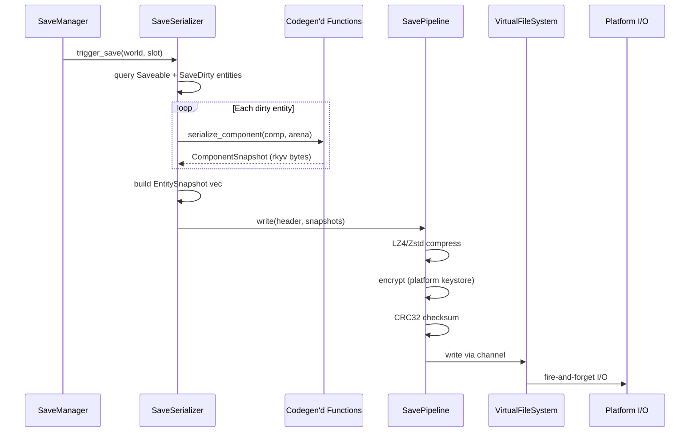

# Save System ↔ Serialization Integration Design

## Systems Involved

| System | Design | Domain |
|--------|--------|--------|
| Save System | [save-system.md](../game-framework/save-system.md) | Game Framework |
| Serialization | [reflection-serialization.md](../core-runtime/reflection-serialization.md) | Core Runtime |

## Integration Requirements

| ID | Requirement | Systems |
|----|-------------|---------|
| IR-5.10.1 | rkyv serialize Saveable-marked components | Save, Serialization |
| IR-5.10.2 | Zero-copy mmap load of save files | Save, Serialization |
| IR-5.10.3 | Schema versioning with migration chain | Save, Serialization |
| IR-5.10.4 | Incremental dirty-entity saves via SaveDirty | Save, Serialization |
| IR-5.10.5 | Codegen produces serialize/deserialize fns | Save, Serialization |
| IR-5.10.6 | Save pipeline: compress + encrypt + checksum | Save, Serialization |
| IR-5.10.7 | Entity ID remapping on load | Save, Serialization |

## Data Contracts

| Type | Defined in | Consumed by | Purpose |
|------|-----------|-------------|---------|
| `Saveable` | Save System | Codegen | Component marker |
| `SaveDirty` | Save System | SaveSerializer | Dirty tick tracking |
| `EntitySnapshot` | Save System | Serialization | Per-entity blob |
| `ComponentSnapshot` | Save System | Serialization | Per-component rkyv |
| `SchemaVersion` | Save System | Migration | Version tag |
| `MigrationRegistry` | Save System | Serialization | Migration chain |
| `SaveFileHeader` | Save System | Serialization | File envelope |
| `SavePipeline` | Save System | Platform I/O | Compress + encrypt |

```rust
/// Codegen template: the codegen pipeline produces a
/// concrete monomorphized function per Saveable type
/// in the middleman .dylib. This is NOT a runtime-
/// generic function; each T gets its own entry point.
/// No runtime reflection, no TypeRegistry.
///
/// Uses rkyv's AllocSerializer<256> (matches the
/// parent reflection-serialization.md API).
pub fn serialize_component<T: Saveable>(
    component: &T,
) -> Result<ComponentSnapshot, SaveError>
where
    T: rkyv::Serialize<
        rkyv::ser::serializers::AllocSerializer<256>,
    >,
{
    let bytes = rkyv::to_bytes::<_, 256>(component)
        .map_err(|e| SaveError::SerializationFailed {
            entity: 0,
            type_hash: T::TYPE_HASH,
            detail: e.to_string(),
        })?;
    Ok(ComponentSnapshot {
        type_hash: T::TYPE_HASH,
        schema_version: T::SCHEMA_VERSION,
        data: bytes.into_boxed_slice(),
    })
}

/// Codegen template: concrete monomorphized per
/// Saveable type. Uses rkyv::check_archived_root
/// for zero-copy validation, then Deserialize
/// with rkyv::Infallible (no arena needed).
pub fn deserialize_component<T: Saveable>(
    snapshot: &ComponentSnapshot,
) -> Result<T, LoadError>
where
    T: rkyv::Archive,
    T::Archived: for<'a> rkyv::CheckBytes<
        rkyv::validation::validators::
            DefaultValidator<'a>,
    > + rkyv::Deserialize<T, rkyv::Infallible>,
{
    let archived = rkyv::check_archived_root::<T>(
        &snapshot.data,
    ).map_err(|_| LoadError::DeserializationFailed {
        detail: "archive validation failed".into(),
    })?;
    archived.deserialize(&mut rkyv::Infallible)
        .map_err(|e| {
            LoadError::DeserializationFailed {
                detail: e.to_string(),
            }
        })
}

/// Full save flow: query dirty entities, serialize
/// each Saveable component, write through pipeline.
///
/// Header and payload are serialized as separate
/// rkyv archives (header at fixed offset, payload
/// after) so the header can be accessed zero-copy
/// without deserializing the full payload.
///
/// Arena buffer ownership: the serialized bytes are
/// copied into a channel-owned allocation before
/// submission to the VFS write job. The arena is
/// freed immediately after the copy completes.
pub fn save_world(
    world: &World,
    slot: SlotId,
    config: &SaveConfig,
    vfs: &VirtualFileSystem,
    arena: &mut Arena,
) -> Result<(), SaveError> {
    let snapshots = collect_entity_snapshots(
        world, arena,
    );
    let header = build_header(config);
    // Serialize header and payload as separate
    // rkyv archives for independent zero-copy
    // access on load.
    let header_bytes =
        rkyv::to_bytes::<_, 256>(&header)?;
    let payload_bytes =
        rkyv::to_bytes::<_, 256>(&snapshots)?;
    let mut bytes = Vec::with_capacity(
        8 + header_bytes.len() + payload_bytes.len(),
    );
    bytes.extend_from_slice(
        &(header_bytes.len() as u64).to_le_bytes(),
    );
    bytes.extend_from_slice(&header_bytes);
    bytes.extend_from_slice(&payload_bytes);
    let compressed = compress(&bytes, config)?;
    let encrypted = encrypt(&compressed, config)?;
    // Copy encrypted bytes into a channel-owned
    // Box<[u8]>; arena is freed after this point.
    let owned = encrypted.into_boxed_slice();
    vfs.write_fire_and_forget(
        slot.path(), owned, Priority::Low,
    );
    Ok(())
}

/// Full load flow: mmap file, parse header zero-
/// copy, validate checksum, decrypt, decompress,
/// run migration chain, remap entity IDs,
/// deserialize components into World.
///
/// Fallback paths:
/// - Checksum mismatch: reject file, try backup
///   slot via SaveSlotManager::fallback_slot().
/// - Decryption failure: emit LoadError, caller
///   may prompt user or try backup slot.
/// - Migration failure: emit LoadError with step
///   detail; original file is not modified.
/// - Entity ID collision: remap via stable_id
///   table (always applied, not a fallback).
pub fn load_world(
    slot: SlotId,
    world: &mut World,
    config: &SaveConfig,
    vfs: &VirtualFileSystem,
    migration: &MigrationRegistry,
    arena: &mut Arena,
) -> Result<(), LoadError> {
    // 1. Mmap the save file (zero-copy).
    let mapped = vfs.mmap_read(slot.path())?;
    let data = mapped.as_slice();
    // 2. Read header length prefix (8 bytes LE).
    let header_len = u64::from_le_bytes(
        data[..8].try_into().map_err(|_| {
            LoadError::InvalidHeader
        })?,
    ) as usize;
    // 3. Access header archive zero-copy.
    let header = rkyv::check_archived_root::<
        SaveFileHeader,
    >(&data[8..8 + header_len])
        .map_err(|_| LoadError::InvalidHeader)?;
    // 4. Validate CRC-32 checksum.
    let payload_start = 8 + header_len;
    let payload = &data[payload_start..];
    validate_checksum(payload, header.checksum)?;
    // 5. Decrypt payload.
    let decrypted = decrypt(
        payload, header, config,
    )?;
    // 6. Decompress payload.
    let decompressed = decompress(
        &decrypted, header.compression,
    )?;
    // 7. Run migration chain if schema differs.
    let migrated = if migration.needs_migration(
        header.schema_version.into(),
        config.current_schema,
    ) {
        migration.migrate_all(
            &decompressed,
            &header.component_versions,
            config.current_schema,
        )?
    } else {
        decompressed
    };
    // 8. Deserialize entity snapshots.
    let snapshots = rkyv::check_archived_root::<
        Vec<EntitySnapshot>,
    >(&migrated)
        .map_err(|_| {
            LoadError::DeserializationFailed {
                detail: "payload validation".into(),
            }
        })?;
    // 9. Remap entity IDs and insert into World.
    remap_and_insert(snapshots, world, arena)?;
    Ok(())
}
```

## Data Flow



## Timing and Ordering

| System | Game loop phase | Timestep | Ordering |
|--------|----------------|----------|----------|
| Autosave timer | Phase 8 FrameEnd | Variable | Check interval |
| SaveSerializer | Phase 8 FrameEnd | Variable | Serialize entities |
| SavePipeline | Phase 8 FrameEnd | Variable | Compress + encrypt |
| Platform I/O | Main thread | Async | Fire-and-forget write |

Save serialization runs at Phase 8 (FrameEnd) on the worker thread. The compressed/encrypted buffer
is submitted to the main thread via crossbeam-channel for fire-and-forget platform-native I/O. The
game loop does not stall waiting for the write to complete.

## Failure Modes

| Failure | Impact | Recovery |
|---------|--------|----------|
| Serialization panic | Save aborted | Catch unwind, emit SaveFailed |
| Schema mismatch on load | Cannot deserialize | Run migration chain |
| Migration step fails | Load aborted | Emit LoadError::MigrationFailed |
| Checksum mismatch | Corrupted file | Reject file, try backup slot |
| I/O write failure | Save lost | Retry; keep previous slot intact |
| Arena overflow | Allocation failure | Grow arena; retry serialization |
| Entity ID collision on load | Duplicate entities | Remap via stable_id table |

## Platform Considerations

| Platform | I/O mechanism | Encryption keystore |
|----------|--------------|---------------------|
| Windows | IOCP | DPAPI |
| macOS/iOS | GCD dispatch_io | Keychain |
| Linux | io_uring | libsecret |
| Consoles | Platform SDK | Hardware-bound |

Save file I/O uses platform-native async mechanisms. Encryption keys are sourced from the platform
keystore (never embedded in the binary). The save file format is identical across platforms; only
the I/O transport and key source differ.

## Test Plan

See companion [save-system-serialization-test-cases.md](save-system-serialization-test-cases.md).

## Review Feedback

1. [CONFIDENT] `rkyv::to_bytes` does not accept a `&BumpArena` parameter. The rkyv API uses
   `AllocSerializer<N>` (as shown in the parent `reflection-serialization.md` design). Replace the
   arena parameter with the correct rkyv serializer type.

2. [CONFIDENT] `deserialize_component` calls `archived.deserialize(arena)` but rkyv's `Deserialize`
   trait requires a `&mut dyn Fallible` (e.g., `Infallible` or `SharedDeserializeMap`), not a
   `&BumpArena`. The deserialization pseudocode should match the rkyv API.

3. [CONFIDENT] The `serialize_component` function is declared as a free generic function
   (`pub fn serialize_component<T: Saveable>`), but per the codegen constraint, each Saveable type
   gets a concrete monomorphized function generated in the middleman .dylib -- the design should
   clarify that this is the codegen template, not a runtime-generic function.

4. [CONFIDENT] The Failure Modes table lists "Serialization panic / Catch unwind" as a recovery
   strategy, but `catch_unwind` is not mentioned in the parent save-system design and is generally
   discouraged in safe Rust. The design should specify a `Result`-based error path instead.

5. [CONFIDENT] IR-5.10.2 requires "Zero-copy mmap load of save files" but the Data Contracts
   pseudocode only shows `rkyv::to_bytes` (copy) for serialization and `rkyv::check_archived_root`
   (zero-copy) for deserialization. There is no `load_world` pseudocode showing the mmap-based load
   path with `access_archived`, which is the more critical zero-copy path.

6. [CONFIDENT] The design does not mention 2D/2.5D save support. Per constraints, the engine must
   support 2D, 2.5D, and 3D games. `Transform2D` components should be addressed as Saveable
   alongside 3D `Transform`.

7. [CONFIDENT] The Data Flow sequence diagram does not show the load path at all. Only the save flow
   is diagrammed. A load sequence (mmap, validate checksum, decrypt, decompress, migrate, remap
   entity IDs, deserialize into World) should be included.

8. [UNCERTAIN] The `save_world` function serializes a tuple `(header, snapshots)` via
   `rkyv::to_bytes`. It is unclear whether rkyv can efficiently archive a heterogeneous tuple
   containing a `SaveFileHeader` and a `Vec<EntitySnapshot>` in a way that permits zero-copy access
   to the header without deserializing the full payload.

9. [CONFIDENT] The Timing and Ordering table labels Platform I/O as "Async" in the Timestep column,
   but the engine forbids async/await. This should say "Fire-and-forget" or "Non-blocking" to avoid
   implying the use of async runtime primitives.

10. [CONFIDENT] The Platform Considerations prose states "Save file I/O uses platform-native async
    mechanisms." The word "async" here is ambiguous given the hard constraint against async/await.
    Reword to "platform-native non-blocking I/O" for clarity.

11. [CONFIDENT] The companion test cases are missing a test for the load path end-to-end (mmap file,
    decrypt, decompress, migrate, remap, reconstruct World). Individual steps are tested but there
    is no full load round-trip integration test.

12. [CONFIDENT] No test case covers arena overflow recovery (listed in Failure Modes as "Grow arena;
    retry serialization"). A test should verify the retry-after-grow behavior.

13. [CONFIDENT] No test case covers the I/O write failure retry path (Failure Modes: "Retry; keep
    previous slot intact"). This needs a test confirming the previous save slot remains valid after
    a write failure.

14. [UNCERTAIN] The design shows `vfs.write_fire_and_forget(slot.path(), encrypted, Priority::Low)`
    which transfers ownership of the encrypted buffer to VFS. If the buffer was allocated from a
    `BumpArena`, its lifetime is tied to the arena. Clarify whether the buffer is copied into a
    channel-owned allocation or whether the arena persists until I/O completes.

15. [CONFIDENT] The design lacks an explicit IR for cloud save integration even though F-13.3.5
    (Cloud save sync with platform-native APIs) exists in the parent save-system design. Cloud save
    sync likely has serialization integration concerns (e.g., platform-specific metadata, conflict
    resolution).

16. [CONFIDENT] The companion test cases do not include any benchmark or test for
    encryption/decryption performance, despite encryption being part of the critical save pipeline
    (IR-5.10.6).
