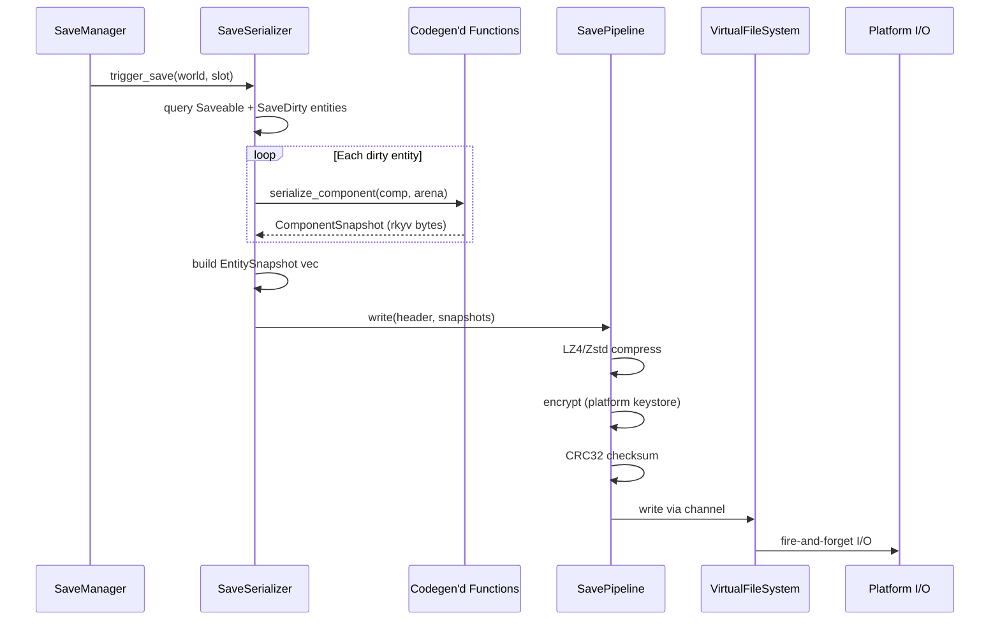

# Save System ↔ Serialization Integration Design

## Systems Involved

| System | Design | Domain |
|--------|--------|--------|
| Save System | [save-system.md](../game-framework/save-system.md) | Game Framework |
| Serialization | [reflection-serialization.md](../core-runtime/reflection-serialization.md) | Core Runtime |

## Integration Requirements

| ID | Requirement | Systems |
|----|-------------|---------|
| IR-5.10.1 | rkyv serialize Saveable-marked components | Save, Serialization |
| IR-5.10.2 | Zero-copy mmap load of save files | Save, Serialization |
| IR-5.10.3 | Schema versioning with migration chain | Save, Serialization |
| IR-5.10.4 | Incremental dirty-entity saves via SaveDirty | Save, Serialization |
| IR-5.10.5 | Codegen produces serialize/deserialize fns | Save, Serialization |
| IR-5.10.6 | Save pipeline: compress + encrypt + checksum | Save, Serialization |
| IR-5.10.7 | Entity ID remapping on load | Save, Serialization |

## Data Contracts

| Type | Defined in | Consumed by | Purpose |
|------|-----------|-------------|---------|
| `Saveable` | Save System | Codegen | Component marker |
| `SaveDirty` | Save System | SaveSerializer | Dirty tick tracking |
| `EntitySnapshot` | Save System | Serialization | Per-entity blob |
| `ComponentSnapshot` | Save System | Serialization | Per-component rkyv |
| `SchemaVersion` | Save System | Migration | Version tag |
| `MigrationRegistry` | Save System | Serialization | Migration chain |
| `SaveFileHeader` | Save System | Serialization | File envelope |
| `SavePipeline` | Save System | Platform I/O | Compress + encrypt |

```rust
/// Codegen produces these functions in the
/// middleman .dylib for every Saveable component.
/// No runtime reflection, no TypeRegistry.
pub fn serialize_component<T: Saveable>(
    component: &T,
    arena: &BumpArena,
) -> ComponentSnapshot {
    ComponentSnapshot {
        type_hash: T::TYPE_HASH,
        schema_version: T::SCHEMA_VERSION,
        data: rkyv::to_bytes::<T>(component, arena),
    }
}

pub fn deserialize_component<T: Saveable>(
    snapshot: &ComponentSnapshot,
    arena: &BumpArena,
) -> Result<T, LoadError> {
    let archived = rkyv::check_archived_root::<T>(
        &snapshot.data,
    )?;
    Ok(archived.deserialize(arena)?)
}

/// Full save flow: query dirty entities, serialize
/// each Saveable component, write through pipeline.
pub fn save_world(
    world: &World,
    slot: SlotId,
    config: &SaveConfig,
    vfs: &VirtualFileSystem,
    arena: &BumpArena,
) -> Result<(), SaveError> {
    let snapshots = collect_entity_snapshots(
        world, arena,
    );
    let header = build_header(config);
    let bytes = rkyv::to_bytes(&(header, snapshots),
        arena)?;
    let compressed = compress(bytes, config)?;
    let encrypted = encrypt(compressed, config)?;
    vfs.write_fire_and_forget(
        slot.path(), encrypted, Priority::Low,
    );
    Ok(())
}
```

## Data Flow



## Timing and Ordering

| System | Game loop phase | Timestep | Ordering |
|--------|----------------|----------|----------|
| Autosave timer | Phase 8 FrameEnd | Variable | Check interval |
| SaveSerializer | Phase 8 FrameEnd | Variable | Serialize entities |
| SavePipeline | Phase 8 FrameEnd | Variable | Compress + encrypt |
| Platform I/O | Main thread | Async | Fire-and-forget write |

Save serialization runs at Phase 8 (FrameEnd) on the worker thread. The compressed/encrypted buffer
is submitted to the main thread via crossbeam-channel for fire-and-forget platform-native I/O. The
game loop does not stall waiting for the write to complete.

## Failure Modes

| Failure | Impact | Recovery |
|---------|--------|----------|
| Serialization panic | Save aborted | Catch unwind, emit SaveFailed |
| Schema mismatch on load | Cannot deserialize | Run migration chain |
| Migration step fails | Load aborted | Emit LoadError::MigrationFailed |
| Checksum mismatch | Corrupted file | Reject file, try backup slot |
| I/O write failure | Save lost | Retry; keep previous slot intact |
| Arena overflow | Allocation failure | Grow arena; retry serialization |
| Entity ID collision on load | Duplicate entities | Remap via stable_id table |

## Platform Considerations

| Platform | I/O mechanism | Encryption keystore |
|----------|--------------|---------------------|
| Windows | IOCP | DPAPI |
| macOS/iOS | GCD dispatch_io | Keychain |
| Linux | io_uring | libsecret |
| Consoles | Platform SDK | Hardware-bound |

Save file I/O uses platform-native async mechanisms. Encryption keys are sourced from the platform
keystore (never embedded in the binary). The save file format is identical across platforms; only
the I/O transport and key source differ.

## Test Plan

See companion [save-system-serialization-test-cases.md](save-system-serialization-test-cases.md).
