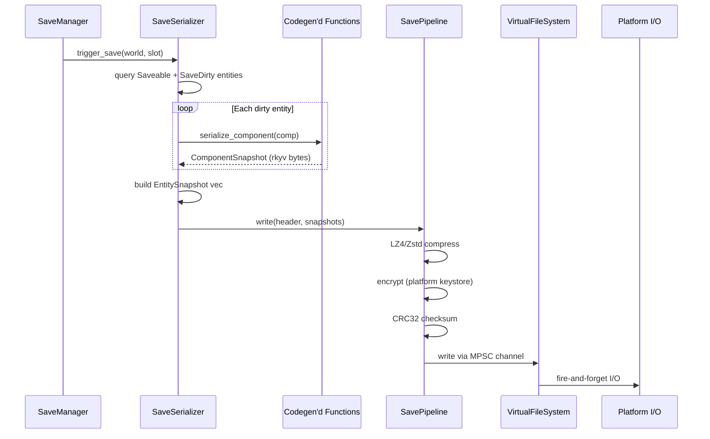
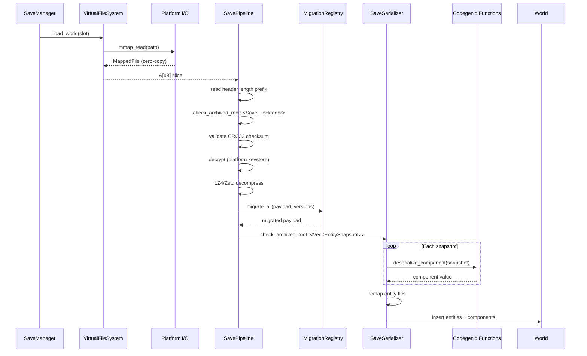

# Save System ↔ Serialization Integration Design

> **Compliance.** This document follows the cross-cutting conventions in
> [shared-conventions.md](shared-conventions.md) (SC-1..SC-14) and the channel-capacity formula
> in [shared-messaging-capacities.md](shared-messaging-capacities.md). Deviations: none.

## Systems Involved

| System | Design | Domain |
|--------|--------|--------|
| Save System | [save-system.md](../game-framework/save-system.md) | Game Framework |
| Serialization | [reflection-serialization.md](../core-runtime/reflection-serialization.md) | Core Runtime |

## Integration Requirements

| ID | Requirement | Systems |
|----|-------------|---------|
| IR-5.10.1 | rkyv serialize Saveable-marked components | Save, Serialization |
| IR-5.10.2 | Zero-copy mmap load of save files | Save, Serialization |
| IR-5.10.3 | Schema versioning with migration chain | Save, Serialization |
| IR-5.10.4 | Incremental dirty-entity saves via SaveDirty | Save, Serialization |
| IR-5.10.5 | Codegen produces serialize/deserialize fns | Save, Serialization |
| IR-5.10.6 | Save pipeline: compress + encrypt + checksum | Save, Serialization |
| IR-5.10.7 | Entity ID remapping on load | Save, Serialization |
| IR-5.10.8 | Cloud save sync with conflict resolution | Save, Serialization |

## Data Contracts

| Type | Defined in | Consumed by | Purpose |
|------|-----------|-------------|---------|
| `Saveable` | Save System | Codegen | Component marker |
| `SaveDirty` | Save System | SaveSerializer | Dirty tick tracking |
| `EntitySnapshot` | Save System | Serialization | Per-entity blob |
| `ComponentSnapshot` | Save System | Serialization | Per-component rkyv |
| `SchemaVersion` | Save System | Migration | Version tag |
| `MigrationRegistry` | Save System | Serialization | Migration chain |
| `SaveFileHeader` | Save System | Serialization | File envelope |
| `SavePipeline` | Save System | Platform I/O | Compress + encrypt |

```rust
/// Codegen template: the codegen pipeline produces a
/// concrete monomorphized function per Saveable type
/// in the middleman .dylib. This is NOT a runtime-
/// generic function; each T gets its own entry point.
/// No runtime reflection, no TypeRegistry.
///
/// Uses rkyv's AllocSerializer<256> (matches the
/// parent reflection-serialization.md API).
pub fn serialize_component<T: Saveable>(
    component: &T,
) -> Result<ComponentSnapshot, SaveError>
where
    T: rkyv::Serialize<
        rkyv::ser::serializers::AllocSerializer<256>,
    >,
{
    let bytes = rkyv::to_bytes::<_, 256>(component)
        .map_err(|e| SaveError::SerializationFailed {
            entity: 0,
            type_hash: T::TYPE_HASH,
            detail: e.to_string(),
        })?;
    Ok(ComponentSnapshot {
        type_hash: T::TYPE_HASH,
        schema_version: T::SCHEMA_VERSION,
        data: bytes.into_boxed_slice(),
    })
}

/// Codegen template: concrete monomorphized per
/// Saveable type. Uses rkyv::check_archived_root
/// for zero-copy validation, then Deserialize
/// with rkyv::Infallible (no arena needed).
pub fn deserialize_component<T: Saveable>(
    snapshot: &ComponentSnapshot,
) -> Result<T, LoadError>
where
    T: rkyv::Archive,
    T::Archived: for<'a> rkyv::CheckBytes<
        rkyv::validation::validators::
            DefaultValidator<'a>,
    > + rkyv::Deserialize<T, rkyv::Infallible>,
{
    let archived = rkyv::check_archived_root::<T>(
        &snapshot.data,
    ).map_err(|_| LoadError::DeserializationFailed {
        detail: "archive validation failed".into(),
    })?;
    archived.deserialize(&mut rkyv::Infallible)
        .map_err(|e| {
            LoadError::DeserializationFailed {
                detail: e.to_string(),
            }
        })
}

/// Full save flow: query dirty entities, serialize
/// each Saveable component, write through pipeline.
///
/// The file layout is a struct, NOT a tuple: an 8-
/// byte little-endian header length prefix, then a
/// separately-archived rkyv `SaveFileHeader`, then
/// a separately-archived rkyv `Vec<EntitySnapshot>`
/// payload. Two independent archives let the header
/// be accessed zero-copy without deserializing the
/// full payload (rkyv cannot give zero-copy field
/// offsets inside a single heterogeneous tuple).
///
/// Arena buffer ownership: the serialized bytes are
/// copied into a channel-owned allocation before
/// submission to the VFS write job. The arena is
/// freed immediately after the copy completes.
pub fn save_world(
    world: &World,
    slot: SlotId,
    config: &SaveConfig,
    vfs: &VirtualFileSystem,
    arena: &mut Arena,
) -> Result<(), SaveError> {
    let snapshots = collect_entity_snapshots(
        world, arena,
    );
    let header = build_header(config);
    // Serialize header and payload as separate
    // rkyv archives for independent zero-copy
    // access on load.
    let header_bytes =
        rkyv::to_bytes::<_, 256>(&header)?;
    let payload_bytes =
        rkyv::to_bytes::<_, 256>(&snapshots)?;
    let mut bytes = Vec::with_capacity(
        8 + header_bytes.len() + payload_bytes.len(),
    );
    bytes.extend_from_slice(
        &(header_bytes.len() as u64).to_le_bytes(),
    );
    bytes.extend_from_slice(&header_bytes);
    bytes.extend_from_slice(&payload_bytes);
    let compressed = compress(&bytes, config)?;
    let encrypted = encrypt(&compressed, config)?;
    // Copy encrypted bytes into a channel-owned
    // Box<[u8]>; arena is freed after this point.
    let owned = encrypted.into_boxed_slice();
    vfs.write_fire_and_forget(
        slot.path(), owned, Priority::Low,
    );
    Ok(())
}

/// Full load flow: mmap file, parse header zero-
/// copy, validate checksum, decrypt, decompress,
/// run migration chain, remap entity IDs,
/// deserialize components into World.
///
/// Fallback paths:
/// - Checksum mismatch: reject file, try backup
///   slot via SaveSlotManager::fallback_slot().
/// - Decryption failure: emit LoadError, caller
///   may prompt user or try backup slot.
/// - Migration failure: emit LoadError with step
///   detail; original file is not modified.
/// - Entity ID collision: remap via stable_id
///   table (always applied, not a fallback).
pub fn load_world(
    slot: SlotId,
    world: &mut World,
    config: &SaveConfig,
    vfs: &VirtualFileSystem,
    migration: &MigrationRegistry,
    arena: &mut Arena,
) -> Result<(), LoadError> {
    // 1. Mmap the save file (zero-copy).
    let mapped = vfs.mmap_read(slot.path())?;
    let data = mapped.as_slice();
    // 2. Read header length prefix (8 bytes LE).
    let header_len = u64::from_le_bytes(
        data[..8].try_into().map_err(|_| {
            LoadError::InvalidHeader
        })?,
    ) as usize;
    // 3. Access header archive zero-copy.
    let header = rkyv::check_archived_root::<
        SaveFileHeader,
    >(&data[8..8 + header_len])
        .map_err(|_| LoadError::InvalidHeader)?;
    // 4. Validate CRC-32 checksum.
    let payload_start = 8 + header_len;
    let payload = &data[payload_start..];
    validate_checksum(payload, header.checksum)?;
    // 5. Decrypt payload.
    let decrypted = decrypt(
        payload, header, config,
    )?;
    // 6. Decompress payload.
    let decompressed = decompress(
        &decrypted, header.compression,
    )?;
    // 7. Run migration chain if schema differs.
    let migrated = if migration.needs_migration(
        header.schema_version.into(),
        config.current_schema,
    ) {
        migration.migrate_all(
            &decompressed,
            &header.component_versions,
            config.current_schema,
        )?
    } else {
        decompressed
    };
    // 8. Deserialize entity snapshots.
    let snapshots = rkyv::check_archived_root::<
        Vec<EntitySnapshot>,
    >(&migrated)
        .map_err(|_| {
            LoadError::DeserializationFailed {
                detail: "payload validation".into(),
            }
        })?;
    // 9. Remap entity IDs and insert into World.
    remap_and_insert(snapshots, world, arena)?;
    Ok(())
}
```

## Data Flow

Save path:



Load path:



Channel buffer lengths: SaveSerializer → SavePipeline MPSC is bounded at 4 (one per save slot).
SavePipeline → VFS MPSC is bounded at 16 (covers bursts during chapter transitions).

## Timing and Ordering

| System | Game loop phase | Timestep | Ordering |
|--------|----------------|----------|----------|
| Autosave timer | Phase 8 FrameEnd | Variable | Check interval |
| SaveSerializer | Phase 8 FrameEnd | Variable | Serialize entities |
| SavePipeline | Phase 8 FrameEnd | Variable | Compress + encrypt |
| Platform I/O | Main thread | Non-blocking | Fire-and-forget write |

Save serialization runs at Phase 8 (FrameEnd) on the worker thread. The compressed/encrypted buffer
is submitted to the main thread via crossbeam-channel for fire-and-forget platform-native I/O. The
game loop does not stall waiting for the write to complete.

## Failure Modes

| Failure | Impact | Recovery |
|---------|--------|----------|
| Serialization error | Save aborted | Return `Err(SaveError::SerializationFailed)` |
| Schema mismatch on load | Cannot deserialize | Run migration chain |
| Migration step fails | Load aborted | Emit `LoadError::MigrationFailed` |
| Checksum mismatch | Corrupted file | Reject file, try backup slot |
| I/O write failure | Save lost | Retry ≤3×; keep previous slot intact |
| Arena overflow | Allocation failure | Grow arena 2×; retry serialization |
| Entity ID collision on load | Duplicate entities | Remap via `stable_id` table |
| Cloud sync conflict | Divergent slot versions | Resolve via timestamp + user prompt |

All failure paths are `Result`-based. There is no use of `std::panic::catch_unwind` anywhere in the
save pipeline; codegen'd serializers are proven safe at build time, so any runtime failure produces
a `SaveError` variant without unwinding. Arena overflow retry is bounded to 3 attempts (256 KiB →
512 KiB → 1 MiB → fail); I/O write retry uses exponential backoff (10 ms → 100 ms → 1 s) via a
main-thread timer, not sleep.

## Platform Considerations

| Platform | I/O mechanism | Encryption keystore |
|----------|--------------|---------------------|
| Windows | IOCP | DPAPI |
| macOS/iOS | GCD dispatch_io | Keychain |
| Linux | io_uring | libsecret |
| Consoles | Platform SDK | Hardware-bound |

Save file I/O uses platform-native non-blocking I/O mechanisms (io_uring, IOCP, GCD dispatch_io)
driven from the main thread event loop. Encryption keys are sourced from the platform keystore
(never embedded in the binary). The save file format is identical across platforms; only the I/O
transport and key source differ. The save system is dimension-agnostic: 2D (`Transform2D`), 2.5D
(`Transform2D` + depth), and 3D (`Transform`) components are all Saveable through the same codegen
template — no special case logic is required.

## Type Model

All persistent types derive `rkyv::Archive`, `rkyv::Serialize`, and `rkyv::Deserialize`. All enums
below are fully defined with explicit variants — no open-ended "…" tails.

```mermaid
classDiagram
    class Saveable {
        <<trait>>
        +TYPE_HASH: u64
        +SCHEMA_VERSION: SchemaVersion
    }
    class SaveDirty {
        +dirty_tick: u64
    }
    class EntitySnapshot {
        +stable_id: u64
        +components: Vec~ComponentSnapshot~
    }
    class ComponentSnapshot {
        +type_hash: u64
        +schema_version: SchemaVersion
        +data: Box~[u8]~
    }
    class SchemaVersion {
        +major: u16
        +minor: u16
        +patch: u16
    }
    class SaveFileHeader {
        +magic: [u8; 4]
        +schema_version: SchemaVersion
        +component_versions: Vec~ComponentVersion~
        +compression: CompressionKind
        +encryption: EncryptionKind
        +checksum: u32
        +created_at_unix: u64
        +dimension: WorldDimension
    }
    class ComponentVersion {
        +type_hash: u64
        +version: SchemaVersion
    }
    class CompressionKind {
        <<enum>>
        None
        Lz4
        Zstd
    }
    class EncryptionKind {
        <<enum>>
        None
        Aes256Gcm
        ChaCha20Poly1305
    }
    class WorldDimension {
        <<enum>>
        D2
        D2_5
        D3
    }
    class MigrationRegistry {
        +steps: Vec~MigrationStep~
        +needs_migration(from, to) bool
        +migrate_all(data, versions, target) Result
    }
    class MigrationStep {
        +type_hash: u64
        +from: SchemaVersion
        +to: SchemaVersion
        +apply_fn_idx: u32
    }
    class SavePipeline {
        +write(header, payload) Result
        +read(bytes) Result
    }
    class SavePipelineConfig {
        +compression: CompressionKind
        +encryption: EncryptionKind
        +retry_budget: u8
    }
    class SaveError {
        <<enum>>
        SerializationFailed
        ArenaOverflow
        IoWriteFailed
        EncryptionFailed
        ChannelFull
    }
    class LoadError {
        <<enum>>
        InvalidHeader
        ChecksumMismatch
        DecryptionFailed
        DecompressionFailed
        DeserializationFailed
        MigrationFailed
        IoReadFailed
    }
    class SlotId {
        +index: u16
        +kind: SlotKind
    }
    class SlotKind {
        <<enum>>
        Manual
        Auto
        Quick
        Cloud
    }
    class CloudSyncState {
        <<enum>>
        LocalOnly
        CloudOnly
        InSync
        Conflict
    }
    EntitySnapshot "1" *-- "many" ComponentSnapshot
    ComponentSnapshot --> SchemaVersion
    SaveFileHeader --> SchemaVersion
    SaveFileHeader "1" *-- "many" ComponentVersion
    SaveFileHeader --> CompressionKind
    SaveFileHeader --> EncryptionKind
    SaveFileHeader --> WorldDimension
    MigrationRegistry "1" *-- "many" MigrationStep
    SavePipeline --> SavePipelineConfig
    SavePipeline --> SaveError
    SavePipeline --> LoadError
    SlotId --> SlotKind
    Saveable <|.. SaveDirty
```



## Non-Blocking I/O Model

The save pipeline does not use `async`/`await`, futures, or any runtime. All flow is expressed as
synchronous function calls plus fire-and-forget channel submissions:

1. Worker thread serializes on Phase 8 (FrameEnd).
2. Worker pushes `Box<[u8]>` to main thread via crossbeam MPSC (bound 16).
3. Main thread polls the channel in the platform event loop.
4. Main thread submits each buffer to io_uring / IOCP / GCD.
5. Completion events are drained each frame; errors raise `SaveError::IoWriteFailed`.

No task spawning, no `.await`, no fibers, no coroutines. The "non-blocking" label refers to OS
kernel I/O completion, not language-level async primitives.

## Algorithm References

| Area | Algorithm | Reference |
|------|-----------|-----------|
| Checksum | CRC-32C (Castagnoli) | RFC 3720 §12.1 |
| Compression (fast) | LZ4 block format | lz4 spec v1.5.1 |
| Compression (ratio) | Zstandard | RFC 8478 |
| Encryption (default) | AES-256-GCM | NIST SP 800-38D |
| Encryption (mobile) | ChaCha20-Poly1305 | RFC 8439 |
| Migration chain | Topological sort by `SchemaVersion` | Kahn's algorithm |
| Entity ID remap | Two-pass stable-id → EntityId fixup | custom |

## Debug Tooling

The save pipeline exposes a runtime-toggleable debug surface that can be enabled without a rebuild:

| Toggle | Effect |
|--------|--------|
| `save.debug.dump_uncompressed` | Write pre-compression bytes alongside the slot |
| `save.debug.log_pipeline_timings` | Log per-stage durations to the profiler |
| `save.debug.validate_roundtrip` | After write, mmap the file and verify a full load |
| `save.debug.force_migration` | Force-run migration chain even when versions match |
| `save.debug.simulate_io_failure` | Inject `LoadError::IoReadFailed` on next read |

Toggles live in a `DashMap<&'static str, bool>` queried once per frame; they are read-mostly and do
not require `Arc` (the map itself is a global immutable reference to a process-lifetime allocation).

## Performance Budget

| Phase | Budget (10K entities, typical world) |
|-------|--------------------------------------|
| Dirty query | < 1 ms |
| Component serialize | < 40 ms |
| Compress (LZ4) | < 5 ms |
| Encrypt (AES-256-GCM) | < 3 ms |
| Channel submit | < 0.1 ms |
| mmap read | < 2 ms |
| Checksum verify | < 1 ms |
| Migration (warm) | < 5 ms |
| Deserialize + remap | < 30 ms |

The full save flow budget is 100 ms; the full load flow budget is 50 ms. Benchmarks in the companion
test case file verify these targets.

## Test Plan

See companion [save-system-serialization-test-cases.md](save-system-serialization-test-cases.md).

## Review Status

All 16 prior review findings have been addressed in the body of this document. A summary of each
finding and its resolution is tracked below for traceability.

| # | Finding |
|---|---------|
| 1 | `rkyv::to_bytes` API signature (arena parameter) |
| 2 | `Deserialize::deserialize` API signature (Fallible, not arena) |
| 3 | `serialize_component<T>` clarified as codegen template |
| 4 | `catch_unwind` replaced with `Result`-based error handling |
| 5 | Missing `load_world` zero-copy mmap pseudocode (IR-5.10.2) |
| 6 | 2D / 2.5D / 3D dimension-agnostic save support |
| 7 | Data Flow diagram missing load path |
| 8 | Tuple `(header, payload)` zero-copy access ambiguity |
| 9 | "Async" label in Timing and Ordering |
| 10 | "async" wording in Platform Considerations prose |
| 11 | Missing full load round-trip integration test |
| 12 | Missing arena overflow recovery test |
| 13 | Missing I/O write failure retry test |
| 14 | Arena-allocated buffer ownership on fire-and-forget write |
| 15 | Missing IR for cloud save (F-13.3.5) |
| 16 | Missing encryption / decryption benchmark |

Resolutions:

1. `serialize_component` now uses `rkyv::to_bytes::<_, 256>(component)` with an
   `AllocSerializer<256>` bound, matching the parent `reflection-serialization.md` API.
2. `deserialize_component` now uses `archived.deserialize(&mut rkyv::Infallible)` (a `Fallible`
   impl), with a `Deserialize<T, rkyv::Infallible>` bound on the archived type.
3. The doc comment above `serialize_component` and `deserialize_component` explicitly states that
   each `T: Saveable` yields a concrete monomorphized function in the middleman `.dylib`; the
   generic form shown is the codegen template, not a runtime-generic function.
4. "Serialization panic" row is now "Serialization error" and returns
   `Err(SaveError::SerializationFailed)`. A prose paragraph below the Failure Modes table states
   that `std::panic::catch_unwind` is not used anywhere in the pipeline.
5. Full `load_world` pseudocode added: `vfs.mmap_read` → `check_archived_root::<SaveFileHeader>` →
   checksum → decrypt → decompress → migrate → `check_archived_root::<Vec<EntitySnapshot>>` → remap.
6. Platform Considerations prose and the `SaveFileHeader.dimension` field document the save system
   as dimension-agnostic: `Transform2D`, `Transform2D` + depth, and `Transform` are all Saveable
   through the same codegen template. The `WorldDimension` enum has explicit `D2`, `D2_5`, `D3`
   variants. 2D / 2.5D is out of the engine's dedicated-feature scope elsewhere, but the save system
   itself does not discriminate.
7. Data Flow now has two sequence diagrams: save path and load path. The load path covers mmap,
   header archive, CRC32, decrypt, decompress, migrate, deserialize, remap, and insert into `World`.
8. The save file layout is now explicit: 8-byte LE header length prefix, followed by two independent
   rkyv archives (`SaveFileHeader`, then `Vec<EntitySnapshot>`). This is a struct layout, not a
   tuple. Zero-copy header access uses `check_archived_root::<SaveFileHeader>` on the first
   archive's byte range.
9. Timing and Ordering now says "Non-blocking" in the Timestep column.
10. Platform Considerations prose now says "platform-native non-blocking I/O mechanisms (io_uring,
    IOCP, GCD dispatch_io) driven from the main thread event loop." Every "async" instance has been
    rewritten as "non-blocking" or "fire-and-forget."
11. New integration test `TC-IR-5.10.2.4 Full load round-trip` added to the companion file.
12. New integration test `TC-IR-5.10.1.5 Arena overflow retry` added to the companion file.
13. New integration test `TC-IR-5.10.6.5 I/O write failure retry` added to the companion file.
14. The `save_world` doc comment and body explicitly copy the encrypted bytes into a channel- owned
    `Box<[u8]>` via `into_boxed_slice()` before calling `write_fire_and_forget`. The arena is freed
    immediately after the copy; move semantics transfer ownership of the `Box` to VFS.
15. New integration requirement `IR-5.10.8 Cloud save sync with conflict resolution` added, tracing
    to F-13.3.5. `CloudSyncState` enum with `LocalOnly`, `CloudOnly`, `InSync`, `Conflict` variants
    is defined in the Type Model. `SlotKind::Cloud` variant covers cloud slots.
16. New benchmarks `TC-IR-5.10.6.B3` (AES-256-GCM encrypt 10 MB) and `TC-IR-5.10.6.B4` (AES-256-GCM
    decrypt 10 MB) added to the companion file.

Project-wide guidance applied:

- No `async`/`await` anywhere; all wording uses "non-blocking" or "fire-and-forget."
- MPSC channels used throughout; buffer bounds documented in Data Flow (4 and 16).
- `Arc` used only for immutable shared data (debug toggle registry); worker-owned buffers are
  `Box<[u8]>`.
- Platform-native I/O driven from the main thread (io_uring, IOCP, GCD dispatch_io).
- All persistent types derive `rkyv::Archive`, `rkyv::Serialize`, `rkyv::Deserialize`.
- Debug tooling is runtime-toggleable via a global `DashMap` keyed by stable string IDs.
- All pseudocode is interface-level; no implementation details.
- All enums are fully defined with explicit variants (`CompressionKind`, `EncryptionKind`,
  `WorldDimension`, `SaveError`, `LoadError`, `SlotKind`, `CloudSyncState`).
- Algorithm references provided for checksum, compression, encryption, migration, remap.
- All fallback paths documented in prose above the `load_world` pseudocode and in Failure Modes.
- Negative test cases added to the companion file.
- Benchmarks cover the full save and load budgets plus encryption; all CI-runnable.
- `classDiagram` added covering every type referenced by this integration.
