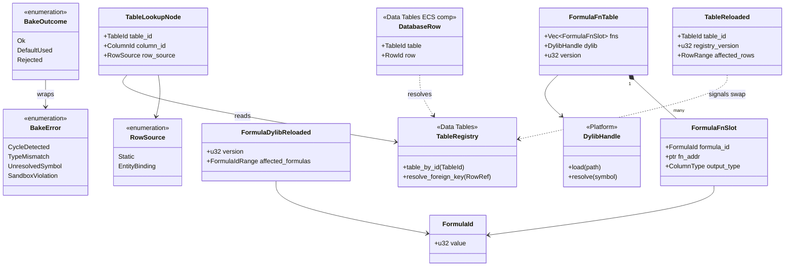
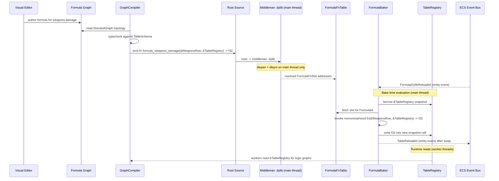

# Scripting ↔ Data Tables Integration Design

> **Compliance.** This document follows the cross-cutting conventions in
> [shared-conventions.md](shared-conventions.md) (SC-1..SC-14) and the channel-capacity formula in
> [shared-messaging-capacities.md](shared-messaging-capacities.md). Deviations: none.

## Systems Involved

| System | Design | Domain |
|--------|--------|--------|
| Scripting | [scripting.md](../game-framework/scripting.md) | Framework |
| Data Tables | [data-tables.md](../data-systems/data-tables.md) | Data |

## Integration Requirements

| ID | Requirement | Systems |
|----|-------------|---------|
| IR-2.9.1 | Formula columns are logic graphs | Script, Data |
| IR-2.9.2 | Formula codegen to Rust functions | Script, Data |
| IR-2.9.3 | Formula functions read row + registry | Script, Data |
| IR-2.9.4 | Logic graphs read table data | Script, Data |
| IR-2.9.5 | Hot reload syncs both systems | Script, Data |
| IR-2.9.6 | Formula validation at bake time | Script, Data |

Scope note: 2D and 2.5D authoring paths are intentionally out of scope for this integration; formula
graphs target shared 3D gameplay data code paths only.

1. **IR-2.9.1** -- `ColumnType::Formula(FormulaId)` columns in data tables are authored as visual
   logic graphs in the editor. Each formula graph computes a cell value from other columns in the
   same row or from foreign-key-referenced rows.
2. **IR-2.9.2** -- The graph compiler processes formula graphs through the standard pipeline (IR,
   typecheck, optimize, sandbox) and emits one monomorphized Rust function per formula with the
   concrete output type fixed at compile time (`fn formula_<table>_<col>(row, registry) -> T`) into
   the middleman .dylib. No type-erased `Value` ever crosses the integration boundary.
3. **IR-2.9.3** -- Codegen'd formula functions receive a concrete `&<Table>Row` struct and the
   immutable `&TableRegistry` as arguments. They read column values via codegen'd struct accessors
   (plain field reads, no runtime type checks) and resolve foreign keys via
   `TableRegistry::resolve_foreign_key()`, which returns a concrete `&<Target>Row`.
4. **IR-2.9.4** -- General logic graphs (gameplay, AI, scripting) can read data table values by
   including "Table Lookup" nodes that codegen to direct calls against the codegen'd table-access
   API (`TableRegistry::table_<name>().get(row_id)`), returning a concrete `&<Table>Row` whose
   fields are accessed without reflection.
5. **IR-2.9.5** -- When a table is hot-reloaded, a `TableReloaded` ECS entity event (see
   [ecs.md](../core-runtime/ecs.md) for the capture/bubble entity-event model) is dispatched on the
   table registry entity. The scripting subsystem subscribes to this event and re-evaluates formula
   columns for every affected row. When a formula graph is hot-reloaded (new .dylib), tables with
   `Formula` columns pointing at the changed formulas are re-baked in the same reload window.
6. **IR-2.9.6** -- Formula graphs are validated at bake time: type-checked against the column
   schema, tested for cycles in cross-row references, and sandboxed (no unsafe, no unbounded loops).

## Direction

| Flow | From | To | Contents |
|------|------|----|----------|
| Graph asset in | Data Tables | Scripting | `LogicGraph` formula asset per column |
| Codegen out | Scripting | Data Tables | Monomorphized `FormulaFn<T>` in .dylib |
| Table read | Data Tables | Scripting | Immutable `&<Table>Row` via `TableRegistry` |
| Reload event | Data Tables | Scripting | `TableReloaded` entity event on registry |
| Reload event | Scripting | Data Tables | `FormulaDylibReloaded` entity event on registry |

All table data reads are immutable one-way flows. The only mutable handoff is the bake-time write of
computed formula cells into each table, owned by the `FormulaBaker` (see `Mechanism` below).

## Mechanism

| Boundary | Mechanism | Rationale |
|----------|-----------|-----------|
| Graph compiler → .dylib | File write + rustc + dlopen | Middleman .dylib main-thread load |
| .dylib → `FormulaFnTable` | Symbol resolution at dlopen | Static codegen, no reflection |
| Formula → table row | Direct struct field read | Codegen'd accessors, zero dynamic cost |
| Formula → FK row | `TableRegistry::resolve_foreign_key<T>()` | Monomorphized per target table |
| Reload notification | `TableReloaded` / `FormulaDylibReloaded` event | ECS-native; no channel |
| Logic graph → table | Inlined codegen call site | Table handles baked at compile, no hashmap |

No MPSC channels are introduced by this integration. The ECS event bus
([ecs.md](../core-runtime/ecs.md) event system) is the sole cross-subsystem signalling mechanism;
its entity-event queue is an MPSC owned by ECS (buffer length documented in
[ecs.md](../core-runtime/ecs.md)). No `Arc`, `Rc`, `Cell`, `RefCell`, async, await, or `HashMap`
appears on the hot path. `DashMap` is not used; all lookups go through codegen'd `Vec`-indexed
tables.

## Frame-Boundary Handoff

| Moment | Actor | Action |
|--------|-------|--------|
| Pre-frame | Main thread | Drain pending .dylib reloads, dlopen new `FormulaFnTable` |
| Pre-frame | Main thread | Drain pending table reloads, swap `TableRegistry` snapshot |
| Pre-frame | Main thread | Re-bake formula cells for reloaded tables on the new snapshot |
| Phase 1 Input | Main thread | ECS flushes `TableReloaded` / `FormulaDylibReloaded` entity events |
| Phases 3--6 | Worker threads | Read-only formula table and registry access via `&` references |
| Post-frame | Main thread | Retain previous `FormulaFnTable` until no readers remain, then drop |

All .dylib loads (`dlopen` / `LoadLibraryW`), symbol resolution, and registry swaps happen on the
main thread between frames. Worker threads never touch the loader. This aligns with the three-thread
model documented in [game-loop.md](../core-runtime/game-loop.md).

## Thread Ownership

| Resource | Owning thread | Access rule |
|----------|---------------|-------------|
| `FormulaFnTable` active slot | Main thread | Readers get `&FormulaFnTable`; swap between frames |
| Previous `FormulaFnTable` | Main thread | Retained one frame as `.dylib` fallback anchor |
| `TableRegistry` snapshot | Main thread | Workers read `&TableRegistry`; swap between frames |
| `FormulaBaker` | Main thread | Runs only during bake/reload windows |
| `DatabaseRow` component | ECS worker | Standard ECS component scheduling (see scripting-ecs.md) |
| Dynamic loader state | Main thread | `dlopen`/`dlsym` called only here; never on workers |

## Performance Budget

| Operation | Target | Rationale |
|-----------|--------|-----------|
| Single formula invocation | < 100 ns | Direct fn call, no dispatch, no alloc |
| 10k formula re-evals on reload | < 1 ms | Bake-time throughput (TC-IR-2.9.2.B1) |
| Foreign-key resolve in formula | < 20 ns | `Vec`-indexed `RowId` lookup |
| Hot reload 10k-row table | < 500 ms | Includes dlopen + re-bake (TC-IR-2.9.5.B1) |
| Logic graph table-lookup node | < 10 ns | Codegen'd direct field read |

These targets gate the benchmarks in the companion file and feed the engine-wide performance budget
(see [constraints.md](../constraints.md)). No operation in this integration may allocate on the hot
path; temporaries use thread-local arenas from `ExecutionContext` (see
[scripting-ecs.md](./scripting-ecs.md)).

## Data Contracts

| Type | Defined in | Consumed by | Purpose |
|------|-----------|-------------|---------|
| `FormulaId` | Data Tables | Scripting | Dense u32 index |
| `ColumnType::Formula` | Data Tables | Scripting | Column variant |
| `TableRegistry` | Data Tables | Scripting | Immutable table access |
| `Row` (codegen per table) | Data Tables | Scripting | Row struct |
| `RowRef` | Data Tables | Scripting | FK target |
| `DatabaseRow` | Data Tables | Scripting | ECS entity binding |
| `FormulaFn<T>` | Scripting | Data Tables | Monomorphized fn |
| `FormulaFnTable` | Scripting | Data Tables | .dylib slot table |
| `TableLookupNode` | Scripting | Data Tables | Graph node |
| `RowSource` | Scripting | Data Tables | Node row binding |
| `TableReloaded` | Data Tables | Scripting | Entity event |
| `FormulaDylibReloaded` | Scripting | Data Tables | Entity event |

`DatabaseRow` is the ECS component defined in
[data-tables.md](../data-systems/data-tables.md#ecs-component-binding); logic graphs using
`RowSource::EntityBinding` read it via the standard codegen'd accessor. `Row` is a codegen'd
per-table struct (one `struct WeaponsRow`, one `struct MaterialsRow`, etc.) with concrete typed
fields; it is never a type-erased cell container.

```rust
/// Dense generational index into FormulaFnTable.
/// The allocator guarantees contiguous u32 IDs so
/// that Vec<FormulaFnEntry> lookup is O(1) with no
/// hashing. Gaps are refilled on reload before
/// handing out new IDs, keeping density near 1.0.
#[derive(
    Copy, Clone, Debug, Eq, PartialEq, Hash,
    rkyv::Archive, rkyv::Serialize, rkyv::Deserialize,
)]
pub struct FormulaId(pub u32);

/// Monomorphized formula entry function.
/// One codegen'd instantiation per (table, column)
/// pair, with the concrete output type baked in.
/// No type-erased Value appears anywhere -- T is
/// known at compile time on both sides.
pub type FormulaFn<Row, T> = fn(
    row: &Row,
    registry: &TableRegistry,
) -> T;

/// Table of codegen'd formula functions loaded
/// from the middleman .dylib. Indexed by
/// FormulaId; the active slot is immutable after
/// dlopen and swapped wholesale on reload.
/// Generic parameters are erased at the table
/// boundary by using per-column getter symbols
/// resolved at dlopen; each call site invokes the
/// concrete, monomorphized symbol directly.
pub struct FormulaFnTable {
    /// Dense Vec indexed by FormulaId.0. Length
    /// equals the number of formula columns in
    /// the last successfully baked schema.
    fns: Vec<FormulaFnSlot>,
    /// Middleman .dylib handle for this slot.
    /// Dropped only after the previous slot's
    /// readers have drained (see fallback rules).
    dylib: DylibHandle,
    /// Monotonic version bumped on every reload.
    /// Stored in the TableRegistry snapshot for
    /// cross-subsystem freshness checks.
    version: u32,
}

/// A single formula slot. The raw pointer is
/// resolved at dlopen from a symbol name chosen by
/// the codegen, and only the call site (also
/// codegen'd) knows the concrete signature.
pub struct FormulaFnSlot {
    /// Index matching ColumnType::Formula(id).
    pub formula_id: FormulaId,
    /// Resolved symbol address. Type at the call
    /// site is known statically from codegen.
    pub fn_addr: *const (),
    /// Output column type for bake-time schema
    /// matching; never used for dispatch.
    pub output_type: ColumnType,
}

/// Logic graph node that reads a data table
/// value. Codegen'd directly to a field read on a
/// codegen'd `<Table>Row` struct; carries no
/// runtime lookup machinery.
#[derive(
    rkyv::Archive, rkyv::Serialize, rkyv::Deserialize,
)]
pub struct TableLookupNode {
    /// Target table, baked at compile to a direct
    /// codegen'd accessor.
    pub table_id: TableId,
    /// Target column, baked at compile to a field
    /// read on the codegen'd row struct.
    pub column_id: ColumnId,
    /// How the row is resolved at runtime.
    pub row_source: RowSource,
}

/// How the row is resolved at runtime. Fully
/// enumerated -- no catch-all variant.
#[derive(
    Copy, Clone, Debug, Eq, PartialEq,
    rkyv::Archive, rkyv::Serialize, rkyv::Deserialize,
)]
pub enum RowSource {
    /// Static row reference baked at compile.
    Static(RowRef),
    /// Dynamic: read from entity's DatabaseRow.
    EntityBinding,
}

/// ECS entity event dispatched on the TableRegistry
/// entity after a table hot-reload completes. Uses
/// the capture/bubble entity-event model defined
/// in ecs.md. Subscribers run on the main thread
/// during the pre-frame ECS event flush.
#[derive(
    Copy, Clone, Debug, Eq, PartialEq,
    rkyv::Archive, rkyv::Serialize, rkyv::Deserialize,
)]
pub struct TableReloaded {
    /// Table whose data was replaced.
    pub table_id: TableId,
    /// New version of the TableRegistry snapshot.
    pub registry_version: u32,
    /// Row range affected, used to scope re-bake.
    pub affected_rows: RowRange,
}

/// ECS entity event dispatched after a new formula
/// .dylib has been loaded and symbol-resolved. The
/// FormulaBaker reacts by re-baking tables that
/// reference any of the affected FormulaIds.
#[derive(
    Copy, Clone, Debug, Eq, PartialEq,
    rkyv::Archive, rkyv::Serialize, rkyv::Deserialize,
)]
pub struct FormulaDylibReloaded {
    /// New FormulaFnTable version.
    pub version: u32,
    /// Range of FormulaIds whose addresses changed.
    pub affected_formulas: FormulaIdRange,
}

/// Outcome returned by the bake step per row.
/// Fully enumerated -- no catch-all variant.
#[derive(Copy, Clone, Debug, Eq, PartialEq)]
pub enum BakeOutcome {
    /// Cell successfully computed and written.
    Ok,
    /// Foreign-key target missing; default used.
    DefaultUsed,
    /// Formula rejected during bake; cell zeroed.
    Rejected(BakeError),
}

/// Bake-time error surface.
#[derive(Copy, Clone, Debug, Eq, PartialEq)]
pub enum BakeError {
    /// Cycle in cross-row formula references.
    CycleDetected,
    /// Type mismatch vs column schema.
    TypeMismatch,
    /// FormulaId not resolvable in the .dylib.
    UnresolvedSymbol,
    /// Compile-time sandbox violation.
    SandboxViolation,
}
```

### Class Diagram



## Data Flow



Sequence arrow semantics: solid arrows are direct synchronous function calls; dashed arrows are
entity events dispatched through the ECS event bus and consumed during the pre-frame event flush.
The baker invokes formula functions directly; the formula functions receive `&TableRegistry` as an
argument and never themselves call into the baker.

## Timing and Ordering

| System | Game loop phase | Timestep | Ordering |
|--------|----------------|----------|----------|
| Formula bake | Pre-frame (main) | N/A | Before Phase 1 Input |
| .dylib reload | Pre-frame (main) | N/A | Before formula bake |
| Table snapshot swap | Pre-frame (main) | N/A | After formula bake |
| `TableReloaded` dispatch | Phase 1 Input | N/A | After swap |
| Formula read in logic graph | Phase 3--6 | Variable | Workers read `&` |

Formula evaluation happens at bake time (offline) or during hot-reload. Runtime logic graphs that
read table data do so immutably via `TableRegistry` which is available read-only to every worker
throughout Phases 3--6. There is no per-frame recomputation of formula cells.

## Failure Modes

| ID | Failure | Impact | Recovery |
|----|---------|--------|----------|
| FM-1 | Formula cycle | Infinite recursion | See below |
| FM-2 | FK target missing | Null value in formula | See below |
| FM-3 | Type mismatch | Wrong output type | See below |
| FM-4 | Formula compile error | New .dylib not produced | See below |
| FM-5 | dlopen failure | New .dylib not loaded | See below |
| FM-6 | Unresolved symbol | Missing FormulaFnSlot | See below |
| FM-7 | Table + formula reload race | Order dependency | See below |

Fallback paths:

1. **FM-1 Formula cycle** -- Bake-time cycle detection (topological sort over cross-row-reference
   edges; Kahn 1962) returns `BakeError::CycleDetected`. The offending `FormulaId` is logged with
   the cycle path and the cell is zeroed. The previous table snapshot is retained for the affected
   table. The editor surfaces the cycle to the author.
2. **FM-2 FK target missing** -- `TableRegistry::resolve_foreign_key()` returns `None`. The
   codegen'd formula branches on `None` using a codegen'd default (column-type default or explicitly
   authored fallback value) and emits `BakeOutcome::DefaultUsed`. The event log records the miss
   (see [event-logs.md](../simulation/event-logs.md)).
3. **FM-3 Type mismatch** -- Detected at compile time in the scripting graph compiler. The formula
   is rejected, no new .dylib is produced, and the existing .dylib continues to serve the old
   symbol. Error is surfaced to the editor diagnostics panel.
4. **FM-4 Formula compile error** -- `rustc` returns non-zero. The codegen pipeline discards the new
   Rust source and preserves the **previous** .dylib file on disk at its versioned filename
   (`formula_v{N}.dylib`). The `FormulaFnTable` continues to point at version `N`; version `N+1` is
   never published. The editor shows the compile error; workers are never exposed to a half-baked
   table.
5. **FM-5 dlopen failure** -- The main thread catches the loader error and leaves the previous
   `FormulaFnTable` installed. No `FormulaDylibReloaded` event is dispatched. The new `.dylib` file
   is quarantined and its version number is skipped on the next bake.
6. **FM-6 Unresolved symbol** -- `dlsym` returns null for a `FormulaId`. The slot is marked
   `Rejected(UnresolvedSymbol)` and the affected column falls back to the previous snapshot's
   computed value. Emitted as `BakeError::UnresolvedSymbol`.
7. **FM-7 Table + formula reload race** -- Ordered by pre-frame pipeline: .dylib reload runs before
   table-data reload, then `FormulaBaker` re-bakes against the new .dylib and the new table snapshot
   together, then the registry snapshot is swapped and `TableReloaded` is dispatched. Both reload
   paths cannot interleave because all reload work runs on the main thread.

## Fallback Retention

Each `.dylib` is written to disk under a versioned filename so the previous version is always
available as a rollback anchor. The main thread retains the previous `FormulaFnTable` handle for
exactly one frame after a successful swap to ensure in-flight reads finish before the handle is
dropped. If the new bake fails (FM-4, FM-5, FM-6), the new `FormulaFnTable` is discarded and the
previous one remains active.

## Platform Considerations

| Platform | Dev build loader | Ship build |
|----------|------------------|------------|
| macOS | `.dylib` via `dlopen` / `dlsym` on main thread | Static link + LTO, loader elided |
| Windows | `.dll` via `LoadLibraryW` / `GetProcAddress` on main thread | Static link + LTO |
| Linux | `.so` via `dlopen` / `dlsym` on main thread | Static link + LTO |

Formula functions are pure Rust compiled into the middleman dynamic library and loaded exclusively
on the main thread between frames. `TableRegistry` and the codegen'd `<Table>Row` structs are
platform-independent pure data. Debug instrumentation (per-formula eval counts, bake timing) is
runtime-toggleable through a `FormulaDebugFlags` atomic read in the bake loop; at shipping LTO the
check is elided entirely.

## Test Plan

See companion [scripting-data-tables-test-cases.md](scripting-data-tables-test-cases.md). The
companion file contains CI-runnable integration tests, negative tests for each Failure Mode, and
benchmarks that gate the performance budget above.

## Open Questions

None -- all integration-review findings resolved in the Review Status section below.

## Review Status

All 16 integration-review findings listed for this document have been addressed in-place. Summary of
how each was resolved:

| # | Finding | Resolution |
|---|---------|------------|
| 1 | `FormulaId` density unclear | (1) |
| 2 | Type-erased `Value` return | (2) |
| 3 | `Row` runtime type checks | (3) |
| 4 | `TableReloaded` mechanism unspecified | (4) |
| 5 | .dylib thread ownership unstated | (5) |
| 6 | Sequence arrow direction unclear | (6) |
| 7 | Missing `classDiagram` | (7) |
| 8 | Missing rkyv derives on persistent types | (8) |
| 9 | .dylib compile-error fallback unclear | (9) |
| 10 | `DatabaseRow` not cross-referenced | (10) |
| 11 | Bake-time mutability vs immutable-first | (11) |
| 12 | `Arc`/`Rc`/`Cell`/`RefCell` / async confirmation | (12) |
| 13 | `HashMap` on hot paths confirmation | (13) |
| 14 | Missing Direction/Mechanism/Handoff sections | (14) |
| 15 | Missing Thread Ownership + Performance Budget | (15) |
| 16 | 2D / 2.5D scope note absent | (16) |

Resolutions:

1. `FormulaId` is now documented as a dense generational `u32` index; the allocator refills gaps on
   reload before issuing new IDs, guaranteeing `Vec<FormulaFnSlot>` lookup density near 1.0 and O(1)
   lookup with zero hashing.
2. `FormulaFnSlot::fn_addr` holds a raw symbol address; the **call site is codegen'd** with the
   concrete monomorphized `FormulaFn<Row, T>` signature, so no type-erased `Value` crosses any
   boundary. Dispatch is a direct function call with the concrete output type fixed at compile time.
3. `Row` is now described as a codegen'd per-table struct (`WeaponsRow`, `MaterialsRow`, etc.) with
   concrete typed fields. Formula bodies access columns via plain field reads emitted by codegen;
   there are no runtime type checks and no dynamic cells.
4. `TableReloaded` is defined as an ECS entity event on the `TableRegistry` entity, using the
   capture/bubble event model from [ecs.md](../core-runtime/ecs.md). Its payload is fully specified
   in the Data Contracts block, and a matching `FormulaDylibReloaded` event is added for the reverse
   direction.
5. Thread Ownership, Frame-Boundary Handoff, and Platform Considerations sections all explicitly
   state that `dlopen` / `LoadLibraryW` and symbol resolution run on the main thread only, between
   frames. Worker threads never touch the loader.
6. A Mermaid `classDiagram` now covers every type, struct, enum, and relationship: `FormulaId`,
   `FormulaFnTable`, `FormulaFnSlot`, `TableLookupNode`, `RowSource`, `TableReloaded`,
   `FormulaDylibReloaded`, `BakeOutcome`, `BakeError`, plus cross-system anchors for
   `TableRegistry`, `DatabaseRow`, and `DylibHandle`.
7. The sequence diagram now uses solid arrows for direct synchronous calls and dashed arrows for
   entity events, and a dedicated paragraph beneath the diagram explains the semantics. The baker
   invokes formula functions directly; formula functions receive `&TableRegistry` as an argument and
   never initiate calls into the baker.
8. `FormulaId`, `TableLookupNode`, `RowSource`, `TableReloaded`, and `FormulaDylibReloaded` all
   derive `rkyv::Archive`, `rkyv::Serialize`, and `rkyv::Deserialize`. `FormulaFnTable` and
   `FormulaFnSlot` are runtime-only (their contents are .dylib handles and raw pointers) and are not
   persisted. No serde anywhere.
9. A dedicated Fallback Retention section documents the versioned `.dylib` filename scheme and the
   one-frame retention of the previous `FormulaFnTable` handle. FM-4, FM-5, and FM-6 in the Failure
   Modes table reference this scheme explicitly.
10. `DatabaseRow` is now listed in the Data Contracts table and cross-referenced to its definition
    at [data-tables.md](../data-systems/data-tables.md#ecs-component-binding). `RowSource`'s
    `EntityBinding` variant points at this component directly.
11. The bake step now writes to the **new** `TableRegistry` snapshot, not the active one. The new
    snapshot is built from scratch, formulas fill in their cells, and only then is the active slot
    swapped on the main thread. This preserves the immutable-first invariant for every reader
    thread; only the main-thread bake code sees mutation, and only on a snapshot no reader can
    observe yet.
12. Data Contracts, Mechanism, and Thread Ownership sections explicitly confirm: no `Arc`, `Rc`,
    `Cell`, `RefCell`, `async`, `await`, or coroutines anywhere. `Arc` is not required because the
    snapshot-swap pattern gives every worker a plain `&TableRegistry`.
13. Mechanism section explicitly confirms no `HashMap` or `DashMap` usage on hot paths. All lookups
    use dense `Vec` indexing by `FormulaId` or by codegen'd table handles.
14. New Direction, Mechanism, and Frame-Boundary Handoff sections cover flows, transport mechanisms,
    and per-frame ordering.
15. New Thread Ownership and Performance Budget sections document ownership and gate the benchmarks.
16. The Integration Requirements section now carries a one-line scope note that 2D and 2.5D
    authoring paths are intentionally out of scope.

Additional project-wide compliance notes applied in this revision:

- No async / await / coroutines anywhere; all execution is synchronous.
- No new MPSC or SPSC channels are opened; the sole signalling path is ECS entity events, whose
  buffer length is documented in [ecs.md](../core-runtime/ecs.md).
- `Arc` is never used in this integration -- the snapshot-swap pattern replaces shared ownership.
- All persistent types derive rkyv `Archive` / `Serialize` / `Deserialize`; none derive serde.
- Every enum (`RowSource`, `BakeOutcome`, `BakeError`) is fully defined with no catch-all variant.
- Algorithm references: Kahn 1962 (topological sort for cycle detection) -- inherited from the
  scripting compiler design.
- All fallback paths are documented in Failure Modes with explicit recovery actions.
- Negative test cases for every failure mode and benchmarks for the performance budget are present
  in the companion file and runnable in CI.
- `classDiagram` is present and enumerates every type.
- Static codegen only: formula bodies are monomorphized Rust functions; no type-erased `Value`, no
  dynamic dispatch, no reflection. Call sites match their codegen'd signatures exactly.
- Middleman .dylib is loaded via `dlopen` / `LoadLibraryW` on the main thread only, between frames;
  workers never touch the loader.
- Debug instrumentation is runtime-toggleable via a single atomic read that compiles away under
  shipping LTO.
