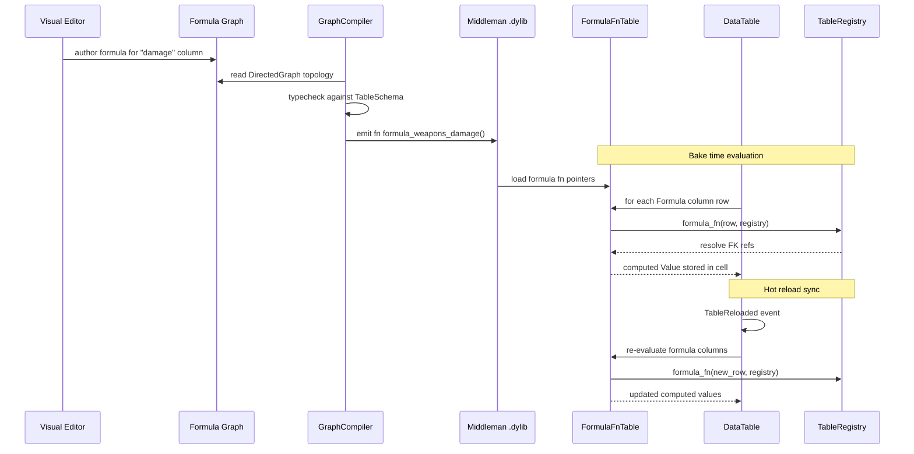

# Scripting ↔ Data Tables Integration Design

## Systems Involved

| System | Design | Domain |
|--------|--------|--------|
| Scripting | [scripting.md](../game-framework/scripting.md) | Framework |
| Data Tables | [data-tables.md](../data-systems/data-tables.md) | Data |

## Integration Requirements

| ID | Requirement | Systems |
|----|-------------|---------|
| IR-2.9.1 | Formula columns are logic graphs | Script, Data |
| IR-2.9.2 | Formula codegen to Rust functions | Script, Data |
| IR-2.9.3 | Formula functions read row + registry | Script, Data |
| IR-2.9.4 | Logic graphs read table data | Script, Data |
| IR-2.9.5 | Hot reload syncs both systems | Script, Data |
| IR-2.9.6 | Formula validation at bake time | Script, Data |

1. **IR-2.9.1** -- `ColumnType::Formula(FormulaId)` columns in data tables are authored as visual
   logic graphs in the editor. Each formula graph computes a cell value from other columns in the
   same row or from foreign-key-referenced rows.
2. **IR-2.9.2** -- The graph compiler processes formula graphs through the standard pipeline (IR,
   typecheck, optimize, sandbox) and emits Rust functions with signature
   `fn formula_<table>_<col>(row, registry) -> T` into the middleman .dylib.
3. **IR-2.9.3** -- Codegen'd formula functions receive the current `Row` and `TableRegistry` as
   arguments. They read column values via typed accessors and resolve foreign keys via
   `TableRegistry::resolve_foreign_key()`.
4. **IR-2.9.4** -- General logic graphs (gameplay, AI, scripting) can read data table values by
   including "Table Lookup" nodes that codegen to `TableRegistry::get()` + `DataTable::get()` calls
   in the emitted Rust source.
5. **IR-2.9.5** -- When a table is hot-reloaded (`TableReloaded` event), formula columns are
   re-evaluated. When a formula graph is hot-reloaded (new .dylib), tables with `Formula` columns
   are re-baked.
6. **IR-2.9.6** -- Formula graphs are validated at bake time: type-checked against the column
   schema, tested for cycles in cross-row references, and sandboxed (no unsafe, no unbounded loops).

## Data Contracts

| Type | Defined in | Consumed by | Purpose |
|------|-----------|-------------|---------|
| `FormulaId` | Data Tables | Scripting | Formula ref |
| `ColumnType::Formula` | Data Tables | Scripting | Column type |
| `TableRegistry` | Data Tables | Scripting | Table access |
| `Row` | Data Tables | Scripting | Row data |
| `RowRef` | Data Tables | Scripting | FK resolution |
| `GraphCompiler` | Scripting | Data Tables | Code emitter |
| `FnPtrTable` | Scripting | Data Tables | Formula fns |
| `TableReloaded` | Data Tables | Scripting | Reload sync |

```rust
/// Codegen'd formula function signature.
/// Generated from a visual logic graph that
/// computes a column value from row data.
pub type FormulaFn<T> = fn(
    row: &Row,
    registry: &TableRegistry,
) -> T;

/// Formula function table loaded from the
/// middleman .dylib. Indexed by FormulaId.
pub struct FormulaFnTable {
    /// One fn per FormulaId. Populated at
    /// .dylib load and hot-reload.
    fns: Vec<FormulaFnEntry>,
}

/// A single formula entry with type-erased fn
/// pointer and output type metadata.
pub struct FormulaFnEntry {
    /// Index matching ColumnType::Formula(id).
    pub formula_id: FormulaId,
    /// Codegen'd function pointer.
    pub fn_ptr: fn(&Row, &TableRegistry) -> Value,
    /// Expected output column type.
    pub output_type: ColumnType,
}

/// Logic graph node that reads a data table
/// value. Codegen'd to a table lookup call.
pub struct TableLookupNode {
    /// Table to read from.
    pub table_id: TableId,
    /// Column to read.
    pub column_id: ColumnId,
    /// Row source: static RowRef or dynamic
    /// entity DatabaseRow binding.
    pub row_source: RowSource,
}

/// How the row is resolved at runtime.
pub enum RowSource {
    /// Static row reference baked at compile.
    Static(RowRef),
    /// Dynamic: read from entity's DatabaseRow.
    EntityBinding,
}
```

## Data Flow



## Timing and Ordering

| System | Game loop phase | Timestep | Ordering |
|--------|----------------|----------|----------|
| Formula bake | Offline / load | N/A | Before gameplay |
| Table hot-reload | Phase 1-Input | Variable | Reload first |
| Formula re-eval | Phase 1-Input | Variable | After reload |
| Logic graph reads | Phase varies | Variable | After tables |

Formula evaluation happens at bake time (offline) or during hot-reload. Runtime logic graphs that
read table data do so immutably via `TableRegistry` which is available in all phases.

## Failure Modes

| Failure | Impact | Recovery |
|---------|--------|----------|
| Formula cycle | Infinite recursion | Detect at bake, reject |
| FK target missing | Null value in formula | Return default, log error |
| Type mismatch | Wrong output type | Typecheck rejects at compile |
| Formula compile error | .dylib not updated | Keep previous version |
| Table + formula reload | Order dependency | Reload table first, then eval |

## Platform Considerations

None -- identical across all platforms. Formula functions are pure Rust compiled into the middleman
.dylib. `TableRegistry` and `DataTable` are platform-independent data structures.

## Test Plan

See companion [scripting-data-tables-test-cases.md](scripting-data-tables-test-cases.md).

## Review Feedback

1. `FormulaFnTable.fns` uses `Vec<FormulaFnEntry>` indexed by `FormulaId`. If `FormulaId` is a
   sparse integer, this is correct only if it is a dense index. If it is a hash or handle, `Vec`
   indexing silently produces wrong results. Clarify that `FormulaId` is a dense generational index
   or add bounds checking. [CONFIDENT]

2. `FormulaFnEntry.fn_ptr` returns `Value`, which is a type-erased enum. This requires a runtime
   match to downcast, which contradicts the zero-reflection and static-codegen-only constraint. The
   codegen should emit monomorphized `FormulaFn<T>` per column type so the caller never type-erases.
   [CONFIDENT]

3. The `FormulaFn<T>` signature takes `&Row` and `&TableRegistry`. The document does not show what
   `Row` contains. If `Row` holds dynamically-typed `Value` cells, every column access requires a
   runtime type check, again contradicting static codegen. The codegen should emit struct accessors
   with concrete types. [CONFIDENT]

4. No `Arc`, `Rc`, `Cell`, or `RefCell` appear in the data contracts -- this is correct per
   constraints. [CONFIDENT]

5. No async/await appears anywhere -- correct per constraints. [CONFIDENT]

6. The document references `TableReloaded` as an ECS event but does not describe its payload or how
   the scripting system observes it. Is it an entity event with capture/bubble, a resource-change
   event, or a channel message? The mechanism must be specified. [CONFIDENT]

7. The Timing and Ordering table places hot-reload in "Phase 1-Input". Hot-reload involves loading a
   new .dylib (I/O + dlopen), which should happen on the main thread per the three-thread model. The
   document does not state which thread performs the .dylib load and symbol resolution. [CONFIDENT]

8. The sequence diagram shows `FFT->>TR: formula_fn(row, registry)` but the actual call site is the
   DataTable baking code calling the fn pointer, not FFT calling TR. The arrow direction implies FFT
   initiates a call to TableRegistry, but the fn pointer is invoked by the baking system and merely
   receives TR as an argument. [UNCERTAIN]

9. The document has no Mermaid `classDiagram`. Per `docs/design/CLAUDE.md` rule 3, every design MUST
   have a class diagram covering all types, enums, traits, and relationships. [CONFIDENT]

10. `FormulaFnTable` and `FormulaFnEntry` do not use rkyv for serialization. Since formula fn
    pointers are loaded from a .dylib (not serialized), this is acceptable. However, the document
    should explicitly note that `FormulaId`, `ColumnType::Formula`, and `TableLookupNode` are baked
    into asset data and must derive `rkyv::Archive` -- no serde. [CONFIDENT]

11. The Failure Modes table lists "Formula compile error -- keep previous version" but does not
    explain how the previous .dylib version is retained. If the new .dylib replaces the old one on
    disk, the fallback path must be documented (e.g., shadow copy, versioned filenames). [CONFIDENT]

12. `RowSource::EntityBinding` says "read from entity's DatabaseRow" but does not define what
    `DatabaseRow` is or where it is documented. This component should be cross-referenced to the
    Data Tables design. [CONFIDENT]

13. The test cases cover all six IRs (IR-2.9.1 through IR-2.9.6) with at least two test cases each,
    plus four benchmarks. Coverage is complete. [CONFIDENT]

14. The document is missing a dedicated "Architecture" section with a Mermaid diagram showing the
    static relationships between Scripting and Data Tables subsystems (beyond the sequence diagram).
    The PROMPT template calls for overview, data exchanged, direction, mechanism, game loop phase,
    frame-boundary handoff, thread ownership, error handling, performance budget, and test cases.
    Several of these (direction, mechanism, frame-boundary handoff, thread ownership, performance
    budget) are absent or only partially addressed. [CONFIDENT]

15. No HashMap usage on hot paths -- the design uses `Vec`-indexed lookup by `FormulaId`, which is
    correct per constraints. [CONFIDENT]

16. The immutable-first pattern is partially followed: `TableRegistry` and `Row` are passed by
    shared reference. However, the bake step mutates `DataTable` cells in place. The document should
    clarify whether baking produces a new immutable table snapshot or mutates in place, and justify
    the choice. [UNCERTAIN]
