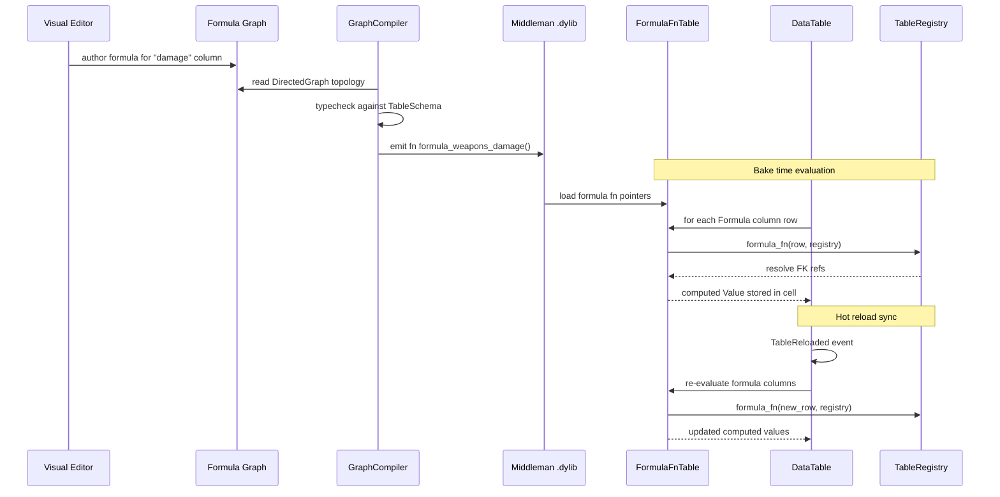

# Scripting ↔ Data Tables Integration Design

## Systems Involved

| System | Design | Domain |
|--------|--------|--------|
| Scripting | [scripting.md](../game-framework/scripting.md) | Framework |
| Data Tables | [data-tables.md](../data-systems/data-tables.md) | Data |

## Integration Requirements

| ID | Requirement | Systems |
|----|-------------|---------|
| IR-2.9.1 | Formula columns are logic graphs | Script, Data |
| IR-2.9.2 | Formula codegen to Rust functions | Script, Data |
| IR-2.9.3 | Formula functions read row + registry | Script, Data |
| IR-2.9.4 | Logic graphs read table data | Script, Data |
| IR-2.9.5 | Hot reload syncs both systems | Script, Data |
| IR-2.9.6 | Formula validation at bake time | Script, Data |

1. **IR-2.9.1** -- `ColumnType::Formula(FormulaId)` columns in data tables are authored as visual
   logic graphs in the editor. Each formula graph computes a cell value from other columns in the
   same row or from foreign-key-referenced rows.
2. **IR-2.9.2** -- The graph compiler processes formula graphs through the standard pipeline (IR,
   typecheck, optimize, sandbox) and emits Rust functions with signature
   `fn formula_<table>_<col>(row, registry) -> T` into the middleman .dylib.
3. **IR-2.9.3** -- Codegen'd formula functions receive the current `Row` and `TableRegistry` as
   arguments. They read column values via typed accessors and resolve foreign keys via
   `TableRegistry::resolve_foreign_key()`.
4. **IR-2.9.4** -- General logic graphs (gameplay, AI, scripting) can read data table values by
   including "Table Lookup" nodes that codegen to `TableRegistry::get()` + `DataTable::get()` calls
   in the emitted Rust source.
5. **IR-2.9.5** -- When a table is hot-reloaded (`TableReloaded` event), formula columns are
   re-evaluated. When a formula graph is hot-reloaded (new .dylib), tables with `Formula` columns
   are re-baked.
6. **IR-2.9.6** -- Formula graphs are validated at bake time: type-checked against the column
   schema, tested for cycles in cross-row references, and sandboxed (no unsafe, no unbounded loops).

## Data Contracts

| Type | Defined in | Consumed by | Purpose |
|------|-----------|-------------|---------|
| `FormulaId` | Data Tables | Scripting | Formula ref |
| `ColumnType::Formula` | Data Tables | Scripting | Column type |
| `TableRegistry` | Data Tables | Scripting | Table access |
| `Row` | Data Tables | Scripting | Row data |
| `RowRef` | Data Tables | Scripting | FK resolution |
| `GraphCompiler` | Scripting | Data Tables | Code emitter |
| `FnPtrTable` | Scripting | Data Tables | Formula fns |
| `TableReloaded` | Data Tables | Scripting | Reload sync |

```rust
/// Codegen'd formula function signature.
/// Generated from a visual logic graph that
/// computes a column value from row data.
pub type FormulaFn<T> = fn(
    row: &Row,
    registry: &TableRegistry,
) -> T;

/// Formula function table loaded from the
/// middleman .dylib. Indexed by FormulaId.
pub struct FormulaFnTable {
    /// One fn per FormulaId. Populated at
    /// .dylib load and hot-reload.
    fns: Vec<FormulaFnEntry>,
}

/// A single formula entry with type-erased fn
/// pointer and output type metadata.
pub struct FormulaFnEntry {
    /// Index matching ColumnType::Formula(id).
    pub formula_id: FormulaId,
    /// Codegen'd function pointer.
    pub fn_ptr: fn(&Row, &TableRegistry) -> Value,
    /// Expected output column type.
    pub output_type: ColumnType,
}

/// Logic graph node that reads a data table
/// value. Codegen'd to a table lookup call.
pub struct TableLookupNode {
    /// Table to read from.
    pub table_id: TableId,
    /// Column to read.
    pub column_id: ColumnId,
    /// Row source: static RowRef or dynamic
    /// entity DatabaseRow binding.
    pub row_source: RowSource,
}

/// How the row is resolved at runtime.
pub enum RowSource {
    /// Static row reference baked at compile.
    Static(RowRef),
    /// Dynamic: read from entity's DatabaseRow.
    EntityBinding,
}
```

## Data Flow



## Timing and Ordering

| System | Game loop phase | Timestep | Ordering |
|--------|----------------|----------|----------|
| Formula bake | Offline / load | N/A | Before gameplay |
| Table hot-reload | Phase 1-Input | Variable | Reload first |
| Formula re-eval | Phase 1-Input | Variable | After reload |
| Logic graph reads | Phase varies | Variable | After tables |

Formula evaluation happens at bake time (offline) or during hot-reload. Runtime logic graphs that
read table data do so immutably via `TableRegistry` which is available in all phases.

## Failure Modes

| Failure | Impact | Recovery |
|---------|--------|----------|
| Formula cycle | Infinite recursion | Detect at bake, reject |
| FK target missing | Null value in formula | Return default, log error |
| Type mismatch | Wrong output type | Typecheck rejects at compile |
| Formula compile error | .dylib not updated | Keep previous version |
| Table + formula reload | Order dependency | Reload table first, then eval |

## Platform Considerations

None -- identical across all platforms. Formula functions are pure Rust compiled into the middleman
.dylib. `TableRegistry` and `DataTable` are platform-independent data structures.

## Test Plan

See companion [scripting-data-tables-test-cases.md](scripting-data-tables-test-cases.md).
