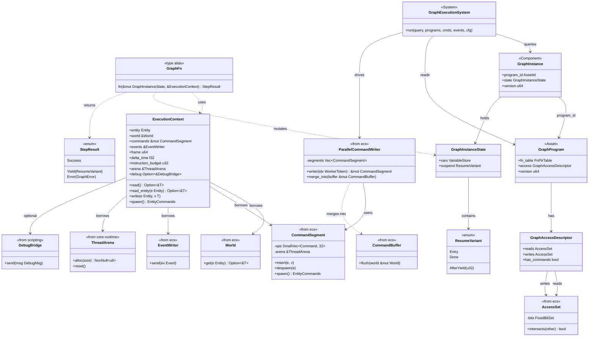
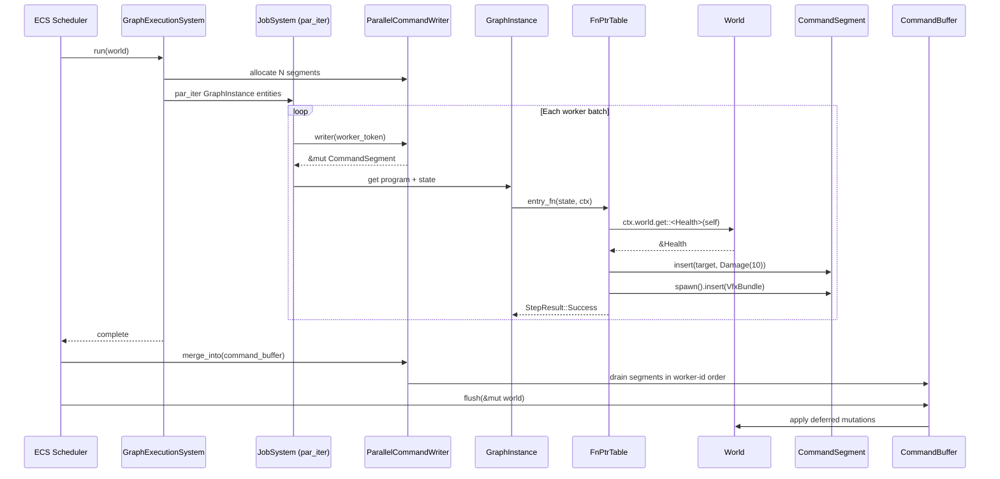

# Scripting ↔ ECS Integration Design

## Systems Involved

| System | Design | Domain |
|--------|--------|--------|
| Scripting | [scripting.md](../game-framework/scripting.md) | Framework |
| ECS | [ecs.md](../core-runtime/ecs.md) | Core Runtime |

## Integration Requirements

| ID | Requirement | Systems |
|----|-------------|---------|
| IR-2.8.1 | Codegen'd systems read ECS components | Script, ECS |
| IR-2.8.2 | Codegen'd systems write ECS components | Script, ECS |
| IR-2.8.3 | Graph programs use command buffers | Script, ECS |
| IR-2.8.4 | Graph execution scheduled by ECS | Script, ECS |
| IR-2.8.5 | Codegen'd systems declare access sets | Script, ECS |
| IR-2.8.6 | Entity variables map to components | Script, ECS |

1. **IR-2.8.1** -- Codegen'd `GraphFn` functions read ECS components via typed queries generated at
   compile time. The `ExecutionContext` provides a `&'w World` reference (not a separate query
   engine); codegen emits direct calls such as `ctx.world.get::<T>(entity)`. This matches the
   canonical `ExecutionContext` defined in [scripting.md](../game-framework/scripting.md).
2. **IR-2.8.2** -- Codegen'd functions write ECS components via a per-thread `CommandSegment`
   referenced from `ExecutionContext::commands`. All writes are deferred and merged at sync points
   in deterministic order. Writes are never flushed mid-system.
3. **IR-2.8.3** -- Structural changes (spawn, despawn, add/remove components) go through
   `CommandSegment::spawn()`, `despawn()`, `insert()`, `remove()`. The graph runtime never accesses
   the `World` directly for mutations. There is no shared `&mut CommandBuffer`; each worker holds a
   distinct `&mut CommandSegment` obtained from `ParallelCommandWriter::writer(worker_index)` (see
   [ecs.md](../core-runtime/ecs.md#parallelcommandwriter-high)).
4. **IR-2.8.4** -- `GraphExecutionSystem` is a standard ECS system registered in the scheduler. It
   queries all entities with `GraphInstance` components and invokes their codegen'd functions via
   `par_iter` on the custom job system (crossbeam-deque). No async/await, no coroutines -- control
   flow inside a graph is a synchronous state machine over `ResumeVariant` enums.
5. **IR-2.8.5** -- The graph compiler emits access metadata (`GraphAccessDescriptor`) for each
   `GraphProgram`. The ECS scheduler uses these to determine parallelism: graphs reading disjoint
   component sets run concurrently. This resolves scripting Open Question #1 (see
   [scripting.md](../game-framework/scripting.md#open-questions)) in favor of explicit access sets.
6. **IR-2.8.6** -- Entity-scope variables in `VariableStore` map to ECS components. The codegen
   pipeline emits read/write accessors that go through `&'w World` and the per-thread
   `CommandSegment`, not through the `VariableStore` directly. One entity variable may span multiple
   components (e.g. a "pose" variable backed by `Transform` plus `AnimState`); the mapping table is
   emitted by the compiler into the middleman `.dylib`.

## Out of Scope

2D/2.5D-specific scripting concerns (tile-grid queries, sprite animation state) are intentionally
out of scope for this integration; 2D/2.5D is deferred project-wide.

## Data Contracts

| Type | Defined in | Consumed by | Purpose |
|------|-----------|-------------|---------|
| `GraphInstance` | Scripting | ECS Scheduler | Per-entity comp |
| `GraphProgram` | Scripting | ECS Scheduler | Access metadata |
| `GraphInstanceState` | Scripting | Codegen'd fns | Graph local state |
| `ExecutionContext` | Scripting | Codegen'd fns | World + cmds + arena |
| `GraphAccessDescriptor` | Integration | ECS Scheduler | Parallelism decl |
| `ParallelCommandWriter` | ECS | Scripting | Deferred writes |
| `CommandSegment` | ECS | Scripting | Per-thread cmds |
| `AccessSet` | ECS | Scripting | Component bitset |
| `World` | ECS | Scripting | Read-only accessor |

The `GraphFn` signature takes mutable instance state and an `ExecutionContext` reference. The
codegen'd function accesses the `World` directly via typed queries generated at compile time. The
integration document re-exports the canonical `ExecutionContext` from `scripting.md` for cross-
reference; fields are kept identical.

```rust
/// Type alias for a codegen'd graph entry function.
/// Signature matches the canonical definition in
/// scripting.md. The `state` argument carries the
/// graph instance's mutable local variables and
/// suspend state; the `ctx` argument provides
/// sandboxed world access.
pub type GraphFn = fn(
    state: &mut GraphInstanceState,
    ctx: &ExecutionContext<'_>,
) -> StepResult;

/// Execution context passed to codegen'd fns.
/// Canonical definition lives in scripting.md;
/// re-exported here for cross-reference. Field
/// names and types are kept in sync with the
/// scripting design.
pub struct ExecutionContext<'w> {
    /// The entity this graph instance is on.
    pub entity: Entity,
    /// Read-only world access for typed queries.
    /// Codegen emits `ctx.world.get::<T>(e)` calls.
    pub world: &'w World,
    /// Per-thread command segment for deferred
    /// writes. Obtained from ParallelCommandWriter
    /// before the par_iter call; each worker gets
    /// a distinct &mut CommandSegment -- no Cell,
    /// no RefCell, no shared &mut CommandBuffer.
    pub commands: &'w mut CommandSegment,
    /// Event writer for emitting events.
    pub events: &'w EventWriter,
    /// Current frame number.
    pub frame: u64,
    /// Delta time this frame.
    pub delta_time: f32,
    /// Maximum budget checks per execution.
    pub instruction_budget: u32,
    /// Per-thread arena for temporary allocs.
    /// Reset at frame boundary. See scripting RF-9.
    /// Used for SmallVec spill and transient
    /// query result buffers.
    pub arena: &'w ThreadArena,
    /// Debug bridge channel. None in release.
    /// Runtime-toggleable via GraphExecutionConfig.
    pub debug: Option<&'w DebugBridge>,
}

impl<'w> ExecutionContext<'w> {
    /// Read a component from the current entity
    /// via a typed query on the World.
    pub fn read<T: Component>(
        &self,
    ) -> Option<&T>;

    /// Read a component from another entity.
    pub fn read_entity<T: Component>(
        &self,
        entity: Entity,
    ) -> Option<&T>;

    /// Queue a component write (deferred). Routes
    /// to the per-thread CommandSegment and is
    /// merged at the next ECS sync point.
    pub fn write<T: Component>(
        &mut self,
        entity: Entity,
        value: T,
    );

    /// Queue an entity spawn (deferred).
    pub fn spawn(
        &mut self,
    ) -> EntityCommands<'_>;
}

/// Access metadata emitted by the graph compiler.
/// Used by the ECS scheduler for parallelism.
/// Resolves scripting.md Open Question #1.
///
/// Serialized with rkyv for asset-pipeline
/// persistence alongside GraphProgram metadata.
/// AccessSet is a FixedBitSet wrapper defined in
/// ecs.md; both reads and writes share that type.
#[derive(
    rkyv::Archive,
    rkyv::Serialize,
    rkyv::Deserialize,
)]
pub struct GraphAccessDescriptor {
    /// Components read by this graph program.
    pub reads: AccessSet,
    /// Components written by this graph program.
    pub writes: AccessSet,
    /// Whether the graph uses command buffers.
    pub has_commands: bool,
}
```

`GraphInstanceState` holds the graph's per-entity mutable variables plus its `ResumeVariant` suspend
state. When the asset pipeline persists a `GraphInstance` snapshot (save games, network rollback),
the state struct derives rkyv `Archive`, `Serialize`, and `Deserialize`. Codegen emits the derives
alongside the struct definition inside the middleman `.dylib`; engine code never touches the layout
directly.

## Class Diagram



## Data Flow



## Command Buffer Memory and Merging

| Concern | Strategy |
|---------|----------|
| Per-entry storage | `SmallVec<[Command; 32]>` in each `CommandSegment` |
| Spill backing | Segment arena (per-thread `ThreadArena`) |
| Cross-thread sharing | None -- workers own distinct `&mut CommandSegment` |
| Merge ordering | Worker-id ascending (stable); see ecs.md section 3 |
| Merge algorithm | Serial concatenation of segment op streams |
| Lifetime | Segments live one frame; arenas reset at phase end |

Per-thread segment ownership avoids `Arc`, `Cell`, and `RefCell`. `Arc` is reserved for immutable
shared data (loaded `GraphProgram` assets, `FnPtrTable`, access-set metadata). The merge step uses a
stable, serial concatenation of segment op streams in ascending worker-id order; the algorithm is
specified in [ecs.md](../core-runtime/ecs.md#parallelcommandwriter-high) and mirrors the
"deterministic merge" approach used by Bevy's `CommandQueue` except that Harmonius uses owned
`CommandSegment` vectors rather than a shared queue.

## Timing and Ordering

| System | Game loop phase | Timestep | Ordering |
|--------|----------------|----------|----------|
| Graph execution (sim) | Phase 3 | Fixed | Per schedule |
| Graph execution (AI) | Phase 4 | Fixed | Per schedule |
| Graph execution (anim) | Phase 6 | Variable | Per schedule |
| Command merge | End of phase | N/A | Stable worker-id |
| Command flush | Sync point | N/A | After merge |
| Access analysis | Startup / reload | N/A | Once per program |

`GraphExecutionSystem` runs in whichever phase the graph is assigned to. Simulation and AI graphs
use the fixed timestep (Phase 3 and Phase 4); animation graphs run at the variable render cadence
(Phase 6). The assignment is stored on the `GraphProgram` asset; the scheduler refuses to register a
graph whose declared phase does not match its timestep class. Command segments are merged at the end
of their owning phase and the resulting `CommandBuffer` is flushed at the next sync point.
`GraphAccessDescriptor` is analyzed once at asset load and recomputed on hot-reload.

## Failure Modes

| ID | Failure | Impact | Recovery |
|----|---------|--------|----------|
| FM-1 | Entity despawned mid-exec | Stale entity ref | query returns None; graph no-ops |
| FM-2 | Access set conflict | False parallelism | Scheduler serializes offenders |
| FM-3 | Command segment overflow | Memory pressure | Halt + log; see detail 3 |
| FM-4 | Component not registered | Query returns None | Log error, skip write |
| FM-5 | Hot-reload layout mismatch | Variable slot drift | Reject reload; keep prior `.dylib` |
| FM-6 | Budget exhausted mid-graph | Possible infinite loop | Yield with `StepResult::Error` |

1. FM-1 -- `World::get` returns `Option`; codegen emits the null check and the graph proceeds as a
   no-op for that branch.
2. FM-2 -- If two programs declare overlapping `writes`, the scheduler drops them into the same
   serial bucket rather than running them in parallel.
3. FM-3 -- A `CommandSegment` that exhausts its arena returns `GraphError::CommandBufferFull` and
   the graph aborts its current step. The segment is NOT flushed early -- that would violate the
   deferred-write determinism contract (IR-2.8.2). The engine logs the overflow and the graph's
   pending writes for that frame are dropped; the next frame retries from the same `ResumeVariant`.
4. FM-4 -- Missing components can arise from optional features; codegen guards each write with a
   registration check.
5. FM-5 -- The middleman `.dylib` exports a layout hash per `GraphInstanceState`. On reload, the
   engine compares hashes before swapping function pointers; a mismatch keeps the prior `.dylib`
   loaded and surfaces an error to the editor.
6. FM-6 -- The instruction budget counter increments at codegen'd back-edges. When it exceeds
   `GraphExecutionConfig::instruction_budget`, the graph returns `StepResult::Error` and is parked
   until the next frame.

## Platform Considerations

None -- identical across all platforms. The ECS scheduler, command buffers, and world queries are
pure Rust. The job system uses crossbeam-deque which works identically on all targets. Middleman
`.dylib` hot-reload goes through the platform loader (`dlopen` / `LoadLibrary`) but is handled by
the scripting design, not this integration.

## Test Plan

See companion [scripting-ecs-test-cases.md](scripting-ecs-test-cases.md). Coverage includes one
positive and one negative test per IR, plus benchmarks and CI-runnable integration tests. The
negative tests exercise command-segment overflow (FM-3), hot-reload layout mismatch (FM-5), and
multi-component variable mapping (IR-2.8.6).

## Review Status

| # | Finding | Status |
|---|---------|--------|
| 1 | `ExecutionContext` diverged from scripting.md canonical | Resolved |
| 2 | Invented `QueryEngine` removed; use `&'w World` | Resolved |
| 3 | Use `EventWriter` (not `EventChannelWriter`) | Resolved |
| 4 | Use `frame` (not `tick`) | Resolved |
| 5 | `GraphFn` state parameter documented in contracts | Resolved |
| 6 | `GraphAccessDescriptor` cross-ref to scripting Q#1 | Resolved |
| 7 | `World` row fixed -- borrowed, not stored | Resolved |
| 8 | `classDiagram` added | Resolved |
| 9 | Arena + `SmallVec` for command buffers documented | Resolved |
| 10 | Per-thread `CommandSegment` (no Cell/RefCell) | Resolved |
| 11 | Multi-component and hot-reload tests added | Resolved |
| 12 | Fixed vs variable timestep clarified in timing table | Resolved |
| 13 | "Flush at capacity" removed; halt + log instead | Resolved |
| 14 | IR coverage confirmed in test cases file | Resolved |
| 15 | rkyv strategy for `GraphInstance` state documented | Resolved |
| 16 | 2D/2.5D out-of-scope note added | Resolved |
| 17 | Command buffer merge algorithm reference | Resolved |
| 18 | Negative tests CI-runnable | Resolved |
