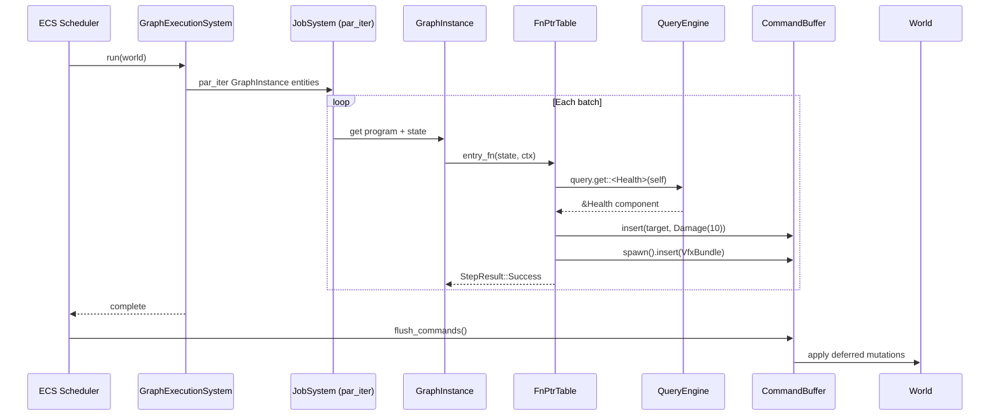

# Scripting ↔ ECS Integration Design

## Systems Involved

| System | Design | Domain |
|--------|--------|--------|
| Scripting | [scripting.md](../game-framework/scripting.md) | Framework |
| ECS | [ecs.md](../core-runtime/ecs.md) | Core Runtime |

## Integration Requirements

| ID | Requirement | Systems |
|----|-------------|---------|
| IR-2.8.1 | Codegen'd systems read ECS components | Script, ECS |
| IR-2.8.2 | Codegen'd systems write ECS components | Script, ECS |
| IR-2.8.3 | Graph programs use command buffers | Script, ECS |
| IR-2.8.4 | Graph execution scheduled by ECS | Script, ECS |
| IR-2.8.5 | Codegen'd systems declare access sets | Script, ECS |
| IR-2.8.6 | Entity variables map to components | Script, ECS |

1. **IR-2.8.1** -- Codegen'd `GraphFn` functions read ECS components via typed queries generated at
   compile time. The `ExecutionContext` provides a `QueryEngine` reference for the codegen'd
   function to call `query.get::<T>(entity)`.
2. **IR-2.8.2** -- Codegen'd functions write ECS components via
   `ExecutionContext::command_buffer()`. All writes are deferred and flushed at sync points in
   deterministic order.
3. **IR-2.8.3** -- Structural changes (spawn, despawn, add/remove components) go through
   `CommandBuffer::spawn()`, `despawn()`, `insert()`, `remove()`. The graph runtime never accesses
   the `World` directly for mutations.
4. **IR-2.8.4** -- `GraphExecutionSystem` is a standard ECS system registered in the scheduler. It
   queries all entities with `GraphInstance` components and invokes their codegen'd functions via
   `par_iter` on the job system.
5. **IR-2.8.5** -- The graph compiler emits access metadata (`ComponentAccess` sets) for each
   `GraphProgram`. The ECS scheduler uses these to determine parallelism: graphs reading disjoint
   component sets run concurrently.
6. **IR-2.8.6** -- Entity-scope variables in `VariableStore` map to ECS components. The codegen
   pipeline emits read/write accessors that go through the `QueryEngine`, not through the
   `VariableStore` directly.

## Data Contracts

| Type | Defined in | Consumed by | Purpose |
|------|-----------|-------------|---------|
| `GraphInstance` | Scripting | ECS Scheduler | Per-entity comp |
| `GraphProgram` | Scripting | ECS Scheduler | Access metadata |
| `ExecutionContext` | Scripting | Codegen'd fns | World access |
| `CommandBuffer` | ECS | Scripting | Deferred writes |
| `QueryEngine` | ECS | Scripting | Component reads |
| `ComponentAccess` | ECS | Scripting | Parallelism |
| `World` | ECS | Scripting | Data store |

```rust
/// Execution context passed to every codegen'd
/// graph function. Provides typed ECS access
/// without exposing the raw World reference.
pub struct ExecutionContext<'w> {
    /// Read-only query access to components.
    query: &'w QueryEngine,
    /// Deferred mutation buffer.
    commands: &'w CommandBuffer,
    /// The entity this graph is attached to.
    self_entity: Entity,
    /// Current game tick for timestamps.
    tick: u64,
    /// Event channel writer for emitting events.
    events: &'w EventChannelWriter,
}

impl<'w> ExecutionContext<'w> {
    /// Read a component from the current entity.
    pub fn read<T: Component>(
        &self,
    ) -> Option<&T> {
        self.query.get::<T>(self.self_entity)
    }

    /// Read a component from another entity.
    pub fn read_entity<T: Component>(
        &self,
        entity: Entity,
    ) -> Option<&T> {
        self.query.get::<T>(entity)
    }

    /// Queue a component write (deferred).
    pub fn write<T: Component>(
        &self,
        entity: Entity,
        value: T,
    ) {
        self.commands.insert(entity, value);
    }

    /// Queue an entity spawn (deferred).
    pub fn spawn(&self) -> EntityCommands<'_> {
        self.commands.spawn()
    }
}

/// Access metadata emitted by the graph compiler.
/// Used by the ECS scheduler for parallelism.
pub struct GraphAccessDescriptor {
    /// Components read by this graph program.
    pub reads: ComponentAccess,
    /// Components written by this graph program.
    pub writes: ComponentAccess,
    /// Whether the graph uses command buffers.
    pub has_commands: bool,
}
```

## Data Flow



## Timing and Ordering

| System | Game loop phase | Timestep | Ordering |
|--------|----------------|----------|----------|
| Graph execution | Phase varies | Variable | Per schedule |
| Command flush | Sync point | N/A | After systems |
| Access analysis | Startup | N/A | Once at load |

`GraphExecutionSystem` runs in whichever phase the graph is assigned to (Phase 3 for simulation,
Phase 4 for AI, Phase 6 for animation). Command buffers are flushed at the next sync point.
`ComponentAccess` sets are analyzed once at startup and on hot-reload.

## Failure Modes

| Failure | Impact | Recovery |
|---------|--------|----------|
| Entity despawned mid-exec | Stale entity ref | query returns None |
| Access set conflict | False parallelism | Scheduler serializes |
| Command buffer overflow | Memory pressure | Flush at capacity |
| Component not registered | Query returns None | Log error, skip |

## Platform Considerations

None -- identical across all platforms. The ECS scheduler, query engine, and command buffers are
pure Rust. The job system uses crossbeam-deque which works identically on all targets.

## Test Plan

See companion [scripting-ecs-test-cases.md](scripting-ecs-test-cases.md).
