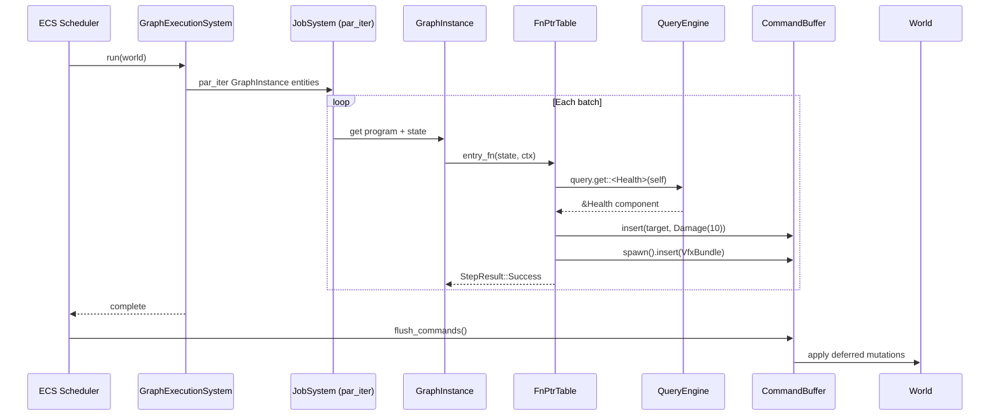

# Scripting ↔ ECS Integration Design

## Systems Involved

| System | Design | Domain |
|--------|--------|--------|
| Scripting | [scripting.md](../game-framework/scripting.md) | Framework |
| ECS | [ecs.md](../core-runtime/ecs.md) | Core Runtime |

## Integration Requirements

| ID | Requirement | Systems |
|----|-------------|---------|
| IR-2.8.1 | Codegen'd systems read ECS components | Script, ECS |
| IR-2.8.2 | Codegen'd systems write ECS components | Script, ECS |
| IR-2.8.3 | Graph programs use command buffers | Script, ECS |
| IR-2.8.4 | Graph execution scheduled by ECS | Script, ECS |
| IR-2.8.5 | Codegen'd systems declare access sets | Script, ECS |
| IR-2.8.6 | Entity variables map to components | Script, ECS |

1. **IR-2.8.1** -- Codegen'd `GraphFn` functions read ECS components via typed queries generated at
   compile time. The `ExecutionContext` provides a `QueryEngine` reference for the codegen'd
   function to call `query.get::<T>(entity)`.
2. **IR-2.8.2** -- Codegen'd functions write ECS components via
   `ExecutionContext::command_buffer()`. All writes are deferred and flushed at sync points in
   deterministic order.
3. **IR-2.8.3** -- Structural changes (spawn, despawn, add/remove components) go through
   `CommandBuffer::spawn()`, `despawn()`, `insert()`, `remove()`. The graph runtime never accesses
   the `World` directly for mutations.
4. **IR-2.8.4** -- `GraphExecutionSystem` is a standard ECS system registered in the scheduler. It
   queries all entities with `GraphInstance` components and invokes their codegen'd functions via
   `par_iter` on the job system.
5. **IR-2.8.5** -- The graph compiler emits access metadata (`ComponentAccess` sets) for each
   `GraphProgram`. The ECS scheduler uses these to determine parallelism: graphs reading disjoint
   component sets run concurrently.
6. **IR-2.8.6** -- Entity-scope variables in `VariableStore` map to ECS components. The codegen
   pipeline emits read/write accessors that go through the `QueryEngine`, not through the
   `VariableStore` directly.

## Data Contracts

| Type | Defined in | Consumed by | Purpose |
|------|-----------|-------------|---------|
| `GraphInstance` | Scripting | ECS Scheduler | Per-entity comp |
| `GraphProgram` | Scripting | ECS Scheduler | Access metadata |
| `ExecutionContext` | Scripting | Codegen'd fns | World access |
| `ParallelCommandWriter` | ECS | Scripting | Deferred writes |
| `AccessSet` | ECS | Scripting | Parallelism |
| `World` | ECS | Scripting | Data store |

The `GraphFn` signature takes mutable instance state and an `ExecutionContext` reference. The
codegen'd function accesses the `World` directly via typed queries generated at compile time.

```rust
/// Type alias for a codegen'd graph entry function.
/// Signature matches the canonical definition in
/// scripting.md.
pub type GraphFn = fn(
    state: &mut GraphInstanceState,
    ctx: &ExecutionContext<'_>,
) -> StepResult;

/// Execution context passed to codegen'd fns.
/// Provides sandboxed access to the ECS world.
/// Carries a per-thread arena for temporaries
/// (reset at frame boundary -- see RF-9).
///
/// Canonical definition lives in scripting.md.
/// This integration document re-exports the same
/// struct for cross-reference.
pub struct ExecutionContext<'w> {
    /// The entity this graph instance is on.
    pub entity: Entity,
    /// Read-only world access for typed queries.
    pub world: &'w World,
    /// Per-thread command segment for deferred
    /// writes. Each par_iter worker gets its own
    /// CommandSegment from ParallelCommandWriter
    /// -- no interior mutability needed.
    pub commands: &'w mut CommandSegment,
    /// Event writer for emitting events.
    pub events: &'w EventWriter,
    /// Current frame number.
    pub frame: u64,
    /// Delta time this frame.
    pub delta_time: f32,
    /// Maximum budget checks per execution.
    pub instruction_budget: u32,
    /// Per-thread arena for temporary allocs.
    /// Reset at frame boundary. See RF-9.
    pub arena: &'w ThreadArena,
    /// Debug bridge channel. None in release.
    pub debug: Option<&'w DebugBridge>,
}

impl<'w> ExecutionContext<'w> {
    /// Read a component from the current entity
    /// via a typed query on the World.
    pub fn read<T: Component>(
        &self,
    ) -> Option<&T> {
        self.world.get::<T>(self.entity)
    }

    /// Read a component from another entity.
    pub fn read_entity<T: Component>(
        &self,
        entity: Entity,
    ) -> Option<&T> {
        self.world.get::<T>(entity)
    }

    /// Queue a component write (deferred).
    /// Writes go to the per-thread CommandSegment
    /// and are merged at the sync point.
    pub fn write<T: Component>(
        &self,
        entity: Entity,
        value: T,
    ) {
        self.commands.insert(entity, value);
    }

    /// Queue an entity spawn (deferred).
    pub fn spawn(
        &self,
    ) -> EntityCommands<'_> {
        self.commands.spawn()
    }
}

/// Access metadata emitted by the graph compiler.
/// Used by the ECS scheduler for parallelism.
/// Wraps the ECS-canonical `AccessSet` type.
///
/// Serialized with rkyv for asset pipeline
/// persistence alongside `GraphProgram` metadata.
#[derive(
    rkyv::Archive,
    rkyv::Serialize,
    rkyv::Deserialize,
)]
pub struct GraphAccessDescriptor {
    /// Components read by this graph program.
    pub reads: AccessSet,
    /// Components written by this graph program.
    pub writes: AccessSet,
    /// Whether the graph uses command buffers.
    pub has_commands: bool,
}
```

## Data Flow



## Timing and Ordering

| System | Game loop phase | Timestep | Ordering |
|--------|----------------|----------|----------|
| Graph execution | Phase varies | Variable | Per schedule |
| Command flush | Sync point | N/A | After systems |
| Access analysis | Startup | N/A | Once at load |

`GraphExecutionSystem` runs in whichever phase the graph is assigned to (Phase 3 for simulation,
Phase 4 for AI, Phase 6 for animation). Command buffers are flushed at the next sync point.
`ComponentAccess` sets are analyzed once at startup and on hot-reload.

## Failure Modes

| Failure | Impact | Recovery |
|---------|--------|----------|
| Entity despawned mid-exec | Stale entity ref | query returns None |
| Access set conflict | False parallelism | Scheduler serializes |
| Command buffer overflow | Memory pressure | Flush at capacity |
| Component not registered | Query returns None | Log error, skip |

## Platform Considerations

None -- identical across all platforms. The ECS scheduler, query engine, and command buffers are
pure Rust. The job system uses crossbeam-deque which works identically on all targets.

## Test Plan

See companion [scripting-ecs-test-cases.md](scripting-ecs-test-cases.md).

## Review Feedback

1. [CONFIDENT] `ExecutionContext` in this document diverges from the canonical definition in
   `scripting.md`. The scripting design uses `world: &'w World` (direct world ref),
   `arena: &'w ThreadArena`, `delta_time: f32`, `instruction_budget: u32`, and
   `debug: Option<&'w DebugBridge>`. This document invents a `QueryEngine` abstraction and omits
   arena, delta_time, instruction_budget, and debug. The two must be reconciled.
2. [CONFIDENT] The `query: &'w QueryEngine` field uses a type that does not exist in the ECS or
   scripting designs. The scripting design accesses components via `world: &'w World` and typed
   queries generated by codegen. `QueryEngine` is undefined and should be removed or replaced with
   the canonical `&'w World`.
3. [CONFIDENT] The `events: &'w EventChannelWriter` field uses a type name inconsistent with the
   scripting design, which defines `events: &'w EventWriter`. Use the canonical name.
4. [CONFIDENT] The `tick: u64` field is named `frame: u64` in the scripting design. Pick one name
   and use it consistently.
5. [CONFIDENT] The `GraphFn` signature in the scripting design is
   `fn(state: &mut GraphInstanceState, ctx: &ExecutionContext)`. The sequence diagram here shows
   `entry_fn(state, ctx)` which is consistent, but the Data Contracts pseudocode omits the `state`
   parameter entirely from `ExecutionContext` methods. The state parameter must appear in the
   integration contract.
6. [CONFIDENT] The `GraphAccessDescriptor` struct in Data Contracts does not appear in the scripting
   design. The scripting design's open question #1 asks whether graphs should declare access sets.
   This integration design assumes that question is resolved (yes) but the scripting design has not
   been updated to reflect it. Either update the scripting design or flag this as a dependency.
7. [CONFIDENT] The Data Contracts table lists `World` as "Consumed by: Scripting" but the
   `ExecutionContext` struct in this document does not hold a `&World` reference -- it uses
   `QueryEngine` instead. The table and struct are inconsistent.
8. [CONFIDENT] The document lacks a class diagram (Mermaid `classDiagram`). Per the design
   CLAUDE.md, every design MUST have a Mermaid classDiagram covering ALL types, structs, enums,
   traits, and their relationships.
9. [CONFIDENT] No `SmallVec` or arena usage is mentioned for `CommandBuffer` accumulation during
   graph execution. Per constraints (RF-8, RF-9 in scripting), per-thread arenas and SmallVec should
   be used for hot-path allocations. The design should specify how command buffer memory is
   allocated.
10. [CONFIDENT] The `CommandBuffer` is referenced as `&'w` in `ExecutionContext`, implying shared
    immutable access. But `commands.insert()` and `commands.spawn()` mutate the buffer. This
    requires interior mutability (`Cell`/`RefCell`) or `&mut`, both of which conflict with engine
    constraints (no Arc/Rc/Cell/RefCell). The design must clarify how concurrent par_iter batches
    write to command buffers without interior mutability -- likely per-thread command buffers merged
    at sync.
11. [CONFIDENT] The test cases file does not cover the `VariableStore`-to-component mapping pathway
    (IR-2.8.6) beyond read/write. It lacks a test for entity-scope variables that span multiple
    components or for variable layout mismatch after hot-reload.
12. [UNCERTAIN] The Timing table says graph execution uses "Variable" timestep. Some graphs
    (physics-driven, networking) may need fixed timestep. The design should clarify whether graphs
    can opt into fixed-step scheduling or if that is handled by the phase they are assigned to.
13. [CONFIDENT] The Failure Modes table lists "Command buffer overflow" with recovery "Flush at
    capacity." Mid-system command flushing would violate the deferred-write contract (IR-2.8.2:
    "flushed at sync points in deterministic order"). The recovery should be to grow the buffer or
    abort the graph, not to flush early.
14. [CONFIDENT] The test cases cover all six IRs (2.8.1 through 2.8.6) with at least two test cases
    each, plus four benchmarks. Coverage is adequate for the IRs as written.
15. [UNCERTAIN] The design does not mention serialization of `GraphAccessDescriptor` or
    `GraphInstance` state. Per constraints, binary serialization must use rkyv only (no serde). If
    these types are persisted or sent across threads, their serialization strategy should be stated
    explicitly.
