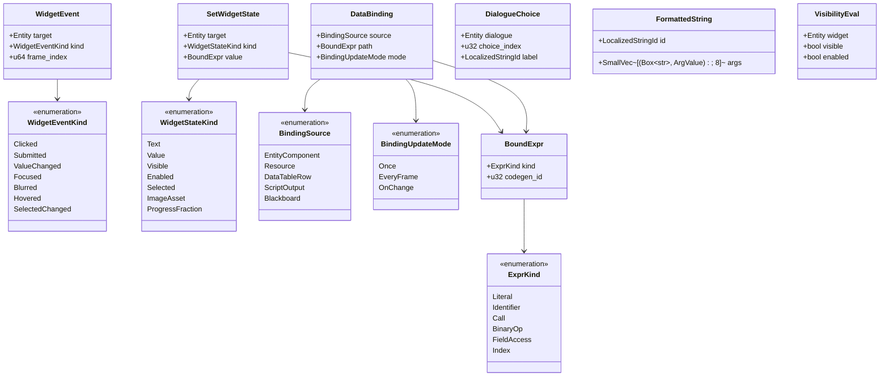
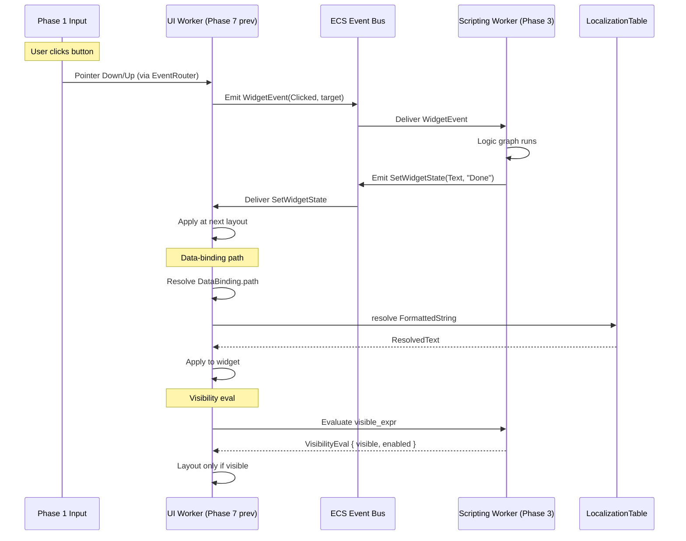
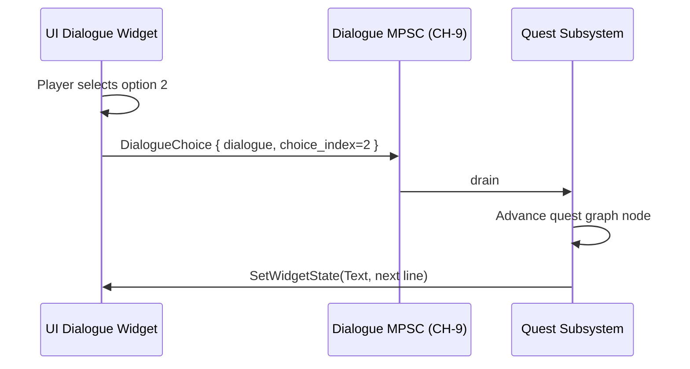

# Scripting ↔ UI Integration Design

## Systems Involved

| System | Design | Domain |
|--------|--------|--------|
| Scripting | [scripting.md](../game-framework/scripting.md) | Game Framework |
| UI | [ui-framework.md](../ui/ui-framework.md) | UI |

See [shared-conventions.md](shared-conventions.md) and
[shared-messaging-capacities.md](shared-messaging-capacities.md). Scripting is visual-only (logic
graphs codegen'd to Rust, per `constraints.md`).

## Integration Requirements

| ID | Requirement | Systems |
|----|-------------|---------|
| IR-4.5.1 | Logic graphs drive UI widget state | Script, UI |
| IR-4.5.2 | UI widgets emit events to scripting | Script, UI |
| IR-4.5.3 | Data-binding expressions resolve at layout | Script, UI |
| IR-4.5.4 | Dialogue choice captured from UI to quest | Script, UI |
| IR-4.5.5 | Formatted strings from script args | Script, UI |
| IR-4.5.6 | Widget enable/visible gated by script expr | Script, UI |

1. **IR-4.5.1** -- A logic graph can set widget state via a `SetWidgetState` action node that writes
   to the target widget entity's components. The graph runs on worker threads in Phase 3 Simulation
   (or earlier sub-phases); UI consumes in Phase 7.
2. **IR-4.5.2** -- Widgets emit `WidgetEvent` ECS entity events on interaction (click, submit,
   change). Scripting subscribes via `on_widget_event` handler nodes.
3. **IR-4.5.3** -- UI widgets can declare `DataBinding` expressions that read from ECS components,
   resources, or data tables. Bindings resolve once per layout.
4. **IR-4.5.4** -- Dialogue widget emits `DialogueChoice` via `CH-9`; quest subsystem consumes and
   advances the quest graph.
5. **IR-4.5.5** -- Script nodes can build `FormattedString` arguments that flow into
   `LocalizedStringId` resolution in `localization-ui.md`.
6. **IR-4.5.6** -- `visible_expr` and `enabled_expr` on widgets read a boolean expression from a
   logic graph; the UI layout skips hidden widgets and disables interaction.

## Data Contracts

| Type | Defined in | Consumed by | Purpose |
|------|-----------|-------------|---------|
| `WidgetEvent` | UI | Scripting | Interaction ECS event |
| `WidgetEventKind` | UI | Scripting | Event enum |
| `SetWidgetState` | Scripting | UI | State update action |
| `WidgetStateKind` | UI | Scripting | State enum |
| `DataBinding` | UI | UI | Binding expression |
| `BindingSource` | UI | UI | Source ref |
| `BoundExpr` | Scripting | UI | Typed expression |
| `DialogueChoice` | UI | Scripting | Choice picked |
| `DialogueChoiceCh` | UI | Scripting | `CH-9` |
| `FormattedString` | Scripting | Localization | Arg bundle |
| `VisibilityEval` | UI | UI | Visibility result |

## Class Diagram

## Data Flow

## Dialogue Choice Flow

## Timing and Ordering

| System | Phase | Timestep | Order |
|--------|-------|----------|-------|
| WidgetEvent emission | 1/2 (from input) | Variable | on interaction |
| Scripting handler eval | 3 Simulation | Fixed or variable | observer path |
| SetWidgetState apply | 7 Snapshot | Variable | in UI layout |
| DataBinding resolve | 7 Snapshot | Variable | in UI layout |
| Visibility eval | 7 Snapshot | Variable | pre-layout |
| DialogueChoice drain | 3 Simulation | Fixed | quest system |

Scripting runs in Phase 3 where the worker drains events emitted by UI in the previous Phase 7.
One-frame latency between interaction and scripted response is acceptable; critical input (text
input echo, selection highlight) lives in UI itself, not scripting.

## Thread Ownership

| Data / system | Owning thread | QoS / pin | Handoff |
|---------------|---------------|-----------|---------|
| Logic graph fns | Worker | user-initiated | Codegen'd, static dispatch |
| `WidgetEvent` bus | Worker | user-initiated | ECS event channel |
| `SetWidgetState` bus | Worker | user-initiated | ECS event channel |
| `DialogueChoiceCh` | Worker -> Worker | user-initiated | `CH-9` cap=16 BackPressure |
| `DataBinding` table | Worker | user-initiated | `SortedVecMap` per widget (SC-2) |

1. **No HashMap in data-binding dispatch** (SC-2). Per-widget bindings use `SmallVec` keyed by
   ordered field ids.
2. **Errors via `EngineError`** (SC-9). Binding evaluation failures propagate as
   `EngineError::Contract("binding type mismatch")` and fall back per FM-2.
3. **Determinism seed** for any script randomness is sourced from `GameTime.seed` (SC-8).

## Fallback Modes

| ID | Trigger | Policy | Recovery | Side effects |
|----|---------|--------|----------|-------------|
| FM-1 | Widget event target despawned | Drop event | Next event | Lost interaction |
| FM-2 | Binding type mismatch | Show `<err>` in widget | Binding fix | Visible diag |
| FM-3 | `CH-9` full (unlikely) | BackPressure UI | Quest drains | Brief UI stall |
| FM-4 | Script panic in handler | Catch, emit error banner | User reload | Handler disabled |
| FM-5 | `visible_expr` missing deps | Default `visible=true` | Deps added | Widget shown |
| FM-6 | Binding source not found | Show `<missing>` text | Source added | Visible diag |
| FM-7 | DialogueChoice for finished dialogue | Drop; log orphan | New dialogue | No effect |

## Performance Budget

Cross-reference [/docs/design/performance-budget.md](../performance-budget.md).

| Pair subsystem | Phase | Budget | Source |
|----------------|-------|--------|--------|
| Script handler eval (100 handlers) | 3 Sim | 0.2 ms | Script slice |
| DataBinding resolve (500 bindings) | 7 Snapshot | 0.1 ms | UI layout slice |
| SetWidgetState apply (50) | 7 Snapshot | 0.02 ms | UI layout slice |
| Visibility eval (500 widgets) | 7 Snapshot | 0.05 ms | UI layout slice |
| DialogueChoice drain | 3 Sim | 0.01 ms | Quest slice |

## Test Plan

See companion [scripting-ui-test-cases.md](scripting-ui-test-cases.md).

## Open Questions

| # | Question | Owner |
|---|----------|-------|
| 1 | Is `OnChange` binding detected by change-detection ticks? | UI |
| 2 | Can bindings reference data tables by row id directly? | Scripting |
| 3 | Is widget dispatch of `WidgetEvent` synchronous to Phase 3? | UI |
