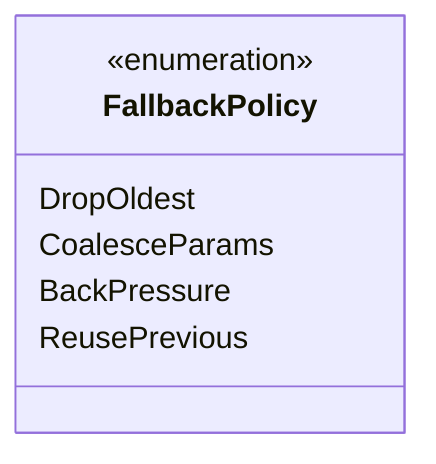

# Integration Shared Conventions

## Purpose

This document is the single normative source for cross-cutting constraints that every per-pair
integration document would otherwise restate. Integration docs link here instead of duplicating
prose. If you find yourself writing "use `BTreeMap` not `HashMap`" or "`Arc` only for immutable
data" in a new integration doc, reference this file and delete the prose.

This document is NORMATIVE. Per-pair integration docs MUST comply with every rule below and MUST
link here rather than restate. Exceptions require an explicit "Deviation" subsection in the
integration doc that cites the specific rule and rationale.

No companion test-cases file -- this is a rules document. Compliance is checked by code review and
by lint rules applied to integration documents.

## Rule Index

| ID | Rule | Scope |
|----|------|-------|
| SC-1 | `Arc` only for immutable shared data | All cross-thread data |
| SC-2 | No `HashMap` on hot paths | ECS queries, blackboards, frame loops |
| SC-3 | Blackboard backing store is sorted `Vec` or `BTreeMap` | AI, behavior trees, GOAP |
| SC-4 | MPSC is the default channel shape; SPSC only when justified | All cross-thread handoffs |
| SC-5 | rkyv only for persistence; no serde | Save files, baked assets, network |
| SC-6 | Fallback modes named `FM-N` in each integration doc | All integration docs |
| SC-7 | Channel capacity = `producers × burst × safety_margin` | All bounded channels |
| SC-8 | Determinism seed is plumbed as `GameTime.seed` | AI, physics, procgen, VFX |
| SC-9 | Errors propagate as `EngineError` | All fallible APIs |
| SC-10 | Debug visualization is runtime-toggleable, not compile-gated | All debug overlays |
| SC-11 | Enums are fully enumerated (no `...`) in class diagrams | All integration class diagrams |
| SC-12 | Persistent types require rkyv derives | Save, baked assets, hot-reload |
| SC-13 | `DashMap` replaces `HashMap` when concurrency is required | Cross-thread lookup tables |
| SC-14 | Integration docs carry contracts, not implementations | All integration docs |

## SC-1 -- Arc Only for Immutable Shared Data

`Arc<T>` is permitted only when `T` is immutable after construction. Mutable cross-thread state must
move through channels, triple buffers, or owned values.

| Permitted | Prohibited |
|-----------|-----------|
| `Arc<SoundClipTable>` (baked at load) | `Arc<Mutex<State>>` |
| `Arc<FontAtlas>` (GPU upload is immutable) | `Arc<RwLock<World>>` |
| `Arc<MaterialPairTable>` | `Arc<AtomicCell<_>>` for non-trivial `T` |
| `Arc<ShaderBinary>` | `Arc` wrapping a trait with interior mutability |

1. **Rc, Cell, RefCell are prohibited engine-wide.** They offer no value over owned values in the
   ECS, and RefCell panics are a production hazard.
2. **`Arc` for asset tables** is the dominant legitimate use. Asset tables are built once in the
   asset pipeline and frozen at load.
3. **Immutable means "no observer will ever mutate the data through any path."** Interior mutability
   on any field taints the whole `Arc`.

## SC-2 -- No HashMap on Hot Paths

`HashMap` is prohibited on deterministic hot paths. Iteration order varies between runs, which
breaks replay, networking, and recording. Hash lookups cost more than the alternatives at the scales
typical of hot paths (< 128 entries).

| Use case | Use instead | Rationale |
|----------|-------------|-----------|
| Small fixed lookup (< 32) | `[(K, V); N]` linear scan | Cache-friendly, branch-free |
| Sorted keyed lookup | `SortedVecMap<K, V>` | Binary search, deterministic |
| Ordered iteration required | `BTreeMap<K, V>` | Deterministic iteration |
| Index-based lookup | `HandleMap<T>` / `SlotMap<T>` | O(1), generational |
| Concurrent lookup | `DashMap<K, V>` | Lock-sharded, deterministic hash |

1. **`HashMap` is permitted on cold paths** (asset loading, editor, initialization). The ban applies
   only to per-frame and per-tick code.
2. **`AHashMap` does not change the rule.** It is still non-deterministic across runs.
3. **`DashMap` (SC-13) replaces `HashMap` when concurrency is required.** Document the choice with a
   "why DashMap" subsection.
4. **Primitives live in `core-runtime/primitives.md`.** `SortedVecMap`, `HandleMap`, `SlotMap`, and
   `DispatchTable` are defined there. Integration docs reference, never redefine.

## SC-3 -- Blackboard Backing Store

Any "blackboard" style keyed store used by AI, behavior trees, GOAP, or utility evaluation must use
a deterministic backing store.

| Store type | When to use |
|------------|------------|
| `SortedVecMap<BlackboardKey, BlackboardValue>` | < 64 keys, read-dominated |
| `BTreeMap<BlackboardKey, BlackboardValue>` | > 64 keys, write-dominated |

1. **No `HashMap`-backed blackboards.** See SC-2.
2. **Blackboards are ECS components.** They live on the entity that owns the behavior, not as a
   global resource. Replace any singleton blackboard with a `BlackboardComponent`.
3. **Key type is a codegen'd enum**, not a string. String keys are a code smell.
4. **Prior integration docs that restated this rule**: `ai-animation.md`, `ai-data-tables.md`,
   `ai-event-logs.md`, `ai-grids-volumes.md`, `ai-scripting.md`, `ai-spatial-awareness.md`,
   `ai-physics.md` (new). They now reference this section.

## SC-4 -- MPSC Default, SPSC Only When Justified

`crossbeam_channel::bounded` is the default cross-thread channel shape and is multi-producer by
design. SPSC is a premature optimization and locks out future producers.

| Edge shape | Permitted? | Notes |
|------------|-----------|-------|
| Main -> Workers | MPSC | Even if only one producer today |
| Workers -> Main | MPSC | Multi-worker is the norm |
| Workers -> Render | Triple buffer | See high-level.md |
| Workers -> Audio RT | MPSC | See SC-7 capacity formula |
| Intra-worker | No channel -- use direct call | |

1. **SPSC is permitted only in the audio output path** (audio RT thread to OS callback). That edge
   never gains a second producer.
2. **Buffer lengths are declared at channel construction** and documented in
   `shared-messaging-capacities.md`.
3. **Non-blocking sends only.** Producers use `try_send` and apply the documented overflow policy.

## SC-5 -- rkyv for Persistence, No serde

Persistence uses rkyv. serde is banned engine-wide except in tools that must emit JSON for external
consumers (rumdl, package metadata, editor preferences stored as human-readable text).

| Use case | Library | Derives |
|----------|---------|---------|
| Save files | rkyv | `#[derive(Archive, Serialize, Deserialize)]` |
| Baked assets | rkyv | Same |
| Hot-reload snapshot | rkyv | Same |
| Network packet | rkyv | Same (wire = zero-copy archive) |
| Editor preference file | serde_json | Only in editor binary |
| TOML config | basic-toml | Build scripts only |

1. **Zero-copy is the point.** Baked assets mmap the file and read rkyv archived types in place.
2. **Endianness is little-endian.** Supported platforms are all LE.
3. **Versioning is via archive schema evolution**, documented in `game-framework/save-system.md`.

## SC-6 -- Fallback Mode Naming (FM-N)

Every integration doc declares its fallback modes in a Fallbacks table using `FM-1`, `FM-2`,...
identifiers scoped to the document. Cross-doc references use the form `ai-physics.md#FM-2`.

| Field | Required? | Description |
|-------|----------|-------------|
| `ID` | Yes | `FM-N` where N is 1-based within the doc |
| `Trigger` | Yes | Condition that activates the fallback |
| `Policy` | Yes | What the system does |
| `Recovery` | Yes | How and when normal operation resumes |
| `Side effects` | No | Observable impact on the player / other systems |

1. **FM-0 is reserved.** It means "normal operation" and is never listed explicitly.
2. **Every cross-thread edge has a fallback.** A dropped packet, a full channel, a stalled producer
   -- all enumerated.
3. **Every optional dependency has a fallback.** Missing asset, stale codegen dylib, audio device
   disconnect, GPU device lost.

## SC-7 -- Channel Capacity Formula

Bounded channel capacity is computed from producer count, per-frame burst, and a safety margin:

```text
Capacity = MaxProducersPerFrame × BurstSize × SafetyMargin
```

| Term | Definition |
|------|------------|
| `MaxProducersPerFrame` | Peak number of distinct producers in a single frame |
| `BurstSize` | Items a single producer may enqueue in one frame under stress |
| `SafetyMargin` | 1.5 for low-drop tolerance, 2.0 typical, 4.0 for rare-drop channels |

1. **SafetyMargin ranges are discrete**: `1.5`, `2.0`, `3.0`, `4.0`. No other values.
2. **Capacity is a `const` generic** on the channel wrapper so per-title tuning requires no engine
   recompile.
3. **Rounding**: round the computed capacity up to the next power of 2 for cache alignment and for
   lock-free queue implementations that require power-of-2 sizing.
4. **Canonical capacities** are listed in
   [shared-messaging-capacities.md](shared-messaging-capacities.md).

## SC-8 -- Determinism Seed Plumbing

Every system that consumes randomness reads its seed from `GameTime.seed` plus a per-system
sub-seed. Never call `rand::random()` or read `thread_rng()` in engine code.

| System | Seed source | Sub-seed |
|--------|-------------|----------|
| AI utility tie-break | `GameTime.seed` | `hash("ai_utility")` |
| Physics contact jitter | `GameTime.seed` | `hash("physics_solver")` |
| VFX particle spawn | `GameTime.seed` | `hash("vfx") ^ emitter_id` |
| Procgen world | `GameTime.seed` | `hash("procgen") ^ chunk_id` |
| Animation noise | `GameTime.seed` | `hash("animation_noise")` |

1. **`GameTime` is defined in `core-runtime/game-loop.md`** (task P1-34 in design-review.md). It
   carries `tick: u64`, `elapsed_secs: f64`, and `seed: u64`.
2. **Sub-seeds are compile-time constants** computed via `const fn` FNV hash from a string literal.
3. **RNG type is `DeterministicRng`** from `core-runtime/primitives.md`. It is `SplitMix64` + stream
   rotation.

## SC-9 -- Error Handling via EngineError

All fallible APIs return `Result<T, EngineError>` or a subtype. `EngineError` is defined in
[core-runtime/error.md](../core-runtime/error.md) (task P1-28). Integration docs reference the
canonical type; they do not define per-pair error types.

| Error category | Variant | Where raised |
|----------------|---------|-------------|
| I/O | `EngineError::Io(IoError)` | File, network, platform |
| Serialization | `EngineError::Serial(SerialError)` | rkyv archive/deserialize |
| Compilation | `EngineError::Compile(CompileError)` | Codegen, shader |
| Not found | `EngineError::NotFound(Kind, Id)` | Asset, entity, key lookup |
| Channel | `EngineError::Channel(ChannelError)` | Send/recv on closed channel |
| Contract | `EngineError::Contract(&'static str)` | Integration contract breach |

1. **`panic!` is prohibited on hot paths.** Use `EngineError::Contract` and log.
2. **`Result` threading is synchronous**: there is no `async fn` anywhere.
3. **`?` uses `From<XError> for EngineError` impls** that are provided by `core-runtime/error.md`.

## SC-10 -- Runtime-Toggleable Debug Visualization

Debug overlays (wireframes, navmesh draw, profiler HUD, audio ray viz) must be toggleable at runtime
via `Res<DebugFlags>` and carried on `RenderFrame.debug_lines` or similar fields. Do not gate debug
visualization behind `cfg(debug_assertions)` or `#[cfg(feature = "debug")]`.

| Flag | Toggle | Default |
|------|--------|---------|
| `DebugFlags::show_physics_wireframes` | ConVar | false |
| `DebugFlags::show_ai_navmesh` | ConVar | false |
| `DebugFlags::show_audio_rays` | ConVar | false |
| `DebugFlags::show_ui_hit_overlay` | ConVar | false |
| `DebugFlags::show_profiler_hud` | ConVar | false |

ConVars are defined in `core-runtime/console-variables.md` (task P2-46).

## SC-11 -- Fully Enumerated Enums in Class Diagrams

Every enum in a Mermaid `classDiagram` in an integration doc MUST list every variant. No `...`, no
"variants not shown", no elisions.



1. **Review tooling checks this.** A future lint will grep for `...` or `/* ... */` inside
   `<<enumeration>>` blocks.
2. **Long enums**: split the class diagram into multiple diagrams rather than eliding variants.

## SC-12 -- Persistent Types Require rkyv Derives

Any struct that crosses a persistence boundary (save file, baked asset, hot-reload snapshot, wire
format) must derive `rkyv::Archive`, `rkyv::Serialize`, and `rkyv::Deserialize`. Integration docs
that introduce new persistent types must call this out explicitly.

Ephemeral types (per-frame messages, ECS components not in the save set, intermediate compute
outputs) do not require rkyv derives.

## SC-13 -- DashMap for Concurrent Lookups

`DashMap<K, V>` replaces `HashMap<K, V>` when a lookup table is touched by multiple threads and
cannot be made immutable (`Arc<SortedVecMap>` preferred when possible).

| Use case | Choice |
|----------|--------|
| Asset id -> `Arc<Asset>` (mostly immutable) | `Arc<SortedVecMap>` (see SC-1) |
| Voice id -> live audio voice (mutable) | `DashMap<VoiceId, VoiceHandle>` |
| Entity -> network replication slot | `DashMap<Entity, ReplicationSlot>` |

1. **DashMap is deterministic given a fixed hasher** (use `ahash` with a fixed seed from
   `GameTime.seed`).
2. **DashMap is still not allowed on deterministic hot paths** for replay recording. Use
   `SortedVecMap` instead and accept the single-writer constraint.

## SC-14 -- Contracts Only, No Implementation

Integration docs describe the **contract** between two subsystems: types, channels, phases,
fallbacks, budgets. They do **not** contain implementation pseudocode that belongs in a subsystem
design.

| Belongs here | Belongs in subsystem design |
|-------------|------------------------------|
| Type names and field shapes | Field layouts, bitpacking |
| Channel producer/consumer/capacity | Lock-free queue implementation |
| Phase assignment | System scheduling implementation |
| Fallback policy | Fallback algorithm details |
| Performance budget reference | Budget partitioning per entity |

Per the integration layer review (design-review.md §3.8), several existing integration docs violate
this rule (`ai-grids-volumes.md` has drain loop pseudocode; `asset-pipeline-rendering.md` has dxc
subprocess launch). Task P2-35 tracks moving that code out.

## Integration Documents That Reference This File

When the following integration docs are updated, the referenced rules should be replaced by a link
to this document. This list is the backlog for rule-deduplication cleanup.

| Integration doc | Rules to replace with link |
|-----------------|----------------------------|
| `ai-animation.md` | SC-2, SC-3 |
| `ai-data-tables.md` | SC-2, SC-3 |
| `ai-event-logs.md` | SC-2, SC-3 |
| `ai-grids-volumes.md` | SC-2, SC-3 (also P2-35 cleanup) |
| `ai-scripting.md` | SC-2, SC-3 |
| `ai-spatial-awareness.md` | SC-2, SC-3 |
| `ai-physics.md` (new) | SC-2, SC-3, SC-8 |
| `animation-audio.md` | SC-4, SC-7 |
| `animation-rendering.md` | SC-1 (asset tables), SC-12 |
| `animation-vfx.md` | SC-8 (particle seed) |
| `asset-pipeline-rendering.md` | SC-14 (P2-35 cleanup) |
| `attributes-effects-*.md` | SC-1, SC-9 |
| `audio-camera.md` | SC-4, SC-7 |
| `audio-physics.md` | SC-1, SC-4, SC-6 |
| `audio-spatial-awareness.md` | SC-1 |
| `containers-slots-*.md` | SC-1, SC-9 |
| `data-tables-ui.md` | SC-2 |
| `editor-animation.md` | SC-10 |
| `editor-physics.md` | SC-10 |
| `editor-rendering.md` | SC-10 |
| `editor-core-runtime.md` (new) | SC-10 |
| `editor-asset-pipeline.md` (new) | SC-10, SC-12 |
| `event-logs-ui.md` | SC-2 |
| `geometry-vfx.md` (new) | SC-8 |
| `high-level.md` | All; this file summarizes |
| `input-camera.md` | SC-4, SC-7 |
| `input-ui.md` | SC-4, SC-7 |
| `localization-ui.md` (new) | SC-1, SC-12 |
| `networking-*.md` | SC-4, SC-5, SC-7 |
| `physics-*.md` | SC-1, SC-8 |
| `profiler-*.md` | SC-10, SC-13 |
| `rendering-*.md` | SC-1, SC-12 |
| `save-system-serialization.md` | SC-5, SC-12 |
| `save-system-profiler.md` (new) | SC-5, SC-12 |
| `scripting-*.md` | SC-8, SC-9 |
| `scripting-ui.md` (new) | SC-2, SC-9 |
| `timelines-*.md` | SC-4, SC-8 |
| `ui-physics.md` (new) | SC-4 |

## Deviation Protocol

When a per-pair integration doc must deviate from a rule in this file, the deviation must:

1. Be declared in a `## Deviation from shared-conventions` section near the top of the doc.
2. Cite the specific rule ID (`SC-N`).
3. Provide a numbered rationale.
4. Cross-link the owning subsystem doc that carries the implementation of the deviation.
5. Be reviewed by the architecture reviewer agent before the doc is approved.

Undeclared deviations are review-blocking and must be corrected before merge.
