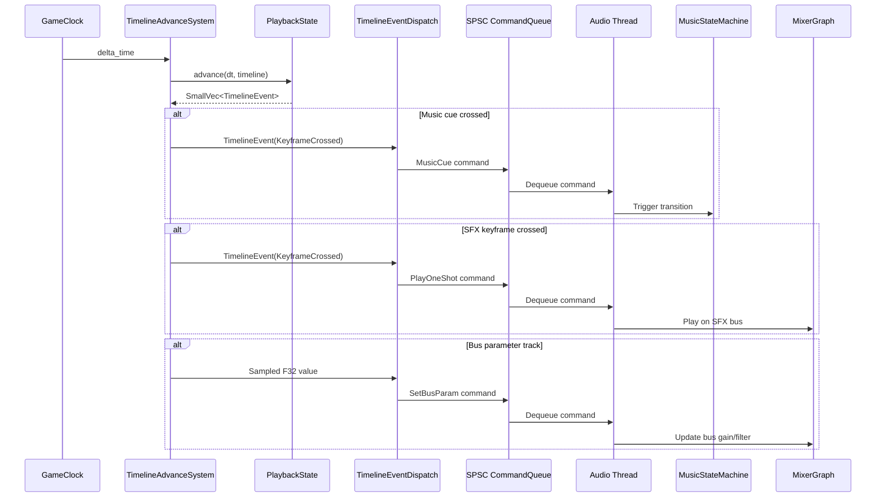
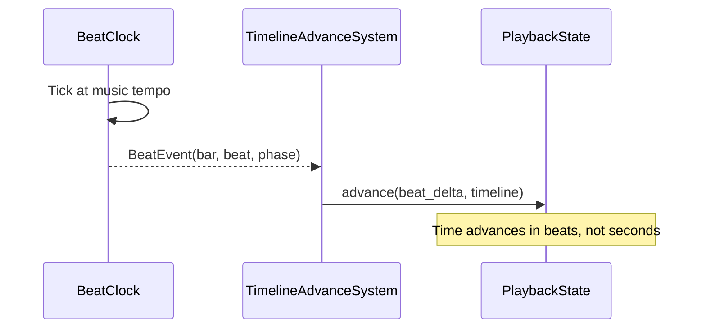

# Timelines ↔ Audio Integration Design

## Systems Involved

| System | Design | Domain |
|--------|--------|--------|
| Timelines | [timelines.md](../simulation/timelines.md) | Simulation |
| Audio | [audio.md](../audio/audio.md) | Audio |

## Integration Requirements

| ID | Requirement | Systems |
|----|-------------|---------|
| IR-4.7.1 | Timeline tracks trigger music cues | TL, Audio |
| IR-4.7.2 | Timeline tracks drive voice-over timing | TL, Audio |
| IR-4.7.3 | Timeline keyframes fire sound events | TL, Audio |
| IR-4.7.4 | Beat clock syncs timeline to music tempo | TL, Audio |
| IR-4.7.5 | Timeline controls mixer bus parameters | TL, Audio |
| IR-4.7.6 | Dialogue tracks with subtitle sync | TL, Audio |

1. **IR-4.7.1** -- A `TrackValue::Entity` keyframe referencing a `MusicCueComponent` entity fires a
   `TimelineEvent` when playback crosses it. The `MusicStateMachine` consumes the event to trigger
   transitions (crossfade, beat-sync, stinger).
2. **IR-4.7.2** -- Voice-over dialogue clips are stored as `TrackValue::Entity` keyframes
   referencing entities with `AudioSource` components. `TimelineEventDispatchSystem` sends a
   `PlayAudio` command to the audio thread SPSC queue at the keyframe time.
3. **IR-4.7.3** -- `TrackValue::Entity` keyframes referencing SFX `AudioSource` entities fire
   one-shot sound events when crossed. The `AudioEngine` command queue receives a `Play` command
   with the asset handle and spatial position.
4. **IR-4.7.4** -- `BeatClock` publishes beat and bar events. A timeline can be configured to
   advance in beat-time rather than wall-clock time, synchronizing cutscene pacing to the music
   tempo.
5. **IR-4.7.5** -- `TrackValue::F32` tracks animate mixer bus parameters (volume, low-pass cutoff)
   via `TrackId` bound to a bus entity's `AudioBusGain` or `AudioBusFilter` component.
6. **IR-4.7.6** -- Dialogue tracks pair `AudioSource` playback with `SubtitleEvent` events. When a
   voice-over keyframe fires, both the audio play command and the subtitle display event are
   dispatched in the same frame.

## Data Contracts

| Type | Defined in | Consumed by | Purpose |
|------|-----------|-------------|---------|
| `MultiTrackTimeline` | Timelines | Timelines | Asset container |
| `PlaybackState` | Timelines | Timelines | Playback control |
| `TimelineEvent` | Timelines | Audio | Keyframe crossing |
| `TrackValue` | Timelines | Audio | Typed value |
| `MusicCueComponent` | Audio | Audio | Music trigger |
| `MusicStateMachine` | Audio | Audio | Music transitions |
| `BeatClock` | Audio | Timelines | Tempo sync |
| `AudioSource` | Audio | Audio | Sound emitter |
| `AudioEngine` (SPSC) | Audio | Audio | Command queue |

```rust
/// Command sent from timeline system to audio
/// thread via SPSC command queue.
pub enum TimelineAudioCommand {
    /// Play a one-shot sound event.
    PlayOneShot {
        asset: AssetId,
        position: Option<Vec3>,
        bus: AudioBusId,
    },
    /// Trigger a music cue transition.
    MusicCue {
        cue_entity: Entity,
        transition: MusicTransitionKind,
    },
    /// Animate a mixer bus parameter.
    SetBusParam {
        bus: AudioBusId,
        param: AudioBusParam,
        value: f32,
    },
}

pub enum MusicTransitionKind {
    Crossfade { duration: f32 },
    BeatSync,
    Cut,
    Stinger { asset: AssetId },
}

pub enum AudioBusParam {
    Gain,
    LowPassCutoff,
    HighPassCutoff,
    ReverbSend,
}
```

## Data Flow



### Beat-Synced Timeline



## Timing and Ordering

| System | Phase | Timestep | Order |
|--------|-------|----------|-------|
| GameClock | 3-Simulation | Fixed | 1st |
| BeatClock | Audio thread | Per buffer | Continuous |
| TimelineAdvance | 3-Simulation | Fixed | After clock |
| TimelineEventDispatch | 3-Simulation | Fixed | After advance |
| Audio thread commands | Audio thread | Per buffer | On dequeue |

Timeline systems tick in Phase 3 (Simulation) at the fixed timestep. Audio commands are enqueued to
the SPSC queue and processed by the audio thread at its next buffer callback (< 20 ms latency at 48
kHz).

## Failure Modes

| Failure | Impact | Recovery |
|---------|--------|----------|
| Audio asset not loaded | Silent cue | Log warning, skip event |
| SPSC queue full | Dropped command | Increase queue capacity |
| BeatClock drift | Desync | Resync on next bar boundary |
| Timeline seeks past cue | Missed event | Fire all skipped events |
| Music transition overlap | Glitch | Queue transition, cancel prev |

## Platform Considerations

None -- timeline-to-audio integration is identical across all platforms. The audio thread backend
(WASAPI, CoreAudio, ALSA/PipeWire) is abstracted by the audio system.

## Test Plan

See companion [timelines-audio-test-cases.md](timelines-audio-test-cases.md).
