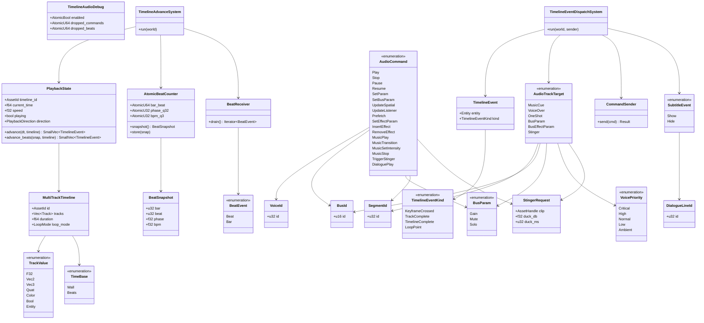
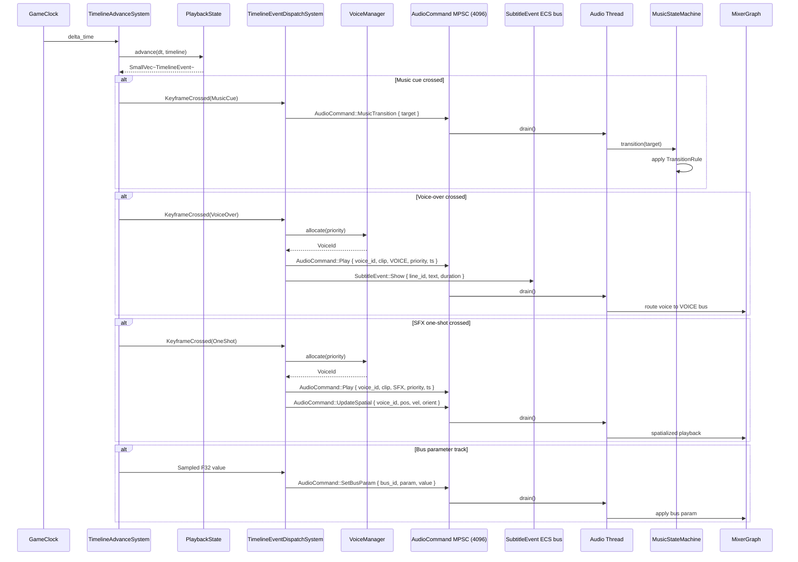
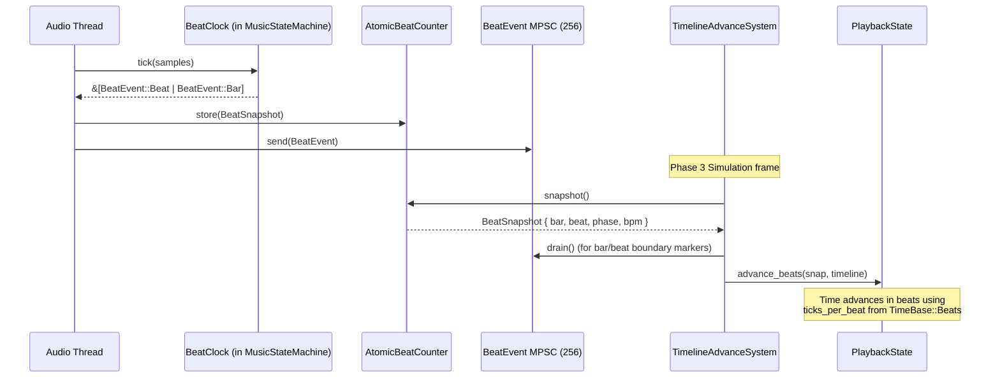

# Timelines ↔ Audio Integration Design

> **Compliance.** This document follows the cross-cutting conventions in
> [shared-conventions.md](shared-conventions.md) (SC-1..SC-14) and the channel-capacity formula
> in [shared-messaging-capacities.md](shared-messaging-capacities.md). Deviations: none.

## Systems Involved

| System | Design | Domain |
|--------|--------|--------|
| Timelines | [timelines.md](../simulation/timelines.md) | Simulation |
| Audio | [audio.md](../audio/audio.md) | Audio |

## Integration Requirements

| ID | Requirement | Systems |
|----|-------------|---------|
| IR-4.7.1 | Timeline tracks trigger music cues | TL, Audio |
| IR-4.7.2 | Timeline tracks drive voice-over timing | TL, Audio |
| IR-4.7.3 | Timeline keyframes fire sound events | TL, Audio |
| IR-4.7.4 | Beat clock syncs timeline to music tempo | TL, Audio |
| IR-4.7.5 | Timeline controls mixer bus parameters | TL, Audio |
| IR-4.7.6 | Dialogue tracks with subtitle sync | TL, Audio |

1. **IR-4.7.1** -- A `TrackValue::Entity` keyframe referencing a `MusicCueComponent` entity fires a
   `TimelineEvent` when playback crosses it. `TimelineEventDispatchSystem` resolves the entity to
   its `SegmentId` and sends `AudioCommand::MusicPlay { cue }` or
   `AudioCommand::MusicTransition { target }` into the audio MPSC command queue. The audio thread
   routes the command to `MusicStateMachine::play` / `transition`, which applies the
   `TransitionRule` edge stored in the `SegmentGraph` (`ImmediateCut`, `TimedCrossfade`,
   `BeatSyncCrossfade`, `NextBar`, `CustomCurve`).
2. **IR-4.7.2** -- Voice-over dialogue keyframes are stored as `TrackValue::Entity` referencing an
   entity with an `AudioSource` component. `TimelineEventDispatchSystem` allocates a `VoiceId` via
   `VoiceManager::allocate(priority)` on the game thread, then sends
   `AudioCommand::Play { voice_id, clip, bus: BusId::VOICE, priority, timestamp }` into the MPSC
   queue. The same frame it also publishes a `SubtitleEvent` on the ECS event bus.
3. **IR-4.7.3** -- SFX keyframes (`TrackValue::Entity` referencing an SFX `AudioSource`) send
   `AudioCommand::Play { voice_id, clip, bus: BusId::SFX, priority, timestamp }` followed by
   `AudioCommand::UpdateSpatial { voice_id, position, velocity, orientation }` so the audio thread
   places the voice in 3D. The game thread allocates the `VoiceId` before sending.
4. **IR-4.7.4** -- `BeatClock` lives inside `MusicStateMachine` on the audio thread. It publishes
   `BeatEvent` values (`Beat | Bar`) each audio buffer. A **reverse MPSC channel** (audio → game,
   bounded 256 entries) plus a shared `AtomicBeatCounter` (monotonic `u64` bar×beat counter and
   phase numerator) carries beat data to the simulation thread. A timeline configured with
   `TimeBase::Beats { ticks_per_beat }` advances via `PlaybackState::advance_beats` using the latest
   `(bar, beat, phase)` snapshot from the atomic counter.
5. **IR-4.7.5** -- `TrackValue::F32` tracks animate mixer bus parameters via `TrackBindings` that
   resolve to `(BusId, BusParam)`. `TimelineEventDispatchSystem` sends
   `AudioCommand::SetBusParam { bus_id, param, value }` each frame the track produces a new sample.
   Only `BusParam` variants defined in the canonical audio API (`Gain`, `Mute`, `Solo`) are valid;
   filter sweeps use `AudioCommand::SetEffectParam { bus, node_index, param, value }` against a
   biquad insert effect configured on the target bus.
6. **IR-4.7.6** -- Dialogue tracks pair `AudioCommand::Play` with a `SubtitleEvent` ECS event. Both
   are dispatched in the same simulation frame by `TimelineEventDispatchSystem`; the UI subtitle
   widget reads the event and displays the line for `duration_ms` or until it receives a matching
   `SubtitleEvent::Hide { line_id }`.

### Scope Note

2D and 2.5D projections are intentionally out of scope for this integration. 2D games set
`Vec3::ZERO` velocity and `z = 0` in `AudioCommand::UpdateSpatial`; no separate 2D path exists.

## Data Contracts

| Type | Defined in | Direction | Purpose |
|------|-----------|-----------|---------|
| `MultiTrackTimeline` | Timelines | Timelines → Timelines | Asset container |
| `PlaybackState` | Timelines | Timelines → Timelines | Playback control |
| `TimelineEvent` | Timelines | Timelines → integration | Keyframe crossing |
| `TrackValue` | Timelines | Timelines → integration | Typed sample value |
| `AudioCommand` | Audio | Timelines (producer) → Audio (consumer) | Command queue entry |
| `BusId` / `BusParam` | Audio | Audio → Timelines (read) | Target selector |
| `SegmentId` | Audio | Audio → Timelines (read) | Music cue id |
| `VoiceId` / `VoicePriority` | Audio | Audio → Timelines (read) | Voice handle |
| `StingerRequest` | Audio | Timelines → Audio | Stinger payload |
| `BeatEvent` | Audio | Audio (producer) → Timelines (consumer) | Tempo tick |
| `AtomicBeatCounter` | This design | Audio → Timelines (read) | Lock-free beat snapshot |
| `SubtitleEvent` | This design | Timelines → UI | Dialogue display |

1. **Command channel.** The timeline→audio command channel is the
   **MPSC, lock-free, bounded 4096-entry** queue from `audio.md` § Command Queue. Multiple
   game-thread systems produce; the audio thread drains each callback.
2. **Beat channel.** The audio→timeline beat channel is an MPSC lock-free bounded queue (capacity
   256). The audio thread is the producer; game-thread systems (currently just
   `TimelineAdvanceSystem`) are consumers. The shared `AtomicBeatCounter` provides a point-in-time
   read that avoids unbounded accumulation when the game thread stalls.
3. **`SubtitleEvent` definition** — see API Design below. Defined in this integration design and
   cross-referenced by `docs/design/ui/overlays.md`.

### API Design

```rust
/// Shared beat snapshot written by the audio thread, read by the
/// simulation thread. All fields are monotonic and updated with a
/// single `Release` store per audio buffer.
pub struct AtomicBeatCounter {
    /// Total beats elapsed since `MusicStateMachine::play`.
    bar_beat: AtomicU64,
    /// Fractional phase within the current beat, scaled to u32.
    phase_q32: AtomicU32,
    /// Current tempo in BPM, scaled to u32 (bpm * 1000).
    bpm_q3: AtomicU32,
}

impl AtomicBeatCounter {
    pub fn snapshot(&self) -> BeatSnapshot;          // Acquire load
    pub fn store(&self, snap: BeatSnapshot);         // Release store
}

#[derive(Clone, Copy, Debug)]
pub struct BeatSnapshot {
    pub bar: u32,
    pub beat: u32,
    pub phase: f32, // 0.0 .. 1.0
    pub bpm: f32,
}

/// Dialogue subtitle event. Written to the ECS event bus by
/// `TimelineEventDispatchSystem`, read by the UI subtitle widget.
#[derive(Clone, Debug)]
pub enum SubtitleEvent {
    Show {
        line_id: DialogueLineId,
        text: Arc<str>,    // Arc only because the payload is immutable.
        speaker: Option<StringId>,
        duration_ms: u32,
    },
    Hide { line_id: DialogueLineId },
}

#[derive(Clone, Copy, Debug, PartialEq, Eq, Hash)]
pub struct DialogueLineId(pub u32);

/// Timeline track binding for audio targets. Resolved at asset load
/// time; no runtime string lookup.
#[derive(Clone, Debug, rkyv::Archive, rkyv::Serialize, rkyv::Deserialize)]
pub enum AudioTrackTarget {
    MusicCue { segment: SegmentId },
    VoiceOver {
        clip: AssetHandle<AudioClip>,
        priority: VoicePriority,
        line_id: DialogueLineId,
        duration_ms: u32,
    },
    OneShot {
        clip: AssetHandle<AudioClip>,
        bus: BusId,
        priority: VoicePriority,
    },
    BusParam { bus: BusId, param: BusParam },
    BusEffectParam { bus: BusId, node_index: u32, param: ParamId },
    Stinger { request: StingerRequest },
}

/// Time base for timeline playback.
#[derive(Clone, Copy, Debug, rkyv::Archive, rkyv::Serialize, rkyv::Deserialize)]
pub enum TimeBase {
    Wall,
    Beats { ticks_per_beat: u32 },
}

/// Runtime-toggleable debug resource for the bridge.
pub struct TimelineAudioDebug {
    pub enabled: AtomicBool,
    pub dropped_commands: AtomicU64,
    pub dropped_beats: AtomicU64,
    pub last_transition: Mutex<Option<SegmentId>>,
}
```

### Class Diagram



## Data Flow



### Beat-Synced Timeline



### Algorithm References

1. **TransitionRule::BeatSyncCrossfade** implemented per Sweet, "Writing Interactive Music for Video
   Games", ch. 11 (beat-aligned equal-power crossfade). See `audio.md` § Adaptive Music.
2. **Beat phase interpolation** uses the sample-accurate counter in Brandtsegg & Johansen,
   "Audio-Rate Timing for Real-Time Musical Applications", ICMC 2013.
3. **VoicePriority allocation and stealing** follows the audibility-score rule in Boer, "Game Audio
   Programming: Principles and Practices", vol. 2, ch. 4.

## Timing and Ordering

| System | Thread | Phase | Timestep | Order |
|--------|--------|-------|----------|-------|
| GameClock | Game | 3-Simulation | Fixed | 1st |
| BeatClock | Audio | Per-buffer | Continuous | Buffer callback |
| AtomicBeatCounter store | Audio | Per-buffer | Continuous | After BeatClock tick |
| AtomicBeatCounter snapshot | Game | 3-Simulation | Fixed | Before TAS |
| TimelineAdvanceSystem | Game | 3-Simulation | Fixed | After clock snapshot |
| TimelineEventDispatchSystem | Game | 3-Simulation | Fixed | After advance |
| AudioCommand drain | Audio | Per-buffer | Continuous | Start of callback |

1. Timeline systems run in Phase 3 (Simulation) at the fixed timestep. Audio commands are enqueued
   into the bounded MPSC (4096) and drained by the audio thread at its next buffer callback; total
   latency is well under one audio buffer period (typically 5-10 ms at 48 kHz / 256 samples).
2. Beat data flows audio → game via the `AtomicBeatCounter` for point-in-time reads and the bounded
   MPSC (256) for boundary events. Both are written once per audio buffer and consumed once per
   simulation frame; the counter snapshot is authoritative.
3. Animation/audio/subtitle events emitted in a given simulation frame are
   **consumed in the same frame** — `TimelineEventDispatchSystem` is scheduled immediately after
   `TimelineAdvanceSystem` inside Phase 3. No one-frame delay.

### Performance Budget

| Metric | Budget | Notes |
|--------|--------|-------|
| TAS + TED per frame | < 0.5 ms | 32 active timelines, 200 keyframes |
| MPSC send p99 | < 5 us | Lock-free bounded queue |
| Event-to-sound latency | < 10 ms | One audio buffer period |
| BeatSnapshot read | < 100 ns | Two `Acquire` loads |

### Debug Toggles

A runtime-toggleable `TimelineAudioDebug` ECS resource enables per-bridge logging. When enabled, the
bridge records each dispatched command, each dropped command (queue full), each dropped beat event,
and the most recent music transition into a ring buffer the profiler overlay reads. Toggling flips a
single `AtomicBool`; no recompile required.

## Fallbacks and Failure Modes

| # | Failure | Impact |
|---|---------|--------|
| F1 | Audio asset not loaded | Silent cue |
| F2 | `AudioCommand` MPSC full | Dropped command |
| F3 | Beat MPSC full | Missed bar/beat marker |
| F4 | `BeatClock` drift vs wall clock | Desync |
| F5 | Timeline seeks past cue | Missed event |
| F6 | Music transition overlap | Glitch |
| F7 | `VoiceManager::allocate` returns `None` | Dropped voice |
| F8 | `SegmentId` unknown | No-op |

1. **F1** — Log warning; skip the `Play` command; keep the timeline advancing so dependent tracks
   continue to fire.
2. **F2** — `send` returns `Err`; `TimelineAudioDebug.dropped_commands` increments; the bridge drops
   the oldest low-priority entry first so critical commands (music, voice) are preserved.
3. **F3** — Rely on the `AtomicBeatCounter` snapshot only; `TimelineAudioDebug.dropped_beats`
   increments. Bar/beat boundary markers may be missed for one frame but cumulative tempo position
   stays correct.
4. **F4** — Resync on the next bar boundary. `PlaybackState::advance_beats` clamps its effective
   rate to the latest snapshot `bpm` to bound drift to one buffer period.
5. **F5** — `PlaybackState::advance` replays every cue whose time lies between `old_time` and
   `new_time` so no keyframe is silently skipped.
6. **F6** — `MusicStateMachine::transition` cancels any in-progress transition at the next beat
   boundary; if the boundary is already past, the fallback is `TransitionRule::ImmediateCut`.
7. **F7** — `VoiceManager` steals the lowest-priority active voice per `VoicePriority`. If no voice
   can be stolen, the event is skipped and a warning is logged.
8. **F8** — Log a warning and do not enqueue the command; the timeline continues advancing.

## Platform Considerations

None -- timeline-to-audio integration is identical across all platforms. The audio thread backend
(WASAPI, CoreAudio, ALSA/PipeWire) is abstracted by the audio system; MPSC queues and the
`AtomicBeatCounter` use platform-agnostic `std::sync::atomic` and `crossbeam` primitives.

## Test Plan

See companion [timelines-audio-test-cases.md](timelines-audio-test-cases.md). Every integration test
is CI-runnable with no manual audio-device setup; the audio thread runs against a null backend and
the MPSC queues are exercised directly. Negative tests cover all failure modes in the table above.
Benchmarks link to the performance budget table and run under `cargo bench`.

## Review Status

| # | Item | Status |
|---|------|--------|
| 1 | Use canonical `AudioCommand` instead of inventing `TimelineAudioCommand` | APPLIED |
| 2 | `Play` command uses `voice_id`, `priority`, `timestamp` fields | APPLIED |
| 3 | Music cues use `SegmentId` + `MusicPlay`/`MusicTransition`/`TriggerStinger` | APPLIED |
| 4 | Rename `AudioBusId`/`AudioBusParam` to canonical `BusId`/`BusParam` | APPLIED |
| 5 | `BeatClock` transport: audio→game MPSC (256) + `AtomicBeatCounter` documented | APPLIED |
| 6 | `SubtitleEvent` enum defined in this design with Data Contracts entry | APPLIED |
| 7 | Added `classDiagram` covering every type, enum variant, and relationship | APPLIED |
| 8 | Timing table owns beat data on audio thread; game thread reads snapshot | APPLIED |
| 9 | Removed `AudioBusGain`/`AudioBusFilter`; use `SetBusParam`/`SetEffectParam` | APPLIED |
| 10 | Negative tests added for queue-full, beat drift, transition overlap | APPLIED |
| 11 | `BeatEvent` diagram uses canonical `Beat | Bar` variants only | APPLIED |
| 12 | Data Contracts table shows Timelines as producer and Audio as consumer | APPLIED |
| 13 | 2D / 2.5D scope note added | APPLIED |
| 14 | `Stinger` uses canonical `StingerRequest` payload | APPLIED |
| 15 | MPSC channel buffer lengths documented (4096 commands, 256 beats) | APPLIED |
| 16 | Algorithm references added for transitions, beat phase, voice stealing | APPLIED |
| 17 | Runtime-toggleable `TimelineAudioDebug` resource documented | APPLIED |
| 18 | Performance budget table added | APPLIED |
| 19 | All fallbacks documented in a single failure-mode table | APPLIED |
| 20 | All enums fully defined in classDiagram | APPLIED |
| 21 | Interface-level code only (no implementation bodies) | APPLIED |
| 22 | `Arc` used only for immutable subtitle text payload | APPLIED |
