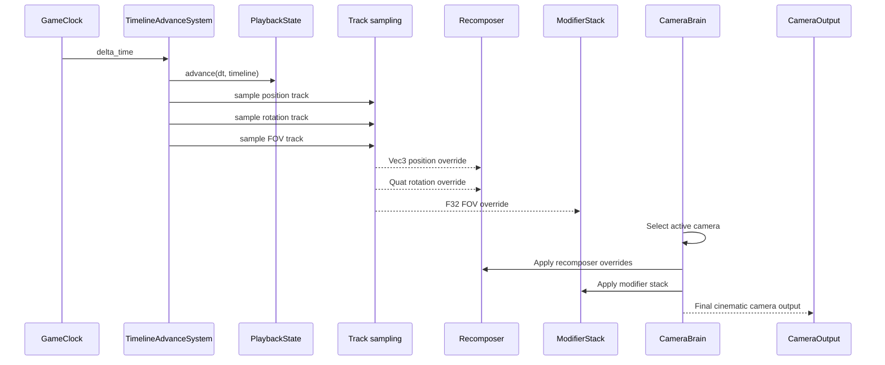
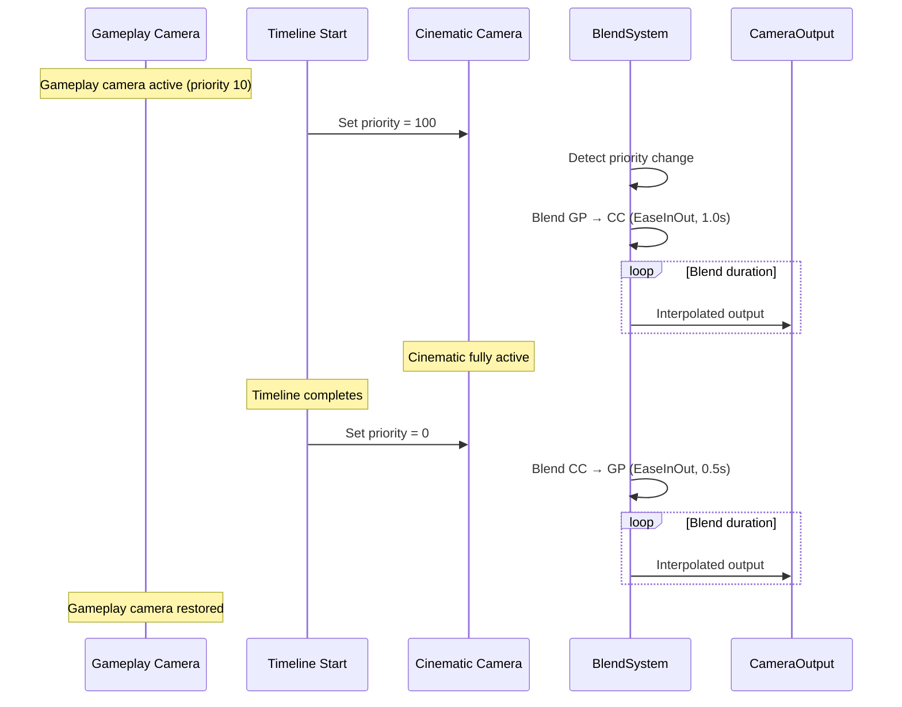

# Timelines ↔ Camera Integration Design

## Systems Involved

| System | Design | Domain |
|--------|--------|--------|
| Timelines | [timelines.md](../simulation/timelines.md) | Simulation |
| Camera | [camera.md](../game-framework/camera.md) | Camera |

## Integration Requirements

| ID | Requirement | Systems |
|----|-------------|---------|
| IR-4.8.1 | Timeline tracks animate camera position | TL, Camera |
| IR-4.8.2 | Timeline tracks animate camera rotation | TL, Camera |
| IR-4.8.3 | Timeline tracks animate camera FOV | TL, Camera |
| IR-4.8.4 | Recomposer overrides from timeline tracks | TL, Camera |
| IR-4.8.5 | Camera sequencer driven by timeline | TL, Camera |
| IR-4.8.6 | Blend between gameplay and cinematic cam | TL, Camera |
| IR-4.8.7 | Spline dolly position from timeline curve | TL, Camera |

1. **IR-4.8.1** -- A `TrackValue::Vec3` track named "camera_position" is sampled each tick by
   `TimelineAdvanceSystem`. The sampled value is an absolute world-space position. The
   `TimelineCameraApplySystem` computes the delta between the sampled position and the behavior
   output, then writes the delta to `Recomposer.position_offset` (camera-local space).
2. **IR-4.8.2** -- A `TrackValue::Quat` track named "camera_rotation" is sampled. The system
   converts the quaternion to euler degrees (pitch, yaw, roll) matching the
   `Recomposer.rotation_offset: Vec3` field type, then writes the euler offset relative to the
   behavior rotation output.
3. **IR-4.8.3** -- A `TrackValue::F32` track named "camera_fov" is sampled and written to
   `CameraOutput.projection` via a `CameraModifierType::FovOverride` in the modifier stack.
4. **IR-4.8.4** -- The `Recomposer` extension (F-13.25.35) accepts position, rotation, and blend
   weight overrides from timeline tracks. `TimelineCameraBinding.blend_weight` writes through to
   `Recomposer.blend_weight` each tick -- the binding field is the sole authority and the Recomposer
   field is the consumed value.
5. **IR-4.8.5** -- Each `SequencerEntry` references a `MultiTrackTimeline` via
   `timeline_handle: AssetHandle<MultiTrackTimeline>`. When a sequencer entry becomes active, the
   system spawns a `PlaybackState` for the timeline and switches to the entry's virtual camera.
6. **IR-4.8.6** -- Entering a cinematic timeline pushes a high-priority `VirtualCamera` with
   timeline-driven position/rotation. The `BlendSystem` smoothly blends from the gameplay camera. On
   exit, priority drops and blend returns to gameplay.
7. **IR-4.8.7** -- A `TrackValue::F32` track drives `SplineDolly` path position (0.0 to 1.0). The
   timeline controls where along the spline the camera sits, with interpolation mode determining
   easing.

## Data Contracts

| Type | Defined in | Consumed by | Purpose |
|------|-----------|-------------|---------|
| `MultiTrackTimeline` | Timelines | Camera | Animation asset |
| `PlaybackState` | Timelines | Camera | Current time |
| `TimelineEvent` | Timelines | Camera | Completion signal |
| `TrackValue::Vec3` | Timelines | Camera | Position curve |
| `TrackValue::Quat` | Timelines | Camera | Rotation curve |
| `TrackValue::F32` | Timelines | Camera | FOV / dolly pos |
| `Recomposer` | Camera | Camera | Override bridge |
| `CameraSequencer` | Camera | Camera | Timed playlist |
| `SplineDolly` | Camera | Camera | Path position |
| `BlendSystem` | Camera | Camera | Transition blend |
| `VirtualCamera` | Camera | Camera | Priority selection |
| `CameraModifierStack` | Camera | Camera | FOV override |

```rust
/// Binds timeline tracks to camera override
/// properties on a Recomposer component.
pub struct TimelineCameraBinding {
    /// Timeline asset driving this camera.
    pub timeline: AssetId,
    /// Track ID for position (Vec3). Optional.
    pub position_track: Option<TrackId>,
    /// Track ID for rotation (Quat). Optional.
    pub rotation_track: Option<TrackId>,
    /// Track ID for FOV (F32). Optional.
    pub fov_track: Option<TrackId>,
    /// Track ID for dolly position (F32). Optional.
    pub dolly_track: Option<TrackId>,
    /// Blend weight between gameplay and timeline.
    /// 0.0 = full gameplay, 1.0 = full timeline.
    pub blend_weight: f32,
}
```

## Data Flow



### Cinematic Enter/Exit Blend



## Timing and Ordering

| System | Phase | Timestep | Order |
|--------|-------|----------|-------|
| GameClock | 3-Simulation | Fixed | 1st |
| TimelineAdvance | 3-Simulation | Fixed | After clock |
| Recomposer write | 3-Simulation | Fixed | After timeline |
| CameraBrain eval | 6-Animation | Variable | After sim |
| BlendSystem | 6-Animation | Variable | With brain |
| ModifierStack | 6-Animation | Variable | After blend |

Timelines sample tracks in Phase 3 and write overrides to `Recomposer`. The camera brain evaluates
in Phase 6, reads the overrides, and produces the final output. This ensures simulation-driven
camera changes are visible in the same frame.

## Failure Modes

| Failure | Impact | Recovery |
|---------|--------|----------|
| Timeline asset not loaded | No camera motion | Hold last camera state |
| Track type mismatch | Wrong data | Validate at load, skip track |
| Blend weight out of range | Visual snap | Clamp to [0.0, 1.0] |
| Sequencer entry missing cam | No camera switch | Stay on current camera |
| Timeline loops unexpectedly | Camera resets | Respect LoopMode setting |
| Dolly track > 1.0 | Past spline end | Clamp to [0.0, 1.0] |

## Platform Considerations

None -- timeline-to-camera integration is identical across all platforms. Camera evaluation order
and blend curves are deterministic.

## Test Plan

See companion [timelines-camera-test-cases.md](timelines-camera-test-cases.md).

## Review Feedback

1. [CONFIDENT] The `TimelineCameraBinding` struct uses `rotation_track: Option<TrackId>` typed as
   `TrackValue::Quat`, but the canonical `Recomposer` in `camera.md` stores `rotation_offset: Vec3`
   (euler degrees), not a quaternion. Either the binding must convert Quat to euler or the
   Recomposer field type must be reconciled.
2. [CONFIDENT] IR-4.8.1 says the sampled Vec3 is "written to the Recomposer position override,"
   implying an absolute position. The canonical `Recomposer.position_offset` is an additive offset
   in camera-local space. Clarify whether the timeline drives an absolute world-space position or an
   offset, and document the coordinate-space conversion.
3. [CONFIDENT] No `classDiagram` is present. The design CLAUDE.md requires "a Mermaid classDiagram
   covering ALL types: structs, enums, traits, type aliases, and their relationships." Add one
   showing `TimelineCameraBinding`, `Recomposer`, `CameraSequencer`, `SplineDolly`,
   `MultiTrackTimeline`, `PlaybackState`, and `TrackValue`.
4. [CONFIDENT] The document has no 2D/2.5D camera consideration. The constraints mandate first-class
   2D/2.5D support. Timeline-driven camera in orthographic/2D mode (e.g., zoom instead of FOV, Vec2
   position instead of Vec3) is not addressed.
5. [CONFIDENT] `TimelineCameraBinding.blend_weight` duplicates `Recomposer.blend_weight`. The design
   should clarify which is authoritative and whether both are needed, or whether the binding simply
   writes through to the Recomposer field.
6. [CONFIDENT] The `TimelineCameraBinding` struct uses `AssetId` for the timeline field, which is
   consistent with the timelines design. However, the camera design uses `Handle<SplineAsset>` for
   spline references. Confirm `AssetId` vs `Handle` convention is intentional.
7. [UNCERTAIN] IR-4.8.5 says `CameraSequencer` entries "reference `PlaybackState` timelines." The
   canonical `SequencerEntry` in `camera.md` contains `camera: Entity`, `hold_time: f32`, and
   `blend: BlendDefinition` -- no `PlaybackState` or timeline reference. The integration design may
   require extending `SequencerEntry` but does not propose the struct change.
8. [CONFIDENT] The test case companion file covers all seven IRs (4.8.1 through 4.8.7) with at least
   one test case each, plus three benchmarks. Coverage is adequate.
9. [CONFIDENT] No failure-mode test cases exist. The design lists six failure modes (asset not
   loaded, type mismatch, blend OOB, missing cam, unexpected loop, dolly > 1.0) but the companion
   test file has no negative/error-path tests for any of them.
10. [UNCERTAIN] The Timing and Ordering table places Recomposer writes in Phase 3 (Simulation, Fixed
    timestep) and CameraBrain in Phase 6 (Animation, Variable timestep). If multiple fixed-step
    ticks run per frame, the Recomposer will be overwritten multiple times before the camera brain
    reads it. Confirm this is the intended behavior and document whether only the last tick's value
    is used.
11. [CONFIDENT] The document structure matches the integration template sections (Systems Involved,
    Integration Requirements, Data Contracts, Data Flow, Timing and Ordering, Failure Modes,
    Platform Considerations, Test Plan). All required sections are present.
12. [CONFIDENT] No `Arc`, `Rc`, `Cell`, `RefCell`, `HashMap`, `serde`, `async`, or `await` appear
    anywhere in the design. The design complies with the prohibited-pattern constraints.
