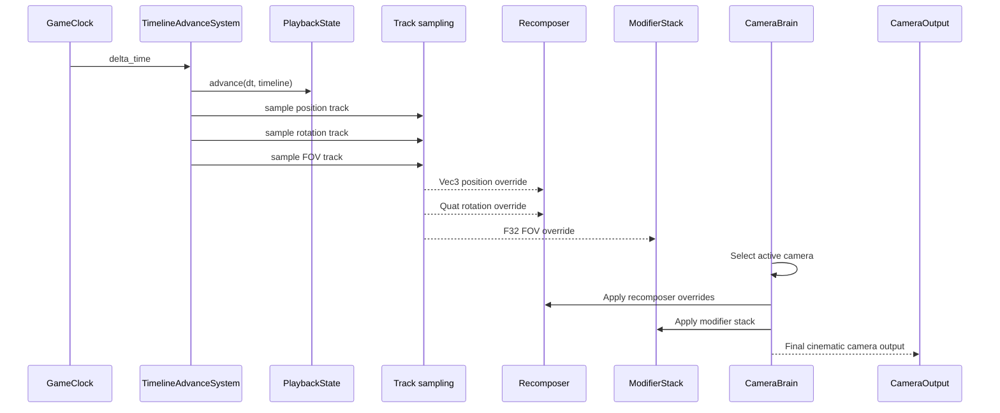
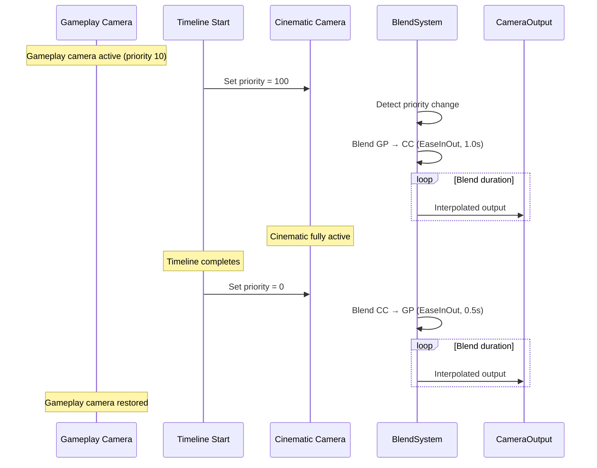

# Timelines ↔ Camera Integration Design

## Systems Involved

| System | Design | Domain |
|--------|--------|--------|
| Timelines | [timelines.md](../simulation/timelines.md) | Simulation |
| Camera | [camera.md](../game-framework/camera.md) | Camera |

## Integration Requirements

| ID | Requirement | Systems |
|----|-------------|---------|
| IR-4.8.1 | Timeline tracks animate camera position | TL, Camera |
| IR-4.8.2 | Timeline tracks animate camera rotation | TL, Camera |
| IR-4.8.3 | Timeline tracks animate camera FOV | TL, Camera |
| IR-4.8.4 | Recomposer overrides from timeline tracks | TL, Camera |
| IR-4.8.5 | Camera sequencer driven by timeline | TL, Camera |
| IR-4.8.6 | Blend between gameplay and cinematic cam | TL, Camera |
| IR-4.8.7 | Spline dolly position from timeline curve | TL, Camera |

1. **IR-4.8.1** -- A `TrackValue::Vec3` track named "camera_position" is sampled each tick by
   `TimelineAdvanceSystem`. The sampled value is written to the `Recomposer` position override on
   the active virtual camera entity, overriding the position behavior.
2. **IR-4.8.2** -- A `TrackValue::Quat` track named "camera_rotation" is sampled and written to the
   `Recomposer` rotation override, bypassing the rotation behavior (PanTilt, HardLookAt, etc.).
3. **IR-4.8.3** -- A `TrackValue::F32` track named "camera_fov" is sampled and written to
   `CameraOutput.projection` via a `CameraModifierType::FovOverride` in the modifier stack.
4. **IR-4.8.4** -- The `Recomposer` extension (F-13.25.35) accepts position, rotation, and blend
   weight overrides from timeline tracks. Blend weight allows smooth transitions between gameplay
   camera and timeline-driven camera.
5. **IR-4.8.5** -- `CameraSequencer` entries reference `PlaybackState` timelines. When a sequencer
   entry becomes active, it plays the associated timeline and switches to the sequencer's virtual
   camera.
6. **IR-4.8.6** -- Entering a cinematic timeline pushes a high-priority `VirtualCamera` with
   timeline-driven position/rotation. The `BlendSystem` smoothly blends from the gameplay camera. On
   exit, priority drops and blend returns to gameplay.
7. **IR-4.8.7** -- A `TrackValue::F32` track drives `SplineDolly` path position (0.0 to 1.0). The
   timeline controls where along the spline the camera sits, with interpolation mode determining
   easing.

## Data Contracts

| Type | Defined in | Consumed by | Purpose |
|------|-----------|-------------|---------|
| `MultiTrackTimeline` | Timelines | Camera | Animation asset |
| `PlaybackState` | Timelines | Camera | Current time |
| `TimelineEvent` | Timelines | Camera | Completion signal |
| `TrackValue::Vec3` | Timelines | Camera | Position curve |
| `TrackValue::Quat` | Timelines | Camera | Rotation curve |
| `TrackValue::F32` | Timelines | Camera | FOV / dolly pos |
| `Recomposer` | Camera | Camera | Override bridge |
| `CameraSequencer` | Camera | Camera | Timed playlist |
| `SplineDolly` | Camera | Camera | Path position |
| `BlendSystem` | Camera | Camera | Transition blend |
| `VirtualCamera` | Camera | Camera | Priority selection |
| `CameraModifierStack` | Camera | Camera | FOV override |

```rust
/// Binds timeline tracks to camera override
/// properties on a Recomposer component.
pub struct TimelineCameraBinding {
    /// Timeline asset driving this camera.
    pub timeline: AssetId,
    /// Track ID for position (Vec3). Optional.
    pub position_track: Option<TrackId>,
    /// Track ID for rotation (Quat). Optional.
    pub rotation_track: Option<TrackId>,
    /// Track ID for FOV (F32). Optional.
    pub fov_track: Option<TrackId>,
    /// Track ID for dolly position (F32). Optional.
    pub dolly_track: Option<TrackId>,
    /// Blend weight between gameplay and timeline.
    /// 0.0 = full gameplay, 1.0 = full timeline.
    pub blend_weight: f32,
}
```

## Data Flow



### Cinematic Enter/Exit Blend



## Timing and Ordering

| System | Phase | Timestep | Order |
|--------|-------|----------|-------|
| GameClock | 3-Simulation | Fixed | 1st |
| TimelineAdvance | 3-Simulation | Fixed | After clock |
| Recomposer write | 3-Simulation | Fixed | After timeline |
| CameraBrain eval | 6-Animation | Variable | After sim |
| BlendSystem | 6-Animation | Variable | With brain |
| ModifierStack | 6-Animation | Variable | After blend |

Timelines sample tracks in Phase 3 and write overrides to `Recomposer`. The camera brain evaluates
in Phase 6, reads the overrides, and produces the final output. This ensures simulation-driven
camera changes are visible in the same frame.

## Failure Modes

| Failure | Impact | Recovery |
|---------|--------|----------|
| Timeline asset not loaded | No camera motion | Hold last camera state |
| Track type mismatch | Wrong data | Validate at load, skip track |
| Blend weight out of range | Visual snap | Clamp to [0.0, 1.0] |
| Sequencer entry missing cam | No camera switch | Stay on current camera |
| Timeline loops unexpectedly | Camera resets | Respect LoopMode setting |
| Dolly track > 1.0 | Past spline end | Clamp to [0.0, 1.0] |

## Platform Considerations

None -- timeline-to-camera integration is identical across all platforms. Camera evaluation order
and blend curves are deterministic.

## Test Plan

See companion [timelines-camera-test-cases.md](timelines-camera-test-cases.md).
