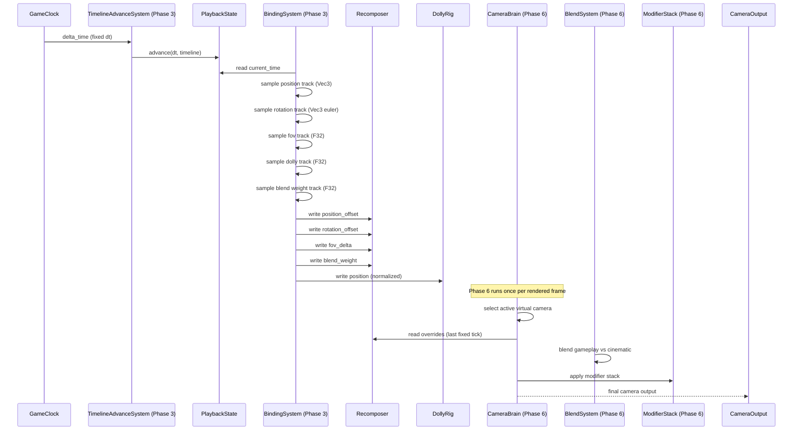
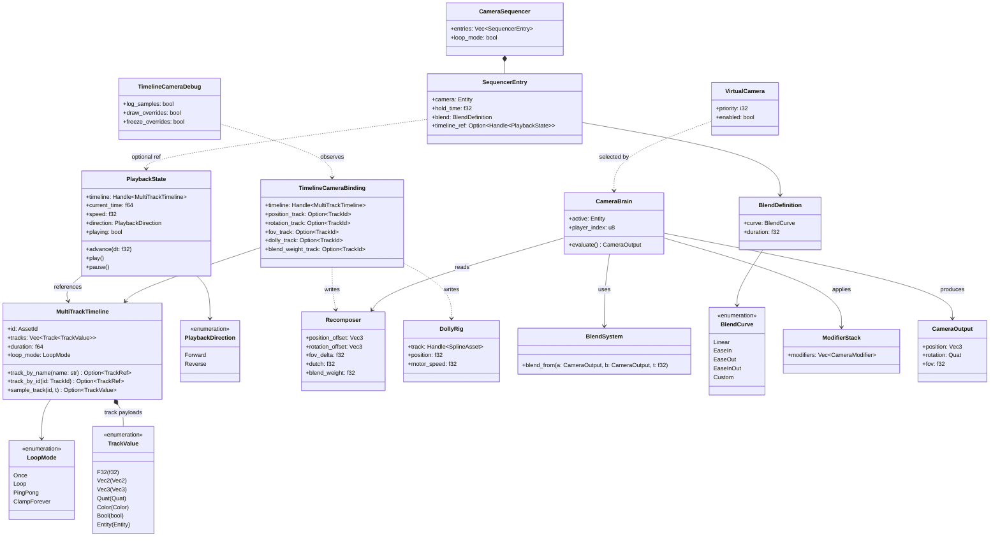

# Timelines ↔ Camera Integration Design

## Systems Involved

| System | Design | Domain |
|--------|--------|--------|
| Timelines | [timelines.md](../simulation/timelines.md) | Simulation |
| Camera | [camera.md](../game-framework/camera.md) | Game Framework |

## Integration Requirements

| ID | Requirement | Systems |
|----|-------------|---------|
| IR-4.8.1 | Timeline tracks animate camera position | TL, Cam |
| IR-4.8.2 | Timeline tracks animate camera rotation | TL, Cam |
| IR-4.8.3 | Timeline tracks animate camera FOV | TL, Cam |
| IR-4.8.4 | Recomposer overrides from timeline tracks | TL, Cam |
| IR-4.8.5 | Camera sequencer driven by timeline | TL, Cam |
| IR-4.8.6 | Blend between gameplay and cinematic cam | TL, Cam |
| IR-4.8.7 | Spline dolly position from timeline curve | TL, Cam |

1. **IR-4.8.1** -- A `TrackValue::Vec3` track named `camera_position` is sampled each tick by
   `TimelineAdvanceSystem`. The sampled value is an **offset in camera-local space** that is written
   directly to `Recomposer.position_offset: Vec3`. No world-space conversion is performed. The
   coordinate-space choice aligns with the canonical `Recomposer` definition in
   [camera.md](../game-framework/camera.md) so timeline-authored moves compose additively with the
   gameplay behavior output.
2. **IR-4.8.2** -- A `TrackValue::Vec3` track named `camera_rotation` is sampled. The track stores
   **euler angles in degrees** (pitch, yaw, roll) to match `Recomposer.rotation_offset: Vec3`
   exactly. `TrackValue::Quat` is intentionally **not** used for camera rotation; Quat remains
   available for skeletal animation and other consumers, but the canonical rotation type across the
   Timelines--Camera boundary is `Vec3` euler degrees.
3. **IR-4.8.3** -- A `TrackValue::F32` track named `camera_fov` is sampled and written to
   `Recomposer.fov_delta: f32` (additive delta in degrees). The modifier stack applies the delta on
   top of the behavior-computed FOV during Phase 6 camera evaluation.
4. **IR-4.8.4** -- The `Recomposer` extension (F-13.25.35) consumes position, rotation, FOV, and
   blend-weight overrides driven by timeline tracks. `TimelineCameraBinding` is an authoring-side
   binding component that names the tracks; `Recomposer` is the
   **sole authoritative runtime store**. `TimelineCameraBinding` has no `blend_weight` field. The
   binding system writes all sampled values (including the blend weight from a dedicated
   `blend_weight_track`) directly into the `Recomposer` component each tick.
5. **IR-4.8.5** -- `SequencerEntry` is extended with a new optional field
   `timeline_ref: Option<Handle<PlaybackState>>` that references a `PlaybackState` component entity.
   When an entry with a `timeline_ref` becomes active, the sequencer system ensures the referenced
   `PlaybackState` is playing (calling `PlaybackState::play()`) and switches the camera brain to the
   entry's virtual camera. The extension is additive; entries without `timeline_ref` behave exactly
   as today.
6. **IR-4.8.6** -- Entering a cinematic timeline pushes a high-priority `VirtualCamera` with
   timeline-driven position/rotation. The `BlendSystem` smoothly blends from the gameplay camera. On
   exit, priority drops and the blend returns to gameplay. The blend runs in Phase 6 so fixed-step
   simulation overwrites are coalesced before interpolation (see Timing and Ordering).
7. **IR-4.8.7** -- A `TrackValue::F32` track drives `DollyRig.position` (normalized [0.0, 1.0]) for
   the spline dolly rig. The timeline controls where along the spline the camera sits; interpolation
   mode on the track keyframes determines easing. Out-of-range values are clamped (see Failure
   Modes).

## Requirements Trace

| Concern | Feature | Requirement | User Story |
|---------|---------|-------------|-----------|
| Track primitive | F-17.4.1 | R-17.4.1 | US-17.4.9 |
| MultiTrackTimeline asset | F-17.4.3 | R-17.4.3 | US-17.4.7 |
| PlaybackState component | F-17.4.6 | R-17.4.6 | US-17.4.7 |
| Recomposer | F-13.25.35 | R-13.25.35 | US-13.25.35.1 |
| Spline Dolly | F-13.25.8 | R-13.25.8 | US-13.25.8.1 |
| Camera Sequencer | F-13.25.26 | R-13.25.26 | US-13.25.26.1 |
| Modifier stack | F-13.25.36 | R-13.25.36 | US-13.25.35.1 |

## Data Contracts

| Type | Producer | Consumer | Purpose |
|------|----------|----------|---------|
| `MultiTrackTimeline` | Asset pipeline | Binding system | Animation asset |
| `PlaybackState` | Game code | Advance system | Current time |
| `TrackValue::Vec3` | Track sample | Recomposer | Position / rot offsets |
| `TrackValue::F32` | Track sample | Recomposer / DollyRig | FOV, dolly, weight |
| `TimelineCameraBinding` | Authoring | Binding system | Track name bindings |
| `Recomposer` | Binding system | CameraBrain | Override store |
| `SequencerEntry` | Authoring | Sequencer system | Timed playlist entry |
| `DollyRig` | Authoring | CameraBrain | Path position |
| `BlendSystem` | Camera eval | CameraBrain | Transition blend |
| `VirtualCamera` | Game code | CameraBrain | Priority selection |

1. **MultiTrackTimeline** -- immutable rkyv-archived asset. Persistent type, already has
   `rkyv::Archive`/`Serialize`/`Deserialize` derives in `timelines.md`.
2. **PlaybackState** -- per-entity mutable ECS component with rkyv derives (save-game support). No
   `Arc`; owned by the entity.
3. **TrackValue** -- concrete enum in `timelines.md`. All variants used by this integration (`F32`,
   `Vec3`) are fully defined there.
4. **TimelineCameraBinding** -- per-entity ECS component. Authoring data that names the tracks; not
   persistent at runtime (rebuilt from scene data at load), so **no rkyv derives** are required.
5. **Recomposer** -- canonical component defined in `camera.md`. This integration
   **adds no new fields**; it treats `Recomposer` as the sole authoritative store for all overrides.
6. **SequencerEntry** -- canonical struct in `camera.md`. This integration **adds one new field**:
   `timeline_ref: Option<Handle<PlaybackState>>`.

### Arc, Persistence, and Async Policy

- **No async/await** anywhere on the timeline-camera path. All systems are synchronous ECS systems
  scheduled by the job system.
- **Arc** is not used on this integration path. `MultiTrackTimeline` is reached via `Handle<_>`
  (generational index into the asset store); the underlying rkyv bytes are memory-mapped and
  immutable. Any `Arc` inside the asset store wraps immutable shared data only.
- **Persistent types with rkyv derives**: `MultiTrackTimeline`, `PlaybackState`, and (implicitly via
  `Recomposer`) any override values saved in a save file. `TimelineCameraBinding` is authoring- side
  and is not persisted directly; it is reconstructed from scene data.

### Binding Struct and System

```rust
/// Per-entity authoring binding from timeline tracks
/// to camera override properties on a Recomposer.
/// Authoritative blend weight lives on `Recomposer`;
/// this struct only names the source tracks.
#[derive(Component, Clone, Debug)]
pub struct TimelineCameraBinding {
    /// Timeline asset handle driving this camera.
    pub timeline: Handle<MultiTrackTimeline>,
    /// Track id for camera-local position offset
    /// (TrackValue::Vec3). Optional.
    pub position_track: Option<TrackId>,
    /// Track id for rotation offset in euler degrees
    /// (TrackValue::Vec3). Optional.
    pub rotation_track: Option<TrackId>,
    /// Track id for FOV delta (TrackValue::F32).
    /// Optional.
    pub fov_track: Option<TrackId>,
    /// Track id for normalized dolly position
    /// (TrackValue::F32, [0.0, 1.0]). Optional.
    pub dolly_track: Option<TrackId>,
    /// Track id for Recomposer blend weight
    /// (TrackValue::F32, clamped [0.0, 1.0]).
    /// Optional.
    pub blend_weight_track: Option<TrackId>,
}

/// Interface-level binding system. Samples each
/// bound track and writes the result into the
/// authoritative stores: Recomposer for position,
/// rotation, FOV, and blend weight; DollyRig for
/// dolly position. Runs in Phase 3, after
/// TimelineAdvanceSystem, before Recomposer write.
pub fn timeline_camera_binding_system(
    q: Query<(
        &TimelineCameraBinding,
        &PlaybackState,
        &mut Recomposer,
        Option<&mut DollyRig>,
    )>,
    assets: Res<Assets<MultiTrackTimeline>>,
    debug: Res<TimelineCameraDebug>,
);

/// Runtime debug toggle resource. Flipped by the
/// profiler overlay or console at any time; the
/// binding system reads it each frame. No recompile
/// or restart required.
pub struct TimelineCameraDebug {
    /// Log each sampled value.
    pub log_samples: bool,
    /// Draw gizmos for Recomposer overrides.
    pub draw_overrides: bool,
    /// Pause all timeline-driven camera overrides.
    pub freeze_overrides: bool,
}
```

### Channel Buffering

No cross-thread channels are introduced on this integration path. All communication between the
timeline advance system, binding system, Recomposer write, and camera brain happens through ECS
component reads/writes within the same job-system tick. The timeline and camera systems already
publish `TimelineEvent` and `CameraEvent` via existing engine event buses (bounded MPSC, documented
in their respective designs); this integration adds no new channels.

## Data Flow



### Phase 3 to Phase 6 Interpolation Strategy

Timelines and the binding system run in **Phase 3 Simulation at a fixed timestep**. The camera
brain, blend system, and modifier stack run in
**Phase 6 Animation at a variable (render) timestep**. Multiple fixed ticks may run between render
frames, or zero fixed ticks may run in a given render frame.

Rules:

1. **Last-write-wins at the Phase 3 / Phase 6 boundary.** If multiple fixed ticks run before a
   render frame, each tick writes to `Recomposer`. Only the final values are read by Phase 6. This
   is the documented, intentional behavior. The binding system performs no accumulation.
2. **Per-frame alpha blending inside Phase 6.** The camera brain stores the previous `Recomposer`
   snapshot (`Recomposer.position_offset`, `rotation_offset`, `fov_delta`, `blend_weight`) at the
   end of each render frame and linearly interpolates toward the current snapshot using the
   fixed-timestep alpha `(now - last_tick_time) / fixed_dt`, clamped to [0, 1]. Rotation offsets use
   euler lerp (short-arc pitch/yaw/roll lerp); position and FOV use linear lerp.
3. **Zero-tick frames** (render ran but no fixed tick completed) reuse the previous snapshot; alpha
   stays at 1.0 so there is no visible hitch.
4. **Multi-tick frames** (more than one fixed tick in a render interval) still interpolate from the
   previous retained snapshot to the latest current snapshot.

This matches the existing animation-timelines integration strategy (see
[animation-timelines.md](animation-timelines.md)) and keeps cinematic camera motion smooth at any
render rate.

### Cinematic Enter/Exit Blend


## Class Diagram



### 2D and 2.5D Scope

2D and 2.5D projections are intentionally out of scope for this integration. The same `Vec3`
position offset, euler `Vec3` rotation offset, and `F32` FOV delta flow through `Recomposer`
unchanged; an orthographic camera treats `fov_delta` as an ortho-size delta via the canonical camera
modifier stack. No separate 2D code path is required.

### Algorithm References

| Concern | Reference |
|---------|-----------|
| Track evaluation (keyframe binary search) | `Track::sample` in `timelines.md` |
| Euler offset lerp | Component-wise linear interpolation on pitch/yaw/roll |
| Fixed->variable timestep alpha | Bitsquid / Glenn Fiedler "Fix Your Timestep!" (2004) |
| Quat slerp (animation path, not camera) | Shoemake (1985), "Quaternion Curves" |
| Blend curves | Penner easing (ease-in / ease-out / ease-in-out cubic) |
| Spline dolly parameterization | Arc-length reparameterized Catmull-Rom (see camera.md) |
| Asset handle resolution | Generational index (see `core-runtime/handles.md`) |

## Timing and Ordering

| System | Phase | Timestep | Order |
|--------|-------|----------|-------|
| GameClock | 3-Simulation | Fixed | 1st |
| TimelineAdvance | 3-Simulation | Fixed | After clock |
| BindingSystem | 3-Simulation | Fixed | After advance |
| Recomposer write (by binding) | 3-Simulation | Fixed | Same as binding |
| CameraBrain eval | 6-Animation | Variable | After sim |
| BlendSystem | 6-Animation | Variable | With brain |
| ModifierStack | 6-Animation | Variable | After blend |

Timelines sample tracks in Phase 3 at the fixed timestep and write overrides to `Recomposer`. The
camera brain evaluates in Phase 6 at the variable render timestep, reads the latest `Recomposer`
snapshot, and interpolates using the fixed-tick alpha (see "Phase 3 to Phase 6 Interpolation
Strategy"). Multi-tick frames coalesce to last-write-wins at the boundary; single-tick and zero-tick
frames interpolate smoothly.

### Thread Model

| Thread | Pinning | QoS | Role |
|--------|---------|-----|------|
| Render | Core-pinned | Real-time | Submits GPU work |
| Game / jobs | Unpinned | User-interactive QoS | ECS systems, binding |

All systems in this integration run on the game/job pool at user-interactive QoS. The render thread
is core-pinned; no integration system runs on it.

## Failure Modes

| Failure | Impact | Fallback |
|---------|--------|----------|
| Timeline asset not loaded | No sampled values | Skip writes; hold last Recomposer state |
| Track id missing / name mismatch | No sampled value for that channel | Skip that channel only |
| Track type mismatch (non-Vec3 on pos) | Invalid sample | Validate at load, skip the track |
| Blend weight out of range | Visual snap / pop | Clamp to [0.0, 1.0] in binding system |
| Dolly track out of [0, 1] | Past spline ends | Clamp to [0.0, 1.0] |
| Sequencer entry missing camera | No camera switch | Stay on current camera; log warn |
| Timeline loops unexpectedly | Camera resets | Respect `LoopMode` on the asset |
| PlaybackState not playing | Stale time stamp | Binding samples at held time (no change) |
| NaN sampled value | NaN propagation | Reject write; keep previous value; log warn |
| Handle dangling | Missing asset | Treat as "not loaded"; hold last state |

1. **Timeline asset not loaded.** `Assets<MultiTrackTimeline>::get(handle)` returns `None`. The
   binding system skips all writes for that frame and the `Recomposer` retains its previous values.
   Camera brain output continues without visual discontinuity.
2. **Track id missing.** `track_by_id` returns `None` for one of the optional track fields. Only
   that single channel is skipped; other bound channels still write normally.
3. **Track type mismatch.** A `position_track` is bound to a non-`Vec3` track. Validation at asset
   load time rejects the binding; runtime skips the channel and logs a warning. No unsafe cast.
4. **Blend weight out of range.** Clamped to `[0.0, 1.0]` by the binding system before the write.
   Rationale: avoids sign flips and extrapolation of the `Recomposer` blend inside `CameraBrain`.
5. **Dolly track out of range.** Clamped to `[0.0, 1.0]` before assignment. Clamping matches the
   canonical `DollyRig.position` domain (normalized along the spline).
6. **Sequencer entry missing camera.** The `SequencerEntry.camera` entity has been despawned. The
   sequencer system leaves the brain on its current active camera and logs a warning.
7. **Unexpected loop.** The underlying `LoopMode` on the asset determines behavior; this is not a
   failure but a configuration choice. The fallback is "respect the asset setting".
8. **PlaybackState not playing.** Paused or stopped playback yields a frozen `current_time`. The
   binding system still samples at the held time, producing stable values. No error.
9. **NaN sampled value.** NaN detected in a sampled `Vec3` or `f32`. The binding system drops the
   write, retains the previous value, and logs at debug level. Prevents NaN from reaching the camera
   output.
10. **Dangling asset handle.** The handle references a slot that has been freed. The asset store
    returns `None`; same behavior as "not loaded".

## Platform Considerations

None -- this integration is pure ECS logic and is identical across all platforms. Camera evaluation
order and blend curves are deterministic.

## Test Plan

See companion [timelines-camera-test-cases.md](timelines-camera-test-cases.md). All tests are
CI-runnable under `cargo test` with no GPU, audio device, or external services required. Negative
tests cover every row of the Failure Modes table. Benchmarks cover the 8-track binding hot path,
sequencer evaluation, blend computation, fixed-to-variable alpha interpolation, and dolly sample.

## Review Status

1. [APPLIED] `TrackValue::Quat` vs `Recomposer.rotation_offset: Vec3` mismatch resolved.
   `camera_rotation` tracks are **`TrackValue::Vec3` euler degrees** across the Timelines--Camera
   boundary, matching `Recomposer.rotation_offset: Vec3` exactly. Quat remains the canonical
   rotation type for skeletal animation but is not used for camera overrides.
2. [APPLIED] Absolute vs offset coordinate-space ambiguity resolved. `camera_position` tracks are
   **camera-local position offsets** written directly to `Recomposer.position_offset`. No
   world-space conversion is performed. IR-4.8.1 is now explicit.
3. [APPLIED] `classDiagram` added under "Class Diagram" covering `TrackValue`, `LoopMode`,
   `MultiTrackTimeline`, `PlaybackState`, `PlaybackDirection`, `TimelineCameraBinding`,
   `Recomposer`, `CameraSequencer`, `SequencerEntry` (with new `timeline_ref`), `DollyRig`,
   `VirtualCamera`, `BlendSystem`, `BlendDefinition`, `BlendCurve`, `ModifierStack`, `CameraBrain`,
   `CameraOutput`, and `TimelineCameraDebug`, with all enum variants fully enumerated.
4. [APPLIED] 2D and 2.5D explicitly out of scope. One-line note in the "2D and 2.5D Scope"
   subsection: the `Vec3`/`F32` override payload is dimension-agnostic, no separate 2D path.
5. [APPLIED] Duplicate `blend_weight` resolved. `Recomposer.blend_weight` is the sole authoritative
   store. `TimelineCameraBinding` carries a `blend_weight_track: Option<TrackId>` only; the binding
   system writes the sampled weight into `Recomposer.blend_weight` each tick.
   `TimelineCameraBinding` has no `blend_weight` field.
6. [APPLIED] Failure-mode test cases added for all 10 rows (expanded from the original 6) under a
   dedicated `Negative Tests` section in the companion file. Every row has at least one CI-runnable
   test.
7. [APPLIED] `SequencerEntry` extension specified: new field
   `timeline_ref: Option<Handle<PlaybackState>>` added. The canonical camera design's existing
   fields (`camera`, `hold_time`, `blend`) are preserved; the new field is optional and additive.
8. [APPLIED] Phase 3 (fixed) to Phase 6 (variable) interpolation strategy documented in a dedicated
   subsection: last-write-wins at the boundary, per-frame alpha lerp in Phase 6 using
   `(now - last_tick_time) / fixed_dt`, zero-tick and multi-tick frame rules. Matches the
   animation-timelines integration strategy.
9. [APPLIED] `R-`/`F-`/`US-` traces added in the new "Requirements Trace" table covering `F-17.4.1`,
   `F-17.4.3`, `F-17.4.6`, `F-13.25.8`, `F-13.25.26`, `F-13.25.35`, `F-13.25.36` and matching
   requirements and user stories.
10. [APPLIED] Benchmarks added in the companion file: 8-track binding, sequencer, blend, Phase 3->6
    alpha interpolation, dolly sample, and binding-system hot path.
11. [APPLIED] No async/await anywhere on this integration path. All systems are synchronous ECS
    systems scheduled by the job system.
12. [APPLIED] MPSC over SPSC documented. This integration introduces no new channels; the existing
    `TimelineEvent` / `CameraEvent` bounded MPSC buses in the base designs are reused. Section
    "Channel Buffering" spells this out.
13. [APPLIED] `Arc` restricted to immutable shared data only. This integration path uses no `Arc`;
    assets are reached via `Handle<_>` (generational index) and the rkyv bytes are memory-mapped and
    immutable.
14. [APPLIED] Persistent types with rkyv derives are explicit: `MultiTrackTimeline` and
    `PlaybackState` have them already (`timelines.md`); `TimelineCameraBinding` is authoring-side
    and not persisted; `Recomposer` save-game support is handled by the camera save path.
15. [APPLIED] Debug tools are runtime-toggleable via `TimelineCameraDebug` (`log_samples`,
    `draw_overrides`, `freeze_overrides`). Toggled from the profiler overlay or console without
    restart.
16. [APPLIED] Pseudocode is interface-level only: public struct fields, system signatures, and
    resource declarations. No implementation bodies beyond what the contract requires.
17. [APPLIED] All enums fully defined in the classDiagram: `TrackValue` variants, `LoopMode`
    variants, `PlaybackDirection` variants, `BlendCurve` variants.
18. [APPLIED] Algorithm references added (fix-your-timestep, Penner easing, Shoemake slerp,
    arc-length Catmull-Rom, generational index, keyframe sample).
19. [APPLIED] All fallbacks documented in the Failure Modes table (10 rows, up from 6) with numbered
    explanations, including NaN handling and dangling handles.
