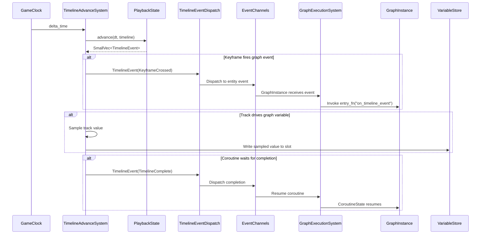
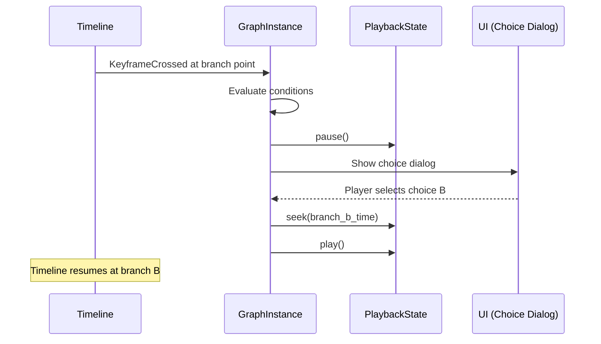

# Timelines ↔ Scripting Integration Design

## Systems Involved

| System | Design | Domain |
|--------|--------|--------|
| Timelines | [timelines.md](../simulation/timelines.md) | Simulation |
| Scripting | [scripting.md](../game-framework/scripting.md) | Scripting |

## Integration Requirements

| ID | Requirement | Systems |
|----|-------------|---------|
| IR-4.9.1 | Timeline keyframes fire graph events | TL, Script |
| IR-4.9.2 | Logic graph controls timeline playback | TL, Script |
| IR-4.9.3 | Coroutine waits for timeline completion | TL, Script |
| IR-4.9.4 | Timeline tracks drive graph variables | TL, Script |
| IR-4.9.5 | Branching cutscenes via graph conditions | TL, Script |
| IR-4.9.6 | Graph event triggers timeline seek | TL, Script |

1. **IR-4.9.1** -- `TimelineEvent::KeyframeCrossed` for `TrackValue::Entity` keyframes referencing a
   `GraphInstance` entity fires the graph's named entry point (e.g., "on_timeline_event"). The
   `GraphExecutionSystem` picks up the event and invokes the codegen'd fn-pointer.
2. **IR-4.9.2** -- Logic graph nodes can call `play()`, `pause()`, `stop()`, and `seek()` on a
   `PlaybackState` component via codegen'd ECS access. The graph reads/writes the `PlaybackState`
   through typed component queries.
3. **IR-4.9.3** -- A coroutine `WaitCondition::TimelineComplete` suspends the `CoroutineState` until
   `TimelineEvent::TimelineComplete` fires for the specified timeline entity. The
   `GraphExecutionSystem` resumes the coroutine on the next frame after the event.
4. **IR-4.9.4** -- `TrackValue::F32`, `TrackValue::Bool`, and `TrackValue::Vec3` tracks can be bound
   to `VariableStore` graph variables via `TrackId`. Each tick, sampled values are written to the
   graph's variable slots.
5. **IR-4.9.5** -- At branch points in a cutscene timeline, a `TrackValue::Entity` keyframe fires a
   graph event. The graph evaluates conditions (player choice, world state) and calls `seek()` on
   the `PlaybackState` to jump to the chosen branch's time offset.
6. **IR-4.9.6** -- A graph node can emit a `TimelineSeekEvent` with a target time.
   `TimelineAdvanceSystem` reads the event and calls `PlaybackState::seek()` before the next
   advance.

## Data Contracts

| Type | Defined in | Consumed by | Purpose |
|------|-----------|-------------|---------|
| `MultiTrackTimeline` | Timelines | Timelines | Asset |
| `PlaybackState` | Timelines | Scripting | Playback control |
| `TimelineEvent` | Timelines | Scripting | Event dispatch |
| `TimelineEventKind` | Timelines | Scripting | Event type |
| `GraphInstance` | Scripting | Scripting | Graph state |
| `GraphProgram` | Scripting | Scripting | Fn-ptr table |
| `CoroutineState` | Scripting | Scripting | Suspend/resume |
| `WaitCondition` | Scripting | Scripting | Resume trigger |
| `VariableStore` | Scripting | Scripting | Graph variables |
| `ExecutionContext` | Scripting | Scripting | ECS access |

```rust
/// Wait condition for coroutine suspension until
/// a specific timeline completes playback.
pub enum WaitCondition {
    /// Wait N frames.
    Frames(u32),
    /// Wait N seconds.
    Seconds(f64),
    /// Wait until a timeline entity finishes.
    TimelineComplete { timeline_entity: Entity },
    /// Wait until an event fires.
    Event { event_id: u64 },
}

/// Event emitted by a graph node to seek a timeline.
pub struct TimelineSeekEvent {
    /// The entity with PlaybackState to seek.
    pub timeline_entity: Entity,
    /// Target time in seconds.
    pub target_time: f64,
}

/// Binding between a timeline track and a graph
/// variable slot. Sampled each tick.
pub struct TrackVariableBinding {
    /// Track to sample from.
    pub track_id: TrackId,
    /// Variable slot to write into.
    pub slot_id: SlotId,
}
```

## Data Flow



### Branching Cutscene Flow



## Timing and Ordering

| System | Phase | Timestep | Order |
|--------|-------|----------|-------|
| GameClock | 3-Simulation | Fixed | 1st |
| TimelineAdvance | 3-Simulation | Fixed | After clock |
| TimelineEventDispatch | 3-Simulation | Fixed | After advance |
| GraphExecutionSystem | 3-Simulation | Fixed | After events |
| Coroutine resume | 3-Simulation | Fixed | With graph exec |

All systems run in Phase 3 (Simulation) at the fixed timestep. Timeline events are dispatched before
graph execution, ensuring graphs see events in the same tick they are produced.

## Failure Modes

| Failure | Impact | Recovery |
|---------|--------|----------|
| Graph entry point missing | Event ignored | Log warning, skip |
| Seek target out of range | Invalid time | Clamp to [0, duration] |
| Coroutine never completes | Stuck graph | Timeout after N seconds |
| Variable slot type mismatch | Wrong data | Validate at bind time |
| Branch condition errors | No seek | Default branch, log error |
| Hot reload during cutscene | State lost | Drain-then-swap preserves vars |

## Platform Considerations

None -- timeline-to-scripting integration is identical across all platforms. Graph execution is
native codegen'd Rust in the middleman .dylib.

## Test Plan

See companion [timelines-scripting-test-cases.md](timelines-scripting-test-cases.md).

## Review Feedback

1. `[CONFIDENT]` `WaitCondition::Seconds` uses `f64` but engine timing uses fixed-timestep ticks;
   prefer `u32` frame count or `FixedTime` to avoid float drift.
2. `[CONFIDENT]` `TimelineSeekEvent.target_time` is `f64`; all other engine time values should use a
   consistent `FixedTime` or tick-based representation, not raw f64.
3. `[CONFIDENT]` Missing classDiagram -- design CLAUDE.md requires every design to have a Mermaid
   `classDiagram` covering ALL types, enums, traits, and relationships.
4. `[CONFIDENT]` Data Contracts table lists `ExecutionContext` as "Consumed by: Scripting" but graph
   nodes writing `PlaybackState` (IR-4.9.2) means Timelines also consumes it; update the table.
5. `[CONFIDENT]` No Rust pseudocode for `TimelineEventKind` enum variants -- the Data Contracts
   table lists it but the code block only defines `WaitCondition`, `TimelineSeekEvent`, and
   `TrackVariableBinding`.
6. `[CONFIDENT]` `SmallVec<TimelineEvent>` in the sequence diagram implies a `smallvec` dependency;
   confirm this is an approved dependency or use a fixed-size array or arena-allocated slice.
7. `[CONFIDENT]` `TrackVariableBinding` has `track_id: TrackId` and `slot_id: SlotId` but these
   types are not defined or cross-referenced in the Data Contracts table.
8. `[CONFIDENT]` Test cases do not cover IR-4.9.2 `stop()` -- only `play()`, `pause()`, and `seek()`
   are tested despite `stop()` being listed in the IR-4.9.2 description.
9. `[CONFIDENT]` No test case covers the hot-reload failure mode ("drain-then-swap preserves vars")
   listed in the Failure Modes table.
10. `[CONFIDENT]` No test case covers the variable slot type mismatch failure mode ("validate at
    bind time").
11. `[UNCERTAIN]` The coroutine timeout (Failure Modes row 3, test TC-IR-4.9.3.3) says "timeout
    after N seconds" but does not specify a default N or how it is configured; this may need a
    component field or constant.
12. `[CONFIDENT]` `event_id: u64` in `WaitCondition::Event` uses a raw integer; prefer a newtype
    wrapper (e.g., `EventId(u64)`) for type safety consistent with `TrackId` and `SlotId`.
13. `[CONFIDENT]` Design is missing the "Overview" section expected by the integration design
    template (PROMPT.md phase 3 lists Overview as a required section).
14. `[CONFIDENT]` No "Thread Ownership" or "Frame-boundary handoff" discussion despite the PROMPT.md
    template requiring them; all systems here run on workers but this should be stated explicitly.
15. `[UNCERTAIN]` The branching cutscene flow shows `GraphInstance` directly calling `UI` to show a
    choice dialog, but graph execution is codegen'd native code on workers -- the mechanism for
    spawning UI entities from a graph node is not specified.
