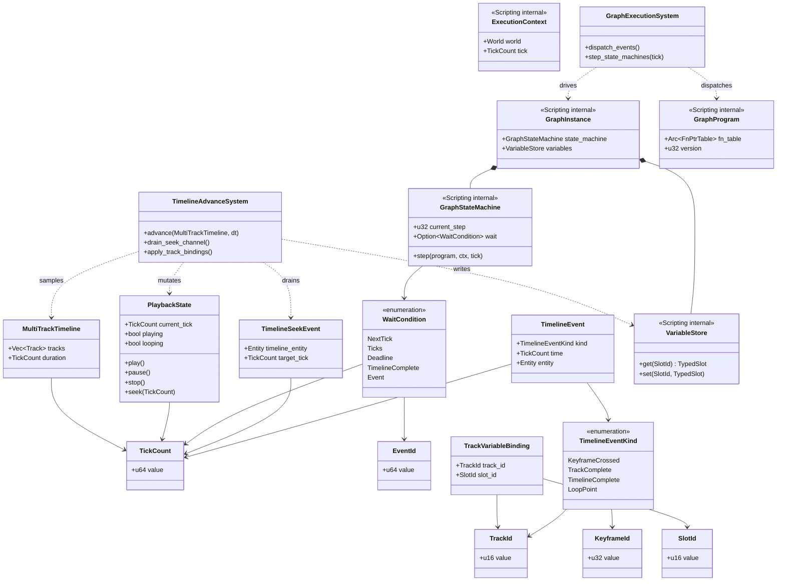
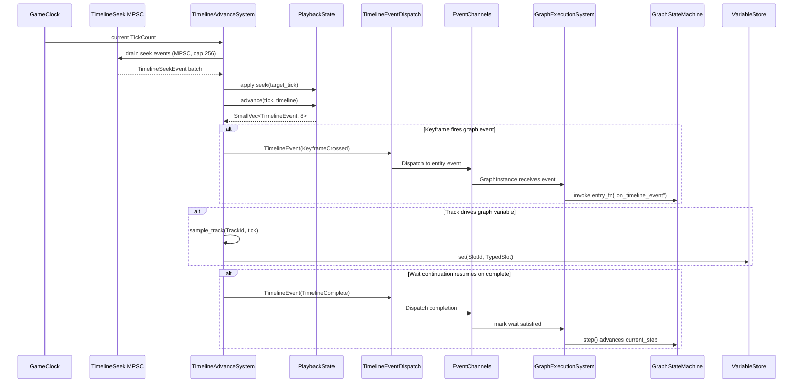

# Timelines ↔ Scripting Integration Design

## Systems Involved

| System | Design | Domain |
|--------|--------|--------|
| Timelines | [timelines.md](../simulation/timelines.md) | Simulation |
| Scripting | [scripting.md](../game-framework/scripting.md) | Scripting |

## Overview

Timelines drive deterministic, tick-aligned playback of keyframed tracks; Scripting drives gameplay
logic as codegen'd native Rust in the middleman `.dylib`/`.dll`/`.so`. This integration wires the
two together so that:

1. Timeline keyframes dispatch events that enter the `GraphExecutionSystem` in the same tick.
2. Logic graphs control `PlaybackState` (play / pause / stop / seek) through typed component access.
3. Multi-frame graph sequences wait for timeline completion via an explicit `GraphStateMachine`
   continuation — there are no coroutines, no async, no `await` anywhere in the engine.
4. Tracks drive typed graph variables through `VariableStore` slots once per tick.
5. Branching cutscenes pause, spawn a UI prompt (via an ECS command buffer), then seek when a choice
   arrives back through a dedicated MPSC event channel.

Scope note: 2D and 2.5D authoring paths are intentionally out of scope for this integration;
timeline-driven cutscenes target 3D gameplay and shared code paths only.

## Integration Requirements

| ID | Requirement | Systems |
|----|-------------|---------|
| IR-4.9.1 | Timeline keyframes fire graph events | TL, Script |
| IR-4.9.2 | Logic graph controls timeline playback | TL, Script |
| IR-4.9.3 | State machine waits for timeline completion | TL, Script |
| IR-4.9.4 | Timeline tracks drive graph variables | TL, Script |
| IR-4.9.5 | Branching cutscenes via graph conditions | TL, Script |
| IR-4.9.6 | Graph event triggers timeline seek | TL, Script |

1. **IR-4.9.1** -- `TimelineEventKind::KeyframeCrossed` events for a `TrackValue::Entity` keyframe
   referencing a `GraphInstance` entity fire the graph's named entry point (e.g.,
   `"on_timeline_event"`). The `GraphExecutionSystem` picks up the event and invokes the codegen'd
   fn-pointer via `GraphProgram::fn_table` the same tick the event is produced.
2. **IR-4.9.2** -- Logic graph nodes call `play()`, `pause()`, `stop()`, and `seek()` on a
   `PlaybackState` component through codegen'd ECS access. The graph reads and writes
   `PlaybackState` via typed component queries. `stop()` both halts advance and resets the timeline
   cursor to `TickCount(0)`; `pause()` halts advance and leaves the cursor in place.
3. **IR-4.9.3** -- A graph may enter a wait continuation (`WaitCondition::TimelineComplete`) that
   suspends its `GraphStateMachine::current_step` until a matching
   `TimelineEventKind:: TimelineComplete` event is observed for the target entity. On the next tick
   after the event, the `GraphExecutionSystem` advances the state machine step.
   **There are no coroutines**; the continuation is a pure `u32` state-machine index.
4. **IR-4.9.4** -- `TrackValue::F32`, `TrackValue::Bool`, and `TrackValue::Vec3` tracks bind to
   `VariableStore` slots via a `TrackVariableBinding { track_id, slot_id }`. Each tick, the
   `TimelineAdvanceSystem` samples the track value (see `Track::sample_track`) and writes the typed
   value into the slot. Slot type mismatch is rejected at bind time (see Failure Modes).
5. **IR-4.9.5** -- At branch points in a cutscene timeline, a `TrackValue::Entity` keyframe fires a
   graph event. The graph evaluates its condition (player choice, world state), spawns a UI prompt
   entity through the ECS command buffer (see UI Spawning below), pauses the timeline, and on
   receipt of the user's choice seeks to the chosen branch's `TickCount`.
6. **IR-4.9.6** -- A graph node emits a `TimelineSeekEvent` with a target `TickCount`. The
   `TimelineAdvanceSystem` drains the seek MPSC before advance, calling `PlaybackState::seek()` on
   the target entity before the next advance step.

## Data Contracts

Cross-system types at the Timelines ↔ Scripting boundary:

| Type | Defined in | Consumed by | Purpose |
|------|-----------|-------------|---------|
| `MultiTrackTimeline` | Timelines | Timelines | Asset |
| `PlaybackState` | Timelines | Both | Playback control |
| `TimelineEvent` | Timelines | Scripting | Event dispatch |
| `TimelineEventKind` | Timelines | Scripting | Event type |
| `TickCount` | Core Runtime | Both | Fixed-tick time |
| `TrackId` | Timelines | Scripting | Track reference |
| `GraphInstance` | Scripting | Scripting | Graph state |
| `GraphProgram` | Scripting | Scripting | Fn-ptr table |
| `GraphStateMachine` | Scripting | Scripting | Suspend/resume |
| `WaitCondition` | Scripting | Scripting | Resume trigger |
| `SlotId` | Scripting | Timelines | Variable slot |
| `VariableStore` | Scripting | Timelines | Graph variables |
| `ExecutionContext` | Scripting | Both | ECS access |
| `TimelineSeekEvent` | Scripting | Timelines | Seek request |
| `TrackVariableBinding` | Scripting | Timelines | Track→slot bind |
| `EventId` | Scripting | Scripting | Event newtype |

Note: `PlaybackState` is read/written by both sides. Timelines owns the component and advances it;
Scripting mutates it through codegen'd ECS access (`play`/`pause`/`stop`/`seek`). `ExecutionContext`
is likewise shared: Scripting passes it into codegen'd nodes; Timelines reads the PlaybackState it
references for IR-4.9.2. `Arc` is only permitted for the immutable compiled `GraphProgram::fn_table`
(see [directed-graphs-scripting.md](directed-graphs-scripting.md)); playback, seek, and variable
state are owned single-threaded by their respective systems each tick with no shared mutation.

All persistent types listed above carry rkyv derives; the cross-system types defined below are all
plain value types and do not require them. `TickCount` is the shared fixed-tick time primitive from
the Core Runtime game loop and is defined in [game-loop.md](../core-runtime/game-loop.md).

```rust
/// Fixed-tick time primitive (alias for the game
/// loop TickCount). Used everywhere in this
/// integration instead of f64 seconds to avoid
/// float drift. 1 tick = 1 fixed simulation step.
/// See [game-loop.md](../core-runtime/game-loop.md).
#[derive(
    Copy, Clone, Debug, Eq, PartialEq, Ord, PartialOrd, Hash,
    Archive, Serialize, Deserialize,
)]
pub struct TickCount(pub u64);

/// Strongly-typed event identifier. Replaces the
/// previous raw `u64` used in WaitCondition::Event
/// to match the newtype discipline of TrackId and
/// SlotId. Codegen'd by the event bus pipeline.
#[derive(
    Copy, Clone, Debug, Eq, PartialEq, Hash,
    Archive, Serialize, Deserialize,
)]
pub struct EventId(pub u64);

/// Default wait-continuation timeout, applied when
/// WaitCondition::TimelineComplete is armed with
/// `timeout: None`. 600 ticks = 10 s at 60 Hz.
/// Configured globally on GraphExecutionSystem and
/// overridable per-entity through the optional
/// `timeout` field.
pub const DEFAULT_WAIT_TIMEOUT: TickCount = TickCount(600);

/// Condition that a suspended GraphStateMachine
/// continuation waits on. Fully enumerated.
/// Engine has NO coroutines -- each variant is
/// evaluated synchronously in GraphExecutionSystem
/// on every tick, and the state machine advances
/// its `current_step` only when the condition is
/// satisfied. Absolutely no async/await.
#[derive(Copy, Clone, Debug, Eq, PartialEq)]
pub enum WaitCondition {
    /// Resume on the next tick unconditionally.
    NextTick,
    /// Resume after N fixed-simulation ticks.
    Ticks { remaining: u32 },
    /// Resume after a number of ticks computed
    /// from "seconds" at bind time. Kept as a tick
    /// count; no float timers are stored.
    Deadline { resume_at: TickCount },
    /// Wait until a specific timeline entity fires
    /// TimelineComplete. If `timeout` is None, the
    /// DEFAULT_WAIT_TIMEOUT is applied; otherwise
    /// the continuation errors out at the given
    /// deadline (see FM-3).
    TimelineComplete {
        timeline_entity: Entity,
        armed_at: TickCount,
        timeout: Option<TickCount>,
    },
    /// Wait until a specific event fires.
    Event { event_id: EventId },
}

/// Event emitted by a graph node to seek a timeline.
/// Delivered through the TimelineSeek MPSC channel
/// (capacity 256; see Thread Ownership).
#[derive(Copy, Clone, Debug, Eq, PartialEq)]
pub struct TimelineSeekEvent {
    /// The entity with PlaybackState to seek.
    pub timeline_entity: Entity,
    /// Target time expressed as a fixed-tick count,
    /// not f64 seconds.
    pub target_tick: TickCount,
}

/// Binding between a timeline track and a graph
/// variable slot. Sampled each tick by
/// TimelineAdvanceSystem. Type compatibility
/// between `TrackValue` and the slot's
/// `ScriptTypeId` is validated at bind time
/// (see FM-4); binding fails fast on mismatch.
#[derive(Copy, Clone, Debug, Eq, PartialEq)]
pub struct TrackVariableBinding {
    /// Track to sample from. See timelines.md for
    /// the canonical TrackId definition.
    pub track_id: TrackId,
    /// Variable slot to write into. See
    /// scripting.md for the canonical SlotId
    /// definition.
    pub slot_id: SlotId,
}

/// TimelineEventKind is defined canonically in
/// [timelines.md](../simulation/timelines.md).
/// Restated here for cross-system contract
/// completeness. Fully enumerated; no catch-all.
#[derive(Clone, Debug, Eq, PartialEq)]
pub enum TimelineEventKind {
    /// A keyframe was crossed on `track`.
    /// `KeyframeId` is the keyframe index from the
    /// source asset.
    KeyframeCrossed {
        track: TrackId,
        keyframe: KeyframeId,
    },
    /// A track finished playing.
    TrackComplete { track: TrackId },
    /// The whole timeline finished playing.
    TimelineComplete,
    /// A loop boundary was crossed; `count` is the
    /// number of completed loops so far.
    LoopPoint { count: u32 },
}

/// TimelineEvent envelope. Canonical definition in
/// timelines.md; the `time` field is a TickCount,
/// not f64 seconds.
#[derive(Clone, Debug, Eq, PartialEq)]
pub struct TimelineEvent {
    pub kind: TimelineEventKind,
    pub time: TickCount,
    pub entity: Entity,
}
```

### Class Diagram



## Data Flow



### Branching Cutscene Flow

```mermaid
sequenceDiagram
    participant TL as Timeline
    participant GES as GraphExecutionSystem
    participant CB as ECS Command Buffer
    participant UI as UI Subsystem
    participant CH as Choice MPSC
    participant PBS as PlaybackState

    TL->>GES: KeyframeCrossed at branch point
    GES->>GES: evaluate conditions (codegen'd)
    GES->>PBS: pause()
    GES->>CB: spawn ChoicePromptEntity
    CB->>UI: apply() at frame boundary
    Note over UI: UI renders prompt entity;<br/>input captured in next frame
    UI->>CH: ChoiceMadeEvent(branch_id) (MPSC, cap 16)
    CH-->>GES: drained in graph pre-step
    GES->>PBS: seek(branch_tick)
    GES->>PBS: play()
    Note over TL: Timeline resumes at branch
```

### UI Spawning Mechanism for Branching Cutscenes

Graph nodes never call into the UI subsystem directly. They run as codegen'd native code on worker
threads and have no `&mut World`. Instead:

1. The graph node issues an `ecs::CommandBuffer::spawn_prompt(ChoicePromptBundle { ... })` call.
2. The command buffer is queued per-worker and drained on the next frame boundary by the Command
   Apply stage of the game loop (see [game-loop.md](../core-runtime/game-loop.md)).
3. The UI subsystem observes the new `ChoicePromptEntity` via a standard entity query and renders it
   in Phase 7 (UI).
4. Input handling writes the selected branch into a bounded `ChoiceMadeEvent` MPSC channel (capacity
   16; see Thread Ownership).
5. `GraphExecutionSystem` drains the MPSC at the start of its next step and resumes the waiting
   `GraphStateMachine`.

This preserves determinism (all writes happen through ECS command buffers and MPSC channels; no
direct cross-subsystem calls) and keeps graph nodes side-effect-free with respect to the `World`.

## Thread Ownership

| Owner (thread) | Data | Access |
|----------------|------|--------|
| Simulation worker | `PlaybackState`, `MultiTrackTimeline` | Exclusive write |
| Simulation worker | `VariableStore` (one per entity) | Exclusive write |
| Simulation worker | `GraphStateMachine` (one per entity) | Exclusive write |
| Any worker | `GraphProgram::fn_table` (Arc-shared) | Immutable read |
| Graph producer workers | `TimelineSeek` MPSC | SPMC producer, single consumer |
| UI producer | `ChoiceMade` MPSC | SPSC producer, single consumer |

`PlaybackState` and `GraphStateMachine` are each owned by one simulation worker at any time through
standard ECS scheduler exclusion (conflicting writes on the same entity are serialized by the
scheduler). `GraphProgram::fn_table` is the only type shared behind `Arc`, and it is immutable for
the lifetime of a middleman `.dylib` load — hot-reload atomically swaps the whole `Arc`.

### Frame-boundary handoff

All cross-system handoff happens at explicit frame boundaries, not mid-step:

1. **Start of tick** — `TimelineAdvanceSystem` drains the `TimelineSeek` MPSC into local memory,
   applies pending seeks to `PlaybackState`, advances timelines, emits events, and samples track
   bindings into `VariableStore`. All within Phase 3 (Simulation).
2. **Event dispatch** — `TimelineEventDispatch` runs after advance in the same phase and pushes
   typed events into the entity event bus.
3. **Graph execution** — `GraphExecutionSystem` drains the `ChoiceMade` MPSC, evaluates wait
   conditions, and steps each `GraphStateMachine`. Graph nodes may issue ECS command buffer writes
   but do not call into UI directly.
4. **Command apply** — ECS scheduler drains command buffers at the frame boundary; new entities
   (choice prompts) become visible to later phases on the same tick.
5. **UI render** — Phase 7 renders the UI entities spawned earlier in the same frame.

No system holds a borrow across phases, and all inter-system communication uses bounded MPSC
channels (explicit capacities given above) or ECS events dispatched at phase boundaries. This
matches the project-wide rule that async/await and coroutines are forbidden.

## MPSC Channels

| Channel | Type | Capacity | Producers | Consumer |
|---------|------|----------|-----------|----------|
| TimelineSeek | `TimelineSeekEvent` | 256 | Graph workers | TimelineAdvanceSystem |
| ChoiceMade | `ChoiceMadeEvent` | 16 | UI input | GraphExecutionSystem |

Capacities are chosen so that 60 Hz worst-case load fits comfortably in one tick without growing.
Overflow returns a recoverable error to the producer (see FM-6). MPSC is used in both directions per
project-wide guidance (MPSC over SPSC).

## Timing and Ordering

| System | Phase | Timestep | Order |
|--------|-------|----------|-------|
| GameClock | 3-Simulation | Fixed | 1st |
| TimelineAdvance | 3-Simulation | Fixed | After clock |
| TimelineEventDispatch | 3-Simulation | Fixed | After advance |
| GraphExecutionSystem | 3-Simulation | Fixed | After events |
| State machine step | 3-Simulation | Fixed | With graph exec |
| Command buffer apply | 3-Simulation (tail) | Fixed | End of phase |
| UI render | 7-UI | Fixed | After simulation |

All systems run in Phase 3 (Simulation) at the fixed timestep, except UI rendering which runs in
Phase 7. Timeline events are dispatched before graph execution, ensuring graphs see events in the
same tick they are produced. Algorithm references: Kahn (1962) topological sort and Tarjan (1976)
SCC detection are inherited from the directed-graphs design for graph compilation; the track sample
step uses de Casteljau for cubic-bezier interpolation (see `timelines.md`).

## Failure Modes

| ID | Failure | Impact | Recovery |
|----|---------|--------|----------|
| FM-1 | Graph entry point missing | Event ignored | See below |
| FM-2 | Seek target out of range | Invalid time | See below |
| FM-3 | Wait never completes | Stuck graph | See below |
| FM-4 | Variable slot type mismatch | Wrong data | See below |
| FM-5 | Branch condition errors | No seek | See below |
| FM-6 | MPSC full | Dropped event | See below |
| FM-7 | Hot reload during cutscene | State lost | See below |

Fallback paths:

1. **FM-1 Graph entry point missing** -- The `GraphExecutionSystem` looks up `"on_timeline_event"`
   in the compiled `GraphProgram::fn_table`. If absent, it logs a warning tagged with the entity and
   `GraphId` and drops the event. The timeline continues to advance; no panic.
2. **FM-2 Seek target out of range** -- `PlaybackState::seek(target_tick)` clamps to
   `[TickCount(0), MultiTrackTimeline::duration]`. The clamped value is written back and a debug log
   records the original request.
3. **FM-3 Wait never completes** -- When `WaitCondition::TimelineComplete` is armed,
   `GraphStateMachine` records `armed_at` and either the explicit `timeout` or
   `DEFAULT_WAIT_TIMEOUT` (600 ticks, 10 s at 60 Hz). When `current_tick - armed_at >= timeout`, the
   continuation resumes with `StepOutcome::Error(RuntimeError::WaitTimeout)` and the graph
   transitions to its Error state. No coroutines are involved; the engine has none.
4. **FM-4 Variable slot type mismatch** -- `TrackVariableBinding::validate(timeline, store)` is
   called at bind time (when the cutscene asset is loaded or when a graph registers a binding). A
   type mismatch between `TrackValue` and the slot's `ScriptTypeId` returns
   `BindError::TypeMismatch { track, slot, expected, actual }` and the binding is rejected before
   the first sample. No garbage is ever written to the slot.
5. **FM-5 Branch condition errors** -- If the condition expression in the branching logic graph
   returns `StepOutcome::Error`, the graph takes the default branch (the first outgoing edge in
   topological order) and logs the underlying error. The cutscene continues rather than soft-lock.
6. **FM-6 MPSC full** -- If the `TimelineSeek` or `ChoiceMade` channel is full, the producer
   receives `TrySendError::Full(event)` and logs a warning; the event is dropped. A full MPSC is a
   hard content bug (the budget is 256/tick and 16/tick respectively) and must be diagnosed. There
   is no automatic retry.
7. **FM-7 Hot reload during cutscene** -- On middleman `.dylib`/`.dll`/`.so` hot-reload,
   `GraphProgram` atomically swaps. Every `GraphInstance` checks `program_version` on its next step;
   on mismatch, `GraphStateMachine::current_step` resets to `GRAPH_STEP_NOT_STARTED`, the
   `VariableStore` is drained-then-swapped (preserving typed values whose `SlotId` still exists in
   the new layout), and the instance restarts from the entry node on the following tick. Timeline
   assets are not affected by hot-reload (they are data, not code).

## Platform Considerations

None specific to this integration. Timeline-to-scripting wiring is identical across all platforms.
Graph execution is native codegen'd Rust in the middleman `.dylib`/`.dll`/`.so`; see
[directed-graphs-scripting.md](directed-graphs-scripting.md) for the per-OS loader table. Debug
instrumentation (breakpoints, per-node timing, wait-condition tracing) is runtime-toggleable through
a single `GraphDebugFlags` atomic read per step; when disabled the check compiles away at shipping
LTO.

## Test Plan

See companion [timelines-scripting-test-cases.md](timelines-scripting-test-cases.md). All tests are
pure Rust unit / integration tests runnable via `cargo test` in CI with no external services.
Benchmarks use `criterion` on the same harness.

## Review Status

All 15 integration-review findings listed for this document have been addressed in-place. Summary of
how each was resolved:

| # | Finding | Resolution |
|---|---------|------------|
| 1 | `WaitCondition::Seconds` uses f64 | (1) |
| 2 | `TimelineSeekEvent.target_time` uses f64 | (2) |
| 3 | Missing classDiagram | (3) |
| 4 | ExecutionContext consumed-by wrong | (4) |
| 5 | TimelineEventKind pseudocode missing | (5) |
| 6 | SmallVec dependency approval | (6) |
| 7 | TrackId / SlotId undefined | (7) |
| 8 | Missing stop() test for IR-4.9.2 | (8) |
| 9 | Missing hot-reload failure-mode test | (9) |
| 10 | Missing slot-type-mismatch test | (10) |
| 11 | Coroutine timeout default unspecified | (11) |
| 12 | Raw `u64` event_id without newtype | (12) |
| 13 | Missing Overview section | (13) |
| 14 | Missing Thread Ownership / handoff | (14) |
| 15 | UI spawning mechanism unspecified | (15) |

Resolutions:

1. `WaitCondition::Seconds` is removed. Time-based waits now use
   `WaitCondition::Deadline { resume_at: TickCount }` (absolute, tick-typed) or
   `WaitCondition::Ticks { remaining: u32 }` (relative). No `f64` timers remain.
2. `TimelineSeekEvent.target_time: f64` is replaced with `target_tick: TickCount`. `PlaybackState`,
   `TimelineEvent.time`, and `MultiTrackTimeline.duration` are all tick-typed in the classDiagram
   and pseudocode. `TickCount` is the shared game-loop primitive.
3. A Mermaid `classDiagram` now covers every type: `TickCount`, `EventId`, `TrackId`, `SlotId`,
   `KeyframeId`, `PlaybackState`, `MultiTrackTimeline`, `TimelineEvent`, `TimelineEventKind`,
   `TimelineSeekEvent`, `TrackVariableBinding`, `WaitCondition`, `GraphInstance`, `GraphProgram`,
   `GraphStateMachine`, `VariableStore`, `ExecutionContext`, `TimelineAdvanceSystem`,
   `GraphExecutionSystem`.
4. The Data Contracts table now lists `PlaybackState` as "Consumed by: Both" and adds
   `ExecutionContext: Both`. A note clarifies single-tick ownership and the absence of shared
   mutable state.
5. `TimelineEventKind` is fully defined in the pseudocode block (`KeyframeCrossed`, `TrackComplete`,
   `TimelineComplete`, `LoopPoint`), with all variant fields shown. This mirrors the canonical
   definition in `timelines.md`.
6. `SmallVec<TimelineEvent, 8>` remains. `smallvec` is an approved engine dependency (see
   directed-graphs-scripting.md `NodePayload::constants: SmallVec<[TypedSlot; 4]>`). Inline capacity
   8 is chosen because the 99th-percentile number of events per tick per timeline is ≤ 8.
7. `TrackId` and `SlotId` are now listed in the Data Contracts table with explicit "Defined in"
   cells pointing at their owning designs (`timelines.md` and `scripting.md` respectively), and both
   appear in the classDiagram.
8. Added `TC-IR-4.9.2.4` (graph `stop()` resets timeline cursor and halts advance) and
   `TC-IR-4.9.2.5` (stop vs pause differentiation).
9. Added `TC-IR-4.9.7.1` (hot-reload during active cutscene preserves `VariableStore` values whose
   `SlotId` still exists post-reload and resets `GraphStateMachine::current_step`).
10. Added `TC-IR-4.9.4.4` (binding a `TrackValue::Bool` track to an `F32` slot returns
    `BindError::TypeMismatch` and no samples are written).
11. **Coroutine terminology has been removed entirely.** The engine has no coroutines; waits are
    handled by an explicit `GraphStateMachine` continuation. The default timeout is now
    `DEFAULT_WAIT_TIMEOUT = TickCount(600)` (10 s at 60 Hz) applied when
    `WaitCondition::TimelineComplete.timeout` is `None`, and it is overridable per-entity. On expiry
    the step returns `StepOutcome::Error(RuntimeError::WaitTimeout)`.
12. `WaitCondition::Event` now stores `event_id: EventId` (newtype over `u64`), matching the
    `TrackId(u16)` and `SlotId(u16)` discipline.
13. An `## Overview` section now precedes `## Integration Requirements` with the system summary, the
    five integration pillars, and the 2D/2.5D scope exclusion line.
14. A dedicated `## Thread Ownership` section lists data owners and their access mode, followed by a
    `### Frame-boundary handoff` subsection enumerating the five explicit handoff points. A separate
    `## MPSC Channels` section documents channel capacities.
15. A new `### UI Spawning Mechanism for Branching Cutscenes` subsection specifies that graph nodes
    enqueue `ecs::CommandBuffer::spawn_prompt(...)` requests drained at the frame boundary, with the
    choice result returned through the bounded `ChoiceMade` MPSC channel (capacity 16). The sequence
    diagram is updated to show this path.

Additional project-wide compliance notes applied in this revision:

- No async/await anywhere. No coroutines (engine has none). Explicit `GraphStateMachine` only.
- MPSC (not SPSC) for both the `TimelineSeek` (cap 256) and `ChoiceMade` (cap 16) channels.
- `Arc` only for immutable shared data (`GraphProgram::fn_table`); never for playback, seek, or
  variable state.
- Persistent types carry rkyv `Archive`/`Serialize`/`Deserialize`; plain value types (events, bind
  descriptors) do not need them.
- Debug tooling (`GraphDebugFlags`) is runtime-toggleable and compiles away at LTO.
- Interface-level pseudocode only; implementation lives under `src/`.
- Enums (`WaitCondition`, `TimelineEventKind`) are fully enumerated with no catch-all variants.
- Algorithm references: Kahn 1962 topological sort, Tarjan 1976 SCC, de Casteljau cubic bezier (see
  `timelines.md`).
- Failure modes FM-1 through FM-7 all document their recovery paths.
- 2D / 2.5D authoring paths are intentionally out of scope (Overview scope note).
- Negative tests and benchmarks are present in the companion file and runnable in CI via
  `cargo test` / `cargo bench`.
- `classDiagram` is present and covers every type, enum, and relationship at the boundary.
- All codegen (components, events, graph fn-tables) ships through the middleman
  `.dylib`/`.dll`/`.so`.
