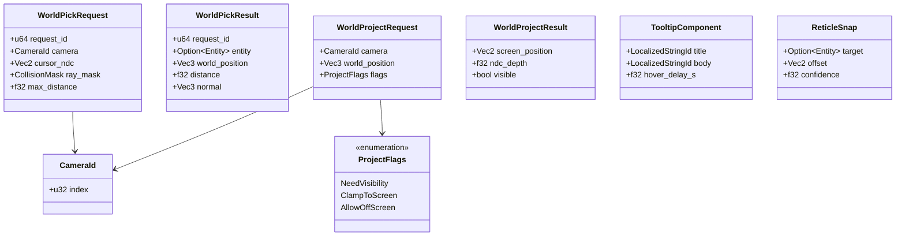
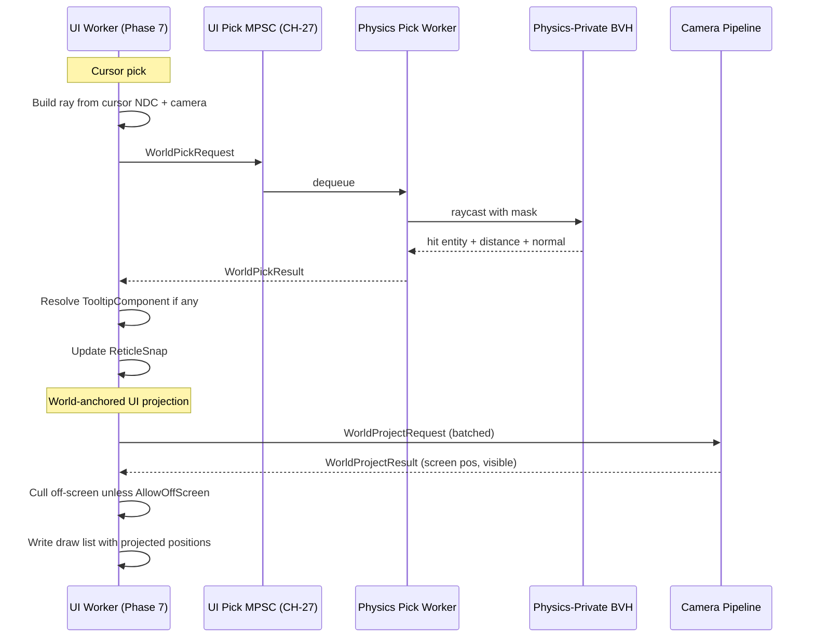

# UI ↔ Physics Integration Design

## Systems Involved

| System | Design | Domain |
|--------|--------|--------|
| UI | [ui-framework.md](../ui/ui-framework.md) | UI |
| Physics | [foundation.md](../physics/foundation.md) | Physics |

See [shared-conventions.md](shared-conventions.md) and
[shared-messaging-capacities.md](shared-messaging-capacities.md).

## Integration Requirements

| ID | Requirement | Systems |
|----|-------------|---------|
| IR-4.3.1 | Cursor raycast from UI into world | UI, Phys |
| IR-4.3.2 | 3D -> 2D projection of world-anchored UI | UI, Phys |
| IR-4.3.3 | Tooltip hover via physics pick | UI, Phys |
| IR-4.3.4 | Cursor occlusion against opaque geometry | UI, Phys |
| IR-4.3.5 | World-space HUD reticle snap to target | UI, Phys |

1. **IR-4.3.1** -- When the HUD requests a world pick (e.g., crosshair target), UI issues a
   `WorldPickRequest` carrying cursor NDC, camera id, and a ray mask. The physics pick resolver
   raycasts into the physics scene and returns the first hit. The shared BVH is not used here; this
   query needs the physics-private BVH because UI pick tests must match the physics contact state
   that gameplay observes.
2. **IR-4.3.2** -- World-anchored UI (nameplates, waypoint markers, damage numbers) needs a 3D -> 2D
   projection with optional occlusion. The UI system submits a batch of `WorldProjectRequest`s; the
   camera pipeline returns screen coordinates and a visibility flag derived from a depth-read or
   occlusion query.
3. **IR-4.3.3** -- Tooltip hover: UI emits a cursor ray; the first physics hit carries an entity
   with optional `TooltipComponent`. If present, the tooltip is shown at the cursor.
4. **IR-4.3.4** -- Cursor occlusion clamps interactive screen-space UI to the front of opaque world
   geometry (relevant for diegetic UI on in-world panels).
5. **IR-4.3.5** -- Reticle snap reuses the world pick result to align reticle art toward the nearest
   aimable entity within a cone.

## Data Contracts

| Type | Defined in | Consumed by | Purpose |
|------|-----------|-------------|---------|
| `WorldPickRequest` | UI | Physics pick worker | Ray from cursor |
| `WorldPickResult` | UI | UI (tooltip, reticle) | First hit entity + pos |
| `WorldProjectRequest` | UI | Camera pipeline | World pos |
| `WorldProjectResult` | UI | UI (draw list) | Screen pos + visible |
| `TooltipComponent` | UI | UI | Tooltip template |
| `ReticleSnap` | UI | UI | Snap state + offset |
| `UiPickCh` | UI | Workers | MPSC `CH-27` |

## Class Diagram

## Data Flow

## Timing and Ordering

| System | Phase | Timestep | Order |
|--------|-------|----------|-------|
| UI layout | 7 Snapshot | Variable | 1st |
| UI pick request | 7 Snapshot | Variable | 2nd |
| Physics pick resolve | 7 Snapshot | Variable | services CH-27 |
| UI world-project request | 7 Snapshot | Variable | 3rd |
| Camera project resolve | 7 Snapshot | Variable | depth-read |
| UI draw list build | 7 Snapshot | Variable | 4th |

All UI-physics work lands in Phase 7 because UI drives the render frame. Physics pick uses the
post-Phase-5 physics state (same frame). Camera projection reads the depth buffer from the previous
rendered frame (one-frame stale visibility is acceptable for nameplates).

## Thread Ownership

| Data / system | Owning thread | QoS / pin | Handoff |
|---------------|---------------|-----------|---------|
| Physics-private BVH | Physics worker | user-initiated | Read-only to UI pick worker |
| Pick channel | Worker -> Worker | user-initiated | `CH-27` cap=8 DropOldest |
| Projection batch | Worker | user-initiated | Direct call, no channel |
| Depth buffer | Render | core-pinned | Read via latched readback |

1. **`Arc<CameraTable>`** holds camera matrices (immutable per frame, SC-1 compliant).
2. **The physics pick uses the physics-private BVH** (not the shared BVH) because UI picks must
   match gameplay contact state.
3. **Depth readback** is a latched copy updated once per frame; the UI worker reads it without
   synchronizing with the render thread.

## Fallback Modes

| ID | Trigger | Policy | Recovery | Side effects |
|----|---------|--------|----------|-------------|
| FM-1 | Cursor outside window | Return `None` pick result | Cursor enters window | Tooltip hidden |
| FM-2 | Physics BVH not yet built | `entity=None` | Next frame | No hover this frame |
| FM-3 | Depth readback stale | Use previous frame depth | Next readback | Occlusion flicker |
| FM-4 | `CH-27` full | DropOldest | Channel drains | One dropped pick |
| FM-5 | Off-screen projection w/o flag | Return `visible=false` | -- | Nameplate hidden |
| FM-6 | Camera id unknown | Return `None` project result | Camera registered | UI element missing |

## Performance Budget

Cross-reference [/docs/design/performance-budget.md](../performance-budget.md).

| Pair subsystem | Phase | Budget (per frame) | Source |
|----------------|-------|---------------------|--------|
| UI pick request/resolve (1-2 picks) | 7 Snapshot | 0.05 ms | UI slice |
| World projection (64 anchors) | 7 Snapshot | 0.05 ms | UI slice |
| Depth readback latch | Render | 0.02 ms | Render slice |
| Tooltip resolve | 7 Snapshot | 0.02 ms | UI slice |

## Test Plan

See companion [ui-physics-test-cases.md](ui-physics-test-cases.md).

## Open Questions

| # | Question | Owner |
|---|----------|-------|
| 1 | Should reticle snap live in UI or camera? | UI + camera |
| 2 | Depth readback cost vs GPU occlusion query? | Rendering |
| 3 | Cursor in VR: controller ray vs physics or shared BVH? | UI |
