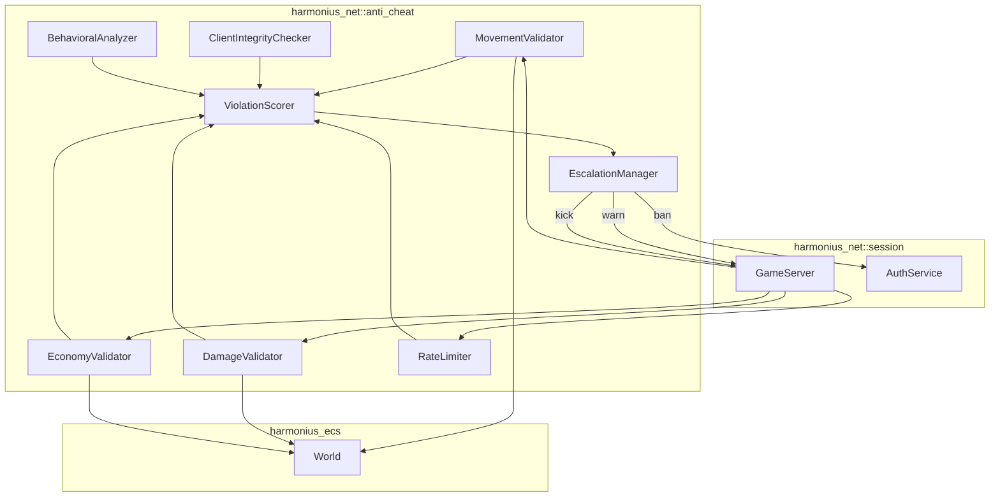
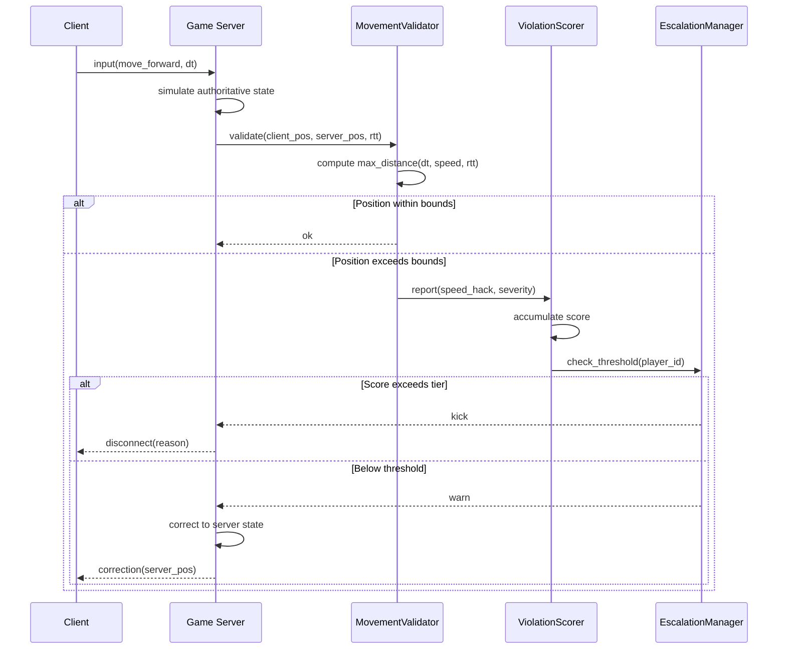
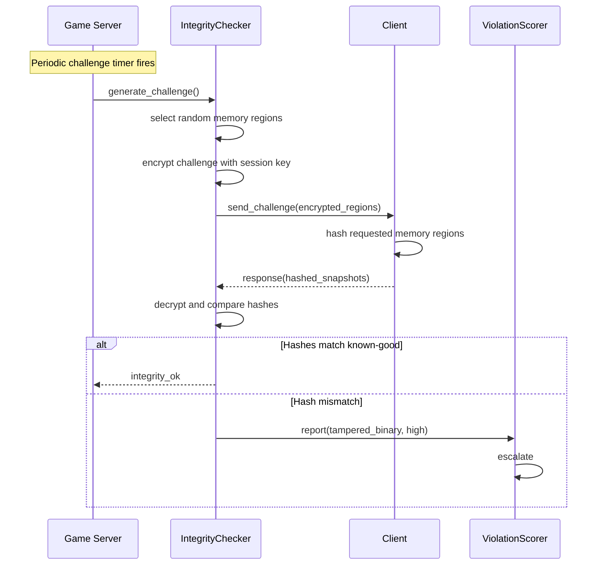
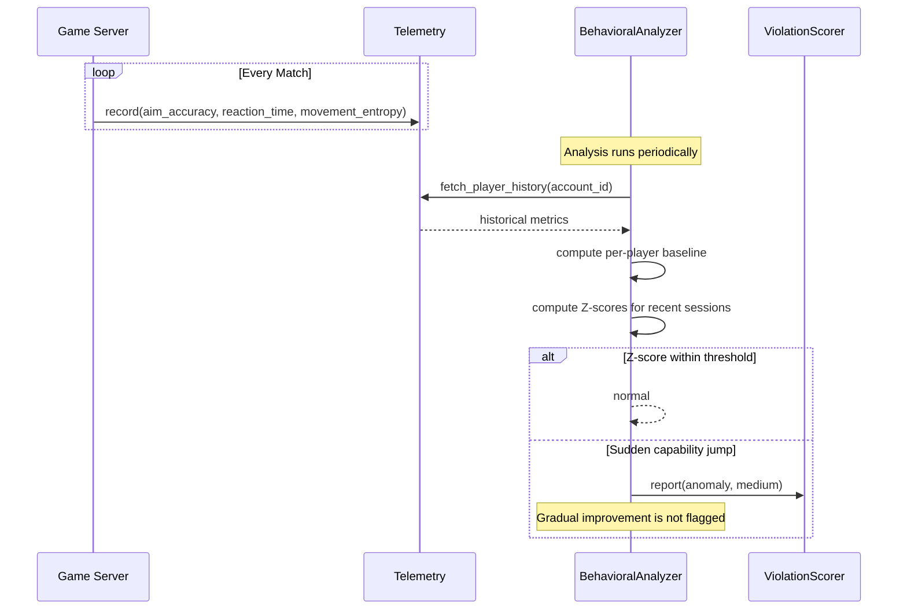
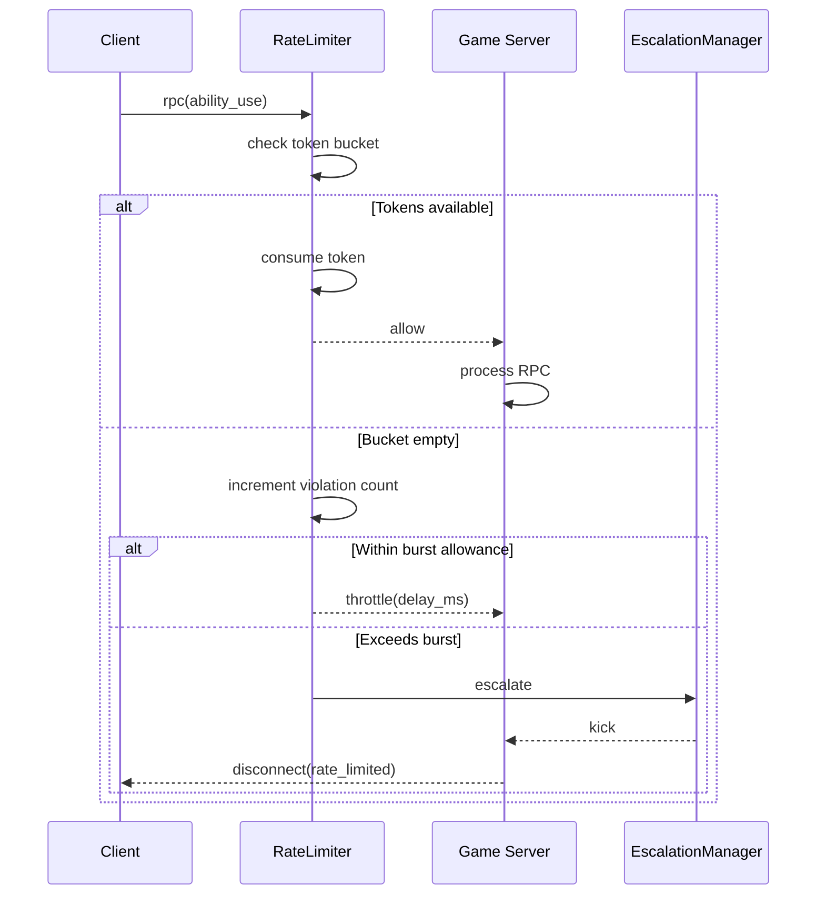
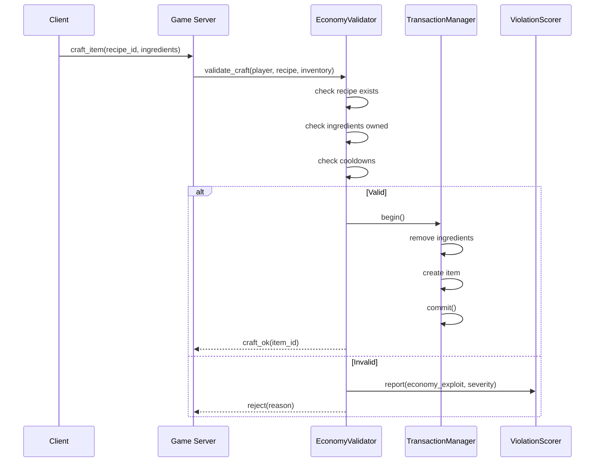
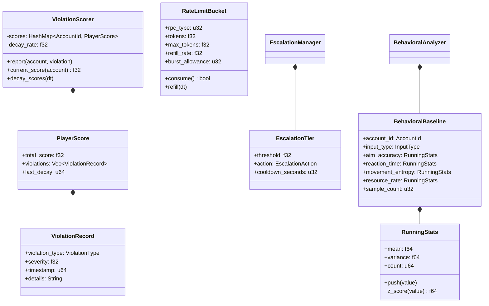

# Anti-Cheat and Security Design

## Requirements Trace

> **Canonical sources:** Features, requirements, and user stories are defined in
> [features/networking/](../../features/networking/),
> [requirements/networking/](../../requirements/networking/), and
> [user-stories/networking/](../../user-stories/networking/). The table below traces design elements
> to those definitions.

| Feature | Requirement |
|---------|-------------|
| F-8.8.1 | R-8.8.1     |
| F-8.8.2 | R-8.8.2     |
| F-8.8.3 | R-8.8.3     |
| F-8.8.4 | R-8.8.4     |
| F-8.8.5 | R-8.8.5     |

1. **F-8.8.1** — Server-side cheat detection (movement, damage, cooldowns)
2. **F-8.8.2** — Client integrity verification (memory hashing)
3. **F-8.8.3** — Behavioral analysis and anomaly detection (Z-score)
4. **F-8.8.4** — Economy exploit prevention (double-spend, gold farming)
5. **F-8.8.5** — Rate limiting and abuse prevention (per-RPC budgets)

## Overview

The anti-cheat subsystem provides layered, server- authoritative security for all game systems. The
primary defense is server-side validation: the server independently simulates all game logic and
compares client-reported state against computed bounds. Secondary defenses include client integrity
verification, statistical behavioral analysis, economy validation, and rate limiting.

All anti-cheat logic runs as ECS systems on the server. Violation scoring, escalation, and rate
limiting are components attached to player entities. Detection thresholds account for legitimate
network latency and platform-specific input characteristics. The system uses configurable severity
tiers (warn, flag, kick, ban) with hot-reloadable configuration. All I/O is async.

## Architecture

### Validation Pipeline



```text
harmonius_net/
├── anti_cheat/
│   ├── movement.rs      # MovementValidator,
│   │                    # speed/teleport detection
│   ├── damage.rs        # DamageValidator,
│   │                    # damage bounds checking
│   ├── economy.rs       # EconomyValidator,
│   │                    # transaction validation
│   ├── integrity.rs     # ClientIntegrityChecker,
│   │                    # memory hash challenges
│   ├── behavioral.rs    # BehavioralAnalyzer,
│   │                    # Z-score anomaly detection
│   ├── rate_limit.rs    # RateLimiter,
│   │                    # per-RPC token buckets
│   ├── scorer.rs        # ViolationScorer,
│   │                    # score accumulation
│   ├── escalation.rs    # EscalationManager,
│   │                    # severity tier actions
│   └── config.rs        # Hot-reloadable config
│                        # for all thresholds
```

### Server-Side Validation Flow



### Client Integrity Challenge Flow



### Behavioral Analysis Pipeline



### Rate Limiting Flow



### Economy Validation Flow



### Core Data Structures



## API Design

### Violation Types and Severity

```rust
/// Categories of cheat violations.
#[derive(
    Clone, Copy, Debug, PartialEq, Eq, Hash,
)]
pub enum ViolationType {
    /// Movement exceeding max velocity.
    SpeedHack,
    /// Position discontinuity (teleportation).
    Teleport,
    /// Damage exceeding weapon stats * multipliers.
    DamageManipulation,
    /// Ability used during active cooldown.
    CooldownCircumvention,
    /// Invalid inventory operation.
    InventoryExploit,
    /// Invalid economy transaction.
    EconomyExploit,
    /// Double-spend detected.
    DoubleSpend,
    /// Gold farming pattern detected.
    GoldFarming,
    /// Client binary tampered.
    TamperedBinary,
    /// Behavioral anomaly (Z-score threshold).
    BehavioralAnomaly,
    /// RPC rate limit exceeded.
    RateLimitExceeded,
}

/// Escalation actions ordered by severity.
#[derive(
    Clone, Copy, Debug, PartialEq, Eq,
    PartialOrd, Ord,
)]
pub enum EscalationAction {
    /// Log the violation. No player-visible
    /// effect.
    Warn,
    /// Flag for manual review. Player is
    /// monitored.
    Flag,
    /// Disconnect the player immediately.
    Kick,
    /// Temporary ban (configurable duration).
    TempBan { hours: u32 },
    /// Permanent ban.
    PermaBan,
}
```

### Violation Scorer

```rust
/// A single violation record.
pub struct ViolationRecord {
    pub violation_type: ViolationType,
    pub severity: f32,
    pub timestamp: u64,
    pub details: String,
}

/// Per-player accumulated score.
pub struct PlayerScore {
    pub total_score: f32,
    pub violations: Vec<ViolationRecord>,
    pub last_decay: u64,
}

/// Scorer configuration.
pub struct ScorerConfig {
    /// Score decay rate per second.
    pub decay_rate: f32,
    /// Per-violation-type severity multipliers.
    pub severity_weights: HashMap<
        ViolationType,
        f32,
    >,
    /// Maximum stored violations per player.
    pub max_history: u32,
}

/// Accumulates violation scores per player.
pub struct ViolationScorer { /* ... */ }

impl ViolationScorer {
    pub fn new(config: ScorerConfig) -> Self;

    /// Report a violation. Adds to the player's
    /// accumulated score.
    pub fn report(
        &self,
        account_id: AccountId,
        violation: ViolationRecord,
    );

    /// Get the current score for a player.
    pub fn current_score(
        &self,
        account_id: AccountId,
    ) -> f32;

    /// Get violation history for a player.
    pub fn history(
        &self,
        account_id: AccountId,
    ) -> Vec<ViolationRecord>;

    /// Decay all scores by elapsed time. Called
    /// each tick.
    pub fn decay(&self, dt: f32);

    /// Clear a player's score (admin pardon).
    pub fn clear(
        &self,
        account_id: AccountId,
    );
}
```

### Escalation Manager

```rust
/// Escalation tier definition.
pub struct EscalationTier {
    /// Score threshold to trigger this tier.
    pub threshold: f32,
    /// Action to take.
    pub action: EscalationAction,
    /// Cooldown before this tier can trigger
    /// again for the same player.
    pub cooldown_seconds: u32,
}

/// Escalation manager configuration.
pub struct EscalationConfig {
    /// Tiers ordered by ascending threshold.
    pub tiers: Vec<EscalationTier>,
}

/// Determines and executes escalation actions
/// based on violation scores.
pub struct EscalationManager { /* ... */ }

impl EscalationManager {
    pub fn new(
        config: EscalationConfig,
    ) -> Self;

    /// Check a player's score against escalation
    /// tiers and return the appropriate action.
    pub fn evaluate(
        &self,
        account_id: AccountId,
        score: f32,
    ) -> Option<EscalationAction>;

    /// Execute an escalation action.
    pub async fn execute(
        &self,
        account_id: AccountId,
        action: EscalationAction,
    ) -> Result<(), EscalationError>;

    /// Hot-reload escalation configuration.
    pub fn reload_config(
        &self,
        config: EscalationConfig,
    );
}

pub enum EscalationError {
    PlayerNotFound,
    AlreadyBanned,
    ActionFailed,
}
```

### Movement Validator

```rust
/// Movement validation configuration.
pub struct MovementConfig {
    /// Maximum movement speed (units/s).
    pub max_speed: f32,
    /// Maximum position delta per tick before
    /// flagging teleportation.
    pub max_delta_per_tick: f32,
    /// RTT tolerance multiplier. Distance bounds
    /// are scaled by (1.0 + rtt_tolerance * rtt).
    pub rtt_tolerance: f32,
    /// Mobile-specific tolerance multiplier
    /// (wider thresholds for jitter).
    pub mobile_tolerance_multiplier: f32,
}

/// Validates client-reported movement against
/// server-computed bounds.
pub struct MovementValidator { /* ... */ }

impl MovementValidator {
    pub fn new(config: MovementConfig) -> Self;

    /// Validate a client position against the
    /// server's authoritative position.
    /// Returns Ok if within bounds, or the
    /// violation type and severity.
    pub fn validate(
        &self,
        client_pos: Vec3,
        server_pos: Vec3,
        client_vel: Vec3,
        max_speed: f32,
        dt: f32,
        rtt: f32,
        is_mobile: bool,
    ) -> Result<(), (ViolationType, f32)>;

    /// Compute the maximum allowable distance
    /// for the given parameters.
    pub fn max_distance(
        &self,
        dt: f32,
        speed: f32,
        rtt: f32,
        is_mobile: bool,
    ) -> f32;
}
```

### Damage Validator

```rust
/// Damage validation configuration.
pub struct DamageConfig {
    /// Maximum damage multiplier tolerance
    /// above computed value.
    pub tolerance_multiplier: f32,
    /// Minimum time between damage events
    /// (ticks).
    pub min_damage_interval: u32,
}

/// Validates damage values against server-
/// computed weapon stats and multipliers.
pub struct DamageValidator { /* ... */ }

impl DamageValidator {
    pub fn new(config: DamageConfig) -> Self;

    /// Validate reported damage against the
    /// server's computed expected damage.
    pub fn validate(
        &self,
        reported_damage: f32,
        expected_damage: f32,
        weapon_stats: &WeaponStats,
        active_multipliers: &[f32],
        ticks_since_last_damage: u32,
    ) -> Result<(), (ViolationType, f32)>;
}

/// Weapon stats from the gameplay database.
pub struct WeaponStats {
    pub base_damage: f32,
    pub damage_range: (f32, f32),
    pub attack_speed: f32,
    pub crit_multiplier: f32,
}
```

### Economy Validator

```rust
/// Economy validation configuration.
pub struct EconomyConfig {
    /// Maximum gold transfer per transaction.
    pub max_transfer: u64,
    /// Transactions per hour before rate limit.
    pub rate_limit_per_hour: u32,
    /// High-value threshold (triggers delay).
    pub high_value_threshold: u64,
    /// Escalating delay per high-value
    /// transaction (seconds).
    pub high_value_delay: u32,
}

/// Validates all economy transactions server-
/// side.
pub struct EconomyValidator { /* ... */ }

impl EconomyValidator {
    pub fn new(config: EconomyConfig) -> Self;

    /// Validate a crafting operation. Checks
    /// recipe existence, ingredient ownership,
    /// and cooldowns.
    pub fn validate_craft(
        &self,
        player: Entity,
        recipe_id: u32,
        world: &World,
    ) -> Result<(), (ViolationType, f32)>;

    /// Validate a trade between two players.
    /// Checks ownership, value bounds, and
    /// double-spend prevention.
    pub fn validate_trade(
        &self,
        from: Entity,
        to: Entity,
        items: &[u64],
        gold: u64,
        world: &World,
    ) -> Result<(), (ViolationType, f32)>;

    /// Validate a loot drop against server-side
    /// loot tables.
    pub fn validate_loot(
        &self,
        source: Entity,
        item_id: u64,
        world: &World,
    ) -> Result<(), (ViolationType, f32)>;

    /// Check for gold farming patterns.
    /// Analyzes transaction history for
    /// repetitive behavior and bulk transfers.
    pub fn check_farming_patterns(
        &self,
        account_id: AccountId,
        history: &[TransactionRecord],
    ) -> Option<(ViolationType, f32)>;
}

/// Record of a past transaction for pattern
/// analysis.
pub struct TransactionRecord {
    pub timestamp: u64,
    pub transaction_type: TransactionType,
    pub amount: u64,
    pub counterparty: Option<AccountId>,
}

#[derive(Clone, Copy, Debug, PartialEq, Eq)]
pub enum TransactionType {
    Trade,
    AuctionSale,
    CraftingResult,
    LootDrop,
    QuestReward,
    MailAttachment,
}

/// Sequence counter for double-spend prevention.
pub struct TransactionSequencer { /* ... */ }

impl TransactionSequencer {
    pub fn new() -> Self;

    /// Acquire the next sequence number for a
    /// player's transaction. Returns None if a
    /// concurrent transaction is in progress.
    pub fn acquire(
        &self,
        account_id: AccountId,
    ) -> Option<u64>;

    /// Release the sequence lock after commit
    /// or rollback.
    pub fn release(
        &self,
        account_id: AccountId,
        sequence: u64,
    );
}
```

### Client Integrity Checker

```rust
/// Integrity check configuration.
pub struct IntegrityConfig {
    /// Interval between challenges (seconds).
    pub challenge_interval_seconds: u32,
    /// Number of memory regions per challenge.
    pub regions_per_challenge: u32,
    /// Response timeout (seconds).
    pub response_timeout_seconds: u32,
}

/// Memory region descriptor for integrity
/// challenges.
pub struct MemoryRegion {
    /// Base address of the code segment.
    pub base: u64,
    /// Length to hash.
    pub length: u32,
}

/// Verifies client binary integrity via
/// encrypted challenge-response.
pub struct ClientIntegrityChecker { /* ... */ }

impl ClientIntegrityChecker {
    pub fn new(
        config: IntegrityConfig,
    ) -> Self;

    /// Register known-good hashes for a build
    /// version.
    pub fn register_build(
        &self,
        version: u32,
        hashes: HashMap<MemoryRegion, [u8; 32]>,
    );

    /// Generate an encrypted challenge for a
    /// client.
    pub fn generate_challenge(
        &self,
        session_key: &[u8; 32],
    ) -> IntegrityChallenge;

    /// Validate a client's response against
    /// known-good hashes.
    pub fn validate_response(
        &self,
        challenge: &IntegrityChallenge,
        response: &[u8],
        build_version: u32,
        session_key: &[u8; 32],
    ) -> Result<(), (ViolationType, f32)>;
}

pub struct IntegrityChallenge {
    pub challenge_id: u64,
    pub encrypted_regions: Vec<u8>,
    pub issued_at: u64,
}
```

### Behavioral Analyzer

```rust
/// Running statistics for incremental mean
/// and variance computation (Welford's
/// algorithm).
pub struct RunningStats {
    pub mean: f64,
    pub variance: f64,
    pub count: u64,
}

impl RunningStats {
    pub fn new() -> Self;

    /// Push a new sample.
    pub fn push(&mut self, value: f64);

    /// Compute the Z-score for a value
    /// relative to the running distribution.
    pub fn z_score(&self, value: f64) -> f64;

    /// Standard deviation.
    pub fn std_dev(&self) -> f64;
}

/// Input device type for baseline segmentation.
#[derive(
    Clone, Copy, Debug, PartialEq, Eq, Hash,
)]
pub enum InputType {
    Touch,
    Controller,
    KeyboardMouse,
}

/// Per-player behavioral baseline, segmented
/// by input type.
pub struct BehavioralBaseline {
    pub account_id: AccountId,
    pub input_type: InputType,
    pub aim_accuracy: RunningStats,
    pub reaction_time: RunningStats,
    pub movement_entropy: RunningStats,
    pub resource_acquisition_rate: RunningStats,
    pub win_rate: RunningStats,
    pub sample_count: u32,
}

/// Behavioral analysis configuration.
pub struct BehavioralConfig {
    /// Z-score threshold for flagging anomalies.
    pub z_score_threshold: f64,
    /// Minimum samples before analysis is active.
    pub min_samples: u32,
    /// Analysis interval (matches between
    /// evaluations).
    pub eval_interval: u32,
}

/// Analyzes player behavior for anomalies.
/// Runs on aggregated telemetry, not real-time.
pub struct BehavioralAnalyzer { /* ... */ }

impl BehavioralAnalyzer {
    pub fn new(
        config: BehavioralConfig,
    ) -> Self;

    /// Record a match result for a player.
    pub fn record_match(
        &self,
        account_id: AccountId,
        input_type: InputType,
        metrics: MatchMetrics,
    );

    /// Analyze a player's recent behavior
    /// against their baseline. Returns a
    /// violation if anomalous.
    pub fn analyze(
        &self,
        account_id: AccountId,
    ) -> Option<(ViolationType, f32)>;

    /// Get the baseline for a player.
    pub fn baseline(
        &self,
        account_id: AccountId,
        input_type: InputType,
    ) -> Option<&BehavioralBaseline>;
}

/// Metrics recorded per match for behavioral
/// analysis.
pub struct MatchMetrics {
    pub aim_accuracy: f64,
    pub reaction_time_ms: f64,
    pub movement_entropy: f64,
    pub resource_acquired: f64,
    pub kills: u32,
    pub deaths: u32,
    pub damage_dealt: f64,
}
```

### Rate Limiter

```rust
/// Token bucket for rate limiting.
pub struct TokenBucket {
    pub tokens: f32,
    pub max_tokens: f32,
    pub refill_rate: f32,
    pub burst_allowance: u32,
    pub burst_count: u32,
}

impl TokenBucket {
    pub fn new(
        max_tokens: f32,
        refill_rate: f32,
        burst_allowance: u32,
    ) -> Self;

    /// Try to consume a token. Returns true if
    /// allowed, false if rate limited.
    pub fn consume(&mut self) -> bool;

    /// Refill tokens based on elapsed time.
    pub fn refill(&mut self, dt: f32);

    /// Whether the burst allowance is exceeded.
    pub fn burst_exceeded(&self) -> bool;
}

/// Per-RPC-type rate limit configuration.
pub struct RateLimitRule {
    /// RPC type identifier.
    pub rpc_type: u32,
    /// Maximum calls per second.
    pub calls_per_second: f32,
    /// Burst allowance above steady rate.
    pub burst_allowance: u32,
    /// Cooldown after burst (seconds).
    pub cooldown_seconds: f32,
}

/// Rate limiter configuration.
pub struct RateLimitConfig {
    /// Per-RPC-type rules.
    pub rules: Vec<RateLimitRule>,
    /// Default rule for unconfigured RPC types.
    pub default_rule: RateLimitRule,
}

/// Enforces per-connection and per-account rate
/// limits on all RPC calls.
pub struct RateLimiter { /* ... */ }

impl RateLimiter {
    pub fn new(config: RateLimitConfig) -> Self;

    /// Check if an RPC call is within limits.
    /// Returns the action to take.
    pub fn check(
        &self,
        account_id: AccountId,
        rpc_type: u32,
    ) -> RateLimitResult;

    /// Refill all token buckets. Called each
    /// tick.
    pub fn refill_all(&self, dt: f32);

    /// Hot-reload rate limit configuration.
    pub fn reload_config(
        &self,
        config: RateLimitConfig,
    );

    /// Get current token count for a player's
    /// RPC type (debugging / monitoring).
    pub fn tokens_remaining(
        &self,
        account_id: AccountId,
        rpc_type: u32,
    ) -> f32;
}

#[derive(Clone, Copy, Debug, PartialEq, Eq)]
pub enum RateLimitResult {
    /// RPC is allowed.
    Allow,
    /// RPC is throttled (delayed processing).
    Throttle { delay_ms: u32 },
    /// RPC is rejected; escalate.
    Reject,
}
```

### Anti-Cheat Configuration (Hot-Reloadable)

```rust
/// Top-level anti-cheat configuration.
/// All thresholds are hot-reloadable without
/// server restart.
pub struct AntiCheatConfig {
    pub movement: MovementConfig,
    pub damage: DamageConfig,
    pub economy: EconomyConfig,
    pub integrity: IntegrityConfig,
    pub behavioral: BehavioralConfig,
    pub rate_limit: RateLimitConfig,
    pub scorer: ScorerConfig,
    pub escalation: EscalationConfig,
}

impl AntiCheatConfig {
    /// Load from a configuration file.
    pub async fn load(
        path: &Path,
    ) -> Result<Self, ConfigError>;

    /// Watch for configuration file changes
    /// and trigger hot-reload. Returns a future
    /// that never resolves (runs until shutdown).
    pub async fn watch_and_reload(
        path: &Path,
        on_reload: impl Fn(AntiCheatConfig)
            + Send
            + 'static,
    );
}
```

### Error Types

```rust
pub enum AntiCheatError {
    ConfigLoadFailed { path: String },
    ConfigInvalid { field: String },
    PlayerNotFound,
    ValidationFailed {
        violation: ViolationType,
        severity: f32,
    },
}
```

## Data Flow

### Server-Side Validation Pipeline

Every client input passes through the validation pipeline before the server commits it to the
authoritative world state:

1. **Rate limit check.** The `RateLimiter` checks the per-RPC token bucket. If empty, the RPC is
   throttled or rejected.

2. **Movement validation.** For movement inputs, the `MovementValidator` compares the
   client-reported position against the server's authoritative position. The maximum allowable
   distance accounts for the player's speed, delta time, and RTT-based tolerance.

3. **Damage validation.** For combat actions, the `DamageValidator` compares reported damage against
   computed bounds (weapon base damage *active multipliers* tolerance).

4. **Economy validation.** For transactions, the `EconomyValidator` checks ownership, recipe
   requirements, value bounds, and double-spend via transaction sequencing.

5. **Violation scoring.** Failed validations report to the `ViolationScorer`, which accumulates a
   per-player score with time decay. Each violation type has a configurable severity weight.

6. **Escalation.** The `EscalationManager` checks the accumulated score against tier thresholds and
   executes the appropriate action (warn, flag, kick, ban).

### Latency-Aware Thresholds

Detection thresholds are parameterized by RTT:

```text
max_distance = max_speed * dt * (1.0 + rtt_tolerance * rtt)
```

Mobile clients receive an additional multiplier (`mobile_tolerance_multiplier`) to account for
cellular jitter. This prevents false positives for legitimate high-latency players (US-8.8.3).

### Score Decay

Violation scores decay over time at a configurable rate:

```text
score = score - decay_rate * dt
```

This ensures that occasional false detections (from lag spikes) do not accumulate to action
thresholds. Only sustained or severe violations trigger escalation.

### Behavioral Analysis Data Flow

1. Each completed match records per-player metrics (aim accuracy, reaction time, movement entropy,
   resource acquisition) into telemetry storage.

2. The `BehavioralAnalyzer` runs periodically (not in real-time) on aggregated telemetry. It
   computes per-player baselines using Welford's online algorithm for incremental mean and variance.

3. Recent sessions are compared against the baseline using Z-scores. A score exceeding the
   configured threshold (e.g., 3.0 standard deviations) flags the player.

4. Baselines are segmented by `InputType` (touch, controller, keyboard/mouse) so that platform-
   appropriate norms are applied (US-8.8.13).

5. Gradual improvement (increasing accuracy over 50 matches) produces a slowly shifting baseline,
   not an anomaly. Only sudden jumps trigger flags.

### Economy Validation Pipeline

1. Every economy RPC (trade, craft, auction, loot) is validated against server-side game rules
   before execution.

2. The `TransactionSequencer` prevents double-spend by acquiring a per-player sequence lock. Only
   one transaction can be in-flight per player at a time.

3. Gold farming detection runs on historical transaction records, looking for repetitive patterns
   (same resource loop N times) followed by bulk transfers to a different account.

4. High-value transactions trigger escalating delays (e.g., 5 s delay for trades above 10,000 gold)
   to slow down exploit attempts.

## Platform Considerations

### Server-Side Deployment

| Component | Deployment | Notes |
|-----------|------------|-------|
| MovementValidator | In-process (game server) | Per-tick system, zero allocation |
| DamageValidator | In-process (game server) | Per-combat-event system |
| EconomyValidator | In-process (game server) | Per-transaction system |
| ClientIntegrityChecker | In-process (game server) | Periodic timer system |
| BehavioralAnalyzer | Separate analytics service | Batch processing on telemetry data |
| RateLimiter | In-process (game server) | Per-RPC check, token bucket |
| ViolationScorer | In-process (game server) | Per-player component |
| EscalationManager | In-process + auth service | Kick in-process; ban via auth API |

### Platform-Specific Adaptations

| Platform | Adaptation | Reason |
|----------|------------|--------|
| Mobile (touch) | Wider movement thresholds | Higher jitter on cellular |
| Mobile (touch) | Lower default RPC rate limits | Fewer inputs per second |
| Mobile (touch) | Separate behavioral baselines | Touch aim differs from mouse |
| Console | Platform integrity APIs (GameGuard) | Certification requirement |
| PC | More frequent integrity checks | Higher tampering risk |

### Encrypted Protocol

All anti-cheat traffic (integrity challenges, violation reports) uses the same encrypted channel as
gameplay traffic (F-8.1.5). Challenge payloads are additionally encrypted with the per-session key
to prevent capture/replay between sessions.

## Test Plan

### Unit Tests

| Test                                 | Req     |
|--------------------------------------|---------|
| `test_movement_within_bounds`        | R-8.8.1 |
| `test_movement_speed_hack`           | R-8.8.1 |
| `test_movement_teleport`             | R-8.8.1 |
| `test_movement_rtt_tolerance`        | R-8.8.1 |
| `test_movement_mobile_tolerance`     | R-8.8.1 |
| `test_damage_within_bounds`          | R-8.8.1 |
| `test_damage_manipulation`           | R-8.8.1 |
| `test_cooldown_circumvention`        | R-8.8.1 |
| `test_craft_without_ingredients`     | R-8.8.4 |
| `test_double_spend_prevention`       | R-8.8.4 |
| `test_gold_farming_detection`        | R-8.8.4 |
| `test_high_value_rate_limit`         | R-8.8.4 |
| `test_integrity_valid_client`        | R-8.8.2 |
| `test_integrity_tampered_client`     | R-8.8.2 |
| `test_integrity_replay_attack`       | R-8.8.2 |
| `test_behavioral_normal`             | R-8.8.3 |
| `test_behavioral_sudden_jump`        | R-8.8.3 |
| `test_behavioral_gradual_improve`    | R-8.8.3 |
| `test_behavioral_input_segmentation` | R-8.8.3 |
| `test_rate_limit_allow`              | R-8.8.5 |
| `test_rate_limit_throttle`           | R-8.8.5 |
| `test_rate_limit_reject`             | R-8.8.5 |
| `test_rate_limit_hot_reload`         | R-8.8.5 |
| `test_scorer_accumulation`           | R-8.8.1 |
| `test_scorer_decay`                  | R-8.8.1 |
| `test_escalation_warn`               | R-8.8.1 |
| `test_escalation_kick`               | R-8.8.1 |
| `test_escalation_ban`                | R-8.8.1 |

1. **`test_movement_within_bounds`** — Client pos within max_distance; verify ok.
2. **`test_movement_speed_hack`** — Client pos exceeds max velocity * dt; verify SpeedHack
   violation.
3. **`test_movement_teleport`** — Position discontinuity exceeds threshold; verify Teleport
   violation.
4. **`test_movement_rtt_tolerance`** — High RTT (150 ms) with prediction error; verify no false
   positive.
5. **`test_movement_mobile_tolerance`** — Mobile client with jitter; verify wider thresholds prevent
   false flag.
6. **`test_damage_within_bounds`** — Reported damage within weapon stats * multipliers; verify ok.
7. **`test_damage_manipulation`** — Reported damage exceeds bounds; verify DamageManipulation
   violation.
8. **`test_cooldown_circumvention`** — Ability used during cooldown; verify violation.
9. **`test_craft_without_ingredients`** — Craft without owning ingredients; verify rejection.
10. **`test_double_spend_prevention`** — Two concurrent trades with same gold; verify one fails.
11. **`test_gold_farming_detection`** — 100 identical loops + bulk transfer; verify pattern flagged.
12. **`test_high_value_rate_limit`** — Transaction above threshold; verify delay applied.
13. **`test_integrity_valid_client`** — Unmodified client responds correctly; verify pass.
14. **`test_integrity_tampered_client`** — Modified code segment; verify hash mismatch detected.
15. **`test_integrity_replay_attack`** — Replay old response; verify rejection (nonce mismatch).
16. **`test_behavioral_normal`** — Consistent accuracy over 100 matches; verify no flag.
17. **`test_behavioral_sudden_jump`** — 3-sigma accuracy jump; verify anomaly flagged.
18. **`test_behavioral_gradual_improve`** — Gradual improvement over 50 matches; verify no false
    flag.
19. **`test_behavioral_input_segmentation`** — Touch vs mouse baselines are independent; verify
    separate stats.
20. **`test_rate_limit_allow`** — RPC within budget; verify Allow.
21. **`test_rate_limit_throttle`** — RPC at 2x rate; verify Throttle.
22. **`test_rate_limit_reject`** — RPC at 10x rate; verify Reject after burst allowance.
23. **`test_rate_limit_hot_reload`** — Reload config; verify new limits take effect within 5 s.
24. **`test_scorer_accumulation`** — Report 5 violations; verify score accumulates.
25. **`test_scorer_decay`** — Advance time; verify score decays.
26. **`test_escalation_warn`** — Score below kick threshold; verify Warn.
27. **`test_escalation_kick`** — Score above kick threshold; verify Kick.
28. **`test_escalation_ban`** — Score above ban threshold; verify PermaBan.

### Integration Tests

| Test                                 | Req     |
|--------------------------------------|---------|
| `test_speed_hack_detection_live`     | R-8.8.1 |
| `test_teleport_detection_live`       | R-8.8.1 |
| `test_damage_hack_live`              | R-8.8.1 |
| `test_no_false_positive_150ms`       | R-8.8.1 |
| `test_economy_concurrent_trade`      | R-8.8.4 |
| `test_farming_pattern_live`          | R-8.8.4 |
| `test_integrity_full_cycle`          | R-8.8.2 |
| `test_behavioral_100_match_history`  | R-8.8.3 |
| `test_rate_limit_sustained_abuse`    | R-8.8.5 |
| `test_hot_reload_live`               | R-8.8.5 |
| `test_replay_based_verification`     | R-8.8.1 |
| `test_legitimate_high_skill_no_flag` | R-8.8.3 |

1. **`test_speed_hack_detection_live`** — Submit movement exceeding max velocity; verify detection
   and correction.
2. **`test_teleport_detection_live`** — Submit position discontinuity; verify detection.
3. **`test_damage_hack_live`** — Submit damage exceeding weapon stats; verify rejection.
4. **`test_no_false_positive_150ms`** — Legitimate client at 150 ms RTT with prediction; verify no
   flag.
5. **`test_economy_concurrent_trade`** — Two concurrent trades spending same gold; verify one fails.
6. **`test_farming_pattern_live`** — Simulate gold farming loop; verify detection.
7. **`test_integrity_full_cycle`** — Issue challenge, receive response, validate; verify round-trip.
8. **`test_behavioral_100_match_history`** — Record 100 matches, inject anomaly at match 101; verify
   flagged.
9. **`test_rate_limit_sustained_abuse`** — Send 10x rate for 60 s; verify escalation from throttle
   to kick.
10. **`test_hot_reload_live`** — Hot-reload config during live session; verify new limits apply.
11. **`test_replay_based_verification`** — Record session, replay with cheat injected; verify
    detection matches live detection.
12. **`test_legitimate_high_skill_no_flag`** — Replay recorded sessions from high-skill players;
    verify no false positives.

### Benchmarks

| Benchmark | Target | Source |
|-----------|--------|--------|
| Movement validation (per tick) | < 1 us per player | R-8.8.1 |
| Damage validation (per event) | < 500 ns | R-8.8.1 |
| Rate limit check (per RPC) | < 100 ns | R-8.8.5 |
| Integrity challenge generation | < 10 us | R-8.8.2 |
| Integrity response validation | < 50 us | R-8.8.2 |
| Behavioral analysis (per player) | < 1 ms (batch) | R-8.8.3 |
| Score decay (all players) | < 100 us for 1000 players | R-8.8.1 |
| Hot-reload config application | < 5 s | R-8.8.5 |

## Design Q & A

**Q1. What is the biggest constraint limiting this design?**

Server-authoritative validation of all actions is the dominant constraint. Every client input must
be independently verified, bounding server CPU per player. Lifting this would allow client-trusted
actions for non-competitive content, reducing server load by 60-70%. The best unconstrained solution
would be a hybrid model where competitive modes use full server authority while cooperative PvE
trusts client physics, only spot-checking via behavioral analysis. Removing this constraint risks
cheating in PvE but halves the per-player server cost.

**Q2. How can this design be improved?**

The behavioral analysis (F-8.8.3) runs as a separate batch process, adding latency between cheat and
detection. Inline statistical checks per-tick would catch anomalies faster. The economy validator
lacks auction house sniping detection (rapid buyout bots). Rate limiting is per-RPC-type but not
per-game-action, so a cheat could spread abuse across multiple RPC types to stay under each limit
individually. The Z-score threshold is a single global value when per-metric thresholds would be
more accurate.

**Q3. Is there a better approach?**

Machine learning models trained on labeled cheat data could replace Z-score thresholds with higher
accuracy and fewer false positives, as noted in open question 2. We are not taking this approach yet
because it requires a labeled training dataset that does not exist before launch. The statistical
baseline is the correct starting point; ML can be layered on top once production data is available.
A hybrid approach where Z-scores flag candidates for ML verification is the ideal path.

**Q4. Does this design solve all customer problems?**

US-8.8.11 requests replay-based verification of cheat detection accuracy, but there is no automated
pipeline for this -- only manual review tools. Missing: detection of input automation (macro bots)
that produce valid actions at inhuman cadence. Missing: cross-account detection (same player evading
bans via new accounts). Adding both would cover botting in MMOs and ban-evading griefers. These gaps
affect games with competitive ladders and persistent worlds most.

**Q5. Is this design cohesive with the overall engine?**

The anti-cheat runs entirely as ECS systems on the server, matching the engine's 100% ECS
constraint. Violation scoring and rate limiting are components on player entities, consistent with
how other subsystems attach state. The config hot-reload pattern (file watch + apply) aligns with
the IoReactor's async I/O model. One inconsistency: `BehavioralAnalyzer` runs as a separate
analytics service rather than an ECS system, diverging from the in-process pattern used by all other
anti-cheat components. Unifying it as an ECS system with batched processing would improve cohesion.

## Open Questions

1. **Replay-based verification.** The replay system (F-8.6.x) can be used for post-hoc cheat
   detection by replaying suspicious sessions with full validation. Should this be an automated
   pipeline (every flagged player) or a manual review tool?

2. **Machine learning for behavioral analysis.** The current design uses Z-score thresholds. A
   trained model could improve detection accuracy but adds complexity and requires a labeled
   training dataset. Worth pursuing after the statistical baseline is established?

3. **Client integrity on open platforms.** On PC, client integrity is always bypassable given
   sufficient effort. Should we invest more in server-side validation depth (simulating more
   systems) rather than client integrity checks?

4. **Ban appeal automation.** When a player is banned, should the system automatically provide the
   violation history and replay evidence, or should appeals be handled entirely by human moderators?

5. **Cross-session scoring persistence.** Should violation scores persist across sessions
   (database-backed) or reset each session? Persistent scores catch repeat offenders but risk
   punishing legitimate players who had a bad network day.

6. **Rate limit profiles per game mode.** Competitive modes may need tighter limits than casual
   modes. Should rate limit profiles be per-game-mode or global?
