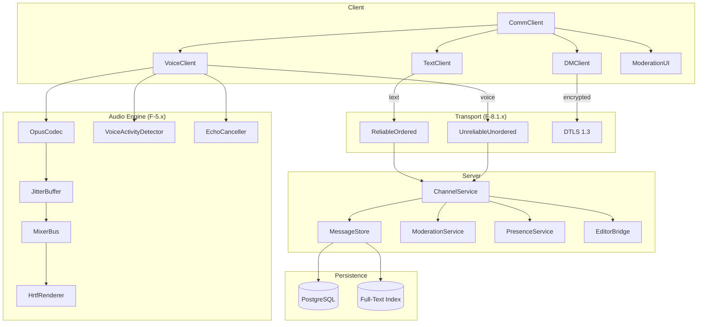
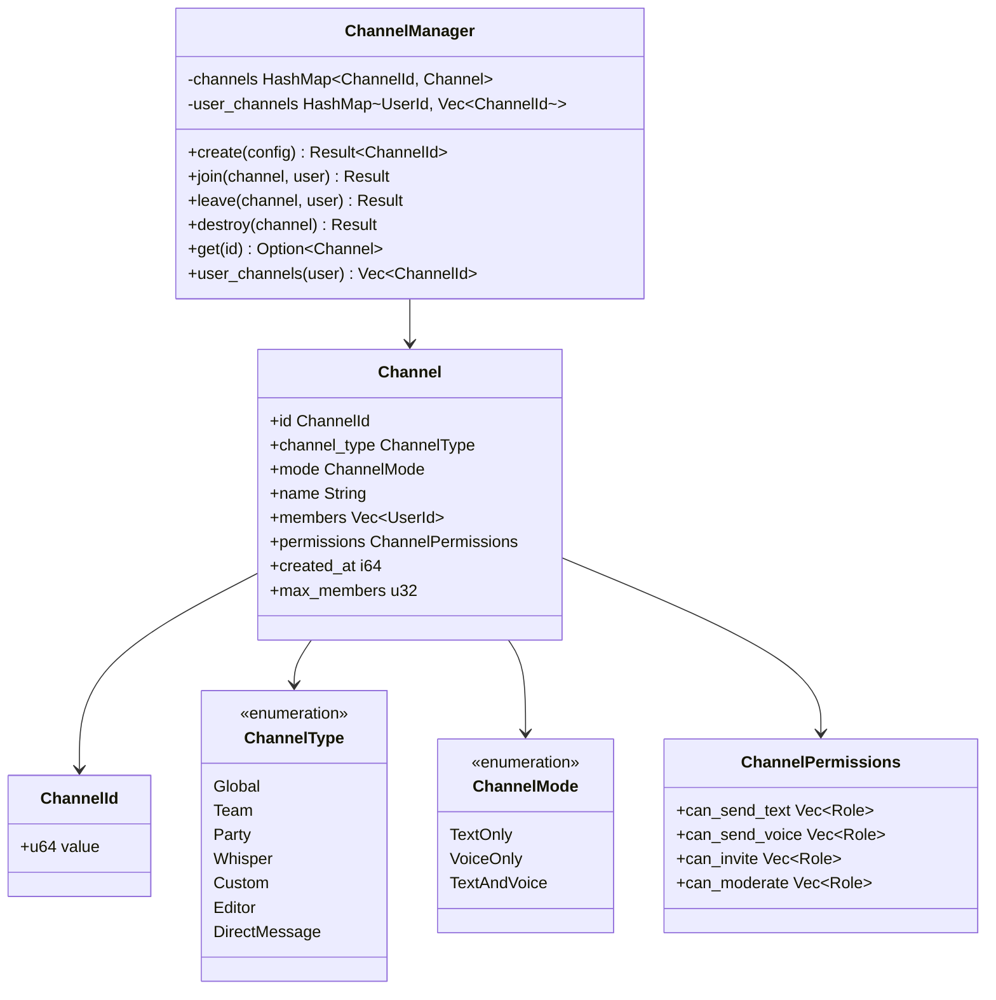
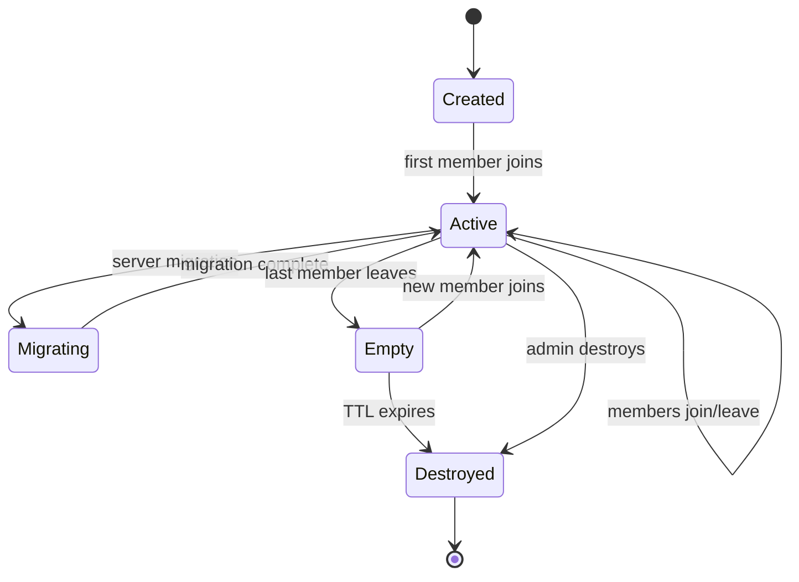
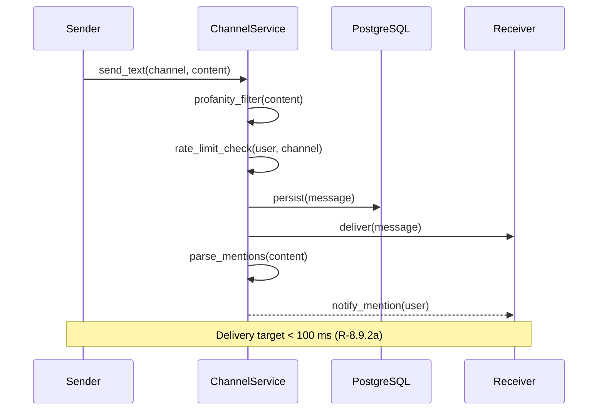
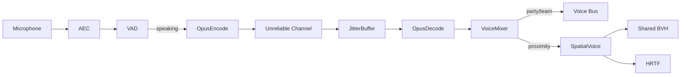
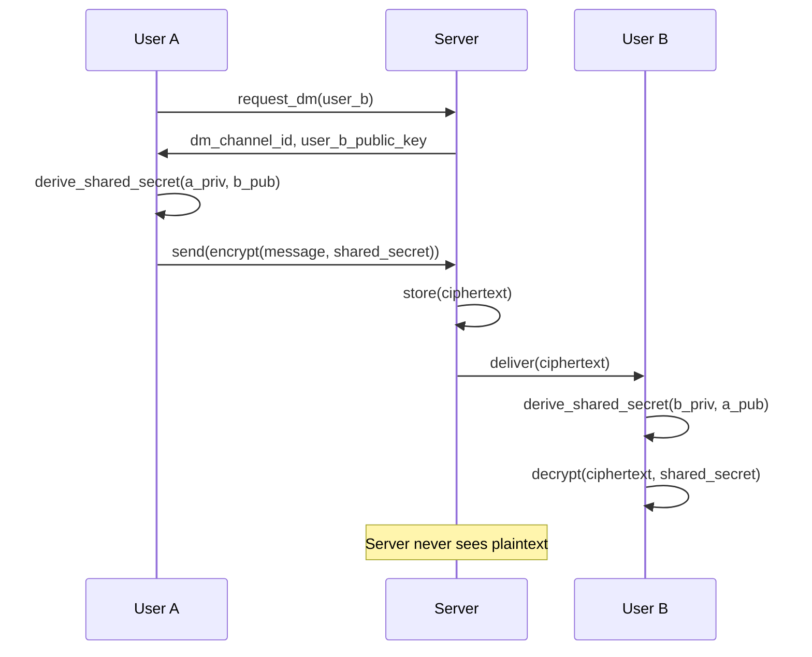
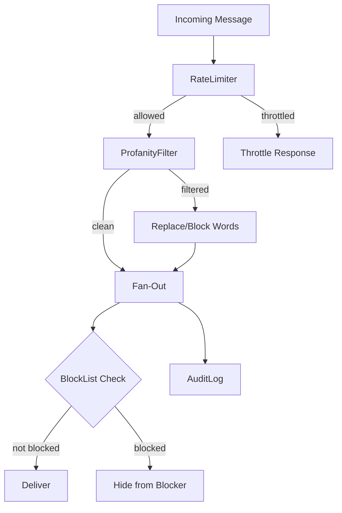
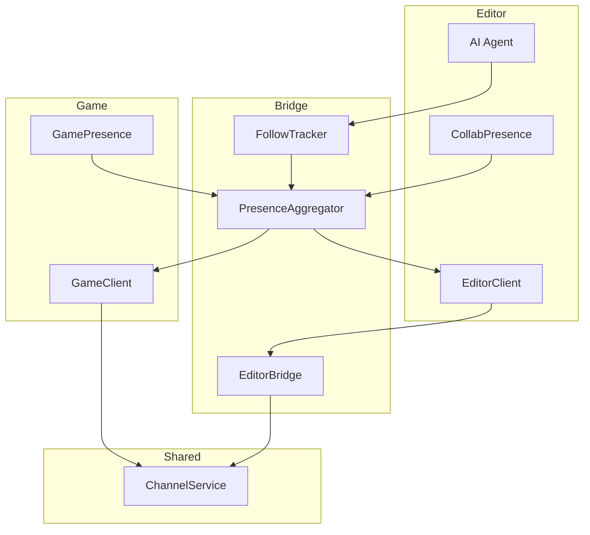
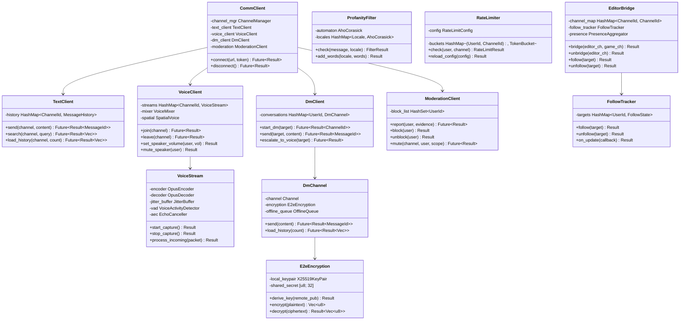

# Unified Communication Framework Design

## Requirements Trace

> **Canonical sources:** Features, requirements, and user stories are defined in
> [features/networking/](../../features/networking/),
> [requirements/networking/](../../requirements/networking/), and
> [user-stories/networking/](../../user-stories/networking/). The table below traces design elements
> to those definitions.

| Feature | Requirement | User Stories             |
|---------|-------------|--------------------------|
| F-8.9.1 | R-8.9.1     | US-8.9.1.1 -- US-8.9.1.6 |
| F-8.9.2 | R-8.9.2     | US-8.9.2.1 -- US-8.9.2.7 |
| F-8.9.3 | R-8.9.3     | US-8.9.3.1 -- US-8.9.3.7 |
| F-8.9.4 | R-8.9.4     | US-8.9.4.1 -- US-8.9.4.7 |
| F-8.9.5 | R-8.9.5     | US-8.9.5.1 -- US-8.9.5.8 |
| F-8.9.6 | R-8.9.6     | US-8.9.6.1 -- US-8.9.6.6 |
| F-8.9.7 | R-8.9.7     | US-8.9.7.1 -- US-8.9.7.6 |
| F-8.9.8 | R-8.9.8     | US-8.9.8.1 -- US-8.9.8.8 |

1. **F-8.9.1** — Unified channel system for game and editor
2. **F-8.9.2** — Text chat with persistence and search
3. **F-8.9.3** — Voice chat with spatial audio
4. **F-8.9.4** — E2E encrypted direct messaging
5. **F-8.9.5** — Profanity filter, mute, block, report
6. **F-8.9.6** — Spatial voice and virtual keyboard in VR
7. **F-8.9.7** — Opus transport with jitter buffer and PLC
8. **F-8.9.8** — Editor-game channel bridge

### Cross-Cutting Dependencies

| Dependency | Source | Consumed API |
|------------|--------|-------------|
| Reliable ordered channel | F-8.1.3 | Text message delivery |
| Unreliable unordered channel | F-8.1.4 | Voice packet delivery |
| DTLS encryption | F-8.1.5 | DM end-to-end encryption |
| Congestion controller | F-8.1.7 | Audio bandwidth budget |
| Lobby / party system | F-8.5.3 | Auto-join party channels |
| Zone transitions | F-8.7.2 | Channel persistence |
| Server migration | F-8.7.4 | Channel handoff |
| Rate limiting | F-8.8.5 | Chat spam prevention |
| Voice codec (Opus) | F-5.5.1 | Encode / decode audio |
| Jitter buffer / PLC | F-5.5.2 | Adaptive buffering |
| Voice activity detection | F-5.5.3 | Transmission gating |
| AEC | F-5.5.9 | Echo cancellation |
| Mixer bus hierarchy | F-5.1.3 | Voice bus routing |
| Shared BVH | F-1.9.8 | Proximity spatial query |
| Distance attenuation | F-5.2.2 | Spatial voice falloff |
| HRTF binaural | F-5.2.3 | VR directional audio |
| Editor collaboration | F-15.12.10 | Chat in editor |
| AI agent collaboration | F-15.12.12 | Follow / track agents |

## Overview

The communication framework provides a single channel abstraction used by both the game runtime and
the editor. Channels are polymorphic: the same channel can carry text messages, voice streams, or
both simultaneously. All communication flows through the same transport, membership, and moderation
infrastructure.

Key design goals:

- **One API** -- game and editor share the channel system
- **Polymorphic channels** -- text + voice on the same channel
- **Spatial voice** -- proximity channels spatialize via BVH
- **E2E encrypted DMs** -- private 1:1 channels
- **Editor bridge** -- follow users and AI agents
- **VR support** -- HRTF voice, virtual keyboard, chat bubbles

## Architecture

### System Architecture



### Module Boundaries

```mermaid
graph TD
    subgraph "harmonius_comm::channel"
        CH[Channel]
        CM[ChannelManager]
        MB[Membership]
        PM[Permissions]
    end

    subgraph "harmonius_comm::text"
        TM[TextMessage]
        MH[MessageHistory]
        SE[SearchEngine]
        MEN[MentionParser]
    end

    subgraph "harmonius_comm::voice"
        VS[VoiceStream]
        VA[VoiceActivity]
        SP[SpatialVoice]
        VMX[VoiceMixer]
    end

    subgraph "harmonius_comm::dm"
        DMC[DmChannel]
        E2E[E2eEncryption]
        OQ[OfflineQueue]
    end

    subgraph "harmonius_comm::moderation"
        PF[ProfanityFilter]
        RL[RateLimiter]
        BK[BlockList]
        RP[ReportService]
        AL[AuditLog]
    end

    subgraph "harmonius_comm::bridge"
        EB[EditorBridge]
        FT[FollowTracker]
        PR[PresenceAggregator]
    end

    CM --> CH
    CM --> MB
    CM --> PM

    TM --> MH
    TM --> SE
    TM --> MEN

    VS --> VA
    VS --> SP
    VS --> VMX

    DMC --> E2E
    DMC --> OQ

    PF --> RL
    PF --> BK
    PF --> RP
    RP --> AL

    EB --> FT
    EB --> PR
```



### File Layout

```text
harmonius_comm/
+-- channel/
|   +-- channel.rs        # Channel — polymorphic container
|   +-- manager.rs        # ChannelManager — create, join,
|   |                     # leave, destroy
|   +-- membership.rs     # Membership — member list, capacity
|   +-- permissions.rs    # Permissions — per-channel ACL
+-- text/
|   +-- message.rs        # TextMessage — content, mentions,
|   |                     # asset refs
|   +-- history.rs        # MessageHistory — paginated load
|   +-- search.rs         # SearchEngine — full-text queries
|   +-- mention.rs        # MentionParser — @-mention parsing
+-- voice/
|   +-- stream.rs         # VoiceStream — Opus encode/decode
|   +-- activity.rs       # VoiceActivity — VAD gating
|   +-- spatial.rs        # SpatialVoice — BVH positioning
|   +-- mixer.rs          # VoiceMixer — multi-stream mixing
+-- dm/
|   +-- channel.rs        # DmChannel — 1:1 special channel
|   +-- encryption.rs     # E2eEncryption — X25519 + AES-GCM
|   +-- offline.rs        # OfflineQueue — store-and-forward
+-- moderation/
|   +-- profanity.rs      # ProfanityFilter — Aho-Corasick
|   +-- rate_limit.rs     # RateLimiter — token bucket
|   +-- block.rs          # BlockList — per-user block set
|   +-- report.rs         # ReportService — file + evidence
|   +-- audit.rs          # AuditLog — append-only log
+-- bridge/
|   +-- editor.rs         # EditorBridge — collab adapter
|   +-- follow.rs         # FollowTracker — user/AI tracking
|   +-- presence.rs       # PresenceAggregator — unified
|                         # presence across contexts
+-- protocol/
    +-- messages.rs       # Wire format for all messages
    +-- codec.rs          # Binary serialization
```

## Channel System Design

### Channel Model

A channel is a polymorphic container identified by a unique `ChannelId`. Each channel carries a
type, a mode (text, voice, or both), a membership list, and a permission set.



### Channel Lifecycle



## Text Chat Design

**Message structure** -- Each `TextMessage` contains the author's `UserId`, a `ChannelId`, content
string, optional `@-mention` list, optional asset reference list, and a server-assigned timestamp.

**Delivery** -- Text messages are sent over the reliable ordered channel (F-8.1.3). The server
persists each message to PostgreSQL with full-text indexing, then fans out to all channel members.
R-8.9.2a requires delivery within 100 ms.

**History** -- On channel join, the client requests the last N messages (configurable, default 50).
The server streams them from the message store. Full-text search (R-8.9.2b) uses a PostgreSQL
`tsvector` index.

**@-mentions** -- The `MentionParser` extracts @-mentions from message content. The server generates
a notification event to the mentioned user's client, even if the user is in a different context
(editor or game).

### Text Message Flow



## Voice Chat Design

**Capture** -- Platform-native microphone capture (WASAPI, CoreAudio, PipeWire) feeds raw PCM into
the voice pipeline.

**VAD gating** -- The `VoiceActivity` detector (F-5.5.3) gates transmission. When the user is not
speaking, no voice packets are sent, conserving bandwidth.

**Encoding** -- Opus encoder (F-5.5.1) compresses audio at configurable bitrates (6-64 kbps).
Default: 24 kbps for party chat, 48 kbps for 1:1 calls.

**Transport** -- Encoded packets are sent over unreliable unordered channels (F-8.1.4) for minimum
latency. Packet headers include `ChannelId`, `UserId`, sequence number, and Opus frame length.

**Jitter buffer** -- The adaptive jitter buffer (F-5.5.2) absorbs network timing variance. Buffer
depth ranges from 20 ms to 200 ms (R-8.9.7a). Opus built-in PLC fills gaps from lost packets.

**Mixing** -- The `VoiceMixer` decodes and mixes up to 32 concurrent incoming streams (R-8.9.7) into
the mixer bus hierarchy (F-5.1.3). Party/team channels route to a non-spatialized voice bus.
Proximity channels spatialize via the shared BVH (F-1.9.8).

**AEC** -- Acoustic echo cancellation (F-5.5.9) runs on the capture path to prevent feedback when
using speakers.

### Voice Pipeline



### Spatial Voice Positioning

Proximity voice channels query the shared BVH (F-1.9.8) to determine the relative position of each
speaker to the listener. The audio engine applies distance attenuation (F-5.2.2) and HRTF binaural
rendering (F-5.2.3) to produce directional audio.

| Parameter | Value | Source |
|-----------|-------|--------|
| Max audible distance | 100 m | F-5.2.2 |
| Attenuation curve | Inverse-squared | F-5.2.2 |
| HRTF update rate | Render frame rate | R-8.9.6a |
| Position tracking latency | < 1 frame | R-8.9.6a |

## Direct Messaging Design

**Channel type** -- A DM is a `Channel` with `ChannelType::DirectMessage` and exactly two members.
DM channels are created on first message and persist until both users delete the conversation.

**E2E encryption** -- Key exchange uses X25519 Diffie-Hellman (R-8.9.4a). Each participant generates
an ephemeral key pair. The shared secret is derived via ECDH and used to key AES-256-GCM for message
encryption. The server stores only ciphertext. Key rotation occurs on each new session.

**Offline queuing** -- When the recipient is offline, the server queues encrypted messages in
PostgreSQL. On next login, queued messages are delivered in order. Queue TTL is configurable
(default 30 days).

**Voice escalation** -- A DM channel can be upgraded from `TextOnly` to `TextAndVoice` mode. This
creates a 1:1 voice stream using the same Opus pipeline as group voice.

### DM Encryption Flow



## Chat Moderation Design

**Profanity filter** -- The `ProfanityFilter` uses an Aho-Corasick automaton built from locale-aware
word lists. Matching runs in O(n) time where n is message length, independent of word list size.
R-8.9.5a requires < 1 ms per message with up to 50,000 entries.

**Rate limiting** -- The `RateLimiter` uses a per-user per-channel token bucket (R-8.9.5b). Default:
5 tokens/s, burst 10. Exceeding the limit triggers throttling; sustained abuse escalates to
temporary mute.

**Block list** -- Per-user block sets. Blocked users' messages are filtered server-side before
delivery. Block state is stored in PostgreSQL and loaded into a `HashSet` on login.

**Reports** -- The `ReportService` attaches message evidence (last N messages from the reported user
in the channel) and persists the report for admin review. All moderation actions are recorded in the
append-only `AuditLog` (R-8.9.5b).

### Moderation Pipeline



## VR Integration

**Spatial voice** -- In VR, proximity voice sources are positioned at avatar head positions. The
`SpatialVoice` module updates source positions at the VR render frame rate (minimum 72 Hz per
R-8.9.6a). HRTF binaural rendering (F-5.2.3) provides directional audio. Distance attenuation uses
the same curves as the audio engine (F-5.2.2).

**Virtual keyboard** -- A worldspace-rendered keyboard panel that accepts controller ray input or
hand-tracking pinch gestures. Typed characters are accumulated into a text buffer and submitted as a
`TextMessage` on enter.

**Chat bubbles** -- Floating UI elements above avatar heads showing the last text message or a
speaking indicator. Bubbles fade after a configurable timeout (default 5 s). Billboard-oriented
toward the viewer camera.

## Editor Communication Bridge

**Bridge adapter** -- The `EditorBridge` connects the communication framework to the editor
collaboration service (F-15.12.10). It maps editor collaboration sessions to communication channels.
Editor users appear in the same presence list as game users.

**Follow/track** -- The `FollowTracker` subscribes to presence updates for a target user or AI agent
(F-15.12.12). Updates include cursor position, active asset, and recent edits. R-8.9.8a requires
updates within 200 ms of the tracked entity's action.

**Cross-context @-mentions** -- When a user in the editor @-mentions a user in the game (or vice
versa), the `PresenceAggregator` routes the notification to the correct client context.

**Channel bridging** -- An admin configures which editor channels bridge to game channels. Bridged
channels relay messages bidirectionally with < 10 ms overhead (R-8.9.8a).

### Editor Bridge Architecture



## Networked Audio Streaming Protocol

### Packet Format

| Field | Size | Description |
|-------|------|-------------|
| channel_id | 8 bytes | Target channel |
| user_id | 8 bytes | Speaker identity |
| sequence | 4 bytes | Monotonic sequence number |
| timestamp | 4 bytes | RTP-style audio timestamp |
| opus_length | 2 bytes | Opus frame payload size |
| opus_data | variable | Opus-encoded audio frame |

Total header overhead: 26 bytes per packet. At 20 ms frame size and 24 kbps Opus bitrate, each
packet is approximately 86 bytes (26 header + 60 payload).

### Bandwidth Budget

Voice bandwidth integrates with the congestion controller (F-8.1.7) per R-8.9.7a. When the
per-connection budget is constrained, the voice subsystem reduces bitrate in steps:

| Budget | Opus Bitrate | Frame Size |
|--------|-------------|------------|
| Normal | 24 kbps | 20 ms |
| Constrained | 12 kbps | 40 ms |
| Severely constrained | 6 kbps | 60 ms |
| Exhausted | Suspend voice | -- |

Gameplay replication always has priority. Voice degrades gracefully before being suspended entirely.

### Jitter Buffer

The adaptive jitter buffer (F-5.5.2) targets a depth that absorbs 99% of packet arrival variance.
Depth adjusts between 20 ms and 200 ms (R-8.9.7a) based on a running estimate of network jitter.
Convergence target: stable depth within 5 seconds of jitter change.

When packets arrive late (beyond jitter buffer depth), Opus built-in PLC generates a substitute
frame by extrapolating from the previous decoded audio. PLC quality degrades after 3 consecutive
lost frames; at that point the stream is temporarily muted to avoid artifacts.

## Core Data Structures



## API Design

### Channel Management

```rust
/// Unique channel identifier.
#[derive(
    Clone, Copy, Debug, PartialEq, Eq, Hash,
)]
pub struct ChannelId(pub u64);

/// Channel type.
#[derive(Clone, Copy, Debug, PartialEq, Eq)]
pub enum ChannelType {
    Global,
    Team,
    Party,
    Whisper,
    Custom,
    Editor,
    DirectMessage,
}

/// Channel mode — text, voice, or both.
#[derive(Clone, Copy, Debug, PartialEq, Eq)]
pub enum ChannelMode {
    TextOnly,
    VoiceOnly,
    TextAndVoice,
}

/// Configuration for creating a new channel.
pub struct ChannelConfig {
    pub channel_type: ChannelType,
    pub mode: ChannelMode,
    pub name: String,
    pub max_members: u32,
    pub permissions: ChannelPermissions,
}

/// Per-channel permission set.
pub struct ChannelPermissions {
    pub can_send_text: Vec<Role>,
    pub can_send_voice: Vec<Role>,
    pub can_invite: Vec<Role>,
    pub can_moderate: Vec<Role>,
}

/// Channel manager — create, join, leave.
pub struct ChannelManager { /* ... */ }

impl ChannelManager {
    /// Create a new channel.
    pub async fn create(
        &mut self,
        config: ChannelConfig,
    ) -> Result<ChannelId, CommError>;

    /// Join an existing channel.
    pub async fn join(
        &self,
        channel: ChannelId,
        user: UserId,
    ) -> Result<(), CommError>;

    /// Leave a channel.
    pub async fn leave(
        &self,
        channel: ChannelId,
        user: UserId,
    ) -> Result<(), CommError>;

    /// Destroy a channel (admin only).
    pub async fn destroy(
        &self,
        channel: ChannelId,
    ) -> Result<(), CommError>;

    /// Get all channels a user belongs to.
    pub fn user_channels(
        &self,
        user: UserId,
    ) -> &[ChannelId];
}
```

### Text Messaging

```rust
/// A unique message identifier.
#[derive(
    Clone, Copy, Debug, PartialEq, Eq, Hash,
)]
pub struct MessageId(pub u64);

/// A text chat message.
#[derive(Clone, Debug)]
pub struct TextMessage {
    pub id: MessageId,
    pub channel: ChannelId,
    pub author: UserId,
    pub content: String,
    pub mentions: Vec<UserId>,
    pub asset_refs: Vec<AssetId>,
    pub timestamp: i64,
}

/// Text messaging client.
pub struct TextClient { /* ... */ }

impl TextClient {
    /// Send a text message.
    pub async fn send(
        &self,
        channel: ChannelId,
        content: &str,
    ) -> Result<MessageId, CommError>;

    /// Search chat history.
    pub async fn search(
        &self,
        channel: ChannelId,
        query: &str,
        limit: u32,
    ) -> Result<Vec<TextMessage>, CommError>;

    /// Load recent history on channel join.
    pub async fn load_history(
        &self,
        channel: ChannelId,
        count: u32,
    ) -> Result<Vec<TextMessage>, CommError>;

    /// Register a callback for incoming messages.
    pub fn on_message<F>(
        &mut self,
        callback: F,
    ) where
        F: Fn(&TextMessage) + Send + 'static;
}
```

### Voice

```rust
/// Voice client for channel voice chat.
pub struct VoiceClient { /* ... */ }

impl VoiceClient {
    /// Join a voice channel and start receiving.
    pub async fn join(
        &mut self,
        channel: ChannelId,
    ) -> Result<(), CommError>;

    /// Leave the voice channel.
    pub async fn leave(
        &mut self,
        channel: ChannelId,
    ) -> Result<(), CommError>;

    /// Adjust a speaker's volume (0.0 -- 1.0).
    pub fn set_speaker_volume(
        &mut self,
        user: UserId,
        volume: f32,
    ) -> Result<(), CommError>;

    /// Mute a specific speaker locally.
    pub fn mute_speaker(
        &mut self,
        user: UserId,
    ) -> Result<(), CommError>;

    /// Unmute a previously muted speaker.
    pub fn unmute_speaker(
        &mut self,
        user: UserId,
    ) -> Result<(), CommError>;

    /// Start microphone capture and transmission.
    pub fn start_capture(
        &mut self,
    ) -> Result<(), CommError>;

    /// Stop microphone capture.
    pub fn stop_capture(
        &mut self,
    ) -> Result<(), CommError>;
}
```

### Direct Messaging

```rust
/// Direct messaging client.
pub struct DmClient { /* ... */ }

impl DmClient {
    /// Start or resume a DM conversation.
    pub async fn start_dm(
        &mut self,
        target: UserId,
    ) -> Result<ChannelId, CommError>;

    /// Send a DM text message.
    pub async fn send(
        &self,
        target: UserId,
        content: &str,
    ) -> Result<MessageId, CommError>;

    /// Load DM history with a user.
    pub async fn load_history(
        &self,
        target: UserId,
        count: u32,
    ) -> Result<Vec<TextMessage>, CommError>;

    /// Escalate a text DM to a voice call.
    pub async fn escalate_to_voice(
        &mut self,
        target: UserId,
    ) -> Result<(), CommError>;

    /// Register a callback for incoming DMs.
    pub fn on_message<F>(
        &mut self,
        callback: F,
    ) where
        F: Fn(&TextMessage) + Send + 'static;
}
```

### Moderation

```rust
/// Result of a rate limit check.
#[derive(Clone, Copy, Debug, PartialEq, Eq)]
pub enum RateLimitResult {
    Allow,
    Throttle { delay_ms: u32 },
    Reject,
}

/// Result of a profanity filter check.
#[derive(Clone, Debug)]
pub enum FilterResult {
    Clean,
    Filtered { replaced: String },
    Blocked,
}

/// Moderation scope for mute.
#[derive(Clone, Copy, Debug, PartialEq, Eq)]
pub enum MuteScope {
    TextOnly,
    VoiceOnly,
    Both,
}

/// Moderation client.
pub struct ModerationClient { /* ... */ }

impl ModerationClient {
    /// Report a user with evidence.
    pub async fn report(
        &self,
        target: UserId,
        reason: &str,
    ) -> Result<(), CommError>;

    /// Block a user locally.
    pub fn block(
        &mut self,
        target: UserId,
    ) -> Result<(), CommError>;

    /// Unblock a user.
    pub fn unblock(
        &mut self,
        target: UserId,
    ) -> Result<(), CommError>;

    /// Mute a user in a channel (admin).
    pub async fn mute(
        &self,
        channel: ChannelId,
        target: UserId,
        scope: MuteScope,
    ) -> Result<(), CommError>;

    /// Unmute a user in a channel (admin).
    pub async fn unmute(
        &self,
        channel: ChannelId,
        target: UserId,
    ) -> Result<(), CommError>;
}
```

### Editor Bridge

```rust
/// Editor communication bridge.
pub struct EditorBridge { /* ... */ }

impl EditorBridge {
    /// Bridge an editor channel to a game channel.
    pub async fn bridge(
        &mut self,
        editor_channel: ChannelId,
        game_channel: ChannelId,
    ) -> Result<(), CommError>;

    /// Remove a channel bridge.
    pub async fn unbridge(
        &mut self,
        editor_channel: ChannelId,
    ) -> Result<(), CommError>;

    /// Follow a user or AI agent.
    pub async fn follow(
        &mut self,
        target: UserId,
    ) -> Result<(), CommError>;

    /// Stop following.
    pub async fn unfollow(
        &mut self,
        target: UserId,
    ) -> Result<(), CommError>;

    /// Register a callback for follow updates.
    pub fn on_follow_update<F>(
        &mut self,
        callback: F,
    ) where
        F: Fn(&FollowUpdate) + Send + 'static;
}

/// Follow/track update event.
#[derive(Clone, Debug)]
pub struct FollowUpdate {
    pub target: UserId,
    pub cursor_position: Option<[f32; 3]>,
    pub active_asset: Option<AssetId>,
    pub last_edit: Option<EditSummary>,
    pub timestamp: i64,
}
```

### Error Types

```rust
/// Communication framework errors.
pub enum CommError {
    /// Channel not found.
    ChannelNotFound { id: ChannelId },
    /// User not a member of the channel.
    NotMember {
        user: UserId,
        channel: ChannelId,
    },
    /// Channel is full.
    ChannelFull { id: ChannelId },
    /// Permission denied.
    PermissionDenied {
        user: UserId,
        action: &'static str,
    },
    /// User is muted in this channel.
    Muted {
        user: UserId,
        channel: ChannelId,
    },
    /// Rate limit exceeded.
    RateLimited { delay_ms: u32 },
    /// Encryption error.
    Encryption { message: String },
    /// Transport error.
    Transport { message: String },
    /// User is offline (DM queued).
    UserOffline { user: UserId },
    /// Not connected to the service.
    NotConnected,
}
```

## Data Flow

### Text Message Pipeline

1. User types a message and presses enter.
2. `TextClient::send` serializes the message and submits it to the reliable ordered channel
   (F-8.1.3).
3. The `ChannelService` receives the message.
4. `RateLimiter::check` verifies the user is within budget.
5. `ProfanityFilter::check` scans for filtered words.
6. The message is persisted to PostgreSQL with full-text indexing.
7. The service fans out the message to all channel members, skipping blocked users per each
   recipient's block list.
8. `MentionParser` extracts @-mentions and generates notification events.
9. Recipients' `TextClient::on_message` callbacks fire.

### Voice Packet Pipeline

1. Platform microphone capture provides raw PCM.
2. `EchoCanceller` (F-5.5.9) subtracts speaker output.
3. `VoiceActivityDetector` (F-5.5.3) gates the signal.
4. `OpusEncoder` (F-5.5.1) encodes at the configured bitrate.
5. Encoded packet is sent via unreliable unordered channel (F-8.1.4) with the voice packet header.
6. Server relays the packet to all voice channel members.
7. Recipient `JitterBuffer` (F-5.5.2) absorbs timing variance.
8. `OpusDecoder` decodes the frame (or PLC fills the gap).
9. `VoiceMixer` mixes decoded audio into the mixer bus.
10. For proximity channels, `SpatialVoice` positions the source via the shared BVH and applies
    distance attenuation and HRTF.

### DM Send Pipeline

1. `DmClient::send` looks up or creates the DM channel.
2. `E2eEncryption::encrypt` encrypts the plaintext with the shared AES-256-GCM key.
3. The ciphertext is sent via the reliable ordered channel.
4. The server stores the ciphertext in PostgreSQL.
5. If the recipient is online, the server delivers immediately.
6. If offline, the message enters the `OfflineQueue`.
7. On next login, queued messages are delivered in order.
8. The recipient's `E2eEncryption::decrypt` recovers the plaintext.

## Platform Considerations

### Microphone Capture

| Platform | API | Notes |
|----------|-----|-------|
| macOS | CoreAudio | `AudioUnit` with AEC |
| Windows | WASAPI | Exclusive/shared mode |
| Linux | PipeWire | Low-latency capture |

### Voice Codec

| Parameter | Value | Notes |
|-----------|-------|-------|
| Codec | Opus | RFC 6716 |
| Sample rate | 48 kHz | Opus internal rate |
| Frame size | 20 ms (default) | 40/60 ms under constraint |
| Bitrate range | 6 -- 64 kbps | Configurable per channel |
| Channels | Mono | Voice is mono per speaker |

### Encryption

| Component | Algorithm | Notes |
|-----------|-----------|-------|
| Key exchange | X25519 | Ephemeral per session |
| Symmetric | AES-256-GCM | Message encryption |
| At-rest | AES-256-GCM | Server-side DM storage |

### Persistence

| Data | Storage | Index |
|------|---------|-------|
| Chat messages | PostgreSQL | `tsvector` FTS |
| DM ciphertext | PostgreSQL | User pair + timestamp |
| Block lists | PostgreSQL | User ID |
| Audit log | PostgreSQL | Append-only, timestamp |
| Moderation reports | PostgreSQL | Status, timestamp |

## Test Plan

Test cases are in the companion file [communication-test-cases.md](communication-test-cases.md).

### Summary

| Category | Count | Coverage |
|----------|-------|----------|
| Unit tests | 20 | Channel CRUD, filter, rate limit, encryption, spatial attenuation |
| Integration tests | 14 | End-to-end delivery, moderation, VR, bridge, DM offline |
| Benchmarks | 8 | Latency, throughput, mixing, filter perf |

## Open Questions

1. **Profanity filter approach** -- Aho-Corasick handles exact and substring matching. Should the
   filter also detect leet-speak substitutions (e.g., "h3llo")? This adds complexity and false
   positive risk.
2. **DM key rotation frequency** -- Currently per-session. Should keys rotate per-message for
   forward secrecy? Per-message rotation adds overhead but limits exposure from a compromised key.
3. **Voice relay architecture** -- Should the server mix audio server-side (lower client bandwidth)
   or relay individual streams (lower server CPU, higher client bandwidth)? Current design relays
   individual streams.
4. **Chat bubble rendering budget** -- How many simultaneous chat bubbles should VR support before
   culling distant ones? Propose: 8 nearest speakers.
5. **Cross-shard channels** -- Global chat channels span all shards via F-8.7.7. Should the
   communication framework handle cross-shard fan-out directly or delegate to the inter-server bus
   (F-8.7.8)?
