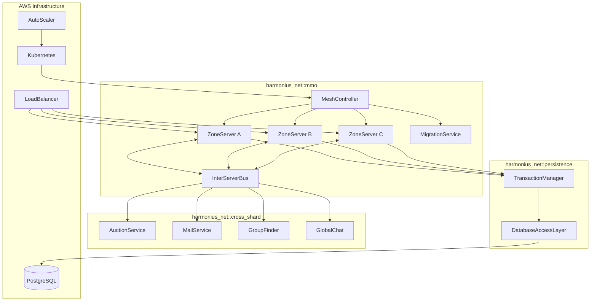
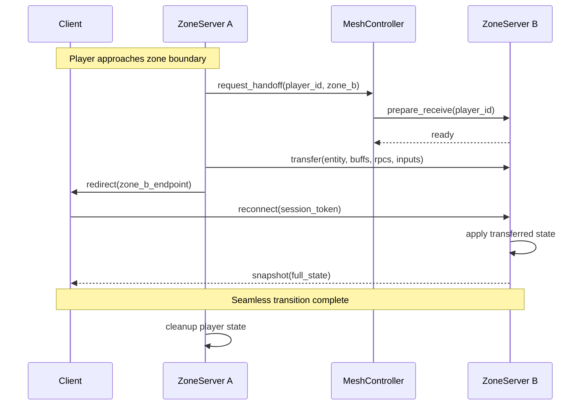
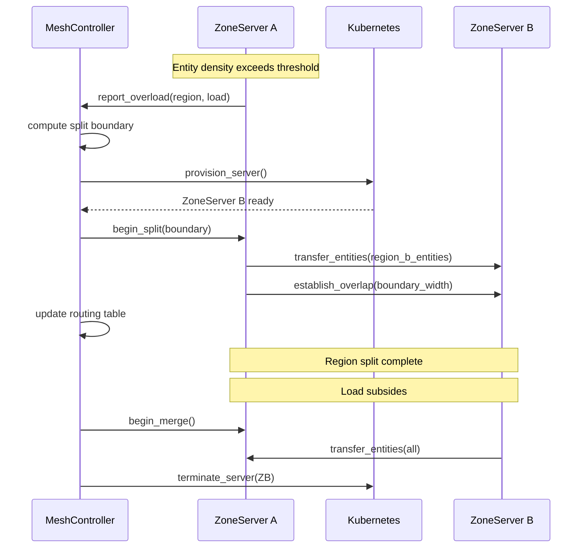
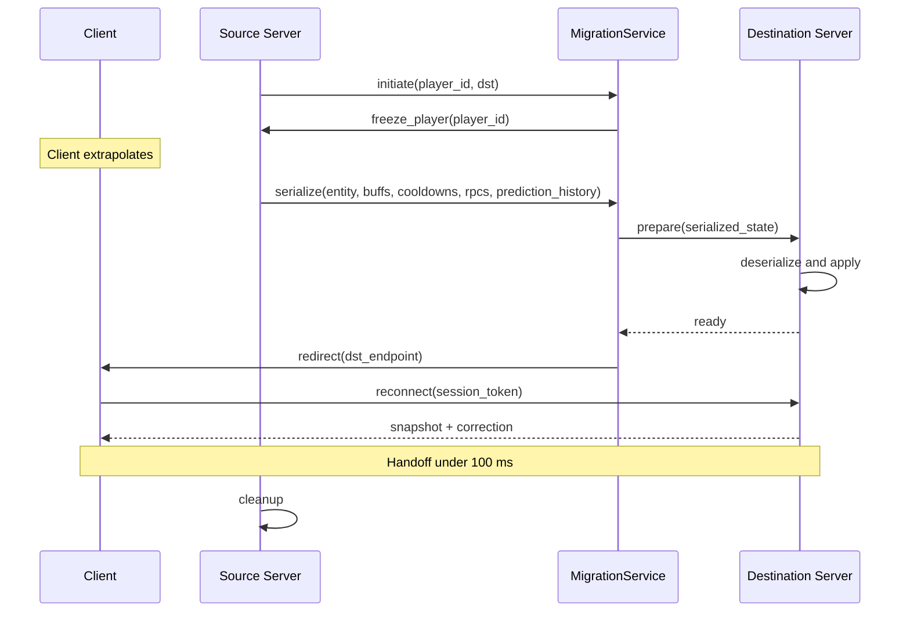
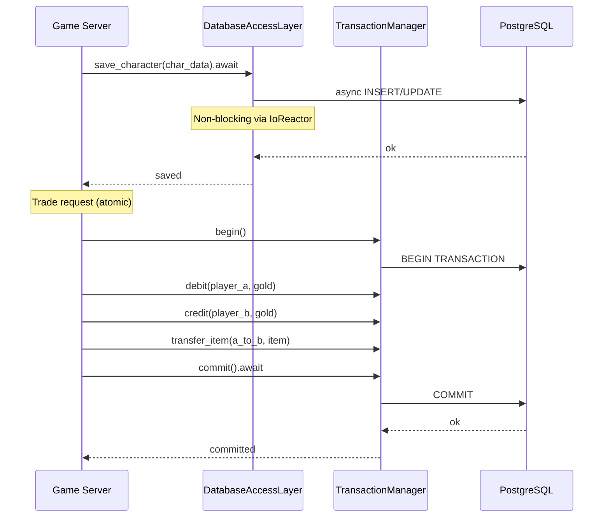
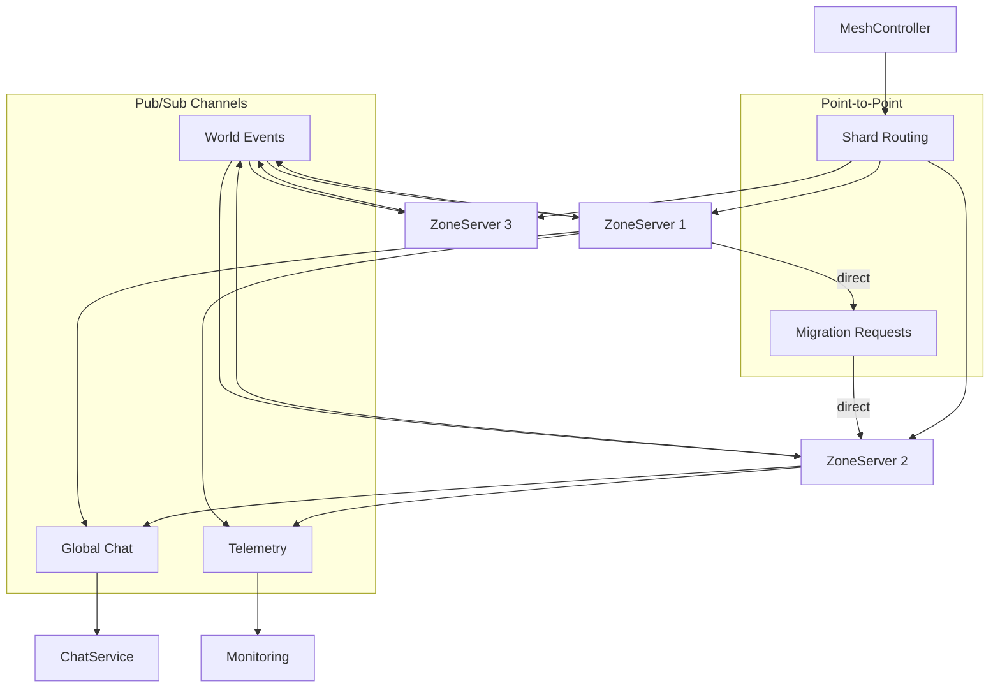
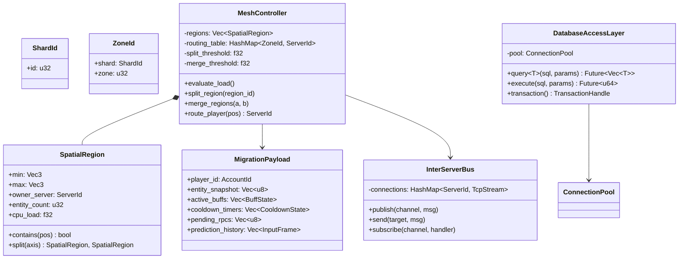

# MMO Infrastructure Design

## Requirements Trace

> **Canonical sources:** Features, requirements, and user stories are defined in
> [features/networking/](../../features/networking/),
> [requirements/networking/](../../requirements/networking/), and
> [user-stories/networking/](../../user-stories/networking/). The table below traces design elements
> to those definitions.

| Feature | Requirement | Description |
|---------|-------------|-------------|
| F-8.7.1 | R-8.7.1 | World sharding and instancing |
| F-8.7.2 | R-8.7.2 | Seamless zone transitions |
| F-8.7.3 | R-8.7.3 | Dynamic server mesh |
| F-8.7.4 | R-8.7.4 | Player migration between servers (< 100 ms) |
| F-8.7.5 | R-8.7.5 | Persistent world state and database integration |
| F-8.7.6 | R-8.7.6 | Load balancing and auto-scaling |
| F-8.7.7 | R-8.7.7 | Cross-shard services (auction, mail, chat) |
| F-8.7.8 | R-8.7.8 | Inter-server communication bus |

## Overview

The MMO infrastructure subsystem manages the server-side architecture for persistent, massively
multiplayer worlds. It partitions the game world into shards and zones, runs a dynamic server mesh
that scales spatially based on entity density, migrates players seamlessly between zone servers,
persists all world state through an async database layer, and provides cross-shard services for
economy, social, and communication features.

All components are 100% ECS-based. Zone servers run the full ECS simulation in headless mode. The
server mesh controller, cross-shard services, and inter-server bus run as independent microservices
on self-hosted AWS infrastructure (Kubernetes). All I/O is async (IOCP / GCD / io_uring). Database
access never blocks the simulation tick.

## Architecture

### Module Boundaries



```text
harmonius_net/
├── mmo/
│   ├── shard.rs         # ShardManager, ShardId,
│   │                    # shard assignment
│   ├── zone.rs          # ZoneServer, ZoneId,
│   │                    # zone boundaries
│   ├── mesh.rs          # MeshController, spatial
│   │                    # partitioning, split/merge
│   ├── migration.rs     # MigrationService,
│   │                    # player handoff
│   ├── instance.rs      # InstanceManager,
│   │                    # dungeon/raid instances
│   ├── overlap.rs       # BoundaryOverlap,
│   │                    # co-simulation
│   └── scaler.rs        # AutoScaler, load
│                        # monitoring
├── persistence/
│   ├── dal.rs           # DatabaseAccessLayer,
│   │                    # async query execution
│   ├── transaction.rs   # TransactionManager,
│   │                    # atomic operations
│   ├── schema.rs        # Table definitions,
│   │                    # migration scripts
│   └── pool.rs          # ConnectionPool,
│                        # async pooling
├── cross_shard/
│   ├── auction.rs       # AuctionService,
│   │                    # bid/buyout logic
│   ├── mail.rs          # MailService,
│   │                    # attachments
│   ├── group_finder.rs  # GroupFinder,
│   │                    # cross-shard matching
│   ├── chat.rs          # GlobalChat, channels
│   └── guild.rs         # GuildService,
│                        # roster management
└── bus/
    ├── transport.rs     # TCP connections,
    │                    # auto-reconnect
    ├── channel.rs       # PubSub + point-to-point
    │                    # routing
    ├── delivery.rs      # Delivery guarantees:
    │                    # at-most/at-least/exactly
    └── codec.rs         # Typed message
                         # serialization
```

### Zone Transition Flow



### Dynamic Mesh Split/Merge



### Player Migration Handoff



### Persistence Layer



### Inter-Server Bus Topology



### Core Data Structures



## API Design

### Shard and Zone Types

```rust
/// Shard identifier (full world copy).
#[derive(
    Clone, Copy, Debug, PartialEq, Eq, Hash,
)]
pub struct ShardId(pub u32);

/// Zone identifier within a shard.
#[derive(
    Clone, Copy, Debug, PartialEq, Eq, Hash,
)]
pub struct ZoneId {
    pub shard: ShardId,
    pub zone: u32,
}

/// Server process identifier.
#[derive(
    Clone, Copy, Debug, PartialEq, Eq, Hash,
)]
pub struct ServerId(pub u64);

/// Shard assignment rule.
#[derive(Clone, Debug)]
pub enum ShardAssignment {
    /// Assign to the least-populated shard.
    LeastPopulated,
    /// Assign to a specific shard (friend join).
    Specific(ShardId),
    /// Assign to the same shard as another player.
    SameAs(AccountId),
}
```

### Shard Manager

```rust
/// Shard configuration.
pub struct ShardConfig {
    /// Maximum players per shard.
    pub max_players: u32,
    /// Whether cross-shard social is enabled.
    pub cross_shard_social: bool,
    /// Auto-merge threshold (fraction of capacity).
    pub merge_threshold: f32,
    /// Auto-split threshold (fraction of capacity).
    pub split_threshold: f32,
}

/// Manages world shards and character assignment.
pub struct ShardManager { /* ... */ }

impl ShardManager {
    pub fn new(config: ShardConfig) -> Self;

    /// Assign a player to a shard.
    pub async fn assign(
        &self,
        account_id: AccountId,
        rule: ShardAssignment,
    ) -> Result<ShardId, ShardError>;

    /// Get the shard a player is assigned to.
    pub async fn lookup(
        &self,
        account_id: AccountId,
    ) -> Result<ShardId, ShardError>;

    /// List all active shards with population.
    pub async fn list_shards(
        &self,
    ) -> Vec<ShardInfo>;

    /// Merge two shards. Migrates all players
    /// and state from source to target.
    pub async fn merge(
        &self,
        source: ShardId,
        target: ShardId,
    ) -> Result<(), ShardError>;

    /// Split a shard into two.
    pub async fn split(
        &self,
        shard: ShardId,
    ) -> Result<(ShardId, ShardId), ShardError>;
}

pub struct ShardInfo {
    pub id: ShardId,
    pub player_count: u32,
    pub max_players: u32,
    pub zone_count: u32,
    pub state: ShardState,
}

#[derive(Clone, Copy, Debug, PartialEq, Eq)]
pub enum ShardState {
    Active,
    Draining,
    Maintenance,
    Merging,
}
```

### Spatial Region and Mesh Controller

```rust
/// Axis-aligned spatial region owned by a server.
pub struct SpatialRegion {
    pub region_id: u32,
    pub min: Vec3,
    pub max: Vec3,
    pub owner: ServerId,
    pub entity_count: u32,
    pub cpu_load: f32,
}

impl SpatialRegion {
    /// Check if a world position is inside this
    /// region.
    pub fn contains(&self, pos: Vec3) -> bool;

    /// Split this region along the longest axis.
    pub fn split(
        &self,
    ) -> (SpatialRegion, SpatialRegion);

    /// Area of the region (2D footprint).
    pub fn area(&self) -> f32;

    /// Check if a position is within the
    /// boundary overlap zone.
    pub fn in_overlap(
        &self,
        pos: Vec3,
        overlap_width: f32,
    ) -> bool;
}

/// Mesh controller configuration.
pub struct MeshConfig {
    /// Entity density threshold to trigger split.
    pub split_threshold: f32,
    /// Entity density threshold to trigger merge.
    pub merge_threshold: f32,
    /// Width of boundary overlap in world units.
    pub overlap_width: f32,
    /// Evaluation interval in seconds.
    pub eval_interval_seconds: u32,
}

/// Manages the dynamic server mesh.
pub struct MeshController { /* ... */ }

impl MeshController {
    pub fn new(config: MeshConfig) -> Self;

    /// Evaluate all regions and trigger
    /// splits/merges as needed. Called
    /// periodically by a timer system.
    pub async fn evaluate(&self);

    /// Split an overloaded region across two
    /// server processes.
    pub async fn split_region(
        &self,
        region_id: u32,
    ) -> Result<(u32, u32), MeshError>;

    /// Merge two underutilized adjacent regions.
    pub async fn merge_regions(
        &self,
        a: u32,
        b: u32,
    ) -> Result<u32, MeshError>;

    /// Route a player to the server owning their
    /// position.
    pub fn route(
        &self,
        pos: Vec3,
    ) -> Result<ServerId, MeshError>;

    /// Get all regions and their current load.
    pub fn topology(&self) -> Vec<SpatialRegion>;

    /// Get regions adjacent to a given region
    /// (for overlap co-simulation).
    pub fn adjacent_regions(
        &self,
        region_id: u32,
    ) -> Vec<u32>;
}
```

### Player Migration

```rust
/// Serialized player state for migration.
pub struct MigrationPayload {
    pub account_id: AccountId,
    pub session_id: SessionId,
    /// Full ECS snapshot of the player entity
    /// and all owned entities.
    pub entity_snapshot: Vec<u8>,
    /// Active buff/debuff state with remaining
    /// durations.
    pub active_buffs: Vec<BuffState>,
    /// Cooldown timers with remaining ticks.
    pub cooldown_timers: Vec<CooldownState>,
    /// Pending RPCs not yet acknowledged.
    pub pending_rpcs: Vec<u8>,
    /// Client prediction history for seamless
    /// reconciliation on the destination server.
    pub prediction_history: Vec<InputFrame>,
    /// Timestamp of migration initiation.
    pub initiated_at: u64,
}

pub struct BuffState {
    pub buff_id: u32,
    pub remaining_ticks: u32,
    pub stacks: u8,
    pub source_entity: Option<Entity>,
}

pub struct CooldownState {
    pub ability_id: u32,
    pub remaining_ticks: u32,
}

pub struct InputFrame {
    pub tick: u64,
    pub input: Vec<u8>,
    pub predicted_state: Vec<u8>,
}

/// Handles player migration between servers.
pub struct MigrationService { /* ... */ }

impl MigrationService {
    pub fn new() -> Self;

    /// Initiate migration of a player to a
    /// destination server. Target: < 100 ms.
    pub async fn migrate(
        &self,
        payload: MigrationPayload,
        destination: ServerId,
    ) -> Result<(), MigrationError>;

    /// Receive a migrating player on the
    /// destination server.
    pub async fn receive(
        &self,
        payload: MigrationPayload,
        world: &mut World,
    ) -> Result<Entity, MigrationError>;

    /// Batch migration for mesh split/merge.
    pub async fn migrate_batch(
        &self,
        payloads: Vec<MigrationPayload>,
        destination: ServerId,
    ) -> Result<u32, MigrationError>;
}

pub enum MigrationError {
    DestinationUnavailable,
    SerializationFailed,
    Timeout,
    StateMismatch,
}
```

### Instance Manager

```rust
/// Instance difficulty parameters.
pub struct InstanceParams {
    pub template_id: u32,
    pub difficulty: InstanceDifficulty,
    pub max_players: u32,
    pub lockout_hours: u32,
}

#[derive(
    Clone, Copy, Debug, PartialEq, Eq,
)]
pub enum InstanceDifficulty {
    Normal,
    Heroic,
    Mythic,
}

/// Unique instance identifier.
#[derive(
    Clone, Copy, Debug, PartialEq, Eq, Hash,
)]
pub struct InstanceId(pub u64);

/// Manages instanced content (dungeons, raids,
/// battlegrounds).
pub struct InstanceManager { /* ... */ }

impl InstanceManager {
    pub fn new() -> Self;

    /// Create a new instance with the given
    /// parameters. Provisions a server process.
    pub async fn create(
        &self,
        params: InstanceParams,
        party_id: PartyId,
    ) -> Result<InstanceId, InstanceError>;

    /// Check lockout status for a player.
    pub async fn check_lockout(
        &self,
        account_id: AccountId,
        template_id: u32,
        difficulty: InstanceDifficulty,
    ) -> Result<LockoutStatus, InstanceError>;

    /// Destroy an instance after completion.
    pub async fn destroy(
        &self,
        instance_id: InstanceId,
    ) -> Result<(), InstanceError>;

    /// List active instances for monitoring.
    pub async fn list_active(
        &self,
    ) -> Vec<InstanceInfo>;
}

pub struct LockoutStatus {
    pub locked: bool,
    pub expires_at: Option<u64>,
    pub boss_kills: Vec<u32>,
}
```

### Boundary Overlap

```rust
/// Configuration for boundary overlap
/// co-simulation.
pub struct OverlapConfig {
    /// Width of overlap zone in world units.
    pub width: f32,
    /// Sync frequency (ticks between updates).
    pub sync_interval: u32,
}

/// Manages co-simulation of entities near zone
/// boundaries.
pub struct BoundaryOverlap { /* ... */ }

impl BoundaryOverlap {
    pub fn new(config: OverlapConfig) -> Self;

    /// Register a boundary between two zone
    /// servers.
    pub fn register_boundary(
        &self,
        zone_a: ZoneId,
        zone_b: ZoneId,
        boundary: SpatialRegion,
    );

    /// Sync entities in the overlap zone to the
    /// adjacent server. Called each sync interval.
    pub async fn sync(
        &self,
        local_zone: ZoneId,
        entities_in_overlap: &[Entity],
        world: &World,
    ) -> Result<(), OverlapError>;

    /// Receive synced entities from the adjacent
    /// server and apply as ghost entities.
    pub fn receive(
        &self,
        source_zone: ZoneId,
        data: &[u8],
        world: &mut World,
    ) -> Result<u32, OverlapError>;
}
```

### Database Access Layer

```rust
/// Connection pool configuration.
pub struct PoolConfig {
    /// Connection string (PostgreSQL).
    pub connection_string: String,
    /// Minimum connections in the pool.
    pub min_connections: u32,
    /// Maximum connections in the pool.
    pub max_connections: u32,
    /// Connection idle timeout in seconds.
    pub idle_timeout_seconds: u32,
}

/// Async database access layer.
/// All operations use platform-native async I/O.
pub struct DatabaseAccessLayer { /* ... */ }

impl DatabaseAccessLayer {
    pub async fn new(
        config: PoolConfig,
    ) -> Result<Self, DbError>;

    /// Execute a parameterized query, returning
    /// deserialized rows.
    pub async fn query<T: FromRow>(
        &self,
        sql: &str,
        params: &[&ParamValue],
    ) -> Result<Vec<T>, DbError>;

    /// Execute a statement (INSERT, UPDATE,
    /// DELETE). Returns rows affected.
    pub async fn execute(
        &self,
        sql: &str,
        params: &[&ParamValue],
    ) -> Result<u64, DbError>;

    /// Begin a transaction.
    pub async fn transaction(
        &self,
    ) -> Result<TransactionHandle, DbError>;

    /// Pool health metrics.
    pub fn pool_stats(&self) -> PoolStats;
}

/// Transactional write handle. Supports atomic
/// multi-statement operations.
pub struct TransactionHandle { /* ... */ }

impl TransactionHandle {
    pub async fn execute(
        &self,
        sql: &str,
        params: &[&ParamValue],
    ) -> Result<u64, DbError>;

    pub async fn query<T: FromRow>(
        &self,
        sql: &str,
        params: &[&ParamValue],
    ) -> Result<Vec<T>, DbError>;

    /// Commit the transaction.
    pub async fn commit(
        self,
    ) -> Result<(), DbError>;

    /// Roll back the transaction.
    pub async fn rollback(
        self,
    ) -> Result<(), DbError>;
}

pub struct PoolStats {
    pub active_connections: u32,
    pub idle_connections: u32,
    pub pending_queries: u32,
    pub total_queries: u64,
}

pub enum DbError {
    ConnectionFailed,
    QueryFailed { message: String },
    TransactionConflict,
    PoolExhausted,
    Timeout,
}
```

### Auto-Scaler

```rust
/// Auto-scaler configuration.
pub struct ScalerConfig {
    /// CPU threshold to trigger scale-up (0-1).
    pub scale_up_cpu: f32,
    /// CPU threshold to trigger scale-down (0-1).
    pub scale_down_cpu: f32,
    /// Player count threshold for scale-up.
    pub scale_up_players: u32,
    /// Minimum server count (never scale below).
    pub min_servers: u32,
    /// Maximum server count.
    pub max_servers: u32,
    /// Cool-down between scaling events (seconds).
    pub cooldown_seconds: u32,
}

/// Server load metrics.
pub struct ServerMetrics {
    pub server_id: ServerId,
    pub cpu_percent: f32,
    pub memory_mb: u32,
    pub player_count: u32,
    pub network_mbps: f32,
    pub tick_time_ms: f32,
}

/// Monitors load and provisions/deprovisions
/// server processes.
pub struct AutoScaler { /* ... */ }

impl AutoScaler {
    pub fn new(config: ScalerConfig) -> Self;

    /// Evaluate current fleet metrics and scale.
    /// Called periodically.
    pub async fn evaluate(
        &self,
        metrics: &[ServerMetrics],
    ) -> Vec<ScaleAction>;

    /// Provision a new server process.
    pub async fn provision(
        &self,
    ) -> Result<ServerId, ScaleError>;

    /// Drain and terminate a server process.
    pub async fn drain_and_terminate(
        &self,
        server_id: ServerId,
    ) -> Result<(), ScaleError>;

    /// Current fleet size.
    pub fn fleet_size(&self) -> u32;
}

#[derive(Clone, Debug)]
pub enum ScaleAction {
    Provision { count: u32 },
    Drain { server_id: ServerId },
    None,
}
```

### Load Balancer

```rust
/// Routes new connections to the least-loaded
/// eligible server.
pub struct LoadBalancer { /* ... */ }

impl LoadBalancer {
    pub fn new() -> Self;

    /// Select a server for a new connection based
    /// on zone, capacity, and current load.
    pub fn select(
        &self,
        zone_id: ZoneId,
    ) -> Result<ServerId, LoadBalancerError>;

    /// Update a server's metrics.
    pub fn report_metrics(
        &self,
        metrics: ServerMetrics,
    );

    /// Mark a server as draining (no new
    /// connections).
    pub fn set_draining(
        &self,
        server_id: ServerId,
    );

    /// Remove a server from the routing table.
    pub fn remove_server(
        &self,
        server_id: ServerId,
    );
}
```

### Inter-Server Bus

```rust
/// Message delivery guarantee.
#[derive(Clone, Copy, Debug, PartialEq, Eq)]
pub enum DeliveryGuarantee {
    /// Best-effort, no retransmission.
    /// Use for telemetry, heartbeats.
    AtMostOnce,
    /// Retransmit until acknowledged.
    /// Use for player migration.
    AtLeastOnce,
    /// Retransmit + deduplicate.
    /// Use for economy transactions.
    ExactlyOnce,
}

/// Named publish-subscribe channel.
#[derive(Clone, Debug)]
pub struct BusChannel {
    pub name: String,
    pub guarantee: DeliveryGuarantee,
}

/// Typed message for inter-server communication.
pub struct BusMessage {
    pub channel: String,
    pub source: ServerId,
    pub target: Option<ServerId>,
    pub sequence: u64,
    pub payload: Vec<u8>,
}

/// Inter-server communication bus.
pub struct InterServerBus { /* ... */ }

impl InterServerBus {
    pub fn new() -> Self;

    /// Connect to a peer server.
    pub async fn connect(
        &self,
        peer: ServerId,
        addr: SocketAddr,
    ) -> Result<(), BusError>;

    /// Publish a message to all subscribers
    /// of a channel.
    pub async fn publish(
        &self,
        channel: &str,
        payload: &[u8],
    ) -> Result<(), BusError>;

    /// Send a point-to-point message to a
    /// specific server.
    pub async fn send(
        &self,
        target: ServerId,
        channel: &str,
        payload: &[u8],
    ) -> Result<(), BusError>;

    /// Subscribe to a channel. Incoming messages
    /// are dispatched to the handler.
    pub fn subscribe<H>(
        &self,
        channel: &str,
        handler: H,
    ) where
        H: Fn(BusMessage) + Send + 'static;

    /// Current peer connection count.
    pub fn peer_count(&self) -> u32;
}

pub enum BusError {
    ConnectionFailed,
    PeerNotFound,
    ChannelNotFound,
    SerializationFailed,
    Timeout,
}
```

### Cross-Shard Services

```rust
/// Auction listing.
pub struct AuctionListing {
    pub listing_id: u64,
    pub seller: AccountId,
    pub item_id: u64,
    pub item_data: Vec<u8>,
    pub starting_price: u64,
    pub buyout_price: Option<u64>,
    pub current_bid: u64,
    pub current_bidder: Option<AccountId>,
    pub expires_at: u64,
}

/// Global auction house service.
pub struct AuctionService { /* ... */ }

impl AuctionService {
    pub fn new(
        dal: DatabaseAccessLayer,
        bus: InterServerBus,
    ) -> Self;

    /// List an item for auction.
    pub async fn list(
        &self,
        listing: AuctionListing,
    ) -> Result<u64, AuctionError>;

    /// Place a bid. Deterministic resolution
    /// under concurrency.
    pub async fn bid(
        &self,
        listing_id: u64,
        bidder: AccountId,
        amount: u64,
    ) -> Result<(), AuctionError>;

    /// Buyout an item immediately.
    pub async fn buyout(
        &self,
        listing_id: u64,
        buyer: AccountId,
    ) -> Result<(), AuctionError>;

    /// Search listings by criteria.
    pub async fn search(
        &self,
        query: AuctionQuery,
    ) -> Result<Vec<AuctionListing>, AuctionError>;

    /// Settle expired auctions. Called
    /// periodically.
    pub async fn settle_expired(&self) -> u32;
}

/// Cross-shard mail service.
pub struct MailService { /* ... */ }

impl MailService {
    pub fn new(
        dal: DatabaseAccessLayer,
        bus: InterServerBus,
    ) -> Self;

    /// Send mail with optional item attachments.
    /// Transactional: items are removed from
    /// sender's inventory atomically.
    pub async fn send(
        &self,
        from: AccountId,
        to: AccountId,
        subject: String,
        body: String,
        attachments: Vec<MailAttachment>,
    ) -> Result<(), MailError>;

    /// Retrieve inbox for a player.
    pub async fn inbox(
        &self,
        account_id: AccountId,
    ) -> Result<Vec<MailMessage>, MailError>;

    /// Claim attachments from a mail message.
    pub async fn claim_attachments(
        &self,
        mail_id: u64,
        account_id: AccountId,
    ) -> Result<Vec<u64>, MailError>;
}
```

### Error Types

```rust
pub enum ShardError {
    NotFound,
    AtCapacity,
    MergeConflict,
    AlreadyAssigned,
}

pub enum MeshError {
    RegionNotFound,
    SplitFailed,
    MergeFailed,
    NoServerAvailable,
}

pub enum InstanceError {
    TemplateNotFound,
    LockedOut,
    NoCapacity,
    AlreadyInInstance,
}

pub enum OverlapError {
    BoundaryNotRegistered,
    SyncFailed,
    DeserializationFailed,
}

pub enum ScaleError {
    AtMaxCapacity,
    AtMinCapacity,
    ProvisionTimeout,
    DrainTimeout,
}

pub enum LoadBalancerError {
    NoEligibleServer,
    ZoneNotFound,
}

pub enum AuctionError {
    ListingNotFound,
    Outbid,
    AlreadySold,
    InsufficientFunds,
    TransactionConflict,
}

pub enum MailError {
    RecipientNotFound,
    InboxFull,
    AttachmentInvalid,
}
```

## Data Flow

### World Topology

The game world is organized in three layers:

1. **Shards.** Full copies of the world for population management. Each shard has its own set of
   zone servers. Players are assigned to a shard at login.

2. **Zones.** Spatial subdivisions of the world within a shard. Each zone is owned by one server
   process. The mesh controller dynamically splits and merges zones based on entity density.

3. **Instances.** Isolated copies of specific zones for dungeons, raids, and battlegrounds.
   Group-scoped state, difficulty parameters, lockout timers.

### Seamless Zone Transition Pipeline

1. Player approaches a zone boundary. The source server detects the player is in the overlap region.

2. Source server requests handoff from the mesh controller. The controller identifies the
   destination zone server.

3. Destination server acknowledges readiness.

4. Source server serializes the player's full state into a `MigrationPayload`: ECS entity snapshot,
   active buffs, cooldown timers, pending RPCs, prediction history.

5. Payload is transferred to the destination server via the inter-server bus (at-least-once
   delivery).

6. Client receives a redirect to the destination server endpoint. During the brief handoff (< 100
   ms), the client extrapolates using its last known state.

7. Client reconnects to the destination server. The server applies the transferred state and sends a
   full snapshot for reconciliation.

### Boundary Overlap Co-Simulation

Entities within the overlap width of a zone boundary are co-simulated by both adjacent servers. The
authoritative server replicates overlap entities to the neighbor at the configured sync interval.
The neighbor renders them as ghost entities. This prevents pop-in when players or NPCs cross zone
edges.

### Persistence Pipeline

All database access flows through the `DatabaseAccessLayer`, which uses platform-native async I/O
(IOCP on Windows, GCD on macOS, io_uring on Linux). The simulation tick never blocks on database
operations.

- **Character saves:** periodic background flushes (every 30 s) plus event-triggered saves (level
  up, trade).
- **Transactions:** trades, auction settlements, and mail with attachments use `TransactionHandle`
  for atomicity.
- **Write throughput:** sustained 10,000+ TPS across the server fleet via connection pooling and
  batched writes.

### Inter-Server Bus Delivery

| Channel | Guarantee | Use Case |
|---------|-----------|----------|
| `telemetry` | At-most-once | Server metrics, monitoring |
| `global_chat` | At-most-once | Chat messages across shards |
| `world_events` | At-least-once | Boss spawns, faction wars |
| `migration` | At-least-once | Player migration payloads |
| `economy` | Exactly-once | Auction bids, cross-shard trades |

## Platform Considerations

### Server Deployment

| Component | Deployment | Notes |
|-----------|------------|-------|
| ZoneServer | AWS ECS / Kubernetes pod | Headless, Linux, 1 vCPU per region |
| MeshController | AWS ECS Fargate | Stateless, evaluates every 5 s |
| AutoScaler | AWS Lambda + CloudWatch | Triggered by metric alarms |
| LoadBalancer | AWS NLB | TCP pass-through, health checks |
| InterServerBus | In-process (per server) | Persistent TCP, auto-reconnect |
| Cross-shard services | AWS ECS Fargate | Independent microservices |
| PostgreSQL | AWS RDS (Multi-AZ) | Primary for persistence |
| DynamoDB | AWS DynamoDB | Session directory, ephemeral state |

### Database I/O per Platform

| Platform | Async Backend | Notes |
|----------|---------------|-------|
| Windows | IOCP | `GetQueuedCompletionStatusEx` for socket I/O |
| macOS | GCD Dispatch IO | C++ wrappers via `cxx.rs` |
| Linux | io_uring | `IORING_OP_SEND` / `IORING_OP_RECV` for DB sockets |

### Scaling Tiers

| Tier | Shards | Zones/Shard | Players/Shard | Servers |
|------|--------|-------------|---------------|---------|
| Launch | 4 | 20 | 500 | 80+ |
| Growth | 8 | 30 | 500 | 240+ |
| Peak | 16 | 40 | 500 | 640+ |

### Mobile Adaptations

| Feature | Desktop | Mobile |
|---------|---------|--------|
| Migration extrapolation | 100 ms window | 200 ms window |
| Overlap sync interval | 2 ticks | 4 ticks |
| Entity budget per zone | 2,000 | 500 (relevancy filtered) |

## Test Plan

### Unit Tests

| Test | Req | Description |
|------|-----|-------------|
| `test_shard_assignment_least_pop` | R-8.7.1 | Assign to shard with fewest players. |
| `test_shard_assignment_specific` | R-8.7.1 | Assign to a friend's shard. |
| `test_shard_merge` | R-8.7.1 | Merge two shards; verify all players and state in target. |
| `test_instance_lockout` | R-8.7.1 | Create instance, complete, attempt re-entry; verify lockout. |
| `test_spatial_region_contains` | R-8.7.3 | Point-in-region test for various positions. |
| `test_spatial_region_split` | R-8.7.3 | Split region; verify two halves cover original. |
| `test_mesh_route_player` | R-8.7.3 | Route player to correct server by position. |
| `test_migration_payload_roundtrip` | R-8.7.4 | Serialize and deserialize a payload; verify all fields. |
| `test_migration_payload_buffs` | R-8.7.4 | Migrate with active buffs; verify remaining ticks preserved. |
| `test_transaction_commit` | R-8.7.5 | Execute multi-statement transaction; verify atomicity. |
| `test_transaction_rollback` | R-8.7.5 | Simulate crash mid-transaction; verify rollback. |
| `test_bus_pubsub_delivery` | R-8.7.8 | Publish to channel; verify all subscribers receive. |
| `test_bus_point_to_point` | R-8.7.8 | Send direct message; verify only target receives. |
| `test_bus_exactly_once_dedup` | R-8.7.8 | Retransmit economy message; verify deduplicated. |
| `test_bus_auto_reconnect` | R-8.7.8 | Disconnect peer; verify reconnection within 5 s. |
| `test_overlap_sync` | R-8.7.2 | Sync entities in overlap zone; verify ghost entities appear. |
| `test_auction_concurrent_bid_buyout` | R-8.7.7 | Concurrent bid + buyout; verify one succeeds, one fails. |

### Integration Tests

| Test | Req | Description |
|------|-----|-------------|
| `test_seamless_zone_transition` | R-8.7.2 | Move player across boundary; verify no loading screen, no disconnect, state preserved. |
| `test_overlap_no_popin` | R-8.7.2 | Entities near boundary visible from both zones. |
| `test_mesh_split_500_players` | R-8.7.3 | Concentrate 500 players; verify split within 10 s. |
| `test_mesh_merge_after_disperse` | R-8.7.3 | Disperse players; verify merge within 30 s. |
| `test_migration_mid_combat` | R-8.7.4 | Migrate during combat; verify buffs, cooldowns, RPCs preserved. |
| `test_migration_under_100ms` | R-8.7.4 | Measure handoff; verify < 100 ms. |
| `test_db_10k_concurrent_saves` | R-8.7.5 | 10,000 character saves; verify none block simulation. |
| `test_db_trade_atomicity` | R-8.7.5 | Execute trade, crash mid-transaction; verify rollback. |
| `test_db_sustained_10k_tps` | R-8.7.5 | Benchmark write throughput; verify > 10,000 TPS. |
| `test_autoscale_surge` | R-8.7.6 | Simulate 5,000 player surge; verify new servers within 30 s. |
| `test_autoscale_drain` | R-8.7.6 | Simulate population decline; verify drain before termination. |
| `test_cross_shard_auction` | R-8.7.7 | List on shard A, buy from shard B; verify delivery. |
| `test_cross_shard_mail` | R-8.7.7 | Send mail with attachment across shards; verify delivery. |
| `test_cross_shard_concurrent_auction` | R-8.7.7 | Concurrent bid + buyout from different shards; verify deterministic resolution. |

### Benchmarks

| Benchmark | Target | Source |
|-----------|--------|--------|
| Zone transition (player perceives) | 0 ms (seamless) | R-8.7.2 |
| Migration handoff | < 100 ms | R-8.7.4 |
| Mesh split reaction time | < 10 s | R-8.7.3 |
| Mesh merge reaction time | < 30 s | R-8.7.3 |
| DB write throughput | > 10,000 TPS | R-8.7.5 |
| DB query latency (p99) | < 10 ms | R-8.7.5 |
| AutoScaler provision time | < 30 s | R-8.7.6 |
| Bus message latency (p99) | < 5 ms | R-8.7.8 |
| Bus reconnection | < 5 s | R-8.7.8 |

## Open Questions

1. **Database choice for persistence.** PostgreSQL (RDS) provides transactions and relational
   queries. DynamoDB provides lower latency for key-value access. Hybrid approach (DynamoDB for
   session/ephemeral, PostgreSQL for economy/social) vs. single database?

2. **Mesh split granularity.** Should the mesh controller split along the longest axis only, or
   allow arbitrary Voronoi-style partitions for better load balance at the cost of more complex
   overlap regions?

3. **Cross-shard consistency model.** Auction bids from different shards require exactly-once
   semantics. Options: (a) single-leader per auction, (b) distributed consensus (Raft), (c)
   optimistic concurrency with database-level conflict resolution.

4. **Overlap entity authority.** When an entity is in the overlap zone, which server is
   authoritative? Options: (a) always the source server until handoff, (b) whichever server the
   entity is closer to the center of.

5. **Container orchestration.** Kubernetes is the primary target, but should the CDK stack also
   support bare-metal deployment for studios that self-host on dedicated hardware?

6. **Mobile entity budget.** The 500-entity mobile budget may be too low for populated cities.
   Should the relevancy filter prioritize player entities over NPCs on mobile, or should a separate
   mobile LOD system replace distant NPCs with static meshes?
