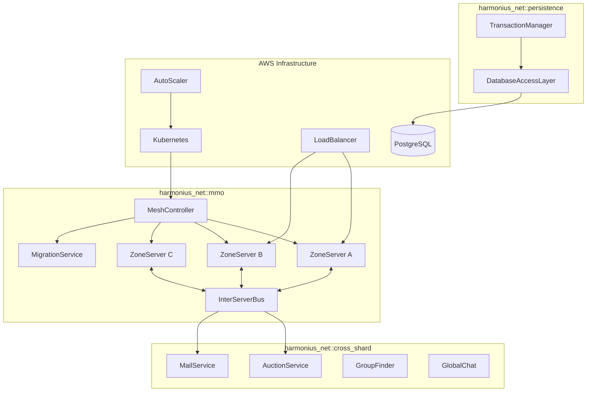
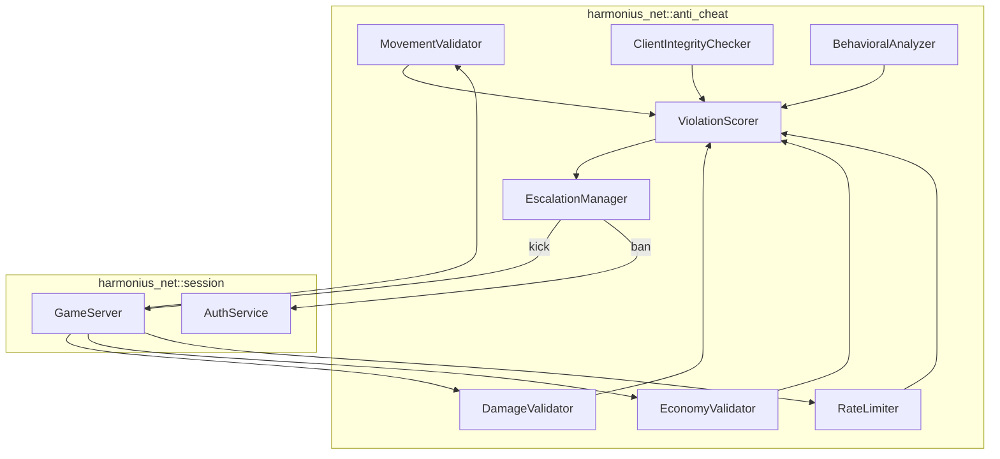
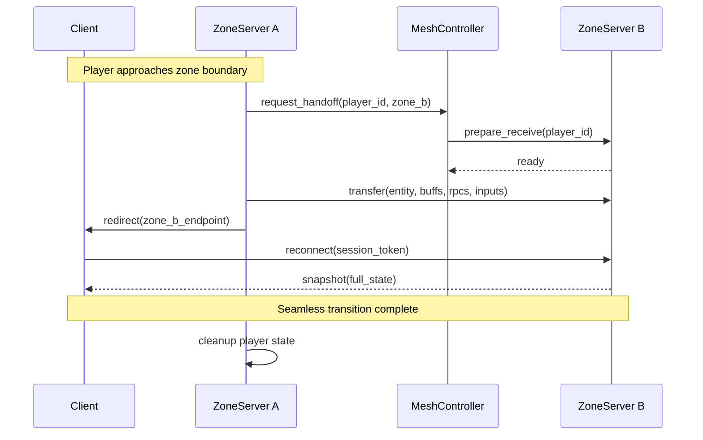
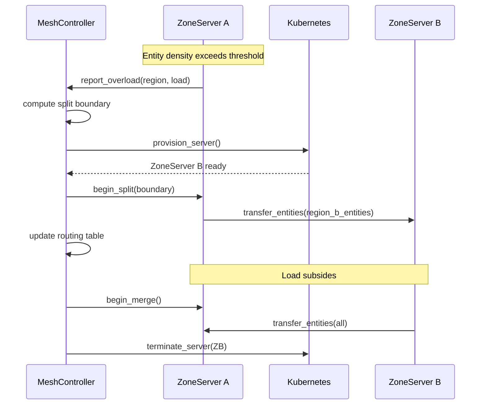
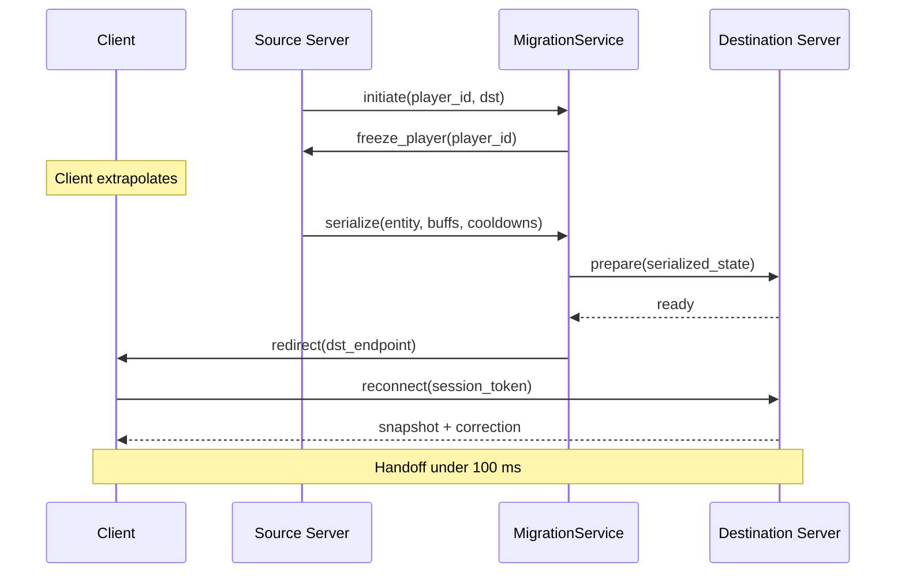
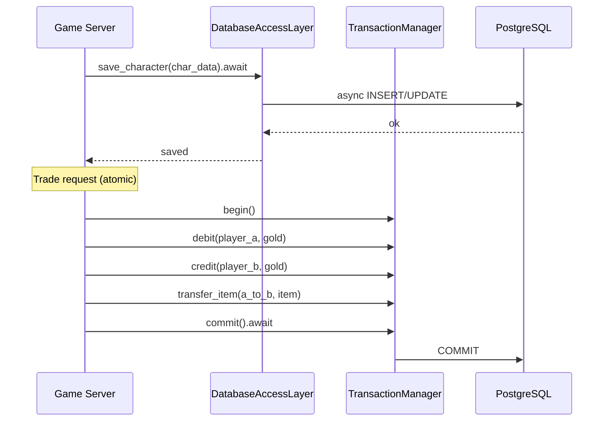
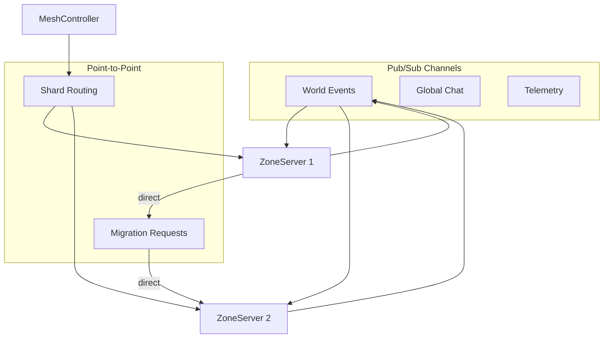
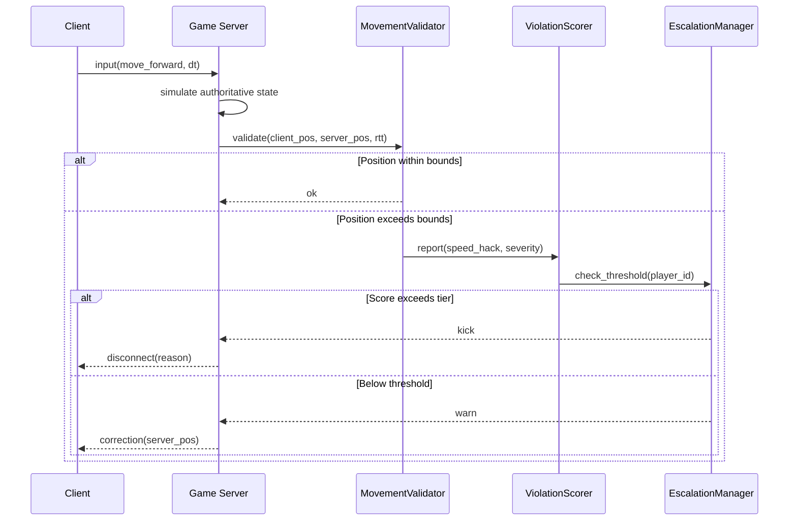
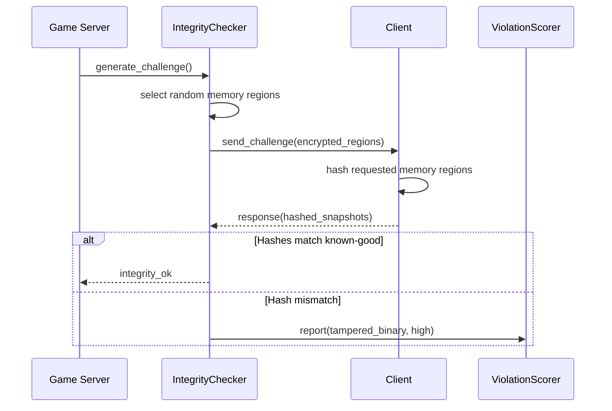
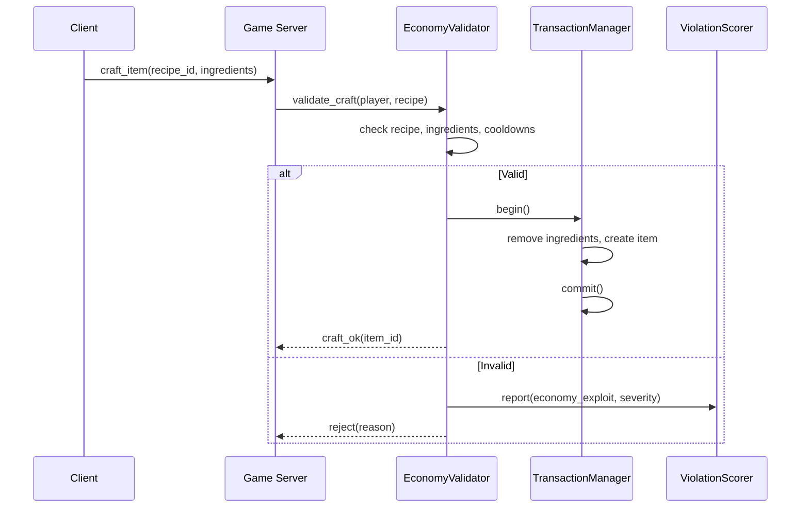

# Network Infrastructure Design

## Requirements Trace

> **Canonical sources:** Features, requirements, and user stories are defined in
> [features/](../../features/), [requirements/](../../requirements/), and
> [user-stories/](../../user-stories/). The table below traces design elements to those definitions.

### MMO Infrastructure

| Feature | Requirement |
|---------|-------------|
| F-8.7.1 | R-8.7.1     |
| F-8.7.2 | R-8.7.2     |
| F-8.7.3 | R-8.7.3     |
| F-8.7.4 | R-8.7.4     |
| F-8.7.5 | R-8.7.5     |
| F-8.7.6 | R-8.7.6     |
| F-8.7.7 | R-8.7.7     |
| F-8.7.8 | R-8.7.8     |

1. **F-8.7.1** -- World sharding and instancing
2. **F-8.7.2** -- Seamless zone transitions
3. **F-8.7.3** -- Dynamic server mesh
4. **F-8.7.4** -- Player migration between servers (< 100 ms)
5. **F-8.7.5** -- Persistent world state and database
6. **F-8.7.6** -- Load balancing and auto-scaling
7. **F-8.7.7** -- Cross-shard services (auction, mail, chat)
8. **F-8.7.8** -- Inter-server communication bus

### Anti-Cheat and Security

| Feature | Requirement |
|---------|-------------|
| F-8.8.1 | R-8.8.1     |
| F-8.8.2 | R-8.8.2     |
| F-8.8.3 | R-8.8.3     |
| F-8.8.4 | R-8.8.4     |
| F-8.8.5 | R-8.8.5     |

1. **F-8.8.1** -- Server-side cheat detection (movement, damage, cooldowns)
2. **F-8.8.2** -- Client integrity verification (memory hashing)
3. **F-8.8.3** -- Behavioral analysis and anomaly detection (Z-score)
4. **F-8.8.4** -- Economy exploit prevention (double-spend, gold farming)
5. **F-8.8.5** -- Rate limiting and abuse prevention (per-RPC budgets)

## Overview

This design covers the server-side architecture for persistent, massively multiplayer worlds and the
layered anti-cheat security system that protects them.

### MMO Infrastructure

The MMO subsystem partitions the game world into shards and zones, runs a dynamic server mesh that
scales spatially based on entity density, migrates players seamlessly between zone servers, persists
world state through an async database layer, and provides cross-shard services for economy and
social features.

All components are ECS-primary (~90%)-based. Zone servers run the full ECS simulation in headless
mode. The server mesh controller, cross-shard services, and inter-server bus run as independent
microservices on self-hosted AWS infrastructure (Kubernetes). All I/O is async.

### Anti-Cheat

The primary defense is server-side validation: the server independently simulates all game logic and
compares client state against computed bounds. Secondary defenses include client integrity
verification, statistical behavioral analysis, economy validation, and rate limiting.

All anti-cheat logic runs as ECS systems on the server. Violation scoring, escalation, and rate
limiting are components attached to player entities. Detection thresholds account for RTT and
platform-specific input characteristics. Configurable severity tiers (warn, flag, kick, ban) with
hot-reloadable config.

## Architecture

### MMO Module Boundaries



### Anti-Cheat Validation Pipeline



### File Layout

```text
harmonius_net/
+-- mmo/
|   +-- shard.rs         # ShardManager, ShardId
|   +-- zone.rs          # ZoneServer, ZoneId
|   +-- mesh.rs          # MeshController, spatial split
|   +-- migration.rs     # MigrationService, player handoff
|   +-- instance.rs      # InstanceManager, dungeons
|   +-- overlap.rs       # BoundaryOverlap, co-sim
|   +-- scaler.rs        # AutoScaler, load monitoring
+-- persistence/
|   +-- dal.rs           # DatabaseAccessLayer, async query
|   +-- transaction.rs   # TransactionManager, atomics
|   +-- schema.rs        # Table definitions, migrations
|   +-- pool.rs          # ConnectionPool, async pooling
+-- cross_shard/
|   +-- auction.rs       # AuctionService, bid/buyout
|   +-- mail.rs          # MailService, attachments
|   +-- group_finder.rs  # GroupFinder, cross-shard match
|   +-- chat.rs          # GlobalChat, channels
|   +-- guild.rs         # GuildService, roster
+-- bus/
|   +-- transport.rs     # TCP connections, auto-reconnect
|   +-- channel.rs       # PubSub + point-to-point routing
|   +-- delivery.rs      # Delivery guarantees
|   +-- codec.rs         # Typed message serialization
+-- anti_cheat/
    +-- movement.rs      # MovementValidator, speed/teleport
    +-- damage.rs        # DamageValidator, bounds checking
    +-- economy.rs       # EconomyValidator, transaction
    +-- integrity.rs     # ClientIntegrityChecker, hash
    +-- behavioral.rs    # BehavioralAnalyzer, Z-score
    +-- rate_limit.rs    # RateLimiter, token buckets
    +-- scorer.rs        # ViolationScorer, accumulation
    +-- escalation.rs    # EscalationManager, tiers
    +-- config.rs        # Hot-reloadable thresholds
```

### Zone Transition Flow



### Dynamic Mesh Split/Merge



### Player Migration Handoff



### Persistence Layer



### Inter-Server Bus Topology



### Server-Side Validation Flow



### Client Integrity Challenge



### Economy Validation Flow



### Core Data Structures


## API Design

### Shard and Zone Types

```rust
#[derive(
    Clone, Copy, Debug, PartialEq, Eq,
    Hash, Reflect,
)]
pub struct ShardId(pub u32);

#[derive(
    Clone, Copy, Debug, PartialEq, Eq,
    Hash, Reflect,
)]
pub struct ZoneId {
    pub shard: ShardId,
    pub zone: u32,
}

#[derive(
    Clone, Copy, Debug, PartialEq, Eq,
    Hash, Reflect,
)]
pub struct ServerId(pub u64);

#[derive(Clone, Debug, Reflect)]
pub enum ShardAssignment {
    LeastPopulated,
    Specific(ShardId),
    SameAs(AccountId),
}

#[derive(
    Clone, Copy, Debug, PartialEq, Eq, Reflect,
)]
pub enum ShardState {
    Active,
    Draining,
    Maintenance,
    Merging,
}

#[derive(
    Clone, Copy, Debug, PartialEq, Eq, Reflect,
)]
pub enum InstanceDifficulty {
    Normal,
    Heroic,
    Mythic,
}

#[derive(
    Clone, Copy, Debug, PartialEq, Eq,
    Hash, Reflect,
)]
pub struct InstanceId(pub u64);
```

### Spatial Region and Mesh

```rust
/// Axis-aligned spatial region owned by a server.
pub struct SpatialRegion {
    pub region_id: u32,
    pub min: Vec3,
    pub max: Vec3,
    pub owner: ServerId,
    pub entity_count: u32,
    pub cpu_load: f32,
}

impl SpatialRegion {
    pub fn contains(&self, pos: Vec3) -> bool;
    pub fn split(
        &self,
    ) -> (SpatialRegion, SpatialRegion);
    pub fn area(&self) -> f32;
    pub fn in_overlap(
        &self,
        pos: Vec3,
        overlap_width: f32,
    ) -> bool;
}

pub struct MeshConfig {
    pub split_threshold: f32,
    pub merge_threshold: f32,
    pub overlap_width: f32,
    pub eval_interval_seconds: u32,
}
```

### Migration Types

```rust
pub struct MigrationPayload {
    pub account_id: AccountId,
    pub session_id: SessionId,
    pub entity_snapshot: Vec<u8>,
    pub active_buffs: Vec<BuffState>,
    pub cooldown_timers: Vec<CooldownState>,
    pub pending_rpcs: Vec<u8>,
    pub prediction_history: Vec<InputFrame>,
    pub initiated_at: u64,
}

pub struct BuffState {
    pub buff_id: u32,
    pub remaining_ticks: u32,
    pub stacks: u8,
    pub source_entity: Option<Entity>,
}

pub struct CooldownState {
    pub ability_id: u32,
    pub remaining_ticks: u32,
}

pub enum MigrationError {
    DestinationUnavailable,
    SerializationFailed,
    Timeout,
    StateMismatch,
}
```

### Database Types

```rust
pub struct PoolConfig {
    pub connection_string: String,
    pub min_connections: u32,
    pub max_connections: u32,
    pub idle_timeout_seconds: u32,
}

pub struct PoolStats {
    pub active_connections: u32,
    pub idle_connections: u32,
    pub pending_queries: u32,
    pub total_queries: u64,
}

pub enum DbError {
    ConnectionFailed,
    QueryFailed { message: String },
    TransactionConflict,
    PoolExhausted,
    Timeout,
}
```

### Inter-Server Bus Types

```rust
#[derive(
    Clone, Copy, Debug, PartialEq, Eq, Reflect,
)]
pub enum DeliveryGuarantee {
    AtMostOnce,
    AtLeastOnce,
    ExactlyOnce,
}

#[derive(Clone, Debug, Reflect)]
pub struct BusChannel {
    pub name: String,
    pub guarantee: DeliveryGuarantee,
}

pub struct BusMessage {
    pub channel: String,
    pub source: ServerId,
    pub target: Option<ServerId>,
    pub sequence: u64,
    pub payload: Vec<u8>,
}

pub enum BusError {
    ConnectionFailed,
    PeerNotFound,
    ChannelNotFound,
    SerializationFailed,
    Timeout,
}
```

### Auto-Scaling Types

```rust
pub struct ScalerConfig {
    pub scale_up_cpu: f32,
    pub scale_down_cpu: f32,
    pub scale_up_players: u32,
    pub min_servers: u32,
    pub max_servers: u32,
    pub cooldown_seconds: u32,
}

pub struct ServerMetrics {
    pub server_id: ServerId,
    pub cpu_percent: f32,
    pub memory_mb: u32,
    pub player_count: u32,
    pub network_mbps: f32,
    pub tick_time_ms: f32,
}

#[derive(Clone, Debug, Reflect)]
pub enum ScaleAction {
    Provision { count: u32 },
    Drain { server_id: ServerId },
    None,
}

pub enum ScaleError {
    AtMaxCapacity,
    AtMinCapacity,
    ProvisionTimeout,
    DrainTimeout,
}
```

### Anti-Cheat Types

```rust
#[derive(
    Clone, Copy, Debug, PartialEq, Eq,
    Hash, Reflect,
)]
pub enum ViolationType {
    SpeedHack,
    Teleport,
    DamageManipulation,
    CooldownCircumvention,
    InventoryExploit,
    EconomyExploit,
    DoubleSpend,
    GoldFarming,
    TamperedBinary,
    BehavioralAnomaly,
    RateLimitExceeded,
}

#[derive(
    Clone, Copy, Debug, PartialEq, Eq,
    PartialOrd, Ord, Reflect,
)]
pub enum EscalationAction {
    Warn,
    Flag,
    Kick,
    TempBan { hours: u32 },
    PermaBan,
}

pub struct ViolationRecord {
    pub violation_type: ViolationType,
    pub severity: f32,
    pub timestamp: u64,
    pub details: String,
}

pub struct PlayerScore {
    pub total_score: f32,
    pub violations: Vec<ViolationRecord>,
    pub last_decay: u64,
}

pub struct MovementConfig {
    pub max_speed: f32,
    pub max_delta_per_tick: f32,
    pub rtt_tolerance: f32,
    pub mobile_tolerance_multiplier: f32,
}

pub struct DamageConfig {
    pub tolerance_multiplier: f32,
    pub min_damage_interval: u32,
}

pub struct EconomyConfig {
    pub max_transfer: u64,
    pub rate_limit_per_hour: u32,
    pub high_value_threshold: u64,
    pub high_value_delay: u32,
}

pub struct IntegrityConfig {
    pub challenge_interval_seconds: u32,
    pub regions_per_challenge: u32,
    pub response_timeout_seconds: u32,
}

pub struct BehavioralConfig {
    pub z_score_threshold: f64,
    pub min_samples: u32,
    pub eval_interval: u32,
}

/// Running statistics (Welford's algorithm).
pub struct RunningStats {
    pub mean: f64,
    pub variance: f64,
    pub count: u64,
}

impl RunningStats {
    pub fn push(&mut self, value: f64);
    pub fn z_score(&self, value: f64) -> f64;
    pub fn std_dev(&self) -> f64;
}

#[derive(
    Clone, Copy, Debug, PartialEq, Eq,
    Hash, Reflect,
)]
pub enum InputType {
    Touch,
    Controller,
    KeyboardMouse,
}

pub struct BehavioralBaseline {
    pub account_id: AccountId,
    pub input_type: InputType,
    pub aim_accuracy: RunningStats,
    pub reaction_time: RunningStats,
    pub movement_entropy: RunningStats,
    pub resource_acquisition_rate: RunningStats,
    pub sample_count: u32,
}

pub struct TokenBucket {
    pub tokens: f32,
    pub max_tokens: f32,
    pub refill_rate: f32,
    pub burst_allowance: u32,
    pub burst_count: u32,
}

impl TokenBucket {
    pub fn consume(&mut self) -> bool;
    pub fn refill(&mut self, dt: f32);
    pub fn burst_exceeded(&self) -> bool;
}

pub struct RateLimitRule {
    pub rpc_type: u32,
    pub calls_per_second: f32,
    pub burst_allowance: u32,
    pub cooldown_seconds: f32,
}

#[derive(
    Clone, Copy, Debug, PartialEq, Eq, Reflect,
)]
pub enum RateLimitResult {
    Allow,
    Throttle { delay_ms: u32 },
    Reject,
}

pub struct TransactionRecord {
    pub timestamp: u64,
    pub transaction_type: TransactionType,
    pub amount: u64,
    pub counterparty: Option<AccountId>,
}

#[derive(
    Clone, Copy, Debug, PartialEq, Eq, Reflect,
)]
pub enum TransactionType {
    Trade,
    AuctionSale,
    CraftingResult,
    LootDrop,
    QuestReward,
    MailAttachment,
}

/// Top-level hot-reloadable anti-cheat config.
pub struct AntiCheatConfig {
    pub movement: MovementConfig,
    pub damage: DamageConfig,
    pub economy: EconomyConfig,
    pub integrity: IntegrityConfig,
    pub behavioral: BehavioralConfig,
    pub rate_limit: RateLimitConfig,
    pub scorer: ScorerConfig,
    pub escalation: EscalationConfig,
}

pub struct MatchMetrics {
    pub aim_accuracy: f64,
    pub reaction_time_ms: f64,
    pub movement_entropy: f64,
    pub resource_acquired: f64,
    pub kills: u32,
    pub deaths: u32,
    pub damage_dealt: f64,
}

pub struct WeaponStats {
    pub base_damage: f32,
    pub damage_range: (f32, f32),
    pub attack_speed: f32,
    pub crit_multiplier: f32,
}
```

### Error Types

```rust
pub enum ShardError {
    NotFound, AtCapacity, MergeConflict, AlreadyAssigned,
}

pub enum MeshError {
    RegionNotFound, SplitFailed, MergeFailed,
    NoServerAvailable,
}

pub enum InstanceError {
    TemplateNotFound, LockedOut, NoCapacity,
    AlreadyInInstance,
}

pub enum OverlapError {
    BoundaryNotRegistered, SyncFailed,
    DeserializationFailed,
}

pub enum LoadBalancerError {
    NoEligibleServer, ZoneNotFound,
}

pub enum AuctionError {
    ListingNotFound, Outbid, AlreadySold,
    InsufficientFunds, TransactionConflict,
}

pub enum MailError {
    RecipientNotFound, InboxFull, AttachmentInvalid,
}

pub enum AntiCheatError {
    ConfigLoadFailed { path: String },
    ConfigInvalid { field: String },
    PlayerNotFound,
    ValidationFailed { violation: ViolationType, severity: f32 },
}

pub enum EscalationError {
    PlayerNotFound, AlreadyBanned, ActionFailed,
}
```

## Data Flow

### World Topology

The game world is organized in three layers:

1. **Shards.** Full world copies for population management.
2. **Zones.** Spatial subdivisions within a shard. Dynamic split/merge based on entity density.
3. **Instances.** Isolated zone copies for dungeons, raids, and battlegrounds.

### Seamless Zone Transition Pipeline

1. Player approaches zone boundary; source server detects overlap.
2. Source requests handoff from mesh controller.
3. Destination server acknowledges readiness.
4. Source serializes full player state into MigrationPayload.
5. Payload transferred via inter-server bus (at-least-once).
6. Client receives redirect; extrapolates during handoff.
7. Client reconnects; server applies state and sends snapshot.

### Boundary Overlap Co-Simulation

Entities within overlap width are co-simulated by both adjacent servers. Authoritative server
replicates overlap entities to neighbor at configured sync interval. Neighbor renders as ghosts.

### Persistence Pipeline

- **Character saves:** periodic (30 s) + event-triggered.
- **Transactions:** atomic via TransactionHandle.
- **Write throughput:** 10,000+ TPS via pooling and batching.

### Inter-Server Bus Delivery

| Channel | Guarantee | Use Case |
|---------|-----------|----------|
| `telemetry` | At-most-once | Metrics |
| `global_chat` | At-most-once | Chat |
| `world_events` | At-least-once | Boss spawns |
| `migration` | At-least-once | Player handoff |
| `economy` | Exactly-once | Auction bids |

### Anti-Cheat Validation Pipeline

Every client input passes through validation before the server commits it:

1. **Rate limit.** Token bucket per-RPC. Throttle or reject.
2. **Movement.** Compare client pos against server pos with RTT-tolerant bounds.
3. **Damage.** Compare reported damage against weapon stats.
4. **Economy.** Check ownership, recipes, double-spend via transaction sequencing.
5. **Score.** Failed validations accumulate per-player score with time decay.
6. **Escalate.** Score checked against tier thresholds.

### Latency-Aware Thresholds

```text
max_distance = max_speed * dt * (1.0 + rtt_tolerance * rtt)
```

Mobile clients receive additional multiplier for cellular jitter.

### Score Decay

```text
score = score - decay_rate * dt
```

Occasional false detections do not accumulate to thresholds.

### Behavioral Analysis Data Flow

1. Each match records metrics into telemetry.
2. BehavioralAnalyzer computes baselines via Welford's.
3. Z-scores compared against threshold (e.g., 3.0 sigma).
4. Baselines segmented by InputType.
5. Gradual improvement shifts baseline; only sudden jumps flag.

## Platform Considerations

### Server Deployment

| Component | Deployment |
|-----------|------------|
| ZoneServer | AWS ECS / Kubernetes pod |
| MeshController | AWS ECS Fargate |
| AutoScaler | AWS Lambda + CloudWatch |
| LoadBalancer | AWS NLB |
| InterServerBus | In-process (per server) |
| Cross-shard services | AWS ECS Fargate |
| PostgreSQL | AWS RDS (Multi-AZ) |
| DynamoDB | Session directory |

### Database I/O per Platform

| Platform | Async Backend |
|----------|---------------|
| Windows | Tokio (IOCP) |
| macOS | Tokio (kqueue) |
| Linux | Tokio (epoll) |

### Anti-Cheat Deployment

| Component | Deployment |
|-----------|------------|
| MovementValidator | In-process (game server) |
| DamageValidator | In-process (game server) |
| EconomyValidator | In-process (game server) |
| IntegrityChecker | In-process (periodic) |
| BehavioralAnalyzer | Separate analytics service |
| RateLimiter | In-process (per-RPC) |
| ViolationScorer | In-process (component) |
| EscalationManager | In-process + auth service |

### Platform-Specific Adaptations

| Platform | Adaptation | Reason |
|----------|------------|--------|
| Mobile | Wider movement thresholds | Cellular jitter |
| Mobile | Lower RPC rate limits | Fewer inputs/sec |
| Mobile | Separate baselines | Touch != mouse |
| Console | Platform integrity APIs | Cert requirement |
| PC | More frequent integrity | Higher tamper risk |

### Scaling Tiers

| Tier | Shards | Zones/Shard | Players/Shard |
|------|--------|-------------|---------------|
| Launch | 4 | 20 | 500 |
| Growth | 8 | 30 | 500 |
| Peak | 16 | 40 | 500 |

### Mobile Adaptations

| Feature | Desktop | Mobile |
|---------|---------|--------|
| Migration extrapolation | 100 ms | 200 ms |
| Overlap sync interval | 2 ticks | 4 ticks |
| Entity budget per zone | 2,000 | 500 |

## Test Plan

Test cases are in the companion file
[network-infrastructure-test-cases.md](network-infrastructure-test-cases.md).

### Summary

| Category | Count | Coverage |
|----------|-------|----------|
| Unit tests | 45 | Shards, mesh, migration, bus, anti-cheat |
| Integration tests | 26 | Zone transitions, scaling, live detection |
| Benchmarks | 17 | Migration, DB throughput, validation perf |

## Open Questions

1. **Database choice.** PostgreSQL for transactions vs DynamoDB for key-value. Hybrid approach?
2. **Mesh split granularity.** Longest-axis only vs Voronoi partitions for better load balance?
3. **Cross-shard consistency.** Single-leader vs distributed consensus vs optimistic concurrency?
4. **Overlap entity authority.** Source server until handoff vs nearest-center?
5. **Container orchestration.** Kubernetes primary; also support bare-metal for self-hosted studios?
6. **Mobile entity budget.** 500 may be low for cities. Prioritize players over NPCs, or separate
   LOD?
7. **Replay-based verification.** Automated pipeline for every flagged player, or manual review
   tool?
8. **ML for behavioral analysis.** Z-score baseline first; ML layered after production data
   available?
9. **Client integrity on PC.** Invest more in server-side validation depth vs client checks?
10. **Ban appeal automation.** Auto-provide violation history and replay evidence, or human-only?
11. **Cross-session scoring.** Database-backed persistence vs per-session reset?
12. **Rate limit profiles.** Per-game-mode or global?
