# Network Infrastructure Design

## Requirements Trace

> **Canonical sources:** Features, requirements, and user stories are defined in
> [features/](../../features/), [requirements/](../../requirements/), and
> [user-stories/](../../user-stories/). The table below traces design elements to those definitions.

### MMO Infrastructure

| Feature | Requirement |
|---------|-------------|
| F-8.7.1 | R-8.7.1     |
| F-8.7.2 | R-8.7.2     |
| F-8.7.3 | R-8.7.3     |
| F-8.7.4 | R-8.7.4     |
| F-8.7.5 | R-8.7.5     |
| F-8.7.6 | R-8.7.6     |
| F-8.7.7 | R-8.7.7     |
| F-8.7.8 | R-8.7.8     |

1. **F-8.7.1** -- World sharding and instancing
2. **F-8.7.2** -- Seamless zone transitions
3. **F-8.7.3** -- Dynamic server mesh
4. **F-8.7.4** -- Player migration between servers (< 100 ms)
5. **F-8.7.5** -- Persistent world state and database
6. **F-8.7.6** -- Load balancing and auto-scaling
7. **F-8.7.7** -- Cross-shard services (auction, mail, chat)
8. **F-8.7.8** -- Inter-server communication bus

### Anti-Cheat and Security

| Feature | Requirement |
|---------|-------------|
| F-8.8.1 | R-8.8.1     |
| F-8.8.2 | R-8.8.2     |
| F-8.8.3 | R-8.8.3     |
| F-8.8.4 | R-8.8.4     |
| F-8.8.5 | R-8.8.5     |

1. **F-8.8.1** -- Server-side cheat detection (movement, damage, cooldowns)
2. **F-8.8.2** -- Client integrity verification (memory hashing)
3. **F-8.8.3** -- Behavioral analysis and anomaly detection (Z-score)
4. **F-8.8.4** -- Economy exploit prevention (double-spend, gold farming)
5. **F-8.8.5** -- Rate limiting and abuse prevention (per-RPC budgets)

## Overview

This design covers the server-side architecture for persistent, massively multiplayer worlds and the
layered anti-cheat security system that protects them.

### MMO Infrastructure

The MMO subsystem partitions the game world into shards and zones, runs a dynamic server mesh that
scales spatially based on entity density, migrates players seamlessly between zone servers, persists
world state through an async database layer, and provides cross-shard services for economy and
social features.

All components are ECS-primary (~90%)-based. Zone servers run the full ECS simulation in headless
mode. The server mesh controller, cross-shard services, and inter-server bus run as independent
microservices on self-hosted AWS infrastructure (Kubernetes). All I/O is async.

### Anti-Cheat

The primary defense is server-side validation: the server independently simulates all game logic and
compares client state against computed bounds. Secondary defenses include client integrity
verification, statistical behavioral analysis, economy validation, and rate limiting.

All anti-cheat logic runs as ECS systems on the server. Violation scoring, escalation, and rate
limiting are components attached to player entities. Detection thresholds account for RTT and
platform-specific input characteristics. Configurable severity tiers (warn, flag, kick, ban) with
hot-reloadable config.

## Architecture

### MMO Module Boundaries

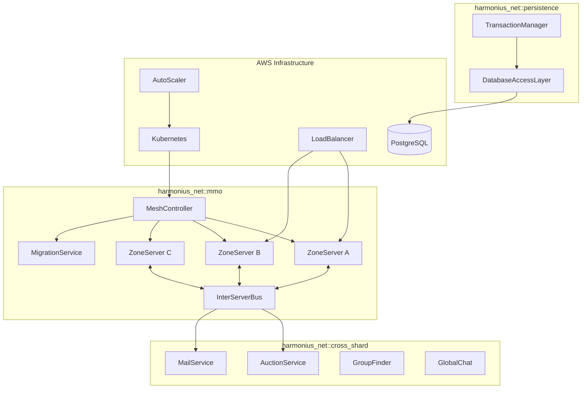

### Anti-Cheat Validation Pipeline

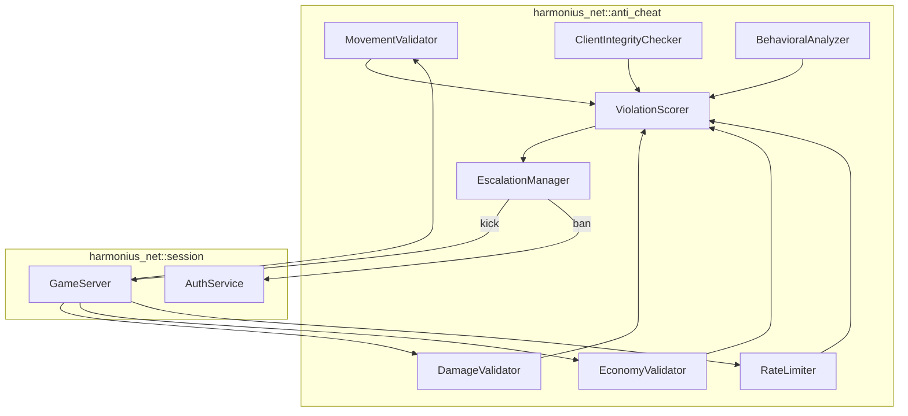

### File Layout

```text
harmonius_net/
+-- mmo/
|   +-- shard.rs         # ShardManager, ShardId
|   +-- zone.rs          # ZoneServer, ZoneId
|   +-- mesh.rs          # MeshController, spatial split
|   +-- migration.rs     # MigrationService, player handoff
|   +-- instance.rs      # InstanceManager, dungeons
|   +-- overlap.rs       # BoundaryOverlap, co-sim
|   +-- scaler.rs        # AutoScaler, load monitoring
+-- persistence/
|   +-- dal.rs           # DatabaseAccessLayer, async query
|   +-- transaction.rs   # TransactionManager, atomics
|   +-- schema.rs        # Table definitions, migrations
|   +-- pool.rs          # ConnectionPool, async pooling
+-- cross_shard/
|   +-- auction.rs       # AuctionService, bid/buyout
|   +-- mail.rs          # MailService, attachments
|   +-- group_finder.rs  # GroupFinder, cross-shard match
|   +-- chat.rs          # GlobalChat, channels
|   +-- guild.rs         # GuildService, roster
+-- bus/
|   +-- transport.rs     # TCP connections, auto-reconnect
|   +-- channel.rs       # PubSub + point-to-point routing
|   +-- delivery.rs      # Delivery guarantees
|   +-- codec.rs         # Typed message serialization
+-- anti_cheat/
    +-- movement.rs      # MovementValidator, speed/teleport
    +-- damage.rs        # DamageValidator, bounds checking
    +-- economy.rs       # EconomyValidator, transaction
    +-- integrity.rs     # ClientIntegrityChecker, hash
    +-- behavioral.rs    # BehavioralAnalyzer, Z-score
    +-- rate_limit.rs    # RateLimiter, token buckets
    +-- scorer.rs        # ViolationScorer, accumulation
    +-- escalation.rs    # EscalationManager, tiers
    +-- config.rs        # Hot-reloadable thresholds
```

### Zone Transition Flow

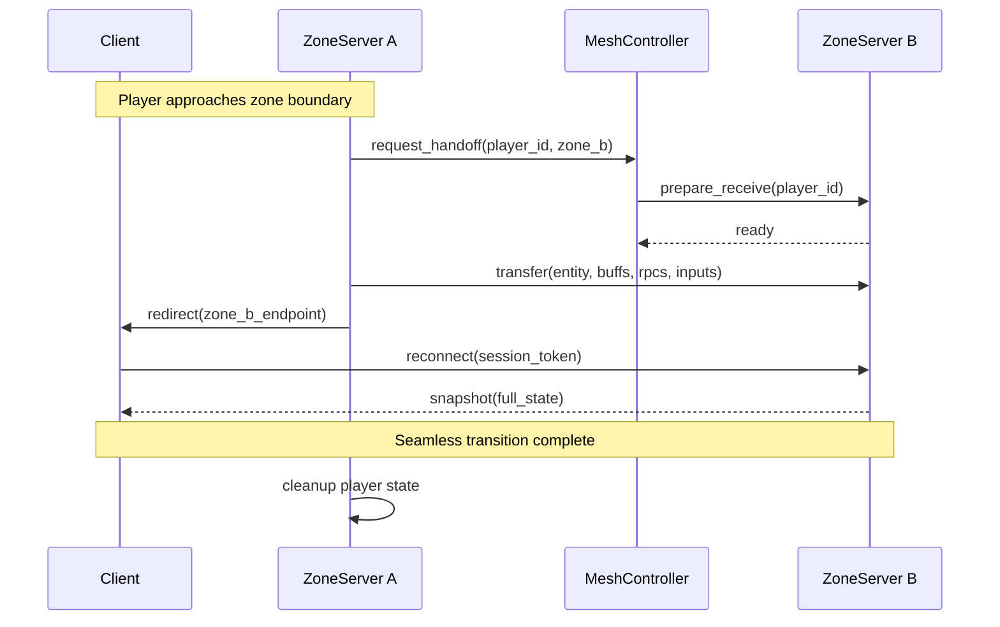

### Dynamic Mesh Split/Merge

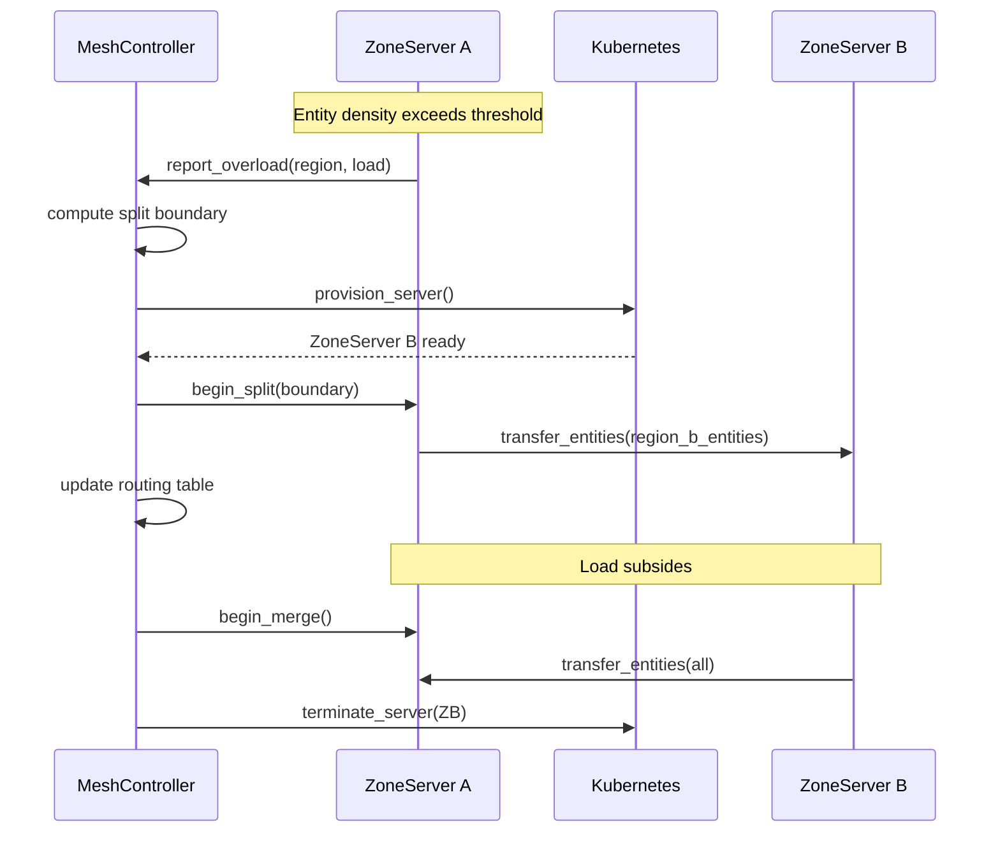

### Player Migration Handoff

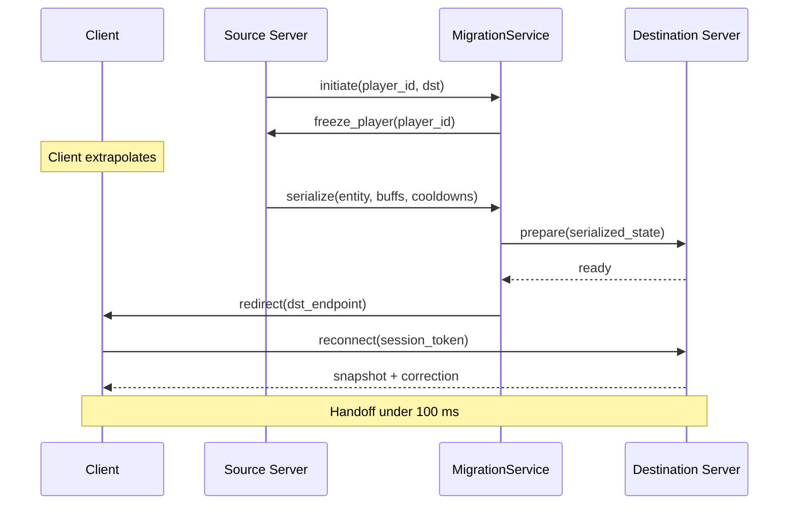

### Persistence Layer

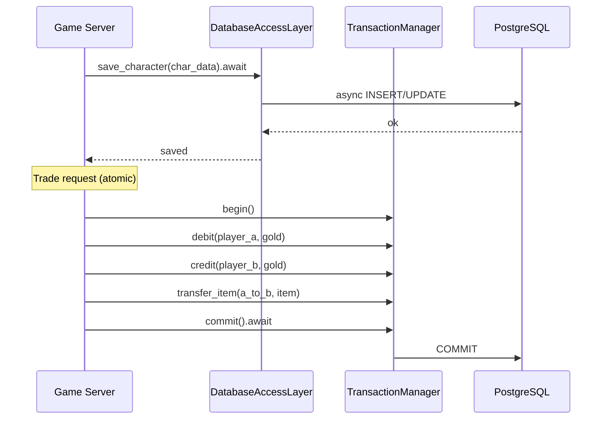

### Inter-Server Bus Topology

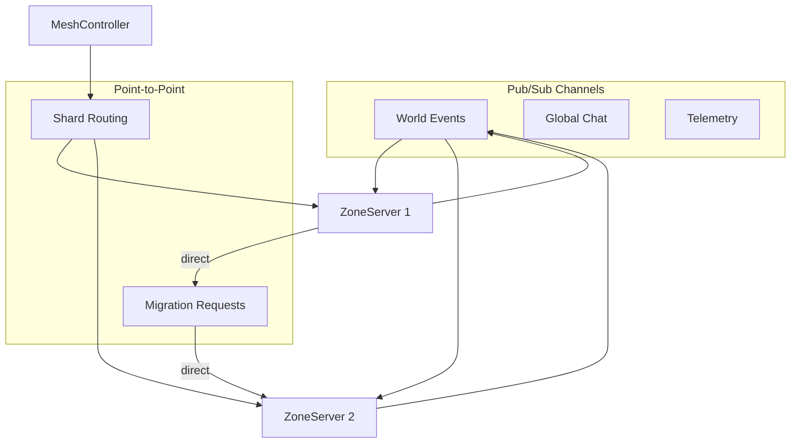

### Server-Side Validation Flow

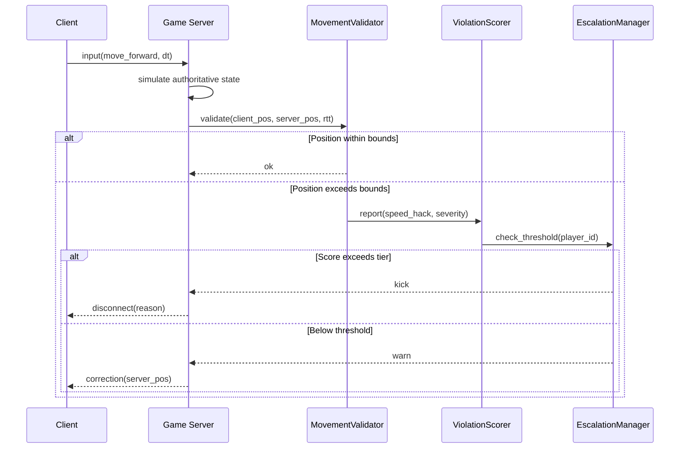

### Client Integrity Challenge

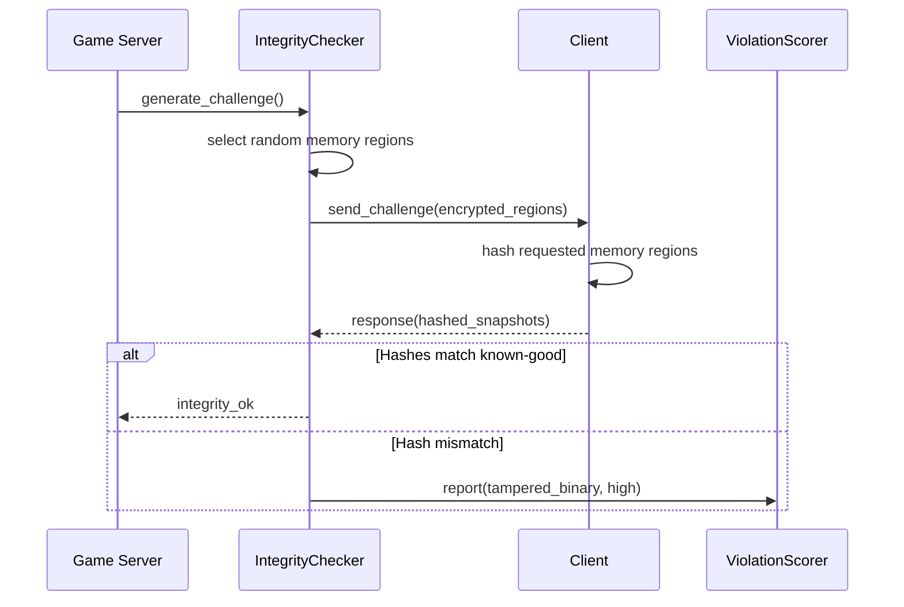

### Economy Validation Flow

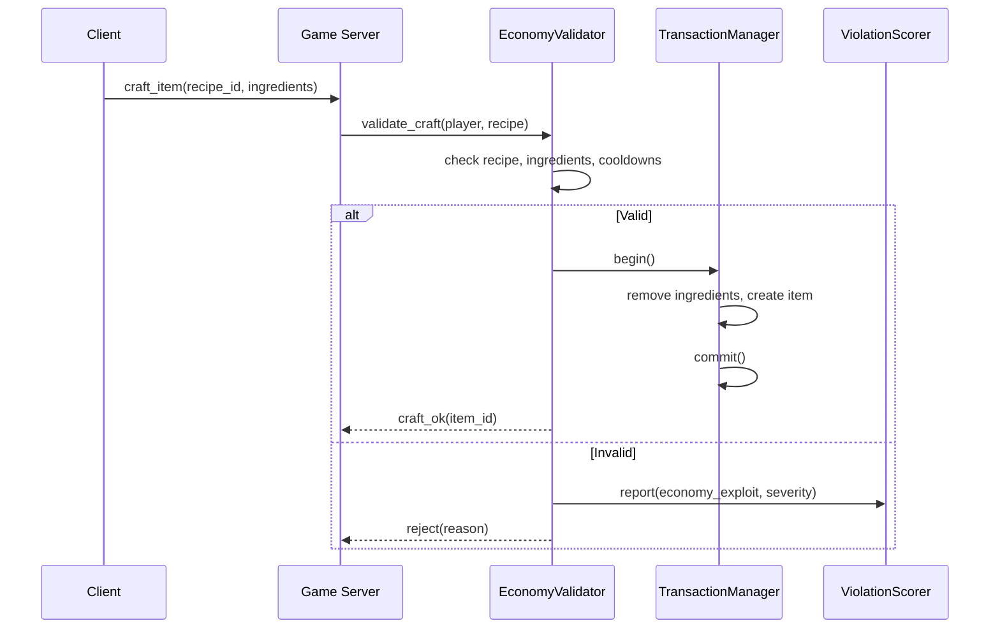

### Core Data Structures

```mermaid
classDiagram
    class ShardId {
        +id: u32
    }

    class ZoneId {
        +shard: ShardId
        +zone: u32
    }

    class ServerId {
        +u64 value
    }

    class SpatialRegion {
        +min: Vec3
        +max: Vec3
        +owner_server: ServerId
        +entity_count: u32
        +cpu_load: f32
        +contains(pos) bool
        +split(axis) SpatialRegion, SpatialRegion
    }

    class MeshController {
        -regions: Vec~SpatialRegion~
        -routing_table: HashMap~ZoneId, ServerId~
        -split_threshold: f32
        -merge_threshold: f32
        +evaluate_load()
        +split_region(region_id)
        +merge_regions(a, b)
        +route_player(pos) ServerId
    }

    class MigrationPayload {
        +player_id: AccountId
        +entity_snapshot: Vec~u8~
        +active_buffs: Vec~BuffState~
        +cooldown_timers: Vec~CooldownState~
        +pending_rpcs: Vec~u8~
        +prediction_history: Vec~InputFrame~
    }

    class DatabaseAccessLayer {
        -pool: ConnectionPool
        +query~T~(sql, params) Future~Vec~T~~
        +execute(sql, params) Future~u64~
        +transaction() TransactionHandle
    }

    class InterServerBus {
        -connections: HashMap~ServerId, TcpStream~
        +publish(channel, msg)
        +send(target, msg)
        +subscribe(channel, handler)
    }

    class ShardAssignment {
        <<enumeration>>
        LeastPopulated
        Specific
        SameAs
    }

    class ShardState {
        <<enumeration>>
        Active
        Draining
        Maintenance
        Merging
    }

    class InstanceDifficulty {
        <<enumeration>>
        Normal
        Heroic
        Mythic
    }

    class DeliveryGuarantee {
        <<enumeration>>
        AtMostOnce
        AtLeastOnce
        ExactlyOnce
    }

    class ViolationType {
        <<enumeration>>
        SpeedHack
        Teleport
        DamageManipulation
        CooldownCircumvention
        InventoryExploit
        EconomyExploit
        DoubleSpend
        GoldFarming
        TamperedBinary
        BehavioralAnomaly
        RateLimitExceeded
    }

    class EscalationAction {
        <<enumeration>>
        Warn
        Flag
        Kick
        TempBan
        PermaBan
    }

    class ViolationRecord {
        +violation_type: ViolationType
        +severity: f32
        +timestamp: u64
        +details: String
    }

    class ViolationScorer {
        -scores: HashMap~AccountId, PlayerScore~
        -decay_rate: f32
        +report(account, violation)
        +current_score(account) f32
        +decay_scores(dt)
    }

    class PlayerScore {
        +total_score: f32
        +violations: Vec~ViolationRecord~
        +last_decay: u64
    }

    class EscalationTier {
        +threshold: f32
        +action: EscalationAction
        +cooldown_seconds: u32
    }

    class RateLimitBucket {
        +rpc_type: u32
        +tokens: f32
        +max_tokens: f32
        +refill_rate: f32
        +burst_allowance: u32
        +consume() bool
        +refill(dt)
    }

    class BehavioralBaseline {
        +account_id: AccountId
        +input_type: InputType
        +aim_accuracy: RunningStats
        +reaction_time: RunningStats
        +movement_entropy: RunningStats
        +sample_count: u32
    }

    class RunningStats {
        +mean: f64
        +variance: f64
        +count: u64
        +push(value)
        +z_score(value) f64
    }

    class InputType {
        <<enumeration>>
        Touch
        Controller
        KeyboardMouse
    }

    class AutoScaler {
        -config: ScalerConfig
        +evaluate(metrics) Vec~ScaleAction~
        +provision() Future~ServerId~
        +drain_and_terminate(id) Future~Result~
    }

    class ServerMetrics {
        +server_id: ServerId
        +cpu_percent: f32
        +memory_mb: u32
        +player_count: u32
        +tick_time_ms: f32
    }

    class LoadBalancer {
        +select(zone_id) Result~ServerId~
        +report_metrics(metrics)
        +set_draining(server_id)
    }

    class AntiCheatConfig {
        +movement: MovementConfig
        +damage: DamageConfig
        +economy: EconomyConfig
        +integrity: IntegrityConfig
        +behavioral: BehavioralConfig
        +rate_limit: RateLimitConfig
        +scorer: ScorerConfig
        +escalation: EscalationConfig
    }

    MeshController *-- SpatialRegion
    MeshController --> MigrationPayload
    MeshController --> InterServerBus
    DatabaseAccessLayer --> ConnectionPool
    ViolationScorer *-- PlayerScore
    PlayerScore *-- ViolationRecord
    ViolationRecord --> ViolationType
    EscalationTier --> EscalationAction
    BehavioralBaseline *-- RunningStats
    BehavioralBaseline --> InputType
    AutoScaler --> ServerMetrics
    AntiCheatConfig --> MovementConfig
    AntiCheatConfig --> EscalationConfig
```

## API Design

### Shard and Zone Types

```rust
#[derive(
    Clone, Copy, Debug, PartialEq, Eq,
    Hash, Reflect,
)]
pub struct ShardId(pub u32);

#[derive(
    Clone, Copy, Debug, PartialEq, Eq,
    Hash, Reflect,
)]
pub struct ZoneId {
    pub shard: ShardId,
    pub zone: u32,
}

#[derive(
    Clone, Copy, Debug, PartialEq, Eq,
    Hash, Reflect,
)]
pub struct ServerId(pub u64);

#[derive(Clone, Debug, Reflect)]
pub enum ShardAssignment {
    LeastPopulated,
    Specific(ShardId),
    SameAs(AccountId),
}

#[derive(
    Clone, Copy, Debug, PartialEq, Eq, Reflect,
)]
pub enum ShardState {
    Active,
    Draining,
    Maintenance,
    Merging,
}

#[derive(
    Clone, Copy, Debug, PartialEq, Eq, Reflect,
)]
pub enum InstanceDifficulty {
    Normal,
    Heroic,
    Mythic,
}

#[derive(
    Clone, Copy, Debug, PartialEq, Eq,
    Hash, Reflect,
)]
pub struct InstanceId(pub u64);
```

### Spatial Region and Mesh

```rust
/// Axis-aligned spatial region owned by a server.
pub struct SpatialRegion {
    pub region_id: u32,
    pub min: Vec3,
    pub max: Vec3,
    pub owner: ServerId,
    pub entity_count: u32,
    pub cpu_load: f32,
}

impl SpatialRegion {
    pub fn contains(&self, pos: Vec3) -> bool;
    pub fn split(
        &self,
    ) -> (SpatialRegion, SpatialRegion);
    pub fn area(&self) -> f32;
    pub fn in_overlap(
        &self,
        pos: Vec3,
        overlap_width: f32,
    ) -> bool;
}

pub struct MeshConfig {
    pub split_threshold: f32,
    pub merge_threshold: f32,
    pub overlap_width: f32,
    pub eval_interval_seconds: u32,
}
```

### Migration Types

```rust
pub struct MigrationPayload {
    pub account_id: AccountId,
    pub session_id: SessionId,
    pub entity_snapshot: Vec<u8>,
    pub active_buffs: Vec<BuffState>,
    pub cooldown_timers: Vec<CooldownState>,
    pub pending_rpcs: Vec<u8>,
    pub prediction_history: Vec<InputFrame>,
    pub initiated_at: u64,
}

pub struct BuffState {
    pub buff_id: u32,
    pub remaining_ticks: u32,
    pub stacks: u8,
    pub source_entity: Option<Entity>,
}

pub struct CooldownState {
    pub ability_id: u32,
    pub remaining_ticks: u32,
}

pub enum MigrationError {
    DestinationUnavailable,
    SerializationFailed,
    Timeout,
    StateMismatch,
}
```

### Database Types

```rust
pub struct PoolConfig {
    pub connection_string: String,
    pub min_connections: u32,
    pub max_connections: u32,
    pub idle_timeout_seconds: u32,
}

pub struct PoolStats {
    pub active_connections: u32,
    pub idle_connections: u32,
    pub pending_queries: u32,
    pub total_queries: u64,
}

pub enum DbError {
    ConnectionFailed,
    QueryFailed { message: String },
    TransactionConflict,
    PoolExhausted,
    Timeout,
}
```

### Inter-Server Bus Types

```rust
#[derive(
    Clone, Copy, Debug, PartialEq, Eq, Reflect,
)]
pub enum DeliveryGuarantee {
    AtMostOnce,
    AtLeastOnce,
    ExactlyOnce,
}

#[derive(Clone, Debug, Reflect)]
pub struct BusChannel {
    pub name: String,
    pub guarantee: DeliveryGuarantee,
}

pub struct BusMessage {
    pub channel: String,
    pub source: ServerId,
    pub target: Option<ServerId>,
    pub sequence: u64,
    pub payload: Vec<u8>,
}

pub enum BusError {
    ConnectionFailed,
    PeerNotFound,
    ChannelNotFound,
    SerializationFailed,
    Timeout,
}
```

### Auto-Scaling Types

```rust
pub struct ScalerConfig {
    pub scale_up_cpu: f32,
    pub scale_down_cpu: f32,
    pub scale_up_players: u32,
    pub min_servers: u32,
    pub max_servers: u32,
    pub cooldown_seconds: u32,
}

pub struct ServerMetrics {
    pub server_id: ServerId,
    pub cpu_percent: f32,
    pub memory_mb: u32,
    pub player_count: u32,
    pub network_mbps: f32,
    pub tick_time_ms: f32,
}

#[derive(Clone, Debug, Reflect)]
pub enum ScaleAction {
    Provision { count: u32 },
    Drain { server_id: ServerId },
    None,
}

pub enum ScaleError {
    AtMaxCapacity,
    AtMinCapacity,
    ProvisionTimeout,
    DrainTimeout,
}
```

### Anti-Cheat Types

```rust
#[derive(
    Clone, Copy, Debug, PartialEq, Eq,
    Hash, Reflect,
)]
pub enum ViolationType {
    SpeedHack,
    Teleport,
    DamageManipulation,
    CooldownCircumvention,
    InventoryExploit,
    EconomyExploit,
    DoubleSpend,
    GoldFarming,
    TamperedBinary,
    BehavioralAnomaly,
    RateLimitExceeded,
}

#[derive(
    Clone, Copy, Debug, PartialEq, Eq,
    PartialOrd, Ord, Reflect,
)]
pub enum EscalationAction {
    Warn,
    Flag,
    Kick,
    TempBan { hours: u32 },
    PermaBan,
}

pub struct ViolationRecord {
    pub violation_type: ViolationType,
    pub severity: f32,
    pub timestamp: u64,
    pub details: String,
}

pub struct PlayerScore {
    pub total_score: f32,
    pub violations: Vec<ViolationRecord>,
    pub last_decay: u64,
}

pub struct MovementConfig {
    pub max_speed: f32,
    pub max_delta_per_tick: f32,
    pub rtt_tolerance: f32,
    pub mobile_tolerance_multiplier: f32,
}

pub struct DamageConfig {
    pub tolerance_multiplier: f32,
    pub min_damage_interval: u32,
}

pub struct EconomyConfig {
    pub max_transfer: u64,
    pub rate_limit_per_hour: u32,
    pub high_value_threshold: u64,
    pub high_value_delay: u32,
}

pub struct IntegrityConfig {
    pub challenge_interval_seconds: u32,
    pub regions_per_challenge: u32,
    pub response_timeout_seconds: u32,
}

pub struct BehavioralConfig {
    pub z_score_threshold: f64,
    pub min_samples: u32,
    pub eval_interval: u32,
}

/// Running statistics (Welford's algorithm).
pub struct RunningStats {
    pub mean: f64,
    pub variance: f64,
    pub count: u64,
}

impl RunningStats {
    pub fn push(&mut self, value: f64);
    pub fn z_score(&self, value: f64) -> f64;
    pub fn std_dev(&self) -> f64;
}

#[derive(
    Clone, Copy, Debug, PartialEq, Eq,
    Hash, Reflect,
)]
pub enum InputType {
    Touch,
    Controller,
    KeyboardMouse,
}

pub struct BehavioralBaseline {
    pub account_id: AccountId,
    pub input_type: InputType,
    pub aim_accuracy: RunningStats,
    pub reaction_time: RunningStats,
    pub movement_entropy: RunningStats,
    pub resource_acquisition_rate: RunningStats,
    pub sample_count: u32,
}

pub struct TokenBucket {
    pub tokens: f32,
    pub max_tokens: f32,
    pub refill_rate: f32,
    pub burst_allowance: u32,
    pub burst_count: u32,
}

impl TokenBucket {
    pub fn consume(&mut self) -> bool;
    pub fn refill(&mut self, dt: f32);
    pub fn burst_exceeded(&self) -> bool;
}

pub struct RateLimitRule {
    pub rpc_type: u32,
    pub calls_per_second: f32,
    pub burst_allowance: u32,
    pub cooldown_seconds: f32,
}

#[derive(
    Clone, Copy, Debug, PartialEq, Eq, Reflect,
)]
pub enum RateLimitResult {
    Allow,
    Throttle { delay_ms: u32 },
    Reject,
}

pub struct TransactionRecord {
    pub timestamp: u64,
    pub transaction_type: TransactionType,
    pub amount: u64,
    pub counterparty: Option<AccountId>,
}

#[derive(
    Clone, Copy, Debug, PartialEq, Eq, Reflect,
)]
pub enum TransactionType {
    Trade,
    AuctionSale,
    CraftingResult,
    LootDrop,
    QuestReward,
    MailAttachment,
}

/// Top-level hot-reloadable anti-cheat config.
pub struct AntiCheatConfig {
    pub movement: MovementConfig,
    pub damage: DamageConfig,
    pub economy: EconomyConfig,
    pub integrity: IntegrityConfig,
    pub behavioral: BehavioralConfig,
    pub rate_limit: RateLimitConfig,
    pub scorer: ScorerConfig,
    pub escalation: EscalationConfig,
}

pub struct MatchMetrics {
    pub aim_accuracy: f64,
    pub reaction_time_ms: f64,
    pub movement_entropy: f64,
    pub resource_acquired: f64,
    pub kills: u32,
    pub deaths: u32,
    pub damage_dealt: f64,
}

pub struct WeaponStats {
    pub base_damage: f32,
    pub damage_range: (f32, f32),
    pub attack_speed: f32,
    pub crit_multiplier: f32,
}
```

### Error Types

```rust
pub enum ShardError {
    NotFound, AtCapacity, MergeConflict, AlreadyAssigned,
}

pub enum MeshError {
    RegionNotFound, SplitFailed, MergeFailed,
    NoServerAvailable,
}

pub enum InstanceError {
    TemplateNotFound, LockedOut, NoCapacity,
    AlreadyInInstance,
}

pub enum OverlapError {
    BoundaryNotRegistered, SyncFailed,
    DeserializationFailed,
}

pub enum LoadBalancerError {
    NoEligibleServer, ZoneNotFound,
}

pub enum AuctionError {
    ListingNotFound, Outbid, AlreadySold,
    InsufficientFunds, TransactionConflict,
}

pub enum MailError {
    RecipientNotFound, InboxFull, AttachmentInvalid,
}

pub enum AntiCheatError {
    ConfigLoadFailed { path: String },
    ConfigInvalid { field: String },
    PlayerNotFound,
    ValidationFailed { violation: ViolationType, severity: f32 },
}

pub enum EscalationError {
    PlayerNotFound, AlreadyBanned, ActionFailed,
}
```

## Data Flow

### World Topology

The game world is organized in three layers:

1. **Shards.** Full world copies for population management.
2. **Zones.** Spatial subdivisions within a shard. Dynamic split/merge based on entity density.
3. **Instances.** Isolated zone copies for dungeons, raids, and battlegrounds.

### Seamless Zone Transition Pipeline

1. Player approaches zone boundary; source server detects overlap.
2. Source requests handoff from mesh controller.
3. Destination server acknowledges readiness.
4. Source serializes full player state into MigrationPayload.
5. Payload transferred via inter-server bus (at-least-once).
6. Client receives redirect; extrapolates during handoff.
7. Client reconnects; server applies state and sends snapshot.

### Boundary Overlap Co-Simulation

Entities within overlap width are co-simulated by both adjacent servers. Authoritative server
replicates overlap entities to neighbor at configured sync interval. Neighbor renders as ghosts.

### Persistence Pipeline

- **Character saves:** periodic (30 s) + event-triggered.
- **Transactions:** atomic via TransactionHandle.
- **Write throughput:** 10,000+ TPS via pooling and batching.

### Inter-Server Bus Delivery

| Channel | Guarantee | Use Case |
|---------|-----------|----------|
| `telemetry` | At-most-once | Metrics |
| `global_chat` | At-most-once | Chat |
| `world_events` | At-least-once | Boss spawns |
| `migration` | At-least-once | Player handoff |
| `economy` | Exactly-once | Auction bids |

### Anti-Cheat Validation Pipeline

Every client input passes through validation before the server commits it:

1. **Rate limit.** Token bucket per-RPC. Throttle or reject.
2. **Movement.** Compare client pos against server pos with RTT-tolerant bounds.
3. **Damage.** Compare reported damage against weapon stats.
4. **Economy.** Check ownership, recipes, double-spend via transaction sequencing.
5. **Score.** Failed validations accumulate per-player score with time decay.
6. **Escalate.** Score checked against tier thresholds.

### Latency-Aware Thresholds

```text
max_distance = max_speed * dt * (1.0 + rtt_tolerance * rtt)
```

Mobile clients receive additional multiplier for cellular jitter.

### Score Decay

```text
score = score - decay_rate * dt
```

Occasional false detections do not accumulate to thresholds.

### Behavioral Analysis Data Flow

1. Each match records metrics into telemetry.
2. BehavioralAnalyzer computes baselines via Welford's.
3. Z-scores compared against threshold (e.g., 3.0 sigma).
4. Baselines segmented by InputType.
5. Gradual improvement shifts baseline; only sudden jumps flag.

## Platform Considerations

### Server Deployment

| Component | Deployment |
|-----------|------------|
| ZoneServer | AWS ECS / Kubernetes pod |
| MeshController | AWS ECS Fargate |
| AutoScaler | AWS Lambda + CloudWatch |
| LoadBalancer | AWS NLB |
| InterServerBus | In-process (per server) |
| Cross-shard services | AWS ECS Fargate |
| PostgreSQL | AWS RDS (Multi-AZ) |
| DynamoDB | Session directory |

### Database I/O per Platform

| Platform | Async Backend |
|----------|---------------|
| Windows | Tokio (IOCP) |
| macOS | Tokio (kqueue) |
| Linux | Tokio (epoll) |

### Anti-Cheat Deployment

| Component | Deployment |
|-----------|------------|
| MovementValidator | In-process (game server) |
| DamageValidator | In-process (game server) |
| EconomyValidator | In-process (game server) |
| IntegrityChecker | In-process (periodic) |
| BehavioralAnalyzer | Separate analytics service |
| RateLimiter | In-process (per-RPC) |
| ViolationScorer | In-process (component) |
| EscalationManager | In-process + auth service |

### Platform-Specific Adaptations

| Platform | Adaptation | Reason |
|----------|------------|--------|
| Mobile | Wider movement thresholds | Cellular jitter |
| Mobile | Lower RPC rate limits | Fewer inputs/sec |
| Mobile | Separate baselines | Touch != mouse |
| Console | Platform integrity APIs | Cert requirement |
| PC | More frequent integrity | Higher tamper risk |

### Scaling Tiers

| Tier | Shards | Zones/Shard | Players/Shard |
|------|--------|-------------|---------------|
| Launch | 4 | 20 | 500 |
| Growth | 8 | 30 | 500 |
| Peak | 16 | 40 | 500 |

### Mobile Adaptations

| Feature | Desktop | Mobile |
|---------|---------|--------|
| Migration extrapolation | 100 ms | 200 ms |
| Overlap sync interval | 2 ticks | 4 ticks |
| Entity budget per zone | 2,000 | 500 |

## Test Plan

Test cases are in the companion file
[network-infrastructure-test-cases.md](network-infrastructure-test-cases.md).

### Summary

| Category | Count | Coverage |
|----------|-------|----------|
| Unit tests | 45 | Shards, mesh, migration, bus, anti-cheat |
| Integration tests | 26 | Zone transitions, scaling, live detection |
| Benchmarks | 17 | Migration, DB throughput, validation perf |

## Open Questions

1. **Database choice.** PostgreSQL for transactions vs DynamoDB for key-value. Hybrid approach?
2. **Mesh split granularity.** Longest-axis only vs Voronoi partitions for better load balance?
3. **Cross-shard consistency.** Single-leader vs distributed consensus vs optimistic concurrency?
4. **Overlap entity authority.** Source server until handoff vs nearest-center?
5. **Container orchestration.** Kubernetes primary; also support bare-metal for self-hosted studios?
6. **Mobile entity budget.** 500 may be low for cities. Prioritize players over NPCs, or separate
   LOD?
7. **Replay-based verification.** Automated pipeline for every flagged player, or manual review
   tool?
8. **ML for behavioral analysis.** Z-score baseline first; ML layered after production data
   available?
9. **Client integrity on PC.** Invest more in server-side validation depth vs client checks?
10. **Ban appeal automation.** Auto-provide violation history and replay evidence, or human-only?
11. **Cross-session scoring.** Database-backed persistence vs per-session reset?
12. **Rate limit profiles.** Per-game-mode or global?

## Review Feedback

### RF-1: Replace all Tokio/async with platform-native I/O

Replace all Future return types, .await calls, and Tokio references. Database I/O table should show
platform-native (io_uring/IOCP/GCD). All APIs synchronous with request/handle pattern via
crossbeam-channel.

### RF-2: Remove all Reflect derives

Codegen-generated metadata via middleman .dylib.

### RF-3: Inter-server bus → QUIC

Replace `TcpStream` with QUIC. Use quinn-proto on Linux, platform-native QUIC on Windows/Apple.
Aligns with transport design RF-12.

### RF-4: TiKV as sole database

Replace PostgreSQL, DynamoDB, Redis, and Valkey with **TiKV** (Rust, Apache-2.0, CP via Raft, K8s
operator):

```rust
pub struct GameDb {
    client: tikv_client::TransactionClient,
}

impl GameDb {
    pub fn get_player(
        &self, id: PlayerId,
    ) -> IoRequestId;
    pub fn update_rating(
        &self, id: PlayerId, rating: PlayerRating,
    ) -> IoRequestId;
    pub fn submit_score(
        &self, board: LeaderboardId,
        entry: LeaderboardEntry,
    ) -> IoRequestId;
    pub fn trade_items(
        &self, from: PlayerId, to: PlayerId,
        items: &[ItemId],
    ) -> IoRequestId;
    pub fn session_set(
        &self, token: &str, data: &[u8],
        ttl_secs: u32,
    ) -> IoRequestId;
    pub fn rate_limit_check(
        &self, key: &str, window_secs: u32,
        max: u32,
    ) -> IoRequestId;
}
```

TiKV handles ALL storage:

| Use Case | TiKV Pattern |
|----------|-------------|
| Player data | KV: player_id → rkyv bytes |
| Matchmaking ratings | KV: player_id:rating → Glicko-2 |
| Leaderboards | Ordered range scan on score key |
| Achievements | KV: player_id:achievement_id → progress |
| Sessions | KV with TTL (short-lived keys) |
| Rate limiting | Atomic increment with TTL |
| Item trades | Multi-key transaction |
| Cloud saves | KV: player_id:slot → rkyv bytes |

No PostgreSQL, no Valkey, no DynamoDB. One database. TiDB (Go, Apache-2.0) available as optional SQL
layer for analytics if the customer wants complex queries.

Resolves open question #1.

### RF-5: Kubernetes-native deployment

Replace AWS-specific infrastructure with K8s-native:

**Custom K8s operator (Rust, kube-rs):**

```rust
// GameServer CRD
pub struct GameServerSpec {
    pub image: String,
    pub replicas: u32,
    pub max_players_per_pod: u16,
    pub region: String,
    pub mode: GameMode,
    pub tikv_cluster: String,
}
```

The operator manages:

- GameServer pod lifecycle (create, scale, drain)
- Auto-scaling based on custom metrics (player count, tick time, CPU)
- Zone shard assignment and rebalancing
- Rolling updates with player migration
- Health checks (liveness + readiness probes)
- Graceful drain (migrate players before pod termination)

**Helm charts shipped with engine:**

```text
harmonius-server/
  Chart.yaml
  values.yaml
  templates/
    gameserver-crd.yaml
    operator-deployment.yaml
    tikv-cluster.yaml
    garage-statefulset.yaml
    pingora-deployment.yaml
    monitoring/
      prometheus.yaml
      grafana.yaml
      vector.yaml
      loki.yaml
```

Customer runs: `helm install harmonius harmonius-server/` Deploys on ANY K8s: AWS EKS, GCP GKE,
Azure AKS, bare metal, Hetzner, self-hosted.

### RF-6: Full OSS infrastructure stack

| Concern | Solution | Lang | License |
|---------|----------|------|---------|
| Game servers | Engine (headless) | Rust | Apache-2.0 |
| K8s operator | kube-rs | Rust | Apache-2.0 |
| Database | TiKV | Rust | Apache-2.0 |
| Blob storage | Garage | Rust | AGPL-3.0 |
| CDN/edge proxy | Pingora | Rust | Apache-2.0 |
| Log collection | Vector | Rust | MPL-2.0 |
| Monitoring | Prometheus | Go | Apache-2.0 |
| Dashboards | Grafana | Go/TS | AGPL-3.0 |
| Log storage | Loki | Go | AGPL-3.0 |
| CI/CD deploy | ArgoCD | Go | Apache-2.0 |
| TLS certs | cert-manager | Go | Apache-2.0 |
| Secrets | Sealed Secrets | Go | Apache-2.0 |

No vendor lock-in. No proprietary services. Customer owns their entire stack.

### RF-7: CDN via Pingora edge cache

No Cloudflare. Self-hosted edge caching with Pingora:

- Deploy Pingora pods in each region's K8s cluster
- HTTP/3 + QUIC for asset delivery
- Disk-backed cache on PVCs per edge node
- Origin serves from Garage (Rust, S3-compatible)
- Configurable cache TTL per asset type
- Cache invalidation via purge API
- TLS via cert-manager + Let's Encrypt

### RF-8: Monitoring and observability

| Layer | Tool | Purpose |
|-------|------|---------|
| Metrics | Prometheus | Server tick time, player count, CPU |
| Dashboards | Grafana | Visualize metrics + alerts |
| Logs | Vector → Loki | Structured log collection + storage |
| Alerting | Grafana Alerting | Tick > budget, player spike, anti-cheat |

All deployed via Helm charts in the same K8s cluster.

### RF-9: Game-aware GitOps deployment operator

No ArgoCD. Our Rust K8s operator (kube-rs) handles GitOps + game-aware deployment + automatic
rollback in one component.

**GameDeployment CRD:**

```rust
pub struct GameDeploymentSpec {
    pub image: String,
    pub git_ref: String,
    pub strategy: DeployStrategy,
    pub drain_policy: DrainPolicy,
}

pub enum DeployStrategy {
    RollingUpdate {
        max_surge: u32,
        max_unavailable: u32,
    },
    Canary {
        canary_percent: u8,
        validation_duration_secs: u32,
        metrics_threshold: MetricsThreshold,
    },
    BlueGreen {
        switch_after_validation: bool,
    },
}

pub enum DrainPolicy {
    Immediate,
    GracefulMigrate {
        timeout_secs: u32,
        migrate_players: bool,
    },
    WaitForEmpty {
        max_wait_secs: u32,
    },
}
```

**Deployment flow:**

```text
1. New git tag pushed (v1.2.3)
2. CI builds container image, pushes to registry
3. CI updates GameDeployment CRD in git (image tag)
4. Operator detects CRD change
5. Canary: 1 pod with new version
6. Validation: tick time, crash loops, player count,
   disconnect rate, anti-cheat flags
7. Pass → rolling update remaining pods
8. Each pod: drain players → migrate → terminate
   → start new version
9. Fail → automatic rollback to previous image
10. Operator updates CRD status
```

**Automatic rollback triggers:**

| Metric | Threshold | Action |
|--------|-----------|--------|
| Pod crash loops | > 2 in 5 min | Rollback |
| Tick time | > 2x budget | Rollback |
| Player disconnects | > 10% in 1 min | Rollback |
| Anti-cheat spike | > 5x baseline | Rollback |
| Health endpoint errors | > 5% | Rollback |

**Game-aware advantages over ArgoCD:**

- Drains players before pod termination (no mid-match kill)
- WaitForEmpty: don't restart during a raid boss fight
- Canary validates game metrics, not just pod health
- Rollback considers player experience, not just uptime
- Single operator for fleet management + deployment

**CI pipeline:**

```text
Push to main
  → GitHub Actions: cargo test + cargo build --release
  → Docker build + push to Harbor/GHCR
  → Update GameDeployment manifest in git repo
  → Operator reconciles automatically
```

### RF-10: Updated OSS stack (no ArgoCD)

Remove ArgoCD from the stack. The Rust K8s operator handles deployment. Updated table:

| Concern | Solution | Lang | License |
|---------|----------|------|---------|
| Game servers | Engine (headless) | Rust | Apache-2.0 |
| K8s operator + GitOps | kube-rs custom | Rust | Apache-2.0 |
| Database | TiKV | Rust | Apache-2.0 |
| Blob storage | Garage | Rust | AGPL-3.0 |
| CDN/edge proxy | Pingora | Rust | Apache-2.0 |
| Log collection | Vector | Rust | MPL-2.0 |
| Monitoring | Prometheus | Go | Apache-2.0 |
| Dashboards | Grafana | Go/TS | AGPL-3.0 |
| Log storage | Loki | Go | AGPL-3.0 |
| TLS certs | cert-manager | Go | Apache-2.0 |
| Secrets | Sealed Secrets | Go | Apache-2.0 |
| Container registry | Harbor | Go | Apache-2.0 |
| CI | GitHub Actions | — | — |

### RF-11: Production metrics for rollback decisions

Rollback triggers must include production metrics, not just pod health. The operator continuously
monitors after deploy:

**Metric categories:**

| Category | Metrics | Source |
|----------|---------|--------|
| Server health | Tick time, CPU, memory, crash rate | Prometheus |
| Player experience | Disconnect rate, avg RTT, jitter | QUIC transport |
| Game quality | Rubberbanding reports, desync rate | Game server |
| Network | QUIC handshake failures, packet loss | QUIC metrics |
| Storage | PVC usage %, inode exhaustion | K8s metrics |
| Anti-cheat | False positive rate, flag spike | Anti-cheat system |
| Business | Concurrent players, revenue/hr | Analytics |

**QUIC-specific metrics:**

```rust
pub struct QuicMetrics {
    pub handshake_success_rate: f32,
    pub avg_rtt_ms: f32,
    pub p99_rtt_ms: f32,
    pub packet_loss_pct: f32,
    pub connection_migration_count: u32,
    pub zero_rtt_success_rate: f32,
    pub stream_reset_count: u32,
    pub congestion_events: u32,
}
```

Exposed via Prometheus endpoint on each game server pod. The operator reads these during canary
validation AND continuously post-deploy.

**Post-deploy monitoring window:**

After full rollout, the operator monitors for 30 min (configurable). If any metric degrades beyond
threshold during this window, automatic rollback fires:

```text
Deploy v1.2.3 → canary (5 min) → rollout (10 min)
  → monitoring window (30 min)
  → if metrics degrade: rollback to v1.2.2
  → if stable: deployment confirmed
```

### RF-12: On-call and incident management

**Alerting tiers:**

| Severity | Condition | Action |
|----------|-----------|--------|
| P0 Critical | All servers down, data loss risk | Auto-rollback + page on-call + escalate |
| P1 High | Player-facing degradation (lag, disconnects) | Page on-call + auto-scale |
| P2 Medium | Non-player-facing (high CPU, storage warning) | Notify channel + auto-scale |
| P3 Low | Cosmetic (log errors, minor anomaly) | Dashboard alert only |

**On-call integration:**

The operator sends alerts via webhook to external on-call systems. No built-in pager — integrate
with what the customer uses:

```rust
pub struct AlertConfig {
    pub webhook_url: String,
    pub severity_filter: Severity,
    pub channels: SmallVec<[AlertChannel; 4]>,
}

pub enum AlertChannel {
    Webhook { url: String },
    Email { address: String },
    Slack { webhook_url: String },
    Custom { handler_id: StringId },
}
```

P0/P1 alerts include: what changed (deploy, config, scale event), current metrics vs baseline,
affected player count, and a link to the Grafana dashboard.

**Escalation policy:**

- P0: page immediately → if no ack in 5 min → escalate to secondary → if no ack in 10 min → escalate
  to lead
- P1: page after 2 min of sustained degradation
- P2: notify channel, auto-remediate if possible
- P3: log only

### RF-13: Change management

All infrastructure changes go through the GitOps operator. No manual kubectl or ssh:

**Change types:**

| Change | Process |
|--------|---------|
| Code deploy | Git tag → CI → image → CRD update → operator |
| Config change | Update ConfigMap in git → operator reconciles |
| Scale event | Operator auto-scales OR manual CRD update |
| Database migration | Migration CRD → operator runs migration job |
| TLS cert rotation | cert-manager handles automatically |
| Secret rotation | Sealed Secret update in git → operator |

**Change audit log:**

Every change recorded with:

```rust
pub struct ChangeRecord {
    pub timestamp: u64,
    pub change_type: ChangeType,
    pub actor: String,       // git commit author or "operator"
    pub description: String,
    pub git_ref: String,
    pub rollback_ref: Option<String>,
    pub affected_pods: Vec<String>,
}
```

Stored in TiKV. Queryable for post-incident review.

**Change freeze:**

The operator supports a `freeze: bool` flag on the GameDeployment CRD. When frozen, no deploys are
permitted (except P0 hotfixes with override). Used during launches, tournaments, and holidays.

### RF-14: Auto-provisioning and resource scaling

**Disk storage:**

- PVC auto-expansion: operator monitors PVC usage via K8s metrics. When usage > 80%, requests PVC
  resize
- TiKV: auto-splits regions when data grows. Operator adds TiKV pods when existing pods approach
  storage limits
- Garage: distributed, adds capacity by adding pods

```rust
pub struct StoragePolicy {
    pub expand_threshold_pct: u8,  // 80
    pub max_size_gb: u32,
    pub alert_threshold_pct: u8,   // 90
}
```

**Memory:**

- K8s VPA (Vertical Pod Autoscaler) adjusts pod memory requests based on observed usage
- Operator overrides VPA for game servers (game servers have predictable memory from player count)
- Alert if memory > 85% on any pod

**Compute (horizontal):**

- HPA scales game server pods on custom metrics:
  - Player count per pod > threshold → scale out
  - Tick time > budget → scale out (overloaded)
  - Player count < threshold for 10 min → scale in
- Scale-in drains players first (DrainPolicy)

**Network (QUIC-aware):**

- Monitor QUIC connection count per pod
- If connections approach OS fd limit → alert + scale
- If bandwidth > NIC capacity threshold → scale out
- QUIC 0-RTT success rate dropping → investigate TLS cert/session ticket issue

**Provider-agnostic:**

All provisioning uses K8s APIs (PVC resize, HPA, VPA, pod scaling). Works on any K8s provider. The
operator doesn't call AWS/GCP/Azure APIs — it speaks K8s only.

### RF-15: Multi-region management

**Cluster topology:**

| Cluster | Purpose | Count |
|---------|---------|-------|
| Staging | Test releases before production | 1 global |
| Production per region | Serve players | N (1 per region) |

```text
Staging Cluster (1)
  └── Full stack: game servers, TiKV, Garage, Pingora
  └── Synthetic load testing
  └── Canary validation before any prod deploy

Production Clusters (N)
  ├── us-east
  ├── eu-west
  ├── ap-southeast
  └── ... (customer adds regions)
```

**Each region is a K8s cluster with:**

- Game server pods (auto-scaled)
- TiKV cluster (regional data, cross-region Raft for strong-consistency data)
- Garage pods (blob storage, regional cache)
- Pingora pods (CDN edge, asset cache)
- Vector + Prometheus (monitoring)
- The operator runs in every cluster

**Global operator federation:**

One operator instance per cluster, but they coordinate via a shared `GlobalDeployment` CRD stored in
a designated "control" cluster (can be staging or a lightweight management cluster):

```rust
pub struct GlobalDeploymentSpec {
    pub version: String,
    pub image: String,
    pub rollout_strategy: RegionRolloutStrategy,
    pub regions: Vec<RegionDeployment>,
}

pub struct RegionDeployment {
    pub region_id: RegionId,
    pub cluster_endpoint: String,
    pub status: RegionDeployStatus,
    pub phase: RolloutPhase,
}

pub enum RegionRolloutStrategy {
    /// One region at a time, validate, proceed
    Sequential {
        order: Vec<RegionId>,
        validation_duration_secs: u32,
    },
    /// Canary region first, then all others in parallel
    CanaryThenParallel {
        canary_region: RegionId,
        validation_duration_secs: u32,
    },
    /// All regions simultaneously (risky, for hotfixes)
    AllAtOnce,
}
```

**Safe multi-region release flow:**

```text
1. CI builds image, pushes to registry
2. Deploy to STAGING cluster
3. Staging validation:
   - Automated test suite runs
   - Synthetic load test (simulated players)
   - Canary metrics checked (tick time, errors)
   - Duration: 30 min minimum
4. If staging passes → deploy to canary PRODUCTION region
   (smallest region or designated canary, e.g., ap-south)
5. Canary region validation:
   - Real players, real traffic
   - Monitor for 1 hour (configurable)
   - Compare metrics to pre-deploy baseline
6. If canary passes → rolling deploy to remaining regions
   - Sequential by default (us-east → eu-west → ...)
   - Each region validates before proceeding to next
7. If ANY region fails → halt rollout, rollback failed
   region, page on-call
8. All regions deployed → monitoring window (4 hours)
9. Confirmed stable → mark release as "verified"
```

**Staging cluster details:**

- Runs the FULL stack (identical to production)
- Smaller scale (fewer pods, less TiKV capacity)
- Synthetic player bots simulate load patterns
- Integration test suite runs automatically on deploy
- Database seeded with anonymized production snapshot
- Accessible to QA team for manual testing
- Cost: ~10-20% of one production region

**Inter-region consistency:**

| Data Type | Model | Mechanism |
|-----------|-------|-----------|
| Match state | Single-region | Match runs on one cluster |
| Player profile | Eventual (< 1s) | TiKV async replication |
| Ratings | Eventual (< 5s) | TiKV async replication |
| Leaderboards | Eventual (< 30s) | Periodic aggregation |
| Inventory/currency | Strong | TiKV cross-region Raft |
| Purchases | Strong | TiKV cross-region Raft |

Strong-consistency data uses TiKV Raft groups spanning regions (2 replicas primary, 1 secondary).
Writes go to leader; follower reads for low latency.

**Player region selection:**

```rust
pub struct RegionSelection {
    pub preferred: RegionId,
    pub acceptable: Vec<RegionId>,
    pub max_ping_ms: u32,
}
```

Matchmaker prefers same-region. Cross-region when queue exceeds threshold. Player sees estimated
ping per region.

**Region failover:**

If a region's cluster goes down:

1. Operator detects health check failure
2. Affected players disconnected (client-side reconnect)
3. Matchmaker removes region from available list
4. Players reconnect to nearest healthy region
5. TiKV Raft elects new leader in surviving region
6. P0 alert fires, on-call paged

### RF-16: Consistency and isolation

**K8s namespace isolation per concern:**

```text
namespace: harmonius-system   (operator, CRDs)
namespace: harmonius-game     (game server pods)
namespace: harmonius-data     (TiKV, Garage)
namespace: harmonius-edge     (Pingora, ingress)
namespace: harmonius-monitor  (Prometheus, Grafana, Vector, Loki)
```

Each namespace has:

- ResourceQuotas (CPU, memory, PVC limits)
- NetworkPolicies (only game ↔ data, edge ↔ game allowed)
- RBAC (operator has cluster-admin, game pods have minimal)
- PodSecurityStandards (restricted profile for game pods)

**Pod disruption budgets:**

```yaml
# Never evict more than 1 game server at a time
maxUnavailable: 1
# TiKV: never lose quorum
maxUnavailable: 1 (for 3-replica Raft group)
```

**Data consistency guarantees:**

| Operation | Guarantee | Mechanism |
|-----------|-----------|-----------|
| Item trade | Serializable | TiKV multi-key txn |
| Currency transfer | Serializable | TiKV multi-key txn |
| Rating update | Read-committed | TiKV single-key write |
| Session create | Linearizable | TiKV single-key CAS |
| Leaderboard submit | Last-write-wins | TiKV single-key write |
| Save game | Last-write-wins | TiKV single-key write |
| Config update | Linearizable | K8s ConfigMap + operator |

**Anti-corruption boundaries:**

- Game servers never write to TiKV directly — all writes go through a GameDb service pod that
  validates invariants
- GameDb enforces: non-negative currency, item ownership checks, trade atomicity, rate limits
- Game server → GameDb → TiKV (three-tier, not two-tier)

### RF-17: Blast radius isolation

**Per-match isolation:**

- Each match runs in its own pod (or pod slice)
- Match crash affects only that match, not adjacent matches
- Pod restart policy: match pod restarts with fresh state (players reconnect, server catches up from
  snapshot)

**Per-region isolation:**

- Region failure does not affect other regions
- TiKV cross-region Raft: surviving regions promote leader
- No shared control plane between regions (each cluster independent, operator federation via CRD
  sync only)

**Per-service isolation:**

- Game servers, GameDb, TiKV, Garage, Pingora all separate pods in separate namespaces
- Service mesh not required — NetworkPolicy sufficient
- Circuit breaker in GameDb client: if TiKV is slow, game server degrades gracefully (cached data,
  read-only)

**Failure modes and blast radius:**

| Failure | Blast Radius | Mitigation |
|---------|-------------|------------|
| Game pod crash | 1 match | Auto-restart, player reconnect |
| GameDb pod crash | Write path down | Retry with backoff, read from cache |
| TiKV follower down | None (Raft quorum intact) | Auto-recovery |
| TiKV leader down | Write latency spike | Raft re-election (< 10s) |
| Pingora pod crash | CDN gap in one zone | K8s restarts, other pods serve |
| Region down | All players in that region | Reconnect to another region |
| Global operator down | No scaling/deploys | Game servers continue running |

### RF-18: Customer multi-tenancy

Customers deploy their own clusters. The engine ships Helm charts; customers install on their
infrastructure.

**Two deployment models:**

Model A — customer-managed clusters:

Customer provisions their own K8s clusters (any cloud or bare metal). They run
`helm install harmonius-server` and manage everything themselves. Full control, full responsibility.

Model B — Harmonius-hosted (future):

We run shared infrastructure. Customer gets isolated namespaces within our clusters. Multi-tenant
isolation via K8s namespaces + NetworkPolicy + ResourceQuota.

**Customer tenant isolation (Model B):**

```rust
pub struct TenantSpec {
    pub tenant_id: TenantId,
    pub namespace: String,
    pub resource_quota: ResourceQuota,
    pub tikv_prefix: String,    // key prefix isolation
    pub garage_bucket: String,  // blob isolation
    pub domains: Vec<String>,   // custom domains
}
```

- Each tenant gets a K8s namespace
- TiKV: key prefix isolation (tenant data never mixed)
- Garage: separate bucket per tenant
- Pingora: virtual host routing per tenant domain
- Prometheus: per-tenant metric labels + Grafana orgs
- Network: tenant namespaces cannot reach each other

**Customer brings their own cluster:**

Some customers want to use our Helm charts on THEIR K8s cluster alongside their existing workloads:

```text
Customer's K8s cluster
  ├── their-app-namespace (their workloads)
  ├── harmonius-system (our operator)
  ├── harmonius-game (our game servers)
  ├── harmonius-data (TiKV, Garage)
  └── harmonius-edge (Pingora)
```

The Helm chart creates namespaces, CRDs, and RBAC. The operator only touches harmonius-* namespaces.
Customer workloads are untouched.

### RF-19: Customer control panel

A web-based control panel for customers to manage their game servers without kubectl:

**Architecture:**

```text
Customer browser
  → Pingora (HTTPS/QUIC)
  → Control Panel API (Rust, Actix or Axum-less custom)
  → K8s API (via kube-rs)
  → Operator CRDs
```

The control panel is a Rust web service that translates UI actions into CRD updates. The operator
reconciles.

**Control panel features:**

| Section | Actions |
|---------|---------|
| Dashboard | Live player count, region health, cost |
| Servers | Scale up/down, view pods, restart |
| Deploys | Trigger deploy, view rollout status, rollback |
| Regions | Enable/disable regions, view latency map |
| Database | View TiKV cluster health, storage usage |
| Matchmaking | Queue stats, rating distribution, backfill rate |
| Anti-cheat | Flag review, ban management, appeal queue |
| Analytics | Player counts, retention, revenue graphs |
| Alerts | Configure thresholds, on-call webhooks |
| Config | Game settings, feature flags, change freeze |
| Logs | Search logs (Loki query), filter by pod/region |
| Billing | Resource usage, cost breakdown per region |

**Authentication:**

Control panel uses the same OAuth 2.0 system as the game. Operator/admin roles gated by JWT bitmask
permissions. Audit log records all control panel actions in TiKV.

**No vendor SDK required:**

The control panel is our own Rust web service. No third- party admin panel framework. Shipped as a
container image in the Helm chart. Customer accesses via their configured domain.

### RF-20: TiKV Rust client and transaction model

Backend services use `tikv-client` (pure Rust, Apache-2.0) with Tokio — permitted for backend
services per constraints.md.

**Transaction modes:**

```rust
// Snapshot isolation (default, optimistic)
let mut txn = client.begin_optimistic().await?;
let gold = txn.get(b"player:123:gold").await?;
txn.put(b"player:123:gold", new_gold);
txn.commit().await?;

// Serializable (pessimistic, for trades)
let mut txn = client.begin_pessimistic().await?;
// Keys locked on first access — prevents write skew
let from_gold = txn.get(b"player:123:gold").await?;
let to_gold = txn.get(b"player:456:gold").await?;
txn.put(b"player:123:gold", from_gold - amount);
txn.put(b"player:456:gold", to_gold + amount);
txn.commit().await?; // atomic 2PC
```

**Join strategy (KV, no SQL):**

- Single-entity: direct KV get (O(1))
- Leaderboard + names: range scan scores → batch get names
- Player + inventory: prefix scan `player:123:inv:*`
- Cross-entity queries: application-level join in Rust
- Analytics (complex joins): optional TiDB layer (Go, Apache-2.0, MySQL-compatible SQL on TiKV)

**Game server ↔ backend communication:**

```text
Game server (synchronous, no Tokio)
  → QUIC request to GameDb service
  → GameDb (async, Tokio + tikv-client)
  → TiKV cluster
  → Response via QUIC
  → Game server receives as job completion
```

### RF-21: Algorithm and infrastructure references

| Topic | Reference |
|-------|-----------|
| TiKV Percolator 2PC | [Peng & Dabek (2010)](https://research.google/pubs/pub36726/) |
| TiKV Raft consensus | [Ongaro & Ousterhout (2014)](https://raft.github.io/raft.pdf) |
| tikv-client Rust | [tikv-client GitHub](https://github.com/tikv/client-rust) |
| kube-rs K8s operator | [kube-rs GitHub](https://github.com/kube-rs/kube) |
| Garage blob storage | [Garage GitLab](https://git.deuxfleurs.fr/Deuxfleurs/garage) |
| Pingora proxy | [Pingora GitHub](https://github.com/cloudflare/pingora) |
| Vector log collector | [Vector GitHub](https://github.com/vectordotdev/vector) |
| Prometheus monitoring | [Prometheus.io](https://prometheus.io/) |
| Grafana dashboards | [Grafana.com](https://grafana.com/oss/grafana/) |
| Loki log storage | [Grafana Loki](https://grafana.com/oss/loki/) |
| cert-manager TLS | [cert-manager.io](https://cert-manager.io/) |
| Harbor registry | [Harbor GitHub](https://github.com/goharbor/harbor) |
| Sealed Secrets | [Sealed Secrets GitHub](https://github.com/bitnami-labs/sealed-secrets) |
| Helm charts | [Helm.sh](https://helm.sh/) |

### RF-22: Create companion test cases file

Create `network-infrastructure-test-cases.md` with the 88 claimed tests.
