# Network Services Design

## Requirements Trace

> **Canonical sources:** Features, requirements, and user stories are defined in
> [features/](../../features/), [requirements/](../../requirements/), and
> [user-stories/](../../user-stories/). The table below traces design elements to those definitions.

### Sessions and Replay

| Feature | Requirement |
|---------|-------------|
| F-8.5.1 | R-8.5.1     |
| F-8.5.2 | R-8.5.2     |
| F-8.5.3 | R-8.5.3     |
| F-8.5.4 | R-8.5.4     |
| F-8.5.5 | R-8.5.5     |
| F-8.5.6 | R-8.5.6     |
| F-8.5.7 | R-8.5.7     |
| F-8.5.8 | R-8.5.8     |
| F-8.5.9 | R-8.5.9     |
| F-8.6.1 | R-8.6.1     |
| F-8.6.2 | R-8.6.2     |
| F-8.6.3 | R-8.6.3     |
| F-8.6.4 | R-8.6.4     |
| F-8.6.5 | R-8.6.5     |

1. **F-8.5.1** -- Login and authentication (OAuth 2.0)
2. **F-8.5.2** -- Skill-based matchmaking (Glicko-2)
3. **F-8.5.3** -- Lobby and party system with roles
4. **F-8.5.4** -- Dedicated server cluster management
5. **F-8.5.5** -- Session discovery and reconnection (120 s)
6. **F-8.5.6** -- Cross-play matchmaking and account linking
7. **F-8.5.7** -- Login queue and capacity management
8. **F-8.5.8** -- Headless dedicated game server (Docker)
9. **F-8.5.9** -- Matchmaking microservice (Glicko-2)
10. **F-8.6.1** -- State recording with snapshots and deltas
11. **F-8.6.2** -- Deterministic playback without live server
12. **F-8.6.3** -- Seek, fast-forward, slow motion, pause
13. **F-8.6.4** -- Live spectator mode with configurable delay
14. **F-8.6.5** -- Kill cam and highlight extraction

### Communication

| Feature | Requirement | User Stories              |
|---------|-------------|---------------------------|
| F-8.9.1 | R-8.9.1     | US-8.9.1.1 -- US-8.9.1.6 |
| F-8.9.2 | R-8.9.2     | US-8.9.2.1 -- US-8.9.2.7 |
| F-8.9.3 | R-8.9.3     | US-8.9.3.1 -- US-8.9.3.7 |
| F-8.9.4 | R-8.9.4     | US-8.9.4.1 -- US-8.9.4.7 |
| F-8.9.5 | R-8.9.5     | US-8.9.5.1 -- US-8.9.5.8 |
| F-8.9.6 | R-8.9.6     | US-8.9.6.1 -- US-8.9.6.6 |
| F-8.9.7 | R-8.9.7     | US-8.9.7.1 -- US-8.9.7.6 |
| F-8.9.8 | R-8.9.8     | US-8.9.8.1 -- US-8.9.8.8 |

1. **F-8.9.1** -- Unified channel system for game and editor
2. **F-8.9.2** -- Text chat with persistence and search
3. **F-8.9.3** -- Voice chat with spatial audio
4. **F-8.9.4** -- E2E encrypted direct messaging
5. **F-8.9.5** -- Profanity filter, mute, block, report
6. **F-8.9.6** -- Spatial voice and virtual keyboard in VR
7. **F-8.9.7** -- Opus transport with jitter buffer and PLC
8. **F-8.9.8** -- Editor-game channel bridge

### Cross-Cutting Dependencies

| Dependency | Source | Consumed API |
|------------|--------|-------------|
| Reliable ordered channel | F-8.1.3 | Text message delivery |
| Unreliable unordered | F-8.1.4 | Voice packet delivery |
| DTLS encryption | F-8.1.5 | DM E2E encryption |
| Congestion controller | F-8.1.7 | Audio bandwidth budget |
| Lobby / party | F-8.5.3 | Auto-join party channels |
| Zone transitions | F-8.7.2 | Channel persistence |
| Voice codec (Opus) | F-5.5.1 | Encode / decode audio |
| Jitter buffer / PLC | F-5.5.2 | Adaptive buffering |
| VAD | F-5.5.3 | Transmission gating |
| AEC | F-5.5.9 | Echo cancellation |
| Mixer bus | F-5.1.3 | Voice bus routing |
| Shared BVH | F-1.9.8 | Proximity spatial query |
| Distance attenuation | F-5.2.2 | Spatial voice falloff |
| HRTF binaural | F-5.2.3 | VR directional audio |
| Editor collaboration | F-15.12.10 | Chat in editor |

## Overview

This design covers two service layers above the transport: **session management** (auth,
matchmaking, lobbies, reconnection, headless servers, replay) and **communication** (text chat,
voice chat, DMs, moderation, editor bridge).

Both subsystems are ECS-primary (~90%)-based. Session state lives as components on per-player
entities. Replay recording and playback are ECS systems. Communication channels are polymorphic
containers shared by game and editor. All I/O is Tokio async I/O.

## Architecture

### Session Module Boundaries

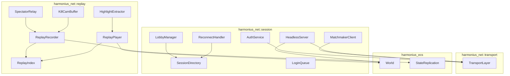

### Communication Module Boundaries

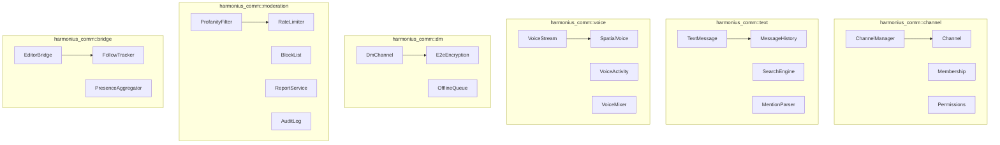

### File Layout

```text
harmonius_net/
+-- session/
|   +-- auth.rs          # AuthService, identity providers
|   +-- matchmaker.rs    # MatchmakerClient, Glicko2Rating
|   +-- lobby.rs         # LobbyManager, Party, ReadyCheck
|   +-- directory.rs     # SessionDirectory, SessionEntry
|   +-- reconnect.rs     # ReconnectHandler, GraceWindow
|   +-- queue.rs         # LoginQueue, QueuePriority
|   +-- headless.rs      # HeadlessServer, health
+-- replay/
|   +-- recorder.rs      # ReplayRecorder, snapshots
|   +-- player.rs        # ReplayPlayer, playback
|   +-- index.rs         # ReplayIndex, keyframe seek
|   +-- spectator.rs     # SpectatorRelay, fan-out
|   +-- killcam.rs       # KillCamBuffer, rolling window
|   +-- highlight.rs     # HighlightExtractor, clip export
harmonius_comm/
+-- channel/
|   +-- channel.rs       # Channel, polymorphic container
|   +-- manager.rs       # ChannelManager
|   +-- membership.rs    # Membership, member list
|   +-- permissions.rs   # ChannelPermissions, ACL
+-- text/
|   +-- message.rs       # TextMessage, content, mentions
|   +-- history.rs       # MessageHistory, paginated load
|   +-- search.rs        # SearchEngine, full-text queries
|   +-- mention.rs       # MentionParser
+-- voice/
|   +-- stream.rs        # VoiceStream, Opus encode/decode
|   +-- activity.rs      # VoiceActivity, VAD gating
|   +-- spatial.rs       # SpatialVoice, BVH positioning
|   +-- mixer.rs         # VoiceMixer, multi-stream
+-- dm/
|   +-- channel.rs       # DmChannel, 1:1 special channel
|   +-- encryption.rs    # E2eEncryption, X25519 + AES-GCM
|   +-- offline.rs       # OfflineQueue, store-and-forward
+-- moderation/
|   +-- profanity.rs     # ProfanityFilter, Aho-Corasick
|   +-- rate_limit.rs    # RateLimiter, token bucket
|   +-- block.rs         # BlockList, per-user block set
|   +-- report.rs        # ReportService, evidence
|   +-- audit.rs         # AuditLog, append-only
+-- bridge/
|   +-- editor.rs        # EditorBridge, collab adapter
|   +-- follow.rs        # FollowTracker, user/AI tracking
|   +-- presence.rs      # PresenceAggregator
+-- protocol/
    +-- messages.rs      # Wire format for all messages
    +-- codec.rs         # Binary serialization
```

### Authentication Flow

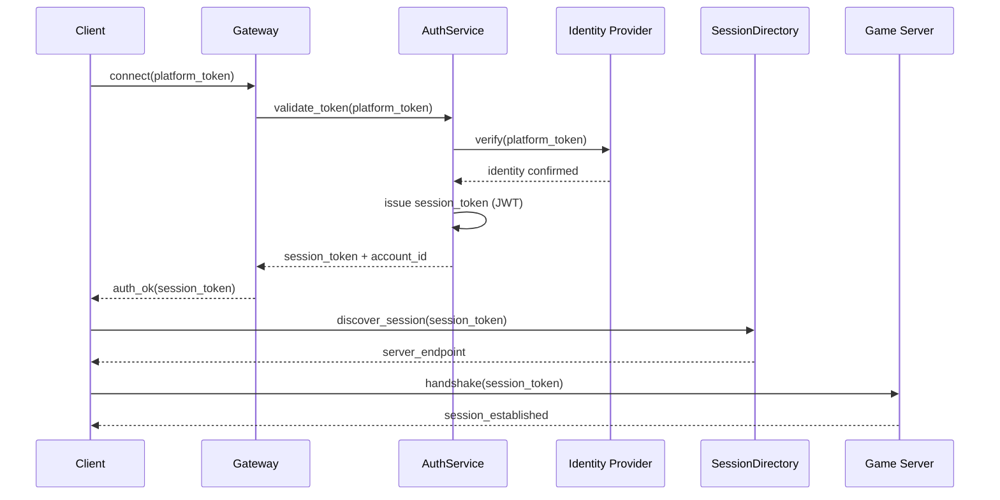

### Reconnection Flow

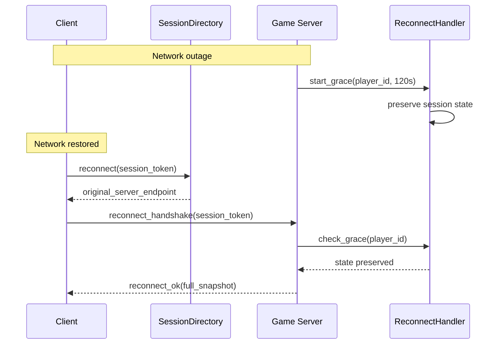

### Matchmaking Flow

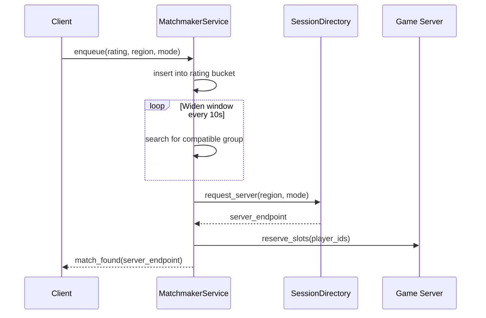

### Replay Recording and Playback

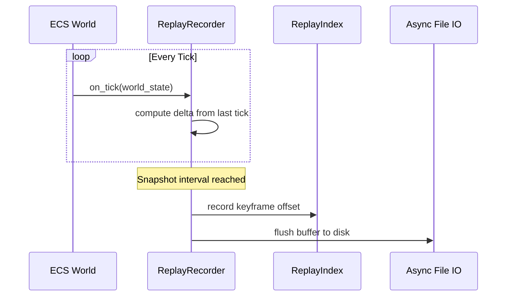

### Kill Cam Pipeline

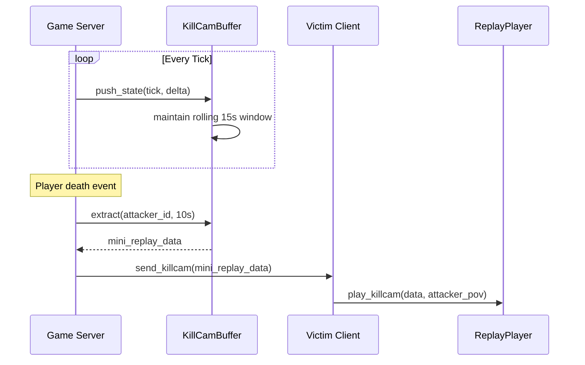

### Channel Lifecycle

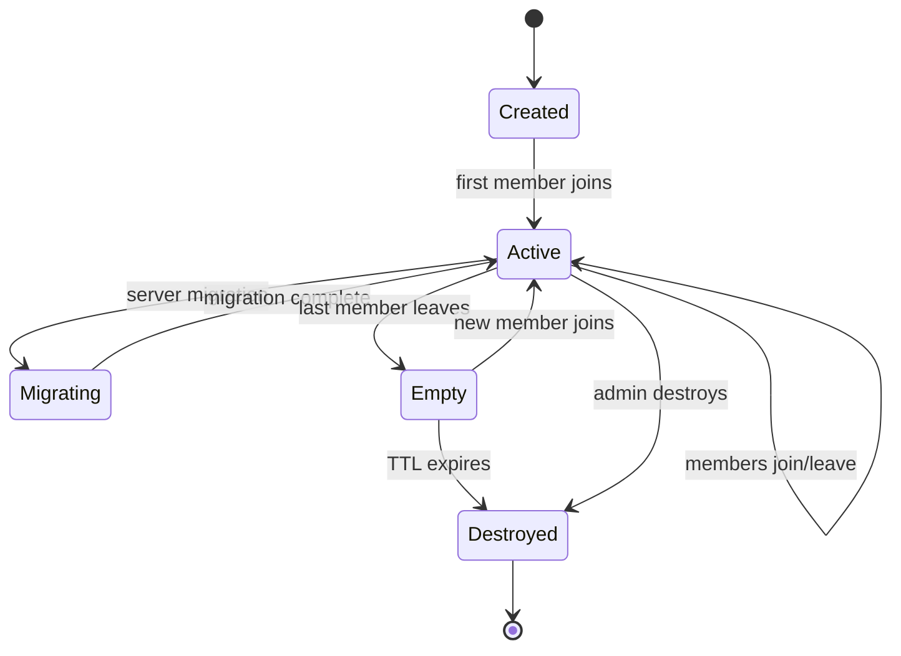

### Text Message Flow

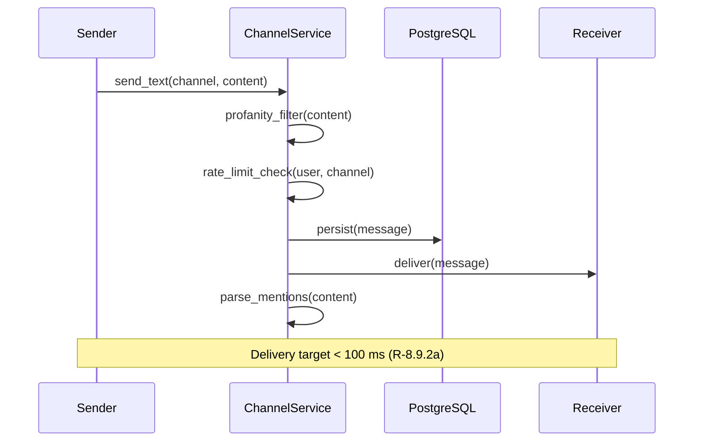

### Voice Pipeline

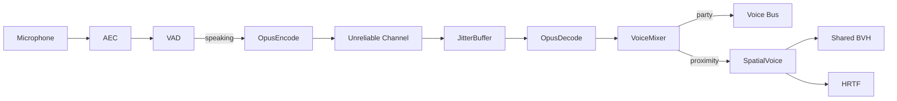

### DM Encryption Flow

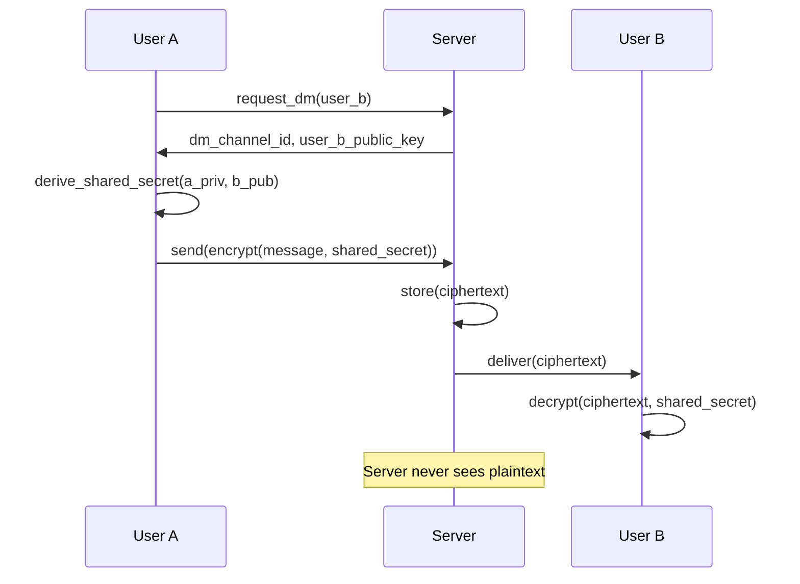

### Moderation Pipeline

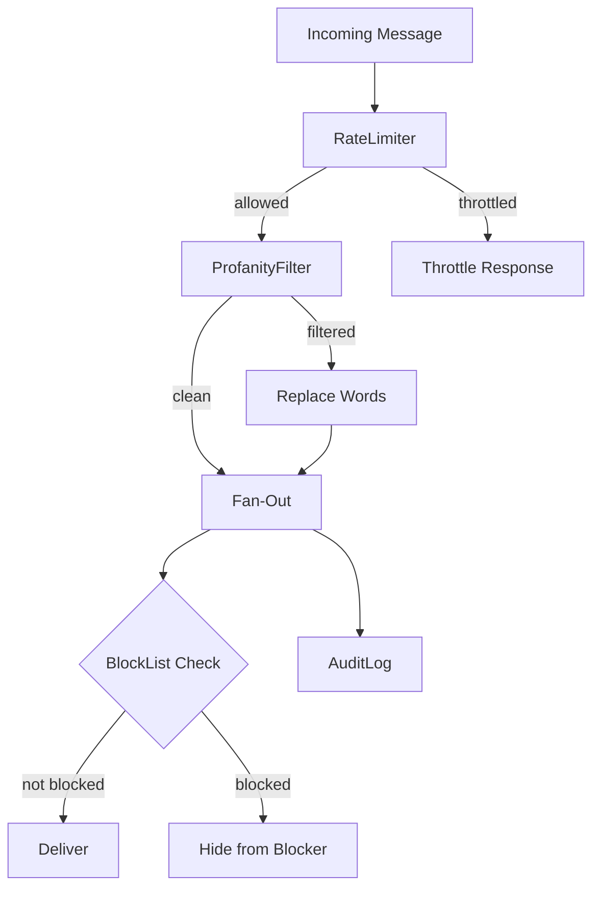

### Core Data Structures

```mermaid
classDiagram
    class AccountId {
        +u64 value
    }

    class SessionId {
        +u128 value
    }

    class Platform {
        <<enumeration>>
        Steam
        PlayStation
        Xbox
        AppleGameCenter
        Google
        Custom
    }

    class SessionState {
        <<enumeration>>
        Connecting
        Authenticating
        Active
        Migrating
        Reconnecting
        Disconnected
    }

    class SessionToken {
        +account_id: AccountId
        +session_id: SessionId
        +platform: Platform
        +issued_at: u64
        +expires_at: u64
        +permissions: Permissions
        +signature: [u8; 64]
        +validate() Result~AccountId~
    }

    class SessionEntry {
        +session_id: SessionId
        +account_id: AccountId
        +server_endpoint: SocketAddr
        +state: SessionState
        +created_at: u64
        +last_heartbeat: u64
    }

    class Glicko2Rating {
        +rating: f64
        +deviation: f64
        +volatility: f64
        +update(outcomes) Glicko2Rating
    }

    class PartyMember {
        +account_id: AccountId
        +role: PartyRole
        +is_leader: bool
        +is_ready: bool
        +platform: Platform
    }

    class PartyRole {
        <<enumeration>>
        Tank
        Healer
        Dps
        Support
        Unassigned
    }

    class QueuePriority {
        <<enumeration>>
        Standard
        Returning
        Subscriber
        Founder
        Admin
    }

    class HeadlessConfig {
        +bind_address: SocketAddr
        +tick_rate: u32
        +max_players: u32
        +map_name: String
        +health_port: u16
    }

    class HealthStatus {
        +server_id: ServerId
        +player_count: u32
        +current_tps: f32
        +cpu_percent: f32
        +state: ServerState
    }

    class ServerState {
        <<enumeration>>
        Starting
        Ready
        Active
        Draining
        ShuttingDown
    }

    class ReplayHeader {
        +version: u32
        +session_id: SessionId
        +start_tick: u64
        +end_tick: u64
        +snapshot_interval: u32
        +entity_count: u32
        +keyframe_count: u32
        +compression: Compression
    }

    class ReplayIndex {
        +keyframes: Vec~KeyframeEntry~
        +find_nearest(tick) KeyframeEntry
    }

    class KeyframeEntry {
        +tick: u64
        +file_offset: u64
        +entity_count: u32
    }

    class KillCamBuffer {
        +capacity_seconds: f32
        +ring: RingBuffer~TickDelta~
        +extract(attacker, duration) Vec~u8~
    }

    class PlaybackSpeed {
        <<enumeration>>
        Paused
        FrameByFrame
        Quarter
        Half
        Normal
        Double
        Quad
        Octa
    }

    class Compression {
        <<enumeration>>
        None
        Lz4
        Zstd
    }

    class SpectatorCamera {
        <<enumeration>>
        Free
        PlayerLocked
        OverheadTactical
    }

    class ChannelId {
        +u64 value
    }

    class ChannelType {
        <<enumeration>>
        Global
        Team
        Party
        Whisper
        Custom
        Editor
        DirectMessage
    }

    class ChannelMode {
        <<enumeration>>
        TextOnly
        VoiceOnly
        TextAndVoice
    }

    class Channel {
        +id: ChannelId
        +channel_type: ChannelType
        +mode: ChannelMode
        +name: String
        +max_members: u32
    }

    class ChannelPermissions {
        +can_send_text: Vec~Role~
        +can_send_voice: Vec~Role~
        +can_invite: Vec~Role~
        +can_moderate: Vec~Role~
    }

    class ChannelManager {
        -channels: HashMap~ChannelId, Channel~
        +create(config) Result~ChannelId~
        +join(channel, user) Result
        +leave(channel, user) Result
        +destroy(channel) Result
    }

    class TextMessage {
        +id: MessageId
        +channel: ChannelId
        +author: UserId
        +content: String
        +mentions: Vec~UserId~
        +timestamp: i64
    }

    class TextClient {
        +send(channel, content) Future~Result~
        +search(channel, query) Future~Result~
        +load_history(channel, count) Future~Result~
    }

    class VoiceClient {
        -streams: HashMap~ChannelId, VoiceStream~
        +join(channel) Future~Result~
        +leave(channel) Future~Result~
        +mute_speaker(user) Result
    }

    class VoiceStream {
        -encoder: OpusEncoder
        -decoder: OpusDecoder
        -jitter_buffer: JitterBuffer
        -vad: VoiceActivityDetector
    }

    class DmClient {
        +start_dm(target) Future~Result~ChannelId~~
        +send(target, content) Future~Result~
        +escalate_to_voice(target) Future~Result~
    }

    class E2eEncryption {
        -local_keypair: X25519KeyPair
        -shared_secret: [u8; 32]
        +derive_key(remote_pub) Result
        +encrypt(plaintext) Vec~u8~
        +decrypt(ciphertext) Result~Vec~u8~~
    }

    class ProfanityFilter {
        -automaton: AhoCorasick
        +check(message, locale) FilterResult
    }

    class RateLimiter {
        -buckets: HashMap~Key, TokenBucket~
        +check(user, channel) RateLimitResult
    }

    class EditorBridge {
        -channel_map: HashMap~ChannelId, ChannelId~
        +bridge(editor_ch, game_ch) Result
        +follow(target) Result
    }

    class FollowTracker {
        -targets: HashMap~UserId, FollowState~
        +follow(target) Result
        +unfollow(target) Result
    }

    class FollowUpdate {
        +target: UserId
        +cursor_position: Option~Vec3~
        +active_asset: Option~AssetId~
        +timestamp: i64
    }

    SessionEntry --> SessionToken
    SessionToken --> Platform
    SessionEntry --> SessionState
    ReplayIndex *-- KeyframeEntry
    ReplayHeader --> Compression
    Channel --> ChannelType
    Channel --> ChannelMode
    Channel --> ChannelPermissions
    ChannelManager --> Channel
    VoiceClient --> VoiceStream
    DmClient --> E2eEncryption
    EditorBridge --> FollowTracker
    FollowTracker ..> FollowUpdate
    PartyMember --> PartyRole
    PartyMember --> Platform
```

## API Design

### Session Types

```rust
#[derive(
    Clone, Copy, Debug, PartialEq, Eq,
    Hash, Reflect,
)]
pub struct AccountId(pub u64);

#[derive(
    Clone, Copy, Debug, PartialEq, Eq,
    Hash, Reflect,
)]
pub struct SessionId(pub u128);

#[derive(
    Clone, Copy, Debug, PartialEq, Eq,
    Hash, Reflect,
)]
pub enum Platform {
    Steam,
    PlayStation,
    Xbox,
    AppleGameCenter,
    Google,
    Custom,
}

#[derive(
    Clone, Copy, Debug, PartialEq, Eq, Reflect,
)]
pub enum SessionState {
    Connecting,
    Authenticating,
    Active,
    Migrating,
    Reconnecting,
    Disconnected,
}

pub struct SessionToken {
    pub account_id: AccountId,
    pub session_id: SessionId,
    pub platform: Platform,
    pub issued_at: u64,
    pub expires_at: u64,
    pub permissions: Permissions,
    pub signature: [u8; 64],
}

#[derive(Clone, Copy, Debug, Reflect)]
pub struct Permissions(pub u32);

impl Permissions {
    pub const PLAY: Self = Self(1 << 0);
    pub const SPECTATE: Self = Self(1 << 1);
    pub const MODERATE: Self = Self(1 << 2);
    pub const ADMIN: Self = Self(1 << 3);
    pub const VIP_QUEUE: Self = Self(1 << 4);
}

/// Glicko-2 skill rating.
#[derive(Clone, Copy, Debug, Reflect)]
pub struct Glicko2Rating {
    pub rating: f64,
    pub deviation: f64,
    pub volatility: f64,
}

#[derive(Clone, Copy, Debug, Reflect)]
pub enum MatchOutcome { Win, Loss, Draw }

#[derive(
    Clone, Copy, Debug, PartialEq, Eq,
    PartialOrd, Ord, Reflect,
)]
pub enum QueuePriority {
    Standard,
    Returning,
    Subscriber,
    Founder,
    Admin,
}

#[derive(
    Clone, Copy, Debug, PartialEq, Eq, Reflect,
)]
pub enum PartyRole {
    Tank, Healer, Dps, Support, Unassigned,
}

#[derive(
    Clone, Copy, Debug, PartialEq, Eq, Reflect,
)]
pub enum ReadyCheckResult {
    AllReady,
    Timeout { not_ready: u32 },
    Cancelled,
}

#[derive(
    Clone, Copy, Debug, PartialEq, Eq, Reflect,
)]
pub enum ServerState {
    Starting, Ready, Active, Draining, ShuttingDown,
}

#[derive(
    Clone, Copy, Debug, PartialEq, Eq, Reflect,
)]
pub enum Compression { None, Lz4, Zstd }

#[derive(
    Clone, Copy, Debug, PartialEq, Eq, Reflect,
)]
pub enum PlaybackSpeed {
    Paused, FrameByFrame, Quarter, Half,
    Normal, Double, Quad, Octa,
}

#[derive(
    Clone, Copy, Debug, PartialEq, Eq, Reflect,
)]
pub enum SpectatorCamera {
    Free,
    PlayerLocked { target: Entity },
    OverheadTactical,
}
```

### Communication Types

```rust
#[derive(
    Clone, Copy, Debug, PartialEq, Eq,
    Hash, Reflect,
)]
pub struct ChannelId(pub u64);

#[derive(
    Clone, Copy, Debug, PartialEq, Eq, Reflect,
)]
pub enum ChannelType {
    Global, Team, Party, Whisper,
    Custom, Editor, DirectMessage,
}

#[derive(
    Clone, Copy, Debug, PartialEq, Eq, Reflect,
)]
pub enum ChannelMode {
    TextOnly, VoiceOnly, TextAndVoice,
}

#[derive(
    Clone, Copy, Debug, PartialEq, Eq,
    Hash, Reflect,
)]
pub struct MessageId(pub u64);

#[derive(Clone, Debug, Reflect)]
pub struct TextMessage {
    pub id: MessageId,
    pub channel: ChannelId,
    pub author: UserId,
    pub content: String,
    pub mentions: Vec<UserId>,
    pub asset_refs: Vec<AssetId>,
    pub timestamp: i64,
}

#[derive(
    Clone, Copy, Debug, PartialEq, Eq, Reflect,
)]
pub enum RateLimitResult {
    Allow,
    Throttle { delay_ms: u32 },
    Reject,
}

#[derive(Clone, Debug, Reflect)]
pub enum FilterResult {
    Clean,
    Filtered { replaced: String },
    Blocked,
}

#[derive(
    Clone, Copy, Debug, PartialEq, Eq, Reflect,
)]
pub enum MuteScope {
    TextOnly, VoiceOnly, Both,
}

#[derive(Clone, Debug, Reflect)]
pub struct FollowUpdate {
    pub target: UserId,
    pub cursor_position: Option<[f32; 3]>,
    pub active_asset: Option<AssetId>,
    pub last_edit: Option<EditSummary>,
    pub timestamp: i64,
}
```

### Error Types

```rust
pub enum AuthError {
    InvalidToken,
    Expired,
    PlatformUnavailable { platform: Platform },
    AccountBanned { until: Option<u64> },
    RateLimited,
    Internal,
}

pub enum ReplayError {
    IoError { source: IoError },
    CorruptFile,
    UnsupportedVersion { version: u32 },
    SeekOutOfRange { tick: u64, max: u64 },
    NotRecording,
    AlreadyRecording,
}

pub enum LobbyError {
    PartyNotFound,
    PartyFull,
    NotLeader,
    AlreadyInParty,
    InviteDeclined,
    InviteExpired,
}

pub enum MatchmakerError {
    AlreadyQueued,
    TicketNotFound,
    ServiceUnavailable,
    QueueFull,
}

pub enum CommError {
    ChannelNotFound { id: ChannelId },
    NotMember { user: UserId, channel: ChannelId },
    ChannelFull { id: ChannelId },
    PermissionDenied { user: UserId, action: &'static str },
    Muted { user: UserId, channel: ChannelId },
    RateLimited { delay_ms: u32 },
    Encryption { message: String },
    Transport { message: String },
    UserOffline { user: UserId },
    NotConnected,
}
```

## Data Flow

### Session Lifecycle

1. **Authenticate.** Client sends platform token. AuthService validates via identity provider,
   issues signed SessionToken.
2. **Discover.** Client queries SessionDirectory for assigned game server endpoint.
3. **Connect.** Transport handshake with session token.
4. **Play.** Session state tracked as ECS components.
5. **Reconnect.** Grace timer preserves player entity. Restored atomically on reconnect within 120
   s.
6. **Logout.** Session removed; player entity persisted then despawned.

### Replay Data Pipeline

1. **Record.** ReplayRecorder observes replication stream each tick. Computes delta, captures
   periodic full snapshots.
2. **Flush.** Async I/O writes buffered data to disk.
3. **Finalize.** Header and index written on recording end.
4. **Seek.** Load nearest keyframe (binary search), replay deltas forward.
5. **Kill cam.** Rolling 15 s ring buffer; extract on death.
6. **Spectate.** Delayed fan-out via relay servers.

### Text Message Pipeline

1. User sends message via reliable ordered channel.
2. Server rate-limits and profanity-filters.
3. Message persisted to PostgreSQL with FTS indexing.
4. Fan-out to channel members (skipping blocked users).
5. @-mentions generate notification events.

### Voice Packet Pipeline

1. Platform microphone capture provides raw PCM.
2. AEC subtracts speaker output.
3. VAD gates the signal.
4. Opus encoder compresses (24 kbps default).
5. Unreliable unordered channel transmits.
6. Jitter buffer absorbs timing variance.
7. Opus decoder (or PLC) produces audio.
8. VoiceMixer routes to bus or spatializes via BVH.

### Voice Bandwidth Budget

| Budget | Opus Bitrate | Frame Size |
|--------|-------------|------------|
| Normal | 24 kbps | 20 ms |
| Constrained | 12 kbps | 40 ms |
| Severely constrained | 6 kbps | 60 ms |
| Exhausted | Suspend voice | -- |

## Platform Considerations

### Session Infrastructure

| Component | Deployment |
|-----------|------------|
| AuthService | AWS ECS Fargate (stateless) |
| SessionDirectory | AWS DynamoDB |
| MatchmakerService | AWS ECS Fargate |
| LobbyManager | In-process (game server) |
| LoginQueue | In-process (gateway) |
| HeadlessServer | AWS ECS / Kubernetes |

### Replay I/O

| Platform | Async I/O |
|----------|-----------|
| Windows | Tokio (IOCP) |
| macOS | Tokio (kqueue) |
| Linux | Tokio (epoll) |

### Microphone Capture

| Platform | API |
|----------|-----|
| macOS | CoreAudio AudioUnit |
| Windows | WASAPI |
| Linux | PipeWire |

### Voice Codec

| Parameter | Value |
|-----------|-------|
| Codec | Opus (RFC 6716) |
| Sample rate | 48 kHz |
| Frame size | 20 ms (default) |
| Bitrate | 6-64 kbps |
| Channels | Mono per speaker |

### Encryption (DM)

| Component | Algorithm |
|-----------|-----------|
| Key exchange | X25519 |
| Symmetric | AES-256-GCM |
| At-rest | AES-256-GCM |

### Mobile Adaptations

| Feature | Desktop | Mobile |
|---------|---------|--------|
| Reconnect grace | 120 s | 180 s |
| Fast-forward max | 8x | 4x |
| Replay compression | zstd | zstd (higher) |
| Queue notification | In-app | Push |
| Spectator cameras | All | Locked, overhead |

## Test Plan

Test cases are in the companion file
[network-services-test-cases.md](network-services-test-cases.md).

### Summary

| Category | Count | Coverage |
|----------|-------|----------|
| Unit tests | 40 | Auth, matchmaking, lobby, replay, comm |
| Integration tests | 28 | Logins, cross-play, determinism, voice |
| Benchmarks | 16 | Auth throughput, seek, delivery latency |

## Open Questions

1. **Session token rotation.** New token on each reconnect vs original valid for full TTL?
2. **Cross-shard party persistence.** In-process vs dedicated microservice for cross-shard parties?
3. **Replay format versioning.** Embedded schema, separate registry, or version-locked player?
4. **Spectator stream encryption.** Encryption adds CPU per spectator but prevents interception.
5. **Matchmaking DB.** DynamoDB (key-value) vs PostgreSQL (relational) for Glicko-2 ratings?
6. **Kill cam POV.** Record camera state in delta stream vs infer from attacker position?
7. **Profanity filter scope.** Exact/substring only or also leet-speak substitutions?
8. **DM key rotation.** Per-session vs per-message for forward secrecy?
9. **Voice relay architecture.** Server-side mixing (lower client bandwidth) vs relay (lower server
   CPU)?
10. **Chat bubbles in VR.** Maximum simultaneous before culling distant ones (propose: 8 nearest)?
11. **Cross-shard channels.** Communication framework handles fan-out directly vs delegate to
    inter-server bus?

## Review Feedback

### RF-1: Replace all Tokio/async with platform-native I/O

"All I/O is Tokio async I/O" must be replaced. Use platform- native I/O per constraints. Replace
Future return types on TextClient, VoiceClient, DmClient with synchronous request/handle pattern.
Update replay I/O table. Use QUIC (Design #30 RF-12) for all service communication.

### RF-2: Remove all Reflect derives

Use codegen-generated metadata via middleman .dylib.

### RF-3: Create companion test cases file

Create `network-services-test-cases.md` with 84 claimed tests (40 unit + 28 integration + 16
benchmarks).

### RF-4: Add missing standard services

**Leaderboards:**

```rust
pub struct LeaderboardEntry {
    pub player_id: PlayerId,
    pub score: i64,
    pub rank: u32,
    pub metadata: SmallVec<[u8; 64]>,
    pub timestamp: u64,
}

pub struct LeaderboardService { /* ... */ }

impl LeaderboardService {
    pub fn submit_score(
        &self, board_id: LeaderboardId,
        score: i64,
    ) -> IoRequestId;
    pub fn query_range(
        &self, board_id: LeaderboardId,
        offset: u32, count: u32,
    ) -> IoRequestId;
    pub fn query_around_player(
        &self, board_id: LeaderboardId,
        count: u32,
    ) -> IoRequestId;
}
```

- Multiple boards per game (daily, weekly, all-time)
- Per-board reset schedule
- Friend-filtered leaderboards
- Anti-cheat: server validates scores before submission

**Achievements:**

```rust
pub struct Achievement {
    pub id: AchievementId,
    pub progress: f32,       // 0.0-1.0
    pub unlocked: bool,
    pub unlock_time: Option<u64>,
}

pub struct AchievementService { /* ... */ }

impl AchievementService {
    pub fn increment(
        &self, id: AchievementId, delta: f32,
    ) -> IoRequestId;
    pub fn unlock(
        &self, id: AchievementId,
    ) -> IoRequestId;
    pub fn query_all(&self) -> IoRequestId;
}
```

- Progress-based (kill 100 enemies: 0.45 → 0.46)
- Boolean (find hidden area: unlock)
- Sync with platform SDK achievements (Steam, PSN, Xbox)

**Cloud saves:**

```rust
pub struct CloudSaveService { /* ... */ }

impl CloudSaveService {
    pub fn save(
        &self, slot: u8, data: &[u8],
    ) -> IoRequestId;
    pub fn load(&self, slot: u8) -> IoRequestId;
    pub fn list_slots(&self) -> IoRequestId;
    pub fn delete(&self, slot: u8) -> IoRequestId;
}
```

- Per-player storage (MinIO backend, S3-compatible)
- Conflict resolution: last-write-wins or merge callback
- rkyv serialization for save data
- Quota per player (configurable, default 100 MB)

**Analytics / telemetry:**

```rust
pub struct TelemetryEvent {
    pub name: StringId,
    pub properties: SmallVec<[(StringId, TelemetryValue); 8]>,
    pub timestamp: u64,
}

pub struct TelemetryService { /* ... */ }

impl TelemetryService {
    pub fn track(&self, event: TelemetryEvent);
    pub fn flush(&self) -> IoRequestId;
}
```

- Fire-and-forget event submission (buffered, batched)
- Player session tracking (login, playtime, progression)
- Server-side aggregation pipeline (Kinesis → S3 → Athena)
- GDPR: opt-out flag, data deletion API

### RF-5: Matchmaking backfill

When a player leaves mid-match, backfill with a replacement:

```rust
pub struct BackfillRequest {
    pub match_id: MatchId,
    pub slot: PartySlot,
    pub min_skill: f32,
    pub max_skill: f32,
    pub max_wait_secs: u16,
}
```

- Matchmaker searches queue for players within skill range
- Backfill candidates see "join in progress" prompt
- Backfilled player joins with current match state
- Skill adjustment: backfill players get reduced rating change (they joined late)
- Timeout: if no backfill found within max_wait, slot stays empty (or AI fills if configured)

### RF-6: Abandoned match handling

Detect and penalize match abandonment:

```rust
pub enum AbandonPenalty {
    None,
    CooldownMinutes(u16),
    RatingPenalty(f32),
    TempBan { hours: u16 },
}

pub struct AbandonPolicy {
    pub grace_period_secs: u16,    // disconnect time before abandon
    pub reconnect_window_secs: u16, // can rejoin within this
    pub penalty_escalation: Vec<AbandonPenalty>, // 1st, 2nd, 3rd...
}
```

- Grace period: brief disconnects (< 30s) allow reconnect without penalty
- Reconnect window: longer disconnects (< 5 min) allow rejoin but count as abandon if not taken
- Escalating penalties: warning → 15 min cooldown → 1 hour → rating penalty → temp ban
- Tracked per player per rolling window (e.g., 20 games)
- Team vote: team can vote to not penalize (emergency disconnect)

### RF-7: Skill rating system

Expand Glicko-2 with detailed tracking:

```rust
pub struct PlayerRating {
    pub rating: f64,          // Glicko-2 rating (μ)
    pub deviation: f64,       // rating deviation (φ)
    pub volatility: f64,      // rating volatility (σ)
    pub matches_played: u32,
    pub wins: u32,
    pub losses: u32,
    pub last_match_time: u64,
}
```

- Rating decay: deviation increases over time when not playing (Glicko-2 handles this natively)
- Placement matches: first N matches (e.g., 10) use wider deviation for faster convergence
- Per-mode ratings: separate rating per game mode (ranked, casual, team, solo)
- Season resets: soft reset (compress toward mean) not hard reset (preserves relative ordering)
- Anti-smurf: new accounts start with high deviation, converge quickly toward true skill
- Display rank: map rating ranges to named tiers (Bronze, Silver, Gold, Platinum, Diamond, etc.)

Reference: [Glickman, "Glicko-2" (2012)](http://www.glicko.net/glicko/glicko2.pdf)

### RF-8: Platform SDK integration

Expand beyond the Platform enum:

| Platform | Auth | Achievements | Friends | Voice | Store |
|----------|------|-------------|---------|-------|-------|
| Steam | Steamworks | Steam achievements | Steam friends | Steam voice | Steam Store |
| PlayStation | PSN | PSN trophies | PSN friends | PSN party chat | PS Store |
| Xbox | Xbox Live | Xbox achievements | Xbox friends | Xbox party chat | MS Store |
| Nintendo | Nintendo Account | N/A | Nintendo friends | N/A | eShop |
| Epic | EOS | EOS achievements | EOS friends | EOS voice | Epic Store |
| Apple | Game Center | GC achievements | GC friends | N/A | App Store |

Each platform has a `PlatformAdapter` trait (cfg-gated per platform, static dispatch) that bridges
engine services to platform SDK APIs. Cross-play requires mapping platform friend IDs to engine
player IDs.

### RF-9: Use QUIC for all service communication

All service APIs (auth, matchmaking, leaderboards, achievements, cloud saves, telemetry) communicate
via HTTP/3 over QUIC (Design #30 RF-12). Voice uses QUIC unreliable datagrams. No separate TCP stack
needed.

### RF-10: Algorithm references

| Algorithm | Reference |
|-----------|-----------|
| Glicko-2 | [Glickman (2012)](http://www.glicko.net/glicko/glicko2.pdf) |
| OAuth 2.0 | [RFC 6749](https://www.rfc-editor.org/rfc/rfc6749) |
| JWT | [RFC 7519](https://www.rfc-editor.org/rfc/rfc7519) |
| Opus codec | [RFC 6716](https://www.rfc-editor.org/rfc/rfc6716) |
| AEC | [Haykin, "Adaptive Filter Theory"](https://www.pearson.com/en-us/subject-catalog/p/adaptive-filter-theory/P200000003521) |

### RF-11: Queue types and leaver queue

Support multiple matchmaking queue types:

```rust
pub enum QueueType {
    Casual,           // relaxed skill matching
    Competitive,      // strict skill, ranked
    Raid {             // PvE, role-based
        min_tanks: u8,
        min_healers: u8,
        min_dps: u8,
    },
    Custom {           // user-defined rules
        rule_id: QueueRuleId,
    },
}
```

**Competitive queue:**

- Strict skill range (narrows over time)
- Map/mode veto system
- Mandatory accept phase (decline = short cooldown)
- Per-season rating reset (soft reset)
- Placement matches for unranked players

**Raid queue (PvE role-based):**

- Role-based filling: tanks → healers → DPS
- Estimated wait time per role displayed
- Cross-server raid finder
- Minimum item level / gear score gate
- Boss-specific queues (raid wing selection)

**Leaver queue (penalty pool):**

Players with high abandon rate are matched with other leavers instead of the general population:

```rust
pub struct LeaverStatus {
    pub in_leaver_queue: bool,
    pub abandon_count: u8,     // rolling 20 games
    pub games_to_exit: u8,     // complete N to leave
}
```

- Enter leaver queue after 2+ abandons in 20 games
- Must complete N games (without abandoning) to return to normal queue
- Leaver queue has longer wait times (smaller pool)
- Resets on season boundary
- Separate from temp bans (RF-6) — leaver queue is matchmaking-level, bans are account-level

### RF-12: Store and overlay integration

**Platform store integration:**

| Platform | Store API | Overlay | Reference |
|----------|----------|---------|-----------|
| Steam | Steamworks ISteamMicroTransactions | Steam Overlay | [Steamworks SDK](https://partner.steamgames.com/doc/sdk) |
| Epic | Epic Online Services (EOS) | EOS Overlay | [EOS SDK](https://dev.epicgames.com/docs/epic-online-services) |
| Windows | Windows.Services.Store | Xbox Game Bar | [MS Store API](https://learn.microsoft.com/en-us/windows/uwp/monetize/) |
| PlayStation | PlayStation Store API | PS overlay | Sony Partner docs |
| Xbox | Microsoft Store API | Xbox Guide | MS Partner docs |
| Apple | StoreKit 2 | N/A (no overlay) | [StoreKit](https://developer.apple.com/storekit/) |
| Google | Google Play Billing | N/A | [Play Billing](https://developer.android.com/google/play/billing) |

**Engine integration:**

```rust
pub struct StoreService { /* platform-specific */ }

impl StoreService {
    pub fn query_products(
        &self, ids: &[ProductId],
    ) -> IoRequestId;
    pub fn purchase(
        &self, id: ProductId,
    ) -> IoRequestId;
    pub fn restore_purchases(&self) -> IoRequestId;
    pub fn check_entitlement(
        &self, id: ProductId,
    ) -> bool;  // cached
}
```

**Overlay support:**

Platform overlays (Steam Overlay, EOS Overlay, Xbox Game Bar) render on top of the game. The engine
must:

- Detect overlay activation (input focus changes)
- Pause game input when overlay is active
- Continue rendering (overlay composites on top)
- Resume input when overlay dismissed
- Provide hooks: `on_overlay_activated`, `on_overlay_deactivated`

Overlay detection per platform:

| Platform | Detection API |
|----------|--------------|
| Steam | `ISteamFriends::SetOverlayNotifyCallback` |
| Epic | `EOS_UI_AddNotifyDisplaySettingsUpdated` |
| Windows | `GameBar` events |
| Console | Platform SDK callbacks |

The engine's input system (Design #14) mutes input events when the overlay is active. The game loop
continues rendering so the overlay can composite.
