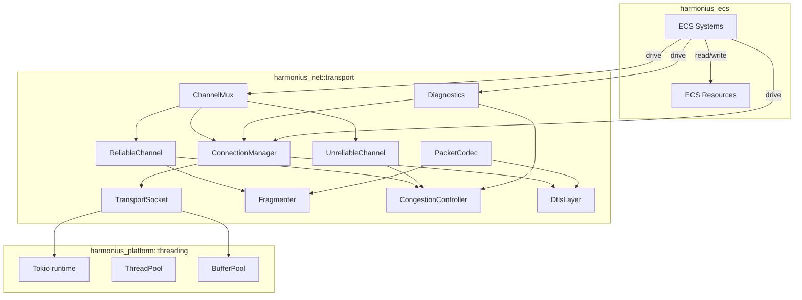
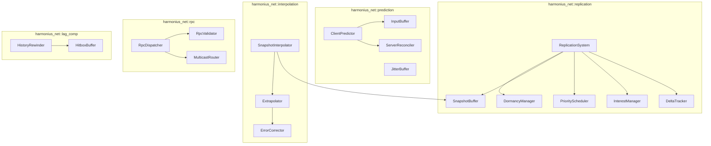
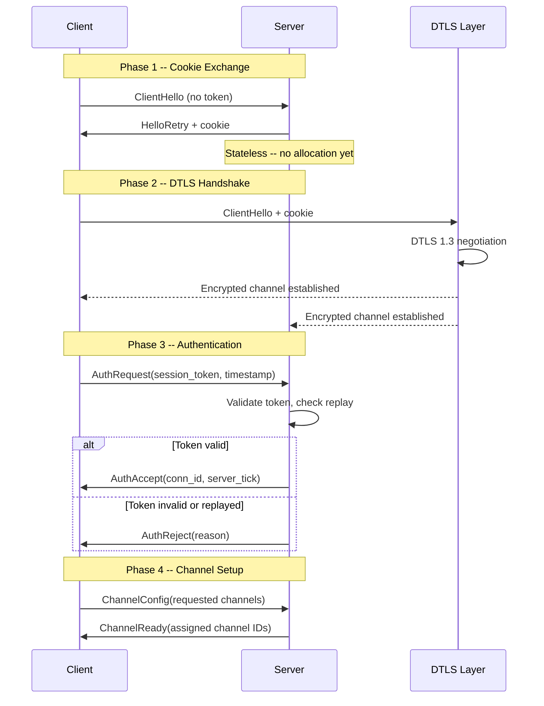
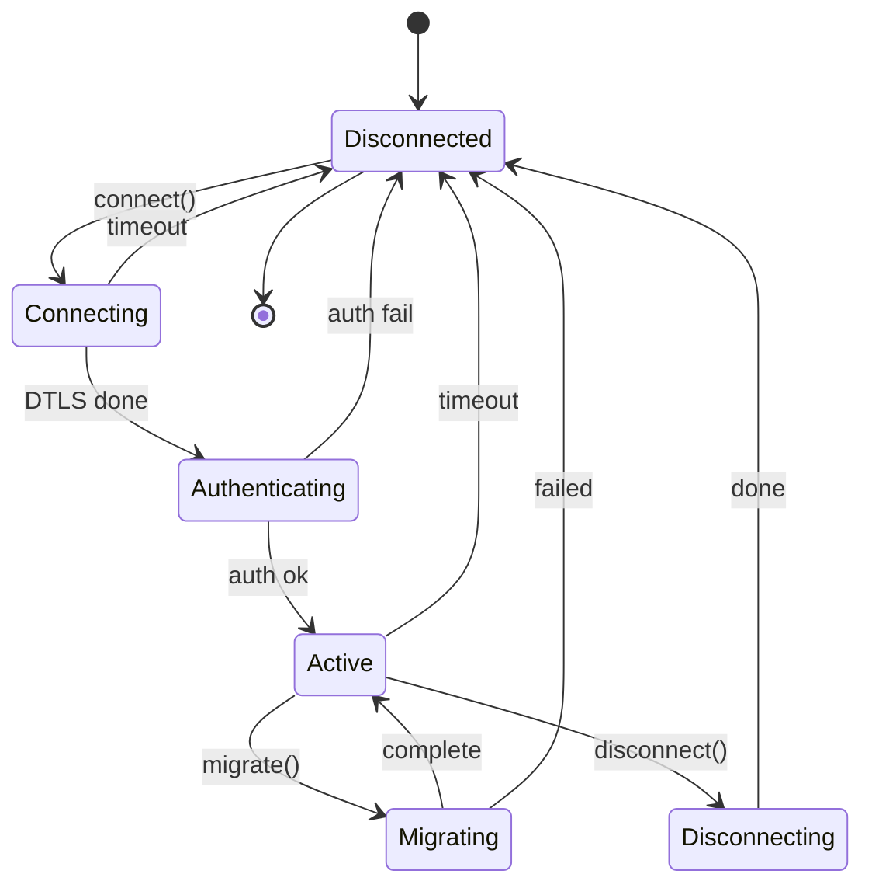
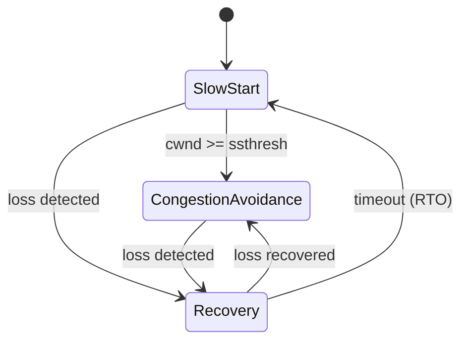
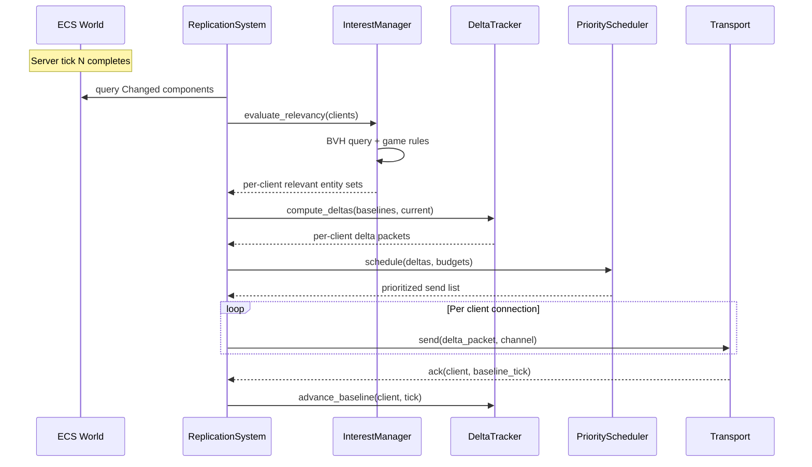
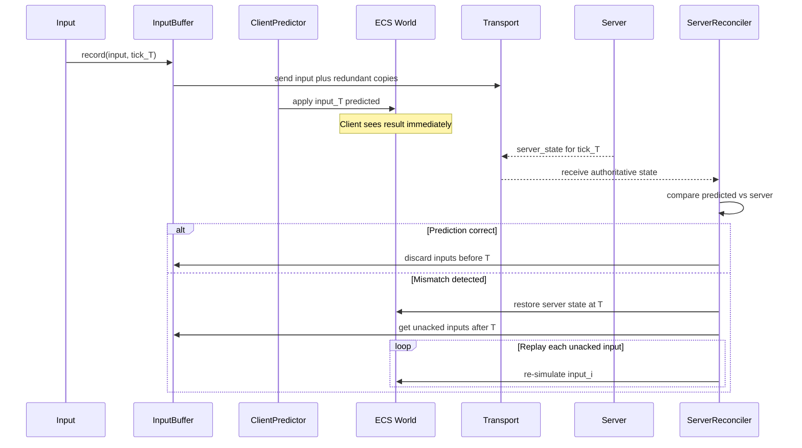
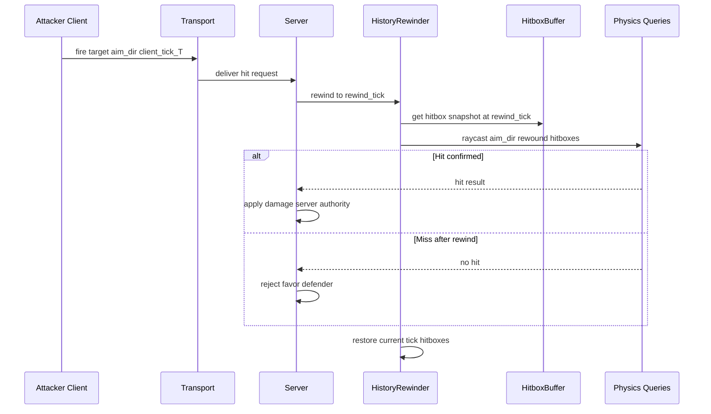
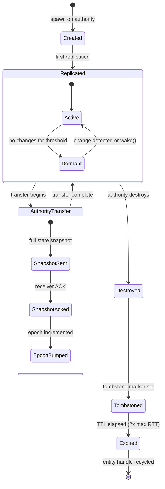

# Network Transport and State Replication Design

## Requirements Trace

> **Canonical sources:** Features, requirements, and user stories are defined in
> [features/](../../features/), [requirements/](../../requirements/), and
> [user-stories/](../../user-stories/). The table below traces design elements to those definitions.

### Transport Layer

| Feature | Requirement         | User Story           |
|---------|---------------------|----------------------|
| F-8.1.1 | R-8.1.1             | US-8.1.1, US-8.1.10 |
| F-8.1.2 | R-8.1.2, R-8.NFR.7  | US-8.1.2, US-8.1.12 |
| F-8.1.3 | R-8.1.3, R-8.NFR.12 | US-8.1.4            |
| F-8.1.4 | R-8.1.4             | US-8.1.5            |
| F-8.1.5 | R-8.1.5, R-8.NFR.11 | US-8.1.6            |
| F-8.1.6 | R-8.1.6             | US-8.1.7            |
| F-8.1.7 | R-8.1.7             | US-8.1.8            |
| F-8.1.8 | R-8.1.8             | US-8.1.3, US-8.1.9  |

1. **F-8.1.1** -- Connection handshake and authentication
2. **F-8.1.2** -- Connection lifecycle management
3. **F-8.1.3** -- Reliable ordered channel
4. **F-8.1.4** -- Unreliable and unordered channels
5. **F-8.1.5** -- DTLS encryption
6. **F-8.1.6** -- Packet fragmentation, reassembly, MTU discovery
7. **F-8.1.7** -- Bandwidth estimation and congestion control
8. **F-8.1.8** -- Network diagnostics and quality indicators

### State Replication, Prediction, and RPC

| Feature | Requirement | User Stories             |
|---------|-------------|--------------------------|
| F-8.2.1 | R-8.2.1     | US-8.2.3, US-8.2.10     |
| F-8.2.2 | R-8.2.2     | US-8.2.2, US-8.2.9      |
| F-8.2.3 | R-8.2.3     | US-8.2.1, US-8.2.12     |
| F-8.2.4 | R-8.2.4     | US-8.2.4, US-8.2.7      |
| F-8.2.5 | R-8.2.5     | US-8.2.5, US-8.2.8      |
| F-8.2.6 | R-8.2.6     | US-8.2.6                |
| F-8.4.1 | R-8.4.1     | US-8.4.1, US-8.4.5      |
| F-8.4.2 | R-8.4.2     | US-8.4.6                |
| F-8.4.3 | R-8.4.3     | US-8.4.3                |
| F-8.4.4 | R-8.4.4     | US-8.4.4                |
| F-8.4.5 | R-8.4.5     | US-8.4.2, US-8.4.7      |
| F-8.4.6 | R-8.4.6     | US-8.4.8, US-8.4.9      |
| F-8.3.1 | R-8.3.1     | US-8.3.1, US-8.3.6      |
| F-8.3.2 | R-8.3.2     | US-8.3.3, US-8.3.7      |
| F-8.3.3 | R-8.3.3     | US-8.3.2, US-8.3.4      |
| F-8.3.4 | R-8.3.4     | US-8.3.5                |
| F-8.3.5 | R-8.3.5     | US-8.3.6, US-8.3.9      |

1. **F-8.2.1** -- Delta-compressed property replication
2. **F-8.2.2** -- Component replication with schema versioning
3. **F-8.2.3** -- Area-of-interest filtering via shared BVH
4. **F-8.2.4** -- Conditional and tiered replication
5. **F-8.2.5** -- Priority scheduling and bandwidth budgeting
6. **F-8.2.6** -- Entity dormancy for zero-bandwidth idle
7. **F-8.4.1** -- Input prediction and server reconciliation
8. **F-8.4.2** -- Input buffering with redundant transmission
9. **F-8.4.3** -- Snapshot interpolation for remote entities
10. **F-8.4.4** -- Entity extrapolation with error correction
11. **F-8.4.5** -- Server-side lag compensation (hitbox rewind)
12. **F-8.4.6** -- Jitter buffer and adaptive tick alignment
13. **F-8.3.1** -- Server RPC with validation
14. **F-8.3.2** -- Client RPC for ephemeral events
15. **F-8.3.3** -- Multicast RPC (server-to-group)
16. **F-8.3.4** -- RPC reliability modes
17. **F-8.3.5** -- RPC parameter serialization and validation

### Cross-Cutting Constraints

| Constraint | Source | Impact |
|------------|--------|--------|
| Networking frame budget | R-X.1.1 | 0.5 ms at 60 fps |
| Async I/O via Tokio runtime | Design constraints | All socket ops async |
| ECS-primary (~90%)-based | Design constraints | All net state as ECS resources |
| Static dispatch | Design constraints | No vtables, no dyn Trait |
| Rust stable only | Design constraints | No nightly features |

### Cross-Cutting Dependencies

| Dependency | Source | Consumed API |
|------------|--------|-------------|
| Entity lifecycle | F-1.1.11 | Generational `Entity` handles |
| Change detection | F-1.1.22 | Tick-based `Changed<T>` queries |
| Parallel iteration | F-1.1.20 | Chunk-level parallel query |
| Reflect trait | F-1.3.1 | `TypeRegistry`, field access |
| DynamicValue | F-1.3.5 | Type-erased diff and patch |
| Serialization | F-1.5.1 | Compact binary encoding |
| Shared BVH | F-1.9.1 | Spatial relevancy queries |
| Thread pool | F-14.3.1 | Scoped parallel execution |

## Overview

This design covers the UDP transport layer and the state replication, prediction, rollback, and RPC
systems built on top of it. Together they form the data path for all networked gameplay in
Harmonius.

### Transport Layer

The transport provides UDP-based communication between the platform I/O layer (`Tokio runtime`) and
higher-level networking systems.

1. **UDP-only for game traffic.** All reliability, ordering, and congestion control are userspace
   over raw UDP.
2. **Channel-based multiplexing.** Each connection supports multiple logical channels with
   independent delivery semantics.
3. **DTLS 1.3 encryption.** All traffic encrypted. Key rotation without session interruption.
4. **Async I/O throughout.** All socket operations use `async`/`await` via the `Tokio runtime`.
5. **ECS-native.** Connection state, channel buffers, congestion state, and diagnostics are ECS
   resources.

### State Replication

The replication system is ECS-primary (~90%)-based. Replicated state lives as components. The
`Reflect` trait drives field-level diffing and patching. The shared BVH provides spatial relevancy
queries.

1. **Server-authoritative.** The server owns all gameplay state.
2. **Component-level granularity.** Only changed fields are sent.
3. **Bandwidth-first.** Delta compression, interest management, priority scheduling, and dormancy
   minimize bandwidth.
4. **Latency-hiding.** Prediction, interpolation, extrapolation, and lag compensation hide 80-150 ms
   RTT.

## Architecture

### Transport Module Boundaries



### Replication Module Boundaries



### File Layout

```text
harmonius_net/
+-- transport/
|   +-- socket.rs        # TransportSocket, async UDP
|   +-- connection.rs    # ConnectionManager, Connection
|   +-- handshake.rs     # Handshake phases, cookie, auth
|   +-- channel.rs       # ChannelMux, ChannelId, mode
|   +-- reliable.rs      # ReliableChannel, SACK, windows
|   +-- unreliable.rs    # UnreliableChannel
|   +-- fragment.rs      # Fragmenter, reassembly, MTU
|   +-- congestion.rs    # CongestionController
|   +-- dtls.rs          # DtlsLayer, DtlsSession
|   +-- codec.rs         # PacketCodec, header encode
|   +-- stats.rs         # NetStatsResource, RTT, loss
|   +-- systems.rs       # ECS systems (poll, recv, send)
|   +-- config.rs        # TransportConfig, platform defs
|   +-- error.rs         # TransportError variants
+-- replication/
|   +-- system.rs        # ReplicationSystem, tick loop
|   +-- delta.rs         # DeltaTracker, Baseline
|   +-- interest.rs      # InterestManager, AOI
|   +-- priority.rs      # PriorityScheduler
|   +-- snapshot.rs      # SnapshotBuffer, Snapshot
|   +-- dormancy.rs      # DormancyManager
|   +-- schema.rs        # SchemaRegistry, SchemaVersion
+-- prediction/
|   +-- predictor.rs     # ClientPredictor
|   +-- reconciler.rs    # ServerReconciler
|   +-- input_buffer.rs  # InputBuffer, TimestampedInput
|   +-- jitter_buffer.rs # JitterBuffer
+-- interpolation/
|   +-- interpolator.rs  # SnapshotInterpolator
|   +-- extrapolator.rs  # Extrapolator
|   +-- error_correct.rs # ErrorCorrector
+-- rpc/
|   +-- dispatcher.rs    # RpcDispatcher
|   +-- validator.rs     # RpcValidator, RateLimiter
|   +-- multicast.rs     # MulticastRouter
|   +-- registry.rs      # RpcRegistry, RpcDefinition
+-- lag_comp/
    +-- rewinder.rs      # HistoryRewinder
    +-- hitbox_buffer.rs # HitboxBuffer, HitboxSnapshot
```

### Connection Handshake

Four-phase protocol integrating DTLS with application-layer authentication. Phase 1 is stateless to
resist flooding (R-8.1.1).



Anti-flood: HMAC-SHA256 cookie with configurable 5 s expiry. Replay resistance: monotonic timestamp
with sliding window.

### Connection State Machine



### Channel Architecture

| Mode | Reliable | Ordered | Use Case |
|------|----------|---------|----------|
| ReliableOrdered | Yes | Yes | Inventory, quests, chat |
| ReliableUnordered | Yes | No | Entity spawns, config |
| UnreliableSequenced | No | Seq | Position updates, input |
| UnreliableUnordered | No | No | Voice, VFX triggers |

### Congestion Control

Game-oriented BBR-inspired algorithm prioritizing smooth throughput over maximum utilization
(R-8.1.7).



| Phase | Cwnd Update |
|-------|-------------|
| SlowStart | +1 MSS per ack |
| CongestionAvoidance | +1 MSS per RTT |
| Recovery | cwnd = cwnd * 0.7 |

### Server Replication Tick



### Client Prediction and Reconciliation



### Hitbox Rewinding (Lag Compensation)



### Entity Lifecycle (Reconciliation Edge Cases)



### Core Data Structures

```mermaid
classDiagram
    class TransportSocket {
        -socket: RawHandle
        -reactor: Tokio runtime
        -recv_buf: BufferPool
        +bind(addr) Future~Result~
        +sendto(addr, data) Future~Result~
        +recv_from() Future~Result~Datagram~
    }

    class ConnectionManager {
        -connections: HashMap~ConnectionId, Connection~
        -pending: HashMap~Token, HandshakeState~
        -timeout_wheel: TimingWheel
        -config: TransportConfig
        +accept() Future~ConnectionId~
        +connect(addr, token) Future~ConnectionId~
        +disconnect(id)
        +poll_timeouts() SmallVec~ConnectionId~
    }

    class Connection {
        -id: ConnectionId
        -remote_addr: SocketAddr
        -state: ConnectionState
        -dtls: DtlsSession
        -channels: ChannelMux
        -stats: ConnectionStats
    }

    class ChannelMux {
        -channels: Vec~Channel~
        +open(mode) ChannelId
        +send(channel, payload)
        +recv(channel) Option~Payload~
    }

    class ReliableChannel {
        -send_window: SendWindow
        -recv_window: RecvWindow
        -retransmit_queue: VecDeque~Packet~
        -rtt_estimator: RttEstimator
    }

    class CongestionController {
        -cwnd: u32
        -ssthresh: u32
        -bytes_in_flight: u32
        -state: CongestionState
        +on_ack(bytes, rtt)
        +on_loss(bytes)
        +send_budget() u32
    }

    class Fragmenter {
        -mtu: u16
        -next_group_id: u16
        -pending: HashMap~GroupId, FragmentGroup~
        +fragment(payload) Vec~Fragment~
        +reassemble(fragment) Option~Payload~
    }

    class NetStatsResource {
        -rtt: Duration
        -rtt_variance: Duration
        -packet_loss_pct: f32
        -jitter: Duration
        -bandwidth_up: u64
        -bandwidth_down: u64
        -stability_score: f32
    }

    class DtlsSession {
        -state: DtlsState
        -write_key: AesGcmKey
        -read_key: AesGcmKey
        +encrypt(header, payload) Result
        +decrypt(header, payload) Result
        +maybe_rotate_keys() Future~Result~
    }

    class TimingWheel {
        -slots: Vec~Vec~ConnectionId~~
        -current_slot: u32
        +schedule(id, delay)
        +cancel(id)
        +tick() SmallVec~ConnectionId~
    }

    class ReplicationSystem {
        -delta_tracker: DeltaTracker
        -interest_mgr: InterestManager
        -scheduler: PriorityScheduler
        -snapshot_buf: SnapshotBuffer
        -dormancy_mgr: DormancyManager
        +tick(world, transport)
        +on_client_ack(client, tick)
    }

    class DeltaTracker {
        -baselines: HashMap~ClientId, Baseline~
        -schema_registry: SchemaRegistry
        +compute_delta(client, entity) DeltaPayload
        +advance_baseline(client, tick)
    }

    class InterestManager {
        -aoi_radius: f32
        -custom_rules: Vec~RelevancyRule~
        +evaluate(client, world) RelevantSet
    }

    class PriorityScheduler {
        -bandwidth_budget: u32
        +schedule(deltas, budget) Vec~ScheduledDelta~
    }

    class SnapshotBuffer {
        -ring: RingBuffer~Snapshot~
        +push(snapshot)
        +get_bracketing(time) Option~SnapshotPair~
        +get_at(tick) Option~Snapshot~
    }

    class DormancyManager {
        -dormant: HashSet~Entity~
        -threshold: Duration
        +check_dormancy(entity, last_change) bool
        +wake(entity)
    }

    class ClientPredictor {
        -input_buffer: InputBuffer
        -predicted: HashMap~Entity, DynamicValue~
        +predict(input, world)
    }

    class ServerReconciler {
        +reconcile(server, predicted, world)
        +replay(inputs, world)
    }

    class SnapshotInterpolator {
        -interp_delay: Duration
        +interpolate(a, b, alpha) Pose
    }

    class Extrapolator {
        -max_extrap: Duration
        +extrapolate(snapshot, dt) Pose
    }

    class ErrorCorrector {
        -decay_rate: f32
        -current_error: Vec3
        +apply_correction(error)
        +tick() Vec3
    }

    class JitterBuffer {
        -buffer: BTreeMap~SequenceTick, Snapshot~
        -target_depth: Duration
        +insert(snapshot, tick)
        +release() Option~Snapshot~
        +adapt(jitter_estimate)
    }

    class HistoryRewinder {
        -hitbox_buffer: HitboxBuffer
        -max_rewind: Duration
        +rewind(tick) HitboxSnapshot
        +restore()
    }

    class HitboxBuffer {
        -ring: RingBuffer~HitboxSnapshot~
        +record(tick, hitboxes)
        +get(tick) Option~HitboxSnapshot~
    }

    class RpcDispatcher {
        -handlers: HashMap~RpcId, RpcHandler~
        -validator: RpcValidator
        +register(rpc_id, handler, mode)
        +dispatch_server(rpc_id, params, sender)
        +invoke_client(target, rpc_id, params)
        +invoke_multicast(filter, rpc_id, params)
    }

    class RpcValidator {
        -rate_limiters: HashMap~RpcId, RateLimiter~
        +validate(rpc_id, params, sender) Result
    }

    class MulticastRouter {
        +resolve(filter, world) Vec~ClientId~
    }

    class Tombstone {
        +destroyed_at: SequenceTick
        +expires_at: SequenceTick
        +epoch: AuthorityEpoch
    }

    class AuthorityEpoch {
        +u64 value
        +next() AuthorityEpoch
        +supersedes(other) bool
    }

    class AuthorityShard {
        +authority: NetworkAuthority
        +epoch: AuthorityEpoch
        +frozen: bool
    }

    class PhysicsTransferSnapshot {
        +position: Vec3
        +rotation: Quat
        +linear_velocity: Vec3
        +angular_velocity: Vec3
        +tick: SequenceTick
        +new_epoch: AuthorityEpoch
    }

    class ReplicationOp {
        +entity: Entity
        +priority: ReplicationOpPriority
        +tick: SequenceTick
        +payload: ReplicationOpPayload
    }

    ConnectionManager *-- Connection
    Connection *-- ChannelMux
    Connection *-- DtlsSession
    Connection *-- ConnectionStats
    ChannelMux *-- ReliableChannel
    ChannelMux *-- UnreliableChannel
    ReliableChannel --> CongestionController
    ReliableChannel --> Fragmenter
    ConnectionManager --> TransportSocket
    ConnectionStats --> NetStatsResource
    ReplicationSystem *-- DeltaTracker
    ReplicationSystem *-- InterestManager
    ReplicationSystem *-- PriorityScheduler
    ReplicationSystem *-- SnapshotBuffer
    ReplicationSystem *-- DormancyManager
    ClientPredictor --> ServerReconciler
    SnapshotInterpolator --> Extrapolator
    Extrapolator --> ErrorCorrector
    HistoryRewinder *-- HitboxBuffer
    RpcDispatcher *-- RpcValidator
    RpcDispatcher --> MulticastRouter
    JitterBuffer ..> SnapshotBuffer
    Tombstone --> AuthorityEpoch
    AuthorityShard --> AuthorityEpoch
    PhysicsTransferSnapshot --> AuthorityEpoch
```



## API Design

### Transport Core Types

```rust
/// Protocol magic number for Harmonius transport.
const PROTOCOL_ID: u16 = 0x484E; // "HN"

/// Opaque connection identifier.
#[derive(
    Clone, Copy, Debug, PartialEq, Eq,
    Hash, PartialOrd, Ord, Reflect,
)]
pub struct ConnectionId(pub u16);

/// Logical channel within a connection.
#[derive(
    Clone, Copy, Debug, PartialEq, Eq,
    Hash, PartialOrd, Ord, Reflect,
)]
pub struct ChannelId(pub u8);

/// 16-bit wrapping sequence number.
#[derive(
    Clone, Copy, Debug, PartialEq, Eq,
    Hash, Reflect,
)]
pub struct SequenceNumber(pub u16);

impl SequenceNumber {
    pub fn is_newer_than(
        self,
        other: SequenceNumber,
    ) -> bool {
        let diff = self.0.wrapping_sub(other.0);
        diff > 0 && diff < 32768
    }

    pub fn next(self) -> SequenceNumber {
        SequenceNumber(self.0.wrapping_add(1))
    }
}

/// Fragment metadata packed into 2 bytes.
#[derive(
    Clone, Copy, Debug, PartialEq, Eq, Reflect,
)]
pub struct FragmentInfo {
    pub index: u8,
    pub total: u8,
}

/// Channel delivery mode.
#[derive(
    Clone, Copy, Debug, PartialEq, Eq,
    Hash, Reflect,
)]
pub enum ChannelMode {
    ReliableOrdered,
    ReliableUnordered,
    UnreliableSequenced,
    UnreliableUnordered,
}

/// Packet types in the transport protocol.
#[derive(
    Clone, Copy, Debug, PartialEq, Eq,
    Hash, Reflect,
)]
#[repr(u8)]
pub enum PacketType {
    ClientHello = 0x01,
    HelloRetry = 0x02,
    AuthRequest = 0x03,
    AuthAccept = 0x04,
    AuthReject = 0x05,
    ChannelConfig = 0x06,
    ChannelReady = 0x07,
    Data = 0x10,
    Ack = 0x11,
    Fragment = 0x12,
    Heartbeat = 0x20,
    Disconnect = 0x21,
    DisconnectAck = 0x22,
    MtuProbe = 0x30,
    MtuProbeAck = 0x31,
}

/// Wire format: 16 bytes total.
#[derive(Clone, Copy, Debug, Reflect)]
pub struct PacketHeader {
    pub protocol_id: u16,
    pub connection_id: ConnectionId,
    pub packet_type: PacketType,
    pub channel_id: ChannelId,
    pub sequence: SequenceNumber,
    pub ack: SequenceNumber,
    pub ack_bitfield: u32,
    pub fragment_info: FragmentInfo,
}

/// Connection lifecycle state.
#[derive(
    Clone, Copy, Debug, PartialEq, Eq,
    Hash, Reflect,
)]
pub enum ConnectionState {
    Disconnected,
    Connecting,
    Authenticating,
    Active,
    Migrating,
    Disconnecting,
}

/// Congestion control state.
#[derive(
    Clone, Copy, Debug, PartialEq, Eq, Reflect,
)]
pub enum CongestionState {
    SlowStart,
    CongestionAvoidance,
    Recovery,
}

/// DTLS handshake state.
#[derive(
    Clone, Copy, Debug, PartialEq, Eq, Reflect,
)]
pub enum DtlsState {
    Initial,
    Handshaking,
    Established,
    Rekeying,
    Closed,
}

/// Platform-specific DTLS context.
pub enum DtlsContext {
    #[cfg(target_os = "windows")]
    Schannel(SchannelContext),
    #[cfg(target_os = "macos")]
    SecureTransport(SecureTransportContext),
    #[cfg(target_os = "linux")]
    Rustls(RustlsContext),
}

/// Network events for diagnostics.
#[derive(Clone, Debug, Reflect)]
pub enum NetEventKind {
    Connected,
    Disconnected { reason: DisconnectReason },
    LatencySpike { rtt: Duration },
    PacketLossBurst { loss_pct: f32 },
    Timeout,
    Reconnected,
    KeyRotation,
    MtuChanged { old: u16, new: u16 },
}

#[derive(
    Clone, Copy, Debug, PartialEq, Eq, Reflect,
)]
pub enum DisconnectReason {
    Graceful,
    Timeout,
    AuthFailed,
    Kicked,
    MigrationFailed,
    ProtocolError,
}

/// Transport layer errors.
#[derive(Clone, Debug, PartialEq, Eq, Reflect)]
pub enum TransportError {
    BindFailed { addr: SocketAddr, code: i32 },
    ConnectionLimitReached { max: u32 },
    ConnectionNotFound { id: ConnectionId },
    ChannelNotFound { id: ChannelId },
    ChannelLimitReached,
    HandshakeTimeout,
    AuthRejected { reason: String },
    DtlsError { detail: String },
    InvalidPacket { detail: String },
    PayloadTooLarge { size: usize, max: usize },
    FragmentTimeout { group: FragmentGroupId },
    SendFailed { code: i32 },
    RecvFailed { code: i32 },
    ConnectionTimeout { id: ConnectionId },
    InvalidCookie,
    ReplayDetected,
}
```

### Replication Core Types

```rust
/// Monotonically increasing server tick counter.
#[derive(
    Clone, Copy, Debug, PartialEq, Eq,
    PartialOrd, Ord, Hash, Reflect, Serialize,
)]
pub struct SequenceTick(pub u32);

/// Unique identifier for a connected client.
#[derive(
    Clone, Copy, Debug, PartialEq, Eq,
    Hash, Reflect, Serialize,
)]
pub struct ClientId(pub u32);

/// Unique identifier for a registered RPC.
#[derive(
    Clone, Copy, Debug, PartialEq, Eq,
    Hash, Reflect, Serialize,
)]
pub struct RpcId(pub u32);

/// Component type identifier in the schema.
#[derive(
    Clone, Copy, Debug, PartialEq, Eq,
    Hash, Reflect, Serialize,
)]
pub struct ComponentId(pub u32);

/// Marks an entity for network replication.
#[derive(Component, Reflect)]
pub struct Replicated;

/// Identifies which client owns this entity.
#[derive(Component, Reflect)]
pub struct NetworkOwner {
    pub client: ClientId,
}

/// Network authority model.
#[derive(
    Component, Clone, Copy, Debug,
    PartialEq, Eq, Reflect,
)]
pub enum NetworkAuthority {
    Server,
    ClientAuthoritative { client: ClientId },
}

/// Property visibility levels.
#[derive(
    Clone, Copy, Debug, PartialEq, Eq, Reflect,
)]
pub enum PropertyVisibility {
    Public,
    OwnerOnly,
    TeamOnly,
}

/// Named property subsets for tiered replication.
#[derive(
    Clone, Copy, Debug, PartialEq, Eq, Reflect,
)]
pub enum PropertySet {
    Full,
    Movement,
    PositionOnly,
}

/// Distance-based replication tier.
#[derive(Clone, Debug, Reflect)]
pub struct ReplicationTier {
    pub max_distance: f32,
    pub update_rate_hz: f32,
    pub property_set: PropertySet,
}

/// Schema version for replicated components.
#[derive(
    Clone, Copy, Debug, PartialEq, Eq,
    Hash, Reflect, Serialize,
)]
pub struct SchemaVersion(pub u32);

/// Delta payload for one component on one entity.
#[derive(Clone, Debug, Serialize, Reflect)]
pub struct DeltaPayload {
    pub entity: Entity,
    pub component_id: ComponentId,
    pub tick: SequenceTick,
    pub changed_mask: u64,
    pub field_data: Vec<u8>,
}

/// Per-client connection state.
#[derive(Clone, Debug, Reflect)]
pub struct ClientConnection {
    pub client_id: ClientId,
    pub rtt: Duration,
    pub jitter: Duration,
    pub packet_loss: f32,
    pub bandwidth_budget: u32,
    pub platform: ClientPlatform,
    pub last_acked_tick: SequenceTick,
}

#[derive(
    Clone, Copy, Debug, PartialEq, Eq, Reflect,
)]
pub enum ClientPlatform {
    Desktop,
    Mobile,
    Console,
}

/// RPC reliability mode.
#[derive(
    Clone, Copy, Debug, PartialEq, Eq, Reflect,
)]
pub enum RpcReliability {
    Reliable,
    Unreliable,
    ReliableLatest,
}

/// Filter for multicast RPC recipients.
#[derive(Clone, Debug, Reflect)]
pub enum MulticastFilter {
    Spatial { center: Vec3, radius: f32 },
    Party { client: ClientId },
    Team { team_id: u32 },
    Raid { raid_id: u32 },
    Zone { zone_id: u32 },
    All { filters: Vec<MulticastFilter> },
}

/// Relevancy override rule.
#[derive(Clone, Debug, Reflect)]
pub enum RelevancyRule {
    AlwaysRelevant { filter: RelevancyFilter },
    NeverRelevant { filter: RelevancyFilter },
    CustomRadius { filter: RelevancyFilter, radius: f32 },
}

/// Relevancy filter combinators.
#[derive(Clone, Debug, Reflect)]
pub enum RelevancyFilter {
    SameParty,
    SameTeam,
    SameGuild,
    HasComponent { component_id: ComponentId },
    All { filters: Vec<RelevancyFilter> },
    Any { filters: Vec<RelevancyFilter> },
}

/// Monotonic authority epoch.
#[derive(
    Clone, Copy, Debug, PartialEq, Eq,
    PartialOrd, Ord, Hash, Reflect, Serialize,
)]
pub struct AuthorityEpoch(pub u64);

/// Structural replication operation priority.
#[derive(
    Clone, Copy, Debug, PartialEq, Eq,
    PartialOrd, Ord, Reflect,
)]
pub enum ReplicationOpPriority {
    EntityDestroy = 0,
    ComponentRemove = 1,
    ComponentAdd = 2,
    StateDelta = 3,
}

/// Playback speed for replays.
#[derive(
    Clone, Copy, Debug, PartialEq, Reflect,
)]
pub enum PlaybackSpeed {
    Paused,
    FrameByFrame,
    Quarter,
    Half,
    Normal,
    Double,
    Quad,
    Octa,
}

/// Player input.
#[derive(Clone, Debug, Reflect, Serialize)]
pub struct PlayerInput {
    pub movement: Vec3,
    pub aim_direction: Vec3,
    pub actions: SmallVec<[InputAction; 4]>,
}

#[derive(Clone, Debug, Reflect, Serialize)]
pub struct InputAction {
    pub action_id: u32,
    pub pressed: bool,
    pub value: f32,
}

/// Hitbox data for lag compensation.
#[derive(Clone, Reflect)]
pub struct HitboxData {
    pub position: Vec3,
    pub rotation: Quat,
    pub half_extents: Vec3,
}

/// Replication errors.
pub enum ReplicationError {
    UnregisteredComponent { component_id: ComponentId },
    SchemaIncompatible {
        server_version: SchemaVersion,
        client_version: SchemaVersion,
    },
    TransportError { detail: String },
}

/// RPC errors.
pub enum RpcError {
    ValidationFailed { error: RpcValidationError },
    NoHandler { rpc_id: RpcId },
    HandlerFailed { detail: String },
    TransportError { detail: String },
}

pub enum RpcValidationError {
    UnknownRpc { rpc_id: RpcId },
    TypeMismatch { field: String, expected: String, actual: String },
    OutOfRange { field: String, value: String, min: String, max: String },
    EntityNotFound { entity: Entity },
    PermissionDenied { sender: ClientId, entity: Entity },
    RateLimited { rpc_id: RpcId, retry_after: Duration },
    MalformedPayload { detail: String },
}

pub enum PredictionError {
    NotPredicted { entity: Entity },
    BufferFull { max_depth: u8 },
}
```

## Data Flow

### Outbound Packet Pipeline

1. Application calls `connection.send(channel, data)`.
2. Channel assigns sequence number and buffers (reliable) or discards after encoding (unreliable).
3. Fragmenter checks payload against MTU; splits if oversized.
4. Congestion controller checks send budget.
5. PacketCodec encodes 16-byte header + payload.
6. DtlsLayer encrypts and appends AES-GCM auth tag.
7. TransportSocket submits async `sendto()` via Tokio runtime.

### Inbound Packet Pipeline

1. Tokio runtime harvests UDP recv completion at frame poll point.
2. `net_poll_system` pushes datagram into RecvBufferResource.
3. `net_recv_system` decodes header via PacketCodec.
4. Invalid `protocol_id` packets are silently dropped.
5. DtlsLayer decrypts and verifies auth tag.
6. Fragments buffered in Fragmenter until complete.
7. Complete payloads routed to channel by `channel_id`.
8. Reliable channels process ack/SACK to release send window.

### Server Replication Tick Pipeline

1. Query `Changed` components from ECS world.
2. Evaluate interest for all clients (parallelized via BVH).
3. Update dormancy tracking.
4. Compute per-client deltas via Reflect field-level diff.
5. Priority-schedule within per-client bandwidth budget.
6. Send prioritized deltas via transport.
7. Record snapshot for lag compensation.

### Client Frame Pipeline

1. Drain received snapshots into jitter buffer.
2. Release steady-cadence snapshots.
3. Reconcile server state against predictions.
4. Apply new local input (prediction).
5. Send input packet with redundancy.
6. Interpolate remote entities with error correction.

### Delta Compression Algorithm

1. Enumerate fields via `Reflect::fields()`.
2. Lookup client baseline.
3. Field-by-field comparison via PartialEq.
4. Set bit in u64 changed mask per changed field.
5. Serialize only changed field values.
6. Apply quantization (e.g., 16-bit position deltas).

## Platform Considerations

### Socket I/O

| Platform | API |
|----------|-----|
| Windows | `tokio::net` (IOCP internally) |
| macOS | `tokio::net` (kqueue internally) |
| Linux | `tokio::net` (epoll internally) |

### DTLS Backend

| Platform | Library |
|----------|---------|
| Windows | Schannel via windows-rs |
| macOS | Security.framework via swift-bridge |
| Linux | rustls (pure Rust) |

### Platform Defaults

| Parameter | Desktop | Mobile |
|-----------|---------|--------|
| Heartbeat interval | 1 s | 5 s |
| Connection timeout | 30 s | 60 s |
| Default MTU | 1,200 B | 1,200 B |
| Initial send rate | unlimited | 500 Kbps |
| Send window | 256 pkts | 64 pkts |
| AOI radius | 200 m | 100 m |
| Max rollback frames | 8 | 4 |
| Input redundancy | 3 | 6 |
| Interpolation delay | 1 tick | 2 ticks |
| Extrapolation window | 100 ms | 200 ms |
| Error correction decay | 0.3 | 0.5 |
| Jitter buffer depth | 1-3 ticks | 3-5 ticks |
| Bandwidth budget | 500+ KB/s | 50-100 KB/s |

### Proposed Dependencies

| Crate | Purpose |
|-------|---------|
| `rustls` | DTLS on Linux |
| `ring` | AES-GCM, HMAC-SHA256 |
| `windows-rs` | Schannel, Winsock2 |
| `swift-bridge` | Security.framework |
| `smallvec` | Inline-allocated small vectors |

## Safety Invariants

### System Access Sets (Medium)

Transport ECS systems must declare explicit `AccessSet` for `ConnectionStates` and `TransportStats`.
Sequential ordering enforced via explicit system dependencies.

### HitboxBuffer Rewinding (High)

`HistoryRewinder` operates on a read-only ring of immutable snapshots, never mutating live ECS
components.

## Test Plan

Test cases are in the companion file
[network-transport-test-cases.md](network-transport-test-cases.md).

### Summary

| Category | Count | Coverage |
|----------|-------|----------|
| Unit tests | 63 | Transport, replication, RPC |
| Integration tests | 27 | End-to-end networking |
| Benchmarks | 19 | Latency, throughput, budget |

## Open Questions

1. **DTLS library on Linux.** rustls vs openssl for DTLS 1.3 maturity. Tradeoff: C dependency vs
   maturity.
2. **Congestion algorithm.** Loss-based vs BBR-style for mobile cellular links with bufferbloat.
3. **Maximum payload size.** 64 KiB (255 fragments x 1200 B) sufficient for zone snapshots?
4. **Connection ID size.** 16-bit limits 65,535 connections. Future scaling may need 32/64-bit IDs.
5. **Sequence number size.** 16-bit wraps in ~18 min at 60 pkt/sec. 32-bit adds 4 bytes per packet.
6. **Key rotation interval.** Proposed: 1 hour. Shorter limits exposure but increases CPU.
7. **Tokio epoll compatibility.** Minimum kernel version for Tokio epoll backend?
8. **Quantization precision.** Per-field `#[quantize]` attribute vs fixed per data type?
9. **Snapshot memory budget.** Server snapshot only hitbox data vs full component state?
10. **Prediction eligibility scope.** Extend to physics objects the player interacts with?
11. **Cross-entity rollback dependencies.** Topological sort vs full ECS schedule replay?
12. **Schema migration complexity.** Support field renames and type changes via migration functions?
13. **Dormancy threshold tuning.** Per-entity-type thresholds via component field vs global config?
