# Network Transport and State Replication Design

## Constraint Compliance

This document is synchronous end-to-end. The game runtime is 100% synchronous per
[constraints.md](../constraints.md) section "CPU Parallelism" and "User-Facing API Principle":

- No async runtimes anywhere in the engine, editor, or headless game server.
- All user-facing networking APIs are synchronous request/handle calls that return immediately.
- The main thread owns all platform sockets and drains I/O each frame via the canonical
  [core-runtime/io.md](../core-runtime/io.md) protocol (`IoRequest` / `IoResponse`).
- QUIC is driven by `quinn-proto` (a sans-io state machine) on Linux and by native QUIC stacks on
  Apple / Windows, all wrapped behind the sync request/handle pattern.
- Backend workloads (matchmaker, GameDb, control panel, K8s operator) live in
  [network-infrastructure.md](./network-infrastructure.md) and are the only scope where async
  runtimes are permitted.

Any future change that introduces an async runtime dependency or a future-returning socket API to
this document is a constraint violation that must be reverted.

## Requirements Trace

> **Canonical sources:** Features, requirements, and user stories are defined in
> [features/](../../features/), [requirements/](../../requirements/), and
> [user-stories/](../../user-stories/). The table below traces design elements to those definitions.

### Transport Layer

| Feature | Requirement         | User Story           |
|---------|---------------------|----------------------|
| F-8.1.1 | R-8.1.1             | US-8.1.1, US-8.1.10 |
| F-8.1.2 | R-8.1.2, R-8.NFR.7  | US-8.1.2, US-8.1.12 |
| F-8.1.3 | R-8.1.3, R-8.NFR.12 | US-8.1.4            |
| F-8.1.4 | R-8.1.4             | US-8.1.5            |
| F-8.1.5 | R-8.1.5, R-8.NFR.11 | US-8.1.6            |
| F-8.1.6 | R-8.1.6             | US-8.1.7            |
| F-8.1.7 | R-8.1.7             | US-8.1.8            |
| F-8.1.8 | R-8.1.8             | US-8.1.3, US-8.1.9  |

1. **F-8.1.1** -- Connection handshake and authentication
2. **F-8.1.2** -- Connection lifecycle management
3. **F-8.1.3** -- Reliable ordered channel
4. **F-8.1.4** -- Unreliable and unordered channels
5. **F-8.1.5** -- DTLS encryption
6. **F-8.1.6** -- Packet fragmentation, reassembly, MTU discovery
7. **F-8.1.7** -- Bandwidth estimation and congestion control
8. **F-8.1.8** -- Network diagnostics and quality indicators

### State Replication, Prediction, and RPC

| Feature | Requirement | User Stories             |
|---------|-------------|--------------------------|
| F-8.2.1 | R-8.2.1     | US-8.2.3, US-8.2.10     |
| F-8.2.2 | R-8.2.2     | US-8.2.2, US-8.2.9      |
| F-8.2.3 | R-8.2.3     | US-8.2.1, US-8.2.12     |
| F-8.2.4 | R-8.2.4     | US-8.2.4, US-8.2.7      |
| F-8.2.5 | R-8.2.5     | US-8.2.5, US-8.2.8      |
| F-8.2.6 | R-8.2.6     | US-8.2.6                |
| F-8.4.1 | R-8.4.1     | US-8.4.1, US-8.4.5      |
| F-8.4.2 | R-8.4.2     | US-8.4.6                |
| F-8.4.3 | R-8.4.3     | US-8.4.3                |
| F-8.4.4 | R-8.4.4     | US-8.4.4                |
| F-8.4.5 | R-8.4.5     | US-8.4.2, US-8.4.7      |
| F-8.4.6 | R-8.4.6     | US-8.4.8, US-8.4.9      |
| F-8.3.1 | R-8.3.1     | US-8.3.1, US-8.3.6      |
| F-8.3.2 | R-8.3.2     | US-8.3.3, US-8.3.7      |
| F-8.3.3 | R-8.3.3     | US-8.3.2, US-8.3.4      |
| F-8.3.4 | R-8.3.4     | US-8.3.5                |
| F-8.3.5 | R-8.3.5     | US-8.3.6, US-8.3.9      |

1. **F-8.2.1** -- Delta-compressed property replication
2. **F-8.2.2** -- Component replication with schema versioning
3. **F-8.2.3** -- Area-of-interest filtering via shared BVH
4. **F-8.2.4** -- Conditional and tiered replication
5. **F-8.2.5** -- Priority scheduling and bandwidth budgeting
6. **F-8.2.6** -- Entity dormancy for zero-bandwidth idle
7. **F-8.4.1** -- Input prediction and server reconciliation
8. **F-8.4.2** -- Input buffering with redundant transmission
9. **F-8.4.3** -- Snapshot interpolation for remote entities
10. **F-8.4.4** -- Entity extrapolation with error correction
11. **F-8.4.5** -- Server-side lag compensation (hitbox rewind)
12. **F-8.4.6** -- Jitter buffer and adaptive tick alignment
13. **F-8.3.1** -- Server RPC with validation
14. **F-8.3.2** -- Client RPC for ephemeral events
15. **F-8.3.3** -- Multicast RPC (server-to-group)
16. **F-8.3.4** -- RPC reliability modes
17. **F-8.3.5** -- RPC parameter serialization and validation

### Cross-Cutting Constraints

| Constraint | Source | Impact |
|------------|--------|--------|
| Networking frame budget | R-X.1.1 | 0.5 ms at 60 fps |
| Sync request/handle I/O | constraints.md | No async runtimes; main-thread drain |
| Platform-native sockets | constraints.md | io_uring / IOCP / Networking.framework |
| ECS-primary (~90%)-based | constraints.md | All net state as ECS resources |
| Static dispatch | constraints.md | No vtables, no dyn Trait |
| Rust stable only | constraints.md | No nightly features |

### Cross-Cutting Dependencies

| Dependency | Source | Consumed API |
|------------|--------|-------------|
| Entity lifecycle | F-1.1.11 | Generational `Entity` handles |
| Change detection | F-1.1.22 | Tick-based `Changed<T>` queries |
| Parallel iteration | F-1.1.20 | Chunk-level parallel query |
| Reflect trait | F-1.3.1 | `TypeRegistry`, field access |
| DynamicValue | F-1.3.5 | Type-erased diff and patch |
| Serialization | F-1.5.1 | Compact binary encoding |
| Shared BVH | F-1.9.1 | Spatial relevancy queries |
| Thread pool | F-14.3.1 | Scoped parallel execution |

## Overview

This design covers the QUIC transport layer and the state replication, prediction, rollback, and RPC
systems built on top of it. Together they form the data path for all networked gameplay in
Harmonius.

### Transport Layer

The transport provides QUIC-based communication between the main-thread platform I/O drain (see
[core-runtime/io.md](../core-runtime/io.md)) and higher-level networking systems. All user-facing
transport APIs are synchronous request/handle calls.

1. **QUIC-only for all traffic.** QUIC handles reliability, ordering, encryption (TLS 1.3),
   congestion control, migration, and 0-RTT — replacing the previous custom UDP reliability stack.
2. **Stream-based multiplexing.** Each connection exposes a fixed palette of QUIC streams and
   datagrams with independent delivery semantics (see Stream Multiplexing Policy below).
3. **TLS 1.3 built into QUIC.** No separate DTLS stack. Key rotation is handled inside the QUIC
   implementation.
4. **Synchronous request/handle I/O.** Workers call `fn`-returning APIs that enqueue work and hand
   back a token or handle immediately. The main thread drains completions each frame and emits ECS
   events — synchronous Rust throughout, with no suspensions or futures.
5. **ECS-native.** Connection state, stream buffers, congestion state, and diagnostics are ECS
   resources updated from main-thread completion events.

### State Replication

The replication system is ECS-primary (~90%)-based. Replicated state lives as components. Codegen
emits per-component `diff`/`patch` functions (see RF-2 below) that drive field-level delta
compression without runtime reflection. The networking grid provides spatial relevancy queries.

1. **Server-authoritative.** The server owns all gameplay state.
2. **Component-level granularity.** Only changed fields are sent.
3. **Bandwidth-first.** Delta compression, interest management, priority scheduling, and dormancy
   minimize bandwidth.
4. **Latency-hiding.** Prediction, interpolation, extrapolation, and lag compensation hide 80-150 ms
   RTT.

## Architecture

### Transport Module Boundaries

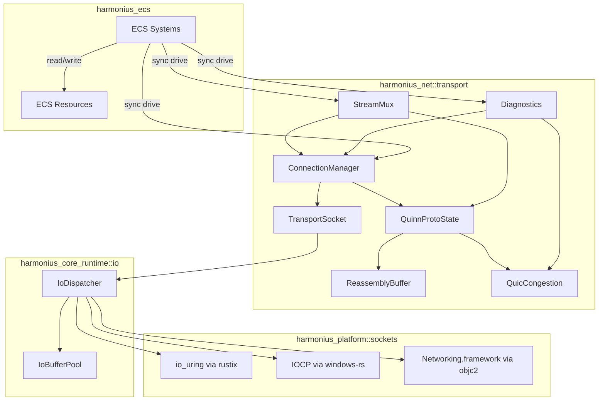

### Replication Module Boundaries

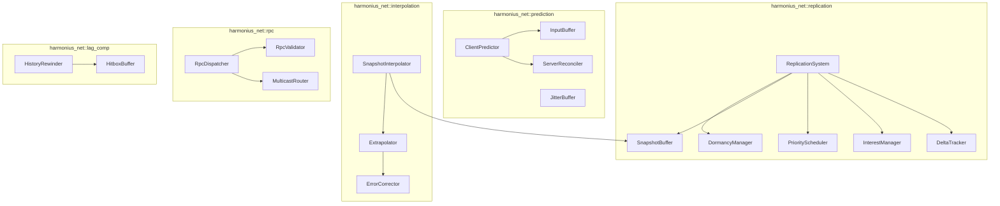

### File Layout

```text
harmonius_net/
+-- transport/
|   +-- socket.rs        # TransportSocket (sync API)
|   +-- connection.rs    # ConnectionManager, Connection
|   +-- handshake.rs     # QUIC handshake driving
|   +-- stream.rs        # StreamMux, StreamId, mode
|   +-- quinn_driver.rs  # quinn-proto sans-io driver
|   +-- reassembly.rs    # Large-packet reassembly buffer
|   +-- congestion.rs    # QUIC congestion metrics view
|   +-- codec.rs         # Typed payload encode/decode
|   +-- stats.rs         # NetStatsResource, RTT, loss
|   +-- systems.rs       # ECS sync systems (drain, events)
|   +-- config.rs        # TransportConfig, platform defs
|   +-- error.rs         # NetworkError variants
+-- replication/
|   +-- system.rs        # ReplicationSystem, tick loop
|   +-- delta.rs         # DeltaTracker, Baseline
|   +-- interest.rs      # InterestManager, AOI
|   +-- priority.rs      # PriorityScheduler
|   +-- snapshot.rs      # SnapshotBuffer, Snapshot
|   +-- dormancy.rs      # DormancyManager
|   +-- schema.rs        # SchemaRegistry, SchemaVersion
+-- prediction/
|   +-- predictor.rs     # ClientPredictor
|   +-- reconciler.rs    # ServerReconciler
|   +-- input_buffer.rs  # InputBuffer, TimestampedInput
|   +-- jitter_buffer.rs # JitterBuffer
+-- interpolation/
|   +-- interpolator.rs  # SnapshotInterpolator
|   +-- extrapolator.rs  # Extrapolator
|   +-- error_correct.rs # ErrorCorrector
+-- rpc/
|   +-- dispatcher.rs    # RpcDispatcher
|   +-- validator.rs     # RpcValidator, RateLimiter
|   +-- multicast.rs     # MulticastRouter
|   +-- registry.rs      # RpcRegistry, RpcDefinition
+-- lag_comp/
    +-- rewinder.rs      # HistoryRewinder
    +-- hitbox_buffer.rs # HitboxBuffer, HitboxSnapshot
```

### Connection Handshake

Three-phase protocol running on top of the QUIC handshake (R-8.1.1, R-8.1.5). QUIC's own stateless
retry and TLS 1.3 certificate exchange make Phase 1 anti-flood-safe without a custom cookie. The
engine then layers application authentication and stream palette setup.

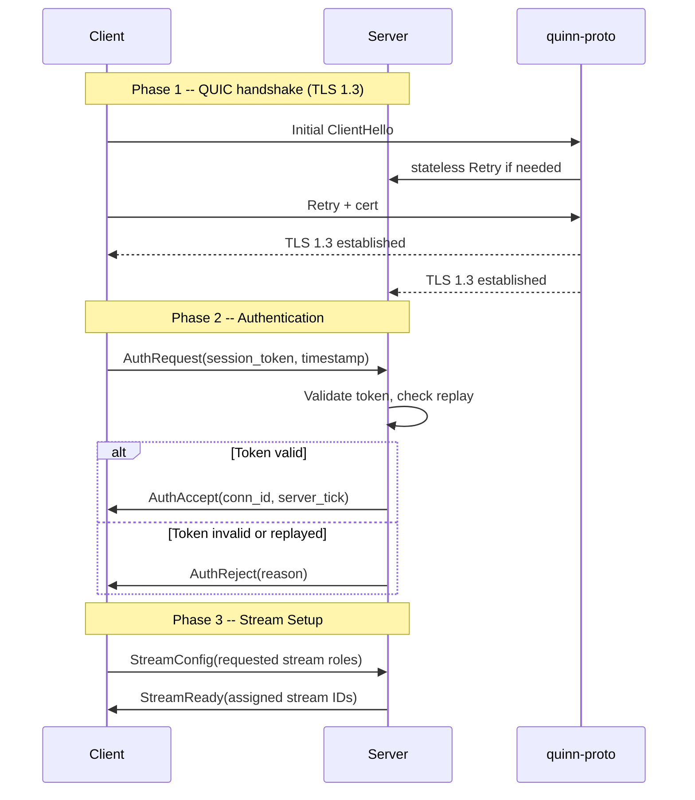

Anti-flood: QUIC stateless Retry blocks unauthenticated allocation. Replay resistance: monotonic
timestamp with sliding window validated by the server after Phase 2.

### Connection State Machine

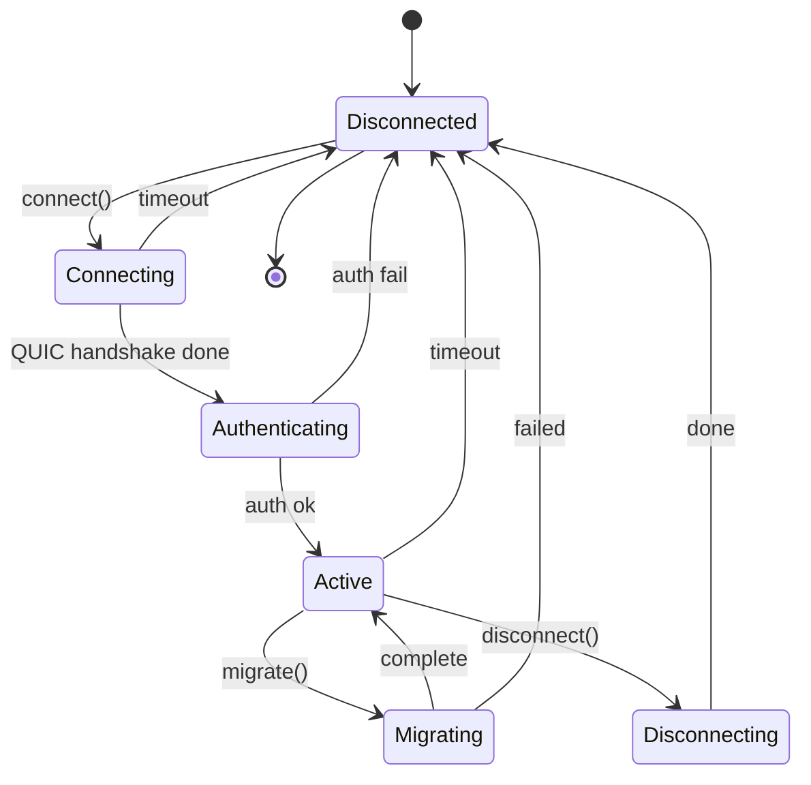

### Channel Architecture

Harmonius exposes four logical stream classes per connection. Each class maps to native QUIC streams
(reliable) or QUIC datagrams (unreliable).

| Mode | Reliable | Ordered | QUIC Primitive | Use Case |
|------|----------|---------|----------------|----------|
| ReliableOrdered | Yes | Yes | QUIC bidi stream | Inventory, quests, chat |
| ReliableUnordered | Yes | No | QUIC uni stream | Entity spawns, config |
| UnreliableSequenced | No | Seq | QUIC datagram + seq tag | Position updates, input |
| UnreliableUnordered | No | No | QUIC datagram | Voice, VFX triggers |

### Stream Multiplexing Policy

Each connection opens a fixed palette of streams on handshake, so worker systems can reference them
by compile-time `StreamRole` constants instead of allocating dynamically. Defaults:

| Role | Class | Count | Purpose |
|-----------------------|----------------------|-------|------------------------------|
| `GameplayReliable` | ReliableOrdered | 4 | RPCs, quests, inventory |
| `WorldReliable` | ReliableUnordered | 4 | Entity spawns, config sync |
| `StateUnreliableSeq` | UnreliableSequenced | 8 | Snapshots, positions, input |
| `VoiceUnreliable` | UnreliableUnordered | 8 | Voice, VFX, ephemeral events |

The engine total is 24 streams per connection by default, well below the QUIC default peer limit of
100. Stream counts can be overridden per game in `TransportConfig`.

1. **Per-stream flow control.** QUIC's built-in per-stream credit window is used unchanged.
   `quinn-proto` raises `MaxStreamData` as the ECS reader drains bytes each frame. No custom
   flow-control layer on top.
2. **Back-pressure via MPSC credit.** When workers enqueue `SendToken`s faster than the main thread
   drains them, the outbound command channel (`crossbeam::channel::bounded`, capacity
   `max_send_tokens`) blocks enqueues and returns `NetworkError::SendQueueFull` on `try_send`.
   Systems treat that error as a deterministic signal to drop lower-priority state.
3. **Fairness via weighted round-robin.** The main-thread driver visits streams in a weighted
   round-robin: `StateUnreliableSeq` weight 4, `GameplayReliable` weight 2, others weight 1. Weights
   are constants in `TransportConfig`. Round-robin eliminates starvation without HashMap lookups.
4. **Static ordering.** Stream roles are declared statically so ECS systems dispatch via
   `DispatchTable<F>` (see core-runtime/primitives.md) rather than hashing role strings.

### Congestion Control

Game-oriented BBR-inspired algorithm prioritizing smooth throughput over maximum utilization
(R-8.1.7).

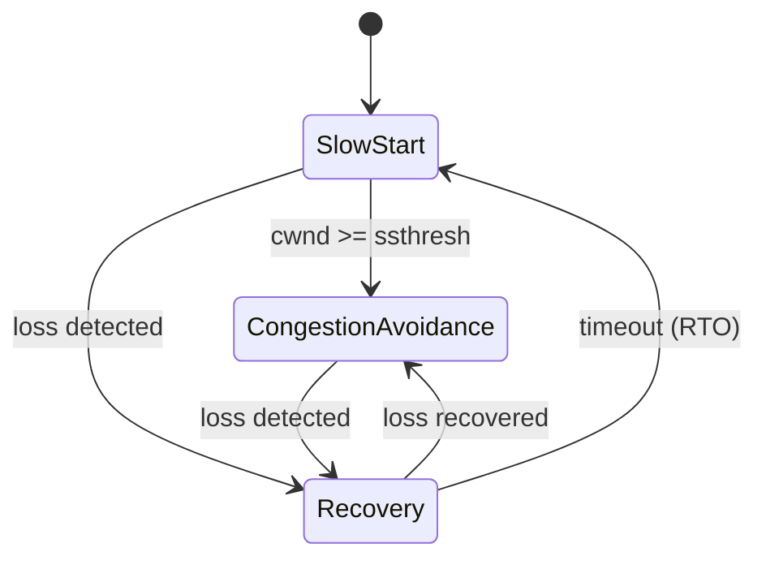

| Phase | Cwnd Update |
|-------|-------------|
| SlowStart | +1 MSS per ack |
| CongestionAvoidance | +1 MSS per RTT |
| Recovery | cwnd = cwnd * 0.7 |

### Server Replication Tick

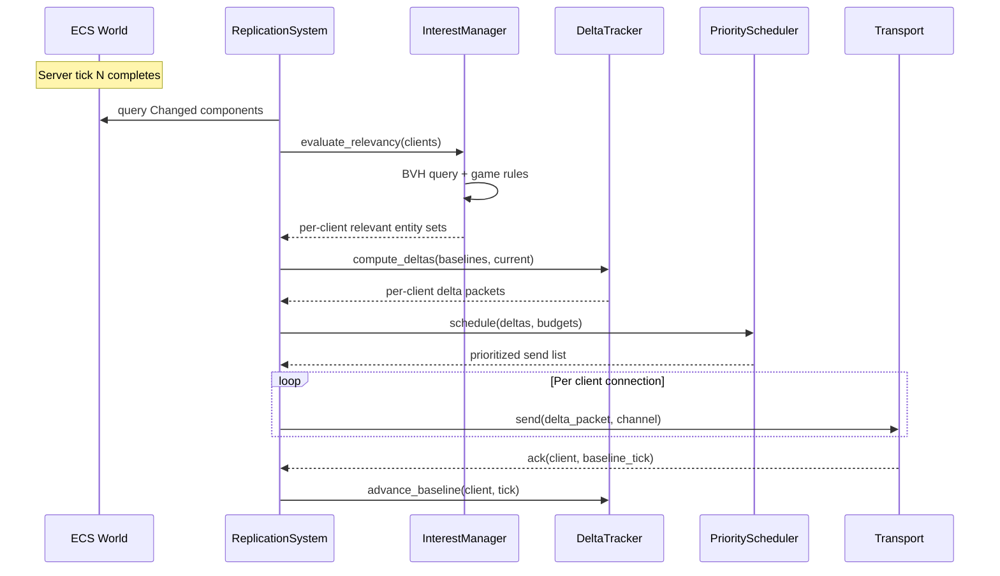

### Client Prediction and Reconciliation

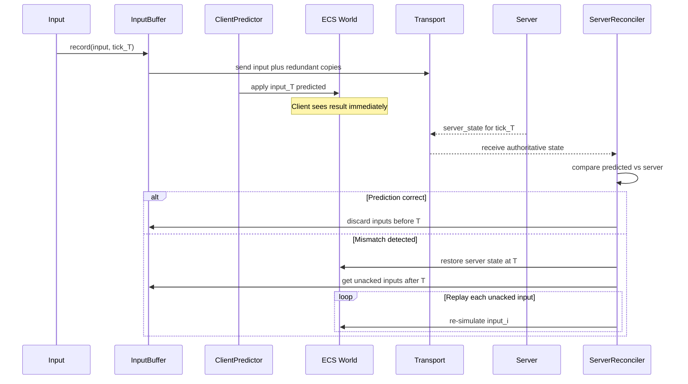

### Hitbox Rewinding (Lag Compensation)

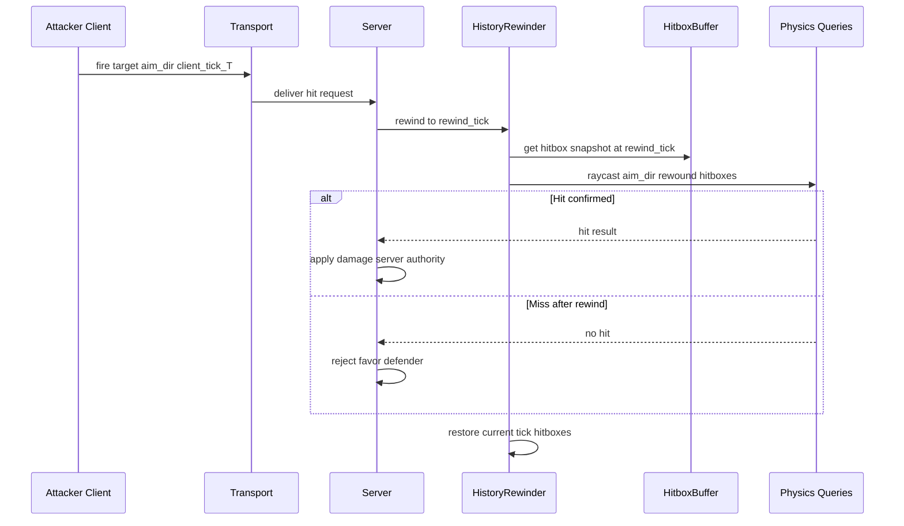

### Entity Lifecycle (Reconciliation Edge Cases)

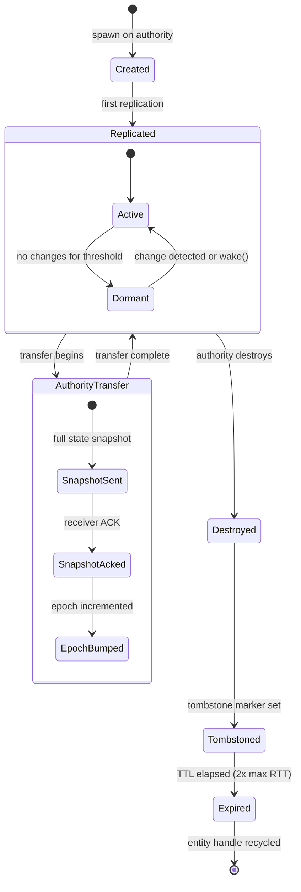

### Core Data Structures

```mermaid
classDiagram
    class TransportSocket {
        -handle: SocketHandle
        -quinn: QuinnProtoState
        -outbox: Sender~IoRequest~
        -inbox: Receiver~IoResponse~
        +bind(addr) Result~SocketHandle, NetworkError~
        +sendto(handle, addr, data) Result~SendToken, NetworkError~
        +poll_received(handle) Vec~Datagram~
        +poll_connections(handle) Vec~ConnectionEvent~
        +close(handle)
    }

    class ConnectionManager {
        -connections: SortedVecMap~ConnectionId, Connection~
        -pending: SortedVecMap~Token, HandshakeState~
        -timeout_wheel: TimingWheel
        -config: TransportConfig
        +connect(addr, token) Result~ConnectionId, NetworkError~
        +disconnect(id)
        +poll_events() Vec~ConnectionEvent~
        +poll_timeouts() SmallVec~ConnectionId~
    }

    class Connection {
        -id: ConnectionId
        -remote_addr: SocketAddr
        -state: ConnectionState
        -quinn_conn: QuinnConnectionHandle
        -streams: StreamMux
        -stats: ConnectionStats
    }

    class StreamMux {
        -reliable_ordered: SmallVec~StreamId; 4~
        -reliable_unordered: SmallVec~StreamId; 4~
        -unreliable_sequenced: SmallVec~StreamId; 8~
        -unreliable_unordered: SmallVec~StreamId; 8~
        +open(mode) StreamId
        +send(stream, payload) Result~SendToken, NetworkError~
        +drain(stream) Vec~Payload~
    }

    class QuinnProtoState {
        -endpoint: EndpointState
        -connections: SortedVecMap~ConnectionId, ConnState~
        +handle_datagram(data, from)
        +poll_transmit() SmallVec~Transmit; 16~
        +poll_events() SmallVec~Event; 16~
        +update_timers(now_ms)
    }

    class QuicCongestion {
        -cwnd_bytes: u32
        -bytes_in_flight: u32
        -recovery: bool
        +view() CongestionSnapshot
    }

    class ReassemblyBuffer {
        -pending: SortedVecMap~GroupId, FragmentGroup~
        -max_age_ms: u32
        -seen_ids: FixedBitSet
        +push(fragment) Option~Payload~
        +expire(now_ms)
    }

    class NetStatsResource {
        -rtt: Duration
        -rtt_variance: Duration
        -packet_loss_pct: f32
        -jitter: Duration
        -bandwidth_up: u64
        -bandwidth_down: u64
        -stability_score: f32
    }

    class TimingWheel {
        -slots: Vec~SmallVec~ConnectionId; 4~~
        -current_slot: u32
        +schedule(id, delay)
        +cancel(id)
        +tick() SmallVec~ConnectionId; 4~
    }

    class ReplicationSystem {
        -delta_tracker: DeltaTracker
        -interest_mgr: InterestManager
        -scheduler: PriorityScheduler
        -snapshot_buf: SnapshotBuffer
        -dormancy_mgr: DormancyManager
        +tick(world, transport)
        +on_client_ack(client, tick)
    }

    class DeltaTracker {
        -baselines: SortedVecMap~ClientId, Baseline~
        -schema_registry: SchemaRegistry
        +compute_delta(client, entity) DeltaPayload
        +advance_baseline(client, ack_tick)
    }

    class InterestManager {
        -tiers: InterestTiers
        -grid_ref: Handle~NetGrid~
        -hysteresis_pct: f32
        +evaluate(client, world) RelevantSet
    }

    class PriorityScheduler {
        -bandwidth_budget: u32
        +schedule(deltas, budget) Vec~ScheduledDelta~
    }

    class SnapshotBuffer {
        -ring: RingBuffer~Snapshot~
        +push(snapshot)
        +get_bracketing(time) Option~SnapshotPair~
        +get_at(tick) Option~Snapshot~
    }

    class DormancyManager {
        -dormant: SortedVecMap~Entity, Tick~
        -threshold: Duration
        +check_dormancy(entity, last_change) bool
        +wake(entity)
    }

    class ClientPredictor {
        -input_buffer: InputBuffer
        -predicted: SortedVecMap~Entity, PredictedState~
        +predict(input, world)
    }

    class ServerReconciler {
        +reconcile(server, predicted, world)
        +replay(inputs, world)
    }

    class SnapshotInterpolator {
        -interp_delay: Duration
        +interpolate(a, b, alpha) Pose
    }

    class Extrapolator {
        -max_extrap: Duration
        +extrapolate(snapshot, dt) Pose
    }

    class ErrorCorrector {
        -decay_rate: f32
        -current_error: Vec3
        +apply_correction(error)
        +tick() Vec3
    }

    class JitterBuffer {
        -buffer: SortedVecMap~SequenceTick, Snapshot~
        -target_depth: Duration
        +insert(snapshot, tick)
        +release() Option~Snapshot~
        +adapt(jitter_estimate)
    }

    class HistoryRewinder {
        -hitbox_buffer: HitboxBuffer
        -max_rewind: Duration
        +rewind(tick) HitboxSnapshot
        +restore()
    }

    class HitboxBuffer {
        -ring: RingBuffer~HitboxSnapshot~
        +record(tick, hitboxes)
        +get(tick) Option~HitboxSnapshot~
    }

    class RpcDispatcher {
        -handlers: DispatchTable~RpcHandlerFn~
        -validator: RpcValidator
        +register(rpc_id, handler, mode)
        +emit_server_event(rpc_id, params, sender)
        +invoke_client(target, rpc_id, params) SendToken
        +invoke_multicast(filter, rpc_id, params) SendToken
    }

    class RpcValidator {
        -rate_limiters: SortedVecMap~RpcId, RateLimiter~
        +validate(rpc_id, params, sender) Result
    }

    class MulticastRouter {
        +resolve(filter, world) Vec~ClientId~
    }

    class Tombstone {
        +destroyed_at: SequenceTick
        +expires_at: SequenceTick
        +epoch: AuthorityEpoch
    }

    class AuthorityEpoch {
        +u64 value
        +next() AuthorityEpoch
        +supersedes(other) bool
    }

    class AuthorityShard {
        +authority: NetworkAuthority
        +epoch: AuthorityEpoch
        +frozen: bool
    }

    class PhysicsTransferSnapshot {
        +position: Vec3
        +rotation: Quat
        +linear_velocity: Vec3
        +angular_velocity: Vec3
        +tick: SequenceTick
        +new_epoch: AuthorityEpoch
    }

    class ReplicationOp {
        +entity: Entity
        +priority: ReplicationOpPriority
        +tick: SequenceTick
        +payload: ReplicationOpPayload
    }

    ConnectionManager *-- Connection
    Connection *-- StreamMux
    Connection *-- ConnectionStats
    StreamMux --> QuinnProtoState
    ConnectionManager --> TransportSocket
    TransportSocket --> QuinnProtoState
    TransportSocket --> ReassemblyBuffer
    QuinnProtoState --> QuicCongestion
    ConnectionStats --> NetStatsResource
    ReplicationSystem *-- DeltaTracker
    ReplicationSystem *-- InterestManager
    ReplicationSystem *-- PriorityScheduler
    ReplicationSystem *-- SnapshotBuffer
    ReplicationSystem *-- DormancyManager
    ClientPredictor --> ServerReconciler
    SnapshotInterpolator --> Extrapolator
    Extrapolator --> ErrorCorrector
    HistoryRewinder *-- HitboxBuffer
    RpcDispatcher *-- RpcValidator
    RpcDispatcher --> MulticastRouter
    JitterBuffer ..> SnapshotBuffer
    Tombstone --> AuthorityEpoch
    AuthorityShard --> AuthorityEpoch
    PhysicsTransferSnapshot --> AuthorityEpoch
```

### Sync Driver Architecture

`quinn-proto` is a sans-io QUIC state machine: it consumes inbound datagrams via `handle_datagram()`
and produces outbound datagrams via `poll_transmit()`, producing streams and events via
`poll_events()`. The engine wraps it with platform-native sockets and drives the whole stack from
the main thread each frame. No thread performs blocking I/O; no thread suspends on futures.

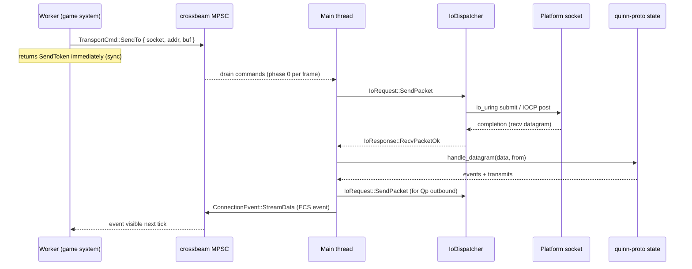

Each frame the main thread executes exactly this loop:

1. Drain worker-submitted `TransportCmd` from the outbound MPSC.
2. Submit platform-native socket I/O via `IoDispatcher` (see
   [core-runtime/io.md](../core-runtime/io.md)).
3. Poll platform completions; for every inbound datagram call `quinn_proto.handle_datagram()`.
4. Call `quinn_proto.poll_transmit()` until empty and hand each datagram back to `IoDispatcher`.
5. Call `quinn_proto.poll_events()` and translate to `ConnectionEvent` values (stream open, stream
   data, datagram, close, loss).
6. Update `TimingWheel` and call `quinn_proto.update_timers(now_ms)`.
7. Publish `ConnectionEvent`s to ECS event channels that worker systems read next tick.

Every step above is synchronous Rust code: no suspensions, no futures, no async runtime.

## API Design

### Transport Core Types

```rust
/// Protocol magic number for Harmonius transport.
const PROTOCOL_ID: u16 = 0x484E; // "HN"

/// Opaque connection identifier.
#[derive(
    Clone, Copy, Debug, PartialEq, Eq,
    Hash, PartialOrd, Ord, Reflect,
)]
pub struct ConnectionId(pub u16);

/// Legacy logical-channel identifier (`ChannelId`) is retained as a thin
/// alias over `StreamId` so older call sites compile unchanged.
/// New code must reference `StreamId` directly.
pub type ChannelId = StreamId;

/// 16-bit wrapping sequence number.
#[derive(
    Clone, Copy, Debug, PartialEq, Eq,
    Hash, Reflect,
)]
pub struct SequenceNumber(pub u16);

impl SequenceNumber {
    pub fn is_newer_than(
        self,
        other: SequenceNumber,
    ) -> bool {
        let diff = self.0.wrapping_sub(other.0);
        diff > 0 && diff < 32768
    }

    pub fn next(self) -> SequenceNumber {
        SequenceNumber(self.0.wrapping_add(1))
    }
}

/// Fragment metadata packed into 2 bytes.
#[derive(
    Clone, Copy, Debug, PartialEq, Eq, Reflect,
)]
pub struct FragmentInfo {
    pub index: u8,
    pub total: u8,
}

/// Channel delivery mode.
#[derive(
    Clone, Copy, Debug, PartialEq, Eq,
    Hash, Reflect,
)]
pub enum ChannelMode {
    ReliableOrdered,
    ReliableUnordered,
    UnreliableSequenced,
    UnreliableUnordered,
}

/// Packet types in the transport protocol.
#[derive(
    Clone, Copy, Debug, PartialEq, Eq,
    Hash, Reflect,
)]
#[repr(u8)]
pub enum PacketType {
    ClientHello = 0x01,
    HelloRetry = 0x02,
    AuthRequest = 0x03,
    AuthAccept = 0x04,
    AuthReject = 0x05,
    ChannelConfig = 0x06,
    ChannelReady = 0x07,
    Data = 0x10,
    Ack = 0x11,
    Fragment = 0x12,
    Heartbeat = 0x20,
    Disconnect = 0x21,
    DisconnectAck = 0x22,
    MtuProbe = 0x30,
    MtuProbeAck = 0x31,
}

/// Wire format: 16 bytes total.
#[derive(Clone, Copy, Debug, Reflect)]
pub struct PacketHeader {
    pub protocol_id: u16,
    pub connection_id: ConnectionId,
    pub packet_type: PacketType,
    pub channel_id: ChannelId,
    pub sequence: SequenceNumber,
    pub ack: SequenceNumber,
    pub ack_bitfield: u32,
    pub fragment_info: FragmentInfo,
}

/// Connection lifecycle state.
#[derive(
    Clone, Copy, Debug, PartialEq, Eq,
    Hash, Reflect,
)]
pub enum ConnectionState {
    Disconnected,
    Connecting,
    Authenticating,
    Active,
    Migrating,
    Disconnecting,
}

/// Congestion control state.
#[derive(
    Clone, Copy, Debug, PartialEq, Eq, Reflect,
)]
pub enum CongestionState {
    SlowStart,
    CongestionAvoidance,
    Recovery,
}

/// Wire TLS / QUIC handshake state mirrored from `quinn-proto` or the
/// native QUIC stack. Used only for diagnostics; the actual state machine
/// lives inside the underlying QUIC driver.
#[derive(
    Clone, Copy, Debug, PartialEq, Eq, Reflect,
)]
pub enum QuicHandshakeState {
    Initial,
    Handshaking,
    Established,
    Rekeying,
    Closed,
}

/// Platform-specific QUIC driver handle. Each variant wraps a synchronous
/// state machine that the main thread drains once per frame.
pub enum QuicDriver {
    #[cfg(any(target_os = "linux", target_os = "android"))]
    QuinnProto(QuinnProtoState),
    #[cfg(target_os = "windows")]
    QuinnProtoWin(QuinnProtoState),
    #[cfg(any(target_os = "macos", target_os = "ios"))]
    NetworkFramework(NetworkFrameworkState),
}

/// Network events for diagnostics.
#[derive(Clone, Debug, Reflect)]
pub enum NetEventKind {
    Connected,
    Disconnected { reason: DisconnectReason },
    LatencySpike { rtt: Duration },
    PacketLossBurst { loss_pct: f32 },
    Timeout,
    Reconnected,
    KeyRotation,
    MtuChanged { old: u16, new: u16 },
}

#[derive(
    Clone, Copy, Debug, PartialEq, Eq, Reflect,
)]
pub enum DisconnectReason {
    Graceful,
    Timeout,
    AuthFailed,
    Kicked,
    MigrationFailed,
    ProtocolError,
}

/// Canonical networking error. All sync transport APIs return
/// `Result<_, NetworkError>`.
#[derive(Clone, Debug, PartialEq, Eq, Reflect)]
pub enum NetworkError {
    BindFailed { addr: SocketAddr, code: i32 },
    ConnectionLimitReached { max: u32 },
    ConnectionNotFound { id: ConnectionId },
    StreamNotFound { id: StreamId },
    StreamLimitReached,
    HandshakeTimeout,
    AuthRejected { reason: String },
    TlsError { detail: String },
    QuicError { detail: String },
    InvalidPacket { detail: String },
    PayloadTooLarge { size: usize, max: usize },
    FragmentTimeout { group: FragmentGroupId },
    SendQueueFull,
    SendFailed { code: i32 },
    RecvFailed { code: i32 },
    ConnectionTimeout { id: ConnectionId },
    ReplayDetected,
}

/// Legacy alias retained for incremental migration of call sites; all
/// new code must reference `NetworkError`.
pub type TransportError = NetworkError;
```

### Sync Transport API

All public transport operations are synchronous. A call either returns an immediate value or a
handle the worker can use to read completions next frame. No method returns a future, and no method
is declared as an asynchronous function.

```rust
use crate::ids::{ConnectionId, StreamId};
use crate::primitives::{Handle, SortedVecMap, SmallVec};
use core_runtime::io::{IoRequest, IoResponse, SocketHandle};
use std::net::SocketAddr;

/// Opaque token handed back from `sendto` and stream-send operations. The
/// worker system can match it against a later `NetSent` event to learn the
/// send completed on the wire.
#[derive(Copy, Clone, Eq, PartialEq, Hash)]
pub struct SendToken(pub u64);

/// A raw inbound UDP datagram delivered to the main thread before QUIC
/// decoding. Workers rarely see these directly — they arrive through the
/// stream APIs instead.
pub struct Datagram {
    pub from: SocketAddr,
    pub payload: SmallVec<[u8; 1280]>,
}

/// Events the main thread surfaces to worker systems after draining
/// `quinn-proto`. These are published via the ECS event channel.
pub enum ConnectionEvent {
    Connected { id: ConnectionId },
    HandshakeFailed { reason: NetworkError },
    StreamOpened { id: ConnectionId, stream: StreamId },
    StreamData { id: ConnectionId, stream: StreamId, bytes: SmallVec<[u8; 1280]> },
    DatagramRecv { id: ConnectionId, bytes: SmallVec<[u8; 1280]> },
    StreamClosed { id: ConnectionId, stream: StreamId },
    Disconnected { id: ConnectionId, reason: DisconnectReason },
    FragmentTimeout { id: ConnectionId, group: FragmentGroupId },
    RttUpdated { id: ConnectionId, rtt_us: u32 },
}

/// The game-facing socket. A single `TransportSocket` owns one QUIC
/// endpoint; the main thread holds the underlying `quinn-proto` state and
/// drives it from the per-frame I/O drain.
pub struct TransportSocket {
    handle: SocketHandle,
    outbox: crossbeam_channel::Sender<TransportCmd>,
    inbox: crossbeam_channel::Receiver<ConnectionEvent>,
}

impl TransportSocket {
    /// Synchronously bind a local endpoint on the main thread. Returns a
    /// socket handle that can be used to send / receive, or a
    /// `NetworkError` if the bind failed. Runs synchronously: the main
    /// thread submits the bind via `IoDispatcher` and blocks until the
    /// platform returns the handle (typical latency < 1 ms because the
    /// call is platform-local).
    pub fn bind(addr: SocketAddr) -> Result<SocketHandle, NetworkError> {
        unimplemented!()
    }

    /// Enqueue a send. Returns immediately with a `SendToken` the caller
    /// can match against a later `ConnectionEvent::NetSent`. The send
    /// itself executes on the main thread on the next frame drain.
    pub fn sendto(
        &self,
        handle: SocketHandle,
        addr: SocketAddr,
        data: &[u8],
    ) -> Result<SendToken, NetworkError> {
        unimplemented!()
    }

    /// Drain datagrams received but not yet decoded by QUIC. Normal
    /// systems use `poll_connections` instead; this hook exists for
    /// raw-datagram games and tooling. Runs in O(n) over the pending
    /// queue; returns an empty Vec when nothing is pending.
    pub fn poll_received(&self, handle: SocketHandle) -> Vec<Datagram> {
        unimplemented!()
    }

    /// Drain all decoded connection events (stream data, handshake
    /// progress, losses, closes) queued since the last call. Called
    /// exactly once per frame by the networking ECS system. Completes
    /// synchronously: the call returns the moment the queue is drained.
    pub fn poll_connections(&self, handle: SocketHandle) -> Vec<ConnectionEvent> {
        unimplemented!()
    }

    pub fn close(&self, handle: SocketHandle) { unimplemented!() }
}

/// Command variant enqueued by workers and drained by the main thread.
pub enum TransportCmd {
    Bind {
        addr: SocketAddr,
        reply: crossbeam_channel::Sender<Result<SocketHandle, NetworkError>>,
    },
    Connect {
        socket: SocketHandle,
        addr: SocketAddr,
        token: [u8; 64],
    },
    SendDatagram {
        socket: SocketHandle,
        addr: SocketAddr,
        token: SendToken,
        data: SmallVec<[u8; 1280]>,
    },
    OpenStream {
        id: ConnectionId,
        role: StreamRole,
        reply: crossbeam_channel::Sender<StreamId>,
    },
    SendStream {
        id: ConnectionId,
        stream: StreamId,
        token: SendToken,
        data: SmallVec<[u8; 1280]>,
    },
    CloseStream {
        id: ConnectionId,
        stream: StreamId,
    },
    Disconnect {
        id: ConnectionId,
    },
}

/// Static palette of stream roles — mapped at handshake time to
/// `StreamId` values that the ECS code references via `DispatchTable`.
#[derive(Clone, Copy, Eq, PartialEq, Hash)]
pub enum StreamRole {
    GameplayReliable(u8),
    WorldReliable(u8),
    StateUnreliableSeq(u8),
    VoiceUnreliable(u8),
}

/// Identifies a logical QUIC stream. Opaque; workers use `StreamRole` to
/// resolve roles back to ids.
#[derive(Copy, Clone, Eq, PartialEq, Hash)]
pub struct StreamId(pub u32);

/// Synchronous connection manager. All methods are sync.
pub struct ConnectionManager {
    connections: SortedVecMap<ConnectionId, Connection>,
    pending: SortedVecMap<AuthToken, HandshakeState>,
    timeout_wheel: TimingWheel,
    config: TransportConfig,
}

impl ConnectionManager {
    /// Initiate an outbound connection. Returns the `ConnectionId`
    /// immediately; the handshake is driven over subsequent frames on the
    /// main thread and publishes `ConnectionEvent::Connected` (or
    /// `HandshakeFailed`) when it completes. Fully synchronous — the
    /// caller never suspends.
    pub fn connect(
        &mut self,
        addr: SocketAddr,
        token: AuthToken,
    ) -> Result<ConnectionId, NetworkError> {
        unimplemented!()
    }

    pub fn disconnect(&mut self, id: ConnectionId) { unimplemented!() }

    /// Drain queued connection lifecycle events. Called once per frame.
    pub fn poll_events(&mut self) -> Vec<ConnectionEvent> { unimplemented!() }

    /// Expire pending handshakes and idle connections whose timers fired
    /// this frame.
    pub fn poll_timeouts(&mut self) -> SmallVec<[ConnectionId; 4]> {
        unimplemented!()
    }
}

/// Opaque session auth token (signed JWT-like payload).
#[derive(Clone, Debug, PartialEq, Eq)]
pub struct AuthToken(pub [u8; 64]);

pub struct HandshakeState {
    pub connection_id: ConnectionId,
    pub started_at_ms: u64,
    pub phase: QuicHandshakeState,
}
```

### Replication Core Types

```rust
/// Monotonically increasing server tick counter.
#[derive(
    Clone, Copy, Debug, PartialEq, Eq,
    PartialOrd, Ord, Hash, Reflect, Serialize,
)]
pub struct SequenceTick(pub u32);

/// Unique identifier for a connected client.
#[derive(
    Clone, Copy, Debug, PartialEq, Eq,
    Hash, Reflect, Serialize,
)]
pub struct ClientId(pub u32);

/// Unique identifier for a registered RPC.
#[derive(
    Clone, Copy, Debug, PartialEq, Eq,
    Hash, Reflect, Serialize,
)]
pub struct RpcId(pub u32);

/// Component type identifier in the schema.
#[derive(
    Clone, Copy, Debug, PartialEq, Eq,
    Hash, Reflect, Serialize,
)]
pub struct ComponentId(pub u32);

/// Marks an entity for network replication.
#[derive(Component, Reflect)]
pub struct Replicated;

/// Identifies which client owns this entity.
#[derive(Component, Reflect)]
pub struct NetworkOwner {
    pub client: ClientId,
}

/// Network authority model.
#[derive(
    Component, Clone, Copy, Debug,
    PartialEq, Eq, Reflect,
)]
pub enum NetworkAuthority {
    Server,
    ClientAuthoritative { client: ClientId },
}

/// Property visibility levels.
#[derive(
    Clone, Copy, Debug, PartialEq, Eq, Reflect,
)]
pub enum PropertyVisibility {
    Public,
    OwnerOnly,
    TeamOnly,
}

/// Named property subsets for tiered replication.
#[derive(
    Clone, Copy, Debug, PartialEq, Eq, Reflect,
)]
pub enum PropertySet {
    Full,
    Movement,
    PositionOnly,
}

/// Distance-based replication tier.
#[derive(Clone, Debug, Reflect)]
pub struct ReplicationTier {
    pub max_distance: f32,
    pub update_rate_hz: f32,
    pub property_set: PropertySet,
}

/// Schema version for replicated components.
#[derive(
    Clone, Copy, Debug, PartialEq, Eq,
    Hash, Reflect, Serialize,
)]
pub struct SchemaVersion(pub u32);

/// Delta payload for one component on one entity.
#[derive(Clone, Debug, Serialize, Reflect)]
pub struct DeltaPayload {
    pub entity: Entity,
    pub component_id: ComponentId,
    pub tick: SequenceTick,
    pub changed_mask: u64,
    pub field_data: Vec<u8>,
}

/// Per-client connection state.
#[derive(Clone, Debug, Reflect)]
pub struct ClientConnection {
    pub client_id: ClientId,
    pub rtt: Duration,
    pub jitter: Duration,
    pub packet_loss: f32,
    pub bandwidth_budget: u32,
    pub platform: ClientPlatform,
    pub last_acked_tick: SequenceTick,
}

#[derive(
    Clone, Copy, Debug, PartialEq, Eq, Reflect,
)]
pub enum ClientPlatform {
    Desktop,
    Mobile,
    Console,
}

/// RPC reliability mode.
#[derive(
    Clone, Copy, Debug, PartialEq, Eq, Reflect,
)]
pub enum RpcReliability {
    Reliable,
    Unreliable,
    ReliableLatest,
}

/// Filter for multicast RPC recipients.
#[derive(Clone, Debug, Reflect)]
pub enum MulticastFilter {
    Spatial { center: Vec3, radius: f32 },
    Party { client: ClientId },
    Team { team_id: u32 },
    Raid { raid_id: u32 },
    Zone { zone_id: u32 },
    All { filters: Vec<MulticastFilter> },
}

/// Relevancy override rule.
#[derive(Clone, Debug, Reflect)]
pub enum RelevancyRule {
    AlwaysRelevant { filter: RelevancyFilter },
    NeverRelevant { filter: RelevancyFilter },
    CustomRadius { filter: RelevancyFilter, radius: f32 },
}

/// Relevancy filter combinators.
#[derive(Clone, Debug, Reflect)]
pub enum RelevancyFilter {
    SameParty,
    SameTeam,
    SameGuild,
    HasComponent { component_id: ComponentId },
    All { filters: Vec<RelevancyFilter> },
    Any { filters: Vec<RelevancyFilter> },
}

/// Monotonic authority epoch.
#[derive(
    Clone, Copy, Debug, PartialEq, Eq,
    PartialOrd, Ord, Hash, Reflect, Serialize,
)]
pub struct AuthorityEpoch(pub u64);

/// Structural replication operation priority.
#[derive(
    Clone, Copy, Debug, PartialEq, Eq,
    PartialOrd, Ord, Reflect,
)]
pub enum ReplicationOpPriority {
    EntityDestroy = 0,
    ComponentRemove = 1,
    ComponentAdd = 2,
    StateDelta = 3,
}

/// Playback speed for replays.
#[derive(
    Clone, Copy, Debug, PartialEq, Reflect,
)]
pub enum PlaybackSpeed {
    Paused,
    FrameByFrame,
    Quarter,
    Half,
    Normal,
    Double,
    Quad,
    Octa,
}

/// Player input.
#[derive(Clone, Debug, Reflect, Serialize)]
pub struct PlayerInput {
    pub movement: Vec3,
    pub aim_direction: Vec3,
    pub actions: SmallVec<[InputAction; 4]>,
}

#[derive(Clone, Debug, Reflect, Serialize)]
pub struct InputAction {
    pub action_id: u32,
    pub pressed: bool,
    pub value: f32,
}

/// Hitbox data for lag compensation.
#[derive(Clone, Reflect)]
pub struct HitboxData {
    pub position: Vec3,
    pub rotation: Quat,
    pub half_extents: Vec3,
}

/// Replication errors.
pub enum ReplicationError {
    UnregisteredComponent { component_id: ComponentId },
    SchemaIncompatible {
        server_version: SchemaVersion,
        client_version: SchemaVersion,
    },
    TransportError { detail: String },
}

/// RPC errors.
pub enum RpcError {
    ValidationFailed { error: RpcValidationError },
    NoHandler { rpc_id: RpcId },
    HandlerFailed { detail: String },
    TransportError { detail: String },
}

pub enum RpcValidationError {
    UnknownRpc { rpc_id: RpcId },
    TypeMismatch { field: String, expected: String, actual: String },
    OutOfRange { field: String, value: String, min: String, max: String },
    EntityNotFound { entity: Entity },
    PermissionDenied { sender: ClientId, entity: Entity },
    RateLimited { rpc_id: RpcId, retry_after: Duration },
    MalformedPayload { detail: String },
}

pub enum PredictionError {
    NotPredicted { entity: Entity },
    BufferFull { max_depth: u8 },
}
```

## Data Flow

### Outbound Packet Pipeline

1. Worker system calls `transport.send(stream, data)` — returns `SendToken` immediately (sync).
2. Call enqueues `TransportCmd::Send` into the bounded MPSC to the main thread.
3. Main thread drains the MPSC at phase 0 of the frame and routes to the matching `Stream`.
4. Reliable streams append to the quinn-proto stream buffer; unreliable queue a QUIC datagram.
5. `quinn_proto.poll_transmit()` produces outbound datagrams (encrypted via built-in TLS 1.3).
6. Each datagram is wrapped in `IoRequest::SendPacket` and handed to `IoDispatcher`.
7. The platform socket backend (io_uring / IOCP / Networking.framework) sends the datagram.
8. Completion arrives as `IoResponse::SendPacketOk`; `SendToken` is resolved and published as an ECS
   `NetSent` event that the originating system reads next tick.

### Inbound Packet Pipeline

1. `IoDispatcher` is submitted `IoRequest::RecvPacket` slots on every socket bind; the platform
   backend fills them as datagrams arrive.
2. Each completion produces `IoResponse::RecvPacketOk` which the main thread consumes synchronously.
3. `quinn_proto.handle_datagram(data, from)` decrypts and decodes the datagram; stream and datagram
   events are produced into `quinn_proto.poll_events()`.
4. Malformed or unauthenticated packets are dropped by quinn-proto — no custom decoding.
5. Stream bytes are appended to per-stream ring buffers owned by `StreamMux`.
6. Large TLV payloads that span multiple stream chunks are assembled by `ReassemblyBuffer`.
7. Completed payloads are published as `ConnectionEvent::StreamData` into the ECS event channel.
8. ACK/loss information is exposed through `quinn_proto.poll_events()` to update RTT statistics.

### Server Replication Tick Pipeline

1. Query `Changed<T>` components from ECS world (each replicated component type).
2. Evaluate interest via the networking grid, parallelized across worker threads.
3. Update dormancy tracking.
4. Compute per-client deltas via codegen `diff(&self, baseline)` (no runtime reflection).
5. Priority-schedule within per-client bandwidth budget.
6. Submit prioritized deltas via `transport.send(stream, payload)` (sync request/handle).
7. Record snapshot for lag compensation.

### Client Frame Pipeline

1. Drain `ConnectionEvent::StreamData` via `transport.poll_received()`.
2. Insert snapshots into the jitter buffer.
3. Release steady-cadence snapshots.
4. Reconcile server state against predictions.
5. Apply new local input (prediction).
6. Send input packet with redundancy via sync `transport.send()`.
7. Interpolate remote entities with error correction.

### Delta Compression Algorithm

Delta compression runs per replicated component, driven entirely by code generated at build time
from the codegen pipeline. No runtime reflection, no dynamic field dispatch.

```text
Baseline   = last component value acknowledged by this client
Current    = component value at the current server tick
Diff       = (changed_mask: u64, field_bytes: SmallVec<[u8; 64]>)
TLV frame  = [component_id: u32] [entity_id: u32] [changed_mask: u64] [field_bytes...]
```

1. **Field-level diffing.** The codegen-emitted `fn diff(&self, baseline: &Self) -> Diff` compares
   each `#[replicated]` field against the baseline with `PartialEq` and sets one bit in
   `changed_mask` per changed field. Only changed field bytes are appended.
2. **TLV frame packing.** The scheduler concatenates TLV frames for all entities that fit the
   per-client bandwidth budget into one reliable-unordered or unreliable-sequenced send.
3. **ACK-based baseline advance.** One baseline per `(client_id, entity_id, component_id)` is stored
   on the server. When the server receives a cumulative ACK for tick `T`, it advances the baseline
   to the corresponding snapshot. The algorithm is a simplified Valve-style delta (Bernier 2001)
   with QUIC streams replacing the reliable channel.
4. **Quantization.** Float fields may carry `#[quantize(min, max, bits)]` attributes; codegen emits
   `to_quantized` / `from_quantized` helpers that compress at diff time.
5. **Never exceed 64 fields per component.** The `u64 changed_mask` caps a replicated component at
   64 fields; larger structures split into sub-components.

Example trade delta for a `Health { hp: f32, max_hp: f32 }` component:

```text
baseline = { hp: 80.0, max_hp: 100.0 }
current  = { hp: 72.0, max_hp: 100.0 }

changed_mask = 0b01           // only `hp` changed
field_bytes  = [72.0 as le f32]
wire frame   = [HEALTH_ID][entity_id][0x01][72.0 as le f32]
```

Reference: Bernier, "Latency Compensating Methods" (2001) —
<https://developer.valvesoftware.com/wiki/Latency_Compensating_Methods_in_Client/Server_In-game_Protocol_Design_and_Optimization>

### Interest Management

Interest management decides which entities each client sees and how often. Thresholds are
distance-based with tiered update rates; hysteresis prevents thrashing at tier boundaries.

| Tier | Distance | Update rate | Property set | Rationale |
|------|----------|-------------|--------------|-----------|
| High | `<= 100 m` | 60 Hz | Full | Player combat radius |
| Medium | `100-500 m` | 20 Hz | Movement | Ambient world |
| Low | `500-2000 m` | 5 Hz | PositionOnly | Visible landmarks |
| Cull | `> 2000 m` | 0 Hz (dormant) | None | Not relevant |

1. **Distance computed via networking grid.** The shared networking grid stores entity positions in
   `UniformGrid<Entity>`. Per client, a sync function computes the cell ranges that fall inside each
   tier radius and enumerates entities in those cells.
2. **Hysteresis.** To avoid flapping when an entity oscillates around a tier boundary, tiers use
   `enter_distance < exit_distance`. An entity in the High tier does not downgrade until it is past
   `100 m + hysteresis_pct * 100 m`. Default `hysteresis_pct = 10%`.
3. **Sticky dormancy.** An entity that enters the Cull tier is marked dormant; the server stops
   allocating deltas until the entity moves within Low range again.
4. **Rule overrides.** `RelevancyRule` lets gameplay force entities to be always-relevant (party
   members, quest targets) or never-relevant (internal proxies).
5. **Deterministic ordering.** Interest evaluation iterates entities in `SortedVecMap` order so
   priority scheduling is deterministic across runs.

### Large-Packet Reassembly

QUIC handles datagram MTU fragmentation internally; however, custom TLV frames from the replication
layer may still need splitting when a single update exceeds the per-datagram payload budget. A sync
`ReassemblyBuffer` handles the out-of-order buffer, timeout, and duplicate detection.

| Parameter | Default | Notes |
|-----------|---------|-------|
| Out-of-order buffer depth | 64 fragments per group | `SmallVec<[Fragment; 64]>` |
| Group lifetime | 5 s | Drop partial groups after `max_age_ms = 5000` |
| Duplicate window | 1024 fragment IDs | `FixedBitSet` shifted by group |
| Fragment MTU hint | 1,200 B | Matches QUIC minimum MTU |

1. **Out-of-order buffer.** `ReassemblyBuffer::push(fragment)` inserts the fragment into the
   matching `FragmentGroup` by `GroupId`. Fragments arrive in any order; the group is complete when
   every expected index is present.
2. **Timeout.** Each `GroupId` records its `first_seen_ms`. On every frame the main thread calls
   `ReassemblyBuffer::expire(now_ms)` which evicts any group older than 5 s and emits a
   `ConnectionEvent::FragmentTimeout`.
3. **Duplicate detection.** A `FixedBitSet` of recently seen `(GroupId, FragmentIndex)` hashes
   filters duplicate fragments without allocations. Seen bits are cleared when the bitset wraps.
4. **Completion.** When the group is complete the `ReassemblyBuffer` returns the reassembled payload
   and clears the group entry.

All operations are synchronous and run on the main thread as part of the inbound data flow.

## Platform Considerations

### Socket I/O

All socket work runs on the main thread through `IoDispatcher`. Worker code never touches a socket
fd. No Tokio anywhere in this stack.

| Platform | QUIC implementation | Socket backend |
|----------|---------------------|----------------|
| Linux | `quinn-proto` (sans-io) | io_uring via `rustix` |
| Windows | MsQuic via `windows-rs` | IOCP via `windows-rs` |
| Apple (macOS/iOS) | Networking.framework `NWProtocolQUIC` via `objc2` | Networking.framework |
| Android | `quinn-proto` (sans-io) | io_uring (kernel >= 5.15) |

On Linux and Android the engine drives `quinn-proto` directly: the main-thread loop pulls raw
datagrams from the io_uring completion queue, calls `handle_datagram`, and hands `poll_transmit`
output back to the socket backend. On Windows the native MsQuic stack is driven synchronously via
`windows-rs` bindings; its callback surface is wrapped into `ConnectionEvent` values and delivered
through the same ECS channel. On Apple the native `NWProtocolQUIC` stack is used via
`objc2`-generated bindings and drained synchronously through `dispatch2` handles. The `quinn-proto`
path is retained as the portable reference implementation on all platforms.

### Transport Security

QUIC has TLS 1.3 built in; there is no separate DTLS stack.

| Platform | TLS implementation |
|----------|--------------------|
| Linux | `rustls` via `quinn-proto` |
| Windows | `rustls` via `quinn-proto` |
| Apple | TLS handled inside `Networking.framework` |

### Platform Defaults

| Parameter | Desktop | Mobile |
|-----------|---------|--------|
| Heartbeat interval | 1 s | 5 s |
| Connection timeout | 30 s | 60 s |
| Default MTU | 1,200 B | 1,200 B |
| Initial send rate | unlimited | 500 Kbps |
| Outbound MPSC capacity | 4,096 | 1,024 |
| AOI high tier radius | 100 m | 75 m |
| AOI medium tier radius | 500 m | 300 m |
| AOI low tier radius | 2,000 m | 1,000 m |
| Max rollback frames | 8 | 4 |
| Input redundancy | 3 | 6 |
| Interpolation delay | 1 tick | 2 ticks |
| Extrapolation window | 100 ms | 200 ms |
| Error correction decay | 0.3 | 0.5 |
| Jitter buffer depth | 1-3 ticks | 3-5 ticks |
| Bandwidth budget | 500+ KB/s | 50-100 KB/s |

### Proposed Dependencies

| Crate | Purpose |
|-------|---------|
| `quinn-proto` | Sans-io QUIC state machine (Linux/Windows/Android) |
| `rustls` | TLS 1.3 feeding `quinn-proto` |
| `rustix` | Safe io_uring and Linux syscall bindings |
| `windows-rs` | IOCP, Winsock2 |
| `objc2` + `dispatch2` | Networking.framework and GCD bindings |
| `smallvec` | Inline-allocated small vectors |
| `fixedbitset` | Duplicate detection bitsets |

## Safety Invariants

### System Access Sets (Medium)

Transport ECS systems must declare explicit `AccessSet` for `ConnectionStates` and `TransportStats`.
Sequential ordering enforced via explicit system dependencies.

### HitboxBuffer Rewinding (High)

`HistoryRewinder` operates on a read-only ring of immutable snapshots, never mutating live ECS
components.

## Test Plan

Test cases are in the companion file
[network-transport-test-cases.md](./network-transport-test-cases.md).

### Summary

| Category | Count | Coverage |
|----------|-------|----------|
| Unit tests | 63 | Transport, replication, RPC |
| Integration tests | 27 | End-to-end networking |
| Benchmarks | 19 | Latency, throughput, budget |

## Open Questions

1. **`quinn-proto` fork.** Do we pin an upstream version or maintain a light fork for custom
   datagram priorities? Tradeoff: maintenance burden vs priority control.
2. **Congestion algorithm.** Keep QUIC's bundled CUBIC or opt into BBR for mobile cellular links
   with bufferbloat.
3. **Maximum payload size.** 64 KiB (reassembled from QUIC streams) sufficient for zone snapshots,
   or should we split large snapshots across multiple frames?
4. **Connection ID size.** 16-bit limits 65,535 connections. Future scaling may need 32/64-bit IDs.
5. **Sequence number size.** 16-bit wraps in ~18 min at 60 pkt/sec. 32-bit adds 4 bytes per packet.
6. **Key rotation interval.** Proposed: 1 hour. Shorter limits exposure but increases CPU.
7. **Quantization precision.** Per-field `#[quantize]` attribute vs fixed per data type?
8. **Snapshot memory budget.** Server snapshot only hitbox data vs full component state?
9. **Prediction eligibility scope.** Extend to physics objects the player interacts with?
10. **Cross-entity rollback dependencies.** Topological sort vs full ECS schedule replay?
11. **Schema migration complexity.** Support field renames and type changes via migration functions?
12. **Dormancy threshold tuning.** Per-entity-type thresholds via component field vs global config?
13. **Stream palette size.** Should the default 24-stream palette be bumped for RTS games with high
    RPC counts, or stay fixed?

## Review Feedback

### RF-1: Platform-native synchronous I/O (completed)

**Status: Applied in this revision.** All transport APIs return values synchronously. Socket work is
scheduled via the `IoRequest` / `IoResponse` protocol in [core-runtime/io.md](../core-runtime/io.md)
and platform-native backends:

- Linux / Android: io_uring via `rustix` (UDP send/recv).
- Windows: IOCP via `windows-rs` (Winsock2 overlapped).
- Apple: Networking.framework via `objc2` / `dispatch2` (NWConnection UDP / QUIC).

Main thread polls completions and publishes `ConnectionEvent` values to ECS. No async runtime is
used anywhere in the game-side code path. The `quinn-proto` state machine is driven in-place from
the main thread.

### RF-2: Replace Reflect with codegen diff/patch

Delta compression uses codegen-generated field accessors:

```rust
// Generated per replicated component:
impl HealthComponent {
    fn diff(
        &self, baseline: &Self,
    ) -> (u64, Vec<u8>) {
        let mut mask = 0u64;
        let mut buf = Vec::new();
        if self.hp != baseline.hp {
            mask |= 1 << 0;
            buf.extend(self.hp.to_le_bytes());
        }
        if self.max_hp != baseline.max_hp {
            mask |= 1 << 1;
            buf.extend(self.max_hp.to_le_bytes());
        }
        (mask, buf)
    }

    fn patch(&mut self, mask: u64, data: &[u8]) {
        let mut cursor = 0;
        if mask & (1 << 0) != 0 {
            self.hp = f32::from_le_bytes(
                data[cursor..cursor+4].try_into().unwrap()
            );
            cursor += 4;
        }
        // ...
    }
}
```

Remove DynamicValue and Reflect dependencies entirely.

### RF-3: Create companion test cases file

Create `network-transport-test-cases.md` with the 109 claimed tests (63 unit + 27 integration + 19
benchmarks).

### RF-4: Use networking grid for interest management

The spatial index design specifies a grid for networking relevancy. Replace BVH-based interest
management with grid-based:

- Each client subscribes to grid cells near their position
- Cell transition: subscribe to new cells, unsubscribe old
- Entities in subscribed cells are replicated
- Update frequency by cell distance (same cell = 60 Hz, adjacent = 30 Hz, 2 away = 10 Hz)

Grid is simpler, predictable, and designed for networking. BVH is for gameplay/AI spatial queries.

### RF-5: Add 2D multiplayer support

Add Vec2 variants for spatial types:

- `PlayerInput.movement`: Vec2 for 2D games
- `HitboxData`: 2D shapes (circle, rect) alongside 3D
- `MulticastFilter::Spatial`: Vec2 center for 2D
- `ErrorCorrector`: Vec2 error for 2D interpolation

### RF-6: MMO sharding and layering

Support massive player counts via server-side sharding and player layering:

**Sharding (horizontal scaling):**

Each shard owns a spatial region of the world. Players crossing shard boundaries undergo entity
migration (similar to planet migration from Design #22 RF-10):

```text
Shard A (cells 0-99)
  → Player crosses boundary at cell 100
  → Entity serialized via rkyv
  → Transferred to Shard B (cells 100-199)
  → Deserialized, client redirected
```

Shards communicate via inter-shard messaging (server-to- server UDP or TCP) for cross-boundary
entity visibility and interest management.

**Layering (vertical scaling):**

Multiple instances ("layers") of the same world region run on different servers. Players in the same
area but different layers cannot see each other:

```rust
#[derive(Component)]
pub struct NetworkLayer {
    pub layer_id: u16,
    pub max_players: u16,
}
```

- When a layer exceeds capacity, overflow players are assigned to a new layer
- Players can request layer transfer (join friend)
- Layer merging: when population drops, merge layers
- Boss encounters: lock layer to prevent overflow

**Interest management across shards:**

- Entities near shard boundaries are replicated to both shards as "ghost" entities (read-only
  copies)
- Ghost entities receive delta updates from the owning shard via inter-shard channel
- Boundary width = interest radius (from grid cell size)

**Scaling targets:**

| Tier | Players/shard | Shards | Total |
|------|-------------|--------|-------|
| Small | 100 | 1 | 100 |
| Medium | 1,000 | 4 | 4,000 |
| Large | 5,000 | 16 | 80,000 |
| MMO | 10,000 | 100+ | 1M+ |

Sharding and layering are server-side concerns — clients connect to one shard and see one layer. The
transport layer handles redirect on shard transfer.

### RF-7: Document 64-field changed_mask limit

The `changed_mask: u64` caps replicated components at 64 fields. Document this as a hard limit.
Components with more than 64 fields should be split into sub-components.

### RF-8: Algorithm references

| Algorithm | Reference |
|-----------|-----------|
| SACK reliability | [RFC 2018](https://www.rfc-editor.org/rfc/rfc2018) |
| BBR congestion | [Cardwell et al. (2017)](https://queue.acm.org/detail.cfm?id=3022184) |
| ORCA interest | [van den Berg (2011)](https://gamma.cs.unc.edu/ORCA/publications/ORCA.pdf) |
| Delta compression | [Bernier, "Latency Compensating" (2001)](https://developer.valvesoftware.com/wiki/Latency_Compensating_Methods_in_Client/Server_In-game_Protocol_Design_and_Optimization) |
| Client prediction | [Fiedler, "Networked Physics" (2015)](https://gafferongames.com/post/networked_physics_in_virtual_reality/) |
| Snapshot interpolation | [Fiedler (2014)](https://gafferongames.com/post/snapshot_interpolation/) |
| State synchronization | [Fiedler (2015)](https://gafferongames.com/post/state_synchronization/) |

### RF-9: Quality of service and network optimization

**Adaptive send rate:**

Adjust replication frequency per client based on measured conditions:

| Condition | Response |
|-----------|----------|
| Low RTT, no loss | Max send rate (60 Hz) |
| Moderate RTT | Reduce to 30 Hz |
| High loss (> 5%) | Reduce rate + increase redundancy |
| Congestion detected | BBR backs off, reduce payload |
| Mobile/cellular | Cap at 20 Hz, smaller packets |

**Quantization:**

Reduce bandwidth by quantizing replicated fields:

```rust
#[derive(Component, Replicate)]
pub struct NetworkTransform {
    #[quantize(min = -1000.0, max = 1000.0, bits = 16)]
    pub position: Vec3,  // 6 bytes instead of 12
    #[quantize(smallest_three, bits = 10)]
    pub rotation: Quat,  // 4 bytes instead of 16
    #[quantize(min = 0.0, max = 20.0, bits = 8)]
    pub speed: f32,      // 1 byte instead of 4
}
```

Codegen generates quantize/dequantize from attributes. Total: 11 bytes vs 32 bytes (66% reduction).

**Priority-based bandwidth allocation:**

Each replicated entity has a priority score:

```text
priority = base_priority
         * distance_factor    // closer = higher
         * visibility_factor  // on-screen = higher
         * relevancy_factor   // interacting = higher
         * update_debt        // longer since update = higher
```

The replication scheduler fills each client's bandwidth budget with highest-priority entity updates
first. Low- priority entities may skip frames entirely.

**Packet batching:**

Multiple entity updates packed into single UDP packets up to MTU. Reduces per-packet overhead
(IP/UDP headers). Sort updates by priority so if packet is lost, the lowest priority data is at the
end.

**Jitter buffer tuning:**

Adaptive jitter buffer that adjusts interpolation delay based on measured jitter:

- Low jitter (< 5 ms): tight buffer, low latency
- High jitter (> 20 ms): wider buffer, smoother playback
- Spike detection: hold buffer size after spike, decay slowly

**Connection quality metrics:**

Expose to gameplay for UI and matchmaking:

```rust
pub struct ConnectionQuality {
    pub rtt_ms: f32,
    pub jitter_ms: f32,
    pub packet_loss_pct: f32,
    pub bandwidth_kbps: f32,
    pub quality_score: f32,  // 0-1 composite
}
```

Games can show connection quality indicator (green/yellow/red bars) and matchmaking can prefer
low-latency servers.

### RF-10: Server-client vs peer-to-peer networking

Support both models. The transport layer is model-agnostic — the authority and replication layers
adapt.

**Server-client (default):**

- Dedicated or listen server owns world state
- Clients send input, receive state updates
- Server-authoritative: server validates all actions
- Best for: competitive, MMO, large player counts
- Latency: client → server → client (1 RTT)

**Peer-to-peer:**

- No dedicated server — one peer is host, or fully distributed
- Host-authoritative: host peer validates actions
- Each peer replicates to all others (mesh topology) or host relays (star topology)

```rust
pub enum NetworkTopology {
    /// Dedicated or listen server. Clients connect to server.
    ClientServer {
        max_clients: u16,
    },
    /// One peer is host, others are clients. Host migrates
    /// on disconnect.
    HostMigrating {
        max_peers: u16,
    },
    /// All peers connected to all others. Lockstep or
    /// input-sharing.
    FullMesh {
        max_peers: u8, // limited by N² connections
    },
}
```

**Host migration (P2P):**

If the host disconnects:

1. Remaining peers elect new host (lowest latency or highest uptime)
2. New host receives world state from peers
3. Clients reconnect to new host
4. Brief pause (~1-2 seconds) during migration

**When to use which:**

| Game Type | Model | Why |
|-----------|-------|-----|
| MMO | Client-server (sharded) | Massive scale |
| Competitive FPS | Client-server (dedicated) | Anti-cheat |
| Co-op (2-4 players) | P2P host-migrating | No server cost |
| Fighting game | P2P full mesh + rollback | Minimal latency |
| Local multiplayer | N/A (same machine) | No network |

### RF-11: TCP and asset streaming

**No TCP for gameplay.** All real-time game traffic uses UDP with userspace reliability (RF-1).
TCP's head-of-line blocking and congestion backoff are unacceptable for real-time state.

**TCP for non-real-time:**

TCP is needed for:

- Asset downloading from CDN (HTTP/HTTPS)
- Matchmaking REST API calls
- Leaderboard/achievement submissions
- Chat messages (if not using UDP channel)
- Patch/update downloads

These use platform-native TCP:

| Platform | TCP API |
|----------|---------|
| Linux | io_uring TCP sockets via rustix |
| Windows | IOCP Winsock2 via windows-rs |
| Apple | Networking.framework (NWConnection TCP) |

**Asset streaming over network:**

### RF-12: QUIC as unified transport

Replace custom UDP reliability AND TCP with QUIC. One protocol for all network traffic:

| Use Case | QUIC Mode |
|----------|-----------|
| Game state replication | Unreliable datagrams |
| Voice chat | Unreliable datagrams |
| RPCs (reliable) | Reliable stream |
| Chat messages | Reliable ordered stream |
| Asset download | HTTP/3 (over QUIC) |
| REST API calls | HTTP/3 (over QUIC) |
| Patch downloads | HTTP/3 multiplexed streams |
| Reconnection | 0-RTT handshake |

**What QUIC eliminates:**

- Custom SACK-based UDP reliability layer (QUIC has built-in)
- Custom DTLS encryption (QUIC has TLS 1.3 built-in)
- Separate TCP transport for non-real-time
- Separate HTTPS stack for REST/CDN
- Custom fragmentation (QUIC handles it)
- Custom congestion control (QUIC has its own, or use BBR)

**Platform implementation:**

| Platform | QUIC Implementation |
|----------|-------------------|
| Apple | Networking.framework `NWProtocolQUIC` (native) |
| Windows | MsQuic via windows-rs (native, Windows 11+) |
| Linux | quinn-proto + io_uring (our I/O layer) |

`quinn-proto` is a pure state machine — no Tokio dependency. We feed it UDP datagrams from our
io_uring socket and send what it produces:

```text
io_uring UDP recv → quinn-proto.handle_datagram()
quinn-proto.poll_transmit() → io_uring UDP send
quinn-proto produces streams/datagrams → game reads them
```

On Apple and Windows, prefer the native QUIC API for best performance and OS integration. Use
quinn-proto as the portable fallback on Linux and as the reference for testing.

**Channel mapping to QUIC:**

| Old Channel | QUIC Equivalent |
|------------|----------------|
| ReliableOrdered | QUIC stream (ordered) |
| ReliableUnordered | QUIC stream (unidirectional) |
| UnreliableSequenced | QUIC datagram + sequence number |
| UnreliableUnordered | QUIC datagram |

**Asset streaming via HTTP/3:**

1. CDN serves assets via HTTP/3 (over QUIC)
2. Client opens QUIC connection to CDN
3. Multiple assets download in parallel (multiplexed)
4. Responses streamed to disk cache via platform I/O
5. Asset pipeline loads from cache via Handle<T>
6. Residency manager handles network-fetched assets
7. 0-RTT on reconnect — no handshake delay

**Dependencies:**

| Crate | Purpose |
|-------|---------|
| quinn-proto | QUIC state machine (Linux) |
| rustls | TLS 1.3 for quinn-proto |

quinn-proto + rustls are pure Rust, no C dependencies. On Apple/Windows, the native QUIC stack
handles TLS internally.

**Migration path:** The existing packet header, channel abstraction, and replication layer sit above
transport. Replacing custom UDP with QUIC only changes the transport implementation — the
replication, delta compression, prediction, and rollback layers remain unchanged.
