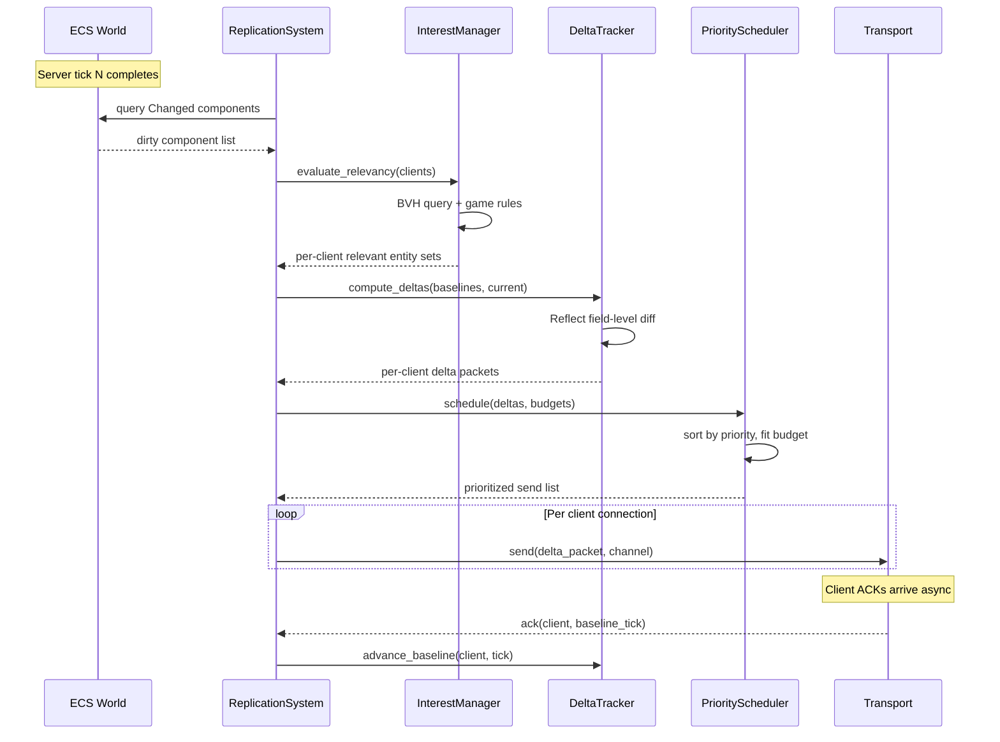
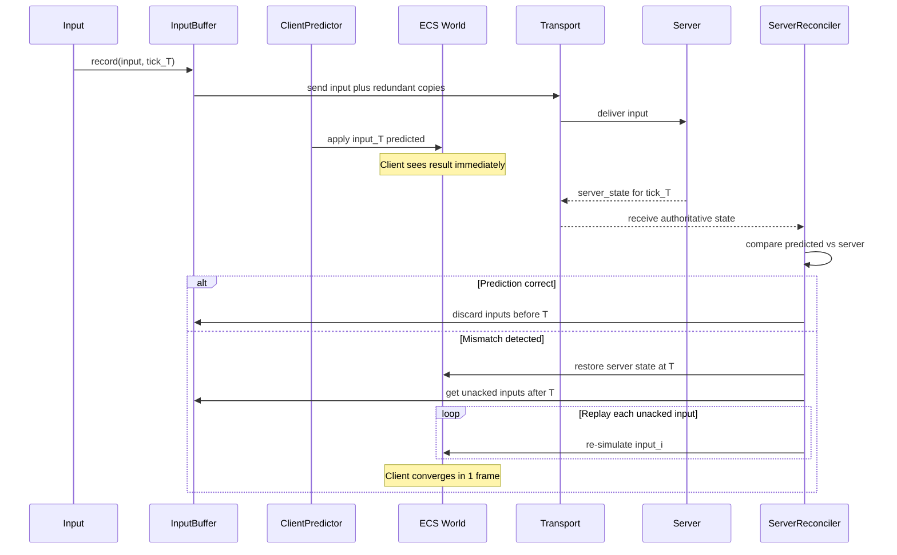
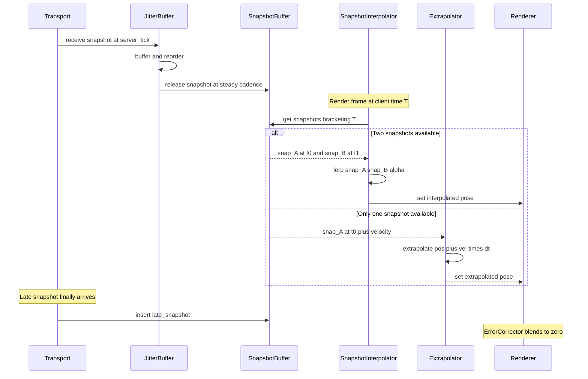
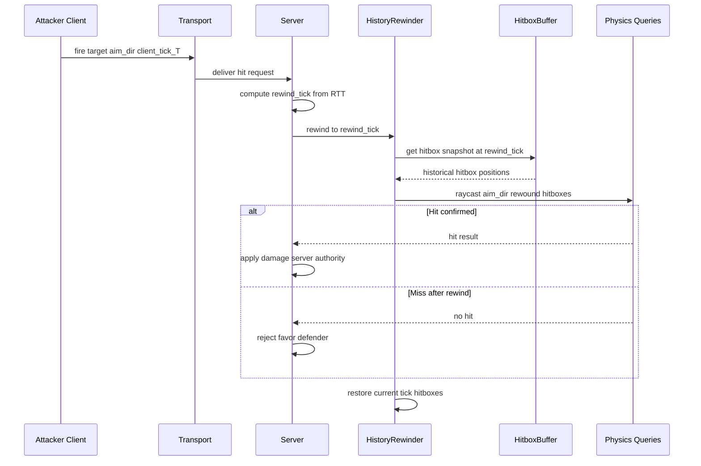
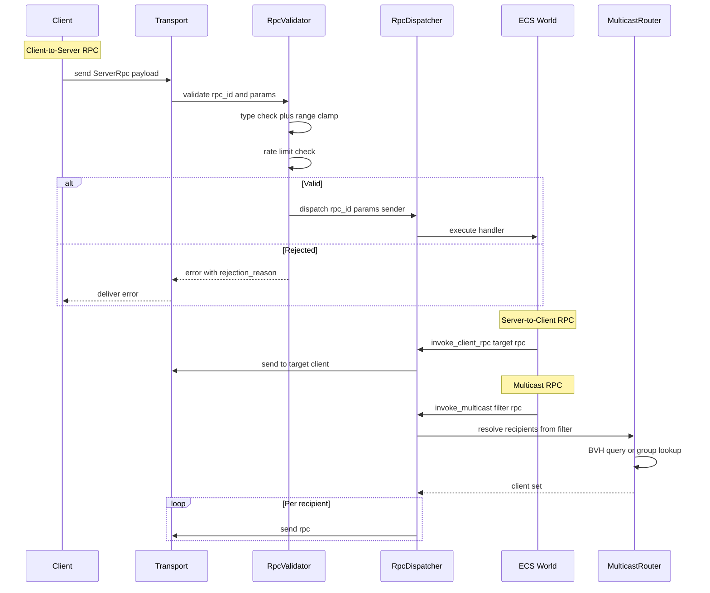
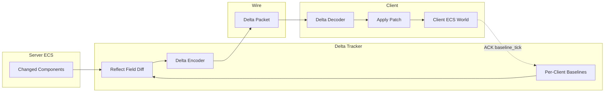

# Network Replication, Prediction, and Rollback Design

## Requirements Trace

> **Canonical sources:** Features, requirements, and user
> stories are defined in [features/networking/](../../features/networking/),
> [requirements/networking/](../../requirements/networking/), and
> [user-stories/networking/](../../user-stories/networking/). The table
> below traces design elements to those definitions.

| Feature | Requirement | User Stories | Description |
|---------|-------------|--------------|-------------|
| F-8.2.1 | R-8.2.1 | US-8.2.3, US-8.2.10 | Delta-compressed property replication with per-client baselines |
| F-8.2.2 | R-8.2.2 | US-8.2.2, US-8.2.9 | Component replication with schema versioning |
| F-8.2.3 | R-8.2.3 | US-8.2.1, US-8.2.12 | Area-of-interest filtering via shared BVH |
| F-8.2.4 | R-8.2.4 | US-8.2.4, US-8.2.7 | Conditional and tiered replication |
| F-8.2.5 | R-8.2.5 | US-8.2.5, US-8.2.8 | Priority scheduling and bandwidth budgeting |
| F-8.2.6 | R-8.2.6 | US-8.2.6 | Entity dormancy for zero-bandwidth idle entities |
| F-8.4.1 | R-8.4.1 | US-8.4.1, US-8.4.5 | Input prediction and server reconciliation |
| F-8.4.2 | R-8.4.2 | US-8.4.6 | Input buffering with redundant transmission |
| F-8.4.3 | R-8.4.3 | US-8.4.3 | Snapshot interpolation for remote entities |
| F-8.4.4 | R-8.4.4 | US-8.4.4 | Entity extrapolation with error correction |
| F-8.4.5 | R-8.4.5 | US-8.4.2, US-8.4.7 | Server-side lag compensation (hitbox rewinding) |
| F-8.4.6 | R-8.4.6 | US-8.4.8, US-8.4.9 | Jitter buffer and adaptive tick alignment |
| F-8.3.1 | R-8.3.1 | US-8.3.1, US-8.3.6 | Server RPC (client-to-server) with validation |
| F-8.3.2 | R-8.3.2 | US-8.3.3, US-8.3.7 | Client RPC (server-to-client) for ephemeral events |
| F-8.3.3 | R-8.3.3 | US-8.3.2, US-8.3.4 | Multicast RPC (server-to-group) |
| F-8.3.4 | R-8.3.4 | US-8.3.5 | RPC reliability modes (reliable, unreliable, reliable-latest) |
| F-8.3.5 | R-8.3.5 | US-8.3.6, US-8.3.9 | RPC parameter serialization and validation |

### Cross-Cutting Dependencies

| Dependency | Source | Consumed API |
|------------|--------|-------------|
| Entity lifecycle | F-1.1.11 | Generational `Entity` handles |
| Change detection | F-1.1.22 | Tick-based `Changed<T>` queries |
| Parallel iteration | F-1.1.20 | Chunk-level parallel query |
| Reflect trait | F-1.3.1 | `TypeRegistry`, field-level property access |
| DynamicValue | F-1.3.5 | Type-erased diff and patch interchange |
| Serialization | F-1.5.1 | Compact binary encoding |
| Shared BVH | F-1.9.1 | Spatial relevancy queries |
| Transport channels | F-8.1.3, F-8.1.4 | Reliable/unreliable delivery |
| Congestion control | F-8.1.7 | Per-connection send rate |
| Network diagnostics | F-8.1.8 | RTT, jitter, loss metrics |
| Thread pool | F-14.3.1 | Scoped parallel task execution |

## Overview

This design covers the three pillars of
Harmonius network gameplay: **state replication**
(server to clients), **prediction and rollback**
(client-side responsiveness), and **remote
procedure calls** (bidirectional event invocation).

The system is 100% ECS-based. Replicated state
lives as components. Replication logic runs as
systems. The `Reflect` trait drives field-level
diffing and patching. The shared BVH provides
spatial relevancy queries. The transport layer
delivers packets. This design adds no parallel
data stores outside the ECS world.

Core design principles:

1. **Server-authoritative.** The server owns all
   gameplay state. Clients predict locally but
   always defer to server corrections.
2. **Component-level granularity.** Replication
   operates on ECS components, not monolithic
   entity blobs. Only changed fields are sent.
3. **Bandwidth-first.** Delta compression,
   interest management, priority scheduling, and
   dormancy work together to fit within per-client
   bandwidth budgets.
4. **Latency-hiding.** Client prediction,
   snapshot interpolation, extrapolation, and lag
   compensation make gameplay feel responsive
   despite 80-150 ms RTT.

## Architecture

### Module Boundaries

```mermaid
graph TD
    subgraph "harmonius_net::replication"
        RS[ReplicationSystem]
        DT[DeltaTracker]
        IM[InterestManager]
        PS[PriorityScheduler]
        SB[SnapshotBuffer]
        DM[DormancyManager]
    end

    subgraph "harmonius_net::prediction"
        CP[ClientPredictor]
        SR[ServerReconciler]
        IB[InputBuffer]
        JB[JitterBuffer]
    end

    subgraph "harmonius_net::interpolation"
        SI[SnapshotInterpolator]
        EX[Extrapolator]
        EC[ErrorCorrector]
    end

    subgraph "harmonius_net::rpc"
        RD[RpcDispatcher]
        RV[RpcValidator]
        MC[MulticastRouter]
    end

    subgraph "harmonius_net::lag_comp"
        HR[HistoryRewinder]
        HB[HitboxBuffer]
    end

    subgraph "Dependencies"
        ECS[ECS World]
        RF[Reflect / Serialize]
        TR[Transport Layer]
        BVH[Shared BVH]
        TP[Thread Pool]
    end

    RS --> DT
    RS --> IM
    RS --> PS
    RS --> SB
    RS --> DM
    CP --> IB
    CP --> SR
    SI --> SB
    SI --> EX
    EX --> EC
    HR --> HB
    RD --> RV
    RD --> MC

    RS -.-> ECS
    RS -.-> RF
    RS -.-> TR
    IM -.-> BVH
    CP -.-> ECS
    SI -.-> ECS
    RD -.-> TR
    HR -.-> ECS
    RS -.-> TP
```



### File Layout

```
harmonius_net/
├── replication/
│   ├── system.rs         # ReplicationSystem,
│   │                     # server tick orchestration
│   ├── delta.rs          # DeltaTracker, Baseline,
│   │                     # DeltaPayload
│   ├── interest.rs       # InterestManager,
│   │                     # RelevancyRule, AOI
│   ├── priority.rs       # PriorityScheduler,
│   │                     # BandwidthBudget
│   ├── snapshot.rs       # SnapshotBuffer,
│   │                     # Snapshot
│   ├── dormancy.rs       # DormancyManager
│   └── schema.rs         # SchemaRegistry,
│                         # SchemaVersion
├── prediction/
│   ├── predictor.rs      # ClientPredictor
│   ├── reconciler.rs     # ServerReconciler
│   ├── input_buffer.rs   # InputBuffer,
│   │                     # TimestampedInput
│   └── jitter_buffer.rs  # JitterBuffer
├── interpolation/
│   ├── interpolator.rs   # SnapshotInterpolator
│   ├── extrapolator.rs   # Extrapolator
│   └── error_correct.rs  # ErrorCorrector
├── rpc/
│   ├── dispatcher.rs     # RpcDispatcher
│   ├── validator.rs      # RpcValidator,
│   │                     # RateLimiter
│   ├── multicast.rs      # MulticastRouter
│   └── registry.rs       # RpcRegistry,
│                         # RpcDefinition
└── lag_comp/
    ├── rewinder.rs       # HistoryRewinder
    └── hitbox_buffer.rs  # HitboxBuffer,
                          # HitboxSnapshot
```

### Server Replication Tick



### Client Prediction and Reconciliation



### Snapshot Interpolation and Extrapolation



### Hitbox Rewinding



### RPC Dispatch Flow



### Delta Compression Pipeline



### Core Data Structures

```mermaid
classDiagram
    class ReplicationSystem {
        -delta_tracker DeltaTracker
        -interest_mgr InterestManager
        -scheduler PriorityScheduler
        -snapshot_buf SnapshotBuffer
        -dormancy_mgr DormancyManager
        +tick(world, transport)
        +on_client_ack(client, tick)
    }

    class DeltaTracker {
        -baselines HashMap ClientId Baseline
        -schema_registry SchemaRegistry
        +compute_delta(client, entity) DeltaPayload
        +advance_baseline(client, tick)
    }

    class Baseline {
        -tick SequenceTick
        -states HashMap ComponentId DynamicValue
    }

    class InterestManager {
        -aoi_radius f32
        -custom_rules Vec RelevancyRule
        +evaluate(client, world) RelevantSet
    }

    class RelevantSet {
        -entities SmallVec Entity
        -tiers HashMap Entity ReplicationTier
    }

    class PriorityScheduler {
        -bandwidth_budget u32
        +schedule(deltas, budget) Vec ScheduledDelta
    }

    class SnapshotBuffer {
        -ring RingBuffer Snapshot
        -capacity u32
        +push(snapshot)
        +get_bracketing(time) Option SnapshotPair
        +get_at(tick) Option Snapshot
    }

    class DormancyManager {
        -dormant HashSet Entity
        -threshold Duration
        +check_dormancy(entity, last_change) bool
        +wake(entity)
    }

    class ClientPredictor {
        -input_buffer InputBuffer
        -predicted HashMap Entity DynamicValue
        +predict(input, world)
        +get_predicted(entity) Option DynamicValue
    }

    class InputBuffer {
        -ring RingBuffer TimestampedInput
        -redundancy_count u8
        +record(input, tick)
        +get_unacked(since) Vec TimestampedInput
        +build_packet() InputPacket
    }

    class ServerReconciler {
        +reconcile(server, predicted, world)
        +replay(inputs, world)
    }

    class SnapshotInterpolator {
        -interp_delay Duration
        +interpolate(a, b, alpha) Pose
    }

    class Extrapolator {
        -max_extrap Duration
        +extrapolate(snapshot, dt) Pose
    }

    class ErrorCorrector {
        -decay_rate f32
        -current_error Vec3
        +apply_correction(error)
        +tick() Vec3
    }

    class JitterBuffer {
        -buffer BTreeMap SequenceTick Snapshot
        -target_depth Duration
        +insert(snapshot, tick)
        +release() Option Snapshot
        +adapt(jitter_estimate)
    }

    class HistoryRewinder {
        -hitbox_buffer HitboxBuffer
        -max_rewind Duration
        +rewind(tick) HitboxSnapshot
        +restore()
    }

    class HitboxBuffer {
        -ring RingBuffer HitboxSnapshot
        +record(tick, hitboxes)
        +get(tick) Option HitboxSnapshot
    }

    class RpcDispatcher {
        -handlers HashMap RpcId RpcHandler
        -validator RpcValidator
        +register(rpc_id, handler, mode)
        +dispatch_server(rpc_id, params, sender)
        +invoke_client(target, rpc_id, params)
        +invoke_multicast(filter, rpc_id, params)
    }

    class RpcValidator {
        -rate_limiters HashMap RpcId RateLimiter
        +validate(rpc_id, params, sender) Result
    }

    class MulticastRouter {
        +resolve(filter, world) Vec ClientId
    }

    ReplicationSystem *-- DeltaTracker
    ReplicationSystem *-- InterestManager
    ReplicationSystem *-- PriorityScheduler
    ReplicationSystem *-- SnapshotBuffer
    ReplicationSystem *-- DormancyManager
    DeltaTracker *-- Baseline
    InterestManager ..> RelevantSet
    ClientPredictor *-- InputBuffer
    ClientPredictor --> ServerReconciler
    SnapshotInterpolator --> Extrapolator
    Extrapolator --> ErrorCorrector
    HistoryRewinder *-- HitboxBuffer
    RpcDispatcher *-- RpcValidator
    RpcDispatcher --> MulticastRouter
    JitterBuffer ..> SnapshotBuffer
```



## API Design

### Network Ticks and Identity

```rust
/// Monotonically increasing server tick counter.
/// Wraps at 2^32 using sequence arithmetic for
/// comparisons across the wrap boundary.
#[derive(
    Clone, Copy, Debug, PartialEq, Eq,
    PartialOrd, Ord, Hash, Reflect, Serialize,
)]
pub struct SequenceTick(pub u32);

impl SequenceTick {
    pub fn next(self) -> Self {
        Self(self.0.wrapping_add(1))
    }

    /// Sequence-aware comparison. Returns true if
    /// `self` is more recent than `other`, handling
    /// wrapping correctly (half-space comparison).
    pub fn is_newer_than(self, other: Self) -> bool {
        let diff = self.0.wrapping_sub(other.0);
        diff > 0 && diff < (u32::MAX / 2)
    }
}

/// Unique identifier for a connected client.
#[derive(
    Clone, Copy, Debug, PartialEq, Eq,
    Hash, Reflect, Serialize,
)]
pub struct ClientId(pub u32);

/// Unique identifier for a registered RPC.
#[derive(
    Clone, Copy, Debug, PartialEq, Eq,
    Hash, Reflect, Serialize,
)]
pub struct RpcId(pub u32);

/// Unique identifier for a component type in
/// the replication schema registry.
#[derive(
    Clone, Copy, Debug, PartialEq, Eq,
    Hash, Reflect, Serialize,
)]
pub struct ComponentId(pub u32);
```

### ECS Marker Components

```rust
/// Marks an entity for network replication.
/// Entities without this tag are never sent
/// to clients.
#[derive(Component, Reflect)]
pub struct Replicated;

/// Identifies which client owns (controls)
/// this entity. Used for owner-only property
/// filtering and prediction eligibility.
#[derive(Component, Reflect)]
pub struct NetworkOwner {
    pub client: ClientId,
}

/// Network authority model for this entity.
#[derive(
    Component, Clone, Copy, Debug,
    PartialEq, Eq, Reflect,
)]
pub enum NetworkAuthority {
    /// Server is authoritative. Default.
    Server,
    /// Owning client has temporary authority
    /// (e.g., during vehicle control).
    ClientAuthoritative { client: ClientId },
}

/// Marks a component for replication with
/// per-property visibility and tier rules.
#[derive(Clone, Debug, Reflect)]
pub struct ReplicationConfig {
    /// Which properties to replicate at each
    /// visibility level.
    pub visibility: PropertyVisibility,
    /// Distance-based detail tier overrides.
    pub tiers: Vec<ReplicationTier>,
}

/// Property visibility levels.
#[derive(
    Clone, Copy, Debug, PartialEq, Eq, Reflect,
)]
pub enum PropertyVisibility {
    /// Sent to all clients in AOI.
    Public,
    /// Sent only to the owning client.
    OwnerOnly,
    /// Sent only to clients on the same team.
    TeamOnly,
}

/// Distance-based replication tier.
#[derive(Clone, Debug, Reflect)]
pub struct ReplicationTier {
    /// Maximum distance for this tier (meters).
    pub max_distance: f32,
    /// Update frequency (Hz) at this tier.
    pub update_rate_hz: f32,
    /// Which property set to send at this tier.
    pub property_set: PropertySet,
}

/// Named property subsets for tiered replication.
#[derive(
    Clone, Copy, Debug, PartialEq, Eq, Reflect,
)]
pub enum PropertySet {
    /// All replicated properties.
    Full,
    /// Position, rotation, velocity only.
    Movement,
    /// Position only.
    PositionOnly,
}

/// ECS resource: per-client connection metadata
/// accessible by replication systems.
#[derive(Resource, Reflect)]
pub struct NetworkConnections {
    pub connections: HashMap<ClientId, ClientConnection>,
}

/// Per-client connection state.
#[derive(Clone, Debug, Reflect)]
pub struct ClientConnection {
    pub client_id: ClientId,
    pub rtt: Duration,
    pub jitter: Duration,
    pub packet_loss: f32,
    pub bandwidth_budget: u32,
    pub platform: ClientPlatform,
    pub last_acked_tick: SequenceTick,
}

#[derive(
    Clone, Copy, Debug, PartialEq, Eq, Reflect,
)]
pub enum ClientPlatform {
    Desktop,
    Mobile,
    Console,
}
```

### Schema Versioning

```rust
/// Schema version for a replicated component.
/// Negotiated during connection handshake.
#[derive(
    Clone, Copy, Debug, PartialEq, Eq,
    Hash, Reflect, Serialize,
)]
pub struct SchemaVersion(pub u32);

/// Registry of component schemas for versioned
/// replication. Immutable after initialization.
pub struct SchemaRegistry { /* ... */ }

impl SchemaRegistry {
    pub fn new() -> Self;

    /// Register a component schema. The schema
    /// is derived from the component's Reflect
    /// implementation at startup.
    pub fn register<C: Reflect + Component>(
        &mut self,
    ) -> ComponentId;

    /// Negotiate compatible schemas between
    /// server version and client version during
    /// connection handshake. Returns a migration
    /// map for fields that differ.
    pub fn negotiate(
        &self,
        server_version: SchemaVersion,
        client_version: SchemaVersion,
    ) -> Result<SchemaMigration, SchemaError>;

    pub fn get(
        &self,
        id: ComponentId,
    ) -> Option<&ComponentSchema>;

    pub fn version(&self) -> SchemaVersion;
}

/// Describes how to migrate between two schema
/// versions for a single component.
pub struct SchemaMigration {
    /// Fields present in server but not client.
    /// Client applies defaults for these.
    pub added_fields: Vec<FieldMigration>,
    /// Fields present in client but not server.
    /// Client ignores these during decode.
    pub removed_fields: Vec<FieldMigration>,
}

pub struct FieldMigration {
    pub field_name: String,
    pub default_value: Option<DynamicValue>,
}
```

### Delta Tracker

```rust
/// Tracks per-client baseline state and computes
/// delta payloads using the Reflect trait for
/// field-level diffing.
pub struct DeltaTracker { /* ... */ }

impl DeltaTracker {
    pub fn new(
        schema: &SchemaRegistry,
    ) -> Self;

    /// Register a new client. Initializes an
    /// empty baseline; the first replication sends
    /// full state.
    pub fn register_client(
        &mut self,
        client: ClientId,
    );

    pub fn remove_client(
        &mut self,
        client: ClientId,
    );

    /// Compute the delta between the client's
    /// baseline and the current component state
    /// for a single entity. Uses Reflect
    /// field-by-field comparison. Returns None
    /// if no fields changed.
    pub fn compute_delta(
        &self,
        client: ClientId,
        entity: Entity,
        component_id: ComponentId,
        current: &dyn Reflect,
    ) -> Option<DeltaPayload>;

    /// Advance the client's baseline after
    /// receiving an ACK. Discards old baseline
    /// state for acknowledged ticks.
    pub fn advance_baseline(
        &mut self,
        client: ClientId,
        acked_tick: SequenceTick,
    );

    /// Reset baseline to full state. Used on
    /// initial replication or after reconnect.
    pub fn reset_baseline(
        &mut self,
        client: ClientId,
    );
}

/// A compact description of changed fields for
/// one component on one entity.
#[derive(Clone, Debug, Serialize)]
pub struct DeltaPayload {
    pub entity: Entity,
    pub component_id: ComponentId,
    pub tick: SequenceTick,
    /// Bitmask of changed field indices.
    pub changed_mask: u64,
    /// Serialized values of only the changed
    /// fields, in field-index order.
    pub field_data: Vec<u8>,
}

/// Per-client baseline: the last state each
/// client acknowledged receiving.
struct Baseline {
    tick: SequenceTick,
    /// Component state snapshots keyed by
    /// (Entity, ComponentId).
    states: HashMap<
        (Entity, ComponentId),
        DynamicValue,
    >,
}
```

### Interest Management

```rust
/// Evaluates which entities are relevant to
/// each client. Combines spatial BVH queries
/// with game-rule-based overrides.
pub struct InterestManager { /* ... */ }

impl InterestManager {
    pub fn new(config: InterestConfig) -> Self;

    /// Add a custom relevancy rule (e.g., always
    /// replicate party members regardless of
    /// distance).
    pub fn add_rule(
        &mut self,
        rule: RelevancyRule,
    );

    /// Evaluate relevancy for a single client.
    /// Returns the set of entities to replicate
    /// and their distance-based tier assignments.
    pub fn evaluate(
        &self,
        client: ClientId,
        client_pos: Vec3,
        world: &World,
        bvh: &BvhIndex,
    ) -> RelevantSet;

    /// Batch-evaluate relevancy for all clients.
    /// Parallelized across the thread pool.
    pub fn evaluate_all(
        &self,
        connections: &NetworkConnections,
        world: &World,
        bvh: &BvhIndex,
        pool: &ThreadPool,
    ) -> HashMap<ClientId, RelevantSet>;
}

pub struct InterestConfig {
    /// Default AOI radius in meters.
    pub default_aoi_radius: f32,
    /// Maximum AOI radius (cap for custom rules).
    pub max_aoi_radius: f32,
    /// Per-platform AOI overrides.
    pub platform_overrides: HashMap<
        ClientPlatform,
        f32,
    >,
}

/// The evaluated set of relevant entities for
/// one client, with per-entity tier assignments.
pub struct RelevantSet {
    pub entities: SmallVec<[Entity; 256]>,
    pub tiers: HashMap<Entity, ReplicationTier>,
}

/// A game-rule-based relevancy override.
pub enum RelevancyRule {
    /// Always replicate entities matching this
    /// query, regardless of distance.
    AlwaysRelevant {
        filter: RelevancyFilter,
    },
    /// Never replicate entities matching this
    /// query to non-owners.
    NeverRelevant {
        filter: RelevancyFilter,
    },
    /// Custom radius override for entities
    /// matching this query.
    CustomRadius {
        filter: RelevancyFilter,
        radius: f32,
    },
}

/// Filter for relevancy rules. Combines entity
/// relationships (party, team, guild) with
/// component-based archetype queries.
pub enum RelevancyFilter {
    /// Same party as the client's player entity.
    SameParty,
    /// Same team.
    SameTeam,
    /// Same guild.
    SameGuild,
    /// Entities with a specific tag component.
    HasComponent { component_id: ComponentId },
    /// Composite: all sub-filters must match.
    All { filters: Vec<RelevancyFilter> },
    /// Composite: any sub-filter must match.
    Any { filters: Vec<RelevancyFilter> },
}
```

### Priority Scheduler

```rust
/// Allocates per-client bandwidth budgets to
/// entity deltas by priority. High-priority
/// entities are replicated first; low-priority
/// entities fill remaining budget.
pub struct PriorityScheduler { /* ... */ }

impl PriorityScheduler {
    pub fn new() -> Self;

    /// Schedule deltas for one client within its
    /// bandwidth budget. Returns an ordered list
    /// of deltas to send this tick.
    pub fn schedule(
        &self,
        deltas: &[DeltaPayload],
        relevant: &RelevantSet,
        staleness: &HashMap<Entity, u32>,
        budget_bytes: u32,
    ) -> Vec<ScheduledDelta>;
}

/// A delta that has been approved for sending
/// this tick.
pub struct ScheduledDelta {
    pub payload: DeltaPayload,
    pub priority: f32,
    pub estimated_size: u32,
}

/// Priority is computed as:
///   priority = base_priority
///            * staleness_multiplier
///            * distance_falloff
///
/// where:
/// - base_priority: per-entity-type weight
///   (player target = 10, hostile = 8,
///   neutral NPC = 2)
/// - staleness_multiplier: ticks since last
///   successful send (clamped to [1, 16])
/// - distance_falloff: 1.0 / (1.0 + dist/100.0)
pub fn compute_priority(
    entity_type_weight: f32,
    ticks_since_last_send: u32,
    distance: f32,
) -> f32 {
    let staleness =
        (ticks_since_last_send as f32).clamp(1.0, 16.0);
    let falloff = 1.0 / (1.0 + distance / 100.0);
    entity_type_weight * staleness * falloff
}
```

### Dormancy Manager

```rust
/// Tracks entities that have not changed for
/// a configurable period and excludes them
/// from replication entirely.
pub struct DormancyManager { /* ... */ }

impl DormancyManager {
    pub fn new(config: DormancyConfig) -> Self;

    /// Check if an entity should enter dormancy.
    /// Returns true if the entity has not changed
    /// for longer than the threshold.
    pub fn check_dormancy(
        &self,
        entity: Entity,
        last_change_tick: SequenceTick,
        current_tick: SequenceTick,
    ) -> bool;

    /// Force-wake a dormant entity for immediate
    /// replication.
    pub fn wake(&mut self, entity: Entity);

    /// Returns true if the entity is currently
    /// dormant.
    pub fn is_dormant(
        &self,
        entity: Entity,
    ) -> bool;

    /// Tick dormancy tracking. Transitions newly
    /// idle entities to dormant and checks for
    /// wake conditions.
    pub fn update(
        &mut self,
        world: &World,
        current_tick: SequenceTick,
    );
}

pub struct DormancyConfig {
    /// Ticks without change before entering
    /// dormancy. Default: 300 (5 seconds at
    /// 60 Hz).
    pub threshold_ticks: u32,
}
```

### Snapshot Buffer

```rust
/// Ring buffer of world-state snapshots used
/// by both the server (for lag compensation)
/// and the client (for interpolation).
pub struct SnapshotBuffer { /* ... */ }

impl SnapshotBuffer {
    pub fn new(capacity: u32) -> Self;

    /// Push a new snapshot. Overwrites the
    /// oldest if at capacity.
    pub fn push(&mut self, snapshot: Snapshot);

    /// Get the two snapshots bracketing the
    /// given time for interpolation.
    pub fn get_bracketing(
        &self,
        time: f64,
    ) -> Option<(
        &Snapshot,
        &Snapshot,
        f32, // interpolation alpha
    )>;

    /// Get the snapshot at or nearest to the
    /// given tick. Used for lag compensation
    /// rewinding.
    pub fn get_at(
        &self,
        tick: SequenceTick,
    ) -> Option<&Snapshot>;

    pub fn newest_tick(&self) -> SequenceTick;
    pub fn oldest_tick(&self) -> SequenceTick;
}

/// A snapshot of entity states at a specific
/// server tick.
#[derive(Clone, Serialize)]
pub struct Snapshot {
    pub tick: SequenceTick,
    pub timestamp: f64,
    pub entities: HashMap<
        Entity,
        EntitySnapshot,
    >,
}

/// Snapshot of a single entity's replicated
/// component state.
#[derive(Clone, Serialize)]
pub struct EntitySnapshot {
    pub components: HashMap<
        ComponentId,
        DynamicValue,
    >,
}
```

### Client Prediction

```rust
/// Executes player inputs immediately on the
/// client using the same simulation logic as
/// the server, providing instant feedback.
pub struct ClientPredictor { /* ... */ }

impl ClientPredictor {
    pub fn new(
        config: PredictionConfig,
    ) -> Self;

    /// Apply a new input to the predicted
    /// state. Called immediately when the player
    /// presses a button — no round-trip wait.
    pub fn predict(
        &mut self,
        input: &PlayerInput,
        tick: SequenceTick,
        world: &mut World,
    );

    /// Get the current predicted state for an
    /// entity (before server confirmation).
    pub fn get_predicted(
        &self,
        entity: Entity,
    ) -> Option<&DynamicValue>;

    /// Returns true if the entity is currently
    /// being predicted by this client.
    pub fn is_predicting(
        &self,
        entity: Entity,
    ) -> bool;
}

pub struct PredictionConfig {
    /// Maximum frames of unacknowledged input
    /// to buffer before stalling.
    pub max_unacked_inputs: u8,
    /// Components eligible for prediction.
    /// Only these are rolled back on mismatch.
    pub predicted_components: Vec<ComponentId>,
}
```

### Input Buffer

```rust
/// Stores timestamped inputs and builds
/// packets with redundant copies to tolerate
/// packet loss.
pub struct InputBuffer { /* ... */ }

impl InputBuffer {
    pub fn new(
        config: InputBufferConfig,
    ) -> Self;

    /// Record a new input at the given tick.
    pub fn record(
        &mut self,
        input: PlayerInput,
        tick: SequenceTick,
    );

    /// Get all unacknowledged inputs since
    /// (and including) the given tick.
    pub fn get_unacked(
        &self,
        since: SequenceTick,
    ) -> &[TimestampedInput];

    /// Build a network packet containing the
    /// latest input plus redundant copies of
    /// recent inputs.
    pub fn build_packet(
        &self,
    ) -> InputPacket;

    /// Discard inputs that the server has
    /// acknowledged.
    pub fn acknowledge(
        &mut self,
        acked_tick: SequenceTick,
    );
}

pub struct InputBufferConfig {
    /// Number of redundant input copies per
    /// packet. Auto-tuned from loss rate.
    /// Default: 3 (desktop), 6 (mobile).
    pub redundancy_count: u8,
    /// Maximum buffer depth in ticks.
    pub max_depth: u8,
}

#[derive(Clone, Debug, Serialize)]
pub struct TimestampedInput {
    pub tick: SequenceTick,
    pub input: PlayerInput,
}

#[derive(Clone, Debug, Serialize)]
pub struct InputPacket {
    /// The latest input (always included).
    pub current: TimestampedInput,
    /// Redundant copies of recent inputs.
    pub redundant: Vec<TimestampedInput>,
}

/// Abstract player input. Serialized via
/// Reflect. Concrete content is game-defined
/// (movement vector, ability id, aim direction).
#[derive(Clone, Debug, Reflect, Serialize)]
pub struct PlayerInput {
    pub movement: Vec3,
    pub aim_direction: Vec3,
    pub actions: SmallVec<[InputAction; 4]>,
}

#[derive(Clone, Debug, Reflect, Serialize)]
pub struct InputAction {
    pub action_id: u32,
    pub pressed: bool,
    pub value: f32,
}
```

### Server Reconciler

```rust
/// Compares server-authoritative state against
/// client predictions and replays unacknowledged
/// inputs on mismatch.
pub struct ServerReconciler { /* ... */ }

impl ServerReconciler {
    pub fn new() -> Self;

    /// Reconcile a received server state against
    /// the client's predicted state.
    ///
    /// On mismatch: restores server state, then
    /// replays all unacknowledged inputs from the
    /// input buffer. Completes within a single
    /// frame.
    pub fn reconcile(
        &self,
        server_tick: SequenceTick,
        server_state: &Snapshot,
        predicted_state: &HashMap<
            Entity, DynamicValue,
        >,
        input_buffer: &InputBuffer,
        world: &mut World,
        predictor: &mut ClientPredictor,
    ) -> ReconcileResult;
}

pub enum ReconcileResult {
    /// Prediction matched server state. No
    /// correction needed.
    Correct,
    /// Mismatch detected and corrected. Reports
    /// the number of inputs replayed.
    Corrected {
        replayed_inputs: u32,
        max_position_error: f32,
    },
}
```

### Snapshot Interpolation

```rust
/// Interpolates remote (non-predicted) entity
/// state between two server snapshots for smooth
/// visual motion at the client's render rate.
pub struct SnapshotInterpolator { /* ... */ }

impl SnapshotInterpolator {
    pub fn new(
        config: InterpolationConfig,
    ) -> Self;

    /// Compute the interpolated state for an
    /// entity at the given render time.
    pub fn interpolate(
        &self,
        entity: Entity,
        render_time: f64,
        snapshot_buffer: &SnapshotBuffer,
    ) -> Option<InterpolatedState>;

    /// Update the interpolation delay based on
    /// current jitter measurement. Expands during
    /// instability, contracts when stable.
    pub fn adapt_delay(
        &mut self,
        jitter: Duration,
    );
}

pub struct InterpolationConfig {
    /// Base interpolation delay. Default: one
    /// server tick period (desktop), two ticks
    /// (mobile).
    pub base_delay: Duration,
    /// Minimum delay (never go below this).
    pub min_delay: Duration,
    /// Maximum delay (cap during high jitter).
    pub max_delay: Duration,
}

pub struct InterpolatedState {
    pub position: Vec3,
    pub rotation: Quat,
    pub velocity: Vec3,
    /// Per-component interpolated values.
    pub components: HashMap<
        ComponentId,
        DynamicValue,
    >,
}
```

### Extrapolator and Error Correction

```rust
/// Extrapolates entity positions using velocity
/// when snapshot data is late, preventing freezes
/// during packet loss.
pub struct Extrapolator { /* ... */ }

impl Extrapolator {
    pub fn new(config: ExtrapolationConfig) -> Self;

    /// Extrapolate an entity's position from its
    /// last known state.
    pub fn extrapolate(
        &self,
        last_snapshot: &EntitySnapshot,
        dt: f64,
    ) -> ExtrapolatedState;
}

pub struct ExtrapolationConfig {
    /// Maximum extrapolation duration. After
    /// this, entity freezes at last extrapolated
    /// position. Default: 100 ms (desktop),
    /// 200 ms (mobile).
    pub max_duration: Duration,
    /// Whether to use acceleration in addition
    /// to velocity. Default: true.
    pub use_acceleration: bool,
}

pub struct ExtrapolatedState {
    pub position: Vec3,
    pub rotation: Quat,
    pub confidence: f32,
}

/// Smoothly corrects accumulated extrapolation
/// error when the true snapshot arrives. Uses
/// exponential decay to avoid visible snapping.
pub struct ErrorCorrector { /* ... */ }

impl ErrorCorrector {
    pub fn new(
        config: ErrorCorrectionConfig,
    ) -> Self;

    /// Apply a new error vector (difference
    /// between extrapolated and actual position).
    pub fn apply_correction(
        &mut self,
        entity: Entity,
        error: Vec3,
    );

    /// Tick the error correction. Returns the
    /// remaining correction offset to add to
    /// the entity's visual position this frame.
    /// Decays toward zero each frame.
    pub fn tick(
        &mut self,
        entity: Entity,
        dt: f32,
    ) -> Vec3;
}

pub struct ErrorCorrectionConfig {
    /// Decay rate per second. 0.1 = slow smooth
    /// correction, 0.9 = fast snap. Default: 0.3
    /// (desktop), 0.5 (mobile).
    pub decay_rate: f32,
    /// Error below this threshold is snapped to
    /// zero immediately (meters). Default: 0.01.
    pub snap_threshold: f32,
    /// Error above this threshold is snapped
    /// instantly (teleport). Default: 5.0.
    pub teleport_threshold: f32,
}
```

### Jitter Buffer

```rust
/// Absorbs network timing variance and releases
/// snapshots at a steady cadence. Handles game
/// state packets only — voice packets are routed
/// to the audio-domain jitter buffer (R-5.5.2).
pub struct JitterBuffer { /* ... */ }

impl JitterBuffer {
    pub fn new(
        config: JitterBufferConfig,
    ) -> Self;

    /// Insert a received snapshot into the
    /// buffer, ordered by tick.
    pub fn insert(
        &mut self,
        snapshot: Snapshot,
    );

    /// Release the next snapshot for consumption
    /// if the buffer has reached target depth.
    /// Returns None if buffering.
    pub fn release(
        &mut self,
    ) -> Option<Snapshot>;

    /// Adapt buffer depth based on measured
    /// jitter. Expands during instability,
    /// contracts when stable.
    pub fn adapt(
        &mut self,
        jitter_estimate: Duration,
    );

    pub fn current_depth(&self) -> Duration;
    pub fn target_depth(&self) -> Duration;
}

pub struct JitterBufferConfig {
    /// Minimum buffer depth in ticks.
    /// Default: 1 (desktop), 3 (mobile).
    pub min_depth_ticks: u32,
    /// Maximum buffer depth in ticks.
    /// Default: 3 (desktop), 5 (mobile).
    pub max_depth_ticks: u32,
    /// How aggressively to expand on jitter
    /// increase. Default: 2.0 (multiply jitter
    /// std-dev by this factor).
    pub expansion_factor: f32,
    /// How aggressively to contract when stable.
    /// Ticks without jitter before contracting.
    /// Default: 300 (5 seconds at 60 Hz).
    pub contraction_delay_ticks: u32,
}
```

### Lag Compensation

```rust
/// Server-side hitbox rewinding for lag
/// compensation. Rewinds hitbox positions to
/// what the attacker saw at the time of input.
pub struct HistoryRewinder { /* ... */ }

impl HistoryRewinder {
    pub fn new(
        config: LagCompensationConfig,
    ) -> Self;

    /// Record the current tick's hitbox
    /// positions for all relevant entities.
    /// Called once per server tick.
    pub fn record(
        &mut self,
        tick: SequenceTick,
        world: &World,
    );

    /// Rewind hitbox state to the given tick.
    /// Returns the historical hitbox snapshot
    /// for use in physics queries. The caller
    /// must call `restore()` after the query.
    pub fn rewind(
        &self,
        tick: SequenceTick,
    ) -> Option<&HitboxSnapshot>;

    /// Compute the tick to rewind to based on
    /// the attacker's RTT and interpolation
    /// delay. Clamped to the maximum compensation
    /// window.
    pub fn compute_rewind_tick(
        &self,
        current_tick: SequenceTick,
        client_rtt: Duration,
        interp_delay: Duration,
        tick_rate: f32,
    ) -> SequenceTick;
}

pub struct LagCompensationConfig {
    /// Maximum rewind window. Requests beyond
    /// this are clamped. Default: 250 ms.
    pub max_rewind: Duration,
    /// History buffer size in ticks. Must cover
    /// at least max_rewind at the tick rate.
    /// Default: 30 (500 ms at 60 Hz).
    pub history_size: u32,
    /// When a hit is ambiguous (attacker barely
    /// hit, defender barely dodged), favor the
    /// defender. Default: true.
    pub favor_defender: bool,
}

/// Snapshot of hitbox AABB positions at a
/// specific tick.
#[derive(Clone)]
pub struct HitboxSnapshot {
    pub tick: SequenceTick,
    pub hitboxes: HashMap<Entity, HitboxData>,
}

#[derive(Clone, Reflect)]
pub struct HitboxData {
    pub position: Vec3,
    pub rotation: Quat,
    pub half_extents: Vec3,
}
```

### RPC System

```rust
/// Central RPC dispatcher. Handles client-to-
/// server, server-to-client, and multicast RPCs.
pub struct RpcDispatcher { /* ... */ }

impl RpcDispatcher {
    pub fn new(
        validator: RpcValidator,
    ) -> Self;

    /// Register an RPC handler. The reliability
    /// mode is fixed at registration time and
    /// cannot be changed per-call.
    pub fn register(
        &mut self,
        rpc_id: RpcId,
        handler: RpcHandlerFn,
        mode: RpcReliability,
    );

    /// Dispatch a client-to-server RPC. Runs
    /// validation and rate limiting before
    /// executing the handler.
    pub fn dispatch_server_rpc(
        &self,
        rpc_id: RpcId,
        params: &dyn Reflect,
        sender: ClientId,
        world: &mut World,
    ) -> Result<(), RpcError>;

    /// Invoke a server-to-client RPC targeting
    /// a specific client.
    pub fn invoke_client_rpc(
        &self,
        target: ClientId,
        rpc_id: RpcId,
        params: &dyn Reflect,
        transport: &Transport,
    ) -> Result<(), RpcError>;

    /// Invoke a multicast RPC targeting a
    /// filtered set of clients.
    pub fn invoke_multicast(
        &self,
        filter: &MulticastFilter,
        rpc_id: RpcId,
        params: &dyn Reflect,
        world: &World,
        transport: &Transport,
    ) -> Result<u32, RpcError>;
}

/// RPC handler trait. Implemented by game-
/// specific RPC logic.
pub trait RpcHandler: Send + Sync {
    fn handle(
        &self,
        params: &dyn Reflect,
        sender: ClientId,
        world: &mut World,
    ) -> Result<(), RpcError>;
}

/// RPC reliability mode, fixed at registration.
#[derive(
    Clone, Copy, Debug, PartialEq, Eq,
)]
pub enum RpcReliability {
    /// Guaranteed delivery. Retransmitted on
    /// loss. Used for ability confirmations,
    /// trade completions.
    Reliable,
    /// Fire-and-forget. No retransmission.
    /// Used for cosmetic effects, hit markers.
    Unreliable,
    /// Only the most recent invocation is
    /// delivered. Used for rapidly-changing UI
    /// state (cast bar progress).
    ReliableLatest,
}

/// Filter for multicast RPC recipients.
pub enum MulticastFilter {
    /// All clients within a spatial radius.
    Spatial {
        center: Vec3,
        radius: f32,
    },
    /// All clients in the same party as the
    /// given client.
    Party { client: ClientId },
    /// All clients on the same team.
    Team { team_id: u32 },
    /// All clients in the same raid.
    Raid { raid_id: u32 },
    /// All clients in a specific zone instance.
    Zone { zone_id: u32 },
    /// Intersection of multiple filters.
    All { filters: Vec<MulticastFilter> },
}
```

### RPC Validator

```rust
/// Validates and rate-limits incoming RPCs
/// before execution.
pub struct RpcValidator { /* ... */ }

impl RpcValidator {
    pub fn new() -> Self;

    /// Configure rate limiting for a specific
    /// RPC type.
    pub fn set_rate_limit(
        &mut self,
        rpc_id: RpcId,
        limit: RateLimit,
    );

    /// Validate an incoming RPC. Checks:
    /// 1. RPC ID is registered
    /// 2. Parameter types match schema
    /// 3. Parameter values within declared ranges
    /// 4. Entity references resolve to existing
    ///    entities the sender can interact with
    /// 5. Rate limit not exceeded
    pub fn validate(
        &self,
        rpc_id: RpcId,
        params: &dyn Reflect,
        sender: ClientId,
        world: &World,
    ) -> Result<(), RpcValidationError>;
}

pub struct RateLimit {
    /// Maximum invocations per second.
    pub max_per_second: f32,
    /// Burst allowance above steady-state rate.
    pub burst: u32,
}

pub enum RpcValidationError {
    /// RPC ID not registered.
    UnknownRpc { rpc_id: RpcId },
    /// Parameter type mismatch.
    TypeMismatch {
        field: String,
        expected: String,
        actual: String,
    },
    /// Parameter value out of declared range.
    OutOfRange {
        field: String,
        value: String,
        min: String,
        max: String,
    },
    /// Entity reference does not exist.
    EntityNotFound { entity: Entity },
    /// Sender lacks permission to interact
    /// with the target entity.
    PermissionDenied {
        sender: ClientId,
        entity: Entity,
    },
    /// Rate limit exceeded.
    RateLimited {
        rpc_id: RpcId,
        retry_after: Duration,
    },
    /// Malformed payload (truncated, invalid
    /// encoding).
    MalformedPayload { detail: String },
}
```

### Multicast Router

```rust
/// Resolves multicast filters to concrete
/// client sets using BVH spatial queries and
/// ECS relationship queries.
pub struct MulticastRouter { /* ... */ }

impl MulticastRouter {
    pub fn new() -> Self;

    /// Resolve a multicast filter to the set
    /// of client IDs that should receive the
    /// RPC.
    pub fn resolve(
        &self,
        filter: &MulticastFilter,
        world: &World,
        bvh: &BvhIndex,
        connections: &NetworkConnections,
    ) -> Vec<ClientId>;
}
```

### Error Types

```rust
pub enum ReplicationError {
    /// Component not registered in schema.
    UnregisteredComponent {
        component_id: ComponentId,
    },
    /// Schema negotiation failed during
    /// handshake.
    SchemaIncompatible {
        server_version: SchemaVersion,
        client_version: SchemaVersion,
    },
    /// Transport send failed.
    TransportError { detail: String },
}

pub enum RpcError {
    /// Validation rejected the RPC.
    ValidationFailed {
        error: RpcValidationError,
    },
    /// No handler registered for this RPC.
    NoHandler { rpc_id: RpcId },
    /// Handler execution failed.
    HandlerFailed { detail: String },
    /// Transport send failed.
    TransportError { detail: String },
}

pub enum PredictionError {
    /// Entity is not eligible for prediction.
    NotPredicted { entity: Entity },
    /// Input buffer overflow.
    BufferFull { max_depth: u8 },
}
```

## Data Flow

### Server-Side Replication Tick

Each server tick, the replication system runs
as a post-simulation ECS system:

```rust
// Pseudocode: server replication system
fn replication_tick_system(
    world: &World,
    replication: &mut ReplicationSystem,
    connections: &NetworkConnections,
    transport: &Transport,
    bvh: &BvhIndex,
    pool: &ThreadPool,
) {
    let tick = world.current_tick();

    // 1. Evaluate interest for all clients
    //    (parallelized across thread pool)
    let relevant_sets =
        replication.interest_mgr.evaluate_all(
            connections, world, bvh, pool,
        );

    // 2. Update dormancy tracking
    replication.dormancy_mgr.update(world, tick);

    // 3. For each client, compute deltas
    for (client_id, conn) in &connections.connections {
        let relevant = &relevant_sets[client_id];

        // Skip dormant entities
        let active: Vec<_> = relevant
            .entities
            .iter()
            .filter(|e| {
                !replication
                    .dormancy_mgr
                    .is_dormant(**e)
            })
            .collect();

        // Compute deltas using Reflect diffing
        let mut deltas = Vec::new();
        for &entity in &active {
            for comp_id in
                world.replicated_components(entity)
            {
                let current =
                    world.get_reflect(entity, comp_id);
                if let Some(delta) =
                    replication.delta_tracker
                        .compute_delta(
                            *client_id,
                            entity,
                            comp_id,
                            current,
                        )
                {
                    deltas.push(delta);
                }
            }
        }

        // 4. Priority-schedule within budget
        let scheduled =
            replication.scheduler.schedule(
                &deltas,
                relevant,
                &replication.staleness,
                conn.bandwidth_budget,
            );

        // 5. Send prioritized deltas
        for sd in &scheduled {
            transport.send(
                *client_id,
                &sd.payload,
                Channel::UnreliableSequenced,
            );
        }
    }

    // 6. Record snapshot for lag compensation
    replication.snapshot_buf.push(
        Snapshot::from_world(world, tick),
    );
}
```

### Client-Side Frame

Each client frame processes in this order:

```rust
// Pseudocode: client networking frame
fn client_net_frame(
    world: &mut World,
    predictor: &mut ClientPredictor,
    reconciler: &ServerReconciler,
    input_buffer: &mut InputBuffer,
    interpolator: &mut SnapshotInterpolator,
    jitter_buffer: &mut JitterBuffer,
    snapshot_buffer: &mut SnapshotBuffer,
    error_corrector: &mut ErrorCorrector,
    transport: &Transport,
    dt: f32,
) {
    // 1. Drain received snapshots into jitter
    //    buffer
    for snapshot in transport.recv_snapshots() {
        jitter_buffer.insert(snapshot);
    }

    // 2. Release steady-cadence snapshots
    while let Some(snap) =
        jitter_buffer.release()
    {
        snapshot_buffer.push(snap);
    }

    // 3. Process server state for predicted
    //    entities (reconciliation)
    if let Some(server_snap) =
        snapshot_buffer.get_at(
            transport.last_server_tick(),
        )
    {
        let result = reconciler.reconcile(
            server_snap.tick,
            server_snap,
            &predictor.predicted_states(),
            input_buffer,
            world,
            predictor,
        );
        if let ReconcileResult::Corrected {
            replayed_inputs, ..
        } = result
        {
            // Log correction for diagnostics
        }
    }

    // 4. Apply new local input (prediction)
    let input = read_player_input();
    let tick = world.current_tick();
    input_buffer.record(input.clone(), tick);
    predictor.predict(&input, tick, world);

    // 5. Send input packet with redundancy
    let packet = input_buffer.build_packet();
    transport.send_input(packet);

    // 6. Interpolate remote entities
    let render_time = world.render_time();
    for entity in world.remote_entities() {
        if let Some(state) =
            interpolator.interpolate(
                entity,
                render_time,
                snapshot_buffer,
            )
        {
            // Apply interpolated + error
            // correction offset
            let correction =
                error_corrector.tick(entity, dt);
            world.set_visual_position(
                entity,
                state.position + correction,
            );
            world.set_visual_rotation(
                entity,
                state.rotation,
            );
        }
    }
}
```

### Delta Compression Algorithm

The delta encoder operates on individual
components using the `Reflect` trait:

1. **Field enumeration.** Iterate all fields of
   the component via `Reflect::fields()`.
2. **Baseline lookup.** Retrieve the client's
   last-acknowledged value for this component from
   the `Baseline`.
3. **Field-by-field comparison.** For each field,
   compare current value against baseline using
   `PartialEq` via the reflection system.
4. **Changed mask.** Set bit `i` in a `u64`
   bitmask for each changed field index `i`.
5. **Encode changed fields.** Serialize only the
   changed field values in field-index order using
   compact binary encoding.
6. **Quantization.** For `f32` position and
   rotation fields, apply configurable quantization
   (e.g., 0.01 m precision = 16-bit delta) to
   further reduce payload size.

The client reverses this process:

1. Read the changed bitmask.
2. For each set bit, deserialize the field value.
3. Patch the local component via
   `Reflect::set_field()`.
4. Unchanged fields retain their current value.

### Bandwidth Budget Allocation

Per client per tick:

1. **Query congestion controller** for current
   send rate (bytes/s).
2. **Divide by tick rate** to get per-tick budget.
3. **Reserve** 20% for RPCs and control traffic.
4. **Sort** entity deltas by computed priority
   (descending).
5. **Pack** deltas into the remaining budget,
   highest priority first.
6. **Defer** remaining deltas — their staleness
   counter increases, raising their priority next
   tick.

## Platform Considerations

### Mobile Tuning Defaults

| Parameter | Desktop | Mobile |
|-----------|---------|--------|
| AOI radius | 200 m | 100 m |
| Max rollback frames | 8 | 4 |
| Input buffer redundancy | 3 | 6 |
| Interpolation delay | 1 tick | 2 ticks |
| Extrapolation window | 100 ms | 200 ms |
| Error correction decay | 0.3 | 0.5 |
| Jitter buffer min depth | 1 tick | 3 ticks |
| Jitter buffer max depth | 3 ticks | 5 ticks |
| Bandwidth budget | 500+ KB/s | 50-100 KB/s |
| Replication tiers | near=30Hz, mid=10Hz, far=5Hz | near=20Hz, mid=5Hz, far=2Hz |

### Async I/O Integration

All network I/O uses the engine's async transport
layer (F-8.1). The replication system never blocks
on sends or receives. Sends are submitted as
async operations. Receives arrive via the reactor
poll point and are processed each frame. Platform
backend selection (IOCP, GCD, io_uring) is handled
by the transport layer — the replication system
is platform-agnostic.

### Thread Pool Usage

These operations are parallelized via the thread
pool's scoped execution:

- **Interest evaluation.** One task per client,
  each performing an independent BVH query.
- **Delta computation.** One task per client,
  diffing that client's relevant entities against
  its baseline.
- **Snapshot recording.** Parallel iteration over
  archetype chunks to snapshot replicated
  components.

All parallel work uses `pool.scope()` to borrow
from the current frame without `Arc` overhead.

## Test Plan

### Unit Tests

| Test | Req | Description |
|------|-----|-------------|
| `test_delta_single_field_change` | R-8.2.1 | Modify 1 field of a 20-field component. Verify delta contains only that field. Verify client reconstructs correct full state. |
| `test_delta_no_change_no_payload` | R-8.2.1 | Component unchanged since baseline. Verify `compute_delta` returns `None`. |
| `test_delta_quantization_precision` | R-8.2.1 | Quantize a position delta at 0.01 m precision. Verify decoded value within 0.01 m of original. |
| `test_schema_negotiation_compat` | R-8.2.2 | Server schema N+1 (one added field). Client schema N. Verify negotiation succeeds and client applies default for the new field. |
| `test_schema_negotiation_reject` | R-8.2.2 | Incompatible schema versions. Verify handshake produces `SchemaIncompatible` error. |
| `test_aoi_spatial_filtering` | R-8.2.3 | 1,000 entities in a zone. Verify client receives only entities within AOI radius. |
| `test_aoi_always_relevant_party` | R-8.2.3 | Party member outside spatial AOI. Verify still replicated via `AlwaysRelevant` rule. |
| `test_owner_only_visibility` | R-8.2.4 | Mark property as `OwnerOnly`. Verify non-owner clients do not receive it. |
| `test_tiered_update_rate` | R-8.2.4 | Entity at 400 m. Verify update rate drops to far-tier Hz. Move to 10 m. Verify full-rate. |
| `test_priority_high_first` | R-8.2.5 | 500 entities, 50 KB budget. Verify high-priority entities (target, hostiles) are in every tick's send list. |
| `test_priority_staleness_boost` | R-8.2.5 | Entity deferred for 10 ticks. Verify its priority is boosted by staleness multiplier. |
| `test_dormancy_enter` | R-8.2.6 | Entity unchanged for threshold ticks. Verify it enters dormancy and consumes zero bandwidth. |
| `test_dormancy_wake_on_change` | R-8.2.6 | Dormant entity's property changes. Verify it wakes and is replicated next tick. |
| `test_dormancy_wake_explicit` | R-8.2.6 | Call `wake()` on a dormant entity. Verify it is replicated next tick. |
| `test_prediction_immediate_response` | R-8.4.1 | Issue movement input. Verify client applies movement within 1 frame, before server response. |
| `test_reconcile_on_mismatch` | R-8.4.1 | Inject a server correction differing from prediction. Verify client replays unacked inputs and converges within 1 frame. |
| `test_reconcile_no_correction_on_match` | R-8.4.1 | Server state matches prediction. Verify no rollback or replay occurs. |
| `test_input_buffer_redundancy` | R-8.4.2 | Build packet with redundancy=3. Verify it contains current input plus 3 copies. |
| `test_input_buffer_loss_recovery` | R-8.4.2 | Drop 10% of input packets. Verify server processes all inputs in order via redundancy. |
| `test_interpolation_smooth` | R-8.4.3 | Two snapshots 50 ms apart. Sample at alpha=0.5. Verify result is midpoint. |
| `test_interpolation_adapts_jitter` | R-8.4.3 | Introduce 30 ms jitter. Verify interpolation delay expands. Remove jitter. Verify delay contracts. |
| `test_extrapolation_no_freeze` | R-8.4.4 | Delay snapshot by 200 ms. Verify entity continues moving via extrapolation. |
| `test_error_correction_decay` | R-8.4.4 | Apply 1 m error. Verify correction decays to below `snap_threshold` within expected time. |
| `test_error_correction_teleport` | R-8.4.4 | Apply error exceeding `teleport_threshold`. Verify instant snap, no smooth correction. |
| `test_lag_comp_rewind_hit` | R-8.4.5 | Attacker at 100 ms RTT fires at moving target. Verify server rewinds hitbox and registers hit. |
| `test_lag_comp_max_window` | R-8.4.5 | Attacker at 300 ms RTT (exceeds 250 ms max). Verify rewind clamped to 250 ms. |
| `test_lag_comp_favor_defender` | R-8.4.5 | Ambiguous hit at boundary. Verify server rules miss (defender favored). |
| `test_jitter_buffer_steady_release` | R-8.4.6 | Insert snapshots with 0-50 ms jitter. Verify release cadence is steady with no stutter. |
| `test_jitter_buffer_adapts` | R-8.4.6 | Increase jitter. Verify buffer depth expands. Stabilize. Verify contraction within 5 seconds. |
| `test_rpc_server_valid` | R-8.3.1 | Invoke server RPC with valid params. Verify handler executes. |
| `test_rpc_server_invalid_params` | R-8.3.1 | Invoke with out-of-range params. Verify rejection with `OutOfRange` error. |
| `test_rpc_server_rate_limit` | R-8.3.1 | Exceed rate limit. Verify `RateLimited` error returned. |
| `test_rpc_server_malformed` | R-8.3.1 | Send truncated payload. Verify `MalformedPayload` error, no crash. |
| `test_rpc_client_delivery` | R-8.3.2 | Server invokes client RPC. Verify target receives it. Verify non-targets do not. |
| `test_rpc_multicast_spatial` | R-8.3.3 | Multicast to 100 clients in area. Verify all 100 receive. Verify out-of-area clients excluded. |
| `test_rpc_reliable_delivery` | R-8.3.4 | Send reliable RPC over 10% loss link. Verify delivery within retransmission timeout. |
| `test_rpc_unreliable_no_retransmit` | R-8.3.4 | Send 1,000 unreliable RPCs. Verify zero retransmissions. |
| `test_rpc_reliable_latest` | R-8.3.4 | Send 10 rapid reliable-latest RPCs. Verify only the last one is delivered. |
| `test_rpc_param_serialization` | R-8.3.5 | Round-trip serialize 5 param types (int, float, string, entity ref, enum). Verify fidelity. |

### Integration Tests

| Test | Req | Description |
|------|-----|-------------|
| `test_replication_10k_entities` | R-8.2.1 | 10,000 entities with 5% change rate. Verify bandwidth is 80%+ lower than full-state replication. |
| `test_aoi_1000_clients` | R-8.2.3 | 100,000 entities, 1,000 clients. Verify AOI evaluation completes within 2 ms per tick. |
| `test_cross_version_handshake` | R-8.2.2 | Connect client v1 to server v2. Verify replication works with added-field defaults. |
| `test_reconcile_100ms_rtt` | R-8.4.1 | Client at 100 ms RTT. Issue input. Verify immediate local response. Inject server mismatch. Verify smooth correction with no visible teleport. |
| `test_mobile_rollback_4_frames` | R-8.4.1 | Mobile client. Verify rollback replay limited to 4 frames. |
| `test_interpolation_144fps_20hz` | R-8.4.3 | 144 FPS client, 20 Hz server. Verify smooth remote entity motion. |
| `test_lag_comp_deterministic` | R-8.4.5 | Same input at 20/50/100/200 ms RTT. Verify identical hit results (deterministic rewinding). |
| `test_budget_respects_congestion` | R-8.2.5 | Set 50 KB/s budget, 500 entities. Verify send rate never exceeds budget. |
| `test_dormancy_70pct_idle` | R-8.2.6 | 10,000 entities, 7,000 unchanged. Verify dormant entities consume zero bandwidth. |
| `test_multicast_vs_individual` | R-8.3.3 | Multicast to 100 clients vs 100 individual RPCs. Verify multicast is 5x+ more CPU-efficient. |
| `test_rpc_fuzz` | R-8.3.5 | Send 100,000 randomized/malformed RPC payloads. Verify zero crashes, all rejected cleanly. |

### Benchmarks

| Benchmark | Target | Source |
|-----------|--------|--------|
| Delta computation (10K entities, 5% dirty) | < 1 ms | US-8.2.3 |
| AOI evaluation (1K clients, 100K entities) | < 2 ms per tick | R-8.2.3 |
| Priority scheduling (500 entities, 50 KB budget) | < 100 us | US-8.2.5 |
| Rollback replay (8 frames, desktop) | < 2 ms | US-8.4.11 |
| Rollback replay (4 frames, mobile) | < 1 ms | US-8.4.11 |
| Snapshot interpolation (1K entities) | < 200 us | US-8.4.3 |
| Lag compensation rewind + raycast | < 100 us | US-8.4.2 |
| RPC validation (per call) | < 5 us | US-8.3.6 |
| Multicast resolution (100 recipients) | < 50 us | US-8.3.2 |
| Jitter buffer insert + release | < 10 us | US-8.4.8 |

## Open Questions

1. **Quantization precision per component type.**
   Position fields likely use 16-bit deltas at
   0.01 m precision. Rotation may use smallest-
   three quaternion encoding. Should quantization
   be configurable per-field via a `#[quantize]`
   attribute, or fixed per data type?

2. **Snapshot memory budget.** The snapshot buffer
   serves both interpolation (client, ~10
   snapshots) and lag compensation (server, ~30
   snapshots of full world state). Server-side
   snapshot memory for 100K entities could be
   substantial. Should the server snapshot only
   hitbox data rather than full component state?

3. **Prediction eligibility scope.** Currently
   limited to the owning client's controlled
   entities. Should prediction extend to physics
   objects the player interacts with (e.g.,
   pushed crates, driven vehicles)? This adds
   complexity to the rollback system.

4. **RPC batching under mobile bandwidth
   pressure.** The spec says the server may batch
   or throttle cosmetic client RPCs to mobile
   clients. What batching strategy should be used
   (time-based, count-based, size-based)?

5. **Cross-entity dependencies during rollback.**
   When replaying inputs, entity A's state may
   depend on entity B (e.g., standing on a
   platform). The replay order must be
   deterministic. Should the reconciler sort
   entities topologically by dependency, or
   replay the entire ECS schedule?

6. **Schema migration complexity.** The current
   design handles field additions with defaults
   and field removals. Should it also support
   field renames and type changes via explicit
   migration functions?

7. **Dormancy threshold tuning.** The default 5-
   second threshold suits idle NPCs. Interactive
   objects (doors, levers) may need per-entity
   thresholds. Should dormancy threshold be a
   component field rather than a global config?
