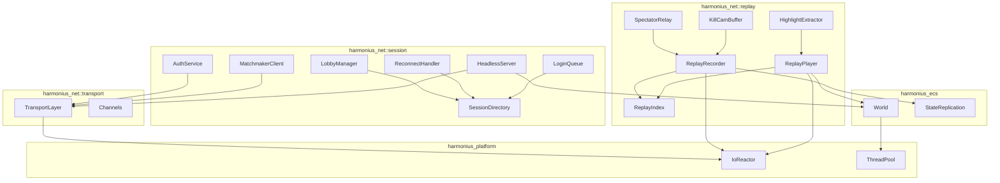
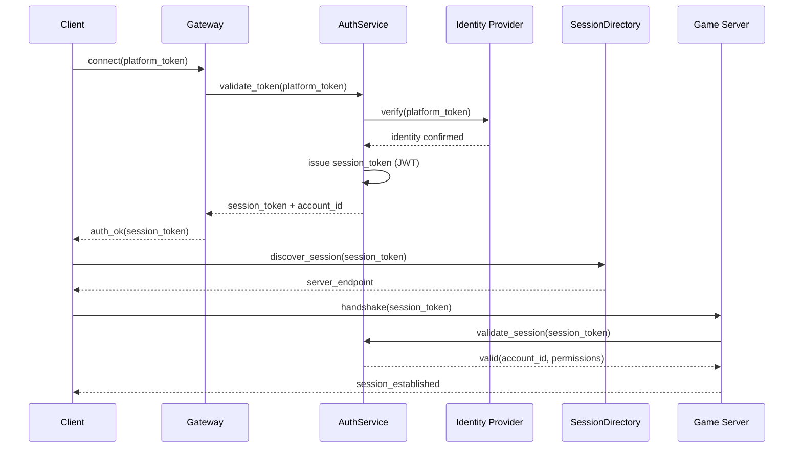
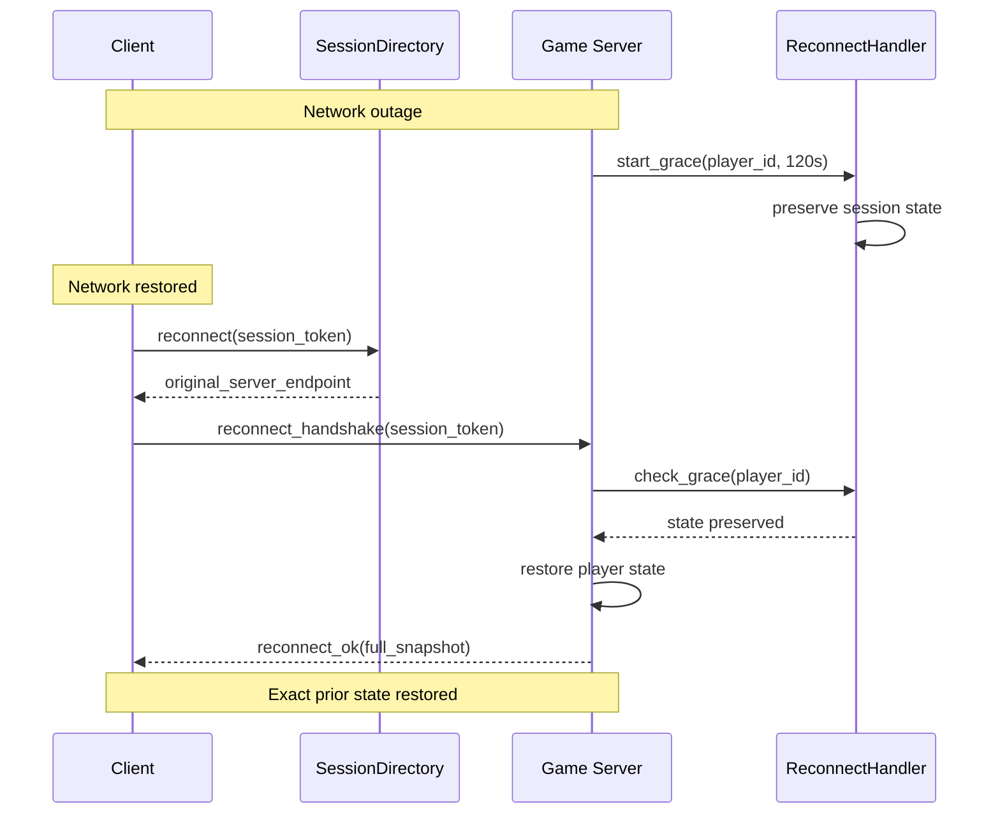
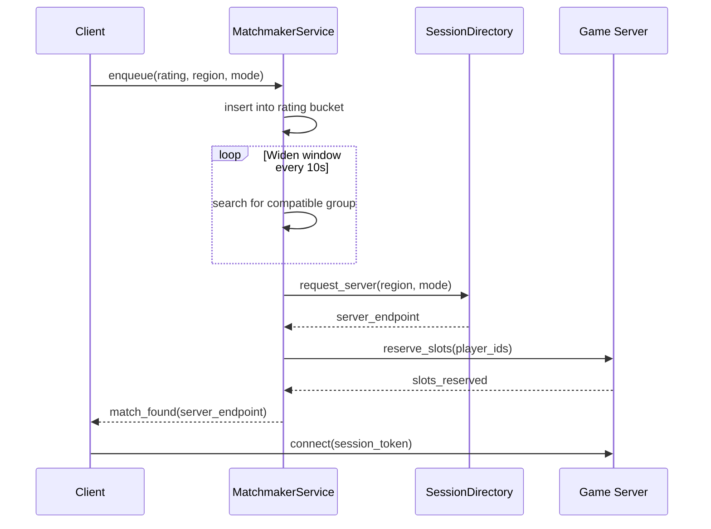
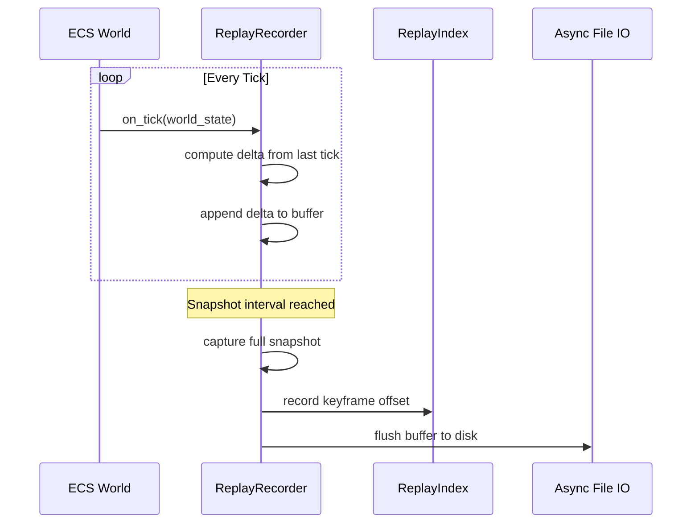
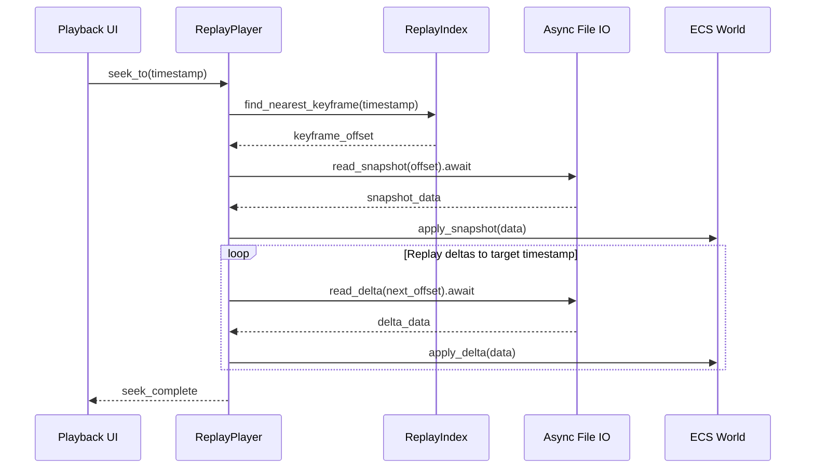
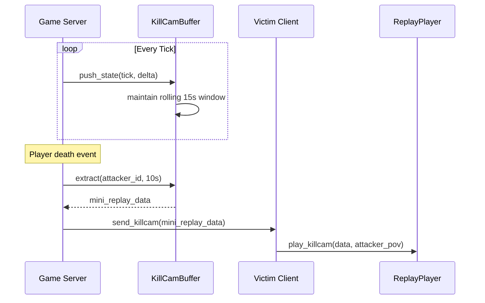
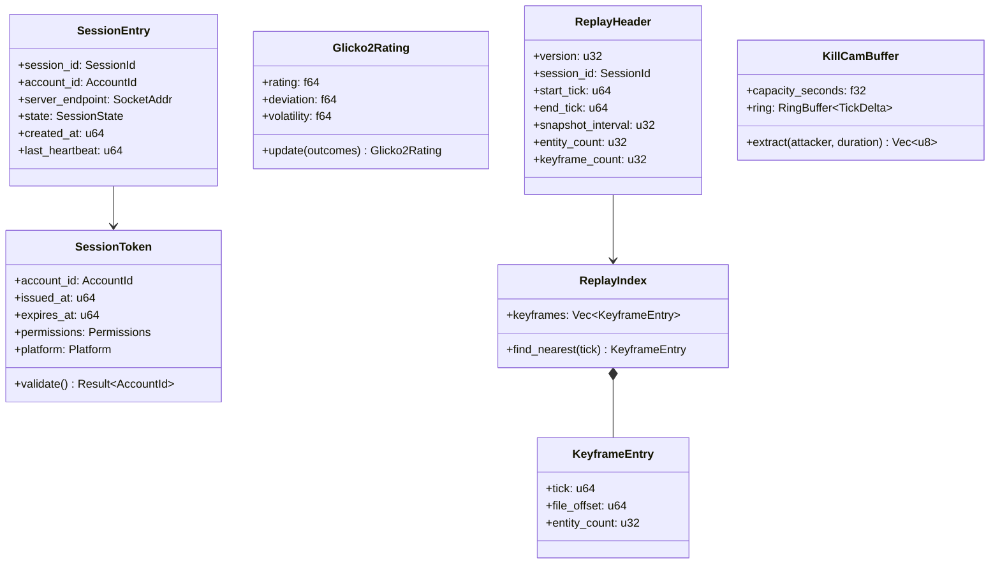

# Sessions and Replay Design

## Requirements Trace

> **Canonical sources:** Features, requirements, and user stories are defined in
> [features/networking/](../../features/networking/),
> [requirements/networking/](../../requirements/networking/), and
> [user-stories/networking/](../../user-stories/networking/). The table below traces design elements
> to those definitions.

| Feature | Requirement |
|---------|-------------|
| F-8.5.1 | R-8.5.1     |
| F-8.5.2 | R-8.5.2     |
| F-8.5.3 | R-8.5.3     |
| F-8.5.4 | R-8.5.4     |
| F-8.5.5 | R-8.5.5     |
| F-8.5.6 | R-8.5.6     |
| F-8.5.7 | R-8.5.7     |
| F-8.5.8 | R-8.5.8     |
| F-8.5.9 | R-8.5.9     |
| F-8.6.1 | R-8.6.1     |
| F-8.6.2 | R-8.6.2     |
| F-8.6.3 | R-8.6.3     |
| F-8.6.4 | R-8.6.4     |
| F-8.6.5 | R-8.6.5     |

1. **F-8.5.1** — Login and authentication via OAuth 2.0 / platform accounts
2. **F-8.5.2** — Skill-based and region-based matchmaking (Glicko-2)
3. **F-8.5.3** — Lobby and party system with role designation
4. **F-8.5.4** — Dedicated server cluster management
5. **F-8.5.5** — Session discovery and reconnection (120 s grace)
6. **F-8.5.6** — Cross-play matchmaking and account linking
7. **F-8.5.7** — Login queue and capacity management
8. **F-8.5.8** — Headless dedicated game server (Docker)
9. **F-8.5.9** — Skill-based matchmaking microservice (Glicko-2)
10. **F-8.6.1** — State recording with snapshots and deltas
11. **F-8.6.2** — Deterministic playback without live server
12. **F-8.6.3** — Seek, fast-forward, slow motion, pause
13. **F-8.6.4** — Live spectator mode with configurable delay
14. **F-8.6.5** — Kill cam and highlight extraction

## Overview

The session subsystem manages every stage of a player's connection lifecycle: authentication,
matchmaking, lobby formation, server assignment, reconnection, and graceful teardown. The replay
subsystem records authoritative world state as periodic full snapshots interleaved with per-tick
deltas, enabling deterministic playback, timeline scrubbing, live spectating, kill cams, and
highlight extraction.

Both subsystems are 100% ECS-based. Session state lives as components on per-player entities. Replay
recording and playback are ECS systems that observe or replay the replication stream. All I/O is
async (IOCP / GCD / io_uring). Infrastructure runs self-hosted on AWS via Kubernetes.

## Architecture

### Module Boundaries



```text
harmonius_net/
├── session/
│   ├── auth.rs          # AuthService, platform
│   │                    # identity providers
│   ├── matchmaker.rs    # MatchmakerClient,
│   │                    # Glicko2Rating
│   ├── lobby.rs         # LobbyManager, Party,
│   │                    # ReadyCheck
│   ├── directory.rs     # SessionDirectory,
│   │                    # SessionEntry
│   ├── reconnect.rs     # ReconnectHandler,
│   │                    # GraceWindow
│   ├── queue.rs         # LoginQueue,
│   │                    # QueuePriority
│   └── headless.rs      # HeadlessServer config
│                        # and health endpoints
└── replay/
    ├── recorder.rs      # ReplayRecorder,
    │                    # snapshot + delta writer
    ├── player.rs        # ReplayPlayer,
    │                    # deterministic playback
    ├── index.rs         # ReplayIndex, keyframe
    │                    # seek table
    ├── spectator.rs     # SpectatorRelay,
    │                    # fan-out distribution
    ├── killcam.rs       # KillCamBuffer, rolling
    │                    # window capture
    └── highlight.rs     # HighlightExtractor,
                         # clip export
```

### Authentication Flow



### Reconnection Flow



### Matchmaking Flow



### Replay Recording Flow



### Replay Playback and Seek



### Kill Cam Pipeline



### Core Data Structures



## API Design

### Session Types

```rust
/// Unique account identifier across all platforms.
#[derive(
    Clone, Copy, Debug, PartialEq, Eq, Hash,
)]
pub struct AccountId(pub u64);

/// Unique session identifier.
#[derive(
    Clone, Copy, Debug, PartialEq, Eq, Hash,
)]
pub struct SessionId(pub u128);

/// Platform identity provider.
#[derive(
    Clone, Copy, Debug, PartialEq, Eq, Hash,
)]
pub enum Platform {
    Steam,
    PlayStation,
    Xbox,
    AppleGameCenter,
    Google,
    Custom,
}

/// Session lifecycle state.
#[derive(
    Clone, Copy, Debug, PartialEq, Eq,
)]
pub enum SessionState {
    Connecting,
    Authenticating,
    Active,
    Migrating,
    Reconnecting,
    Disconnected,
}

/// JWT-like session token issued after
/// authentication.
pub struct SessionToken {
    pub account_id: AccountId,
    pub session_id: SessionId,
    pub platform: Platform,
    pub issued_at: u64,
    pub expires_at: u64,
    pub permissions: Permissions,
    pub signature: [u8; 64],
}

impl SessionToken {
    /// Validate token signature and expiration.
    pub fn validate(
        &self,
        key: &SigningKey,
    ) -> Result<AccountId, AuthError> { .. }

    /// Check if the token has expired.
    pub fn is_expired(&self, now: u64) -> bool {
        now >= self.expires_at
    }
}

/// Bitflags for account permissions.
#[derive(Clone, Copy, Debug)]
pub struct Permissions(pub u32);

impl Permissions {
    pub const PLAY: Self = Self(1 << 0);
    pub const SPECTATE: Self = Self(1 << 1);
    pub const MODERATE: Self = Self(1 << 2);
    pub const ADMIN: Self = Self(1 << 3);
    pub const VIP_QUEUE: Self = Self(1 << 4);
}
```

### Authentication Service

```rust
/// Configuration for the auth service.
pub struct AuthConfig {
    /// Token time-to-live in seconds.
    pub token_ttl_seconds: u64,
    /// Maximum concurrent authentication
    /// requests.
    pub max_concurrent_auths: u32,
    /// Enabled platform identity providers.
    pub enabled_platforms: Vec<Platform>,
    /// HMAC signing key for session tokens.
    pub signing_key: SigningKey,
}

/// Authentication service. Validates platform
/// tokens and issues session tokens.
pub struct AuthService { /* ... */ }

impl AuthService {
    pub fn new(config: AuthConfig) -> Self;

    /// Authenticate a player using a platform
    /// token. Returns a signed session token.
    /// Async: contacts the identity provider.
    pub async fn authenticate(
        &self,
        platform: Platform,
        platform_token: &[u8],
    ) -> Result<SessionToken, AuthError>;

    /// Validate an existing session token.
    /// Local operation (no network call).
    pub fn validate_session(
        &self,
        token: &SessionToken,
    ) -> Result<AccountId, AuthError>;

    /// Link a second platform account to an
    /// existing game account.
    pub async fn link_account(
        &self,
        account_id: AccountId,
        platform: Platform,
        platform_token: &[u8],
    ) -> Result<(), AuthError>;

    /// Revoke a session token (logout or ban).
    pub async fn revoke(
        &self,
        session_id: SessionId,
    ) -> Result<(), AuthError>;
}

pub enum AuthError {
    InvalidToken,
    Expired,
    PlatformUnavailable { platform: Platform },
    AccountBanned { until: Option<u64> },
    RateLimited,
    Internal,
}
```

### Session Directory

```rust
/// An entry in the session directory.
pub struct SessionEntry {
    pub session_id: SessionId,
    pub account_id: AccountId,
    pub server_endpoint: SocketAddr,
    pub state: SessionState,
    pub shard_id: ShardId,
    pub zone_id: ZoneId,
    pub created_at: u64,
    pub last_heartbeat: u64,
}

/// Directory service for session discovery and
/// reconnection routing.
pub struct SessionDirectory { /* ... */ }

impl SessionDirectory {
    pub fn new() -> Self;

    /// Register a new session.
    pub async fn register(
        &self,
        entry: SessionEntry,
    ) -> Result<(), DirectoryError>;

    /// Look up a session by account.
    pub async fn find_by_account(
        &self,
        account_id: AccountId,
    ) -> Result<Option<SessionEntry>, DirectoryError>;

    /// Update session state and heartbeat.
    pub async fn update(
        &self,
        session_id: SessionId,
        state: SessionState,
    ) -> Result<(), DirectoryError>;

    /// Remove a session (logout / timeout).
    pub async fn remove(
        &self,
        session_id: SessionId,
    ) -> Result<(), DirectoryError>;

    /// List all sessions on a server (for drain).
    pub async fn list_by_server(
        &self,
        endpoint: SocketAddr,
    ) -> Result<Vec<SessionEntry>, DirectoryError>;
}
```

### Reconnection Handler

```rust
/// Configuration for reconnection grace windows.
pub struct ReconnectConfig {
    /// Grace window duration in seconds.
    /// Default: 120 s desktop, 180 s mobile.
    pub grace_seconds: u64,
    /// Maximum preserved sessions per server.
    pub max_preserved: u32,
}

/// Preserved session state during a grace window.
pub struct PreservedSession {
    pub account_id: AccountId,
    pub session_id: SessionId,
    /// Full ECS snapshot of the player entity
    /// and owned entities.
    pub entity_snapshot: Vec<u8>,
    /// Party membership and role.
    pub party_state: Option<PartySnapshot>,
    /// Timestamp when grace window expires.
    pub expires_at: u64,
}

/// Handles reconnection with state preservation.
pub struct ReconnectHandler { /* ... */ }

impl ReconnectHandler {
    pub fn new(config: ReconnectConfig) -> Self;

    /// Begin grace window for a disconnected
    /// player. Preserves their ECS state.
    pub fn preserve(
        &self,
        session: PreservedSession,
    ) -> Result<(), ReconnectError>;

    /// Attempt to restore a reconnecting player.
    /// Returns the preserved state if the grace
    /// window has not expired.
    pub fn restore(
        &self,
        account_id: AccountId,
    ) -> Result<PreservedSession, ReconnectError>;

    /// Expire stale grace windows. Called
    /// periodically by a timer system.
    pub fn expire_stale(&self, now: u64) -> u32;
}

pub enum ReconnectError {
    GraceExpired,
    NotFound,
    CapacityExceeded,
}
```

### Lobby and Party System

```rust
/// Party role designation.
#[derive(Clone, Copy, Debug, PartialEq, Eq)]
pub enum PartyRole {
    Tank,
    Healer,
    Dps,
    Support,
    Unassigned,
}

/// A member of a party.
pub struct PartyMember {
    pub account_id: AccountId,
    pub role: PartyRole,
    pub is_leader: bool,
    pub is_ready: bool,
    pub platform: Platform,
}

/// Party identifier.
#[derive(
    Clone, Copy, Debug, PartialEq, Eq, Hash,
)]
pub struct PartyId(pub u64);

/// Manages parties and lobbies.
pub struct LobbyManager { /* ... */ }

impl LobbyManager {
    pub fn new() -> Self;

    /// Create a new party with the creator as
    /// leader.
    pub fn create_party(
        &self,
        leader: AccountId,
    ) -> Result<PartyId, LobbyError>;

    /// Invite a player to the party.
    pub async fn invite(
        &self,
        party_id: PartyId,
        inviter: AccountId,
        target: AccountId,
    ) -> Result<(), LobbyError>;

    /// Accept a party invitation.
    pub fn accept_invite(
        &self,
        party_id: PartyId,
        account_id: AccountId,
    ) -> Result<(), LobbyError>;

    /// Set a member's role.
    pub fn set_role(
        &self,
        party_id: PartyId,
        account_id: AccountId,
        role: PartyRole,
    ) -> Result<(), LobbyError>;

    /// Initiate a ready check. Returns a future
    /// that resolves when all members respond or
    /// the timeout expires.
    pub async fn ready_check(
        &self,
        party_id: PartyId,
        timeout_seconds: u32,
    ) -> Result<ReadyCheckResult, LobbyError>;

    /// Get party members (survives zone
    /// transitions and server migrations).
    pub fn members(
        &self,
        party_id: PartyId,
    ) -> Result<Vec<PartyMember>, LobbyError>;

    /// Transfer party state across a server
    /// migration.
    pub fn snapshot(
        &self,
        party_id: PartyId,
    ) -> Result<PartySnapshot, LobbyError>;

    /// Restore party state on the destination
    /// server.
    pub fn restore(
        &self,
        snapshot: PartySnapshot,
    ) -> Result<PartyId, LobbyError>;
}

#[derive(Clone, Copy, Debug, PartialEq, Eq)]
pub enum ReadyCheckResult {
    AllReady,
    Timeout { not_ready: u32 },
    Cancelled,
}
```

### Matchmaking

```rust
/// Glicko-2 skill rating.
#[derive(Clone, Copy, Debug)]
pub struct Glicko2Rating {
    /// Skill rating (default 1500.0).
    pub rating: f64,
    /// Rating deviation (default 350.0).
    pub deviation: f64,
    /// Rating volatility (default 0.06).
    pub volatility: f64,
}

impl Glicko2Rating {
    pub fn new() -> Self;

    /// Update rating after a match.
    pub fn update(
        &self,
        opponents: &[Glicko2Rating],
        outcomes: &[MatchOutcome],
    ) -> Self;
}

#[derive(Clone, Copy, Debug)]
pub enum MatchOutcome {
    Win,
    Loss,
    Draw,
}

/// Matchmaking queue entry.
pub struct QueueEntry {
    pub account_id: AccountId,
    pub party_id: Option<PartyId>,
    pub rating: Glicko2Rating,
    pub region: Region,
    pub game_mode: GameMode,
    pub cross_play: bool,
    pub platform: Platform,
    pub enqueued_at: u64,
}

/// Matchmaker configuration.
pub struct MatchmakerConfig {
    /// Initial rating window (default 100.0).
    pub initial_window: f64,
    /// Window widening per interval
    /// (default 50.0).
    pub widen_step: f64,
    /// Widening interval in seconds
    /// (default 10).
    pub widen_interval_seconds: u32,
    /// Maximum rating window before any match.
    pub max_window: f64,
    /// Required players per match.
    pub match_size: u32,
}

/// Matchmaking service client.
pub struct MatchmakerClient { /* ... */ }

impl MatchmakerClient {
    pub fn new(
        config: MatchmakerConfig,
    ) -> Self;

    /// Enqueue a player or party for matching.
    pub async fn enqueue(
        &self,
        entry: QueueEntry,
    ) -> Result<QueueTicket, MatchmakerError>;

    /// Cancel a queue entry.
    pub async fn cancel(
        &self,
        ticket: QueueTicket,
    ) -> Result<(), MatchmakerError>;

    /// Poll queue status (position, ETA).
    pub async fn status(
        &self,
        ticket: QueueTicket,
    ) -> Result<QueueStatus, MatchmakerError>;
}

pub struct QueueTicket(pub u64);

pub struct QueueStatus {
    pub position: u32,
    pub estimated_wait_seconds: u32,
    pub current_window: f64,
}
```

### Login Queue

```rust
/// Queue priority tier.
#[derive(
    Clone, Copy, Debug, PartialEq, Eq,
    PartialOrd, Ord,
)]
pub enum QueuePriority {
    Standard,
    Returning,
    Subscriber,
    Founder,
    Admin,
}

/// Login queue entry.
pub struct QueueEntry {
    pub account_id: AccountId,
    pub priority: QueuePriority,
    pub enqueued_at: u64,
    pub position: u32,
}

/// Manages login queues when servers are at
/// capacity.
pub struct LoginQueue { /* ... */ }

impl LoginQueue {
    pub fn new(capacity: u32) -> Self;

    /// Add a player to the queue.
    pub fn enqueue(
        &self,
        account_id: AccountId,
        priority: QueuePriority,
    ) -> Result<QueuePosition, QueueError>;

    /// Get current position and ETA.
    pub fn position(
        &self,
        account_id: AccountId,
    ) -> Result<QueuePosition, QueueError>;

    /// Dequeue the next player when a slot
    /// opens.
    pub fn dequeue(
        &self,
    ) -> Option<AccountId>;

    /// Preserve position for a temporarily
    /// disconnected player.
    pub fn preserve_position(
        &self,
        account_id: AccountId,
        timeout_seconds: u32,
    ) -> Result<(), QueueError>;

    /// Current queue depth.
    pub fn depth(&self) -> u32;
}

pub struct QueuePosition {
    pub position: u32,
    pub estimated_wait_seconds: u32,
}
```

### Headless Server

```rust
/// Headless server configuration, driven by
/// command-line args and environment variables.
pub struct HeadlessConfig {
    pub bind_address: SocketAddr,
    pub tick_rate: u32,
    pub max_players: u32,
    pub map_name: String,
    pub game_mode: GameMode,
    pub health_port: u16,
}

impl HeadlessConfig {
    /// Parse from command-line args and env vars.
    pub fn from_env() -> Result<Self, ConfigError>;
}

/// Health check response for load balancer
/// integration.
pub struct HealthStatus {
    pub server_id: ServerId,
    pub player_count: u32,
    pub max_players: u32,
    pub tick_rate: u32,
    pub current_tps: f32,
    pub cpu_percent: f32,
    pub memory_mb: u32,
    pub uptime_seconds: u64,
    pub state: ServerState,
}

#[derive(Clone, Copy, Debug, PartialEq, Eq)]
pub enum ServerState {
    Starting,
    Ready,
    Active,
    Draining,
    ShuttingDown,
}

/// Headless game server process.
pub struct HeadlessServer { /* ... */ }

impl HeadlessServer {
    pub fn new(config: HeadlessConfig) -> Self;

    /// Run the headless server. Blocks until
    /// shutdown is requested.
    pub async fn run(&mut self) -> Result<(), ServerError>;

    /// Request graceful shutdown. Saves world
    /// state and migrates players before exit.
    pub async fn shutdown(&self) -> Result<(), ServerError>;

    /// Get current health status.
    pub fn health(&self) -> HealthStatus;
}
```

### Replay Recorder

```rust
/// Replay recorder configuration.
pub struct RecorderConfig {
    /// Ticks between full snapshots.
    /// Default: 300 (10 s at 30 tps).
    pub snapshot_interval: u32,
    /// Maximum replay duration in ticks.
    pub max_ticks: u64,
    /// Compression algorithm for snapshots and
    /// deltas.
    pub compression: Compression,
}

#[derive(Clone, Copy, Debug, PartialEq, Eq)]
pub enum Compression {
    None,
    Lz4,
    Zstd,
}

/// Replay file header.
pub struct ReplayHeader {
    pub version: u32,
    pub session_id: SessionId,
    pub start_tick: u64,
    pub end_tick: u64,
    pub snapshot_interval: u32,
    pub entity_count: u32,
    pub keyframe_count: u32,
    pub compression: Compression,
}

/// Records gameplay state to a replay file.
/// Runs as an ECS system on the server.
pub struct ReplayRecorder { /* ... */ }

impl ReplayRecorder {
    pub fn new(config: RecorderConfig) -> Self;

    /// Begin recording. Opens the replay file
    /// for async writing.
    pub async fn start(
        &mut self,
        session_id: SessionId,
        path: &Path,
    ) -> Result<(), ReplayError>;

    /// Record one tick of state. Called by the
    /// replication system each server tick.
    pub fn record_tick(
        &mut self,
        tick: u64,
        world: &World,
    ) -> Result<(), ReplayError>;

    /// Finalize the replay file. Writes header
    /// and index, flushes all buffers.
    pub async fn finish(
        &mut self,
    ) -> Result<ReplayHeader, ReplayError>;

    /// Whether a full snapshot is due this tick.
    pub fn is_snapshot_tick(
        &self,
        tick: u64,
    ) -> bool;
}
```

### Replay Player

```rust
/// Playback speed multiplier.
#[derive(Clone, Copy, Debug, PartialEq)]
pub enum PlaybackSpeed {
    Paused,
    FrameByFrame,
    Quarter,
    Half,
    Normal,
    Double,
    Quad,
    Octa,
}

/// Replays a recorded session deterministically.
pub struct ReplayPlayer { /* ... */ }

impl ReplayPlayer {
    /// Open a replay file for playback.
    pub async fn open(
        path: &Path,
    ) -> Result<Self, ReplayError>;

    /// Get the replay header metadata.
    pub fn header(&self) -> &ReplayHeader;

    /// Seek to a specific tick. Loads nearest
    /// keyframe snapshot and replays deltas
    /// forward. Must complete within 1 second.
    pub async fn seek(
        &mut self,
        target_tick: u64,
        world: &mut World,
    ) -> Result<(), ReplayError>;

    /// Advance playback by one tick. Applies the
    /// next delta to the world.
    pub fn advance_tick(
        &mut self,
        world: &mut World,
    ) -> Result<TickResult, ReplayError>;

    /// Set playback speed.
    pub fn set_speed(
        &mut self,
        speed: PlaybackSpeed,
    );

    /// Current playback position (tick).
    pub fn current_tick(&self) -> u64;

    /// Total duration in ticks.
    pub fn total_ticks(&self) -> u64;

    /// Progress as a fraction [0.0, 1.0].
    pub fn progress(&self) -> f64;
}

pub enum TickResult {
    /// Delta applied, more ticks remain.
    Advanced { tick: u64 },
    /// Reached end of replay.
    EndOfReplay,
}
```

### Replay Index

```rust
/// A keyframe entry in the seek index.
pub struct KeyframeEntry {
    /// Tick number of this keyframe.
    pub tick: u64,
    /// Byte offset in the replay file.
    pub file_offset: u64,
    /// Number of entities in the snapshot.
    pub entity_count: u32,
}

/// Seek index for fast random access into
/// replay files.
pub struct ReplayIndex {
    keyframes: Vec<KeyframeEntry>,
}

impl ReplayIndex {
    /// Build an index from a replay file header.
    pub fn from_header(
        header: &ReplayHeader,
        entries: Vec<KeyframeEntry>,
    ) -> Self;

    /// Find the nearest keyframe at or before
    /// the target tick.
    pub fn find_nearest(
        &self,
        target_tick: u64,
    ) -> Option<&KeyframeEntry>;

    /// Number of keyframes in the index.
    pub fn keyframe_count(&self) -> u32;
}
```

### Kill Cam Buffer

```rust
/// Configuration for the kill cam rolling
/// buffer.
pub struct KillCamConfig {
    /// Buffer duration in seconds.
    /// Default: 15.0.
    pub buffer_seconds: f32,
    /// Clip duration sent to victim.
    /// Default: 10.0.
    pub clip_seconds: f32,
}

/// Per-tick delta stored in the ring buffer.
pub struct TickDelta {
    pub tick: u64,
    pub data: Vec<u8>,
}

/// Rolling buffer of recent state for kill cam
/// generation. Runs on the server.
pub struct KillCamBuffer { /* ... */ }

impl KillCamBuffer {
    pub fn new(
        config: KillCamConfig,
        tick_rate: u32,
    ) -> Self;

    /// Push the current tick's delta into the
    /// ring buffer. Oldest entries are evicted.
    pub fn push(&mut self, delta: TickDelta);

    /// Extract a kill cam clip for the given
    /// attacker over the configured duration.
    /// Returns serialized mini-replay data.
    pub fn extract(
        &self,
        attacker_entity: Entity,
        duration_seconds: f32,
    ) -> Result<Vec<u8>, ReplayError>;
}
```

### Spectator Relay

```rust
/// Spectator mode configuration.
pub struct SpectatorConfig {
    /// Delay in seconds to prevent ghosting.
    /// Default: 30.
    pub delay_seconds: u32,
    /// Maximum spectators per relay server.
    pub max_per_relay: u32,
}

/// Camera mode for spectators.
#[derive(Clone, Copy, Debug, PartialEq, Eq)]
pub enum SpectatorCamera {
    Free,
    PlayerLocked { target: Entity },
    OverheadTactical,
}

/// Fan-out relay for distributing the
/// replication stream to spectators.
pub struct SpectatorRelay { /* ... */ }

impl SpectatorRelay {
    pub fn new(
        config: SpectatorConfig,
    ) -> Self;

    /// Add a spectator client to the relay.
    pub fn add_spectator(
        &self,
        session_id: SessionId,
    ) -> Result<(), SpectatorError>;

    /// Remove a spectator.
    pub fn remove_spectator(
        &self,
        session_id: SessionId,
    ) -> Result<(), SpectatorError>;

    /// Feed a tick of replication data into the
    /// delay buffer. Spectators receive data
    /// after the configured delay.
    pub fn feed_tick(
        &self,
        tick: u64,
        data: &[u8],
    );

    /// Flush delayed data to connected
    /// spectators. Called each server tick.
    pub async fn flush(&self);

    /// Current spectator count.
    pub fn spectator_count(&self) -> u32;
}
```

### Highlight Extractor

```rust
/// Extracts clips from completed replay files.
pub struct HighlightExtractor { /* ... */ }

impl HighlightExtractor {
    /// Extract a sub-replay from a completed
    /// replay file between two tick ranges.
    pub async fn extract_clip(
        source: &Path,
        start_tick: u64,
        end_tick: u64,
        output: &Path,
    ) -> Result<ReplayHeader, ReplayError>;
}
```

### Error Types

```rust
pub enum ReplayError {
    IoError { source: IoError },
    CorruptFile,
    UnsupportedVersion { version: u32 },
    SeekOutOfRange { tick: u64, max: u64 },
    NotRecording,
    AlreadyRecording,
}

pub enum LobbyError {
    PartyNotFound,
    PartyFull,
    NotLeader,
    AlreadyInParty,
    InviteDeclined,
    InviteExpired,
}

pub enum MatchmakerError {
    AlreadyQueued,
    TicketNotFound,
    ServiceUnavailable,
    QueueFull,
}

pub enum QueueError {
    AlreadyQueued,
    NotInQueue,
    QueueDisabled,
}
```

## Data Flow

### Session Lifecycle

1. **Authenticate.** Client sends platform token to the gateway. `AuthService` contacts the identity
   provider, validates credentials, and issues a signed `SessionToken` (JWT-like). The token is
   short-lived (configurable TTL, default 24 h).

2. **Discover.** Client queries `SessionDirectory` with the session token. The directory returns the
   endpoint of the assigned game server (based on shard, zone, or matchmaking result).

3. **Connect.** Client performs a transport handshake with the game server, presenting the session
   token. The server validates the token locally (signature + expiry) and registers the session in
   the directory.

4. **Play.** Session state is tracked as ECS components on the player entity: `SessionComponent`
   (state, heartbeat), `PartyComponent` (party membership), `MatchmakingComponent` (rating, queue
   status).

5. **Reconnect.** On disconnect, the server starts a grace timer via `ReconnectHandler`. The player
   entity and all owned entities are preserved. If the client reconnects within the grace window,
   state is restored atomically.

6. **Logout.** On graceful disconnect or grace expiry, the session is removed from the directory and
   the player entity is despawned (after persisting to database).

### Replay Data Pipeline

1. **Record.** The `ReplayRecorder` system observes the replication stream each tick. It computes a
   delta (changed component fields) and appends it to a write buffer. Every N ticks (configurable),
   it captures a full snapshot and records a keyframe in the index.

2. **Flush.** Buffered data is flushed to disk via async I/O. The recorder never blocks the
   simulation tick.

3. **Finalize.** When recording ends, the header and index are written. The file is a self-contained
   replay.

4. **Seek.** On playback, `ReplayPlayer` loads the nearest keyframe snapshot (binary search in the
   index) and replays deltas forward to the target tick.

5. **Kill cam.** `KillCamBuffer` maintains a rolling ring buffer of the last 15 s of deltas on the
   server. On a death event, it extracts the relevant window from the attacker's perspective and
   sends it as a mini-replay.

6. **Spectate.** `SpectatorRelay` buffers the replication stream with a configurable delay, then
   fans it out to all connected spectators via relay servers.

### Replay File Format

```text
+--------------------------------------------------+
| ReplayHeader (fixed size, 128 bytes)             |
+--------------------------------------------------+
| Keyframe Index (variable: N * KeyframeEntry)     |
+--------------------------------------------------+
| Tick 0: Full Snapshot (compressed)               |
+--------------------------------------------------+
| Tick 1: Delta (compressed)                       |
+--------------------------------------------------+
| Tick 2: Delta (compressed)                       |
+--------------------------------------------------+
| ...                                              |
+--------------------------------------------------+
| Tick N: Full Snapshot (keyframe, compressed)      |
+--------------------------------------------------+
| Tick N+1: Delta (compressed)                     |
+--------------------------------------------------+
| ...                                              |
+--------------------------------------------------+
```

## Platform Considerations

### Session Infrastructure

| Component | Deployment | Notes |
|-----------|------------|-------|
| AuthService | AWS ECS Fargate | Stateless; scales horizontally |
| SessionDirectory | AWS DynamoDB | Low-latency key-value lookups |
| MatchmakerService | AWS ECS Fargate | Standalone microservice, REST/gRPC |
| LobbyManager | In-process (game server) | Party state is per-server, synced via bus |
| LoginQueue | In-process (gateway) | Per-gateway queue with global coordination |
| HeadlessServer | AWS ECS / Kubernetes | Linux containers, Alpine/Debian slim |

### Replay I/O

| Platform | Async I/O | Notes |
|----------|-----------|-------|
| Windows | IOCP | Overlapped file writes via `windows-sys` |
| macOS | GCD Dispatch IO | C ABI wrappers |
| Linux | io_uring | `IORING_OP_WRITE` for replay flush |

### Mobile Adaptations

| Feature | Desktop | Mobile |
|---------|---------|--------|
| Reconnect grace window | 120 s | 180 s |
| Fast-forward max | 8x | 4x |
| Replay compression | zstd | zstd (higher ratio) |
| Queue notification | In-app | Push notification |
| Spectator cameras | Free, locked, overhead | Locked, overhead only |

## Test Plan

### Unit Tests

| Test                                 | Req     |
|--------------------------------------|---------|
| `test_auth_valid_token`              | R-8.5.1 |
| `test_auth_expired_token`            | R-8.5.1 |
| `test_auth_mfa_challenge`            | R-8.5.1 |
| `test_glicko2_rating_update`         | R-8.5.9 |
| `test_glicko2_window_widening`       | R-8.5.9 |
| `test_party_create_invite_accept`    | R-8.5.3 |
| `test_party_persist_across_snapshot` | R-8.5.3 |
| `test_ready_check_all_ready`         | R-8.5.3 |
| `test_ready_check_timeout`           | R-8.5.3 |
| `test_reconnect_within_grace`        | R-8.5.5 |
| `test_reconnect_expired_grace`       | R-8.5.5 |
| `test_login_queue_priority`          | R-8.5.7 |
| `test_login_queue_position_preserve` | R-8.5.7 |
| `test_replay_delta_compression`      | R-8.6.1 |
| `test_replay_snapshot_interval`      | R-8.6.1 |
| `test_replay_seek_to_keyframe`       | R-8.6.3 |
| `test_replay_seek_between_keyframes` | R-8.6.3 |
| `test_killcam_buffer_rolling`        | R-8.6.5 |
| `test_killcam_extract`               | R-8.6.5 |
| `test_highlight_extract_clip`        | R-8.6.5 |

1. **`test_auth_valid_token`** — Issue and validate a session token; verify account_id roundtrip.
2. **`test_auth_expired_token`** — Validate an expired token; verify rejection.
3. **`test_auth_mfa_challenge`** — Simulate MFA challenge-response; verify success and failure
   paths.
4. **`test_glicko2_rating_update`** — Update rating after win/loss; verify rating, deviation,
   volatility change correctly.
5. **`test_glicko2_window_widening`** — Simulate queue time exceeding widen interval; verify window
   expands by configured step.
6. **`test_party_create_invite_accept`** — Create party, invite player, accept; verify membership
   and roles.
7. **`test_party_persist_across_snapshot`** — Snapshot and restore a party; verify all members and
   roles preserved.
8. **`test_ready_check_all_ready`** — All members respond ready; verify `AllReady` result.
9. **`test_ready_check_timeout`** — One member does not respond; verify `Timeout` result.
10. **`test_reconnect_within_grace`** — Preserve and restore within grace window; verify full state.
11. **`test_reconnect_expired_grace`** — Attempt restore after expiry; verify `GraceExpired` error.
12. **`test_login_queue_priority`** — Enqueue standard and VIP; verify VIP dequeues first.
13. **`test_login_queue_position_preserve`** — Disconnect and reconnect within timeout; verify
    position preserved.
14. **`test_replay_delta_compression`** — Record 100 ticks; verify deltas are smaller than full
    snapshots.
15. **`test_replay_snapshot_interval`** — Record with interval=10; verify every 10th tick is a full
    snapshot.
16. **`test_replay_seek_to_keyframe`** — Seek to a keyframe tick; verify index returns exact match.
17. **`test_replay_seek_between_keyframes`** — Seek between keyframes; verify nearest-before
    keyframe is loaded.
18. **`test_killcam_buffer_rolling`** — Push 20 s of ticks into 15 s buffer; verify oldest 5 s
    evicted.
19. **`test_killcam_extract`** — Extract 10 s clip; verify correct tick range and attacker entity.
20. **`test_highlight_extract_clip`** — Extract sub-replay; verify header, index, and data are
    self-contained.

### Integration Tests

| Test                                     | Req         |
|------------------------------------------|-------------|
| `test_5000_concurrent_logins`            | R-8.5.1     |
| `test_cross_play_matchmaking`            | R-8.5.6     |
| `test_cross_play_opt_out`                | R-8.5.6     |
| `test_matchmaking_20k_players`           | R-8.5.2     |
| `test_reconnect_full_state`              | R-8.5.5     |
| `test_headless_64_players`               | R-8.5.8     |
| `test_headless_memory_budget`            | R-8.5.8.NF1 |
| `test_rolling_restart_zero_disconnects`  | R-8.5.4     |
| `test_replay_determinism`                | R-8.6.2     |
| `test_replay_seek_2h`                    | R-8.6.3     |
| `test_spectator_1000_viewers`            | R-8.6.4     |
| `test_spectator_delay_prevents_ghosting` | R-8.6.4     |
| `test_killcam_delivery`                  | R-8.6.5     |
| `test_cross_platform_replay`             | R-8.6.2     |

1. **`test_5000_concurrent_logins`** — Authenticate 5,000 concurrent logins; verify all complete
   within 5 s.
2. **`test_cross_play_matchmaking`** — Match PC + PS + Xbox players; verify all connect to same
   instance.
3. **`test_cross_play_opt_out`** — Opt out of cross-play; verify same-platform match only.
4. **`test_matchmaking_20k_players`** — Enqueue 20,000 players; verify all matched within 120 s with
   skill variance under threshold.
5. **`test_reconnect_full_state`** — Connect, simulate 10 s outage, reconnect; verify position,
   buffs, party restored.
6. **`test_headless_64_players`** — Launch headless Docker container, connect 64 players; verify
   tick rate maintained and health endpoint correct.
7. **`test_headless_memory_budget`** — 64 players, 30 tps, 10 min; verify RSS under 512 MB.
8. **`test_rolling_restart_zero_disconnects`** — Initiate rolling restart; verify all players
   drained and migrated.
9. **`test_replay_determinism`** — Record 60 s, play back twice; verify frame checksums match at 10
   sample points.
10. **`test_replay_seek_2h`** — Record 2-hour replay, seek to midpoint; verify seek completes within
    1 s.
11. **`test_spectator_1000_viewers`** — Connect 1,000 spectators via relay; verify delay and no
    gameplay RPC.
12. **`test_spectator_delay_prevents_ghosting`** — Verify spectator data arrives no earlier than
    configured delay.
13. **`test_killcam_delivery`** — Trigger death event; verify victim receives kill cam within 2 s.
14. **`test_cross_platform_replay`** — Record on PC, play back on mobile; verify visual hash match.

### Benchmarks

| Benchmark | Target | Source |
|-----------|--------|--------|
| Auth throughput | 5,000 logins / 5 s | R-8.5.1 |
| Matchmaking p95 | < 60 s at peak | R-8.5.9.NF1 |
| Reconnect restore | < 3 s | US-8.5.1 |
| Replay recording overhead | < 1% server CPU | R-8.6.1 |
| Replay seek (2 h file) | < 1 s | R-8.6.3 |
| Kill cam delivery | < 2 s | R-8.6.5 |
| Replay file size (30 min) | 70% smaller than full-snapshot | R-8.6.1 |
| Headless server RSS | < 512 MB (64 players) | R-8.5.8.NF1 |

## Design Q & A

**Q1. What is the biggest constraint limiting this design?**

The no-third-party-async-runtime constraint forces the matchmaking microservice, auth service, and
session directory to all use the custom IoReactor for HTTP serving and database access. This means
building a REST API server from raw TCP on the IoReactor rather than using an existing HTTP
framework. Lifting this would allow standard HTTP servers (hyper, axum) for microservices while
keeping the game server on IoReactor. The impact of removing it is significant: microservice
development speed would increase dramatically, but the codebase would split into two async worlds,
complicating shared code between game server and services.

**Q2. How can this design be improved?**

The reconnection system (F-8.5.5) preserves the player entity during the grace window but does not
preserve the player's position in matchmaking queues if they were queued when disconnected. The
Glicko-2 matchmaker (F-8.5.9) lacks party-vs-party rating where the group's composite rating
accounts for synergy. The replay recorder writes sequentially, which could bottleneck on disk I/O
for high-entity-count matches. Double-buffered recording with async flush would decouple tick
recording from disk writes more cleanly.

**Q3. Is there a better approach?**

For matchmaking, an Elo-based system would be simpler than Glicko-2 but lacks the confidence
intervals that Glicko-2 provides (deviation and volatility). Glicko-2 is the right choice because
new players with high uncertainty are matched more flexibly, converging to accurate ratings faster.
For replay storage, recording inputs rather than state snapshots would produce much smaller files
but requires perfect determinism across all platforms, which is not guaranteed with floating-point
physics. State-based recording is the safer choice for a cross-platform engine.

**Q4. Does this design solve all customer problems?**

US-8.6.9 requires cross-platform replay determinism verification, but the design does not specify
how to handle floating-point divergence across CPU architectures (x86 vs ARM). Missing: tournament
bracket management for esports (seeding, elimination, bracket progression). Missing: replay file
sharing and download from a central repository. Adding tournament support would enable competitive
esports games. Replay sharing would enable community content creation and coaching workflows.

**Q5. Is this design cohesive with the overall engine?**

Session state is tracked as ECS components (`SessionComponent`, `PartyComponent`,
`MatchmakingComponent`) on player entities, consistent with the engine's ECS-first design. The
replay recorder observes the replication stream, reusing the same delta/snapshot format from the
replication design rather than inventing a separate encoding. The headless server (F-8.5.8)
correctly excludes rendering, audio, and editor systems, matching the modular system architecture.
The kill cam buffer uses a ring buffer pattern consistent with the snapshot buffer in the
replication design. Replay I/O uses async file writes through the IoReactor, matching the platform
I/O constraint.

## Open Questions

1. **Session token rotation.** Should the server issue a new token on each reconnect to prevent
   replay attacks, or is the original token valid for the full session TTL?

2. **Cross-shard party persistence.** Parties currently live in-process on the game server. Should
   they be promoted to a cross-shard microservice so members on different shards stay in the same
   party without the inter-server bus?

3. **Replay format versioning.** When the ECS schema changes between builds, old replays may not be
   decodable. Strategy options: (a) replay-embedded schema (larger files), (b) separate schema
   registry, (c) version-locked replay player.

4. **Spectator stream encryption.** Should the spectator relay stream be encrypted? Encryption adds
   CPU cost per spectator but prevents stream interception for competitive integrity beyond the
   delay mechanism.

5. **Matchmaking service database.** Glicko-2 ratings need persistence. Candidates: DynamoDB
   (managed, key-value), PostgreSQL (transactional, relational). DynamoDB aligns with session
   directory choice; PostgreSQL enables complex rating queries.

6. **Kill cam attacker POV reconstruction.** The kill cam needs to reconstruct the attacker's
   camera. Options: (a) record camera state as part of the delta stream, (b) infer from attacker
   position and aim direction. Option (a) is more accurate but increases delta size.
