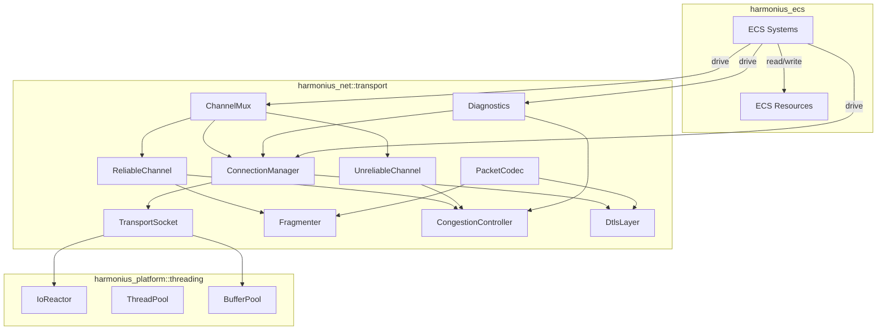
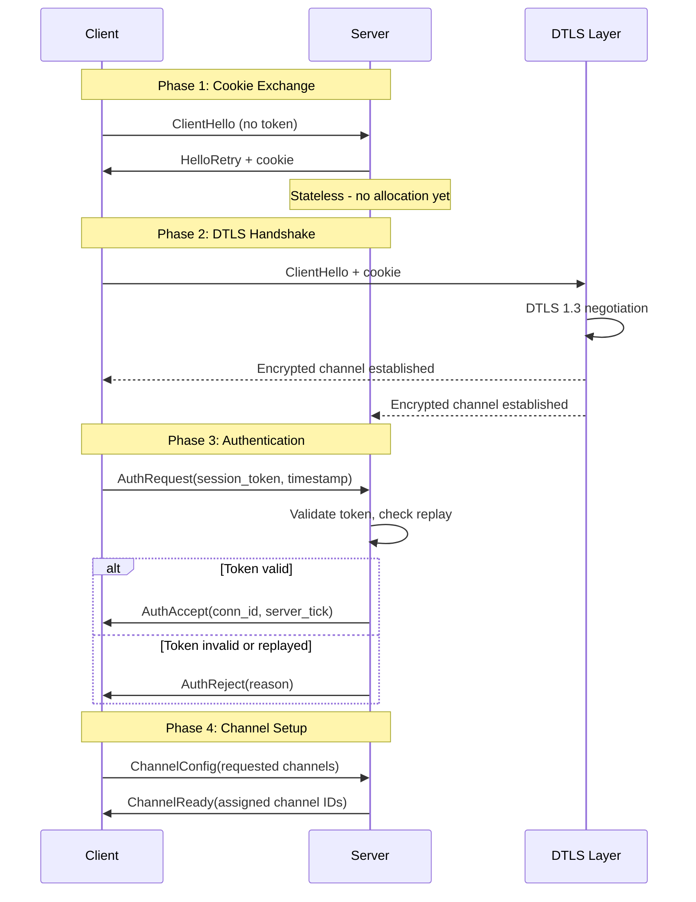
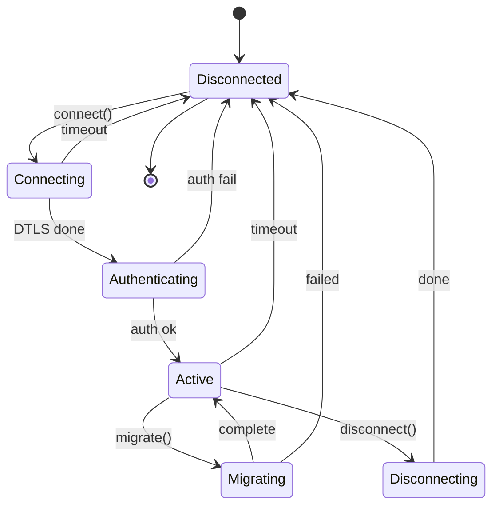
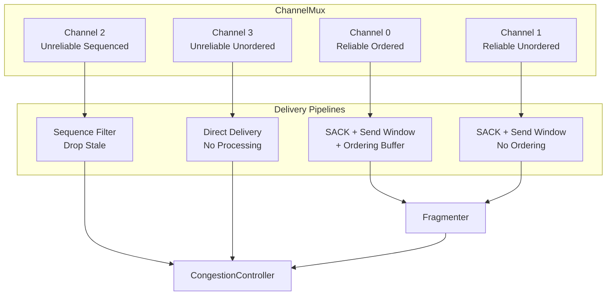
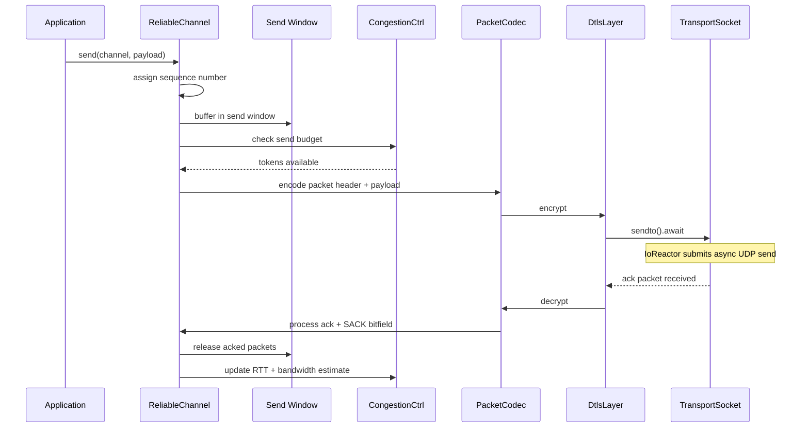
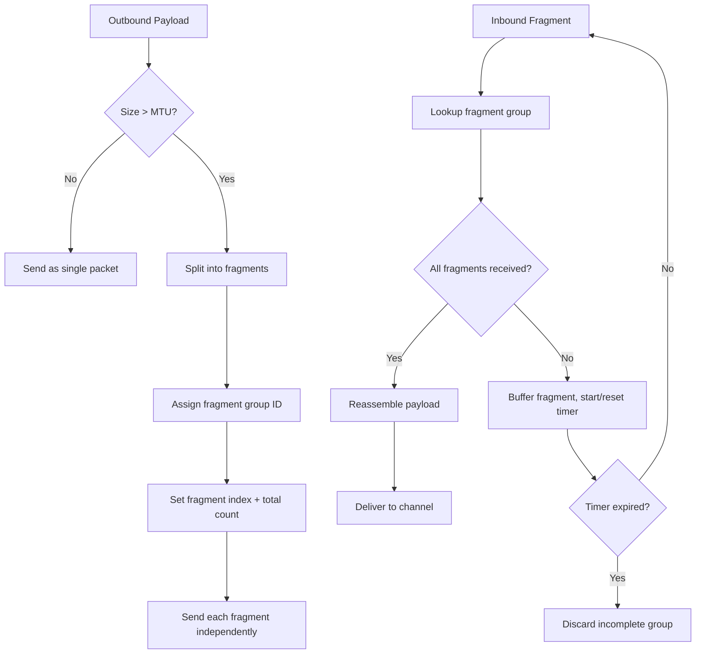
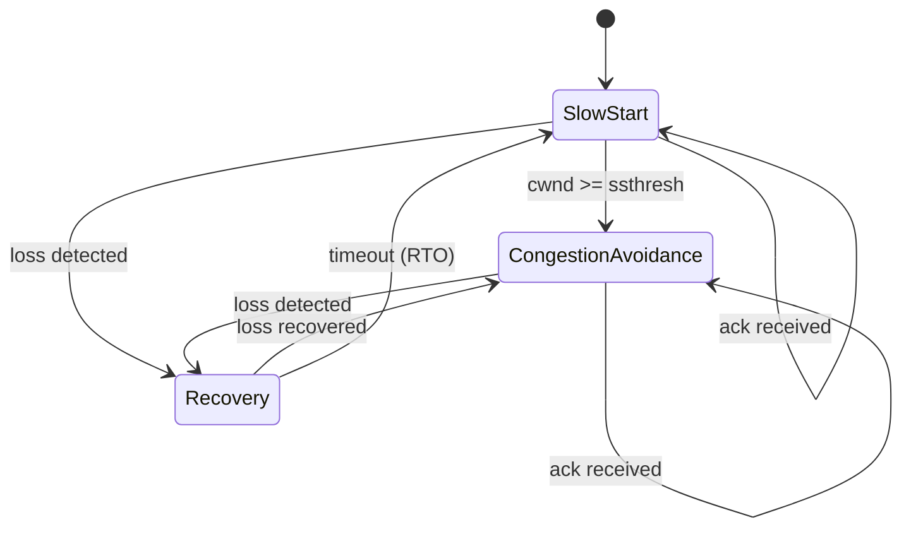
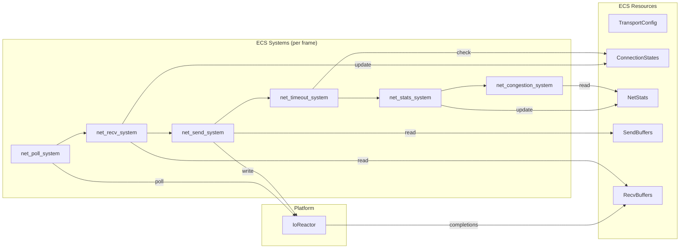
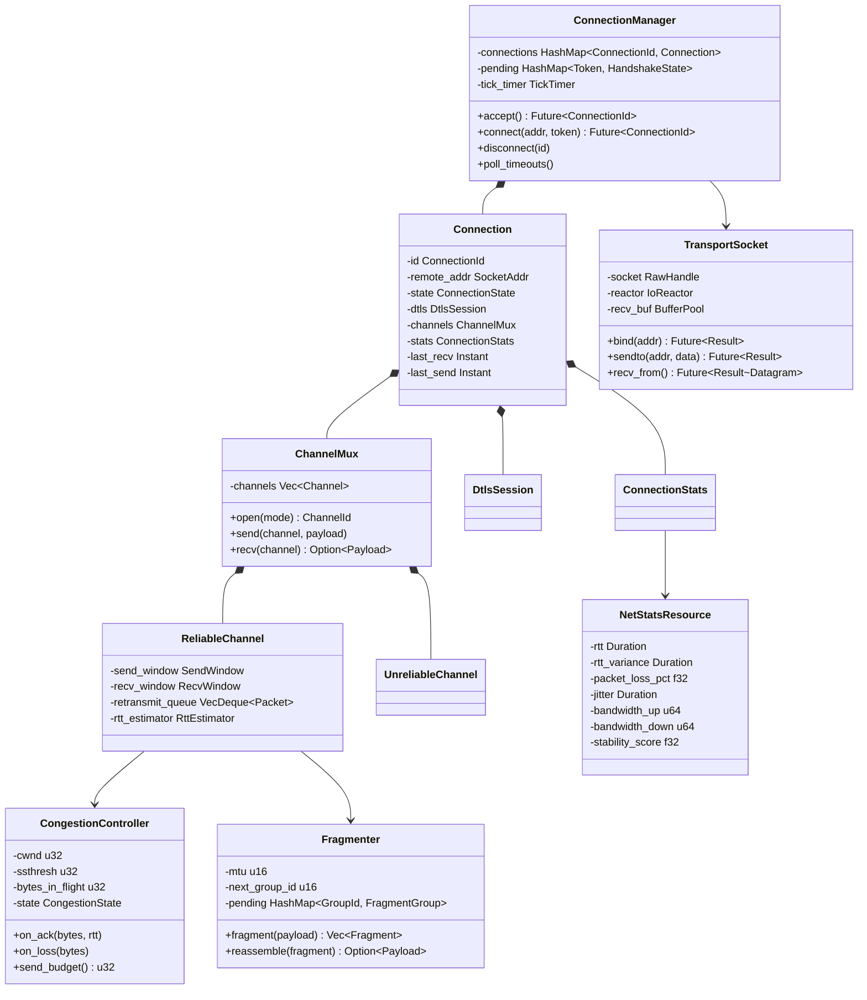

# Networking Transport Layer Design

## Requirements Trace

> **Canonical sources:** Features, requirements, and user stories are defined in
> [features/networking/](../../features/networking/),
> [requirements/networking/](../../requirements/networking/), and
> [user-stories/networking/](../../user-stories/networking/). The table below traces design elements
> to those definitions.

| Feature | Requirement         | User Story          |
|---------|---------------------|---------------------|
| F-8.1.1 | R-8.1.1             | US-8.1.1, US-8.1.10 |
| F-8.1.2 | R-8.1.2, R-8.NFR.7  | US-8.1.2, US-8.1.12 |
| F-8.1.3 | R-8.1.3, R-8.NFR.12 | US-8.1.4            |
| F-8.1.4 | R-8.1.4             | US-8.1.5            |
| F-8.1.5 | R-8.1.5, R-8.NFR.11 | US-8.1.6            |
| F-8.1.6 | R-8.1.6             | US-8.1.7            |
| F-8.1.7 | R-8.1.7             | US-8.1.8            |
| F-8.1.8 | R-8.1.8             | US-8.1.3, US-8.1.9  |

1. **F-8.1.1** — Connection handshake and authentication
2. **F-8.1.2** — Connection lifecycle management
3. **F-8.1.3** — Reliable ordered channel
4. **F-8.1.4** — Unreliable and unordered channels
5. **F-8.1.5** — DTLS encryption
6. **F-8.1.6** — Packet fragmentation, reassembly, MTU discovery
7. **F-8.1.7** — Bandwidth estimation and congestion control
8. **F-8.1.8** — Network diagnostics and quality indicators

Cross-cutting constraints:

| Constraint | Source | Impact |
|------------|--------|--------|
| Networking frame budget | R-X.1.1 | 0.5 ms at 60 fps |
| Async I/O via IoReactor | Design constraints | All socket ops are async futures |
| 100% ECS-based | Design constraints | All net state as ECS resources |
| Static dispatch | Design constraints | No vtables, no dyn trait objects |
| Rust stable only | Design constraints | No nightly features |

## Overview

The transport layer provides UDP-based network communication for the Harmonius engine. It sits
between the platform I/O layer (`IoReactor`) and the higher-level networking systems (state
replication, RPC, session management).

Key design decisions:

1. **UDP-only for game traffic.** No TCP. All reliability, ordering, and congestion control are
   implemented in userspace over raw UDP datagrams.
2. **Channel-based multiplexing.** Each connection supports multiple logical channels with
   independent delivery semantics (reliable ordered, reliable unordered, unreliable sequenced,
   unreliable unordered).
3. **DTLS 1.3 encryption.** All traffic is encrypted. The DTLS handshake is integrated into the
   connection handshake. Key rotation occurs without session interruption.
4. **Async I/O throughout.** All socket operations use `async`/`await` via the `IoReactor`. No
   blocking calls. Completions are harvested at the frame poll point.
5. **ECS-native.** Connection state, channel buffers, congestion state, and diagnostics are ECS
   resources. All transport logic runs as ECS systems.

## Architecture

### Module Boundaries



### File Layout

```text
harmonius_net/
├── transport/
│   ├── socket.rs        # TransportSocket, async
│   │                    # UDP send/recv
│   ├── connection.rs    # ConnectionManager,
│   │                    # Connection, state machine
│   ├── handshake.rs     # Handshake phases, cookie
│   │                    # exchange, auth
│   ├── channel.rs       # ChannelMux, ChannelId,
│   │                    # ChannelMode
│   ├── reliable.rs      # ReliableChannel, SACK,
│   │                    # send/recv windows
│   ├── unreliable.rs    # UnreliableChannel,
│   │                    # sequenced + unordered
│   ├── fragment.rs      # Fragmenter, reassembly,
│   │                    # MTU discovery
│   ├── congestion.rs    # CongestionController,
│   │                    # bandwidth estimation
│   ├── dtls.rs          # DtlsLayer, DtlsSession,
│   │                    # key rotation
│   ├── codec.rs         # PacketCodec, header
│   │                    # encode/decode
│   ├── stats.rs         # NetStatsResource, RTT,
│   │                    # loss, jitter
│   ├── systems.rs       # ECS systems (poll, recv,
│   │                    # send, timeout, stats)
│   └── config.rs        # TransportConfig,
│   │                    # per-platform defaults
│   └── error.rs         # TransportError variants
```

### Connection Handshake

The handshake uses a four-phase protocol that integrates DTLS negotiation with application-layer
authentication. Phase 1 is stateless on the server to resist connection flooding (R-8.1.1).



Anti-flood measures in Phase 1:

- The server computes a cookie using `HMAC-SHA256(server_secret, client_addr, timestamp)`.
- No per-connection state is allocated until the client returns a valid cookie.
- The cookie expires after a configurable window (default 5 seconds).

Replay attack resistance in Phase 3:

- Each `AuthRequest` includes a monotonic timestamp.
- The server maintains a sliding replay window of recently seen timestamps per session token.
- Duplicate timestamps within the window are rejected.

### Connection State Machine

Each connection transitions through a well-defined set of states. Timeout detection uses a timing
wheel for O(1) per-connection overhead (R-8.1.2, R-8.NFR.7).



State transition events:

| Transition | Trigger | Action |
|------------|---------|--------|
| Disconnected -> Connecting | `connect()` called | Send ClientHello, start handshake timer |
| Connecting -> Authenticating | DTLS handshake complete | Send AuthRequest |
| Authenticating -> Active | AuthAccept received | Open channels, start heartbeat |
| Active -> Migrating | Server requests migration | Pause sends, buffer messages |
| Active -> Disconnecting | `disconnect()` called | Send disconnect packet, start close timer |
| Active -> Disconnected | Heartbeat timeout | Fire disconnect event |
| Migrating -> Active | Migration ack received | Resume sends, flush buffer |
| Disconnecting -> Disconnected | Ack received or close timer expires | Release resources |

### Channel Architecture



Channel modes and their semantics:

| Mode | Reliable | Ordered | Use Case |
|------|----------|---------|----------|
| ReliableOrdered | Yes | Yes | Inventory, quests, chat |
| ReliableUnordered | Yes | No | Entity spawns, config |
| UnreliableSequenced | No | Sequenced | Position updates, input |
| UnreliableUnordered | No | No | Voice, VFX triggers |

### Reliable Channel: SACK and Send Window

The reliable channel implements selective acknowledgment over UDP (R-8.1.3). Each packet carries an
ack number (highest contiguous sequence received) and a 32-bit SACK bitfield covering the next 32
sequence numbers beyond the ack.



Retransmission strategy:

- **RTO calculation:** Jacobson/Karels algorithm with `SRTT`, `RTTVAR`, `RTO = SRTT + 4 * RTTVAR`.
  Minimum RTO is 10 ms; maximum is 2000 ms.
- **Fast retransmit:** If a packet is SACKed past (3 subsequent acks received without covering it),
  retransmit immediately without waiting for RTO.
- **Exponential backoff:** RTO doubles on each consecutive timeout for the same packet, capped at
  the maximum RTO.

### Fragmentation and Reassembly

Packets exceeding the path MTU are fragmented at the transport layer. IP-layer fragmentation is
avoided entirely (R-8.1.6).



MTU discovery:

1. At connection startup, send a probe packet at 1,452 bytes (Ethernet MTU minus IP/UDP headers).
2. If the probe is acked, try larger sizes in a binary search up to 8,972 bytes (jumbo frames).
3. If the probe is lost after 3 attempts, fall back to 1,200 bytes (R-8.1.6 conservative default).
4. Re-probe periodically (every 60 seconds) to detect path changes.

### Congestion Control

The congestion controller uses a game-oriented algorithm inspired by BBR that prioritizes smooth,
predictable throughput over maximum utilization (R-8.1.7). It avoids the sawtooth oscillations of
loss-based algorithms like CUBIC.



Algorithm phases:

| Phase | Behavior | Cwnd Update |
|-------|----------|-------------|
| SlowStart | Exponential growth | +1 MSS per ack |
| CongestionAvoidance | Linear growth | +1 MSS per RTT |
| Recovery | Drain in-flight, retransmit | cwnd = cwnd * 0.7 |

Smoothing additions beyond standard congestion control:

- **Send pacing.** Packets are spread evenly across the RTT window instead of bursting. The pacer
  releases one packet every `RTT / cwnd_packets` interval.
- **Jitter compensation.** The bandwidth estimate uses an exponentially weighted moving average
  (EWMA) with alpha=0.125 to dampen oscillations from jitter.
- **Per-channel priority.** Reliable channels get priority over unreliable channels when the
  congestion window is constrained. Within reliable channels, the application can assign priority
  levels.

### ECS Integration

All transport state lives as ECS resources. Transport logic runs as a system pipeline within the ECS
scheduler.



System execution order per frame:

| Order | System | Reads | Writes |
|-------|--------|-------|--------|
| 1 | `net_poll_system` | IoReactor | RecvBuffers |
| 2 | `net_recv_system` | RecvBuffers | ConnectionStates, inbound queues |
| 3 | `net_send_system` | SendBuffers | IoReactor (submit sends) |
| 4 | `net_timeout_system` | ConnectionStates | ConnectionStates (disconnect stale) |
| 5 | `net_stats_system` | ConnectionStates | NetStatsResource |
| 6 | `net_congestion_system` | NetStatsResource | CongestionState per connection |

### Core Data Structures



## API Design

### Packet Header

```rust
/// Protocol magic number for Harmonius transport
/// packets. Used to reject non-protocol traffic.
const PROTOCOL_ID: u16 = 0x484E; // "HN"

/// Packet types in the transport protocol.
#[derive(
    Clone, Copy, Debug, PartialEq, Eq, Hash,
)]
#[repr(u8)]
pub enum PacketType {
    /// Phase 1: client initiates handshake.
    ClientHello = 0x01,
    /// Phase 1: server returns cookie.
    HelloRetry = 0x02,
    /// Phase 3: client sends auth token.
    AuthRequest = 0x03,
    /// Phase 3: server accepts auth.
    AuthAccept = 0x04,
    /// Phase 3: server rejects auth.
    AuthReject = 0x05,
    /// Phase 4: client requests channels.
    ChannelConfig = 0x06,
    /// Phase 4: server confirms channels.
    ChannelReady = 0x07,
    /// Regular data packet with channel payload.
    Data = 0x10,
    /// Acknowledgment (may piggyback on Data).
    Ack = 0x11,
    /// Fragment of a larger payload.
    Fragment = 0x12,
    /// Heartbeat keepalive.
    Heartbeat = 0x20,
    /// Graceful disconnect request.
    Disconnect = 0x21,
    /// Disconnect acknowledgment.
    DisconnectAck = 0x22,
    /// MTU probe packet.
    MtuProbe = 0x30,
    /// MTU probe acknowledgment.
    MtuProbeAck = 0x31,
}

/// Wire format for the packet header.
/// Total header size: 16 bytes.
#[derive(Clone, Copy, Debug)]
pub struct PacketHeader {
    /// Protocol identifier (2 bytes).
    pub protocol_id: u16,
    /// Connection identifier (2 bytes).
    pub connection_id: ConnectionId,
    /// Packet type discriminant (1 byte).
    pub packet_type: PacketType,
    /// Logical channel ID (1 byte, max 255
    /// channels per connection).
    pub channel_id: ChannelId,
    /// Sender's sequence number (2 bytes).
    pub sequence: SequenceNumber,
    /// Highest contiguous sequence received
    /// (2 bytes).
    pub ack: SequenceNumber,
    /// SACK bitfield covering ack+1..ack+32
    /// (4 bytes).
    pub ack_bitfield: u32,
    /// Fragment info: high byte = index,
    /// low byte = total count. Zero if
    /// unfragmented (2 bytes).
    pub fragment_info: FragmentInfo,
}
```

Packet layout on the wire (16-byte header + payload

- 16-byte DTLS auth tag):

| Offset | Size | Field |
|--------|------|-------|
| 0 | 2 | `protocol_id` |
| 2 | 2 | `connection_id` |
| 4 | 1 | `packet_type` |
| 5 | 1 | `channel_id` |
| 6 | 2 | `sequence` |
| 8 | 2 | `ack` |
| 10 | 4 | `ack_bitfield` |
| 14 | 2 | `fragment_info` |
| 16 | N | Payload (encrypted) |
| 16+N | 16 | DTLS AES-GCM auth tag |

### Core Types

```rust
/// Opaque connection identifier. Unique per
/// server process.
#[derive(
    Clone, Copy, Debug, PartialEq, Eq,
    Hash, PartialOrd, Ord,
)]
pub struct ConnectionId(pub u16);

/// Logical channel within a connection.
#[derive(
    Clone, Copy, Debug, PartialEq, Eq,
    Hash, PartialOrd, Ord,
)]
pub struct ChannelId(pub u8);

/// 16-bit wrapping sequence number with
/// proper comparison accounting for wrap.
#[derive(
    Clone, Copy, Debug, PartialEq, Eq, Hash,
)]
pub struct SequenceNumber(pub u16);

impl SequenceNumber {
    /// Returns true if `self` is more recent
    /// than `other`, accounting for 16-bit wrap.
    pub fn is_newer_than(
        self,
        other: SequenceNumber,
    ) -> bool {
        let diff = self.0.wrapping_sub(other.0);
        diff > 0 && diff < 32768
    }

    pub fn next(self) -> SequenceNumber {
        SequenceNumber(self.0.wrapping_add(1))
    }
}

/// Fragment metadata packed into 2 bytes.
#[derive(Clone, Copy, Debug, PartialEq, Eq)]
pub struct FragmentInfo {
    /// Fragment index within the group (0-based).
    pub index: u8,
    /// Total fragment count in the group.
    pub total: u8,
}

impl FragmentInfo {
    pub const UNFRAGMENTED: FragmentInfo =
        FragmentInfo { index: 0, total: 0 };

    pub fn is_fragmented(&self) -> bool {
        self.total > 0
    }
}

/// Channel delivery mode.
#[derive(
    Clone, Copy, Debug, PartialEq, Eq, Hash,
)]
pub enum ChannelMode {
    /// Guaranteed delivery, guaranteed order.
    ReliableOrdered,
    /// Guaranteed delivery, no ordering.
    ReliableUnordered,
    /// No delivery guarantee, drop stale.
    UnreliableSequenced,
    /// No delivery guarantee, no ordering.
    UnreliableUnordered,
}
```

### Connection State

```rust
/// Connection lifecycle state.
#[derive(
    Clone, Copy, Debug, PartialEq, Eq, Hash,
)]
pub enum ConnectionState {
    Disconnected,
    Connecting,
    Authenticating,
    Active,
    Migrating,
    Disconnecting,
}

/// Per-connection statistics.
#[derive(Clone, Debug, Default)]
pub struct ConnectionStats {
    /// Smoothed round-trip time.
    pub rtt: Duration,
    /// RTT variance (Jacobson/Karels).
    pub rtt_variance: Duration,
    /// Packet loss percentage (EWMA, 0.0..1.0).
    pub packet_loss: f32,
    /// Jitter (RTT standard deviation).
    pub jitter: Duration,
    /// Current estimated upstream bandwidth
    /// in bytes/sec.
    pub bandwidth_up: u64,
    /// Current estimated downstream bandwidth
    /// in bytes/sec.
    pub bandwidth_down: u64,
    /// Stability score (0.0 = unstable,
    /// 1.0 = perfect).
    pub stability: f32,
    /// Total bytes sent since connection start.
    pub bytes_sent: u64,
    /// Total bytes received since connection
    /// start.
    pub bytes_received: u64,
    /// Total packets sent.
    pub packets_sent: u64,
    /// Total packets received.
    pub packets_received: u64,
    /// Total packets lost (detected by SACK
    /// or timeout).
    pub packets_lost: u64,
}
```

### Transport Socket

```rust
/// Async UDP socket backed by the IoReactor.
/// All send/recv operations are non-blocking
/// futures resolved at the reactor poll point.
pub struct TransportSocket {
    handle: RawHandle,
    reactor: IoReactor,
    recv_pool: BufferPool,
}

/// A received UDP datagram.
pub struct Datagram {
    pub source: SocketAddr,
    pub data: BufferSlot,
    pub len: usize,
}

impl TransportSocket {
    /// Bind to a local UDP address.
    pub async fn bind(
        addr: SocketAddr,
        reactor: &IoReactor,
        recv_pool: &BufferPool,
    ) -> Result<Self, TransportError> {
        // Platform-specific:
        // Windows: WSASocket + bind, register
        //   with IOCP
        // macOS: socket + bind, wrap in
        //   dispatch_source
        // Linux: socket + bind, register with
        //   io_uring via IORING_OP_POLL_ADD
        todo!()
    }

    /// Send a datagram to a remote address.
    /// Returns when the send completes in the
    /// IoReactor.
    pub async fn sendto(
        &self,
        addr: SocketAddr,
        data: &[u8],
    ) -> Result<usize, TransportError> {
        // Submit async sendto via IoReactor.
        // Future resolves at next reactor.poll().
        todo!()
    }

    /// Receive the next datagram. Returns when
    /// data is available (after reactor.poll()
    /// harvests the completion).
    pub async fn recv_from(
        &self,
    ) -> Result<Datagram, TransportError> {
        // Submit async recvfrom via IoReactor.
        // Uses pre-allocated BufferPool slot.
        todo!()
    }

    /// Close the socket and release resources.
    pub async fn close(
        self,
    ) -> Result<(), TransportError> {
        todo!()
    }

    /// Returns the local address the socket
    /// is bound to.
    pub fn local_addr(&self) -> SocketAddr;
}
```

### Connection Manager

```rust
/// Configuration for the transport layer.
/// Stored as an ECS resource.
pub struct TransportConfig {
    /// Local bind address.
    pub bind_addr: SocketAddr,
    /// Heartbeat interval.
    pub heartbeat_interval: Duration,
    /// Connection timeout (no packets received).
    pub connection_timeout: Duration,
    /// Maximum simultaneous connections.
    pub max_connections: u32,
    /// Handshake timeout.
    pub handshake_timeout: Duration,
    /// Cookie expiration for anti-flood.
    pub cookie_lifetime: Duration,
    /// HMAC secret for cookie generation.
    pub cookie_secret: [u8; 32],
    /// Default MTU before discovery.
    pub default_mtu: u16,
    /// MTU probe interval.
    pub mtu_probe_interval: Duration,
    /// Mobile profile overrides.
    pub mobile_profile: Option<MobileProfile>,
}

/// Mobile-specific parameter overrides
/// (US-8.1.13).
pub struct MobileProfile {
    /// Longer heartbeat for cellular
    /// (default 5 s vs 1 s).
    pub heartbeat_interval: Duration,
    /// More lenient timeout for cellular.
    pub connection_timeout: Duration,
    /// Conservative initial send rate
    /// (default 500 Kbps = 62,500 bytes/sec).
    pub initial_send_rate: u64,
}

impl Default for TransportConfig {
    fn default() -> Self {
        Self {
            bind_addr: "0.0.0.0:0"
                .parse()
                .unwrap(),
            heartbeat_interval: Duration::from_secs(
                1,
            ),
            connection_timeout: Duration::from_secs(
                30,
            ),
            max_connections: 10_000,
            handshake_timeout: Duration::from_secs(
                10,
            ),
            cookie_lifetime: Duration::from_secs(5),
            cookie_secret: [0u8; 32],
            default_mtu: 1200,
            mtu_probe_interval: Duration::from_secs(
                60,
            ),
            mobile_profile: None,
        }
    }
}

/// Manages all active connections. Stored as an
/// ECS resource.
pub struct ConnectionManager {
    socket: TransportSocket,
    connections: HashMap<ConnectionId, Connection>,
    pending: HashMap<
        CookieToken,
        HandshakeState,
    >,
    next_id: ConnectionId,
    timeout_wheel: TimingWheel,
    config: TransportConfig,
}

impl ConnectionManager {
    pub fn new(
        socket: TransportSocket,
        config: TransportConfig,
    ) -> Self;

    /// Server: begin accepting connections on
    /// the bound socket.
    pub async fn accept(
        &mut self,
    ) -> Result<ConnectionId, TransportError>;

    /// Client: initiate a connection to the
    /// given server address with an auth token.
    pub async fn connect(
        &mut self,
        addr: SocketAddr,
        token: &[u8],
    ) -> Result<ConnectionId, TransportError>;

    /// Gracefully disconnect a connection.
    pub fn disconnect(
        &mut self,
        id: ConnectionId,
    );

    /// Check all connections for heartbeat
    /// timeout. Called by net_timeout_system.
    /// Returns IDs of timed-out connections.
    pub fn poll_timeouts(
        &mut self,
    ) -> SmallVec<[ConnectionId; 8]>;

    /// Get a reference to a connection by ID.
    pub fn get(
        &self,
        id: ConnectionId,
    ) -> Option<&Connection>;

    /// Get a mutable reference to a connection.
    pub fn get_mut(
        &mut self,
        id: ConnectionId,
    ) -> Option<&mut Connection>;

    /// Number of active connections.
    pub fn connection_count(&self) -> u32;

    /// Iterate all active connection IDs.
    pub fn connection_ids(
        &self,
    ) -> impl Iterator<Item = ConnectionId> + '_;
}
```

### Timing Wheel

O(1) timeout detection for thousands of connections (R-8.1.2, R-8.NFR.7, US-8.1.12).

```rust
/// Hierarchical timing wheel for O(1) timeout
/// scheduling. Slots are arranged in a circular
/// buffer; each tick advances the wheel pointer
/// and fires all entries in the current slot.
pub struct TimingWheel {
    slots: Vec<Vec<ConnectionId>>,
    current_slot: u32,
    tick_duration: Duration,
    num_slots: u32,
}

impl TimingWheel {
    pub fn new(
        tick_duration: Duration,
        num_slots: u32,
    ) -> Self;

    /// Schedule a timeout for a connection.
    /// The timeout fires after `delay` ticks.
    pub fn schedule(
        &mut self,
        id: ConnectionId,
        delay: u32,
    );

    /// Cancel a pending timeout.
    pub fn cancel(&mut self, id: ConnectionId);

    /// Advance the wheel by one tick. Returns
    /// all connection IDs whose timeout fired.
    pub fn tick(
        &mut self,
    ) -> SmallVec<[ConnectionId; 8]>;
}
```

### Connection

```rust
/// A single transport-layer connection.
pub struct Connection {
    id: ConnectionId,
    remote_addr: SocketAddr,
    state: ConnectionState,
    dtls: DtlsSession,
    channels: ChannelMux,
    stats: ConnectionStats,
    last_recv: Instant,
    last_send: Instant,
    heartbeat_timer: Duration,
}

impl Connection {
    /// Send a message on the specified channel.
    pub fn send(
        &mut self,
        channel: ChannelId,
        payload: &[u8],
    ) -> Result<(), TransportError>;

    /// Receive the next available message from
    /// a channel. Returns None if no messages
    /// are queued.
    pub fn recv(
        &mut self,
        channel: ChannelId,
    ) -> Option<Vec<u8>>;

    /// Current connection state.
    pub fn state(&self) -> ConnectionState;

    /// Remote peer address.
    pub fn remote_addr(&self) -> SocketAddr;

    /// Per-connection statistics snapshot.
    pub fn stats(&self) -> &ConnectionStats;

    /// Update last-received timestamp. Called
    /// when any packet arrives from this peer.
    pub fn touch_recv(&mut self);

    /// Check if the connection has timed out
    /// based on configured timeout duration.
    pub fn is_timed_out(
        &self,
        timeout: Duration,
    ) -> bool;
}
```

### Channel Multiplexer

```rust
/// Multiplexes multiple logical channels over a
/// single connection.
pub struct ChannelMux {
    channels: Vec<Channel>,
}

/// A logical channel with its delivery pipeline.
pub enum Channel {
    ReliableOrdered(ReliableChannel),
    ReliableUnordered(ReliableChannel),
    UnreliableSequenced(UnreliableChannel),
    UnreliableUnordered(UnreliableChannel),
}

impl ChannelMux {
    /// Open a new channel with the given mode.
    /// Returns the assigned channel ID.
    pub fn open(
        &mut self,
        mode: ChannelMode,
    ) -> Result<ChannelId, TransportError>;

    /// Close a channel.
    pub fn close(
        &mut self,
        id: ChannelId,
    ) -> Result<(), TransportError>;

    /// Send a payload on a channel.
    pub fn send(
        &mut self,
        id: ChannelId,
        payload: &[u8],
    ) -> Result<(), TransportError>;

    /// Receive the next message from a channel.
    pub fn recv(
        &mut self,
        id: ChannelId,
    ) -> Option<Vec<u8>>;

    /// Get the mode of a channel.
    pub fn mode(
        &self,
        id: ChannelId,
    ) -> Option<ChannelMode>;
}
```

### Reliable Channel

```rust
/// Reliable delivery channel with SACK and
/// configurable retransmission.
pub struct ReliableChannel {
    mode: ChannelMode,
    send_window: SendWindow,
    recv_window: RecvWindow,
    retransmit_queue: VecDeque<RetransmitEntry>,
    rtt_estimator: RttEstimator,
    next_sequence: SequenceNumber,
}

/// Send window tracking unacked packets.
pub struct SendWindow {
    /// Ring buffer of sent-but-unacked packets.
    entries: VecDeque<SendEntry>,
    /// Oldest unacked sequence number.
    base: SequenceNumber,
    /// Maximum window size in packets.
    max_size: u16,
}

/// Entry in the send window.
pub struct SendEntry {
    pub sequence: SequenceNumber,
    pub payload: Vec<u8>,
    pub sent_at: Instant,
    pub retransmit_count: u8,
}

/// Receive window for ordering and dedup.
pub struct RecvWindow {
    /// Highest contiguous sequence delivered.
    base: SequenceNumber,
    /// Buffer for out-of-order packets.
    buffer: HashMap<SequenceNumber, Vec<u8>>,
    /// Maximum receive window size.
    max_size: u16,
}

/// Jacobson/Karels RTT estimator.
pub struct RttEstimator {
    srtt: Duration,
    rttvar: Duration,
    rto: Duration,
}

impl RttEstimator {
    pub fn new() -> Self {
        Self {
            srtt: Duration::from_millis(100),
            rttvar: Duration::from_millis(50),
            rto: Duration::from_millis(300),
        }
    }

    /// Update with a new RTT sample.
    /// Jacobson/Karels: SRTT = 7/8 * SRTT +
    ///   1/8 * sample.
    /// RTTVAR = 3/4 * RTTVAR + 1/4 *
    ///   |SRTT - sample|.
    /// RTO = SRTT + 4 * RTTVAR, clamped to
    ///   [10 ms, 2000 ms].
    pub fn update(&mut self, sample: Duration) {
        let diff = if sample > self.srtt {
            sample - self.srtt
        } else {
            self.srtt - sample
        };
        self.rttvar = self.rttvar * 3 / 4
            + diff / 4;
        self.srtt =
            self.srtt * 7 / 8 + sample / 8;
        self.rto = (self.srtt + self.rttvar * 4)
            .clamp(
                Duration::from_millis(10),
                Duration::from_millis(2000),
            );
    }

    pub fn rto(&self) -> Duration {
        self.rto
    }

    pub fn srtt(&self) -> Duration {
        self.srtt
    }
}

impl ReliableChannel {
    pub fn new(
        mode: ChannelMode,
        window_size: u16,
    ) -> Self;

    /// Queue a payload for reliable delivery.
    pub fn send(
        &mut self,
        payload: &[u8],
    ) -> SequenceNumber;

    /// Process an incoming data packet.
    /// Returns the payload if it can be
    /// delivered (in-order for ReliableOrdered,
    /// immediately for ReliableUnordered).
    pub fn on_recv(
        &mut self,
        sequence: SequenceNumber,
        payload: &[u8],
    ) -> Option<Vec<u8>>;

    /// Process an ack + SACK bitfield from
    /// the remote peer. Releases acked packets
    /// from the send window and updates RTT.
    pub fn on_ack(
        &mut self,
        ack: SequenceNumber,
        ack_bitfield: u32,
    );

    /// Collect packets that need retransmission
    /// (RTO expired or SACKed past).
    pub fn collect_retransmissions(
        &mut self,
        now: Instant,
    ) -> SmallVec<[RetransmitEntry; 4]>;

    /// Build the ack header fields for an
    /// outgoing packet on this channel.
    pub fn build_ack(
        &self,
    ) -> (SequenceNumber, u32);
}

/// A packet queued for retransmission.
pub struct RetransmitEntry {
    pub sequence: SequenceNumber,
    pub payload: Vec<u8>,
    pub attempt: u8,
}
```

### Unreliable Channel

```rust
/// Unreliable delivery channel (sequenced or
/// unordered).
pub struct UnreliableChannel {
    mode: ChannelMode,
    /// For sequenced mode: highest sequence
    /// number seen. Older packets are dropped.
    highest_seen: SequenceNumber,
    next_sequence: SequenceNumber,
}

impl UnreliableChannel {
    pub fn new(mode: ChannelMode) -> Self;

    /// Send a payload. Assigns a sequence
    /// number but does not buffer for
    /// retransmission.
    pub fn send(
        &mut self,
        payload: &[u8],
    ) -> SequenceNumber;

    /// Process an incoming packet. For
    /// sequenced mode, drops packets older
    /// than the highest seen. For unordered
    /// mode, delivers all packets.
    pub fn on_recv(
        &mut self,
        sequence: SequenceNumber,
        payload: &[u8],
    ) -> Option<Vec<u8>>;
}
```

### Fragmenter

```rust
/// Fragment group identifier.
#[derive(
    Clone, Copy, Debug, PartialEq, Eq, Hash,
)]
pub struct FragmentGroupId(pub u16);

/// A single fragment of a larger payload.
pub struct Fragment {
    pub group_id: FragmentGroupId,
    pub index: u8,
    pub total: u8,
    pub data: Vec<u8>,
}

/// Pending reassembly state for one group.
struct FragmentGroup {
    fragments: Vec<Option<Vec<u8>>>,
    received_count: u8,
    total: u8,
    started_at: Instant,
}

/// Handles packet fragmentation and reassembly.
pub struct Fragmenter {
    mtu: u16,
    next_group_id: FragmentGroupId,
    pending: HashMap<
        FragmentGroupId,
        FragmentGroup,
    >,
    fragment_timeout: Duration,
}

impl Fragmenter {
    pub fn new(
        mtu: u16,
        fragment_timeout: Duration,
    ) -> Self;

    /// Fragment a payload if it exceeds the
    /// current MTU. Returns a single-element
    /// vec if no fragmentation is needed.
    pub fn fragment(
        &mut self,
        payload: &[u8],
    ) -> SmallVec<[Fragment; 1]>;

    /// Process an incoming fragment. Returns
    /// the reassembled payload when all
    /// fragments of a group have arrived.
    pub fn reassemble(
        &mut self,
        fragment: Fragment,
    ) -> Option<Vec<u8>>;

    /// Expire incomplete fragment groups whose
    /// timer has elapsed. Returns the number
    /// of groups discarded.
    pub fn expire_stale(
        &mut self,
        now: Instant,
    ) -> u32;

    /// Update the MTU (after MTU discovery).
    pub fn set_mtu(&mut self, mtu: u16);

    /// Current MTU.
    pub fn mtu(&self) -> u16;
}
```

### Congestion Controller

```rust
/// Congestion control state.
#[derive(
    Clone, Copy, Debug, PartialEq, Eq,
)]
pub enum CongestionState {
    SlowStart,
    CongestionAvoidance,
    Recovery,
}

/// Game-oriented congestion controller.
/// Prioritizes smooth throughput over maximum
/// utilization. Uses send pacing to avoid
/// bursts.
pub struct CongestionController {
    state: CongestionState,
    /// Congestion window in bytes.
    cwnd: u32,
    /// Slow-start threshold in bytes.
    ssthresh: u32,
    /// Bytes currently in flight (sent but
    /// not yet acked).
    bytes_in_flight: u32,
    /// Maximum segment size (payload per
    /// packet).
    mss: u16,
    /// Send pacer: interval between packet
    /// sends.
    pacing_interval: Duration,
    /// Last time a packet was sent (for pacing).
    last_send: Instant,
    /// Bandwidth estimate (EWMA, bytes/sec).
    bandwidth_estimate: u64,
}

impl CongestionController {
    pub fn new(mss: u16) -> Self;

    /// Called when an ack is received. Updates
    /// cwnd and bandwidth estimate.
    pub fn on_ack(
        &mut self,
        acked_bytes: u32,
        rtt: Duration,
    );

    /// Called when packet loss is detected.
    /// Enters Recovery state and reduces cwnd.
    pub fn on_loss(&mut self, lost_bytes: u32);

    /// Returns the number of bytes available
    /// to send right now, respecting both the
    /// congestion window and the send pacer.
    pub fn send_budget(&self) -> u32;

    /// Record that bytes were sent.
    pub fn on_send(&mut self, bytes: u32);

    /// Returns the current pacing interval.
    pub fn pacing_interval(&self) -> Duration;

    /// Current congestion state.
    pub fn state(&self) -> CongestionState;

    /// Estimated bandwidth in bytes/sec.
    pub fn bandwidth_estimate(&self) -> u64;

    /// Congestion window in bytes.
    pub fn cwnd(&self) -> u32;
}
```

### DTLS Layer

```rust
/// DTLS 1.3 session for a single connection.
/// Wraps the platform TLS library.
pub struct DtlsSession {
    state: DtlsState,
    /// Platform-specific TLS context handle.
    context: DtlsContext,
    /// Current encryption key.
    write_key: AesGcmKey,
    /// Current decryption key.
    read_key: AesGcmKey,
    /// Nonce counter for AES-GCM.
    write_nonce: u64,
    /// Expected nonce window for replay
    /// protection.
    read_nonce_window: NonceWindow,
    /// Time of last key rotation.
    last_rotation: Instant,
    /// Key rotation interval.
    rotation_interval: Duration,
}

/// DTLS handshake state.
#[derive(Clone, Copy, Debug, PartialEq, Eq)]
pub enum DtlsState {
    Initial,
    Handshaking,
    Established,
    Rekeying,
    Closed,
}

impl DtlsSession {
    /// Begin a DTLS handshake as client.
    pub async fn connect_client(
        &mut self,
    ) -> Result<(), TransportError>;

    /// Begin a DTLS handshake as server.
    pub async fn accept_server(
        &mut self,
    ) -> Result<(), TransportError>;

    /// Encrypt a payload in place. Appends
    /// the 16-byte AES-GCM authentication tag.
    pub fn encrypt(
        &mut self,
        header: &PacketHeader,
        payload: &mut Vec<u8>,
    ) -> Result<(), TransportError>;

    /// Decrypt a payload in place. Verifies
    /// the AES-GCM authentication tag.
    pub fn decrypt(
        &mut self,
        header: &PacketHeader,
        payload: &mut Vec<u8>,
    ) -> Result<(), TransportError>;

    /// Check if key rotation is due. If so,
    /// initiate rekeying without interrupting
    /// the session.
    pub async fn maybe_rotate_keys(
        &mut self,
    ) -> Result<(), TransportError>;

    /// Current DTLS state.
    pub fn state(&self) -> DtlsState;
}

/// Platform-specific DTLS context.
/// Selected at compile time via cfg.
pub enum DtlsContext {
    /// Windows: Schannel via windows-rs.
    #[cfg(target_os = "windows")]
    Schannel(SchannelContext),
    /// macOS: Security.framework via C ABI.
    #[cfg(target_os = "macos")]
    SecureTransport(SecureTransportContext),
    /// Linux: rustls (pure Rust, no OpenSSL
    /// dependency).
    #[cfg(target_os = "linux")]
    Rustls(RustlsContext),
}
```

### Packet Codec

```rust
/// Encodes and decodes packet headers and
/// payloads to/from wire format.
pub struct PacketCodec;

impl PacketCodec {
    /// Encode a packet header into bytes.
    /// Writes exactly 16 bytes.
    pub fn encode_header(
        header: &PacketHeader,
        buf: &mut [u8; 16],
    );

    /// Decode a packet header from bytes.
    /// Reads exactly 16 bytes.
    pub fn decode_header(
        buf: &[u8; 16],
    ) -> Result<PacketHeader, TransportError>;

    /// Encode a complete packet (header +
    /// payload) into a buffer.
    pub fn encode_packet(
        header: &PacketHeader,
        payload: &[u8],
        buf: &mut Vec<u8>,
    );

    /// Decode a complete packet from a buffer.
    pub fn decode_packet(
        buf: &[u8],
    ) -> Result<
        (PacketHeader, &[u8]),
        TransportError,
    >;
}
```

### Network Diagnostics (ECS Resource)

```rust
/// Network diagnostics exposed as an ECS
/// resource. Updated every frame by
/// net_stats_system. Read by gameplay systems
/// and HUD widgets (R-8.1.8).
pub struct NetStatsResource {
    /// Per-connection statistics.
    pub connections: HashMap<
        ConnectionId,
        ConnectionStats,
    >,
    /// Aggregate statistics across all
    /// connections.
    pub aggregate: AggregateStats,
    /// Recent network events for logging.
    pub events: VecDeque<NetEvent>,
    /// Maximum events to retain.
    pub max_events: usize,
}

/// Aggregate stats across all connections.
pub struct AggregateStats {
    pub avg_rtt: Duration,
    pub avg_packet_loss: f32,
    pub total_bandwidth_up: u64,
    pub total_bandwidth_down: u64,
    pub active_connections: u32,
}

/// Network events for post-session analysis.
#[derive(Clone, Debug)]
pub struct NetEvent {
    pub timestamp: Instant,
    pub connection_id: ConnectionId,
    pub kind: NetEventKind,
}

#[derive(Clone, Debug)]
pub enum NetEventKind {
    Connected,
    Disconnected { reason: DisconnectReason },
    LatencySpike { rtt: Duration },
    PacketLossBurst { loss_pct: f32 },
    Timeout,
    Reconnected,
    KeyRotation,
    MtuChanged { old: u16, new: u16 },
}

#[derive(Clone, Copy, Debug, PartialEq, Eq)]
pub enum DisconnectReason {
    Graceful,
    Timeout,
    AuthFailed,
    Kicked,
    MigrationFailed,
    ProtocolError,
}
```

### ECS Systems

```rust
/// System 1: Poll the IoReactor for completed
/// network I/O. Harvests UDP recv completions
/// into the receive buffer resource.
pub fn net_poll_system(
    reactor: Res<IoReactor>,
    mut recv_buf: ResMut<RecvBufferResource>,
) {
    // reactor.poll() is called by the main
    // loop, not here. This system drains
    // completed recv futures into the buffer.
    while let Some(datagram) =
        recv_buf.try_recv()
    {
        recv_buf.push(datagram);
    }
}

/// System 2: Process received datagrams.
/// Decrypts, decodes, and routes to the
/// appropriate connection and channel.
pub fn net_recv_system(
    mut connections: ResMut<ConnectionManager>,
    recv_buf: Res<RecvBufferResource>,
    mut events: ResMut<NetStatsResource>,
) {
    for datagram in recv_buf.drain() {
        // 1. Decode header
        // 2. Lookup connection by ID
        // 3. Decrypt via DTLS
        // 4. Route to channel
        // 5. Handle handshake packets
        // 6. Update last_recv timestamp
    }
}

/// System 3: Flush pending sends. Collects
/// outbound packets from all channels,
/// encrypts, and submits via TransportSocket.
pub fn net_send_system(
    mut connections: ResMut<ConnectionManager>,
    send_buf: Res<SendBufferResource>,
) {
    for (conn_id, channel_id, payload) in
        send_buf.drain()
    {
        // 1. Check congestion send budget
        // 2. Fragment if needed
        // 3. Encode header
        // 4. Encrypt via DTLS
        // 5. Submit async sendto
    }

    // Send heartbeats for idle connections
    // Send retransmissions for reliable channels
}

/// System 4: Detect timed-out connections and
/// transition them to Disconnected.
pub fn net_timeout_system(
    mut connections: ResMut<ConnectionManager>,
    mut events: ResMut<NetStatsResource>,
) {
    let timed_out = connections.poll_timeouts();
    for id in timed_out {
        connections.disconnect(id);
        events.events.push_back(NetEvent {
            timestamp: Instant::now(),
            connection_id: id,
            kind: NetEventKind::Timeout,
        });
    }
}

/// System 5: Update network statistics from
/// connection data.
pub fn net_stats_system(
    connections: Res<ConnectionManager>,
    mut stats: ResMut<NetStatsResource>,
) {
    stats.connections.clear();
    let mut total_rtt = Duration::ZERO;
    let mut total_loss = 0.0f32;
    let mut count = 0u32;

    for id in connections.connection_ids() {
        if let Some(conn) = connections.get(id) {
            let s = conn.stats().clone();
            total_rtt += s.rtt;
            total_loss += s.packet_loss;
            count += 1;
            stats.connections.insert(id, s);
        }
    }

    if count > 0 {
        stats.aggregate = AggregateStats {
            avg_rtt: total_rtt / count,
            avg_packet_loss: total_loss
                / count as f32,
            active_connections: count,
            // bandwidth computed separately
            ..stats.aggregate
        };
    }
}

/// System 6: Run congestion control updates
/// for each connection based on latest stats.
pub fn net_congestion_system(
    mut connections: ResMut<ConnectionManager>,
    stats: Res<NetStatsResource>,
) {
    // Update congestion controller for each
    // connection based on latest RTT and loss
    // measurements.
}
```

### Error Types

```rust
/// Transport layer errors.
#[derive(Clone, Debug, PartialEq, Eq)]
pub enum TransportError {
    /// Socket bind failed.
    BindFailed { addr: SocketAddr, code: i32 },
    /// Connection limit reached.
    ConnectionLimitReached { max: u32 },
    /// Connection not found.
    ConnectionNotFound { id: ConnectionId },
    /// Channel not found.
    ChannelNotFound { id: ChannelId },
    /// Channel limit reached (max 255).
    ChannelLimitReached,
    /// Handshake timed out.
    HandshakeTimeout,
    /// Authentication rejected by server.
    AuthRejected { reason: String },
    /// DTLS encryption/decryption failed.
    DtlsError { detail: String },
    /// Invalid packet (bad protocol ID,
    /// malformed header, etc.).
    InvalidPacket { detail: String },
    /// Payload exceeds maximum size.
    PayloadTooLarge { size: usize, max: usize },
    /// Fragment reassembly timeout.
    FragmentTimeout {
        group: FragmentGroupId,
    },
    /// Send failed (socket error).
    SendFailed { code: i32 },
    /// Receive failed (socket error).
    RecvFailed { code: i32 },
    /// Connection timed out (no heartbeat).
    ConnectionTimeout { id: ConnectionId },
    /// Cookie validation failed (anti-flood).
    InvalidCookie,
    /// Replay attack detected.
    ReplayDetected,
}
```

## Data Flow

### Outbound Packet Pipeline

1. Application calls `connection.send(channel, data)`.
2. Channel assigns a sequence number and buffers the packet in the send window (reliable) or
   discards after encoding (unreliable).
3. Fragmenter checks payload size against MTU. If oversized, splits into fragments with group ID.
4. Congestion controller checks send budget. If insufficient tokens, the packet waits until the next
   frame.
5. PacketCodec encodes the header (16 bytes) and payload.
6. DtlsLayer encrypts the payload and appends the AES-GCM auth tag (16 bytes).
7. TransportSocket submits an async `sendto()` via the IoReactor.
8. The IoReactor completion is harvested at the next `reactor.poll()`.

### Inbound Packet Pipeline

1. IoReactor harvests a UDP recv completion at the frame poll point.
2. `net_poll_system` pushes the datagram into `RecvBufferResource`.
3. `net_recv_system` decodes the 16-byte header via PacketCodec.
4. Packets with invalid `protocol_id` are silently dropped.
5. Handshake packets (types 0x01-0x07) are routed to the handshake state machine.
6. Data packets are looked up by `connection_id`. Unknown IDs are dropped.
7. DtlsLayer decrypts and verifies the auth tag. Failed verification drops the packet.
8. FragmentInfo is checked. Fragments are buffered in the Fragmenter until all pieces arrive.
9. Complete payloads are routed to the appropriate channel by `channel_id`.
10. Reliable channels process the ack/SACK fields to release send window entries and update RTT.
11. The channel delivers the payload to the application (ordered or immediate depending on mode).

### Heartbeat and Timeout Flow

```rust
// Pseudocode: heartbeat and timeout logic

// In net_send_system:
for conn in connections.iter_mut() {
    if conn.state() == ConnectionState::Active {
        let since_send =
            now - conn.last_send;
        if since_send >= config.heartbeat_interval
        {
            conn.send_heartbeat();
        }
    }
}

// In net_timeout_system:
// The timing wheel advances each frame tick.
// Connections whose heartbeat timer expires
// transition to Disconnected.
let expired = timeout_wheel.tick();
for id in expired {
    if let Some(conn) = connections.get(id) {
        let since_recv =
            now - conn.last_recv;
        if since_recv >= config.connection_timeout
        {
            connections.disconnect(id);
        } else {
            // Re-schedule; the wheel fired
            // but the connection is still alive.
            timeout_wheel.schedule(
                id,
                remaining_ticks,
            );
        }
    }
}
```

## Platform Considerations

### Socket I/O

| Platform | API                                      |
|----------|------------------------------------------|
| Windows  | `WSASendTo` / `WSARecvFrom` (overlapped) |
| macOS    | `sendto` / `recvfrom` (non-blocking)     |
| Linux    | `sendto` / `recvfrom` via io_uring       |

1. **Windows** — Registered with IOCP via `CreateIoCompletionPort`. Completions harvested at
   `reactor.poll()` via `GetQueuedCompletionStatusEx`.
2. **macOS** — Readiness monitored via `dispatch_source_create(DISPATCH_SOURCE_TYPE_READ)`.
   Controlled drain at `reactor.poll()` via `dispatch_sync` on a serial queue.
3. **Linux** — Submitted as `IORING_OP_SENDTO` / `IORING_OP_RECVFROM` SQEs. Completions harvested at
   `reactor.poll()` via `io_uring_peek_cqe`. Kernel 5.6+ for `IORING_OP_RECVMSG`.

### DTLS Backend

| Platform | Library            |
|----------|--------------------|
| Windows  | Schannel           |
| macOS    | Security.framework |
| Linux    | rustls             |

1. **Windows** — Via `windows-rs`. Hardware AES-NI. FIPS-compliant.
2. **macOS** — Via C ABI wrappers. Hardware AES acceleration on Apple Silicon.
3. **Linux** — Pure Rust. Uses `ring` crate for AES-GCM. Hardware AES-NI on x86_64.

### Platform Defaults

| Parameter | Desktop | Mobile |
|-----------|---------|--------|
| Heartbeat interval | 1 s | 5 s |
| Connection timeout | 30 s | 60 s |
| Default MTU | 1,200 bytes | 1,200 bytes |
| Initial send rate | unlimited | 62,500 B/s (500 Kbps) |
| Max connections (server) | 10,000 | N/A (client) |
| Send window size | 256 packets | 64 packets |
| Recv window size | 256 packets | 64 packets |
| Fragment timeout | 5 s | 10 s |

### Proposed Dependencies

| Crate | Purpose | Justification |
|-------|---------|---------------|
| `rustls` | DTLS on Linux | Pure Rust TLS, no C dependencies, actively maintained |
| `ring` | AES-GCM, HMAC-SHA256 | Used by rustls; hardware AES-NI support |
| `windows-rs` | Schannel, Winsock2 overlapped I/O | Zero-cost FFI to Windows APIs |
| (hand-written `extern "C"`) | Security.framework Swift declarations | Matches Swift C ABI |
| `smallvec` | Inline-allocated small vectors | Fragment lists, timeout batches |

## Safety Invariants

### System Access Sets (Medium)

Transport ECS systems (`net_poll_system`, `net_recv_system`, `net_send_system`) must declare
explicit `AccessSet` for `ConnectionStates` and `TransportStats`. If the scheduler parallelizes
systems that both read and write `ConnectionStates`, a data race occurs. Enforce sequential ordering
via explicit system dependencies for all mutating transport systems.

## Test Plan

### Unit Tests

| Test                                     | Req       |
|------------------------------------------|-----------|
| `test_sequence_wrap`                     | R-8.1.3   |
| `test_sack_bitfield`                     | R-8.1.3   |
| `test_rtt_estimator`                     | R-8.1.8   |
| `test_fast_retransmit`                   | R-8.1.3   |
| `test_rto_backoff`                       | R-8.1.3   |
| `test_unreliable_sequenced_drop_stale`   | R-8.1.4   |
| `test_unreliable_unordered_delivers_all` | R-8.1.4   |
| `test_reliable_unordered`                | R-8.1.4   |
| `test_fragment_roundtrip`                | R-8.1.6   |
| `test_fragment_timeout`                  | R-8.1.6   |
| `test_mtu_fallback`                      | R-8.1.6   |
| `test_congestion_slow_start`             | R-8.1.7   |
| `test_congestion_loss_recovery`          | R-8.1.7   |
| `test_send_pacing`                       | R-8.1.7   |
| `test_cookie_generation`                 | R-8.1.1   |
| `test_cookie_validation`                 | R-8.1.1   |
| `test_replay_detection`                  | R-8.1.1   |
| `test_connection_state_transitions`      | R-8.1.2   |
| `test_timing_wheel_o1`                   | R-8.NFR.7 |
| `test_dtls_encrypt_decrypt`              | R-8.1.5   |
| `test_dtls_tamper_detection`             | R-8.1.5   |
| `test_nonce_replay_rejection`            | R-8.1.5   |
| `test_packet_codec_roundtrip`            | -         |
| `test_stats_ewma_convergence`            | R-8.1.8   |

1. **`test_sequence_wrap`** — Verify `SequenceNumber::is_newer_than` handles 16-bit wrapping
   correctly across the u16 boundary.
2. **`test_sack_bitfield`** — Send 50 packets, drop 5 randomly. Verify SACK bitfield correctly
   identifies gaps and acked ranges.
3. **`test_rtt_estimator`** — Feed known RTT samples. Verify SRTT and RTO converge to expected
   values per Jacobson/Karels.
4. **`test_fast_retransmit`** — Drop packet N, send N+1..N+3. Verify fast retransmit of N after 3
   SACKs without waiting for RTO.
5. **`test_rto_backoff`** — Drop a packet repeatedly. Verify RTO doubles each timeout up to the 2000
   ms cap.
6. **`test_unreliable_sequenced_drop_stale`** — Deliver packets 1, 3, 2. Verify packet 2 is dropped
   (stale).
7. **`test_unreliable_unordered_delivers_all`** — Deliver packets 3, 1, 2. Verify all three are
   delivered in receive order.
8. **`test_reliable_unordered`** — Send with 10% simulated loss. Verify all messages arrive but
   order is not enforced.
9. **`test_fragment_roundtrip`** — Fragment a 32 KiB payload at 1200-byte MTU. Verify reassembly
   produces the original.
10. **`test_fragment_timeout`** — Send all fragments except the last. Verify the group expires after
    the configured timeout.
11. **`test_mtu_fallback`** — Simulate 3 failed MTU probes. Verify fallback to 1200-byte default.
12. **`test_congestion_slow_start`** — Verify cwnd doubles per RTT during slow start.
13. **`test_congestion_loss_recovery`** — Trigger loss. Verify cwnd reduces to 70% and enters
    Recovery state.
14. **`test_send_pacing`** — Verify packets are spread across the RTT window, not bursted.
15. **`test_cookie_generation`** — Generate cookies for different addresses. Verify uniqueness and
    time-based expiration.
16. **`test_cookie_validation`** — Verify valid cookies are accepted. Verify expired cookies are
    rejected. Verify forged cookies are rejected.
17. **`test_replay_detection`** — Send AuthRequest, replay it. Verify the replay is rejected.
18. **`test_connection_state_transitions`** — Walk through all state transitions. Verify illegal
    transitions are rejected.
19. **`test_timing_wheel_o1`** — Schedule 10,000 timeouts. Verify tick() time is constant regardless
    of count.
20. **`test_dtls_encrypt_decrypt`** — Encrypt and decrypt a payload. Verify roundtrip integrity.
21. **`test_dtls_tamper_detection`** — Encrypt, modify one byte, attempt decrypt. Verify auth tag
    failure.
22. **`test_nonce_replay_rejection`** — Replay a previously received nonce. Verify the packet is
    rejected.
23. **`test_packet_codec_roundtrip`** — Encode and decode all PacketType variants. Verify bit-exact
    roundtrip.
24. **`test_stats_ewma_convergence`** — Feed stable 5% loss for 100 samples. Verify the EWMA
    converges to 5% +/- 1%.

### Integration Tests

| Test                              | Req                 |
|-----------------------------------|---------------------|
| `test_handshake_10k_concurrent`   | R-8.1.1             |
| `test_handshake_replay_rejection` | R-8.1.1             |
| `test_flood_50k_connections`      | R-8.1.1             |
| `test_reliable_100k_lossy`        | R-8.1.3, R-8.NFR.12 |
| `test_reliable_15pct_loss`        | R-8.NFR.12          |
| `test_10k_connections_keepalive`  | R-8.1.2, R-8.NFR.7  |
| `test_64k_payload_fragmentation`  | R-8.1.6             |
| `test_pmtud_blocked_fallback`     | R-8.1.6             |
| `test_congestion_1mbps`           | R-8.1.7             |
| `test_congestion_10gbps`          | R-8.1.7             |
| `test_dtls_key_rotation`          | R-8.1.5             |
| `test_dtls_hw_aes_throughput`     | R-8.NFR.11          |
| `test_diagnostics_accuracy`       | R-8.1.8             |
| `test_mobile_profile`             | US-8.1.13           |
| `test_graceful_disconnect`        | R-8.1.2             |
| `test_migration_roundtrip`        | R-8.1.2             |

1. **`test_handshake_10k_concurrent`** — 10,000 concurrent handshakes complete within 2 seconds.
2. **`test_handshake_replay_rejection`** — Capture and replay handshake. Verify server rejects.
3. **`test_flood_50k_connections`** — Flood 50,000 connection attempts/sec. Verify server remains
   responsive to legitimate clients.
4. **`test_reliable_100k_lossy`** — Send 100,000 numbered messages with 10% loss, 50 ms latency.
   Verify all arrive in order with zero loss.
5. **`test_reliable_15pct_loss`** — 15% loss, 200 ms RTT. Verify 100% delivery. Verify retransmit
   latency within 1.5x RTT.
6. **`test_10k_connections_keepalive`** — Establish 10,000 connections. Verify keepalive CPU cost is
   below 0.1 ms per tick.
7. **`test_64k_payload_fragmentation`** — Send a 64 KiB payload over a 1400-byte MTU link. Verify
   correct reassembly.
8. **`test_pmtud_blocked_fallback`** — Block PMTUD probes. Verify fallback to 1200-byte MTU.
9. **`test_congestion_1mbps`** — Simulate 1 Mbps link with 2% loss. Verify convergence to within 10%
   of capacity in 5 seconds. No sawtooth > 20% of average.
10. **`test_congestion_10gbps`** — Loopback 10 Gbps test. Verify controller scales to full link
    capacity.
11. **`test_dtls_key_rotation`** — Trigger key rotation during active traffic. Verify zero packet
    loss during rotation.
12. **`test_dtls_hw_aes_throughput`** — Benchmark AES-GCM. Verify >= 1 Gbps with hardware
    acceleration.
13. **`test_diagnostics_accuracy`** — Inject 100 ms latency and 5% loss. Verify RTT within 10%.
    Verify loss converges to 5% +/- 1% within 10 seconds.
14. **`test_mobile_profile`** — Enable mobile profile. Verify heartbeat = 5 s, timeout = 60 s,
    initial rate = 500 Kbps.
15. **`test_graceful_disconnect`** — Disconnect gracefully. Verify disconnect ack is received and
    resources are released.
16. **`test_migration_roundtrip`** — Trigger migration. Verify connection transitions Active ->
    Migrating -> Active with zero message loss.

### Benchmarks

| Benchmark | Target | Source |
|-----------|--------|--------|
| Handshake latency (LAN) | < 10 ms | R-8.1.1 |
| Per-connection keepalive overhead | < 10 ns | R-8.NFR.7 |
| Packet encode/decode | < 100 ns per packet | US-8.1.12 |
| DTLS encrypt/decrypt | < 200 ns per 1200-byte packet | R-8.NFR.11 |
| Reliable channel throughput | >= 100 Mbps | R-8.1.3 |
| Congestion controller convergence | < 5 s to 90% capacity | R-8.1.7 |
| Fragment reassembly (64 KiB) | < 50 us | R-8.1.6 |
| Net systems total frame time | < 0.5 ms at 10,000 connections | R-X.1.1 |
| Timing wheel tick (10k entries) | < 1 us | R-8.NFR.7 |

## Design Q & A

**Q1. What is the biggest constraint limiting this design?**

The Rust-stable-only constraint prevents using nightly features like `impl Trait` in type aliases
and generic associated types that would simplify the channel abstraction. More impactfully, the
no-third-party-runtime constraint means the DTLS handshake, congestion controller, and all socket
I/O must integrate with the custom IoReactor. Lifting the runtime constraint would allow `quinn`
(QUIC) to replace the entire custom transport with battle-tested UDP+TLS+ congestion control. The
impact: several person-months of transport implementation become a crate dependency, but we lose
fine-grained control over pacing and channel modes.

**Q2. How can this design be improved?**

The 16-bit sequence numbers (open question 5) wrap every 65,536 packets, creating ambiguity near the
wrap point that complicates SACK processing. Upgrading to 32-bit sequences adds 4 bytes per packet
but eliminates wrap handling entirely. The congestion controller uses a loss-based algorithm, but
mobile cellular links exhibit bufferbloat where delay grows without loss; a BBR-style bandwidth
probing algorithm (open question 2) would be more appropriate for mobile. The DTLS backend selection
is compile-time via `cfg`, but Schannel and Security.framework have different TLS 1.3 support
levels, creating platform parity risk.

**Q3. Is there a better approach?**

Using `quinn` (QUIC) directly would provide UDP transport, TLS 1.3 encryption, congestion control,
and multiplexed streams out of the box. Quinn supports custom async runtimes via its
`AsyncUdpSocket` trait, which could be implemented on the IoReactor. We are not taking this approach
because the constraints require per-channel delivery semantics (unreliable sequenced,
reliable-latest) that QUIC streams do not natively support, and we need sub-packet-level control for
game- oriented pacing. The custom transport is more work but provides exact control over every byte
on the wire.

**Q4. Does this design solve all customer problems?**

US-8.1.13 requests mobile-specific tuning defaults, which are defined in the platform defaults
table. Missing: automatic detection of Wi-Fi vs cellular on mobile to switch between desktop-like
and mobile-like profiles dynamically. Missing: bandwidth usage reporting for metered data plans
(cellular data cap awareness). Adding data cap awareness would make the engine suitable for mobile
games where players pay per megabyte. US-8.1.11 requests simulated network conditions for testing
but the design does not include a built-in network simulator; one would need to be built for CI.

**Q5. Is this design cohesive with the overall engine?**

Transport systems (`net_poll_system`, `net_recv_system`, `net_send_system`) run as ECS systems in
the correct dependency order, matching the engine's ECS scheduling model. All socket I/O routes
through the IoReactor with completions harvested at the frame poll point, perfectly aligned with the
threading design's controlled-poll architecture. The DTLS backend uses platform-native TLS libraries
(Schannel, Security.framework, rustls) selected via `cfg`, consistent with the platform abstraction
pattern used in windowing and threading. The `NetStatsResource` is an ECS resource read by gameplay
systems, following the same resource pattern as other subsystems. Proposed dependencies (`rustls`,
`ring`, `windows-rs`, `libloading`, `smallvec`) are all low-level libraries already used or approved in
other designs.

## Open Questions

1. **DTLS library on Linux.** rustls is proposed for its pure-Rust, no-C-dependency nature. However,
   DTLS 1.3 support in rustls is still maturing. Alternative: `openssl` crate with system OpenSSL.
   Tradeoff: C dependency vs. DTLS 1.3 maturity.

2. **Congestion control algorithm.** The current design uses a modified loss-based algorithm with
   pacing. A BBR-style bandwidth probing algorithm may be more appropriate for highly variable
   mobile networks. Needs profiling on real cellular links.

3. **Maximum payload size.** The current design allows payloads up to 64 KiB (limited by fragment
   group capacity: 255 fragments x ~1200 bytes). Larger payloads would require a streaming protocol
   on top. Is 64 KiB sufficient for all use cases (zone snapshots, initial world load)?

4. **Connection ID size.** 16-bit connection IDs limit to 65,535 simultaneous connections. The
   requirement is 10,000 (R-8.NFR.7) which fits, but future scaling to multi-server mesh with
   connection migration may need globally unique 32-bit or 64-bit IDs.

5. **Sequence number size.** 16-bit sequence numbers wrap every 65,536 packets. At 60 packets/sec
   this wraps in ~18 minutes. The SACK window must be sized to avoid ambiguity near the wrap point.
   An alternative is 32-bit sequence numbers (4 extra header bytes per packet).

6. **Key rotation strategy.** The design calls for periodic rotation but does not specify the
   interval. Tradeoffs: shorter intervals limit exposure from a compromised key but increase CPU
   cost. Proposed default: 1 hour.

7. **io_uring minimum kernel version.** `IORING_OP_SENDTO` and `IORING_OP_RECVFROM` require kernel
   5.6+. Older kernels (5.1-5.5) would need fallback to `IORING_OP_POLL_ADD` + non-blocking
   `sendto`/ `recvfrom`. Should we require 5.6+ or support the fallback path?
