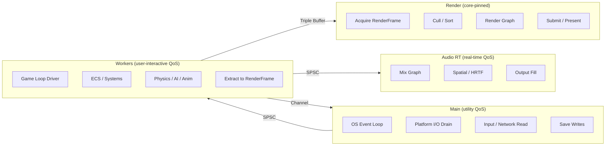
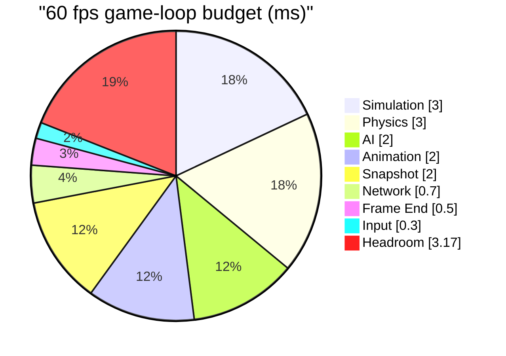
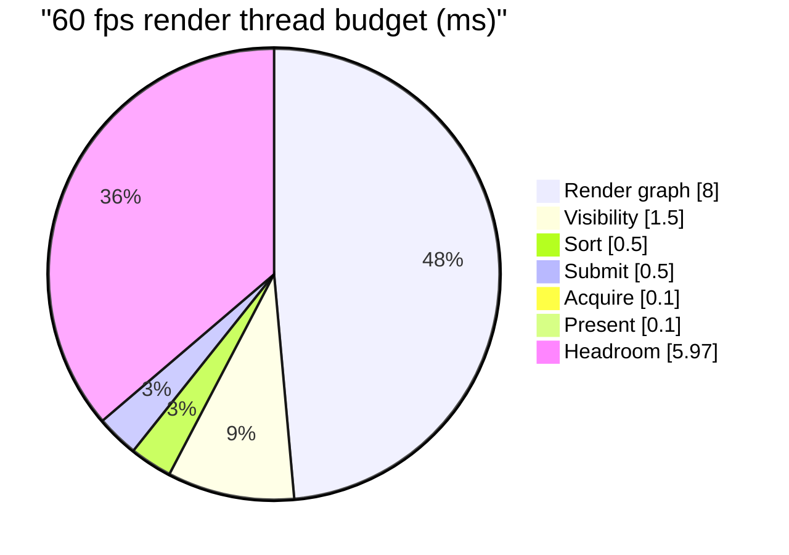

# Performance Budget

## Overview

This document consolidates the per-frame performance budget for the Harmonius engine. It fixes the
time available to each thread, phase, and subsystem so that design and implementation share a single
target.

Budgets are derived from [integration/high-level.md](integration/high-level.md#performance-budget)
and the per-pair integration designs under [integration/](integration/). The authoritative 60 fps
numbers originate in the high-level integration document; this file extends them to 30 fps and 120
fps targets and to three platform tiers.

### Frame budgets by target frame rate

| Target | Frame budget | Use case |
|--------|--------------|----------|
| 120 fps | 8.33 ms | Desktop high-refresh, VR reprojection |
| 60 fps | 16.67 ms | Desktop / console default |
| 30 fps | 33.33 ms | Mobile low-end, handheld battery mode |

### Budget principles

1. The game loop and render thread overlap by one frame via the `RenderFrame` triple buffer. The
   game loop never stalls on the render thread.
2. Every phase leaves headroom for spikes (GC-like arena resets, page faults, asset streaming
   hitches, profiler capture).
3. Budgets are upper bounds. Benchmarks in the companion test case files enforce them via
   `TC-IR-*.B*` entries.
4. A subsystem that exceeds its budget on a given platform tier must degrade gracefully (LOD,
   amortization, rate limiting), not block the frame.

## Thread Model

Four thread roles own disjoint data. Scheduling uses the OS QoS hint system rather than hard core
pinning, except for the render thread which requires deterministic GPU submission cadence.

### Core pinning and QoS strategy

| Thread | Scheduling | Rationale |
|--------|------------|-----------|
| Render | Core-pinned, high QoS | Deterministic GPU submission, no migration |
| Workers | QoS-scheduled, user-interactive | OS maps to P-cores when available |
| Main | QoS-scheduled, utility | OS event loop, platform I/O drain |
| Audio RT | Dedicated real-time QoS | Hard deadline at audio buffer period |

### Thread roles

### Data ownership

1. **Main** owns OS handles. Workers never call OS APIs directly; they enqueue I/O requests via
   channel.
2. **Workers** own all ECS world data. One worker drives the game loop; the rest execute parallel
   tasks via work-stealing (crossbeam-deque).
3. **Render** owns GPU resources. It reads only the immutable `RenderFrame` snapshot from the triple
   buffer.
4. **Audio RT** owns the audio device and mix graph. It reads commands via a lock-free SPSC queue
   written at Phase 7.

## Per-Thread Budgets

Budgets below target 60 fps (16.67 ms). See [Platform Tiers](#platform-tiers) for 30 fps and 120 fps
variants.

### Game loop thread (workers)

| Phase | Phase budget | Subsystems |
|-------|--------------|------------|
| 1 Input | 0.3 ms | Input, action mapping |
| 2 Network | 0.7 ms | Packet receive, state apply, rollback |
| 3 Simulation | 3.0 ms | Data tables, timelines, grids, effects |
| 4 AI | 2.0 ms | Awareness, BT/GOAP/utility, nav, steering |
| 5 Physics | 3.0 ms | Broadphase, solve, destruction, constraints |
| 6 Animation | 2.0 ms | State machines, skeletal eval, IK, blends |
| 7 Snapshot | 2.0 ms | Camera, VFX tick, UI layout, audio commands |
| 8 Frame End | 0.5 ms | Save queue, profiler stats, I/O drain |
| Used | 13.5 ms | |
| Headroom | 3.17 ms | Spikes, arena resets, streaming hitches |
| Total | 16.67 ms | |

### Render thread

| Step | Budget | Work |
|------|--------|------|
| Acquire | 0.1 ms | Triple buffer swap, frame fence wait |
| Visibility | 1.5 ms | GPU compute cull, HZB, meshlet select |
| Sort | 0.5 ms | Draw call sort, batch coalesce |
| Render graph | 8.0 ms | Geometry, lighting, shadows, post-process |
| Submit | 0.5 ms | Command buffer submit |
| Present | 0.1 ms | Swap chain present, vsync wait |
| Used | 10.7 ms | |
| Headroom | 5.97 ms | GPU hitch, shader JIT, descriptor rebuild |
| Total | 16.67 ms | |

### Audio RT thread

| Step | Budget |
|------|--------|
| Mix graph eval | 0.3 ms |
| Spatial / HRTF | 0.1 ms |
| Output buffer fill | 0.1 ms |
| Used | 0.5 ms |
| Deadline | 5.3 ms (256 samples @ 48 kHz) |

### Main thread

The main thread runs at OS event loop cadence, not frame cadence. Its per-frame cost is bounded by
draining the I/O request channel.

| Step | Budget |
|------|--------|
| OS event loop poll | 0.1 ms |
| Input / network read | 0.2 ms |
| I/O request drain | 0.2 ms |
| Used | 0.5 ms |

## Per-Subsystem Budgets

Consolidated from the per-pair integration designs in [integration/](integration/). Each subsystem
lists the phase it runs in, its worker-thread slice, and any render-thread extract cost.

### Game-loop subsystems

| Subsystem | Phase | Worker budget | Extract to RenderFrame |
|-----------|-------|---------------|------------------------|
| ECS core | All | 1.0 ms | 0.2 ms |
| Physics | 5 | 3.0 ms | 0.2 ms (debug viz) |
| Animation | 6 | 2.0 ms | 0.3 ms (bone upload) |
| AI | 4 | 2.0 ms | 0.0 ms |
| Audio (dispatch) | 7 | 0.2 ms | 0.0 ms |
| UI (layout) | 7 | 0.8 ms | 0.3 ms (draw list) |
| Scripting | 3, 4 | 0.8 ms | 0.0 ms |
| Networking | 2 | 0.7 ms | 0.0 ms |
| VFX (tick) | 7 | 0.5 ms | 0.3 ms (particle buf) |
| Data systems | 3 | 1.0 ms | 0.0 ms |
| Timelines | 3 | 0.4 ms | 0.0 ms |
| Camera | 7 | 0.1 ms | 0.1 ms (view/proj) |
| Input | 1 | 0.3 ms | 0.0 ms |
| Save / Serial | 8 | 0.3 ms | 0.0 ms |
| Profiler | 8 | 0.1 ms | 0.0 ms |

### Render-thread subsystems

| Subsystem | Render budget | Notes |
|-----------|--------------|-------|
| Visibility + cull | 1.5 ms | GPU compute + HZB |
| Geometry pass | 2.5 ms | Meshlet indirect draw |
| Shadow passes | 1.5 ms | 4 cascades + spot/point |
| Lighting | 1.2 ms | Clustered deferred |
| VFX render | 0.8 ms | Compute particles, sort |
| UI render | 0.5 ms | MSDF text, widget quads |
| Post-process | 1.0 ms | Bloom, tonemap, TAA, DOF |
| Submit + present | 0.7 ms | Command buffer, swap chain |

### Audio-thread subsystems

| Subsystem | Budget |
|-----------|--------|
| Mix graph eval | 0.3 ms |
| Spatial / HRTF / occlusion | 0.1 ms |
| Reverb / propagation cache | 0.05 ms |
| Output buffer fill | 0.05 ms |

## Platform Tiers

Three tiers scale the 60 fps baseline to platform capability. The game loop and render thread
budgets scale together; headroom scales with total frame budget.

### Tier definitions

| Tier | Target | Frame budget | Examples |
|------|--------|--------------|----------|
| Desktop high-end | 120 fps | 8.33 ms | Gaming PC, discrete GPU, 8+ P-cores |
| Desktop / console | 60 fps | 16.67 ms | Mid PC, Xbox, PS, M-series Mac |
| Mobile / low-end | 30 fps | 33.33 ms | Phone, tablet, handheld battery |

### Game-loop budget per tier

Worker-thread phase budgets scaled to the frame target. Mobile doubles simulation and AI budgets at
the cost of frequency; high-end halves everything to hit the tighter frame.

| Phase | 120 fps | 60 fps | 30 fps |
|-------|---------|--------|--------|
| 1 Input | 0.15 ms | 0.3 ms | 0.6 ms |
| 2 Network | 0.35 ms | 0.7 ms | 1.4 ms |
| 3 Simulation | 1.5 ms | 3.0 ms | 6.0 ms |
| 4 AI | 1.0 ms | 2.0 ms | 4.0 ms |
| 5 Physics | 1.5 ms | 3.0 ms | 6.0 ms |
| 6 Animation | 1.0 ms | 2.0 ms | 4.0 ms |
| 7 Snapshot | 1.0 ms | 2.0 ms | 4.0 ms |
| 8 Frame End | 0.25 ms | 0.5 ms | 1.0 ms |
| Used | 6.75 ms | 13.5 ms | 27.0 ms |
| Headroom | 1.58 ms | 3.17 ms | 6.33 ms |

### Render thread budget per tier

| Step | 120 fps | 60 fps | 30 fps |
|------|---------|--------|--------|
| Acquire | 0.05 ms | 0.1 ms | 0.2 ms |
| Visibility | 0.75 ms | 1.5 ms | 3.0 ms |
| Sort | 0.25 ms | 0.5 ms | 1.0 ms |
| Render graph | 4.0 ms | 8.0 ms | 16.0 ms |
| Submit | 0.25 ms | 0.5 ms | 1.0 ms |
| Present | 0.05 ms | 0.1 ms | 0.2 ms |
| Used | 5.35 ms | 10.7 ms | 21.4 ms |
| Headroom | 2.98 ms | 5.97 ms | 11.93 ms |

### Audio RT budget per tier

Audio deadlines are independent of frame rate. They depend on the output buffer period.

| Buffer | Deadline | Used |
|--------|----------|------|
| 128 samples @ 48 kHz | 2.67 ms | 0.5 ms |
| 256 samples @ 48 kHz | 5.33 ms | 0.5 ms |
| 512 samples @ 48 kHz | 10.67 ms | 0.5 ms |

## Headroom and Spike Reserve

Headroom absorbs non-deterministic costs that cannot be predicted at frame start.

| Source | Reserve | Mitigation |
|--------|---------|------------|
| Arena reset / allocation | 0.3 ms | Bump arenas reset at frame boundary |
| Asset streaming hitch | 0.5 ms | Rate limit, async load on workers |
| Shader pipeline JIT | 0.5 ms | Precompile PSOs at load time |
| Profiler capture | 0.1 ms | Zero-cost when disabled |
| GPU hitch (descriptor rebuild) | 0.5 ms | Persistent descriptors, PSO cache |
| OS scheduler jitter | 0.5 ms | QoS hints, core pinning for render |
| Page fault / memory pressure | 0.5 ms | Pre-fault hot pages, mlock critical |
| Codegen hot-reload | 0.3 ms | Editor-only, skipped in shipping |
| Total reserved | 3.2 ms | Matches game-loop headroom at 60 fps |

## Budget Allocation Overview

### 60 fps frame budget pie

### 60 fps render thread pie

### Frame timeline (game loop and render overlap)

```mermaid
gantt
    title Frame N game loop vs render overlap at 60 fps
    dateFormat SSS
    axisFormat %L

    section Game Loop
    Input            :gl1, 000, 1
    Network          :gl2, after gl1, 1
    Simulation       :gl3, after gl2, 3
    AI               :gl4, after gl3, 2
    Physics          :gl5, after gl4, 3
    Animation        :gl6, after gl5, 2
    Snapshot         :gl7, after gl6, 2
    Frame End        :gl8, after gl7, 1
    Headroom         :gl9, after gl8, 3

    section Render (frame N-1)
    Acquire          :rt1, 000, 1
    Visibility       :rt2, after rt1, 2
    Sort             :rt3, after rt2, 1
    Render Graph     :rt4, after rt3, 8
    Submit           :rt5, after rt4, 1
    Present          :rt6, after rt5, 1
    Headroom         :rt7, after rt6, 3

    section Audio RT
    Mix              :at1, 000, 1
    Spatial          :at2, after at1, 1
    Output           :at3, after at2, 1
```

## References

1. [integration/high-level.md](integration/high-level.md) — authoritative thread, phase, and budget
   source.
2. [integration/](integration/) — 50 per-pair integration designs with benchmark targets
   (`TC-IR-*.B*`).
3. [constraints.md](constraints.md) — platform, async, and threading constraints.
