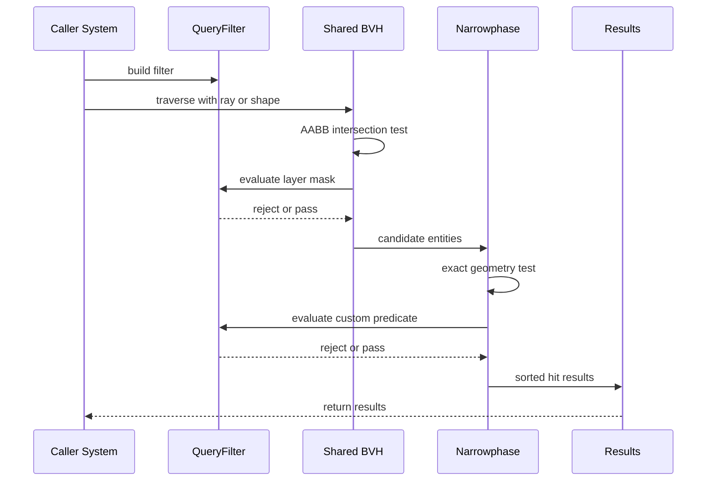
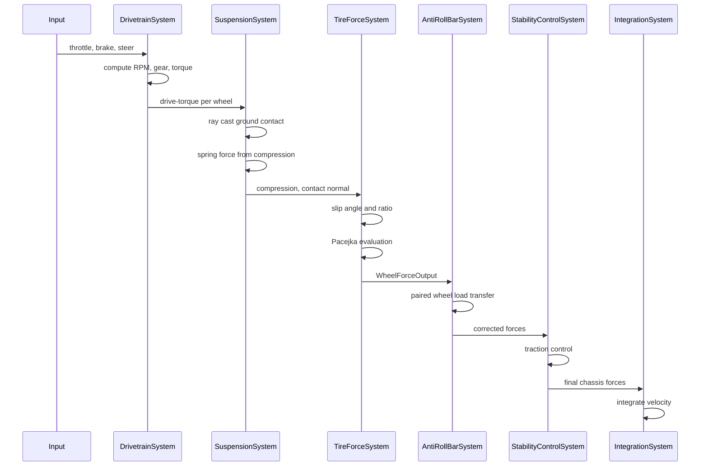
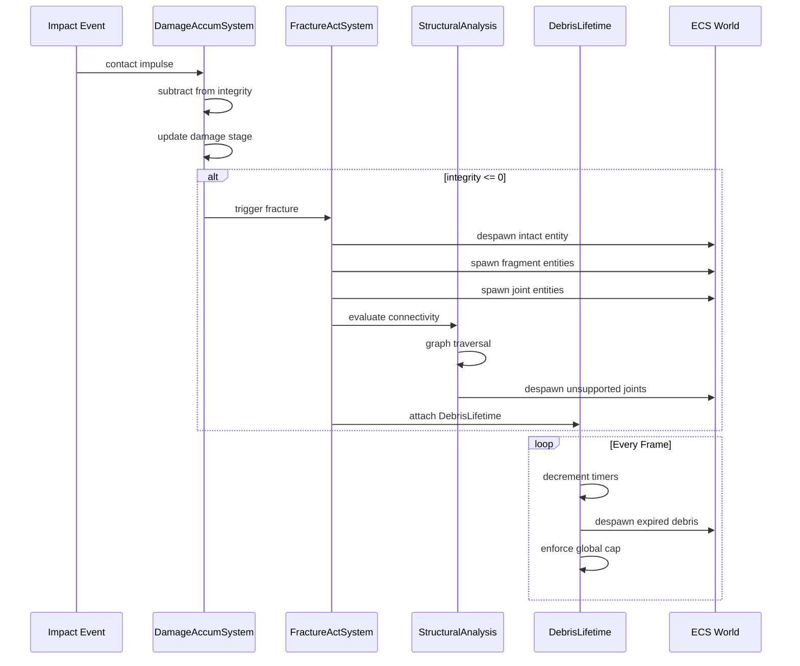
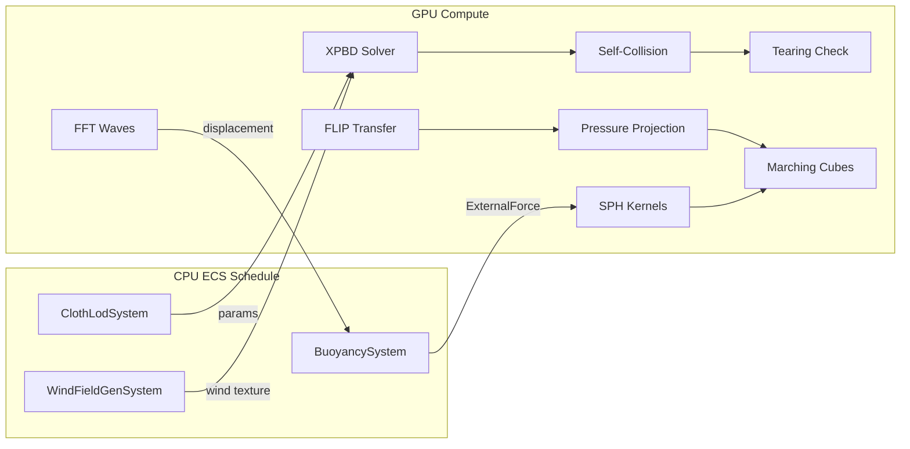

# Advanced Physics Design

## Requirements Trace

> **Canonical sources:** Features, requirements, and user
> stories are defined in [features/physics/](../../features/physics/),
> [requirements/physics/](../../requirements/physics/), and
> [user-stories/physics/](../../user-stories/physics/). The table
> below traces design elements to those definitions.

### Spatial Queries (4.4)

| Feature | Requirement | Description |
|---------|-------------|-------------|
| F-4.4.1 | R-4.4.1 | Ray casting via shared BVH |
| F-4.4.2 | R-4.4.2 | Shape casting (sweep tests) |
| F-4.4.3 | R-4.4.3 | Overlap tests |
| F-4.4.4 | R-4.4.4 | Closest point queries |
| F-4.4.5 | R-4.4.5 | Batch query execution |
| F-4.4.6 | R-4.4.6 | Query filtering and custom predicates |

### Vehicle Physics (4.5)

| Feature | Requirement | Description |
|---------|-------------|-------------|
| F-4.5.1 | R-4.5.1 | Wheel suspension model |
| F-4.5.2 | R-4.5.2 | Tire friction (Pacejka Magic Formula) |
| F-4.5.3 | R-4.5.3 | Drivetrain simulation |
| F-4.5.4 | R-4.5.4 | Anti-roll bars and stability control |
| F-4.5.5 | R-4.5.5 | Tracked vehicle simulation |
| F-4.5.6 | R-4.5.6 | Hover vehicle simulation |
| F-4.5.7 | R-4.5.7 | Server-authoritative vehicle replication |

### Destruction and Fracture (4.6)

| Feature | Requirement | Description |
|---------|-------------|-------------|
| F-4.6.1 | R-4.6.1 | Voronoi fracture generation |
| F-4.6.2 | R-4.6.2 | Pre-fractured mesh authoring |
| F-4.6.3 | R-4.6.3 | Runtime fracture and activation |
| F-4.6.4 | R-4.6.4 | Progressive damage model |
| F-4.6.5 | R-4.6.5 | Stress propagation and structural collapse |
| F-4.6.6 | R-4.6.6 | Debris simulation and lifecycle |
| F-4.6.7 | R-4.6.7 | Debris pooling and LOD |

### Soft Body and Cloth (4.7)

| Feature | Requirement | Description |
|---------|-------------|-------------|
| F-4.7.1 | R-4.7.1 | Position-based dynamics (XPBD) solver |
| F-4.7.2 | R-4.7.2 | Cloth simulation |
| F-4.7.3 | R-4.7.3 | Cloth self-collision |
| F-4.7.4 | R-4.7.4 | Two-way rigid body coupling |
| F-4.7.5 | R-4.7.5 | Wind interaction via shared wind field |
| F-4.7.6 | R-4.7.6 | Cloth tearing |
| F-4.7.7 | R-4.7.7 | Cloth level of detail |

### Fluid Simulation (4.8)

| Feature | Requirement | Description |
|---------|-------------|-------------|
| F-4.8.1 | R-4.8.1 | SPH fluid simulation |
| F-4.8.2 | R-4.8.2 | FLIP/PIC hybrid simulation |
| F-4.8.3 | R-4.8.3 | Eulerian grid fluid solver |
| F-4.8.4 | R-4.8.4 | Fluid surface reconstruction |
| F-4.8.5 | R-4.8.5 | Water surface simulation |
| F-4.8.6 | R-4.8.6 | Buoyancy and drag forces |
| F-4.8.7 | R-4.8.7 | Two-way fluid-rigid body coupling |

## Overview

This document covers five advanced physics subsystems built
on top of the core rigid body dynamics (4.1), collision
detection (4.2), and constraints (4.3) layers:

1. **Spatial queries** -- ray cast, shape cast, overlap,
   closest point, batch queries. All traverse the shared
   BVH (F-1.9.1) and filter via `QueryFilter`.
2. **Vehicle physics** -- wheel suspension, Pacejka tire
   friction, drivetrain, stability, tracked and hover
   vehicles. All 100% ECS with no separate vehicle world.
3. **Destruction and fracture** -- Voronoi fracture,
   runtime splitting, progressive damage, structural
   collapse, debris lifecycle. Fragments are ECS entities.
4. **Soft body and cloth** -- XPBD solver, GPU cloth,
   self-collision, wind, tearing, LOD. Particle data lives
   in GPU buffers referenced by ECS components.
5. **Fluid simulation** -- SPH, FLIP/PIC, Eulerian grid,
   surface reconstruction, buoyancy. GPU-accelerated with
   two-way rigid body coupling.

All subsystems are 100% ECS-based: simulation data lives as
components, all logic as systems, no parallel data stores.
The shared BVH is the single spatial acceleration structure
used across physics, rendering, AI, and networking.

## Architecture

### Module Boundaries

```mermaid
graph TD
    subgraph sq["spatial_query"]
        RC[RayCast]
        SC[ShapeCast]
        OQ[OverlapQuery]
        CPQ[ClosestPointQuery]
        BSQ[BatchSpatialQuery]
        QF[QueryFilter]
    end

    subgraph veh["vehicle"]
        SS[SuspensionSystem]
        TFS[TireForceSystem]
        DS[DrivetrainSystem]
        ARB[AntiRollBarSystem]
        SCS[StabilityControlSystem]
        TVS[TrackedVehicleSystem]
        HRS[HoverRepulsorSystem]
    end

    subgraph dest["destruction"]
        FAS[FractureActivationSystem]
        DAS[DamageAccumulationSystem]
        SAS[StructuralAnalysisSystem]
        DLS[DebrisLifetimeSystem]
    end

    subgraph sb["soft_body"]
        XPBD[XpbdSolverSystem]
        CSCS[ClothSelfCollisionSystem]
        CTS[ClothTearingSystem]
        CLS[ClothLodSystem]
        WFGS[WindFieldGenSystem]
    end

    subgraph fl["fluid"]
        SPHS[SPHSystem]
        FLIPS[FLIPSystem]
        EULS[EulerianSystem]
        SRSS[SurfaceReconSystem]
        BUOS[BuoyancySystem]
    end

    subgraph dep["Shared Dependencies"]
        BVH[Shared BVH]
        ECS[ECS World]
        GPU[GPU Compute]
    end

    RC --> BVH
    SC --> BVH
    OQ --> BVH
    CPQ --> BVH
    SS --> RC
    HRS --> RC
    TVS --> SC
    FAS --> ECS
    SAS --> ECS
    XPBD --> GPU
    SPHS --> GPU
    FLIPS --> GPU
    EULS --> GPU
    SRSS --> GPU
    BUOS --> ECS
```



### File Layout

```
harmonius_physics/
├── spatial_query/
│   ├── ray_cast.rs        # RayCast system parameter
│   ├── shape_cast.rs      # ShapeCast system parameter
│   ├── overlap.rs         # OverlapQuery system param
│   ├── closest_point.rs   # ClosestPointQuery param
│   ├── batch.rs           # BatchSpatialQuery
│   ├── filter.rs          # QueryFilter, predicates
│   └── results.rs         # RayHit, ShapeHit, etc.
├── vehicle/
│   ├── suspension.rs      # SuspensionSystem
│   ├── tire.rs            # TireForceSystem, Pacejka
│   ├── drivetrain.rs      # DrivetrainSystem
│   ├── stability.rs       # AntiRollBar, ESC
│   ├── tracked.rs         # TrackedVehicleSystem
│   ├── hover.rs           # HoverRepulsorSystem
│   └── components.rs      # Vehicle, Wheel, etc.
├── destruction/
│   ├── fracture.rs        # FractureActivationSystem
│   ├── damage.rs          # DamageAccumulationSystem
│   ├── structural.rs      # StructuralAnalysisSystem
│   ├── debris.rs          # DebrisLifetime, pooling
│   ├── debris_lod.rs      # DebrisLodSystem
│   └── components.rs      # Destructible, DamageHealth
├── soft_body/
│   ├── xpbd.rs            # XpbdSolverSystem
│   ├── cloth.rs           # ClothSimulationSystem
│   ├── self_collision.rs  # ClothSelfCollisionSystem
│   ├── wind.rs            # WindField, ClothWindSystem
│   ├── tearing.rs         # ClothTearingSystem
│   ├── cloth_lod.rs       # ClothLodSystem
│   └── components.rs      # ClothSimulation, etc.
└── fluid/
    ├── sph.rs             # SPHSystem
    ├── flip.rs            # FLIPSystem
    ├── eulerian.rs        # EulerianSystem
    ├── surface.rs         # SurfaceReconstructionSystem
    ├── water_surface.rs   # WaterSurfaceSystem
    ├── buoyancy.rs        # BuoyancySystem
    └── components.rs      # FluidVolume, FluidGrid
```

### ECS Component Map

```mermaid
classDiagram
    class QueryFilter {
        +layers CollisionLayerMask
        +with_components TypeIdSet
        +without_components TypeIdSet
        +predicate Option~PredicateFn~
    }

    class Vehicle {
        +wheel_entities SmallVec~Entity 6~
    }
    class WheelSuspension {
        +rest_length f32
        +stiffness f32
        +damping f32
        +travel_min f32
        +travel_max f32
        +compression f32
        +contact_normal Vec3
        +drive_torque f32
    }
    class TireFriction {
        +pacejka PacejkaCoeffs
        +surface_table SmallVec~SurfaceFriction 8~
    }
    class WheelForceOutput {
        +lateral_force f32
        +longitudinal_force f32
    }
    class Drivetrain {
        +torque_curve Vec~Vec2~
        +gear_ratios Vec~f32~
        +current_gear u8
        +differential DifferentialType
        +drive_layout DriveLayout
        +engine_rpm f32
    }
    class AntiRollBar {
        +stiffness f32
        +wheel_pair_a Entity
        +wheel_pair_b Entity
    }
    class StabilityControl {
        +traction_control f32
        +electronic_stability f32
        +enabled bool
    }
    class TrackedVehicle {
        +left_speed f32
        +right_speed f32
        +track_friction f32
        +track_tension f32
    }
    class HoverRepulsor {
        +max_hover_height f32
        +force_falloff f32
        +lateral_friction f32
    }

    Vehicle *-- WheelSuspension
    WheelSuspension --> TireFriction
    WheelSuspension --> WheelForceOutput
    Vehicle --> Drivetrain
    Vehicle --> AntiRollBar
    Vehicle --> StabilityControl

    class Destructible {
        +fracture_asset Handle~FractureAsset~
        +damage_threshold f32
    }
    class DamageHealth {
        +integrity f32
        +stages Vec~DamageStage~
        +current_stage u8
    }
    class DebrisLifetime {
        +ttl f32
        +elapsed f32
    }

    Destructible --> DamageHealth

    class ClothSimulation {
        +position_buffer GpuBufferHandle
        +velocity_buffer GpuBufferHandle
        +constraint_buffer GpuBufferHandle
        +stretch f32
        +shear f32
        +bend f32
        +tear_threshold f32
    }
    class ClothAttachment {
        +bone_entity Entity
        +particle_indices Vec~u32~
    }
    class ClothLod {
        +tier u8
        +distances Vec~f32~
    }
    class WindSource {
        +wind_type WindType
        +direction Vec3
        +strength f32
        +radius f32
        +turbulence f32
    }

    ClothSimulation --> ClothAttachment
    ClothSimulation --> ClothLod

    class FluidVolume {
        +solver_type FluidSolverType
        +domain_bounds Aabb
        +viscosity f32
        +surface_tension f32
    }
    class FluidParticleBuffer {
        +position_buffer GpuBufferHandle
        +velocity_buffer GpuBufferHandle
        +particle_count u32
    }
    class FluidGrid {
        +velocity_field GpuBufferHandle
        +pressure_field GpuBufferHandle
        +resolution UVec3
    }
    class FluidRenderer {
        +mesh_buffer GpuBufferHandle
        +normal_buffer GpuBufferHandle
    }
    class WaterSurface {
        +wave_config WaveConfig
    }

    FluidVolume --> FluidParticleBuffer
    FluidVolume --> FluidGrid
    FluidVolume --> FluidRenderer
```



### Spatial Query Pipeline



### Vehicle Physics Pipeline



### Destruction Activation Flow



### Cloth and Fluid GPU Pipeline



## API Design

### Spatial Queries

#### Query Filter

```rust
/// Bitmask for collision layer filtering.
#[derive(Clone, Copy, Debug, PartialEq, Eq)]
pub struct CollisionLayerMask(pub u64);

/// Predicate closure type for custom filtering
/// during BVH traversal. Receives an EntityRef
/// for full component read access.
pub type PredicateFn =
    Box<dyn Fn(&EntityRef) -> bool + Send + Sync>;
```

**Justification:** `PredicateFn` uses `Box<dyn Fn>`
for user-defined spatial query filters. This is a
query/tool path, not per-frame simulation. The
predicate is evaluated during spatial queries
initiated by gameplay code (raycasts, overlap tests),
which are infrequent relative to the simulation tick.
Acceptable per constraints.md.

```rust
/// Unified filter for all spatial queries.
/// Combines layer masks, ECS structural filters,
/// and optional custom predicates.
pub struct QueryFilter {
    /// Bitmask of layers to include.
    pub layers: CollisionLayerMask,
    /// Require these components on candidates.
    pub with: TypeIdSet,
    /// Exclude candidates with these components.
    pub without: TypeIdSet,
    /// Optional custom predicate evaluated during
    /// narrowphase traversal.
    pub predicate: Option<PredicateFn>,
    /// Maximum query distance (for ray/shape cast).
    pub max_distance: f32,
}

impl QueryFilter {
    pub fn new() -> Self;

    pub fn with_layers(
        mut self,
        mask: CollisionLayerMask,
    ) -> Self;

    pub fn with_component<T: Component>(
        mut self,
    ) -> Self;

    pub fn without_component<T: Component>(
        mut self,
    ) -> Self;

    pub fn with_predicate(
        mut self,
        f: impl Fn(&EntityRef) -> bool
            + Send
            + Sync
            + 'static,
    ) -> Self;

    pub fn with_max_distance(
        mut self,
        dist: f32,
    ) -> Self;
}
```

#### Hit Results

```rust
/// Result of a ray cast against the shared BVH.
#[derive(Clone, Debug)]
pub struct RayHit {
    /// The entity that was hit.
    pub entity: Entity,
    /// World-space hit position.
    pub position: Vec3,
    /// Surface normal at the hit point.
    pub normal: Vec3,
    /// Distance from ray origin to hit.
    pub distance: f32,
    /// Collision layers of the hit entity.
    pub layers: CollisionLayerMask,
}

/// Result of a shape cast (sweep test).
#[derive(Clone, Debug)]
pub struct ShapeHit {
    pub entity: Entity,
    pub contact_point: Vec3,
    pub normal: Vec3,
    pub penetration_depth: f32,
    pub distance: f32,
    pub layers: CollisionLayerMask,
}

/// Result of an overlap test.
#[derive(Clone, Debug)]
pub struct OverlapResult {
    pub entity: Entity,
    pub layers: CollisionLayerMask,
}

/// Result of a closest point query.
#[derive(Clone, Debug)]
pub struct ClosestPointResult {
    pub entity: Entity,
    pub closest_point: Vec3,
    pub normal: Vec3,
    /// Negative = inside, positive = outside.
    pub signed_distance: f32,
}
```

#### Individual Query System Parameters

```rust
/// System parameter for single ray casts.
/// Queries the shared BVH (F-1.9.1).
pub struct RayCast<'w> {
    bvh: Res<'w, BvhIndex>,
    colliders: Query<'w, (
        &'static Collider,
        &'static Transform,
        &'static CollisionLayers,
    )>,
}

impl<'w> RayCast<'w> {
    /// Cast a ray returning the first hit.
    pub fn cast(
        &self,
        origin: Vec3,
        direction: Vec3,
        filter: &QueryFilter,
    ) -> Option<RayHit>;

    /// Cast a ray returning all hits sorted
    /// by distance (nearest first).
    pub fn cast_all(
        &self,
        origin: Vec3,
        direction: Vec3,
        filter: &QueryFilter,
        results: &mut Vec<RayHit>,
    );
}

/// System parameter for shape casts (sweeps).
pub struct ShapeCast<'w> {
    bvh: Res<'w, BvhIndex>,
    colliders: Query<'w, (
        &'static Collider,
        &'static Transform,
        &'static CollisionLayers,
    )>,
}

impl<'w> ShapeCast<'w> {
    /// Sweep a shape along a direction, return
    /// first contact.
    pub fn cast(
        &self,
        shape: &ColliderShape,
        origin: Vec3,
        direction: Vec3,
        filter: &QueryFilter,
    ) -> Option<ShapeHit>;

    /// Sweep returning all contacts.
    pub fn cast_all(
        &self,
        shape: &ColliderShape,
        origin: Vec3,
        direction: Vec3,
        filter: &QueryFilter,
        results: &mut Vec<ShapeHit>,
    );
}

/// System parameter for overlap tests.
pub struct OverlapQuery<'w> {
    bvh: Res<'w, BvhIndex>,
    colliders: Query<'w, (
        &'static Collider,
        &'static Transform,
        &'static CollisionLayers,
    )>,
}

impl<'w> OverlapQuery<'w> {
    /// Test whether a shape at a position
    /// overlaps any entities.
    pub fn test(
        &self,
        shape: &ColliderShape,
        position: Vec3,
        filter: &QueryFilter,
        results: &mut Vec<OverlapResult>,
    );
}

/// System parameter for closest point queries.
pub struct ClosestPointQuery<'w> {
    bvh: Res<'w, BvhIndex>,
    colliders: Query<'w, (
        &'static Collider,
        &'static Transform,
        &'static CollisionLayers,
    )>,
}

impl<'w> ClosestPointQuery<'w> {
    /// Find the closest point on any collider
    /// surface to the given world-space point.
    pub fn closest(
        &self,
        point: Vec3,
        filter: &QueryFilter,
    ) -> Option<ClosestPointResult>;
}
```

#### Batch Queries

```rust
/// Describes a single query in a batch.
pub enum SpatialQueryDescriptor {
    Ray {
        origin: Vec3,
        direction: Vec3,
        filter: QueryFilter,
    },
    Shape {
        shape: ColliderShape,
        origin: Vec3,
        direction: Vec3,
        filter: QueryFilter,
    },
    Overlap {
        shape: ColliderShape,
        position: Vec3,
        filter: QueryFilter,
    },
}

/// Result of a single query within a batch.
pub enum SpatialQueryResult {
    Ray(Option<RayHit>),
    Shape(Option<ShapeHit>),
    Overlap(Vec<OverlapResult>),
}

/// System parameter for batch spatial queries.
/// Distributes work across the thread pool.
pub struct BatchSpatialQuery<'w> {
    bvh: Res<'w, BvhIndex>,
    pool: Res<'w, ThreadPool>,
    colliders: Query<'w, (
        &'static Collider,
        &'static Transform,
        &'static CollisionLayers,
    )>,
}

impl<'w> BatchSpatialQuery<'w> {
    /// Submit a batch of queries for parallel
    /// execution. Results are written to the
    /// caller-provided buffer in input order.
    pub fn execute(
        &self,
        queries: &[SpatialQueryDescriptor],
        results: &mut [SpatialQueryResult],
    );
}
```

### Vehicle Physics

#### Components

```rust
/// Marker component on the chassis entity.
pub struct Vehicle {
    pub wheel_entities: SmallVec<[Entity; 6]>,
}

/// Placed on each wheel child entity.
pub struct WheelSuspension {
    /// Rest length of the spring in meters.
    pub rest_length: f32,
    /// Spring stiffness in N/m.
    pub stiffness: f32,
    /// Damping coefficient in Ns/m.
    pub damping: f32,
    /// Minimum travel (compression limit).
    pub travel_min: f32,
    /// Maximum travel (extension limit).
    pub travel_max: f32,
    // -- Written by SuspensionSystem --
    /// Current compression ratio [0, 1].
    pub compression: f32,
    /// Ground contact normal (zero if airborne).
    pub contact_normal: Vec3,
    /// Drive torque applied by DrivetrainSystem.
    pub drive_torque: f32,
    /// Whether wheel is in ground contact.
    pub grounded: bool,
}

/// Pacejka Magic Formula coefficients.
#[derive(Clone, Debug)]
pub struct PacejkaCoeffs {
    pub b: f32,  // stiffness factor
    pub c: f32,  // shape factor
    pub d: f32,  // peak factor
    pub e: f32,  // curvature factor
}

/// Per-surface friction entry.
#[derive(Clone, Debug)]
pub struct SurfaceFriction {
    pub surface_type: SurfaceType,
    pub grip_multiplier: f32,
}

/// Tire friction model on each wheel entity.
pub struct TireFriction {
    pub pacejka: PacejkaCoeffs,
    pub surface_table:
        SmallVec<[SurfaceFriction; 8]>,
}

/// Computed tire forces, written by
/// TireForceSystem.
pub struct WheelForceOutput {
    pub lateral_force: f32,
    pub longitudinal_force: f32,
    pub slip_angle: f32,
    pub slip_ratio: f32,
}

/// Differential type for torque distribution.
#[derive(Clone, Copy, Debug, PartialEq, Eq)]
pub enum DifferentialType {
    Open,
    LimitedSlip,
    Locked,
}

/// Drive layout (which axles receive power).
#[derive(Clone, Copy, Debug, PartialEq, Eq)]
pub enum DriveLayout {
    FrontWheel,
    RearWheel,
    AllWheel,
}

/// Drivetrain component on the chassis entity.
pub struct Drivetrain {
    /// Engine torque curve: RPM -> Nm.
    pub torque_curve: Vec<Vec2>,
    /// Gear ratios (index 0 = reverse).
    pub gear_ratios: Vec<f32>,
    /// Current gear index.
    pub current_gear: u8,
    /// Shift point RPM thresholds.
    pub shift_up_rpm: f32,
    pub shift_down_rpm: f32,
    pub differential: DifferentialType,
    pub drive_layout: DriveLayout,
    // -- Written by DrivetrainSystem --
    pub engine_rpm: f32,
    pub output_torque: f32,
}

/// Anti-roll bar linking a pair of wheels.
pub struct AntiRollBar {
    pub stiffness: f32,
    pub wheel_a: Entity,
    pub wheel_b: Entity,
}

/// Electronic stability aids on the chassis.
pub struct StabilityControl {
    /// Traction control strength [0, 1].
    pub traction_control: f32,
    /// Electronic stability control [0, 1].
    pub electronic_stability: f32,
    pub enabled: bool,
}

/// Tracked vehicle (tanks, bulldozers).
pub struct TrackedVehicle {
    pub left_speed: f32,
    pub right_speed: f32,
    pub track_friction: f32,
    pub track_tension: f32,
}

/// Hover repulsor on a child entity beneath
/// the chassis.
pub struct HoverRepulsor {
    pub max_hover_height: f32,
    pub force_falloff: f32,
    pub lateral_friction: f32,
}
```

#### Systems

```rust
/// Casts rays downward from each wheel entity,
/// computes spring forces from compression.
pub fn suspension_system(
    ray_cast: RayCast,
    mut wheels: Query<(
        &mut WheelSuspension,
        &Transform,
    )>,
);

/// Computes lateral and longitudinal forces
/// from slip angle and ratio using Pacejka.
pub fn tire_force_system(
    mut wheels: Query<(
        &TireFriction,
        &WheelSuspension,
        &Transform,
        &mut WheelForceOutput,
    )>,
);

/// Reads throttle/brake input, computes engine
/// RPM, distributes torque to driven wheels.
pub fn drivetrain_system(
    mut vehicles: Query<(
        &mut Drivetrain,
        &Vehicle,
    )>,
    mut wheels: Query<&mut WheelSuspension>,
);

/// Transfers load between paired wheels to
/// resist body roll during cornering.
pub fn anti_roll_bar_system(
    bars: Query<(&AntiRollBar, &Vehicle)>,
    wheels: Query<&WheelSuspension>,
    mut forces: Query<&mut ExternalForce>,
);

/// Applies traction control and ESC by
/// modifying per-wheel brake and throttle.
pub fn stability_control_system(
    vehicles: Query<(
        &StabilityControl,
        &Drivetrain,
        &Vehicle,
    )>,
    mut wheels: Query<&mut WheelSuspension>,
);

/// Computes ground contact via shape casts
/// along each track span, drives forces from
/// differential track speeds.
pub fn tracked_vehicle_system(
    shape_cast: ShapeCast,
    mut tracked: Query<(
        &TrackedVehicle,
        &Transform,
        &mut ExternalForce,
        &mut ExternalTorque,
    )>,
);

/// Casts rays from repulsor points, computes
/// height-dependent repulsion forces.
pub fn hover_repulsor_system(
    ray_cast: RayCast,
    repulsors: Query<(
        &HoverRepulsor,
        &Transform,
        &Parent,
    )>,
    mut chassis: Query<&mut ExternalForce>,
);

/// Applies tilt correction torques to keep
/// hover vehicles level over terrain.
pub fn hover_stabilization_system(
    mut vehicles: Query<(
        &Vehicle,
        &Transform,
        &mut ExternalTorque,
    ), With<HoverRepulsor>>,
);
```

### Destruction and Fracture

#### Components

```rust
/// Asset containing pre-computed fracture data.
pub struct FractureAsset {
    /// Per-fragment convex hull geometry.
    pub fragments: Vec<FragmentData>,
    /// Adjacency graph for structural analysis.
    pub connectivity: Vec<(u32, u32)>,
    /// Break thresholds per connection.
    pub joint_thresholds: Vec<f32>,
}

/// Geometry and physics data for one fragment.
pub struct FragmentData {
    pub vertices: Vec<Vec3>,
    pub indices: Vec<u32>,
    pub local_transform: Transform,
    pub mass: f32,
    pub inertia: Mat3,
}

/// Marks an entity as destructible.
pub struct Destructible {
    pub fracture_asset: Handle<FractureAsset>,
    pub damage_threshold: f32,
}

/// Tracks cumulative damage toward fracture.
pub struct DamageHealth {
    /// Current integrity [0, 1]. Fracture at 0.
    pub integrity: f32,
    /// Visual damage stages.
    pub stages: Vec<DamageStage>,
    pub current_stage: u8,
}

/// A visual damage stage threshold.
#[derive(Clone, Debug)]
pub struct DamageStage {
    /// Integrity threshold below which this
    /// stage activates.
    pub threshold: f32,
    /// Index into crack texture or mesh variant.
    pub visual_index: u32,
}

/// Attached to fragment entities for lifecycle.
pub struct DebrisLifetime {
    /// Time to live in seconds.
    pub ttl: f32,
    /// Elapsed time since spawn.
    pub elapsed: f32,
}

/// Marks a fragment as a grounded anchor for
/// structural analysis.
pub struct GroundedAnchor;
```

#### Systems

```rust
/// Processes contact events and subtracts
/// damage based on impact impulse magnitude.
pub fn damage_accumulation_system(
    mut damaged: Query<(
        &mut DamageHealth,
        &Collider,
    )>,
    contacts: EventReader<CollisionPersisted>,
);

/// Triggers fracture when integrity reaches
/// zero. Despawns intact entity, spawns
/// fragment entities with RigidBody, Collider,
/// DebrisLifetime, and Transform. Connects
/// adjacent fragments with breakable joints.
pub fn fracture_activation_system(
    mut commands: Commands,
    destructibles: Query<(
        Entity,
        &Destructible,
        &DamageHealth,
        &Transform,
    )>,
    assets: Res<Assets<FractureAsset>>,
    config: Res<PhysicsConfig>,
);

/// Graph traversal over fragment-joint
/// connectivity. Identifies unsupported
/// fragments and despawns their joints.
pub fn structural_analysis_system(
    mut commands: Commands,
    fragments: Query<(Entity, &Transform)>,
    anchors: Query<Entity, With<GroundedAnchor>>,
    joints: Query<(Entity, &Joint)>,
);

/// Decrements debris timers, despawns expired
/// entities, enforces global debris cap.
pub fn debris_lifetime_system(
    mut commands: Commands,
    mut debris: Query<(
        Entity,
        &mut DebrisLifetime,
    )>,
    config: Res<PhysicsConfig>,
    time: Res<Time>,
);

/// Reduces collision shape complexity for
/// distant debris. Removes RigidBody and
/// Collider beyond max LOD distance.
pub fn debris_lod_system(
    mut commands: Commands,
    debris: Query<(
        Entity,
        &DebrisLifetime,
        &Transform,
    )>,
    camera: Query<&Transform, With<Camera>>,
    config: Res<PhysicsConfig>,
);
```

### Soft Body and Cloth

#### Cloth Ownership Boundary

Physics owns the XPBD constraint solver
(`XpbdSolverSystem`). Animation owns cloth authoring
components (`ClothGarment`, `ClothPanel`), GPU
dispatch, and LOD management (see
[cloth-hair.md](../animation/cloth-hair.md)). Physics
provides the solver as a service; animation drives
when and how cloth is simulated. `ClothSimulation`
in this file defines the solver-side state;
`ClothGarment` in cloth-hair.md defines the
authoring-side state.

#### Components

```rust
/// Core cloth simulation data. Particle and
/// constraint buffers live on the GPU.
pub struct ClothSimulation {
    pub position_buffer: GpuBufferHandle,
    pub velocity_buffer: GpuBufferHandle,
    pub constraint_buffer: GpuBufferHandle,
    pub particle_count: u32,
    /// Material parameters.
    pub stretch: f32,
    pub shear: f32,
    pub bend: f32,
    /// Strain threshold for tearing. 0 = no tear.
    pub tear_threshold: f32,
    /// XPBD compliance for stiffness-independent
    /// solving.
    pub compliance: f32,
    /// Number of solver iterations.
    pub iterations: u32,
}

/// Links cloth particles to skeleton bones.
pub struct ClothAttachment {
    pub mappings: Vec<AttachmentMapping>,
}

#[derive(Clone, Debug)]
pub struct AttachmentMapping {
    pub particle_index: u32,
    pub bone_entity: Entity,
    pub local_offset: Vec3,
}

/// Marker enabling self-collision detection.
pub struct SelfCollisionEnabled {
    /// Minimum distance between non-adjacent
    /// particles.
    pub thickness: f32,
    /// Skip particles within this graph distance
    /// to avoid false positives on mesh topology.
    pub skip_distance: u32,
}

/// Distance-based LOD for cloth simulation.
pub struct ClothLod {
    /// Current LOD tier (0 = full fidelity).
    pub tier: u8,
    /// Distance thresholds for each tier.
    pub distances: Vec<f32>,
    /// Particle count per tier.
    pub particle_counts: Vec<u32>,
    /// Iteration count per tier.
    pub iteration_counts: Vec<u32>,
}

/// Wind source entity component. Contributions
/// are sampled into a shared 3D wind texture.
pub struct WindSource {
    pub wind_type: WindType,
    pub direction: Vec3,
    pub strength: f32,
    pub radius: f32,
    pub turbulence: f32,
}

/// Wind source shape.
#[derive(Clone, Copy, Debug, PartialEq, Eq)]
pub enum WindType {
    Directional,
    Point,
    Vortex,
}

/// Shared 3D wind field texture, updated once
/// per frame from all active WindSource entities.
pub struct WindField {
    pub texture: GpuTextureHandle,
    pub resolution: UVec3,
    pub bounds: Aabb,
}
```

#### Systems

```rust
/// Samples all active WindSource entities into
/// the shared 3D wind field texture.
pub fn wind_field_generation_system(
    sources: Query<(
        &WindSource,
        &Transform,
    )>,
    mut wind_field: ResMut<WindField>,
    gpu: Res<GpuContext>,
);

/// Adjusts cloth simulation fidelity based on
/// camera distance. Disables physics at extreme
/// distance.
pub fn cloth_lod_system(
    camera: Query<&Transform, With<Camera>>,
    mut cloth: Query<(
        &mut ClothSimulation,
        &mut ClothLod,
        &Transform,
    )>,
);

/// Runs XPBD constraint resolution on GPU
/// buffers: distance, bending, volume
/// preservation, shape-matching.
pub fn xpbd_solver_system(
    mut cloth: Query<(
        &mut ClothSimulation,
        &ClothAttachment,
        &Transform,
    )>,
    bones: Query<&Transform>,
    colliders: Query<(
        &Collider,
        &Transform,
    )>,
    gpu: Res<GpuContext>,
    time: Res<Time>,
);

/// Steps the particle-constraint mesh each tick,
/// writing updated positions to GPU buffers.
pub fn cloth_simulation_system(
    mut cloth: Query<(
        &mut ClothSimulation,
        &Transform,
    )>,
    wind_field: Res<WindField>,
    gpu: Res<GpuContext>,
);

/// Spatial-hash or BVH-based continuous collision
/// detection on cloth particles.
pub fn cloth_self_collision_system(
    mut cloth: Query<(
        &mut ClothSimulation,
        &SelfCollisionEnabled,
    )>,
    gpu: Res<GpuContext>,
);

/// Applies wind forces from the shared wind
/// field texture to cloth particles.
pub fn cloth_wind_system(
    mut cloth: Query<(
        &mut ClothSimulation,
        &Transform,
    )>,
    wind_field: Res<WindField>,
    gpu: Res<GpuContext>,
);

/// Checks constraint strain against tear
/// threshold. Splits mesh topology and spawns
/// new cloth entities for separated patches.
pub fn cloth_tearing_system(
    mut commands: Commands,
    mut cloth: Query<(
        Entity,
        &mut ClothSimulation,
    )>,
    gpu: Res<GpuContext>,
);
```

### Fluid Simulation

#### Components

```rust
/// Selects which fluid solver to use.
#[derive(Clone, Copy, Debug, PartialEq, Eq)]
pub enum FluidSolverType {
    Sph,
    FlipPic,
    Eulerian,
}

/// Core fluid volume component.
pub struct FluidVolume {
    pub solver_type: FluidSolverType,
    pub domain_bounds: Aabb,
    pub viscosity: f32,
    pub surface_tension: f32,
    pub rest_density: f32,
}

/// GPU particle buffers for SPH and FLIP/PIC.
pub struct FluidParticleBuffer {
    pub position_buffer: GpuBufferHandle,
    pub velocity_buffer: GpuBufferHandle,
    pub density_buffer: GpuBufferHandle,
    pub particle_count: u32,
    pub max_particles: u32,
}

/// Uniform or adaptive grid for Eulerian and
/// FLIP/PIC pressure projection.
pub struct FluidGrid {
    pub velocity_field: GpuBufferHandle,
    pub pressure_field: GpuBufferHandle,
    pub boundary_field: GpuBufferHandle,
    pub resolution: UVec3,
}

/// Bridges fluid simulation to rendering.
pub struct FluidRenderer {
    pub mesh_buffer: GpuBufferHandle,
    pub normal_buffer: GpuBufferHandle,
    pub vertex_count: u32,
}

/// Wave parameters for ocean/river surfaces.
pub struct WaveConfig {
    pub fft_resolution: u32,
    pub gerstner_waves: Vec<GerstnerWave>,
    pub wind_direction: Vec2,
    pub wind_speed: f32,
    pub flow_map: Option<GpuTextureHandle>,
}

/// A single Gerstner wave descriptor.
#[derive(Clone, Debug)]
pub struct GerstnerWave {
    pub amplitude: f32,
    pub wavelength: f32,
    pub speed: f32,
    pub direction: Vec2,
    pub steepness: f32,
}

/// Water surface entity component.
pub struct WaterSurface {
    pub wave_config: WaveConfig,
    pub displacement_map: GpuTextureHandle,
}
```

#### Systems

```rust
/// Evaluates density and pressure kernels on
/// GPU. Writes updated particle positions and
/// velocities to FluidParticleBuffer.
pub fn sph_system(
    mut fluids: Query<(
        &FluidVolume,
        &mut FluidParticleBuffer,
        &Transform,
    ), Without<FluidGrid>>,
    rigid_bodies: Query<(
        &RigidBody,
        &Velocity,
        &Collider,
        &Transform,
    )>,
    gpu: Res<GpuContext>,
    time: Res<Time>,
);

/// Transfers particle velocities to grid, runs
/// pressure projection, updates particles from
/// corrected grid velocities.
pub fn flip_system(
    mut fluids: Query<(
        &FluidVolume,
        &mut FluidParticleBuffer,
        &mut FluidGrid,
        &Transform,
    )>,
    rigid_bodies: Query<(
        &RigidBody,
        &Velocity,
        &Collider,
        &Transform,
    )>,
    gpu: Res<GpuContext>,
    time: Res<Time>,
);

/// Velocity advection, pressure projection,
/// boundary enforcement on FluidGrid.
pub fn eulerian_system(
    mut fluids: Query<(
        &FluidVolume,
        &mut FluidGrid,
        &Transform,
    ), Without<FluidParticleBuffer>>,
    gpu: Res<GpuContext>,
    time: Res<Time>,
);

/// Reconstructs a renderable triangle mesh from
/// fluid particles using marching cubes or
/// screen-space splatting.
pub fn surface_reconstruction_system(
    fluids: Query<(
        &FluidParticleBuffer,
        &mut FluidRenderer,
    )>,
    gpu: Res<GpuContext>,
);

/// Evaluates FFT and Gerstner wave synthesis,
/// writes displacement to WaterSurface texture.
pub fn water_surface_system(
    mut surfaces: Query<(
        &mut WaterSurface,
        &Transform,
    )>,
    fluid_volumes: Query<(
        &FluidVolume,
        &Transform,
    )>,
    gpu: Res<GpuContext>,
    time: Res<Time>,
);

/// Tests rigid body colliders against fluid
/// volume domains. Computes buoyancy from
/// submerged volume and drag from relative
/// velocity. Writes ExternalForce.
pub fn buoyancy_system(
    mut bodies: Query<(
        &RigidBody,
        &Collider,
        &Velocity,
        &Transform,
        &mut ExternalForce,
    )>,
    fluids: Query<(
        &FluidVolume,
        &Transform,
    )>,
    water: Query<(
        &WaterSurface,
        &Transform,
    )>,
);
```

## Data Flow

### Per-Frame Execution Order

The advanced physics systems run within the ECS
schedule after core physics (integration, broadphase,
narrowphase, constraint solve) but before rendering.
Systems within each subsystem have explicit ordering
dependencies.

```rust
// Simplified ECS schedule ordering
schedule.configure_sets((
    // --- Core Physics (runs first) ---
    PhysicsSet::BroadphaseUpdate,
    PhysicsSet::Narrowphase,
    PhysicsSet::ConstraintSolve,
    PhysicsSet::Integration,

    // --- Advanced Physics ---
    // Spatial queries available after BVH update
    AdvancedSet::SpatialQueries
        .after(PhysicsSet::BroadphaseUpdate),

    // Vehicle reads spatial queries
    AdvancedSet::Vehicle
        .after(AdvancedSet::SpatialQueries)
        .before(PhysicsSet::Integration),

    // Destruction reads contact events
    AdvancedSet::Destruction
        .after(PhysicsSet::ConstraintSolve),

    // Wind field before cloth
    AdvancedSet::WindField
        .before(AdvancedSet::SoftBody),

    // Cloth LOD before solver
    AdvancedSet::ClothLod
        .before(AdvancedSet::SoftBody),

    // Soft body reads wind, writes forces
    AdvancedSet::SoftBody
        .after(AdvancedSet::WindField),

    // Fluid reads rigid body state
    AdvancedSet::Fluid
        .after(PhysicsSet::Integration),

    // Buoyancy writes ExternalForce
    AdvancedSet::Buoyancy
        .after(AdvancedSet::Fluid)
        .before(PhysicsSet::Integration),

    // Debris cleanup runs last
    AdvancedSet::DebrisCleanup
        .after(AdvancedSet::Destruction),
));
```

### Shared BVH Query Path

All spatial queries follow the same pipeline:

1. **Broadphase traversal** -- BVH node AABB test
   against the query volume (ray slab, swept AABB,
   overlap AABB).
2. **Layer filter** -- `CollisionLayerMask` bitmask
   AND at each leaf. Reject before narrowphase.
3. **Structural filter** -- `With<T>` / `Without<T>`
   evaluated via archetype metadata. Zero-cost for
   archetypes that match; immediate rejection for
   those that do not.
4. **Narrowphase** -- exact GJK/SAT intersection
   against the `Collider` shape.
5. **Custom predicate** -- if set, the predicate
   closure receives `&EntityRef` for full component
   read access. Evaluated after narrowphase to
   minimize invocations.
6. **Result collection** -- hits sorted by distance
   (ray/shape cast) or collected unordered (overlap).

### Vehicle Force Pipeline

Each physics tick, vehicle systems execute in order:

1. `drivetrain_system` -- reads input, computes
   engine RPM and output torque, writes
   `WheelSuspension.drive_torque` per wheel.
2. `suspension_system` -- ray casts ground contact
   per wheel, computes spring force, writes
   compression and contact normal.
3. `tire_force_system` -- reads compression and
   contact, computes slip angle/ratio, evaluates
   Pacejka, writes `WheelForceOutput`.
4. `anti_roll_bar_system` -- reads paired wheel
   compression, writes corrective `ExternalForce`.
5. `stability_control_system` -- applies traction
   control and ESC corrections.
6. Core `IntegrationSystem` -- integrates all
   accumulated forces on the chassis.

### Destruction Event Pipeline

1. `damage_accumulation_system` reads
   `CollisionPersisted` events, subtracts damage
   from `DamageHealth.integrity`.
2. When `integrity <= 0`, `fracture_activation_system`
   despawns the intact entity, spawns fragment entities
   (budgeted per frame), spawns breakable joint entities
   between adjacent fragments.
3. `structural_analysis_system` runs BFS/DFS from
   `GroundedAnchor` entities. Fragments without a path
   to any anchor have their joints despawned, causing
   them to fall as independent rigid bodies.
4. `debris_lifetime_system` decrements timers each
   frame, despawns expired debris, enforces the global
   cap by despawning the oldest when exceeded.
5. `debris_lod_system` removes `RigidBody` and
   `Collider` from debris beyond the LOD distance,
   converting them to visual-only particles.

### Cloth Simulation Pipeline

1. `wind_field_generation_system` samples all
   `WindSource` entities into the shared 3D wind
   texture on the GPU.
2. `cloth_lod_system` evaluates camera distance and
   adjusts `ClothSimulation` iteration count and
   particle count per LOD tier.
3. `xpbd_solver_system` dispatches GPU compute for
   constraint resolution: distance, bending, volume
   preservation, shape-matching. Reads `Collider`
   entities for rigid body coupling.
4. `cloth_self_collision_system` runs spatial-hash
   or BVH-based CCD on particles (GPU compute).
5. `cloth_wind_system` samples the shared wind field
   texture and applies forces to cloth particles.
6. `cloth_tearing_system` checks constraint strain;
   splits topology and spawns new cloth entities when
   the threshold is exceeded.

### Fluid Simulation Pipeline

1. Solver systems (`sph_system`, `flip_system`,
   `eulerian_system`) run GPU compute passes. They
   read `RigidBody`, `Velocity`, and `Collider` on
   nearby entities for two-way coupling displacement.
2. `surface_reconstruction_system` runs marching
   cubes (GPU compute) on particle data to produce
   renderable meshes written to `FluidRenderer`.
3. `water_surface_system` evaluates FFT and Gerstner
   wave synthesis, writes displacement maps for
   rendering.
4. `buoyancy_system` tests rigid body colliders
   against `FluidVolume` domains, computes buoyancy
   from submerged volume approximation, writes
   `ExternalForce` components.

## Platform Considerations

### Spatial Query Scaling

| Tier | Max Batch | Workers | SIMD Accel |
|------|-----------|---------|------------|
| Mobile | 32 | 1 (fallback) | No |
| Switch | 64 | 2 | No |
| Desktop | 512 | core count | No |
| High-end PC | 4096 | core count | Yes |

### Vehicle Limits

| Tier | Wheeled | Tracked | Hover | Drivetrain |
|------|---------|---------|-------|------------|
| Mobile | 4 | 2 | 2 | Open diff only |
| Switch | 8 | 4 | 4 | Full diff |
| Desktop | 64 | 32 | 32 | Full diff |
| High-end PC | 256 | 64 | 64 | Full diff |

### Destruction Budgets

| Tier | Max Fragments | Activations/Frame | Debris Cap | Debris TTL |
|------|--------------|-------------------|-----------|------------|
| Mobile | 8 | 1 | 32 | 3 s |
| Switch | 16 | 2 | 64 | 5 s |
| Desktop | 64 | 8 | 512 | 10 s |
| High-end PC | 256 | 16 | 2048 | 30 s |

### Cloth Simulation Budgets

| Tier | Max Instances | Particles/Cloth | Iterations | Self-Collision |
|------|--------------|----------------|------------|----------------|
| Mobile | 2 | 128 | 2 | Disabled |
| Switch | 4 | 256 | 4 | Player only |
| Desktop | 16 | 1024 | 8 | Nearby |
| High-end PC | 64 | 4096 | 16 | Full BVH |

### Fluid Simulation Budgets

| Tier | SPH Particles | FLIP Grid | Eulerian Grid | Buoyant Bodies |
|------|--------------|-----------|---------------|---------------|
| Mobile | Disabled | Disabled | Disabled | 4 |
| Switch | 1K | 32x32x16 | 32x32 | 8 |
| Desktop | 16K | 64x64x32 | 128x128 | 64 |
| High-end PC | 256K | 128x128x64 | 256x256 | 256 |

### Wind Field Resolution

| Tier | Resolution | Max Sources | Turbulence |
|------|-----------|-------------|------------|
| Mobile | 32x32x16 | 2 | No |
| Switch | 64x64x32 | 4 | No |
| Desktop | 128x128x64 | 16 | Yes |
| High-end PC | 256x256x128 | Unlimited | Yes |

### GPU Compute Requirements

| Subsystem | Compute Required | Fallback |
|-----------|-----------------|----------|
| XPBD cloth solver | Desktop+ preferred | CPU single-thread |
| Cloth self-collision | Desktop+ preferred | Disabled on mobile |
| SPH fluid | Desktop+ required | Disabled on mobile/Switch |
| FLIP/PIC fluid | Desktop+ required | Disabled on mobile |
| Eulerian fluid | Desktop+ required | Disabled on mobile |
| Surface reconstruction | Desktop+ required | Screen-space on Switch |
| FFT water surface | Desktop+ preferred | Gerstner-only fallback |
| Wind field generation | All platforms | Reduced resolution |

### Platform-Specific Notes

**Windows:**
- GPU compute via Direct3D 12 compute shaders
  (HLSL compiled by DXC).
- Fluid and cloth dispatch use compute command
  lists on the async compute queue when available.

**macOS:**
- GPU compute via Metal compute shaders (HLSL
  compiled by DXC, converted by Metal Shader
  Converter via cxx.rs).
- Command buffer completion handlers are GCD
  dispatch blocks. Controlled drain at poll point.

**Linux:**
- GPU compute via Vulkan compute shaders (HLSL
  compiled to SPIR-V by DXC).
- io_uring for any async data loading of fracture
  assets or fluid initialization data.

## Test Plan

### Spatial Query Tests

| Test | Req | Description |
|------|-----|-------------|
| `test_ray_cast_sphere_hit` | R-4.4.1 | Ray against known sphere, assert position error < 0.1 mm |
| `test_ray_cast_normal_accuracy` | R-4.4.1 | Assert normal within 0.001 rad of analytical solution |
| `test_ray_cast_all_shapes` | R-4.4.1 | Ray vs box, sphere, capsule, convex, trimesh, heightfield |
| `test_ray_cast_miss` | R-4.4.1 | Ray with no obstacles returns None |
| `test_ray_cast_50k_latency` | R-4.4.NF1 | Single ray vs 50K entities completes within 5 us |
| `test_shape_cast_ground` | R-4.4.2 | Capsule sweep downward detects ground |
| `test_shape_cast_no_hit` | R-4.4.2 | Sweep in empty direction returns None |
| `test_shape_cast_contact_accuracy` | R-4.4.2 | Contact point within 0.1 mm of analytical |
| `test_overlap_sphere_aoe` | R-4.4.3 | 100 entities, sphere overlap, zero false pos/neg |
| `test_overlap_all_shapes` | R-4.4.3 | Box, capsule, convex hull overlaps |
| `test_closest_point_accuracy` | R-4.4.4 | Closest point on sphere/box/capsule within 0.1 mm |
| `test_closest_point_signed_dist` | R-4.4.4 | Inside = negative, outside = positive |
| `test_batch_correctness` | R-4.4.5 | Batch results match individual query results |
| `test_batch_parallel_speedup` | R-4.4.NF2 | 1000 rays on 8 cores: >= 4x faster than sequential |
| `test_batch_scalability` | R-4.4.NF2 | 10K rays on 4/8/16 cores: >= 75% efficiency |
| `test_filter_layers` | R-4.4.6 | Excluded layers never reach narrowphase |
| `test_filter_with_without` | R-4.4.6 | With/Without structural filters work |
| `test_filter_predicate` | R-4.4.6 | Custom predicate reduces candidate count |
| `test_filter_combinations` | R-4.4.6 | All filter combinations produce correct results |

### Vehicle Physics Tests

| Test | Req | Description |
|------|-----|-------------|
| `test_suspension_rest` | R-4.5.1 | 1500 kg vehicle settles within 1 mm of rest in 2 s |
| `test_suspension_20v_budget` | R-4.5.NF1 | 20 vehicles (4 wheels) within 4 ms |
| `test_pacejka_curve` | R-4.5.2 | Sweep 0-20 deg slip, force within 5% of reference |
| `test_surface_friction` | R-4.5.2 | Asphalt to ice reduces grip |
| `test_torque_distribution` | R-4.5.3 | RWD torque sum = engine * gear ratio within 1% |
| `test_differential_types` | R-4.5.3 | Open, LSD, locked produce correct split |
| `test_anti_roll_effectiveness` | R-4.5.4 | 0.5g corner: >= 30% less roll with bars |
| `test_tracked_turning_radius` | R-4.5.5 | L=5, R=3 m/s: radius within 10% of expected |
| `test_hover_altitude` | R-4.5.6 | 4 repulsors at 2 m: stabilizes within 5% in 5 s |
| `test_hover_velocity` | R-4.5.6 | Vertical velocity < 0.01 m/s at equilibrium |
| `test_vehicle_replication` | R-4.5.7 | 100 ms latency: divergence < 10 cm |
| `test_vehicle_bandwidth` | R-4.5.NF2 | Delta-compressed payload < 256 bytes/vehicle |

### Destruction Tests

| Test | Req | Description |
|------|-----|-------------|
| `test_voronoi_volume` | R-4.6.1 | 20-fragment cube: total volume within 1% |
| `test_pre_fractured_load` | R-4.6.2 | 15-fragment asset loads and spawns in 1 frame |
| `test_fracture_trigger` | R-4.6.3 | Damage > threshold despawns intact, spawns fragments |
| `test_fracture_positions` | R-4.6.3 | Fragment transforms match asset layout |
| `test_fracture_50frag_budget` | R-4.6.NF1 | 50-fragment activation within 2 ms |
| `test_progressive_damage` | R-4.6.4 | 3-stage DamageHealth triggers in order, within 5% |
| `test_damage_replication` | R-4.6.4 | DamageHealth replicates via ECS replication |
| `test_structural_collapse` | R-4.6.5 | Break keystone: unsupported fragments fall |
| `test_structural_200node` | R-4.6.NF3 | 200-node graph traversal within 0.5 ms |
| `test_debris_cap` | R-4.6.NF2 | Cap 200: 500 spawned, active never exceeds 200 |
| `test_debris_ttl` | R-4.6.6 | Expired debris despawned within 1 frame |
| `test_debris_sustained` | R-4.6.NF2 | 2000 fragments, cap 500: stable frame rates |
| `test_debris_pooling` | R-4.6.7 | Pooling reduces allocs by >= 80% |
| `test_debris_lod_removal` | R-4.6.7 | Beyond max LOD: no RigidBody or Collider |

### Soft Body and Cloth Tests

| Test | Req | Description |
|------|-----|-------------|
| `test_xpbd_convergence` | R-4.7.1 | 10x10 grid, 10 iters: constraints within 1% |
| `test_xpbd_single_budget` | R-4.7.NF1 | 20x20, 10 iters: within 0.5 ms |
| `test_cloth_attachment` | R-4.7.2 | Attached particles within 0.1 mm of bone |
| `test_cloth_gravity` | R-4.7.2 | Free particles fall, attached remain fixed |
| `test_cloth_8_instance` | R-4.7.NF1 | 8 instances (20x20): within 4 ms total |
| `test_cloth_memory` | R-4.7.NF2 | 20x20 cloth: <= 64 KB buffer size |
| `test_self_collision` | R-4.7.3 | Cloth on sphere: no non-adjacent particles closer than thickness |
| `test_two_way_coupling` | R-4.7.4 | 10 kg cloth on 1 kg body: ExternalForce non-zero |
| `test_wind_proportional` | R-4.7.5 | Double wind strength: displacement increases >= 50% |
| `test_wind_shared_field` | R-4.7.5 | Cloth reads shared texture, not WindSource directly |
| `test_wind_16source_budget` | R-4.7.NF3 | 16 sources: wind field within 0.2 ms |
| `test_cloth_tearing` | R-4.7.6 | Exceed threshold: cloth splits, particles preserved |
| `test_cloth_lod_cost` | R-4.7.7 | LOD enabled: >= 50% cost reduction |
| `test_cloth_lod_zero_sim` | R-4.7.7 | Beyond max LOD: zero solver invocations |
| `test_cloth_lod_smooth` | R-4.7.7 | LOD transitions: no visible popping |

### Fluid Simulation Tests

| Test | Req | Description |
|------|-----|-------------|
| `test_sph_incompressibility` | R-4.8.1 | 1K particles, 500 ticks: density within 5% of rest |
| `test_sph_50k_budget` | R-4.8.NF1 | 50K particles: GPU compute within 4 ms |
| `test_flip_energy` | R-4.8.2 | Sealed box, no forces: energy loss < 10%/s |
| `test_eulerian_divergence` | R-4.8.3 | 64x64x64 grid: residual divergence < 1e-4 |
| `test_surface_watertight` | R-4.8.4 | 10K particles: mesh has no boundary edges |
| `test_surface_recon_budget` | R-4.8.4 | 10K particles: reconstruction within 4 ms |
| `test_water_tiling` | R-4.8.5 | Two adjacent tiles: edge gap < 1 mm |
| `test_water_1km_budget` | R-4.8.NF3 | 1 km x 1 km: GPU within 0.5 ms |
| `test_neutral_buoyancy` | R-4.8.6 | Equal density body: accel < 0.01 m/s^2 |
| `test_buoyancy_64_budget` | R-4.8.6 | 64 bodies: within physics budget |
| `test_splash_displacement` | R-4.8.7 | 10 kg sphere at 5 m/s: peak >= 10x rest spacing |
| `test_fluid_deceleration` | R-4.8.7 | Sphere in fluid decelerates (slower than freefall) |
| `test_fluid_memory` | R-4.8.NF2 | 4 volumes at max config: GPU memory <= 128 MB |

### Benchmarks

| Benchmark | Target | Source |
|-----------|--------|--------|
| Single ray cast (50K entities) | < 5 us | R-4.4.NF1 |
| Batch 1K rays (8 cores) | >= 4x speedup | R-4.4.NF2 |
| Vehicle pipeline (20 vehicles) | < 4 ms | R-4.5.NF1 |
| Fracture activation (50 frags) | < 2 ms | R-4.6.NF1 |
| Structural analysis (200 nodes) | < 0.5 ms | R-4.6.NF3 |
| Cloth single instance (20x20) | < 0.5 ms | R-4.7.NF1 |
| Wind field (16 sources) | < 0.2 ms | R-4.7.NF3 |
| SPH 50K particles | < 4 ms GPU | R-4.8.NF1 |
| Water surface 1 km x 1 km | < 0.5 ms GPU | R-4.8.NF3 |

### Debug Visualization

Advanced physics debug draw covers:

- **Spatial queries** -- ray visualizations (origin,
  direction, hit point), overlap test volumes
  (wireframe sphere/box/capsule).
- **Vehicles** -- wheel suspension lines, tire
  force vectors, drivetrain torque indicators.
- **Cloth** -- particle positions (dots), constraint
  edges (lines), collision proxy wireframes.
- **Destruction** -- fragment outlines, stress
  heatmap overlay, fracture pattern wireframes.

All debug draw emits commands to the render graph's
debug overlay pass and is compile-time stripped from
shipping builds via `cfg(debug_assertions)`.

### Networking Integration

Vehicle replication (F-4.5.7) and destruction state
replication use standard component replication via
the networking layer. Vehicle input is replicated;
physics simulation is server-authoritative.
Destruction events (fracture activation, fragment
spawning) are replicated as reliable messages.

## Open Questions

1. **Fracture asset format** -- binary blob with
   per-fragment convex hulls, or reference
   individual mesh assets? The former is simpler
   for activation; the latter shares the general
   asset pipeline.

2. **GPU cloth readback** -- cloth particle
   positions live on the GPU. Two-way rigid body
   coupling requires reading positions back to the
   CPU for contact constraint generation. Should
   readback happen every frame (latency cost) or
   use a one-frame-delayed approximation?

3. **Fluid solver selection** -- SPH is simpler but
   less stable at low particle counts. FLIP/PIC is
   more stable but needs a grid. Should the engine
   expose all three solvers to users, or
   automatically select based on volume size and
   platform tier?

4. **Structural analysis parallelism** -- graph
   traversal for structural collapse is inherently
   sequential per connected component. For
   structures with multiple disconnected subgraphs,
   should each subgraph be a separate task graph
   node dispatched to the thread pool?

5. **Cloth-fluid interaction** -- cloth submerged
   in fluid should experience drag and buoyancy.
   This requires coupling the XPBD solver with the
   fluid solver. Should this be a separate coupling
   system, or integrated into the existing two-way
   rigid body coupling path?

6. **Debris physics-to-particle transition** -- at
   the LOD distance, debris converts from physics
   entities to visual-only particles. Should this
   transition use a velocity-preserving handoff
   (particle inherits rigid body velocity at
   conversion) or a simple fade?

7. **Deterministic fluid simulation** -- fluid
   solvers run on the GPU where floating-point
   determinism is harder to guarantee. Is strict
   cross-platform determinism required for fluid
   (server-authoritative), or is approximate
   consistency acceptable since fluid is primarily
   a visual effect?
