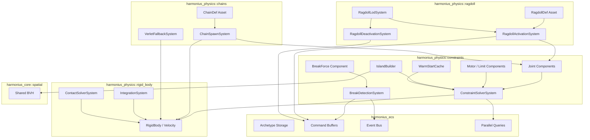
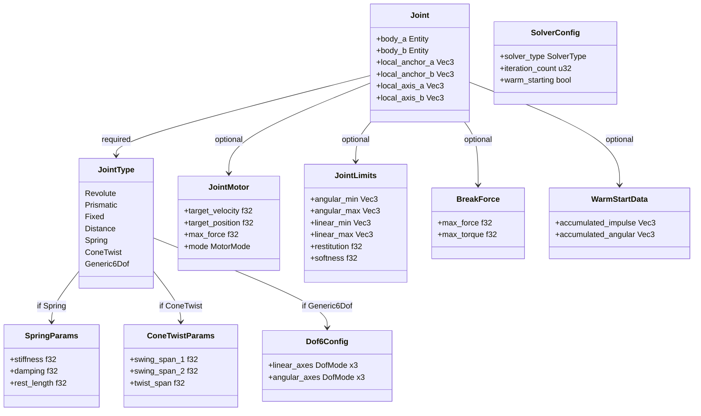
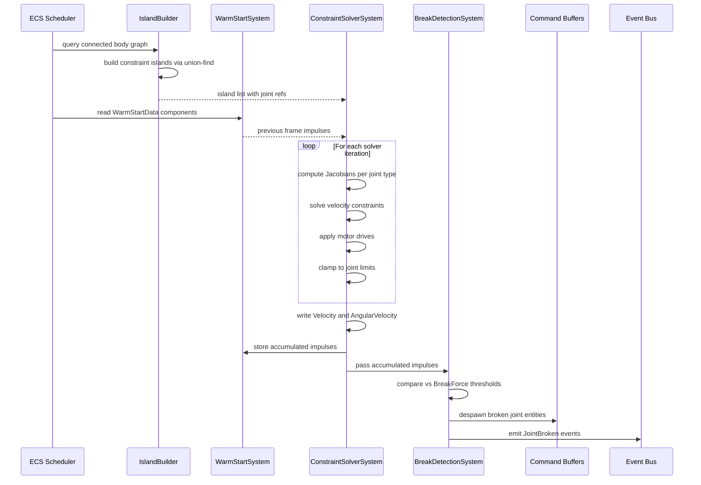
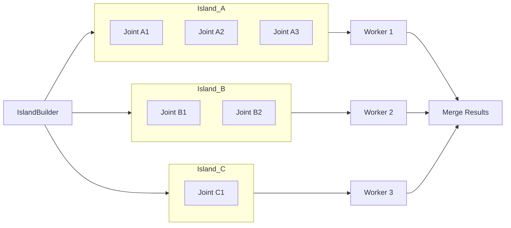
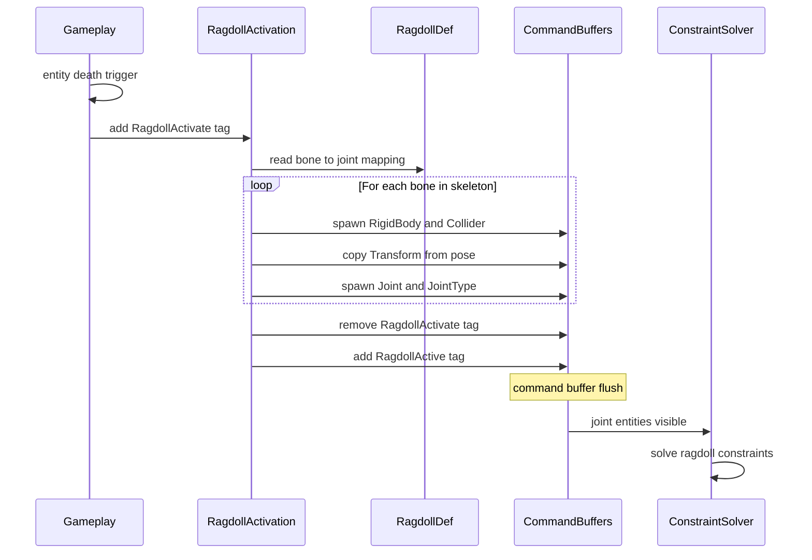
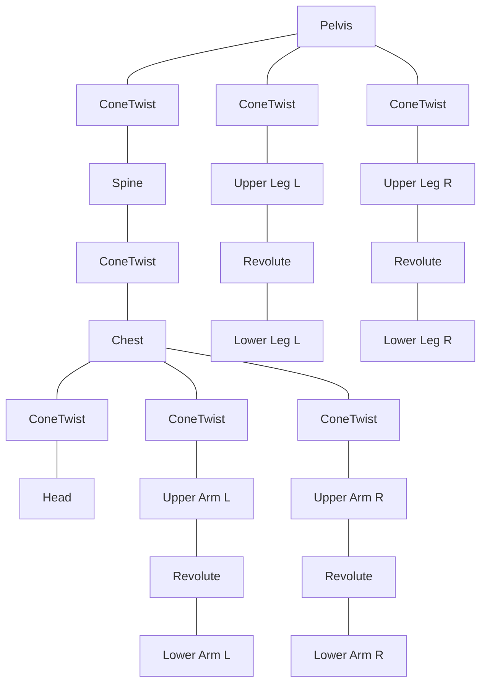

# Physics Constraints and Joints Design

## Requirements Trace

| Feature | Requirement | Description |
|---------|-------------|-------------|
| F-4.3.1 | R-4.3.1 | Core joint types: revolute, prismatic, fixed, distance |
| F-4.3.2 | R-4.3.2 | Advanced joints: spring, cone-twist, generic 6DOF |
| F-4.3.3 | R-4.3.3 | Joint motors (velocity/position) and angular/linear limits |
| F-4.3.4 | R-4.3.4 | Breakable joints with force/torque thresholds |
| F-4.3.5 | R-4.3.5 | Ragdoll configuration from skeleton asset definitions |
| F-4.3.6 | R-4.3.6 | Joint chains and ropes from chain definition assets |
| F-4.3.7 | R-4.3.7 | SI and TGS constraint solvers with warm starting |
| F-4.3.8 | R-4.3.8 | Limb severance and joint destruction |
| F-4.3.9 | R-4.3.9 | Prosthetic and limb replacement |
| R-4.3.NF1 | -- | Solver throughput: 5000 rows/ms, 500 joints in 4 ms |
| R-4.3.NF2 | -- | Ragdoll activation: 0.5 ms per ragdoll, 8 per frame |
| R-4.3.NF3 | -- | Chain stability: 32 segments, 60 s, drift below 1 mm |

## Overview

The constraints and joints subsystem manages all physical connections between rigid bodies. Every
joint is an ECS entity. All constraint data lives as components. All logic runs as systems. There is
no separate physics world.

Key principles:

1. **100% ECS-based.** Joint entities carry `Joint`, `JointType`, and optional `JointMotor`,
   `JointLimits`, `BreakForce`, and `WarmStartData` components. The solver queries these directly.
2. **Island-parallel solving.** The `IslandBuilder` partitions the constraint graph into independent
   islands. Each island is solved on a separate worker thread via the task graph.
3. **Warm starting.** Accumulated impulses from the previous substep are cached in `WarmStartData`
   components and applied at the start of each solve pass to accelerate convergence.
4. **Dual solver.** Sequential Impulse (SI) for mobile and Temporal Gauss-Seidel (TGS) for desktop,
   selectable via the `SolverConfig` ECS resource.
5. **Determinism.** Given identical entity ordering, the solver produces bit-identical results for
   server-authoritative prediction and rollback.

## Architecture

### Module Boundaries



### File Layout

```text
harmonius_physics/
├── constraints/
│   ├── components.rs    # Joint, JointType, JointMotor,
│   │                    # JointLimits, BreakForce,
│   │                    # WarmStartData, Dof6Config,
│   │                    # SpringParams, ConeTwistParams
│   ├── island.rs        # IslandBuilder, Island,
│   │                    # union-find partitioning
│   ├── solver.rs        # ConstraintSolverSystem,
│   │                    # SolverConfig, constraint row
│   │                    # generation and iteration
│   ├── si.rs            # Sequential Impulse solver
│   ├── tgs.rs           # Temporal Gauss-Seidel solver
│   ├── jacobian.rs      # Jacobian computation per
│   │                    # joint type
│   ├── warm_start.rs    # WarmStartSystem, impulse
│   │                    # caching and application
│   ├── breaking.rs      # BreakDetectionSystem,
│   │                    # JointBroken event
│   └── events.rs        # JointBroken, JointSevered
├── ragdoll/
│   ├── def.rs           # RagdollDef asset type
│   ├── activation.rs    # RagdollActivationSystem
│   ├── deactivation.rs  # RagdollDeactivationSystem
│   └── lod.rs           # RagdollLodSystem, platform
│                        # budget enforcement
├── chains/
│   ├── def.rs           # ChainDef asset type
│   ├── spawn.rs         # ChainSpawnSystem
│   └── verlet.rs        # VerletFallbackSystem for
│                        # distant chains
└── severance/
    ├── limb_health.rs   # LimbHealth component
    ├── severance.rs     # LimbSeveranceSystem
    └── prosthetic.rs    # ProstheticAttachmentSystem,
                         # ProstheticDef asset
```

### ECS Component Relationships



### Constraint Solver Pipeline (per Substep)



### Island-Parallel Constraint Solving



Independent islands share no bodies and can be solved in parallel on separate worker threads without
synchronization. The `IslandBuilder` uses incremental union-find: when a joint entity is spawned or
despawned, only the affected island is rebuilt.

### Ragdoll Activation Flow



### Ragdoll Bone-to-Joint Mapping



Each rectangle is a `RigidBody` + `Collider` + `Transform` entity. Each labeled link is a joint
entity with `Joint` + `JointType` + `JointLimits` components. Ball-socket articulations (shoulders,
hips, spine) use `ConeTwist`. Hinge articulations (elbows, knees) use `Revolute`.

## API Design

### Joint Components

```rust
/// Connects two rigid body entities. The joint
/// entity carries this component plus a JointType.
/// Anchor points and axes are in each body's
/// local space.
#[derive(Component, Reflect)]
pub struct Joint {
    /// First connected body entity.
    pub body_a: Entity,
    /// Second connected body entity.
    pub body_b: Entity,
    /// Anchor point in body_a local space.
    pub local_anchor_a: Vec3,
    /// Anchor point in body_b local space.
    pub local_anchor_b: Vec3,
    /// Primary axis in body_a local space.
    pub local_axis_a: Vec3,
    /// Primary axis in body_b local space.
    pub local_axis_b: Vec3,
}

/// Selects the constraint type solved for
/// this joint entity.
#[derive(Component, Reflect, Clone, Copy)]
pub enum JointType {
    /// Single-axis rotation (hinge). Constrains
    /// 5 DOF: 3 linear + 2 angular.
    Revolute,
    /// Single-axis translation (slider).
    /// Constrains 5 DOF: 2 linear + 3 angular.
    Prismatic,
    /// Zero relative motion (weld). Constrains
    /// all 6 DOF.
    Fixed,
    /// Maintains a target separation between
    /// anchors. Constrains 1 DOF (distance).
    Distance { target_distance: f32 },
    /// Elastic connection with stiffness and
    /// damping. Constrains 0 DOF (applies
    /// restorative forces).
    Spring(SpringParams),
    /// Ball-socket with angular limits on 3
    /// axes. Constrains 3 linear DOF + bounded
    /// angular DOF.
    ConeTwist(ConeTwistParams),
    /// Per-axis lock/limit/free on all 6 DOF.
    Generic6Dof(Dof6Config),
}
```

### Spring Parameters

```rust
/// Configuration for spring-type joints.
#[derive(Clone, Copy, Reflect)]
pub struct SpringParams {
    /// Spring stiffness in N/m.
    pub stiffness: f32,
    /// Damping coefficient in Ns/m.
    pub damping: f32,
    /// Rest length in meters. The spring
    /// applies zero force at this separation.
    pub rest_length: f32,
}
```

### Cone-Twist Parameters

```rust
/// Angular limits for cone-twist joints.
/// Models a cone of allowed swing plus a
/// twist range around the primary axis.
#[derive(Clone, Copy, Reflect)]
pub struct ConeTwistParams {
    /// Maximum swing angle around the first
    /// perpendicular axis, in radians.
    pub swing_span_1: f32,
    /// Maximum swing angle around the second
    /// perpendicular axis, in radians.
    pub swing_span_2: f32,
    /// Maximum twist angle around the primary
    /// axis, in radians.
    pub twist_span: f32,
    /// Softness factor [0, 1]. Lower values
    /// make limits more rigid.
    pub softness: f32,
    /// Bias factor [0, 1] controlling
    /// positional error correction strength.
    pub bias_factor: f32,
    /// Relaxation factor [0, 1] controlling
    /// how aggressively the solver relaxes
    /// toward the limit.
    pub relaxation_factor: f32,
}
```

### Generic 6DOF Configuration

```rust
/// Per-axis degree-of-freedom mode.
#[derive(
    Clone, Copy, Reflect, PartialEq, Eq,
)]
pub enum DofMode {
    /// Axis is fully constrained (zero motion).
    Locked,
    /// Axis is constrained within a range.
    Limited,
    /// Axis is unconstrained.
    Free,
}

/// Full 6DOF joint configuration. Each of the
/// 3 linear and 3 angular axes can be locked,
/// limited, or free independently.
#[derive(Clone, Copy, Reflect)]
pub struct Dof6Config {
    /// Mode for linear X, Y, Z.
    pub linear_axes: [DofMode; 3],
    /// Mode for angular X, Y, Z.
    pub angular_axes: [DofMode; 3],
    /// Linear limits as (min, max) per axis.
    /// Only used when the axis mode is Limited.
    pub linear_limits: [Vec2; 3],
    /// Angular limits as (min, max) in radians
    /// per axis. Only used when Limited.
    pub angular_limits: [Vec2; 3],
}
```

### Motor and Limit Components

```rust
/// Motor drive mode.
#[derive(
    Clone, Copy, Reflect, PartialEq, Eq,
)]
pub enum MotorMode {
    /// Drive toward a target angular/linear
    /// velocity.
    Velocity,
    /// Drive toward a target angular/linear
    /// position using a PD controller.
    Position,
}

/// Drives a joint toward a target velocity
/// or position. Attach to any joint entity.
#[derive(Component, Reflect)]
pub struct JointMotor {
    /// Target velocity in rad/s (angular) or
    /// m/s (linear).
    pub target_velocity: f32,
    /// Target position in radians (angular)
    /// or meters (linear). Used when mode is
    /// Position.
    pub target_position: f32,
    /// Maximum force the motor can apply, in
    /// Newtons (linear) or Nm (angular).
    pub max_force: f32,
    /// Drive mode: velocity or position.
    pub mode: MotorMode,
}

/// Angular and linear bounds for a joint.
/// Attach to any joint entity.
#[derive(Component, Reflect)]
pub struct JointLimits {
    /// Minimum angular limits per axis in
    /// radians.
    pub angular_min: Vec3,
    /// Maximum angular limits per axis in
    /// radians.
    pub angular_max: Vec3,
    /// Minimum linear limits per axis in
    /// meters.
    pub linear_min: Vec3,
    /// Maximum linear limits per axis in
    /// meters.
    pub linear_max: Vec3,
    /// Bounciness at limit contacts [0, 1].
    pub restitution: f32,
    /// Softness at limit contacts [0, 1].
    /// Lower values are more rigid.
    pub softness: f32,
}
```

Joint angular limits share the canonical `JointLimit` type defined in
[shared-primitives.md](../core-runtime/shared-primitives.md). Both physics constraints and animation
IK reference this shared type.

### Breakable Joints

```rust
/// Force/torque threshold for joint breaking.
/// When the solver's accumulated impulse exceeds
/// these thresholds, the joint entity is despawned
/// and a JointBroken event is emitted.
#[derive(Component, Reflect)]
pub struct BreakForce {
    /// Maximum tolerable force in Newtons.
    pub max_force: f32,
    /// Maximum tolerable torque in Newton-meters.
    pub max_torque: f32,
}

/// Emitted when a breakable joint's accumulated
/// impulse exceeds its BreakForce threshold.
#[derive(Event)]
pub struct JointBroken {
    /// The joint entity that was destroyed.
    pub joint_entity: Entity,
    /// First connected body.
    pub body_a: Entity,
    /// Second connected body.
    pub body_b: Entity,
    /// The force magnitude that caused the break.
    pub breaking_force: f32,
    /// The torque magnitude that caused the break.
    pub breaking_torque: f32,
}
```

### Warm Starting

```rust
/// Cached impulses from the previous substep.
/// Managed by the WarmStartSystem; not set by
/// users. Applied at the start of each solve
/// pass to accelerate convergence.
#[derive(Component, Reflect)]
pub struct WarmStartData {
    /// Accumulated linear impulse from the
    /// previous substep.
    pub accumulated_impulse: Vec3,
    /// Accumulated angular impulse from the
    /// previous substep.
    pub accumulated_angular: Vec3,
}
```

### Solver Configuration

```rust
/// Selects the constraint solver algorithm.
#[derive(
    Clone, Copy, Reflect, PartialEq, Eq,
)]
pub enum SolverType {
    /// Sequential Impulse. Lightweight, suitable
    /// for mobile. Solves velocity-level
    /// constraints with projected Gauss-Seidel.
    SequentialImpulse,
    /// Temporal Gauss-Seidel. Higher fidelity
    /// for desktop. Integrates position error
    /// correction into the velocity solve,
    /// reducing drift without a separate
    /// position projection pass.
    TemporalGaussSeidel,
}

/// Global constraint solver configuration.
/// Stored as an ECS resource.
#[derive(Resource, Reflect)]
pub struct SolverConfig {
    /// Active solver algorithm.
    pub solver_type: SolverType,
    /// Number of solver iterations per substep.
    pub iteration_count: u32,
    /// Whether to apply warm starting.
    pub warm_starting: bool,
    /// Warm start blending factor [0, 1].
    /// Typical value: 0.85.
    pub warm_start_factor: f32,
}

impl Default for SolverConfig {
    fn default() -> Self {
        Self {
            solver_type:
                SolverType::TemporalGaussSeidel,
            iteration_count: 8,
            warm_starting: true,
            warm_start_factor: 0.85,
        }
    }
}
```

### Constraint Row (Internal)

```rust
/// A single scalar constraint row used
/// internally by the solver. Not exposed as a
/// component. Each joint type generates one or
/// more constraint rows.
pub(crate) struct ConstraintRow {
    /// Jacobian: linear component for body A.
    pub j_linear_a: Vec3,
    /// Jacobian: angular component for body A.
    pub j_angular_a: Vec3,
    /// Jacobian: linear component for body B.
    pub j_linear_b: Vec3,
    /// Jacobian: angular component for body B.
    pub j_angular_b: Vec3,
    /// Effective mass (1 / J * M^-1 * J^T).
    pub effective_mass: f32,
    /// Positional bias for error correction.
    pub bias: f32,
    /// Accumulated impulse (clamped).
    pub impulse: f32,
    /// Lower bound on impulse.
    pub lower_limit: f32,
    /// Upper bound on impulse.
    pub upper_limit: f32,
}
```

### Constraint Row Counts per Joint Type

| Joint Type | Constraint Rows | Notes |
|------------|----------------|-------|
| Revolute | 5 | 3 linear + 2 angular. Free axis = rotation axis. |
| Prismatic | 5 | 2 linear + 3 angular. Free axis = slide axis. |
| Fixed | 6 | 3 linear + 3 angular. All DOF locked. |
| Distance | 1 | Scalar distance constraint along anchor vector. |
| Spring | 1 | Soft distance constraint with stiffness/damping. |
| ConeTwist | 3 linear + up to 3 angular | Angular rows active only when at limit. |
| Generic6Dof | 0-6 | One row per axis in Locked or Limited mode. |

Additional rows per optional component:

| Component | Extra Rows | Notes |
|-----------|-----------|-------|
| JointMotor | +1 | Motor drive row on the driven axis. |
| JointLimits | +1-2 | Limit rows when at angular/linear boundary. |

### Island Builder

```rust
/// Partitions the constraint graph into
/// independent islands for parallel solving.
pub struct IslandBuilder {
    /// Union-find parent array indexed by
    /// body entity index.
    parent: Vec<u32>,
    /// Rank array for union-by-rank.
    rank: Vec<u32>,
}

impl IslandBuilder {
    pub fn new(capacity: u32) -> Self;

    /// Build islands from the current set of
    /// Joint entities. Returns a list of islands,
    /// each containing references to its joint
    /// and body entities.
    pub fn build(
        &mut self,
        joints: &[(Entity, &Joint)],
    ) -> Vec<Island>;

    /// Incrementally update islands when a
    /// joint is added or removed. Avoids full
    /// rebuild on structural changes.
    pub fn update_incremental(
        &mut self,
        added: &[Entity],
        removed: &[Entity],
        joints: &[(Entity, &Joint)],
    ) -> Vec<Island>;
}

/// A group of bodies and joints with no
/// external connections. Can be solved
/// independently of all other islands.
pub struct Island {
    /// Body entities in this island.
    pub bodies: SmallVec<[Entity; 16]>,
    /// Joint entities in this island.
    pub joints: SmallVec<[Entity; 16]>,
}
```

### Constraint Solver System

```rust
/// The core ECS system that solves all joint
/// constraints each substep. Queries Joint and
/// JointType components, optionally reads
/// JointMotor, JointLimits, and BreakForce,
/// and writes to Velocity and AngularVelocity
/// on the connected body entities.
pub struct ConstraintSolverSystem;

impl ConstraintSolverSystem {
    /// System entry point. Called once per
    /// substep by the ECS scheduler.
    pub fn run(
        config: Res<SolverConfig>,
        islands: Res<IslandList>,
        joints: Query<(
            &Joint,
            &JointType,
            Option<&JointMotor>,
            Option<&JointLimits>,
            Option<&BreakForce>,
            Option<&mut WarmStartData>,
        )>,
        bodies: Query<(
            &RigidBody,
            &Mass,
            &Inertia,
            &Transform,
            &mut Velocity,
            &mut AngularVelocity,
        )>,
        pool: Res<ThreadPool>,
    );
}
```

### Solver Algorithm (SI)

```rust
/// Sequential Impulse solver. Iteratively
/// applies impulses to satisfy constraints.
pub(crate) fn solve_si(
    rows: &mut [ConstraintRow],
    bodies: &mut BodySolverData,
    iterations: u32,
    warm_start: bool,
    warm_factor: f32,
) {
    // 1. Warm start: apply cached impulses
    //    scaled by warm_factor.
    if warm_start {
        for row in rows.iter() {
            let impulse =
                row.impulse * warm_factor;
            apply_impulse(
                bodies, row, impulse,
            );
        }
    }

    // 2. Iterative solve
    for _iter in 0..iterations {
        for row in rows.iter_mut() {
            // Compute relative velocity along
            // constraint axis (J * v).
            let jv = dot_jacobian_velocity(
                row, bodies,
            );

            // Compute impulse correction.
            let lambda =
                -(jv + row.bias)
                    * row.effective_mass;

            // Accumulate and clamp.
            let old_impulse = row.impulse;
            row.impulse = (old_impulse + lambda)
                .clamp(
                    row.lower_limit,
                    row.upper_limit,
                );
            let delta =
                row.impulse - old_impulse;

            // Apply delta impulse to bodies.
            apply_impulse(bodies, row, delta);
        }
    }
}
```

### Solver Algorithm (TGS)

```rust
/// Temporal Gauss-Seidel solver. Integrates
/// position error correction into the velocity
/// solve, reducing drift without a separate
/// position projection pass. Uses sub-step dt
/// to scale bias terms.
pub(crate) fn solve_tgs(
    rows: &mut [ConstraintRow],
    bodies: &mut BodySolverData,
    iterations: u32,
    warm_start: bool,
    warm_factor: f32,
    dt: f32,
) {
    // 1. Warm start (same as SI).
    if warm_start {
        for row in rows.iter() {
            let impulse =
                row.impulse * warm_factor;
            apply_impulse(
                bodies, row, impulse,
            );
        }
    }

    // 2. Iterative solve with integrated
    //    position correction.
    let inv_dt = 1.0 / dt;
    for _iter in 0..iterations {
        for row in rows.iter_mut() {
            let jv = dot_jacobian_velocity(
                row, bodies,
            );

            // TGS bias includes position error
            // scaled by inv_dt for implicit
            // position correction.
            let bias_term =
                row.bias * inv_dt;
            let lambda =
                -(jv + bias_term)
                    * row.effective_mass;

            let old_impulse = row.impulse;
            row.impulse = (old_impulse + lambda)
                .clamp(
                    row.lower_limit,
                    row.upper_limit,
                );
            let delta =
                row.impulse - old_impulse;

            apply_impulse(bodies, row, delta);
        }
    }

    // 3. Integrate positions using corrected
    //    velocities (implicit Euler step).
    integrate_positions(bodies, dt);
}
```

### Jacobian Computation

```rust
/// Builds constraint rows for a single joint
/// based on its JointType. Returns the number
/// of rows written into the output slice.
pub(crate) fn build_jacobians(
    joint: &Joint,
    joint_type: &JointType,
    motor: Option<&JointMotor>,
    limits: Option<&JointLimits>,
    body_a: &BodyState,
    body_b: &BodyState,
    rows: &mut [ConstraintRow],
) -> u32 {
    match joint_type {
        JointType::Revolute => {
            build_revolute_rows(
                joint, body_a, body_b,
                limits, motor, rows,
            )
        }
        JointType::Prismatic => {
            build_prismatic_rows(
                joint, body_a, body_b,
                limits, motor, rows,
            )
        }
        JointType::Fixed => {
            build_fixed_rows(
                joint, body_a, body_b, rows,
            )
        }
        JointType::Distance { target_distance }
        => {
            build_distance_rows(
                joint, *target_distance,
                body_a, body_b, rows,
            )
        }
        JointType::Spring(params) => {
            build_spring_rows(
                joint, params,
                body_a, body_b, rows,
            )
        }
        JointType::ConeTwist(params) => {
            build_cone_twist_rows(
                joint, params,
                body_a, body_b,
                limits, rows,
            )
        }
        JointType::Generic6Dof(config) => {
            build_6dof_rows(
                joint, config,
                body_a, body_b,
                motor, rows,
            )
        }
    }
}
```

### Break Detection System

```rust
/// Checks accumulated solver impulses against
/// BreakForce thresholds after each substep.
/// Broken joints are despawned via command
/// buffer and JointBroken events are emitted.
pub struct BreakDetectionSystem;

impl BreakDetectionSystem {
    pub fn run(
        joints: Query<(
            Entity,
            &Joint,
            &BreakForce,
            &WarmStartData,
        )>,
        mut commands: Commands,
        mut events: EventWriter<JointBroken>,
    ) {
        for (
            entity, joint, threshold, impulse,
        ) in joints.iter()
        {
            let force_mag =
                impulse.accumulated_impulse
                    .length();
            let torque_mag =
                impulse.accumulated_angular
                    .length();

            if force_mag > threshold.max_force
                || torque_mag
                    > threshold.max_torque
            {
                commands
                    .entity(entity)
                    .despawn();
                events.send(JointBroken {
                    joint_entity: entity,
                    body_a: joint.body_a,
                    body_b: joint.body_b,
                    breaking_force: force_mag,
                    breaking_torque: torque_mag,
                });
            }
        }
    }
}
```

### Ragdoll Definition and Activation

```rust
/// Maps a skeleton hierarchy to joint entity
/// archetypes for ragdoll activation. Stored
/// as a shared asset.
pub struct RagdollDef {
    /// One entry per joint in the skeleton.
    pub joints: Vec<RagdollJointDef>,
}

/// Definition for a single ragdoll joint.
pub struct RagdollJointDef {
    /// Index of the parent bone in the
    /// skeleton hierarchy.
    pub parent_bone: u16,
    /// Index of the child bone.
    pub child_bone: u16,
    /// Joint type for this connection.
    pub joint_type: JointType,
    /// Angular limits for this joint.
    pub limits: JointLimits,
    /// Local anchor offset on the parent bone.
    pub local_anchor_parent: Vec3,
    /// Local anchor offset on the child bone.
    pub local_anchor_child: Vec3,
    /// Collider shape for the child bone's
    /// rigid body (capsule, box, or sphere).
    pub collider: ColliderShape,
    /// Mass of the child bone's rigid body.
    pub mass: f32,
}

/// Tag component that triggers ragdoll
/// activation on the next physics tick.
#[derive(Component)]
pub struct RagdollActivate;

/// Tag component marking an entity as having
/// an active ragdoll. Removed when returning
/// to animation control.
#[derive(Component)]
pub struct RagdollActive;

/// Spawns ragdoll joint and body entities when
/// a RagdollActivate tag is detected. Copies
/// current animation pose as initial transform.
pub struct RagdollActivationSystem;

impl RagdollActivationSystem {
    pub fn run(
        query: Query<(
            Entity,
            &RagdollActivate,
            &SkeletonRef,
            &Transform,
        )>,
        ragdoll_defs: Res<Assets<RagdollDef>>,
        mut commands: Commands,
    ) {
        for (entity, _, skel, xform) in
            query.iter()
        {
            let def = ragdoll_defs
                .get(skel.ragdoll_def);
            for joint_def in &def.joints {
                // Spawn child bone rigid body
                let child = commands.spawn((
                    RigidBody::Dynamic,
                    joint_def.collider.clone(),
                    Mass(joint_def.mass),
                    Velocity::ZERO,
                    AngularVelocity::ZERO,
                    bone_world_transform(
                        skel,
                        joint_def.child_bone,
                        xform,
                    ),
                ));

                // Spawn joint entity
                let parent_entity =
                    skel.bone_entities
                        [joint_def.parent_bone
                            as usize];
                commands.spawn((
                    Joint {
                        body_a: parent_entity,
                        body_b: child.id(),
                        local_anchor_a:
                            joint_def
                                .local_anchor_parent,
                        local_anchor_b:
                            joint_def
                                .local_anchor_child,
                        local_axis_a: Vec3::Y,
                        local_axis_b: Vec3::Y,
                    },
                    joint_def.joint_type,
                    joint_def.limits.clone(),
                ));
            }

            commands.entity(entity)
                .remove::<RagdollActivate>()
                .insert(RagdollActive);
        }
    }
}
```

### Ragdoll LOD and Platform Budgets

| Platform | Max Ragdolls | Max Bones/Ragdoll | Solver |
|----------|-------------|-------------------|--------|
| Mobile | 4 | 8 | SI, 4 iterations |
| Switch | 8 | 12 | SI, 6 iterations |
| Desktop | 32 | 20 | TGS, 8 iterations |
| High-end PC | 128 | full skeleton | TGS, 12+ iterations |

```rust
/// Enforces per-platform ragdoll budgets.
/// Deactivates the most distant ragdolls when
/// the budget is exceeded, replacing them with
/// animation blend.
pub struct RagdollLodSystem;

impl RagdollLodSystem {
    pub fn run(
        active: Query<(
            Entity,
            &RagdollActive,
            &Transform,
        )>,
        camera: Res<ActiveCamera>,
        budget: Res<RagdollBudget>,
        mut commands: Commands,
    ) {
        // Sort by distance to camera.
        // Deactivate excess ragdolls beyond
        // the platform budget.
    }
}

/// Per-platform ragdoll budget. Set at
/// initialization based on detected platform.
#[derive(Resource)]
pub struct RagdollBudget {
    pub max_active_ragdolls: u32,
    pub max_bones_per_ragdoll: u32,
}
```

### Chain Definition and Spawning

```rust
/// Defines a rope or chain as a sequence of
/// rigid body segments connected by joints.
pub struct ChainDef {
    /// Number of segments in the chain.
    pub segment_count: u32,
    /// Joint type between segments (Distance
    /// or Spring).
    pub joint_type: JointType,
    /// Mass per segment in kg.
    pub segment_mass: f32,
    /// Length per segment in meters.
    pub segment_length: f32,
    /// Collider shape per segment.
    pub segment_collider: ColliderShape,
}

/// Spawns chain entities from a ChainDef
/// between two anchor points.
pub struct ChainSpawnSystem;

impl ChainSpawnSystem {
    pub fn run(
        spawns: Query<(
            Entity,
            &ChainSpawnRequest,
            &ChainDefRef,
        )>,
        chain_defs: Res<Assets<ChainDef>>,
        mut commands: Commands,
    ) {
        for (entity, req, def_ref) in
            spawns.iter()
        {
            let def =
                chain_defs.get(def_ref.0);
            let dir = (req.end - req.start)
                .normalize();
            let step =
                dir * def.segment_length;

            let mut prev_entity =
                req.anchor_start;
            for i in 0..def.segment_count {
                let pos = req.start
                    + step * (i as f32 + 0.5);

                let seg = commands.spawn((
                    RigidBody::Dynamic,
                    def.segment_collider
                        .clone(),
                    Mass(def.segment_mass),
                    Velocity::ZERO,
                    AngularVelocity::ZERO,
                    Transform::from_translation(
                        pos,
                    ),
                ));

                commands.spawn((
                    Joint {
                        body_a: prev_entity,
                        body_b: seg.id(),
                        local_anchor_a: Vec3::Y
                            * def.segment_length
                            * 0.5,
                        local_anchor_b: -Vec3::Y
                            * def.segment_length
                            * 0.5,
                        local_axis_a: Vec3::Y,
                        local_axis_b: Vec3::Y,
                    },
                    def.joint_type,
                ));

                prev_entity = seg.id();
            }

            // Connect last segment to end
            // anchor.
            commands.spawn((
                Joint {
                    body_a: prev_entity,
                    body_b: req.anchor_end,
                    local_anchor_a: Vec3::Y
                        * def.segment_length
                        * 0.5,
                    local_anchor_b: Vec3::ZERO,
                    local_axis_a: Vec3::Y,
                    local_axis_b: Vec3::Y,
                },
                def.joint_type,
            ));

            commands.entity(entity).despawn();
        }
    }
}
```

### Chain Platform Budgets

| Platform | Max Segments/Chain | Max Active Chains | Distant Fallback |
|----------|--------------------|-------------------|------------------|
| Mobile | 8 | 4 | Verlet, no collision |
| Switch | 16 | 8 | Verlet, no collision |
| Desktop | 64 | 32 | Verlet, no collision |
| High-end PC | 128 | unlimited | Verlet, no collision |

### Limb Severance

```rust
/// Tracks per-joint hit points for progressive
/// limb damage. When HP reaches zero, the limb
/// is severed.
#[derive(Component, Reflect)]
pub struct LimbHealth {
    /// Current hit points.
    pub current_hp: f32,
    /// Maximum hit points (severance threshold).
    pub max_hp: f32,
}

/// Emitted when a limb is severed from its
/// parent skeleton.
#[derive(Event)]
pub struct JointSevered {
    /// The joint entity that was destroyed.
    pub joint_entity: Entity,
    /// The parent skeleton entity.
    pub parent_entity: Entity,
    /// The newly spawned detached limb entity.
    pub limb_entity: Entity,
    /// The bone index that was severed.
    pub bone_index: u16,
}

/// Monitors LimbHealth components and severs
/// joints when HP reaches zero. Spawns the
/// detached bone chain as an independent
/// ragdoll, spawns VFX, and fires the
/// JointSevered event.
pub struct LimbSeveranceSystem;

impl LimbSeveranceSystem {
    pub fn run(
        limbs: Query<(
            Entity,
            &LimbHealth,
            &Joint,
        )>,
        mut commands: Commands,
        mut events:
            EventWriter<JointSevered>,
    ) {
        for (entity, health, joint) in
            limbs.iter()
        {
            if health.current_hp <= 0.0 {
                // Despawn the joint.
                commands
                    .entity(entity)
                    .despawn();

                // Spawn detached limb as
                // independent ragdoll.
                let limb = commands.spawn((
                    RigidBody::Dynamic,
                    // ... collider, mass,
                    // transform from current
                    // bone pose
                ));

                events.send(JointSevered {
                    joint_entity: entity,
                    parent_entity:
                        joint.body_a,
                    limb_entity: limb.id(),
                    bone_index: 0,
                });
            }
        }
    }
}
```

### Prosthetic Attachment

```rust
/// Defines a replacement limb that can be
/// attached to a severed joint socket.
pub struct ProstheticDef {
    /// Replacement mesh asset reference.
    pub mesh: AssetRef,
    /// Bone chain definition for the
    /// replacement.
    pub bone_chain: Vec<BoneDef>,
    /// Collider shapes for the replacement.
    pub colliders: Vec<ColliderShape>,
    /// Stat modifiers applied on attachment.
    pub stat_modifiers: Vec<StatModifier>,
    /// Compatible socket types (arm, leg,
    /// tail).
    pub compatible_sockets: Vec<SocketType>,
}

/// Socket type for prosthetic compatibility.
#[derive(
    Clone, Copy, Reflect, PartialEq, Eq,
)]
pub enum SocketType {
    Arm,
    Leg,
    Tail,
    Head,
    Wing,
}

/// Re-establishes physics constraints at a
/// severed joint socket and attaches a
/// prosthetic limb.
pub struct ProstheticAttachmentSystem;

impl ProstheticAttachmentSystem {
    pub fn run(
        requests: Query<(
            Entity,
            &AttachProsthetic,
        )>,
        prosthetic_defs:
            Res<Assets<ProstheticDef>>,
        mut commands: Commands,
    ) {
        for (entity, req) in requests.iter() {
            let def = prosthetic_defs
                .get(req.prosthetic_def);

            // Spawn replacement bone chain
            // and colliders.

            // Spawn Joint entity reconnecting
            // to the parent socket.

            // Apply stat modifiers via
            // gameplay effect system.

            // Trigger locomotion re-evaluation.

            commands.entity(entity)
                .remove::<AttachProsthetic>();
        }
    }
}
```

### Error Types

```rust
pub enum ConstraintError {
    /// A Joint references an entity that does
    /// not exist or lacks RigidBody.
    InvalidBodyRef {
        joint: Entity,
        body: Entity,
    },
    /// Island build detected a cycle in the
    /// constraint graph (should not happen with
    /// pairwise joints, indicates corruption).
    IslandCycleDetected,
    /// Solver iteration count is zero.
    ZeroIterations,
    /// Joint type mismatch with attached
    /// parameters (e.g., SpringParams on a
    /// Revolute joint).
    TypeParamMismatch {
        joint: Entity,
        expected: &'static str,
        found: &'static str,
    },
}
```

## Data Flow

### Substep Execution Order

Each physics substep executes the following systems in dependency order:

1. **IntegrationSystem** -- apply forces, update velocities, advance positions (F-4.1.1).
2. **BroadphaseQuerySystem** -- update shared BVH AABB overlaps (F-4.2.1).
3. **NarrowphaseSystem** -- generate contact manifolds (F-4.2.2).
4. **ContactSolverSystem** -- resolve contact constraints (F-4.1.3).
5. **IslandBuilder** -- partition constraint graph into islands.
6. **WarmStartSystem** -- load cached impulses into solver.
7. **ConstraintSolverSystem** -- iterate constraint rows across all islands in parallel.
8. **BreakDetectionSystem** -- check thresholds, despawn broken joints, emit events.
9. **WarmStartSystem** -- store solved impulses for next substep.

```rust
// Simplified substep schedule
fn physics_substep_schedule() -> TaskGraph {
    let mut graph = TaskGraphBuilder::new();

    let integrate =
        graph.add_task("integrate", || {
            IntegrationSystem::run(/* ... */);
        });
    let broadphase =
        graph.add_task("broadphase", || {
            BroadphaseQuerySystem::run(/* ... */);
        });
    let narrowphase =
        graph.add_task("narrowphase", || {
            NarrowphaseSystem::run(/* ... */);
        });
    let contacts =
        graph.add_task("contacts", || {
            ContactSolverSystem::run(/* ... */);
        });
    let islands =
        graph.add_task("islands", || {
            IslandBuilder::build(/* ... */);
        });
    let warm_load =
        graph.add_task("warm_load", || {
            WarmStartSystem::load(/* ... */);
        });
    let solve =
        graph.add_task("solve", || {
            ConstraintSolverSystem::run(
                /* ... */
            );
        });
    let break_check =
        graph.add_task("break_check", || {
            BreakDetectionSystem::run(
                /* ... */
            );
        });
    let warm_store =
        graph.add_task("warm_store", || {
            WarmStartSystem::store(/* ... */);
        });

    graph.add_dependency(integrate, broadphase);
    graph.add_dependency(
        broadphase, narrowphase,
    );
    graph.add_dependency(narrowphase, contacts);
    graph.add_dependency(contacts, islands);
    graph.add_dependency(islands, warm_load);
    graph.add_dependency(warm_load, solve);
    graph.add_dependency(solve, break_check);
    graph.add_dependency(solve, warm_store);

    graph.build().unwrap()
}
```

### Warm Starting Data Flow

1. At the start of each substep, `WarmStartSystem` reads `WarmStartData` components and passes
   cached impulses to the solver.
2. The solver applies `impulse * warm_start_factor` to each body before iterating.
3. After solving, the solver writes new accumulated impulses back to `WarmStartData` components.
4. On the next substep, step 1 repeats with the updated cache.
5. When a joint is despawned (breaking or ragdoll deactivation), its `WarmStartData` is discarded.
6. When a joint is spawned (ragdoll activation or chain creation), `WarmStartData` is initialized to
   zero (cold start for the first substep).

### Break Detection Flow

1. `ConstraintSolverSystem` solves all constraint rows and writes accumulated impulses to
   `WarmStartData`.
2. `BreakDetectionSystem` queries all joint entities that have both `BreakForce` and
   `WarmStartData`.
3. For each joint, it computes force magnitude (`accumulated_impulse.length()`) and torque magnitude
   (`accumulated_angular.length()`).
4. If either exceeds the threshold, the joint entity is despawned via command buffer and a
   `JointBroken` event is emitted.
5. Gameplay systems observe `JointBroken` events to trigger VFX, audio, and gameplay effects.

## Platform Considerations

### Solver Selection by Platform

| Platform | Default Solver | Default Iterations | Rationale |
|----------|---------------|-------------------|-----------|
| Mobile | SI | 4 | Minimal CPU budget; SI is cheaper per iteration. |
| Switch | SI | 6 | Moderate budget; SI with more iterations. |
| Desktop | TGS | 8 | Sufficient budget; TGS reduces drift. |
| High-end PC | TGS | 12+ | Ample budget; maximum fidelity. |

### Thread Pool Integration

- Islands are dispatched as parallel tasks via the engine's `ThreadPool` and `TaskGraph` (F-14.3.1,
  F-14.3.3).
- Each island's solve is a scoped task that borrows body data without `Arc` overhead.
- On mobile (4 perf cores), islands are batched to minimize dispatch overhead.
- On desktop (8+ perf cores), fine-grained island parallelism is used.

### SIMD Opportunities

- Jacobian computation and impulse application use `Vec3` operations that map directly to SIMD
  intrinsics on all target platforms.
- Constraint rows can be processed in SoA layout for 4-wide SIMD (SSE/NEON) batching when an island
  has 4+ rows of the same joint type.
- No platform-specific SIMD code: Rust auto- vectorization with `#[target_feature]` attributes and
  the `std::simd` stable subset covers all targets.

### Memory Layout

- Joint components are stored in archetype tables (F-1.1.1), guaranteeing cache-friendly iteration.
- The solver reads joint and body data in a single linear pass per island, avoiding random memory
  access.
- `ConstraintRow` arrays are stack-allocated per island (max ~768 rows for 128 joints * 6 rows).
  Islands exceeding this are heap-allocated via a thread-local bump allocator.

### Floating-Point Determinism

- Strict IEEE 754 compliance on all platforms. No fast-math optimizations.
- Fixed iteration order (entity index order within each island) guarantees identical results.
- Cross-platform determinism requires identical compiler flags and rounding modes, as documented in
  F-4.1.1.

## Test Plan

### Unit Tests

| Test | Req | Description |
|------|-----|-------------|
| `test_revolute_5dof_lock` | R-4.3.1 | Create revolute joint, verify 5 DOF constrained, free axis rotates. |
| `test_prismatic_5dof_lock` | R-4.3.1 | Create prismatic joint, verify 5 DOF constrained, free axis slides. |
| `test_fixed_6dof_lock` | R-4.3.1 | Create fixed joint, verify all 6 DOF locked, zero relative motion. |
| `test_distance_separation` | R-4.3.1 | Create distance joint, apply force, verify separation stays within 1mm of target. |
| `test_spring_equilibrium` | R-4.3.2 | Create spring joint, verify oscillation converges to rest length. |
| `test_cone_twist_limits` | R-4.3.2 | Create cone-twist with 45-deg limit, apply torque, verify angle does not exceed 45.5 deg over 1000 ticks (US-4.3.2.4). |
| `test_6dof_per_axis_lock` | R-4.3.2 | Lock X, limit Y, free Z. Verify X frozen, Y bounded, Z unconstrained. Verify axis independence (US-4.3.2.9). |
| `test_motor_velocity_target` | R-4.3.3 | Set motor target 2 rad/s, verify steady state within 1% (US-4.3.3.4). |
| `test_motor_position_target` | R-4.3.3 | Set motor to position mode, verify convergence to target angle. |
| `test_motor_max_force_clamp` | R-4.3.3 | Apply heavy load, verify motor does not exceed max force (US-4.3.3.5). |
| `test_limits_angular_clamp` | R-4.3.3 | Set +/-45 deg limits, apply excess torque, verify no exceed 45.5 deg (US-4.3.3.5). |
| `test_limits_restitution` | R-4.3.3 | Verify limit bounce with restitution > 0. |
| `test_break_force_threshold` | R-4.3.4 | Create 1000N breakable joint, apply 1500N, verify despawn within one substep (US-4.3.4.3). |
| `test_break_event_payload` | R-4.3.4 | Verify JointBroken event contains both body entities and force magnitude (US-4.3.4.4). |
| `test_break_torque_threshold` | R-4.3.4 | Verify torque-based breaking works independently of force threshold. |
| `test_break_varied_directions` | R-4.3.4 | Test breaking under tension, compression, shear, torsion (US-4.3.4.9). |
| `test_warm_start_convergence` | R-4.3.7 | Verify warm-started solver converges in fewer iterations than cold start. |
| `test_si_solver_correctness` | R-4.3.7 | Run SI solver on known configuration, verify impulses match reference. |
| `test_tgs_solver_correctness` | R-4.3.7 | Run TGS solver, verify impulses and positions match reference. |
| `test_solver_determinism` | R-4.3.7 | Run same scenario twice, assert bit-identical results (US-4.3.7.5). |
| `test_island_partitioning` | R-4.3.7 | Create 3 disconnected groups, verify 3 islands with correct membership. |
| `test_island_incremental` | R-4.3.7 | Add/remove joints, verify islands update correctly without full rebuild. |
| `test_ragdoll_activation` | R-4.3.5 | Activate ragdoll on 20-bone skeleton, verify all joints spawn with correct types/limits (US-4.3.5.3). |
| `test_ragdoll_deactivation` | R-4.3.5 | Deactivate ragdoll, verify all joint entities despawned. |
| `test_chain_spawn` | R-4.3.6 | Spawn 32-segment chain, verify correct entity count and connectivity. |
| `test_limb_health_zero_severs` | R-4.3.8 | Reduce LimbHealth to zero, verify joint despawned and JointSevered event fires (US-4.3.8.3, US-4.3.8.4). |
| `test_constraint_row_count` | R-4.3.1 | Verify each joint type generates the expected number of constraint rows. |

### Integration Tests

| Test | Req | Description |
|------|-----|-------------|
| `test_core_joint_drift` | R-4.3.1 | Connect two 1kg bodies with each joint type, apply forces 500 ticks at 8 iterations, assert drift below 1mm (US-4.3.1.5). |
| `test_tgs_drift_reduction` | R-4.3.7 | 10-body chain, 1000 ticks, SI vs TGS at 8 iterations. Assert TGS drift at least 30% lower (US-4.3.7.3). |
| `test_ragdoll_stability` | R-4.3.5 | Simulate active ragdoll 100 ticks, assert no violation exceeds 5mm (US-4.3.5.4). |
| `test_ragdoll_on_slopes` | R-4.3.5 | Ragdoll on 30-degree slope, verify no jitter or tunneling (US-4.3.5.8). |
| `test_chain_stability_60s` | R-4.3.6 | 32-segment chain, 60 seconds, 4 substeps. Assert separation below 1mm, energy gain below 1%/s (R-4.3.NF3). |
| `test_chain_collision` | R-4.3.6 | Chain draped over obstacle, verify collision response (US-4.3.6.8). |
| `test_chain_extreme_tension` | R-4.3.6 | Apply extreme tension, verify chain does not explode (US-4.3.6.12). |
| `test_parallel_island_solve` | R-4.3.7 | Create 16 independent islands, verify all solved correctly in parallel. |
| `test_ragdoll_to_animation` | R-4.3.5 | Transition ragdoll back to animation, verify smooth blend (US-4.3.5.12). |
| `test_prosthetic_attachment` | R-4.3.9 | Sever limb, attach prosthetic, verify constraints restored (US-4.3.9.3). |
| `test_severance_locomotion` | R-4.3.8 | Sever leg, verify skeleton adapts locomotion (US-4.3.8.5). |

### Benchmarks

| Benchmark | Target | Source |
|-----------|--------|--------|
| Solver throughput (500 joints, 8 iter) | < 4 ms | R-4.3.NF1 |
| Constraint rows per ms | >= 5000 | R-4.3.NF1 |
| Ragdoll activation (8 x 20 bones) | < 4 ms | R-4.3.NF2 |
| Single ragdoll activation | < 0.5 ms | R-4.3.NF2 |
| Island build (1000 bodies) | < 0.5 ms | -- |
| Warm start apply (500 joints) | < 0.2 ms | -- |
| Break detection (500 joints) | < 0.1 ms | -- |
| Chain spawn (32 segments) | < 0.3 ms | -- |

### Debug Visualization

Joint debug draw renders joint axes, angular limits (cone wireframes for cone-twist, arc indicators
for hinge), linear limit ranges, and ragdoll bone connections. Rendered via the shared debug overlay
pass.

### Networking Integration

Ragdoll synchronization across network is a known challenge. The server runs the authoritative
ragdoll simulation; clients receive bone transforms via standard component replication. Ragdoll
activation/deactivation events are replicated as reliable messages. Joint break events are
replicated to ensure consistent destruction state.

## Design Q & A

**Q1. What is the biggest constraint limiting this design?**

The deterministic solver requirement (R-4.1.NF3, F-4.3.7) is the biggest constraint. Both SI and TGS
solvers must produce bit-identical results across platforms, which prohibits floating-point
reordering optimizations and limits SIMD usage to deterministic reduction patterns. Lifting this
constraint would allow aggressive SIMD batching of constraint rows, platform-specific fast-math, and
non-deterministic parallel reduction within islands. The throughput target (R-4.3.NF1: 5000 rows/ms)
would be easier to hit without determinism. However, determinism is essential for
server-authoritative multiplayer with client-side prediction and rollback, which is a core engine
requirement. The best compromise is deterministic ordering with per-platform SIMD intrinsics that
maintain IEEE 754 strict compliance.

**Q2. How can this design be improved?**

The warm start strategy for sleeping bodies (Open Question 2) needs resolution before
implementation, as stale cached impulses after wake-up will cause visible jitter in stacking
scenarios. The ragdoll bone budget on mobile (8 bones per ragdoll, F-4.3.5) is tight and the bone
selection heuristic (Open Question 5) needs user testing. The limb severance system (F-4.3.8)
couples tightly with animation (F-9.3.10) and gameplay effects (F-13.10.3), but the cross-domain
event flow is not fully specified. Chain simulation (F-4.3.6) falls back to verlet at distance, but
the visual discontinuity at the transition distance needs a blending strategy. The TGS solver is
more stable for long chains but its position integration order (Open Question 3) affects
performance.

**Q3. Is there a better approach?**

A position-based dynamics (PBD/XPBD) approach for constraints would unify the joint solver with the
cloth/soft body solver (F-4.7.1), reducing code duplication and enabling mixed rigid-soft constraint
graphs. We do not take this approach because PBD does not naturally produce impulse magnitudes
needed for breakable joints (F-4.3.4) and collision event forces (F-4.2.7). The impulse-based SI/TGS
approach provides force feedback that PBD lacks. An alternative is the Featherstone articulated body
algorithm for ragdolls and chains, which converges in one iteration for tree-topology constraints
but cannot handle closed loops (e.g., a character grabbing their own ankle). The current approach
handles arbitrary topology.

**Q4. Does this design solve all customer problems?**

The design covers standard joint types (F-4.3.1--2), motors (F-4.3.3), breakable joints (F-4.3.4),
ragdolls (F-4.3.5), chains (F-4.3.6), and limb severance (F-4.3.8--9). Missing features include:
gear joints (two revolute joints linked by a ratio), pulley constraints (two distance joints sharing
a total length), and slider-crank mechanisms. These are common in puzzle games and mechanical
simulation. Muscle-driven ragdolls (active ragdolls that try to maintain balance) are not covered
and would enable physics-based animation blending for combat games. Ragdoll-to-animation blending
(getting up from ragdoll) needs a transition system that is not specified.

**Q5. Is this design cohesive with the overall engine?**

The constraints design is highly cohesive with the physics foundation. Joints are ECS entities with
component-based configuration, matching the foundation's pure ECS pattern. The island solver
partitions joints alongside contacts for parallel solving. Warm starting shares the same impulse
caching as contact warm starting. The ragdoll system (F-4.3.5) bridges cleanly to the animation
domain via skeleton assets. Limb severance (F-4.3.8) uses ECS observers (F-1.1.30) for event
propagation. One gap: the constraint solver runs inside the contact solver loop, but the design does
not specify whether joint constraints and contact constraints share the same iteration count or can
differ. The foundation design's Open Question 7 acknowledges this integration point needs
resolution.

## Open Questions

1. **Island merge heuristic.** When two islands are small (< 8 joints each), should they be merged
   into a single task to reduce dispatch overhead? Merging reduces parallelism but avoids the ~1 us
   per-task dispatch cost.
2. **Warm start decay for sleeping bodies.** When a body transitions from sleeping to awake, should
   its joints' warm start data be zeroed or decayed? Stale cached impulses from before sleep may
   harm convergence.
3. **TGS position integration order.** TGS integrates positions after the velocity solve. Should
   position integration happen once per substep or once per solver iteration? Per-iteration is more
   accurate but doubles position integration cost.
4. **Constraint row SoA batching threshold.** At what island size does SoA 4-wide SIMD batching of
   same- type constraint rows outperform scalar AoS? Likely around 16+ rows of the same type, but
   requires benchmarking.
5. **Ragdoll bone reduction on mobile.** The mobile budget allows 8 bones per ragdoll. Which bones
   should be prioritized? Candidate policy: pelvis, spine, head, upper arms, upper legs (7 bones),
   dropping hands, feet, and lower spine.
6. **Chain verlet fallback distance.** At what camera distance should chains switch from full rigid
   body simulation to the verlet fallback? Needs visual quality testing to determine the threshold
   where the simplification is imperceptible.
7. **Determinism across solver types.** SI and TGS produce different results. If a game switches
   solver type mid-session (e.g., quality setting change), constraint states will diverge. Should
   this be blocked, or should warm start data be flushed on solver change?
