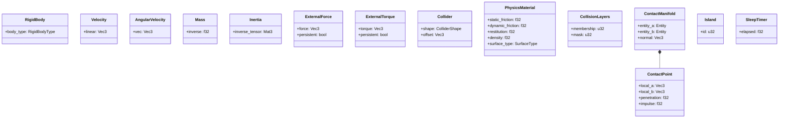
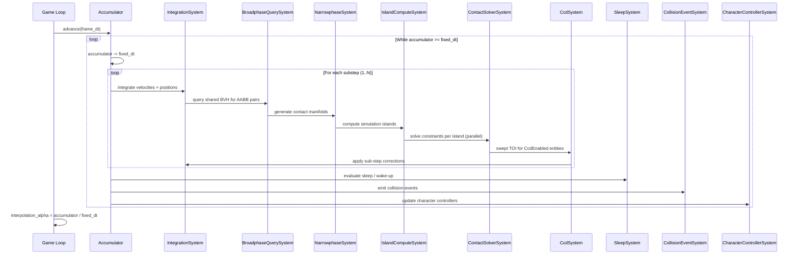
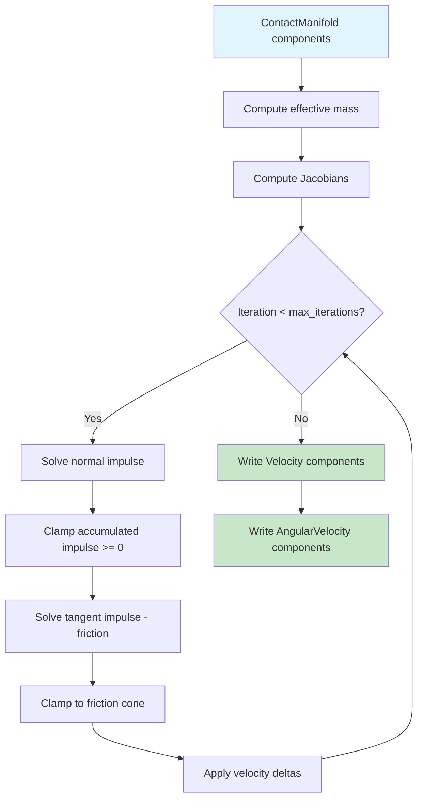
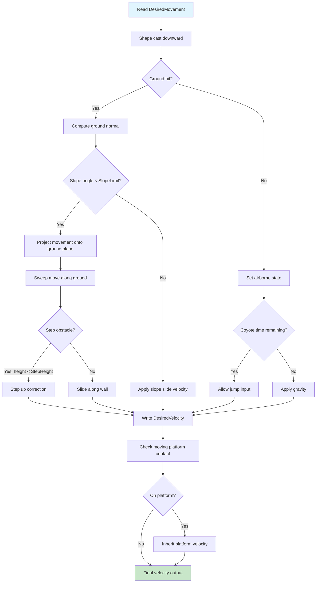
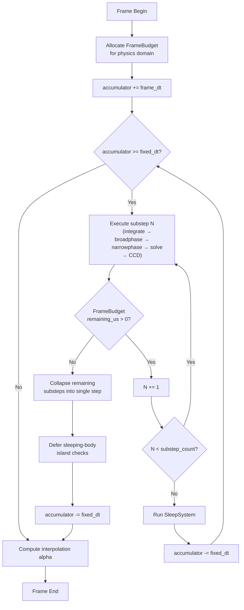

# Physics Foundation Design

## Requirements Trace

> **Canonical sources:** Features, requirements, and user stories are defined in
> [features/physics/](../../features/physics/),
> [requirements/physics/](../../requirements/physics/), and
> [user-stories/physics/](../../user-stories/physics/). The table below traces design elements to
> those definitions.

### Rigid Body Dynamics (R-4.1)

| Feature  | Requirement |
|----------|-------------|
| F-4.1.1  | R-4.1.1     |
| F-4.1.2  | R-4.1.2     |
| F-4.1.3  | R-4.1.3     |
| F-4.1.4  | R-4.1.4     |
| F-4.1.5  | R-4.1.5     |
| F-4.1.6  | R-4.1.6     |
| F-4.1.7  | R-4.1.7     |
| F-4.1.8  | R-4.1.8     |
| F-4.1.9  | R-4.1.9     |
| F-4.1.10 | R-4.1.10    |

1. **F-4.1.1** — Deterministic fixed-timestep integration (symplectic Euler / Verlet)
2. **F-4.1.2** — Configurable simulation substeps with per-entity override
3. **F-4.1.3** — Impulse-based contact resolution with restitution and friction
4. **F-4.1.4** — Continuous collision detection for fast-moving objects
5. **F-4.1.5** — Simulation islands via union-find with parallel solve
6. **F-4.1.6** — Body sleeping and wake-up via ECS change detection
7. **F-4.1.7** — Cross-zone physics continuity during entity migration
8. **F-4.1.8** — Kinematic character controller with ground detection
9. **F-4.1.9** — Moving platform system with passenger velocity transfer
10. **F-4.1.10** — Surface smoothing and ground conformance filter

### Collision Detection (R-4.2)

| Feature | Requirement |
|---------|-------------|
| F-4.2.1 | R-4.2.1     |
| F-4.2.2 | R-4.2.2     |
| F-4.2.3 | R-4.2.3     |
| F-4.2.4 | R-4.2.4     |
| F-4.2.5 | R-4.2.5     |
| F-4.2.6 | R-4.2.6     |
| F-4.2.7 | R-4.2.7     |
| F-4.2.8 | R-4.2.8     |
| F-4.2.9 | R-4.2.9     |

1. **F-4.2.1** — Broadphase via shared BVH spatial index
2. **F-4.2.2** — Narrowphase contact generation (GJK/EPA/SAT)
3. **F-4.2.3** — Primitive and convex collision shapes
4. **F-4.2.4** — Triangle mesh and heightfield shapes
5. **F-4.2.5** — Compound shapes with per-child materials
6. **F-4.2.6** — Collision filtering via layers and masks
7. **F-4.2.7** — Collision events (started, persisted, ended)
8. **F-4.2.8** — Trigger volumes (non-physical overlap detection)
9. **F-4.2.9** — Physics material assets with surface tags

### Non-Functional Requirements

| Requirement | Verification                        |
|-------------|-------------------------------------|
| R-4.1.NF1   | Benchmark on min-spec hardware      |
| R-4.1.NF2   | Profile 10,000 entities             |
| R-4.1.NF3   | 1000-step cross-platform comparison |
| R-4.1.NF4   | Benchmark varied terrain            |
| R-4.2.NF1   | Benchmark random extents            |
| R-4.2.NF2   | Benchmark overlapping pairs         |
| R-4.2.NF3   | Integration test                    |

1. **R-4.1.NF1** — 2000 active bodies + 4 substeps within 4 ms
2. **R-4.1.NF2** — 256 bytes per active rigid body (excl. collider shape)
3. **R-4.1.NF3** — Bit-identical results across Windows/macOS/Linux
4. **R-4.1.NF4** — 0.1 ms per character controller, 200 simultaneous
5. **R-4.2.NF1** — 50,000 AABBs broadphase within 1 ms
6. **R-4.2.NF2** — 10,000 primitive pairs narrowphase within 2 ms
7. **R-4.2.NF3** — Same-frame collision event delivery (zero latency)

## Overview

The physics foundation is 100% ECS-based. There is no separate physics world, no PhysX-style scene,
and no parallel data store. All physics state lives as ECS components. All simulation logic runs as
ECS systems. The shared BVH spatial index serves as the broadphase -- physics does not maintain its
own acceleration structure.

The simulation runs on a fixed timestep with an accumulator that decouples physics tick rate from
render frame rate. Each tick executes a configurable number of substeps, each of which runs the full
pipeline: integration, broadphase, narrowphase, island computation, constraint solve, and CCD.
Independent simulation islands are solved in parallel across the engine's work-stealing thread pool.

Determinism is a first-class requirement. IEEE 754 strict compliance, no fast-math, and
deterministic iteration order guarantee bit-identical results across platforms for
server-authoritative simulation and replay.

### Key Abstractions

- **Rigid body** -- mass, inertia tensor, and motion type (Dynamic, Kinematic, Static). The
  fundamental unit of simulation.
- **Velocity** -- linear and angular velocity, updated by forces and the constraint solver each
  substep.
- **Collider** -- geometric shape attached to an entity for contact detection. Primitives, convex
  hulls, triangle meshes, and heightfields.
- **Contact manifold** -- set of contact points between two colliders, each with a normal vector and
  penetration depth.
- **Island** -- connected group of interacting bodies solved together. Enables sleeping and parallel
  solving per island.
- **Sleeping** -- bodies at rest are excluded from simulation until disturbed by a force, contact,
  or user wake event.
- **CCD** -- continuous collision detection prevents fast-moving objects from tunneling through thin
  geometry via swept-volume tests.
- **Broadphase** -- the shared BVH culls distant pairs before expensive narrowphase evaluation.
- **Narrowphase** -- GJK/EPA/SAT algorithms compute exact contact geometry between overlapping
  collider pairs.

## Architecture

### Module Boundaries

```mermaid
graph TD
    subgraph "harmonius_physics::foundation"
        PC[PhysicsConfig Resource]
        IS[IntegrationSystem]
        BP[BroadphaseQuerySystem]
        NP[NarrowphaseSystem]
        CS[ContactSolverSystem]
        IC[IslandComputeSystem]
        SS[SleepSystem]
        CC[CcdSystem]
        CE[CollisionEventSystem]
        TV[TriggerVolumeSystem]
        CH[CharacterControllerSystem]
        MP[MovingPlatformSystem]
        GS[GroundSmoothingSystem]
    end

    subgraph "harmonius_core::ecs"
        W[World]
        Q[Query]
        R[Resource]
        E[Events]
    end

    subgraph "harmonius_core::spatial"
        BVH[Shared BVH]
    end

    subgraph "harmonius_platform::threading"
        TP[ThreadPool]
        TG[TaskGraph]
    end

    IS --> W
    BP --> BVH
    BP --> W
    NP --> W
    CS --> W
    IC --> W
    IC --> TP
    SS --> W
    CC --> BVH
    CE --> E
    TV --> E
    CH --> BVH
    MP --> W
    GS --> W
    PC --> R
```



### File Layout

```text
harmonius_physics/
├── foundation/
│   ├── config.rs          # PhysicsConfig, SleepConfig,
│   │                      # platform tier defaults
│   ├── components.rs      # RigidBody, Velocity,
│   │                      # AngularVelocity, Mass,
│   │                      # Inertia, ExternalForce,
│   │                      # ExternalTorque
│   ├── collider.rs        # Collider, ColliderShape,
│   │                      # CompoundCollider,
│   │                      # CollisionLayers
│   ├── material.rs        # PhysicsMaterial,
│   │                      # MaterialCombinationRules,
│   │                      # SurfaceType
│   ├── contact.rs         # ContactManifold,
│   │                      # ContactPoint
│   ├── integration.rs     # IntegrationSystem
│   ├── broadphase.rs      # BroadphaseQuerySystem,
│   │                      # BroadphasePairs
│   ├── narrowphase.rs     # NarrowphaseSystem
│   │   ├── gjk.rs         # GJK distance algorithm
│   │   ├── epa.rs         # EPA penetration algorithm
│   │   ├── sat.rs         # SAT feature contacts
│   │   └── primitives.rs  # Specialized fast paths
│   ├── islands.rs         # IslandComputeSystem,
│   │                      # Island, union-find
│   ├── solver.rs          # ContactSolverSystem
│   │                      # (sequential impulse / PGS)
│   ├── sleeping.rs        # SleepSystem, Sleeping,
│   │                      # SleepTimer
│   ├── ccd.rs             # CcdSystem, CcdEnabled,
│   │                      # swept TOI queries
│   ├── events.rs          # CollisionEventSystem,
│   │                      # CollisionStarted/
│   │                      # Persisted/Ended
│   ├── triggers.rs        # TriggerVolumeSystem,
│   │                      # TriggerVolume,
│   │                      # TriggerEnter/Stay/Exit
│   ├── character.rs       # CharacterControllerSystem,
│   │                      # CharacterController,
│   │                      # GroundState
│   ├── platform.rs        # MovingPlatformSystem,
│   │                      # MovingPlatform
│   └── smoothing.rs       # GroundSmoothingSystem,
│                          # ground conformance filter
```

### ECS Component Map



### Substep Pipeline Sequence



### Constraint Solver Flow



### Character Controller Flow



## API Design

### Physics Configuration

```rust
/// Global physics configuration. Stored as an ECS
/// resource. Editable from the project settings panel.
pub struct PhysicsConfig {
    /// Fixed timestep in seconds. Default: 1/60.
    pub fixed_dt: f32,
    /// Integration method selection.
    pub integration_method: IntegrationMethod,
    /// Number of substeps per physics tick.
    /// Clamped to platform tier maximum.
    pub substep_count: u32,
    /// Maximum solver iterations per substep.
    pub solver_iterations: u32,
    /// Gravity vector in world space (m/s^2).
    pub gravity: Vec3,
    /// Sleep configuration.
    pub sleep: SleepConfig,
    /// Material combination rules.
    pub material_rules: MaterialCombinationRules,
    /// Platform tier (auto-detected, overridable).
    pub platform_tier: PlatformTier,
}

#[derive(Clone, Copy, Debug, PartialEq, Eq)]
pub enum IntegrationMethod {
    /// Semi-implicit Euler. Good energy conservation,
    /// fast, suitable for most games.
    SymplecticEuler,
    /// Stormer-Verlet. Better position accuracy,
    /// more stable for position-based constraints.
    Verlet,
}

#[derive(Clone, Copy, Debug, PartialEq, Eq)]
pub enum PlatformTier {
    Mobile,
    Switch,
    Desktop,
    HighEnd,
}

pub struct SleepConfig {
    /// Linear velocity threshold (m/s). Bodies below
    /// this for `sleep_delay` seconds are put to sleep.
    pub linear_threshold: f32,
    /// Angular velocity threshold (rad/s).
    pub angular_threshold: f32,
    /// Seconds a body must remain below thresholds
    /// before sleeping.
    pub sleep_delay: f32,
}

/// Per-entity substep override. Attached to entities
/// needing higher simulation fidelity than the global
/// default (e.g. vehicles, wrecking balls).
pub struct SubstepOverride {
    pub substep_count: u32,
}
```

### Rigid Body Components

```rust
/// Marks an entity as a rigid body. Determines how
/// the physics pipeline processes it.
pub struct RigidBody {
    pub body_type: RigidBodyType,
}

#[derive(Clone, Copy, Debug, PartialEq, Eq)]
pub enum RigidBodyType {
    /// Affected by forces, gravity, and collisions.
    Dynamic,
    /// Moved by user code only. Infinite mass for
    /// collision response. Used for moving platforms,
    /// animated objects.
    Kinematic,
    /// Never moves. Infinite mass. Optimized out of
    /// integration and sleeping. Used for terrain,
    /// walls, floors.
    Static,
}

/// Linear velocity in world space (m/s).
pub struct Velocity {
    pub linear: Vec3,
}

/// Angular velocity in world space (rad/s).
pub struct AngularVelocity {
    pub vec: Vec3,
}

/// Inverse mass. Stored as 1/m to avoid division.
/// Zero inverse mass = infinite mass (static/
/// kinematic).
pub struct Mass {
    pub inverse: f32,
}

impl Mass {
    pub fn from_kg(kg: f32) -> Self {
        debug_assert!(kg > 0.0);
        Self { inverse: 1.0 / kg }
    }

    pub fn infinite() -> Self {
        Self { inverse: 0.0 }
    }

    pub fn is_infinite(&self) -> bool {
        self.inverse == 0.0
    }
}

/// Inverse inertia tensor in local space.
/// Zero tensor = infinite inertia (static/kinematic).
pub struct Inertia {
    pub inverse_tensor: Mat3,
}

impl Inertia {
    pub fn from_tensor(tensor: Mat3) -> Self {
        Self {
            inverse_tensor: tensor.inverse(),
        }
    }

    pub fn infinite() -> Self {
        Self {
            inverse_tensor: Mat3::ZERO,
        }
    }
}

/// External force accumulator. Read by the
/// IntegrationSystem each tick. Cleared after
/// integration unless `persistent` is true.
pub struct ExternalForce {
    pub force: Vec3,
    pub persistent: bool,
}

/// External torque accumulator. Same semantics
/// as ExternalForce.
pub struct ExternalTorque {
    pub torque: Vec3,
    pub persistent: bool,
}
```

### Collision Shapes

```rust
/// Collider component. Defines collision geometry
/// for an entity.
pub struct Collider {
    pub shape: ColliderShape,
    /// Local-space offset from the entity's Transform.
    pub offset: Vec3,
    /// Local-space rotation offset.
    pub rotation_offset: Quat,
}

/// Collision shape variants. Dispatch is static
/// via match — no trait objects.
pub enum ColliderShape {
    Sphere {
        radius: f32,
    },
    Box {
        half_extents: Vec3,
    },
    Capsule {
        half_height: f32,
        radius: f32,
    },
    ConvexHull {
        /// Indices into a shared vertex buffer.
        vertices: Vec<Vec3>,
    },
    TriMesh {
        /// Triangle mesh data (vertices + indices).
        mesh: TriMeshData,
    },
    Heightfield {
        /// Heightfield grid data.
        field: HeightfieldData,
    },
}

pub struct TriMeshData {
    pub vertices: Vec<Vec3>,
    pub indices: Vec<[u32; 3]>,
    /// Per-triangle material index. Maps to
    /// PhysicsMaterial entries in the material table.
    pub material_indices: Option<Vec<u16>>,
}

pub struct HeightfieldData {
    pub heights: Vec<f32>,
    pub rows: u32,
    pub columns: u32,
    pub scale: Vec3,
    /// Per-cell material index (optional).
    pub material_indices: Option<Vec<u16>>,
}

/// Compound collider: multiple child shapes on
/// one entity. Each child has independent layers
/// and material.
pub struct CompoundCollider {
    pub children: Vec<CompoundChild>,
}

pub struct CompoundChild {
    pub shape: ColliderShape,
    pub offset: Vec3,
    pub rotation: Quat,
    pub layers: CollisionLayers,
    pub material: PhysicsMaterialHandle,
}
```

### Collision Filtering

```rust
/// Layer-based collision filtering. Evaluated at
/// broadphase. O(1) via bitwise AND.
///
/// Two entities collide when:
///   (a.membership & b.mask) != 0
///   && (b.membership & a.mask) != 0
/// Custom collision filter as a function pointer.
/// Avoids trait objects on the broadphase hot path.
pub type CollisionFilterFn =
    fn(Entity, Entity) -> bool;

pub struct CollisionLayers {
    /// Bitset of layers this entity belongs to.
    pub membership: u32,
    /// Bitset of layers this entity can collide with.
    pub mask: u32,
}

impl CollisionLayers {
    pub const ALL: Self = Self {
        membership: u32::MAX,
        mask: u32::MAX,
    };

    /// Returns true if these two layer configs
    /// permit collision.
    pub fn interacts_with(
        &self,
        other: &Self,
    ) -> bool {
        (self.membership & other.mask) != 0
            && (other.membership & self.mask) != 0
    }
}

/// Optional fine-grained filter callback. Runs
/// after layer check passes. Registered as an
/// ECS system resource.
pub trait CollisionFilter: Send + Sync {
    /// Return false to reject this pair.
    fn filter(
        &self,
        entity_a: Entity,
        entity_b: Entity,
        world: &World,
    ) -> bool;
}
```

**Justification:** `CollisionFilter` uses a trait for user-extensible filter logic. In practice, the
engine provides a default bitfield filter (`LayerFilter`) that covers >95% of use cases via static
dispatch. Custom filters are rare, editor-authored, and evaluated on broadphase culling paths (not
per-contact). Consider converting to `fn(&EntityRef, &EntityRef) -> bool` function pointer for the
custom case.

### Physics Materials

```rust
/// Surface physical properties. Authored as an
/// asset in the visual editor.
pub struct PhysicsMaterial {
    pub static_friction: f32,
    pub dynamic_friction: f32,
    pub restitution: f32,
    pub density: f32,
    pub surface_type: SurfaceType,
}

/// Surface type tag. Drives audio (footstep sounds),
/// VFX (impact particles), and gameplay (ice reduces
/// traction).
#[derive(
    Clone, Copy, Debug, PartialEq, Eq, Hash,
)]
pub enum SurfaceType {
    Default,
    Metal,
    Wood,
    Stone,
    Dirt,
    Grass,
    Ice,
    Rubber,
    Water,
    Sand,
}

/// Handle to a PhysicsMaterial asset.
pub struct PhysicsMaterialHandle {
    pub id: AssetId,
}

/// Rules for combining material properties when
/// two surfaces collide. Stored as an ECS resource.
pub struct MaterialCombinationRules {
    pub friction_combine: CombineMode,
    pub restitution_combine: CombineMode,
}

#[derive(Clone, Copy, Debug, PartialEq, Eq)]
pub enum CombineMode {
    Average,
    Minimum,
    Maximum,
    Multiply,
}

impl CombineMode {
    pub fn combine(
        &self,
        a: f32,
        b: f32,
    ) -> f32 {
        match self {
            Self::Average => (a + b) * 0.5,
            Self::Minimum => a.min(b),
            Self::Maximum => a.max(b),
            Self::Multiply => a * b,
        }
    }
}
```

### Contact Manifold

```rust
/// Contact manifold between two entities. Produced
/// by the NarrowphaseSystem. Consumed by the
/// ContactSolverSystem and CollisionEventSystem.
pub struct ContactManifold {
    pub entity_a: Entity,
    pub entity_b: Entity,
    /// Contact normal pointing from A to B.
    pub normal: Vec3,
    /// Contact points. Up to 4 on mobile, 8 on
    /// desktop.
    pub contacts: ArrayVec<ContactPoint, 8>,
}

pub struct ContactPoint {
    /// Contact position in A's local space.
    pub local_a: Vec3,
    /// Contact position in B's local space.
    pub local_b: Vec3,
    /// Penetration depth (positive = overlapping).
    pub penetration: f32,
    /// Accumulated normal impulse (warm-starting).
    pub normal_impulse: f32,
    /// Accumulated tangent impulse (friction).
    pub tangent_impulse: f32,
}
```

### Broadphase

```rust
/// Resource: broadphase candidate pairs for the
/// current frame. Written by BroadphaseQuerySystem,
/// consumed by NarrowphaseSystem.
pub struct BroadphasePairs {
    pub pairs: Vec<BroadphasePair>,
}

pub struct BroadphasePair {
    pub entity_a: Entity,
    pub entity_b: Entity,
}

/// Queries the shared BVH for overlapping AABB
/// pairs, filtered by CollisionLayers. Writes
/// results to the BroadphasePairs resource.
///
/// The shared BVH is owned by harmonius_core::spatial
/// and updated by the spatial index system. Physics
/// does NOT maintain a separate acceleration
/// structure.
pub struct BroadphaseQuerySystem;

impl BroadphaseQuerySystem {
    /// System entry point. Queries the shared BVH
    /// and writes candidate pairs.
    pub fn run(
        bvh: Res<BvhIndex>,
        layers_query: Query<
            &CollisionLayers,
        >,
        filter: Option<Res<CollisionFilterFn>>,
        mut pairs: ResMut<BroadphasePairs>,
    ) {
        pairs.pairs.clear();

        // Traverse BVH for overlapping AABBs
        bvh.query_overlapping_pairs(
            |entity_a, entity_b| {
                // Layer filter (O(1) bitwise check)
                let la = layers_query
                    .get(entity_a);
                let lb = layers_query
                    .get(entity_b);
                if let (Ok(la), Ok(lb)) = (la, lb)
                {
                    if !la.interacts_with(lb) {
                        return;
                    }
                }

                // Optional custom filter
                if let Some(ref f) = filter {
                    if !f.filter(
                        entity_a,
                        entity_b,
                        /* world */
                    ) {
                        return;
                    }
                }

                pairs.pairs.push(BroadphasePair {
                    entity_a,
                    entity_b,
                });
            },
        );
    }
}
```

### Narrowphase

```rust
/// Generates precise ContactManifold components from
/// broadphase candidate pairs.
pub struct NarrowphaseSystem;

impl NarrowphaseSystem {
    pub fn run(
        pairs: Res<BroadphasePairs>,
        collider_query: Query<(
            &Collider,
            &Transform,
        )>,
        mut manifolds: ResMut<ContactManifolds>,
    ) {
        manifolds.clear();

        for pair in &pairs.pairs {
            let (col_a, tf_a) = collider_query
                .get(pair.entity_a)
                .unwrap();
            let (col_b, tf_b) = collider_query
                .get(pair.entity_b)
                .unwrap();

            // Static dispatch on shape pair
            let manifold = match (
                &col_a.shape,
                &col_b.shape,
            ) {
                // Specialized fast paths
                (
                    ColliderShape::Sphere { .. },
                    ColliderShape::Sphere { .. },
                ) => sphere_vs_sphere(
                    col_a, tf_a, col_b, tf_b,
                ),
                (
                    ColliderShape::Sphere { .. },
                    ColliderShape::Box { .. },
                ) => sphere_vs_box(
                    col_a, tf_a, col_b, tf_b,
                ),
                (
                    ColliderShape::Box { .. },
                    ColliderShape::Box { .. },
                ) => sat_box_vs_box(
                    col_a, tf_a, col_b, tf_b,
                ),
                (
                    ColliderShape::Capsule { .. },
                    ColliderShape::Capsule { .. },
                ) => capsule_vs_capsule(
                    col_a, tf_a, col_b, tf_b,
                ),
                // Mesh-based paths
                (_, ColliderShape::TriMesh { .. })
                | (
                    ColliderShape::TriMesh { .. },
                    _,
                ) => trimesh_narrowphase(
                    col_a, tf_a, col_b, tf_b,
                ),
                (
                    _,
                    ColliderShape::Heightfield {
                        ..
                    },
                )
                | (
                    ColliderShape::Heightfield {
                        ..
                    },
                    _,
                ) => heightfield_narrowphase(
                    col_a, tf_a, col_b, tf_b,
                ),
                // Generic GJK/EPA fallback for all
                // convex-vs-convex pairs
                _ => gjk_epa_narrowphase(
                    col_a, tf_a, col_b, tf_b,
                ),
            };

            if let Some(m) = manifold {
                manifolds.push(m);
            }
        }
    }
}

/// GJK distance query. Returns the closest points
/// and distance between two convex shapes.
/// Returns None if shapes are overlapping (use EPA).
fn gjk_distance(
    shape_a: &impl ConvexSupport,
    tf_a: &Transform,
    shape_b: &impl ConvexSupport,
    tf_b: &Transform,
) -> Option<GjkResult>;

/// EPA penetration query. Called when GJK detects
/// overlap. Returns penetration normal and depth.
fn epa_penetration(
    shape_a: &impl ConvexSupport,
    tf_a: &Transform,
    shape_b: &impl ConvexSupport,
    tf_b: &Transform,
    gjk_simplex: &Simplex,
) -> EpaResult;

/// Support function trait. Implemented for each
/// convex shape type. No trait objects — monomorphized
/// at each call site.
pub trait ConvexSupport {
    /// Returns the farthest point on the shape in
    /// the given direction.
    fn support(&self, direction: Vec3) -> Vec3;
}
```

### Integration System

```rust
/// Integrates rigid body motion. Reads forces and
/// torques, updates velocities and transforms.
/// Runs once per substep.
pub struct IntegrationSystem;

impl IntegrationSystem {
    pub fn run(
        config: Res<PhysicsConfig>,
        mut query: Query<
            (
                &RigidBody,
                &mut Velocity,
                &mut AngularVelocity,
                &mut Transform,
                &ExternalForce,
                &ExternalTorque,
                &Mass,
                &Inertia,
            ),
            Without<Sleeping>,
        >,
    ) {
        let dt = config.fixed_dt
            / config.substep_count as f32;
        let gravity = config.gravity;

        for (
            rb,
            mut vel,
            mut ang_vel,
            mut tf,
            force,
            torque,
            mass,
            inertia,
        ) in query.iter_mut()
        {
            if rb.body_type != RigidBodyType::Dynamic
            {
                continue;
            }

            match config.integration_method {
                IntegrationMethod::SymplecticEuler
                => {
                    // 1. Update velocity
                    vel.linear += (gravity
                        + force.force * mass.inverse)
                        * dt;
                    ang_vel.vec +=
                        inertia.inverse_tensor
                            * torque.torque
                            * dt;

                    // 2. Update position from
                    //    new velocity
                    tf.translation +=
                        vel.linear * dt;
                    tf.rotation = integrate_rotation(
                        tf.rotation,
                        ang_vel.vec,
                        dt,
                    );
                }
                IntegrationMethod::Verlet => {
                    // Position Verlet: update
                    // position first, then velocity
                    let accel = gravity
                        + force.force * mass.inverse;
                    tf.translation +=
                        vel.linear * dt
                            + accel * dt * dt * 0.5;
                    vel.linear += accel * dt;

                    let ang_accel =
                        inertia.inverse_tensor
                            * torque.torque;
                    tf.rotation = integrate_rotation(
                        tf.rotation,
                        ang_vel.vec,
                        dt,
                    );
                    ang_vel.vec += ang_accel * dt;
                }
            }
        }
    }
}

/// Quaternion integration: q' = normalize(
///   q + 0.5 * dt * Quat(0, omega) * q
/// )
fn integrate_rotation(
    q: Quat,
    omega: Vec3,
    dt: f32,
) -> Quat {
    let delta = Quat::from_xyzw(
        omega.x * 0.5 * dt,
        omega.y * 0.5 * dt,
        omega.z * 0.5 * dt,
        0.0,
    );
    (q + delta * q).normalize()
}
```

### Simulation Islands

```rust
/// Computes disjoint simulation islands from
/// entity connectivity (contacts + joints).
/// Each island is solved independently in parallel.
pub struct IslandComputeSystem;

/// Island assignment component. Written by
/// IslandComputeSystem each frame.
pub struct Island {
    pub id: u32,
}

/// Union-find data structure for island computation.
/// Rebuilt each frame from current contacts and
/// constraints.
struct UnionFind {
    parent: Vec<u32>,
    rank: Vec<u32>,
}

impl UnionFind {
    fn new(capacity: usize) -> Self;
    fn find(&mut self, x: u32) -> u32;
    fn union(&mut self, a: u32, b: u32);
}

impl IslandComputeSystem {
    pub fn run(
        manifolds: Res<ContactManifolds>,
        joints: Query<&JointConstraint>,
        mut islands: Query<&mut Island>,
        rigid_bodies: Query<
            Entity,
            With<RigidBody>,
        >,
    ) {
        // 1. Initialize union-find with all
        //    rigid body entities
        let entities: Vec<Entity> =
            rigid_bodies.iter().collect();
        let mut uf =
            UnionFind::new(entities.len());

        // 2. Union entities connected by contacts
        for manifold in manifolds.iter() {
            let idx_a =
                entity_to_index(manifold.entity_a);
            let idx_b =
                entity_to_index(manifold.entity_b);
            uf.union(idx_a, idx_b);
        }

        // 3. Union entities connected by joints
        for joint in joints.iter() {
            let idx_a =
                entity_to_index(joint.entity_a);
            let idx_b =
                entity_to_index(joint.entity_b);
            uf.union(idx_a, idx_b);
        }

        // 4. Assign Island component to each
        //    entity based on root
        for (i, entity) in
            entities.iter().enumerate()
        {
            let root = uf.find(i as u32);
            if let Ok(mut island) =
                islands.get_mut(*entity)
            {
                island.id = root;
            }
        }
    }
}
```

### Constraint Solver

```rust
/// Sequential impulse (PGS) constraint solver.
/// Solves contact and friction constraints within
/// each island independently.
pub struct ContactSolverSystem;

impl ContactSolverSystem {
    /// Dispatches island solves in parallel across
    /// the thread pool.
    pub fn run(
        config: Res<PhysicsConfig>,
        manifolds: Res<ContactManifolds>,
        materials: Res<MaterialCombinationRules>,
        mat_query: Query<&PhysicsMaterialHandle>,
        mat_assets: Res<Assets<PhysicsMaterial>>,
        mut vel_query: Query<(
            &mut Velocity,
            &mut AngularVelocity,
            &Mass,
            &Inertia,
        )>,
        islands: Query<&Island>,
        pool: Res<ThreadPool>,
    ) {
        // Group manifolds by island
        let island_groups =
            group_by_island(&manifolds, &islands);

        // Solve each island in parallel
        pool.scope(|scope| {
            for island_manifolds in
                &island_groups
            {
                scope.spawn(|| {
                    solve_island(
                        island_manifolds,
                        &config,
                        &materials,
                        &mat_query,
                        &mat_assets,
                        &mut vel_query,
                    );
                });
            }
        });
    }
}

/// Solves all constraints within a single island.
fn solve_island(
    manifolds: &[&ContactManifold],
    config: &PhysicsConfig,
    rules: &MaterialCombinationRules,
    mat_query: &Query<&PhysicsMaterialHandle>,
    mat_assets: &Res<Assets<PhysicsMaterial>>,
    vel_query: &mut Query<(
        &mut Velocity,
        &mut AngularVelocity,
        &Mass,
        &Inertia,
    )>,
) {
    // Pre-compute effective masses and Jacobians
    let mut constraints: Vec<SolverConstraint> =
        manifolds
            .iter()
            .flat_map(|m| {
                build_constraints(
                    m, rules, mat_query,
                    mat_assets, vel_query,
                )
            })
            .collect();

    // Iterative PGS solve
    for _ in 0..config.solver_iterations {
        for constraint in &mut constraints {
            // Normal impulse
            let delta_lambda =
                compute_normal_impulse(
                    constraint, vel_query,
                );
            let old = constraint.normal_impulse;
            constraint.normal_impulse =
                (old + delta_lambda).max(0.0);
            let applied =
                constraint.normal_impulse - old;
            apply_impulse(
                constraint,
                applied,
                &constraint.normal,
                vel_query,
            );

            // Tangent impulse (friction)
            let friction_limit =
                constraint.friction
                    * constraint.normal_impulse;
            let tangent_delta =
                compute_tangent_impulse(
                    constraint, vel_query,
                );
            let old_t =
                constraint.tangent_impulse;
            constraint.tangent_impulse =
                (old_t + tangent_delta)
                    .clamp(
                        -friction_limit,
                        friction_limit,
                    );
            let applied_t =
                constraint.tangent_impulse - old_t;
            apply_impulse(
                constraint,
                applied_t,
                &constraint.tangent,
                vel_query,
            );
        }
    }
}

struct SolverConstraint {
    entity_a: Entity,
    entity_b: Entity,
    normal: Vec3,
    tangent: Vec3,
    /// Effective mass along normal.
    effective_mass_normal: f32,
    /// Effective mass along tangent.
    effective_mass_tangent: f32,
    /// Combined friction coefficient.
    friction: f32,
    /// Combined restitution coefficient.
    restitution: f32,
    /// Accumulated normal impulse (warm start).
    normal_impulse: f32,
    /// Accumulated tangent impulse.
    tangent_impulse: f32,
    /// Contact point data.
    r_a: Vec3,
    r_b: Vec3,
}
```

### Sleep System

```rust
/// Deactivates bodies at rest. Sleeping entities
/// are skipped by IntegrationSystem and
/// ContactSolverSystem via `Without<Sleeping>`
/// query filters.
pub struct SleepSystem;

/// Marker component. Entities with this component
/// are excluded from physics simulation.
pub struct Sleeping;

/// Tracks how long a body has been below sleep
/// thresholds.
pub struct SleepTimer {
    pub elapsed: f32,
}

impl SleepSystem {
    pub fn run(
        config: Res<PhysicsConfig>,
        mut commands: Commands,
        mut query: Query<(
            Entity,
            &Velocity,
            &AngularVelocity,
            &mut SleepTimer,
        ), Without<Sleeping>>,
        // Wake-up: detect changes to forces
        // and contacts
        changed_forces: Query<
            Entity,
            (
                With<Sleeping>,
                Changed<ExternalForce>,
            ),
        >,
        changed_torques: Query<
            Entity,
            (
                With<Sleeping>,
                Changed<ExternalTorque>,
            ),
        >,
        changed_contacts: Query<
            Entity,
            (
                With<Sleeping>,
                Changed<ContactManifold>,
            ),
        >,
    ) {
        let dt = config.fixed_dt;
        let sleep = &config.sleep;

        // Sleep evaluation
        for (
            entity,
            vel,
            ang_vel,
            mut timer,
        ) in query.iter_mut()
        {
            let below_threshold =
                vel.linear.length_squared()
                    < sleep.linear_threshold
                        * sleep.linear_threshold
                    && ang_vel.vec.length_squared()
                        < sleep.angular_threshold
                            * sleep.angular_threshold;

            if below_threshold {
                timer.elapsed += dt;
                if timer.elapsed
                    >= sleep.sleep_delay
                {
                    commands
                        .entity(entity)
                        .insert(Sleeping);
                }
            } else {
                timer.elapsed = 0.0;
            }
        }

        // Wake-up on force change
        for entity in changed_forces.iter() {
            commands
                .entity(entity)
                .remove::<Sleeping>();
        }
        for entity in changed_torques.iter() {
            commands
                .entity(entity)
                .remove::<Sleeping>();
        }
        for entity in changed_contacts.iter() {
            commands
                .entity(entity)
                .remove::<Sleeping>();
        }
    }
}
```

### Continuous Collision Detection

```rust
/// Marker component. Flags an entity for CCD
/// processing. Attach to fast-moving projectiles,
/// bullets, arrows.
pub struct CcdEnabled;

/// Swept-volume CCD system. Prevents tunneling
/// for fast-moving objects by performing time-of-
/// impact queries between discrete positions.
pub struct CcdSystem;

impl CcdSystem {
    pub fn run(
        bvh: Res<BvhIndex>,
        config: Res<PhysicsConfig>,
        mut ccd_query: Query<
            (
                Entity,
                &Collider,
                &mut Velocity,
                &mut Transform,
            ),
            With<CcdEnabled>,
        >,
        collider_query: Query<(
            &Collider,
            &Transform,
        )>,
    ) {
        let dt = config.fixed_dt
            / config.substep_count as f32;

        for (
            entity,
            collider,
            mut vel,
            mut tf,
        ) in ccd_query.iter_mut()
        {
            // Skip slow objects (velocity threshold
            // = collider radius / dt)
            let speed = vel.linear.length();
            let min_ccd_speed =
                collider_radius(collider) / dt;
            if speed < min_ccd_speed {
                continue;
            }

            // Compute swept AABB
            let displacement =
                vel.linear * dt;
            let swept_aabb = compute_swept_aabb(
                collider, &tf, displacement,
            );

            // Query BVH for candidates
            let candidates =
                bvh.query_aabb(&swept_aabb);

            // Time-of-impact against each candidate
            let mut earliest_toi = 1.0_f32;
            let mut hit_normal = Vec3::ZERO;

            for candidate in &candidates {
                if *candidate == entity {
                    continue;
                }
                let (c, t) = collider_query
                    .get(*candidate)
                    .unwrap();

                if let Some(toi) =
                    time_of_impact(
                        collider,
                        &tf,
                        displacement,
                        c,
                        t,
                    )
                {
                    if toi.t < earliest_toi {
                        earliest_toi = toi.t;
                        hit_normal = toi.normal;
                    }
                }
            }

            // Apply sub-step correction
            if earliest_toi < 1.0 {
                tf.translation +=
                    vel.linear * dt * earliest_toi;
                // Reflect velocity at impact
                vel.linear -= hit_normal
                    * vel.linear.dot(hit_normal)
                    * 2.0;
            }
        }
    }
}

struct ToiResult {
    /// Time of impact in [0, 1] range.
    t: f32,
    /// Contact normal at impact.
    normal: Vec3,
}

/// Computes time of impact between a swept convex
/// shape and a static shape using GJK ray-casting.
fn time_of_impact(
    moving: &Collider,
    moving_tf: &Transform,
    displacement: Vec3,
    target: &Collider,
    target_tf: &Transform,
) -> Option<ToiResult>;
```

### Collision Events

```rust
/// Typed collision events emitted each frame.
pub struct CollisionStarted {
    pub entity_a: Entity,
    pub entity_b: Entity,
    pub contacts: Vec<ContactPoint>,
    pub normal: Vec3,
    pub total_impulse: f32,
}

pub struct CollisionPersisted {
    pub entity_a: Entity,
    pub entity_b: Entity,
    pub contacts: Vec<ContactPoint>,
    pub normal: Vec3,
    pub total_impulse: f32,
}

pub struct CollisionEnded {
    pub entity_a: Entity,
    pub entity_b: Entity,
}

/// Tracks which collision pairs were active last
/// frame. Used to determine event type.
pub struct ActiveCollisions {
    pub pairs: HashSet<(Entity, Entity)>,
}

pub struct CollisionEventSystem;

impl CollisionEventSystem {
    pub fn run(
        manifolds: Res<ContactManifolds>,
        mut active: ResMut<ActiveCollisions>,
        mut started: EventWriter<CollisionStarted>,
        mut persisted: EventWriter<
            CollisionPersisted,
        >,
        mut ended: EventWriter<CollisionEnded>,
    ) {
        let mut current_pairs =
            HashSet::new();

        for manifold in manifolds.iter() {
            let pair = ordered_pair(
                manifold.entity_a,
                manifold.entity_b,
            );
            current_pairs.insert(pair);

            if active.pairs.contains(&pair) {
                persisted.send(
                    CollisionPersisted { /* .. */ }
                );
            } else {
                started.send(
                    CollisionStarted { /* .. */ }
                );
            }
        }

        // Pairs that were active last frame
        // but not this frame -> ended
        for pair in &active.pairs {
            if !current_pairs.contains(pair) {
                ended.send(CollisionEnded {
                    entity_a: pair.0,
                    entity_b: pair.1,
                });
            }
        }

        active.pairs = current_pairs;
    }
}
```

### Trigger Volumes

```rust
/// Non-physical overlap detector. Does not generate
/// contact forces.
pub struct TriggerVolume {
    pub mode: TriggerMode,
}

#[derive(Clone, Copy, Debug, PartialEq, Eq)]
pub enum TriggerMode {
    /// Fire once, then disable.
    OneShot,
    /// Fire every frame while overlapping.
    Persistent,
    /// Fire only for entities matching a filter.
    Filtered,
}

pub struct TriggerEnter {
    pub trigger: Entity,
    pub visitor: Entity,
}

pub struct TriggerStay {
    pub trigger: Entity,
    pub visitor: Entity,
}

pub struct TriggerExit {
    pub trigger: Entity,
    pub visitor: Entity,
}

pub struct TriggerVolumeSystem;

impl TriggerVolumeSystem {
    pub fn run(
        bvh: Res<BvhIndex>,
        triggers: Query<(
            Entity,
            &TriggerVolume,
            &Collider,
            &Transform,
        )>,
        bodies: Query<(
            Entity,
            &Collider,
            &Transform,
        ), Without<TriggerVolume>>,
        mut active: ResMut<ActiveTriggers>,
        mut enter: EventWriter<TriggerEnter>,
        mut stay: EventWriter<TriggerStay>,
        mut exit: EventWriter<TriggerExit>,
    ) {
        // Similar lifecycle tracking as
        // CollisionEventSystem but without
        // contact force generation
    }
}
```

### Character Controller

```rust
/// Kinematic character controller. Handles ground
/// detection, slope rejection, step climbing, and
/// moving platform attachment.
pub struct CharacterController {
    pub capsule_radius: f32,
    pub capsule_half_height: f32,
}

/// Ground detection result. Updated each frame
/// by CharacterControllerSystem.
pub struct GroundState {
    pub grounded: bool,
    pub ground_entity: Option<Entity>,
    pub ground_normal: Vec3,
    pub ground_distance: f32,
}

pub struct StepHeight {
    pub max_height: f32,
}

pub struct SlopeLimit {
    /// Maximum walkable slope angle in radians.
    pub max_angle: f32,
}

/// Desired movement input. Written by gameplay
/// systems, consumed by CharacterControllerSystem.
pub struct DesiredMovement {
    pub direction: Vec3,
    pub speed: f32,
}

/// Output velocity. Written by
/// CharacterControllerSystem, consumed by the
/// IntegrationSystem for kinematic bodies.
pub struct DesiredVelocity {
    pub linear: Vec3,
}

/// Coyote-time configuration for platformer games.
pub struct CoyoteTime {
    pub duration: f32,
    pub remaining: f32,
}

pub struct CharacterControllerSystem;

impl CharacterControllerSystem {
    pub fn run(
        bvh: Res<BvhIndex>,
        config: Res<PhysicsConfig>,
        mut query: Query<(
            Entity,
            &CharacterController,
            &mut GroundState,
            &StepHeight,
            &SlopeLimit,
            &DesiredMovement,
            &mut DesiredVelocity,
            &Transform,
            Option<&mut CoyoteTime>,
        )>,
        platforms: Query<(
            &MovingPlatform,
            &Velocity,
        )>,
    ) {
        let dt = config.fixed_dt;

        for (
            entity,
            controller,
            mut ground,
            step,
            slope,
            input,
            mut desired_vel,
            tf,
            coyote,
        ) in query.iter_mut()
        {
            // 1. Ground detection: shape cast down
            let cast_result = shape_cast_down(
                &bvh,
                controller,
                tf,
                step.max_height,
            );

            // 2. Update GroundState
            match cast_result {
                Some(hit) => {
                    ground.grounded = true;
                    ground.ground_entity =
                        Some(hit.entity);
                    ground.ground_normal =
                        hit.normal;
                    ground.ground_distance =
                        hit.distance;
                }
                None => {
                    ground.grounded = false;
                    ground.ground_entity = None;
                }
            }

            // 3. Slope check
            let slope_angle = ground
                .ground_normal
                .angle_between(Vec3::Y);
            let walkable =
                slope_angle <= slope.max_angle;

            // 4. Compute movement
            let movement = if ground.grounded
                && walkable
            {
                // Project onto ground plane
                project_onto_plane(
                    input.direction * input.speed,
                    ground.ground_normal,
                )
            } else if ground.grounded {
                // Slide down slope
                compute_slope_slide(
                    ground.ground_normal,
                    config.gravity,
                )
            } else {
                // Airborne: apply gravity
                input.direction * input.speed
                    + config.gravity * dt
            };

            // 5. Step climbing
            let movement = try_step_up(
                &bvh,
                controller,
                tf,
                movement,
                step.max_height,
            )
            .unwrap_or(movement);

            // 6. Moving platform velocity
            let platform_vel =
                if let Some(pe) =
                    ground.ground_entity
                {
                    platforms
                        .get(pe)
                        .map(|(_, v)| v.linear)
                        .unwrap_or(Vec3::ZERO)
                } else {
                    Vec3::ZERO
                };

            // 7. Coyote time
            if let Some(mut ct) = coyote {
                if ground.grounded {
                    ct.remaining = ct.duration;
                } else {
                    ct.remaining =
                        (ct.remaining - dt)
                            .max(0.0);
                }
            }

            desired_vel.linear =
                movement + platform_vel;
        }
    }
}

/// Shape cast downward from the character's
/// position to detect ground contact. Uses the
/// shared BVH for spatial acceleration.
fn shape_cast_down(
    bvh: &BvhIndex,
    controller: &CharacterController,
    tf: &Transform,
    max_distance: f32,
) -> Option<ShapeCastHit>;
```

### Moving Platform System

```rust
/// Marks a kinematic entity as a moving platform.
pub struct MovingPlatform {
    pub platform_type: PlatformType,
    /// Surface velocity for conveyor belts (m/s).
    pub surface_velocity: Vec3,
    /// One-way platform: passable from below.
    pub one_way: bool,
}

#[derive(Clone, Copy, Debug, PartialEq, Eq)]
pub enum PlatformType {
    /// Follows a spline path.
    SplinePath,
    /// Driven by animation curves.
    AnimationDriven,
    /// Driven by logic graph.
    LogicGraphDriven,
}

pub struct MovingPlatformSystem;

impl MovingPlatformSystem {
    pub fn run(
        mut platforms: Query<(
            Entity,
            &MovingPlatform,
            &mut Transform,
            &mut Velocity,
        )>,
        mut passengers: Query<(
            &GroundState,
            &mut DesiredVelocity,
        )>,
    ) {
        // 1. Update platform positions along
        //    their paths

        // 2. Compute platform velocity from
        //    position delta

        // 3. Apply smoothed acceleration to
        //    prevent passenger launch

        // 4. Conveyor belt: add surface_velocity
        //    to contacting entities

        // 5. One-way: apply directional collision
        //    filter (normal dot up > threshold)
    }
}
```

### Ground Smoothing System

```rust
/// Exponential moving average filter for ground
/// height and normal. Eliminates micro-bouncing
/// on triangle edges and tessellated terrain.
pub struct GroundSmoothingConfig {
    /// Smoothing half-life in seconds. Lower =
    /// more responsive, higher = smoother.
    pub half_life: f32,
    /// Maximum step-down snap distance in meters.
    pub max_step_down: f32,
    /// Slope alignment speed (0..1 per second).
    pub slope_alignment_speed: f32,
}

/// Filtered ground state. Fed into foot placement
/// IK (F-9.3.5).
pub struct SmoothedGroundState {
    pub height: f32,
    pub normal: Vec3,
}

pub struct GroundSmoothingSystem;

impl GroundSmoothingSystem {
    pub fn run(
        config: Res<PhysicsConfig>,
        smoothing: Res<GroundSmoothingConfig>,
        mut query: Query<(
            &GroundState,
            &mut SmoothedGroundState,
        )>,
    ) {
        let dt = config.fixed_dt;
        // EMA decay factor: alpha = 1 - 2^(-dt/hl)
        let alpha = 1.0
            - (2.0_f32).powf(
                -dt / smoothing.half_life,
            );

        for (raw, mut smooth) in query.iter_mut()
        {
            // Smooth height
            smooth.height = lerp(
                smooth.height,
                raw.ground_distance,
                alpha,
            );

            // Smooth normal
            smooth.normal = Vec3::lerp(
                smooth.normal,
                raw.ground_normal,
                alpha
                    * smoothing
                        .slope_alignment_speed,
            )
            .normalize();
        }
    }
}
```

### Fixed-Timestep Accumulator

```rust
/// Owns the fixed-timestep accumulator and
/// orchestrates the substep pipeline.
pub struct PhysicsSchedule;

impl PhysicsSchedule {
    /// Called once per render frame from the game
    /// loop. Runs zero or more physics ticks.
    pub fn advance(
        &mut self,
        frame_dt: f32,
        world: &mut World,
    ) {
        let config = world
            .resource::<PhysicsConfig>();
        let fixed_dt = config.fixed_dt;
        let substeps = config.substep_count;

        self.accumulator += frame_dt;

        while self.accumulator >= fixed_dt {
            self.accumulator -= fixed_dt;

            // Substep loop
            for _ in 0..substeps {
                world.run_system(
                    IntegrationSystem::run,
                );
                world.run_system(
                    BroadphaseQuerySystem::run,
                );
                world.run_system(
                    NarrowphaseSystem::run,
                );
                world.run_system(
                    IslandComputeSystem::run,
                );
                world.run_system(
                    ContactSolverSystem::run,
                );
                world.run_system(
                    CcdSystem::run,
                );
            }

            // Post-substep (once per tick)
            world.run_system(
                SleepSystem::run,
            );
            world.run_system(
                CollisionEventSystem::run,
            );
            world.run_system(
                TriggerVolumeSystem::run,
            );
            world.run_system(
                CharacterControllerSystem::run,
            );
            world.run_system(
                MovingPlatformSystem::run,
            );
            world.run_system(
                GroundSmoothingSystem::run,
            );

            // Clear non-persistent forces
            clear_transient_forces(world);
        }

        // Store interpolation alpha for rendering
        let alpha =
            self.accumulator / fixed_dt;
        world
            .resource_mut::<InterpolationAlpha>()
            .alpha = alpha;
    }
}

/// Rendering interpolation factor. Used to blend
/// between previous and current physics state for
/// smooth visual output at variable frame rates.
pub struct InterpolationAlpha {
    pub alpha: f32,
}
```

### Error Types

```rust
pub enum PhysicsError {
    /// Collider shape is invalid (e.g. zero radius,
    /// degenerate hull).
    InvalidShape {
        entity: Entity,
        reason: &'static str,
    },
    /// Platform tier limit exceeded (broadphase
    /// pairs, CCD entities, etc.).
    BudgetExceeded {
        budget: &'static str,
        limit: u32,
        actual: u32,
    },
    /// EPA failed to converge within iteration
    /// limit.
    EpaNotConverged {
        entity_a: Entity,
        entity_b: Entity,
        iterations: u32,
    },
}
```

## Data Flow

### Per-Frame Physics Pipeline

```rust
// Simplified frame lifecycle showing physics
// data flow.

// 1. Game loop calls physics advance
physics_schedule.advance(frame_dt, &mut world);

// Inside advance():
// ┌─────────────────────────────────────────┐
// │ accumulator += frame_dt                  │
// │                                          │
// │ while accumulator >= fixed_dt:           │
// │   for substep in 0..substep_count:       │
// │     IntegrationSystem                    │
// │       reads:  ExternalForce, Mass,       │
// │               Inertia, gravity           │
// │       writes: Velocity, AngularVelocity, │
// │               Transform                  │
// │                                          │
// │     BroadphaseQuerySystem                │
// │       reads:  BvhIndex, CollisionLayers │
// │       writes: BroadphasePairs resource   │
// │                                          │
// │     NarrowphaseSystem                    │
// │       reads:  BroadphasePairs, Collider, │
// │               Transform                  │
// │       writes: ContactManifold components │
// │                                          │
// │     IslandComputeSystem                  │
// │       reads:  ContactManifold,           │
// │               JointConstraint            │
// │       writes: Island components          │
// │                                          │
// │     ContactSolverSystem                  │
// │       reads:  ContactManifold, Island,   │
// │               PhysicsMaterial, Mass,     │
// │               Inertia                    │
// │       writes: Velocity, AngularVelocity  │
// │                                          │
// │     CcdSystem                            │
// │       reads:  CcdEnabled, Collider,      │
// │               Velocity, BvhIndex        │
// │       writes: Velocity, Transform        │
// │                                          │
// │   SleepSystem                            │
// │     reads:  Velocity, AngularVelocity,   │
// │             SleepTimer, SleepConfig       │
// │     writes: Sleeping marker, SleepTimer  │
// │                                          │
// │   CollisionEventSystem                   │
// │     reads:  ContactManifold,             │
// │             ActiveCollisions             │
// │     writes: CollisionStarted/Persisted/  │
// │             Ended events                 │
// │                                          │
// │   CharacterControllerSystem              │
// │     reads:  DesiredMovement, BvhIndex,  │
// │             GroundState, SlopeLimit,     │
// │             StepHeight                   │
// │     writes: DesiredVelocity, GroundState │
// │                                          │
// │   clear_transient_forces()               │
// │   accumulator -= fixed_dt                │
// └─────────────────────────────────────────┘
//
// 2. Compute interpolation alpha
//    alpha = accumulator / fixed_dt
//
// 3. Render system interpolates:
//    visual_pos = lerp(prev_pos, curr_pos, alpha)
```

### Island Parallel Solve

Independent islands are dispatched to the work-stealing thread pool via `pool.scope()`. Each
island's constraint solve runs on a separate worker thread. Scoped execution lets the solver borrow
component data from the calling frame without `'static` or `Arc` overhead.

```rust
pool.scope(|scope| {
    for island in &islands {
        scope.spawn(|| {
            solve_island(island, &config, ...);
        });
    }
});
// All islands joined before scope returns.
// Worker threads are free for other ECS systems.
```

### Determinism Guarantees

1. **Fixed timestep** -- physics tick rate is decoupled from frame rate. Same dt every tick.
2. **IEEE 754 strict** -- no fast-math, no FMA fusion unless both platforms support it identically.
3. **Deterministic iteration** -- entity iteration follows archetype storage order, which is
   deterministic given the same entity creation order.
4. **Deterministic island solve** -- islands are sorted by ID before parallel dispatch. Each
   island's solve is independent and deterministic.
5. **Platform-invariant math** -- no platform-specific intrinsics in physics math. All operations
   use Rust's default f32 semantics with strict compliance.

## Frame Budget Integration

The physics foundation uses [`FrameBudget`](../core-runtime/shared-primitives.md#7-framebudget) from
shared primitives to enforce per-frame time caps on the substep loop. The game loop allocates a
physics budget each frame; the substep loop checks the budget at each substep boundary and
gracefully degrades when time is exhausted.

**Check location.** The budget is checked at the substep loop boundary -- after each complete
substep finishes (integration through CCD) and before the next substep begins. This preserves
per-substep determinism while allowing the loop to exit early between substeps.

| Priority | Action                            | Trigger                   |
|----------|-----------------------------------|---------------------------|
| 1        | Collapse remaining substeps       | Budget exhausted mid-loop |
| 2        | Defer sleeping-body island checks | Budget exhausted mid-loop |
| 3        | Skip per-entity substep overrides | Budget exhausted mid-loop |

1. **1** — Apply remaining time as a single larger step using the same pipeline (integration,
   broadphase, narrowphase, solve, CCD) to avoid skipping physics entirely
2. **2** — Postpone `SleepSystem` evaluation for islands containing only sleeping bodies to the next
   frame
3. **3** — Fall back to the global substep count, ignoring per-entity overrides that would increase
   iteration count

The following flowchart shows the substep budget check loop.



**Pseudocode.**

```rust
pub fn advance(
    schedule: &mut PhysicsSchedule,
    frame_dt: f32,
    world: &mut World,
    budget: &mut FrameBudget,
) {
    schedule.accumulator += frame_dt;

    while schedule.accumulator >= schedule.fixed_dt {
        for substep in 0..schedule.substep_count {
            run_substep(world);

            if budget.remaining_us() == 0 {
                // Collapse remaining time into one
                // final step.
                if substep + 1 < schedule.substep_count {
                    run_substep(world);
                }
                // Defer sleep checks to next frame.
                schedule.defer_sleep_checks = true;
                schedule.accumulator -= schedule.fixed_dt;
                return;
            }
        }

        run_sleep_system(world);
        schedule.accumulator -= schedule.fixed_dt;
    }
}
```

## Platform Considerations

### SIMD Acceleration

Narrowphase algorithms (GJK, EPA, SAT) and solver Jacobian computations are amenable to SIMD
acceleration. The math library (glam) provides transparent SSE4.1/AVX2 (x86_64) and NEON (ARM/Apple
Silicon) acceleration for Vec3/Vec4/Mat4 operations. Explicit SIMD intrinsics are not used at the
design level.

### Substep Limits Per Platform

| Platform | Max Substeps | Per-Entity Override | Notes |
|----------|-------------|---------------------|-------|
| Mobile | 4 | Disabled | Strict frame budget |
| Switch | 8 | Enabled | Moderate budget |
| Desktop | 16 (default) | Enabled | Configurable |
| High-end PC | 32 | Enabled | Vehicles, ragdolls |

### Broadphase Pair Budget

| Platform | Max Pairs | Culling Radius | Notes |
|----------|----------|----------------|-------|
| Mobile | 2,048 | Reduced | Distance cull shrinks |
| Switch | 4,096 | Standard | Standard radius |
| Desktop | 32,768 | Full | Full scene |
| High-end PC | 131,072 | Full | Large-scale battles |

### Narrowphase Limits

| Platform | Max Contacts/Manifold | EPA Iterations | Convex Hull Verts |
|----------|-----------------------|----------------|-------------------|
| Mobile | 4 | 16 | 16 |
| Switch | 4 | 32 | 32 |
| Desktop | 8 | 64 | 64 |
| High-end PC | 8 | 64 | 256 |

### CCD Entity Budget

| Platform | Max CCD Entities | Sweep Type |
|----------|-----------------|------------|
| Mobile | 16 | Sphere only |
| Switch | 32 | Sphere + capsule |
| Desktop | 256 | Full convex |
| High-end PC | 1,024 | Full convex |

### Island Limits

| Platform | Max Islands | Max Bodies/Island |
|----------|------------|-------------------|
| Mobile | 64 | 32 |
| Switch | 128 | 64 |
| Desktop | 1,024 | 256 |
| High-end PC | Unlimited | Unlimited |

### Character Controller Budget

| Platform | Max Controllers | Ground Casts/Frame |
|----------|----------------|-------------------|
| Mobile | 16 | 2 |
| Switch | 32 | 3 |
| Desktop | 256 | 4 |
| High-end PC | 1,024 | 4 |

### Trigger Volume Budget

| Platform | Max Active Triggers | Persistent Throttle |
|----------|--------------------|--------------------|
| Mobile | 64 | Every-other-frame |
| Switch | 128 | None |
| Desktop | 1,024 | None |
| High-end PC | 1,024 | None |

### Triangle Mesh and Heightfield Limits

| Platform | TriMesh Triangles | Heightfield Resolution |
|----------|-------------------|----------------------|
| Mobile | 8K per collider | 128x128 |
| Switch | 32K per collider | 256x256 |
| Desktop | 256K per collider | 1024x1024 |
| High-end PC | 256K per collider | 1024x1024 |

### Compound Shape Child Limits

| Platform | Max Children |
|----------|-------------|
| Mobile | 4 |
| Switch | 8 |
| Desktop | 32 |
| High-end PC | 64 |

### Threading

Physics uses the engine's work-stealing thread pool (see
[Platform Threading Design](../platform/threading.md)). Island solving is parallelized via
`pool.scope()` with scoped tasks that borrow component data. No `'static` requirement, no `Arc`
overhead. The thread pool is sized to performance core count.

## Test Plan

### Unit Tests

| Test                                 | Req      |
|--------------------------------------|----------|
| `test_symplectic_euler_energy`       | R-4.1.1  |
| `test_verlet_position_accuracy`      | R-4.1.1  |
| `test_determinism_1000_frames`       | R-4.1.1  |
| `test_substep_invocation_count`      | R-4.1.2  |
| `test_restitution_bounce_height`     | R-4.1.3  |
| `test_static_friction_on_slope`      | R-4.1.3  |
| `test_material_combine_symmetry`     | R-4.1.3  |
| `test_ccd_prevents_tunneling`        | R-4.1.4  |
| `test_ccd_skips_slow_objects`        | R-4.1.4  |
| `test_island_disjoint_groups`        | R-4.1.5  |
| `test_island_merge_on_contact`       | R-4.1.5  |
| `test_island_split_on_separation`    | R-4.1.5  |
| `test_sleep_after_threshold`         | R-4.1.6  |
| `test_wake_on_force`                 | R-4.1.6  |
| `test_wake_on_contact`               | R-4.1.6  |
| `test_broadphase_no_false_negatives` | R-4.2.1  |
| `test_layer_rejection`               | R-4.2.6  |
| `test_layer_acceptance`              | R-4.2.6  |
| `test_gjk_sphere_sphere_distance`    | R-4.2.2  |
| `test_epa_penetration_depth`         | R-4.2.2  |
| `test_collision_event_lifecycle`     | R-4.2.7  |
| `test_same_frame_event_delivery`     | R-4.2.7  |
| `test_trigger_oneshot`               | R-4.2.8  |
| `test_trigger_no_contact_force`      | R-4.2.8  |
| `test_slope_rejection`               | R-4.1.8  |
| `test_step_climbing`                 | R-4.1.8  |
| `test_ground_detection_via_bvh`      | R-4.1.8  |
| `test_platform_passenger_drift`      | R-4.1.9  |
| `test_ground_smoothing_ema`          | R-4.1.10 |

1. **`test_symplectic_euler_energy`** — Integrate a spring-mass system for 10,000 steps. Assert
   energy drift < 1%.
2. **`test_verlet_position_accuracy`** — Integrate constant acceleration. Assert position matches
   analytic solution within epsilon.
3. **`test_determinism_1000_frames`** — Run identical 1000-frame simulation twice. Assert bit-equal
   state.
4. **`test_substep_invocation_count`** — Set substeps=4. Assert each system runs exactly 4 times per
   tick.
5. **`test_restitution_bounce_height`** — Drop sphere onto plane at restitution=1.0. Assert rebound
   within 1% of drop height.
6. **`test_static_friction_on_slope`** — Box on 30-degree slope with friction > tan(30). Assert zero
   displacement over 500 ticks.
7. **`test_material_combine_symmetry`** — Combine (A,B) and (B,A). Assert identical results for all
   combine modes.
8. **`test_ccd_prevents_tunneling`** — Fire 0.1m sphere at 500 m/s toward 0.01m wall. Assert
   ContactManifold generated.
9. **`test_ccd_skips_slow_objects`** — CcdEnabled entity at 0.1 m/s. Assert CCD processing skipped.
10. **`test_island_disjoint_groups`** — Two groups of 50 bodies, no contacts. Assert exactly 2
    distinct Island IDs.
11. **`test_island_merge_on_contact`** — Two islands gain contact. Assert merged into one island.
12. **`test_island_split_on_separation`** — Single island loses contact link. Assert split into two.
13. **`test_sleep_after_threshold`** — Body below threshold for sleep_delay seconds. Assert Sleeping
    marker added.
14. **`test_wake_on_force`** — Apply ExternalForce to sleeping body. Assert Sleeping removed within
    1 tick.
15. **`test_wake_on_contact`** — Drop active body onto sleeping body. Assert sleeping body wakes.
16. **`test_broadphase_no_false_negatives`** — 1000 random colliders. Compare BroadphasePairs
    against brute-force. Assert zero misses.
17. **`test_layer_rejection`** — Overlapping entities on non-interacting layers. Assert no
    ContactManifold.
18. **`test_layer_acceptance`** — Overlapping entities on interacting layers. Assert ContactManifold
    generated.
19. **`test_gjk_sphere_sphere_distance`** — Known sphere positions. Assert distance matches analytic
    solution within 1mm.
20. **`test_epa_penetration_depth`** — Known overlapping boxes. Assert penetration depth matches
    analytic solution within 1mm.
21. **`test_collision_event_lifecycle`** — Contact for 5 frames, separate. Assert 1 Started, 4
    Persisted, 1 Ended.
22. **`test_same_frame_event_delivery`** — Trigger collision. Assert event readable in same frame.
23. **`test_trigger_oneshot`** — Entity enters trigger. Assert TriggerEnter fires once, then trigger
    disables.
24. **`test_trigger_no_contact_force`** — Entity passes through trigger. Assert velocity is
    unaffected.
25. **`test_slope_rejection`** — Character on 50-degree slope with 45-degree limit. Assert slide.
26. **`test_step_climbing`** — 0.3m step with 0.35m limit: climbs. 0.4m step: blocked.
27. **`test_ground_detection_via_bvh`** — Assert shape casts use shared BVH, not separate structure.
28. **`test_platform_passenger_drift`** — Character on 5 m/s platform for 10s. Assert drift < 1
    cm/s.
29. **`test_ground_smoothing_ema`** — Walk over 5cm triangle seams. Assert vertical oscillation <
    1mm peak-to-peak.

### Integration Tests

| Test                               | Req       |
|------------------------------------|-----------|
| `test_cross_platform_determinism`  | R-4.1.NF3 |
| `test_parallel_island_correctness` | R-4.1.5   |
| `test_zone_migration_momentum`     | R-4.1.7   |
| `test_zone_migration_contacts`     | R-4.1.7   |
| `test_full_pipeline_2000_bodies`   | R-4.1.NF1 |
| `test_200_character_controllers`   | R-4.1.NF4 |
| `test_ccd_budget_desktop_256`      | R-4.1.4   |
| `test_sleeping_reduces_cost_80pct` | R-4.1.6   |

1. **`test_cross_platform_determinism`** — 1000-step simulation on Windows, macOS, Linux. Compare
   serialized state. Assert bit-equal.
2. **`test_parallel_island_correctness`** — Compare parallel island solve against serial solve.
   Assert identical results.
3. **`test_zone_migration_momentum`** — Body crosses zone boundary at constant velocity. Assert
   velocity preserved within 0.1%.
4. **`test_zone_migration_contacts`** — Stacked bodies cross zone boundary. Assert contact
   relationships preserved.
5. **`test_full_pipeline_2000_bodies`** — 2000 active bodies, 4 substeps. Measure wall time. Assert
   < 4 ms on min-spec.
6. **`test_200_character_controllers`** — 200 controllers on varied terrain. Assert total system
   time < 20 ms (0.1 ms each).
7. **`test_ccd_budget_desktop_256`** — 256 CCD entities on desktop. Assert system completes within
   0.5 ms.
8. **`test_sleeping_reduces_cost_80pct`** — 10000 sleeping vs 10000 active. Assert >= 80% tick cost
   reduction.

### Benchmarks

| Benchmark | Target | Source |
|-----------|--------|--------|
| Integration (2000 bodies, symplectic Euler) | < 1 ms | US-4.1.1.9 |
| Broadphase (50,000 AABBs) | < 1 ms | R-4.2.NF1 |
| Narrowphase (10,000 primitive pairs) | < 2 ms | R-4.2.NF2 |
| Constraint solver (2000 bodies, 4 substeps) | < 2 ms | R-4.1.NF1 |
| CCD (256 entities, desktop) | < 0.5 ms | US-4.1.4.5 |
| Island computation (1024 islands) | < 0.5 ms | US-4.1.5.5 |
| Sleep evaluation (10,000 entities) | < 0.1 ms | US-4.1.6.5 |
| Character controller (per entity) | < 0.1 ms | R-4.1.NF4 |
| Full physics tick (2000 bodies, 4 substeps) | < 4 ms | R-4.1.NF1 |
| Memory per rigid body entity | <= 256 bytes | R-4.1.NF2 |

### Debug Visualization

The physics debug draw system renders collision shapes, contact points, contact normals, body AABBs,
velocity vectors, and sleep state indicators. Debug draw is implemented as an ECS system that
queries physics components and emits draw commands to the render graph's debug overlay pass. Debug
draw is compile-time stripped from shipping builds via `cfg(debug_assertions)`.

### Networking Integration

Physics state replication is handled by the networking domain (see
[replication.md](../networking/replication.md)). Physics components (`RigidBody`, `Velocity`,
`Transform`) carry `#[reflect(Replicate)]` attributes. The fixed-timestep deterministic simulation
enables server-authoritative physics with client-side prediction and rollback. The networking layer
snapshots physics state per tick and applies corrections when server state diverges from client
prediction.

## Design Q & A

**Q1. What is the biggest constraint limiting this design?**

The shared BVH as the sole broadphase (F-4.2.1) is the biggest constraint. Physics does not maintain
its own acceleration structure; it queries the engine-wide BVH shared with rendering, networking,
and AI. This means physics cannot optimize the BVH for collision-specific access patterns (e.g.,
sweep-and-prune for axis-aligned motion) or update frequency (physics needs per-substep updates
while rendering needs per-frame). Lifting this constraint would allow a physics-private SAP or grid
broadphase tuned for dynamic bodies, which could cut broadphase cost by 2--3x for scenes with many
moving objects. The shared BVH is kept because it eliminates redundant spatial data across systems
and simplifies the architecture. The best compromise is maintaining a physics-local pair cache on
top of the shared BVH.

**Q2. How can this design be improved?**

The contact point caching strategy (Open Question 2) is critical for solver convergence but
unresolved. Without frame- to-frame contact matching, warm starting (Open Question 1) is
ineffective, causing jitter in stacking scenarios. The position correction method (Open Question 4:
Baumgarte vs split impulse) needs benchmarking before implementation. The character controller
(F-4.1.8) is tightly specified but the moving platform interaction (F-4.1.9) does not cover all edge
cases: rotating platforms with passengers, platforms that change velocity discontinuously, and
networked platforms with latency. The sleeping system (F-4.1.6) uses simple velocity thresholds but
could use energy-based criteria for better detection of low-energy oscillation that never fully
rests.

**Q3. Is there a better approach?**

An extended position-based dynamics (XPBD) solver as the primary solver (instead of sequential
impulses) would provide more stable stacking and easier parameter tuning. Jolt Physics and the
latest Bullet versions use XPBD-style solvers. We use SI/PGS because it produces impulse magnitudes
directly, which are needed for breakable joints (F-4.3.4), collision event force reporting
(F-4.2.7), and audio impact sounds. An XPBD solver requires deriving forces from position
corrections, which is less accurate. A speculative contacts approach (Open Question 3) would improve
robustness for fast-moving objects without the full CCD cost; this should be evaluated as a
complement to the current CCD system (F-4.1.4).

**Q4. Does this design solve all customer problems?**

The design covers rigid body dynamics (F-4.1.1--10) and collision detection (F-4.2.1--9)
comprehensively. Missing features include: one-way collision platforms (pass through from below,
solid from above) as a dedicated shape type rather than relying on collision filtering heuristics;
conveyor belt surface velocity (mentioned in F-4.1.9 but not in the foundation API); and physics
material blending at contact points where two terrain materials meet. Wind forces on rigid bodies
(boxes blown by storms) are not addressed, though the wind field (F-4.7.5) exists for cloth. Adding
wind-rigid body coupling would benefit sandbox and survival games. Soft body collision with rigid
bodies is handled in the advanced design but the coupling API is not defined here.

**Q5. Is this design cohesive with the overall engine?**

The physics foundation is the most ECS-native subsystem in the engine. Every component, system,
event, and resource follows the ECS patterns established in the core runtime (F-1.1). The shared BVH
integration (F-1.9.1) ensures spatial queries are unified across all domains. The fixed-timestep
accumulator pattern is well-documented and integrates with the game loop. Deterministic simulation
(R-4.1.NF3) aligns with the networking layer's server-authoritative model. One cohesion gap: the
`CollisionFilter` trait (line 614) uses `dyn` dispatch for custom filters, which conflicts with the
engine's static dispatch preference. Converting to a function pointer or enum dispatch would align
with the architecture constraint. The character controller (F-4.1.8) should share its ground
detection logic with the animation foot placement system (F-9.3.5) rather than duplicating shape
casts.

## Open Questions

1. **Warm-starting strategy** -- How many frames of accumulated impulse history to retain for warm-
   starting the constraint solver. More history improves convergence but requires matching contact
   points across frames (contact point caching).

2. **Contact point caching** -- Whether to cache contact points across frames for warm-starting and
   temporal coherence. Caching requires a matching algorithm (feature-based or nearest-point) that
   adds complexity but significantly improves solver convergence for stacking scenarios.

3. **Speculative contacts** -- Whether to generate contacts for nearly-touching pairs (within a
   tolerance) before actual penetration occurs. This prevents objects from visibly intersecting
   before correction but adds to narrowphase cost.

4. **Position correction method** -- Baumgarte stabilization (velocity-level correction) vs. split
   impulses (separate position solve pass) vs. pseudo-velocity approach. Baumgarte is simpler but
   adds energy. Split impulses are more accurate but require an extra pass.

5. **Shared BVH update frequency** -- Whether the shared BVH is rebuilt or incrementally updated
   each frame. Full rebuild is simpler and more cache- friendly for static scenes. Incremental
   update is better for dynamic scenes with many moving objects. The spatial index design must
   resolve this.

6. **GJK termination tolerance** -- The epsilon value for GJK convergence and whether it should
   adapt to shape scale. Too tight wastes iterations; too loose causes visible penetration.

7. **Joint constraint integration** -- Joint types (hinge, ball, prismatic, fixed, spring) are
   listed in the constraints-and-joints feature but not covered here. Whether they share the same
   PGS solver loop or run in a separate pass needs to be decided alongside the joint constraint
   design.

8. **Compound collider broadphase strategy** -- Whether compound shapes use a single encompassing
   AABB in the shared BVH (simpler, more false positives) or insert each child shape separately
   (more BVH nodes, fewer false positives).
