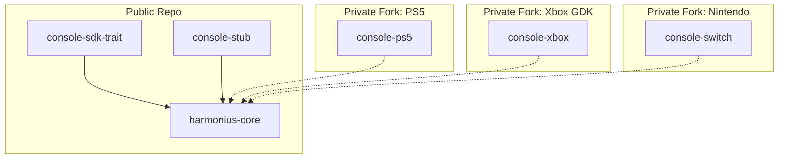
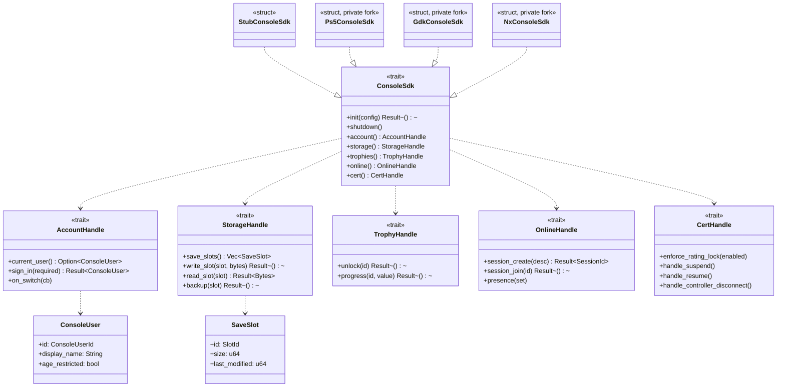
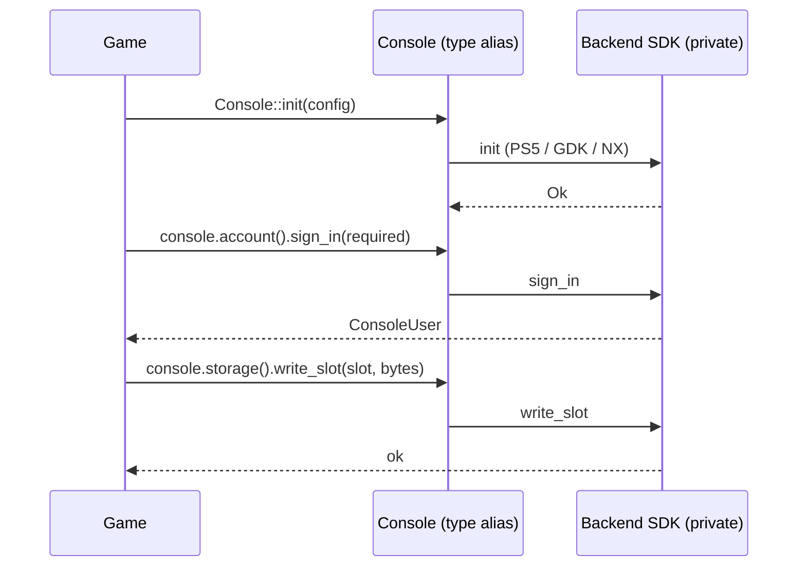

# Console Integration Design

## Requirements Trace

> **Canonical sources:** Features, requirements, and user stories live in
> [features/](../../features/), [requirements/](../../requirements/), and
> [user-stories/](../../user-stories/).

### Primary Requirements

| Feature   | Requirement | User Story   | Design Element                        |
|-----------|-------------|--------------|---------------------------------------|
| F-14.6.1  | R-14.6.1    | US-14.6.1    | `ConsoleSdk` trait and stub impl      |
| F-14.6.2  | R-14.6.2    | US-14.6.2    | `cfg` build-time backend selection    |
| F-14.6.3  | R-14.6.3    | US-14.6.3    | Symbol-hidden private fork modules    |
| F-14.6.4  | R-14.6.4    | US-14.6.4    | TRC / XR / Lotcheck compliance hooks  |
| F-14.6.5  | R-14.6.5    | US-14.6.5    | Certification test harness            |

1. **R-14.6.1** -- Define an abstract `ConsoleSdk` trait with a no-op stub in the public repo
2. **R-14.6.2** -- Build-time `cfg` selects PS5, GDK, or Nintendo SDK; one crate per platform
3. **R-14.6.3** -- Private forks ship proprietary crates with symbol-hidden linkage
4. **R-14.6.4** -- Expose hooks that satisfy platform cert requirements (TRC, XR, Lotcheck)
5. **R-14.6.5** -- Automated self-tests for common cert criteria run under CI in the private fork

### Cross-Cutting Dependencies

| Dependency          | Source    | Consumed API                          |
|---------------------|-----------|---------------------------------------|
| Platform services   | F-14.5    | Entitlement and account queries       |
| Windowing           | F-14.1    | Swapchain and present                 |
| Input               | F-6.1     | Gamepad mapping                       |
| Networking          | F-11.3.1  | Console-specific online services      |
| Save system         | F-13.4    | Save slot and backup APIs             |
| Trophy / achievement| F-13.8    | Trophy/achievement unlock             |

---

## Overview

Harmonius ships as an open-source core plus **private forks** that add proprietary console support.
The public repo must never contain NDA-protected headers, symbol names, or APIs from PlayStation,
Xbox GDK, or Nintendo SDKs. Instead, it defines abstract traits and a no-op stub backend; the
private forks supply concrete crates that link against the real SDKs.

Build-time `cfg` attributes select the active backend, so runtime code has no branches on platform.
A single crate is selected per platform target at `cargo build` time.

### Design Principles

1. **Public repo knows nothing** -- trait definitions only, no headers or symbol names
2. **Private fork isolation** -- proprietary modules live in separate crates in private forks
3. **Symbol-hidden linkage** -- private crates are `pub(crate)` or gated behind features
4. **Build-time selection** -- `cfg` dispatch, not runtime dispatch
5. **Certification-aware** -- mandatory hooks satisfy TRC/XR/Lotcheck requirements
6. **Cert test harness** -- common cert criteria self-checked under CI
7. **No NDA leakage via documentation** -- public design describes the shape, not the SDK

---

## Architecture

### Crate Layout



### Crate Selection

```text
[target.'cfg(target_platform_console = "ps5")'.dependencies]
console-ps5 = { path = "../private-ps5/console-ps5" }

[target.'cfg(target_platform_console = "xbox")'.dependencies]
console-xbox = { path = "../private-xbox/console-xbox" }

[target.'cfg(target_platform_console = "switch")'.dependencies]
console-switch = { path = "../private-switch/console-switch" }

[target.'cfg(not(target_platform_console))'.dependencies]
console-stub = { path = "platform/console-stub" }
```

`target_platform_console` is a custom cfg set by the build script of `harmonius-core` based on the
target triple and the presence of private SDK environment variables.

### Class Diagram



---

## API Design

### Trait Definitions

```rust
pub trait ConsoleSdk: Send + Sync {
    type Account: AccountHandle;
    type Storage: StorageHandle;
    type Trophies: TrophyHandle;
    type Online: OnlineHandle;
    type Cert: CertHandle;

    fn init(config: ConsoleConfig) -> Result<Self, ConsoleInitError> where Self: Sized;
    fn shutdown(self);
    fn account(&self) -> &Self::Account;
    fn storage(&self) -> &Self::Storage;
    fn trophies(&self) -> &Self::Trophies;
    fn online(&self) -> &Self::Online;
    fn cert(&self) -> &Self::Cert;
}

pub trait AccountHandle: Send + Sync {
    fn current_user(&self) -> Option<ConsoleUser>;
    fn sign_in(&self, required: bool) -> Result<ConsoleUser, SignInError>;
    fn on_switch(&self, cb: Box<dyn Fn(ConsoleUser) + Send + Sync>);
}

pub trait StorageHandle: Send + Sync {
    fn save_slots(&self) -> Vec<SaveSlot>;
    fn write_slot(&self, slot: SlotId, bytes: &[u8]) -> Result<(), StorageError>;
    fn read_slot(&self, slot: SlotId) -> Result<Bytes, StorageError>;
    fn backup(&self, slot: SlotId) -> Result<(), StorageError>;
}

pub trait TrophyHandle: Send + Sync {
    fn unlock(&self, id: TrophyId) -> Result<(), TrophyError>;
    fn progress(&self, id: TrophyId, value: u32) -> Result<(), TrophyError>;
}

pub trait OnlineHandle: Send + Sync {
    fn session_create(&self, desc: SessionDesc) -> Result<SessionId, OnlineError>;
    fn session_join(&self, id: SessionId) -> Result<(), OnlineError>;
    fn presence(&self, set: PresenceString);
}

pub trait CertHandle: Send + Sync {
    fn enforce_rating_lock(&self, enabled: bool);
    fn handle_suspend(&self);
    fn handle_resume(&self);
    fn handle_controller_disconnect(&self);
}
```

### Selected Backend Alias

```rust
#[cfg(target_platform_console = "ps5")]
pub type Console = console_ps5::Ps5ConsoleSdk;

#[cfg(target_platform_console = "xbox")]
pub type Console = console_xbox::GdkConsoleSdk;

#[cfg(target_platform_console = "switch")]
pub type Console = console_switch::NxConsoleSdk;

#[cfg(not(target_platform_console))]
pub type Console = console_stub::StubConsoleSdk;
```

Engine code calls only `Console`, never a specific backend name.

### Stub Implementation

```rust
pub struct StubConsoleSdk;

impl ConsoleSdk for StubConsoleSdk {
    type Account = StubAccount;
    type Storage = StubStorage;
    type Trophies = StubTrophies;
    type Online = StubOnline;
    type Cert = StubCert;

    fn init(_config: ConsoleConfig) -> Result<Self, ConsoleInitError> { Ok(StubConsoleSdk) }
    fn shutdown(self) {}
    fn account(&self) -> &StubAccount { &StubAccount }
    fn storage(&self) -> &StubStorage { &StubStorage }
    fn trophies(&self) -> &StubTrophies { &StubTrophies }
    fn online(&self) -> &StubOnline { &StubOnline }
    fn cert(&self) -> &StubCert { &StubCert }
}
```

The stub is what desktop targets compile against. Every call returns a no-op or an in-memory fake;
nothing requires network or platform libraries.

---

## Certification Requirements

### TRC / XR / Lotcheck Coverage Matrix

| Concern                               | PS5 TRC | Xbox XR | Nintendo |
|---------------------------------------|---------|---------|----------|
| Handle suspend/resume without crash   | yes     | yes     | yes      |
| Handle controller disconnect          | yes     | yes     | yes      |
| Sign-in required before online play   | yes     | yes     | yes      |
| Rating lock enforcement               | yes     | yes     | yes      |
| Safe save on low power                | yes     | yes     | yes      |
| Correct icon, logo, trademark usage   | yes     | yes     | yes      |
| Permitted presence strings            | yes     | yes     | yes      |

Each item maps to a `CertHandle` method or a `StorageHandle` behavior. A cert test harness in the
private fork calls every method and asserts the implementation behaves as required.

### Handoff to Private Fork

Private forks add:

1. A cert test crate `console-<plat>-cert-tests` that runs inside the SDK emulator or devkit
2. A CI configuration that runs these tests on every private-fork PR
3. Private docs describing how each cert rule is met; never merged back to the public repo

---

## Build-time Selection Mechanics

### `build.rs` Logic

```rust
fn main() {
    let target = env::var("TARGET").unwrap_or_default();
    let console = if target.contains("ps5") {
        Some("ps5")
    } else if target.contains("xbox-gdk") {
        Some("xbox")
    } else if target.contains("nintendo") {
        Some("switch")
    } else {
        None
    };
    if let Some(c) = console {
        println!("cargo:rustc-cfg=target_platform_console=\"{}\"", c);
    }
}
```

The build script runs in `harmonius-core`. The private forks provide their own SDK toolchains so the
`TARGET` triple is only recognized in the private build environment.

### Symbol Hiding

```toml
[lib]
name = "console_ps5"
crate-type = ["rlib"]

[profile.release]
strip = "symbols"
lto = "fat"

[features]
default = []
enable_proprietary = []
```

Private crates are `rlib` only, never `cdylib`, so no proprietary symbols are exposed at link time
in the final binary. `strip = "symbols"` removes debug info from the final console image.

---

## Data Flow



---

## Platform Considerations

| Platform | Notes                                                                        |
|----------|------------------------------------------------------------------------------|
| PS5      | Private fork uses NDA SDK; trophy id space matches PSN.                      |
| Xbox GDK | Private fork uses GDK and XSAPI; enforces UWP lifetime states.               |
| Nintendo | Private fork uses NintendoSDK; Lotcheck enforces language and memory rules.  |
| Desktop  | Stub backend; all methods are no-ops returning fakes.                        |

### NDA Hygiene

- Public repo has a pre-commit hook that rejects any file containing known NDA symbol names
- CI scans diffs against a list of forbidden header names
- Private forks track the public repo via an upstream remote and rebase private commits on top

---

## Test Plan

See [console-integration-test-cases.md](console-integration-test-cases.md) for TC-14.6.x.y:

- Unit tests on the stub implementation
- Contract tests: every backend must pass the same cert test battery
- Benchmarks only where cert requires a bounded response time (e.g., resume latency)

---

## Open Questions

1. Can we open-source the trait definitions while private SDK headers remain NDA?
2. How do we version the cert test battery as platform holders update their requirements?
3. Do we maintain a shared private fork for multiple concurrent platform certifications?
4. What is the minimum stub surface needed for the editor to build cleanly on non-console hosts?
