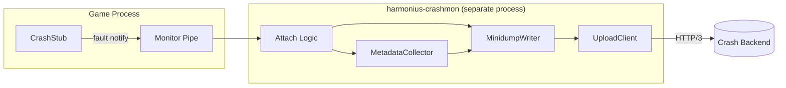
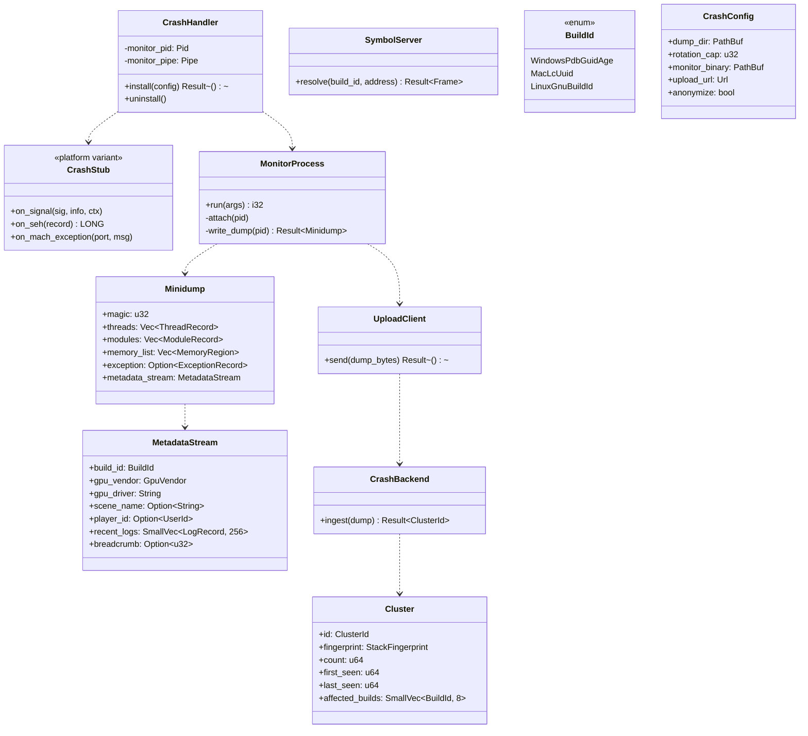
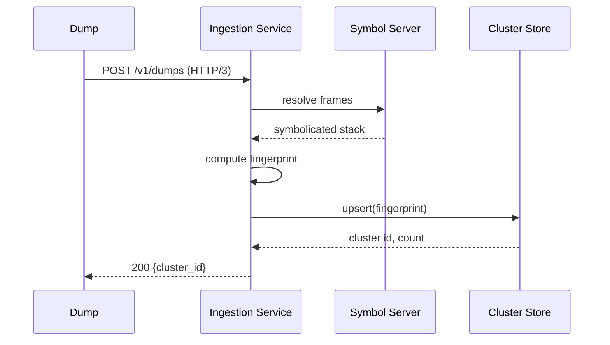
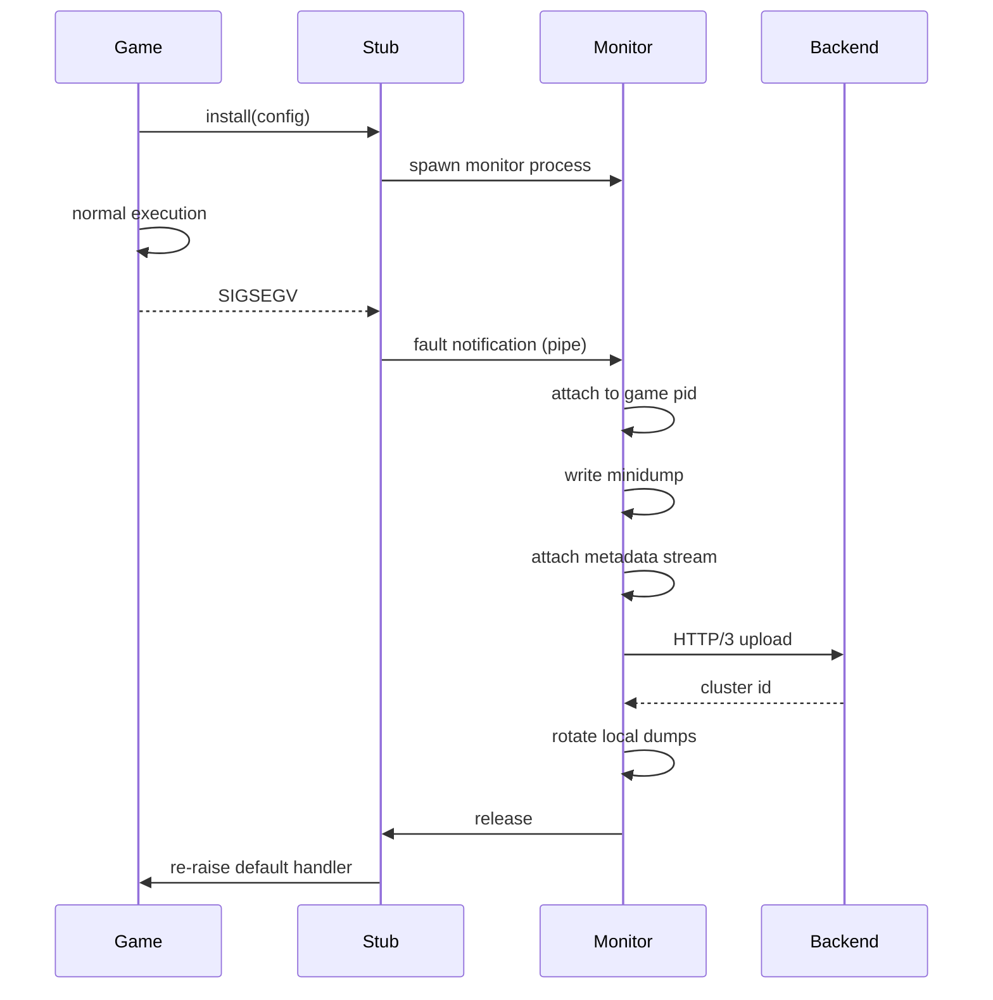

# Crash Reporting Design

## Requirements Trace

> **Canonical sources:** Features, requirements, and user stories live in
> [features/](../../features/), [requirements/](../../requirements/), and
> [user-stories/](../../user-stories/).

### Primary Requirements

| Feature    | Requirement | User Story   | Design Element                       |
|------------|-------------|--------------|--------------------------------------|
| F-14.4.1   | R-14.4.1    | US-14.4.1    | `CrashHandler` signal entry points   |
| F-14.4.2   | R-14.4.2    | US-14.4.2    | Symbol upload and symbol server      |
| F-14.4.3   | R-14.4.3    | US-14.4.3    | Aggregation and grouping protocol    |
| F-14.4.7   | R-14.4.7    | US-14.4.7    | Out-of-process handler binary        |
| F-14.4.8   | R-14.4.8    | US-14.4.8    | Dump rotation and metadata           |

1. **R-14.4.1** -- Intercept SIGSEGV, SIGABRT, unhandled SEH exceptions, and Mach exceptions
2. **R-14.4.2** -- Upload platform debug symbols indexed by build id to the symbol server
3. **R-14.4.3** -- Server groups reports by symbolicated stack fingerprint with frequency tracking
4. **R-14.4.7** -- Crash capture runs in a sibling monitor process, not the faulting process
5. **R-14.4.8** -- Dumps rotate with configurable cap; metadata (build id, GPU, scene) attached

### Cross-Cutting Dependencies

| Dependency         | Source    | Consumed API                          |
|--------------------|-----------|---------------------------------------|
| Platform I/O       | F-14.2    | `IoRequest` for dump upload           |
| QUIC transport     | F-11.3.1  | HTTP/3 upload to backend              |
| Logging            | F-14.4.4  | Attach recent log ring                |
| GPU breadcrumbs    | F-14.4.6  | Attach last breadcrumb value          |
| Build metadata     | F-15.15.2 | Build id, version, git sha            |
| Main-thread bridge | F-1.1.1   | Event loop for sending dump           |

---

## Overview

The crash reporting subsystem installs a lightweight in-process stub that forwards fault information
to an **out-of-process monitor binary** launched at startup. The monitor owns all dump writing,
metadata assembly, and upload. Keeping capture out of the faulting process avoids relying on a
potentially corrupted heap, allocator, or thread state.

Dumps are written in the Breakpad `MINIDUMP_*` format so that existing symbolication tooling works.
Symbols are uploaded during the build pipeline indexed by the platform-native build identifier (PDB
GUID+Age on Windows, `LC_UUID` on macOS, `.note.gnu.build-id` on Linux).

### Design Principles

1. **Out-of-process capture** -- monitor process does the heavy lifting; stub is minimal
2. **Breakpad-compatible minidump** -- interoperate with existing symbolication tools
3. **Platform-native signal entry** -- each OS uses its canonical fault hook
4. **Signal-safe stub** -- no heap, no locks, no allocations in the stub fault path
5. **QUIC upload over HTTP/3** -- same transport stack as other network subsystems
6. **Stack fingerprint grouping** -- backend normalizes and groups identical faults
7. **Attached metadata** -- build id, GPU driver, scene name, recent logs travel with dump

---

## Architecture

### Process Layout



### Class Diagram



### Platform Entry Points

| Platform | Fault Entry                                          | Action                       |
|----------|------------------------------------------------------|------------------------------|
| Windows  | `SetUnhandledExceptionFilter`                        | Notify monitor via pipe      |
| macOS    | Mach exception port (via `mach_port_allocate`)       | Forward `mach_msg` to monitor|
| Linux    | `sigaction(SIGSEGV/SIGBUS/SIGFPE/SIGILL/SIGABRT)`    | Write byte to pipe fd        |

The stub handler does three signal-safe operations only: (1) capture register state into a stack
buffer, (2) write a small notification record to the monitor pipe, (3) block waiting for the monitor
to attach, then re-raise the signal with the default handler so Windows Error Reporting / crash logs
still fire.

---

## API Design

### Stub Installation

```rust
pub struct CrashConfig {
    pub dump_dir: PathBuf,
    pub rotation_cap: u32,
    pub monitor_binary: PathBuf,
    pub upload_url: Url,
    pub anonymize: bool,
}

pub struct CrashHandler {
    monitor_pid: Pid,
    monitor_pipe: PipeHandle,
}

impl CrashHandler {
    pub fn install(config: CrashConfig) -> Result<Self, CrashInstallError>;
    pub fn uninstall(self);
    pub fn breadcrumb_buffer(&self) -> BreadcrumbHandle;
    pub fn update_scene(&self, name: &str);
    pub fn update_player(&self, id: UserId);
}
```

### Monitor Entry Point

```rust
pub fn monitor_main(args: MonitorArgs) -> i32 {
    let notification = wait_for_fault(&args.pipe)?;
    let dump = write_minidump(notification.pid, &args.dump_dir)?;
    attach_metadata(&mut dump, &args.meta)?;
    let upload = UploadClient::new(&args.upload_url);
    upload.send(dump.bytes())?;
    rotate_dumps(&args.dump_dir, args.rotation_cap);
    0
}
```

The monitor is a tiny binary (target < 2 MiB) that depends only on `minidump-writer`, the platform
I/O crate, and `quinn`. It shares no engine state with the game process.

---

## Minidump Format

Breakpad-compatible:

```text
MINIDUMP_HEADER
  signature: 'MDMP'
  flags: Normal | WithProcessThreadData
  number_of_streams: 6+
STREAMS
  ThreadListStream          (MINIDUMP_THREAD[])
  ModuleListStream          (MINIDUMP_MODULE[])
  MemoryListStream          (MINIDUMP_MEMORY_DESCRIPTOR[])
  ExceptionStream           (MINIDUMP_EXCEPTION_STREAM)
  SystemInfoStream          (MINIDUMP_SYSTEM_INFO)
  HarmoniusMetadataStream   (custom, stream type 0x48524D30)
```

The `HarmoniusMetadataStream` is our private stream type with a rkyv-archived `MetadataStream`
struct carrying build id, GPU driver, scene name, recent logs, and breadcrumb.

---

## Symbol Server

### Upload (Build Pipeline)

```rust
pub fn upload_symbols(bundle: SymbolBundle, server: &Url) -> Result<()> {
    let client = SymbolServerClient::new(server.clone());
    for symfile in bundle.into_iter() {
        client.put(&symfile.index_key(), &symfile.bytes)?;
    }
    Ok(())
}
```

| Platform | Index Key                                      |
|----------|------------------------------------------------|
| Windows  | `<pdb-name>/<guid><age>/<pdb-name>`            |
| macOS    | `<binary-name>.dSYM/Contents/Resources/DWARF/<uuid>` |
| Linux    | `<binary-name>/<build-id-hex>`                 |

### Resolve (Backend)

```rust
pub struct SymbolServer {
    cas: BlobStore,
}

impl SymbolServer {
    pub fn resolve(&self, build_id: BuildId, address: u64) -> Result<Frame, ResolveError>;
}
```

---

## Backend Aggregation



### Stack Fingerprint

A deterministic hash of the top N symbolicated frames after normalizing:

1. Strip file offsets and line numbers
2. Strip parameter lists from symbol names
3. Strip template instantiation parameters
4. Drop frames belonging to the crash handler stub itself

The fingerprint is a `blake3` hash of the normalized frame list.

### Cluster Record

```rust
pub struct Cluster {
    pub id: ClusterId,
    pub fingerprint: StackFingerprint,
    pub count: u64,
    pub first_seen: u64,
    pub last_seen: u64,
    pub affected_builds: SmallVec<[BuildId; 8]>,
}
```

### Alerting Rules

| Condition                                      | Severity |
|------------------------------------------------|----------|
| New cluster, count > 10 in 60s                 | High     |
| Existing cluster rate doubles vs 24h baseline  | Medium   |
| New cluster in release build                   | Medium   |
| Cluster involves GPU breadcrumb                | High     |

---

## Dump Rotation

```rust
pub fn rotate_dumps(dir: &Path, cap: u32) -> Result<()> {
    let mut entries: Vec<_> = fs::read_dir(dir)?
        .filter_map(|e| e.ok())
        .filter(|e| e.path().extension() == Some("mdmp".as_ref()))
        .collect();
    entries.sort_by_key(|e| e.metadata().ok().and_then(|m| m.modified().ok()));
    while entries.len() > cap as usize {
        let victim = entries.remove(0);
        fs::remove_file(victim.path())?;
    }
    Ok(())
}
```

Dumps are named `<timestamp>-<build-id>.mdmp`. Metadata sidecars `.json` carry the same stem for
quick filter operations prior to symbolication.

---

## Platform Considerations

| Platform | Monitor Launch                           | Pipe Type      |
|----------|------------------------------------------|----------------|
| Windows  | `CreateProcessW` at startup              | Named pipe     |
| macOS    | `posix_spawn` at startup                 | Unix domain    |
| Linux    | `posix_spawn` at startup                 | Unix domain    |

On Apple platforms the monitor also registers a Mach exception port and installs the task-level
exception handler so the kernel forwards faults directly. This is more robust than signals on iOS
and macOS when SIP is enabled.

---

## Data Flow



---

## Test Plan

See [crash-reporting-test-cases.md](crash-reporting-test-cases.md) for TC-14.4.x.y entries:

- Unit tests for metadata packing, rotation, fingerprint normalization
- Integration tests triggering real SIGSEGV in a child process and verifying capture
- Benchmarks for stub overhead and upload latency

---

## Open Questions

1. Do we encrypt dumps at rest in the CAS, or rely on TLS transport only?
2. What is the PII policy for player id and scene name when `anonymize = true`?
3. How do we handle double-faults that kill the monitor process mid-capture?
4. Should the backend feed clusters back to the editor live-ops dashboard automatically?
