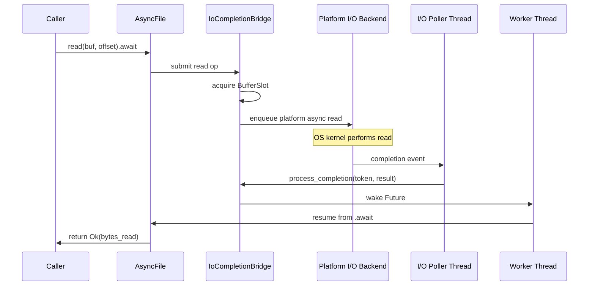
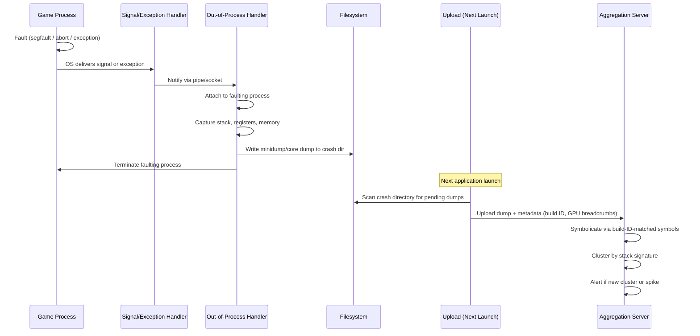
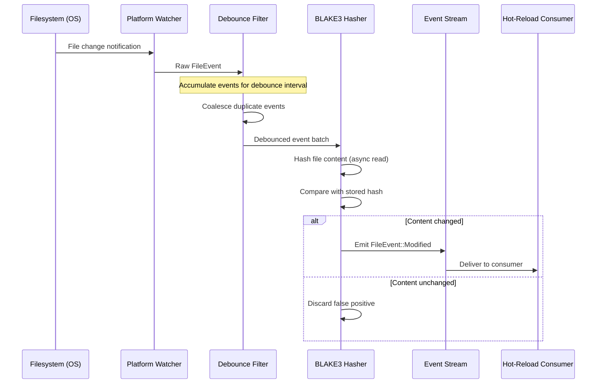
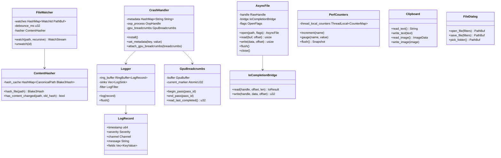

# Platform OS Integration Design

## Requirements Trace

> **Canonical sources:** Features, requirements, and user
> stories are defined in [features/platform/](../../features/platform/),
> [requirements/platform/](../../requirements/platform/), and
> [user-stories/platform/](../../user-stories/platform/). The table
> below traces design elements to those definitions.

### OS Integration (F-14.2 / R-14.2)

| Feature | Requirement | Description |
|---------|-------------|-------------|
| F-14.2.1 | R-14.2.1 | Clipboard read/write for plain text and images, async on Wayland |
| F-14.2.2 | R-14.2.2 | Native file-picker and folder-picker dialogs with file-type filters |
| F-14.2.3 | R-14.2.3 | Toast notifications and system tray icons for background events |
| F-14.2.4 | R-14.2.4 | Drag and drop with MIME type and extension validation |
| F-14.2.5 | R-14.2.5 | Keyboard layout detection, dead-key sequences, layout-change events |
| F-14.2.6 | R-14.2.6 | Input Method Editor integration for CJK text entry |

### Crash Reporting & Diagnostics (F-14.4 / R-14.4)

| Feature | Requirement | Description |
|---------|-------------|-------------|
| F-14.4.1 | R-14.4.1 | Process-wide crash handler with minidump/core dump generation |
| F-14.4.2 | R-14.4.2 | Debug symbol upload and server-side symbolication via build ID |
| F-14.4.3 | R-14.4.3 | Crash aggregation by stack signature, alerting on new clusters/spikes |
| F-14.4.4 | R-14.4.4 | Structured logging with severity, channels, and async ring buffer flush |
| F-14.4.5 | R-14.4.5 | Lock-free per-thread performance counters with telemetry hooks |
| F-14.4.6 | R-14.4.6 | GPU crash breadcrumbs written to GPU-visible buffer per render pass |

### Filesystem (F-14.6 / R-14.6)

| Feature | Requirement | Description |
|---------|-------------|-------------|
| F-14.6.1 | R-14.6.1 | Async file open, read, write via platform-native I/O (IOCP/GCD/io_uring) |
| F-14.6.2 | R-14.6.2 | Async file create/delete with recursive mkdir and batch unlink |
| F-14.6.3 | R-14.6.3 | Async file metadata and batch stat queries |
| F-14.6.4 | R-14.6.4 | Async directory enumeration with depth limits and glob filtering |
| F-14.6.5 | R-14.6.5 | Directory change notifications with debounce and recursive watching |
| F-14.6.6 | R-14.6.6 | BLAKE3 content hash comparison to filter false-positive file events |
| F-14.6.7 | R-14.6.7 | Canonical path resolution across Windows, macOS, and Linux |

## Overview

The OS integration subsystem provides a platform-agnostic API for three categories of
operating-system interaction: desktop OS services (clipboard, file dialogs, notifications,
drag-drop, keyboard layouts, IME), crash reporting and diagnostics (crash capture, symbol
management, structured logging, performance counters, GPU breadcrumbs), and filesystem operations
(async file I/O, file watching, path resolution). Together, these modules form the engine's primary
interface with the host operating system, abstracting per-platform differences behind statically
dispatched, `cfg`-gated Rust types.

All file I/O flows through the platform-native async primitives introduced in the threading design
(F-1.8): IOCP on Windows, Grand Central Dispatch on macOS, and io_uring on Linux. No Rust standard
library file I/O (`std::fs`, `std::io::Read`, `std::io::Write`) is used anywhere in this subsystem
or any caller. Every file operation returns a `Future` that resolves on the I/O thread pool without
blocking game threads. The filesystem module builds high-level file semantics (open, read, write,
stat, enumerate, watch) on top of the `IoCompletionBridge` from the threading design.

Crash reporting operates through an out-of-process handler for reliability: when the game process
faults, a separate monitoring process captures the crash dump, avoiding corruption from the faulting
process's heap. Diagnostics (logging, perf counters, GPU breadcrumbs) run in-process using lock-free
data structures and async flush to minimize frame-time impact. OS integration services (clipboard,
dialogs, notifications, drag-drop, keyboard, IME) wrap per-platform native APIs and are designed to
never block the game loop.

## Architecture

### Module Boundaries

```mermaid
graph TD
    subgraph "harmonius_platform::os"
        CB[Clipboard]
        FD[FileDialog]
        NT[Notifications]
        DD[DragDrop]
        KB[Keyboard]
        IM[IME]
    end

    subgraph "harmonius_platform::crash"
        CH[CrashHandler]
        SY[Symbols]
        AG[Aggregation]
        LG[Logger]
        TL[Telemetry]
        GB[GpuBreadcrumbs]
    end

    subgraph "harmonius_platform::filesystem"
        FO[FileOps]
        MD[Metadata]
        EN[Enumerate]
        FW[FileWatcher]
        HS[ContentHasher]
        PA[PathResolver]
    end

    subgraph "harmonius_platform::threading"
        IO[IoCompletionBridge]
        TP[ThreadPool]
    end

    subgraph "platform::windows"
        W1[Win32 COM / WinRT]
        W2[IOCP / Overlapped]
        W3[SEH / MiniDump]
    end

    subgraph "platform::macos"
        M1[AppKit / Cocoa]
        M2[GCD dispatch_io]
        M3[Mach Exceptions]
    end

    subgraph "platform::linux"
        L1[D-Bus / X11 / Wayland]
        L2[io_uring]
        L3[Signals / ptrace]
    end

    FO --> IO
    MD --> IO
    EN --> IO
    FW --> IO
    HS --> FO
    CH --> LG

    CB -.->|"cfg(windows)"| W1
    CB -.->|"cfg(macos)"| M1
    CB -.->|"cfg(linux)"| L1

    FO -.->|"cfg(windows)"| W2
    FO -.->|"cfg(macos)"| M2
    FO -.->|"cfg(linux)"| L2

    CH -.->|"cfg(windows)"| W3
    CH -.->|"cfg(macos)"| M3
    CH -.->|"cfg(linux)"| L3
```



### Async File Read Flow



### Crash Handler Flow



### File Watcher Data Flow



### Core Data Structures



### Module Structure

```
harmonius_platform/
├── os/
│   ├── clipboard.rs
│   ├── file_dialog.rs
│   ├── notifications.rs
│   ├── drag_drop.rs
│   ├── keyboard.rs
│   └── ime.rs
├── crash/
│   ├── handler.rs
│   ├── symbols.rs
│   ├── aggregation.rs
│   ├── logging.rs
│   ├── telemetry.rs
│   └── gpu_breadcrumbs.rs
├── filesystem/
│   ├── file_ops.rs
│   ├── metadata.rs
│   ├── enumerate.rs
│   ├── watcher.rs
│   ├── content_hash.rs
│   └── path.rs
└── platform/
    ├── windows/
    │   ├── clipboard.rs
    │   ├── file_dialog.rs
    │   ├── notifications.rs
    │   ├── drag_drop.rs
    │   ├── keyboard.rs
    │   ├── ime.rs
    │   ├── crash.rs
    │   ├── logging.rs
    │   └── filesystem.rs
    ├── macos/
    │   ├── clipboard.rs
    │   ├── file_dialog.rs
    │   ├── notifications.rs
    │   ├── drag_drop.rs
    │   ├── keyboard.rs
    │   ├── ime.rs
    │   ├── crash.rs
    │   ├── logging.rs
    │   └── filesystem.rs
    └── linux/
        ├── clipboard.rs
        ├── file_dialog.rs
        ├── notifications.rs
        ├── drag_drop.rs
        ├── keyboard.rs
        ├── ime.rs
        ├── crash.rs
        ├── logging.rs
        └── filesystem.rs
```

## API Design

### OS Integration

#### Clipboard (F-14.2.1 / R-14.2.1)

```rust
/// RGBA image data for clipboard image operations.
pub struct ImageData {
    pub width: u32,
    pub height: u32,
    pub pixels: Vec<u8>,
}

/// Platform clipboard access.
///
/// All operations are async. On Wayland, the compositor
/// mediates data transfer asynchronously. On other
/// platforms, sync OS calls are wrapped in async to
/// maintain a uniform interface.
///
/// Uses cfg-gated platform backends — no dyn Trait.
pub struct Clipboard { /* platform-specific fields */ }

impl Clipboard {
    /// Create a clipboard handle for the given window.
    pub fn new(window: &Window) -> Self;

    /// Read UTF-8 text from the system clipboard.
    /// Returns `None` if the clipboard does not
    /// contain text.
    pub async fn read_text(
        &self,
    ) -> Result<Option<String>, OsError>;

    /// Write UTF-8 text to the system clipboard.
    pub async fn write_text(
        &self,
        text: &str,
    ) -> Result<(), OsError>;

    /// Read RGBA image data from the system clipboard.
    /// Returns `None` if the clipboard does not contain
    /// an image.
    pub async fn read_image(
        &self,
    ) -> Result<Option<ImageData>, OsError>;

    /// Write RGBA image data to the system clipboard.
    pub async fn write_image(
        &self,
        image: &ImageData,
    ) -> Result<(), OsError>;
}
```

#### Native File Dialogs (F-14.2.2 / R-14.2.2)

```rust
/// File type filter for file dialogs.
pub struct FileFilter {
    /// Human-readable label (e.g., "PNG Images").
    pub label: &'static str,
    /// File extension patterns
    /// (e.g., &["png", "PNG"]).
    pub extensions: &'static [&'static str],
}

/// Configuration for file dialog appearance and
/// behavior.
pub struct FileDialogConfig {
    /// Dialog title text.
    pub title: &'static str,
    /// Initial directory to display.
    pub initial_dir: Option<CanonicalPath>,
    /// File type filters. First filter is the default.
    pub filters: Vec<FileFilter>,
}

/// Native file and folder picker dialogs.
///
/// Dialogs run on a separate OS thread so the game
/// loop continues rendering while the dialog is open
/// (R-14.2.2).
pub struct FileDialog {
    /* platform-specific fields */
}

impl FileDialog {
    pub fn new() -> Self;

    /// Open a file picker dialog. Returns the selected
    /// file path, or `None` if the user cancelled.
    pub async fn open_file(
        &self,
        config: &FileDialogConfig,
    ) -> Result<Option<CanonicalPath>, OsError>;

    /// Open a save-file dialog. Returns the chosen
    /// save path, or `None` if the user cancelled.
    pub async fn save_file(
        &self,
        config: &FileDialogConfig,
    ) -> Result<Option<CanonicalPath>, OsError>;

    /// Open a folder picker dialog. Returns the
    /// selected directory, or `None` if the user
    /// cancelled.
    pub async fn pick_folder(
        &self,
        title: &str,
        initial_dir: Option<&CanonicalPath>,
    ) -> Result<Option<CanonicalPath>, OsError>;
}
```

#### Notifications and Tray Icons (F-14.2.3 / R-14.2.3)

```rust
/// Notification urgency level (US-14.2.13).
#[derive(Clone, Copy, Debug, PartialEq, Eq)]
pub enum NotificationUrgency {
    /// Informational; no sound or badge.
    Low,
    /// Default; plays notification sound.
    Normal,
    /// Time-critical (queue pop, guild invite);
    /// persistent banner.
    Critical,
}

/// Configuration for a toast notification.
pub struct NotificationConfig<'a> {
    pub title: &'a str,
    pub body: &'a str,
    pub urgency: NotificationUrgency,
    /// Optional icon identifier from the engine's
    /// icon registry.
    pub icon: Option<&'a str>,
}

/// Menu item for tray icon context menus.
pub struct TrayMenuItem {
    pub label: String,
    pub id: u32,
    pub enabled: bool,
}

/// Event emitted when a tray menu item is selected.
pub struct TrayMenuEvent {
    pub item_id: u32,
}

/// System notifications and tray icon management.
///
/// On consoles that lack OS-level notifications,
/// `show_notification` is a no-op and returns
/// `Err(OsError::Unsupported)`. Gameplay code should
/// fall back to in-game UI (US-14.2.11).
pub struct Notifications {
    /* platform-specific fields */
}

impl Notifications {
    pub fn new(window: &Window) -> Self;

    /// Display a toast notification.
    pub fn show_notification(
        &self,
        config: &NotificationConfig,
    ) -> Result<(), OsError>;

    /// Create a system tray icon with a context menu.
    /// Returns a stream of menu selection events.
    pub fn create_tray_icon(
        &self,
        tooltip: &str,
        menu_items: &[TrayMenuItem],
    ) -> Result<TrayIconHandle, OsError>;

    /// Remove a previously created tray icon.
    pub fn remove_tray_icon(
        &self,
        handle: TrayIconHandle,
    ) -> Result<(), OsError>;
}

/// Handle to a system tray icon. Delivers menu events
/// via stream.
pub struct TrayIconHandle { /* ... */ }

impl TrayIconHandle {
    /// Receive the next tray menu event. Non-blocking.
    pub fn poll_event(&self) -> Option<TrayMenuEvent>;
}
```

#### Drag and Drop (F-14.2.4 / R-14.2.4)

```rust
/// Drag-and-drop event lifecycle.
#[derive(Debug)]
pub enum DragEvent {
    /// Cursor entered the window with dragged data.
    Enter {
        position: (f32, f32),
        mime_types: Vec<String>,
    },
    /// Cursor moved within the window during drag.
    Over { position: (f32, f32) },
    /// Data was dropped on the window.
    Drop {
        position: (f32, f32),
        paths: Vec<CanonicalPath>,
        data: Option<Vec<u8>>,
    },
    /// Cursor left the window during drag.
    Leave,
}

/// Outcome returned by the handler to accept or
/// reject a drop.
#[derive(Debug, Clone, Copy)]
pub enum DragResponse {
    /// Accept the dragged data.
    Accept,
    /// Reject the dragged data
    /// (cursor shows "not allowed").
    Reject,
}

/// Filter for accepted MIME types and file
/// extensions.
pub struct MimeFilter {
    /// Accepted MIME type patterns
    /// (e.g., "image/*", "application/zip").
    pub mime_types: Vec<String>,
    /// Accepted file extensions
    /// (e.g., "zip", "png").
    pub extensions: Vec<String>,
}

/// Drag-and-drop handler registered on a window.
///
/// The handler receives drag events and returns
/// accept/reject responses. MIME types and extensions
/// are validated before the DragEvent::Drop is
/// delivered (R-14.2.4).
pub struct DragDropHandler {
    /* platform-specific fields */
}

impl DragDropHandler {
    /// Register a drag-drop handler on the given
    /// window with a MIME/extension filter.
    pub fn register(
        window: &Window,
        filter: MimeFilter,
    ) -> Result<Self, OsError>;

    /// Poll for the next drag event. Non-blocking.
    pub fn poll_event(&self) -> Option<DragEvent>;

    /// Respond to a DragEvent::Enter or
    /// DragEvent::Over.
    pub fn respond(&self, response: DragResponse);

    /// Unregister the handler from the window.
    pub fn unregister(self) -> Result<(), OsError>;
}
```

#### Keyboard Layouts and Dead Keys (F-14.2.5 / R-14.2.5)

```rust
/// Identifies a keyboard layout.
#[derive(Clone, Debug, PartialEq, Eq)]
pub struct KeyboardLayout {
    /// Human-readable name
    /// (e.g., "French (AZERTY)").
    pub name: String,
    /// Platform-specific layout identifier.
    pub id: KeyboardLayoutId,
}

/// Platform-specific layout identifier.
#[cfg(target_os = "windows")]
pub type KeyboardLayoutId = u32; // HKL as u32
#[cfg(target_os = "macos")]
pub type KeyboardLayoutId = String; // TISInputSource ID
#[cfg(target_os = "linux")]
pub type KeyboardLayoutId = String; // xkbcommon layout name

/// Dead-key composition state.
#[derive(Debug)]
pub enum DeadKeyResult {
    /// The key produced a character immediately.
    Char(char),
    /// The key is a dead key; waiting for the next
    /// key to compose.
    Pending,
    /// A composed character from a dead-key sequence
    /// (e.g., ^ + e = e-hat).
    Composed(char),
    /// The dead-key sequence was cancelled
    /// (no valid composition).
    Cancelled { dead_key: char, follow: char },
}

/// Keyboard layout detection and dead-key
/// translation.
pub struct Keyboard { /* platform-specific fields */ }

impl Keyboard {
    pub fn new() -> Self;

    /// Return the currently active keyboard layout.
    pub fn active_layout(&self) -> KeyboardLayout;

    /// Translate a physical scancode to a character
    /// using the active layout, handling dead-key
    /// state.
    pub fn translate_key(
        &mut self,
        scancode: u32,
    ) -> DeadKeyResult;

    /// Poll for layout change. Returns `Some` if the
    /// layout changed since last poll. The
    /// key-to-character mapping updates within one
    /// frame of a layout-change event (R-14.2.5).
    pub fn poll_layout_change(
        &mut self,
    ) -> Option<KeyboardLayout>;
}
```

#### Input Method Editor (F-14.2.6 / R-14.2.6)

```rust
/// IME event types for CJK text composition.
#[derive(Debug)]
pub enum ImeEvent {
    /// IME composition started or updated. `text` is
    /// the in-progress composition string; `cursor`
    /// is the cursor position within it.
    Composition { text: String, cursor: usize },
    /// IME composition committed. `text` is the final
    /// string.
    Commit { text: String },
    /// Candidate list updated. The UI should display
    /// these candidates.
    CandidateList {
        candidates: Vec<String>,
        selected: usize,
        page: usize,
        page_count: usize,
    },
    /// IME composition cancelled.
    Cancel,
}

/// Screen-space rectangle for positioning the IME
/// candidate window.
pub struct ImePosition {
    /// X coordinate of the text cursor in screen
    /// pixels.
    pub x: f32,
    /// Y coordinate of the text cursor in screen
    /// pixels.
    pub y: f32,
    /// Height of the text line for candidate window
    /// placement.
    pub line_height: f32,
}

/// Input Method Editor integration for CJK text
/// entry.
///
/// The engine provides cursor position hints so the
/// OS positions the candidate window correctly.
/// Position updates track window move and resize
/// events (US-14.2.12, R-14.2.6).
pub struct ImeHandler {
    /* platform-specific fields */
}

impl ImeHandler {
    /// Attach IME handling to the given window.
    pub fn attach(
        window: &Window,
    ) -> Result<Self, OsError>;

    /// Update the candidate window position hint.
    /// Call this whenever the text cursor moves or
    /// the window is moved/resized.
    pub fn set_position(&self, pos: &ImePosition);

    /// Enable or disable IME input for the window.
    pub fn set_enabled(&self, enabled: bool);

    /// Poll for the next IME event. Non-blocking.
    pub fn poll_event(&self) -> Option<ImeEvent>;

    /// Detach IME handling from the window.
    pub fn detach(self) -> Result<(), OsError>;
}
```

### Crash Reporting & Diagnostics

#### Crash Handler (F-14.4.1 / R-14.4.1)

```rust
/// Configuration for the crash handler.
pub struct CrashHandlerConfig {
    /// Directory where crash dumps are written.
    pub crash_dir: CanonicalPath,
    /// Path to the out-of-process crash handler
    /// binary.
    pub oop_handler_path: CanonicalPath,
    /// Maximum number of crash dumps to retain
    /// before rotation.
    pub max_retained_dumps: u32,
}

/// Process-wide crash handler with out-of-process
/// capture.
///
/// The handler intercepts unhandled exceptions
/// (Windows SEH), Mach exceptions (macOS), and
/// signals (Linux SIGSEGV/SIGABRT). Dump capture
/// runs in an out-of-process handler for reliability
/// when the faulting process heap is corrupted
/// (US-14.4.8, R-14.4.1).
pub struct CrashHandler {
    /* platform-specific fields */
}

impl CrashHandler {
    /// Install the process-wide crash handler. Must
    /// be called once at engine startup before any
    /// other subsystem initializes. Launches the
    /// out-of-process monitor.
    pub fn install(
        config: CrashHandlerConfig,
    ) -> Result<Self, CrashError>;

    /// Attach metadata key-value pairs to crash
    /// reports. Common keys: "build_id",
    /// "gpu_driver", "player_id", "scene_name".
    /// Metadata is written to the dump file.
    pub fn set_metadata(
        &self,
        key: &str,
        value: &str,
    );

    /// Attach GPU breadcrumb data so it is included
    /// in crash reports alongside the CPU minidump
    /// (R-14.4.6).
    pub fn attach_gpu_breadcrumbs(
        &self,
        breadcrumbs: &GpuBreadcrumbs,
    );

    /// Scan the crash directory for pending dumps
    /// from previous sessions and return their paths
    /// for upload.
    pub fn pending_dumps(&self) -> Vec<CanonicalPath>;

    /// Delete a dump file after successful upload.
    pub async fn delete_dump(
        &self,
        path: &CanonicalPath,
    ) -> Result<(), CrashError>;
}
```

#### Symbol Upload (F-14.4.2 / R-14.4.2)

```rust
/// Symbol format detected from the binary.
#[derive(Clone, Debug, PartialEq, Eq)]
pub enum SymbolFormat {
    /// Windows PDB, indexed by GUID + age.
    Pdb { guid: String, age: u32 },
    /// macOS dSYM bundle, indexed by LC_UUID.
    Dsym { uuid: String },
    /// Linux DWARF with GNU build-id.
    Dwarf { build_id: String },
}

/// Standalone CLI tool for uploading debug symbols
/// to the crash aggregation service. Invoked as a
/// post-build CI step (R-14.4.2).
pub struct SymbolUploader { /* ... */ }

impl SymbolUploader {
    pub fn new(endpoint: &str) -> Self;

    /// Extract the build ID and symbol format from
    /// a binary.
    pub fn extract_build_id(
        binary_path: &CanonicalPath,
    ) -> Result<SymbolFormat, CrashError>;

    /// Upload debug symbols to the aggregation
    /// service. Associates them with the extracted
    /// build ID for server-side symbolication.
    pub async fn upload_symbols(
        &self,
        binary_path: &CanonicalPath,
        symbol_path: &CanonicalPath,
    ) -> Result<(), CrashError>;
}
```

#### Crash Aggregation (F-14.4.3 / R-14.4.3)

The crash aggregation service is a server-side component, not an in-engine module. The specification
below defines the interface contract between the engine's crash upload code and the aggregation
backend.

```rust
/// Crash report payload sent to the aggregation
/// server.
pub struct CrashReport {
    /// Build ID matching uploaded symbols.
    pub build_id: String,
    /// Platform identifier (windows, macos, linux).
    pub platform: String,
    /// Crash dump binary data.
    pub dump_data: Vec<u8>,
    /// Key-value metadata from
    /// CrashHandler::set_metadata.
    pub metadata: Vec<(String, String)>,
    /// GPU breadcrumb marker
    /// (last completed pass ID).
    pub gpu_last_marker: Option<u32>,
}

/// Server-side aggregation behavior
/// (specification only).
///
/// - Group reports by symbolicated stack signature
///   (R-14.4.3).
/// - Track crash frequency per cluster over time.
/// - Alert when a new cluster appears.
/// - Alert when an existing cluster spikes above a
///   threshold.
/// - Expose cluster data on the live-ops dashboard.
pub struct CrashAggregationSpec;
```

#### Structured Logging (F-14.4.4 / R-14.4.4)

```rust
/// Log severity levels.
#[derive(
    Clone, Copy, Debug, PartialEq, Eq,
    PartialOrd, Ord,
)]
pub enum Severity {
    Trace,
    Debug,
    Info,
    Warn,
    Error,
    Fatal,
}

/// Log channel for subsystem isolation.
#[derive(Clone, Debug, PartialEq, Eq, Hash)]
pub struct Channel(pub &'static str);

/// Well-known channels.
pub mod channels {
    use super::Channel;
    pub const RENDERING: Channel =
        Channel("rendering");
    pub const NETWORKING: Channel =
        Channel("networking");
    pub const GAMEPLAY: Channel =
        Channel("gameplay");
    pub const PHYSICS: Channel =
        Channel("physics");
    pub const AUDIO: Channel =
        Channel("audio");
    pub const ASSET: Channel =
        Channel("asset");
    pub const PLATFORM: Channel =
        Channel("platform");
}

/// A structured log record.
pub struct LogRecord<'a> {
    pub timestamp: u64,
    pub severity: Severity,
    pub channel: &'a Channel,
    pub message: &'a str,
    pub fields: &'a [(&'a str, &'a str)],
}

/// Log filter configuration.
pub struct LogFilter {
    /// Minimum severity for each channel. Channels
    /// not listed use the default severity.
    pub channel_levels: Vec<(Channel, Severity)>,
    /// Default minimum severity for unlisted
    /// channels.
    pub default_level: Severity,
}

/// Trait for log output destinations.
/// Each platform implements sinks for its native
/// log system.
pub trait LogSink: Send + Sync {
    fn write(&self, record: &LogRecord);
    fn flush(&self);
}

/// Structured logger with async ring buffer and
/// platform sinks.
///
/// Log emission never blocks the calling thread for
/// more than 1 microsecond per record (R-14.4.4).
/// Records are written to a lock-free ring buffer
/// and flushed asynchronously.
///
/// Platform sinks (US-14.4.9):
/// - Windows: OutputDebugString for debugger capture
/// - macOS: os_log for Console.app
/// - Linux: sd_journal_sendv for journald
pub struct Logger { /* ... */ }

impl Logger {
    /// Create a logger with the given filter and
    /// sinks. Sinks are injected at construction
    /// (dependency injection).
    pub fn new(
        filter: LogFilter,
        sinks: Vec<Box<dyn LogSink>>,
        ring_buffer_capacity: usize,
    ) -> Self;

    /// Emit a log record. Writes to the ring buffer
    /// without blocking.
    pub fn log(&self, record: &LogRecord);

    /// Flush all buffered records to sinks. Called at
    /// frame boundaries and before crash dump
    /// capture.
    pub fn flush(&self);

    /// Update the filter at runtime (e.g., from
    /// developer console).
    pub fn set_filter(&self, filter: LogFilter);
}
```

#### Performance Counters and Telemetry (F-14.4.5 / R-14.4.5)

```rust
/// Identifies a named performance counter.
#[derive(Clone, Debug, PartialEq, Eq, Hash)]
pub struct CounterName(pub &'static str);

/// Well-known counter names.
pub mod counters {
    use super::CounterName;
    pub const FRAME_TIME_US: CounterName =
        CounterName("frame_time_us");
    pub const DRAW_CALLS: CounterName =
        CounterName("draw_calls");
    pub const ENTITY_COUNT: CounterName =
        CounterName("entity_count");
    pub const NETWORK_RTT_MS: CounterName =
        CounterName("network_rtt_ms");
    pub const TRIANGLES: CounterName =
        CounterName("triangles");
}

/// A point-in-time snapshot of all performance
/// counters.
pub struct Snapshot {
    pub timestamp: u64,
    pub values: Vec<(CounterName, f64)>,
}

/// Lock-free per-thread performance counters.
///
/// Each thread maintains thread-local accumulators.
/// At frame boundaries, `flush()` merges all
/// thread-local values into a single snapshot.
/// Counter increment latency is under 50 ns
/// (R-14.4.5).
///
/// Platform trace integration (US-14.4.7):
/// - Windows: ETW EventWrite
/// - macOS: os_signpost for Instruments
/// - Linux: perf_event_open for hardware counters
pub struct PerfCounters { /* ... */ }

impl PerfCounters {
    pub fn new() -> Self;

    /// Increment a cumulative counter by 1
    /// (e.g., draw calls).
    pub fn increment(&self, name: &CounterName);

    /// Increment a cumulative counter by an
    /// arbitrary amount.
    pub fn increment_by(
        &self,
        name: &CounterName,
        amount: f64,
    );

    /// Set a gauge counter to an absolute value
    /// (e.g., entity count).
    pub fn gauge(
        &self,
        name: &CounterName,
        value: f64,
    );

    /// Merge all thread-local accumulators and
    /// return a snapshot. Called once per frame.
    /// Cumulative counters reset after flush.
    pub fn flush(&self) -> Snapshot;
}

/// Telemetry hook that sends periodic snapshots to
/// a remote backend.
pub struct TelemetryHook { /* ... */ }

impl TelemetryHook {
    /// Create a telemetry hook that sends snapshots
    /// to the endpoint at the given interval.
    pub fn new(
        endpoint: &str,
        interval_secs: u32,
        counters: &PerfCounters,
    ) -> Self;

    /// Start sending periodic snapshots. Runs on a
    /// background thread.
    pub fn start(&self);

    /// Stop sending snapshots.
    pub fn stop(&self);
}
```

#### GPU Crash Breadcrumbs (F-14.4.6 / R-14.4.6)

```rust
/// Identifies a render pass for breadcrumb tracking.
#[derive(Clone, Copy, Debug, PartialEq, Eq)]
pub struct PassId(pub u32);

/// GPU crash breadcrumb buffer.
///
/// Writes incrementing marker values into a
/// GPU-visible buffer before and after each render
/// pass. When a GPU hang or device-lost event
/// occurs, the last completed marker identifies the
/// faulting pass (R-14.4.6).
///
/// Platform implementation:
/// - Vulkan: VK_AMD_buffer_marker or
///   VK_NV_device_diagnostic_checkpoints
/// - D3D12: DRED breadcrumbs via
///   ID3D12DeviceRemovedExtendedDataSettings
/// - Metal: shared MTLBuffer read on command buffer
///   error callback
pub struct GpuBreadcrumbs { /* ... */ }

impl GpuBreadcrumbs {
    /// Create a breadcrumb buffer for the given GPU
    /// device.
    pub fn new(
        device: &GpuDevice,
    ) -> Result<Self, CrashError>;

    /// Write a begin-pass marker. Called before
    /// submitting each render pass's GPU commands.
    pub fn begin_pass(&self, pass_id: PassId);

    /// Write an end-pass marker. Called after the
    /// render pass commands are recorded (but before
    /// GPU execution completes).
    pub fn end_pass(&self, pass_id: PassId);

    /// Read the last completed marker from the
    /// GPU-visible buffer. Used after a device-lost
    /// event to identify the faulting pass.
    pub fn read_last_completed(
        &self,
    ) -> Option<PassId>;

    /// Serialize breadcrumb state for inclusion in
    /// crash reports.
    pub fn serialize_for_crash_report(
        &self,
    ) -> Vec<u8>;
}
```

### Filesystem

#### Async File Operations (F-14.6.1 / R-14.6.1)

```rust
/// Flags for file open operations.
#[derive(Clone, Copy, Debug)]
pub struct OpenFlags {
    /// Read access.
    pub read: bool,
    /// Write access.
    pub write: bool,
    /// Create the file if it does not exist.
    pub create: bool,
    /// Truncate the file to zero length on open.
    pub truncate: bool,
    /// Append mode — writes go to end of file.
    pub append: bool,
}

impl OpenFlags {
    pub fn read_only() -> Self;
    pub fn write_only() -> Self;
    pub fn read_write() -> Self;
    pub fn create_new() -> Self;
}

/// An asynchronous file handle.
///
/// All operations route through the
/// IoCompletionBridge from the threading design.
/// No Rust stdlib file I/O is used (R-14.6.1).
///
/// Platform backends:
/// - Windows: CreateFileW with
///   FILE_FLAG_OVERLAPPED for IOCP
/// - macOS: dispatch_io_create /
///   dispatch_io_read / dispatch_io_write
/// - Linux: io_uring IORING_OP_READ /
///   IORING_OP_WRITE
pub struct AsyncFile {
    /* platform-specific fields */
}

impl AsyncFile {
    /// Open a file asynchronously with the given
    /// flags.
    pub async fn open(
        path: &CanonicalPath,
        flags: OpenFlags,
    ) -> Result<Self, FsError>;

    /// Read up to `buf.len()` bytes starting at
    /// `offset`. Returns the number of bytes read.
    pub async fn read(
        &self,
        buf: &mut [u8],
        offset: u64,
    ) -> Result<usize, FsError>;

    /// Read the entire file contents into a new Vec.
    pub async fn read_to_end(
        &self,
    ) -> Result<Vec<u8>, FsError>;

    /// Write `data` starting at `offset`. Returns
    /// the number of bytes written.
    pub async fn write(
        &self,
        data: &[u8],
        offset: u64,
    ) -> Result<usize, FsError>;

    /// Flush buffered writes to the underlying
    /// storage device.
    pub async fn flush(
        &self,
    ) -> Result<(), FsError>;

    /// Close the file handle. Called automatically
    /// on drop, but explicit close allows error
    /// handling.
    pub async fn close(
        self,
    ) -> Result<(), FsError>;
}
```

#### Async File Create and Delete (F-14.6.2 / R-14.6.2)

```rust
/// Create a directory and all parent directories
/// recursively.
pub async fn create_dir_all(
    path: &CanonicalPath,
) -> Result<(), FsError>;

/// Delete a file. Returns an error if the path is
/// a directory.
pub async fn delete_file(
    path: &CanonicalPath,
) -> Result<(), FsError>;

/// Delete an empty directory.
pub async fn delete_dir(
    path: &CanonicalPath,
) -> Result<(), FsError>;

/// Delete a file or directory recursively.
pub async fn delete_recursive(
    path: &CanonicalPath,
) -> Result<(), FsError>;

/// Delete multiple files concurrently. All unlink
/// operations are issued in parallel. Returns one
/// result per path.
pub async fn delete_batch(
    paths: &[CanonicalPath],
) -> Vec<Result<(), FsError>>;
```

#### Async File Metadata (F-14.6.3 / R-14.6.3)

```rust
/// File type classification.
#[derive(Clone, Copy, Debug, PartialEq, Eq)]
pub enum FileType {
    File,
    Directory,
    Symlink,
}

/// File metadata returned by stat operations.
#[derive(Clone, Debug)]
pub struct FileMetadata {
    pub file_type: FileType,
    pub size: u64,
    /// Last modification time as nanoseconds since
    /// Unix epoch.
    pub modified: u64,
    /// Creation time as nanoseconds since Unix epoch
    /// (if available).
    pub created: Option<u64>,
    /// Whether the file is read-only.
    pub read_only: bool,
}

/// Query metadata for a single file without
/// blocking.
pub async fn stat(
    path: &CanonicalPath,
) -> Result<FileMetadata, FsError>;

/// Query metadata for multiple files concurrently.
/// All stat operations are issued in parallel.
/// Returns one result per path.
pub async fn stat_batch(
    paths: &[CanonicalPath],
) -> Vec<Result<FileMetadata, FsError>>;
```

#### Async Directory Enumeration (F-14.6.4 / R-14.6.4)

```rust
/// A single entry from directory enumeration.
#[derive(Clone, Debug)]
pub struct DirEntry {
    /// File or directory name (not the full path).
    pub name: String,
    /// Full canonical path.
    pub path: CanonicalPath,
    /// File type (file, directory, symlink).
    pub file_type: FileType,
    /// File size in bytes (available inline on most
    /// platforms).
    pub size: u64,
}

/// Options for directory enumeration.
pub struct EnumerateOptions {
    /// Maximum recursion depth. `0` = non-recursive
    /// (immediate children only).
    /// `u32::MAX` = unlimited.
    pub max_depth: u32,
    /// Glob pattern filter (e.g., "*.png").
    /// `None` = all entries.
    pub glob: Option<String>,
}

impl EnumerateOptions {
    /// Non-recursive enumeration of immediate
    /// children.
    pub fn flat() -> Self;

    /// Recursive enumeration with unlimited depth.
    pub fn recursive() -> Self;
}

/// Enumerate directory contents asynchronously,
/// yielding entries incrementally as a stream.
/// Supports recursive traversal with depth limits
/// and glob filtering (R-14.6.4).
///
/// Platform backends:
/// - Windows: FindFirstFileExW / FindNextFileW on
///   I/O threads
/// - macOS: GCD-dispatched fdopendir / readdir
/// - Linux: io_uring IORING_OP_GETDENTS
///   (kernel 6.6+) with fallback to threaded
///   getdents64 (US-14.6.12)
pub async fn enumerate_dir(
    path: &CanonicalPath,
    options: &EnumerateOptions,
) -> Result<DirEntryStream, FsError>;

/// Async stream of directory entries.
pub struct DirEntryStream { /* ... */ }

impl DirEntryStream {
    /// Receive the next directory entry. Returns
    /// `None` when enumeration is complete.
    pub async fn next(
        &mut self,
    ) -> Option<Result<DirEntry, FsError>>;
}
```

#### File Watcher (F-14.6.5 / R-14.6.5)

```rust
/// Type of filesystem change event.
#[derive(Clone, Debug, PartialEq, Eq)]
pub enum FileEventKind {
    Created,
    Modified,
    Deleted,
    Renamed { from: CanonicalPath },
}

/// A filesystem change event.
#[derive(Clone, Debug)]
pub struct FileEvent {
    pub path: CanonicalPath,
    pub kind: FileEventKind,
}

/// Identifies a watch registration.
#[derive(
    Clone, Copy, Debug, PartialEq, Eq, Hash,
)]
pub struct WatchId(pub(crate) u32);

/// File and directory change watcher.
///
/// Monitors directories using platform-native APIs
/// with a configurable debounce interval to coalesce
/// rapid events (R-14.6.5).
///
/// Platform backends:
/// - Windows: ReadDirectoryChangesExW with IOCP
///   completion
/// - macOS: FSEvents for recursive watches,
///   dispatch_source VNODE for single-file watches
/// - Linux: inotify_add_watch with io_uring for
///   async event reads
pub struct FileWatcher { /* ... */ }

impl FileWatcher {
    /// Create a file watcher with the given debounce
    /// interval.
    pub fn new(
        debounce_ms: u32,
    ) -> Result<Self, FsError>;

    /// Watch a path for changes. If `recursive` is
    /// true, all subdirectories are monitored.
    /// Returns a watch ID and an async stream of
    /// file events.
    pub fn watch(
        &mut self,
        path: &CanonicalPath,
        recursive: bool,
    ) -> Result<(WatchId, FileEventStream), FsError>;

    /// Stop watching a previously registered path.
    pub fn unwatch(
        &mut self,
        id: WatchId,
    ) -> Result<(), FsError>;
}

/// Async stream of debounced file events.
pub struct FileEventStream { /* ... */ }

impl FileEventStream {
    /// Receive the next file event. Blocks until an
    /// event is available or the watch is cancelled.
    pub async fn next(
        &mut self,
    ) -> Option<FileEvent>;
}
```

#### Content Hash (F-14.6.6 / R-14.6.6)

```rust
/// A BLAKE3 content hash.
#[derive(Clone, Copy, Debug, PartialEq, Eq, Hash)]
pub struct Blake3Hash(pub [u8; 32]);

/// Content change detection using BLAKE3 hashing.
///
/// Filters out false positives from metadata-only
/// changes (touch, permission flip) and duplicate
/// events from editors that write via
/// rename-into-place (R-14.6.6).
pub struct ContentHasher { /* ... */ }

impl ContentHasher {
    pub fn new() -> Self;

    /// Compute the BLAKE3 hash of a file's contents.
    /// Reads the file asynchronously via AsyncFile.
    pub async fn hash_file(
        &self,
        path: &CanonicalPath,
    ) -> Result<Blake3Hash, FsError>;

    /// Check whether a file's content has changed
    /// compared to a previously stored hash. Returns
    /// `true` if the content differs or the file
    /// cannot be read.
    pub async fn has_content_changed(
        &self,
        path: &CanonicalPath,
        old_hash: &Blake3Hash,
    ) -> Result<bool, FsError>;

    /// Store a hash for a path in the internal
    /// cache.
    pub fn cache_hash(
        &mut self,
        path: CanonicalPath,
        hash: Blake3Hash,
    );

    /// Retrieve a cached hash for a path.
    pub fn cached_hash(
        &self,
        path: &CanonicalPath,
    ) -> Option<&Blake3Hash>;
}
```

#### Canonical Path Resolution (F-14.6.7 / R-14.6.7)

```rust
/// A resolved, canonical absolute path.
///
/// Invariants:
/// - Always absolute (starts with `/` on Unix,
///   drive letter on Windows).
/// - All symlinks and junctions are resolved.
/// - No `.` or `..` components.
/// - On macOS, case is normalized to the
///   filesystem's canonical form.
/// - On Windows, UNC paths and `\\?\` long-path
///   prefixes are handled.
#[derive(Clone, Debug, PartialEq, Eq, Hash)]
pub struct CanonicalPath { /* ... */ }

impl CanonicalPath {
    /// Resolve a path to its canonical form.
    ///
    /// Platform backends:
    /// - Windows: GetFinalPathNameByHandleW
    /// - macOS: fcntl(F_GETPATH) or realpath
    /// - Linux: realpath or /proc/self/fd readlink
    pub fn resolve(
        path: &str,
    ) -> Result<Self, FsError>;

    /// Return the canonical path as a string slice.
    pub fn as_str(&self) -> &str;

    /// Return the file name component.
    pub fn file_name(&self) -> Option<&str>;

    /// Return the parent directory.
    pub fn parent(&self) -> Option<CanonicalPath>;

    /// Join a relative component onto this path,
    /// then re-canonicalize.
    pub fn join(
        &self,
        component: &str,
    ) -> Result<Self, FsError>;

    /// Return the file extension, if any.
    pub fn extension(&self) -> Option<&str>;
}
```

### Error Types

```rust
/// OS integration errors.
#[derive(Debug)]
pub enum OsError {
    /// The requested operation is not supported on
    /// this platform (e.g., tray icons on consoles).
    Unsupported,
    /// The user cancelled the operation
    /// (e.g., file dialog dismissed).
    Cancelled,
    /// A platform API call failed.
    Platform { code: i32, message: String },
    /// The clipboard does not contain the requested
    /// data format.
    FormatMismatch,
    /// MIME type or extension was rejected by the
    /// drag-drop filter.
    MimeRejected { mime_type: String },
}

/// Crash reporting errors.
#[derive(Debug)]
pub enum CrashError {
    /// The out-of-process handler binary was not
    /// found.
    HandlerNotFound { path: String },
    /// Failed to launch the out-of-process handler.
    HandlerLaunchFailed { code: i32 },
    /// Symbol upload failed.
    UploadFailed {
        status: u16,
        message: String,
    },
    /// Failed to extract build ID from the binary.
    BuildIdNotFound,
    /// GPU breadcrumb buffer allocation failed.
    GpuBufferAllocationFailed,
    /// A platform API call failed.
    Platform { code: i32, message: String },
}

/// Filesystem errors.
#[derive(Debug)]
pub enum FsError {
    /// File or directory not found.
    NotFound { path: String },
    /// Permission denied.
    PermissionDenied { path: String },
    /// The path already exists
    /// (create with exclusive flag).
    AlreadyExists { path: String },
    /// The directory is not empty
    /// (non-recursive delete).
    DirectoryNotEmpty { path: String },
    /// An I/O operation was cancelled.
    Cancelled,
    /// The storage device is full.
    DeviceFull,
    /// A symlink loop was detected during path
    /// resolution.
    SymlinkLoop { path: String },
    /// The path exceeds the OS maximum length.
    PathTooLong { path: String },
    /// A platform API call failed.
    Platform { code: i32, message: String },
}
```

## Data Flow

### Async File Read

1. Caller invokes `AsyncFile::read(buf, offset).await`.
2. `AsyncFile` forwards the request to `IoCompletionBridge::read()`.
3. The bridge acquires a `BufferSlot` from its pool and submits the operation to the platform
   backend (IOCP overlapped read / `dispatch_io_read` / io_uring SQE).
4. The `Future` yields. The worker thread returns to the work-stealing loop.
5. The platform kernel performs the read asynchronously.
6. A dedicated I/O poller thread receives the completion event and wakes the `Future`.
7. The async runtime reschedules the task on a worker thread, which resumes from `.await`.
8. `AsyncFile` copies data from the `BufferSlot` into the caller's buffer and returns
   `Ok(bytes_read)`.

### Crash Handler

1. The game process encounters a fault (segfault, abort, unhandled exception).
2. The OS delivers a signal or exception to the installed handler.
3. The in-process handler sends a notification to the out-of-process monitor via a pre-established
   pipe or socket.
4. The out-of-process handler attaches to the faulting process, captures the stack, registers, and
   key memory regions, and writes a minidump or core dump to the crash directory.
5. The out-of-process handler reads serialized GPU breadcrumb data from the shared memory region and
   appends it to the dump.
6. The faulting process is terminated.
7. On the next application launch, `CrashHandler::pending_dumps()` scans the crash directory. The
   engine uploads each dump and its metadata to the aggregation server, then deletes the dump file.
8. The server symbolicates the crash using build-ID-matched symbols, clusters it by stack signature,
   and fires alerts if a new cluster or spike is detected.

### File Watching

1. The platform watcher (ReadDirectoryChangesExW / FSEvents / inotify) delivers a raw filesystem
   event to the `FileWatcher`.
2. The debounce filter accumulates events for the configured interval, coalescing duplicate events
   on the same path.
3. After the debounce window closes, for each `Modified` event, the `ContentHasher` reads the file
   asynchronously and computes its BLAKE3 hash.
4. The hasher compares the new hash against the cached hash for that path.
5. If the hash differs, the `FileEvent::Modified` is emitted on the `FileEventStream`. If the hash
   matches, the event is discarded as a false positive.
6. Hot-reload or asset pipeline consumers receive genuine content-change events.

### Clipboard

- **Wayland:** Clipboard operations are inherently async because the compositor mediates data
  transfer via `wl_data_device`. The `Clipboard` API's async signatures map directly to the Wayland
  protocol's request/response model.
- **Windows / macOS / X11:** Clipboard operations are synchronous OS calls. The `Clipboard`
  implementation wraps them in async by dispatching to the thread pool via `ThreadPool::spawn`,
  maintaining a uniform async interface across all platforms.

## Platform Considerations

### OS Integration

| Feature | Windows | macOS | Linux |
|---------|---------|-------|-------|
| Clipboard text | `OpenClipboard` / `SetClipboardData` via COM | `NSPasteboard generalPasteboard` | X11: `XCB_ATOM_CLIPBOARD`; Wayland: `wl_data_device` |
| Clipboard image | `CF_DIBV5` format via COM | `NSPasteboard` with `NSPasteboardTypePNG` | X11: `image/png` MIME target; Wayland: `wl_data_offer` |
| File dialog | `IFileOpenDialog` / `IFileSaveDialog` COM | `NSOpenPanel` / `NSSavePanel` | `org.freedesktop.portal.FileChooser` D-Bus, fallback: `zenity`/`kdialog` |
| Notifications | `Shell_NotifyIcon` + WinRT `ToastNotificationManager` | `UNUserNotificationCenter` | `org.freedesktop.Notifications` D-Bus |
| Drag-drop | `IDropTarget` / `RegisterDragDrop` COM | `NSDraggingDestination` protocol | X11: XDND protocol; Wayland: `wl_data_device` DnD |
| Keyboard layout | `GetKeyboardLayout` / `ToUnicodeEx` | `TISCopyCurrentKeyboardInputSource` / `UCKeyTranslate` | `xkbcommon` (X11 + Wayland) |
| IME | TSF `ITfThreadMgr` / `ImmGetContext` | `NSTextInputClient` protocol | IBus / Fcitx via D-Bus or C API |

### Crash Reporting

| Feature | Windows | macOS | Linux |
|---------|---------|-------|-------|
| Crash handler | `SetUnhandledExceptionFilter` (SEH) | Mach exception handler (`mach_port_allocate`, `mach_msg_server`) | `SIGSEGV` / `SIGABRT` signal handler |
| Dump format | Minidump via `MiniDumpWriteDump` | Core dump or custom minidump format | Core dump via `ptrace` + `/proc/self/maps` |
| Out-of-process | Separate .exe communicates via named pipe | Separate binary communicates via Mach ports | Separate binary communicates via Unix socket |
| Build ID format | PE GUID + age from debug directory | `LC_UUID` load command | `.note.gnu.build-id` ELF section |
| Symbol format | PDB files | dSYM bundles | DWARF debug info |
| Debugger logging | `OutputDebugString` | `os_log` (Console.app) | `sd_journal_sendv` (journald) |
| Trace integration | ETW `EventWrite` | `os_signpost` (Instruments) | `perf_event_open` |
| GPU breadcrumbs | D3D12 DRED (`ID3D12DeviceRemovedExtendedDataSettings`) | Shared `MTLBuffer` read on command buffer error | Vulkan `VK_AMD_buffer_marker` / `VK_NV_device_diagnostic_checkpoints` |

### Filesystem

| Feature | Windows | macOS | Linux |
|---------|---------|-------|-------|
| File open | `CreateFileW` + `FILE_FLAG_OVERLAPPED` (IOCP) | `dispatch_io_create` (GCD) | `io_uring` `IORING_OP_OPENAT2` |
| File read/write | IOCP overlapped read/write | `dispatch_io_read` / `dispatch_io_write` | `io_uring` `IORING_OP_READ` / `IORING_OP_WRITE` |
| File create/delete | `CreateDirectoryW` / `DeleteFileW` | GCD-dispatched POSIX `mkdir` / `unlink` | `io_uring` `IORING_OP_MKDIRAT` / `IORING_OP_UNLINKAT` |
| File stat | `GetFileInformationByHandleEx` | GCD-dispatched `fstatat` | `io_uring` `IORING_OP_STATX` |
| Dir enumerate | `FindFirstFileExW` / `FindNextFileW` on I/O threads | GCD-dispatched `fdopendir` / `readdir` | `io_uring` `IORING_OP_GETDENTS` (6.6+), fallback: threaded `getdents64` |
| File watching | `ReadDirectoryChangesExW` with IOCP | FSEvents (recursive), `dispatch_source` VNODE (single) | `inotify_add_watch` with io_uring async reads |
| Path resolution | `GetFinalPathNameByHandleW` | `fcntl(F_GETPATH)` or `realpath` | `realpath` or `/proc/self/fd` readlink |
| Path quirks | UNC paths, `\\?\` long-path prefix, NTFS junctions | Case-insensitive HFS+/APFS | Case-sensitive ext4/btrfs |

## Test Plan

### OS Integration Tests (R-14.2.x)

| Test | Requirement | Description |
|------|-------------|-------------|
| `test_clipboard_text_roundtrip` | R-14.2.1 | Write a known UTF-8 string (including emoji and CJK) to the clipboard, read it back, assert identical. |
| `test_clipboard_image_roundtrip` | R-14.2.1 | Write an RGBA image to the clipboard, read it back, assert pixel data matches within tolerance. |
| `test_clipboard_no_frame_hitch` | R-14.2.1 | Measure game loop frame time during clipboard operations. Assert no frame exceeds target budget. |
| `test_file_dialog_filter` | R-14.2.2 | Open a file dialog with ".png" filter. Assert returned path (if any) has .png extension. |
| `test_file_dialog_nonblocking` | R-14.2.2 | While a file dialog is open, assert the game loop renders frames within 10% of target rate. |
| `test_notification_delivery` | R-14.2.3 | Minimize the window, trigger a notification. Assert the OS notification API was invoked with correct title/body. |
| `test_tray_icon_menu_event` | R-14.2.3 | Create a tray icon with menu items. Simulate selection. Assert the correct event ID is received. |
| `test_notification_unsupported_fallback` | R-14.2.3 | On a platform without OS notifications, assert `Err(OsError::Unsupported)` is returned (US-14.2.11). |
| `test_drag_drop_accepted_extension` | R-14.2.4 | Drag a file with an accepted extension onto the window. Assert the drop event contains the correct path. |
| `test_drag_drop_rejected_extension` | R-14.2.4 | Drag a file with a rejected extension. Assert the drop is rejected. |
| `test_drag_drop_no_frame_spike` | R-14.2.4 | Assert no frame time spike exceeds 2 ms during drag hover and drop handling. |
| `test_keyboard_dead_key_compose` | R-14.2.5 | Set layout to French AZERTY. Type `^` then `e`. Assert engine emits composed character. |
| `test_keyboard_layout_switch` | R-14.2.5 | Switch layout at runtime. Assert `poll_layout_change()` returns the new layout within one frame. |
| `test_ime_composition_events` | R-14.2.6 | With a CJK IME active, type a composition sequence. Assert composition update events contain correct text. |
| `test_ime_commit` | R-14.2.6 | Commit an IME composition. Assert the final text matches the expected character. |
| `test_ime_candidate_window_tracks_cursor` | R-14.2.6 | Move and resize the game window. Assert the candidate window position updates (US-14.2.12). |

### Crash Reporting Tests (R-14.4.x)

| Test | Requirement | Description |
|------|-------------|-------------|
| `test_crash_handler_null_deref` | R-14.4.1 | Trigger a null-pointer dereference in a child process. Verify a valid dump file is written. |
| `test_crash_handler_stack_in_dump` | R-14.4.1 | Load the dump in a platform debugger API. Verify the faulting thread's stack and registers are present. |
| `test_crash_handler_corrupt_heap` | R-14.4.1 | Corrupt the heap before crashing. Verify out-of-process capture still produces a valid dump (US-14.4.8). |
| `test_symbol_upload_and_symbolication` | R-14.4.2 | Build a release binary, upload symbols, trigger a crash. Verify symbolicated report has correct function names and line numbers. |
| `test_build_id_extraction_per_platform` | R-14.4.2 | Extract build ID on each platform. Verify correct format (PE GUID+age, LC_UUID, GNU build-id). |
| `test_crash_aggregation_clustering` | R-14.4.3 | Submit 50 crash reports with 3 distinct stack signatures. Verify 3 clusters are created. |
| `test_crash_aggregation_spike_alert` | R-14.4.3 | Inject 20 reports for one cluster in 5 minutes. Verify an alert fires. |
| `test_logging_structured_output` | R-14.4.4 | Emit 10,000 records across 4 channels. Verify all appear with correct timestamp, severity, channel, and fields. |
| `test_logging_channel_filter` | R-14.4.4 | Filter by channel and severity. Assert non-matching records are excluded. |
| `test_logging_no_blocking` | R-14.4.4 | Benchmark log emission. Assert per-record overhead is under 1 microsecond. |
| `test_perf_counter_concurrent` | R-14.4.5 | Increment a counter from 8 threads for 1,000,000 iterations. Verify merged total is correct. |
| `test_perf_counter_latency` | R-14.4.5 | Benchmark counter increment. Assert latency is under 50 nanoseconds. |
| `test_telemetry_snapshot_delivery` | R-14.4.5 | Verify telemetry snapshots arrive at the backend endpoint at the configured interval. |
| `test_gpu_breadcrumb_identifies_fault` | R-14.4.6 | Inject a GPU hang after a known marker. Verify `read_last_completed()` returns the marker before the hang (US-14.4.12). |
| `test_gpu_breadcrumb_in_crash_report` | R-14.4.6 | Verify the crash report includes GPU breadcrumb data alongside the CPU minidump. |

### Filesystem Tests (R-14.6.x)

| Test | Requirement | Description |
|------|-------------|-------------|
| `test_async_read_write_offsets` | R-14.6.1 | Write 4 MB in 1 MB chunks at explicit offsets from 4 concurrent tasks. Read back and verify data integrity. |
| `test_async_read_no_blocking` | R-14.6.1 | Submit a 10 MB async read. Verify no worker thread blocks. Verify data integrity. |
| `test_no_stdlib_file_io` | R-14.6.1 | Static analysis: verify no `std::fs` or `std::io::Read`/`Write` calls exist in the codebase. |
| `test_create_dir_recursive` | R-14.6.2 | Create a 3-level directory tree recursively. Verify all directories exist. |
| `test_delete_deferred_close` | R-14.6.2 | Delete a file with an open handle using deferred semantics. Verify deletion completes after handle closes. |
| `test_delete_batch_concurrent` | R-14.6.2 | Submit 100 file deletions. Verify all complete concurrently without blocking the calling thread. |
| `test_stat_batch_correctness` | R-14.6.3 | Create 100 files with known sizes/timestamps. Batch stat all 100. Verify each result is correct. |
| `test_stat_no_frame_spike` | R-14.6.3 | Issue batch stat during game loop. Assert frame time does not spike. |
| `test_enumerate_depth_limit` | R-14.6.4 | Create a 5-level directory tree with 1,000 files. Enumerate with depth limit 3. Verify only entries within depth are returned. |
| `test_enumerate_glob_filter` | R-14.6.4 | Apply a glob filter during enumeration. Verify only matching entries appear. |
| `test_enumerate_inline_metadata` | R-14.6.4 | Verify each DirEntry includes name, type, and size without a separate stat call. |
| `test_watcher_create_modify_delete_rename` | R-14.6.5 | Watch a directory. Create, modify, rename, delete a file. Verify correctly typed events for each operation. |
| `test_watcher_debounce` | R-14.6.5 | Perform 100 rapid writes. Verify debounce coalesces them into fewer events. |
| `test_watcher_recursive` | R-14.6.5 | Enable recursive watching. Verify events from nested subdirectories are captured. |
| `test_content_hash_false_positive` | R-14.6.6 | Touch a file without changing content. Verify no change event is emitted downstream. |
| `test_content_hash_genuine_change` | R-14.6.6 | Modify file content. Verify a change event fires. |
| `test_content_hash_rename_into_place_same` | R-14.6.6 | Write via rename-into-place with identical content. Verify no false positive. |
| `test_content_hash_rename_into_place_diff` | R-14.6.6 | Write via rename-into-place with different content. Verify genuine change is detected. |
| `test_canonical_path_relative` | R-14.6.7 | Resolve a relative path. Verify it produces a correct canonical absolute path. |
| `test_canonical_path_symlink` | R-14.6.7 | Resolve a symlink. Verify it resolves to the target's canonical path. |
| `test_canonical_path_alias_dedup` | R-14.6.7 | Use two aliased paths as asset keys. Verify they map to the same entry. |
| `test_canonical_path_windows_unc` | R-14.6.7 | On Windows, verify UNC paths and `\\?\` long-path prefixes resolve correctly. |
| `test_canonical_path_macos_case` | R-14.6.7 | On macOS, verify case-insensitive path variants resolve to the same canonical path. |

### Benchmarks

| Benchmark | Target | Source |
|-----------|--------|--------|
| Async read throughput | >= 80% raw disk bandwidth | US-14.6.11 |
| Async write throughput | >= 80% raw disk bandwidth | US-14.6.11 |
| Log emission latency | < 1 us per record | R-14.4.4 |
| Counter increment latency | < 50 ns | R-14.4.5 |
| Clipboard round-trip latency | < 1 frame budget | R-14.2.1 |
| File watcher event latency | < 100 ms from OS event to consumer | R-14.6.5 |
| Content hash throughput | >= 2 GB/s (BLAKE3) | R-14.6.6 |

## Open Questions

1. **Out-of-process crash handler architecture** -- Should the out-of-process handler be a separate
   binary shipped alongside the game, or should the engine fork itself at startup to create the
   monitor process? A separate binary is simpler to deploy and update independently; forking avoids
   shipping an extra executable but complicates the build. The
   `CrashHandlerConfig::oop_handler_path` field currently assumes a separate binary.

2. **BLAKE3 crate dependency** -- The `blake3` crate is the canonical Rust implementation with SIMD
   acceleration. It is well-maintained and widely used. Approval is needed before adding this
   dependency per project guidelines.

3. **io_uring fallbacks for older kernels** -- `IORING_OP_GETDENTS` requires kernel 6.6+
   (US-14.6.12). The design assumes a capability probe at startup with fallback to threaded
   `getdents64` on older kernels. The same pattern may apply to `IORING_OP_MKDIRAT` and
   `IORING_OP_UNLINKAT` on kernels older than 5.15. A `UringCapabilities` struct should enumerate
   available opcodes at initialization.

4. **File watcher implementation** -- Should we use the `notify` crate (cross-platform file watcher
   with debounce support) or implement custom per-platform watchers? The `notify` crate provides a
   mature, tested implementation but adds an external dependency. Custom watchers integrate more
   tightly with the `IoCompletionBridge` and avoid the crate's internal threading model, which
   conflicts with our thread pool design.

5. **Wayland clipboard latency** -- On Wayland, clipboard data transfer requires a compositor
   round-trip. If the compositor is unresponsive, clipboard operations could stall. Should we add a
   configurable timeout to `Clipboard::read_text()` and `Clipboard::read_image()` on Wayland, or
   rely on the caller to manage cancellation?

6. **Logger sink trait object** -- The `Logger` accepts `Vec<Box<dyn LogSink>>` for output
   destinations, which uses dynamic dispatch. This is one of the few places where dynamic dispatch
   is justified because the set of sinks is configured at startup and never changes at runtime, so
   the vtable call overhead is negligible compared to I/O costs. An alternative is to use an enum of
   known sink types, but this limits extensibility.

## Proposed Dependencies

| Crate | Purpose | Justification |
|-------|---------|---------------|
| `blake3` | BLAKE3 content hashing for file change detection | Canonical implementation with SIMD (AVX-512, AVX2, NEON). Used for R-14.6.6. |
| `windows-sys` | Win32 / COM / WinRT API bindings | Zero-cost FFI for clipboard, file dialogs, notifications, crash handling, IOCP filesystem ops. Already used in threading design. |
| `libc` | POSIX / macOS / Linux syscall bindings | GCD, pthread, signal handlers, inotify, realpath. Already used in threading design. |
| `io-uring` | Linux io_uring bindings | Safe Rust wrapper for async file ops on Linux. Already used in threading design. |
| `xkbcommon` | Keyboard layout handling on Linux | X11 and Wayland keyboard layout and dead-key resolution (R-14.2.5). Low-level C library binding. |

No separate crate is proposed for the file watcher (open question 4). The `notify` crate is a
candidate but has not been approved. macOS AppKit/Cocoa APIs (`NSPasteboard`, `NSOpenPanel`,
`UNUserNotificationCenter`, `NSTextInputClient`, `NSDraggingDestination`, FSEvents) are accessible
via Objective-C runtime FFI without an additional crate.
