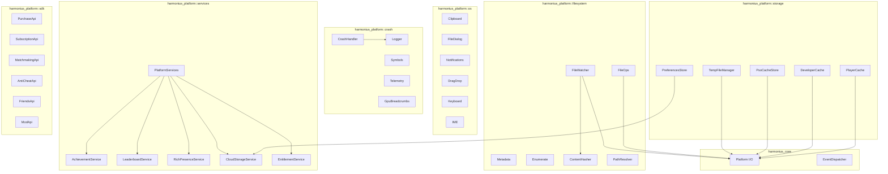
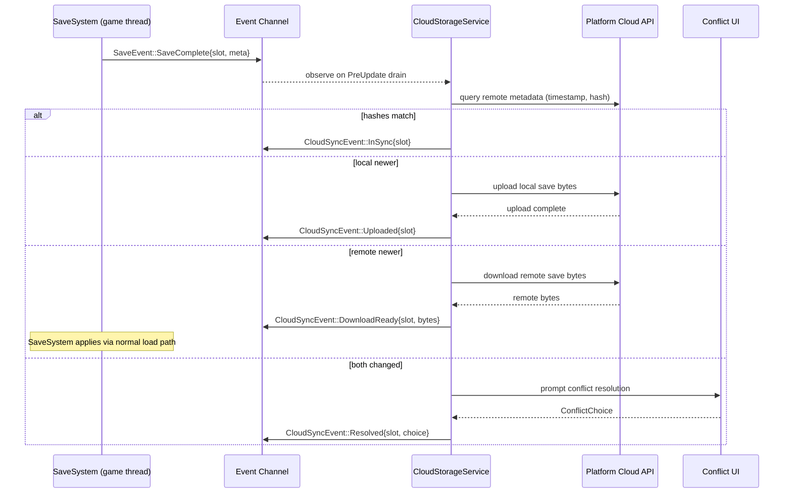
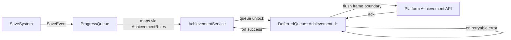
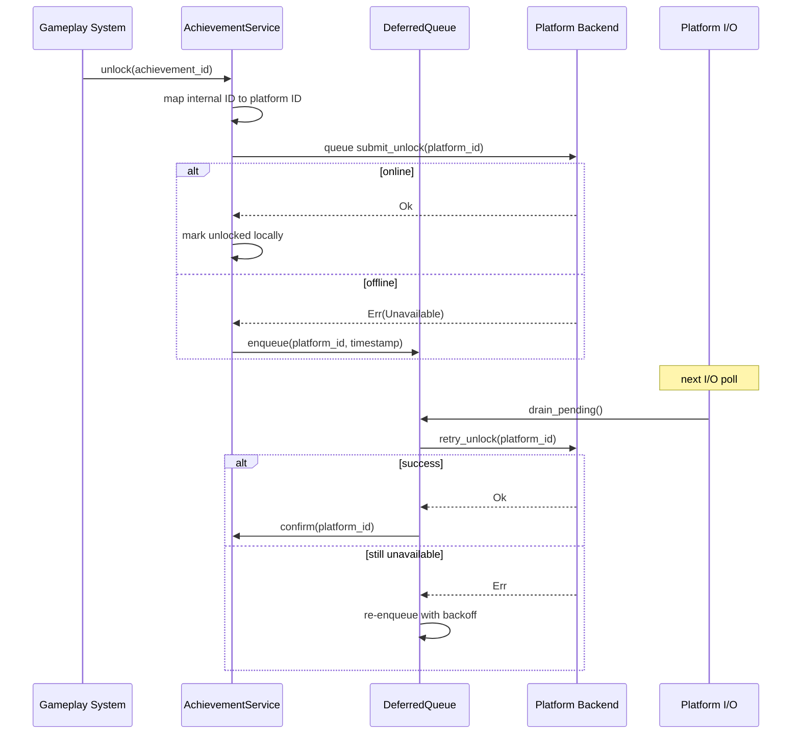
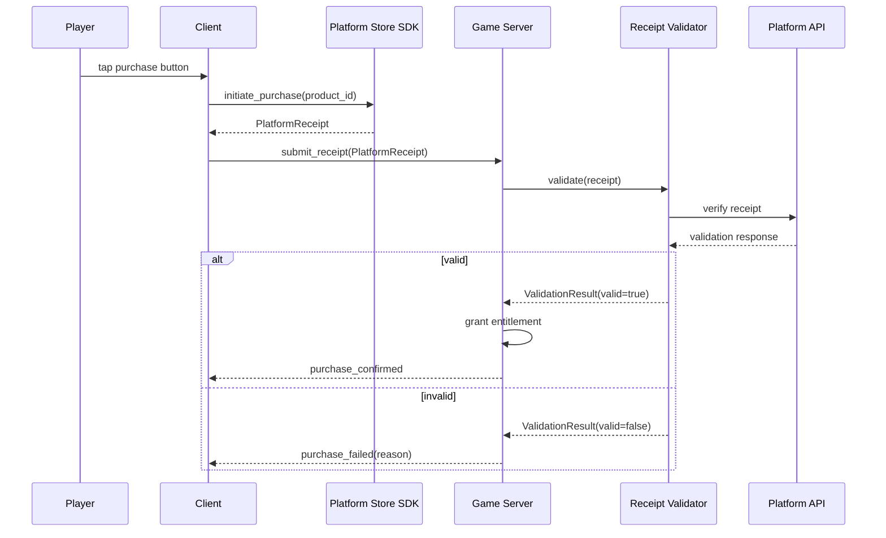
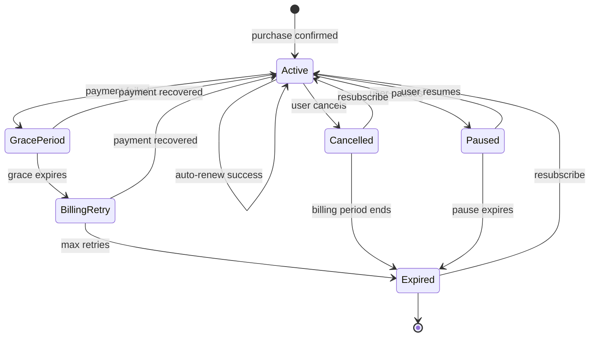

# Platform Services Design

## Requirements Trace

> **Canonical sources:** [features/](../../features/), [requirements/](../../requirements/),
> [user-stories/](../../user-stories/).

### OS Integration (F-14.2 / R-14.2)

| Feature  | Requirement |
|----------|-------------|
| F-14.2.1 | R-14.2.1    |
| F-14.2.2 | R-14.2.2    |
| F-14.2.3 | R-14.2.3    |
| F-14.2.4 | R-14.2.4    |
| F-14.2.5 | R-14.2.5    |
| F-14.2.6 | R-14.2.6    |

1. **F-14.2.1** -- Clipboard read/write for text and images
2. **F-14.2.2** -- Native file/folder picker dialogs
3. **F-14.2.3** -- Toast notifications and system tray icons
4. **F-14.2.4** -- Drag-and-drop with MIME/extension validation
5. **F-14.2.5** -- Keyboard layout detection and dead keys
6. **F-14.2.6** -- IME integration for CJK text entry

### Crash Reporting and Diagnostics (F-14.4 / R-14.4)

| Feature  | Requirement |
|----------|-------------|
| F-14.4.1 | R-14.4.1    |
| F-14.4.2 | R-14.4.2    |
| F-14.4.3 | R-14.4.3    |
| F-14.4.4 | R-14.4.4    |
| F-14.4.5 | R-14.4.5    |
| F-14.4.6 | R-14.4.6    |

1. **F-14.4.1** -- Crash handler with out-of-process minidump
2. **F-14.4.2** -- Debug symbol upload and server symbolication
3. **F-14.4.3** -- Crash aggregation by stack signature
4. **F-14.4.4** -- Structured logging with lock-free ring buffer
5. **F-14.4.5** -- Lock-free per-thread performance counters
6. **F-14.4.6** -- GPU crash breadcrumbs per render pass

### Platform Services (F-14.5 / R-14.5)

| Feature   | Requirement | User Story           |
|-----------|-------------|----------------------|
| F-14.5.1  | R-14.5.1    | US-14.5.1, 7, 8, 13 |
| F-14.5.2  | R-14.5.2    | US-14.5.2, 15       |
| F-14.5.3  | R-14.5.3    | US-14.5.3           |
| F-14.5.4  | R-14.5.4    | US-14.5.4, 16       |
| F-14.5.5  | R-14.5.5    | US-14.5.5, 12, 17   |
| F-14.5.6  | R-14.5.6    | US-14.5.6, 11       |
| F-14.5.7  | R-14.5.7    | US-14.5.10, 14      |

1. **F-14.5.1** -- Cross-platform achievements with deferred unlock
2. **F-14.5.2** -- Leaderboards with batching and rate-limit caching
3. **F-14.5.3** -- Rich presence throttled to 1 update / 15 s
4. **F-14.5.4** -- Platform voice/party bridge with Vivox fallback
5. **F-14.5.5** -- Cloud storage with conflict resolution dialog
6. **F-14.5.6** -- Entitlement/DLC/subscription verification
7. **F-14.5.7** -- Console certification compliance

### Storage (F-14.5.8--F-14.5.12)

| Feature   | Requirement | User Story           |
|-----------|-------------|----------------------|
| F-14.5.8  | R-14.5.8    | US-14.5.17, 18, 19  |
| F-14.5.9  | R-14.5.9    | US-14.5.20, 21      |
| F-14.5.10 | R-14.5.10   | US-14.5.22, 23      |
| F-14.5.11 | R-14.5.11   | US-14.5.24, 25, 26  |
| F-14.5.12 | R-14.5.12   | US-14.5.27, 28      |

1. **F-14.5.8** -- User prefs: TOML, atomic write, cloud sync
2. **F-14.5.9** -- Player cache: LRU, 10 GB default
3. **F-14.5.10** -- Developer cache: BLAKE3 keys, 3-tier
4. **F-14.5.11** -- PSO cache: GPU+driver versioned, < 1 ms
5. **F-14.5.12** -- Temp file manager: RAII, orphan cleanup

### Filesystem (F-14.6 / R-14.6)

| Feature  | Requirement |
|----------|-------------|
| F-14.6.1 | R-14.6.1    |
| F-14.6.2 | R-14.6.2    |
| F-14.6.3 | R-14.6.3    |
| F-14.6.4 | R-14.6.4    |
| F-14.6.5 | R-14.6.5    |
| F-14.6.6 | R-14.6.6    |
| F-14.6.7 | R-14.6.7    |

1. **F-14.6.1** -- Non-blocking file I/O via platform-native backends
2. **F-14.6.2** -- Non-blocking create/delete with batch unlink
3. **F-14.6.3** -- Non-blocking metadata and batch stat
4. **F-14.6.4** -- Directory enumeration with depth and glob
5. **F-14.6.5** -- File watching with debounce
6. **F-14.6.6** -- BLAKE3 content hash false-positive filter
7. **F-14.6.7** -- Canonical path resolution cross-platform

### SDK Integration (F-14.8 / R-14.8)

| Feature  | Requirement          | User Story          |
|----------|----------------------|---------------------|
| F-14.8.1 | R-14.8.1, R-14.8.2  | US-14.8.1, 2, 3    |
| F-14.8.2 | R-14.8.3, R-14.8.4  | US-14.8.8, 9, 12   |
| F-14.8.3 | R-14.8.5, R-14.8.6  | US-14.8.4, 5, 6, 7 |
| F-14.8.4 | R-14.8.7, R-14.8.8  | US-14.8.10, 11     |
| F-14.8.5 | R-14.8.9, R-14.8.10 | US-14.8.10         |

1. **F-14.8.1** -- Server-side console build service
2. **F-14.8.2** -- Proprietary SDK isolation
3. **F-14.8.3** -- Shared build server
4. **F-14.8.4** -- Remote console deployment
5. **F-14.8.5** -- Console build artifacts

## Overview

Consolidates OS integration, crash reporting, filesystem, platform services, storage, and SDK
integration. All share `harmonius_platform` and overlapping F-14.5.x features. All use static
dispatch (`cfg`-gated). No `Arc`, `Rc`, `Cell`, `RefCell`.

All user-facing platform service APIs are **synchronous**. Kernel-level non-blocking I/O is an
invisible implementation detail handled by platform-native backends (io_uring on Linux, IOCP on
Windows, GCD dispatch_io on macOS); no Rust `async`, no `await`, no `Future`. Main-thread-only OS
calls are cached as read-only ECS resources (`Res<ClipboardState>`, `Res<PowerState>`, etc.). Crash
reporting and telemetry are detailed in [crash-reporting.md](crash-reporting.md) and
[telemetry.md](telemetry.md); this document owns only the wiring between them and the ECS.

- **OS integration** -- clipboard, file dialogs, notifications, drag-drop, keyboard, IME
- **Crash reporting** -- see [crash-reporting.md](crash-reporting.md)
- **Telemetry** -- see [telemetry.md](telemetry.md)
- **Filesystem** -- non-blocking I/O via platform-native backends (io_uring / IOCP / GCD); no
  `std::fs` anywhere
- **Platform services** -- achievements, leaderboards, presence, cloud, entitlements, auth
- **Storage** -- preferences (TOML), player cache (LRU), dev cache (BLAKE3), PSO cache, temp files
- **SDK integration** -- IAP, subscriptions, matchmaking, anti-cheat, friends, mods, account linking

### Thread Affinity

Every API documents which thread it runs on. Main-thread-only APIs send requests via channel; the
main thread executes them.

| Affinity | APIs |
|----------|------|
| Main thread only | `Clipboard`, `FileDialog`, `Notifications` |
| Main thread only | `DragDrop`, `IME`, `CrashHandler` |
| Any thread | `PerfCounters`, `Logger`, `ContentHasher` |
| Any thread | `CanonicalPath`, `PlatformPaths` |
| Main thread | `AsyncFile`, `FileWatcher`, `PlayerCache` |
| Main thread | `DeveloperCache`, `PsoCacheStore` |
| Main thread | `TempFileManager`, `PreferencesStore` |

### ECS Resource Cache

OS state requiring main-thread access is cached each frame and exposed as read-only ECS resources:

| OS data | ECS resource |
|---------|-------------|
| Clipboard contents | `Res<ClipboardState>` |
| System locale | `Res<LocaleInfo>` |
| Battery/power | `Res<PowerState>` |
| Display info | `Res<DisplayInfo>` |
| IME state | `Res<ImeState>` |

## Architecture

### Module Boundaries



### Core Data Structures

```mermaid
classDiagram
    class PlatformServices {
        +achievements AchievementService
        +leaderboards LeaderboardService
        +presence RichPresenceService
        +cloud CloudStorageService
        +entitlements EntitlementService
        +auth AuthenticationService
        +profile UserProfileService
        +init() Result
        +shutdown() Result
    }

    class AchievementService {
        -defs Vec~AchievementDef~
        -progress HashMap
        -deferred DeferredQueue
        +unlock(id) Result
        +increment(id, amount) Result
        +state(id) AchievementProgress
        +sync() Result
        +flush_deferred() Result
    }

    class AchievementDef {
        +id AchievementId
        +name StringKey
        +description StringKey
        +icon AssetId
        +hidden bool
        +platform_ids PlatformIdMap
    }

    class AchievementProgress {
        +id AchievementId
        +current u32
        +target u32
        +state UnlockState
    }

    class UnlockState {
        <<enumeration>>
        Locked
        Unlocked
        Pending
    }

    class LeaderboardService {
        -cache HashMap
        -cache_ttl_secs u32
        -pending_submissions Vec
        +submit(id, score) Result
        +query(id, scope, offset, count) Option
        +flush_pending() Result
    }

    class LeaderboardSort {
        <<enumeration>>
        Ascending
        Descending
    }

    class LeaderboardScope {
        <<enumeration>>
        Global
        FriendsOnly
        AroundPlayer
    }

    class LeaderboardRow {
        +rank u32
        +player_name String
        +score i64
        +player_id Option~String~
    }

    class RichPresenceService {
        -current Option~PresenceState~
        -last_update u64
        -throttle_interval_ms u64
        +update(state) Result
        +clear() Result
        +current() PresenceState
    }

    class PresenceState {
        +activity String
        +zone Option~String~
        +party_size Option~u32~
        +party_max Option~u32~
    }

    class CloudStorageService {
        -quota_bytes u64
        -used_bytes u64
        +upload(key, data) Result
        +download(key) Result
        +check_conflict(key, data, ts) Result
        +remaining_quota() u64
    }

    class ConflictResult {
        <<enumeration>>
        NoConflict
        Conflict
    }

    class EntitlementService {
        -entitlements Vec~Entitlement~
        -last_check u64
        -poll_interval_secs u32
        +refresh() Result
        +is_owned(id) bool
        +is_subscription_active(id) bool
    }

    class EntitlementKind {
        <<enumeration>>
        BaseGame
        Expansion
        CosmeticDlc
        Subscription
    }

    class Entitlement {
        +id String
        +kind EntitlementKind
        +owned bool
        +expires Option~u64~
    }

    class AuthenticationService {
        -user Option~PlatformUser~
        -token Option~AuthToken~
        +authenticate() Result
        +current_user() PlatformUser
        +token() Result
    }

    class PlatformUser {
        +platform_id String
        +display_name String
        +avatar_url Option~String~
    }

    class AuthToken {
        +token String
        +expires_at u64
    }

    class UserProfileService {
        -local_profile Option~UserProfile~
        -friends_cache Vec~UserProfile~
        +fetch_local() Result
        +fetch_friends() Result
    }

    class UserProfile {
        +display_name String
        +avatar Option~AssetId~
        +online_status OnlineStatus
        +platform PlatformKind
    }

    class OnlineStatus {
        <<enumeration>>
        Online
        Away
        DoNotDisturb
        Offline
    }

    class PlatformKind {
        <<enumeration>>
        Steam
        Xbox
        PlayStation
        GameCenter
        Nintendo
        Apple
        GooglePlay
        Eos
    }

    class DeferredQueue {
        -pending Vec~DeferredEntry~
        -max_retries u32
        -base_backoff_ms u64
        +enqueue(item)
        +drain_ready(now) Vec
        +requeue(entry) bool
    }

    class DeferredEntry {
        +item T
        +enqueued_at u64
        +retry_count u32
        +next_retry_at u64
    }

    PlatformServices --> AchievementService
    PlatformServices --> LeaderboardService
    PlatformServices --> RichPresenceService
    PlatformServices --> CloudStorageService
    PlatformServices --> EntitlementService
    PlatformServices --> AuthenticationService
    PlatformServices --> UserProfileService
    AchievementService --> AchievementDef
    AchievementService --> AchievementProgress
    AchievementService --> DeferredQueue
    AchievementProgress --> UnlockState
    LeaderboardService --> LeaderboardRow
    LeaderboardService ..> LeaderboardSort
    LeaderboardService ..> LeaderboardScope
    RichPresenceService --> PresenceState
    CloudStorageService ..> ConflictResult
    EntitlementService --> Entitlement
    Entitlement --> EntitlementKind
    AuthenticationService --> PlatformUser
    AuthenticationService --> AuthToken
    UserProfileService --> UserProfile
    UserProfile --> OnlineStatus
    UserProfile --> PlatformKind
    DeferredQueue --> DeferredEntry
```



### OS, Crash, Filesystem, and Storage Types

```mermaid
classDiagram
    class Clipboard {
        +read_text() Result
        +write_text(text) Result
        +read_image() Result
        +write_image(image) Result
    }

    class ImageData {
        +width u32
        +height u32
        +pixels Vec~u8~
    }

    class FileDialog {
        +open_file(config) Result
        +save_file(config) Result
        +pick_folder(title, dir) Result
    }

    class Notifications {
        +show_notification(config) Result
        +create_tray_icon(tooltip, items) Result
    }

    class NotificationUrgency {
        <<enumeration>>
        Low
        Normal
        Critical
    }

    class DragDropHandler {
        +register(window, filter) Result
        +poll_event() Option~DragEvent~
        +respond(response)
    }

    class DragEvent {
        <<enumeration>>
        Enter
        Over
        Drop
        Leave
    }

    class DragResponse {
        <<enumeration>>
        Accept
        Reject
    }

    class Keyboard {
        +active_layout() KeyboardLayout
        +translate_key(scancode) DeadKeyResult
        +poll_layout_change() Option
    }

    class DeadKeyResult {
        <<enumeration>>
        Char
        Pending
        Composed
        Cancelled
    }

    class ImeHandler {
        +attach(window) Result
        +set_position(pos)
        +set_enabled(enabled)
        +poll_event() Option~ImeEvent~
    }

    class ImeEvent {
        <<enumeration>>
        Composition
        Commit
        CandidateList
        Cancel
    }

    class CrashHandler {
        +install(config) Result
        +set_metadata(key, value)
        +attach_gpu_breadcrumbs(bc)
        +pending_dumps() Vec
    }

    class Logger {
        +new(filter, sinks, cap) Logger
        +log(record)
        +flush()
        +set_filter(filter)
    }

    class Severity {
        <<enumeration>>
        Trace
        Debug
        Info
        Warn
        Error
        Fatal
    }

    class PerfCounters {
        +increment(name)
        +increment_by(name, amount)
        +gauge(name, value)
        +flush() Snapshot
    }

    class GpuBreadcrumbs {
        +new(device) Result
        +begin_pass(pass_id)
        +end_pass(pass_id)
        +read_last_completed() Option
    }

    class AsyncFile {
        +open(path, flags) Result
        +read(buf, offset) Result
        +write(data, offset) Result
        +flush() Result
        +close() Result
    }

    class OpenFlags {
        +read bool
        +write bool
        +create bool
        +truncate bool
        +append bool
    }

    class FileWatcher {
        +new(debounce_ms) Result
        +watch(path, recursive) Result
        +unwatch(id) Result
    }

    class FileEventKind {
        <<enumeration>>
        Created
        Modified
        Deleted
        Renamed
    }

    class ContentHasher {
        +hash_file(path) Result
        +has_content_changed(path, hash) Result
        +cache_hash(path, hash)
    }

    class CanonicalPath {
        +resolve(path) Result
        +as_str() str
        +file_name() Option
        +parent() Option
        +join(component) Result
    }

    class PreferencesStore {
        -values HashMap
        -dirty bool
        +load(path, cloud) Result
        +get(key) PrefValue
        +set(key, value)
        +save(cloud) Result
    }

    class PrefValue {
        <<enumeration>>
        Bool
        Int
        Float
        String
    }

    class PlayerCache {
        -root PathBuf
        -max_bytes u64
        +put(key, cat, data) Result
        +get(key) Result
        +evict_to_budget() Result
        +stats() CacheStats
    }

    class CacheCategory {
        <<enumeration>>
        AssetBundle
        DlcContent
        ModPackage
        StreamingData
        GenerationOutput
    }

    class DeveloperCache {
        -root PathBuf
        -shared_url Option~String~
        +lookup(hash, cat) Result
        +store(hash, cat, data) Result
        +hash(data) ContentHash
    }

    class CacheHitTier {
        <<enumeration>>
        Local
        SharedNetwork
        Miss
    }

    class PsoCacheStore {
        -gpu_driver GpuDriverKey
        -entries HashMap
        +load_all() Result
        +store(key, data) Result
        +get(key) Option~bytes~
    }

    class TempFileManager {
        -root PathBuf
        -max_bytes u64
        -cleanup_list Vec
        +init(root, max) Result
        +allocate(name) Result
        +cleanup_orphans() Result
    }

    Clipboard --> ImageData
    Notifications --> NotificationUrgency
    DragDropHandler --> DragEvent
    DragDropHandler --> DragResponse
    Keyboard --> DeadKeyResult
    ImeHandler --> ImeEvent
    CrashHandler --> GpuBreadcrumbs
    CrashHandler --> Logger
    Logger --> Severity
    AsyncFile --> OpenFlags
    FileWatcher --> ContentHasher
    FileWatcher --> FileEventKind
    PreferencesStore --> PrefValue
    PlayerCache --> CacheCategory
    DeveloperCache ..> CacheHitTier
```



### SDK Integration Types

```mermaid
classDiagram
    class PurchaseApi {
        +query_products(ids) Result
        +initiate_purchase(id) Result
        +restore_purchases() Result
        +validate_receipt(receipt) Result
    }

    class PlatformReceipt {
        +transaction_id TransactionId
        +product_id ProductId
        +platform PlatformKind
        +receipt_data Vec~u8~
        +timestamp u64
    }

    class ValidationResult {
        +valid bool
        +transaction_id TransactionId
        +product_id ProductId
        +is_duplicate bool
    }

    class ReceiptValidator {
        +validate(receipt) Result
        +validate_with_retry(receipt, max) Result
    }

    class SubscriptionApi {
        +check_status(id) Result
        +manage_renewal(id, action) Result
        +handle_grace_period(id) Result
    }

    class SubState {
        <<enumeration>>
        Active
        GracePeriod
        BillingRetry
        Expired
        Cancelled
        Revoked
        Paused
    }

    class RenewalAction {
        <<enumeration>>
        EnableAutoRenew
        DisableAutoRenew
        UpgradeTier
        DowngradeTier
    }

    class MatchmakingApi {
        +create_lobby(config) Result
        +find_match(criteria) Result
        +join_lobby(id) Result
    }

    class VoiceChatApi {
        +start_session(channel) Result
        +stop_session() Result
        +mute_player(id, muted) Result
        +set_spatial_position(pos) Result
    }

    class AntiCheatApi {
        +initialize() Result
        +report_player(id, reason) Result
        +check_ban_status(id) Result
    }

    class FriendsApi {
        +list_friends() Result
        +send_invite(id, context) Result
        +set_rich_presence(state) Result
    }

    class ModApi {
        +upload(manifest) Result
        +download(id) Result
        +subscribe(id) Result
        +rate(id, score) Result
    }

    class AccountLinker {
        +link(engine_id, platform, token) Result
        +unlink(engine_id, platform) Result
        +list_linked(engine_id) Result
        +merge_entitlements(engine_id) Result
    }

    class LinkedAccount {
        +engine_account_id AccountId
        +platform PlatformKind
        +platform_user_id String
        +linked_at u64
    }

    PurchaseApi --> PlatformReceipt
    PurchaseApi --> ValidationResult
    PurchaseApi --> ReceiptValidator
    SubscriptionApi --> SubState
    SubscriptionApi --> RenewalAction
    AccountLinker --> LinkedAccount
```



## API Design

### OS Integration

#### Clipboard (F-14.2.1 / R-14.2.1)

```rust
/// RGBA image data for clipboard operations.
#[derive(Clone, Debug, Codegen)]
pub struct ImageData {
    pub width: u32,
    pub height: u32,
    pub pixels: Vec<u8>,
}

/// Cached clipboard state exposed as ECS resource.
/// Main thread updates each frame via OS API.
/// **Thread affinity: main thread only.**
#[derive(Clone, Debug, Codegen)]
pub struct ClipboardState {
    pub text: Option<String>,
    pub image: Option<ImageData>,
}

/// Platform clipboard access. Reads from cached
/// `Res<ClipboardState>`. Writes are queued and
/// executed on the main thread next frame.
/// Uses cfg-gated platform backends.
/// **Thread affinity: main thread only.**
#[derive(Codegen)]
pub struct Clipboard { /* platform fields */ }

impl Clipboard {
    pub fn new(window: &Window) -> Self;

    /// Queue a text write. Executed on main thread.
    pub fn set_text(
        &mut self,
        text: &str,
    ) -> Result<(), OsError>;

    /// Queue an image write. Executed on main thread.
    pub fn set_image(
        &mut self,
        image: &ImageData,
    ) -> Result<(), OsError>;
}
```

#### File Dialogs (F-14.2.2 / R-14.2.2)

```rust
#[derive(Clone, Debug, Codegen)]
pub struct FileFilter {
    pub label: &'static str,
    pub extensions: &'static [&'static str],
}

#[derive(Clone, Debug, Codegen)]
pub struct FileDialogConfig {
    pub title: &'static str,
    pub initial_dir: Option<CanonicalPath>,
    pub filters: Vec<FileFilter>,
}

/// Opaque handle returned by dialog requests.
/// Poll via `FileDialog::result()` each frame.
#[derive(Clone, Copy, Debug, PartialEq, Eq, Codegen)]
pub struct DialogHandle(pub(crate) u32);

/// Dialogs run on a separate OS thread so the game
/// loop continues rendering (R-14.2.2). Callers
/// submit a request and poll the handle for the
/// result. All methods are synchronous.
/// **Thread affinity: main thread only.**
#[derive(Codegen)]
pub struct FileDialog { /* platform fields */ }

impl FileDialog {
    pub fn new() -> Self;

    /// Request an open-file dialog. Returns a handle
    /// to poll for the result.
    pub fn request_open(
        &mut self,
        config: &FileDialogConfig,
    ) -> DialogHandle;

    /// Request a save-file dialog.
    pub fn request_save(
        &mut self,
        config: &FileDialogConfig,
    ) -> DialogHandle;

    /// Request a folder picker.
    pub fn request_pick_folder(
        &mut self,
        title: &str,
        initial_dir: Option<&CanonicalPath>,
    ) -> DialogHandle;

    /// Poll for a dialog result. Returns `None`
    /// while the dialog is still open.
    pub fn result(
        &self,
        handle: DialogHandle,
    ) -> Option<Result<Option<CanonicalPath>, OsError>>;
}
```

#### Notifications (F-14.2.3 / R-14.2.3)

```rust
#[derive(Clone, Copy, Debug, PartialEq, Eq, Codegen)]
pub enum NotificationUrgency { Low, Normal, Critical }

#[derive(Clone, Debug, Codegen)]
pub struct NotificationConfig<'a> {
    pub title: &'a str,
    pub body: &'a str,
    pub urgency: NotificationUrgency,
    pub icon: Option<&'a str>,
}

#[derive(Clone, Debug, Codegen)]
pub struct TrayMenuItem {
    pub label: String,
    pub id: u32,
    pub enabled: bool,
}

/// **Thread affinity: main thread only.**
#[derive(Codegen)]
pub struct Notifications { /* platform fields */ }

impl Notifications {
    pub fn new(window: &Window) -> Self;
    pub fn show_notification(
        &self, config: &NotificationConfig,
    ) -> Result<(), OsError>;
    pub fn create_tray_icon(
        &self, tooltip: &str,
        menu_items: &[TrayMenuItem],
    ) -> Result<TrayIconHandle, OsError>;
    pub fn remove_tray_icon(
        &self, handle: TrayIconHandle,
    ) -> Result<(), OsError>;
}
```

#### Drag and Drop (F-14.2.4 / R-14.2.4)

```rust
#[derive(Debug, Codegen)]
pub enum DragEvent {
    Enter {
        position: (f32, f32),
        mime_types: Vec<String>,
    },
    Over { position: (f32, f32) },
    Drop {
        position: (f32, f32),
        paths: Vec<CanonicalPath>,
        data: Option<Vec<u8>>,
    },
    Leave,
}

#[derive(Debug, Clone, Copy, Codegen)]
pub enum DragResponse {
    Accept,
    Reject,
}

#[derive(Clone, Debug, Codegen)]
pub struct MimeFilter {
    pub mime_types: Vec<String>,
    pub extensions: Vec<String>,
}

/// **Thread affinity: main thread only.**
#[derive(Codegen)]
pub struct DragDropHandler { /* platform fields */ }

impl DragDropHandler {
    pub fn register(
        window: &Window,
        filter: MimeFilter,
    ) -> Result<Self, OsError>;

    pub fn poll_event(&self) -> Option<DragEvent>;
    pub fn respond(&self, response: DragResponse);
    pub fn unregister(self) -> Result<(), OsError>;
}
```

#### Keyboard Layouts (F-14.2.5 / R-14.2.5)

```rust
#[derive(Clone, Debug, PartialEq, Eq, Codegen)]
pub struct KeyboardLayout {
    pub name: String,
    pub id: KeyboardLayoutId,
}

#[derive(Debug, Codegen)]
pub enum DeadKeyResult {
    Char(char),
    Pending,
    Composed(char),
    Cancelled { dead_key: char, follow: char },
}

/// **Thread affinity: main thread only.**
#[derive(Codegen)]
pub struct Keyboard { /* platform fields */ }

impl Keyboard {
    pub fn new() -> Self;
    pub fn active_layout(&self) -> KeyboardLayout;

    pub fn translate_key(
        &mut self,
        scancode: u32,
    ) -> DeadKeyResult;

    pub fn poll_layout_change(
        &mut self,
    ) -> Option<KeyboardLayout>;
}
```

#### IME (F-14.2.6 / R-14.2.6)

```rust
#[derive(Debug, Codegen)]
pub enum ImeEvent {
    Composition { text: String, cursor: usize },
    Commit { text: String },
    CandidateList {
        candidates: Vec<String>,
        selected: usize,
        page: usize,
        page_count: usize,
    },
    Cancel,
}

#[derive(Clone, Debug, Codegen)]
pub struct ImePosition {
    pub x: f32,
    pub y: f32,
    pub line_height: f32,
}

/// **Thread affinity: main thread only.**
#[derive(Codegen)]
pub struct ImeHandler { /* platform fields */ }

impl ImeHandler {
    pub fn attach(
        window: &Window,
    ) -> Result<Self, OsError>;

    pub fn set_position(&self, pos: &ImePosition);
    pub fn set_enabled(&self, enabled: bool);
    pub fn poll_event(&self) -> Option<ImeEvent>;
    pub fn detach(self) -> Result<(), OsError>;
}
```

### Crash Reporting

#### Crash Handler (F-14.4.1 / R-14.4.1)

```rust
#[derive(Clone, Debug, Codegen)]
pub struct CrashHandlerConfig {
    pub crash_dir: CanonicalPath,
    pub oop_handler_path: CanonicalPath,
    pub max_retained_dumps: u32,
}

/// **Thread affinity: main thread only.**
#[derive(Codegen)]
pub struct CrashHandler { /* platform fields */ }

impl CrashHandler {
    pub fn install(
        config: CrashHandlerConfig,
    ) -> Result<Self, CrashError>;

    pub fn set_metadata(&self, key: &str, value: &str);

    pub fn attach_gpu_breadcrumbs(
        &self,
        breadcrumbs: &GpuBreadcrumbs,
    );

    pub fn pending_dumps(
        &self,
    ) -> Vec<CanonicalPath>;

    /// Queues dump deletion. Executed by platform
    /// I/O layer (io_uring / IOCP / GCD).
    pub fn delete_dump(
        &mut self,
        path: &CanonicalPath,
    ) -> Result<(), CrashError>;
}
```

#### Symbol Upload (F-14.4.2 / R-14.4.2)

```rust
#[derive(Clone, Debug, PartialEq, Eq, Codegen)]
pub enum SymbolFormat {
    Pdb { guid: String, age: u32 },
    Dsym { uuid: String },
    Dwarf { build_id: String },
}

#[derive(Codegen)]
pub struct SymbolUploader { /* ... */ }

impl SymbolUploader {
    pub fn new(endpoint: &str) -> Self;

    pub fn extract_build_id(
        binary_path: &CanonicalPath,
    ) -> Result<SymbolFormat, CrashError>;

    /// Queues symbol upload. Executed by platform
    /// I/O layer (io_uring / IOCP / GCD).
    /// **Thread affinity: Main thread.**
    pub fn queue_upload(
        &mut self,
        binary_path: &CanonicalPath,
        symbol_path: &CanonicalPath,
    ) -> Result<(), CrashError>;
}
```

#### Structured Logging (F-14.4.4 / R-14.4.4)

```rust
#[derive(
    Clone, Copy, Debug, PartialEq, Eq,
    PartialOrd, Ord, Codegen,
)]
pub enum Severity {
    Trace, Debug, Info, Warn, Error, Fatal,
}

#[derive(Clone, Debug, PartialEq, Eq, Hash, Codegen)]
pub struct Channel(pub &'static str);

#[derive(Clone, Debug, Codegen)]
pub struct LogRecord<'a> {
    pub timestamp: u64,
    pub severity: Severity,
    pub channel: &'a Channel,
    pub message: &'a str,
    pub fields: &'a [(&'a str, &'a str)],
}

#[derive(Clone, Debug, Codegen)]
pub struct LogFilter {
    pub channel_levels: Vec<(Channel, Severity)>,
    pub default_level: Severity,
}

/// Enum dispatch for log sinks. No trait objects
/// on the hot path (< 1 us per emit).
#[derive(Clone, Debug, Codegen)]
pub enum LogSink {
    File { path: CanonicalPath },
    Platform,
    RingBuffer { capacity: usize },
}

/// Log emission never blocks > 1 us (R-14.4.4).
/// Records go to a lock-free ring buffer.
/// **Thread affinity: any thread.**
#[derive(Codegen)]
pub struct Logger { /* ... */ }

impl Logger {
    pub fn new(
        filter: LogFilter,
        sinks: Vec<LogSink>,
        ring_buffer_capacity: usize,
    ) -> Self;

    pub fn log(&self, record: &LogRecord);
    pub fn flush(&self);
    pub fn set_filter(&self, filter: LogFilter);
}
```

#### Performance Counters (F-14.4.5 / R-14.4.5)

```rust
#[derive(Clone, Debug, PartialEq, Eq, Hash, Codegen)]
pub struct CounterName(pub &'static str);

#[derive(Clone, Debug, Codegen)]
pub struct Snapshot {
    pub timestamp: u64,
    pub values: Vec<(CounterName, f64)>,
}

/// Lock-free per-thread counters.
/// Increment latency < 50 ns (R-14.4.5).
/// **Thread affinity: any thread.**
#[derive(Codegen)]
pub struct PerfCounters { /* ... */ }

impl PerfCounters {
    pub fn new() -> Self;
    pub fn increment(&self, name: &CounterName);
    pub fn increment_by(
        &self, name: &CounterName, amount: f64,
    );
    pub fn gauge(
        &self, name: &CounterName, value: f64,
    );
    pub fn flush(&self) -> Snapshot;
}
```

#### GPU Breadcrumbs (F-14.4.6 / R-14.4.6)

```rust
#[derive(Clone, Copy, Debug, PartialEq, Eq, Codegen)]
pub struct PassId(pub u32);

/// Writes incrementing markers into a GPU-visible
/// buffer per render pass. On device-lost, the last
/// marker identifies the faulting pass (R-14.4.6).
#[derive(Codegen)]
pub struct GpuBreadcrumbs { /* ... */ }

impl GpuBreadcrumbs {
    pub fn new(
        device: &GpuDevice,
    ) -> Result<Self, CrashError>;

    pub fn begin_pass(&self, pass_id: PassId);
    pub fn end_pass(&self, pass_id: PassId);

    pub fn read_last_completed(
        &self,
    ) -> Option<PassId>;

    pub fn serialize_for_crash_report(
        &self,
    ) -> Vec<u8>;
}
```

### Filesystem

#### Async File Operations (F-14.6.1 / R-14.6.1)

```rust
#[derive(Clone, Copy, Debug, Codegen)]
pub struct OpenFlags {
    pub read: bool,
    pub write: bool,
    pub create: bool,
    pub truncate: bool,
    pub append: bool,
}

impl OpenFlags {
    pub fn read_only() -> Self;
    pub fn write_only() -> Self;
    pub fn read_write() -> Self;
    pub fn create_new() -> Self;
}

/// No Rust stdlib file I/O (R-14.6.1). Backends:
/// io_uring on Linux, IOCP on Windows, GCD
/// dispatch_io on macOS. Async is an internal
/// implementation detail; callers never see futures.
/// **Thread affinity: Main thread.**
#[derive(Codegen)]
pub struct AsyncFile { /* platform fields */ }

impl AsyncFile {
    pub fn open(
        path: &CanonicalPath, flags: OpenFlags,
    ) -> Result<Self, FsError>;

    /// Submit read; returns request ID. Completion
    /// arrives via crossbeam-channel as a job.
    pub fn read(
        &self, buf: &mut [u8], offset: u64,
    ) -> IoRequestId;

    /// Submit read-to-end; returns request ID.
    pub fn read_to_end(&self) -> IoRequestId;

    /// Submit write; returns request ID.
    pub fn write(
        &self, data: &[u8], offset: u64,
    ) -> IoRequestId;

    /// Submit flush; returns request ID.
    pub fn flush(&self) -> IoRequestId;

    /// Submit close; returns request ID.
    pub fn close(self) -> IoRequestId;
}
```

#### File Create, Delete, Metadata (F-14.6.2--3)

All metadata operations use platform-native async alternatives (io_uring `IORING_OP_STATX` on Linux,
IOCP overlapped on Windows, GCD dispatch_io on macOS). No blocking `stat()` calls.

```rust
/// **Thread affinity: Main thread.**
pub fn create_dir_all(
    path: &CanonicalPath,
) -> IoRequestId;

pub fn delete_file(
    path: &CanonicalPath,
) -> IoRequestId;

pub fn delete_batch(
    paths: &[CanonicalPath],
) -> Vec<IoRequestId>;

#[derive(Clone, Copy, Debug, PartialEq, Eq, Codegen)]
pub enum FileType { File, Directory, Symlink }

#[derive(Clone, Debug, Codegen)]
pub struct FileMetadata {
    pub file_type: FileType,
    pub size: u64,
    pub modified: u64,
    pub created: Option<u64>,
    pub read_only: bool,
}

pub fn stat(
    path: &CanonicalPath,
) -> IoRequestId;

pub fn stat_batch(
    paths: &[CanonicalPath],
) -> Vec<IoRequestId>;
```

#### Directory Enumeration (F-14.6.4 / R-14.6.4)

```rust
#[derive(Clone, Debug, Codegen)]
pub struct DirEntry {
    pub name: String,
    pub path: CanonicalPath,
    pub file_type: FileType,
    pub size: u64,
}

#[derive(Clone, Debug, Codegen)]
pub struct EnumerateOptions {
    pub max_depth: u32,
    pub glob: Option<String>,
}

pub fn enumerate_dir(
    path: &CanonicalPath,
    options: &EnumerateOptions,
) -> IoRequestId;
```

#### File Watcher (F-14.6.5 / R-14.6.5)

```rust
#[derive(Clone, Debug, PartialEq, Eq, Codegen)]
pub enum FileEventKind {
    Created,
    Modified,
    Deleted,
    Renamed { from: CanonicalPath },
}

#[derive(Clone, Debug, Codegen)]
pub struct FileEvent {
    pub path: CanonicalPath,
    pub kind: FileEventKind,
}

#[derive(
    Clone, Copy, Debug, PartialEq, Eq, Hash, Codegen,
)]
pub struct WatchId(pub(crate) u32);

#[derive(Codegen)]
pub struct FileWatcher { /* ... */ }

impl FileWatcher {
    pub fn new(
        debounce_ms: u32,
    ) -> Result<Self, FsError>;

    pub fn watch(
        &mut self,
        path: &CanonicalPath,
        recursive: bool,
    ) -> Result<(WatchId, FileEventStream), FsError>;

    pub fn unwatch(
        &mut self, id: WatchId,
    ) -> Result<(), FsError>;
}
```

#### Content Hash (F-14.6.6 / R-14.6.6)

```rust
#[derive(
    Clone, Copy, Debug, PartialEq, Eq, Hash, Codegen,
)]
pub struct Blake3Hash(pub [u8; 32]);

#[derive(Codegen)]
pub struct ContentHasher { /* ... */ }

impl ContentHasher {
    pub fn new() -> Self;

    /// Submit hash computation; returns request ID.
    pub fn hash_file(
        &self, path: &CanonicalPath,
    ) -> IoRequestId;

    /// Submit content-change check; returns request
    /// ID.
    pub fn has_content_changed(
        &self,
        path: &CanonicalPath,
        old_hash: &Blake3Hash,
    ) -> IoRequestId;

    pub fn cache_hash(
        &mut self,
        path: CanonicalPath,
        hash: Blake3Hash,
    );
}
```

#### Canonical Path (F-14.6.7 / R-14.6.7)

```rust
#[derive(Clone, Debug, PartialEq, Eq, Hash, Codegen)]
pub struct CanonicalPath { /* ... */ }

impl CanonicalPath {
    pub fn resolve(
        path: &str,
    ) -> Result<Self, FsError>;
    pub fn as_str(&self) -> &str;
    pub fn file_name(&self) -> Option<&str>;
    pub fn parent(&self) -> Option<CanonicalPath>;
    pub fn join(
        &self, component: &str,
    ) -> Result<Self, FsError>;
    pub fn extension(&self) -> Option<&str>;
}
```

### Platform Services

#### Service Facade (F-14.5.1--7)

```rust
/// All methods are synchronous. Async I/O is an
/// invisible implementation detail handled by
/// platform-native backends (io_uring / IOCP /
/// GCD dispatch_io).
/// **Thread affinity: Main thread (init/shutdown);
/// individual services specify their own.**
#[derive(Codegen)]
pub struct PlatformServices {
    pub achievements: AchievementService,
    pub leaderboards: LeaderboardService,
    pub presence: RichPresenceService,
    pub cloud: CloudStorageService,
    pub entitlements: EntitlementService,
    pub auth: AuthenticationService,
    pub profile: UserProfileService,
}

impl PlatformServices {
    pub fn init() -> Result<Self, PlatformError>;

    pub fn shutdown(
        &mut self,
    ) -> Result<(), PlatformError>;
}
```

#### Achievement Service (F-14.5.1 / R-14.5.1)

```rust
#[derive(Clone, Debug, PartialEq, Eq, Hash, Codegen)]
pub struct AchievementId(pub String);

#[derive(Clone, Debug, Codegen)]
pub struct AchievementDef {
    pub id: AchievementId,
    pub name: StringKey,
    pub description: StringKey,
    pub icon: AssetId,
    pub hidden: bool,
    pub platform_ids: PlatformIdMap,
}

#[derive(Clone, Copy, Debug, PartialEq, Eq, Codegen)]
pub enum UnlockState { Locked, Unlocked, Pending }

#[derive(Clone, Debug, Codegen)]
pub struct AchievementProgress {
    pub id: AchievementId,
    pub current: u32,
    pub target: u32,
    pub state: UnlockState,
}

#[derive(Codegen)]
pub struct AchievementService {
    defs: Vec<AchievementDef>,
    progress: HashMap<
        AchievementId, AchievementProgress,
    >,
    deferred: DeferredQueue<AchievementId>,
}

/// All methods are synchronous. Unlock and
/// increment queue requests; platform I/O flushes
/// them at frame boundary via non-blocking SDK.
/// **Thread affinity: any thread.**
impl AchievementService {
    /// Queues an unlock request.
    pub fn unlock(
        &mut self,
        id: &AchievementId,
    ) -> Result<(), AchievementError>;

    /// Queues an increment request.
    pub fn increment(
        &mut self,
        id: &AchievementId,
        amount: u32,
    ) -> Result<(), AchievementError>;

    pub fn state(
        &self, id: &AchievementId,
    ) -> Option<&AchievementProgress>;

    /// Queues a sync. Platform I/O executes it.
    pub fn sync(
        &mut self,
    ) -> Result<(), AchievementError>;

    /// Queues deferred retries. Platform I/O
    /// executes them.
    pub fn flush_deferred(
        &mut self,
    ) -> Result<u32, AchievementError>;
}
```

#### Leaderboard Service (F-14.5.2 / R-14.5.2)

```rust
#[derive(Clone, Debug, PartialEq, Eq, Hash, Codegen)]
pub struct LeaderboardId(pub String);

#[derive(Clone, Copy, Debug, PartialEq, Eq, Codegen)]
pub enum LeaderboardSort { Ascending, Descending }

#[derive(Clone, Copy, Debug, PartialEq, Eq, Codegen)]
pub enum LeaderboardScope {
    Global, FriendsOnly, AroundPlayer,
}

#[derive(Clone, Debug, Codegen)]
pub struct LeaderboardRow {
    pub rank: u32,
    pub player_name: String,
    pub score: i64,
    pub player_id: Option<String>,
}

#[derive(Codegen)]
pub struct LeaderboardService {
    cache: HashMap<
        (LeaderboardId, LeaderboardScope),
        LeaderboardResult,
    >,
    cache_ttl_secs: u32,
    pending_submissions: Vec<(LeaderboardId, i64)>,
}

/// All methods are synchronous. Submissions are
/// queued; queries return cached results.
/// **Thread affinity: any thread.**
impl LeaderboardService {
    /// Queues a score submission.
    pub fn submit(
        &mut self,
        id: &LeaderboardId,
        score: i64,
    ) -> Result<(), LeaderboardError>;

    /// Returns cached leaderboard data.
    pub fn query(
        &self,
        id: &LeaderboardId,
        scope: LeaderboardScope,
        offset: u32,
        count: u32,
    ) -> Option<&LeaderboardResult>;

    /// Queues pending submissions for flush.
    pub fn flush_pending(
        &mut self,
    ) -> Result<u32, LeaderboardError>;
}
```

#### Rich Presence (F-14.5.3 / R-14.5.3)

```rust
#[derive(Clone, Debug, Codegen)]
pub struct PresenceState {
    pub activity: String,
    pub zone: Option<String>,
    pub party_size: Option<u32>,
    pub party_max: Option<u32>,
    pub details: Option<String>,
}

#[derive(Codegen)]
pub struct RichPresenceService {
    current: Option<PresenceState>,
    last_update: u64,
    throttle_interval_ms: u64,
}

/// All methods are synchronous. Updates are
/// throttled and queued for platform I/O.
/// **Thread affinity: any thread.**
impl RichPresenceService {
    /// Queues a presence update (throttled).
    pub fn update(
        &mut self,
        state: PresenceState,
    ) -> Result<(), PresenceError>;

    /// Queues a presence clear.
    pub fn clear(
        &mut self,
    ) -> Result<(), PresenceError>;

    pub fn current(&self) -> Option<&PresenceState>;
}
```

#### Cloud Storage (F-14.5.5 / R-14.5.5)

```rust
#[derive(Clone, Debug, PartialEq, Eq, Hash, Codegen)]
pub struct CloudKey(pub String);

#[derive(Clone, Debug, Codegen)]
pub struct CloudMetadata {
    pub key: CloudKey,
    pub size_bytes: u64,
    pub timestamp: u64,
    pub checksum: u64,
}

#[derive(Clone, Debug, Codegen)]
pub enum ConflictResult {
    NoConflict(Vec<u8>),
    Conflict {
        local: Vec<u8>,
        local_timestamp: u64,
        cloud: Vec<u8>,
        cloud_timestamp: u64,
    },
}

#[derive(Codegen)]
pub struct CloudStorageService {
    quota_bytes: u64,
    used_bytes: u64,
}

/// All methods are synchronous. Upload/download
/// queue requests; platform I/O executes them.
/// **Thread affinity: Main thread.**
impl CloudStorageService {
    /// Queues an upload request.
    pub fn upload(
        &mut self, key: &CloudKey, data: &[u8],
    ) -> Result<(), CloudError>;

    /// Queues a download request.
    pub fn download(
        &mut self, key: &CloudKey,
    ) -> Result<(), CloudError>;

    /// Queues a conflict check.
    pub fn check_conflict(
        &mut self,
        key: &CloudKey,
        local_data: &[u8],
        local_timestamp: u64,
    ) -> Result<(), CloudError>;

    pub fn remaining_quota(&self) -> u64;
}
```

#### Save / Cloud Integration (moved from save-system.md)

The save system publishes `SaveEvent::SaveComplete { slot, meta }` when a save file is written to
local storage. Platform services observe those events and drive cloud upload, conflict detection,
and resolution. Save system code holds no platform SDK handles; all SDK interaction happens here.



```rust
/// Events emitted by the cloud sync integration
/// for save slots. SaveSystem observes these and
/// runs the normal load path on DownloadReady.
#[derive(Clone, Debug)]
pub enum CloudSyncEvent {
    Started { slot: SlotId },
    InSync { slot: SlotId },
    Uploaded { slot: SlotId },
    DownloadReady { slot: SlotId, bytes: Vec<u8> },
    Conflict {
        slot: SlotId,
        local: CloudMetadata,
        remote: CloudMetadata,
    },
    Resolved { slot: SlotId, choice: ConflictChoice },
    Failed { slot: SlotId, error: CloudError },
}

#[derive(Clone, Copy, Debug)]
pub enum ConflictChoice { KeepLocal, KeepRemote }

/// Cloud-sync target. Selected at runtime via
/// `cfg` + platform feature flags.
#[derive(Clone, Copy, Debug)]
pub enum CloudPlatform {
    Steam,
    PlayStation,
    Xbox,
    ICloud,
    EpicOnlineServices,
    Nintendo,
    GooglePlay,
    Disabled,
}

/// Glue that wires SaveEvent drains to
/// CloudStorageService uploads and turns responses
/// back into CloudSyncEvents.
#[derive(Codegen)]
pub struct SaveCloudBridge {
    platform: CloudPlatform,
    pending: DeferredQueue<(SlotId, CloudKey)>,
}

impl SaveCloudBridge {
    /// Drain one frame of SaveEvents and queue cloud
    /// work. Called from PreUpdate on the main thread.
    pub fn drain_save_events(
        &mut self,
        events: &mut EventReader<SaveEvent>,
        cloud: &mut CloudStorageService,
    );

    /// Drain one frame of completed cloud work and
    /// emit CloudSyncEvents + feed DownloadReady
    /// bytes into the save load path.
    pub fn drain_cloud_completions(
        &mut self,
        cloud: &mut CloudStorageService,
        out: &mut EventWriter<CloudSyncEvent>,
    );
}
```

| Platform            | Cloud API                                  |
|---------------------|--------------------------------------------|
| Steam               | ISteamRemoteStorage                        |
| PlayStation / PSVR2 | PS5 Save Data Library                      |
| Xbox                | Connected Storage                          |
| iCloud / visionOS   | NSFileManager via objc2                    |
| Epic                | EOS Player Data Storage                    |
| Nintendo            | `nn::sdb` (Switch Save Data Backup)        |
| Google Play / Meta  | Google Play Games SavedGames API           |

#### Achievement Queuing (moved from save-system.md)

Save progress often triggers achievement unlocks (first save, 100% completion, ending reached). The
save system does not call the achievement SDK directly; it publishes semantic progress events that
this service translates into `AchievementService::unlock` calls.



```rust
/// Semantic progress events emitted by gameplay
/// and the save system. Pure data — no SDK handles.
#[derive(Clone, Debug)]
pub enum ProgressEvent {
    SaveCompleted { slot: SlotId, completion: f32 },
    StoryChapterReached { chapter: LocalizedStringId },
    FirstRunComplete,
    Custom { tag: &'static str, value: u64 },
}

/// Codegen'd mapping from ProgressEvent patterns to
/// achievement IDs. Populated at .dylib load time.
#[derive(Clone, Debug)]
pub struct AchievementRule {
    pub predicate: fn(&ProgressEvent) -> bool,
    pub achievement: AchievementId,
}

#[derive(Codegen)]
pub struct ProgressQueue {
    rules: Vec<AchievementRule>,
    pending: Vec<ProgressEvent>,
}

impl ProgressQueue {
    /// Push a progress event. Called from any thread.
    pub fn push(&mut self, event: ProgressEvent);

    /// Drain events, evaluate rules, queue unlocks
    /// in the achievement service. Called from the
    /// main thread's PreUpdate phase.
    pub fn drain(
        &mut self,
        achievements: &mut AchievementService,
    );
}
```

The `DeferredQueue<AchievementId>` on `AchievementService` handles retry on network failure using
exponential backoff; no achievement is dropped silently.

#### Entitlement Service (F-14.5.6 / R-14.5.6)

```rust
#[derive(Clone, Copy, Debug, PartialEq, Eq, Codegen)]
pub enum EntitlementKind {
    BaseGame, Expansion, CosmeticDlc, Subscription,
}

#[derive(Clone, Debug, Codegen)]
pub struct Entitlement {
    pub id: String,
    pub kind: EntitlementKind,
    pub owned: bool,
    pub expires: Option<u64>,
}

#[derive(Codegen)]
pub struct EntitlementService {
    entitlements: Vec<Entitlement>,
    last_check: u64,
    poll_interval_secs: u32,
}

/// All methods are synchronous. Refresh queues a
/// request; platform I/O fetches entitlements.
/// **Thread affinity: any thread.**
impl EntitlementService {
    /// Queues an entitlement refresh.
    pub fn refresh(
        &mut self,
    ) -> Result<(), EntitlementError>;

    pub fn is_owned(&self, id: &str) -> bool;

    pub fn is_subscription_active(
        &self, id: &str,
    ) -> bool;
}
```

#### Deferred Queue

```rust
#[derive(Clone, Debug, Codegen)]
pub struct DeferredEntry<T> {
    pub item: T,
    pub enqueued_at: u64,
    pub retry_count: u32,
    pub next_retry_at: u64,
}

#[derive(Codegen)]
pub struct DeferredQueue<T> {
    pending: Vec<DeferredEntry<T>>,
    max_retries: u32,
    base_backoff_ms: u64,
}

impl<T: Clone> DeferredQueue<T> {
    pub fn new(
        max_retries: u32,
        base_backoff_ms: u64,
    ) -> Self;

    pub fn enqueue(&mut self, item: T);

    pub fn drain_ready(
        &mut self, now: u64,
    ) -> Vec<DeferredEntry<T>>;

    pub fn requeue(
        &mut self, entry: DeferredEntry<T>,
    ) -> bool;

    pub fn pending_count(&self) -> u32;
    pub fn is_empty(&self) -> bool;
}
```

### Storage

#### Preferences Store (F-14.5.8 / R-14.5.8)

```rust
#[derive(Clone, Debug, Codegen)]
pub enum PrefValue {
    Bool(bool),
    Int(i64),
    Float(f64),
    String(String),
}

#[derive(Clone, Debug, Codegen)]
pub struct PrefKey {
    pub key: &'static str,
    pub default: PrefValue,
}

#[derive(Codegen)]
pub struct PreferencesStore {
    values: HashMap<String, PrefValue>,
    dirty: bool,
    local_path: CanonicalPath,
    cloud_key: CloudKey,
}

/// Load and save queue I/O requests. Get/set
/// operate on the in-memory cache synchronously.
/// **Thread affinity: Main thread (load/save).**
impl PreferencesStore {
    /// Queues a load from local + cloud.
    pub fn load(
        local_path: &CanonicalPath,
        cloud: &CloudStorageService,
    ) -> Result<Self, PrefsError>;

    pub fn get(&self, key: &PrefKey) -> PrefValue;
    pub fn set(&mut self, key: &str, value: PrefValue);

    /// Queues an atomic save + cloud sync.
    pub fn save(
        &mut self,
        cloud: &CloudStorageService,
    ) -> Result<(), PrefsError>;

    pub fn reset_to_defaults(
        &mut self, keys: &[PrefKey],
    );
    pub fn is_dirty(&self) -> bool;
}
```

#### Player Cache (F-14.5.9 / R-14.5.9)

```rust
#[derive(
    Clone, Copy, Debug, PartialEq, Eq, Hash, Codegen,
)]
pub enum CacheCategory {
    AssetBundle,
    DlcContent,
    ModPackage,
    StreamingData,
    GenerationOutput,
}

#[derive(Clone, Debug, Codegen)]
pub struct CacheStats {
    pub total_bytes: u64,
    pub max_bytes: u64,
    pub per_category: HashMap<CacheCategory, u64>,
    pub entry_count: u32,
}

#[derive(Codegen)]
pub struct PlayerCache {
    root: CanonicalPath,
    entries: Vec<CacheEntry>,
    max_bytes: u64,
    total_bytes: u64,
}

/// Put/get queue I/O requests. Platform I/O
/// (io_uring / IOCP / GCD) executes them.
/// **Thread affinity: Main thread.**
impl PlayerCache {
    /// Queues a cache write.
    pub fn put(
        &mut self, key: &str,
        category: CacheCategory, data: &[u8],
    ) -> Result<(), CacheError>;

    /// Queues a cache read.
    pub fn get(
        &mut self, key: &str,
    ) -> Result<Option<Vec<u8>>, CacheError>;

    /// Queues eviction to stay within budget.
    pub fn evict_to_budget(
        &mut self,
    ) -> Result<u32, CacheError>;

    pub fn stats(&self) -> CacheStats;
}
```

#### Developer Cache (F-14.5.10 / R-14.5.10)

```rust
#[derive(Clone, Debug, PartialEq, Eq, Hash, Codegen)]
pub struct ContentHash(pub [u8; 32]);

#[derive(
    Clone, Copy, Debug, PartialEq, Eq, Hash, Codegen,
)]
pub enum DevCacheCategory {
    CompiledAsset,
    ShaderBytecode,
    LogicGraphBytecode,
    EditorThumbnail,
    HotReloadIntermediate,
}

#[derive(Clone, Copy, Debug, PartialEq, Eq, Codegen)]
pub enum CacheHitTier { Local, SharedNetwork, Miss }

#[derive(Codegen)]
pub struct DeveloperCache {
    root: CanonicalPath,
    shared_url: Option<String>,
}

/// Lookup/store queue I/O requests. Platform I/O
/// (io_uring / IOCP / GCD) executes them.
/// **Thread affinity: Main thread.**
impl DeveloperCache {
    /// Queues a 3-tier cache lookup.
    pub fn lookup(
        &mut self, hash: &ContentHash,
        category: DevCacheCategory,
    ) -> Result<
        (CacheHitTier, Option<Vec<u8>>), CacheError,
    >;

    /// Queues a cache store.
    pub fn store(
        &mut self, hash: &ContentHash,
        category: DevCacheCategory, data: &[u8],
    ) -> Result<(), CacheError>;

    pub fn hash(data: &[u8]) -> ContentHash;
}
```

#### PSO Cache (F-14.5.11 / R-14.5.11)

```rust
#[derive(Clone, Debug, PartialEq, Eq, Hash, Codegen)]
pub struct GpuDriverKey {
    pub gpu_vendor_id: u32,
    pub gpu_device_id: u32,
    pub driver_version: String,
}

#[derive(Clone, Debug, PartialEq, Eq, Hash, Codegen)]
pub struct PsoKey {
    pub shader_hash: ContentHash,
    pub render_state_hash: u64,
    pub vertex_layout_hash: u64,
    pub render_target_hash: u64,
}

/// PSO blobs are preloaded into memory by
/// `load_all()`. `get()` is a pure synchronous
/// HashMap lookup, trivially meeting < 1 ms
/// (R-14.5.11).
/// **Thread affinity: Main thread (load/store/
/// invalidate); any thread (get).**
#[derive(Codegen)]
pub struct PsoCacheStore {
    cache_dir: CanonicalPath,
    gpu_driver: GpuDriverKey,
    entries: HashMap<PsoKey, Vec<u8>>,
}

impl PsoCacheStore {
    /// Preloads all PSO blobs into the in-memory
    /// HashMap. Queues I/O via platform backend.
    pub fn load_all(
        &mut self,
    ) -> Result<u32, CacheError>;

    /// Queues a PSO blob write to disk.
    pub fn store(
        &mut self, key: PsoKey, data: &[u8],
    ) -> Result<(), CacheError>;

    /// Synchronous HashMap lookup. Must complete
    /// in < 1 ms (R-14.5.11). No I/O.
    pub fn get(
        &self, key: &PsoKey,
    ) -> Option<&[u8]>;

    /// Queues invalidation of all cached PSOs.
    pub fn invalidate_all(
        &mut self,
    ) -> Result<u32, CacheError>;
}
```

#### Temp File Manager (F-14.5.12 / R-14.5.12)

```rust
/// RAII handle. `Drop` does NOT delete the file
/// directly (no blocking I/O in destructors).
/// Instead, `Drop` registers the path in the
/// manager's cleanup list. `TempFileManager::
/// cleanup_orphans()` processes the list via
/// platform I/O (io_uring / IOCP / GCD).
#[derive(Codegen)]
pub struct TempFileHandle {
    path: CanonicalPath,
}

impl Drop for TempFileHandle {
    /// Registers path in cleanup list. Does not
    /// perform I/O. The manager deletes the file
    /// during the next `cleanup_orphans()` call.
    fn drop(&mut self);
}

/// **Thread affinity: Main thread.**
#[derive(Codegen)]
pub struct TempFileManager {
    root: CanonicalPath,
    max_bytes: u64,
    total_bytes: u64,
    cleanup_list: Vec<CanonicalPath>,
}

impl TempFileManager {
    /// Queues init I/O via platform backend.
    pub fn init(
        root: CanonicalPath, max_bytes: u64,
    ) -> Result<Self, TempError>;

    pub fn allocate(
        &mut self, name: &str,
    ) -> Result<TempFileHandle, TempError>;

    /// Processes the cleanup list and deletes
    /// orphaned temp files via platform I/O
    /// (io_uring / IOCP / GCD).
    pub fn cleanup_orphans(
        &mut self,
    ) -> Result<u32, TempError>;
}
```

#### Platform Paths

```rust
#[derive(Codegen)]
pub struct PlatformPaths;

impl PlatformPaths {
    /// Windows: %LOCALAPPDATA%\Harmonius\{game}\
    /// macOS: ~/Library/Application Support/{game}/
    /// Linux: $XDG_DATA_HOME/{game}/
    pub fn preferences(game: &str) -> CanonicalPath;

    /// Windows: %LOCALAPPDATA%\...\Cache\
    /// macOS: ~/Library/Caches/{game}/
    /// Linux: $XDG_CACHE_HOME/{game}/
    pub fn player_cache(game: &str) -> CanonicalPath;

    /// Always: {project_root}/.harmonius/cache/
    pub fn developer_cache(
        root: &CanonicalPath,
    ) -> CanonicalPath;

    /// Windows: %TEMP%\Harmonius\{game}\
    /// macOS/Linux: /tmp/harmonius-{game}/
    pub fn temp(game: &str) -> CanonicalPath;
}
```

### SDK Integration

#### Purchase and Receipt Validation (F-14.8 / R-14.8)

```rust
#[derive(Clone, Debug, Codegen)]
pub struct PlatformReceipt {
    pub transaction_id: TransactionId,
    pub product_id: ProductId,
    pub platform: PlatformKind,
    pub receipt_data: Vec<u8>,
    pub timestamp: u64,
    pub signature: Option<Vec<u8>>,
}

#[derive(Clone, Debug, Codegen)]
pub struct ValidationResult {
    pub valid: bool,
    pub transaction_id: TransactionId,
    pub product_id: ProductId,
    pub is_duplicate: bool,
    pub entitlement_granted: bool,
}

#[derive(Codegen)]
pub struct ReceiptValidator;

/// Validation runs server-side. Client queues
/// the request; platform I/O executes it.
/// **Thread affinity: Main thread.**
impl ReceiptValidator {
    /// Queues a validation request.
    pub fn validate(
        &mut self, receipt: &PlatformReceipt,
    ) -> Result<(), ValidationError>;

    /// Queues a validation with retry policy.
    pub fn validate_with_retry(
        &mut self, receipt: &PlatformReceipt,
        max_retries: u32,
    ) -> Result<(), ValidationError>;
}
```

#### Subscription Management

```rust
#[derive(Clone, Copy, Debug, PartialEq, Eq, Codegen)]
pub enum SubState {
    Active,
    GracePeriod,
    BillingRetry,
    Expired,
    Cancelled,
    Revoked,
    Paused,
}

#[derive(Clone, Debug, Codegen)]
pub struct SubStatus {
    pub active: bool,
    pub product_id: ProductId,
    pub state: SubState,
    pub renewal_date: Option<u64>,
    pub expiry_date: Option<u64>,
    pub grace_period_end: Option<u64>,
    pub last_verified_at: u64,
}

#[derive(Clone, Copy, Debug, PartialEq, Eq, Codegen)]
pub enum RenewalAction {
    EnableAutoRenew,
    DisableAutoRenew,
    UpgradeTier { new_product: ProductId },
    DowngradeTier { new_product: ProductId },
}
```

#### Cross-Platform Account Linking

```rust
#[derive(Clone, Debug, Codegen)]
pub struct LinkedAccount {
    pub engine_account_id: AccountId,
    pub platform: PlatformKind,
    pub platform_user_id: String,
    pub linked_at: u64,
}

#[derive(Clone, Debug, Codegen)]
pub struct EntitlementSet {
    pub purchases: Vec<ProductId>,
    pub subscriptions: Vec<SubStatus>,
    pub achievements: Vec<AchievementId>,
}

#[derive(Codegen)]
pub struct AccountLinker;

/// All methods queue requests. Platform I/O
/// (io_uring / IOCP / GCD) executes them.
/// **Thread affinity: Main thread.**
impl AccountLinker {
    /// Queues a link request.
    pub fn link(
        &mut self, engine_id: AccountId,
        platform: PlatformKind,
        platform_token: &[u8],
    ) -> Result<(), LinkError>;

    /// Queues an unlink request.
    pub fn unlink(
        &mut self, engine_id: AccountId,
        platform: PlatformKind,
    ) -> Result<(), LinkError>;

    /// Queues an entitlement merge.
    pub fn merge_entitlements(
        &mut self, engine_id: AccountId,
    ) -> Result<(), LinkError>;
}
```

### Error Types

```rust
#[derive(Debug, Codegen)]
pub enum OsError {
    Unsupported,
    Cancelled,
    Platform { code: i32, message: String },
    FormatMismatch,
    MimeRejected { mime_type: String },
}

#[derive(Debug, Codegen)]
pub enum CrashError {
    HandlerNotFound { path: String },
    HandlerLaunchFailed { code: i32 },
    UploadFailed { status: u16, message: String },
    BuildIdNotFound,
    GpuBufferAllocationFailed,
    Platform { code: i32, message: String },
}

#[derive(Debug, Codegen)]
pub enum FsError {
    NotFound { path: String },
    PermissionDenied { path: String },
    AlreadyExists { path: String },
    DirectoryNotEmpty { path: String },
    Cancelled,
    DeviceFull,
    SymlinkLoop { path: String },
    PathTooLong { path: String },
    Platform { code: i32, message: String },
}

#[derive(Debug, Codegen)]
pub enum PlatformError {
    NotInitialized,
    SdkError { platform: PlatformKind, code: i32 },
    NetworkUnavailable,
    AuthenticationFailed,
    Timeout,
}

#[derive(Debug, Codegen)]
pub enum AchievementError {
    NotFound { id: AchievementId },
    AlreadyUnlocked { id: AchievementId },
    Platform(PlatformError),
}

#[derive(Debug, Codegen)]
pub enum LeaderboardError {
    NotFound { id: LeaderboardId },
    RateLimited,
    Platform(PlatformError),
}

#[derive(Debug, Codegen)]
pub enum CloudError {
    QuotaExceeded { used: u64, max: u64 },
    KeyNotFound { key: CloudKey },
    Platform(PlatformError),
}

#[derive(Debug, Codegen)]
pub enum ValidationError {
    NetworkError,
    InvalidReceipt,
    ExpiredReceipt,
    PlatformError { code: i32 },
    Duplicate { original_txn: TransactionId },
}

#[derive(Debug, Codegen)]
pub enum CacheError {
    IoError(FsError),
    BudgetExceeded { used: u64, max: u64 },
    NetworkCacheUnavailable,
}

#[derive(Debug, Codegen)]
pub enum PrefsError {
    IoError(FsError),
    ParseError { line: u32, message: String },
    CloudError(CloudError),
}

#[derive(Debug, Codegen)]
pub enum TempError {
    IoError(FsError),
    BudgetExceeded { used: u64, max: u64 },
}
```

## Data Flow

### File Read

1. Caller calls `File::read(buf, offset)`, receives `IoRequestId` (no `.await`)
2. Request submitted to platform I/O backend (io_uring / IOCP / GCD dispatch_io); acquires
   `BufferSlot`, enqueues to kernel
3. Kernel performs the read out-of-band (kernel completion, not Rust `async`)
4. Completion arrives via crossbeam-channel as a job
5. Job system delivers result to caller

### Crash Handler

1. Process faults; OS delivers signal/exception
2. In-process handler notifies OOP monitor via pipe
3. OOP captures stack/registers, writes minidump + GPU breadcrumbs to crash directory
4. Next launch: scan, upload, symbolicate, cluster

### Achievement Unlock



### Receipt Validation



### Startup Sequence

1. `PlatformServices::init()` authenticates via `AuthenticationService`
2. `AchievementService::sync()` fetches unlock state
3. `EntitlementService::refresh()` queries entitlements
4. `PreferencesStore::load()` reads local then cloud; shows conflict dialog if diverged
5. `PsoCacheStore::load_all()` pre-loads cached PSOs for current GPU/driver
6. `TempFileManager::init()` cleans up orphaned files
7. `AchievementService::flush_deferred()` retries queued unlocks from previous session

### Subscription State Machine



## Platform Considerations

### OS Integration APIs

| Feature   | Windows             | macOS              | Linux              |
|-----------|---------------------|--------------------|--------------------|
| Clipboard | `OpenClipboard`     | `NSPasteboard`     | X11/Wayland        |
| File dlg  | `IFileOpenDialog`   | `NSOpenPanel`      | portal D-Bus       |
| Notify    | `Shell_NotifyIcon`  | `UNNotificationCtr`| D-Bus Notifications|
| Drag-drop | `IDropTarget`       | `NSDraggingDest`   | XDND/Wayland DnD   |
| Keyboard  | `GetKeyboardLayout` | `TISCopy...Source` | `xkbcommon`        |
| IME       | TSF `ITfThreadMgr`  | `NSTextInputClient`| IBus/Fcitx D-Bus   |

### Crash Reporting APIs

| Feature    | Windows             | macOS              | Linux              |
|------------|---------------------|--------------------|--------------------|
| Handler    | SEH exception       | Mach exceptions    | SIGSEGV/SIGABRT    |
| Dump       | `MiniDumpWriteDump` | Core dump/custom   | ptrace core dump   |
| OOP comm   | Named pipe          | Mach ports         | Unix socket        |
| Build ID   | PE GUID + age       | `LC_UUID`          | `.note.gnu.build-id`|
| Symbols    | PDB files           | dSYM bundles       | DWARF              |
| Debug log  | `OutputDebugString` | `os_log`           | `sd_journal_sendv` |
| Trace      | ETW `EventWrite`    | `os_signpost`      | `perf_event_open`  |
| GPU crumbs | VkDevice fault reporting          | Shared `VkBuffer` | Vulkan buf_marker  |

### Filesystem APIs

| Feature   | Windows             | macOS              | Linux              |
|-----------|---------------------|--------------------|--------------------|
| File open | `CreateFileW` IOCP  | GCD `dispatch_io`  | io_uring           |
| File I/O  | IOCP overlapped     | GCD `dispatch_io`  | io_uring           |
| Create/del| `CreateDirectoryW`  | GCD `dispatch_io`  | io_uring           |
| Stat      | `GetFileInfoByHdlEx`| GCD `dispatch_io`  | io_uring STATX     |
| Dir enum  | `FindFirstFileExW`  | GCD `dispatch_io`  | io_uring           |
| Watching  | `ReadDirChangesExW` | FSEvents/VNODE     | inotify + io_uring |
| Path      | `GetFinalPathByHdlW`| `fcntl(F_GETPATH)` | `realpath`         |

### Platform SDK APIs

| Service      | Steam              | Xbox             | PSN          |
|--------------|--------------------|------------------|--------------|
| Achievements | `ISteamUserStats`  | `XblAchievement` | `NpTrophy`   |
| Leaderboards | `ISteamUserStats`  | `XblLeaderboard` | `NpScore`    |
| Presence     | `ISteamFriends`    | `XblPresence`    | `NpPresence` |
| Cloud Save   | `ISteamRemoteStor` | `XGameSave`      | `NpSaveData` |
| Entitlements | `ISteamApps`       | `XStore`         | `NpCommerce` |
| Purchases    | `ISteamMicroTxn`   | `XStore`         | `NpCommerce` |
| Matchmaking  | `ISteamMatchmaking`| SmartMatch       | `NpMatching2`|
| Anti-Cheat   | VAC                | TruePlay         | Custom       |

Also: Apple (StoreKit 2, GameCenter), Google (Play Billing 7), Nintendo (NEX), EOS (fallback).

### Rate Limits and Throttling

| Service       | Platform    | Limit         | Mitigation         |
|---------------|-------------|---------------|--------------------|
| Rich Presence | Steam       | ~15 s         | Throttle, latest   |
| Rich Presence | PlayStation | ~30 s         | Throttle, latest   |
| Leaderboards  | Xbox        | 30 req/min    | Cache, batch       |
| Leaderboards  | PlayStation | 10 req/min    | Cache, batch       |
| Cloud Storage | All         | Varies        | Debounce, batch    |

### Offline Graceful Degradation

| Service      | Offline Behavior                  |
|--------------|-----------------------------------|
| Achievements | Deferred queue; sync on reconnect |
| Leaderboards | Cache last-known; submit later    |
| Purchases    | Block (requires platform dialog)  |
| Subs         | Last-known status + grace window  |
| Cloud Save   | Local only; sync on reconnect     |
| Matchmaking  | LAN discovery fallback            |
| Voice Chat   | Disabled                          |
| Anti-Cheat   | Custom checks; skip platform      |
| Friends      | Cache last-known list             |
| Mods         | Use locally cached mods           |

### Console Certification Checklist

| Requirement          | PlayStation     | Xbox            |
|----------------------|-----------------|-----------------|
| Suspend/resume       | `LoadExec`      | `CoreApp` cycle |
| System UI overlay    | Must not block  | Must not block  |
| Controller disconnect| Prompt required | Prompt required |
| Safe-area rendering  | 90% inner zone  | Title-safe area |
| Trophy/achievement   | Mandatory       | Mandatory       |
| Memory pressure      | Release assets  | Release on time |

### Server-Side Proprietary Architecture

The engine is 100% open source. Console compilation, signing, and packaging runs on a shared build
server with console SDK licenses. Key decisions:

1. Zero proprietary code on client
2. One license per server, not per developer
3. Abstract trait boundary for console implementations
4. Content-hash artifact caching
5. Per-project isolation with access control

Build flow: Editor POSTs to build server REST API; worker compiles with console SDK, code-signs,
uploads to S3; editor downloads artifact and optionally deploys to dev kit via the same API with
WebSocket output relay.

### FFI Bridge Pattern

Apple uses `objc2` for StoreKit 2 and GameCenter. Windows/Xbox uses `windows-rs` with COM bindings.
See [constraints.md](../constraints.md).

### Proposed Dependencies

| Crate          | Purpose                          |
|----------------|----------------------------------|
| `blake3`       | Content hashing (R-14.6.6)       |
| `dispatch2`    | GCD dispatch_io (macOS I/O)      |
| `objc2`        | Apple platform SDK bindings      |
| `rustix`       | io_uring (Linux non-blocking I/O) |
| `steamworks`   | Steamworks SDK Rust bindings     |
| `toml`         | Preferences serialization        |
| `windows-rs`   | Win32/COM/IOCP/Vulkan staging buffers     |
| `xkbcommon`    | Linux keyboard layouts           |

## Test Plan

Test cases are in the companion file
[platform-services-test-cases.md](platform-services-test-cases.md).

### Summary

| Category                  | Count | Coverage        |
|---------------------------|-------|-----------------|
| OS integration tests      | 16    | R-14.2.1--6     |
| Crash reporting tests     | 15    | R-14.4.1--6     |
| Filesystem tests          | 23    | R-14.6.1--7     |
| Achievement tests         | 5     | R-14.5.1        |
| Leaderboard tests         | 3     | R-14.5.2        |
| Rich presence tests       | 3     | R-14.5.3        |
| Cloud storage tests       | 4     | R-14.5.5        |
| Entitlement tests         | 2     | R-14.5.6        |
| Preferences tests         | 5     | R-14.5.8        |
| Player cache tests        | 4     | R-14.5.9        |
| Developer cache tests     | 4     | R-14.5.10       |
| PSO cache tests           | 3     | R-14.5.11       |
| Temp file tests           | 3     | R-14.5.12       |
| Platform path tests       | 3     | R-14.5.8        |
| IAP/receipt tests         | 10    | R-14.8.1--2     |
| Subscription tests        | 10    | R-14.5.6        |
| Matchmaking tests         | 8     | R-14.8.5        |
| Anti-cheat tests          | 8     | R-14.8.4        |
| Certification tests       | 8     | R-14.5.7        |
| Cross-platform tests      | 6     | R-14.8.6        |
| SDK isolation tests       | 10    | R-14.8.1--10    |
| **Total**                 | **153** |               |

### Benchmarks

| Benchmark                    | Target      | Source     |
|------------------------------|-------------|------------|
| Async read throughput        | >= 80% disk | US-14.6.11 |
| Async write throughput       | >= 80% disk | US-14.6.11 |
| Log emission latency         | < 1 us      | R-14.4.4   |
| Counter increment latency    | < 50 ns     | R-14.4.5   |
| Clipboard round-trip         | < 1 frame   | R-14.2.1   |
| File watcher event latency   | < 100 ms    | R-14.6.5   |
| Content hash throughput      | >= 2 GB/s   | R-14.6.6   |
| Achievement unlock (online)  | < 50 ms     | US-14.5.1  |
| Leaderboard query (cached)   | < 1 ms      | US-14.5.2  |
| Preferences save (atomic)    | < 50 ms     | R-14.5.8   |
| PSO cache get                | < 1 ms      | R-14.5.11  |
| BLAKE3 hash 1 MB             | < 500 us    | US-14.5.22 |
| Player cache eviction (100)  | < 100 ms    | US-14.5.21 |
| Temp file allocate + drop    | < 10 ms     | US-14.5.28 |
| Dev cache 3-tier lookup      | < 50 ms     | US-14.5.23 |

## Design Q and A

**Q1. Biggest constraint?** No-stdlib-file-I/O (R-14.6.1) forces all filesystem ops through async
backends. Trade-off: uniform API eliminates platform-conditional calling.

**Q2. Improvements?** Unified `SubscriptionEvent` enum for webhook handling. Vector clock for
preference conflicts instead of timestamps. Persist deferred queue to disk.

**Q3. Better approach?** Plugin architecture with dynamic backends conflicts with static dispatch.
`cfg`-gated has zero runtime overhead and matches SDK distribution model.

**Q4. Gaps?** Intra-app DnD for editor. Background PSO pre-compilation. Preferences schema
migration. Unified platform event normalization for overlay/guide events.

**Q5. Cohesion?** All I/O uses platform-native backends (io_uring / IOCP / GCD). All FFI via C ABI
bridges. BLAKE3 shared across file watching and dev cache. PSO cache integrates with rendering
pipeline.

## Open Questions

1. **OOP crash handler** -- separate binary or self-fork?
2. **Deferred queue persistence** -- persist to disk?
3. **File watcher** -- `notify` crate or custom?
4. **Console SDK access** -- feature-flagged crates or inline `cfg` modules?
5. **Cross-platform currency** -- per-platform or server-side wallet?
6. **PSO cache distribution** -- all GPU vendors or reference hardware only?
7. **Save data quotas** -- common denominator or per-platform limits?
8. **EOS as fallback** -- use for all platforms lacking native equivalents?

## Review feedback

### Architecture changes

#### All user-facing APIs are synchronous

Per the updated design constraints, users write purely synchronous ECS system code. Async is an
invisible implementation detail. This changes most APIs in this design:

| Current API | Change to |
|-------------|-----------|
| `async fn Clipboard::read()` | `Res<ClipboardState>` (cached) |
| `async fn Clipboard::write(s)` | `clipboard.set_text(s)` (queued) |
| `async fn FileDialog::open()` | `dialogs.request_open()` → `Handle` |
| `async fn PsoCacheStore::get()` | Sync HashMap lookup (preloaded) |
| `async fn AchievementService::unlock()` | `achievements.unlock(id)` (queued) |
| `async fn LeaderboardService::submit()` | `leaderboards.submit()` (queued) |
| `async fn Logger::emit()` | Sync ring buffer write |
| All `reactor: &Tokio runtime` params | Removed everywhere |

#### Replace Tokio with platform-native I/O

All ~40 references to "Tokio runtime" must be replaced with platform-native I/O. The main thread
polls I/O completions each frame using rustix (Linux), windows-rs (Windows), or dispatch2/objc2
(Apple). See updated `constraints.md`.

#### Main-thread-only OS calls cached as ECS resources

OS state that requires main thread access is cached automatically and exposed as read-only ECS
resources:

| OS data | ECS resource |
|---------|-------------|
| Clipboard contents | `Res<ClipboardState>` |
| System locale | `Res<LocaleInfo>` |
| Battery/power | `Res<PowerState>` |
| Display info | `Res<DisplayInfo>` |
| IME state | `Res<ImeState>` |

The main thread updates these each frame or on OS notification. The game loop reads them as plain
data.

#### Thread affinity annotations required

Every API must document which thread it lives on. For main-thread-only APIs (`Clipboard`,
`FileDialog`, `Notifications`, `DragDrop`, `IME`, `CrashHandler`), the game loop sends requests via
channel and the main thread executes them.

#### Replace `dyn LogSink` with enum dispatch

Logging is a hot path (< 1 us per emit). Use enum dispatch or generics instead of `dyn LogSink` to
satisfy the static dispatch constraint.

#### `TempFileHandle::drop()` strategy

Register path in a cleanup list rather than deleting in `Drop`. `TempFileManager::cleanup_orphans()`
processes the list via platform-native I/O on the main thread.

#### `PsoCacheStore::get()` must be synchronous

Require `load_all()` to preload PSO blobs into a HashMap. `get()` is then a pure HashMap lookup,
trivially meeting the < 1 ms requirement (R-14.5.11).

### Other accepted recommendations

- Remove `io-uring` and `libc` from dependencies — rustix handles `io_uring` on Linux
- Add voice/party API pseudocode for F-14.5.4
- Fix `ContentHasher` borrow conflict — `cache_hash(&mut)` vs `hash_file(&self)` on shared instance

### Open items

1. Create companion `platform-services-test-cases.md` — 153 test cases claimed in test plan but file
   does not exist
2. `FileDialog` blocks the OS event loop when modal — document whether it spawns a child message
   loop or pauses the main thread event processing
3. `CanonicalPath::resolve()` calls `realpath` synchronously — justified as cold-path startup only
   (called once per path at load time, never on the hot game-loop path); no async needed

### RF-NEW [APPLIED]: Platform-native I/O replaces compio

All references to compio in platform services must be updated. Replace with:

- Linux: io_uring for all async file/network operations
- Windows: IOCP for non-blocking I/O, Vulkan staging buffers for GPU assets
- Apple: GCD dispatch_io for files, Networking.framework for network, Vulkan staging buffers for GPU
  assets

Platform services that perform I/O (FileSystem, Clipboard, PowerState, NetworkInfo) use the platform
I/O layer. Main-thread-only OS calls remain cached as ECS resources.

### RF-NEW [APPLIED]: No blocking operations anywhere

All platform service APIs must be non-blocking. DNS, file metadata, directory listing, and other
traditionally blocking operations use platform-native async alternatives (io_uring STATX, GCD, IOCP
overlapped). No blocking thread pool.
