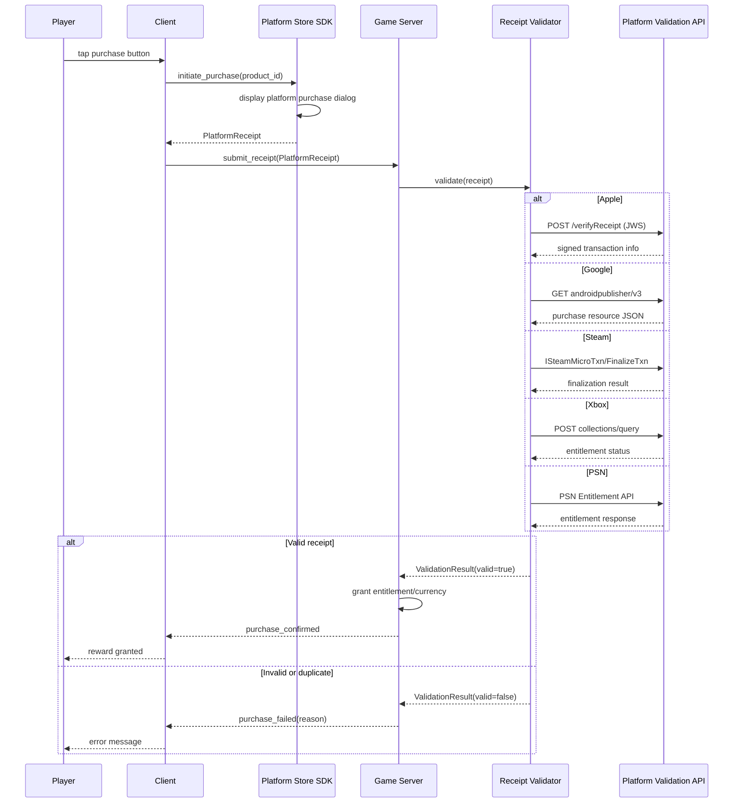
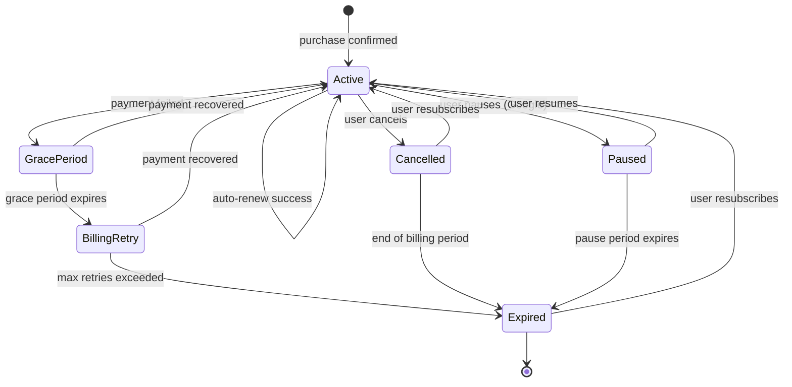
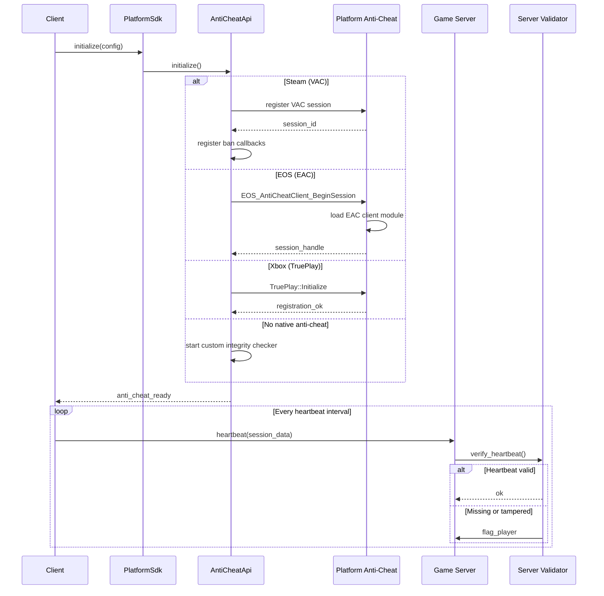
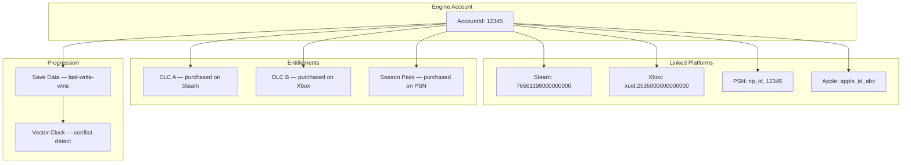
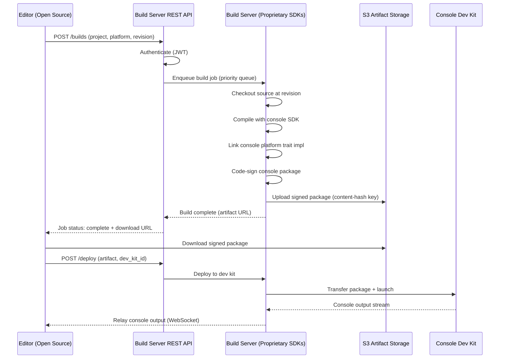
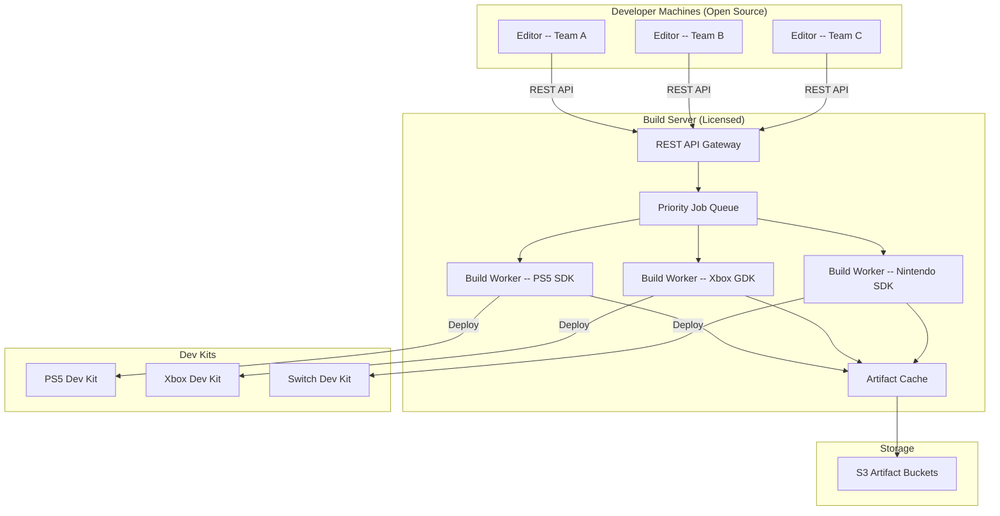

# Platform SDK Integration Design

## Requirements Trace

> **Canonical sources:** Features, requirements, and user stories are defined in
> [features/platform/](../../features/platform/),
> [requirements/platform/](../../requirements/platform/), and
> [user-stories/platform/](../../user-stories/platform/). The table below traces design elements to
> those definitions.

| Feature | Requirement | User Story | Description |
|---------|-------------|------------|-------------|
| F-14.5.1 | R-14.5.1 | US-14.5.1, 7, 8, 13 | Cross-platform achievements with deferred unlock |
| F-14.5.2 | R-14.5.2 | US-14.5.2, 15 | Leaderboards with batching and rate-limit caching |
| F-14.5.3 | R-14.5.3 | US-14.5.3 | Rich presence throttled to 1 update / 15 s |
| F-14.5.4 | R-14.5.4 | US-14.5.4, 16 | Platform voice/party bridge with Vivox fallback |
| F-14.5.5 | R-14.5.5 | US-14.5.5, 12, 17 | Cloud storage with conflict resolution dialog |
| F-14.5.6 | R-14.5.6 | US-14.5.6, 11 | Entitlement/DLC/subscription verification |
| F-14.5.7 | R-14.5.7 | US-14.5.10, 14 | Console certification compliance |
| F-14.6.1 | R-14.6.1 | US-14.6.1 | Platform SDK abstraction layer |
| F-14.6.2 | R-14.6.2 | US-14.6.2 | Receipt validation pipeline |
| F-14.6.3 | R-14.6.3 | US-14.6.3 | Subscription lifecycle management |
| F-14.6.4 | R-14.6.4 | US-14.6.4 | Platform anti-cheat integration |
| F-14.6.5 | R-14.6.5 | US-14.6.5 | Platform matchmaking bridge |
| F-14.6.6 | R-14.6.6 | US-14.6.6 | Cross-platform progression sync |
| F-14.6.7 | R-14.6.7 | US-14.6.7 | Mod support abstraction |
| F-14.8.1 | R-14.8.1, R-14.8.2 | US-14.8.1, 2, 3 | Server-side console build service |
| F-14.8.2 | R-14.8.3, R-14.8.4 | US-14.8.8, 9, 12 | Proprietary SDK isolation |
| F-14.8.3 | R-14.8.5, R-14.8.6 | US-14.8.4, 5, 6, 7 | Shared build server |
| F-14.8.4 | R-14.8.7, R-14.8.8 | US-14.8.10, 11 | Remote console deployment |
| F-14.8.5 | R-14.8.9, R-14.8.10 | US-14.8.10 | Console build artifacts |

## Overview

The platform SDK integration subsystem provides a unified abstraction over platform-specific SDKs
(Steam, Apple, Google Play, Xbox, PlayStation, Nintendo, Epic Online Services). Gameplay code calls
a single API; `cfg`-gated backends route to the correct platform SDK via cxx.rs FFI bridges. All
calls are async via the `IoReactor`.

Key design principles:

- **Static dispatch** -- platform selection at compile time via `cfg`
- **cxx.rs FFI** -- all platform SDK calls go through cxx.rs bridges
- **Deferred queues** -- no data lost during transient failures
- **Server-authoritative** -- receipts, entitlements, and currency are validated server-side

## Architecture

### Module Boundaries

```mermaid
classDiagram
    class PlatformServices {
        <<trait>>
        +achievements() AchievementApi
        +leaderboards() LeaderboardApi
        +purchases() PurchaseApi
        +subscriptions() SubscriptionApi
        +cloud_save() CloudSaveApi
        +matchmaking() MatchmakingApi
        +voice_chat() VoiceChatApi
        +anti_cheat() AntiCheatApi
        +friends() FriendsApi
        +mods() ModApi
    }

    class SteamServices {
        -app_id: u32
        -steam_client: SteamClient
    }

    class AppleServices {
        -bundle_id: String
        -storekit_handle: StoreKitHandle
    }

    class GooglePlayServices {
        -package_name: String
        -billing_client: BillingClient
    }

    class XboxServices {
        -title_id: u32
        -xbl_context: XblContext
    }

    class PsnServices {
        -np_title_id: String
        -psn_context: PsnContext
    }

    class NintendoServices {
        -application_id: u64
        -nex_context: NexContext
    }

    class EosServices {
        -product_id: String
        -eos_handle: EosHandle
    }

    class AchievementApi {
        <<trait>>
        +unlock(id) async Result
        +set_progress(id, pct) async Result
        +list() async Vec~Achievement~
        +sync() async Result
    }

    class LeaderboardApi {
        <<trait>>
        +submit_score(board, score) async Result
        +query_global(board, range) async Vec~Entry~
        +query_friends(board) async Vec~Entry~
    }

    class PurchaseApi {
        <<trait>>
        +query_products(ids) async Vec~Product~
        +initiate_purchase(id) async PurchaseResult
        +restore_purchases() async Vec~Receipt~
        +validate_receipt(receipt) async ValidationResult
    }

    class SubscriptionApi {
        <<trait>>
        +check_status(id) async SubStatus
        +manage_renewal(id, action) async Result
        +handle_grace_period(id) async GracePeriodInfo
    }

    class CloudSaveApi {
        <<trait>>
        +read(key) async Option~SaveData~
        +write(key, data) async Result
        +resolve_conflict(local, remote) ConflictResolution
    }

    class MatchmakingApi {
        <<trait>>
        +create_lobby(config) async LobbyHandle
        +find_match(criteria) async MatchResult
        +join_lobby(id) async Result
    }

    class VoiceChatApi {
        <<trait>>
        +start_session(channel) async Result
        +stop_session() async Result
        +mute_player(id, muted) Result
        +set_spatial_position(pos) Result
    }

    class AntiCheatApi {
        <<trait>>
        +initialize() async Result
        +report_player(id, reason) async Result
        +check_ban_status(id) async BanStatus
    }

    class FriendsApi {
        <<trait>>
        +list_friends() async Vec~Friend~
        +send_invite(id, context) async Result
        +set_rich_presence(state) async Result
    }

    class ModApi {
        <<trait>>
        +upload(manifest) async ModId
        +download(id) async ModData
        +subscribe(id) async Result
        +rate(id, score) async Result
    }

    PlatformServices <|.. SteamServices
    PlatformServices <|.. AppleServices
    PlatformServices <|.. GooglePlayServices
    PlatformServices <|.. XboxServices
    PlatformServices <|.. PsnServices
    PlatformServices <|.. NintendoServices
    PlatformServices <|.. EosServices

    PlatformServices --> AchievementApi
    PlatformServices --> LeaderboardApi
    PlatformServices --> PurchaseApi
    PlatformServices --> SubscriptionApi
    PlatformServices --> CloudSaveApi
    PlatformServices --> MatchmakingApi
    PlatformServices --> VoiceChatApi
    PlatformServices --> AntiCheatApi
    PlatformServices --> FriendsApi
    PlatformServices --> ModApi
```



### File Structure

```text
harmonius_platform/
├── sdk/
│   ├── mod.rs              # PlatformServices facade
│   ├── achievement.rs      # AchievementApi trait
│   ├── leaderboard.rs      # LeaderboardApi trait
│   ├── purchase.rs         # PurchaseApi trait
│   ├── subscription.rs     # SubscriptionApi trait
│   ├── cloud_save.rs       # CloudSaveApi trait
│   ├── matchmaking.rs      # MatchmakingApi trait
│   ├── voice_chat.rs       # VoiceChatApi trait
│   ├── anti_cheat.rs       # AntiCheatApi trait
│   ├── friends.rs          # FriendsApi trait
│   ├── mods.rs             # ModApi trait
│   └── deferred.rs         # DeferredQueue for retry
├── backends/
│   ├── steam/
│   │   ├── mod.rs          # SteamServices
│   │   ├── achievement.rs  # ISteamUserStats
│   │   ├── leaderboard.rs  # ISteamUserStats
│   │   ├── purchase.rs     # ISteamMicroTxn
│   │   ├── subscription.rs # ISteamMicroTxn
│   │   ├── cloud_save.rs   # ISteamRemoteStorage
│   │   ├── matchmaking.rs  # ISteamMatchmaking
│   │   ├── voice_chat.rs   # Steam Voice
│   │   ├── anti_cheat.rs   # VAC callbacks
│   │   ├── friends.rs      # ISteamFriends
│   │   └── mods.rs         # ISteamUGC
│   ├── apple/
│   │   ├── mod.rs          # AppleServices
│   │   ├── achievement.rs  # GameCenter
│   │   ├── leaderboard.rs  # GameCenter
│   │   ├── purchase.rs     # StoreKit 2
│   │   ├── subscription.rs # StoreKit 2
│   │   └── cloud_save.rs   # iCloud
│   ├── google/
│   │   ├── mod.rs          # GooglePlayServices
│   │   ├── achievement.rs  # Play Games
│   │   ├── leaderboard.rs  # Play Games
│   │   ├── purchase.rs     # Play Billing 7
│   │   ├── subscription.rs # Play Billing 7
│   │   └── cloud_save.rs   # Play Saved Games
│   ├── xbox/
│   │   ├── mod.rs          # XboxServices
│   │   ├── achievement.rs  # Xbox Live
│   │   ├── leaderboard.rs  # Xbox Live
│   │   ├── purchase.rs     # MS Store
│   │   ├── matchmaking.rs  # SmartMatch
│   │   ├── voice_chat.rs   # Game Chat 2
│   │   ├── anti_cheat.rs   # TruePlay
│   │   └── friends.rs      # Xbox Social
│   ├── psn/
│   │   ├── mod.rs          # PsnServices
│   │   ├── achievement.rs  # PSN Trophies
│   │   ├── leaderboard.rs  # PSN Rankings
│   │   ├── purchase.rs     # PS Store
│   │   ├── voice_chat.rs   # PSN Voice Chat
│   │   └── friends.rs      # PSN Friends
│   ├── nintendo/
│   │   ├── mod.rs          # NintendoServices
│   │   ├── achievement.rs  # NSO features
│   │   ├── cloud_save.rs   # NSO Cloud Saves
│   │   └── friends.rs      # NSO Friends
│   └── eos/
│       ├── mod.rs          # EosServices
│       ├── achievement.rs  # EOS Achievements
│       ├── leaderboard.rs  # EOS Leaderboards
│       ├── purchase.rs     # EOS Commerce
│       ├── matchmaking.rs  # EOS Lobbies
│       ├── voice_chat.rs   # EOS Voice
│       ├── anti_cheat.rs   # EAC
│       ├── friends.rs      # EOS Friends
│       └── mods.rs         # EOS Mods
└── validation/
    ├── receipt.rs          # ReceiptValidator
    ├── subscription.rs     # SubVerifier
    └── entitlement.rs      # EntitlementMerger
```

## Service Category Mapping

### Achievements

| Unified API | Steam | Apple | Google | Xbox | PSN | Nintendo | EOS |
|-------------|-------|-------|--------|------|-----|----------|-----|
| `unlock(id)` | `ISteamUserStats::SetAchievement` | `GKAchievement.report` | `Games.Achievements.unlock` | `XblAchievement::UpdateAchievement` | `NpTrophy::UnlockTrophy` | N/A (no native) | `EOS_Achievements_UnlockAchievements` |
| `set_progress(id, pct)` | `ISteamUserStats::IndicateAchievementProgress` | `GKAchievement.percentComplete` | `Games.Achievements.increment` | `XblAchievement::UpdateAchievement(progress)` | `NpTrophy::SetProgress` | N/A | `EOS_Achievements_UnlockAchievements` (binary) |
| `list()` | `ISteamUserStats::GetAchievement` (iterate) | `GKAchievement.loadAchievements` | `Games.Achievements.list` | `XblAchievement::GetAchievements` | `NpTrophy::GetTrophyUnlockState` | N/A | `EOS_Achievements_QueryPlayerAchievements` |

### Leaderboards

| Unified API | Steam | Apple | Google | Xbox | PSN | Nintendo | EOS |
|-------------|-------|-------|--------|------|-----|----------|-----|
| `submit_score(board, score)` | `ISteamUserStats::UploadLeaderboardScore` | `GKLeaderboard.submitScore` | `Games.Scores.submit` | `XblLeaderboard::UpdateStatistic` | `NpScore::RecordScore` | N/A | `EOS_Leaderboards_IngestStat` |
| `query_global(board, range)` | `ISteamUserStats::DownloadLeaderboardEntries` | `GKLeaderboard.loadEntries(.global)` | `Games.Scores.list` | `XblLeaderboard::GetLeaderboard` | `NpScore::GetRankingByRange` | N/A | `EOS_Leaderboards_QueryLeaderboardRanks` |
| `query_friends(board)` | `ISteamUserStats::DownloadLeaderboardEntries(Friends)` | `GKLeaderboard.loadEntries(.friends)` | `Games.Scores.list(collection: SOCIAL)` | `XblLeaderboard::GetLeaderboard(Social)` | `NpScore::GetFriendRanking` | N/A | `EOS_Leaderboards_QueryLeaderboardUserScores` |

### In-App Purchases

| Unified API | Steam | Apple | Google | Xbox | PSN | Nintendo | EOS |
|-------------|-------|-------|--------|------|-----|----------|-----|
| `query_products(ids)` | `ISteamMicroTxn::GetMicroTxnInfo` | `StoreKit2.Product.products(for:)` | `BillingClient.queryProductDetails` | `XStoreQueryAssociatedProducts` | `NpCommerce::GetProductInfo` | `nn::ec::ShopService` | `EOS_Ecom_QueryOffers` |
| `initiate_purchase(id)` | `ISteamMicroTxn::InitTxn` + overlay | `Product.purchase()` | `BillingClient.launchBillingFlow` | `XStoreShowPurchaseUI` | `NpCommerce::InitiateCheckout` | `nn::ec::ShopService::ShowShop` | `EOS_Ecom_Checkout` |
| `restore_purchases()` | N/A (server-side) | `Transaction.currentEntitlements` | `BillingClient.queryPurchases` | `XStoreQueryEntitlements` | `NpCommerce::GetEntitlements` | N/A | `EOS_Ecom_QueryEntitlements` |
| `validate_receipt(receipt)` | `ISteamMicroTxn/FinalizeTxn` | App Store Server API v2 (JWS) | `androidpublisher.purchases.products` | Xbox Collections API | PSN Entitlement API | Nintendo eShop API | EOS verification |

### Subscriptions

| Unified API | Steam | Apple | Google | Xbox | PSN | Nintendo | EOS |
|-------------|-------|-------|--------|------|-----|----------|-----|
| `check_status(id)` | `ISteamMicroTxn` recurring query | `StoreKit2.Transaction.currentEntitlements` | `purchases.subscriptionsv2` | `XStoreQueryGameLicense` | `NpCommerce::GetEntitlements` | N/A | `EOS_Ecom_QueryEntitlements` |
| `manage_renewal(id, action)` | N/A (Steam Wallet) | `showManageSubscriptions()` | Deep link to Play Store | Xbox Settings deep link | PSN Settings deep link | N/A | N/A |
| `handle_grace_period(id)` | N/A | `StoreKit2.RenewalInfo.gracePeriodExpirationDate` | `subscriptions.get (gracePeriod)` | XStoreQueryLicenseStatus | N/A | N/A | N/A |

### Cloud Save

| Unified API | Steam | Apple | Google | Xbox | PSN | Nintendo | EOS |
|-------------|-------|-------|--------|------|-----|----------|-----|
| `read(key)` | `ISteamRemoteStorage::FileRead` | `iCloud NSUbiquitousKeyValueStore` | `SnapshotsClient.open` | `XGameSaveReadBlobData` | `NpSaveData::Mount + Read` | `nn::fs::MountSaveData` | `EOS_PlayerDataStorage_ReadFile` |
| `write(key, data)` | `ISteamRemoteStorage::FileWrite` | `iCloud NSUbiquitousKeyValueStore` | `SnapshotsClient.commitAndClose` | `XGameSaveWriteBlobData` | `NpSaveData::Write + Unmount` | `nn::fs::Commit` | `EOS_PlayerDataStorage_WriteFile` |
| `resolve_conflict(local, remote)` | `ISteamRemoteStorage::FileWriteStreamOpen` (manual) | Automatic (iCloud merge) | `SnapshotsClient.resolveConflict` | `XGameSaveCreateUpdate` (manual) | Manual (timestamp compare) | Manual (single-slot) | Manual (version compare) |

### Matchmaking

| Unified API | Steam | Apple | Google | Xbox | PSN | Nintendo | EOS |
|-------------|-------|-------|--------|------|-----|----------|-----|
| `create_lobby(config)` | `ISteamMatchmaking::CreateLobby` | Game Center `GKMatchRequest` | Play Games `RealTimeMultiplayer` | `XblMultiplayer::CreateSession` | `NpMatching2::CreateRoom` | `nn::nex::MatchmakeExtension` | `EOS_Lobby_CreateLobby` |
| `find_match(criteria)` | `ISteamMatchmaking::AddRequestLobbyListFilter` | `GKMatchmaker.findMatch` | `RealTimeMultiplayer.auto` | SmartMatch `XblMatchmaking` | `NpMatching2::SearchRoom` | `nn::nex::MatchmakeExtension` | `EOS_Lobby_SearchLobby` |
| `join_lobby(id)` | `ISteamMatchmaking::JoinLobby` | `GKMatch.acceptInvite` | `RealTimeMultiplayer.join` | `XblMultiplayer::JoinSession` | `NpMatching2::JoinRoom` | `nn::nex::JoinMatchmake` | `EOS_Lobby_JoinLobby` |

### Voice Chat

| Unified API | Steam | Apple | Google | Xbox | PSN | Nintendo | EOS |
|-------------|-------|-------|--------|------|-----|----------|-----|
| `start_session(channel)` | `ISteamUser::StartVoiceRecording` | N/A (Vivox fallback) | N/A (Vivox fallback) | `GameChat2::AddLocalUser` | `NpVoiceChat::Join` | N/A (Vivox fallback) | `EOS_RTC_JoinRoom` |
| `stop_session()` | `ISteamUser::StopVoiceRecording` | N/A | N/A | `GameChat2::RemoveLocalUser` | `NpVoiceChat::Leave` | N/A | `EOS_RTC_LeaveRoom` |
| `mute_player(id, muted)` | `ISteamFriends::SetListenForFriendMessages` | N/A | N/A | `GameChat2::SetCommunicationRelationship` | `NpVoiceChat::Mute` | N/A | `EOS_RTCAudio_UpdateReceiving` |
| `set_spatial_position(pos)` | Custom (Steam lacks spatial) | N/A | N/A | `GameChat2::SetSpatialAudioPosition` | N/A (Vivox for spatial) | N/A | `EOS_RTCAudio_UpdateSpatial` |

### Anti-Cheat

| Unified API | Steam | Apple | Google | Xbox | PSN | Nintendo | EOS |
|-------------|-------|-------|--------|------|-----|----------|-----|
| `initialize()` | VAC session registration | N/A (custom fallback) | N/A (custom fallback) | TruePlay registration | N/A (custom fallback) | N/A (custom fallback) | `EOS_AntiCheatClient_BeginSession` |
| `report_player(id, reason)` | `ISteamGameServer::SendUserDisconnect` | Custom report API | Custom report API | `TruePlay::ReportActivity` | Custom report API | Custom report API | `EOS_Reports_SendPlayerBehaviorReport` |
| `check_ban_status(id)` | VAC ban callback | Custom ban DB | Custom ban DB | Xbox Enforcement API | Custom ban DB | Custom ban DB | `EOS_Sanctions_QueryActivePlayerSanctions` |

### Friends and Social

| Unified API | Steam | Apple | Google | Xbox | PSN | Nintendo | EOS |
|-------------|-------|-------|--------|------|-----|----------|-----|
| `list_friends()` | `ISteamFriends::GetFriendCount/GetFriendByIndex` | `GKLocalPlayer.loadFriends` | `PlayGames.Players.connected` | `XblSocialManager::GetLocalUsers` | `NpFriends::GetFriendList` | `nn::friends::GetFriendList` | `EOS_Friends_QueryFriends` |
| `send_invite(id, context)` | `ISteamFriends::InviteUserToGame` | `GKMatchmaker.sendInvite` | `RealTimeMultiplayer.invite` | `XblMultiplayer::SendInvites` | `NpInvitation::SendInvitation` | `nn::friends::ShowInvitation` | `EOS_CustomInvites_SendCustomInvite` |
| `set_rich_presence(state)` | `ISteamFriends::SetRichPresence` | N/A | N/A | `XblPresence::SetPresence` | `NpPresence::SetPresence` | N/A | `EOS_Presence_SetPresence` |

### Mod Support

| Unified API | Steam | Apple | Google | Xbox | PSN | Nintendo | EOS |
|-------------|-------|-------|--------|------|-----|----------|-----|
| `upload(manifest)` | `ISteamUGC::CreateItem + SubmitItemUpdate` | N/A | N/A | N/A (limited via Xbox Mods) | N/A | N/A | `EOS_Mods_InstallMod` (download only) |
| `download(id)` | `ISteamUGC::DownloadItem` | N/A | N/A | N/A | N/A | N/A | `EOS_Mods_InstallMod` |
| `subscribe(id)` | `ISteamUGC::SubscribeItem` | N/A | N/A | N/A | N/A | N/A | N/A |
| `rate(id, score)` | `ISteamUGC::SetUserItemVote` | N/A | N/A | N/A | N/A | N/A | N/A |

## API Design

### Platform Services Facade

```rust
/// Top-level platform services facade. Platform
/// selection is compile-time via cfg attributes.
pub struct PlatformSdk;

impl PlatformSdk {
    /// Initialize the platform SDK for the
    /// current platform. Must be called once
    /// at startup before any other SDK calls.
    pub async fn initialize(
        config: &PlatformConfig,
    ) -> Result<Self, SdkError>;

    /// Shut down all platform SDK connections.
    pub async fn shutdown(&self);

    pub fn achievements(&self) -> &AchievementApi;
    pub fn leaderboards(&self) -> &LeaderboardApi;
    pub fn purchases(&self) -> &PurchaseApi;
    pub fn subscriptions(&self) -> &SubscriptionApi;
    pub fn cloud_save(&self) -> &CloudSaveApi;
    pub fn matchmaking(&self) -> &MatchmakingApi;
    pub fn voice_chat(&self) -> &VoiceChatApi;
    pub fn anti_cheat(&self) -> &AntiCheatApi;
    pub fn friends(&self) -> &FriendsApi;
    pub fn mods(&self) -> &ModApi;
}

/// Platform configuration loaded from TOML.
pub struct PlatformConfig {
    pub app_id: String,
    pub platform: PlatformKind,
    pub features: EnabledFeatures,
}

#[derive(Clone, Copy, Debug, PartialEq, Eq)]
pub enum PlatformKind {
    Steam,
    Apple,
    GooglePlay,
    Xbox,
    Psn,
    Nintendo,
    Eos,
}

/// Bitflags for enabled platform features.
pub struct EnabledFeatures {
    pub achievements: bool,
    pub leaderboards: bool,
    pub purchases: bool,
    pub subscriptions: bool,
    pub cloud_save: bool,
    pub matchmaking: bool,
    pub voice_chat: bool,
    pub anti_cheat: bool,
    pub friends: bool,
    pub mods: bool,
}
```

### Achievement API

```rust
/// Cross-platform achievement unlock and
/// progress API.
pub struct AchievementApi;

pub struct Achievement {
    pub id: AchievementId,
    pub platform_id: String,
    pub name: StringId,
    pub description: StringId,
    pub unlocked: bool,
    pub progress: f32,
    pub unlock_time: Option<u64>,
}

impl AchievementApi {
    /// Unlock an achievement. Enqueues to
    /// deferred queue if offline.
    pub async fn unlock(
        &self,
        id: AchievementId,
    ) -> Result<(), AchievementError>;

    /// Set incremental progress (0.0 to 1.0).
    pub async fn set_progress(
        &self,
        id: AchievementId,
        progress: f32,
    ) -> Result<(), AchievementError>;

    /// List all achievements with unlock status.
    pub async fn list(
        &self,
    ) -> Result<Vec<Achievement>, AchievementError>;

    /// Sync local state with platform. Resolves
    /// deferred unlocks.
    pub async fn sync(
        &self,
    ) -> Result<(), AchievementError>;
}
```

### Purchase and Receipt Validation

```rust
/// Cross-platform purchase receipt for
/// server-side validation.
pub struct PlatformReceipt {
    pub transaction_id: TransactionId,
    pub product_id: ProductId,
    pub platform: PlatformKind,
    pub receipt_data: Vec<u8>,
    pub timestamp: u64,
    pub signature: Option<Vec<u8>>,
}

/// Server-side receipt validation result.
pub struct ValidationResult {
    pub valid: bool,
    pub transaction_id: TransactionId,
    pub product_id: ProductId,
    pub is_duplicate: bool,
    pub entitlement_granted: bool,
}

/// Server-side receipt validator. Contacts
/// platform verification endpoints.
pub struct ReceiptValidator;

impl ReceiptValidator {
    /// Validate a receipt against the platform
    /// verification endpoint.
    pub async fn validate(
        &self,
        receipt: &PlatformReceipt,
    ) -> Result<ValidationResult, ValidationError>;

    /// Retry validation with exponential backoff.
    pub async fn validate_with_retry(
        &self,
        receipt: &PlatformReceipt,
        max_retries: u32,
    ) -> Result<ValidationResult, ValidationError>;
}

pub enum ValidationError {
    NetworkError,
    InvalidReceipt,
    ExpiredReceipt,
    PlatformError { code: i32 },
    Duplicate { original_txn: TransactionId },
}
```

### Subscription Management

```rust
/// Subscription status across all platforms.
pub struct SubStatus {
    pub active: bool,
    pub product_id: ProductId,
    pub state: SubState,
    pub renewal_date: Option<u64>,
    pub expiry_date: Option<u64>,
    pub grace_period_end: Option<u64>,
    pub is_family_shared: bool,
    pub last_verified_at: u64,
}

#[derive(Clone, Copy, Debug, PartialEq, Eq)]
pub enum SubState {
    Active,
    GracePeriod,
    BillingRetry,
    Expired,
    Cancelled,
    Revoked,
    Paused,
}

#[derive(Clone, Copy, Debug, PartialEq, Eq)]
pub enum RenewalAction {
    EnableAutoRenew,
    DisableAutoRenew,
    UpgradeTier { new_product: ProductId },
    DowngradeTier { new_product: ProductId },
}

/// Grace period details per platform.
pub struct GracePeriodInfo {
    pub in_grace_period: bool,
    pub expiry: Option<u64>,
    pub billing_retry_count: u32,
}

impl SubscriptionApi {
    /// Check current subscription status.
    pub async fn check_status(
        &self,
        product_id: ProductId,
    ) -> Result<SubStatus, SubError>;

    /// Manage auto-renewal settings.
    pub async fn manage_renewal(
        &self,
        product_id: ProductId,
        action: RenewalAction,
    ) -> Result<(), SubError>;

    /// Query grace period information.
    pub async fn handle_grace_period(
        &self,
        product_id: ProductId,
    ) -> Result<GracePeriodInfo, SubError>;
}
```

### Cross-Platform Account Linking

```rust
/// Links platform identities to a unified
/// engine account.
pub struct AccountLinker;

pub struct LinkedAccount {
    pub engine_account_id: AccountId,
    pub platform: PlatformKind,
    pub platform_user_id: String,
    pub linked_at: u64,
}

pub struct EntitlementSet {
    pub purchases: Vec<ProductId>,
    pub subscriptions: Vec<SubStatus>,
    pub achievements: Vec<AchievementId>,
}

impl AccountLinker {
    /// Link a platform identity to an engine
    /// account. Returns error if already linked
    /// to a different engine account.
    pub async fn link(
        &self,
        engine_id: AccountId,
        platform: PlatformKind,
        platform_token: &[u8],
    ) -> Result<LinkedAccount, LinkError>;

    /// Unlink a platform identity.
    pub async fn unlink(
        &self,
        engine_id: AccountId,
        platform: PlatformKind,
    ) -> Result<(), LinkError>;

    /// List all linked platforms for an account.
    pub async fn list_linked(
        &self,
        engine_id: AccountId,
    ) -> Result<Vec<LinkedAccount>, LinkError>;

    /// Merge entitlements from all linked
    /// platforms.
    pub async fn merge_entitlements(
        &self,
        engine_id: AccountId,
    ) -> Result<EntitlementSet, LinkError>;
}
```

## Receipt Validation Flow

**Server-side validation** ensures that all purchases are verified against platform APIs before
granting entitlements. The client never modifies currency or entitlement state directly.



**Per-platform validation endpoints:**

| Platform | Endpoint | Format | Auth |
|----------|----------|--------|------|
| Apple | App Store Server API v2 `/verifyReceipt` | JWS (JSON Web Signature) | API key + JWT |
| Google | `androidpublisher/v3/purchases/products` | JSON | OAuth 2.0 service account |
| Steam | `ISteamMicroTxn/FinalizeTxn` | JSON | Web API key |
| Xbox | `collections.mp.microsoft.com/v9.0/query` | JSON | Azure AD token |
| PSN | `entitlement.api.playstation.com` | JSON | PSN API key |
| Nintendo | `ec-shop.api.nintendo.net` | JSON | Service credential |
| EOS | `ecommerceinterface-api.epicgames.dev` | JSON | Client credentials |

## Subscription Lifecycle

### Subscription State Machine



### Subscription States Per Platform

| State | Apple | Google | Steam | Xbox | PSN |
|-------|-------|--------|-------|------|-----|
| **Active** | `subscriptionStatus == 1` | `SUBSCRIPTION_STATE_ACTIVE` | Active recurring | License valid | Entitlement active |
| **Grace period** | `gracePeriodExpirationDate` set | `SUBSCRIPTION_STATE_IN_GRACE_PERIOD` | N/A | N/A | N/A |
| **Billing retry** | `isInBillingRetryPeriod` | `SUBSCRIPTION_STATE_ON_HOLD` | N/A | N/A | N/A |
| **Cancelled** | `autoRenewStatus == 0` | `SUBSCRIPTION_STATE_CANCELED` | Cancelled flag | Cancelled | Cancelled |
| **Expired** | `expirationDate` passed | `SUBSCRIPTION_STATE_EXPIRED` | Expired | Expired | Expired |
| **Paused** | N/A | `SUBSCRIPTION_STATE_PAUSED` | N/A | N/A | N/A |
| **Revoked** | `revocationDate` set | Voided purchase | Refunded | Refunded | Refunded |
| **Family shared** | `inFamilySharing` | N/A | Family Sharing | Game Pass family | N/A |

### Server-Side Webhook Handling

| Platform | Notification Mechanism | Payload |
|----------|----------------------|---------|
| Apple | App Store Server Notifications V2 | JWS-signed JSON |
| Google | Real-time Developer Notifications (RTDN) via Pub/Sub | JSON with notification type |
| Steam | Periodic polling via `ISteamMicroTxn` | N/A (poll-based) |
| Xbox | Xbox Services event subscription | JSON webhook |
| PSN | PSN push notification service | JSON |

## Platform Anti-Cheat Integration

### Anti-Cheat Initialization Flow



**Platform anti-cheat capabilities:**

| Platform | System | Client Module | Server Verify | Ban API |
|----------|--------|--------------|---------------|---------|
| Steam | VAC | Built-in | VAC callback | `ISteamGameServer::BUpdateUserData` |
| EOS | EAC | Dynamic load | EAC server SDK | `EOS_Sanctions` |
| Xbox | TruePlay | OS-level | Xbox Enforcement | Enforcement API |
| PlayStation | N/A | Custom | Custom server | Custom ban DB |
| Apple | N/A | Custom | Custom server | Custom ban DB |
| Google | Play Integrity | Integrity token | Token verify | Custom ban DB |
| Nintendo | N/A | Custom | Custom server | Custom ban DB |

**Integration with engine anti-cheat** (see [anti-cheat.md](../networking/anti-cheat.md)):

- Platform anti-cheat runs alongside the engine's `ViolationScorer` and `EscalationManager`
- VAC/EAC/TruePlay handle client integrity; engine handles server-side validation (movement, damage,
  economy)
- Ban status from platform APIs feeds into `EscalationManager`
- Custom fallback implements memory hashing challenges per `ClientIntegrityChecker` in anti-cheat.md

## Platform Matchmaking Strategy

**When to use platform matchmaking vs custom:**

| Platform | SDK Matchmaking | When to Use | Fallback |
|----------|----------------|-------------|----------|
| Steam | `ISteamMatchmaking` lobbies | Peer-to-peer casual games, LAN discovery | Custom for ranked/cross-play |
| Apple | Game Center `GKMatchmaker` | iOS casual multiplayer | Custom for cross-play |
| Google | Play Games `RealTimeMultiplayer` | Android casual multiplayer | Custom for cross-play |
| Xbox | SmartMatch via `XblMatchmaking` | Xbox certification (mandatory for Xbox) | Custom for cross-play overlay |
| PSN | `NpMatching2` | PSN certification compliance | Custom for cross-play |
| Nintendo | NEX matchmaking | Nintendo certification | Custom for cross-play |
| EOS | `EOS_Lobby` | Cross-platform fallback | Used as default cross-play |

**Integration with session system** (see [sessions-replay.md](../networking/sessions-replay.md)):

- Platform lobbies map to `LobbyManager` entries in the session system
- Platform match results feed into `MatchmakerClient` for Glicko-2 rating updates
- Cross-play matches always use the custom matchmaker (`MatchmakerService`) with platform lobbies as
  discovery
- Platform-specific lobbies handle invite flows; the engine session system handles server assignment
  and reconnection

## Certification Compliance

| Requirement | Steam | Apple | Xbox | PlayStation | Nintendo |
|-------------|-------|-------|------|-------------|----------|
| **Achievements/Trophies** | Optional (Steamworks review) | Optional (Game Center) | Mandatory (XR-015) | Mandatory (TRC R4060) | Optional |
| **Controller support** | Recommended (Steam Input) | MFi controller | Mandatory (XR-022) | Mandatory (TRC R4020) | Mandatory (Joy-Con) |
| **Suspend/Resume** | N/A | Background handling | Mandatory (XR-074) | Mandatory (TRC R4080) | Mandatory (Sleep mode) |
| **Game save** | Optional (Steam Cloud) | Optional (iCloud) | Mandatory (XR-078) | Mandatory (TRC R4082) | Mandatory (Save data) |
| **Privacy** | GDPR compliance | ATT + Privacy Manifest | COPPA via Xbox Family | Regional compliance | Regional compliance |
| **Content rating** | Steam age gates | App Review (IARC) | ESRB/PEGI via Xbox | CERO/ESRB/PEGI | CERO/ESRB |
| **Review process** | Steamworks build review | App Review (1-7 days) | XR certification | TRC certification | Lotcheck |
| **Button mapping** | Flexible | System standard | XR-specific glyphs | TRC-specific glyphs | Handheld/docked modes |
| **Network** | Steam Networking API | NSURLSession | Xbox Live required | PSN required | NSO required |
| **User profile** | Steam profile | Apple ID | Xbox Live profile | PSN profile | Nintendo Account |

## Cross-Platform Progression

### Account Linking Architecture

**Account linking** maps platform-specific user IDs to a unified engine account. A player can link
multiple platforms to one engine account but not link one platform to multiple engine accounts.



**Entitlement merging** combines purchases from all linked platforms into a single entitlement set.
Platform TOS restrictions apply:

| Platform | Cross-Platform Entitlements | Currency Transfer | Notes |
|----------|---------------------------|-------------------|-------|
| Steam | DLC and game ownership | Not permitted | Steam Wallet stays on Steam |
| Apple | Non-consumables only | Not permitted | StoreKit 2 family sharing |
| Google | Non-consumables only | Not permitted | Play Billing restrictions |
| Xbox | DLC via Xbox Live | Not permitted | Game Pass entitlements are Xbox-only |
| PSN | DLC via PSN | Not permitted | PS Plus entitlements are PSN-only |

**Save data sync with conflict resolution:**

- Each save slot carries a vector clock (one entry per platform)
- On sync, compare vector clocks:
  - If one dominates, use that version
  - If concurrent, present conflict resolution dialog (per
    [services-storage.md](services-storage.md) F-14.5.5)
- Server stores the canonical save with merged vector clock
- Last-write-wins as automatic fallback when no dialog is shown

## Data Flow

### SDK Initialization Sequence

1. Engine startup reads `PlatformConfig` from TOML
2. `PlatformSdk::initialize()` loads the platform-specific backend via `cfg` attributes
3. Backend calls platform SDK init (e.g., `SteamAPI_Init`, `EOS_Platform_Create`)
4. Each service API registers callbacks/delegates with the platform
5. Deferred queue starts processing pending operations
6. Anti-cheat module initializes (VAC/EAC/TruePlay/custom)

### Purchase Data Flow

All purchase data flows through the server-side validation pipeline before any entitlement or
currency is granted:

1. Client calls `PurchaseApi::initiate_purchase(product_id)`
2. Platform SDK displays native purchase dialog
3. On completion, platform returns `PlatformReceipt`
4. Client sends receipt to game server
5. Server calls `ReceiptValidator::validate(receipt)`
6. Validator contacts platform verification endpoint
7. On success, server grants entitlement/currency
8. Server notifies client of confirmed purchase

### Subscription Verification Cadence

| Trigger | Action | Interval |
|---------|--------|----------|
| App launch | Full subscription status check | Once |
| Periodic background | Server-side status poll | 15 min |
| Webhook received | Immediate status update | Real-time |
| Resume from suspend | Re-verify active subs | On resume |

## Platform Considerations

### FFI Bridge Pattern

All platform SDK calls use cxx.rs FFI bridges per [constraints.md](../constraints.md). Each backend
has a thin C++ wrapper that exposes the platform SDK API as cxx.rs-compatible functions.

```text
Rust API → cxx.rs bridge → C++ wrapper → Platform SDK
```

**Apple** additionally uses Swift wrappers for StoreKit 2 and GameCenter, accessed through cxx.rs as
specified in constraints.md.

### Offline Graceful Degradation

| Service | Offline Behavior |
|---------|-----------------|
| Achievements | Enqueue to deferred queue; sync on reconnect |
| Leaderboards | Cache last-known scores; submit on reconnect |
| Purchases | Block (requires platform dialog) |
| Subscriptions | Use last-known status with grace window |
| Cloud Save | Local save only; sync on reconnect |
| Matchmaking | Fall back to LAN discovery if available |
| Voice Chat | Disabled |
| Anti-Cheat | Continue with custom checks; skip platform |
| Friends | Cache last-known list |
| Mods | Use locally cached mods |

## Server-Side Proprietary Architecture

The engine is **100% open source**. Every developer builds and contributes to the engine without
proprietary console SDK code. All console-specific compilation, signing, and packaging runs
exclusively on a shared build server that holds the console SDK licenses.

### Client vs Server Responsibility

| Component | Client (Open Source) | Server (Proprietary) |
|-----------|----------------------|----------------------|
| Platform trait definitions | Abstract `PlatformServices` trait and sub-traits | Console SDK implementations (PSN, Xbox, Nintendo) |
| Build pipeline | Trigger build via REST API + monitor status | Compile against console SDKs, link, package, sign |
| SDK headers/libraries | None -- zero proprietary code | PlayStation SDK, Xbox GDK, Nintendo SDK |
| Console package formats | Not present in source tree | .pkg (PS5), .xvc (Xbox), .nsp (Switch) |
| License required | No | Yes (1 per console platform per server) |
| Dev kit deployment | Request deploy via REST API | Transfer package to dev kit, relay console output |
| Artifact storage | Download from S3 | Upload signed packages to S3 |

### Build Flow



### Shared Build Server Architecture



### Key Design Decisions

1. **Zero proprietary code on client.** The engine binary that ships to every developer contains no
   console SDK references. Console feature flags exist only in the server-side build environment.
2. **One license per server, not per developer.** A single set of console SDK licenses covers all
   teams using the shared build server. Licensing cost drops from O(developers) to O(1).
3. **Abstract trait boundary.** The open-source repository defines `PlatformServices` and sub-traits
   with no console-specific types. Console implementations live in a separate closed-source
   repository cloned only on the build server.
4. **Content-hash artifact caching.** Identical builds produce the same content hash. Multiple teams
   sharing the same engine version hit the cache for shared engine code, paying only for
   game-specific assets.
5. **Per-project isolation.** Each team's build runs in an isolated directory with separate
   credentials. The job queue enforces access control so team A cannot read team B's source or
   artifacts.

### Requirements Trace

| Feature | Requirement | User Story | Description |
|---------|-------------|------------|-------------|
| F-14.8.1 | R-14.8.1, R-14.8.2 | US-14.8.1, 2, 3 | Server-side console build service |
| F-14.8.2 | R-14.8.3, R-14.8.4 | US-14.8.8, 9, 12 | Proprietary SDK isolation |
| F-14.8.3 | R-14.8.5, R-14.8.6 | US-14.8.4, 5, 6, 7 | Shared build server |
| F-14.8.4 | R-14.8.7, R-14.8.8 | US-14.8.10, 11 | Remote console deployment |
| F-14.8.5 | R-14.8.9, R-14.8.10 | US-14.8.10 | Console build artifacts |

## Test Plan

Test cases are in the companion file [sdk-integration-test-cases.md](sdk-integration-test-cases.md).

### Summary

| Category | Count | Coverage |
|----------|-------|----------|
| Achievement tests | 8 | R-14.5.1, R-14.6.1 |
| IAP purchase tests | 10 | R-14.5.6, R-14.6.2 |
| Subscription tests | 10 | R-14.5.6, R-14.6.3 |
| Cloud save tests | 6 | R-14.5.5 |
| Matchmaking tests | 8 | R-14.6.5 |
| Anti-cheat tests | 8 | R-14.6.4 |
| Receipt validation tests | 8 | R-14.6.2 |
| Offline degradation tests | 6 | R-14.6.1 |
| Certification tests | 8 | R-14.5.7 |
| Cross-platform tests | 6 | R-14.6.6 |
| SDK isolation tests | 10 | R-14.8.1--R-14.8.10 |
| **Total** | **88** | |

## Design Q & A

**Q1. What is the biggest constraint limiting this design?**

The `cfg`-gated static dispatch model means each binary targets exactly one platform. Cross-platform
testing requires building and running on every target platform. Lifting this constraint to allow
runtime backend selection (via `dyn PlatformServices`) would enable a single binary to test multiple
platforms, but violates the static dispatch preference in constraints.md. The trade-off is
acceptable because platform SDKs are inherently platform-specific and cannot be loaded
cross-platform regardless of dispatch model.

**Q2. How can this design be improved?**

The subscription webhook handling is currently per-platform with no shared abstraction. A unified
`SubscriptionEvent` enum that normalizes all platform notifications into a common format would
reduce server-side branching. The mod support API is minimal because most platforms lack mod
infrastructure; a custom mod hosting service would provide consistent mod support across all
platforms.

**Q3. Is there a better approach?**

A plugin architecture where platform backends are dynamically loaded shared libraries would enable
hot-swapping backends without recompilation. We are not taking this approach because it conflicts
with the static dispatch constraint and adds runtime complexity. The `cfg`-gated approach is
simpler, has zero runtime overhead, and aligns with how platform SDKs are actually distributed (as
platform-specific static libraries).

**Q4. Does this design solve all customer problems?**

The design lacks a unified notification system for platform-specific events (e.g., Steam overlay
activation, Xbox guide opening, PSN system dialog). These events affect gameplay (pause, input loss)
and need consistent handling. Adding a `PlatformEventApi` that normalizes these events into engine
events would close this gap. The design also lacks platform-specific analytics integration (Steam
Stats, Xbox PlayFab, PSN telemetry).

**Q5. Is this design cohesive with the overall engine?**

The SDK integration aligns with engine constraints: all I/O uses the `IoReactor`, all state is ECS
resources, all FFI uses cxx.rs. The deferred queue pattern matches `services-storage.md`. The
receipt validation pipeline integrates with `monetization.md`. The anti-cheat integration
complements `anti-cheat.md`. One gap: the matchmaking bridge needs tighter coupling with
`sessions-replay.md` to ensure platform lobby state is always consistent with the engine session
directory.

## Open Questions

1. **Platform SDK version pinning.** Should platform SDK versions be pinned in the build system, or
   should the engine dynamically detect SDK capabilities at runtime? Pinning is safer for
   certification but requires rebuild for SDK updates.

2. **Cross-platform currency.** Platform TOS generally prohibit cross-platform currency transfer.
   Should the engine maintain per-platform currency wallets or a single server-side wallet?
   Server-side wallet is simpler but may violate platform TOS.

3. **Console certification automation.** Can XR/TRC/Lotcheck compliance checks be automated in CI,
   or do they require manual testing on devkits? Partial automation (save/resume, button mapping) is
   possible; full certification always requires manual submission.

4. **EOS as universal fallback.** Should EOS be used as the fallback for all services on platforms
   that lack native equivalents (e.g., achievements on Nintendo, voice chat on Apple)? EOS provides
   broad coverage but adds a dependency on Epic's infrastructure.

5. **Platform SDK update cadence.** How frequently should platform SDK wrappers be updated? Apple
   and Google release major SDK updates annually; Steam and EOS update more frequently. A quarterly
   update cadence balances stability and feature access.

6. **Save data quota limits.** Each platform has different cloud save quotas (Steam: 1 GB, iCloud: 5
   GB shared, Xbox: 16 MB per blob). Should the engine enforce a minimum common denominator or
   platform-specific limits?
