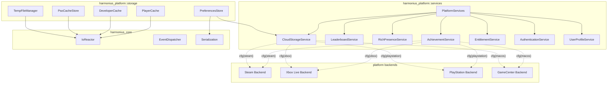
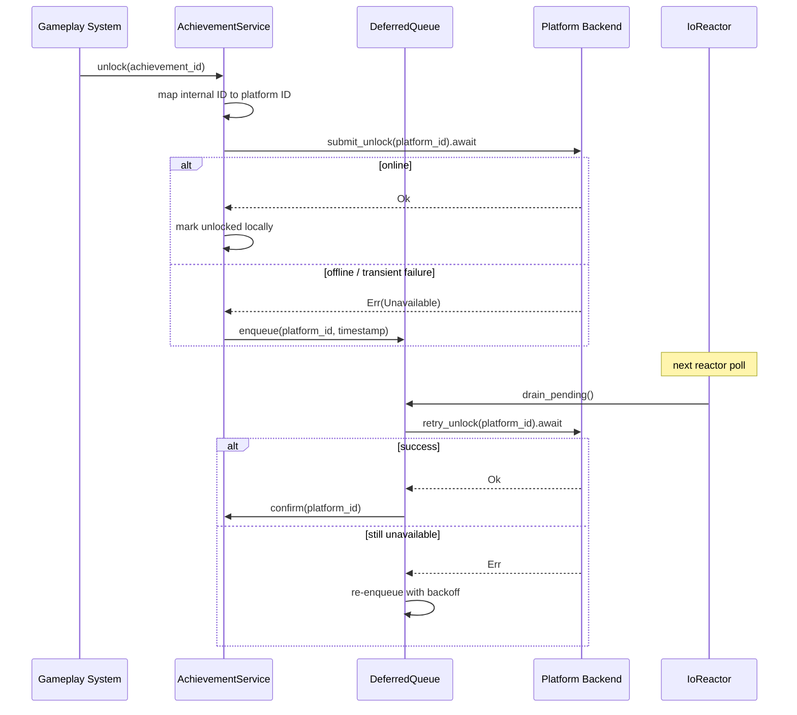
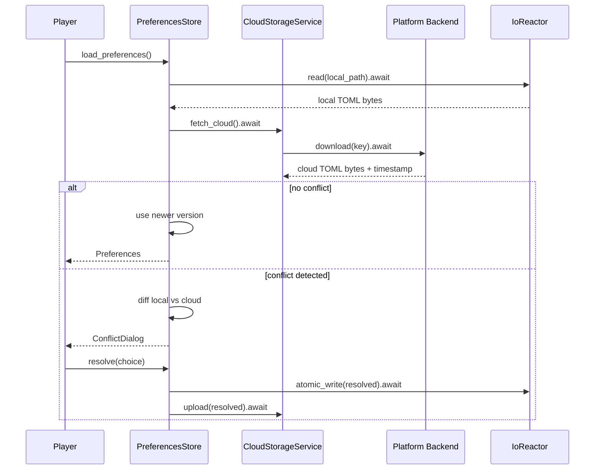
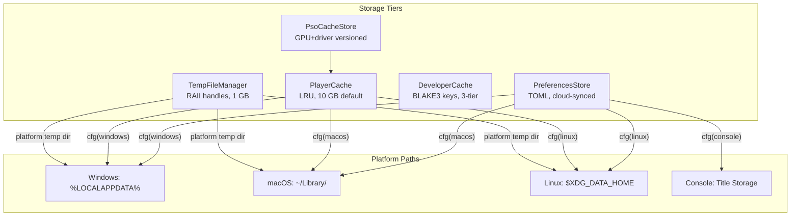

# Platform Services and Storage Design

## Requirements Trace

> **Canonical sources:** Features, requirements, and user
> stories are defined in [features/platform/](../../features/platform/),
> [requirements/platform/](../../requirements/platform/), and
> [user-stories/platform/](../../user-stories/platform/). The table
> below traces design elements to those definitions.

### Platform Services

| Feature | Requirement | User Story | Description |
|---------|-------------|------------|-------------|
| F-14.5.1 | R-14.5.1 | US-14.5.1, 7, 8, 13 | Cross-platform achievements with deferred unlock |
| F-14.5.2 | R-14.5.2 | US-14.5.2, 15 | Leaderboards with batching and rate-limit caching |
| F-14.5.3 | R-14.5.3 | US-14.5.3 | Rich presence throttled to 1 update / 15 s |
| F-14.5.4 | R-14.5.4 | US-14.5.4, 16 | Platform voice/party bridge with Vivox fallback |
| F-14.5.5 | R-14.5.5 | US-14.5.5, 12, 17 | Cloud storage with conflict resolution dialog |
| F-14.5.6 | R-14.5.6 | US-14.5.6, 11 | Entitlement/DLC/subscription verification |
| F-14.5.7 | R-14.5.7 | US-14.5.10, 14 | Console certification compliance |

### Storage

| Feature | Requirement | User Story | Description |
|---------|-------------|------------|-------------|
| F-14.5.8 | R-14.5.8 | US-14.5.17, 18, 19 | User preferences: TOML, atomic write, cloud sync |
| F-14.5.9 | R-14.5.9 | US-14.5.20, 21 | Player cache: LRU, 10 GB default, per-category |
| F-14.5.10 | R-14.5.10 | US-14.5.22, 23 | Developer cache: BLAKE3 keys, 3-tier lookup |
| F-14.5.11 | R-14.5.11 | US-14.5.24, 25, 26 | PSO cache: GPU+driver versioned, < 1 ms load |
| F-14.5.12 | R-14.5.12 | US-14.5.27, 28 | Temp file manager: RAII, orphan cleanup, 1 GB cap |

## Overview

The platform services subsystem provides a unified
cross-platform API for achievements, leaderboards,
rich presence, cloud storage, entitlements, voice
integration, and authentication. Gameplay code calls
a single API; `cfg`-gated backends route to the
correct platform SDK (Steam, PlayStation, Xbox,
GameCenter). All calls are async via the `IoReactor`.
Deferred queues ensure no data is lost during transient
network failures.

The storage subsystem manages five tiers of local
data: user preferences (TOML, cloud-synced), player
cache (LRU-evicted downloads), developer cache
(BLAKE3-keyed build artifacts), PSO cache (GPU
pipeline states), and temporary files (RAII-managed).
Each tier uses platform-appropriate directories and
async I/O.

Both subsystems use static dispatch exclusively. No
trait objects or vtables -- platform selection is
compile-time via `cfg` attributes.

## Architecture

### Module Boundaries



```
harmonius_platform/
├── services/
│   ├── mod.rs            # PlatformServices facade
│   ├── achievement.rs    # AchievementService
│   ├── leaderboard.rs    # LeaderboardService
│   ├── presence.rs       # RichPresenceService
│   ├── cloud.rs          # CloudStorageService
│   ├── entitlement.rs    # EntitlementService
│   ├── auth.rs           # AuthenticationService
│   ├── profile.rs        # UserProfileService
│   └── deferred.rs       # DeferredQueue for retry
├── storage/
│   ├── mod.rs            # Storage tier exports
│   ├── preferences.rs    # PreferencesStore, TOML
│   ├── player_cache.rs   # PlayerCache, LRU
│   ├── dev_cache.rs      # DeveloperCache, BLAKE3
│   ├── pso_cache.rs      # PsoCacheStore
│   ├── temp.rs           # TempFileManager, RAII
│   └── paths.rs          # Platform path resolution
├── backends/
│   ├── steam/
│   │   ├── achievement.rs
│   │   ├── leaderboard.rs
│   │   ├── presence.rs
│   │   ├── cloud.rs
│   │   ├── entitlement.rs
│   │   └── auth.rs
│   ├── xbox/
│   │   ├── achievement.rs
│   │   ├── leaderboard.rs
│   │   ├── presence.rs
│   │   ├── cloud.rs
│   │   ├── entitlement.rs
│   │   └── auth.rs
│   ├── playstation/
│   │   ├── achievement.rs
│   │   ├── leaderboard.rs
│   │   ├── presence.rs
│   │   ├── cloud.rs
│   │   ├── entitlement.rs
│   │   └── auth.rs
│   └── gamecenter/
│       ├── achievement.rs
│       ├── leaderboard.rs
│       └── auth.rs
```

### Achievement Unlock Flow



### Cloud Save Conflict Resolution



### Storage Tiers



## API Design

### Platform Service Facade

```rust
/// Unified entry point for all platform services.
/// One instance per application. Platform backends
/// are selected at compile time via cfg.
pub struct PlatformServices {
    pub achievements: AchievementService,
    pub leaderboards: LeaderboardService,
    pub presence: RichPresenceService,
    pub cloud: CloudStorageService,
    pub entitlements: EntitlementService,
    pub auth: AuthenticationService,
    pub profile: UserProfileService,
}

impl PlatformServices {
    /// Initialize all platform services.
    /// Authenticates with the platform SDK and
    /// syncs initial state (achievement list,
    /// entitlements).
    pub async fn init(
        reactor: &IoReactor,
    ) -> Result<Self, PlatformError>;

    /// Shutdown all services. Flushes deferred
    /// queues and persists local state.
    pub async fn shutdown(
        &mut self,
        reactor: &IoReactor,
    ) -> Result<(), PlatformError>;
}
```

### Achievement Service

```rust
/// Internal achievement identifier.
#[derive(
    Clone, Debug, PartialEq, Eq, Hash, Reflect,
)]
pub struct AchievementId(pub String);

/// Achievement definition with platform mappings.
#[derive(Clone, Debug, Reflect)]
pub struct AchievementDef {
    pub id: AchievementId,
    pub name: StringKey,
    pub description: StringKey,
    pub icon: AssetId,
    pub hidden: bool,
    /// Platform-specific IDs.
    pub platform_ids: PlatformIdMap,
}

/// Maps internal ID to per-platform identifiers.
#[derive(Clone, Debug, Reflect)]
pub struct PlatformIdMap {
    #[cfg(feature = "steam")]
    pub steam: Option<String>,
    #[cfg(feature = "xbox")]
    pub xbox: Option<String>,
    #[cfg(feature = "playstation")]
    pub playstation: Option<u32>,
    #[cfg(feature = "gamecenter")]
    pub gamecenter: Option<String>,
}

/// Current unlock state of an achievement.
#[derive(
    Clone, Copy, Debug, PartialEq, Eq, Reflect,
)]
pub enum UnlockState {
    Locked,
    Unlocked,
    /// Submitted but not yet confirmed by platform.
    Pending,
}

/// Achievement progress for incremental unlocks.
#[derive(Clone, Debug, Reflect)]
pub struct AchievementProgress {
    pub id: AchievementId,
    pub current: u32,
    pub target: u32,
    pub state: UnlockState,
}

pub struct AchievementService {
    defs: Vec<AchievementDef>,
    progress: HashMap<AchievementId, AchievementProgress>,
    deferred: DeferredQueue<AchievementId>,
}

impl AchievementService {
    /// Unlock an achievement. If the platform is
    /// unavailable, the unlock is queued for retry.
    pub async fn unlock(
        &mut self,
        id: &AchievementId,
        reactor: &IoReactor,
    ) -> Result<(), AchievementError>;

    /// Increment progress toward an achievement.
    /// Automatically unlocks when target is reached.
    pub async fn increment(
        &mut self,
        id: &AchievementId,
        amount: u32,
        reactor: &IoReactor,
    ) -> Result<(), AchievementError>;

    /// Query current state of an achievement.
    pub fn state(
        &self,
        id: &AchievementId,
    ) -> Option<&AchievementProgress>;

    /// Sync achievement state from the platform.
    /// Called at startup to detect achievements
    /// unlocked on other devices.
    pub async fn sync(
        &mut self,
        reactor: &IoReactor,
    ) -> Result<(), AchievementError>;

    /// Flush deferred unlocks. Called periodically
    /// or on shutdown.
    pub async fn flush_deferred(
        &mut self,
        reactor: &IoReactor,
    ) -> Result<u32, AchievementError>;
}
```

### Leaderboard Service

```rust
/// Leaderboard identifier.
#[derive(
    Clone, Debug, PartialEq, Eq, Hash, Reflect,
)]
pub struct LeaderboardId(pub String);

/// Sort direction for leaderboard rankings.
#[derive(
    Clone, Copy, Debug, PartialEq, Eq, Reflect,
)]
pub enum LeaderboardSort {
    Ascending,
    Descending,
}

/// Scope of a leaderboard query.
#[derive(
    Clone, Copy, Debug, PartialEq, Eq, Reflect,
)]
pub enum LeaderboardScope {
    Global,
    FriendsOnly,
    AroundPlayer,
}

/// A single leaderboard row.
#[derive(Clone, Debug, Reflect)]
pub struct LeaderboardRow {
    pub rank: u32,
    pub player_name: String,
    pub score: i64,
    pub player_id: Option<String>,
}

/// Cached leaderboard query result.
pub struct LeaderboardResult {
    pub rows: Vec<LeaderboardRow>,
    pub total_count: u32,
    pub cached_at: u64,
}

pub struct LeaderboardService {
    cache: HashMap<
        (LeaderboardId, LeaderboardScope),
        LeaderboardResult,
    >,
    cache_ttl_secs: u32,
    pending_submissions: Vec<(LeaderboardId, i64)>,
}

impl LeaderboardService {
    /// Submit a score. Batched and retried on
    /// transient failure.
    pub async fn submit(
        &mut self,
        id: &LeaderboardId,
        score: i64,
        reactor: &IoReactor,
    ) -> Result<(), LeaderboardError>;

    /// Query leaderboard. Returns cached result
    /// if within TTL. Respects platform rate limits.
    pub async fn query(
        &mut self,
        id: &LeaderboardId,
        scope: LeaderboardScope,
        offset: u32,
        count: u32,
        reactor: &IoReactor,
    ) -> Result<&LeaderboardResult, LeaderboardError>;

    /// Flush pending score submissions.
    pub async fn flush_pending(
        &mut self,
        reactor: &IoReactor,
    ) -> Result<u32, LeaderboardError>;
}
```

### Rich Presence Service

```rust
/// Rich presence state visible to friends.
#[derive(Clone, Debug, Reflect)]
pub struct PresenceState {
    pub activity: String,
    pub zone: Option<String>,
    pub party_size: Option<u32>,
    pub party_max: Option<u32>,
    pub details: Option<String>,
}

pub struct RichPresenceService {
    current: Option<PresenceState>,
    last_update: u64,
    /// Minimum interval between platform API
    /// calls (15 seconds).
    throttle_interval_ms: u64,
}

impl RichPresenceService {
    /// Update rich presence. Throttled to one
    /// platform API call per 15 seconds. If called
    /// more frequently, the latest state is held
    /// and sent at the next interval.
    pub async fn update(
        &mut self,
        state: PresenceState,
        reactor: &IoReactor,
    ) -> Result<(), PresenceError>;

    /// Clear rich presence (e.g., on disconnect).
    pub async fn clear(
        &mut self,
        reactor: &IoReactor,
    ) -> Result<(), PresenceError>;

    pub fn current(&self) -> Option<&PresenceState>;
}
```

### Cloud Storage Service

```rust
/// Cloud storage key for a saved blob.
#[derive(
    Clone, Debug, PartialEq, Eq, Hash,
)]
pub struct CloudKey(pub String);

/// Metadata about a cloud-stored blob.
#[derive(Clone, Debug)]
pub struct CloudMetadata {
    pub key: CloudKey,
    pub size_bytes: u64,
    pub timestamp: u64,
    pub checksum: u64,
}

/// Result of a conflict check.
pub enum ConflictResult {
    /// No conflict; use the provided data.
    NoConflict(Vec<u8>),
    /// Conflict detected; both versions provided.
    Conflict {
        local: Vec<u8>,
        local_timestamp: u64,
        cloud: Vec<u8>,
        cloud_timestamp: u64,
    },
}

pub struct CloudStorageService {
    quota_bytes: u64,
    used_bytes: u64,
}

impl CloudStorageService {
    /// Upload data to cloud storage.
    pub async fn upload(
        &self,
        key: &CloudKey,
        data: &[u8],
        reactor: &IoReactor,
    ) -> Result<(), CloudError>;

    /// Download data from cloud storage.
    pub async fn download(
        &self,
        key: &CloudKey,
        reactor: &IoReactor,
    ) -> Result<Vec<u8>, CloudError>;

    /// Check for conflicts between local and cloud
    /// versions.
    pub async fn check_conflict(
        &self,
        key: &CloudKey,
        local_data: &[u8],
        local_timestamp: u64,
        reactor: &IoReactor,
    ) -> Result<ConflictResult, CloudError>;

    /// Query metadata for a cloud key.
    pub async fn metadata(
        &self,
        key: &CloudKey,
        reactor: &IoReactor,
    ) -> Result<CloudMetadata, CloudError>;

    /// Check remaining quota.
    pub fn remaining_quota(&self) -> u64;
}
```

### Entitlement Service

```rust
/// Entitlement types.
#[derive(
    Clone, Copy, Debug, PartialEq, Eq, Reflect,
)]
pub enum EntitlementKind {
    BaseGame,
    Expansion,
    CosmeticDlc,
    Subscription,
}

/// A single entitlement record.
#[derive(Clone, Debug, Reflect)]
pub struct Entitlement {
    pub id: String,
    pub kind: EntitlementKind,
    pub owned: bool,
    pub expires: Option<u64>,
}

pub struct EntitlementService {
    entitlements: Vec<Entitlement>,
    last_check: u64,
    poll_interval_secs: u32,
}

impl EntitlementService {
    /// Query all entitlements from the platform.
    pub async fn refresh(
        &mut self,
        reactor: &IoReactor,
    ) -> Result<(), EntitlementError>;

    /// Check if a specific entitlement is owned.
    pub fn is_owned(&self, id: &str) -> bool;

    /// Check if a subscription is active.
    pub fn is_subscription_active(
        &self,
        id: &str,
    ) -> bool;

    /// Get all owned entitlements.
    pub fn owned(
        &self,
    ) -> impl Iterator<Item = &Entitlement>;

    /// Time since last entitlement check.
    pub fn secs_since_last_check(&self) -> u64;
}
```

### Authentication Service

```rust
/// Platform-specific user identity.
#[derive(Clone, Debug)]
pub struct PlatformUser {
    pub platform_id: String,
    pub display_name: String,
    pub avatar_url: Option<String>,
}

/// Authentication token for backend services.
#[derive(Clone, Debug)]
pub struct AuthToken {
    pub token: String,
    pub expires_at: u64,
}

pub struct AuthenticationService {
    user: Option<PlatformUser>,
    token: Option<AuthToken>,
}

impl AuthenticationService {
    /// Authenticate with the platform SDK.
    /// Returns the authenticated user.
    pub async fn authenticate(
        &mut self,
        reactor: &IoReactor,
    ) -> Result<&PlatformUser, AuthError>;

    /// Get the current authenticated user.
    pub fn current_user(
        &self,
    ) -> Option<&PlatformUser>;

    /// Get a valid auth token for backend API
    /// calls. Refreshes if expired.
    pub async fn token(
        &mut self,
        reactor: &IoReactor,
    ) -> Result<&AuthToken, AuthError>;

    /// Check if the user is authenticated.
    pub fn is_authenticated(&self) -> bool;
}
```

### User Profile Service

```rust
/// User profile data from the platform.
#[derive(Clone, Debug, Reflect)]
pub struct UserProfile {
    pub display_name: String,
    pub avatar: Option<AssetId>,
    pub online_status: OnlineStatus,
    pub platform: PlatformKind,
}

#[derive(
    Clone, Copy, Debug, PartialEq, Eq, Reflect,
)]
pub enum OnlineStatus {
    Online,
    Away,
    DoNotDisturb,
    Offline,
}

#[derive(
    Clone, Copy, Debug, PartialEq, Eq, Reflect,
)]
pub enum PlatformKind {
    Steam,
    Xbox,
    PlayStation,
    GameCenter,
    Custom,
}

pub struct UserProfileService {
    local_profile: Option<UserProfile>,
    friends_cache: Vec<UserProfile>,
}

impl UserProfileService {
    /// Fetch the local player's profile.
    pub async fn fetch_local(
        &mut self,
        reactor: &IoReactor,
    ) -> Result<&UserProfile, ProfileError>;

    /// Fetch friends list with online status.
    pub async fn fetch_friends(
        &mut self,
        reactor: &IoReactor,
    ) -> Result<&[UserProfile], ProfileError>;

    pub fn local_profile(
        &self,
    ) -> Option<&UserProfile>;
}
```

### Deferred Queue

```rust
/// Generic deferred operation queue with
/// exponential backoff retry.
pub struct DeferredQueue<T> {
    pending: Vec<DeferredEntry<T>>,
    max_retries: u32,
    base_backoff_ms: u64,
}

pub struct DeferredEntry<T> {
    pub item: T,
    pub enqueued_at: u64,
    pub retry_count: u32,
    pub next_retry_at: u64,
}

impl<T: Clone> DeferredQueue<T> {
    pub fn new(
        max_retries: u32,
        base_backoff_ms: u64,
    ) -> Self;

    /// Enqueue an item for deferred processing.
    pub fn enqueue(&mut self, item: T);

    /// Drain items that are ready for retry.
    pub fn drain_ready(
        &mut self,
        now: u64,
    ) -> Vec<DeferredEntry<T>>;

    /// Re-enqueue a failed item with incremented
    /// retry count. Drops if max retries exceeded.
    pub fn requeue(
        &mut self,
        entry: DeferredEntry<T>,
    ) -> bool;

    pub fn pending_count(&self) -> u32;
    pub fn is_empty(&self) -> bool;
}
```

### Preferences Store

```rust
/// Typed preference value.
#[derive(Clone, Debug, Reflect)]
pub enum PrefValue {
    Bool(bool),
    Int(i64),
    Float(f64),
    String(String),
}

/// Preference key with a default value.
#[derive(Clone, Debug)]
pub struct PrefKey {
    pub key: &'static str,
    pub default: PrefValue,
}

/// Persists player preferences as TOML with
/// cloud sync and atomic writes.
pub struct PreferencesStore {
    values: HashMap<String, PrefValue>,
    dirty: bool,
    local_path: PathBuf,
    cloud_key: CloudKey,
}

impl PreferencesStore {
    /// Load preferences. Checks local then cloud.
    /// Presents conflict dialog if diverged.
    pub async fn load(
        local_path: &Path,
        cloud: &CloudStorageService,
        reactor: &IoReactor,
    ) -> Result<Self, PrefsError>;

    /// Get a preference value. Returns the default
    /// if the key is missing.
    pub fn get(
        &self,
        key: &PrefKey,
    ) -> PrefValue;

    /// Set a preference value. Marks the store
    /// dirty for writeback.
    pub fn set(
        &mut self,
        key: &str,
        value: PrefValue,
    );

    /// Save to disk. Atomic write-to-temp then
    /// rename. Uploads to cloud if available.
    /// Completes within 1 second of modification.
    pub async fn save(
        &mut self,
        cloud: &CloudStorageService,
        reactor: &IoReactor,
    ) -> Result<(), PrefsError>;

    /// Reset all values to their defaults.
    pub fn reset_to_defaults(
        &mut self,
        keys: &[PrefKey],
    );

    pub fn is_dirty(&self) -> bool;
}
```

### Player Cache

```rust
/// Cache category for priority-based eviction.
#[derive(
    Clone, Copy, Debug, PartialEq, Eq, Hash,
    Reflect,
)]
pub enum CacheCategory {
    AssetBundle,
    DlcContent,
    ModPackage,
    StreamingData,
    GenerationOutput,
}

/// Metadata for a cached entry.
#[derive(Clone, Debug)]
pub struct CacheEntry {
    pub key: String,
    pub category: CacheCategory,
    pub size_bytes: u64,
    pub last_accessed: u64,
}

/// Cache usage statistics per category.
#[derive(Clone, Debug)]
pub struct CacheStats {
    pub total_bytes: u64,
    pub max_bytes: u64,
    pub per_category: HashMap<CacheCategory, u64>,
    pub entry_count: u32,
}

/// Category eviction priority (lower = evicted
/// first when cache is full).
const EVICTION_PRIORITY: &[(CacheCategory, u32)] = &[
    (CacheCategory::GenerationOutput, 0),
    (CacheCategory::StreamingData, 1),
    (CacheCategory::ModPackage, 2),
    (CacheCategory::DlcContent, 3),
    (CacheCategory::AssetBundle, 4),
];

/// Managed local cache with LRU eviction.
pub struct PlayerCache {
    root: PathBuf,
    entries: Vec<CacheEntry>,
    max_bytes: u64,
    total_bytes: u64,
}

impl PlayerCache {
    pub fn new(
        root: PathBuf,
        max_bytes: u64,
    ) -> Self;

    /// Store data in the cache. Evicts LRU entries
    /// from the lowest-priority category if needed.
    pub async fn put(
        &mut self,
        key: &str,
        category: CacheCategory,
        data: &[u8],
        reactor: &IoReactor,
    ) -> Result<(), CacheError>;

    /// Retrieve cached data by key.
    pub async fn get(
        &mut self,
        key: &str,
        reactor: &IoReactor,
    ) -> Result<Option<Vec<u8>>, CacheError>;

    /// Remove a specific entry.
    pub async fn remove(
        &mut self,
        key: &str,
        reactor: &IoReactor,
    ) -> Result<(), CacheError>;

    /// Clear all entries in a category.
    pub async fn clear_category(
        &mut self,
        category: CacheCategory,
        reactor: &IoReactor,
    ) -> Result<u64, CacheError>;

    /// Get current cache statistics.
    pub fn stats(&self) -> CacheStats;

    /// Evict entries until total size is within
    /// budget. Evicts from lowest-priority category
    /// first, then by LRU within category.
    pub async fn evict_to_budget(
        &mut self,
        reactor: &IoReactor,
    ) -> Result<u32, CacheError>;
}
```

### Developer Cache

```rust
/// Cache key derived from content hash.
#[derive(
    Clone, Debug, PartialEq, Eq, Hash,
)]
pub struct ContentHash(pub [u8; 32]);

/// Developer build artifact categories.
#[derive(
    Clone, Copy, Debug, PartialEq, Eq, Hash,
)]
pub enum DevCacheCategory {
    CompiledAsset,
    ShaderBytecode,
    LogicGraphBytecode,
    EditorThumbnail,
    HotReloadIntermediate,
}

/// Three-tier lookup result.
#[derive(Clone, Copy, Debug, PartialEq, Eq)]
pub enum CacheHitTier {
    Local,
    SharedNetwork,
    Miss,
}

/// Developer build artifact cache with BLAKE3
/// content-addressed keys and three-tier lookup.
pub struct DeveloperCache {
    root: PathBuf,
    shared_url: Option<String>,
}

impl DeveloperCache {
    pub fn new(
        project_root: &Path,
        shared_url: Option<String>,
    ) -> Self;

    /// Look up a cached artifact by content hash.
    /// Checks local first, then shared network
    /// cache, then returns Miss.
    pub async fn lookup(
        &self,
        hash: &ContentHash,
        category: DevCacheCategory,
        reactor: &IoReactor,
    ) -> Result<(CacheHitTier, Option<Vec<u8>>), CacheError>;

    /// Store a build artifact in the local cache.
    pub async fn store(
        &self,
        hash: &ContentHash,
        category: DevCacheCategory,
        data: &[u8],
        reactor: &IoReactor,
    ) -> Result<(), CacheError>;

    /// Clear the local cache, optionally filtered
    /// by category.
    pub async fn clear(
        &self,
        category: Option<DevCacheCategory>,
        reactor: &IoReactor,
    ) -> Result<u64, CacheError>;

    /// Compute BLAKE3 hash of source data.
    pub fn hash(data: &[u8]) -> ContentHash;

    /// Total local cache size in bytes.
    pub async fn local_size(
        &self,
        reactor: &IoReactor,
    ) -> Result<u64, CacheError>;
}
```

### PSO Cache

```rust
/// GPU and driver identification for PSO
/// cache invalidation.
#[derive(
    Clone, Debug, PartialEq, Eq, Hash,
)]
pub struct GpuDriverKey {
    pub gpu_vendor_id: u32,
    pub gpu_device_id: u32,
    pub driver_version: String,
}

/// Hash key for a pipeline state object.
#[derive(
    Clone, Debug, PartialEq, Eq, Hash,
)]
pub struct PsoKey {
    pub shader_hash: ContentHash,
    pub render_state_hash: u64,
    pub vertex_layout_hash: u64,
    pub render_target_hash: u64,
}

/// Cached pipeline state object blob.
pub struct PsoBlob {
    pub key: PsoKey,
    pub data: Vec<u8>,
    pub gpu_driver: GpuDriverKey,
    pub created_at: u64,
}

/// Serialized PSO cache stored in the player
/// cache directory under pso/.
pub struct PsoCacheStore {
    cache_dir: PathBuf,
    gpu_driver: GpuDriverKey,
    entries: HashMap<PsoKey, PathBuf>,
}

impl PsoCacheStore {
    pub fn new(
        cache_dir: PathBuf,
        gpu_driver: GpuDriverKey,
    ) -> Self;

    /// Load all valid PSO entries for the current
    /// GPU/driver. Entries from other GPU/driver
    /// combinations are invalidated.
    pub async fn load_all(
        &mut self,
        reactor: &IoReactor,
    ) -> Result<u32, CacheError>;

    /// Store a compiled PSO blob.
    pub async fn store(
        &mut self,
        key: PsoKey,
        data: &[u8],
        reactor: &IoReactor,
    ) -> Result<(), CacheError>;

    /// Retrieve a cached PSO blob. Must complete
    /// in < 1 ms.
    pub async fn get(
        &self,
        key: &PsoKey,
        reactor: &IoReactor,
    ) -> Result<Option<Vec<u8>>, CacheError>;

    /// Invalidate all entries (e.g., after driver
    /// update detected).
    pub async fn invalidate_all(
        &mut self,
        reactor: &IoReactor,
    ) -> Result<u32, CacheError>;

    /// Number of cached PSOs.
    pub fn entry_count(&self) -> u32;
}
```

### Temp File Manager

```rust
/// RAII handle to a temporary file. File is
/// deleted when the handle is dropped.
pub struct TempFileHandle {
    path: PathBuf,
    reactor: IoReactor,
}

impl Drop for TempFileHandle {
    fn drop(&mut self) {
        // Schedule async deletion. If the process
        // crashes, orphan cleanup handles it on
        // next startup.
    }
}

impl TempFileHandle {
    pub fn path(&self) -> &Path;

    pub async fn write(
        &self,
        data: &[u8],
    ) -> Result<(), IoError>;

    pub async fn read(
        &self,
    ) -> Result<Vec<u8>, IoError>;
}

/// Managed temporary directory with orphan cleanup
/// and size capping.
pub struct TempFileManager {
    root: PathBuf,
    max_bytes: u64,
    total_bytes: u64,
}

impl TempFileManager {
    /// Create the temp directory and clean up
    /// orphaned files older than 24 hours from
    /// previous crashed sessions.
    pub async fn init(
        root: PathBuf,
        max_bytes: u64,
        reactor: &IoReactor,
    ) -> Result<Self, TempError>;

    /// Allocate a named temp file. Returns an
    /// RAII handle that deletes the file on drop.
    pub fn allocate(
        &mut self,
        name: &str,
    ) -> Result<TempFileHandle, TempError>;

    /// Current total size of temp files.
    pub fn total_bytes(&self) -> u64;

    /// Evict oldest temp files to stay within
    /// budget.
    pub async fn evict_to_budget(
        &mut self,
        reactor: &IoReactor,
    ) -> Result<u32, TempError>;

    /// Clean up orphaned files (> 24 hours old).
    pub async fn cleanup_orphans(
        &mut self,
        reactor: &IoReactor,
    ) -> Result<u32, TempError>;
}
```

### Platform Path Resolution

```rust
/// Resolves platform-appropriate directories
/// for each storage tier.
pub struct PlatformPaths;

impl PlatformPaths {
    /// User preferences directory.
    /// Windows: %LOCALAPPDATA%\Harmonius\{game}\
    /// macOS: ~/Library/Application Support/{game}/
    /// Linux: $XDG_DATA_HOME/{game}/
    pub fn preferences(
        game_name: &str,
    ) -> PathBuf;

    /// Player cache directory.
    /// Windows: %LOCALAPPDATA%\Harmonius\{game}\Cache\
    /// macOS: ~/Library/Caches/{game}/
    /// Linux: $XDG_CACHE_HOME/{game}/
    pub fn player_cache(
        game_name: &str,
    ) -> PathBuf;

    /// Developer cache directory.
    /// Always: {project_root}/.harmonius/cache/
    pub fn developer_cache(
        project_root: &Path,
    ) -> PathBuf;

    /// Temporary file directory.
    /// Windows: %TEMP%\Harmonius\{game}\
    /// macOS: /tmp/harmonius-{game}/
    /// Linux: /tmp/harmonius-{game}/
    pub fn temp(game_name: &str) -> PathBuf;
}
```

### Error Types

```rust
pub enum PlatformError {
    NotInitialized,
    SdkError { platform: PlatformKind, code: i32 },
    NetworkUnavailable,
    AuthenticationFailed,
    Timeout,
}

pub enum AchievementError {
    NotFound { id: AchievementId },
    AlreadyUnlocked { id: AchievementId },
    Platform(PlatformError),
}

pub enum LeaderboardError {
    NotFound { id: LeaderboardId },
    RateLimited,
    Platform(PlatformError),
}

pub enum PresenceError {
    TooFrequent,
    Platform(PlatformError),
}

pub enum CloudError {
    QuotaExceeded { used: u64, max: u64 },
    KeyNotFound { key: CloudKey },
    Platform(PlatformError),
}

pub enum EntitlementError {
    Platform(PlatformError),
}

pub enum AuthError {
    Platform(PlatformError),
    TokenExpired,
}

pub enum ProfileError {
    Platform(PlatformError),
}

pub enum PrefsError {
    IoError(IoError),
    ParseError { line: u32, message: String },
    CloudError(CloudError),
}

pub enum CacheError {
    IoError(IoError),
    BudgetExceeded { used: u64, max: u64 },
    NetworkCacheUnavailable,
}

pub enum TempError {
    IoError(IoError),
    BudgetExceeded { used: u64, max: u64 },
}
```

## Data Flow

### Startup Sequence

1. `PlatformServices::init()` authenticates with
   the platform SDK via `AuthenticationService`.
2. `AchievementService::sync()` fetches current
   unlock state from the platform.
3. `EntitlementService::refresh()` queries owned
   entitlements.
4. `PreferencesStore::load()` reads local TOML,
   then cloud. If conflict, shows dialog.
5. `PsoCacheStore::load_all()` pre-loads cached
   pipeline states for the current GPU/driver.
6. `TempFileManager::init()` cleans up orphaned
   temp files from previous sessions.
7. `AchievementService::flush_deferred()` retries
   any queued unlocks from the previous session.

### Preference Save Pipeline

1. User changes a setting in the UI.
2. `PreferencesStore::set()` updates the in-memory
   map and marks dirty.
3. Within 1 second, `PreferencesStore::save()` is
   called (debounced timer).
4. Save writes to a temp file, then atomically
   renames to the final path.
5. If cloud is available, the TOML is uploaded via
   `CloudStorageService::upload()`.

### Cache Eviction Flow

1. `PlayerCache::put()` is called with new data.
2. If `total_bytes + new_size > max_bytes`, eviction
   begins.
3. Entries are sorted by (category_priority, LRU).
4. The lowest-priority, least-recently-used entry is
   deleted via async I/O.
5. Repeat until budget is satisfied or no evictable
   entries remain.

### Developer Cache Three-Tier Lookup

1. `DeveloperCache::hash()` computes BLAKE3 of
   the source asset.
2. `DeveloperCache::lookup()` checks:
   - **Local**: `.harmonius/cache/{category}/{hash}`
   - **Shared**: `GET {shared_url}/{category}/{hash}`
   - **Miss**: return `CacheHitTier::Miss`
3. On miss, the build system performs a full rebuild.
4. `DeveloperCache::store()` writes the result to
   local cache.

### PSO Warmup

1. On launch, `PsoCacheStore::load_all()` scans the
   `pso/` directory.
2. Entries whose `GpuDriverKey` does not match the
   current GPU/driver are deleted.
3. Valid entries are loaded into a `HashMap<PsoKey,
   PathBuf>` for O(1) lookup.
4. During rendering, the pipeline manager calls
   `PsoCacheStore::get()` before GPU compilation.
5. Cache hit: deserialize blob (< 1 ms). Cache miss:
   compile PSO, then `PsoCacheStore::store()`.

## Platform Considerations

### Platform SDK APIs

| Service | Steam | PlayStation | Xbox | GameCenter |
|---------|-------|-------------|------|------------|
| Achievements | `ISteamUserStats::SetAchievement`, `StoreStats` | `sceNpTrophyUnlockTrophy` | `XblAchievementsUpdateAchievementAsync` | `GKAchievement.report` |
| Leaderboards | `ISteamUserStats::FindOrCreateLeaderboard`, `UploadLeaderboardScore` | `sceNpScoreCreateRequest` | `XblLeaderboardGetLeaderboardAsync` | `GKLeaderboard.submitScore` |
| Rich Presence | `ISteamFriends::SetRichPresence` | `sceNpReachabilityCreateRequest` | `XblPresenceSetPresenceAsync` | N/A |
| Cloud Storage | `ISteamRemoteStorage` | `sceNpSaveData` | `XGameSaveInitializeProviderAsync` | iCloud Key-Value |
| Entitlements | `ISteamApps::BIsSubscribedApp`, `BIsDlcInstalled` | `sceNpEntitlementAccess` | `XStoreQueryEntitledProductsAsync` | `SKPaymentQueue` |
| Auth | Steam App Ticket | PSN SSO | Xbox Live token | `GKLocalPlayer.authenticate` |

### Platform Storage Paths

| Tier | Windows | macOS | Linux | Console |
|------|---------|-------|-------|---------|
| Preferences | `%LOCALAPPDATA%\Harmonius\{game}\` | `~/Library/Application Support/{game}/` | `$XDG_DATA_HOME/{game}/` | Title storage |
| Player Cache | `%LOCALAPPDATA%\...\Cache\` | `~/Library/Caches/{game}/` | `$XDG_CACHE_HOME/{game}/` | Scratch storage |
| Dev Cache | `.harmonius/cache/` | `.harmonius/cache/` | `.harmonius/cache/` | N/A |
| PSO Cache | Player cache `pso/` | Player cache `pso/` | Player cache `pso/` | Platform-managed |
| Temp Files | `%TEMP%\Harmonius\{game}\` | `/tmp/harmonius-{game}/` | `/tmp/harmonius-{game}/` | Title scratch |

### Rate Limits and Throttling

| Service | Platform | Limit | Mitigation |
|---------|----------|-------|------------|
| Rich Presence | Steam | ~15 s interval | Throttle with latest-wins |
| Rich Presence | PlayStation | ~30 s interval | Throttle with latest-wins |
| Leaderboards | Xbox | 30 req/min | Cache results, batch submissions |
| Leaderboards | PlayStation | 10 req/min | Cache results, batch submissions |
| Cloud Storage | All | Varies | Debounce writes, batch uploads |

### Console Certification Checklist

| Requirement | PlayStation | Xbox |
|-------------|-------------|------|
| Suspend/resume | `sceSystemServiceLoadExec` | `CoreApplication` lifecycle |
| System UI overlay | Must not obstruct | Must not obstruct |
| Controller disconnect | Prompt required | Prompt required |
| Safe-area rendering | 90% inner safe zone | Title-safe area |
| Accessibility | Basic compliance | XAG compliance required |
| Memory pressure | Release non-essential | Release within deadline |
| Trophy/achievement | Mandatory support | Mandatory support |

### Proposed Dependencies

| Crate | Purpose | Justification |
|-------|---------|---------------|
| `steamworks` | Steamworks SDK bindings | Maintained Rust wrapper for Steam API |
| `blake3` | Content-addressed cache keys | Fast, parallel, SIMD-accelerated hash |
| `toml` | Preferences serialization | Standard TOML parser/writer |
| `windows-sys` | Win32 path APIs, file ops | Zero-cost FFI for Windows APIs |
| `cxx` | C++ interop for console SDKs | Safe bridge for PlayStation/Xbox C++ SDKs |

## Test Plan

### Unit Tests

| Test | Req | Description |
|------|-----|-------------|
| `test_achievement_unlock_online` | R-14.5.1 | Unlock achievement, verify state = Unlocked. |
| `test_achievement_unlock_offline` | R-14.5.1 | Simulate offline, verify enqueued in deferred queue. |
| `test_achievement_deferred_retry` | R-14.5.1 | Enqueue, drain_ready, verify retry submitted. |
| `test_achievement_max_retries` | R-14.5.1 | Exceed max retries, verify entry dropped. |
| `test_achievement_sync` | R-14.5.1 | Sync from platform, verify local state updated. |
| `test_leaderboard_submit` | R-14.5.2 | Submit score, verify recorded. |
| `test_leaderboard_cache_ttl` | R-14.5.2 | Query twice within TTL, verify cached result returned. |
| `test_leaderboard_rate_limit` | R-14.5.2 | Exceed rate limit, verify RateLimited error. |
| `test_presence_throttle` | R-14.5.3 | Update 10x in 5 s, verify only 1 API call. |
| `test_presence_latest_wins` | R-14.5.3 | Rapid updates, verify last state sent. |
| `test_presence_clear` | R-14.5.3 | Clear presence, verify API called. |
| `test_cloud_upload_download` | R-14.5.5 | Upload, download, verify data integrity. |
| `test_cloud_conflict_detection` | R-14.5.5 | Divergent timestamps, verify Conflict returned. |
| `test_cloud_no_conflict` | R-14.5.5 | Matching timestamps, verify NoConflict. |
| `test_cloud_quota_exceeded` | R-14.5.5 | Exceed quota, verify QuotaExceeded error. |
| `test_entitlement_owned` | R-14.5.6 | Query entitlements, verify is_owned correct. |
| `test_entitlement_subscription_expired` | R-14.5.6 | Expired subscription, verify is_subscription_active false. |
| `test_prefs_get_default` | R-14.5.8 | Missing key returns default value. |
| `test_prefs_set_get` | R-14.5.8 | Set value, get same value back. |
| `test_prefs_atomic_write` | R-14.5.8 | Save, kill mid-write, verify file not corrupted. |
| `test_prefs_reset_defaults` | R-14.5.8 | Reset, verify all values match defaults. |
| `test_prefs_conflict_dialog` | R-14.5.8 | Divergent local/cloud, verify Conflict returned. |
| `test_cache_put_get` | R-14.5.9 | Store data, retrieve by key, verify match. |
| `test_cache_lru_eviction` | R-14.5.9 | Fill to budget, put new entry, verify LRU evicted. |
| `test_cache_clear_category` | R-14.5.9 | Clear one category, verify only that category removed. |
| `test_cache_priority_eviction` | R-14.5.9 | Fill with mixed categories, verify lowest priority evicted first. |
| `test_dev_cache_local_hit` | R-14.5.10 | Store and lookup, verify Local tier hit. |
| `test_dev_cache_network_hit` | R-14.5.10 | Local miss + network hit, verify SharedNetwork tier. |
| `test_dev_cache_miss` | R-14.5.10 | Both miss, verify Miss tier. |
| `test_dev_cache_hash_invalidation` | R-14.5.10 | Change source, verify new hash misses old entry. |
| `test_pso_store_get` | R-14.5.11 | Store PSO, get by key, verify data match. |
| `test_pso_driver_invalidation` | R-14.5.11 | Change driver version, verify old entries invalidated. |
| `test_pso_get_latency` | R-14.5.11 | Get cached PSO, verify < 1 ms. |
| `test_temp_raii_cleanup` | R-14.5.12 | Allocate, drop handle, verify file deleted. |
| `test_temp_orphan_cleanup` | R-14.5.12 | Create old file, init manager, verify cleaned. |
| `test_temp_budget_eviction` | R-14.5.12 | Fill to budget, allocate new, verify oldest evicted. |
| `test_platform_paths_windows` | R-14.5.8 | Verify Windows paths use %LOCALAPPDATA%. |
| `test_platform_paths_macos` | R-14.5.8 | Verify macOS paths use ~/Library/. |
| `test_platform_paths_linux` | R-14.5.8 | Verify Linux paths use $XDG_DATA_HOME. |

### Integration Tests

| Test | Req | Description |
|------|-----|-------------|
| `test_steam_achievement_unlock` | R-14.5.1 | Unlock via Steamworks, verify in Steam client. |
| `test_steam_leaderboard_roundtrip` | R-14.5.2 | Submit and query via Steamworks, verify rank. |
| `test_steam_cloud_roundtrip` | R-14.5.5 | Upload/download via ISteamRemoteStorage, verify data. |
| `test_prefs_cloud_sync` | R-14.5.8 | Save prefs, load on second device, verify sync. |
| `test_pso_warmup_eliminates_stutter` | R-14.5.11 | Play scene, relaunch, verify zero stutter. |
| `test_cache_10gb_eviction` | R-14.5.9 | Fill 10 GB, download new, verify eviction + success. |
| `test_dev_cache_shared_network` | R-14.5.10 | Cache miss local, hit network, verify artifact retrieved. |
| `test_console_suspend_resume` | R-14.5.7 | Trigger suspend, verify state saved within deadline. |
| `test_console_controller_disconnect` | R-14.5.7 | Disconnect controller, verify prompt displayed. |
| `test_deferred_queue_across_restart` | R-14.5.1 | Enqueue, shutdown, restart, verify queue persisted and retried. |

### Benchmarks

| Benchmark | Target | Source |
|-----------|--------|--------|
| Achievement unlock (online) | < 50 ms | US-14.5.1 |
| Leaderboard query (cached) | < 1 ms | US-14.5.2 |
| Rich presence update | < 5 ms | US-14.5.3 |
| Cloud upload 1 KB | < 200 ms | US-14.5.5 |
| Preferences save (atomic) | < 50 ms | R-14.5.8 |
| PSO cache get | < 1 ms | R-14.5.11 |
| BLAKE3 hash 1 MB | < 500 us | US-14.5.22 |
| Player cache eviction (100 entries) | < 100 ms | US-14.5.21 |
| Temp file allocate + drop | < 10 ms | US-14.5.28 |
| Dev cache 3-tier lookup | < 50 ms | US-14.5.23 |

## Open Questions

1. **Console SDK access** -- PlayStation and Xbox SDKs
   are under NDA. The backend implementations will need
   access to devkits and licensed SDKs. Should backends
   be separate crates behind feature flags or inline
   `cfg` modules?
2. **Deferred queue persistence** -- Should the deferred
   queue for achievements be persisted to disk so
   queued unlocks survive process crashes? If yes,
   where: preferences TOML or a separate file?
3. **Cloud save format** -- Should cloud saves use
   TOML (human-readable, diff-friendly) or a compact
   binary format (smaller, faster)? TOML is consistent
   with local preferences but may waste cloud quota.
4. **Cross-play authentication** -- For games shipping
   on multiple storefronts simultaneously, should the
   engine support linking multiple platform identities
   to a single game account? This requires a custom
   backend (self-hosted AWS).
5. **PSO cache distribution** -- Pre-built PSO caches
   generated during cooking are GPU/driver-specific.
   Should the cook process generate caches for all
   supported GPU vendors (NVIDIA, AMD, Intel, Apple),
   or only the reference hardware?
6. **Shared cache backend** -- The developer cache
   shared tier is described as S3-backed. Should the
   engine also support a local network share (SMB/NFS)
   for teams without AWS infrastructure?
7. **Mobile in-app purchases** -- iOS and Android
   in-app purchase flows are significantly different
   from PC/console. Should IAP be a separate service
   or integrated into `EntitlementService`?
8. **Cache encryption** -- Should cached data
   (especially PSO blobs and player preferences) be
   encrypted at rest to prevent tampering? This adds
   complexity but may be required for anti-cheat.
