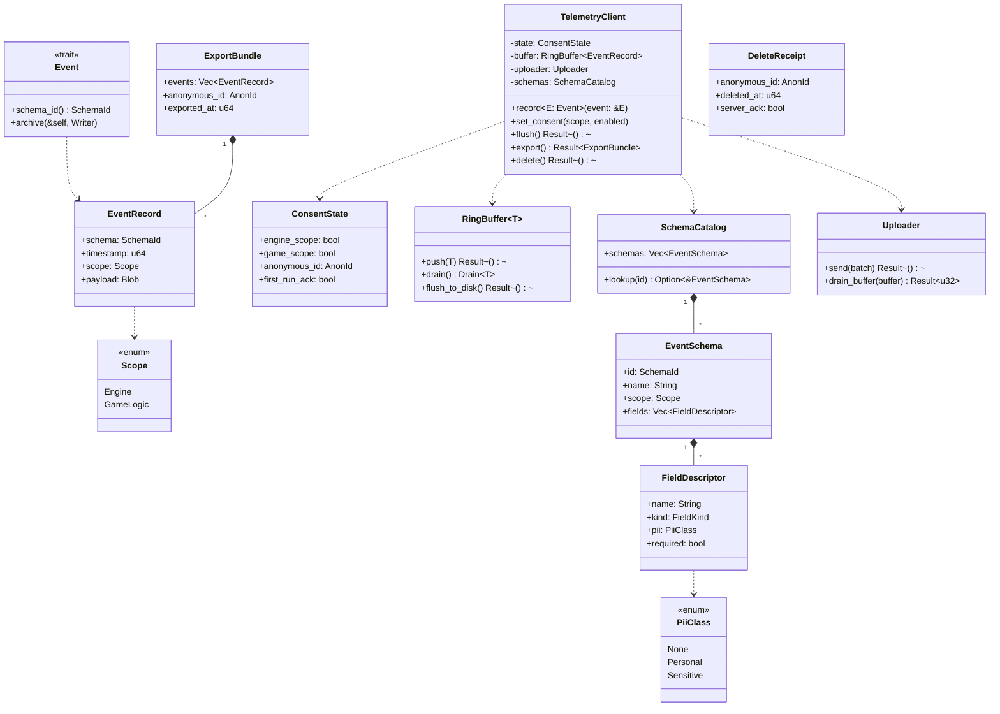
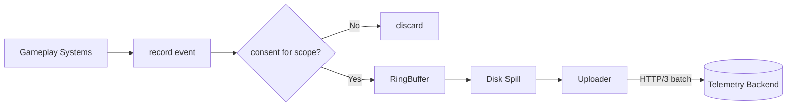
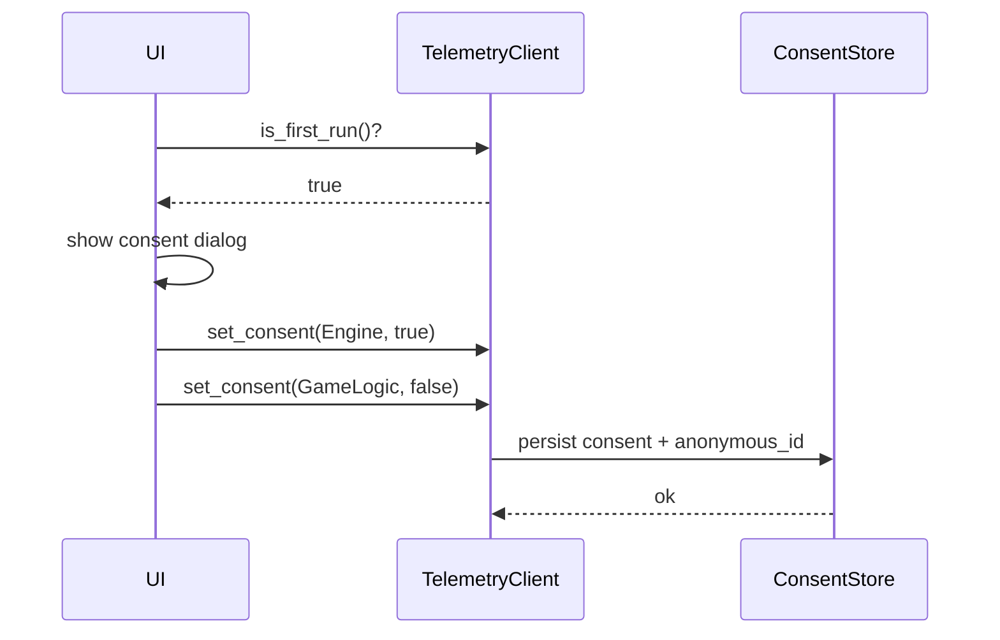
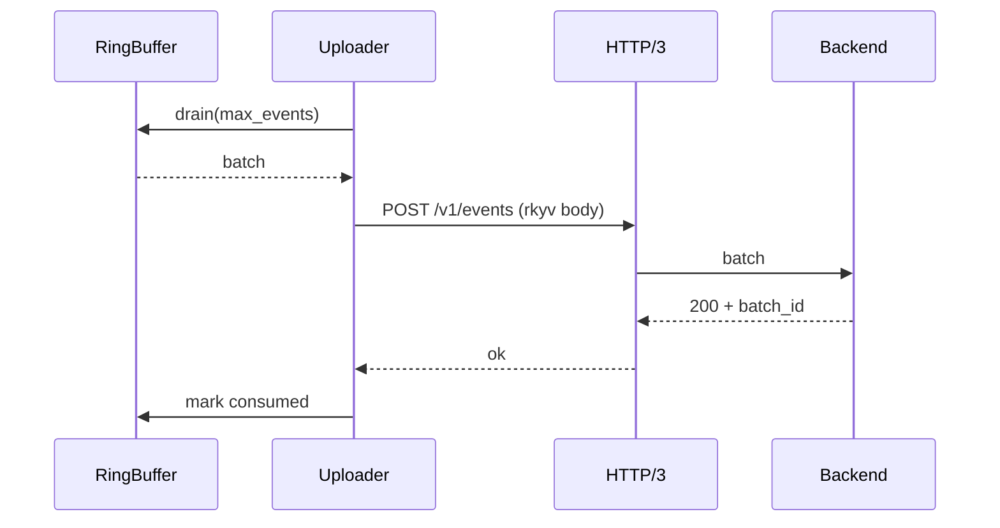
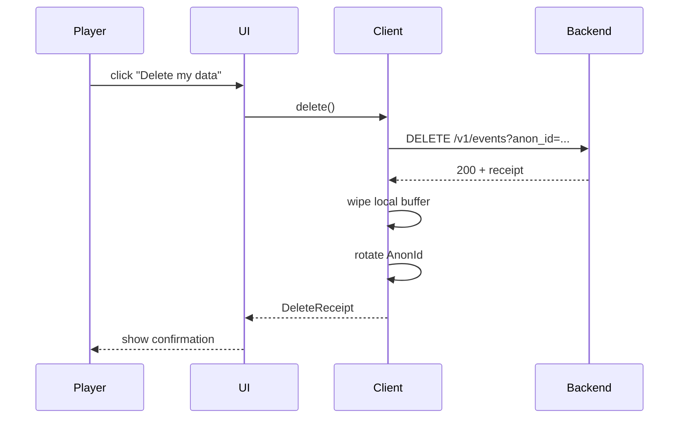
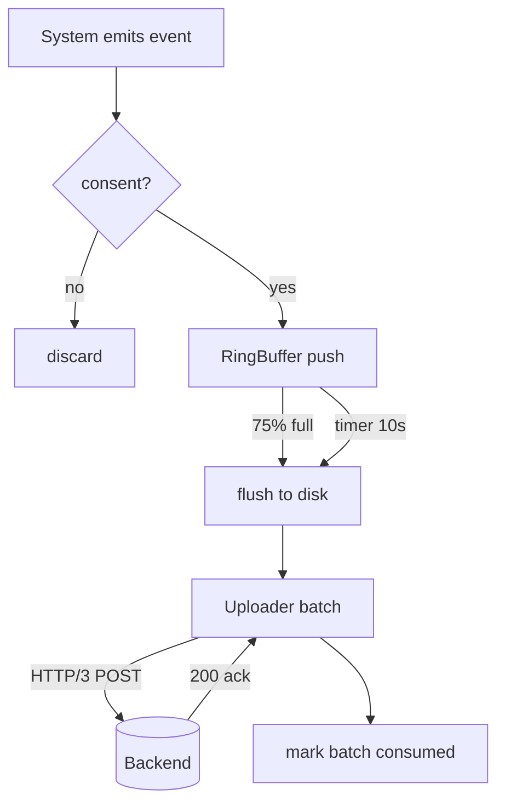

# Telemetry Design

## Requirements Trace

> **Canonical sources:** Features, requirements, and user stories live in
> [features/](../../features/), [requirements/](../../requirements/), and
> [user-stories/](../../user-stories/).

### Primary Requirements

| Feature   | Requirement | User Story   | Design Element                         |
|-----------|-------------|--------------|----------------------------------------|
| F-14.4.5  | R-14.4.5    | US-14.4.5    | `TelemetryClient` frontend             |
| F-14.5.1  | R-14.5.1    | US-14.5.1    | First-run opt-in flow                  |
| F-14.5.2  | R-14.5.2    | US-14.5.2    | Scope selector (engine / game-logic)   |
| F-14.5.3  | R-14.5.3    | US-14.5.3    | On-device buffer during offline        |
| F-14.5.4  | R-14.5.4    | US-14.5.4    | Batched QUIC upload                    |
| F-14.5.5  | R-14.5.5    | US-14.5.5    | GDPR export and delete endpoints       |
| F-14.5.6  | R-14.5.6    | US-14.5.6    | Event schema registry                  |

1. **R-14.4.5** -- Expose named counters for profiler, HUD, and telemetry to consume
2. **R-14.5.1** -- First launch prompts for opt-in; default off
3. **R-14.5.2** -- Two scopes: engine-only (perf, crashes) and game-logic (gameplay events)
4. **R-14.5.3** -- Offline buffer of bounded size on disk; events replay on reconnect
5. **R-14.5.4** -- Batches uploaded over HTTP/3 on interval or size thresholds
6. **R-14.5.5** -- Player can request a machine-readable export or deletion by anonymous id
7. **R-14.5.6** -- Events described by a schema with explicit field types and PII flags

### Cross-Cutting Dependencies

| Dependency      | Source    | Consumed API                         |
|-----------------|-----------|--------------------------------------|
| Platform I/O    | F-14.2    | `IoRequest` for disk buffer writes   |
| QUIC transport  | F-11.3.1  | HTTP/3 upload client                 |
| Credentials     | F-15.10.1 | Keyring for backend API key          |
| UI system       | F-10.1.1  | First-run consent dialog             |
| Event channels  | F-1.5.1   | ECS event reader -> telemetry sink   |

---

## Overview

The telemetry subsystem collects structured diagnostic and gameplay events, buffers them on disk,
and uploads them in batches to a backend service over HTTP/3. Collection is **opt-in**: no events
are sent until the player has explicitly enabled telemetry, and the scope (engine-only vs
game-logic) is independently controllable.

Event schemas are declared statically (via codegen from a data file) so that field types, required
flags, and PII classifications are known at compile time. This lets the compliance export and delete
paths operate on a stable, machine-readable catalog.

### Design Principles

1. **Opt-in by default** -- nothing is sent until the player agrees
2. **Scoped consent** -- engine and game-logic scopes toggle independently
3. **Statically declared events** -- codegen from `telemetry.events.data` produces event structs
4. **On-device buffering** -- events durably stored while offline; no data loss under 72h outage
5. **Batched upload** -- reduces QUIC handshake cost; respects bandwidth budget
6. **GDPR-first** -- export and delete endpoints are public parts of the API
7. **No PII without flags** -- every field is marked `PiiClass::None | Personal | Sensitive`

---

## Architecture

### Class Diagram



### Event Flow



---

## API Design

### Event Trait

```rust
pub trait Event: Sized {
    const SCHEMA: SchemaId;
    const SCOPE: Scope;
    fn archive(&self, out: &mut BlobWriter);
}
```

A codegen pass over `telemetry.events.data` emits one struct per declared event implementing
`Event`. Hand-written events are not permitted; the data file is the single source of truth.

### Client

```rust
pub struct TelemetryClient {
    state: ConsentState,
    buffer: RingBuffer<EventRecord>,
    uploader: Uploader,
    schemas: SchemaCatalog,
}

impl TelemetryClient {
    pub fn new(config: TelemetryConfig) -> Result<Self, TelemetryError>;
    pub fn record<E: Event>(&mut self, event: &E);
    pub fn set_consent(&mut self, scope: Scope, enabled: bool);
    pub fn consent(&self) -> ConsentState;
    pub fn flush(&mut self) -> Result<(), TelemetryError>;
    pub fn export(&self) -> Result<ExportBundle, TelemetryError>;
    pub fn delete(&mut self) -> Result<DeleteReceipt, TelemetryError>;
}
```

### Record Path

```rust
impl TelemetryClient {
    pub fn record<E: Event>(&mut self, event: &E) {
        let scope = E::SCOPE;
        if !self.state.consent_for(scope) {
            return;
        }
        let mut blob = BlobWriter::with_capacity(256);
        event.archive(&mut blob);
        let record = EventRecord {
            schema: E::SCHEMA,
            timestamp: now_millis(),
            scope,
            payload: blob.finish(),
        };
        let _ = self.buffer.push(record);
    }
}
```

### Event Schema Source

Example `telemetry.events.data`:

```text
event FrameTiming {
  scope = Engine
  field frame_ms: f32 required
  field gpu_ms: f32
  field draw_calls: u32
  field player_id: UserId pii = Personal
}

event LevelStart {
  scope = GameLogic
  field level_id: AssetId required
  field difficulty: u8
  field playtime_seconds: u64
}
```

Codegen emits:

```rust
pub struct FrameTiming {
    pub frame_ms: f32,
    pub gpu_ms: f32,
    pub draw_calls: u32,
    pub player_id: UserId,
}
impl Event for FrameTiming {
    const SCHEMA: SchemaId = SchemaId(0x0001);
    const SCOPE: Scope = Scope::Engine;
    fn archive(&self, out: &mut BlobWriter) { /* generated */ }
}
```

---

## Consent and Opt-In

### First-Run Flow



Consent state is stored at `<appdata>/telemetry/consent.rkyv`. An `AnonId` is a random 128-bit
identifier generated on first run; it has no connection to any account identity.

### Changing Consent Later

Changing consent from the settings UI immediately stops recording for the disabled scope. Any events
already in the buffer for that scope are discarded during the next `flush()` call.

---

## On-Device Buffering

| Property       | Value                                              |
|----------------|----------------------------------------------------|
| In-memory cap  | 16 MiB (`RingBuffer::push` returns Err if full)    |
| Disk cap       | 128 MiB (`RingBuffer::flush_to_disk` spill target) |
| Disk layout    | `<appdata>/telemetry/buffer/<seq>.rkyv`            |
| Flush triggers | every 10 s, or when in-memory > 75% full           |

When the uploader is offline, records are written to disk. The disk directory is a simple monotonic
sequence of batches; on startup any files present are scheduled for upload.

---

## Batched Upload



Upload triggers:

- Every 30 seconds if at least one event in buffer
- When in-memory buffer reaches 75% of capacity
- On explicit `flush()` call from editor Close or Quit

Failed uploads retry with exponential backoff; events remain on disk until acked.

---

## GDPR Compliance

### Export

```rust
pub struct ExportBundle {
    pub events: Vec<EventRecord>,
    pub anonymous_id: AnonId,
    pub exported_at: u64,
}
```

`export()` issues a `GET /v1/events?anon_id=...` to the backend, which returns every event the
backend still holds for that `AnonId`. The client writes it to a user-selected path as JSON.

### Delete

```rust
pub fn delete(&mut self) -> Result<DeleteReceipt, TelemetryError>;
```

`delete()` issues a `DELETE /v1/events?anon_id=...` and, on server ack, clears the local buffer and
rotates the `AnonId` to a fresh random value. Subsequent events use the new id.

### Right-to-Erase Flow



---

## Field Classification

Every field in every schema is tagged:

| Class     | Examples                                    | Export | Delete | Default |
|-----------|---------------------------------------------|--------|--------|---------|
| None      | frame time, draw calls                      | Yes    | Yes    | Yes     |
| Personal  | player id, hashed email, hardware id        | Yes    | Yes    | No      |
| Sensitive | precise geo, payment hints, health data     | Never  | Yes    | Never   |

Fields with `PiiClass::Sensitive` are forbidden from being emitted at all: the codegen step rejects
any schema declaration that tags a field `Sensitive`, forcing the schema author to remove or
relocate it.

---

## Platform Considerations

| Platform | Buffer Path                                      |
|----------|--------------------------------------------------|
| Windows  | `%APPDATA%/Harmonius/telemetry`                  |
| macOS    | `~/Library/Application Support/Harmonius/telemetry` |
| Linux    | `${XDG_DATA_HOME}/harmonius/telemetry`           |

All I/O is routed through the main-thread I/O bridge. Upload is a single HTTP/3 endpoint; no direct
socket work happens in any worker thread.

---

## Data Flow



---

## Test Plan

See [telemetry-test-cases.md](telemetry-test-cases.md) for TC-14.5.x.y entries:

- Unit tests for consent gating, schema catalog, record encoding
- Integration tests covering offline buffering, upload retry, export, delete
- Benchmarks for record latency and batch serialization

---

## Open Questions

1. Should consent default to on for internal dev builds but off for shipping?
2. How do we validate that a backend ack actually purged data (audit trail)?
3. Do we honor Do-Not-Track system settings on Windows/macOS as an implicit opt-out?
4. What is the quota for in-game event emission rate before we start sampling?
