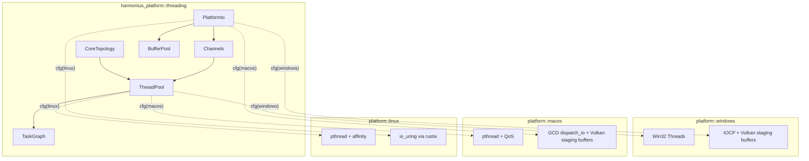
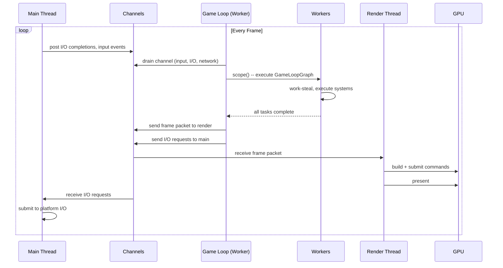
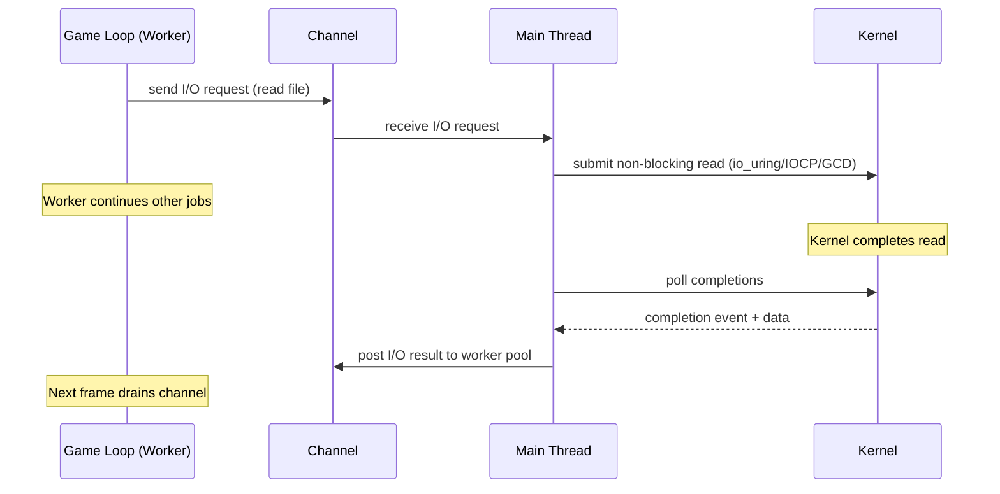
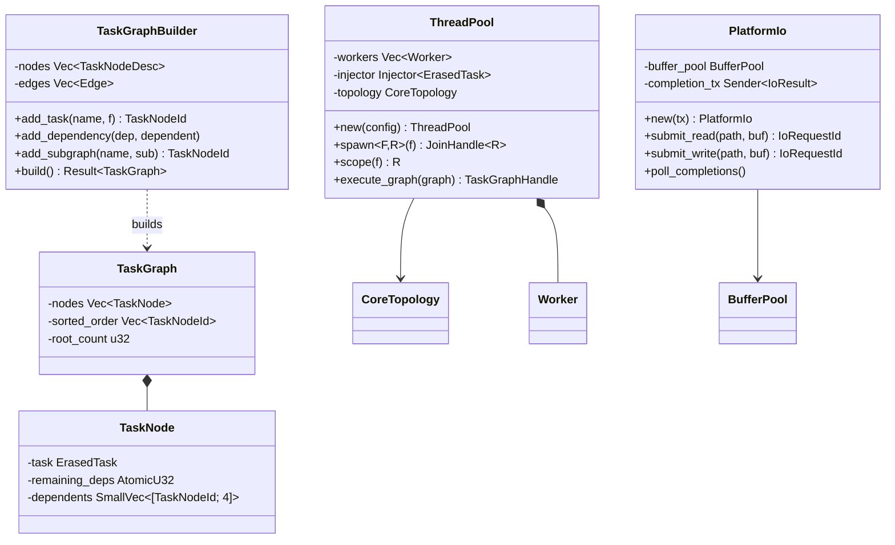
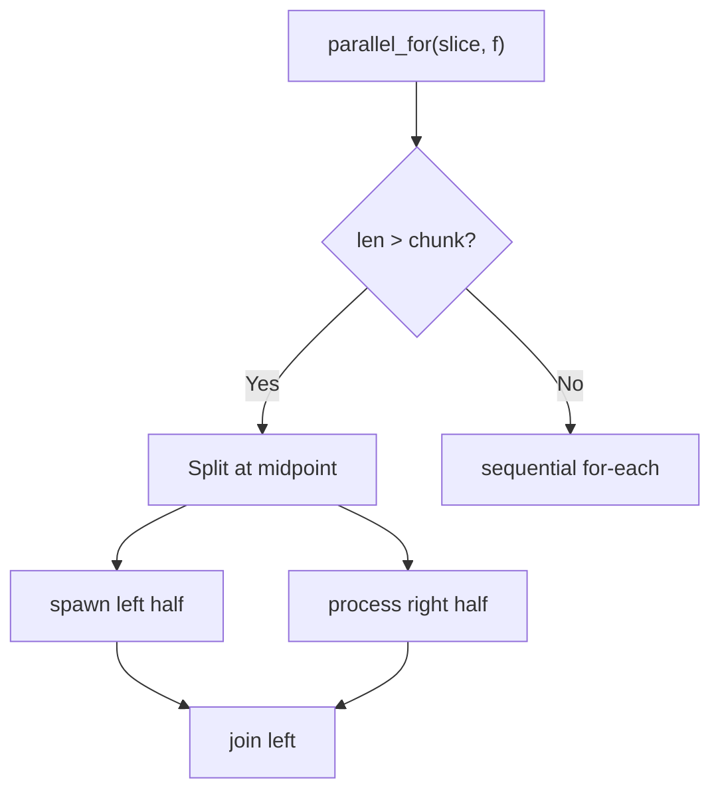
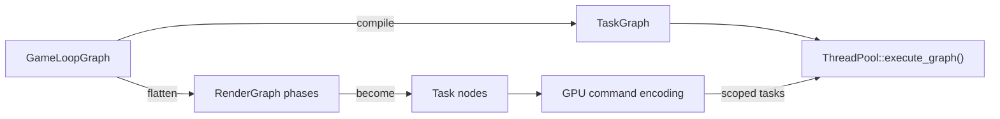

# Platform Threading Design

## Requirements Trace

> **Canonical sources:** Features, requirements, and user stories are defined in
> [features/platform/](../../features/), [requirements/platform/](../../requirements/), and
> [user-stories/platform/](../../user-stories/). The table below traces design elements to those
> definitions.

| Feature  | Requirement |
|----------|-------------|
| F-14.3.1 | R-14.3.1    |
| F-14.3.2 | R-14.3.2    |
| F-14.3.3 | R-14.3.3    |
| F-14.3.5 | R-14.3.5    |

1. **F-14.3.1** — Work-stealing thread pool sized to performance cores
2. **F-14.3.2** — Thread affinity and OS-level priority classes
3. **F-14.3.3** — DAG-based task graph with fan-out, fan-in, continuations, nested sub-graphs
4. **F-14.3.5** — Platform I/O completion bridge dispatching completions as task graph continuations
   (synchronous polling; see [../core-runtime/io.md](../core-runtime/io.md) for the request/handle
   pattern)

## Overview

The threading subsystem is the execution backbone of the Harmonius engine. It provides a custom
work-stealing job system, a DAG-based task graph, platform-native I/O, and channel-based
inter-thread communication. No shared mutable state, no mutexes, no `Arc`. All platform-specific
code is selected via `cfg` attributes -- no trait objects, no dynamic dispatch. No `async`, no
`await`, no `Future` — every job is synchronous.

Shared cache-aligned atomics and sorted key-value containers used by worker-local state come from
[../core-runtime/primitives.md](../core-runtime/primitives.md) (`CachePadded`, `SortedVecMap`). The
worker I/O request/handle pattern used to submit and poll platform I/O from worker threads is
defined in [../core-runtime/io.md](../core-runtime/io.md); threading consumes those primitives
without redefining them.

The engine uses three thread roles:

| Thread | Role | Core |
|--------|------|------|
| Workers (N) | Job system, ECS systems, data parallelism | P-cores |
| Main | OS event loop + I/O polling | E-core (hybrid) or shared |
| Render | GPU command building + submission | E-core (hybrid) or shared |

N = `num_performance_cores` on hybrid CPUs, `num_cores - 2` on non-hybrid. The game loop runs
**on a worker thread** -- when it calls `scope()`, the calling thread participates in work-stealing.
There is no dedicated game loop thread.

The main thread owns the OS event loop and all I/O polling. Platform I/O uses native APIs directly:
`io_uring` via `rustix` on Linux, IOCP via `windows-rs` on Windows, GCD `dispatch_io` via
`dispatch2` on Apple. I/O completions are posted as jobs to the worker pool via `crossbeam-channel`.
No blocking thread pool -- every traditionally blocking operation has a non-blocking platform
alternative.

The job system is built on `crossbeam-deque` (Chase-Lev work-stealing), `crossbeam-channel`
(lock-free inter-thread communication), and `crossbeam-utils` (`CachePadded`, scoped threads,
`Backoff`). It provides task parallelism (job graph execution), data-parallel primitives
(`par_for_each`, `join`, `scope`, `par_sort`), and QoS-based core scheduling (Apple QoS classes,
Windows Thread Director, Linux nice + EAS). No explicit core pinning.

The job system supports scoped execution (like `std::thread::scope`) so tasks can borrow from the
calling frame without `'static` or `Arc` overhead. All graph nodes are synchronous CPU work
dispatched to the worker pool. I/O results arrive via channels and are drained at frame start. Event
handlers are synchronous and run inline during dispatch.

## Architecture

### Module Boundaries



```text
harmonius_platform/
├── threading/
│   ├── topology.rs      # CoreTopology detection
│   ├── pool.rs          # ThreadPool, Worker, Scope,
│   │                    # work-stealing
│   ├── task.rs          # ErasedTask, inline closure
│   │                    # storage
│   ├── graph.rs         # TaskGraphBuilder, TaskGraph
│   ├── io.rs            # PlatformIo, I/O dispatch
│   ├── channel.rs       # Inter-thread channels
│   ├── event.rs         # EventHandler,
│   │                    # EventDispatcher
│   └── buffer.rs        # BufferPool, BufferSlot
└── platform/
    ├── windows/
    │   ├── threads.rs   # CreateThread,
    │   │                # SetThreadAffinityMask
    │   └── io.rs        # IOCP, Vulkan staging buffers
    ├── macos/
    │   ├── threads.rs   # pthread_create,
    │   │                # QoS classes
    │   └── io.rs        # GCD dispatch_io,
    │                    # Vulkan staging buffers
    └── linux/
        ├── threads.rs   # pthread_create,
        │                # pthread_setaffinity_np
        └── io.rs        # io_uring via rustix
```

### Frame Loop



### I/O Completion Flow



### Core Data Structures



### Work-Stealing Algorithm

Each worker maintains a local LIFO deque. The worker loop proceeds as:

1. **Try local** — pop from own deque (LIFO preserves cache locality).
2. **Try steal** — steal from a randomly-chosen victim's deque (FIFO end for fairness).
3. **Try global** — pop from the shared injector queue (external submissions).
4. **Park** — no work available; sleep on a condvar until woken by a submission.

When a task graph node completes, it atomically decrements the `remaining_deps` counter of each
dependent. If a dependent reaches zero, it is pushed onto the completing worker's local deque (hot
path) or the injector queue.

## API Design

### Core Topology

```rust
/// Identifies a logical CPU core.
#[derive(
    Clone, Copy, Debug, PartialEq, Eq, Hash,
)]
pub struct CoreId(pub u32);

/// CPU core topology distinguishing performance
/// and efficiency cores.
pub struct CoreTopology {
    pub performance_cores: Vec<CoreId>,
    pub efficiency_cores: Vec<CoreId>,
}

impl CoreTopology {
    /// Detect the core topology of the current CPU.
    /// On non-hybrid CPUs all cores are classified
    /// as performance.
    pub fn detect() -> Self;

    pub fn performance_core_count(&self) -> u32;
    pub fn efficiency_core_count(&self) -> u32;
    pub fn total_core_count(&self) -> u32;
}
```

### Thread Pool

```rust
pub struct ThreadPoolConfig {
    /// Number of worker threads. Defaults to
    /// P-core count on hybrid CPUs, or
    /// total_cores - 2 on non-hybrid.
    pub worker_count: Option<u32>,
    /// Name prefix for worker threads (debugger
    /// identification).
    pub name_prefix: &'static str,
}

/// Thread priority levels mapped to OS QoS.
#[derive(Clone, Copy, Debug, PartialEq, Eq)]
pub enum ThreadPriority {
    /// Worker threads on P-cores. Apple
    /// USER_INTERACTIVE, Windows high priority.
    High,
    /// General worker threads.
    Normal,
    /// Main thread (I/O polling), render thread.
    /// Scheduled on E-cores on hybrid CPUs.
    Low,
}

/// A work-stealing thread pool.
pub struct ThreadPool { /* ... */ }

impl ThreadPool {
    pub fn new(config: ThreadPoolConfig) -> Self;

    /// Spawn a one-off task with 'static lifetime.
    pub fn spawn<F, R>(&self, f: F) -> JoinHandle<R>
    where
        F: FnOnce() -> R + Send + 'static,
        R: Send + 'static;

    /// Scoped execution: tasks within the closure
    /// may borrow from the calling scope. All tasks
    /// are joined before `scope` returns. Modeled
    /// after `std::thread::scope`.
    pub fn scope<'scope, F, R>(&self, f: F) -> R
    where
        F: for<'s> FnOnce(
            &'s Scope<'scope>,
        ) -> R + Send;

    /// Submit a task graph for parallel execution.
    /// Blocks the calling thread until all tasks
    /// in the graph complete; returns a handle
    /// that can be used to query completion status.
    pub fn execute_graph(
        &self,
        graph: TaskGraph,
    ) -> JobHandle;

    pub fn worker_count(&self) -> u32;
    pub fn topology(&self) -> &CoreTopology;
}

/// A scope for spawning tasks that borrow from
/// the parent frame.
pub struct Scope<'scope> { /* ... */ }

impl<'scope> Scope<'scope> {
    /// Spawn a scoped task that may borrow data
    /// with lifetime 'scope. Scoped tasks are
    /// synchronous only -- I/O requests are sent
    /// via channels to the main thread.
    pub fn spawn<F, R>(
        &self,
        f: F,
    ) -> ScopedJoinHandle<'scope, R>
    where
        F: FnOnce() -> R + Send + 'scope,
        R: Send + 'scope;
}

/// Handle to a spawned task's result.
pub struct JoinHandle<R> { /* ... */ }

impl<R> JoinHandle<R> {
    pub fn is_complete(&self) -> bool;
    pub fn join(self) -> R;
}

/// Handle to a scoped task's result. Automatically
/// joined when the parent Scope exits.
pub struct ScopedJoinHandle<'scope, R> {
    /* ... */
}

impl<'scope, R> ScopedJoinHandle<'scope, R> {
    pub fn is_complete(&self) -> bool;
    pub fn join(self) -> R;
}
```

### Data-Level Parallelism

The job system provides data-parallel primitives built on the same `crossbeam-deque` work-stealing
pool. These compose with scoped borrowing -- no external runtime.

**Design.** All data-parallel operations use recursive splitting (fork-join) within a `Scope`. The
caller picks a chunk size or lets the system auto-tune based on core count and item count. Work is
split recursively until chunks reach the threshold, then processed sequentially per chunk. This
minimizes task spawn overhead while saturating all workers.

```rust
/// Configuration for data-parallel operations.
pub struct ParallelConfig {
    /// Minimum items per chunk before sequential
    /// fallback. Defaults to 1024.
    pub min_chunk_size: u32,
    /// Maximum splits (log2 of parallelism).
    /// Defaults to 2 * worker_count.
    pub max_splits: u32,
}

impl Default for ParallelConfig {
    fn default() -> Self {
        Self {
            min_chunk_size: 1024,
            max_splits: 0, // 0 = auto
        }
    }
}

impl<'scope> Scope<'scope> {
    /// Parallel for-each over a mutable slice.
    /// Splits `data` into chunks and processes
    /// each chunk on a worker thread. Borrows
    /// `data` for the duration — no 'static or
    /// Arc needed.
    pub fn parallel_for<T, F>(
        &self,
        data: &'scope mut [T],
        config: ParallelConfig,
        f: F,
    ) where
        T: Send + 'scope,
        F: Fn(&mut T) + Send + Sync + 'scope;

    /// Parallel for-each over an immutable slice.
    pub fn parallel_for_ref<T, F>(
        &self,
        data: &'scope [T],
        config: ParallelConfig,
        f: F,
    ) where
        T: Sync + 'scope,
        F: Fn(&T) + Send + Sync + 'scope;

    /// Parallel map: transforms each element,
    /// writing results into `out`. `data` and
    /// `out` must have equal length.
    pub fn parallel_map<T, U, F>(
        &self,
        data: &'scope [T],
        out: &'scope mut [U],
        config: ParallelConfig,
        f: F,
    ) where
        T: Sync + 'scope,
        U: Send + 'scope,
        F: Fn(&T) -> U + Send + Sync + 'scope;

    /// Parallel reduce: splits data, reduces
    /// each chunk with `reduce_fn`, then merges
    /// partial results with `combine_fn`.
    pub fn parallel_reduce<T, R, RF, CF>(
        &self,
        data: &'scope [T],
        config: ParallelConfig,
        identity: R,
        reduce_fn: RF,
        combine_fn: CF,
    ) -> R
    where
        T: Sync + 'scope,
        R: Send + Clone + 'scope,
        RF: Fn(R, &T) -> R + Send + Sync + 'scope,
        CF: Fn(R, R) -> R + Send + Sync + 'scope;

    /// Parallel for-each over two aligned slices
    /// (zip). Both slices must have equal length.
    pub fn parallel_for_zip<A, B, F>(
        &self,
        a: &'scope mut [A],
        b: &'scope [B],
        config: ParallelConfig,
        f: F,
    ) where
        A: Send + 'scope,
        B: Sync + 'scope,
        F: Fn(&mut A, &B) + Send + Sync + 'scope;

    /// Parallel for-each with index. The closure
    /// receives (global_index, &mut item).
    pub fn parallel_for_indexed<T, F>(
        &self,
        data: &'scope mut [T],
        config: ParallelConfig,
        f: F,
    ) where
        T: Send + 'scope,
        F: Fn(usize, &mut T)
            + Send + Sync + 'scope;
}
```

**Splitting algorithm.** `parallel_for` uses recursive bisection:



1. If `len <= min_chunk_size`, process sequentially in the current task.
2. Otherwise, split the slice at the midpoint.
3. Spawn the left half as a scoped task on the work-stealing deque.
4. Process the right half in the current task (avoids one spawn overhead).
5. Join the left half before returning.

This recursive halving produces `O(log N)` tasks with `O(1)` synchronization per split. The
work-stealing pool balances load across cores automatically.

**Chunk size auto-tuning.** When `max_splits` is 0 (default), the system computes:

```text
max_splits = 2 * worker_count
min_chunk_size = max(64, len / max_splits)
```

This bounds total task count to `4 * cores` while keeping chunks large enough to amortize spawn
overhead. The factor of 2 over-partitions slightly to handle uneven per-element cost.

**Integration with ECS.** The ECS `par_iter` calls `scope.parallel_for` internally, splitting at
archetype chunk boundaries. Each chunk is a contiguous SoA slice, so `parallel_for` receives
pre-aligned, cache-friendly data. The ECS scheduler ensures that `parallel_for` borrows are
compatible with the system's declared access set — no runtime borrow checking needed.

**Integration with job system.** Data-parallel operations are synchronous within a `Scope` -- they
block the calling task until all chunks complete. This is intentional: `parallel_for` is for
CPU-bound bulk work within a single system, not for I/O-bound work. The game loop thread
participates in work-stealing while waiting for scoped tasks to finish.

| Consumer | Primitive | Chunk Size | Notes |
|----------|-----------|-----------|-------|
| ECS par_iter | parallel_for | Archetype chunk (16 KiB) | Pre-split by archetype |
| Physics broadphase | parallel_for | 256 pairs | AABB overlap tests |
| Physics solver | parallel_for | 128 contacts | Constraint solving |
| Render culling | parallel_for_ref | 512 objects | Frustum test per object |
| AI perception | parallel_for_indexed | 64 queries | Budget-limited |
| Spatial index rebuild | parallel_reduce | 1024 nodes | BVH SAH evaluation |
| Asset processing | parallel_map | 1 asset | Coarse-grained |
| Particle update | parallel_for | 4096 particles | GPU fallback on mobile |

## Game Loop Graph

The game loop is not hardcoded. Each game defines its frame structure as a `GameLoopGraph` — a
high-level declarative DAG of `Phase` nodes. The graph is compiled once into a `TaskGraph` for
execution. When the active system set changes, the graph is recompiled.

### Concept

**GameLoopGraph** is a directed acyclic graph of phase nodes. Each phase contains ECS systems,
render passes, custom tasks, or nested sub-graphs. Edges express ordering constraints between
phases. The graph defines the frame structure for a specific game — physics-heavy simulations add
more physics sub-phases, render-heavy visualizers expand the render graph, and so on.

**Compilation.** `GameLoopGraph::compile()` transforms the declarative phase graph into an
executable `TaskGraph`:

1. Flatten phases into individual task nodes
2. Insert sync barriers for command buffer flushes
3. Resolve inter-system dependencies via access sets
4. Validate the DAG (cycle detection, access conflicts)
5. Produce a `CompiledFrame` with a `TaskGraph` and render submission ordering

**Render graph integration.** The render graph is a phase within the game loop graph. Render
extraction runs as scoped tasks on the worker pool. The compiled frame produces a render packet sent
to the render thread via `crossbeam-channel`. The render thread builds GPU commands and submits
independently.

**CPU work graph emulation.** Vulkan indirect dispatch allow GPU-driven scheduling of variable-rate
work. On platforms without native work graphs, the engine emulates them CPU-side by expanding work
graph nodes into indirect dispatch chains within the task graph. The task graph handles the fan-out.

### Compilation Pipeline



### Phase Types

```rust
/// A phase in the game loop graph.
pub enum PhaseNode {
    /// An ECS system phase (contains systems).
    Systems(SystemPhase),
    /// A render graph phase (contains render
    /// passes).
    RenderGraph(RenderGraphPhase),
    /// A custom task (user-defined closure).
    Task(TaskPhase),
    /// A sub-graph (nested phases).
    SubGraph(GameLoopGraph),
    /// A sync barrier (command buffer flush).
    Barrier,
}

/// High-level game loop structure. Defines one
/// frame as a DAG of phases.
pub struct GameLoopGraph {
    phases: Vec<PhaseNode>,
    edges: Vec<(PhaseId, PhaseId)>,
}

impl GameLoopGraph {
    pub fn new() -> Self;
    pub fn add_phase(
        &mut self,
        name: &'static str,
        node: PhaseNode,
    ) -> PhaseId;
    pub fn add_dependency(
        &mut self,
        before: PhaseId,
        after: PhaseId,
    );
    /// Compile the game loop graph into an
    /// executable task graph. Safe — validates
    /// the DAG (cycle detection, access conflicts)
    /// at compile time.
    pub fn compile(
        &self,
        world: &World,
        pool: &ThreadPool,
    ) -> Result<CompiledFrame, GraphError>;
}

/// A compiled frame ready for execution.
/// Immutable after compilation — can be reused
/// across frames with per-frame parameter binding.
pub struct CompiledFrame {
    task_graph: TaskGraph,
    render_submissions: Vec<RenderSubmission>,
}

impl CompiledFrame {
    /// Execute the frame. All task scheduling and
    /// parallel dispatch happen within this call.
    /// Safe — borrows are scoped to the frame.
    /// Render data is sent via the render channel.
    pub fn execute(
        &self,
        world: &mut World,
        pool: &ThreadPool,
        render_tx: &Sender<RenderPacket>,
    );
}
```

### Default Phase Table

Each engine subsystem maps to a phase in the graph. Games customize this by adding, removing, or
reordering phases.

| Phase | Type | Contains | Dependencies |
|-------|------|----------|-------------|
| Input | Systems | input polling, action mapping | None |
| Networking | Systems | receive, replication | Input |
| Physics | Systems | broadphase, integration, constraints | Networking |
| AI | Systems | perception, navigation, behavior | Physics |
| Animation | Systems | skeletal, procedural, cloth | Physics, AI |
| Game Logic | Systems | abilities, quests, progression | AI |
| Transform Propagation | Systems | hierarchy, global transforms | Animation, Logic |
| Render Extraction | Systems | extract visible, build draw calls | Transform |
| Render Graph | RenderGraph | culling, encoding, GPU submit | Extraction |
| Audio | Systems | spatial mix, stream, output | Transform |
| Cleanup | Barrier | command flush, entity cleanup | All |

### Safety Guarantees

- **Safe public API.** All public types and methods are safe Rust. No `unsafe` in user-facing types.
- **Compile-time access validation.** Graph compilation validates access patterns at build time —
  conflicting borrows are compile errors, not runtime panics.
- **Scoped execution.** All borrows are valid for the frame duration. The `CompiledFrame::execute`
  call scopes every task borrow to the frame lifetime.
- **Type-enforced exclusivity.** The type system prevents data races: `&World` for read-only
  systems, `&mut World` only at sync barriers.
- **Encapsulated internals.** Internal `unsafe` (work-stealing deque, platform FFI) is encapsulated
  behind safe abstractions with documented invariants.

### Task Graph

```rust
#[derive(
    Clone, Copy, Debug, PartialEq, Eq, Hash,
)]
pub struct TaskNodeId(pub(crate) u32);

#[derive(Clone, Copy, Debug, PartialEq, Eq)]
pub enum TaskPriority {
    /// Frame-critical work. Dispatched to
    /// performance cores first.
    High,
    /// Default priority.
    Normal,
    /// Background work. May use efficiency cores.
    Low,
}

pub struct TaskGraphBuilder { /* ... */ }

impl TaskGraphBuilder {
    pub fn new() -> Self;

    /// Add a synchronous task. All graph nodes
    /// are synchronous CPU work. I/O results
    /// arrive via channels and are drained at
    /// frame start.
    pub fn add_task<F>(
        &mut self,
        name: &'static str,
        f: F,
    ) -> TaskNodeId
    where
        F: FnOnce() + Send + 'static;

    /// Declare that `dependent` waits for
    /// `dependency`.
    pub fn add_dependency(
        &mut self,
        dependency: TaskNodeId,
        dependent: TaskNodeId,
    );

    /// Nested sub-graph whose completion acts as
    /// a single node.
    pub fn add_subgraph(
        &mut self,
        name: &'static str,
        subgraph: TaskGraph,
    ) -> TaskNodeId;

    /// Set the priority for a specific node.
    pub fn set_node_priority(
        &mut self,
        node: TaskNodeId,
        priority: TaskPriority,
    );

    /// Validate DAG (cycle detection) and produce
    /// an immutable graph.
    pub fn build(
        self,
    ) -> Result<TaskGraph, TaskGraphError>;
}

pub struct TaskGraph { /* ... */ }
```

### Platform I/O

The main thread owns all I/O polling. Platform I/O uses native APIs directly -- no runtime library.
I/O requests are sent from the game loop (worker thread) to the main thread via `crossbeam-channel`.
The main thread submits them to the platform I/O backend and posts completions back to the worker
pool via another channel.

| Platform | File I/O | Network I/O |
|----------|----------|-------------|
| Linux | io_uring via rustix | io_uring |
| Windows | IOCP via windows-rs | IOCP |
| Apple | GCD dispatch_io via dispatch2 | Networking.framework via objc2 |

GPU I/O (disk-to-GPU DMA):

| Platform | GPU I/O |
|----------|---------|
| Linux | N/A (staging buffer) |
| Windows | Vulkan staging buffers (GPU decompression) |
| Apple | Vulkan staging buffers (VkQueue transfer) |

```rust
/// Unique identifier for a submitted I/O request.
#[derive(
    Clone, Copy, Debug, PartialEq, Eq, Hash,
)]
pub struct IoRequestId(pub(crate) u64);

/// An I/O request sent from the game loop to the
/// main thread via crossbeam-channel.
pub enum IoRequest {
    Read {
        id: IoRequestId,
        path: PathBuf,
        buffer: BufferSlot,
    },
    Write {
        id: IoRequestId,
        path: PathBuf,
        buffer: BufferSlot,
    },
}

/// An I/O completion posted from the main thread
/// back to the worker pool via crossbeam-channel.
pub struct IoResult {
    pub id: IoRequestId,
    pub bytes_transferred: u32,
    pub buffer: BufferSlot,
    pub status: Result<(), IoError>,
}

/// Platform I/O driver. Owned by the main thread.
/// Submits requests to the OS and polls for
/// completions.
pub struct PlatformIo { /* ... */ }

impl PlatformIo {
    /// Create the platform I/O driver.
    /// Must be called from the main thread.
    pub fn new(
        completion_tx: Sender<IoResult>,
    ) -> Self;

    /// Submit a read request to the platform
    /// I/O backend (io_uring / IOCP / GCD).
    pub fn submit_read(
        &mut self,
        path: &Path,
        buffer: BufferSlot,
    ) -> IoRequestId;

    /// Submit a write request.
    pub fn submit_write(
        &mut self,
        path: &Path,
        buffer: BufferSlot,
    ) -> IoRequestId;

    /// Poll the platform I/O backend for
    /// completions. Posts results to the
    /// completion channel. Non-blocking.
    pub fn poll_completions(&mut self);
}

/// Pool of pre-allocated, aligned I/O buffers
/// for zero-copy.
pub struct BufferPool { /* ... */ }

pub struct BufferSlot { /* ... */ }

impl BufferPool {
    pub fn new(
        buffer_size: usize,
        count: u32,
    ) -> Self;
    pub fn acquire(&self) -> Option<BufferSlot>;
    pub fn release(&self, slot: BufferSlot);
}

impl BufferSlot {
    pub fn as_slice(&self) -> &[u8];
    pub fn as_mut_slice(&mut self) -> &mut [u8];
    pub fn len(&self) -> usize;
}
```

### Event Handlers

All event handlers are synchronous and run inline during dispatch. Handlers that need I/O send
requests via channels to the main thread.

```rust
/// Synchronous event handler — runs inline during
/// dispatch. All handlers are synchronous. I/O
/// requests are sent via channels, not awaited.
pub trait EventHandler<E> {
    fn handle(&mut self, event: &E);
}

/// Event dispatcher. All handlers run inline
/// during dispatch on the calling thread.
pub struct EventDispatcher<E> { /* ... */ }

impl<E: Send + Sync + 'static> EventDispatcher<E> {
    pub fn new() -> Self;

    pub fn subscribe<H>(
        &mut self,
        handler: H,
    ) where
        H: EventHandler<E> + Send + 'static;

    /// Dispatch an event. All handlers run inline
    /// on the calling thread.
    pub fn dispatch(&self, event: &E);
}
```

### Error Types

```rust
pub enum TaskGraphError {
    CycleDetected {
        cycle: Vec<TaskNodeId>,
    },
    InvalidDependency {
        from: TaskNodeId,
        to: TaskNodeId,
    },
    EmptyGraph,
}

pub enum IoError {
    NotFound,
    PermissionDenied,
    Cancelled,
    DeviceFull,
    /// Platform-specific error with OS error code.
    Platform { code: i32 },
}
```

## Data Flow

### Frame Lifecycle

The game loop runs on a worker thread. Each frame follows a simple channel-based pipeline: drain
inputs, execute the game loop graph on the worker pool, send results to the render and main threads.

```rust
// Game loop (runs ON a worker thread)
loop {
    // 1. Drain channel: input, timers, I/O results
    while let Ok(msg) = input_rx.try_recv() {
        world.handle_message(msg);
    }

    // 2. Execute GameLoopGraph on worker pool
    let graph = ecs.build_frame_graph();
    pool.scope(|s| {
        s.execute_graph(&graph, &mut world);
    });

    // 3. Send frame packet to render thread
    render_tx.send(world.extract_render_data());

    // 4. Send I/O/network requests to main thread
    for req in world.drain_io_requests() {
        io_tx.send(req);
    }
}
```

### I/O Completion Pipeline

1. The game loop sends an `IoRequest` to the main thread via `crossbeam-channel`.
2. The main thread submits the request to the platform I/O backend (`io_uring` / IOCP / GCD
   `dispatch_io`).
3. The main thread polls for completions in its event loop.
4. The OS kernel completes the operation out-of-band (no Rust `async`).
5. The main thread posts an `IoResult` back to the worker pool via `crossbeam-channel`.
6. The game loop drains `IoResult` messages at the start of the next frame.

No worker thread ever blocks on I/O. No blocking thread pool. All I/O goes through the platform I/O
layer on the main thread.

### Scoped Execution

```rust
pool.scope(|scope| {
    let physics =
        scope.spawn(|| world.step_physics());
    let culling =
        scope.spawn(|| world.frustum_cull(&camera));

    // Both run in parallel, borrowing &world
    // and &camera. The calling thread participates
    // in work-stealing while waiting.
    physics.join();
    culling.join();
});
```

## Platform Considerations

### Windows

| Component | API | Notes |
|-----------|-----|-------|
| Threads | `CreateThread` | Via `windows-rs` crate |
| Affinity | `SetThreadAffinityMask` | Bitmask per logical core |
| Priority | `SetThreadPriority` | Thread Director (Alder Lake+) |
| Hybrid detect | `cpuid` leaf 0x1A | Intel Thread Director |
| File I/O | IOCP | Via `windows-rs`, overlapped I/O |
| Network I/O | IOCP | Via `windows-rs` |
| GPU I/O | Vulkan staging buffers | Disk-to-GPU DMA |

### macOS

| Component | API |
|-----------|-----|
| Threads | `pthread_create` via objc2 |
| Affinity | QoS classes |
| Priority | QoS: `USER_INTERACTIVE` / `UTILITY` |
| Hybrid detect | `sysctl hw.nperflevels` |
| File I/O | GCD `dispatch_io` via dispatch2 |
| Network I/O | Networking.framework via objc2 |
| GPU I/O | Vulkan staging buffers (`VkQueue transfer`) |

1. **Threads** -- Via objc2
2. **Affinity** -- `pthread_set_qos_class_self_np` (no direct core pinning)
3. **Priority** -- macOS schedules P/E via QoS
4. **Hybrid detect** -- Apple Silicon P/E core counts
5. **File I/O** -- GCD `dispatch_io` via dispatch2. Main thread owns the CFRunLoop which integrates
   with GCD dispatch sources.
6. **Network I/O** -- Networking.framework via objc2
7. **GPU I/O** -- Vulkan staging buffers (`VkQueue transfer`) for disk-to-GPU DMA

### Linux

| Component | API |
|-----------|-----|
| Threads | `pthread_create` via rustix |
| Affinity | `pthread_setaffinity_np` |
| Priority | `sched_setscheduler` |
| Hybrid detect | `/sys/devices/system/cpu/` |
| File I/O | io_uring via rustix |
| Network I/O | io_uring via rustix |
| GPU I/O | N/A (staging buffer) |

1. **Threads** -- Via rustix
2. **Affinity** -- CPU set bitmask
3. **Priority** -- `SCHED_OTHER` + nice + EAS
4. **Hybrid detect** -- `cpuid` 0x1A or sysfs
5. **File I/O** -- io_uring via rustix. Main thread owns a custom event loop polling the io_uring
   completion queue.
6. **Network I/O** -- io_uring via rustix
7. **GPU I/O** -- N/A, uses CPU staging buffer

### Mobile and Console Platforms

| Platform | Thread Pool | I/O Backend |
|----------|-------------|-------------|
| iOS | Custom (shared) | GCD dispatch_io |
| Android | Custom (shared) | io_uring via rustix |
| Consoles | Platform thread API | Platform non-blocking I/O |

1. **iOS** -- QoS classes for thermal throttling. UIKit owns the OS main thread (`UIApplicationMain`
   / `CFRunLoop`), which also handles I/O polling via GCD dispatch sources. Input events (touch,
   accelerometer, keyboard) are forwarded to the worker pool via `crossbeam-channel`. The render
   thread presents independently via Vulkan.
2. **Android** -- Thread affinity respects big.LITTLE core topology. The main thread runs the
   `NativeActivity` event loop and I/O polling. Input events are forwarded via `crossbeam-channel`.
3. **Consoles** -- Vendor-specific thread affinity and priority. NDA APIs.

On all platforms, the main thread owns the OS event loop and I/O polling. The game loop runs on a
worker thread. The render thread handles GPU command building and submission.

Thread pool sizing adapts to core count: mobile devices typically have 4-8 cores with heterogeneous
performance. The `ThreadPool` constructor queries `std::thread::available_parallelism()` and applies
a platform-specific scaling factor.

### Scaling Tiers

| Tier | Core Count | Workers | Buffer Pool |
|------|-----------|---------|-------------|
| Mobile | 4 P + 4 E | 4 | 64 x 64 KiB |
| Desktop | 8 P + 8 E | 8 | 256 x 64 KiB |
| High-end | 16 P + 16 E | 16 | 512 x 64 KiB |

### Proposed Dependencies

| Crate | Purpose |
|-------|---------|
| `crossbeam-deque` | Work-stealing deques for job system |
| `crossbeam-channel` | Lock-free channels between threads |
| `crossbeam-utils` | `CachePadded`, scoped threads, `Backoff` |
| `dispatch2` | GCD dispatch_io, dispatch sources |
| `objc2` | Apple framework bindings (Vulkan, AppKit) |
| `rustix` | Linux syscalls (io_uring) |
| `smallvec` | Inline small collections |
| `windows-rs` | Windows APIs (IOCP, Vulkan staging buffers) |

## Safety Invariants

### Platform I/O Single-Threaded Access (Medium)

The `PlatformIo` driver is owned by the main thread. Only the main thread may call `submit_read()`,
`submit_write()`, or `poll_completions()`. Enforce via `debug_assert!` that the calling thread
matches the thread that created the driver. Store the main thread ID at `PlatformIo::new()` time and
assert against it.

### Channel Ownership (Low)

Each `crossbeam-channel` sender/receiver pair has a single owner thread. The main thread owns I/O
request receivers and I/O result senders. The game loop (worker) thread owns the corresponding
senders and receivers. The render thread owns its own channel pair. No channel endpoint is shared
across threads.

## Feasibility Notes

### I/O Latency Across Frames (Medium Risk)

I/O completions are drained at frame start. If the game loop has long CPU-bound phases, I/O results
are delayed until the next frame. **Mitigation:** The main thread posts completions immediately via
`crossbeam-channel`. The game loop drains at frame start and optionally mid-frame. At 60 fps,
worst-case latency is 16 ms. For latency- sensitive networking, the main thread can process urgent
network packets directly.

### Platform I/O API Divergence (Medium Risk)

Each platform has a different I/O API (`io_uring`, IOCP, GCD `dispatch_io`). The `PlatformIo`
abstraction must present a uniform interface despite different completion models. **Mitigation:**
The `IoRequest` / `IoResult` channel protocol is platform-agnostic. Only the `PlatformIo`
implementation differs per platform behind `cfg` attributes.

## Test Plan

### Unit Tests

| Test                                   | Req      |
|----------------------------------------|----------|
| `test_work_stealing_10k_jobs`          | R-14.3.1 |
| `test_worker_count_matches_perf_cores` | R-14.3.1 |
| `test_graph_fan_out_fan_in`            | R-14.3.3 |
| `test_graph_nested_subgraph`           | R-14.3.3 |
| `test_graph_cycle_detection`           | R-14.3.3 |
| `test_platform_io_read`               | R-14.3.5 |
| `test_channel_io_roundtrip`            | R-14.3.5 |
| `test_scoped_borrow_safety`            | R-14.3.1 |

1. **`test_work_stealing_10k_jobs`** -- Enqueue 10,000 jobs, verify all complete. Run under
   ThreadSanitizer.
2. **`test_worker_count_matches_perf_cores`** -- On hybrid CPU, assert workers = perf core count.
3. **`test_graph_fan_out_fan_in`** -- 1 root -> 4 parallel -> 1 join. Verify correct result.
4. **`test_graph_nested_subgraph`** -- Sub-graph completes before parent continuation.
5. **`test_graph_cycle_detection`** -- Cycle in graph -> `CycleDetected` error.
6. **`test_platform_io_read`** -- Submit read via `PlatformIo`, verify completion arrives via
   channel with correct data.
7. **`test_channel_io_roundtrip`** -- Send `IoRequest`, receive `IoResult`, verify data integrity.
8. **`test_scoped_borrow_safety`** -- Scoped tasks borrow from calling frame without `'static` or
   `Arc`.

### Integration Tests

| Test                         | Req      |
|------------------------------|----------|
| `test_affinity_per_platform` | R-14.3.2 |
| `test_platform_io_read_10mb` | R-14.3.5 |
| `test_utilization_imbalance` | R-14.3.1 |
| `test_channel_frame_drain`   | R-14.3.5 |
| `test_render_channel`        | R-14.3.5 |

1. **`test_affinity_per_platform`** -- Verify workers on P-cores, main and render on E-cores (hybrid
   CPUs).
2. **`test_platform_io_read_10mb`** -- 10 MB read via platform I/O, no worker blocks, data integrity
   check.
3. **`test_utilization_imbalance`** -- Imbalanced graph, assert >= 80% utilization.
4. **`test_channel_frame_drain`** -- Verify I/O results only appear in game loop after channel drain
   at frame start.
5. **`test_render_channel`** -- Verify render packets arrive on render thread via channel.

### Benchmarks

| Benchmark | Target | Source |
|-----------|--------|--------|
| Job dispatch overhead | < 1 us per dispatch | US-14.3.11 |
| Work-stealing utilization | >= 80% across workers | R-14.3.1 |
| Channel send/recv | < 100 ns per message | - |
| Platform I/O poll (100 completions) | < 50 us | US-14.3.10 |
| I/O throughput | >= 80% raw disk bandwidth | US-14.6.11 |

## Design Q & A

**Q1. What is the biggest constraint limiting this design?**

Platform I/O API divergence is the most limiting. Each platform has a different completion I/O model
(`io_uring`, IOCP, GCD `dispatch_io`), and the `PlatformIo` abstraction must present a uniform
interface. Lifting this would require a cross-platform I/O library, but existing options create
unwanted threads or add unnecessary abstraction layers, so the engine talks to platform APIs
directly.

**Q2. How can this design be improved?**

I/O latency is bounded by the frame drain rate. At 60 fps, worst-case latency is 16 ms. For
latency-sensitive networking, the main thread could process urgent network packets directly without
waiting for the game loop to drain. An adaptive strategy that flags high-priority I/O results for
immediate processing would reduce worst-case latency.

**Q3. Is there a better approach?**

**Rejected alternative:** Using Rayon for the work-stealing thread pool would provide a
battle-tested implementation with excellent steal heuristics. We are not using it because Rayon
creates its own global thread pool, which conflicts with our three-thread model and QoS-based core
scheduling. Building a custom job system on `crossbeam-deque` gives us full control over worker
count, core affinity, and integration with the channel-based I/O pipeline.

**Q4. Does this design solve all customer problems?**

Missing: a mechanism for tasks to report their progress (0-100%) for loading screen UIs. Adding
progress reporting would enable loading bars for asset streaming, procedural generation, and world
loading (US-14.3.20). Deep-recursion workloads (procedural generation, pathfinding) use normal 8 MB
worker stacks -- no special fiber infrastructure needed.

**Q5. Is this design cohesive with the overall engine?**

The threading subsystem is the execution backbone referenced by every other design. Platform-native
I/O provides optimal performance per platform, used consistently by networking (transport,
replication), platform I/O (filesystem, clipboard), and database access (MMO persistence). The
work-stealing pool with scoped execution matches the physics and rendering designs' parallel
iteration patterns. Channels between threads eliminate shared mutable state. All proposed
dependencies (`crossbeam-deque`, `crossbeam-channel`, `crossbeam-utils`, `rustix`, `windows-rs`,
`objc2`, `dispatch2`) are low-level libraries consistent with the no-frameworks guideline.

## Open Questions

1. **Work-stealing victim selection** -- Randomized vs round-robin. Randomized avoids contention
   patterns but may increase steal latency.
2. **Task inline storage** -- Size of inline buffer for `ErasedTask` before heap fallback (64 bytes
   = cache line, 128 bytes = more coverage).
3. **Channel backpressure** -- If the main thread's I/O completion channel fills up, should the main
   thread block or drop? Bounded channels prevent unbounded memory growth but risk stalling I/O.
4. **GPU fence integration** -- GPU present/fence wait on the render thread. Need to define how GPU
   completion events (Vulkan timeline semaphores, Vulkan command buffer completion handlers, Vulkan
   fence) integrate with the render thread's event loop.
5. **io_uring kernel version** -- io_uring requires Linux 5.1+. Some operations (non-blocking DNS,
   OPENAT) require 5.19+. Determine minimum kernel version and fallback strategy.

## Review feedback

### Architecture changes

The following changes were accepted during design review.

#### Three-thread model

Replace the current threading architecture with three dedicated threads communicating via channels.
No shared mutable state.

| Thread | Owns | Handles |
|--------|------|---------|
| Main | OS event loop, platform-native I/O | Window, input, timers, all I/O |
| Game loop | ECS, GameLoopGraph, custom job system | Simulation only — drains one channel |
| Render | GPU | Draw calls, GPU uploads |

The game loop thread touches zero OS APIs. All OS interaction is consolidated on the main thread.
The render thread only does GPU work and never performs file I/O.

#### Remove Tokio — use platform-native I/O

The engine uses platform-native completion-based I/O directly, no async runtime:

| Platform | File / Network I/O                                  |
|----------|------------------------------------------------------|
| Linux    | `io_uring` via `rustix`                              |
| Windows  | IOCP via `windows-rs`                                |
| Apple    | `dispatch_io` via `dispatch2`; `Networking.framework` via `objc2` |

The platform layer handles both file I/O and network I/O through one engine-side request/handle
API. It replaces Tokio, mio, and all third-party cross-platform I/O wrappers.

**Future optimization**: Vulkan staging buffers can be added later for disk-to-GPU DMA transfers,
bypassing CPU memory for GPU assets (textures, mesh buffers). This is an optimization on top of
the platform-native I/O layer, not a replacement.

#### Remove custom thread pool — use Rayon

Rayon replaces all custom work-stealing and data-parallel code:

| Removed | Replaced by |
|---------|-------------|
| Custom work-stealing pool | Rayon thread pool |
| `parallel_for`, `parallel_map`, `parallel_reduce` | `rayon::par_iter()` |
| `parallel_for_zip`, `parallel_for_indexed` | `rayon::par_iter().zip()` |
| Custom scoped execution | `rayon::scope()` |

#### Remove fibers

Fibers (all platforms) are removed entirely. Rayon threads have normal 8 MB stacks — deep recursion
works. Long-running work splits into chunks across frames.

#### Remove custom async primitives

`AsyncMutex`, `AsyncRwLock`, `AsyncBarrier` are removed. Channels between threads eliminate shared
mutable state.

#### Main thread owns timers

Platform timer APIs (`CFRunLoopTimer`, `SetTimer`, `timerfd`) run on the main thread's event loop.
Timer events flow to the game loop via the input channel.

### GameLoopGraph simplification

All graph nodes are synchronous CPU work dispatched to the worker pool. No mixed node types, no
`async`, no `await`. I/O results arrive via channels and are drained at frame start using the
pattern from [../core-runtime/io.md](../core-runtime/io.md).

```text
Game Loop Thread (one frame):
  1. Drain channel (input, timers, I/O results, network)
  2. Execute GameLoopGraph (Rayon dispatches nodes)
  3. Send frame packet to render thread
  4. Send I/O/network requests to main thread
```

### Asset I/O model

Assets use a state machine that advances each frame:

1. `Queued` — load requested, handle returned immediately
2. `Loading` — platform-native read in flight
3. `BytesReady` — I/O complete, bytes in CPU memory
4. `Processing` — CPU work (parse, build BVH)
5. `DepsNeeded` — discovered sub-assets, queue more I/O
6. `WaitingOnDeps` — sub-assets loading
7. `Ready` — fully loaded, available to systems

GPU assets flow: platform-native reads to CPU memory, game loop sends data in frame packet, render thread
uploads to GPU.

**Future optimization**: Vulkan staging buffers (Windows) and Vulkan staging buffers (macOS) add
disk-to-GPU DMA, skipping the CPU memory hop for GPU assets. The asset pipeline would pre-split
files:

| File | Destination | Path |
|------|-------------|------|
| `sword.mesh.gpu` | GPU-direct (DMA) | Vertex/index buffers |
| `sword.mesh.cpu` | CPU memory | BVH, collision data |
| `sword.tex.gpu` | GPU-direct (DMA) | Compressed texture |
| `forest.scene` | CPU memory | Scene graph, metadata |

### Revised dependency list (superseded)

> **Superseded** by the `RF-NEW [APPLIED]: Revised dependencies` table further down. The current
> dependency set drops both `rayon` and `compio` in favour of the custom `crossbeam-deque` job
> system and direct platform-native I/O. This subsection is preserved for traceability of the
> review history.

### Open items from review

1. Core topology / P-core vs E-core affinity — neither prior candidate exposes this; the custom
   job system handles it directly
2. `set_priority` on `TaskGraphBuilder` is global, not per-node — needs
   `set_node_priority(TaskNodeId, TaskPriority)` for mixed priority graphs
3. HTTP client for cloud services — synchronous request/handle on top of platform-native I/O
   (no blocking HTTP, no async runtime)
4. Test cases needed for `GameLoopGraph::compile()`, `CompiledFrame::execute()`, and
   `EventDispatcher`

### RF-NEW [APPLIED]: Replace Rayon with custom job system

Drop the `rayon` dependency. Build a custom job system using `crossbeam-deque` (Chase-Lev
work-stealing), `crossbeam-channel` (inter-thread communication), and `crossbeam-utils`
(CachePadded, scoped threads, Backoff).

The job system provides:

1. **Task parallelism** -- job graph execution for ECS systems, render extraction
2. **Data-parallel primitives** -- `par_iter`, `par_for_each`, `join`, `scope`, `par_sort` built on
   the same work-stealing deques
3. **Thread count control** -- workers = P-cores on hybrid CPUs, all cores - 2 on non-hybrid
4. **QoS-based core scheduling** -- Apple QoS classes, Windows Thread Director, Linux nice + EAS. No
   explicit core pinning.

Worker loop: pop from own deque (LIFO, cache-warm) then steal from random worker (FIFO) then spin
briefly then park.

The game loop runs ON a worker thread. When it calls `scope()`, the calling thread participates in
work-stealing. No dedicated game loop thread.

### RF-NEW [APPLIED]: Replace compio with platform-native I/O

Drop the `compio` dependency. compio creates 1 thread per core, doubling thread count when combined
with the job system. Replace with direct platform I/O APIs:

| Platform | File I/O | Network I/O |
|----------|----------|-------------|
| Linux | io_uring via rustix | io_uring |
| Windows | IOCP via windows-rs | IOCP |
| Apple | GCD dispatch_io via dispatch2 | Networking.framework via objc2 |

GPU I/O (disk-to-GPU DMA):

| Platform | GPU I/O |
|----------|---------|
| Linux | N/A (staging buffer) |
| Windows | Vulkan staging buffers (GPU decompression) |
| Apple | Vulkan staging buffers (VkQueue transfer) |

The main thread owns the OS event loop AND I/O polling -- no separate I/O thread:

- Apple: CFRunLoop integrates with GCD dispatch sources and kqueue
- Windows: message pump + MsgWaitForMultipleObjects for IOCP
- Linux: custom loop polling io_uring completion queue

I/O completions are posted as jobs to the compute worker pool via crossbeam-channel.

### RF-NEW [APPLIED]: No blocking thread pool

Every traditionally blocking operation has a non-blocking platform alternative:

| Blocking Op | Non-Blocking Alternative |
|-------------|-------------------------|
| DNS | io_uring (Linux 5.19+), Networking.framework (Apple), `GetAddrInfoExW` (Windows) |
| File stat | io_uring STATX, IOCP, GCD dispatch_io |
| File open | io_uring OPENAT, IOCP overlapped, GCD |
| Directory listing | io_uring GETDENTS, platform equivalents |

No blocking pool. All I/O goes through the platform I/O layer.

### RF-NEW [APPLIED]: Revised thread model

| Thread | Role | Core |
|--------|------|------|
| Workers (N) | Job system, ECS systems, data parallelism | P-cores |
| Main | OS event loop + I/O polling | E-core (hybrid) or shared |
| Render | GPU command building + submission | E-core (hybrid) or shared |

N = num_performance_cores on hybrid, num_cores - 2 on non-hybrid.

Communication: crossbeam-channel (lock-free) between all threads. No shared mutable state, no
mutexes, no Arc.

### RF-NEW [APPLIED]: Revised dependencies

| Crate | Purpose |
|-------|---------|
| crossbeam-deque | Work-stealing deques for job system |
| crossbeam-channel | Lock-free channels between threads |
| crossbeam-utils | CachePadded, scoped threads, Backoff |
| rustix | Linux syscalls (io_uring) |
| windows-rs | Windows APIs (IOCP, Vulkan staging buffers) |
| objc2 + dispatch2 | Apple APIs (GCD, Vulkan staging buffers, Networking.framework) |

Removed: rayon, compio. These are replaced by the custom job system and platform-native I/O.
