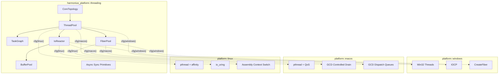
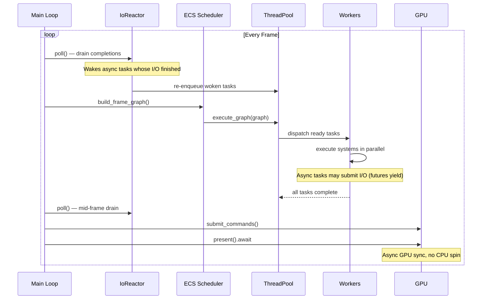
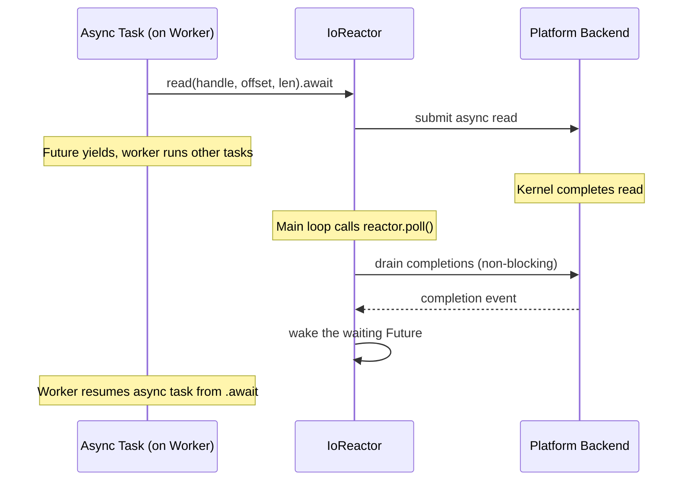
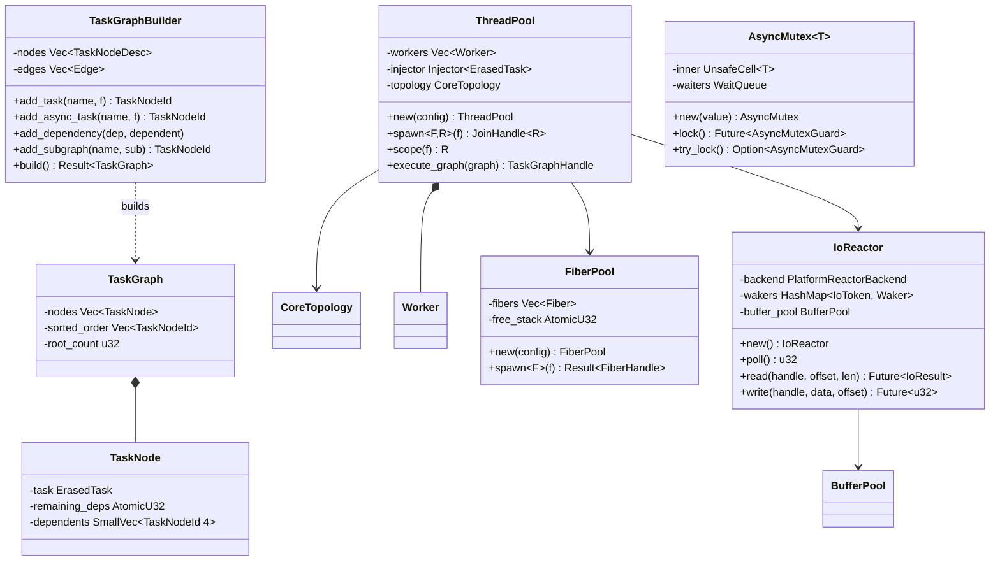
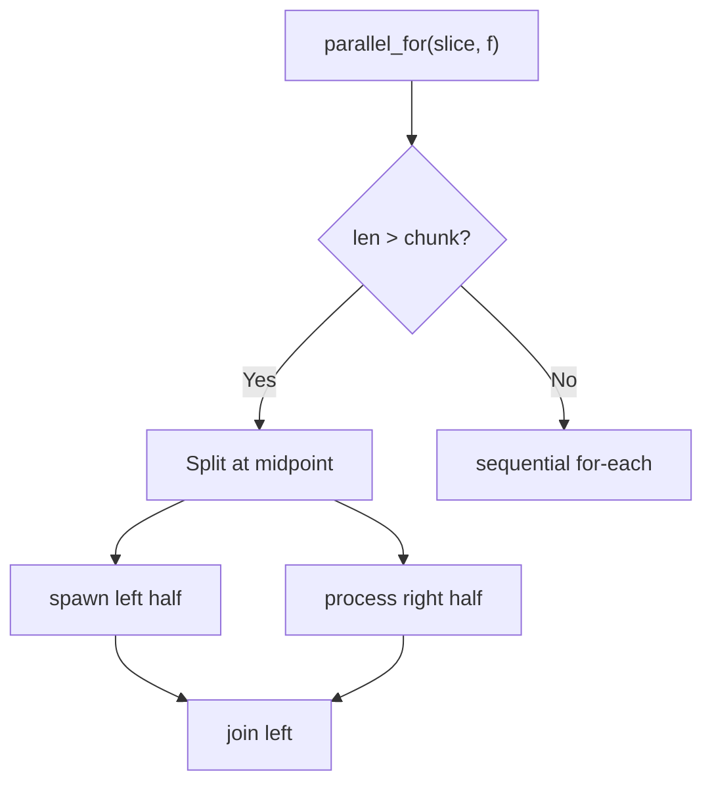
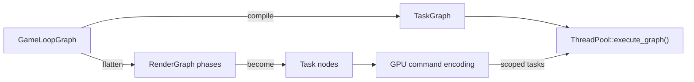

# Platform Threading Design

## Requirements Trace

> **Canonical sources:** Features, requirements, and user stories are defined in
> [features/platform/](../../features/platform/),
> [requirements/platform/](../../requirements/platform/), and
> [user-stories/platform/](../../user-stories/platform/). The table below traces design elements to
> those definitions.

| Feature | Requirement | Description |
|---------|-------------|-------------|
| F-14.3.1 | R-14.3.1 | Work-stealing thread pool sized to performance cores |
| F-14.3.2 | R-14.3.2 | Thread affinity and OS-level priority classes |
| F-14.3.3 | R-14.3.3 | DAG-based task graph with fan-out, fan-in, continuations, nested sub-graphs |
| F-14.3.4 | R-14.3.4 | Lightweight fibers with 64 KiB stacks and guard pages |
| F-14.3.5 | R-14.3.5 | Platform async I/O bridge dispatching completions as task graph continuations |

## Overview

The threading subsystem is the execution backbone of the Harmonius engine. It provides a
work-stealing thread pool, a DAG-based task graph, a non-blocking I/O reactor, lightweight fibers,
and async-aware synchronization primitives. All asynchronous abstractions — I/O, GPU
synchronization, long waits, and frame-boundary yields — use Rust's `async`/`await`. No callbacks.
Synchronous blocking is only permitted for sub-microsecond critical sections.

The game loop owns a **reactor** — the single point where I/O completions are harvested from the OS.
Each frame, the loop calls `reactor.poll()` at a defined point, draining platform completion queues
(IOCP on Windows, controlled GCD dispatch drain on macOS, io_uring on Linux). This wakes any async
tasks whose I/O has finished, which are then resumed on worker threads. The engine controls exactly
when callbacks fire — never the OS asynchronously.

The thread pool supports scoped execution (like `std::thread::scope`) so tasks can borrow from the
calling frame without `'static` or `Arc` overhead. Fibers remain available for deep-call-stack
workloads (recursive procedural generation, pathfinding) that cannot be expressed as async state
machines. On macOS, fibers are implemented using GCD dispatch queues and blocks. Event handlers
support both synchronous and asynchronous variants. All platform-specific code is selected via `cfg`
attributes — no trait objects, no dynamic dispatch.

Metal uses Dispatch for command buffer completion handlers, making GCD integration a hard
requirement on macOS. The threading subsystem leverages this shared dependency for both fiber
scheduling and async I/O.

## Architecture

### Module Boundaries



```text
harmonius_platform/
├── threading/
│   ├── topology.rs      # CoreTopology detection
│   ├── pool.rs          # ThreadPool, Worker, Scope,
│   │                    # work-stealing
│   ├── task.rs          # ErasedTask, inline closure
│   │                    # storage
│   ├── graph.rs         # TaskGraphBuilder, TaskGraph
│   ├── reactor.rs       # IoReactor, frame poll point
│   ├── fiber.rs         # FiberPool, FiberYielder
│   ├── sync.rs          # AsyncMutex, AsyncRwLock,
│   │                    # AsyncBarrier
│   ├── event.rs         # EventHandler,
│   │                    # AsyncEventHandler
│   └── buffer.rs        # BufferPool, BufferSlot
└── platform/
    ├── windows/
    │   ├── threads.rs   # CreateThread,
    │   │                # SetThreadAffinityMask
    │   ├── iocp.rs      # IOCP reactor backend
    │   └── fibers.rs    # CreateFiber,
    │                    # SwitchToFiber
    ├── macos/
    │   ├── threads.rs   # pthread_create,
    │   │                # QoS classes
    │   ├── gcd.rs       # dispatch_io, controlled
    │   │                # queue drain
    │   └── fibers.rs    # GCD dispatch queues
    │                    # and blocks
    └── linux/
        ├── threads.rs   # pthread_create,
        │                # pthread_setaffinity_np
        ├── io_uring.rs  # io_uring reactor backend
        └── fibers.rs    # setjmp/longjmp assembly
                         # context switch
```

### Frame Loop and Reactor Poll Point



### Async I/O Completion Flow



### Core Data Structures



### Work-Stealing Algorithm

Each worker maintains a local LIFO deque. The worker loop proceeds as:

1. **Try local** — pop from own deque (LIFO preserves cache locality).
2. **Try steal** — steal from a randomly-chosen victim's deque (FIFO end for fairness).
3. **Try global** — pop from the shared injector queue (external submissions).
4. **Park** — no work available; sleep on a condvar until woken by a submission.

When a task graph node completes, it atomically decrements the `remaining_deps` counter of each
dependent. If a dependent reaches zero, it is pushed onto the completing worker's local deque (hot
path) or the injector queue.

## API Design

### Core Topology

```rust
/// Identifies a logical CPU core.
#[derive(
    Clone, Copy, Debug, PartialEq, Eq, Hash,
)]
pub struct CoreId(pub u32);

/// CPU core topology distinguishing performance
/// and efficiency cores.
pub struct CoreTopology {
    pub performance_cores: Vec<CoreId>,
    pub efficiency_cores: Vec<CoreId>,
}

impl CoreTopology {
    /// Detect the core topology of the current CPU.
    /// On non-hybrid CPUs all cores are classified
    /// as performance.
    pub fn detect() -> Self;

    pub fn performance_core_count(&self) -> u32;
    pub fn efficiency_core_count(&self) -> u32;
    pub fn total_core_count(&self) -> u32;
}
```

### Thread Pool

```rust
pub struct ThreadPoolConfig {
    /// Number of worker threads. Defaults to
    /// performance core count.
    pub worker_count: Option<u32>,
    /// Name prefix for worker threads (debugger
    /// identification).
    pub name_prefix: &'static str,
}

/// Thread priority levels.
#[derive(Clone, Copy, Debug, PartialEq, Eq)]
pub enum ThreadPriority {
    /// Main thread, render submission. Pinned to
    /// performance cores.
    High,
    /// General worker threads.
    Normal,
    /// Background I/O, telemetry. Pinned to
    /// efficiency cores.
    Low,
}

/// A work-stealing thread pool.
pub struct ThreadPool { /* ... */ }

impl ThreadPool {
    pub fn new(config: ThreadPoolConfig) -> Self;

    /// Spawn a one-off task with 'static lifetime.
    pub fn spawn<F, R>(&self, f: F) -> JoinHandle<R>
    where
        F: FnOnce() -> R + Send + 'static,
        R: Send + 'static;

    /// Scoped execution: tasks within the closure
    /// may borrow from the calling scope. All tasks
    /// are joined before `scope` returns. Modeled
    /// after `std::thread::scope`.
    pub fn scope<'scope, F, R>(&self, f: F) -> R
    where
        F: for<'s> FnOnce(
            &'s Scope<'scope>,
        ) -> R + Send;

    /// Submit a task graph for parallel execution.
    /// Returns a future that resolves when all
    /// tasks in the graph complete.
    pub fn execute_graph(
        &self,
        graph: TaskGraph,
    ) -> impl Future<Output = ()> + Send;

    pub fn worker_count(&self) -> u32;
    pub fn topology(&self) -> &CoreTopology;
}

/// A scope for spawning tasks that borrow from
/// the parent frame.
pub struct Scope<'scope> { /* ... */ }

impl<'scope> Scope<'scope> {
    /// Spawn a scoped task that may borrow data
    /// with lifetime 'scope.
    pub fn spawn<F, R>(
        &self,
        f: F,
    ) -> ScopedJoinHandle<'scope, R>
    where
        F: FnOnce() -> R + Send + 'scope,
        R: Send + 'scope;

    /// Spawn a scoped async task.
    pub fn spawn_async<F, Fut, R>(
        &self,
        f: F,
    ) -> ScopedJoinHandle<'scope, R>
    where
        F: FnOnce() -> Fut + Send + 'scope,
        Fut: Future<Output = R> + Send + 'scope,
        R: Send + 'scope;
}

/// Handle to a spawned task's result.
pub struct JoinHandle<R> { /* ... */ }

impl<R> JoinHandle<R> {
    pub fn is_complete(&self) -> bool;
    pub fn join(self) -> R;
}

/// Handle to a scoped task's result. Automatically
/// joined when the parent Scope exits.
pub struct ScopedJoinHandle<'scope, R> {
    /* ... */
}

impl<'scope, R> ScopedJoinHandle<'scope, R> {
    pub fn is_complete(&self) -> bool;
    pub fn join(self) -> R;
}
```

### Data-Level Parallelism

The threading subsystem provides rayon-style data-parallel primitives integrated into the custom
work-stealing pool. These compose with the async executor and scoped borrowing — no external
runtime.

**Design.** All data-parallel operations use recursive splitting (fork-join) within a `Scope`. The
caller picks a chunk size or lets the system auto-tune based on core count and item count. Work is
split recursively until chunks reach the threshold, then processed sequentially per chunk. This
minimizes task spawn overhead while saturating all workers.

```rust
/// Configuration for data-parallel operations.
pub struct ParallelConfig {
    /// Minimum items per chunk before sequential
    /// fallback. Defaults to 1024.
    pub min_chunk_size: u32,
    /// Maximum splits (log2 of parallelism).
    /// Defaults to 2 * worker_count.
    pub max_splits: u32,
}

impl Default for ParallelConfig {
    fn default() -> Self {
        Self {
            min_chunk_size: 1024,
            max_splits: 0, // 0 = auto
        }
    }
}

impl<'scope> Scope<'scope> {
    /// Parallel for-each over a mutable slice.
    /// Splits `data` into chunks and processes
    /// each chunk on a worker thread. Borrows
    /// `data` for the duration — no 'static or
    /// Arc needed.
    pub fn parallel_for<T, F>(
        &self,
        data: &'scope mut [T],
        config: ParallelConfig,
        f: F,
    ) where
        T: Send + 'scope,
        F: Fn(&mut T) + Send + Sync + 'scope;

    /// Parallel for-each over an immutable slice.
    pub fn parallel_for_ref<T, F>(
        &self,
        data: &'scope [T],
        config: ParallelConfig,
        f: F,
    ) where
        T: Sync + 'scope,
        F: Fn(&T) + Send + Sync + 'scope;

    /// Parallel map: transforms each element,
    /// writing results into `out`. `data` and
    /// `out` must have equal length.
    pub fn parallel_map<T, U, F>(
        &self,
        data: &'scope [T],
        out: &'scope mut [U],
        config: ParallelConfig,
        f: F,
    ) where
        T: Sync + 'scope,
        U: Send + 'scope,
        F: Fn(&T) -> U + Send + Sync + 'scope;

    /// Parallel reduce: splits data, reduces
    /// each chunk with `reduce_fn`, then merges
    /// partial results with `combine_fn`.
    pub fn parallel_reduce<T, R, RF, CF>(
        &self,
        data: &'scope [T],
        config: ParallelConfig,
        identity: R,
        reduce_fn: RF,
        combine_fn: CF,
    ) -> R
    where
        T: Sync + 'scope,
        R: Send + Clone + 'scope,
        RF: Fn(R, &T) -> R + Send + Sync + 'scope,
        CF: Fn(R, R) -> R + Send + Sync + 'scope;

    /// Parallel for-each over two aligned slices
    /// (zip). Both slices must have equal length.
    pub fn parallel_for_zip<A, B, F>(
        &self,
        a: &'scope mut [A],
        b: &'scope [B],
        config: ParallelConfig,
        f: F,
    ) where
        A: Send + 'scope,
        B: Sync + 'scope,
        F: Fn(&mut A, &B) + Send + Sync + 'scope;

    /// Parallel for-each with index. The closure
    /// receives (global_index, &mut item).
    pub fn parallel_for_indexed<T, F>(
        &self,
        data: &'scope mut [T],
        config: ParallelConfig,
        f: F,
    ) where
        T: Send + 'scope,
        F: Fn(usize, &mut T)
            + Send + Sync + 'scope;
}
```

**Splitting algorithm.** `parallel_for` uses recursive bisection:



1. If `len <= min_chunk_size`, process sequentially in the current task.
2. Otherwise, split the slice at the midpoint.
3. Spawn the left half as a scoped task on the work-stealing deque.
4. Process the right half in the current task (avoids one spawn overhead).
5. Join the left half before returning.

This recursive halving produces `O(log N)` tasks with `O(1)` synchronization per split. The
work-stealing pool balances load across cores automatically.

**Chunk size auto-tuning.** When `max_splits` is 0 (default), the system computes:

```text
max_splits = 2 * worker_count
min_chunk_size = max(64, len / max_splits)
```

This bounds total task count to `4 * cores` while keeping chunks large enough to amortize spawn
overhead. The factor of 2 over-partitions slightly to handle uneven per-element cost.

**Integration with ECS.** The ECS `par_iter` calls `scope.parallel_for` internally, splitting at
archetype chunk boundaries. Each chunk is a contiguous SoA slice, so `parallel_for` receives
pre-aligned, cache-friendly data. The ECS scheduler ensures that `parallel_for` borrows are
compatible with the system's declared access set — no runtime borrow checking needed.

**Integration with async executor.** Data-parallel operations are synchronous within a `Scope` —
they block the calling task until all chunks complete. This is intentional: `parallel_for` is for
CPU-bound bulk work within a single system, not for I/O-bound work. Async tasks that need data
parallelism call `pool.scope(|s| s.parallel_for(...))` inside their system body.

| Consumer | Primitive | Chunk Size | Notes |
|----------|-----------|-----------|-------|
| ECS par_iter | parallel_for | Archetype chunk (16 KiB) | Pre-split by archetype |
| Physics broadphase | parallel_for | 256 pairs | AABB overlap tests |
| Physics solver | parallel_for | 128 contacts | Constraint solving |
| Render culling | parallel_for_ref | 512 objects | Frustum test per object |
| AI perception | parallel_for_indexed | 64 queries | Budget-limited |
| Spatial index rebuild | parallel_reduce | 1024 nodes | BVH SAH evaluation |
| Asset processing | parallel_map | 1 asset | Coarse-grained |
| Particle update | parallel_for | 4096 particles | GPU fallback on mobile |

## Game Loop Graph

The game loop is not hardcoded. Each game defines its frame structure as a `GameLoopGraph` — a
high-level declarative DAG of `Phase` nodes. The graph is compiled once into a `TaskGraph` for
execution. When the active system set changes, the graph is recompiled.

### Concept

**GameLoopGraph** is a directed acyclic graph of phase nodes. Each phase contains ECS systems,
render passes, custom tasks, or nested sub-graphs. Edges express ordering constraints between
phases. The graph defines the frame structure for a specific game — physics-heavy simulations add
more physics sub-phases, render-heavy visualizers expand the render graph, and so on.

**Compilation.** `GameLoopGraph::compile()` transforms the declarative phase graph into an
executable `TaskGraph`:

1. Flatten phases into individual task nodes
2. Insert sync barriers for command buffer flushes
3. Resolve inter-system dependencies via access sets
4. Validate the DAG (cycle detection, access conflicts)
5. Produce a `CompiledFrame` with a `TaskGraph` and render submission ordering

**Render graph integration.** The render graph is a phase within the game loop graph. Render passes
become task graph nodes. GPU command encoding runs as scoped tasks on the thread pool. This means
GPU dispatch ordering is controlled by the same graph as CPU systems.

**CPU work graph emulation.** D3D12 work graphs allow GPU-driven scheduling of variable-rate work.
On platforms without native work graphs, the engine emulates them CPU-side by expanding work graph
nodes into indirect dispatch chains within the task graph. The task graph handles the fan-out.

### Compilation Pipeline



### Phase Types

```rust
/// A phase in the game loop graph.
pub enum PhaseNode {
    /// An ECS system phase (contains systems).
    Systems(SystemPhase),
    /// A render graph phase (contains render
    /// passes).
    RenderGraph(RenderGraphPhase),
    /// A custom task (user-defined closure).
    Task(TaskPhase),
    /// A sub-graph (nested phases).
    SubGraph(GameLoopGraph),
    /// A sync barrier (command buffer flush).
    Barrier,
}

/// High-level game loop structure. Defines one
/// frame as a DAG of phases.
pub struct GameLoopGraph {
    phases: Vec<PhaseNode>,
    edges: Vec<(PhaseId, PhaseId)>,
}

impl GameLoopGraph {
    pub fn new() -> Self;
    pub fn add_phase(
        &mut self,
        name: &'static str,
        node: PhaseNode,
    ) -> PhaseId;
    pub fn add_dependency(
        &mut self,
        before: PhaseId,
        after: PhaseId,
    );
    /// Compile the game loop graph into an
    /// executable task graph. Safe — validates
    /// the DAG (cycle detection, access conflicts)
    /// at compile time.
    pub fn compile(
        &self,
        world: &World,
        pool: &ThreadPool,
    ) -> Result<CompiledFrame, GraphError>;
}

/// A compiled frame ready for execution.
/// Immutable after compilation — can be reused
/// across frames with per-frame parameter binding.
pub struct CompiledFrame {
    task_graph: TaskGraph,
    render_submissions: Vec<RenderSubmission>,
}

impl CompiledFrame {
    /// Execute the frame. All task scheduling,
    /// parallel dispatch, and GPU submission
    /// happen within this call. Safe — borrows
    /// are scoped to the frame.
    pub fn execute(
        &self,
        world: &mut World,
        pool: &ThreadPool,
        reactor: &mut IoReactor,
    );
}
```

### Default Phase Table

Each engine subsystem maps to a phase in the graph. Games customize this by adding, removing, or
reordering phases.

| Phase | Type | Contains | Dependencies |
|-------|------|----------|-------------|
| Input | Systems | input polling, action mapping | None |
| Networking | Systems | receive, replication | Input |
| Physics | Systems | broadphase, integration, constraints | Networking |
| AI | Systems | perception, navigation, behavior | Physics |
| Animation | Systems | skeletal, procedural, cloth | Physics, AI |
| Game Logic | Systems | abilities, quests, progression | AI |
| Transform Propagation | Systems | hierarchy, global transforms | Animation, Logic |
| Render Extraction | Systems | extract visible, build draw calls | Transform |
| Render Graph | RenderGraph | culling, encoding, GPU submit | Extraction |
| Audio | Systems | spatial mix, stream, output | Transform |
| Cleanup | Barrier | command flush, entity cleanup | All |

### Safety Guarantees

- **Safe public API.** All public types and methods are safe Rust. No `unsafe` in user-facing types.
- **Compile-time access validation.** Graph compilation validates access patterns at build time —
  conflicting borrows are compile errors, not runtime panics.
- **Scoped execution.** All borrows are valid for the frame duration. The `CompiledFrame::execute`
  call scopes every task borrow to the frame lifetime.
- **Type-enforced exclusivity.** The type system prevents data races: `&World` for read-only
  systems, `&mut World` only at sync barriers.
- **Encapsulated internals.** Internal `unsafe` (work-stealing deque, platform FFI) is encapsulated
  behind safe abstractions with documented invariants.

### Task Graph

```rust
#[derive(
    Clone, Copy, Debug, PartialEq, Eq, Hash,
)]
pub struct TaskNodeId(pub(crate) u32);

#[derive(Clone, Copy, Debug, PartialEq, Eq)]
pub enum TaskPriority {
    /// Frame-critical work. Dispatched to
    /// performance cores first.
    High,
    /// Default priority.
    Normal,
    /// Background work. May use efficiency cores.
    Low,
}

pub struct TaskGraphBuilder { /* ... */ }

impl TaskGraphBuilder {
    pub fn new() -> Self;

    /// Add a synchronous task.
    pub fn add_task<F>(
        &mut self,
        name: &'static str,
        f: F,
    ) -> TaskNodeId
    where
        F: FnOnce() + Send + 'static;

    /// Add an async task. The future is polled on
    /// a worker thread and may .await I/O or other
    /// async operations without blocking.
    pub fn add_async_task<F, Fut>(
        &mut self,
        name: &'static str,
        f: F,
    ) -> TaskNodeId
    where
        F: FnOnce() -> Fut + Send + 'static,
        Fut: Future<Output = ()> + Send;

    /// Declare that `dependent` waits for
    /// `dependency`.
    pub fn add_dependency(
        &mut self,
        dependency: TaskNodeId,
        dependent: TaskNodeId,
    );

    /// Nested sub-graph whose completion acts as
    /// a single node.
    pub fn add_subgraph(
        &mut self,
        name: &'static str,
        subgraph: TaskGraph,
    ) -> TaskNodeId;

    pub fn set_priority(
        &mut self,
        priority: TaskPriority,
    );

    /// Validate DAG (cycle detection) and produce
    /// an immutable graph.
    pub fn build(
        self,
    ) -> Result<TaskGraph, TaskGraphError>;
}

pub struct TaskGraph { /* ... */ }
```

### I/O Reactor

The reactor is the engine's controlled I/O event loop. It wraps the platform completion source and
processes events only when explicitly polled. The engine decides when completions are harvested —
never the OS asynchronously.

```rust
/// The I/O reactor. Owned by the main game loop.
/// All I/O completions flow through this single
/// controlled drain point.
pub struct IoReactor { /* ... */ }

impl IoReactor {
    pub fn new() -> Self;

    /// Poll for completed I/O events
    /// (non-blocking). Drains the platform
    /// completion queue and wakes all Futures
    /// whose operations finished. Call at the
    /// frame's defined poll point. Returns the
    /// number of completions processed.
    pub fn poll(&self) -> u32;

    /// Submit an async read. The returned Future
    /// resolves after a future call to `poll()`
    /// detects the OS completion.
    pub async fn read(
        &self,
        handle: RawHandle,
        offset: u64,
        len: u32,
    ) -> Result<IoResult, IoError>;

    /// Submit an async write.
    pub async fn write(
        &self,
        handle: RawHandle,
        data: &[u8],
        offset: u64,
    ) -> Result<u32, IoError>;

    /// Submit multiple reads concurrently.
    /// Resolves when all complete (across one or
    /// more poll cycles).
    pub async fn read_batch(
        &self,
        ops: &[(RawHandle, u64, u32)],
    ) -> Vec<Result<IoResult, IoError>>;

    /// Async wait for the next frame boundary.
    /// Coroutines use this to spread work across
    /// frames.
    pub async fn next_frame(&self);
}

/// Platform-native file/socket handle.
#[cfg(target_os = "windows")]
pub type RawHandle =
    std::os::windows::io::RawHandle;
#[cfg(unix)]
pub type RawHandle =
    std::os::unix::io::RawFd;

pub struct IoResult {
    pub bytes_transferred: u32,
    pub buffer: BufferSlot,
}

/// Pool of pre-allocated, aligned I/O buffers
/// for zero-copy.
pub struct BufferPool { /* ... */ }

pub struct BufferSlot { /* ... */ }

impl BufferPool {
    pub fn new(
        buffer_size: usize,
        count: u32,
    ) -> Self;
    pub fn acquire(&self) -> Option<BufferSlot>;
    pub fn release(&self, slot: BufferSlot);
}

impl BufferSlot {
    pub fn as_slice(&self) -> &[u8];
    pub fn as_mut_slice(&mut self) -> &mut [u8];
    pub fn len(&self) -> usize;
}
```

### Fiber Runtime

```rust
pub struct FiberConfig {
    /// Stack size per fiber in bytes.
    /// Default: 65536 (64 KiB).
    pub stack_size: usize,
    /// Number of pre-allocated fibers.
    pub pool_size: u32,
    /// Install guard pages for overflow detection.
    /// Default: true.
    pub guard_pages: bool,
}

pub struct FiberPool { /* ... */ }

#[derive(Clone, Copy, Debug, PartialEq, Eq)]
pub struct FiberHandle(pub(crate) u32);

pub struct FiberYielder { /* ... */ }

impl FiberYielder {
    /// Yield execution. The fiber suspends and
    /// the worker thread picks up the next task.
    /// The fiber is re-queued immediately.
    pub fn yield_now(&self);

    /// Yield until the next frame boundary.
    pub fn yield_until_next_tick(&self);
}

impl FiberPool {
    pub fn new(config: FiberConfig) -> Self;

    /// Spawn a fiber for deep-call-stack workloads
    /// that cannot be expressed as async state
    /// machines.
    pub fn spawn<F>(
        &self,
        f: F,
    ) -> Result<FiberHandle, FiberError>
    where
        F: FnOnce(&FiberYielder) + Send + 'static;

    pub fn active_count(&self) -> u32;
    pub fn capacity(&self) -> u32;
}
```

Fibers are the fallback for workloads with deep recursion (procedural generation, complex
pathfinding). For all I/O and concurrency, prefer `async`/`await`.

### Async Synchronization Primitives

Synchronous locks are only permitted for sub-microsecond critical sections. Any wait that could
exceed a few microseconds must use the async variant to avoid blocking a worker thread even briefly.
In a game, even 1 ms of blocking has significant performance impact.

```rust
/// Async mutex. Waiters yield via .await instead
/// of spinning or parking. Use for any critical
/// section that may be contended.
pub struct AsyncMutex<T> { /* ... */ }

impl<T> AsyncMutex<T> {
    pub fn new(value: T) -> Self;

    /// Async lock. Yields if contended — the
    /// worker picks up other tasks while waiting.
    pub async fn lock(
        &self,
    ) -> AsyncMutexGuard<'_, T>;

    /// Non-blocking try_lock for very short
    /// critical sections where contention is
    /// known to be rare.
    pub fn try_lock(
        &self,
    ) -> Option<AsyncMutexGuard<'_, T>>;
}

pub struct AsyncMutexGuard<'a, T> { /* ... */ }

/// Async read-write lock. Multiple readers,
/// exclusive writers.
pub struct AsyncRwLock<T> { /* ... */ }

impl<T> AsyncRwLock<T> {
    pub fn new(value: T) -> Self;
    pub async fn read(
        &self,
    ) -> AsyncRwLockReadGuard<'_, T>;
    pub async fn write(
        &self,
    ) -> AsyncRwLockWriteGuard<'_, T>;
    pub fn try_read(
        &self,
    ) -> Option<AsyncRwLockReadGuard<'_, T>>;
    pub fn try_write(
        &self,
    ) -> Option<AsyncRwLockWriteGuard<'_, T>>;
}

/// Async barrier for synchronizing multiple tasks.
pub struct AsyncBarrier { /* ... */ }

impl AsyncBarrier {
    pub fn new(count: u32) -> Self;
    pub async fn wait(&self);
}
```

### Event Handlers

Both synchronous and asynchronous handlers are supported for all events. Async handlers allow
event-driven code to perform I/O or long operations without blocking the dispatch thread.

```rust
/// Synchronous event handler — runs inline during
/// dispatch. Only for cheap, non-blocking
/// operations.
pub trait EventHandler<E> {
    fn handle(&mut self, event: &E);
}

/// Asynchronous event handler — dispatched as an
/// async task. Use when the handler needs to
/// .await I/O or other async ops.
pub trait AsyncEventHandler<E> {
    fn handle(
        &mut self,
        event: &E,
    ) -> impl Future<Output = ()> + Send;
}

/// Event dispatcher supporting mixed sync and
/// async handlers.
pub struct EventDispatcher<E> { /* ... */ }

impl<E: Send + Sync + 'static> EventDispatcher<E> {
    pub fn new() -> Self;

    pub fn subscribe_sync<H>(
        &mut self,
        handler: H,
    ) where
        H: EventHandler<E> + Send + 'static;

    pub fn subscribe_async<H>(
        &mut self,
        handler: H,
    ) where
        H: AsyncEventHandler<E> + Send + 'static;

    /// Dispatch an event. Sync handlers run
    /// inline. Async handlers are spawned onto
    /// the thread pool.
    pub fn dispatch(
        &self,
        event: &E,
        pool: &ThreadPool,
    );
}
```

### Error Types

```rust
pub enum TaskGraphError {
    CycleDetected {
        cycle: Vec<TaskNodeId>,
    },
    InvalidDependency {
        from: TaskNodeId,
        to: TaskNodeId,
    },
    EmptyGraph,
}

pub enum IoError {
    NotFound,
    PermissionDenied,
    Cancelled,
    DeviceFull,
    /// Platform-specific error with OS error code.
    Platform { code: i32 },
}

pub enum FiberError {
    PoolExhausted,
    StackOverflow,
}
```

## Data Flow

### Frame Lifecycle with Reactor

The game loop owns the `IoReactor` and calls `poll()` at defined points. This is the only path
through which I/O completions enter the engine. The OS never fires callbacks asynchronously — we
control exactly when completions are processed.

```rust
// Simplified game loop
loop {
    // ---- Frame poll point: harvest I/O ----
    reactor.poll();

    // ---- Build and run ECS systems ----
    let graph = ecs.build_frame_graph();
    pool.execute_graph(graph).await;

    // Async systems that submitted I/O will
    // yield at .await points. Their I/O completes
    // in the OS but futures are not woken until
    // the next reactor.poll() call.

    // ---- Mid-frame poll (optional) ----
    reactor.poll();

    // ---- Render submission ----
    renderer.submit_commands();

    // ---- GPU sync is async: no CPU spin ----
    renderer.present().await;
}
```

**"Wait for next frame" is async:** A coroutine that needs to spread work across frames calls
`reactor.next_frame().await`. This yields the task; it resumes at the next frame's poll point.

### I/O Completion Pipeline

1. An async task calls `reactor.read(handle, offset, len).await`.
2. The reactor submits the operation to the platform backend (IOCP overlapped read, GCD
   `dispatch_io_read` routed to a controlled queue, or io_uring SQE).
3. The future yields. The worker thread returns to the work-stealing loop.
4. The OS kernel completes the read asynchronously.
5. At the next `reactor.poll()` call (frame poll point), the reactor drains the platform completion
   queue and wakes the future.
6. The woken task is re-enqueued on the thread pool. A worker resumes it from the `.await`.

No worker thread ever blocks on I/O. The reactor poll is non-blocking (zero timeout). Multiple poll
points per frame can reduce I/O response latency below one frame.

### Scoped Execution

```rust
pool.scope(|scope| {
    let physics =
        scope.spawn(|| world.step_physics());
    let culling =
        scope.spawn(|| world.frustum_cull(&camera));

    // Both run in parallel, borrowing &world
    // and &camera.
    physics.join();
    culling.join();

    world.submit_render_commands();
});
```

### Fiber Yield / Resume Cycle

For deep-recursion workloads only (not for I/O — use async for I/O):

1. A fiber calls `yielder.yield_now()`.
2. Context (registers, stack pointer) is saved via platform context switch.
3. The worker returns to the work-stealing loop.
4. The fiber is re-queued. Any worker restores its context and resumes.
5. On completion, the stack returns to the `FiberPool` free list.

## Platform Considerations

### Windows

| Component | API | Notes |
|-----------|-----|-------|
| Threads | `CreateThread` | Via `windows-sys` crate |
| Affinity | `SetThreadAffinityMask` | Bitmask per logical core |
| Priority | `SetThreadPriority` | `THREAD_PRIORITY_HIGHEST` / `_LOWEST` |
| Hybrid detect | `cpuid` leaf 0x1A | Intel Thread Director (Alder Lake+) |
| Fibers | `CreateFiber` / `SwitchToFiber` | Native OS fiber support |
| I/O reactor | IOCP | `GetQueuedCompletionStatusEx` with timeout=0 at poll point |

### macOS

| Component | API | Notes |
|-----------|-----|-------|
| Threads | `pthread_create` | Via libc crate |
| Affinity | QoS classes | `pthread_set_qos_class_self_np` (no direct core pinning) |
| Priority | QoS: `USER_INTERACTIVE` / `UTILITY` | macOS schedules P/E via QoS |
| Hybrid detect | `sysctl hw.nperflevels` | Apple Silicon P/E core counts |
| Fibers | GCD dispatch queues | `dispatch_async` submits blocks to queues; `dispatch_group` tracks completion. No custom assembly. |
| I/O reactor | GCD controlled drain | Dispatch IO accessed through C++ wrappers via `cxx.rs`. Callbacks routed to a serial dispatch queue; drained synchronously at poll point via `dispatch_sync`. |

### Linux

| Component | API | Notes |
|-----------|-----|-------|
| Threads | `pthread_create` | Via libc crate |
| Affinity | `pthread_setaffinity_np` | CPU set bitmask |
| Priority | `sched_setscheduler` | `SCHED_OTHER` + nice |
| Hybrid detect | `/sys/devices/system/cpu/` | `cpuid` 0x1A or sysfs |
| Fibers | Custom assembly context switch | `setjmp`/`longjmp` with explicit stack |
| I/O reactor | io_uring | `io_uring_peek_cqe` / batch CQE drain at poll point. Requires kernel 5.1+. fd readiness polling via `IORING_OP_POLL_ADD`. |

### Mobile and Console Platforms

| Platform | Thread Pool | I/O Backend | Notes |
|----------|------------|-------------|-------|
| iOS | GCD (shared with macOS) | Dispatch IO | Same C++ wrappers via cxx.rs. QoS classes for thermal throttling. |
| Android | std thread pool | io_uring (API 26+) / epoll fallback | Thread affinity respects big.LITTLE core topology. |
| Consoles | Platform thread API | Platform async I/O | Vendor-specific thread affinity and priority. NDA APIs. |

Thread pool sizing adapts to core count: mobile devices typically have 4-8 cores with heterogeneous
performance. The `ThreadPool` constructor queries `std::thread::available_parallelism()` and applies
a platform-specific scaling factor.

### Scaling Tiers

| Tier | Core Count | Workers | Fiber Pool | Buffer Pool |
|------|-----------|---------|------------|-------------|
| Mobile | 4 P + 4 E | 4 | 32 fibers | 64 x 64 KiB |
| Desktop | 8 P + 8 E | 8 | 128 fibers | 256 x 64 KiB |
| High-end | 16 P + 16 E | 16 | 256 fibers | 512 x 64 KiB |

### Proposed Dependencies

| Crate | Purpose | Justification |
|-------|---------|---------------|
| `crossbeam-deque` | Chase-Lev work-stealing deque | Industry-standard; used by rayon and others |
| `crossbeam-utils` | `CachePadded`, `Backoff` | Prevents false sharing on atomics |
| `windows-sys` | Win32 API bindings | Zero-cost FFI to IOCP, threads, fibers |
| `io-uring` | Linux io_uring bindings | Safe Rust wrapper around liburing |
| `cxx` | C++ interop for macOS GCD/Dispatch IO | Safe bridge to Dispatch C++ wrappers |
| `smallvec` | Inline-allocated small vectors | Task node dependent lists |

## Safety Invariants

### Scoped Async Task Cancellation (High)

`Scope::spawn_async` spawns futures bounded by `'scope`. If a future is pending (awaiting I/O) when
the scope joins, it must be cancelled. Cancellation of a future with in-flight I/O leaves a
completion event targeting a dead waker. Implementation must register a tombstone in the `IoReactor`
so completions for cancelled futures are silently discarded. Document that scoped async tasks should
avoid holding I/O in flight at scope exit.

### GCD Controlled Drain Latency (Medium)

`dispatch_sync` on the serial drain queue blocks the calling thread. If a Metal command buffer
completion handler takes > 1 ms, this blocks the main thread. Use a manual drain loop with
`dispatch_semaphore_wait` (zero timeout) for non-blocking drain. Document that completion handlers
must be lightweight (< 100 us).

### IoReactor Single-Threaded Access (Medium)

`IoReactor::poll(&self)` mutates internal waker maps via interior mutability. Enforce single-caller
via `debug_assert!` that the calling thread is the main thread. Consider `poll(&mut self)` to make
this statically enforced.

## Feasibility Notes

### Custom IoReactor Complexity (Critical Risk)

Building async I/O from scratch on 3 platforms (IOCP, GCD Dispatch IO, io_uring) is a
multi-person-year effort. **Mitigation:** Prototype the GCD controlled drain pattern on macOS first,
as it is the least standard. Validate that `dispatch_sync` drain timing meets the < 1 ms budget.
Consider using `mio` as a thin platform abstraction if the custom approach proves too complex.

### GCD Fibers (Critical Risk)

GCD dispatch blocks are fire-and-forget — they cannot be suspended and resumed mid-execution like
true fibers. `FiberYielder::yield_now()` is not directly implementable with GCD blocks.
**Mitigation:** Replace GCD fibers with async/await coroutines on macOS. Yield points become
`.await` points. This aligns with the project's async-first constraint and eliminates the need for
fiber suspension.

### Scoped Async Borrow Safety (High Risk)

`Scope::spawn_async` borrowing from the calling scope without `'static` conflicts with Rust's future
model (futures are `'static` by default for executor flexibility). Implementation requires `unsafe`
lifetime erasure. **Mitigation:** Limit scoped async to CPU-only tasks (no I/O). Require `'static`
for async tasks that involve I/O. This matches Rayon's scope model.

## Test Plan

### Unit Tests

| Test | Req | Description |
|------|-----|-------------|
| `test_work_stealing_10k_jobs` | R-14.3.1 | Enqueue 10,000 jobs, verify all complete. Run under ThreadSanitizer. |
| `test_worker_count_matches_perf_cores` | R-14.3.1 | On hybrid CPU, assert workers = perf core count. |
| `test_graph_fan_out_fan_in` | R-14.3.3 | 1 root -> 4 parallel -> 1 join. Verify correct result. |
| `test_graph_nested_subgraph` | R-14.3.3 | Sub-graph completes before parent continuation. |
| `test_graph_cycle_detection` | R-14.3.3 | Cycle in graph -> `CycleDetected` error. |
| `test_fiber_suspend_resume` | R-14.3.4 | Fiber suspends, resumes on different worker. |
| `test_fiber_guard_page` | R-14.3.4 | 64 KiB fiber stack overflow -> guard page fault. |
| `test_async_task_io` | R-14.3.5 | Async task `.await`s I/O read; verify data, no worker blocks. |
| `test_reactor_poll_drains` | R-14.3.5 | Submit I/O, verify nothing wakes until poll() called. |
| `test_async_mutex_no_block` | R-14.3.5 | Contended async mutex yields worker, does not block. |

### Integration Tests

| Test | Req | Description |
|------|-----|-------------|
| `test_affinity_per_platform` | R-14.3.2 | Verify main thread on perf core, background on efficiency core. |
| `test_async_read_10mb` | R-14.3.5 | 10 MB async read, no worker blocks, data integrity check. |
| `test_utilization_imbalance` | R-14.3.1 | Imbalanced graph, assert >= 80% utilization. |
| `test_fiber_cross_thread` | R-14.3.4 | Fiber suspended on worker N resumes on worker M. |
| `test_gcd_controlled_drain` | R-14.3.5 | macOS: verify GCD callbacks only fire during poll(). |

### Benchmarks

| Benchmark | Target | Source |
|-----------|--------|--------|
| Job dispatch overhead | < 1 us per dispatch | US-14.3.11 |
| Work-stealing utilization | >= 80% across workers | R-14.3.1 |
| Fiber context switch | < 500 ns | US-14.3.9 |
| Reactor poll (100 completions) | < 50 us | US-14.3.10 |
| AsyncMutex contended lock | < 1 us (yield, not spin) | - |
| I/O throughput | >= 80% raw disk bandwidth | US-14.6.11 |

## Design Q & A

**Q1. What is the biggest constraint limiting this design?**

The GCD-only constraint on macOS for fibers and async I/O (no custom assembly, no ucontext) is the
most limiting. GCD dispatch blocks are fire-and-forget and cannot be suspended mid-execution, making
true fiber semantics impossible as noted in the GCD Fibers feasibility note. Lifting this would
allow assembly-based context switching on macOS (like Linux), giving uniform fiber behavior across
all platforms. The best unconstrained solution would be a single portable fiber implementation using
setjmp/longjmp with explicit stacks on all POSIX platforms. The impact of removing GCD fibers:
simpler code, but loss of macOS scheduler integration and QoS class propagation that GCD provides.

**Q2. How can this design be improved?**

The reactor poll frequency is a critical tuning parameter (open question 3). A single poll per frame
adds up to 16 ms I/O latency at 60 fps, which is unacceptable for networking. The design supports
multiple polls per frame but does not specify the optimal count or placement. An adaptive poll
strategy that inserts extra polls when I/O-heavy systems are active would balance latency against
overhead. The scoped async task cancellation safety invariant is complex and error-prone;
restricting scoped async to CPU-only tasks (as proposed) significantly limits its utility for I/O
workloads.

**Q3. Is there a better approach?**

Using Rayon for the work-stealing thread pool would provide a battle-tested implementation with
excellent steal heuristics. We are not using it because Rayon's scope model does not integrate with
async/await (Rayon tasks are synchronous closures, not futures). Building a custom pool lets us
unify sync tasks, async tasks, and fiber yield points under a single scheduling model. The
alternative of running Rayon for CPU work alongside the IoReactor for async work would create two
separate scheduling domains that cannot share workers or priorities, reducing overall utilization.

**Q4. Does this design solve all customer problems?**

US-14.3.12 requests configurable fiber stack sizes per workload category, but the design only
provides a single `FiberConfig::stack_size` (open question 5). Missing: fiber stack usage profiling
to help developers choose appropriate sizes. Missing: a mechanism for tasks to report their progress
(0-100%) for loading screen UIs. Adding progress reporting would enable loading bars for asset
streaming, procedural generation, and world loading -- critical UX for all game genres, especially
open-world and MMO titles (US-14.3.20).

**Q5. Is this design cohesive with the overall engine?**

The threading subsystem is the execution backbone referenced by every other design. The IoReactor's
controlled poll model is used consistently by networking (transport, replication), platform I/O
(filesystem, clipboard), and database access (MMO persistence). The work-stealing pool with scoped
execution matches the physics and rendering designs' parallel iteration patterns. The
`AsyncMutex`/`AsyncRwLock` primitives replace `std::sync` locks engine-wide, enforcing the
sub-microsecond blocking constraint. Platform selection via `cfg` attributes (IOCP/GCD/io_uring) is
the same pattern used in windowing and transport. All proposed dependencies (`crossbeam-deque`,
`io-uring`, `windows-sys`, `cxx`) are low-level libraries consistent with the no-frameworks
guideline.

## Open Questions

1. **Work-stealing victim selection** — Randomized vs round-robin. Randomized avoids contention
   patterns but may increase steal latency.
2. **Task inline storage** — Size of inline buffer for `ErasedTask` before heap fallback (64 bytes =
   cache line, 128 bytes = more coverage).
3. **Reactor poll frequency** — One poll per frame adds up to 16 ms I/O latency at 60 fps. Multiple
   polls per frame reduce latency but add overhead. Optimal poll count depends on workload.
4. **Minimum Linux kernel version** — io_uring requires kernel 5.1+. Advanced features like fixed
   buffers and registered files require 5.6+. The minimum supported kernel version determines which
   io_uring features can be assumed present.
5. **Fiber stack size categories** — Single size (64 KiB) vs per-workload categories (64/256 KiB/1
   MiB). US-14.3.12 requests configurability.
6. **GPU fence async integration** — GPU present/fence wait should also go through the reactor. Need
   to define how GPU completion events (Vulkan timeline semaphores, Metal command buffer completion
   handlers, D3D12 fence) integrate with the reactor poll.
