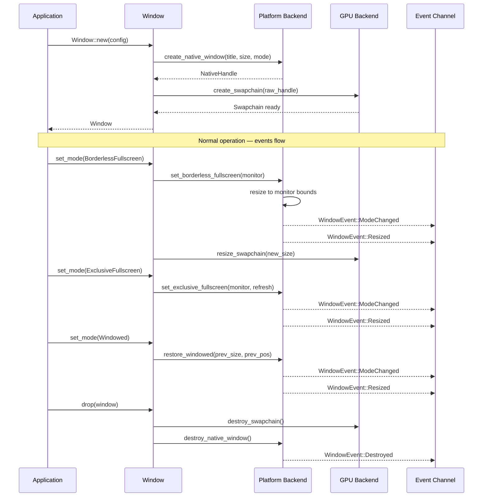
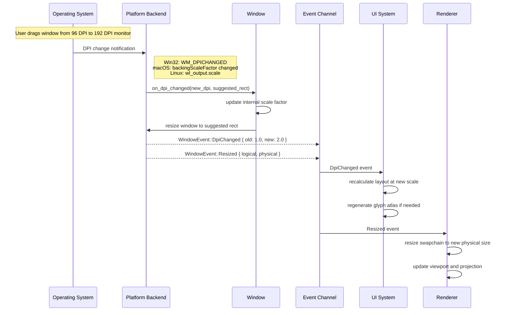
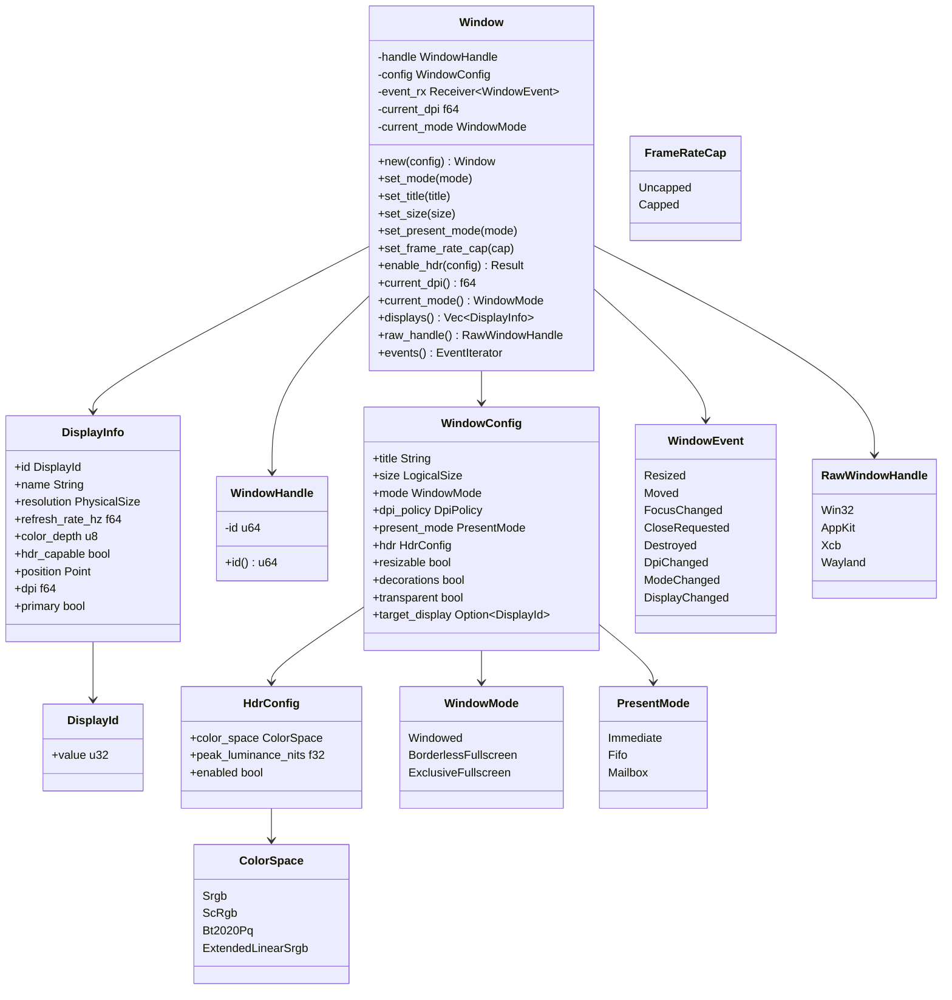
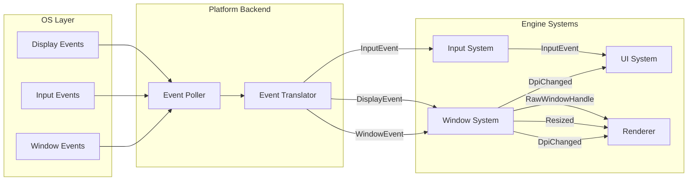

# Platform Windowing Design

## Requirements Trace

> **Canonical sources:** Features, requirements, and user stories are defined in
> [features/platform/](../../features/platform/),
> [requirements/platform/](../../requirements/platform/), and
> [user-stories/platform/](../../user-stories/platform/). The table below traces design elements to
> those definitions.

| Feature  | Requirement |
|----------|-------------|
| F-14.1.1 | R-14.1.1    |
| F-14.1.2 | R-14.1.2    |
| F-14.1.3 | R-14.1.3    |
| F-14.1.4 | R-14.1.4    |
| F-14.1.5 | R-14.1.5    |
| F-14.1.6 | R-14.1.6    |

1. **F-14.1.1** — Create, resize, minimize, maximize, restore, and destroy native windows with
   consistent cross-platform API
2. **F-14.1.2** — Switch between exclusive fullscreen, borderless fullscreen, and windowed modes
   without GPU device loss
3. **F-14.1.3** — Enumerate connected displays with resolution, refresh rate, HDR capability, and
   position; re-enumerate on hot-plug
4. **F-14.1.4** — Per-monitor DPI detection with correct fractional scaling at 125%, 150%, and 200%
5. **F-14.1.5** — Immediate, FIFO, and mailbox presentation modes with independent frame rate cap
6. **F-14.1.6** — HDR output with correct color space and peak luminance metadata per platform

## Overview

The windowing subsystem manages native window lifecycle, display enumeration, DPI scaling,
fullscreen mode transitions, VSync/presentation, and HDR output across Windows, macOS, and Linux
(X11 and Wayland). It provides a unified cross-platform API that isolates all platform-specific
windowing code behind `cfg`-gated backend modules, ensuring that gameplay, UI, and debug systems
never branch on platform.

The subsystem uses direct platform-native APIs for window creation and event polling on each target:
Win32 `CreateWindowEx` via `windows-sys` on Windows, `NSWindow` via Swift wrappers through `cxx` on
macOS, and `xcb` (X11) / Wayland protocol via C FFI on Linux. This gives us full control over HDR
metadata negotiation, advanced VSync control, and auxiliary window management without third-party
abstraction layers. All asynchronous abstractions use `async`/`await` — no callbacks. Window events
are delivered through a bounded channel that consumers poll or `.await`.

Key design decisions: (1) borderless fullscreen is the default mode, matching the expectations of
players who alt-tab frequently; (2) DPI policy is configured per-window, not globally, because
auxiliary debug windows may use a different scaling strategy than the primary game window; (3) HDR
negotiation is separated into its own module because it requires distinct platform APIs and color
space types that would clutter the core window module; (4) the `RawWindowHandle` type is compatible
with the `raw-window-handle` crate ecosystem so that GPU backends can create swapchains without
platform-specific branching.

## Architecture

### Module Boundaries

```mermaid
graph TD
    subgraph "harmonius_platform::windowing"
        WC[WindowConfig]
        W[Window]
        WH[WindowHandle]
        DI[DisplayInfo]
        DE[DisplayEnumerator]
        DPI[DpiDetector]
        PM[PresentMode]
        PS[PresentController]
        HDR[HdrConfig]
        HN[HdrNegotiator]
        WE[WindowEvent]
    end

    subgraph "platform::windows"
        W32[Win32 CreateWindowEx]
        DXGI[DXGI Output / Swapchain]
        WDpi[WM_DPICHANGED]
    end

    subgraph "platform::macos"
        NS[NSWindow via Swift/cxx]
        CG[CGDisplayCopyDisplayMode]
        ML[CAMetalLayer]
    end

    subgraph "platform::linux"
        XCB[xcb / Wayland Surface]
        XR[xrandr / wl_output]
        WP[wp_fractional_scale_v1]
    end

    WC --> W
    W --> WH
    W --> WE
    DE --> DI
    W --> DE
    W --> DPI
    W --> PS
    W --> HN
    PS --> PM
    HN --> HDR

    W -.->|"cfg(windows)"| W32
    DE -.->|"cfg(windows)"| DXGI
    DPI -.->|"cfg(windows)"| WDpi
    HN -.->|"cfg(windows)"| DXGI
    PS -.->|"cfg(windows)"| DXGI

    W -.->|"cfg(macos)"| NS
    DE -.->|"cfg(macos)"| CG
    HN -.->|"cfg(macos)"| ML
    PS -.->|"cfg(macos)"| ML

    W -.->|"cfg(linux)"| XCB
    DE -.->|"cfg(linux)"| XR
    DPI -.->|"cfg(linux)"| WP
```



### Module Layout

```text
harmonius_platform/
├── windowing/
│   ├── mod.rs           # Re-exports public API
│   ├── window.rs        # Window, WindowConfig, WindowHandle
│   ├── event.rs         # WindowEvent, EventIterator
│   ├── display.rs       # DisplayEnumerator, DisplayInfo, DisplayId
│   ├── dpi.rs           # DpiDetector, DpiPolicy, LogicalSize, PhysicalSize
│   ├── present.rs       # PresentController, PresentMode, FrameRateCap
│   └── hdr.rs           # HdrNegotiator, HdrConfig, ColorSpace
└── platform/
    ├── windows/
    │   └── window.rs    # Win32 CreateWindowEx, DXGI swapchain, WM_DPICHANGED
    ├── macos/
    │   └── window.rs    # NSWindow via Swift/cxx, CAMetalLayer, backingScaleFactor
    └── linux/
        └── window.rs    # xcb/Wayland via C FFI, xrandr, wl_output, wp_fractional_scale_v1
```

### Window Lifecycle



### DPI Change on Monitor Drag



### Core Data Structures



## API Design

### Coordinate Types

```rust
/// A size in logical (DPI-independent) coordinates.
#[derive(Clone, Copy, Debug, PartialEq)]
pub struct LogicalSize {
    pub width: f64,
    pub height: f64,
}

/// A size in physical (pixel) coordinates.
#[derive(Clone, Copy, Debug, PartialEq, Eq)]
pub struct PhysicalSize {
    pub width: u32,
    pub height: u32,
}

/// A point in logical (DPI-independent) coordinates.
#[derive(Clone, Copy, Debug, PartialEq)]
pub struct Point {
    pub x: f64,
    pub y: f64,
}

/// A rectangle in logical coordinates.
#[derive(Clone, Copy, Debug, PartialEq)]
pub struct Rect {
    pub x: f64,
    pub y: f64,
    pub width: f64,
    pub height: f64,
}

impl LogicalSize {
    /// Convert to physical size at the given scale factor.
    pub fn to_physical(
        &self,
        scale_factor: f64,
    ) -> PhysicalSize;
}

impl PhysicalSize {
    /// Convert to logical size at the given scale factor.
    pub fn to_logical(
        &self,
        scale_factor: f64,
    ) -> LogicalSize;
}
```

### Window Configuration

```rust
/// Controls how the window responds to DPI changes.
#[derive(Clone, Copy, Debug, PartialEq, Eq)]
pub enum DpiPolicy {
    /// Scale the window content and let the OS resize
    /// the window to the suggested rectangle. Default
    /// for game windows.
    SystemScaled,
    /// Keep the window size fixed in physical pixels;
    /// the application handles all scaling internally.
    /// Useful for auxiliary debug windows with fixed
    /// layouts.
    ApplicationScaled,
}

/// Configuration for creating a new window.
pub struct WindowConfig {
    /// Window title displayed in the title bar and
    /// taskbar.
    pub title: String,
    /// Initial logical size of the client area.
    pub size: LogicalSize,
    /// Initial window mode.
    pub mode: WindowMode,
    /// DPI handling policy.
    pub dpi_policy: DpiPolicy,
    /// Initial presentation mode.
    pub present_mode: PresentMode,
    /// Initial HDR configuration. Disabled by default.
    pub hdr: HdrConfig,
    /// Whether the window is resizable. Default: true.
    pub resizable: bool,
    /// Whether to show window decorations. Default: true.
    pub decorations: bool,
    /// Whether the window supports transparency.
    /// Default: false.
    pub transparent: bool,
    /// Target display for initial placement.
    /// None = primary.
    pub target_display: Option<DisplayId>,
}

impl Default for WindowConfig {
    fn default() -> Self {
        Self {
            title: String::from("Harmonius"),
            size: LogicalSize {
                width: 1280.0,
                height: 720.0,
            },
            mode: WindowMode::Windowed,
            dpi_policy: DpiPolicy::SystemScaled,
            present_mode: PresentMode::Fifo,
            hdr: HdrConfig::disabled(),
            resizable: true,
            decorations: true,
            transparent: false,
            target_display: None,
        }
    }
}
```

### Window Handle and Mode

```rust
/// Opaque handle identifying a window. Cheap to copy.
#[derive(Clone, Copy, Debug, PartialEq, Eq, Hash)]
pub struct WindowHandle {
    id: u64,
}

impl WindowHandle {
    pub fn id(&self) -> u64 { self.id }
}

/// Window display mode.
#[derive(Clone, Copy, Debug, PartialEq, Eq)]
pub enum WindowMode {
    /// Standard windowed mode with title bar and
    /// borders.
    Windowed,
    /// Borderless window covering the full display
    /// area. The OS compositor remains active (fast
    /// alt-tab).
    BorderlessFullscreen(DisplayId),
    /// Exclusive fullscreen with direct scanout.
    /// Lowest latency but slow alt-tab. Requires
    /// display and refresh rate specification.
    ExclusiveFullscreen(DisplayId, RefreshRate),
}

/// Refresh rate in millihertz for sub-Hz precision
/// (e.g., 59940 = 59.94 Hz).
#[derive(Clone, Copy, Debug, PartialEq, Eq)]
pub struct RefreshRate(pub u32);
```

### Window

```rust
/// A native OS window.
///
/// Each `Window` owns its native handle and event
/// channel. The window is destroyed when dropped. All
/// methods use `&mut self` to prevent concurrent
/// mutation — window state changes must be sequenced.
pub struct Window { /* ... */ }

impl Window {
    /// Create a new window with the given
    /// configuration. The window is visible
    /// immediately after creation.
    pub fn new(config: WindowConfig) -> Self;

    /// Return the opaque handle for this window.
    pub fn handle(&self) -> WindowHandle;

    /// Change the window mode. Transitions preserve
    /// the GPU device context (R-14.1.2). When
    /// switching to `ExclusiveFullscreen`, the
    /// swapchain is resized to match the display
    /// resolution. When switching back to `Windowed`,
    /// the previous size and position are restored.
    pub fn set_mode(&mut self, mode: WindowMode);

    /// Return the current window mode.
    pub fn current_mode(&self) -> WindowMode;

    /// Set the window title.
    pub fn set_title(&mut self, title: &str);

    /// Resize the client area in logical coordinates.
    /// The physical size is computed from the current
    /// DPI.
    pub fn set_size(&mut self, size: LogicalSize);

    /// Return the current client area size in both
    /// coordinate systems.
    pub fn size(&self) -> (LogicalSize, PhysicalSize);

    /// Minimize the window to the taskbar/dock.
    pub fn minimize(&mut self);

    /// Maximize the window to fill the current display
    /// work area.
    pub fn maximize(&mut self);

    /// Restore the window from minimized or maximized
    /// state.
    pub fn restore(&mut self);

    /// Move the window to the specified logical
    /// position.
    pub fn set_position(&mut self, position: Point);

    /// Return the current window position in logical
    /// coordinates.
    pub fn position(&self) -> Point;

    /// Set the presentation mode (R-14.1.5).
    pub fn set_present_mode(
        &mut self,
        mode: PresentMode,
    );

    /// Return the current presentation mode.
    pub fn present_mode(&self) -> PresentMode;

    /// Set the frame rate cap (R-14.1.5). The cap is
    /// enforced independently of the display refresh
    /// rate.
    pub fn set_frame_rate_cap(
        &mut self,
        cap: FrameRateCap,
    );

    /// Return the current frame rate cap.
    pub fn frame_rate_cap(&self) -> FrameRateCap;

    /// Enable or reconfigure HDR output (R-14.1.6).
    /// Returns an error if the display or OS does not
    /// support HDR.
    pub fn enable_hdr(
        &mut self,
        config: HdrConfig,
    ) -> Result<(), HdrError>;

    /// Disable HDR output, reverting to SDR.
    pub fn disable_hdr(&mut self);

    /// Whether HDR is currently active.
    pub fn is_hdr_active(&self) -> bool;

    /// Return the current DPI scale factor (R-14.1.4).
    /// 1.0 = 96 DPI (Windows) / 72 DPI (macOS).
    pub fn current_dpi(&self) -> f64;

    /// Enumerate all connected displays (R-14.1.3).
    pub fn displays(&self) -> Vec<DisplayInfo>;

    /// Return the display the window currently
    /// occupies.
    pub fn current_display(
        &self,
    ) -> Option<DisplayInfo>;

    /// Return the platform-native handle for GPU
    /// swapchain creation. The handle is valid for
    /// the lifetime of the window.
    pub fn raw_handle(&self) -> RawWindowHandle;

    /// Return an iterator over pending window events.
    /// Non-blocking. Events are consumed in order;
    /// each event is delivered exactly once.
    pub fn events(&mut self) -> EventIterator<'_>;
}

impl Drop for Window {
    fn drop(&mut self) {
        // Destroys the native window handle.
        // Emits WindowEvent::Destroyed through
        // the event channel.
    }
}
```

### Window Events

```rust
/// Events emitted by the windowing subsystem.
/// Delivered through the bounded channel accessible
/// via `Window::events()`.
#[derive(Clone, Debug)]
pub enum WindowEvent {
    /// Client area resized. Both logical and physical
    /// sizes are provided so consumers do not need to
    /// recompute.
    Resized {
        logical: LogicalSize,
        physical: PhysicalSize,
    },
    /// Window moved to a new position in logical
    /// coordinates.
    Moved(Point),
    /// Window gained or lost keyboard focus.
    FocusChanged { focused: bool },
    /// The user requested the window be closed (close
    /// button, Alt+F4, Cmd+Q). The application should
    /// save state and drop the `Window` to confirm.
    CloseRequested,
    /// The native window has been destroyed. Terminal
    /// event.
    Destroyed,
    /// DPI scale factor changed (e.g., window dragged
    /// between monitors). `suggested_rect` is the
    /// OS-recommended new window geometry at the new
    /// scale.
    DpiChanged {
        old_scale_factor: f64,
        new_scale_factor: f64,
        suggested_rect: Rect,
    },
    /// Window mode changed (windowed, borderless,
    /// exclusive).
    ModeChanged(WindowMode),
    /// Window moved to a different display.
    DisplayChanged(DisplayId),
}

/// Non-blocking iterator over pending events.
pub struct EventIterator<'a> { /* ... */ }

impl<'a> Iterator for EventIterator<'a> {
    type Item = WindowEvent;
    fn next(&mut self) -> Option<WindowEvent>;
}
```

### Display Enumeration

```rust
/// Unique identifier for a connected display.
#[derive(Clone, Copy, Debug, PartialEq, Eq, Hash)]
pub struct DisplayId(pub u32);

/// Information about a connected display.
#[derive(Clone, Debug)]
pub struct DisplayInfo {
    /// Unique identifier for this display.
    pub id: DisplayId,
    /// Human-readable display name
    /// (e.g., "DELL U2723QE").
    pub name: String,
    /// Native resolution in physical pixels.
    pub resolution: PhysicalSize,
    /// Current refresh rate in millihertz
    /// (59940 = 59.94 Hz).
    pub refresh_rate_mhz: u32,
    /// Color depth in bits per channel (8, 10, 12).
    pub color_depth: u8,
    /// Whether the display reports HDR capability.
    pub hdr_capable: bool,
    /// Position of the display's top-left corner in
    /// the virtual desktop coordinate space.
    pub position: Point,
    /// Current DPI scale factor for this display.
    pub dpi: f64,
    /// Whether this is the primary (default) display.
    pub primary: bool,
    /// Available refresh rates in millihertz.
    pub available_refresh_rates: Vec<u32>,
}

/// Enumerate and monitor connected displays.
pub struct DisplayEnumerator { /* ... */ }

impl DisplayEnumerator {
    /// Create a new display enumerator. Performs
    /// initial enumeration of all connected displays.
    pub fn new() -> Self;

    /// Return information about all connected
    /// displays. Re-enumerates if a hot-plug event
    /// has occurred since the last call (R-14.1.3).
    pub fn displays(&mut self) -> &[DisplayInfo];

    /// Return the primary display.
    pub fn primary(
        &mut self,
    ) -> Option<&DisplayInfo>;

    /// Find the display at the given virtual desktop
    /// position.
    pub fn display_at_point(
        &mut self,
        point: Point,
    ) -> Option<&DisplayInfo>;

    /// Return the display with the given identifier.
    pub fn display_by_id(
        &mut self,
        id: DisplayId,
    ) -> Option<&DisplayInfo>;

    /// Check whether a hot-plug event has occurred
    /// since the last enumeration.
    pub fn has_topology_changed(&self) -> bool;
}
```

### DPI Detection

```rust
/// DPI detection and scaling utilities.
pub struct DpiDetector { /* ... */ }

impl DpiDetector {
    /// Detect the DPI of the display containing
    /// the given window.
    pub fn detect(window: &Window) -> f64;

    /// Convert a logical coordinate to physical
    /// pixels at the given scale factor.
    pub fn logical_to_physical(
        logical: f64,
        scale_factor: f64,
    ) -> u32 {
        (logical * scale_factor).round() as u32
    }

    /// Convert a physical pixel coordinate to
    /// logical at the given scale factor.
    pub fn physical_to_logical(
        physical: u32,
        scale_factor: f64,
    ) -> f64 {
        physical as f64 / scale_factor
    }
}
```

### Presentation Modes

```rust
/// Presentation (VSync) mode (R-14.1.5).
#[derive(Clone, Copy, Debug, PartialEq, Eq)]
pub enum PresentMode {
    /// No VSync. Frames are presented immediately.
    /// May cause tearing but minimizes input latency.
    Immediate,
    /// VSync on. Frames are queued and presented at
    /// VSync intervals. Eliminates tearing but adds
    /// up to one frame of latency.
    Fifo,
    /// Triple-buffered. The most recent frame
    /// replaces any pending frame. Tear-free with
    /// lower latency than FIFO.
    Mailbox,
}

/// Frame rate cap, independent of display refresh
/// rate.
#[derive(Clone, Copy, Debug, PartialEq, Eq)]
pub enum FrameRateCap {
    /// No cap. The engine renders as fast as possible
    /// (subject to VSync if enabled).
    Uncapped,
    /// Cap to the specified frames per second. The
    /// engine sleeps or spins to maintain the target
    /// interval.
    Capped(u32),
}

/// Controls VSync and frame pacing.
pub struct PresentController { /* ... */ }

impl PresentController {
    /// Create a new present controller for the given
    /// window.
    pub fn new(
        window: &Window,
        mode: PresentMode,
        cap: FrameRateCap,
    ) -> Self;

    /// Change the presentation mode. Takes effect on
    /// the next present call.
    pub fn set_mode(&mut self, mode: PresentMode);

    /// Change the frame rate cap.
    pub fn set_frame_rate_cap(
        &mut self,
        cap: FrameRateCap,
    );

    /// Wait until the next frame should begin, based
    /// on the current mode and cap. Returns the time
    /// since the previous frame in seconds.
    pub async fn wait_for_frame(
        &mut self,
    ) -> f64;

    /// Query supported presentation modes for the
    /// current display and GPU combination.
    pub fn supported_modes(
        &self,
    ) -> Vec<PresentMode>;
}
```

### HDR Output

```rust
/// Color space for HDR output (R-14.1.6).
#[derive(Clone, Copy, Debug, PartialEq, Eq)]
pub enum ColorSpace {
    /// Standard sRGB (SDR).
    Srgb,
    /// scRGB (linear, FP16). Used on Windows for HDR.
    ScRgb,
    /// BT.2020 with PQ transfer function (HDR10).
    Bt2020Pq,
    /// Extended linear sRGB. Used on macOS (EDR).
    ExtendedLinearSrgb,
}

/// HDR output configuration.
#[derive(Clone, Copy, Debug, PartialEq)]
pub struct HdrConfig {
    /// Target color space for the swapchain.
    pub color_space: ColorSpace,
    /// Peak luminance in nits reported to the
    /// compositor. Used for tone mapping metadata.
    pub peak_luminance_nits: f32,
    /// Whether HDR output is enabled.
    pub enabled: bool,
}

impl HdrConfig {
    /// Create a disabled (SDR) configuration.
    pub fn disabled() -> Self {
        Self {
            color_space: ColorSpace::Srgb,
            peak_luminance_nits: 80.0,
            enabled: false,
        }
    }

    /// Create a platform-appropriate HDR
    /// configuration. Selects scRGB on Windows,
    /// ExtendedLinearSrgb on macOS, and Bt2020Pq
    /// on Linux.
    #[cfg(target_os = "windows")]
    pub fn platform_default(
        peak_nits: f32,
    ) -> Self {
        Self {
            color_space: ColorSpace::ScRgb,
            peak_luminance_nits: peak_nits,
            enabled: true,
        }
    }

    #[cfg(target_os = "macos")]
    pub fn platform_default(
        peak_nits: f32,
    ) -> Self {
        Self {
            color_space: ColorSpace::ExtendedLinearSrgb,
            peak_luminance_nits: peak_nits,
            enabled: true,
        }
    }

    #[cfg(target_os = "linux")]
    pub fn platform_default(
        peak_nits: f32,
    ) -> Self {
        Self {
            color_space: ColorSpace::Bt2020Pq,
            peak_luminance_nits: peak_nits,
            enabled: true,
        }
    }
}

/// Negotiates HDR swapchain format and metadata with
/// the OS.
pub struct HdrNegotiator { /* ... */ }

impl HdrNegotiator {
    /// Create a negotiator for the given window.
    pub fn new(window: &Window) -> Self;

    /// Query whether HDR is supported on the current
    /// display.
    pub fn is_hdr_supported(&self) -> bool;

    /// Query the display's reported peak luminance
    /// in nits.
    pub fn display_peak_luminance(&self) -> f32;

    /// Enable HDR with the given configuration.
    /// Reconfigures the swapchain color space and
    /// sets metadata.
    pub fn enable(
        &mut self,
        config: HdrConfig,
    ) -> Result<(), HdrError>;

    /// Disable HDR, reverting the swapchain to sRGB.
    pub fn disable(&mut self);

    /// Update the peak luminance metadata without
    /// reconfiguring the color space. Used when the
    /// rendering pipeline's tone mapper adjusts its
    /// output range.
    pub fn update_metadata(
        &mut self,
        peak_luminance_nits: f32,
    );
}
```

### Raw Window Handle

```rust
/// Platform-native window handle for GPU backend
/// swapchain creation. Matches the
/// `raw-window-handle` crate's layout for
/// interoperability.
#[derive(Clone, Copy, Debug)]
pub enum RawWindowHandle {
    #[cfg(target_os = "windows")]
    Win32 {
        hwnd: *mut core::ffi::c_void,
        hinstance: *mut core::ffi::c_void,
    },
    #[cfg(target_os = "macos")]
    AppKit {
        ns_view: *mut core::ffi::c_void,
    },
    #[cfg(all(
        target_os = "linux",
        feature = "x11"
    ))]
    Xcb {
        window: u32,
        connection: *mut core::ffi::c_void,
    },
    #[cfg(all(
        target_os = "linux",
        feature = "wayland"
    ))]
    Wayland {
        surface: *mut core::ffi::c_void,
        display: *mut core::ffi::c_void,
    },
}

// Safety: raw pointers are valid for the lifetime
// of the Window that created them. The Window must
// not be dropped while a GPU swapchain holds the
// handle.
unsafe impl Send for RawWindowHandle {}
unsafe impl Sync for RawWindowHandle {}
```

### Error Types

```rust
/// Errors from HDR negotiation.
#[derive(Clone, Debug, PartialEq, Eq)]
pub enum HdrError {
    /// The current display does not support HDR.
    DisplayNotHdrCapable,
    /// The OS does not support the requested color
    /// space.
    UnsupportedColorSpace(ColorSpace),
    /// The GPU driver rejected the swapchain format
    /// change.
    SwapchainFormatRejected,
    /// Platform-specific error with OS error code.
    Platform { code: i32 },
}

/// Errors from window operations.
#[derive(Clone, Debug, PartialEq, Eq)]
pub enum WindowError {
    /// The platform backend failed to create the
    /// window.
    CreationFailed { message: String },
    /// The requested display was not found.
    DisplayNotFound(DisplayId),
    /// The requested fullscreen mode is not
    /// supported.
    FullscreenNotSupported(WindowMode),
    /// Platform-specific error with OS error code.
    Platform { code: i32 },
}
```

## Data Flow

### Event Flow: OS to Engine



The platform backend runs a single event poller (driven by direct OS event loops: Win32 message
pump, `NSRunLoop`, xcb event queue, Wayland dispatch, or UIKit `CFRunLoop`) that receives all OS
events — window, input, and display — in a unified stream. The event translator converts
platform-native event types into engine event types and routes them to the appropriate bounded
channel.

On platforms where the OS owns the main thread (iOS, Android), the event poller runs on the OS main
thread and forwards translated events to the game loop thread via a lock-free SPSC queue. On desktop
platforms, the event poller runs on the game loop thread directly.

Window events flow through the following path:

1. **OS** emits a native event (e.g., `WM_SIZE`, `NSWindowDidResize`, `wl_surface.configure`).
2. **Event Poller** receives the native event during its poll cycle.
3. **Event Translator** maps the native event to a `WindowEvent` variant. Platform-specific data
   (e.g., Win32 `LPARAM` fields) is decoded into cross-platform types.
4. **Window System** receives the event through `Window::events()` and updates internal state.
5. **Downstream systems** (UI, Renderer) receive propagated events.

### DPI Change Propagation

When a DPI change occurs (window dragged between monitors):

1. `WindowEvent::DpiChanged` arrives with old and new scale factors plus the OS-suggested window
   rectangle.
2. If `DpiPolicy::SystemScaled`, the window resizes to the suggested rectangle automatically. The
   new physical size is `logical_size * new_scale_factor`.
3. The UI system receives the DPI change event, recalculates all layout metrics, and regenerates
   glyph atlases at the new resolution if needed.
4. The renderer receives the `Resized` event (which follows `DpiChanged`), resizes the swapchain
   framebuffers, and updates the viewport.

### GPU Backend Integration

The GPU backend receives the `RawWindowHandle` at swapchain creation time:

1. `Window::new(config)` creates the native window and returns a `Window`.
2. The GPU backend calls `window.raw_handle()` to obtain the platform-native handle.
3. The GPU backend creates a swapchain (Vulkan `VkSurfaceKHR`, Metal `CAMetalLayer`, DX12
   `IDXGISwapChain`) from the raw handle.
4. On `WindowEvent::Resized`, the GPU backend destroys and recreates swapchain buffers at the new
   resolution.
5. On fullscreen mode transitions (R-14.1.2), the `Window` coordinates with the GPU backend to
   ensure the swapchain is resized without device loss.

### Input System Integration

The windowing subsystem is the source of raw input events on all platforms. The input system
receives keyboard, mouse, and touch events from the same event poller that produces window events.
The windowing subsystem is responsible for:

- Translating platform-native key codes to engine-agnostic scan codes.
- Providing cursor position in both logical and physical coordinates.
- Forwarding focus change events so the input system can suppress input when the window is
  unfocused.

## Platform Considerations

### Window Creation

| Platform      | API                            |
|---------------|--------------------------------|
| Windows       | `CreateWindowEx`               |
| macOS         | `NSWindow` via Swift / cxx     |
| iOS           | `UIWindow` via Swift / cxx     |
| Linux X11     | `xcb_create_window`            |
| Linux Wayland | `wl_compositor_create_surface` |

1. **Windows** — COM initialized via `CoInitializeEx`. Window class registered with
   `RegisterClassExW`. Uses `windows-sys` for FFI.
2. **macOS** — `NSApplication` must be initialized on the OS main thread. `NSWindow` created with
   `initWithContentRect:styleMask:`. Swift wrappers accessed through `cxx`.
3. **iOS** — `UIApplicationMain` owns the OS main thread. `UIWindow` and `UIViewController` created
   on the OS main thread via Swift wrappers through `cxx`. Input events (touch, accelerometer,
   keyboard) arrive on the OS main thread via UIKit and are forwarded to the game loop thread
   through a lock-free SPSC queue. The game loop runs on a dedicated thread, not the UIKit main
   thread.
4. **Linux X11** — Connection opened via `xcb_connect`. Window attributes set via
   `xcb_change_window_attributes`.
5. **Linux Wayland** — `wl_display_connect` + `wl_registry_bind` for compositor. `xdg_wm_base` for
   shell surface.

### Fullscreen Transitions

| Platform      |
|---------------|
| Windows       |
| macOS         |
| Linux X11     |
| Linux Wayland |

1. **Windows** — Set `WS_POPUP` style, resize to monitor bounds via `SetWindowPos`
   - **Exclusive Fullscreen:** `IDXGISwapChain::SetFullscreenState(TRUE)`
2. **macOS** — `NSWindow.setStyleMask(.borderless)` + resize to screen frame
   - **Exclusive Fullscreen:** `NSWindow.toggleFullScreen` with
     `NSApplicationPresentationFullScreen`
3. **Linux X11** — `_NET_WM_STATE_FULLSCREEN` via `xcb_send_event`
   - **Exclusive Fullscreen:** `XRandR` mode change + `_NET_WM_STATE_FULLSCREEN`
4. **Linux Wayland** — `xdg_toplevel_set_fullscreen`
   - **Exclusive Fullscreen:** Wayland does not support exclusive fullscreen; falls back to
     compositor fullscreen

### DPI Detection

| Platform      |
|---------------|
| Windows       |
| macOS         |
| Linux X11     |
| Linux Wayland |

1. **Windows** — `SetProcessDpiAwarenessContext(PER_MONITOR_AWARE_V2)`, `WM_DPICHANGED`
   - **Fractional Support:** Yes — 125%, 150% via `GetDpiForWindow` returning values like 120, 144
2. **macOS** — `NSWindow.backingScaleFactor`
   - **Fractional Support:** Integer only (1x or 2x). Fractional not applicable.
3. **Linux X11** — `Xft.dpi` X resource
   - **Fractional Support:** Typically integer. Fractional requires manual computation.
4. **Linux Wayland** — `wl_output.scale` (integer), `wp_fractional_scale_v1` (fractional)
   - **Fractional Support:** Yes — `wp_fractional_scale_v1` reports scale as `scale * 120`

### HDR Negotiation

| Platform      | Swapchain Format                         |
|---------------|------------------------------------------|
| Windows       | `DXGI_FORMAT_R16G16B16A16_FLOAT` (scRGB) |
| macOS         | `MTLPixelFormatRGBA16Float`              |
| Linux Wayland | `VK_FORMAT_A2B10G10R10_UNORM_PACK32`     |

1. **Windows** — `DXGI_COLOR_SPACE_RGB_FULL_G2084_NONE_P2020`
   - **Metadata API:** `DXGI_HDR_METADATA_HDR10` via `IDXGISwapChain4::SetHDRMetaData`
2. **macOS** — Extended linear sRGB via `CGColorSpace`
   - **Metadata API:** `CAMetalLayer.edrMetadata` +
     `NSScreen.maximumExtendedDynamicRangeColorComponentValue`
3. **Linux Wayland** — BT.2020 PQ via `wp_color_management_v1`
   - **Metadata API:** Experimental — limited compositor support (KDE 6.0+, GNOME WIP)

### VSync / Presentation Modes

| Platform         | FIFO                        |
|------------------|-----------------------------|
| Windows (Vulkan) | `VK_PRESENT_MODE_FIFO_KHR`  |
| Windows (DX12)   | `SyncInterval=1`            |
| macOS (Metal)    | `displaySyncEnabled = true` |
| Linux (Vulkan)   | `VK_PRESENT_MODE_FIFO_KHR`  |

1. **Windows (Vulkan)** — `VK_PRESENT_MODE_IMMEDIATE_KHR`
   - **Mailbox:** `VK_PRESENT_MODE_MAILBOX_KHR`
2. **Windows (DX12)** — `DXGI_SWAP_EFFECT_FLIP_DISCARD` + `SyncInterval=0`
   - **Mailbox:** `DXGI_SWAP_CHAIN_FLAG_FRAME_LATENCY_WAITABLE_OBJECT` + `SyncInterval=0` + 3
     buffers
3. **macOS (Metal)** — `CAMetalLayer.displaySyncEnabled = false`
   - **Mailbox:** Manual frame pacing with `CAMetalLayer.maximumDrawableCount = 3`
4. **Linux (Vulkan)** — `VK_PRESENT_MODE_IMMEDIATE_KHR`
   - **Mailbox:** `VK_PRESENT_MODE_MAILBOX_KHR`

### Mobile and Console Platforms

| Platform | Window API                      |
|----------|---------------------------------|
| iOS      | `UIWindow` via Swift/cxx.rs     |
| Android  | `ANativeWindow` via NDK/bindgen |
| Consoles | Platform SDK                    |

1. **iOS** — Single fullscreen window. `UIScreen` for display info. No resize.
2. **Android** — `NativeActivity` lifecycle. Surface created/destroyed events.
3. **Consoles** — Single fullscreen output. Vendor NDA APIs.

Mobile windowing is single-fullscreen-only. The `Window` abstraction degrades gracefully:
`set_size`, `set_position`, and `set_mode` return `Err(Unsupported)` on platforms that do not
support them. iOS lifecycle events (`willResignActive`, `didBecomeActive`) and Android lifecycle
events (`onPause`, `onResume`) are mapped to `WindowEvent::FocusChanged`.

## Test Plan

### Unit Tests

| Test                                       | Requirement |
|--------------------------------------------|-------------|
| `test_window_config_default`               | R-14.1.1    |
| `test_logical_to_physical_100`             | R-14.1.4    |
| `test_logical_to_physical_125`             | R-14.1.4    |
| `test_logical_to_physical_150`             | R-14.1.4    |
| `test_logical_to_physical_200`             | R-14.1.4    |
| `test_hdr_config_disabled`                 | R-14.1.6    |
| `test_hdr_config_platform_default_windows` | R-14.1.6    |
| `test_hdr_config_platform_default_macos`   | R-14.1.6    |
| `test_hdr_config_platform_default_linux`   | R-14.1.6    |
| `test_display_id_equality`                 | R-14.1.3    |
| `test_present_mode_variants`               | R-14.1.5    |
| `test_frame_rate_cap_variants`             | R-14.1.5    |

1. **`test_window_config_default`** — Verify `WindowConfig::default()` produces a 1280x720 windowed
   config with FIFO, HDR disabled, and system-scaled DPI policy.
2. **`test_logical_to_physical_100`** — At 1.0 scale factor,
   `LogicalSize(1280, 720).to_physical(1.0)` equals `PhysicalSize(1280, 720)`.
3. **`test_logical_to_physical_125`** — At 1.25 scale factor,
   `LogicalSize(1280, 720).to_physical(1.25)` equals `PhysicalSize(1600, 900)`.
4. **`test_logical_to_physical_150`** — At 1.5 scale factor,
   `LogicalSize(1280, 720).to_physical(1.5)` equals `PhysicalSize(1920, 1080)`.
5. **`test_logical_to_physical_200`** — At 2.0 scale factor,
   `LogicalSize(1280, 720).to_physical(2.0)` equals `PhysicalSize(2560, 1440)`.
6. **`test_hdr_config_disabled`** — `HdrConfig::disabled()` has `enabled == false`,
   `color_space == Srgb`, `peak_luminance_nits == 80.0`.
7. **`test_hdr_config_platform_default_windows`** — On Windows,
   `HdrConfig::platform_default(1000.0)` selects `ScRgb` with 1000 nits.
8. **`test_hdr_config_platform_default_macos`** — On macOS, `HdrConfig::platform_default(1000.0)`
   selects `ExtendedLinearSrgb`.
9. **`test_hdr_config_platform_default_linux`** — On Linux, `HdrConfig::platform_default(1000.0)`
   selects `Bt2020Pq`.
10. **`test_display_id_equality`** — Two `DisplayId` values with the same inner value are equal;
    different values are not.
11. **`test_present_mode_variants`** — Verify `PresentMode` has exactly three variants: `Immediate`,
    `Fifo`, `Mailbox`.
12. **`test_frame_rate_cap_variants`** — Verify `FrameRateCap::Capped(30)` and
    `FrameRateCap::Uncapped` are distinct.

### Integration Tests

| Test                                   | Requirement |
|----------------------------------------|-------------|
| `test_window_lifecycle`                | R-14.1.1    |
| `test_auxiliary_window`                | R-14.1.1    |
| `test_fullscreen_cycle_no_device_loss` | R-14.1.2    |
| `test_borderless_alt_tab`              | R-14.1.2    |
| `test_display_enumeration`             | R-14.1.3    |
| `test_display_hot_plug`                | R-14.1.3    |
| `test_window_move_to_display`          | R-14.1.3    |
| `test_dpi_change_multi_monitor`        | R-14.1.4    |
| `test_fractional_dpi_scaling`          | R-14.1.4    |
| `test_vsync_fifo_frame_pacing`         | R-14.1.5    |
| `test_vsync_mailbox_no_tearing`        | R-14.1.5    |
| `test_frame_rate_cap_30fps`            | R-14.1.5    |
| `test_hdr_swapchain_format`            | R-14.1.6    |
| `test_hdr_above_1_not_clipped`         | R-14.1.6    |
| `test_hdr_peak_luminance_metadata`     | R-14.1.6    |
| `test_hdr_unsupported_display`         | R-14.1.6    |

1. **`test_window_lifecycle`** — On each platform, create a window, resize to 1920x1080, minimize,
   maximize, restore, and destroy. Assert each state transition emits the correct `WindowEvent` and
   dimensions match after resize.
2. **`test_auxiliary_window`** — Create a primary window and an auxiliary window. Verify they
   operate independently — resizing one does not affect the other. Destroy auxiliary first, verify
   primary continues.
3. **`test_fullscreen_cycle_no_device_loss`** — On each platform, cycle: Windowed ->
   BorderlessFullscreen -> ExclusiveFullscreen -> Windowed. Assert no GPU device loss occurs. Assert
   the rendered frame is visible within two VSync intervals of each transition. Verify backbuffer
   resolution matches display resolution in fullscreen modes.
4. **`test_borderless_alt_tab`** — In borderless fullscreen, simulate Alt+Tab, verify the window
   loses focus without mode change and regains focus on return.
5. **`test_display_enumeration`** — On a multi-monitor system, enumerate displays. Assert each
   reports valid resolution (> 0x0), refresh rate (> 0), and position. Assert at least one display
   is marked primary.
6. **`test_display_hot_plug`** — Simulate a display connect/disconnect event. Verify re-enumeration
   fires within one frame. Assert the display list updates correctly.
7. **`test_window_move_to_display`** — Programmatically move the window to each enumerated display.
   Assert `current_display()` returns the target display after each move.
8. **`test_dpi_change_multi_monitor`** — On a dual-monitor system with different DPI values (e.g.,
   96 and 192), drag the window between monitors. Assert `DpiChanged` event fires with correct old
   and new scale factors. Assert `current_dpi()` updates within one frame.
9. **`test_fractional_dpi_scaling`** — Render UI text and buttons at 100%, 125%, 150%, and 200%
   scale. Assert text is rendered at native resolution (no bilinear blur). Assert button hit regions
   match their visual bounds within 1 pixel.
10. **`test_vsync_fifo_frame_pacing`** — Set `PresentMode::Fifo`, render 300 frames, measure frame
    times. Assert frame intervals match VSync period within 0.5 ms tolerance.
11. **`test_vsync_mailbox_no_tearing`** — Set `PresentMode::Mailbox`, render 300 frames. Assert no
    tearing artifacts via scanline-based detection.
12. **`test_frame_rate_cap_30fps`** — Set `FrameRateCap::Capped(30)` on a 60 Hz display. Render 300
    frames, assert frame intervals are 33.3 ms within 1 ms tolerance.
13. **`test_hdr_swapchain_format`** — On an HDR-capable display, enable HDR. Assert the swapchain
    reports an HDR-compatible format (scRGB/FP16 on Windows, extended linear sRGB on macOS).
14. **`test_hdr_above_1_not_clipped`** — With HDR enabled, render a test pattern with pixel values
    above 1.0. Capture the output and verify values are not clipped.
15. **`test_hdr_peak_luminance_metadata`** — Enable HDR with `peak_luminance_nits = 1000.0`. Verify
    the OS-reported metadata matches the display's reported capability.
16. **`test_hdr_unsupported_display`** — On an SDR-only display, call `enable_hdr()`. Assert it
    returns `HdrError::DisplayNotHdrCapable`.

### Benchmarks

| Benchmark | Target | Source |
|-----------|--------|--------|
| Window creation latency | < 50 ms | US-14.1.7 |
| Fullscreen transition latency | < 2 VSync intervals | R-14.1.2 |
| DPI change response latency | < 1 frame | R-14.1.4 |
| Event polling throughput | > 10,000 events/frame | US-14.1.7 |
| Display re-enumeration latency | < 1 frame | R-14.1.3 |

## Design Q & A

**Q1. What is the biggest constraint limiting this design?**

The no-winit constraint forces implementing four separate window backends (Win32, NSWindow, xcb,
Wayland) from scratch. Each backend requires its own event loop, DPI handling, fullscreen transition
logic, and HDR negotiation. Lifting this would allow winit to handle all four backends with a single
dependency, saving months of platform-specific debugging. The best unconstrained solution would be
winit for basic window lifecycle plus custom extensions for HDR metadata and advanced presentation
modes. The impact of removing the constraint: dramatically faster time-to-first- window, but less
control over HDR swapchain flags, `wp_fractional_scale_v1`, and platform-specific fullscreen
behavior.

**Q2. How can this design be improved?**

The Wayland backend lacks exclusive fullscreen support (open question 3), which affects competitive
gaming latency on Linux. X11 fallback for low-latency scenarios is a workaround, not a solution. The
HDR negotiation on Linux Wayland depends on `wp_color_management_v1`, which has limited compositor
support (KDE 6.0+, GNOME WIP); a fallback to SDR with a user-visible warning would be better than
silent failure. The bounded event channel capacity is not specified -- too small risks dropped
events during rapid resize, too large wastes memory. Auto-sizing based on event frequency would
improve robustness (R-14.1.9).

**Q3. Is there a better approach?**

For HDR, delegating tone mapping entirely to the compositor (via scRGB on Windows or EDR on macOS)
rather than engine- side tone mapping would simplify the handoff. We chose engine-side control
because game tone mapping is artistic and scene-dependent, requiring per-frame peak luminance
adjustment that compositor-managed tone mapping cannot provide. For event delivery, using the ECS
event system rather than bounded channels would integrate window events into the same dispatch path
as gameplay events. We chose bounded channels because window events must be processed before the ECS
frame begins (for resize, DPI), requiring ordered pre-frame draining.

**Q4. Does this design solve all customer problems?**

US-14.1.2 covers fullscreen mode transitions, but the design does not address multi-window
fullscreen (game on monitor 1, debug overlay fullscreen on monitor 2). Missing: window transparency
and click-through for overlay-style debug windows. Missing: screen capture prevention for
competitive games (DRM-style protected content). Adding multi-window fullscreen would enable
professional streaming setups where the debug HUD is on a second monitor. Adding click-through
transparency would enable always-on-top FPS counters and performance overlays (US-14.1.8).

**Q5. Is this design cohesive with the overall engine?**

The `RawWindowHandle` enum is compatible with the `raw-window-handle` crate, ensuring GPU backends
(Vulkan, Metal, DX12) create swapchains without platform branching -- consistent with the rendering
design's backend abstraction. The `DpiPolicy` per-window setting integrates with the UI system's
layout engine for correct fractional scaling. The bounded channel event delivery decouples the OS
event loop from the ECS frame, matching the controlled-poll philosophy from the threading design.
Platform backend selection via `cfg` attributes follows the same pattern as threading, transport,
and filesystem modules. The `LogicalSize` and `PhysicalSize` types enforce type-safe coordinate
handling that prevents the DPI bugs common in engines using raw pixel values.

## Open Questions

1. **~~winit vs custom windowing~~** — **Resolved: custom windowing, no winit.** Direct
   platform-native implementations provide full control over HDR metadata, advanced DXGI swapchain
   flags, `wp_fractional_scale_v1` on Wayland, and all presentation modes without fighting a
   third-party abstraction layer. Platform backends: Win32 `CreateWindowEx` via `windows-sys`,
   `NSWindow` via Swift wrappers through `cxx`, `xcb` (X11) and Wayland protocol via C FFI /
   bindgen.

2. **Auxiliary window management** — The API supports creating multiple windows (primary + auxiliary
   for debug overlays, chat pop-outs, streaming dashboards). Open questions:
   - Should auxiliary windows share the same event channel as the primary window, or have
     independent channels?
   - Should auxiliary windows support fullscreen transitions, or be windowed-only?
   - How should the GPU backend handle multiple swapchains (one per window)?

3. **Wayland exclusive fullscreen** — Wayland by design does not support exclusive fullscreen.
   `xdg_toplevel_set_fullscreen` requests compositor fullscreen, but the compositor may still
   composite. For competitive scenarios requiring lowest latency on Linux, we may need to support
   X11 as a fallback or investigate Wayland direct scanout protocols.

4. **Console platform presentation** — Console platforms (PlayStation, Xbox, Switch) have dedicated
   flip-queue APIs with platform-specific NDA documentation. The `PresentMode` enum and
   `PresentController` need console-specific variants that will be added under NDA during console
   porting (US-14.1.13).

5. **Adaptive VSync** — The requirements mention adaptive VSync (R-14.1.5 user stories) but the core
   specification covers Immediate, FIFO, and Mailbox. Adaptive VSync
   (`VK_PRESENT_MODE_FIFO_RELAXED_KHR`) allows tearing only when the frame is late. Should we add a
   fourth `PresentMode::FifoRelaxed` variant, or treat it as a configuration option on FIFO?

6. **Display color profile integration** — Beyond HDR, should the windowing subsystem expose ICC/ICM
   color profile information for color-managed rendering workflows? This would be needed for content
   creation tools but may not be required for the game runtime.

## Proposed Dependencies

| Crate               | Version | Purpose                        |
|---------------------|---------|--------------------------------|
| `raw-window-handle` | latest  | Platform-native handle interop |
| `windows-sys`       | latest  | Win32 API bindings (Windows)   |
| `cxx`               | latest  | Swift/C++ FFI bridge (macOS)   |
| `bindgen`           | latest  | C FFI bindings (Linux, build)  |

1. **`raw-window-handle`** — De facto standard trait for passing native window handles to GPU
   backends (wgpu, ash, metal-rs). Zero-cost abstraction — trait implementations on our
   `RawWindowHandle` enum. Independent of any windowing library.
2. **`windows-sys`** — Zero-cost FFI for `CreateWindowEx`, `SetWindowPos`, DXGI output enumeration,
   `SetProcessDpiAwarenessContext`, HDR metadata APIs. Used only via `cfg(target_os = "windows")`.
3. **`cxx`** — Enables calling Swift wrappers for `NSWindow`, `NSScreen`, `CAMetalLayer`, and
   `NSApplication` from Rust. Used only via `cfg(target_os = "macos")`.
4. **`bindgen`** — Generates Rust bindings for xcb (X11) and Wayland client libraries at build time.
   Used only via `cfg(target_os = "linux")`.
