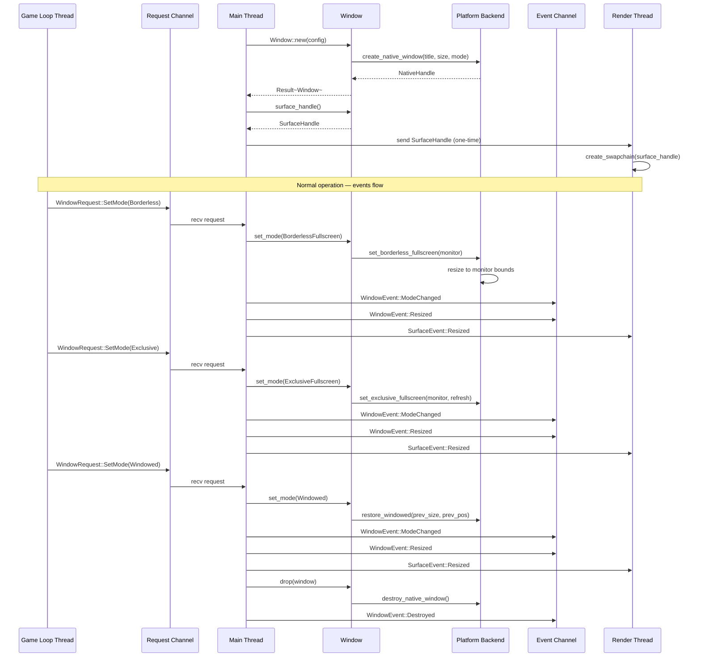
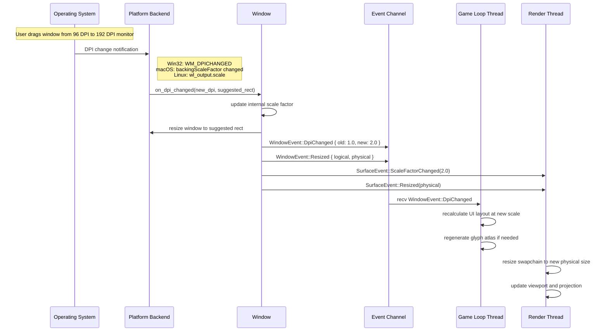
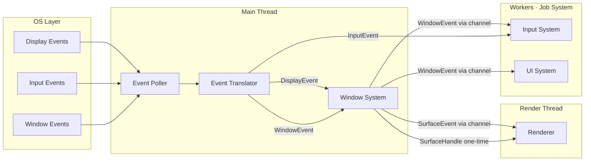

# Platform Windowing Design

## Requirements Trace

> **Canonical sources:** Features, requirements, and user stories are defined in
> [features/platform/](../../features/), [requirements/platform/](../../requirements/), and
> [user-stories/platform/](../../user-stories/). The table below traces design elements to those
> definitions.

| Feature  | Requirement |
|----------|-------------|
| F-14.1.1 | R-14.1.1    |
| F-14.1.2 | R-14.1.2    |
| F-14.1.3 | R-14.1.3    |
| F-14.1.4 | R-14.1.4    |
| F-14.1.5 | R-14.1.5    |
| F-14.1.6 | R-14.1.6    |

1. **F-14.1.1** — Create, resize, minimize, maximize, restore, and destroy native windows with
   consistent cross-platform API
2. **F-14.1.2** — Switch between exclusive fullscreen, borderless fullscreen, and windowed modes
   without GPU device loss
3. **F-14.1.3** — Enumerate connected displays with resolution, refresh rate, HDR capability, and
   position; re-enumerate on hot-plug
4. **F-14.1.4** — Per-monitor DPI detection with correct fractional scaling at 125%, 150%, and 200%
5. **F-14.1.5** — Immediate, FIFO, and mailbox presentation modes with independent frame rate cap
6. **F-14.1.6** — HDR output with correct color space and peak luminance metadata per platform

## Overview

The windowing subsystem manages native window lifecycle, display enumeration, DPI scaling,
fullscreen mode transitions, and HDR negotiation across Windows, macOS, and Linux (X11 and Wayland).
Presentation control (VSync mode, frame pacing, present calls) belongs to the render pipeline. The
subsystem provides a unified cross-platform API that isolates all platform-specific windowing code
behind `cfg`-gated backend modules, ensuring that gameplay, UI, and debug systems never branch on
platform.

The subsystem runs on the main thread alongside the OS event loop and platform I/O. The main thread
is the sole owner of all OS windowing APIs. It polls native events, produces `WindowEvent` and
`PointerEvent` structs, and sends them to the game loop thread via bounded channels. The game loop
thread sends cursor and window mutation requests (resize, mode change, cursor capture) back to the
main thread via a request channel. The game loop thread touches zero OS APIs. Surface events are
delivered to the render thread via a separate channel. It uses direct platform-native APIs for
window creation and event polling: Win32 `CreateWindowEx` via `windows-rs` on Windows, `NSWindow`
via `objc2-app-kit` on macOS, and X11 via `x11rb` / Wayland via `wayland-client` on Linux. This
gives us full control over HDR metadata negotiation and auxiliary window management without
third-party abstraction layers.

Key design decisions: (1) borderless fullscreen is the default mode, matching the expectations of
players who alt-tab frequently; (2) DPI policy is configured per-window, not globally, because
auxiliary debug windows may use a different scaling strategy than the primary game window; (3) HDR
negotiation is separated into its own module because it requires distinct platform APIs and color
space types that would clutter the core window module; (4) `SurfaceHandle` implements the
`raw-window-handle` crate traits (`HasRawWindowHandle`, `HasRawDisplayHandle`) so that GPU backends
can create swapchains without platform-specific branching.

## Architecture

### Module Boundaries

```mermaid
graph TD
    subgraph "harmonius_platform::windowing"
        WC[WindowConfig]
        W[Window]
        WH[WindowHandle]
        SH[SurfaceHandle]
        SE[SurfaceEvent]
        DI[DisplayInfo]
        DE[DisplayEnumerator]
        DPI[DpiDetector]
        HDR[HdrConfig]
        HN[HdrNegotiator]
        WE[WindowEvent]
    end

    subgraph "platform::windows"
        W32[Win32 CreateWindowEx]
        DXGI[DXGI Output]
        WDpi[WM_DPICHANGED]
    end

    subgraph "platform::macos"
        NS[NSWindow via objc2]
        CG[CGDisplayCopyDisplayMode]
    end

    subgraph "platform::linux"
        XCB[x11rb / wayland-client]
        XR[xrandr / wl_output]
        WP[wp_fractional_scale_v1]
    end

    WC --> W
    W --> WH
    W --> WE
    W --> SH
    W --> SE
    DE --> DI
    W --> DE
    W --> DPI
    W --> HN
    HN --> HDR

    W -.->|"cfg(windows)"| W32
    DE -.->|"cfg(windows)"| DXGI
    DPI -.->|"cfg(windows)"| WDpi
    HN -.->|"cfg(windows)"| DXGI

    W -.->|"cfg(macos)"| NS
    DE -.->|"cfg(macos)"| CG

    W -.->|"cfg(linux)"| XCB
    DE -.->|"cfg(linux)"| XR
    DPI -.->|"cfg(linux)"| WP
```



### Module Layout

```text
harmonius_platform/
├── windowing/
│   ├── mod.rs           # Re-exports public API
│   ├── window.rs        # Window, WindowConfig, WindowHandle
│   ├── event.rs         # WindowEvent, SurfaceEvent
│   ├── request.rs       # WindowRequest (game loop -> main thread)
│   ├── display.rs       # DisplayEnumerator, DisplayInfo, DisplayId
│   ├── dpi.rs           # DpiDetector, DpiPolicy, LogicalSize, PhysicalSize
│   ├── surface.rs       # SurfaceHandle
│   └── hdr.rs           # HdrNegotiator, HdrConfig, ColorSpace
└── platform/
    ├── windows/
    │   └── window.rs    # Win32 CreateWindowEx, WM_DPICHANGED
    ├── macos/
    │   └── window.rs    # NSWindow via objc2, backingScaleFactor
    └── linux/
        └── window.rs    # x11rb / wayland-client, xrandr, wl_output, wp_fractional_scale_v1
```

### Window Lifecycle



### DPI Change on Monitor Drag



### Core Data Structures

```mermaid
classDiagram
    class Window {
        -handle WindowHandle
        -config WindowConfig
        -event_rx Receiver~WindowEvent~
        -current_dpi f64
        -current_mode WindowMode
        +new(config) Result~Window WindowError~
        +set_mode(mode) Result~unit WindowError~
        +set_title(title)
        +set_size(size)
        +set_cursor(cursor)
        +set_cursor_visible(visible)
        +set_cursor_confined(confined)
        +set_cursor_captured(captured)
        +enable_hdr(config) Result
        +current_dpi() f64
        +current_mode() WindowMode
        +displays() Vec~DisplayInfo~
        +surface_handle() SurfaceHandle
        +events() EventIterator
    }

    class WindowConfig {
        +title String
        +size LogicalSize
        +mode WindowMode
        +dpi_policy DpiPolicy
        +hdr HdrConfig
        +resizable bool
        +decorations bool
        +transparent bool
        +target_display Option~DisplayId~
    }

    class WindowHandle {
        -id u64
        +id() u64
    }

    class SurfaceHandle {
        +raw RawWindowHandle
        +raw_display RawDisplayHandle
        +initial_size PhysicalSize
        +scale_factor f64
        +hdr_capable bool
    }

    class SurfaceEvent {
        Resized
        ScaleFactorChanged
        HdrChanged
        SurfaceInvalidated
    }

    class DisplayId {
        +value u32
    }

    class DisplayInfo {
        +id DisplayId
        +name String
        +resolution PhysicalSize
        +refresh_rate_mhz u32
        +color_depth u8
        +hdr_capable bool
        +position Point
        +dpi f64
        +primary bool
    }

    class HdrConfig {
        +color_space ColorSpace
        +peak_luminance_nits f32
        +enabled bool
    }

    class WindowMode {
        Windowed
        BorderlessFullscreen
        ExclusiveFullscreen
    }

    class ColorSpace {
        Srgb
        ScRgb
        Bt2020Pq
        ExtendedLinearSrgb
    }

    class WindowEvent {
        Resized
        Moved
        Minimized
        Maximized
        Restored
        FocusChanged
        CloseRequested
        Destroyed
        DpiChanged
        ModeChanged
        DisplayChanged
    }

    WindowConfig --> WindowMode
    WindowConfig --> HdrConfig
    Window --> WindowConfig
    Window --> WindowHandle
    Window --> WindowEvent
    Window --> SurfaceHandle
    Window --> SurfaceEvent
    Window --> DisplayInfo
    SurfaceHandle ..> "raw-window-handle" : implements traits
    HdrConfig --> ColorSpace
    DisplayInfo --> DisplayId
```

## API Design

### Coordinate Types

```rust
/// A size in logical (DPI-independent) coordinates.
#[derive(Clone, Copy, Debug, PartialEq)]
pub struct LogicalSize {
    pub width: f64,
    pub height: f64,
}

/// A size in physical (pixel) coordinates.
#[derive(Clone, Copy, Debug, PartialEq, Eq)]
pub struct PhysicalSize {
    pub width: u32,
    pub height: u32,
}

/// A point in logical (DPI-independent) coordinates.
#[derive(Clone, Copy, Debug, PartialEq)]
pub struct Point {
    pub x: f64,
    pub y: f64,
}

/// A rectangle in logical coordinates.
#[derive(Clone, Copy, Debug, PartialEq)]
pub struct Rect {
    pub x: f64,
    pub y: f64,
    pub width: f64,
    pub height: f64,
}

impl LogicalSize {
    /// Convert to physical size at the given scale factor.
    pub fn to_physical(
        &self,
        scale_factor: f64,
    ) -> PhysicalSize;
}

impl PhysicalSize {
    /// Convert to logical size at the given scale factor.
    pub fn to_logical(
        &self,
        scale_factor: f64,
    ) -> LogicalSize;
}
```

### Window Configuration

```rust
/// Controls how the window responds to DPI changes.
#[derive(Clone, Copy, Debug, PartialEq, Eq)]
pub enum DpiPolicy {
    /// Scale the window content and let the OS resize
    /// the window to the suggested rectangle. Default
    /// for game windows.
    SystemScaled,
    /// Keep the window size fixed in physical pixels;
    /// the application handles all scaling internally.
    /// Useful for auxiliary debug windows with fixed
    /// layouts.
    ApplicationScaled,
}

/// Configuration for creating a new window.
pub struct WindowConfig {
    /// Window title displayed in the title bar and
    /// taskbar.
    pub title: String,
    /// Initial logical size of the client area.
    pub size: LogicalSize,
    /// Initial window mode.
    pub mode: WindowMode,
    /// DPI handling policy.
    pub dpi_policy: DpiPolicy,
    /// Initial HDR configuration. Disabled by default.
    pub hdr: HdrConfig,
    /// Whether the window is resizable. Default: true.
    pub resizable: bool,
    /// Whether to show window decorations. Default: true.
    pub decorations: bool,
    /// Whether the window supports transparency.
    /// Default: false.
    pub transparent: bool,
    /// Target display for initial placement.
    /// None = primary.
    pub target_display: Option<DisplayId>,
}

impl Default for WindowConfig {
    fn default() -> Self {
        Self {
            title: String::from("Harmonius"),
            size: LogicalSize {
                width: 1280.0,
                height: 720.0,
            },
            mode: WindowMode::Windowed,
            dpi_policy: DpiPolicy::SystemScaled,
            hdr: HdrConfig::disabled(),
            resizable: true,
            decorations: true,
            transparent: false,
            target_display: None,
        }
    }
}
```

### Window Handle and Mode

```rust
/// Opaque handle identifying a window. Cheap to copy.
#[derive(Clone, Copy, Debug, PartialEq, Eq, Hash)]
pub struct WindowHandle {
    id: u64,
}

impl WindowHandle {
    pub fn id(&self) -> u64 { self.id }
}

/// Window display mode.
#[derive(Clone, Copy, Debug, PartialEq, Eq)]
pub enum WindowMode {
    /// Standard windowed mode with title bar and
    /// borders.
    Windowed,
    /// Borderless window covering the full display
    /// area. The OS compositor remains active (fast
    /// alt-tab).
    BorderlessFullscreen(DisplayId),
    /// Exclusive fullscreen with direct scanout.
    /// Lowest latency but slow alt-tab. Requires
    /// display and refresh rate specification.
    ExclusiveFullscreen(DisplayId, RefreshRate),
}

/// Refresh rate in millihertz for sub-Hz precision
/// (e.g., 59940 = 59.94 Hz).
#[derive(Clone, Copy, Debug, PartialEq, Eq)]
pub struct RefreshRate(pub u32);
```

### Window

```rust
/// A native OS window.
///
/// Each `Window` owns its native handle and event
/// channel. The window is destroyed when dropped.
/// All methods use `&mut self` to prevent concurrent
/// mutation — window state changes must be sequenced.
///
/// The `Window` lives on the main thread alongside
/// the OS event loop. Worker threads and the render
/// thread communicate with it via channels.
pub struct Window { /* ... */ }

impl Window {
    /// Create a new window with the given
    /// configuration. The window is visible
    /// immediately after creation. Must be called
    /// on the main thread.
    pub fn new(
        config: WindowConfig,
    ) -> Result<Self, WindowError>;

    /// Return the opaque handle for this window.
    pub fn handle(&self) -> WindowHandle;

    /// Change the window mode. Transitions preserve
    /// the GPU device context (R-14.1.2). When
    /// switching to `ExclusiveFullscreen`, the
    /// render thread receives a `SurfaceEvent` to
    /// resize the swapchain. When switching back to
    /// `Windowed`, the previous size and position
    /// are restored.
    pub fn set_mode(
        &mut self,
        mode: WindowMode,
    ) -> Result<(), WindowError>;

    /// Return the current window mode.
    pub fn current_mode(&self) -> WindowMode;

    /// Set the window title.
    pub fn set_title(&mut self, title: &str);

    /// Resize the client area in logical coordinates.
    /// The physical size is computed from the current
    /// DPI.
    pub fn set_size(&mut self, size: LogicalSize);

    /// Return the current client area size in both
    /// coordinate systems.
    pub fn size(&self) -> (LogicalSize, PhysicalSize);

    /// Minimize the window to the taskbar/dock.
    pub fn minimize(&mut self);

    /// Maximize the window to fill the current display
    /// work area.
    pub fn maximize(&mut self);

    /// Restore the window from minimized or maximized
    /// state.
    pub fn restore(&mut self);

    /// Move the window to the specified logical
    /// position.
    pub fn set_position(&mut self, position: Point);

    /// Return the current window position in logical
    /// coordinates.
    pub fn position(&self) -> Point;

    /// Set the cursor icon for this window.
    pub fn set_cursor(
        &mut self,
        cursor: CursorIcon,
    );

    /// Show or hide the cursor while over this window.
    pub fn set_cursor_visible(
        &mut self,
        visible: bool,
    );

    /// Confine the cursor to the window's client area.
    pub fn set_cursor_confined(
        &mut self,
        confined: bool,
    );

    /// Capture the cursor for relative motion input
    /// (e.g., FPS camera). The cursor is hidden and
    /// locked to the window center.
    pub fn set_cursor_captured(
        &mut self,
        captured: bool,
    );

    /// Warp the cursor to the given logical position.
    pub fn set_cursor_position(
        &mut self,
        pos: Point,
    ) -> Result<(), WindowError>;

    /// Enable or reconfigure HDR output (R-14.1.6).
    /// Returns an error if the display or OS does not
    /// support HDR.
    pub fn enable_hdr(
        &mut self,
        config: HdrConfig,
    ) -> Result<(), HdrError>;

    /// Disable HDR output, reverting to SDR.
    pub fn disable_hdr(&mut self);

    /// Whether HDR is currently active.
    pub fn is_hdr_active(&self) -> bool;

    /// Return the current DPI scale factor (R-14.1.4).
    /// 1.0 = 96 DPI (Windows) / 72 DPI (macOS).
    pub fn current_dpi(&self) -> f64;

    /// Enumerate all connected displays (R-14.1.3).
    pub fn displays(&self) -> Vec<DisplayInfo>;

    /// Return the display the window currently
    /// occupies.
    pub fn current_display(
        &self,
    ) -> Option<DisplayInfo>;

    /// Return a `SurfaceHandle` for the render thread
    /// to create a swapchain. The handle implements
    /// the `raw-window-handle` crate traits
    /// (`HasRawWindowHandle`, `HasRawDisplayHandle`).
    /// Valid for the lifetime of the window.
    pub fn surface_handle(&self) -> SurfaceHandle;

    /// Return an iterator over pending
    /// `SurfaceEvent`s. The render thread polls these
    /// to react to resize, DPI, and HDR changes.
    pub fn surface_events(
        &mut self,
    ) -> impl Iterator<Item = SurfaceEvent> + '_;

    /// Return an iterator over pending window events.
    /// Non-blocking. Events are consumed in order;
    /// each event is delivered exactly once.
    pub fn events(&mut self) -> EventIterator<'_>;
}

impl Drop for Window {
    fn drop(&mut self) {
        // Destroys the native window handle.
        // Emits WindowEvent::Destroyed through
        // the event channel.
    }
}
```

### Window Events

```rust
/// Events emitted by the windowing subsystem.
/// Delivered through the bounded channel accessible
/// via `Window::events()`. The main thread produces
/// these events; worker threads consume them.
#[derive(Clone, Debug)]
pub enum WindowEvent {
    /// Client area resized. Both logical and physical
    /// sizes are provided so consumers do not need to
    /// recompute.
    Resized {
        logical: LogicalSize,
        physical: PhysicalSize,
    },
    /// Window moved to a new position in logical
    /// coordinates.
    Moved(Point),
    /// Window was minimized to the taskbar/dock.
    Minimized,
    /// Window was maximized to fill the display work
    /// area.
    Maximized,
    /// Window was restored from minimized or maximized
    /// state.
    Restored,
    /// Window gained or lost keyboard focus.
    FocusChanged { focused: bool },
    /// The user requested the window be closed (close
    /// button, Alt+F4, Cmd+Q). The application should
    /// save state and drop the `Window` to confirm.
    CloseRequested,
    /// The native window has been destroyed. Terminal
    /// event.
    Destroyed,
    /// DPI scale factor changed (e.g., window dragged
    /// between monitors). `suggested_rect` is the
    /// OS-recommended new window geometry at the new
    /// scale.
    DpiChanged {
        old_scale_factor: f64,
        new_scale_factor: f64,
        suggested_rect: Rect,
    },
    /// Window mode changed (windowed, borderless,
    /// exclusive).
    ModeChanged(WindowMode),
    /// Window moved to a different display.
    DisplayChanged(DisplayId),
}

/// Non-blocking iterator over pending events.
pub struct EventIterator<'a> { /* ... */ }

impl<'a> Iterator for EventIterator<'a> {
    type Item = WindowEvent;
    fn next(&mut self) -> Option<WindowEvent>;
}
```

### Display Enumeration

```rust
/// Unique identifier for a connected display.
#[derive(Clone, Copy, Debug, PartialEq, Eq, Hash)]
pub struct DisplayId(pub u32);

/// Information about a connected display.
#[derive(Clone, Debug)]
pub struct DisplayInfo {
    /// Unique identifier for this display.
    pub id: DisplayId,
    /// Human-readable display name
    /// (e.g., "DELL U2723QE").
    pub name: String,
    /// Native resolution in physical pixels.
    pub resolution: PhysicalSize,
    /// Current refresh rate in millihertz
    /// (59940 = 59.94 Hz).
    pub refresh_rate_mhz: u32,
    /// Color depth in bits per channel (8, 10, 12).
    pub color_depth: u8,
    /// Whether the display reports HDR capability.
    pub hdr_capable: bool,
    /// Position of the display's top-left corner in
    /// the virtual desktop coordinate space.
    pub position: Point,
    /// Current DPI scale factor for this display.
    pub dpi: f64,
    /// Whether this is the primary (default) display.
    pub primary: bool,
    /// Available refresh rates in millihertz.
    pub available_refresh_rates: Vec<u32>,
}

/// Enumerate and monitor connected displays.
pub struct DisplayEnumerator { /* ... */ }

impl DisplayEnumerator {
    /// Create a new display enumerator. Performs
    /// initial enumeration of all connected displays.
    pub fn new() -> Self;

    /// Return information about all connected
    /// displays. Re-enumerates if a hot-plug event
    /// has occurred since the last call (R-14.1.3).
    pub fn displays(&mut self) -> &[DisplayInfo];

    /// Return the primary display.
    pub fn primary(
        &mut self,
    ) -> Option<&DisplayInfo>;

    /// Find the display at the given virtual desktop
    /// position.
    pub fn display_at_point(
        &mut self,
        point: Point,
    ) -> Option<&DisplayInfo>;

    /// Return the display with the given identifier.
    pub fn display_by_id(
        &mut self,
        id: DisplayId,
    ) -> Option<&DisplayInfo>;

    /// Check whether a hot-plug event has occurred
    /// since the last enumeration.
    pub fn has_topology_changed(&self) -> bool;
}
```

### DPI Detection

```rust
/// DPI detection and scaling utilities.
pub struct DpiDetector { /* ... */ }

impl DpiDetector {
    /// Detect the DPI of the display containing
    /// the given window.
    pub fn detect(window: &Window) -> f64;

    /// Convert a logical coordinate to physical
    /// pixels at the given scale factor.
    pub fn logical_to_physical(
        logical: f64,
        scale_factor: f64,
    ) -> u32 {
        (logical * scale_factor).round() as u32
    }

    /// Convert a physical pixel coordinate to
    /// logical at the given scale factor.
    pub fn physical_to_logical(
        physical: u32,
        scale_factor: f64,
    ) -> f64 {
        physical as f64 / scale_factor
    }
}
```

### Surface Handle and Events

The windowing subsystem provides a `SurfaceHandle` for one-time swapchain creation and ongoing
`SurfaceEvent`s so the render thread can react to surface changes. Presentation control (VSync mode,
frame pacing, present calls) belongs to the render pipeline, not the windowing subsystem.

```rust
/// One-time handle passed to the render thread for
/// swapchain creation. Implements the
/// `raw-window-handle` crate traits
/// (`HasRawWindowHandle`, `HasRawDisplayHandle`).
pub struct SurfaceHandle {
    /// Platform-native window handle.
    raw: raw_window_handle::RawWindowHandle,
    /// Platform-native display handle.
    raw_display: raw_window_handle::RawDisplayHandle,
    /// Initial physical size of the client area.
    pub initial_size: PhysicalSize,
    /// Initial DPI scale factor.
    pub scale_factor: f64,
    /// Whether the display supports HDR output.
    pub hdr_capable: bool,
}

// Safety: the raw pointers inside the handle are
// valid for the lifetime of the Window that created
// them. The Window must not be dropped while the
// render thread holds the handle.
unsafe impl Send for SurfaceHandle {}
unsafe impl Sync for SurfaceHandle {}

unsafe impl raw_window_handle::HasRawWindowHandle
    for SurfaceHandle
{
    fn raw_window_handle(
        &self,
    ) -> raw_window_handle::RawWindowHandle {
        self.raw
    }
}

unsafe impl raw_window_handle::HasRawDisplayHandle
    for SurfaceHandle
{
    fn raw_display_handle(
        &self,
    ) -> raw_window_handle::RawDisplayHandle {
        self.raw_display
    }
}

/// Events sent from the main thread to the render
/// thread when the surface changes. The render thread
/// uses these to resize swapchain buffers, update
/// viewports, or toggle HDR formats.
#[derive(Clone, Debug)]
pub enum SurfaceEvent {
    /// Client area resized to a new physical size.
    /// The render thread should recreate swapchain
    /// buffers at the frame boundary.
    Resized(PhysicalSize),
    /// DPI scale factor changed. The render thread
    /// should update viewport scaling.
    ScaleFactorChanged(f64),
    /// HDR capability changed (display plugged in or
    /// user toggled HDR in OS settings).
    HdrChanged(bool),
    /// The surface was invalidated (e.g., display
    /// connection lost). The render thread should
    /// recreate the swapchain from scratch.
    SurfaceInvalidated,
}
```

### HDR Output

```rust
/// Color space for HDR output (R-14.1.6).
#[derive(Clone, Copy, Debug, PartialEq, Eq)]
pub enum ColorSpace {
    /// Standard sRGB (SDR).
    Srgb,
    /// scRGB (linear, FP16). Used on Windows for HDR.
    ScRgb,
    /// BT.2020 with PQ transfer function (HDR10).
    Bt2020Pq,
    /// Extended linear sRGB. Used on macOS (EDR).
    ExtendedLinearSrgb,
}

/// HDR output configuration.
#[derive(Clone, Copy, Debug, PartialEq)]
pub struct HdrConfig {
    /// Target color space for the swapchain.
    pub color_space: ColorSpace,
    /// Peak luminance in nits reported to the
    /// compositor. Used for tone mapping metadata.
    pub peak_luminance_nits: f32,
    /// Whether HDR output is enabled.
    pub enabled: bool,
}

impl HdrConfig {
    /// Create a disabled (SDR) configuration.
    pub fn disabled() -> Self {
        Self {
            color_space: ColorSpace::Srgb,
            peak_luminance_nits: 80.0,
            enabled: false,
        }
    }

    /// Create a platform-appropriate HDR
    /// configuration. Selects scRGB on Windows,
    /// ExtendedLinearSrgb on macOS, and Bt2020Pq
    /// on Linux.
    #[cfg(target_os = "windows")]
    pub fn platform_default(
        peak_nits: f32,
    ) -> Self {
        Self {
            color_space: ColorSpace::ScRgb,
            peak_luminance_nits: peak_nits,
            enabled: true,
        }
    }

    #[cfg(target_os = "macos")]
    pub fn platform_default(
        peak_nits: f32,
    ) -> Self {
        Self {
            color_space: ColorSpace::ExtendedLinearSrgb,
            peak_luminance_nits: peak_nits,
            enabled: true,
        }
    }

    #[cfg(target_os = "linux")]
    pub fn platform_default(
        peak_nits: f32,
    ) -> Self {
        Self {
            color_space: ColorSpace::Bt2020Pq,
            peak_luminance_nits: peak_nits,
            enabled: true,
        }
    }
}

/// Negotiates HDR swapchain format and metadata with
/// the OS.
pub struct HdrNegotiator { /* ... */ }

impl HdrNegotiator {
    /// Create a negotiator for the given window.
    pub fn new(window: &Window) -> Self;

    /// Query whether HDR is supported on the current
    /// display.
    pub fn is_hdr_supported(&self) -> bool;

    /// Query the display's reported peak luminance
    /// in nits.
    pub fn display_peak_luminance(&self) -> f32;

    /// Enable HDR with the given configuration.
    /// Reconfigures the swapchain color space and
    /// sets metadata.
    pub fn enable(
        &mut self,
        config: HdrConfig,
    ) -> Result<(), HdrError>;

    /// Disable HDR, reverting the swapchain to sRGB.
    pub fn disable(&mut self);

    /// Update the peak luminance metadata without
    /// reconfiguring the color space. Used when the
    /// rendering pipeline's tone mapper adjusts its
    /// output range.
    pub fn update_metadata(
        &mut self,
        peak_luminance_nits: f32,
    );
}
```

### Raw Window Handle

The windowing subsystem uses the `raw-window-handle` crate types (`RawWindowHandle`,
`RawDisplayHandle`) directly instead of defining custom handle enums. The `SurfaceHandle` struct
(see above) implements the `HasRawWindowHandle` and `HasRawDisplayHandle` traits, providing GPU
backends with platform-native handles for swapchain creation without additional platform branching.

Each platform backend constructs the appropriate variant:

| Platform      | `RawWindowHandle` variant | `RawDisplayHandle` variant |
|---------------|---------------------------|----------------------------|
| Windows       | `Win32`                   | `Windows`                  |
| macOS         | `AppKit`                  | `AppKit`                   |
| Linux X11     | `Xcb`                     | `Xcb`                      |
| Linux Wayland | `Wayland`                 | `Wayland`                  |

### Error Types

```rust
/// Errors from HDR negotiation.
#[derive(Clone, Debug, PartialEq, Eq)]
pub enum HdrError {
    /// The current display does not support HDR.
    DisplayNotHdrCapable,
    /// The OS does not support the requested color
    /// space.
    UnsupportedColorSpace(ColorSpace),
    /// The GPU driver rejected the swapchain format
    /// change.
    SwapchainFormatRejected,
    /// Platform-specific error with OS error code.
    Platform { code: i32 },
}

/// Errors from window operations.
#[derive(Clone, Debug, PartialEq, Eq)]
pub enum WindowError {
    /// The platform backend failed to create the
    /// window.
    CreationFailed { message: String },
    /// The requested display was not found.
    DisplayNotFound(DisplayId),
    /// The requested fullscreen mode is not
    /// supported.
    FullscreenNotSupported(WindowMode),
    /// Platform-specific error with OS error code.
    Platform { code: i32 },
}
```

## Data Flow

### Event Flow: OS to Engine



The main thread owns the OS event loop and all platform I/O. It runs the event poller (Win32 message
pump, `NSRunLoop`, xcb event queue, Wayland dispatch, or UIKit `CFRunLoop`) and translates native
events into engine types. Worker threads (job system) and the render thread receive events via
bounded channels.

On platforms where the OS owns the main thread (iOS, Android), the event poller runs on the OS main
thread and forwards translated events to worker threads via a lock-free SPSC queue. On desktop
platforms, the main thread runs the event poller directly.

Window events flow through the following path:

1. **OS** emits a native event (e.g., `WM_SIZE`, `NSWindowDidResize`, `wl_surface.configure`).
2. **Main thread event poller** receives the native event during its poll cycle.
3. **Event translator** maps the native event to a `WindowEvent` variant. Platform-specific data
   (e.g., Win32 `LPARAM` fields) is decoded into cross-platform types.
4. **Window system** (main thread) updates internal state and produces `SurfaceEvent`s for
   surface-affecting changes.
5. **Worker threads** receive `WindowEvent`s via channel for game logic (UI, input).
6. **Render thread** receives `SurfaceEvent`s via channel to resize swapchain buffers, update
   viewports, and toggle HDR formats.

### DPI Change Propagation

When a DPI change occurs (window dragged between monitors):

1. The main thread receives the OS DPI notification and produces `WindowEvent::DpiChanged` with old
   and new scale factors plus the OS-suggested window rectangle.
2. If `DpiPolicy::SystemScaled`, the main thread resizes the window to the suggested rectangle
   automatically. The new physical size is `logical_size * new_scale_factor`.
3. The main thread sends `WindowEvent::DpiChanged` to worker threads via channel. The UI system
   recalculates layout metrics and regenerates glyph atlases at the new resolution if needed.
4. The main thread sends `SurfaceEvent::ScaleFactorChanged` and `SurfaceEvent::Resized` to the
   render thread via channel. The render thread resizes swapchain framebuffers and updates the
   viewport at the frame boundary.

### GPU Backend Integration

The render thread receives a `SurfaceHandle` once at startup and ongoing `SurfaceEvent`s via
channel:

1. The main thread calls `Window::new(config)` and creates the native window.
2. The main thread calls `window.surface_handle()` to obtain a `SurfaceHandle` and sends it to the
   render thread.
3. The render thread creates a swapchain (Vulkan `VkSurfaceKHR`, Metal `CAMetalLayer`, DX12
   `IDXGISwapChain`) using the `HasRawWindowHandle` and `HasRawDisplayHandle` traits on the
   `SurfaceHandle`.
4. On `SurfaceEvent::Resized`, the render thread recreates swapchain buffers at the new resolution
   at the frame boundary.
5. On fullscreen mode transitions (R-14.1.2), the main thread sends a `SurfaceEvent::Resized` to the
   render thread. Swapchain recreation is deferred to the frame boundary to avoid device loss.

### Input System Integration

Windowing is fully synchronous on the main thread. There is no `async`, no `await`, no `Future` —
the main thread pumps the OS event loop and drains input events every frame. Event drain uses the
synchronous `EventDrain` pattern defined in [../core-runtime/io.md](../core-runtime/io.md); each
frame the main thread calls `drain_events` to move queued events into a bounded crossbeam channel
read by the game loop.

The main thread is the source of raw input events on all platforms. It receives keyboard, mouse,
touch, and pen events from the same event poller that produces window events, performs DPI
coordinate conversion (physical to logical), and forwards converted `PointerEvent`s to worker
threads via channel. The windowing subsystem is responsible for:

- Translating platform-native key codes to engine-agnostic scan codes.
- Performing DPI coordinate conversion (physical to logical) and tagging events with `WindowId`.
- Extracting pen pressure/tilt from platform events.
- Cursor capture/confine management via `Window` methods on the main thread.
- Forwarding focus change events so the input system can suppress input when the window is
  unfocused.

Event types (`PointerEvent`, `PenState`, `PointerDevice`, `PointerEventKind`) are defined in the
input design, not here. Windowing depends on those types to construct events.

## Platform Considerations

### Window Creation

| Platform      | API                            |
|---------------|--------------------------------|
| Windows       | `CreateWindowEx`               |
| macOS         | `NSWindow` via objc2            |
| iOS           | `UIWindow` via objc2            |
| Linux X11     | `x11rb` (`CreateWindowAux`)    |
| Linux Wayland | `wayland-client`               |

1. **Windows** — COM initialized via `CoInitializeEx`. Window class registered with
   `RegisterClassExW`. Uses `windows-rs` for FFI.
2. **macOS** — `NSApplication` must be initialized on the OS main thread. `NSWindow` created with
   `initWithContentRect:styleMask:` via `objc2-app-kit`.
3. **iOS** — `UIApplicationMain` owns the OS main thread. `UIWindow` and `UIViewController` created
   on the OS main thread via `objc2-ui-kit`. Input events (touch, accelerometer, keyboard) arrive on
   the OS main thread via UIKit and are forwarded to worker threads through a lock-free SPSC queue.
4. **Linux X11** — Connection opened via `x11rb::connect`. Window created via `CreateWindowAux`.
   Uses `x11rb` Rust crate (pure Rust xcb implementation).
5. **Linux Wayland** — `wayland-client` Rust crate for compositor binding. `xdg_wm_base` for shell
   surface.

### Fullscreen Transitions

| Platform      |
|---------------|
| Windows       |
| macOS         |
| Linux X11     |
| Linux Wayland |

1. **Windows** — Set `WS_POPUP` style, resize to monitor bounds via `SetWindowPos`
   - **Exclusive Fullscreen:** `IDXGISwapChain::SetFullscreenState(TRUE)`
2. **macOS** — `NSWindow.setStyleMask(.borderless)` + resize to screen frame
   - **Exclusive Fullscreen:** `NSWindow.toggleFullScreen` with
     `NSApplicationPresentationFullScreen`
3. **Linux X11** — `_NET_WM_STATE_FULLSCREEN` via `xcb_send_event`
   - **Exclusive Fullscreen:** `XRandR` mode change + `_NET_WM_STATE_FULLSCREEN`
4. **Linux Wayland** — `xdg_toplevel_set_fullscreen`
   - **Exclusive Fullscreen:** Wayland does not support exclusive fullscreen; falls back to
     compositor fullscreen

### DPI Detection

| Platform      |
|---------------|
| Windows       |
| macOS         |
| Linux X11     |
| Linux Wayland |

1. **Windows** — `SetProcessDpiAwarenessContext(PER_MONITOR_AWARE_V2)`, `WM_DPICHANGED`
   - **Fractional Support:** Yes — 125%, 150% via `GetDpiForWindow` returning values like 120, 144
2. **macOS** — `NSWindow.backingScaleFactor`
   - **Fractional Support:** Integer only (1x or 2x). Fractional not applicable.
3. **Linux X11** — `Xft.dpi` X resource
   - **Fractional Support:** Typically integer. Fractional requires manual computation.
4. **Linux Wayland** — `wl_output.scale` (integer), `wp_fractional_scale_v1` (fractional)
   - **Fractional Support:** Yes — `wp_fractional_scale_v1` reports scale as `scale * 120`

### HDR Negotiation

| Platform      | Swapchain Format                         |
|---------------|------------------------------------------|
| Windows       | `DXGI_FORMAT_R16G16B16A16_FLOAT` (scRGB) |
| macOS         | `MTLPixelFormatRGBA16Float`              |
| Linux Wayland | `VK_FORMAT_A2B10G10R10_UNORM_PACK32`     |

1. **Windows** — `DXGI_COLOR_SPACE_RGB_FULL_G2084_NONE_P2020`
   - **Metadata API:** `DXGI_HDR_METADATA_HDR10` via `IDXGISwapChain4::SetHDRMetaData`
2. **macOS** — Extended linear sRGB via `CGColorSpace`
   - **Metadata API:** `CAMetalLayer.edrMetadata` +
     `NSScreen.maximumExtendedDynamicRangeColorComponentValue`
3. **Linux Wayland** — BT.2020 PQ via `wp_color_management_v1`
   - **Metadata API:** Experimental — limited compositor support (KDE 6.0+, GNOME WIP)

### VSync / Presentation Modes

| Platform         | FIFO                        |
|------------------|-----------------------------|
| Windows (Vulkan) | `VK_PRESENT_MODE_FIFO_KHR`  |
| Windows (DX12)   | `SyncInterval=1`            |
| macOS (Metal)    | `displaySyncEnabled = true` |
| Linux (Vulkan)   | `VK_PRESENT_MODE_FIFO_KHR`  |

1. **Windows (Vulkan)** — `VK_PRESENT_MODE_IMMEDIATE_KHR`
   - **Mailbox:** `VK_PRESENT_MODE_MAILBOX_KHR`
2. **Windows (DX12)** — `DXGI_SWAP_EFFECT_FLIP_DISCARD` + `SyncInterval=0`
   - **Mailbox:** `DXGI_SWAP_CHAIN_FLAG_FRAME_LATENCY_WAITABLE_OBJECT` + `SyncInterval=0` + 3
     buffers
3. **macOS (Metal)** — `CAMetalLayer.displaySyncEnabled = false`
   - **Mailbox:** Manual frame pacing with `CAMetalLayer.maximumDrawableCount = 3`
4. **Linux (Vulkan)** — `VK_PRESENT_MODE_IMMEDIATE_KHR`
   - **Mailbox:** `VK_PRESENT_MODE_MAILBOX_KHR`

### Mobile and Console Platforms

| Platform | Window API                      |
|----------|---------------------------------|
| iOS      | `UIWindow` via objc2             |
| Android  | `ANativeWindow` via `ndk` crate |
| Consoles | Platform SDK                    |

1. **iOS** — Single fullscreen window. `UIScreen` for display info. No resize.
2. **Android** — `NativeActivity` lifecycle. Surface created/destroyed events.
3. **Consoles** — Single fullscreen output. Vendor NDA APIs.

Mobile windowing is single-fullscreen-only. The `Window` abstraction degrades gracefully:
`set_size`, `set_position`, and `set_mode` return `Err(Unsupported)` on platforms that do not
support them. iOS lifecycle events (`willResignActive`, `didBecomeActive`) and Android lifecycle
events (`onPause`, `onResume`) are mapped to `WindowEvent::FocusChanged`.

## Test Plan

### Unit Tests

| Test                                       | Requirement |
|--------------------------------------------|-------------|
| `test_window_config_default`               | R-14.1.1    |
| `test_logical_to_physical_100`             | R-14.1.4    |
| `test_logical_to_physical_125`             | R-14.1.4    |
| `test_logical_to_physical_150`             | R-14.1.4    |
| `test_logical_to_physical_200`             | R-14.1.4    |
| `test_hdr_config_disabled`                 | R-14.1.6    |
| `test_hdr_config_platform_default_windows` | R-14.1.6    |
| `test_hdr_config_platform_default_macos`   | R-14.1.6    |
| `test_hdr_config_platform_default_linux`   | R-14.1.6    |
| `test_display_id_equality`                 | R-14.1.3    |
| `test_surface_handle_fields`               | R-14.1.1    |
| `test_surface_event_variants`              | R-14.1.1    |

1. **`test_window_config_default`** — Verify `WindowConfig::default()` produces a 1280x720 windowed
   config with HDR disabled and system-scaled DPI policy.
2. **`test_logical_to_physical_100`** — At 1.0 scale factor,
   `LogicalSize(1280, 720).to_physical(1.0)` equals `PhysicalSize(1280, 720)`.
3. **`test_logical_to_physical_125`** — At 1.25 scale factor,
   `LogicalSize(1280, 720).to_physical(1.25)` equals `PhysicalSize(1600, 900)`.
4. **`test_logical_to_physical_150`** — At 1.5 scale factor,
   `LogicalSize(1280, 720).to_physical(1.5)` equals `PhysicalSize(1920, 1080)`.
5. **`test_logical_to_physical_200`** — At 2.0 scale factor,
   `LogicalSize(1280, 720).to_physical(2.0)` equals `PhysicalSize(2560, 1440)`.
6. **`test_hdr_config_disabled`** — `HdrConfig::disabled()` has `enabled == false`,
   `color_space == Srgb`, `peak_luminance_nits == 80.0`.
7. **`test_hdr_config_platform_default_windows`** — On Windows,
   `HdrConfig::platform_default(1000.0)` selects `ScRgb` with 1000 nits.
8. **`test_hdr_config_platform_default_macos`** — On macOS, `HdrConfig::platform_default(1000.0)`
   selects `ExtendedLinearSrgb`.
9. **`test_hdr_config_platform_default_linux`** — On Linux, `HdrConfig::platform_default(1000.0)`
   selects `Bt2020Pq`.
10. **`test_display_id_equality`** — Two `DisplayId` values with the same inner value are equal;
    different values are not.
11. **`test_surface_handle_fields`** — Verify `SurfaceHandle` contains `initial_size`,
    `scale_factor`, and `hdr_capable` fields populated from the window state at creation time.
12. **`test_surface_event_variants`** — Verify `SurfaceEvent` has exactly four variants: `Resized`,
    `ScaleFactorChanged`, `HdrChanged`, `SurfaceInvalidated`.

### Integration Tests

| Test                                    | Requirement |
|-----------------------------------------|-------------|
| `test_window_lifecycle`                 | R-14.1.1    |
| `test_auxiliary_window`                 | R-14.1.1    |
| `test_fullscreen_surface_events`        | R-14.1.2    |
| `test_borderless_alt_tab`               | R-14.1.2    |
| `test_display_enumeration`              | R-14.1.3    |
| `test_display_hot_plug`                 | R-14.1.3    |
| `test_window_move_to_display`           | R-14.1.3    |
| `test_dpi_change_multi_monitor`         | R-14.1.4    |
| `test_fractional_dpi_scaling`           | R-14.1.4    |
| `test_surface_event_on_resize`          | R-14.1.1    |
| `test_hdr_negotiation`                  | R-14.1.6    |
| `test_hdr_unsupported_display`          | R-14.1.6    |
| `test_cursor_capture_confine`           | R-14.1.1    |

VSync, frame pacing, and frame rate cap tests belong in the render pipeline test plan, not here. The
windowing subsystem provides `SurfaceEvent`s; the render pipeline owns presentation.

1. **`test_window_lifecycle`** — On each platform, create a window, resize to 1920x1080, minimize,
   maximize, restore, and destroy. Assert each state transition emits the correct `WindowEvent`
   (`Minimized`, `Maximized`, `Restored`, `Destroyed`) and dimensions match after resize.
2. **`test_auxiliary_window`** — Create a primary window and an auxiliary window. Verify they
   operate independently — resizing one does not affect the other. Destroy auxiliary first, verify
   primary continues.
3. **`test_fullscreen_surface_events`** — On each platform, cycle: Windowed -> BorderlessFullscreen
   -> ExclusiveFullscreen -> Windowed. Assert each transition emits a `SurfaceEvent::Resized` with
   the correct physical size. Verify the render thread receives the events via channel.
4. **`test_borderless_alt_tab`** — In borderless fullscreen, simulate Alt+Tab, verify the window
   loses focus without mode change and regains focus on return.
5. **`test_display_enumeration`** — On a multi-monitor system, enumerate displays. Assert each
   reports valid resolution (> 0x0), refresh rate (> 0), and position. Assert at least one display
   is marked primary.
6. **`test_display_hot_plug`** — Simulate a display connect/disconnect event. Verify re-enumeration
   fires within one frame. Assert the display list updates correctly.
7. **`test_window_move_to_display`** — Programmatically move the window to each enumerated display.
   Assert `current_display()` returns the target display after each move.
8. **`test_dpi_change_multi_monitor`** — On a dual-monitor system with different DPI values (e.g.,
   96 and 192), drag the window between monitors. Assert `DpiChanged` event fires with correct old
   and new scale factors. Assert `SurfaceEvent::ScaleFactorChanged` is sent to the render thread.
   Assert `current_dpi()` updates within one frame.
9. **`test_fractional_dpi_scaling`** — Render UI text and buttons at 100%, 125%, 150%, and 200%
   scale. Assert text is rendered at native resolution (no bilinear blur). Assert button hit regions
   match their visual bounds within 1 pixel.
10. **`test_surface_event_on_resize`** — Resize a window and verify `SurfaceEvent::Resized` is
    produced with the correct physical size. Verify the event is received on the render thread
    channel.
11. **`test_hdr_negotiation`** — On an HDR-capable display, enable HDR. Assert `HdrNegotiator`
    reports support. Verify `SurfaceEvent::HdrChanged(true)` is sent to the render thread.
12. **`test_hdr_unsupported_display`** — On an SDR-only display, call `enable_hdr()`. Assert it
    returns `HdrError::DisplayNotHdrCapable`.
13. **`test_cursor_capture_confine`** — Call `set_cursor_captured(true)` and verify cursor is
    locked. Call `set_cursor_confined(true)` and verify cursor stays within the client area.

### Benchmarks

| Benchmark | Target | Source |
|-----------|--------|--------|
| Window creation latency | < 50 ms | US-14.1.7 |
| Fullscreen transition latency | < 2 VSync intervals | R-14.1.2 |
| DPI change response latency | < 1 frame | R-14.1.4 |
| Event polling throughput | > 10,000 events/frame | US-14.1.7 |
| Display re-enumeration latency | < 1 frame | R-14.1.3 |

## Design Q & A

**Q1. What is the biggest constraint limiting this design?**

The no-winit constraint forces implementing four separate window backends (Win32, NSWindow, xcb,
Wayland) from scratch. Each backend requires its own event loop, DPI handling, fullscreen transition
logic, and HDR negotiation. Lifting this would allow winit to handle all four backends with a single
dependency, saving months of platform-specific debugging. The best unconstrained solution would be
winit for basic window lifecycle plus custom extensions for HDR metadata and advanced presentation
modes. The impact of removing the constraint: dramatically faster time-to-first- window, but less
control over HDR swapchain flags, `wp_fractional_scale_v1`, and platform-specific fullscreen
behavior.

**Q2. How can this design be improved?**

The Wayland backend lacks exclusive fullscreen support (open question 3), which affects competitive
gaming latency on Linux. X11 fallback for low-latency scenarios is a workaround, not a solution. The
HDR negotiation on Linux Wayland depends on `wp_color_management_v1`, which has limited compositor
support (KDE 6.0+, GNOME WIP); a fallback to SDR with a user-visible warning would be better than
silent failure. The bounded event channel capacity is not specified -- too small risks dropped
events during rapid resize, too large wastes memory. Auto-sizing based on event frequency would
improve robustness (R-14.1.9).

**Q3. Is there a better approach?**

For HDR, delegating tone mapping entirely to the compositor (via scRGB on Windows or EDR on macOS)
rather than engine- side tone mapping would simplify the handoff. We chose engine-side control
because game tone mapping is artistic and scene-dependent, requiring per-frame peak luminance
adjustment that compositor-managed tone mapping cannot provide. For event delivery, using the ECS
event system rather than bounded channels would integrate window events into the same dispatch path
as gameplay events. We chose bounded channels because window events must be processed before the ECS
frame begins (for resize, DPI), requiring ordered pre-frame draining.

**Q4. Does this design solve all customer problems?**

US-14.1.2 covers fullscreen mode transitions, but the design does not address multi-window
fullscreen (game on monitor 1, debug overlay fullscreen on monitor 2). Missing: window transparency
and click-through for overlay-style debug windows. Missing: screen capture prevention for
competitive games (DRM-style protected content). Adding multi-window fullscreen would enable
professional streaming setups where the debug HUD is on a second monitor. Adding click-through
transparency would enable always-on-top FPS counters and performance overlays (US-14.1.8).

**Q5. Is this design cohesive with the overall engine?**

The `SurfaceHandle` implements the `raw-window-handle` crate traits (`HasRawWindowHandle`,
`HasRawDisplayHandle`), ensuring GPU backends (Vulkan, Metal, DX12) create swapchains without
platform branching -- consistent with the rendering design's backend abstraction. The `DpiPolicy`
per-window setting integrates with the UI system's layout engine for correct fractional scaling. The
3-thread model (main thread for OS event loop and platform I/O, worker threads for the job system,
render thread for GPU) cleanly separates concerns: the main thread produces `WindowEvent`s and
`SurfaceEvent`s, worker threads consume window events for game logic, and the render thread consumes
surface events for swapchain management. Platform backend selection via `cfg` attributes follows the
same pattern as threading, transport, and filesystem modules. The `LogicalSize` and `PhysicalSize`
types enforce type-safe coordinate handling that prevents the DPI bugs common in engines using raw
pixel values.

## Open Questions

1. **~~winit vs custom windowing~~** — **Resolved: custom windowing, no winit.** Direct
   platform-native implementations provide full control over HDR metadata, advanced DXGI swapchain
   flags, `wp_fractional_scale_v1` on Wayland, and all presentation modes without fighting a
   third-party abstraction layer. Platform backends: Win32 `CreateWindowEx` via `windows-rs`,
   `NSWindow` via `objc2-app-kit`, X11 via `x11rb` and Wayland via `wayland-client`.

2. **Auxiliary window management** — The API supports creating multiple windows (primary + auxiliary
   for debug overlays, chat pop-outs, streaming dashboards). Open questions:
   - Should auxiliary windows share the same event channel as the primary window, or have
     independent channels?
   - Should auxiliary windows support fullscreen transitions, or be windowed-only?
   - How should the GPU backend handle multiple swapchains (one per window)?

3. **Wayland exclusive fullscreen** — Wayland by design does not support exclusive fullscreen.
   `xdg_toplevel_set_fullscreen` requests compositor fullscreen, but the compositor may still
   composite. For competitive scenarios requiring lowest latency on Linux, we may need to support
   X11 as a fallback or investigate Wayland direct scanout protocols.

4. **Console platform presentation** — Console platforms (PlayStation, Xbox, Switch) have dedicated
   flip-queue APIs with platform-specific NDA documentation. The render pipeline's presentation
   controller needs console-specific variants that will be added under NDA during console porting
   (US-14.1.13).

5. **Adaptive VSync** — The requirements mention adaptive VSync (R-14.1.5 user stories) but the core
   specification covers Immediate, FIFO, and Mailbox. Adaptive VSync
   (`VK_PRESENT_MODE_FIFO_RELAXED_KHR`) allows tearing only when the frame is late. Should we add a
   fourth `PresentMode::FifoRelaxed` variant, or treat it as a configuration option on FIFO?

6. **Display color profile integration** — Beyond HDR, should the windowing subsystem expose ICC/ICM
   color profile information for color-managed rendering workflows? This would be needed for content
   creation tools but may not be required for the game runtime.

## Proposed Dependencies

| Crate               | Version | Purpose                        |
|---------------------|---------|--------------------------------|
| `raw-window-handle` | latest  | Platform-native handle interop |
| `windows-rs`       | latest  | Win32 API bindings (Windows)   |
| `x11rb`             | latest  | X11 windowing (Linux)          |
| `wayland-client`    | latest  | Wayland windowing (Linux)      |

1. **`raw-window-handle`** — De facto standard trait for passing native window handles to GPU
   backends. Zero-cost abstraction — `SurfaceHandle` implements `HasRawWindowHandle` and
   `HasRawDisplayHandle`.
2. **`windows-rs`** — Win32 API bindings. Used only via `cfg(target_os = "windows")`.
3. **`x11rb`** — Pure Rust X11/xcb protocol implementation. Used only via
   `cfg(target_os = "linux")`.
4. **`wayland-client`** — Rust Wayland client library. Used only via `cfg(target_os = "linux")`.

## Review feedback

### Accepted recommendations

#### Align with threading review (3-thread model)

The main thread owns the OS event loop. The game loop thread touches zero OS APIs. Update all data
flow diagrams to reflect:

- Main thread polls OS events and produces `WindowEvent` and `PointerEvent` structs
- Main thread sends events to game loop via channel
- Game loop sends cursor/window requests back to main thread via channel

#### Move `PresentController` to render pipeline

Presentation is a GPU queue operation (Metal `present(drawable)`, D3D12 `Present()`, Vulkan
`vkQueuePresentKHR`). Remove from windowing design. The render pipeline design owns:

- Swapchain/drawable management
- VSync mode selection
- Frame pacing
- Present calls

Windowing provides a `SurfaceHandle` (one-time) and ongoing `SurfaceEvent`s (resize, DPI change, HDR
change) to the render thread.

```rust
pub struct SurfaceHandle {
    raw: RawWindowHandle,
    initial_size: PhysicalSize,
    scale_factor: f64,
    hdr_capable: bool,
}

pub enum SurfaceEvent {
    Resized(PhysicalSize),
    ScaleFactorChanged(f64),
    HdrChanged(bool),
    SurfaceInvalidated,
}
```

#### Pointer event boundary with input design

Windowing receives raw OS pointer events (mouse, pen, touch) from the platform event loop and
performs DPI coordinate conversion (physical → logical). It forwards converted events to the input
system via channel.

Event types (`PointerEvent`, `PenState`, `PointerDevice`, `PointerEventKind`) are defined in the
input design, not here. Windowing depends on those types to construct events.

Boundary:

| Windowing responsibility | Input responsibility |
|--------------------------|---------------------|
| Receive OS events | Define event types |
| DPI coordinate conversion | Action mapping |
| Tag with `WindowId` | Dead zones, curves |
| Extract pen pressure/tilt | Gesture recognition |
| Cursor capture/confine | Device abstraction |

#### Add cursor management to `Window`

```rust
impl Window {
    pub fn set_cursor(&mut self, cursor: CursorIcon);
    pub fn set_cursor_visible(&mut self, visible: bool);
    pub fn set_cursor_confined(&mut self, confined: bool);
    pub fn set_cursor_captured(&mut self, captured: bool);
    pub fn set_cursor_position(
        &mut self, pos: LogicalPosition,
    ) -> Result<(), WindowError>;
}
```

These are window operations backed by platform APIs (`SetCapture` on Windows,
`CGAssociateMouseAndMouseCursorPosition` on macOS). The game loop sends requests to the main thread
via channel.

#### Fix fallible APIs

- `Window::new()` → `Result<Self, WindowError>`
- `set_mode()` → `Result<(), WindowError>`

#### Add missing `WindowEvent` variants

Add `Minimized`, `Maximized`, `Restored` to `WindowEvent` enum. Integration tests expect these
variants.

#### Fix class diagram mismatch

`DisplayInfo.refresh_rate_hz` in class diagram must match `refresh_rate_mhz` in API code. The
millihertz API is correct.

#### Use `raw-window-handle` crate traits

Implement `HasRawWindowHandle` / `HasRawDisplayHandle` traits instead of a custom `RawWindowHandle`
enum.

#### Resize strategy

Defer swapchain recreation to frame boundary. The 1-frame lag during resize drag is imperceptible.
Note platform asymmetry:

| Platform | Surface resize behavior |
|----------|----------------------|
| macOS (Metal 4) | `CAMetalLayer` auto-resizes with view |
| Windows (D3D12) | Manual `ResizeBuffers()` on swapchain |
| Linux (Vulkan) | Manual swapchain recreation |

### Open items

1. Event channel backpressure policy — drop oldest, block, or dynamically resize? Rapid `WM_SIZE` on
   Windows can overflow.
2. Apple API choice — design references `NSWindow` via Swift / `swift-bridge`, but project uses
   `objc2`. Align with `objc2`.
3. Wayland exclusive fullscreen gap — acknowledged in design Q&A but needs a concrete fallback
   strategy.
