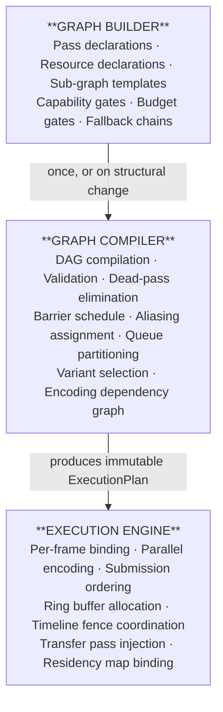
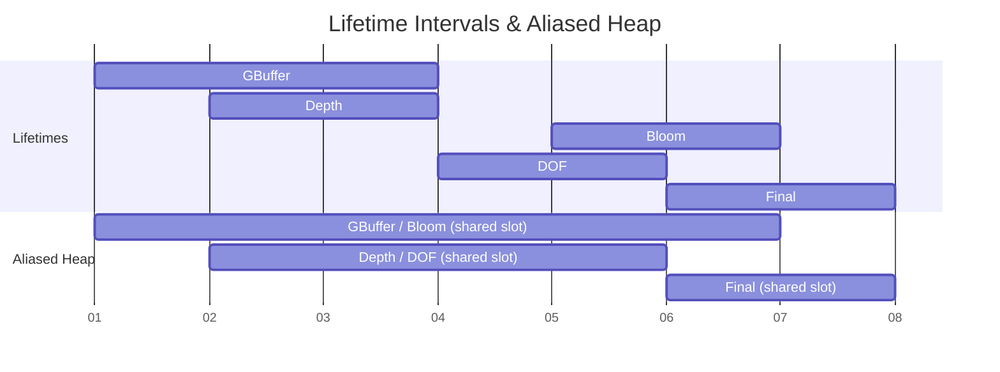
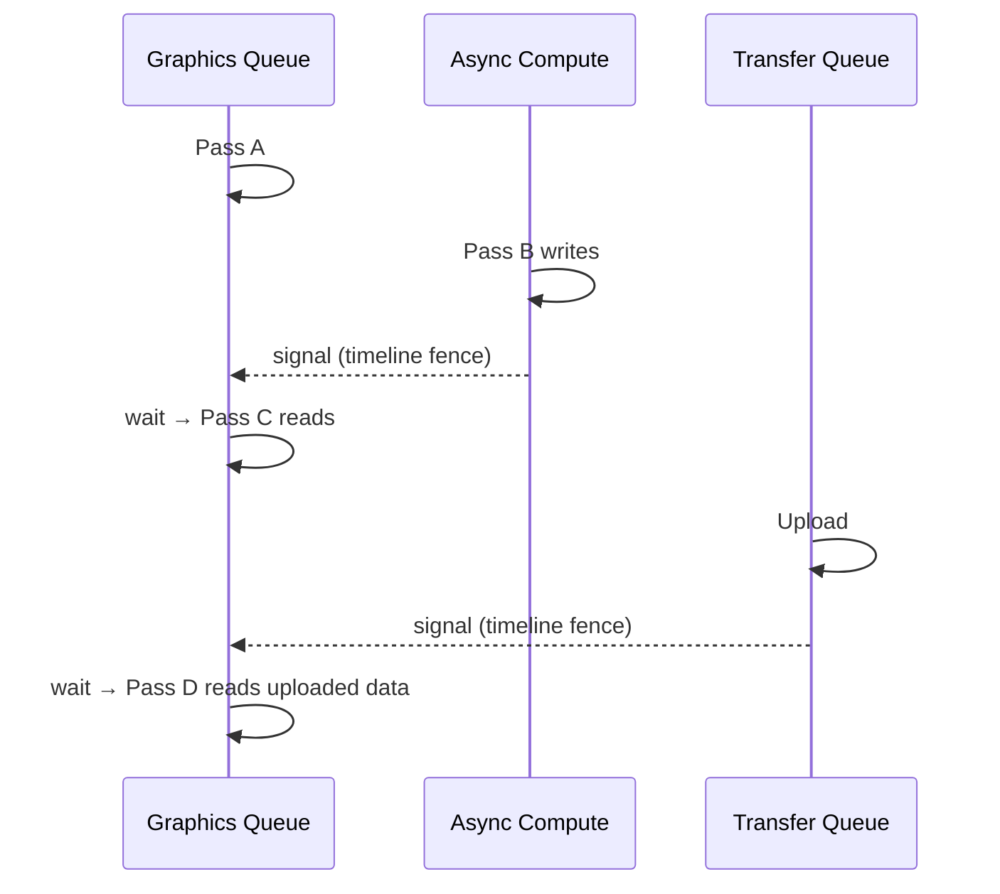
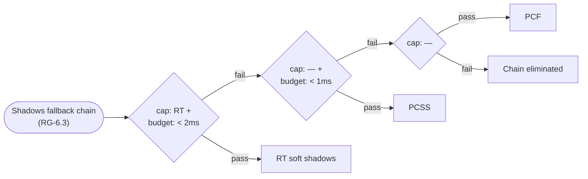
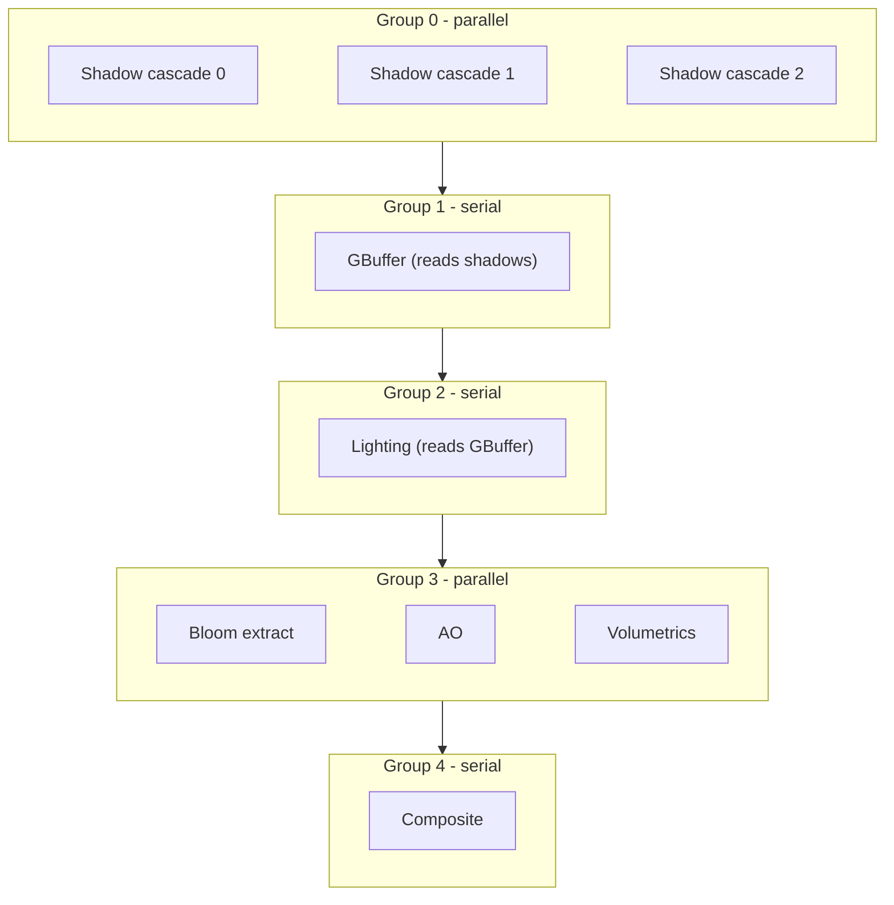
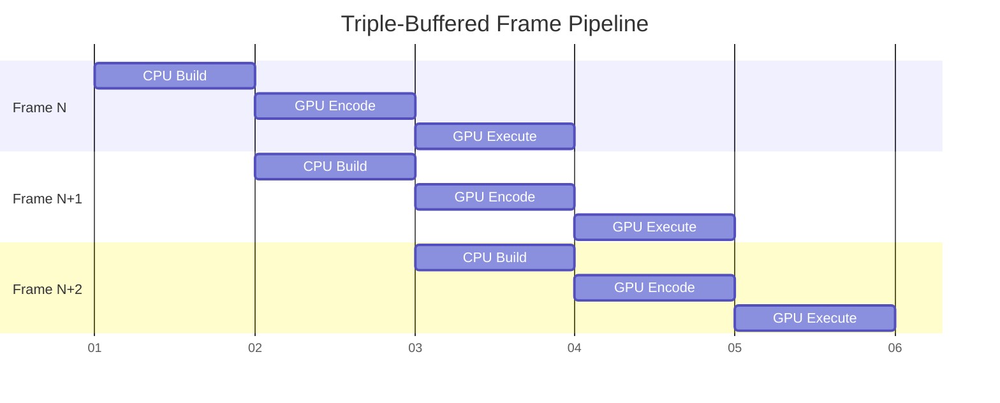
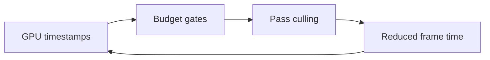
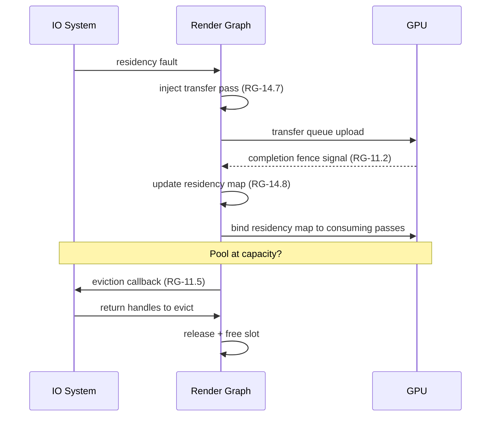
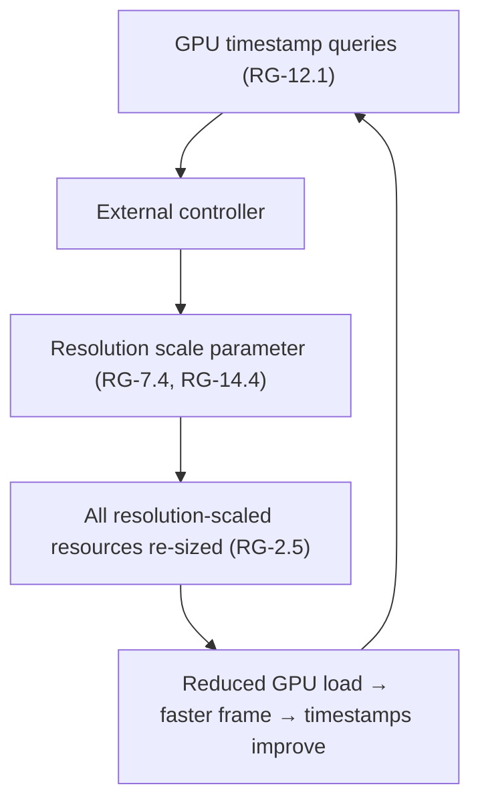
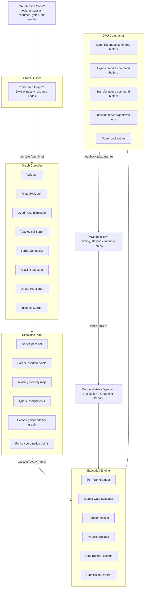

# Render Graph Architecture

System architecture for the render graph library, derived from the 119 requirements in [RG-1 through
RG-14](../requirements/6-render-graph/README.md), the renderer features in
[features/](../features/), and the core architectural constraints in
[1.1-core-constraints.md](../requirements/1-architecture/1.1-core-constraints.md).

## Contents

- [Render Graph Architecture](#render-graph-architecture)
  - [Contents](#contents)
  - [Design Principles](#design-principles)
  - [System Overview](#system-overview)
  - [Lifecycle](#lifecycle)
    - [Phase 1: Build (one-time or on structural change)](#phase-1-build-one-time-or-on-structural-change)
    - [Phase 2: Compile (one-time or on recompilation trigger)](#phase-2-compile-one-time-or-on-recompilation-trigger)
    - [Phase 3: Execute (every frame)](#phase-3-execute-every-frame)
  - [Subsystems](#subsystems)
    - [1. Graph Builder](#1-graph-builder)
      - [Pass types](#pass-types)
    - [2. Graph Compiler](#2-graph-compiler)
      - [Compilation triggers (RG-13.5)](#compilation-triggers-rg-135)
      - [Validation checks (RG-13.4)](#validation-checks-rg-134)
    - [3. Resource System](#3-resource-system)
      - [Resource categories (RG-2.1–2.25)](#resource-categories-rg-21225)
      - [Specialized resource types](#specialized-resource-types)
      - [Memory aliasing (RG-8.1–8.6)](#memory-aliasing-rg-8186)
    - [4. Synchronization Engine](#4-synchronization-engine)
      - [Cross-queue synchronization flow](#cross-queue-synchronization-flow)
    - [5. Gating System](#5-gating-system)
      - [Gate types](#gate-types)
      - [Fallback chain example](#fallback-chain-example)
      - [Cascading elimination (RG-7.3, RG-13.2–13.3)](#cascading-elimination-rg-73-rg-132133)
    - [6. Execution Engine](#6-execution-engine)
      - [Per-frame data binding (RG-14.1–14.8)](#per-frame-data-binding-rg-141148)
      - [Parallel encoding (RG-10.1–10.7)](#parallel-encoding-rg-101107)
      - [Triple-buffered frame pipeline (R-3.1.7)](#triple-buffered-frame-pipeline-r-317)
    - [7. Diagnostics](#7-diagnostics)
  - [Cross-Cutting Concerns](#cross-cutting-concerns)
    - [Multi-View Execution](#multi-view-execution)
    - [Streaming Integration](#streaming-integration)
    - [Dynamic Resolution](#dynamic-resolution)
  - [Feature Mapping](#feature-mapping)
  - [System Invariants](#system-invariants)
  - [Data Flow](#data-flow)

---

## Design Principles

These principles are derived from R-1.1.4 (declarative render graph), R-3.1.2 (minimal barriers),
R-3.1.3 (resource aliasing), and R-3.1.8 (zero-allocation execution).

| Principle                  | Source               | Implication                                                                                          |
| -------------------------- | -------------------- | ---------------------------------------------------------------------------------------------------- |
| Compile once, execute many | R-1.1.4, RG-14.1     | The graph topology is immutable after compilation; only per-frame data changes                       |
| Rendering-agnostic         | §6 README            | The graph knows passes, resources, queues, barriers, and gates — never bloom, shadows, hair, etc.    |
| Declarative I/O            | RG-1.1               | All barrier, layout, scheduling, and aliasing decisions are derived from typed pass I/O declarations |
| Zero per-frame allocation  | R-3.1.8, RG-10.5     | The hot path uses pre-allocated ring buffers and fixed pools; no heap allocation per frame           |
| Automatic synchronization  | RG-3.1–3.6           | Barriers, layout transitions, and ownership transfers are compiler-derived, never manually specified |
| Cascading elimination      | RG-7.3, RG-13.2–13.3 | Disabled, culled, or dead passes transitively eliminate their exclusive producers and resources      |

---

## System Overview

The render graph is a **frame-invariant DAG** of passes and resources compiled into an **execution
plan**. The system is divided into three temporal phases and seven subsystems.

---

## Lifecycle

### Phase 1: Build (one-time or on structural change)

The application declares the graph topology:

1. **Declare passes** — each with a type, typed resource I/O, queue affinity, and optional gates
   (RG-1.1–1.14)
2. **Declare resources** — transient, persistent, imported, history, sparse, atlas, acceleration
   structure (RG-2.1–2.25)
3. **Declare sub-graph templates** — parameterized templates for multi-view patterns (RG-9.1)
4. **Attach gates** — capability gates, budget gates, fallback chains, composite gates (RG-6.1–6.7)
5. **Attach diagnostics** — timestamp queries, statistics queries, debug overlays (RG-12.1–12.7)
6. **Submit to compiler**

Structural changes that trigger rebuild: topology changes, variant switches, capability set changes
(RG-13.5). Per-frame data changes (constants, enable flags, resolution scale) do **not** trigger
rebuild.

### Phase 2: Compile (one-time or on recompilation trigger)

The compiler transforms the declared graph into an optimized execution plan:

1. **Validate** — cycle detection, type mismatches, single-writer violations, variant selection, instance count (RG-13.4, RG-13.7, RG-13.8, RG-5.7)
2. **Gate evaluation** — evaluate capability gates, prune unavailable passes, select fallback chain winners (RG-6.1–6.7)
3. **Dead-pass elimination** — remove passes with no consumers, transitively cascade (RG-13.2–13.3)
4. **Topological sort** — derive execution order from resource edges (RG-5.1)
5. **Barrier schedule** — compute RAW, WAW barriers, layout transitions, cross-queue ownership transfers (RG-3.1–3.6)
6. **Resource aliasing** — compute lifetime intervals, assign aliased heap slots (RG-8.1–8.5)
7. **Queue partitioning** — assign passes to graphics, async-compute, and transfer queues (RG-4.1–4.6)
8. **Encoding dependency graph** — identify parallelizable encoding groups (RG-10.4)
9. **Multi-instance merge** — compile sub-graph instances into one DAG, dedup shared barriers (RG-9.5)

Output: an immutable `ExecutionPlan` containing the sorted pass list, barrier insertion points, aliasing map, queue assignments, encoding groups, and fence coordination points.

### Phase 3: Execute (every frame)

The execution engine runs the compiled plan with fresh per-frame data:

1. **Bind per-frame data** — buffer/texture handles, constants, sub-graph parameters, resolution
   scale (RG-14.1–14.4)
2. **Set activation flags** — enable/disable conditional passes without recompilation (RG-14.5)
3. **Evaluate budget gates** — GPU timing feedback, pool utilization (RG-7.1, RG-7.5)
4. **Inject transfer passes** — fault-driven uploads appended at injection point (RG-14.7)
5. **Bind residency map** — updated after previous frame's transfers complete (RG-14.8)
6. **Parallel encode** — threads acquire command buffers from per-queue pools, encode passes
   concurrently where the encoding dependency graph permits (RG-10.1–10.3)
7. **Allocate ring buffers** — per-frame constants and staging from lock-free ring allocators
   (RG-10.5)
8. **Submit** — command buffers submitted in topological order per queue, with timeline fence
   signals/waits at cross-queue boundaries (RG-10.6–10.7)
9. **Advance frame index** — increment and propagate for history buffer rotation, ring buffer
   advance (RG-14.6)

---

## Subsystems

### 1. Graph Builder

Responsible for constructing the declarative graph topology. All rendering features are expressed
through this interface without the graph knowing what they represent.

| Component               | Requirements                    | Purpose                                                            |
| ----------------------- | ------------------------------- | ------------------------------------------------------------------ |
| Pass descriptor API     | RG-1.1, RG-1.2                  | Typed pass declarations with I/O bindings and access modes         |
| Pass chain API          | RG-1.3                          | Ordered sequences with independently removable steps               |
| Variant dispatch        | RG-1.4, RG-1.12                 | Compile-time mutually exclusive pass selection                     |
| Conditional passes      | RG-1.6, RG-1.10                 | Runtime-toggled passes and per-instance enable                     |
| Sub-graph templates     | RG-1.5, RG-1.11, RG-5.2, RG-9.1 | Parameterized reusable pass topologies with variable instantiation |
| Specialized pass types  | RG-1.7, RG-1.13, RG-1.14        | Host callbacks, GPU work graphs, checkerboard resolve              |
| Render area constraints | RG-1.9                          | Sub-region write scoping for atlases and cascades                  |
| Debug metadata          | RG-1.8                          | Stable names and tags for profiling                                |

**Feature mapping:** Every renderer feature (F-1.x through F-7.x) that has graph impact is expressed
exclusively through this API. The builder does not know about bloom, shadows, hair, or any domain
concept — only pass types, resource bindings, and gates.

#### Pass types

Drawn from RG-1.1, RG-1.7, RG-1.13, RG-1.14:

| Type                           | GPU work        | Examples (for context, not known to graph) |
| ------------------------------ | --------------- | ------------------------------------------ |
| `rasterization`                | Draw commands   | G-buffer, shadow, forward, UI              |
| `compute`                      | Dispatch        | Culling, histogram, FFT, simulation        |
| `ray-tracing-dispatch`         | TraceRays       | RT reflections, GI, path tracing           |
| `acceleration-structure-build` | Build/update AS | BLAS/TLAS rebuild                          |
| `transfer`                     | Copy            | Streaming uploads, readback                |
| `msaa-resolve`                 | Resolve         | Multi-sample resolve                       |
| `present`                      | Present         | Swapchain present                          |
| `host-callback`                | None (CPU)      | Residency map update                       |
| `work-graph`                   | GPU-scheduled   | Adaptive tessellation, GPU-driven dispatch |
| `checkerboard-resolve`         | Compute         | Half-res reconstruction                    |

### 2. Graph Compiler

Transforms the declared DAG into an optimized execution plan. This is the most complex subsystem.

| Component            | Requirements                      | Input                                   | Output                    |
| -------------------- | --------------------------------- | --------------------------------------- | ------------------------- |
| Validator            | RG-5.7, RG-13.4, RG-13.7, RG-13.8 | Declared graph                          | Errors or validated graph |
| Gate evaluator       | RG-6.1–6.7                        | Validated graph + capability descriptor | Pruned graph              |
| Dead-pass eliminator | RG-13.2–13.3, RG-7.3              | Pruned graph                            | Minimal graph             |
| Topological sorter   | RG-5.1, RG-5.3, RG-5.6            | Minimal graph                           | Deterministic pass order  |
| Barrier scheduler    | RG-3.1–3.6                        | Sorted passes + resource I/O            | Barrier insertion points  |
| Aliasing allocator   | RG-8.1–8.5                        | Lifetime intervals + heap types         | Aliased memory map        |
| Queue partitioner    | RG-4.1–4.6                        | Queue affinities + fallback rules       | Per-queue command lists   |
| Encoding planner     | RG-10.4                           | Resource dependencies                   | Encoding dependency graph |
| Instance merger      | RG-9.5                            | Sub-graph instances                     | Unified DAG               |

#### Compilation triggers (RG-13.5)

| Change type                                               | Triggers recompile? |
| --------------------------------------------------------- | ------------------- |
| Pass topology (add/remove passes)                         | Yes                 |
| Variant selection (AA mode, lighting model, quality tier) | Yes                 |
| Capability set change                                     | Yes                 |
| Residency state change                                    | Partial (RG-13.6)   |
| Per-frame constants, enable flags, resolution scale       | No                  |
| Buffer/texture handles                                    | No                  |

#### Validation checks (RG-13.4)

| Check                   | Error condition                                        |
| ----------------------- | ------------------------------------------------------ |
| Cycle detection         | Circular resource dependencies                         |
| Type mismatch           | Producer format incompatible with consumer             |
| Undeclared resource     | Pass references resource not in graph                  |
| Queue incompatibility   | Pass operations unsatisfiable by assigned queue        |
| Single-writer violation | Multiple concurrent writers to same resource           |
| Variant ambiguity       | Zero or multiple active variants per slot (RG-13.7)    |
| Instance count mismatch | Array layer count ≠ sub-graph instance count (RG-13.8) |

### 3. Resource System

Manages all GPU resource declarations, lifetimes, aliasing, and pool allocation.

#### Resource categories (RG-2.1–2.25)

| Category                             | Lifetime                | Aliasable           | Key properties                                |
| ------------------------------------ | ----------------------- | ------------------- | --------------------------------------------- |
| **Transient** (RG-2.1)               | Single frame            | Yes                 | Auto-lifetime, pool-eligible                  |
| **Persistent** (RG-2.2)              | Cross-frame             | No                  | Stable allocation until released              |
| **Imported** (RG-2.3)                | External                | No                  | External allocation, participates in barriers |
| **History** (RG-2.4)                 | Frame N-1 read          | No (N slots)        | Auto ping-pong double-buffer                  |
| **Multi-frame history** (RG-2.24)    | Frame N-k read          | No (N slots)        | N-way rotation chain                          |
| **Sparse** (RG-2.9)                  | Cross-frame             | No                  | Tile-granularity residency map                |
| **Pool-backed** (RG-2.8)             | Pool-managed            | Intra-pool (RG-8.3) | Fixed capacity, eviction callback             |
| **Staging** (RG-2.10)                | Ring-managed            | Ring (RG-8.4)       | Host-visible, zero-allocation                 |
| **Atlas** (RG-2.17)                  | Cross-frame             | No                  | Power-of-two tile slots                       |
| **Acceleration structure** (RG-2.18) | Persistent or transient | Scratch only        | Build/read barrier semantics                  |

#### Specialized resource types

| Type                     | Requirement     | Usage                                            |
| ------------------------ | --------------- | ------------------------------------------------ |
| Texture array            | RG-2.6          | Cubemap faces, cascades, probe atlas layers      |
| Variant-conditional      | RG-2.7          | Resources only allocated for active variant      |
| Resolution-scaled        | RG-2.5, RG-2.20 | Dimensions track named resolution parameters     |
| Shading rate image       | RG-2.12         | VRS attachment with dedicated usage flag         |
| Indirect argument buffer | RG-2.13         | GPU-driven draw/dispatch arguments               |
| Ring buffer              | RG-2.14         | Slot-addressable producer/consumer handoff       |
| Bindless heap            | RG-2.15         | External descriptor heap registration            |
| 64-bit render target     | RG-2.16         | Visibility buffer                                |
| Multi-sample target      | RG-2.21         | MSAA color/depth buffers                         |
| Mip-targeted texture     | RG-2.22         | Per-mip-level write access                       |
| Active-extent texture    | RG-2.23         | Fixed allocation, runtime-variable active region |
| Opacity micromap         | RG-2.25         | AS attachment for alpha-tested acceleration      |

#### Memory aliasing (RG-8.1–8.6)

The aliasing subsystem reduces peak VRAM by sharing heap ranges between non-overlapping transient
resources.

Rules:
- Only transient resources alias (RG-2.1, RG-8.2)
- Only same heap type can alias (RG-8.5)
- Pool elements alias within their pool domain (RG-8.3)
- Staging buffers alias within ring buffers (RG-8.4)
- Persistent, history, imported, sparse resources never alias

### 4. Synchronization Engine

Derives all synchronization from declared pass I/O. No manual barriers.

| Mechanism                 | Requirement | Scope                                               |
| ------------------------- | ----------- | --------------------------------------------------- |
| RAW barriers              | RG-3.1      | Write → read on same queue                          |
| WAW barriers              | RG-3.2      | Write → write on same queue                         |
| Layout transitions        | RG-3.3      | Texture usage state changes                         |
| Cross-queue ownership     | RG-3.4      | Release/acquire pairs across queues                 |
| Single-writer enforcement | RG-3.5      | Static compile-time verification                    |
| Barrier merging           | RG-3.6      | Coalesce compatible barriers at same sync point     |
| Split barriers            | RG-3.6      | Early release, late acquire where hardware supports |
| Timeline fences           | RG-10.6     | Cross-queue and cross-frame coordination            |
| Completion fences         | RG-11.2     | Per-transfer-pass completion signaling              |

#### Cross-queue synchronization flow

Timeline fences (RG-10.6) coordinate all cross-queue dependencies. Each queue maintains a
monotonically increasing fence counter. Pass B signals its counter; Pass C waits on that value
before executing.

### 5. Gating System

Controls which passes are included in the execution plan based on hardware capabilities, runtime
budgets, and configuration.

#### Gate types

| Gate                         | Evaluation time | Trigger                                               | Requirements    |
| ---------------------------- | --------------- | ----------------------------------------------------- | --------------- |
| **Capability gate (hard)**   | Compile         | Missing capability → compile error                    | RG-6.1, RG-6.2  |
| **Capability gate (soft)**   | Compile         | Missing capability → silent prune                     | RG-6.1, RG-6.2  |
| **Fallback chain**           | Compile         | First satisfied gate wins                             | RG-6.3          |
| **Queue fallback**           | Compile         | Missing queue → graphics fallback                     | RG-6.5          |
| **Path-conditioned variant** | Compile         | Cross-slot variant exclusion                          | RG-6.7          |
| **Composite cap+budget**     | Compile+Runtime | Cap fails → static prune; budget fails → dynamic cull | RG-6.6          |
| **GPU timing gate**          | Runtime         | Frame time exceeds threshold → cull                   | RG-7.1          |
| **Pool utilization gate**    | Runtime         | Pool usage exceeds threshold → cull                   | RG-7.5          |
| **Conditional enable**       | Runtime         | Per-frame boolean → skip pass                         | RG-1.6, RG-14.5 |

#### Fallback chain example

#### Cascading elimination (RG-7.3, RG-13.2–13.3)

When a pass is culled (by any gate type), its exclusive resources are freed and any pass whose sole
input was produced by the culled pass is also culled, recursively:

### 6. Execution Engine

Runs the compiled execution plan every frame.

#### Per-frame data binding (RG-14.1–14.8)

The execution engine maintains a strict separation between the immutable topology (compiled once)
and mutable per-frame data (bound each frame):

| Mutable per-frame data   | Requirement | Examples                                       |
| ------------------------ | ----------- | ---------------------------------------------- |
| Buffer/texture handles   | RG-14.2     | Transform buffers, wind fields, residency maps |
| Sub-graph parameters     | RG-14.3     | Per-camera view-projection, render targets     |
| Resolution scale         | RG-14.4     | Dynamic resolution scalar                      |
| Pass activation flags    | RG-14.5     | Post-process toggles, debug overlays           |
| Frame index              | RG-14.6     | History rotation, ring buffer offset           |
| Injected transfer passes | RG-14.7     | Fault-driven streaming uploads                 |
| Residency map bindings   | RG-14.8     | Current-frame tile/page residency state        |
| Budget gate parameters   | RG-7.6      | GPU timing thresholds, pool utilization        |

#### Parallel encoding (RG-10.1–10.7)

**Thread pool assignment:**

| Thread   | Encoding sequence                   |
| -------- | ----------------------------------- |
| Thread 0 | cascade 0 → GBuffer → Bloom extract |
| Thread 1 | cascade 1 → *(idle)* → AO           |
| Thread 2 | cascade 2 → *(idle)* → Volumetrics  |

Submission: reorder to topological order regardless of encoding order (RG-10.7)

Each thread acquires command buffers from per-queue thread-safe pools (RG-10.2). All per-frame
constants and staging allocations come from lock-free ring buffers (RG-10.5).

#### Triple-buffered frame pipeline (R-3.1.7)

Timeline fences (RG-10.6) ensure frame N+2's encoding does not begin until frame
N's execution completes, allowing three frames in flight simultaneously.

### 7. Diagnostics

All diagnostic instrumentation is zero-overhead when disabled (RG-12.7).

| Facility            | Requirement | Data                                      |
| ------------------- | ----------- | ----------------------------------------- |
| GPU timestamps      | RG-12.1     | Per-pass begin/end nanoseconds            |
| Pipeline statistics | RG-12.2     | Primitive counts, invocation counts       |
| Transfer throughput | RG-12.3     | Per-pass byte counts and latency          |
| Queue depth         | RG-12.4     | In-flight pass count per queue            |
| GPU readback        | RG-12.5     | Arbitrary GPU → CPU data copy             |
| Debug overlays      | RG-12.6     | Conditionally-active visualization passes |
| Memory diagnostics  | RG-8.6      | Peak aliased memory, aliasing efficiency  |

GPU timestamp data feeds back into the budget gating system (RG-7.1), creating a
closed-loop quality adaptation cycle:

---

## Cross-Cutting Concerns

### Multi-View Execution

Multi-view patterns (multi-camera, cubemap, cascaded shadows, split-screen, VR) are expressed as
**parameterized sub-graph templates** (RG-9.1) instantiated N times with different bindings.

**Resources are classified per binding site:**
- **Shared** (RG-9.3): one allocation, all instances read (e.g., scene geometry, shadow atlas)
- **Exclusive** (RG-9.2): one allocation per instance (e.g., per-camera render target)

**Compiler optimizations:**
- Shared resources get a single barrier covering all instance reads (RG-9.3)
- Independent instances encode in parallel on separate threads (RG-10.3)
- All instances compile into one unified DAG (RG-9.5)

**Instance-level control:**
- Per-instance enable flag without recompilation (RG-1.10)
- Per-instance variant selection (RG-1.12)
- Variable instance count up to compile-time maximum (RG-1.11)
- Array-layer targeting for cubemap/cascade patterns (RG-9.4)

**Feature mapping:**

| Pattern                     | Template             | Instances  | Shared     | Exclusive             |
| --------------------------- | -------------------- | ---------- | ---------- | --------------------- |
| Multi-camera (F-1.1.5)      | Main render pipeline | N cameras  | Scene data | Per-camera RT         |
| Cubemap capture (F-1.1.7)   | Face render          | 6 faces    | Scene data | Per-face layer        |
| Cascaded shadows (F-1.3.1)  | Shadow render        | N cascades | Light data | Per-cascade layer     |
| Split-screen (F-6.2.7)      | Full pipeline        | N players  | Scene data | Per-player RT         |
| Per-light shadows (F-1.3.5) | Shadow render        | N lights   | Geometry   | Per-light atlas tile  |
| Deep opacity maps (F-2.3.7) | DOM render           | N lights   | Hair data  | Per-light DOM texture |

### Streaming Integration

The streaming subsystem bridges the render graph and the IO system, managing the lifecycle of
partially-resident resources.

Key mechanisms:
- **Transfer queue passes** (RG-11.1): declared graph nodes with proper dependency tracking
- **Completion fences** (RG-11.2): per-transfer signals for downstream gating
- **Residency tracking** (RG-11.3): structured buffer resource readable by GPU passes
- **Fault-driven injection** (RG-11.4, RG-14.7): runtime pass insertion without recompilation
- **LRU eviction** (RG-11.5): callback-driven pool management
- **Priority scheduling** (RG-11.6, RG-5.5): critical uploads before speculative prefetches
- **Cross-frame hand-off** (RG-11.7): frame N upload → frame N+1 consumption

**Incremental recompilation** (RG-13.6): residency changes trigger partial recompilation of affected
barriers and layout transitions only, not full graph rebuild.

### Dynamic Resolution

Dynamic resolution is a runtime feedback loop requiring no recompilation.

Multiple independent named resolution parameters (RG-2.20) enable:
- Internal render resolution (e.g., 0.5x–1.0x for TSR input)
- Output display resolution (e.g., 1.0x)
- Atmosphere LUT resolution (independent override)

---

## Feature Mapping

How renderer feature categories map to render graph subsystems. The render graph does not know about
these features; they are expressed through the generic graph builder API.

| Feature Category              | Key Features                                           | Primary RG Subsystems Used                              |
| ----------------------------- | ------------------------------------------------------ | ------------------------------------------------------- |
| **Core Rendering** (F-1.1)    | Culling, instancing, scene capture, dynamic resolution | Pass declaration, multi-view, budget culling            |
| **Lighting** (F-1.2)          | Forward+, deferred, PBR, IBL, DDGI                     | Variant dispatch, texture arrays, persistent resources  |
| **Shadows** (F-1.3)           | CSM, VSM, shadow atlas, soft shadows                   | Multi-view templates, atlas resources, fallback chains  |
| **Post-Processing** (F-1.4)   | Bloom, DOF, motion blur, tonemapping                   | Pass chains, transient resources, conditional passes    |
| **Anti-Aliasing** (F-1.5)     | TAA, TSR, FXAA, MSAA, checkerboard                     | Variant dispatch, history resources, resolution scaling |
| **Ray Tracing** (F-2.1)       | RT reflections, GI, path tracing, ReSTIR               | AS resources, capability gates, history resources       |
| **Environment** (F-2.2)       | Sky, volumetrics, clouds, ocean, fog                   | Persistent resources, async compute, history resources  |
| **Hair & Characters** (F-2.3) | Strand hair, skin, eyes, cloth, peach fuzz             | Capability gates, fallback chains, deep opacity maps    |
| **Meshlet Pipeline** (F-3.1)  | Visibility buffer, VRS, GPU work graphs                | 64-bit RT, shading rate images, work graph passes       |
| **Worlds & Terrain** (F-3.2)  | Streaming worlds, voxels, terrain, HLOD                | Streaming integration, sparse textures, pool resources  |
| **Foliage** (F-3.3)           | Instanced foliage, wind, GPU skinning                  | Indirect argument buffers, persistent resources         |
| **Animation** (F-4.1)         | Skeletal, morph, cloth, hair sim, crowds               | Async compute, persistent buffers, conditional passes   |
| **UI & 2D** (F-5.1)           | Vector/bitmap UI, sprites, tilemaps                    | Imported resources, pass chains, conditional passes     |
| **Shader & Assets** (F-6.1)   | Shader graphs, custom passes, glTF import              | Custom pass registration, bindless heap                 |
| **IO & Streaming** (F-6.2)    | Streaming priorities, GPU decompression                | Streaming integration, transfer queue, pool resources   |
| **VFX & Particles** (F-7.1)   | GPU particles, fluid sim, destruction                  | Persistent resources, async compute, indirect buffers   |

---

## System Invariants

These properties hold for any valid compiled graph and are enforced by the compiler or execution
engine.

| #   | Invariant                                               | Enforcement                      | Source               |
| --- | ------------------------------------------------------- | -------------------------------- | -------------------- |
| 1   | Every resource is written before it is read             | Topological sort                 | RG-5.1               |
| 2   | No resource has concurrent writers                      | Compile-time static check        | RG-3.5               |
| 3   | All barriers are derived from I/O declarations          | Compiler-generated               | RG-3.1–3.4           |
| 4   | The graph is acyclic                                    | Compile-time cycle detection     | RG-5.7               |
| 5   | Exactly one variant is active per variant slot          | Compile-time check               | RG-13.7              |
| 6   | Array layer count = sub-graph instance count            | Compile-time check               | RG-13.8              |
| 7   | Disabled passes do not consume GPU time or memory       | Cascading elimination            | RG-7.3, RG-13.2–13.3 |
| 8   | Per-frame operations perform zero heap allocations      | Ring buffers + fixed pools       | RG-10.5, R-3.1.8     |
| 9   | Execution order is deterministic for identical topology | Deterministic topological sort   | RG-5.6               |
| 10  | Cross-queue transfers use ownership barrier pairs       | Compiler-emitted release/acquire | RG-3.4               |
| 11  | Aliasing occurs only between same-heap-type resources   | Heap type check                  | RG-8.5               |
| 12  | Diagnostic instrumentation is zero-cost when disabled   | Compile-time opt-out             | RG-12.7              |

---

## Data Flow

End-to-end data flow from application to GPU, showing which subsystem owns each transformation.

