# Render Graph Class and Sequence Diagrams

Class diagrams for each module and sequence diagrams showing inter-module interactions.
Companion to [render-graph-design.md](render-graph-design.md).

---

## Contents

- [Module Class Diagrams](#module-class-diagrams)
  - [1. Core Types](#1-core-types)
  - [2. Graph Builder](#2-graph-builder)
  - [3. Graph Compiler](#3-graph-compiler)
  - [4. Resource System](#4-resource-system)
  - [5. Synchronization Engine](#5-synchronization-engine)
  - [6. Gating System](#6-gating-system)
  - [7. Execution Engine](#7-execution-engine)
  - [8. Diagnostics](#8-diagnostics)
  - [9. GPU Runtime](#9-gpu-runtime)
- [Cross-Module Relationships](#cross-module-relationships)
- [Sequence Diagrams](#sequence-diagrams)
  - [Full Lifecycle](#full-lifecycle)
  - [Compilation Pipeline](#compilation-pipeline)
  - [Per-Frame Execution](#per-frame-execution)
  - [Parallel Encoding](#parallel-encoding)
  - [Streaming Fault Resolution](#streaming-fault-resolution)

---

## Module Class Diagrams

### 1. Core Types

`harmonius::rg` — Shared vocabulary types with no business logic.

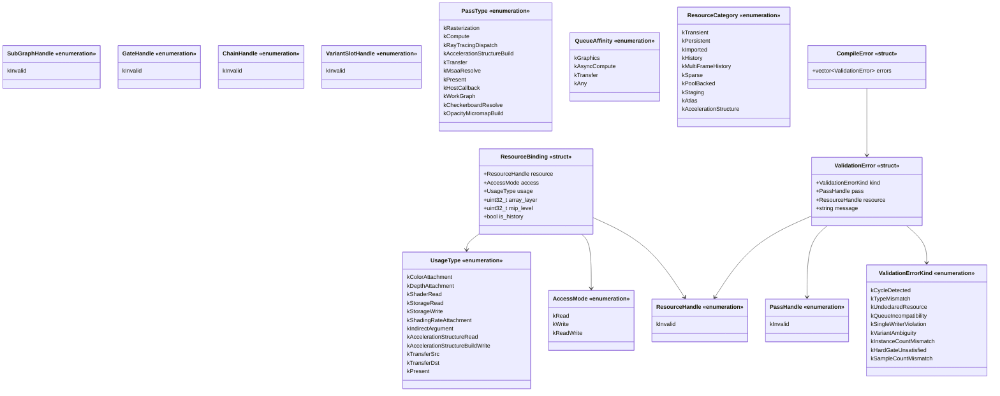

### 2. Graph Builder

`harmonius::rg::builder` — Declarative graph construction.

```mermaid
classDiagram
    class GraphBuilder {
        +GraphBuilder(CapabilityDescriptor caps)
        +AddPass(PassDescriptor) PassHandle
        +BeginChain(string_view) ChainHandle
        +AddChainStep(ChainHandle, PassDescriptor) PassHandle
        +EndChain(ChainHandle) void
        +DeclareVariantSlot(string_view) VariantSlotHandle
        +AddVariant(VariantSlotHandle, string_view, PassDescriptor) PassHandle
        +DeclareSubgraphTemplate(string_view, SubGraphDescriptor) SubGraphHandle
        +InstantiateSubgraph(SubGraphHandle, uint32_t, span) void
        +DeclareTransient(TransientResourceDesc) ResourceHandle
        +DeclarePersistent(PersistentResourceDesc) ResourceHandle
        +DeclareImported(ImportedResourceDesc) ResourceHandle
        +DeclareHistory(HistoryResourceDesc) ResourceHandle
        +DeclareMultiFrameHistory(MultiFrameHistoryDesc) ResourceHandle
        +DeclareSparse(SparseResourceDesc) ResourceHandle
        +DeclarePool(PoolResourceDesc) ResourceHandle
        +DeclareStaging(StagingBufferDesc) ResourceHandle
        +DeclareAtlas(AtlasResourceDesc) ResourceHandle
        +DeclareAccelerationStructure(AccelStructDesc) ResourceHandle
        +AttachCapabilityGate(PassHandle, CapabilityGateDesc) GateHandle
        +AttachBudgetGate(PassHandle, BudgetGateDesc) GateHandle
        +DeclareFallbackChain(string_view, span) GateHandle
        +AddOrderingEdge(PassHandle, PassHandle) void
        +AddFrameDependency(PassHandle, PassHandle, uint32_t) void
        +RemoveChainStep(ChainHandle, PassHandle) void
        +DeclareRingBuffer(RingBufferDesc) ResourceHandle
        +DeclareBindlessHeap(BindlessHeapDesc) ResourceHandle
        +AttachPathConditionedGate(PassHandle, PathConditionedGateDesc) GateHandle
        +AttachTimestampQuery(PassHandle, string_view) void
        +AttachStatisticsQuery(PassHandle, string_view) void
        +MarkDebugOverlay(PassHandle) void
        +Build() expected~DeclaredGraph, CompileError~
    }
    class DeclaredGraph {
        +Passes() span~PassDescriptor~
        +PassCount() uint32_t
        +ResourceCount() uint32_t
        -Impl impl_
    }
    class PassDescriptor {
        +string_view name
        +PassType type
        +QueueAffinity queue
        +vector~ResourceBinding~ inputs
        +vector~ResourceBinding~ outputs
        +bool conditional
        +optional~RenderArea~ render_area
        +vector~string_view~ tags
        +float estimated_cost_ms
        +uint32_t priority
        +optional~bool~ frame_parity
        +move_only_function execute
    }
    class SubGraphDescriptor {
        +string_view name
        +uint32_t max_instances
        +vector~PassDescriptor~ passes
        +vector~SubGraphParamSlot~ param_slots
    }
    class SubGraphBindings {
        +vector~ResourceHandle~ exclusive_resources
        +vector~ResourceHandle~ shared_resources
        +uint32_t target_array_layer
        +unordered_map variant_selections
    }
    class TransientResourceDesc {
        +string_view name
        +Format format
        +uint32_t width
        +uint32_t height
        +uint32_t depth
        +uint32_t mip_levels
        +uint32_t array_layers
        +SampleCount samples
        +optional~string_view~ resolution_param
    }
    class PersistentResourceDesc {
        +string_view name
        +Format format
        +uint32_t width
        +uint32_t height
        +uint32_t depth
        +uint32_t array_layers
        +optional~ActiveExtentDesc~ active_extent
    }
    class HistoryResourceDesc {
        +string_view name
        +Format format
        +uint32_t width
        +uint32_t height
        +optional~string_view~ resolution_param
    }
    class MultiFrameHistoryDesc {
        +string_view name
        +Format format
        +uint32_t width
        +uint32_t height
        +uint32_t history_depth
        +optional~string_view~ resolution_param
    }
    class ImportedResourceDesc {
        +string_view name
        +gpu_ResourceHandle external_handle
        +AccessMode initial_access
        +UsageType initial_usage
    }
    class SparseResourceDesc {
        +string_view name
        +Format format
        +uint32_t width
        +uint32_t height
        +uint32_t tile_width
        +uint32_t tile_height
    }
    class PoolResourceDesc {
        +string_view name
        +Format format
        +uint32_t element_width
        +uint32_t element_height
        +uint32_t max_elements
        +move_only_function eviction_callback
    }
    class StagingBufferDesc {
        +string_view name
        +uint64_t size_bytes
    }
    class AtlasResourceDesc {
        +string_view name
        +Format format
        +uint32_t width
        +uint32_t height
        +uint32_t tile_size
    }
    class AccelStructDesc {
        +string_view name
        +ResourceCategory category
        +bool has_opacity_micromap
    }
    class RingBufferDesc {
        +string_view name
        +uint64_t slot_size_bytes
        +uint32_t slot_count
    }
    class BindlessHeapDesc {
        +string_view name
        +uint32_t max_descriptors
        +uint32_t max_samplers
    }
    class ActiveExtentDesc {
        +uint32_t max_layers
        +uint32_t max_width
        +uint32_t max_height
    }
    class SubGraphParamSlot {
        +string_view name
        +bool is_shared
    }
    class RenderArea {
        +uint32_t x
        +uint32_t y
        +uint32_t width
        +uint32_t height
        +bool is_per_frame_binding
    }

    GraphBuilder --> DeclaredGraph : produces
    GraphBuilder --> PassDescriptor : accepts
    GraphBuilder --> SubGraphDescriptor : accepts
    GraphBuilder --> TransientResourceDesc : accepts
    GraphBuilder --> PersistentResourceDesc : accepts
    GraphBuilder --> ImportedResourceDesc : accepts
    GraphBuilder --> HistoryResourceDesc : accepts
    GraphBuilder --> MultiFrameHistoryDesc : accepts
    GraphBuilder --> SparseResourceDesc : accepts
    GraphBuilder --> PoolResourceDesc : accepts
    GraphBuilder --> StagingBufferDesc : accepts
    GraphBuilder --> AtlasResourceDesc : accepts
    GraphBuilder --> AccelStructDesc : accepts
    GraphBuilder --> RingBufferDesc : accepts
    GraphBuilder --> BindlessHeapDesc : accepts
    DeclaredGraph *-- PassDescriptor
    PassDescriptor --> ResourceBinding
    PassDescriptor --> RenderArea
    SubGraphDescriptor *-- PassDescriptor
    SubGraphDescriptor *-- SubGraphParamSlot
    PersistentResourceDesc --> ActiveExtentDesc
    AccelStructDesc --> ResourceCategory
```

### 3. Graph Compiler

`harmonius::rg::compiler` — Nine-stage DAG optimization pipeline.

### 4. Resource System

`harmonius::rg::resource` — Lifetime analysis, aliasing, pools, ring buffers.

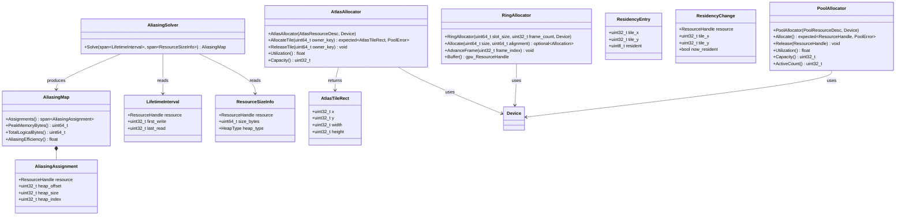

### 5. Synchronization Engine

`harmonius::rg::sync` — Barriers, layout transitions, timeline fences.

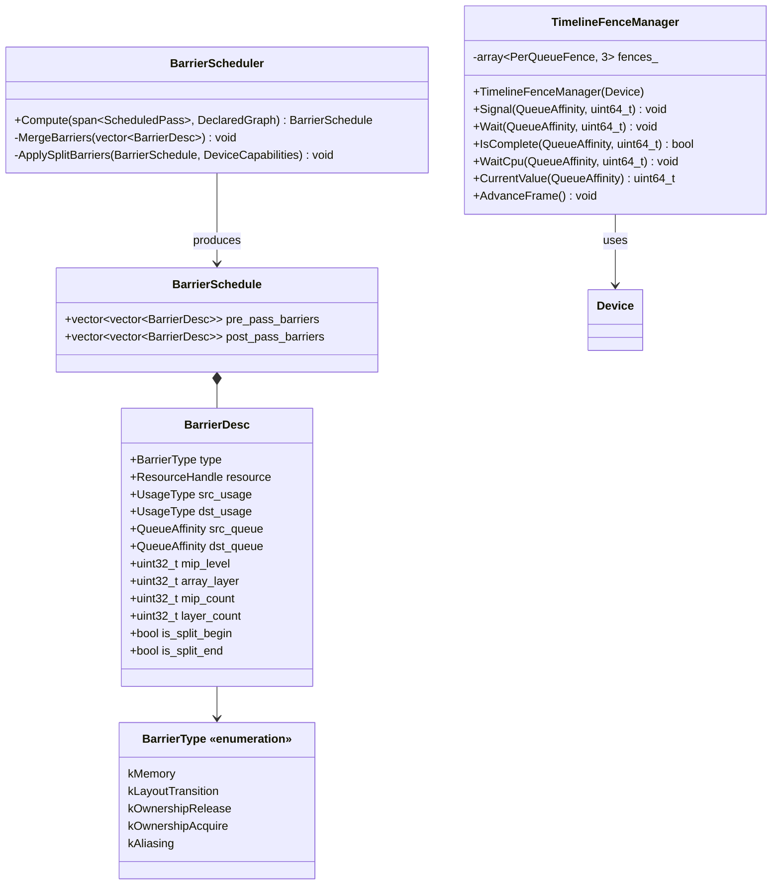

### 6. Gating System

`harmonius::rg::gate` — Compile-time and runtime pass gating.

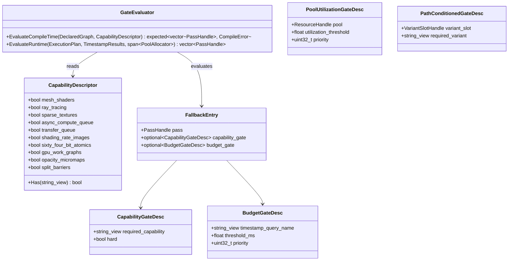

### 7. Execution Engine

`harmonius::rg::exec` — Per-frame binding, encoding, submission.

### 8. Diagnostics

`harmonius::rg::diag` — GPU profiling and memory metrics.

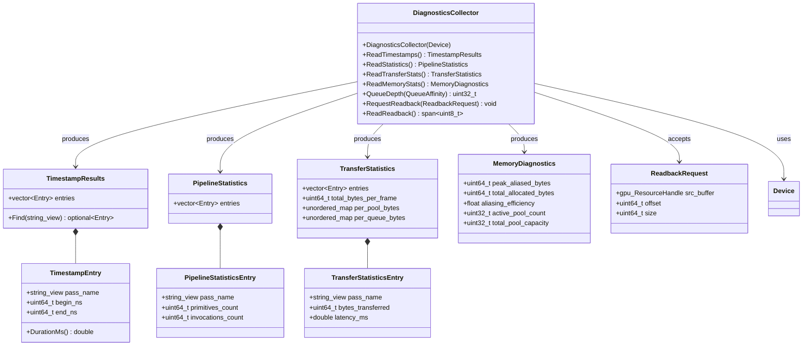

### 9. GPU Runtime

`harmonius::gpu_runtime` — Shared services built on the GPU backend interface. The render graph
depends on the GPU runtime layer, not on the GPU backend directly. See [gpu-runtime.md](gpu-runtime.md)
and [gpu-runtime-classes.md](gpu-runtime-classes.md) for full class diagrams.

This section shows only the abstract concept interfaces that the render graph interacts with.
Concrete backend implementations (D3D12, Vulkan, Metal) are documented in:

- [gpu-backend-interface.md](gpu-backend-interface.md) — concepts, types, and cross-backend
  compatibility
- [gpu-backend-d3d12.md](gpu-backend-d3d12.md) — Direct3D 12 (Agility SDK 1.619+, SM 6.9)
- [gpu-backend-vulkan.md](gpu-backend-vulkan.md) — Vulkan 1.4
- [gpu-backend-metal.md](gpu-backend-metal.md) — Metal 4

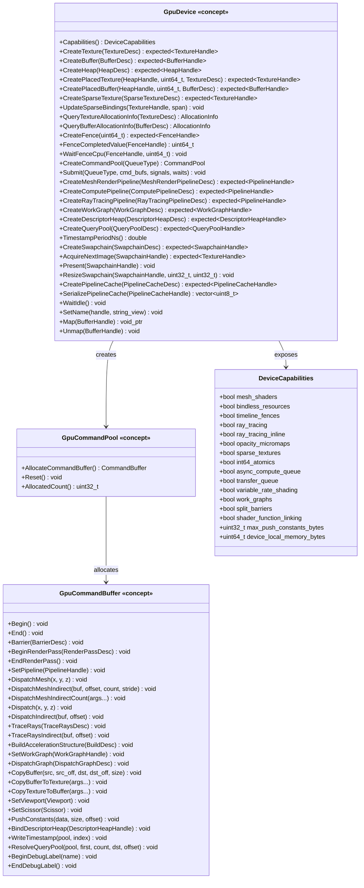

---

## Cross-Module Relationships

How the modules depend on each other at the class level. The render graph interacts with the
GPU through the GPU runtime layer (`gpu_runtime`) — it never uses backend APIs directly.

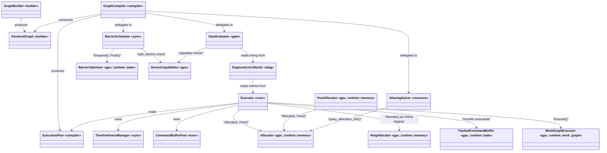

### Render Graph to GPU Runtime Type Mapping

How render graph types translate into GPU runtime and backend interface types at the boundary.
The render graph depends on `gpu_runtime` types for all GPU interaction — it never references
backend-specific types (D3D12, Vulkan, Metal).

| Render Graph Type | GPU Runtime / Interface Type | Translation Point |
|------------------|----------------------------|-------------------|
| `rg::QueueAffinity` | `gpu::QueueType` | Direct 1:1 enum mapping (`kGraphics` → `kGraphics`, etc.) |
| `rg::UsageType` | `gpu::PipelineStage` + `gpu::ResourceAccess` + `gpu::TextureLayout` | `BarrierScheduler` performs the multi-field translation |
| `rg::sync::BarrierDesc` | `gpu_runtime::state::BarrierOptimizer::Enqueue()` | Synchronization engine enqueues barriers at Compile time |
| `rg::builder::TransientResourceDesc` | `gpu_runtime::memory::Allocator::Allocate()` | Resource system allocates via the runtime allocator |
| `rg::builder::PassDescriptor` (Execute callback) | `gpu_runtime::state::TrackedCommandBuffer` method calls | `PassContext::cmd()` exposes the tracked command Buffer |
| `rg::compiler::FenceCoordination` | `gpu::FenceSignal` + `gpu::FenceWait` | `TimelineFenceManager` translates fence operations |
| `rg::resource::AliasingAssignment` | `gpu_runtime::memory::Allocator::Allocate()` with placed strategy | Resource system creates placed resources from Assignments |
| `rg::gate::CapabilityDescriptor` | `gpu::DeviceCapabilities` | 1:1 field mapping — populated from device Capabilities at init |

---

## Sequence Diagrams

### Full Lifecycle

Build, compile, then execute across multiple frames.

### Compilation Pipeline

Internal detail of the nine compiler stages.

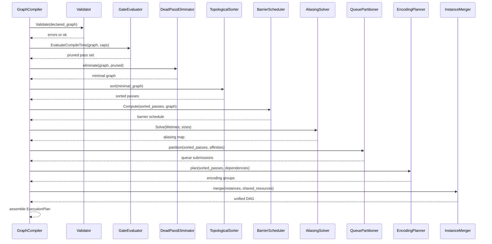

### Per-Frame Execution

Detailed frame execution showing parallel encoding and submission.

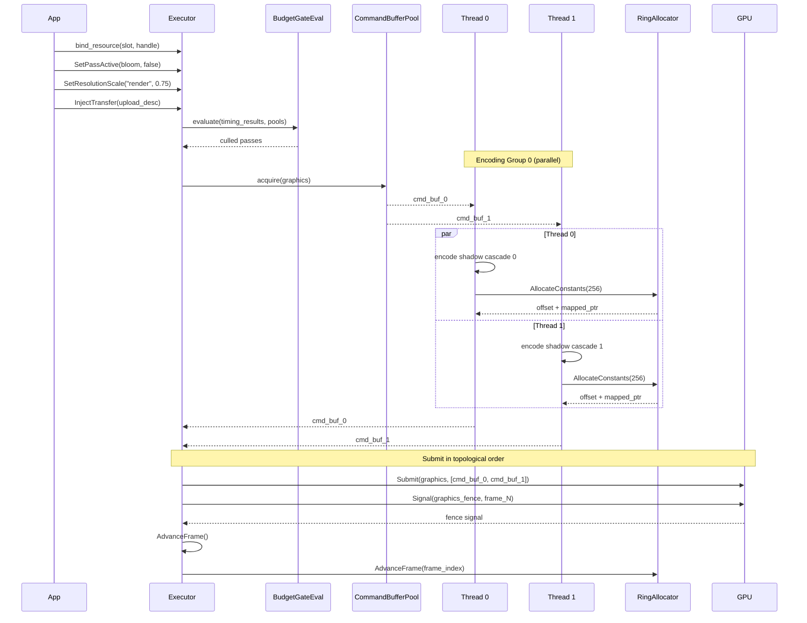

### Parallel Encoding

How encoding groups map to threads.

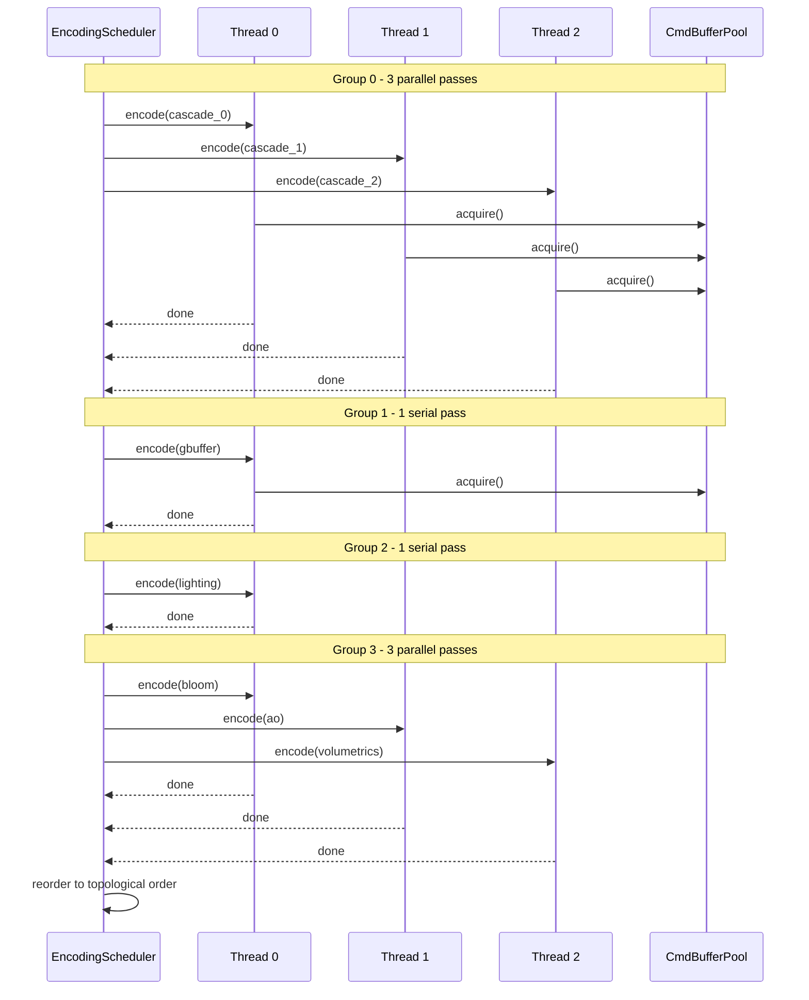

### Streaming Fault Resolution

How a residency fault flows through the system across two frames.

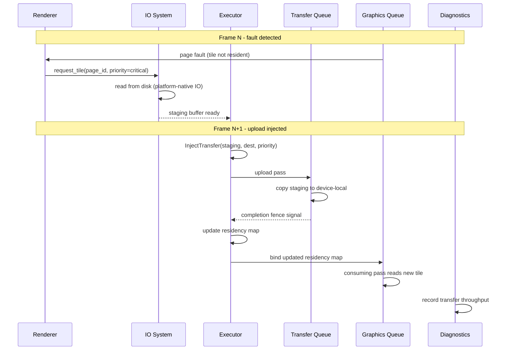
