# Render Graph Class and Sequence Diagrams

Class diagrams for each module and sequence diagrams showing inter-module interactions.
Companion to [render-graph-design.md](render-graph-design.md).

---

## Contents

- [Module Class Diagrams](#module-class-diagrams)
  - [1. Core Types](#1-core-types)
  - [2. Graph Builder](#2-graph-builder)
  - [3. Graph Compiler](#3-graph-compiler)
  - [4. Resource System](#4-resource-system)
  - [5. Synchronization Engine](#5-synchronization-engine)
  - [6. Gating System](#6-gating-system)
  - [7. Execution Engine](#7-execution-engine)
  - [8. Diagnostics](#8-diagnostics)
  - [9. GPU Backend](#9-gpu-backend)
- [Cross-Module Relationships](#cross-module-relationships)
- [Sequence Diagrams](#sequence-diagrams)
  - [Full Lifecycle](#full-lifecycle)
  - [Compilation Pipeline](#compilation-pipeline)
  - [Per-Frame Execution](#per-frame-execution)
  - [Parallel Encoding](#parallel-encoding)
  - [Streaming Fault Resolution](#streaming-fault-resolution)

---

## Module Class Diagrams

### 1. Core Types

`harmonius::rg` — Shared vocabulary types with no business logic.

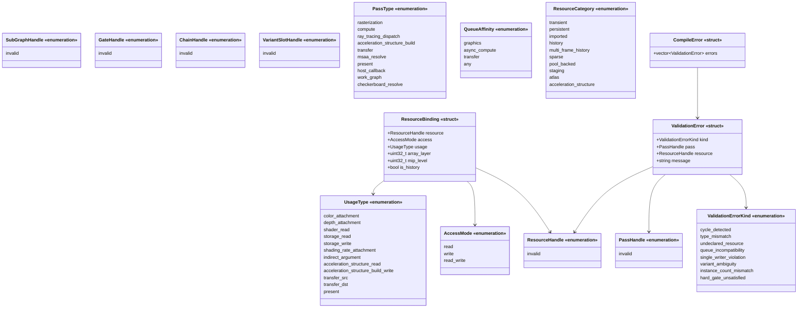

### 2. Graph Builder

`harmonius::rg::builder` — Declarative graph construction.

```mermaid
classDiagram
    class GraphBuilder {
        +GraphBuilder(CapabilityDescriptor caps)
        +add_pass(PassDescriptor) PassHandle
        +begin_chain(string_view) ChainHandle
        +add_chain_step(ChainHandle, PassDescriptor) PassHandle
        +end_chain(ChainHandle) void
        +declare_variant_slot(string_view) VariantSlotHandle
        +add_variant(VariantSlotHandle, string_view, PassDescriptor) PassHandle
        +declare_subgraph_template(string_view, SubGraphDescriptor) SubGraphHandle
        +instantiate_subgraph(SubGraphHandle, uint32_t, span) void
        +declare_transient(TransientResourceDesc) ResourceHandle
        +declare_persistent(PersistentResourceDesc) ResourceHandle
        +declare_imported(ImportedResourceDesc) ResourceHandle
        +declare_history(HistoryResourceDesc) ResourceHandle
        +declare_multi_frame_history(MultiFrameHistoryDesc) ResourceHandle
        +declare_sparse(SparseResourceDesc) ResourceHandle
        +declare_pool(PoolResourceDesc) ResourceHandle
        +declare_staging(StagingBufferDesc) ResourceHandle
        +declare_atlas(AtlasResourceDesc) ResourceHandle
        +declare_acceleration_structure(AccelStructDesc) ResourceHandle
        +attach_capability_gate(PassHandle, CapabilityGateDesc) GateHandle
        +attach_budget_gate(PassHandle, BudgetGateDesc) GateHandle
        +declare_fallback_chain(string_view, span) GateHandle
        +add_ordering_edge(PassHandle, PassHandle) void
        +attach_timestamp_query(PassHandle, string_view) void
        +attach_statistics_query(PassHandle, string_view) void
        +mark_debug_overlay(PassHandle) void
        +build() expected~DeclaredGraph, CompileError~
    }
    class DeclaredGraph {
        +passes() span~PassDescriptor~
        +pass_count() uint32_t
        +resource_count() uint32_t
        -Impl impl_
    }
    class PassDescriptor {
        +string_view name
        +PassType type
        +QueueAffinity queue
        +vector~ResourceBinding~ inputs
        +vector~ResourceBinding~ outputs
        +bool conditional
        +optional~RenderArea~ render_area
        +vector~string_view~ tags
        +float estimated_cost_ms
        +uint32_t priority
        +move_only_function execute
    }
    class SubGraphDescriptor {
        +string_view name
        +uint32_t max_instances
        +vector~PassDescriptor~ passes
        +vector~SubGraphParamSlot~ param_slots
    }
    class SubGraphBindings {
        +vector~ResourceHandle~ exclusive_resources
        +vector~ResourceHandle~ shared_resources
        +uint32_t target_array_layer
    }
    class TransientResourceDesc {
        +string_view name
        +Format format
        +uint32_t width
        +uint32_t height
        +uint32_t depth
        +uint32_t mip_levels
        +uint32_t array_layers
        +SampleCount samples
        +optional~string_view~ resolution_param
    }
    class PersistentResourceDesc {
        +string_view name
        +Format format
        +uint32_t width
        +uint32_t height
        +uint32_t depth
        +uint32_t array_layers
        +optional~ActiveExtentDesc~ active_extent
    }
    class HistoryResourceDesc {
        +string_view name
        +Format format
        +uint32_t width
        +uint32_t height
        +optional~string_view~ resolution_param
    }
    class MultiFrameHistoryDesc {
        +string_view name
        +Format format
        +uint32_t width
        +uint32_t height
        +uint32_t history_depth
        +optional~string_view~ resolution_param
    }
    class ImportedResourceDesc {
        +string_view name
        +gpu_ResourceHandle external_handle
        +AccessMode initial_access
        +UsageType initial_usage
    }
    class SparseResourceDesc {
        +string_view name
        +Format format
        +uint32_t width
        +uint32_t height
        +uint32_t tile_width
        +uint32_t tile_height
    }
    class PoolResourceDesc {
        +string_view name
        +Format format
        +uint32_t element_width
        +uint32_t element_height
        +uint32_t max_elements
        +move_only_function eviction_callback
    }
    class StagingBufferDesc {
        +string_view name
        +uint64_t size_bytes
    }
    class AtlasResourceDesc {
        +string_view name
        +Format format
        +uint32_t width
        +uint32_t height
        +uint32_t tile_size
    }
    class AccelStructDesc {
        +string_view name
        +ResourceCategory category
        +bool has_opacity_micromap
    }
    class ActiveExtentDesc {
        +uint32_t max_layers
        +uint32_t max_width
        +uint32_t max_height
    }
    class SubGraphParamSlot {
        +string_view name
        +bool is_shared
    }
    class RenderArea {
        +uint32_t x
        +uint32_t y
        +uint32_t width
        +uint32_t height
        +bool is_per_frame_binding
    }

    GraphBuilder --> DeclaredGraph : produces
    GraphBuilder --> PassDescriptor : accepts
    GraphBuilder --> SubGraphDescriptor : accepts
    GraphBuilder --> TransientResourceDesc : accepts
    GraphBuilder --> PersistentResourceDesc : accepts
    GraphBuilder --> ImportedResourceDesc : accepts
    GraphBuilder --> HistoryResourceDesc : accepts
    GraphBuilder --> MultiFrameHistoryDesc : accepts
    GraphBuilder --> SparseResourceDesc : accepts
    GraphBuilder --> PoolResourceDesc : accepts
    GraphBuilder --> StagingBufferDesc : accepts
    GraphBuilder --> AtlasResourceDesc : accepts
    GraphBuilder --> AccelStructDesc : accepts
    DeclaredGraph *-- PassDescriptor
    PassDescriptor --> ResourceBinding
    PassDescriptor --> RenderArea
    SubGraphDescriptor *-- PassDescriptor
    SubGraphDescriptor *-- SubGraphParamSlot
    PersistentResourceDesc --> ActiveExtentDesc
    AccelStructDesc --> ResourceCategory
```

### 3. Graph Compiler

`harmonius::rg::compiler` — Nine-stage DAG optimization pipeline.

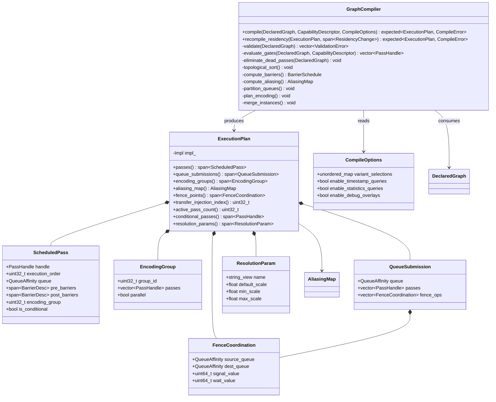

### 4. Resource System

`harmonius::rg::resource` — Lifetime analysis, aliasing, pools, ring buffers.

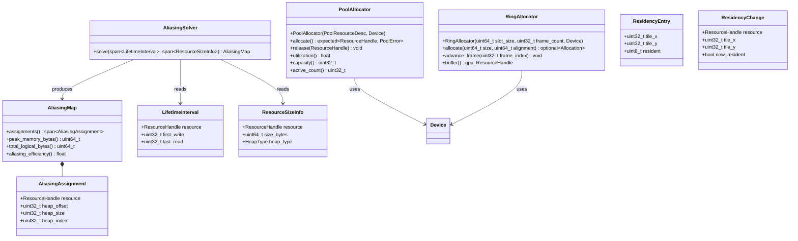

### 5. Synchronization Engine

`harmonius::rg::sync` — Barriers, layout transitions, timeline fences.

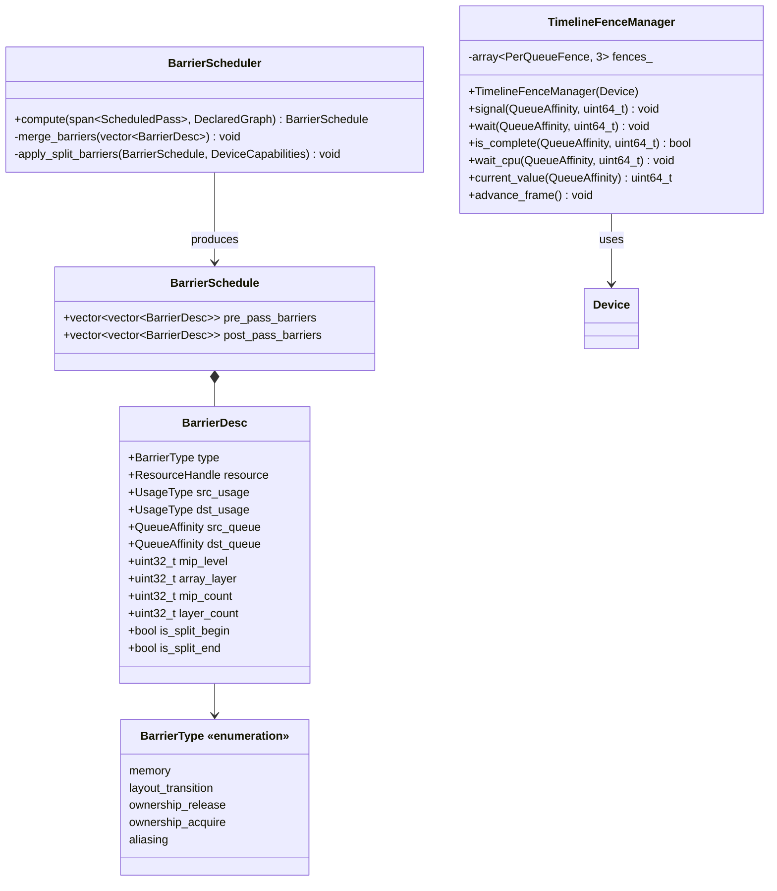

### 6. Gating System

`harmonius::rg::gate` — Compile-time and runtime pass gating.

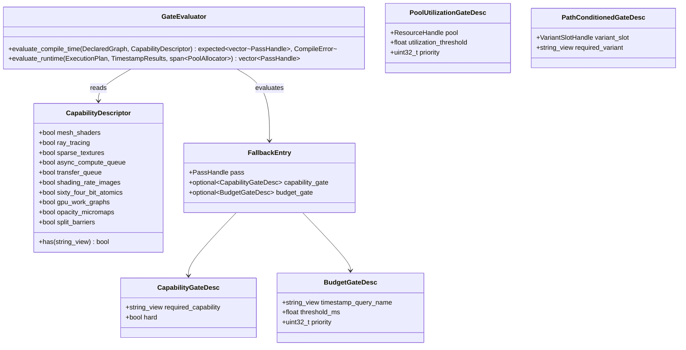

### 7. Execution Engine

`harmonius::rg::exec` — Per-frame binding, encoding, submission.

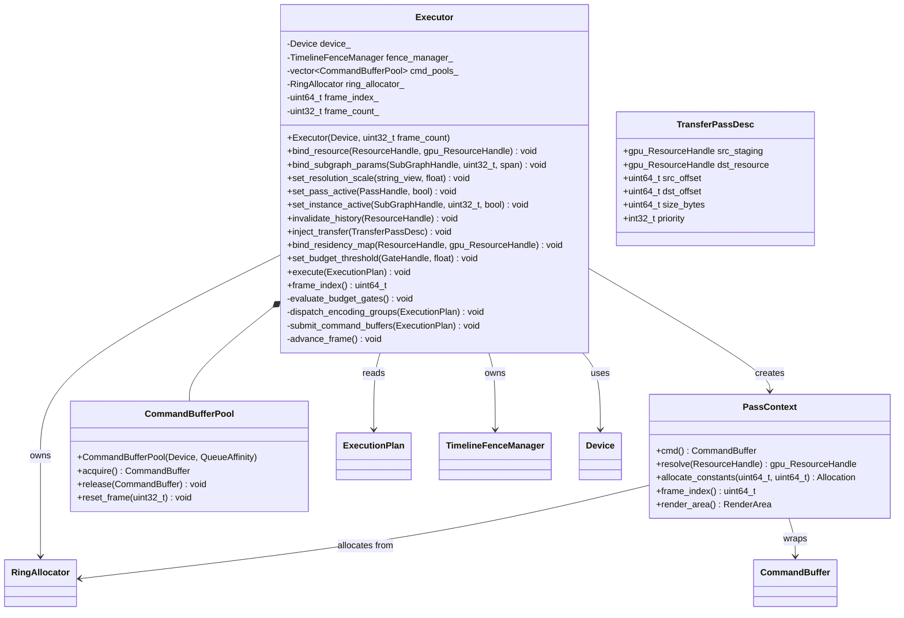

### 8. Diagnostics

`harmonius::rg::diag` — GPU profiling and memory metrics.

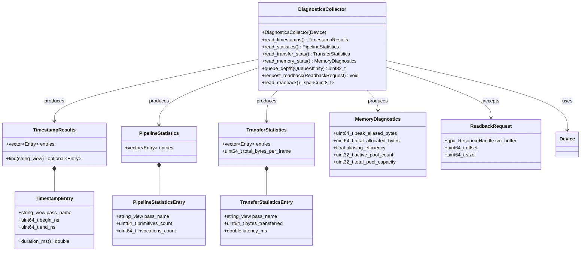

### 9. GPU Backend

`harmonius::gpu` — Concrete device, command buffer, and command pool types selected at compile
time. Interface contracts are defined as C++20 concepts (`GpuDevice`, `GpuCommandBuffer`,
`GpuCommandPool`) and enforced via `static_assert`. No virtual dispatch — one backend is compiled
per binary. See the dedicated GPU backend design documents:

- [gpu-backend-interface.md](gpu-backend-interface.md) — concepts, types, and cross-backend
  compatibility
- [gpu-backend-d3d12.md](gpu-backend-d3d12.md) — Direct3D 12 (Agility SDK 1.619+, SM 6.9)
- [gpu-backend-vulkan.md](gpu-backend-vulkan.md) — Vulkan 1.4
- [gpu-backend-metal.md](gpu-backend-metal.md) — Metal 4

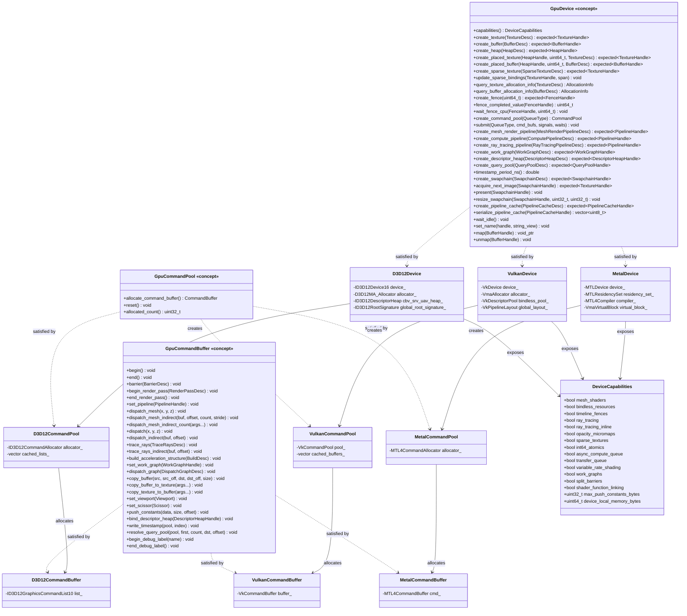

---

## Cross-Module Relationships

How the nine modules depend on each other at the class level.

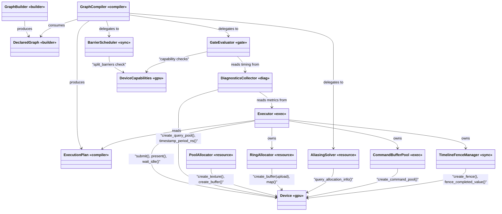

### Render Graph to GPU Backend Type Mapping

How render graph types translate into GPU backend types at the boundary between the two layers.

| Render Graph Type | GPU Backend Type | Translation Point |
|------------------|-----------------|-------------------|
| `rg::QueueAffinity` | `gpu::QueueType` | Direct 1:1 enum mapping (`graphics` → `graphics`, etc.) |
| `rg::UsageType` | `gpu::PipelineStage` + `gpu::ResourceAccess` + `gpu::TextureLayout` | `BarrierScheduler` performs the multi-field translation |
| `rg::sync::BarrierDesc` | `gpu::BarrierDesc` (containing `gpu::TextureBarrier` / `gpu::BufferBarrier` / `gpu::GlobalBarrier`) | Synchronization engine translates at compile time |
| `rg::builder::TransientResourceDesc` | `gpu::TextureDesc` or `gpu::BufferDesc` | Resource system maps format, dimensions, usage flags |
| `rg::builder::PassDescriptor` (execute callback) | `gpu::CommandBuffer` method calls | `PassContext::cmd()` exposes the command buffer |
| `rg::compiler::FenceCoordination` | `gpu::FenceSignal` + `gpu::FenceWait` in `gpu::Device::submit()` | `TimelineFenceManager` translates fence operations |
| `rg::resource::AliasingAssignment` | `gpu::Device::create_placed_texture()` / `create_placed_buffer()` at heap offset | Resource system creates placed resources from assignments |
| `rg::gate::CapabilityDescriptor` | `gpu::DeviceCapabilities` | 1:1 field mapping — populated from `gpu::Device::capabilities()` at init |

---

## Sequence Diagrams

### Full Lifecycle

Build, compile, then execute across multiple frames.

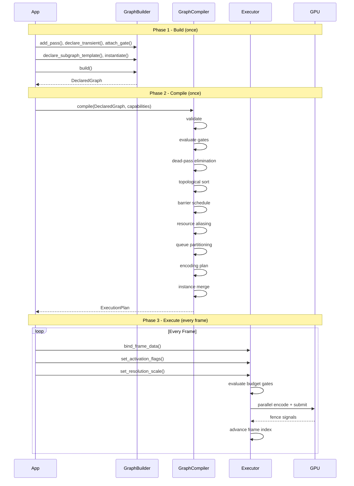

### Compilation Pipeline

Internal detail of the nine compiler stages.

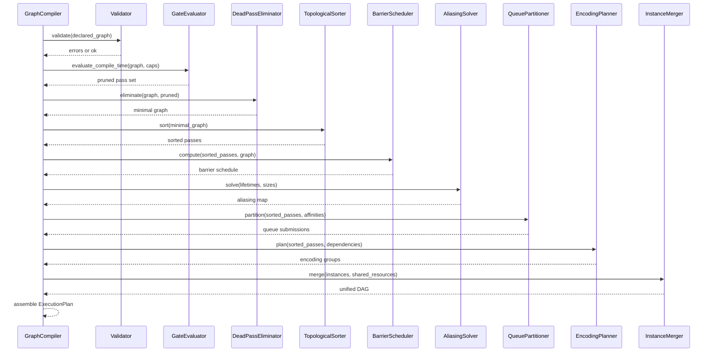

### Per-Frame Execution

Detailed frame execution showing parallel encoding and submission.

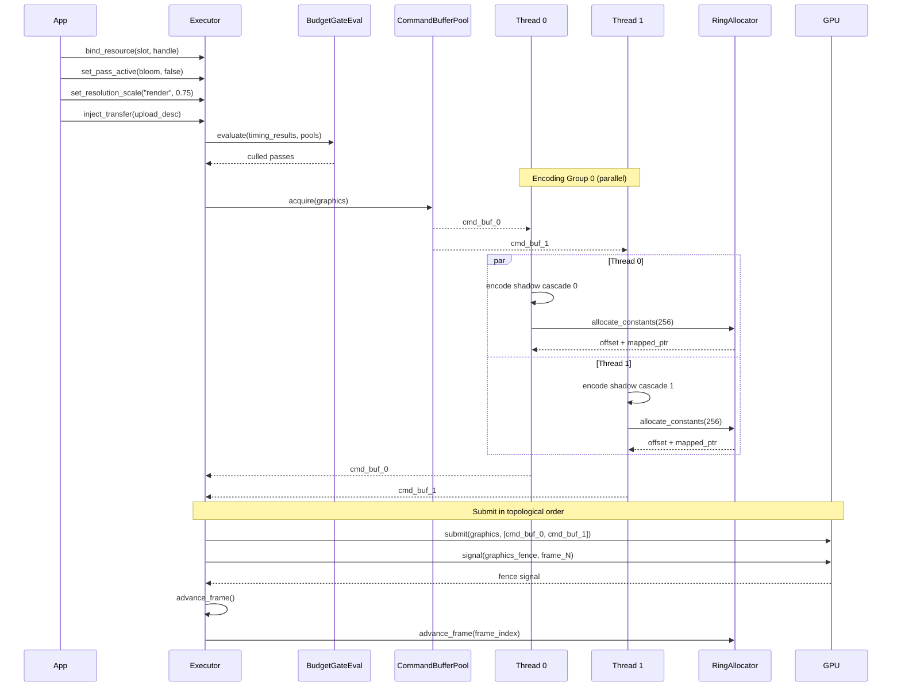

### Parallel Encoding

How encoding groups map to threads.

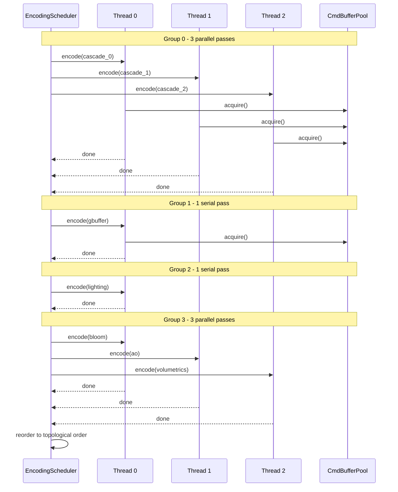

### Streaming Fault Resolution

How a residency fault flows through the system across two frames.

